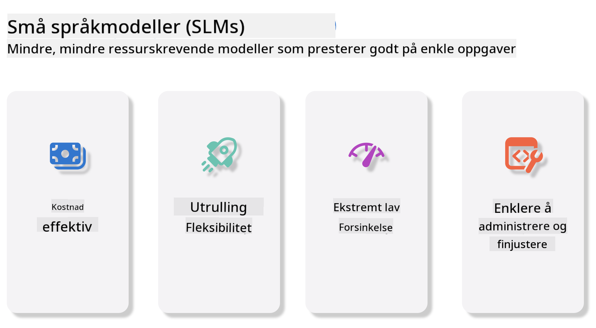
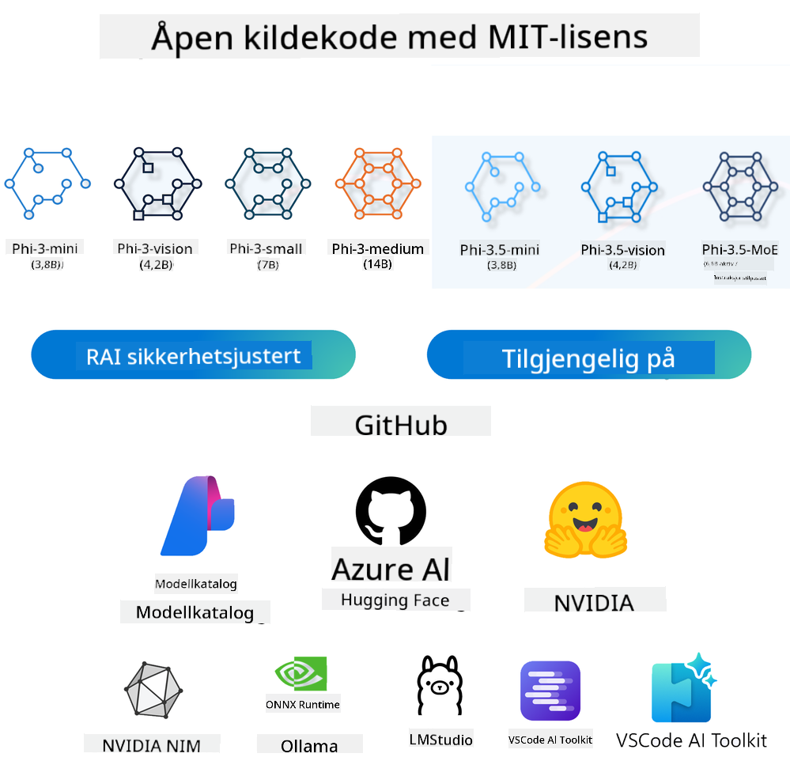

<!--
CO_OP_TRANSLATOR_METADATA:
{
  "original_hash": "124ad36cfe96f74038811b6e2bb93e9d",
  "translation_date": "2025-07-09T18:37:53+00:00",
  "source_file": "19-slm/README.md",
  "language_code": "no"
}
-->
# Introduksjon til Små Språkmodeller for Generativ AI for Nybegynnere  
Generativ AI er et spennende felt innen kunstig intelligens som fokuserer på å lage systemer som kan generere nytt innhold. Dette innholdet kan variere fra tekst og bilder til musikk og til og med hele virtuelle miljøer. En av de mest spennende anvendelsene av generativ AI er innen språkmodeller.

## Hva er Små Språkmodeller?  

En Små Språkmodell (SLM) er en nedskalert variant av en stor språkmodell (LLM), som benytter mange av de samme arkitektoniske prinsippene og teknikkene som LLM-er, men med et betydelig redusert behov for beregningsressurser.  

SLM-er er en undergruppe av språkmodeller designet for å generere menneskelignende tekst. I motsetning til sine større motstykker, som GPT-4, er SLM-er mer kompakte og effektive, noe som gjør dem ideelle for applikasjoner der beregningsressurser er begrenset. Til tross for sin mindre størrelse kan de fortsatt utføre en rekke oppgaver. Vanligvis bygges SLM-er ved å komprimere eller destillere LLM-er, med mål om å beholde en betydelig del av den opprinnelige modellens funksjonalitet og språklige evner. Denne reduksjonen i modellstørrelse reduserer den totale kompleksiteten, noe som gjør SLM-er mer effektive både når det gjelder minnebruk og beregningsbehov. Til tross for disse optimaliseringene kan SLM-er fortsatt utføre et bredt spekter av oppgaver innen naturlig språkbehandling (NLP):

- Tekstgenerering: Lage sammenhengende og kontekstuelt relevante setninger eller avsnitt.  
- Tekstfullføring: Forutsi og fullføre setninger basert på en gitt prompt.  
- Oversettelse: Konvertere tekst fra ett språk til et annet.  
- Oppsummering: Forkorte lange tekster til kortere, mer lettfordøyelige sammendrag.  

Selv om det kan være noen kompromisser i ytelse eller dybde i forståelsen sammenlignet med deres større motparter.  

## Hvordan fungerer Små Språkmodeller?  
SLM-er trenes på store mengder tekstdata. Under treningen lærer de mønstre og strukturer i språket, noe som gjør dem i stand til å generere tekst som både er grammatisk korrekt og kontekstuelt passende. Treningsprosessen innebærer:

- Datainnsamling: Samle store datasett med tekst fra ulike kilder.  
- Forbehandling: Rense og organisere dataene for å gjøre dem egnet for trening.  
- Trening: Bruke maskinlæringsalgoritmer for å lære modellen å forstå og generere tekst.  
- Finjustering: Justere modellen for å forbedre ytelsen på spesifikke oppgaver.  

Utviklingen av SLM-er samsvarer med det økende behovet for modeller som kan distribueres i ressursbegrensede miljøer, som mobile enheter eller edge computing-plattformer, hvor fullskala LLM-er kan være upraktiske på grunn av deres store ressursbehov. Ved å fokusere på effektivitet balanserer SLM-er ytelse med tilgjengelighet, noe som muliggjør bredere anvendelse på tvers av ulike domener.



## Læringsmål  

I denne leksjonen ønsker vi å introdusere kunnskap om SLM og kombinere det med Microsoft Phi-3 for å lære om ulike scenarier innen tekstinnhold, visjon og MoE.

Ved slutten av denne leksjonen skal du kunne svare på følgende spørsmål:

- Hva er SLM  
- Hva er forskjellen mellom SLM og LLM  
- Hva er Microsoft Phi-3/3.5-familien  
- Hvordan gjøre inferens med Microsoft Phi-3/3.5-familien  

Klar? La oss sette i gang.

## Forskjellene mellom Store Språkmodeller (LLMs) og Små Språkmodeller (SLMs)  

Både LLM-er og SLM-er bygger på grunnleggende prinsipper innen probabilistisk maskinlæring, og følger lignende tilnærminger i arkitektonisk design, treningsmetodikk, datagenereringsprosesser og modellevaluering. Likevel er det flere viktige faktorer som skiller disse to modelltypene.

## Anvendelser av Små Språkmodeller  

SLM-er har et bredt spekter av bruksområder, inkludert:

- Chatboter: Gi kundestøtte og engasjere brukere i samtaler.  
- Innholdsproduksjon: Hjelpe forfattere med å generere ideer eller til og med utarbeide hele artikler.  
- Utdanning: Assistere studenter med skriveoppgaver eller språklæring.  
- Tilgjengelighet: Lage verktøy for personer med funksjonsnedsettelser, som tekst-til-tale-systemer.  

**Størrelse**  

En hovedforskjell mellom LLM-er og SLM-er ligger i modellens skala. LLM-er, som ChatGPT (GPT-4), kan bestå av anslagsvis 1,76 billioner parametere, mens åpne SLM-er som Mistral 7B er designet med betydelig færre parametere — omtrent 7 milliarder. Denne forskjellen skyldes hovedsakelig ulikheter i modellarkitektur og treningsprosesser. For eksempel bruker ChatGPT en selvoppmerksomhetsmekanisme innenfor en encoder-decoder-ramme, mens Mistral 7B benytter sliding window attention, som muliggjør mer effektiv trening i en decoder-only modell. Denne arkitektoniske variasjonen har stor betydning for modellens kompleksitet og ytelse.

**Forståelse**  

SLM-er er vanligvis optimalisert for ytelse innen spesifikke domener, noe som gjør dem svært spesialiserte, men potensielt begrenset i evnen til å gi bred kontekstuell forståelse på tvers av flere kunnskapsfelt. I kontrast søker LLM-er å simulere menneskelig intelligens på et mer omfattende nivå. Trenet på store, varierte datasett, er LLM-er designet for å prestere godt på tvers av ulike domener, og tilbyr større allsidighet og tilpasningsevne. Følgelig er LLM-er mer egnet for et bredere spekter av oppgaver, som naturlig språkbehandling og programmering.

**Beregning**  

Trening og distribusjon av LLM-er er ressurskrevende prosesser, som ofte krever betydelig beregningsinfrastruktur, inkludert store GPU-klynger. For eksempel kan trening av en modell som ChatGPT fra bunnen av kreve tusenvis av GPU-er over lengre tid. I kontrast er SLM-er, med sine færre parametere, mer tilgjengelige når det gjelder beregningsressurser. Modeller som Mistral 7B kan trenes og kjøres på lokale maskiner med moderate GPU-kapasiteter, selv om trening fortsatt krever flere timer på tvers av flere GPU-er.

**Skjevhet**  

Skjevhet er et kjent problem i LLM-er, hovedsakelig på grunn av naturen til treningsdataene. Disse modellene baserer seg ofte på rå, åpent tilgjengelig data fra internett, som kan underrepresentere eller feildokumentere visse grupper, introdusere feilaktig merking, eller reflektere språklige skjevheter påvirket av dialekter, geografiske variasjoner og grammatikkregler. I tillegg kan kompleksiteten i LLM-arkitekturer utilsiktet forsterke skjevheter, som kan gå ubemerket uten nøye finjustering. På den annen side, siden SLM-er trenes på mer begrensede, domene-spesifikke datasett, er de i utgangspunktet mindre utsatt for slike skjevheter, selv om de ikke er immune.

**Inferens**  

Den reduserte størrelsen på SLM-er gir dem en betydelig fordel når det gjelder inferenshastighet, noe som gjør at de kan generere resultater effektivt på lokal maskinvare uten behov for omfattende parallell behandling. I kontrast krever LLM-er, på grunn av sin størrelse og kompleksitet, ofte betydelige parallelle beregningsressurser for å oppnå akseptable inferenstider. Tilstedeværelsen av flere samtidige brukere senker også responstiden til LLM-er, spesielt ved storskala distribusjon.

Oppsummert, selv om både LLM-er og SLM-er deler et grunnleggende maskinlæringsgrunnlag, skiller de seg betydelig når det gjelder modellstørrelse, ressursbehov, kontekstuell forståelse, sårbarhet for skjevhet og inferenshastighet. Disse forskjellene gjenspeiler deres respektive egnethet for ulike bruksområder, hvor LLM-er er mer allsidige, men ressurskrevende, mens SLM-er tilbyr mer domene-spesifikk effektivitet med lavere beregningsbehov.

***Note：I dette kapitlet vil vi introdusere SLM ved å bruke Microsoft Phi-3 / 3.5 som eksempel.***

## Introduksjon til Phi-3 / Phi-3.5-familien  

Phi-3 / 3.5-familien retter seg hovedsakelig mot tekst-, visjons- og Agent (MoE) applikasjonsscenarier:

### Phi-3 / 3.5 Instruct  

Hovedsakelig for tekstgenerering, chatfullføring og innholdsinformasjonsekstraksjon, osv.

**Phi-3-mini**  

Den 3,8 milliarder parametere store språkmodellen er tilgjengelig på Microsoft Azure AI Studio, Hugging Face og Ollama. Phi-3-modellene presterer betydelig bedre enn språkmodeller av lik eller større størrelse på viktige benchmark-tester (se benchmark-tall nedenfor, høyere tall er bedre). Phi-3-mini overgår modeller som er dobbelt så store, mens Phi-3-small og Phi-3-medium overgår større modeller, inkludert GPT-3.5.

**Phi-3-small & medium**  

Med bare 7 milliarder parametere slår Phi-3-small GPT-3.5T på en rekke språk-, resonnement-, koding- og matematikkbenchmarks.

Phi-3-medium med 14 milliarder parametere fortsetter denne trenden og overgår Gemini 1.0 Pro.

**Phi-3.5-mini**  

Vi kan se på den som en oppgradering av Phi-3-mini. Selv om antall parametere er uendret, forbedrer den evnen til å støtte flere språk (støtter 20+ språk: Arabisk, Kinesisk, Tsjekkisk, Dansk, Nederlandsk, Engelsk, Finsk, Fransk, Tysk, Hebraisk, Ungarsk, Italiensk, Japansk, Koreansk, Norsk, Polsk, Portugisisk, Russisk, Spansk, Svensk, Thai, Tyrkisk, Ukrainsk) og legger til sterkere støtte for lang kontekst.

Phi-3.5-mini med 3,8 milliarder parametere overgår språkmodeller av samme størrelse og er på nivå med modeller som er dobbelt så store.

### Phi-3 / 3.5 Vision  

Vi kan tenke på Instruct-modellen til Phi-3/3.5 som Phis evne til å forstå, og Vision er det som gir Phi øyne til å forstå verden.

**Phi-3-Vision**  

Phi-3-vision, med bare 4,2 milliarder parametere, fortsetter denne trenden og overgår større modeller som Claude-3 Haiku og Gemini 1.0 Pro V på generelle visuelle resonnementoppgaver, OCR, samt tabell- og diagramforståelse.

**Phi-3.5-Vision**  

Phi-3.5-Vision er også en oppgradering av Phi-3-Vision, og legger til støtte for flere bilder. Du kan se på det som en forbedring i visjon; ikke bare kan du se bilder, men også videoer.

Phi-3.5-vision overgår større modeller som Claude-3.5 Sonnet og Gemini 1.5 Flash på OCR, tabell- og diagramforståelsesoppgaver, og er på nivå med dem på generelle visuelle kunnskapsresonnementoppgaver. Støtter multi-frame input, altså resonnement på flere innkommende bilder.

### Phi-3.5-MoE  

***Mixture of Experts (MoE)*** gjør det mulig å forhåndstrene modeller med langt mindre beregningskraft, noe som betyr at du dramatisk kan skalere opp modell- eller datasettstørrelsen med samme beregningsbudsjett som en tett modell. Spesielt bør en MoE-modell oppnå samme kvalitet som sin tette motpart mye raskere under forhåndstrening.

Phi-3.5-MoE består av 16x3,8 milliarder ekspertmoduler. Phi-3.5-MoE med bare 6,6 milliarder aktive parametere oppnår et lignende nivå av resonnement, språkforståelse og matematikk som mye større modeller.

Vi kan bruke Phi-3/3.5-familien basert på ulike scenarier. I motsetning til LLM kan du distribuere Phi-3/3.5-mini eller Phi-3/3.5-Vision på edge-enheter.

## Hvordan bruke Phi-3/3.5-familie modeller  

Vi ønsker å bruke Phi-3/3.5 i ulike scenarier. Neste steg er å bruke Phi-3/3.5 basert på forskjellige situasjoner.



### Forskjeller i inferens via Cloud API  

**GitHub Models**  

GitHub Models er den mest direkte måten. Du kan raskt få tilgang til Phi-3/3.5-Instruct-modellen gjennom GitHub Models. Kombinert med Azure AI Inference SDK / OpenAI SDK kan du få tilgang til API-et via kode for å fullføre Phi-3/3.5-Instruct-kall. Du kan også teste ulike resultater gjennom Playground.

- Demo: Sammenligning av effektene til Phi-3-mini og Phi-3.5-mini i kinesiske scenarier


**Azure AI Studio**  

Eller hvis vi ønsker å bruke visjons- og MoE-modellene, kan du bruke Azure AI Studio for å fullføre kallene. Hvis du er interessert, kan du lese Phi-3 Cookbook for å lære hvordan du kaller Phi-3/3.5 Instruct, Vision, MoE gjennom Azure AI Studio [Klikk denne lenken](https://github.com/microsoft/Phi-3CookBook/blob/main/md/02.QuickStart/AzureAIStudio_QuickStart.md?WT.mc_id=academic-105485-koreyst)

**NVIDIA NIM**  

I tillegg til skybaserte Model Catalog-løsninger levert av Azure og GitHub, kan du også bruke [NVIDIA NIM](https://developer.nvidia.com/nim?WT.mc_id=academic-105485-koreyst) for å fullføre relaterte kall. Du kan besøke NVIDIA NIM for å utføre API-kall for Phi-3/3.5-familien. NVIDIA NIM (NVIDIA Inference Microservices) er et sett med akselererte inferens-mikrotjenester designet for å hjelpe utviklere med å distribuere AI-modeller effektivt på tvers av ulike miljøer, inkludert skyer, datasentre og arbeidsstasjoner.

Her er noen nøkkelfunksjoner ved NVIDIA NIM:

- **Enkel distribusjon:** NIM tillater distribusjon av AI-modeller med en enkelt kommando, noe som gjør det enkelt å integrere i eksisterende arbeidsflyter.  
- **Optimalisert ytelse:** Den utnytter NVIDIA sine forhåndsoptimaliserte inferensmotorer, som TensorRT og TensorRT-LLM, for å sikre lav ventetid og høy gjennomstrømning.  
- **Skalerbarhet:** NIM støtter autoskalering på Kubernetes, noe som gjør det i stand til å håndtere varierende arbeidsmengder effektivt.
- **Sikkerhet og kontroll:** Organisasjoner kan beholde kontrollen over sine data og applikasjoner ved å selvhoste NIM-mikrotjenester på egen administrert infrastruktur.  
- **Standard API-er:** NIM tilbyr bransjestandard API-er, noe som gjør det enkelt å bygge og integrere AI-applikasjoner som chatboter, AI-assistenter og mer.

NIM er en del av NVIDIA AI Enterprise, som har som mål å forenkle distribusjon og drift av AI-modeller, og sikre at de kjører effektivt på NVIDIA GPU-er.

- Demo: Bruke Nvidia NIM for å kalle Phi-3.5-Vision-API [[Klikk på denne lenken](../../../19-slm/python/Phi-3-Vision-Nividia-NIM.ipynb)]


### Inference Phi-3/3.5 i lokal miljø  
Inference i forhold til Phi-3, eller en hvilken som helst språkmodell som GPT-3, refererer til prosessen med å generere svar eller prediksjoner basert på input den mottar. Når du gir en prompt eller et spørsmål til Phi-3, bruker den sitt trente nevrale nettverk for å utlede det mest sannsynlige og relevante svaret ved å analysere mønstre og sammenhenger i dataene den er trent på.

**Hugging Face Transformer**  
Hugging Face Transformers er et kraftig bibliotek designet for naturlig språkbehandling (NLP) og andre maskinlæringsoppgaver. Her er noen viktige punkter om det:

1. **Fortrente modeller:** Det tilbyr tusenvis av forhåndstrente modeller som kan brukes til ulike oppgaver som tekstklassifisering, navngitt entity-gjenkjenning, spørsmål og svar, oppsummering, oversettelse og tekstgenerering.

2. **Rammeverksinteroperabilitet:** Biblioteket støtter flere dyp læringsrammeverk, inkludert PyTorch, TensorFlow og JAX. Dette gjør det mulig å trene en modell i ett rammeverk og bruke den i et annet.

3. **Multimodale muligheter:** I tillegg til NLP støtter Hugging Face Transformers også oppgaver innen datavisjon (f.eks. bildeklassifisering, objektgjenkjenning) og lydbehandling (f.eks. talegjenkjenning, lydklassifisering).

4. **Brukervennlighet:** Biblioteket tilbyr API-er og verktøy for enkel nedlasting og finjustering av modeller, noe som gjør det tilgjengelig for både nybegynnere og eksperter.

5. **Fellesskap og ressurser:** Hugging Face har et levende fellesskap og omfattende dokumentasjon, veiledninger og guider for å hjelpe brukere i gang og få mest mulig ut av biblioteket.  
[offisiell dokumentasjon](https://huggingface.co/docs/transformers/index?WT.mc_id=academic-105485-koreyst) eller deres [GitHub-repositorium](https://github.com/huggingface/transformers?WT.mc_id=academic-105485-koreyst).

Dette er den mest brukte metoden, men den krever også GPU-akselerasjon. Scenarier som Vision og MoE krever mye beregninger, noe som blir svært begrenset på CPU hvis de ikke er kvantisert.


- Demo: Bruke Transformer for å kalle Phi-3.5-Instruct [Klikk på denne lenken](../../../19-slm/python/phi35-instruct-demo.ipynb)

- Demo: Bruke Transformer for å kalle Phi-3.5-Vision [Klikk på denne lenken](../../../19-slm/python/phi35-vision-demo.ipynb)

- Demo: Bruke Transformer for å kalle Phi-3.5-MoE [Klikk på denne lenken](../../../19-slm/python/phi35_moe_demo.ipynb)

**Ollama**  
[Ollama](https://ollama.com/?WT.mc_id=academic-105485-koreyst) er en plattform designet for å gjøre det enklere å kjøre store språkmodeller (LLMs) lokalt på maskinen din. Den støtter ulike modeller som Llama 3.1, Phi 3, Mistral og Gemma 2, blant andre. Plattformen forenkler prosessen ved å samle modellvekter, konfigurasjon og data i en enkelt pakke, noe som gjør det mer tilgjengelig for brukere å tilpasse og lage egne modeller. Ollama er tilgjengelig for macOS, Linux og Windows. Det er et flott verktøy hvis du ønsker å eksperimentere med eller distribuere LLM-er uten å være avhengig av skyløsninger. Ollama er den mest direkte metoden, du trenger bare å kjøre følgende kommando.


```bash

ollama run phi3.5

```


**ONNX Runtime for GenAI**

[ONNX Runtime](https://github.com/microsoft/onnxruntime-genai?WT.mc_id=academic-105485-koreyst) er en plattformuavhengig akselerator for inferens og trening av maskinlæringsmodeller. ONNX Runtime for Generative AI (GENAI) er et kraftig verktøy som hjelper deg å kjøre generative AI-modeller effektivt på tvers av ulike plattformer.

## Hva er ONNX Runtime?  
ONNX Runtime er et åpen kildekode-prosjekt som muliggjør høyytelses inferens av maskinlæringsmodeller. Det støtter modeller i Open Neural Network Exchange (ONNX)-formatet, som er en standard for representasjon av maskinlæringsmodeller. ONNX Runtime-inferens kan gi raskere kundeopplevelser og lavere kostnader, og støtter modeller fra dyp læringsrammeverk som PyTorch og TensorFlow/Keras, samt klassiske maskinlæringsbiblioteker som scikit-learn, LightGBM, XGBoost med flere. ONNX Runtime er kompatibel med ulike maskinvare, drivere og operativsystemer, og gir optimal ytelse ved å utnytte maskinvareakseleratorer der det er mulig, sammen med grafoptimaliseringer og transformasjoner.

## Hva er Generativ AI?  
Generativ AI refererer til AI-systemer som kan generere nytt innhold, som tekst, bilder eller musikk, basert på dataene de er trent på. Eksempler inkluderer språkmodeller som GPT-3 og bilde-genereringsmodeller som Stable Diffusion. ONNX Runtime for GenAI-biblioteket tilbyr den generative AI-løkken for ONNX-modeller, inkludert inferens med ONNX Runtime, logitsbehandling, søk og sampling, samt KV-cache-håndtering.

## ONNX Runtime for GENAI  
ONNX Runtime for GENAI utvider funksjonaliteten til ONNX Runtime for å støtte generative AI-modeller. Her er noen viktige funksjoner:

- **Bred plattformstøtte:** Den fungerer på ulike plattformer, inkludert Windows, Linux, macOS, Android og iOS.  
- **Modellstøtte:** Støtter mange populære generative AI-modeller, som LLaMA, GPT-Neo, BLOOM og flere.  
- **Ytelsesoptimalisering:** Inkluderer optimaliseringer for ulike maskinvareakseleratorer som NVIDIA GPU-er, AMD GPU-er med mer.  
- **Brukervennlighet:** Tilbyr API-er for enkel integrasjon i applikasjoner, slik at du kan generere tekst, bilder og annet innhold med minimal kode.  
- Brukere kan kalle en høy-nivå generate()-metode, eller kjøre hver iterasjon av modellen i en løkke, generere ett token om gangen, og eventuelt oppdatere generasjonsparametere inne i løkken.  
- ONNX Runtime støtter også greedy/beam search og TopP, TopK sampling for å generere token-sekvenser, samt innebygd logitsbehandling som repeteringsstraffer. Du kan også enkelt legge til egendefinert scoring.

## Komme i gang  
For å komme i gang med ONNX Runtime for GENAI, kan du følge disse stegene:

### Installer ONNX Runtime:  
```Python
pip install onnxruntime
```  
### Installer Generative AI Extensions:  
```Python
pip install onnxruntime-genai
```

### Kjør en modell: Her er et enkelt eksempel i Python:  
```Python
import onnxruntime_genai as og

model = og.Model('path_to_your_model.onnx')

tokenizer = og.Tokenizer(model)

input_text = "Hello, how are you?"

input_tokens = tokenizer.encode(input_text)

output_tokens = model.generate(input_tokens)

output_text = tokenizer.decode(output_tokens)

print(output_text) 
```  
### Demo: Bruke ONNX Runtime GenAI for å kalle Phi-3.5-Vision  


```python

import onnxruntime_genai as og

model_path = './Your Phi-3.5-vision-instruct ONNX Path'

img_path = './Your Image Path'

model = og.Model(model_path)

processor = model.create_multimodal_processor()

tokenizer_stream = processor.create_stream()

text = "Your Prompt"

prompt = "<|user|>\n"

prompt += "<|image_1|>\n"

prompt += f"{text}<|end|>\n"

prompt += "<|assistant|>\n"

image = og.Images.open(img_path)

inputs = processor(prompt, images=image)

params = og.GeneratorParams(model)

params.set_inputs(inputs)

params.set_search_options(max_length=3072)

generator = og.Generator(model, params)

while not generator.is_done():

    generator.compute_logits()
    
    generator.generate_next_token()

    new_token = generator.get_next_tokens()[0]
    
    code += tokenizer_stream.decode(new_token)
    
    print(tokenizer_stream.decode(new_token), end='', flush=True)

```


**Andre**

I tillegg til ONNX Runtime og Ollama referansemetoder, kan vi også fullføre referansen for kvantitative modeller basert på modellreferansemetoder levert av ulike produsenter. For eksempel Apple MLX-rammeverket med Apple Metal, Qualcomm QNN med NPU, Intel OpenVINO med CPU/GPU, osv. Du kan også finne mer innhold i [Phi-3 Cookbook](https://github.com/microsoft/phi-3cookbook?WT.mc_id=academic-105485-koreyst)


## Mer

Vi har lært det grunnleggende om Phi-3/3.5-familien, men for å lære mer om SLM trenger vi mer kunnskap. Du finner svarene i Phi-3 Cookbook. Hvis du vil lære mer, besøk gjerne [Phi-3 Cookbook](https://github.com/microsoft/phi-3cookbook?WT.mc_id=academic-105485-koreyst).

**Ansvarsfraskrivelse**:  
Dette dokumentet er oversatt ved hjelp av AI-oversettelsestjenesten [Co-op Translator](https://github.com/Azure/co-op-translator). Selv om vi streber etter nøyaktighet, vennligst vær oppmerksom på at automatiske oversettelser kan inneholde feil eller unøyaktigheter. Det opprinnelige dokumentet på originalspråket skal anses som den autoritative kilden. For kritisk informasjon anbefales profesjonell menneskelig oversettelse. Vi er ikke ansvarlige for eventuelle misforståelser eller feiltolkninger som oppstår ved bruk av denne oversettelsen.