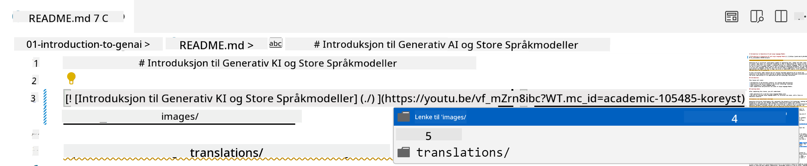
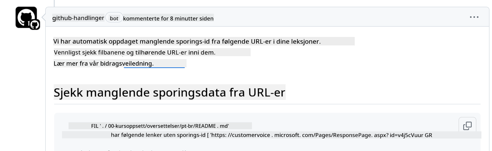
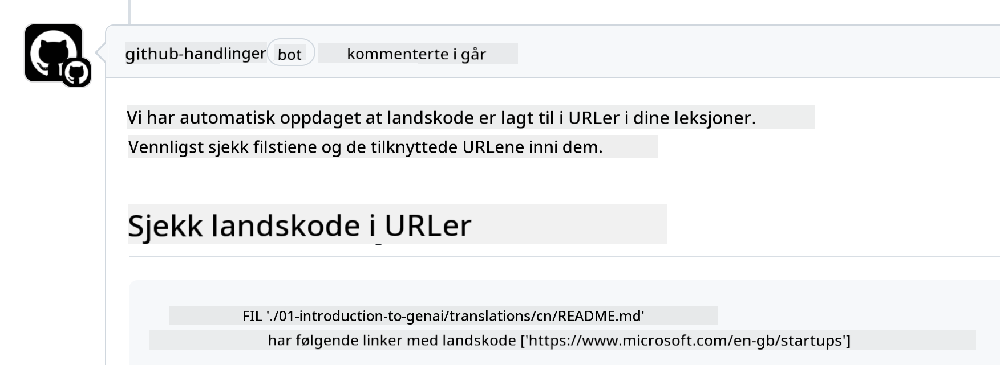

<!--
CO_OP_TRANSLATOR_METADATA:
{
  "original_hash": "57c41f2af71001a2cff9d8eb797cb843",
  "translation_date": "2025-05-19T11:18:35+00:00",
  "source_file": "CONTRIBUTING.md",
  "language_code": "no"
}
-->
# Bidra

Dette prosjektet ønsker velkommen til bidrag og forslag. De fleste bidrag krever at du godtar en Contributor License Agreement (CLA) som erklærer at du har rett til, og faktisk gir oss rettighetene til å bruke ditt bidrag. For detaljer, besøk <https://cla.microsoft.com>.

> Viktig: Når du oversetter tekst i dette repoet, vennligst sørg for at du ikke bruker maskinoversettelse. Vi vil verifisere oversettelser via fellesskapet, så vennligst meld deg kun for oversettelser til språk du er dyktig i.

Når du sender inn en pull request, vil en CLA-bot automatisk avgjøre om du trenger å levere en CLA og dekorere PR-en tilsvarende (f.eks. etikett, kommentar). Følg bare instruksjonene gitt av boten. Du trenger bare å gjøre dette én gang på tvers av alle repositories som bruker vår CLA.

## Regler for atferd

Dette prosjektet har vedtatt [Microsoft Open Source Code of Conduct](https://opensource.microsoft.com/codeofconduct/?WT.mc_id=academic-105485-koreyst). For mer informasjon, les [Code of Conduct FAQ](https://opensource.microsoft.com/codeofconduct/faq/?WT.mc_id=academic-105485-koreyst) eller kontakt [opencode@microsoft.com](mailto:opencode@microsoft.com) med eventuelle tilleggsspørsmål eller kommentarer.

## Spørsmål eller Problem?

Vennligst ikke åpne GitHub-issues for generelle støtteforespørsler da GitHub-listen bør brukes til funksjonsforespørsler og feilrapporter. På denne måten kan vi lettere spore faktiske problemer eller feil fra koden og holde den generelle diskusjonen adskilt fra selve koden.

## Feil, Problemer, Bugs og bidrag

Når du sender inn endringer til Generative AI for Beginners-repositoriet, vennligst følg disse anbefalingene.

* Alltid fork repositoryen til din egen konto før du gjør dine endringer
* Ikke kombiner flere endringer i én pull request. For eksempel, send inn eventuelle feilrettinger og dokumentasjonsoppdateringer som separate PR-er
* Hvis pull requesten din viser sammenslåingskonflikter, sørg for å oppdatere din lokale main til å være en speiling av det som er i hovedrepositoryen før du gjør dine endringer
* Hvis du sender inn en oversettelse, vennligst opprett én PR for alle de oversatte filene da vi ikke aksepterer delvise oversettelser for innholdet
* Hvis du sender inn en skrivefeil eller dokumentasjonsretting, kan du kombinere endringer til en enkelt PR der det er hensiktsmessig

## Generelle retningslinjer for skriving

- Sørg for at alle dine URL-er er omsluttet i firkantparenteser etterfulgt av en parentes uten ekstra mellomrom rundt dem eller inni dem ``.
- Sørg for at enhver relativ lenke (dvs. lenker til andre filer og mapper i repositoryen) starter med en `./` som refererer til en fil eller en mappe som ligger i den nåværende arbeidskatalogen eller en `../` som refererer til en fil eller en mappe som ligger i en overordnet arbeidskatalog.
- Sørg for at enhver relativ lenke (dvs. lenker til andre filer og mapper i repositoryen) har en sporings-ID (dvs. `?` eller `&` deretter `wt.mc_id=` eller `WT.mc_id=`) på slutten av den.
- Sørg for at enhver URL fra følgende domener _github.com, microsoft.com, visualstudio.com, aka.ms, og azure.com_ har en sporings-ID (dvs. `?` eller `&` deretter `wt.mc_id=` eller `WT.mc_id=`) på slutten av den.
- Sørg for at lenkene dine ikke har lands- eller språkspesifikke lokaliteter i dem (dvs. `/en-us/` eller `/en/`).
- Sørg for at alle bilder er lagret i `./images`-mappen.
- Sørg for at bildene har beskrivende navn ved bruk av engelske tegn, tall, og bindestreker i navnet på bildet ditt.

## GitHub Workflows

Når du sender inn en pull request, vil fire forskjellige arbeidsflyter bli utløst for å validere de forrige reglene. Følg bare instruksjonene som er listet her for å bestå arbeidsflytkontrollene.

- [Sjekk Ødelagte Relative Stier](../..)
- [Sjekk Stier Har Sporing](../..)
- [Sjekk URL-er Har Sporing](../..)
- [Sjekk URL-er Har Ikke Lokalitet](../..)

### Sjekk Ødelagte Relative Stier

Denne arbeidsflyten sikrer at enhver relativ sti i filene dine fungerer. Dette repositoryet er distribuert til GitHub-sider, så du må være veldig forsiktig når du skriver lenkene som binder alt sammen for ikke å lede noen til feil sted.

For å sørge for at lenkene dine fungerer riktig, bruk ganske enkelt VS-kode for å sjekke det.

For eksempel, når du holder musepekeren over en lenke i filene dine, vil du bli bedt om å følge lenken ved å trykke på **ctrl + klikk**

Hvis du klikker på en lenke og den ikke fungerer lokalt, vil den sikkert utløse arbeidsflyten og ikke fungere på GitHub.

For å løse dette problemet, prøv å skrive lenken med hjelp av VS-kode.

Når du skriver `./` eller `../` vil VS-kode be deg om å velge fra de tilgjengelige alternativene i henhold til det du skrev.

Følg stien ved å klikke på den ønskede filen eller mappen, og du vil være sikker på at stien din ikke er ødelagt.

Når du legger til riktig relativ sti, lagrer og pusher endringene dine, vil arbeidsflyten bli utløst igjen for å verifisere endringene dine. Hvis du består sjekken, er du klar til å gå videre.

### Sjekk Stier Har Sporing

Denne arbeidsflyten sikrer at enhver relativ sti har sporing i den. Dette repositoryet er distribuert til GitHub-sider, så vi må spore bevegelsen mellom de forskjellige filene og mappene.

For å sørge for at dine relative stier har sporing i dem, sjekk ganske enkelt for følgende tekst `?wt.mc_id=` på slutten av stien. Hvis det er lagt til dine relative stier, vil du bestå denne sjekken.

Hvis ikke, kan du få følgende feil.

For å løse dette problemet, prøv å åpne filstien som arbeidsflyten fremhevet og legg til sporings-ID-en på slutten av de relative stiene.

Når du legger til sporings-ID-en, lagrer og pusher endringene dine, vil arbeidsflyten bli utløst igjen for å verifisere endringene dine. Hvis du består sjekken, er du klar til å gå videre.

### Sjekk URL-er Har Sporing

Denne arbeidsflyten sikrer at enhver web-URL har sporing i den. Dette repositoryet er tilgjengelig for alle, så du må sørge for å spore tilgangen for å vite hvor trafikken kommer fra.

For å sørge for at URL-ene dine har sporing i dem, sjekk ganske enkelt for følgende tekst `?wt.mc_id=` på slutten av URL-en. Hvis det er lagt til URL-ene dine, vil du bestå denne sjekken.

Hvis ikke, kan du få følgende feil.

For å løse dette problemet, prøv å åpne filstien som arbeidsflyten fremhevet og legg til sporings-ID-en på slutten av URL-ene.

Når du legger til sporings-ID-en, lagrer og pusher endringene dine, vil arbeidsflyten bli utløst igjen for å verifisere endringene dine. Hvis du består sjekken, er du klar til å gå videre.

### Sjekk URL-er Har Ikke Lokalitet

Denne arbeidsflyten sikrer at enhver web-URL ikke har lands- eller språkspesifikke lokaliteter i den. Dette repositoryet er tilgjengelig for alle rundt om i verden, så du må sørge for å ikke inkludere landets lokalitet i URL-er.

For å sørge for at URL-ene dine ikke har landslokalitet i dem, sjekk ganske enkelt for følgende tekst `/en-us/` eller `/en/` eller noen annen språk-lokalitet hvor som helst i URL-en. Hvis det ikke er til stede i URL-ene dine, vil du bestå denne sjekken.

Hvis ikke, kan du få følgende feil.

For å løse dette problemet, prøv å åpne filstien som arbeidsflyten fremhevet og fjern land-lokaliteten fra URL-ene.

Når du fjerner land-lokaliteten, lagrer og pusher endringene dine, vil arbeidsflyten bli utløst igjen for å verifisere endringene dine. Hvis du består sjekken, er du klar til å gå videre.

Gratulerer! Vi vil komme tilbake til deg så snart som mulig med tilbakemelding om ditt bidrag.

Sure, here's the translation into Norwegian:

---

**Ansvarsfraskrivelse**:  
Dette dokumentet er oversatt ved hjelp av AI-oversettelsestjenesten [Co-op Translator](https://github.com/Azure/co-op-translator). Selv om vi streber etter nøyaktighet, vær oppmerksom på at automatiserte oversettelser kan inneholde feil eller unøyaktigheter. Det originale dokumentet på sitt opprinnelige språk bør betraktes som den autoritative kilden. For kritisk informasjon anbefales profesjonell menneskelig oversettelse. Vi er ikke ansvarlige for eventuelle misforståelser eller feiltolkninger som oppstår ved bruk av denne oversettelsen.

---