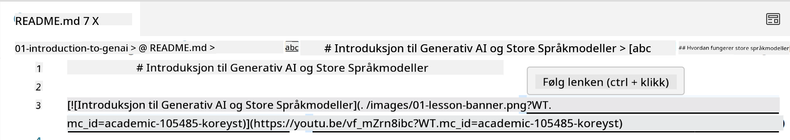
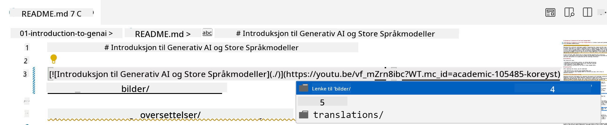
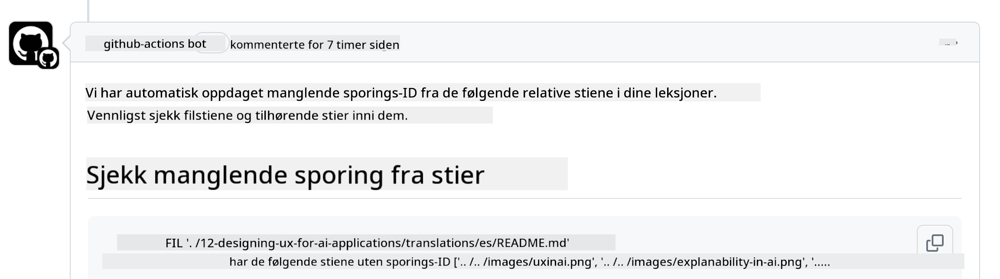
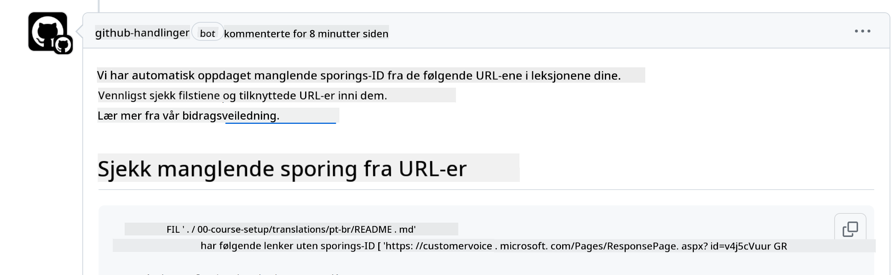
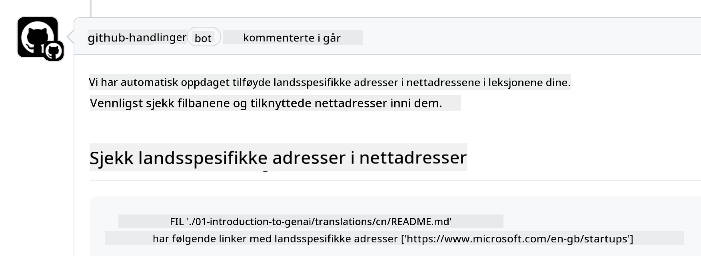

<!--
CO_OP_TRANSLATOR_METADATA:
{
  "original_hash": "57c41f2af71001a2cff9d8eb797cb843",
  "translation_date": "2025-06-25T07:12:55+00:00",
  "source_file": "CONTRIBUTING.md",
  "language_code": "no"
}
-->
# Bidra

Dette prosjektet ønsker bidrag og forslag velkommen. De fleste bidrag krever at du godtar en Contributor License Agreement (CLA) som erklærer at du har rett til, og faktisk gir oss, rettighetene til å bruke ditt bidrag. For detaljer, besøk <https://cla.microsoft.com>.

> Viktig: når du oversetter tekst i dette repoet, vennligst sørg for at du ikke bruker maskinoversettelse. Vi vil verifisere oversettelser via fellesskapet, så vennligst meld deg kun frivillig til oversettelser på språk der du er dyktig.

Når du sender inn en pull request, vil en CLA-bot automatisk avgjøre om du trenger å gi en CLA og dekorere PR-en passende (f.eks. etikett, kommentar). Følg enkelt instruksjonene gitt av boten. Du trenger bare å gjøre dette én gang på tvers av alle repositorier som bruker vår CLA.

## Etiske retningslinjer

Dette prosjektet har adoptert [Microsoft Open Source Code of Conduct](https://opensource.microsoft.com/codeofconduct/?WT.mc_id=academic-105485-koreyst). For mer informasjon les [Code of Conduct FAQ](https://opensource.microsoft.com/codeofconduct/faq/?WT.mc_id=academic-105485-koreyst) eller kontakt [opencode@microsoft.com](mailto:opencode@microsoft.com) med eventuelle spørsmål eller kommentarer.

## Spørsmål eller problem?

Vennligst ikke åpne GitHub-issues for generelle støtteforespørsler, da GitHub-listen bør brukes for funksjonsforespørsler og feilrapporter. På denne måten kan vi lettere spore faktiske problemer eller feil fra koden og holde den generelle diskusjonen adskilt fra selve koden.

## Feil, problemer, bugs og bidrag

Når du sender inn endringer til Generative AI for Beginners-repositoriet, vennligst følg disse anbefalingene.

* Alltid fork repoen til din egen konto før du gjør dine modifikasjoner
* Ikke kombiner flere endringer til én pull request. For eksempel, send inn eventuelle feilrettinger og dokumentasjonsoppdateringer ved hjelp av separate PR-er
* Hvis din pull request viser merge-konflikter, sørg for å oppdatere din lokale main til å være en speiling av hva som er i hovedrepoen før du gjør dine modifikasjoner
* Hvis du sender inn en oversettelse, vennligst opprett én PR for alle de oversatte filene, da vi ikke aksepterer delvise oversettelser av innholdet
* Hvis du sender inn en skrivefeil eller dokumentasjonsrettelse, kan du kombinere modifikasjoner til én PR der det er passende

## Generelle retningslinjer for skriving

- Sørg for at alle dine URL-er er omsluttet av firkantede parenteser etterfulgt av en parentes uten ekstra mellomrom rundt dem eller inni dem ``.
- Sørg for at enhver relativ lenke (dvs. lenker til andre filer og mapper i repoet) starter med en `./` som refererer til en fil eller en mappe som ligger i den nåværende arbeidskatalogen eller en `../` som refererer til en fil eller en mappe som ligger i en overordnet arbeidskatalog.
- Sørg for at enhver relativ lenke (dvs. lenker til andre filer og mapper i repoet) har en sporings-ID (dvs. `?` eller `&` deretter `wt.mc_id=` eller `WT.mc_id=`) på slutten av den.
- Sørg for at enhver URL fra følgende domener _github.com, microsoft.com, visualstudio.com, aka.ms, og azure.com_ har en sporings-ID (dvs. `?` eller `&` deretter `wt.mc_id=` eller `WT.mc_id=`) på slutten av den.
- Sørg for at dine lenker ikke har lands-spesifikke lokaliteter i dem (dvs. `/en-us/` eller `/en/`).
- Sørg for at alle bilder er lagret i `./images`-mappen.
- Sørg for at bildene har beskrivende navn ved bruk av engelske tegn, tall og bindestreker i navnet på bildet ditt.

## GitHub-arbeidsflyter

Når du sender inn en pull request, vil fire forskjellige arbeidsflyter bli utløst for å validere de tidligere reglene. Følg enkelt instruksjonene som er listet her for å bestå arbeidsflytsjekkene.

- [Sjekk ødelagte relative stier](../..)
- [Sjekk stier har sporing](../..)
- [Sjekk URL-er har sporing](../..)
- [Sjekk URL-er har ikke lokalitet](../..)

### Sjekk ødelagte relative stier

Denne arbeidsflyten sørger for at enhver relativ sti i dine filer fungerer. Dette repoet er distribuert til GitHub-sider, så du må være veldig forsiktig når du skriver lenkene som binder alt sammen, for å ikke lede noen til feil sted.

For å sørge for at dine lenker fungerer riktig, bruk enkelt VS code for å sjekke det.

For eksempel, når du holder musen over en lenke i dine filer, vil du bli bedt om å følge lenken ved å trykke på **ctrl + klikk**

Hvis du klikker på en lenke og den ikke fungerer lokalt, vil den sikkert utløse arbeidsflyten og ikke fungere på GitHub.

For å fikse dette problemet, prøv å skrive lenken med hjelp fra VS code.

Når du skriver `./` eller `../` vil VS code be deg om å velge fra de tilgjengelige alternativene i henhold til hva du skrev.

Følg stien ved å klikke på den ønskede filen eller mappen, og du vil være sikker på at stien din ikke er ødelagt.

Når du har lagt til riktig relativ sti, lagre, og push dine endringer vil arbeidsflyten bli utløst igjen for å verifisere dine endringer. Hvis du består sjekken, er du klar til å gå videre.

### Sjekk stier har sporing

Denne arbeidsflyten sørger for at enhver relativ sti har sporing i seg. Dette repoet er distribuert til GitHub-sider, så vi må spore bevegelsen mellom de forskjellige filene og mappene.

For å sørge for at dine relative stier har sporing i seg, sjekk enkelt etter følgende tekst `?wt.mc_id=` på slutten av stien. Hvis den er lagt til dine relative stier, vil du bestå denne sjekken.

Hvis ikke, kan du få følgende feil.

For å fikse dette problemet, prøv å åpne filstien som arbeidsflyten fremhevet og legg til sporings-ID-en på slutten av de relative stiene.

Når du har lagt til sporings-ID-en, lagre, og push dine endringer vil arbeidsflyten bli utløst igjen for å verifisere dine endringer. Hvis du består sjekken, er du klar til å gå videre.

### Sjekk URL-er har sporing

Denne arbeidsflyten sørger for at enhver web-URL har sporing i seg. Dette repoet er tilgjengelig for alle, så du må sørge for å spore tilgangen for å vite hvor trafikken kommer fra.

For å sørge for at dine URL-er har sporing i seg, sjekk enkelt etter følgende tekst `?wt.mc_id=` på slutten av URL-en. Hvis den er lagt til dine URL-er, vil du bestå denne sjekken.

Hvis ikke, kan du få følgende feil.

For å fikse dette problemet, prøv å åpne filstien som arbeidsflyten fremhevet og legg til sporings-ID-en på slutten av URL-ene.

Når du har lagt til sporings-ID-en, lagre, og push dine endringer vil arbeidsflyten bli utløst igjen for å verifisere dine endringer. Hvis du består sjekken, er du klar til å gå videre.

### Sjekk URL-er har ikke lokalitet

Denne arbeidsflyten sørger for at enhver web-URL ikke har land-spesifikke lokaliteter i seg. Dette repoet er tilgjengelig for alle rundt om i verden, så du må sørge for å ikke inkludere ditt lands lokalitet i URL-er.

For å sørge for at dine URL-er ikke har land-lokalitet i seg, sjekk enkelt etter følgende tekst `/en-us/` eller `/en/` eller en annen språk-lokalitet hvor som helst i URL-en. Hvis den ikke er til stede i dine URL-er, vil du bestå denne sjekken.

Hvis ikke, kan du få følgende feil.

For å fikse dette problemet, prøv å åpne filstien som arbeidsflyten fremhevet og fjern land-lokaliteten fra URL-ene.

Når du har fjernet land-lokaliteten, lagre, og push dine endringer vil arbeidsflyten bli utløst igjen for å verifisere dine endringer. Hvis du består sjekken, er du klar til å gå videre.

Gratulerer! Vi vil komme tilbake til deg så snart som mulig med tilbakemelding om ditt bidrag.

**Ansvarsfraskrivelse**:  
Dette dokumentet er oversatt ved hjelp av AI-oversettelsestjenesten [Co-op Translator](https://github.com/Azure/co-op-translator). Selv om vi streber etter nøyaktighet, vennligst vær oppmerksom på at automatiske oversettelser kan inneholde feil eller unøyaktigheter. Det originale dokumentet på sitt opprinnelige språk bør betraktes som den autoritative kilden. For kritisk informasjon anbefales profesjonell menneskelig oversettelse. Vi er ikke ansvarlige for eventuelle misforståelser eller feiltolkninger som oppstår ved bruk av denne oversettelsen.