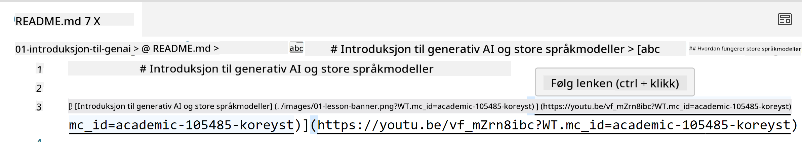
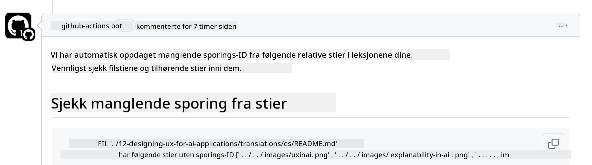
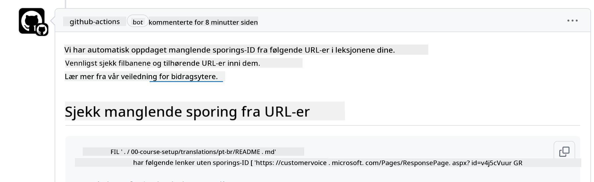
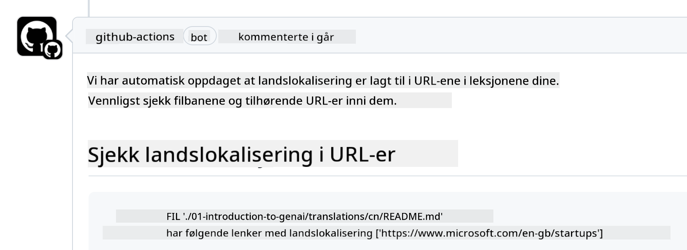

<!--
CO_OP_TRANSLATOR_METADATA:
{
  "original_hash": "57c41f2af71001a2cff9d8eb797cb843",
  "translation_date": "2025-07-09T06:08:19+00:00",
  "source_file": "CONTRIBUTING.md",
  "language_code": "no"
}
-->
# Bidra

Dette prosjektet ønsker bidrag og forslag velkommen. De fleste bidrag krever at du
godtar en Contributor License Agreement (CLA) som bekrefter at du har rett til,
og faktisk gir oss rettighetene til å bruke ditt bidrag. For detaljer, besøk
<https://cla.microsoft.com>.

> Viktig: når du oversetter tekst i dette repoet, vennligst sørg for at du ikke bruker maskinoversettelse. Vi vil verifisere oversettelser via fellesskapet, så vær kun frivillig for oversettelser på språk du behersker godt.

Når du sender inn en pull request, vil en CLA-bot automatisk avgjøre om du må
gi en CLA og merke PR-en deretter (f.eks. med label eller kommentar). Følg bare
instruksjonene fra boten. Du trenger kun å gjøre dette én gang for alle repositorier som bruker vår CLA.

## Adferdskodeks

Dette prosjektet har tatt i bruk [Microsoft Open Source Code of Conduct](https://opensource.microsoft.com/codeofconduct/?WT.mc_id=academic-105485-koreyst).
For mer informasjon, les [Code of Conduct FAQ](https://opensource.microsoft.com/codeofconduct/faq/?WT.mc_id=academic-105485-koreyst) eller kontakt [opencode@microsoft.com](mailto:opencode@microsoft.com) ved spørsmål eller kommentarer.

## Spørsmål eller problem?

Vennligst ikke opprett GitHub-issues for generelle supportspørsmål, da GitHub-listen skal brukes til funksjonsforespørsler og feilrapporter. På denne måten kan vi lettere spore faktiske problemer eller feil i koden og holde generell diskusjon adskilt fra koden.

## Feil, problemer, bugs og bidrag

Når du sender inn endringer til Generative AI for Beginners-repositoriet, vennligst følg disse anbefalingene.

* Alltid fork repositoriet til din egen konto før du gjør endringer
* Ikke kombiner flere endringer i én pull request. For eksempel, send feilrettinger og dokumentasjonsoppdateringer i separate PR-er
* Hvis pull requesten din viser merge-konflikter, sørg for å oppdatere din lokale main slik at den speiler hovedrepositoriet før du gjør endringer
* Hvis du sender inn en oversettelse, lag én PR for alle oversatte filer, da vi ikke godtar delvise oversettelser av innholdet
* Hvis du sender inn en skrivefeil eller dokumentasjonsrettelse, kan du kombinere endringer i én PR der det passer

## Generelle retningslinjer for skriving

- Sørg for at alle URL-er er omsluttet av hakeparenteser etterfulgt av parentes uten ekstra mellomrom ``.
- Sørg for at relative lenker (dvs. lenker til andre filer og mapper i repositoriet) starter med `./` for filer eller mapper i gjeldende arbeidsmappe, eller `../` for filer eller mapper i overordnet arbeidsmappe.
- Sørg for at relative lenker har en sporings-ID (dvs. `?` eller `&` etterfulgt av `wt.mc_id=` eller `WT.mc_id=`) på slutten.
- Sørg for at URL-er fra domenene _github.com, microsoft.com, visualstudio.com, aka.ms, og azure.com_ har en sporings-ID (dvs. `?` eller `&` etterfulgt av `wt.mc_id=` eller `WT.mc_id=`) på slutten.
- Sørg for at lenkene dine ikke inneholder landsspesifikk lokalitet (f.eks. `/en-us/` eller `/en/`).
- Sørg for at alle bilder er lagret i `./images`-mappen.
- Sørg for at bildene har beskrivende navn med engelske bokstaver, tall og bindestreker.

## GitHub Workflows

Når du sender inn en pull request, vil fire ulike workflows bli trigget for å validere reglene ovenfor.
Følg bare instruksjonene her for å bestå workflow-sjekkene.

- [Check Broken Relative Paths](../..)
- [Check Paths Have Tracking](../..)
- [Check URLs Have Tracking](../..)
- [Check URLs Don't Have Locale](../..)

### Check Broken Relative Paths

Denne workflowen sikrer at alle relative stier i filene dine fungerer.
Dette repositoriet er publisert på GitHub Pages, så du må være nøye når du skriver lenker som binder alt sammen, slik at ingen blir sendt til feil sted.

For å være sikker på at lenkene dine fungerer, bruk VS Code til å sjekke det.

For eksempel, når du holder musepekeren over en lenke i filene dine, får du mulighet til å følge lenken ved å trykke **ctrl + klikk**

Hvis du klikker på en lenke og den ikke fungerer lokalt, vil workflowen mest sannsynlig feile og lenken vil ikke fungere på GitHub.

For å fikse dette, prøv å skrive lenken med hjelp fra VS Code.

Når du skriver `./` eller `../` vil VS Code foreslå tilgjengelige alternativer basert på det du har skrevet.

Følg stien ved å klikke på ønsket fil eller mappe, så er du sikker på at stien ikke er ødelagt.

Når du har lagt til riktig relativ sti, lagrer du og pusher endringene dine, og workflowen vil kjøre på nytt for å verifisere endringene.
Hvis du består sjekken, er du klar til å gå videre.

### Check Paths Have Tracking

Denne workflowen sikrer at alle relative stier har sporingsinformasjon.
Dette repositoriet er publisert på GitHub Pages, så vi må spore trafikken mellom filer og mapper.

For å være sikker på at relative stier har sporingsinformasjon, sjekk at teksten `?wt.mc_id=` står på slutten av stien.
Hvis den er lagt til, vil du bestå sjekken.

Hvis ikke, kan du få følgende feil.

For å fikse dette, åpne filstien workflowen har markert og legg til sporings-ID på slutten av de relative stiene.

Når du har lagt til sporings-ID, lagrer du og pusher endringene dine, og workflowen kjører på nytt for å verifisere.
Hvis du består sjekken, er du klar til å gå videre.

### Check URLs Have Tracking

Denne workflowen sikrer at alle nettadresser har sporingsinformasjon.
Dette repositoriet er tilgjengelig for alle, så du må sørge for å spore tilgangen for å vite hvor trafikken kommer fra.

For å være sikker på at URL-ene dine har sporingsinformasjon, sjekk at teksten `?wt.mc_id=` står på slutten av URL-en.
Hvis den er lagt til, vil du bestå sjekken.

Hvis ikke, kan du få følgende feil.

For å fikse dette, åpne filstien workflowen har markert og legg til sporings-ID på slutten av URL-ene.

Når du har lagt til sporings-ID, lagrer du og pusher endringene dine, og workflowen kjører på nytt for å verifisere.
Hvis du består sjekken, er du klar til å gå videre.

### Check URLs Don't Have Locale

Denne workflowen sikrer at ingen nettadresser inneholder landsspesifikk lokalitet.
Dette repositoriet er tilgjengelig for alle i hele verden, så du må sørge for å ikke inkludere lokalitet for ditt land i URL-ene.

For å være sikker på at URL-ene dine ikke har landsspesifikk lokalitet, sjekk at teksten `/en-us/` eller `/en/` eller annen språklokalitet ikke finnes i URL-en.
Hvis den ikke er til stede, vil du bestå sjekken.

Hvis ikke, kan du få følgende feil.

For å fikse dette, åpne filstien workflowen har markert og fjern landsspesifikk lokalitet fra URL-ene.

Når du har fjernet lokaliteten, lagrer du og pusher endringene dine, og workflowen kjører på nytt for å verifisere.
Hvis du består sjekken, er du klar til å gå videre.

Gratulerer! Vi vil komme tilbake til deg så snart som mulig med tilbakemelding på ditt bidrag.

**Ansvarsfraskrivelse**:  
Dette dokumentet er oversatt ved hjelp av AI-oversettelsestjenesten [Co-op Translator](https://github.com/Azure/co-op-translator). Selv om vi streber etter nøyaktighet, vennligst vær oppmerksom på at automatiske oversettelser kan inneholde feil eller unøyaktigheter. Det opprinnelige dokumentet på originalspråket skal anses som den autoritative kilden. For kritisk informasjon anbefales profesjonell menneskelig oversettelse. Vi er ikke ansvarlige for eventuelle misforståelser eller feiltolkninger som oppstår ved bruk av denne oversettelsen.