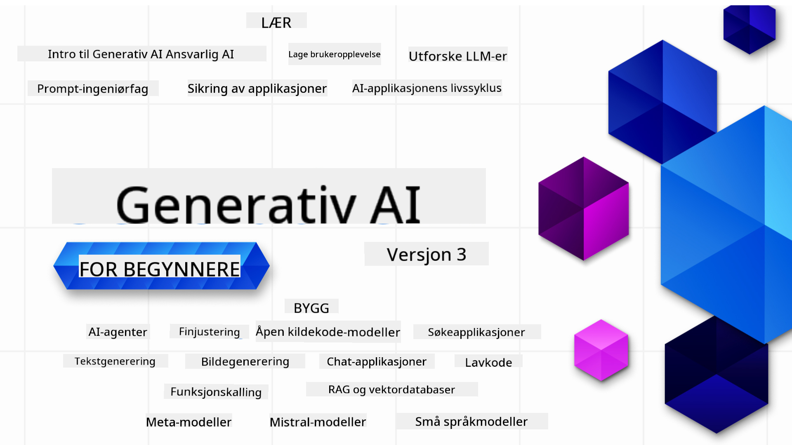

<!--
CO_OP_TRANSLATOR_METADATA:
{
  "original_hash": "ca2afa136ed9aca0634f39f51239746e",
  "translation_date": "2025-08-27T08:39:47+00:00",
  "source_file": "README.md",
  "language_code": "no"
}
-->

### 21 leksjoner som lærer deg alt du trenger å vite for å begynne å bygge generative AI-applikasjoner

### 🌐 Støtte for flere språk

#### Støttet via GitHub Action (Automatisk og alltid oppdatert)

[Fransk](../fr/README.md) | [Spansk](../es/README.md) | [Tysk](../de/README.md) | [Russisk](../ru/README.md) | [Arabisk](../ar/README.md) | [Persisk (Farsi)](../fa/README.md) | [Urdu](../ur/README.md) | [Kinesisk (Forenklet)](../zh/README.md) | [Kinesisk (Tradisjonell, Macau)](../mo/README.md) | [Kinesisk (Tradisjonell, Hong Kong)](../hk/README.md) | [Kinesisk (Tradisjonell, Taiwan)](../tw/README.md) | [Japansk](../ja/README.md) | [Koreansk](../ko/README.md) | [Hindi](../hi/README.md) | [Bengali](../bn/README.md) | [Marathi](../mr/README.md) | [Nepali](../ne/README.md) | [Punjabi (Gurmukhi)](../pa/README.md) | [Portugisisk (Portugal)](../pt/README.md) | [Portugisisk (Brasil)](../br/README.md) | [Italiensk](../it/README.md) | [Litauisk](../lt/README.md) | [Polsk](../pl/README.md) | [Tyrkisk](../tr/README.md) | [Gresk](../el/README.md) | [Thai](../th/README.md) | [Svensk](../sv/README.md) | [Dansk](../da/README.md) | [Norsk](./README.md) | [Finsk](../fi/README.md) | [Nederlandsk](../nl/README.md) | [Hebraisk](../he/README.md) | [Vietnamesisk](../vi/README.md) | [Indonesisk](../id/README.md) | [Malayisk](../ms/README.md) | [Tagalog (Filippinsk)](../tl/README.md) | [Swahili](../sw/README.md) | [Ungarsk](../hu/README.md) | [Tsjekkisk](../cs/README.md) | [Slovakisk](../sk/README.md) | [Rumensk](../ro/README.md) | [Bulgarsk](../bg/README.md) | [Serbisk (Kyrillisk)](../sr/README.md) | [Kroatisk](../hr/README.md) | [Slovensk](../sl/README.md) | [Ukrainsk](../uk/README.md) | [Burmesisk (Myanmar)](../my/README.md)

# Generativ AI for Nybegynnere (Versjon 3) - Et Kurs

Lær det grunnleggende om å bygge generative AI-applikasjoner med vårt omfattende kurs på 21 leksjoner fra Microsoft Cloud Advocates.

## 🌱 Kom i gang

Dette kurset har 21 leksjoner. Hver leksjon dekker sitt eget tema, så start der du vil!

Leksjonene er merket enten som "Lær"-leksjoner som forklarer et generativt AI-konsept, eller "Bygg"-leksjoner som forklarer et konsept med kodeeksempler i både **Python** og **TypeScript** når det er mulig.

For .NET-utviklere, sjekk ut [Generative AI for Beginners (.NET Edition)](https://github.com/microsoft/Generative-AI-for-beginners-dotnet?WT.mc_id=academic-105485-koreyst)!

Hver leksjon inkluderer også en "Fortsett å lære"-seksjon med ekstra læringsressurser.

## Hva du trenger
### For å kjøre koden i dette kurset, kan du bruke enten:
 - [Azure OpenAI Service](https://aka.ms/genai-beginners/azure-open-ai?WT.mc_id=academic-105485-koreyst) - **Leksjoner:** "aoai-assignment"
 - [GitHub Marketplace Model Catalog](https://aka.ms/genai-beginners/gh-models?WT.mc_id=academic-105485-koreyst) - **Leksjoner:** "githubmodels"
 - [OpenAI API](https://aka.ms/genai-beginners/open-ai?WT.mc_id=academic-105485-koreyst) - **Leksjoner:** "oai-assignment" 

- Grunnleggende kunnskap om Python eller TypeScript er nyttig - \*For helt nybegynnere, sjekk ut disse [Python](https://aka.ms/genai-beginners/python?WT.mc_id=academic-105485-koreyst) og [TypeScript](https://aka.ms/genai-beginners/typescript?WT.mc_id=academic-105485-koreyst) kursene
- En GitHub-konto for å [forke hele dette repoet](https://aka.ms/genai-beginners/github?WT.mc_id=academic-105485-koreyst) til din egen GitHub-konto

Vi har laget en **[Kursoppsett](./00-course-setup/README.md?WT.mc_id=academic-105485-koreyst)** leksjon for å hjelpe deg med å sette opp ditt utviklingsmiljø.

Ikke glem å [stjerne (🌟) dette repoet](https://docs.github.com/en/get-started/exploring-projects-on-github/saving-repositories-with-stars?WT.mc_id=academic-105485-koreyst) for å finne det enklere senere.

## 🧠 Klar til å distribuere?

Hvis du ser etter mer avanserte kodeeksempler, sjekk ut vår [samling av generative AI-kodeeksempler](https://aka.ms/genai-beg-code?WT.mc_id=academic-105485-koreyst) i både **Python** og **TypeScript**.

## 🗣️ Møt andre elever, få støtte

Bli med på vår [offisielle Azure AI Foundry Discord-server](https://aka.ms/genai-discord?WT.mc_id=academic-105485-koreyst) for å møte og nettverke med andre elever som tar dette kurset og få støtte.

Still spørsmål eller del produktfeedback i vårt [Azure AI Foundry Developer Forum](https://aka.ms/azureaifoundry/forum) på Github.

## 🚀 Bygger du en oppstart?

Besøk [Microsoft for Startups](https://www.microsoft.com/startups) for å finne ut hvordan du kan komme i gang med å bygge med Azure-kreditter i dag.

## 🙏 Vil du hjelpe?

Har du forslag eller funnet skrivefeil eller kodefeil? [Opprett et problem](https://github.com/microsoft/generative-ai-for-beginners/issues?WT.mc_id=academic-105485-koreyst) eller [Lag en pull request](https://github.com/microsoft/generative-ai-for-beginners/pulls?WT.mc_id=academic-105485-koreyst)

## 📂 Hver leksjon inkluderer:

- En kort videointroduksjon til temaet
- En skriftlig leksjon som ligger i README
- Python- og TypeScript-kodeeksempler som støtter Azure OpenAI og OpenAI API
- Lenker til ekstra ressurser for å fortsette læringen

## 🗃️ Leksjoner

| #   | **Leksjonslenke**                                                                                                                            | **Beskrivelse**                                                                                 | **Video**                                                                   | **Ekstra læring**                                                              |
| --- | -------------------------------------------------------------------------------------------------------------------------------------------- | ----------------------------------------------------------------------------------------------- | --------------------------------------------------------------------------- | ------------------------------------------------------------------------------ |
| 00  | [Kursoppsett](./00-course-setup/README.md?WT.mc_id=academic-105485-koreyst)                                                                  | **Lær:** Hvordan sette opp ditt utviklingsmiljø                                                 | Video kommer snart                                                                 | [Lær mer](https://aka.ms/genai-collection?WT.mc_id=academic-105485-koreyst)    |
| 01  | [Introduksjon til Generativ AI og LLMs](./01-introduction-to-genai/README.md?WT.mc_id=academic-105485-koreyst)                               | **Lær:** Forstå hva generativ AI er og hvordan store språkmodeller (LLMs) fungerer              | [Video](https://aka.ms/gen-ai-lesson-1-gh?WT.mc_id=academic-105485-koreyst) | [Lær mer](https://aka.ms/genai-collection?WT.mc_id=academic-105485-koreyst)    |
| 02  | [Utforske og sammenligne ulike LLMs](./02-exploring-and-comparing-different-llms/README.md?WT.mc_id=academic-105485-koreyst)                 | **Lær:** Hvordan velge riktig modell for ditt brukstilfelle                                    | [Video](https://aka.ms/gen-ai-lesson2-gh?WT.mc_id=academic-105485-koreyst)  | [Lær mer](https://aka.ms/genai-collection?WT.mc_id=academic-105485-koreyst)    |
| 03  | [Bruke Generativ AI Ansvarlig](./03-using-generative-ai-responsibly/README.md?WT.mc_id=academic-105485-koreyst)                              | **Lær:** Hvordan bygge generative AI-applikasjoner ansvarlig                                   | [Video](https://aka.ms/gen-ai-lesson3-gh?WT.mc_id=academic-105485-koreyst)  | [Lær mer](https://aka.ms/genai-collection?WT.mc_id=academic-105485-koreyst)    |
| 04  | [Forstå grunnleggende prinsipper for prompt engineering](./04-prompt-engineering-fundamentals/README.md?WT.mc_id=academic-105485-koreyst)    | **Lær:** Praktiske beste praksiser for prompt engineering                                      | [Video](https://aka.ms/gen-ai-lesson4-gh?WT.mc_id=academic-105485-koreyst)  | [Lær mer](https://aka.ms/genai-collection?WT.mc_id=academic-105485-koreyst)    |
| 05  | [Lage avanserte prompts](./05-advanced-prompts/README.md?WT.mc_id=academic-105485-koreyst)                                                   | **Lær:** Hvordan bruke teknikker for prompt engineering som forbedrer resultatene av dine prompts | [Video](https://aka.ms/gen-ai-lesson5-gh?WT.mc_id=academic-105485-koreyst)  | [Lær mer](https://aka.ms/genai-collection?WT.mc_id=academic-105485-koreyst)    |
| 06  | [Bygge tekstgenereringsapplikasjoner](./06-text-generation-apps/README.md?WT.mc_id=academic-105485-koreyst)                                | **Bygg:** En tekstgenereringsapplikasjon ved bruk av Azure OpenAI / OpenAI API                                | [Video](https://aka.ms/gen-ai-lesson6-gh?WT.mc_id=academic-105485-koreyst)  | [Lær mer](https://aka.ms/genai-collection?WT.mc_id=academic-105485-koreyst) |
| 07  | [Bygge chatteapplikasjoner](./07-building-chat-applications/README.md?WT.mc_id=academic-105485-koreyst)                                     | **Bygg:** Teknikker for effektivt å bygge og integrere chatteapplikasjoner.               | [Video](https://aka.ms/gen-ai-lessons7-gh?WT.mc_id=academic-105485-koreyst) | [Lær mer](https://aka.ms/genai-collection?WT.mc_id=academic-105485-koreyst) |
| 08  | [Bygge søkeapplikasjoner med vektordatabaser](./08-building-search-applications/README.md?WT.mc_id=academic-105485-koreyst)                        | **Bygg:** En søkeapplikasjon som bruker embeddings for å søke etter data.                        | [Video](https://aka.ms/gen-ai-lesson8-gh?WT.mc_id=academic-105485-koreyst)  | [Lær mer](https://aka.ms/genai-collection?WT.mc_id=academic-105485-koreyst) |
| 09  | [Bygge bildegenereringsapplikasjoner](./09-building-image-applications/README.md?WT.mc_id=academic-105485-koreyst)                        | **Bygg:** En applikasjon for bildegenerering                                                       | [Video](https://aka.ms/gen-ai-lesson9-gh?WT.mc_id=academic-105485-koreyst)  | [Lær mer](https://aka.ms/genai-collection?WT.mc_id=academic-105485-koreyst) |
| 10  | [Bygge lavkode AI-applikasjoner](./10-building-low-code-ai-applications/README.md?WT.mc_id=academic-105485-koreyst)                       | **Bygg:** En generativ AI-applikasjon ved bruk av lavkodeverktøy                                     | [Video](https://aka.ms/gen-ai-lesson10-gh?WT.mc_id=academic-105485-koreyst) | [Lær mer](https://aka.ms/genai-collection?WT.mc_id=academic-105485-koreyst) |
| 11  | [Integrere eksterne applikasjoner med funksjonskall](./11-integrating-with-function-calling/README.md?WT.mc_id=academic-105485-koreyst) | **Bygg:** Hva funksjonskall er og bruksområdene for applikasjoner                          | [Video](https://aka.ms/gen-ai-lesson11-gh?WT.mc_id=academic-105485-koreyst) | [Lær mer](https://aka.ms/genai-collection?WT.mc_id=academic-105485-koreyst) |
| 12  | [Designe UX for AI-applikasjoner](./12-designing-ux-for-ai-applications/README.md?WT.mc_id=academic-105485-koreyst)                         | **Lær:** Hvordan bruke UX-designprinsipper når du utvikler generative AI-applikasjoner         | [Video](https://aka.ms/gen-ai-lesson12-gh?WT.mc_id=academic-105485-koreyst) | [Lær mer](https://aka.ms/genai-collection?WT.mc_id=academic-105485-koreyst) |
| 13  | [Sikre dine generative AI-applikasjoner](./13-securing-ai-applications/README.md?WT.mc_id=academic-105485-koreyst)                         | **Lær:** Truslene og risikoene for AI-systemer og metoder for å sikre disse systemene.             | [Video](https://aka.ms/gen-ai-lesson13-gh?WT.mc_id=academic-105485-koreyst) | [Lær mer](https://aka.ms/genai-collection?WT.mc_id=academic-105485-koreyst) |
| 14  | [Livssyklusen for generative AI-applikasjoner](./14-the-generative-ai-application-lifecycle/README.md?WT.mc_id=academic-105485-koreyst)           | **Lær:** Verktøyene og målene for å administrere LLM-livssyklusen og LLMOps                         | [Video](https://aka.ms/gen-ai-lesson14-gh?WT.mc_id=academic-105485-koreyst) | [Lær mer](https://aka.ms/genai-collection?WT.mc_id=academic-105485-koreyst) |
| 15  | [Retrieval Augmented Generation (RAG) og vektordatabaser](./15-rag-and-vector-databases/README.md?WT.mc_id=academic-105485-koreyst)        | **Bygg:** En applikasjon som bruker et RAG-rammeverk for å hente embeddings fra vektordatabaser  | [Video](https://aka.ms/gen-ai-lesson15-gh?WT.mc_id=academic-105485-koreyst) | [Lær mer](https://aka.ms/genai-collection?WT.mc_id=academic-105485-koreyst) |
| 16  | [Åpen kildekode-modeller og Hugging Face](./16-open-source-models/README.md?WT.mc_id=academic-105485-koreyst)                                    | **Bygg:** En applikasjon som bruker åpne kildekode-modeller tilgjengelig på Hugging Face                    | [Video](https://aka.ms/gen-ai-lesson16-gh?WT.mc_id=academic-105485-koreyst) | [Lær mer](https://aka.ms/genai-collection?WT.mc_id=academic-105485-koreyst) |
| 17  | [AI-agenter](./17-ai-agents/README.md?WT.mc_id=academic-105485-koreyst)                                                                       | **Bygg:** En applikasjon som bruker et AI-agentrammeverk                                           | [Video](https://aka.ms/gen-ai-lesson17-gh?WT.mc_id=academic-105485-koreyst) | [Lær mer](https://aka.ms/genai-collection?WT.mc_id=academic-105485-koreyst) |
| 18  | [Finjustering av LLM-er](./18-fine-tuning/README.md?WT.mc_id=academic-105485-koreyst)                                                              | **Lær:** Hva, hvorfor og hvordan finjustere LLM-er                                            | [Video](https://aka.ms/gen-ai-lesson18-gh?WT.mc_id=academic-105485-koreyst) | [Lær mer](https://aka.ms/genai-collection?WT.mc_id=academic-105485-koreyst) |
| 19  | [Bygge med SLM-er](./19-slm/README.md?WT.mc_id=academic-105485-koreyst)                                                              | **Lær:** Fordelene ved å bygge med små språkmodeller                                            | Video kommer snart | [Lær mer](https://aka.ms/genai-collection?WT.mc_id=academic-105485-koreyst) |
| 20  | [Bygge med Mistral-modeller](./20-mistral/README.md?WT.mc_id=academic-105485-koreyst)                                                              | **Lær:** Funksjonene og forskjellene til Mistral-familien av modeller                                           | Video kommer snart | [Lær mer](https://aka.ms/genai-collection?WT.mc_id=academic-105485-koreyst) |
| 21  | [Bygge med Meta-modeller](./21-meta/README.md?WT.mc_id=academic-105485-koreyst)                                                              | **Lær:** Funksjonene og forskjellene til Meta-familien av modeller                                           | Video kommer snart | [Lær mer](https://aka.ms/genai-collection?WT.mc_id=academic-105485-koreyst) |

### 🌟 Spesiell takk

Spesiell takk til [**John Aziz**](https://www.linkedin.com/in/john0isaac/) for å ha laget alle GitHub Actions og arbeidsflyter.

[**Bernhard Merkle**](https://www.linkedin.com/in/bernhard-merkle-738b73/) for å ha gjort viktige bidrag til hver leksjon for å forbedre lærings- og kodeopplevelsen. 

## 🎒 Andre kurs

Teamet vårt produserer andre kurs! Sjekk ut:

- [**NY** Model Context Protocol for nybegynnere](https://github.com/microsoft/mcp-for-beginners)
- [AI-agenter for nybegynnere](https://github.com/microsoft/ai-agents-for-beginners)
- [Generativ AI for nybegynnere med .NET](https://github.com/microsoft/Generative-AI-for-beginners-dotnet)
- [Generativ AI for nybegynnere med JavaScript](https://aka.ms/genai-js-course)
- [Generativ AI for nybegynnere med Java](https://aka.ms/genaijava)
- [ML for nybegynnere](https://aka.ms/ml-beginners)
- [Data Science for nybegynnere](https://aka.ms/datascience-beginners)
- [AI for nybegynnere](https://aka.ms/ai-beginners)
- [Cybersikkerhet for nybegynnere](https://github.com/microsoft/Security-101)
- [Webutvikling for nybegynnere](https://aka.ms/webdev-beginners)
- [IoT for nybegynnere](https://aka.ms/iot-beginners)
- [XR-utvikling for nybegynnere](https://github.com/microsoft/xr-development-for-beginners)
- [Mestre GitHub Copilot for AI-parprogrammering](https://aka.ms/GitHubCopilotAI)
- [Mestre GitHub Copilot for C#/.NET-utviklere](https://github.com/microsoft/mastering-github-copilot-for-dotnet-csharp-developers)
- [Velg ditt eget Copilot-eventyr](https://github.com/microsoft/CopilotAdventures)

---

**Ansvarsfraskrivelse**:  
Dette dokumentet er oversatt ved hjelp av AI-oversettelsestjenesten [Co-op Translator](https://github.com/Azure/co-op-translator). Selv om vi tilstreber nøyaktighet, vennligst vær oppmerksom på at automatiske oversettelser kan inneholde feil eller unøyaktigheter. Det originale dokumentet på sitt opprinnelige språk bør anses som den autoritative kilden. For kritisk informasjon anbefales profesjonell menneskelig oversettelse. Vi er ikke ansvarlige for eventuelle misforståelser eller feiltolkninger som oppstår ved bruk av denne oversettelsen.