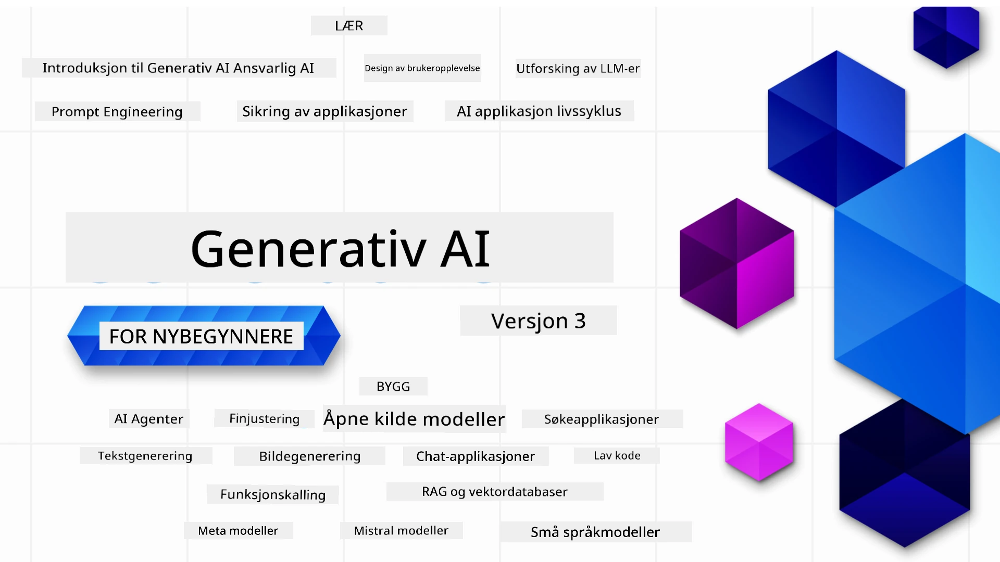

<!--
CO_OP_TRANSLATOR_METADATA:
{
  "original_hash": "054860715e642de31fa8e15c6d01f2b1",
  "translation_date": "2026-01-05T16:05:35+00:00",
  "source_file": "README.md",
  "language_code": "no"
}
-->


### 21 leksjoner som lærer deg alt du trenger å vite for å begynne å bygge Generative AI-applikasjoner

[](https://github.com/microsoft/Generative-AI-For-Beginners/blob/master/LICENSE?WT.mc_id=academic-105485-koreyst)
[](https://GitHub.com/microsoft/Generative-AI-For-Beginners/graphs/contributors/?WT.mc_id=academic-105485-koreyst)
[](https://GitHub.com/microsoft/Generative-AI-For-Beginners/issues/?WT.mc_id=academic-105485-koreyst)
[](https://GitHub.com/microsoft/Generative-AI-For-Beginners/pulls/?WT.mc_id=academic-105485-koreyst)
[](http://makeapullrequest.com?WT.mc_id=academic-105485-koreyst)

[](https://GitHub.com/microsoft/Generative-AI-For-Beginners/watchers/?WT.mc_id=academic-105485-koreyst)
[](https://GitHub.com/microsoft/Generative-AI-For-Beginners/network/?WT.mc_id=academic-105485-koreyst)
[](https://GitHub.com/microsoft/Generative-AI-For-Beginners/stargazers/?WT.mc_id=academic-105485-koreyst)

[](https://discord.gg/nTYy5BXMWG)

### 🌐 Flerspråklig støtte

#### Støttet via GitHub Action (Automatisert og alltid oppdatert)

<!-- CO-OP TRANSLATOR LANGUAGES TABLE START -->
[Arabic](../ar/README.md) | [Bengali](../bn/README.md) | [Bulgarian](../bg/README.md) | [Burmese (Myanmar)](../my/README.md) | [Chinese (Simplified)](../zh/README.md) | [Chinese (Traditional, Hong Kong)](../hk/README.md) | [Chinese (Traditional, Macau)](../mo/README.md) | [Chinese (Traditional, Taiwan)](../tw/README.md) | [Croatian](../hr/README.md) | [Czech](../cs/README.md) | [Danish](../da/README.md) | [Dutch](../nl/README.md) | [Estonian](../et/README.md) | [Finnish](../fi/README.md) | [French](../fr/README.md) | [German](../de/README.md) | [Greek](../el/README.md) | [Hebrew](../he/README.md) | [Hindi](../hi/README.md) | [Hungarian](../hu/README.md) | [Indonesian](../id/README.md) | [Italian](../it/README.md) | [Japanese](../ja/README.md) | [Kannada](../kn/README.md) | [Korean](../ko/README.md) | [Lithuanian](../lt/README.md) | [Malay](../ms/README.md) | [Malayalam](../ml/README.md) | [Marathi](../mr/README.md) | [Nepali](../ne/README.md) | [Nigerian Pidgin](../pcm/README.md) | [Norwegian](./README.md) | [Persian (Farsi)](../fa/README.md) | [Polish](../pl/README.md) | [Portuguese (Brazil)](../br/README.md) | [Portuguese (Portugal)](../pt/README.md) | [Punjabi (Gurmukhi)](../pa/README.md) | [Romanian](../ro/README.md) | [Russian](../ru/README.md) | [Serbian (Cyrillic)](../sr/README.md) | [Slovak](../sk/README.md) | [Slovenian](../sl/README.md) | [Spanish](../es/README.md) | [Swahili](../sw/README.md) | [Swedish](../sv/README.md) | [Tagalog (Filipino)](../tl/README.md) | [Tamil](../ta/README.md) | [Telugu](../te/README.md) | [Thai](../th/README.md) | [Turkish](../tr/README.md) | [Ukrainian](../uk/README.md) | [Urdu](../ur/README.md) | [Vietnamese](../vi/README.md)

> **Foretrekker å klone lokalt?**

> Dette depotet inkluderer over 50 språkoversettelser som øker nedlastingsstørrelsen betydelig. For å klone uten oversettelser, bruk sparse checkout:
> ```bash
> git clone --filter=blob:none --sparse https://github.com/microsoft/generative-ai-for-beginners.git
> cd generative-ai-for-beginners
> git sparse-checkout set --no-cone '/*' '!translations' '!translated_images'
> ```
> Dette gir deg alt du trenger for å fullføre kurset med en mye raskere nedlasting.
<!-- CO-OP TRANSLATOR LANGUAGES TABLE END -->

# Generative AI for Beginners (Versjon 3) - Et kurs

Lær det grunnleggende om å bygge Generative AI-applikasjoner med vårt 21-leksjons omfattende kurs av Microsoft Cloud Advocates.

## 🌱 Komme i gang

Dette kurset har 21 leksjoner. Hver leksjon dekker sitt eget emne, så start hvor du vil!

Leksjonene er merket enten som "Lær" leksjoner som forklarer et Generative AI-konsept, eller "Bygg" leksjoner som forklarer et konsept og kodeeksempler i både **Python** og **TypeScript** når mulig.

For .NET-utviklere, se [Generative AI for Beginners (.NET Edition)](https://github.com/microsoft/Generative-AI-for-beginners-dotnet?WT.mc_id=academic-105485-koreyst)!

Hver leksjon inkluderer også en "Fortsett å lære"-seksjon med ekstra læringsverktøy.

## Hva du trenger
### For å kjøre koden til dette kurset, kan du bruke enten: 
 - [Azure OpenAI Service](https://aka.ms/genai-beginners/azure-open-ai?WT.mc_id=academic-105485-koreyst) - **Leksjoner:** "aoai-assignment"
 - [GitHub Marketplace Model Catalog](https://aka.ms/genai-beginners/gh-models?WT.mc_id=academic-105485-koreyst) - **Leksjoner:** "githubmodels"
 - [OpenAI API](https://aka.ms/genai-beginners/open-ai?WT.mc_id=academic-105485-koreyst) - **Leksjoner:** "oai-assignment" 
   
- Grunnleggende kunnskap i Python eller TypeScript er nyttig - \*For absolutt nybegynnere, sjekk ut disse [Python](https://aka.ms/genai-beginners/python?WT.mc_id=academic-105485-koreyst) og [TypeScript](https://aka.ms/genai-beginners/typescript?WT.mc_id=academic-105485-koreyst) kursene
- En GitHub-konto for å [forke hele dette depotet](https://aka.ms/genai-beginners/github?WT.mc_id=academic-105485-koreyst) til din egen GitHub-konto

Vi har laget en **[Kursoppsett](./00-course-setup/README.md?WT.mc_id=academic-105485-koreyst)** leksjon for å hjelpe deg med å sette opp ditt utviklingsmiljø.

Ikke glem å [starte (🌟) dette depotet](https://docs.github.com/en/get-started/exploring-projects-on-github/saving-repositories-with-stars?WT.mc_id=academic-105485-koreyst) for å finne det lettere senere.

## 🧠 Klar til å distribuere?

Hvis du leter etter mer avanserte kodeeksempler, sjekk ut vår [samling av Generative AI-kodeeksempler](https://aka.ms/genai-beg-code?WT.mc_id=academic-105485-koreyst) i både **Python** og **TypeScript**.

## 🗣️ Møt andre elever, få støtte

Bli med på vår [offisielle Azure AI Foundry Discord-server](https://aka.ms/genai-discord?WT.mc_id=academic-105485-koreyst) for å møte og nettverke med andre som tar dette kurset og få støtte.

Still spørsmål eller del produktfeedback i vår [Azure AI Foundry Developer Forum](https://aka.ms/azureaifoundry/forum) på Github.

## 🚀 Bygger du en startup?

Besøk [Microsoft for Startups](https://www.microsoft.com/startups) for å finne ut hvordan du kan komme i gang med bygging ved hjelp av Azure-kreditter i dag.

## 🙏 Vil du hjelpe?

Har du forslag eller funnet stave- eller kodefeil? [Opprett en sak](https://github.com/microsoft/generative-ai-for-beginners/issues?WT.mc_id=academic-105485-koreyst) eller [Lag en pull request](https://github.com/microsoft/generative-ai-for-beginners/pulls?WT.mc_id=academic-105485-koreyst)

## 📂 Hver leksjon inkluderer:

- En kort videointroduksjon til emnet
- En skriftlig leksjon som ligger i README
- Python- og TypeScript-kodeeksempler som støtter Azure OpenAI og OpenAI API
- Lenker til ekstra ressurser for å fortsette læringen din

## 🗃️ Leksjoner

| #   | **Leksjonslenke**                                                                                                                           | **Beskrivelse**                                                                                | **Video**                                                                   | **Ekstra læring**                                                              |
| --- | -------------------------------------------------------------------------------------------------------------------------------------------- | --------------------------------------------------------------------------------------------- | --------------------------------------------------------------------------- | ------------------------------------------------------------------------------ |
| 00  | [Kursoppsett](./00-course-setup/README.md?WT.mc_id=academic-105485-koreyst)                                                                 | **Lær:** Hvordan sette opp ditt utviklingsmiljø                                              | Video kommer snart                                                           | [Lær mer](https://aka.ms/genai-collection?WT.mc_id=academic-105485-koreyst)     |
| 01  | [Introduksjon til Generative AI og LLMs](./01-introduction-to-genai/README.md?WT.mc_id=academic-105485-koreyst)                              | **Lær:** Forstå hva Generative AI er og hvordan store språkmodeller (LLMs) fungerer           | [Video](https://aka.ms/gen-ai-lesson-1-gh?WT.mc_id=academic-105485-koreyst) | [Lær mer](https://aka.ms/genai-collection?WT.mc_id=academic-105485-koreyst)     |
| 02  | [Utforske og sammenligne forskjellige LLMs](./02-exploring-and-comparing-different-llms/README.md?WT.mc_id=academic-105485-koreyst)          | **Lær:** Hvordan velge riktig modell for ditt bruksområde                                    | [Video](https://aka.ms/gen-ai-lesson2-gh?WT.mc_id=academic-105485-koreyst)  | [Lær mer](https://aka.ms/genai-collection?WT.mc_id=academic-105485-koreyst)     |
| 03  | [Bruke Generative AI ansvarlig](./03-using-generative-ai-responsibly/README.md?WT.mc_id=academic-105485-koreyst)                             | **Lær:** Hvordan bygge Generative AI-applikasjoner på en ansvarlig måte                      | [Video](https://aka.ms/gen-ai-lesson3-gh?WT.mc_id=academic-105485-koreyst)  | [Lær mer](https://aka.ms/genai-collection?WT.mc_id=academic-105485-koreyst)     |
| 04  | [Forstå grunnleggende Prompt Engineering](./04-prompt-engineering-fundamentals/README.md?WT.mc_id=academic-105485-koreyst)                   | **Lær:** Praktiske beste fremgangsmåter for prompt engineering                               | [Video](https://aka.ms/gen-ai-lesson4-gh?WT.mc_id=academic-105485-koreyst)  | [Lær mer](https://aka.ms/genai-collection?WT.mc_id=academic-105485-koreyst)     |
| 05  | [Lage avanserte prompt](./05-advanced-prompts/README.md?WT.mc_id=academic-105485-koreyst)                                                | **Lær:** Hvordan bruke prompt engineering-teknikker som forbedrer resultatet av dine prompt. | [Video](https://aka.ms/gen-ai-lesson5-gh?WT.mc_id=academic-105485-koreyst)  | [Lær mer](https://aka.ms/genai-collection?WT.mc_id=academic-105485-koreyst) |
| 06  | [Bygge tekstgenereringsapplikasjoner](./06-text-generation-apps/README.md?WT.mc_id=academic-105485-koreyst)                                | **Bygg:** En app for tekstgenerering ved bruk av Azure OpenAI / OpenAI API                    | [Video](https://aka.ms/gen-ai-lesson6-gh?WT.mc_id=academic-105485-koreyst)  | [Lær mer](https://aka.ms/genai-collection?WT.mc_id=academic-105485-koreyst) |
| 07  | [Bygge chatteapplikasjoner](./07-building-chat-applications/README.md?WT.mc_id=academic-105485-koreyst)                                     | **Bygg:** Teknikker for effektivt å bygge og integrere chatteapplikasjoner.                   | [Video](https://aka.ms/gen-ai-lessons7-gh?WT.mc_id=academic-105485-koreyst) | [Lær mer](https://aka.ms/genai-collection?WT.mc_id=academic-105485-koreyst) |
| 08  | [Bygge søkeapper med vektordatabaser](./08-building-search-applications/README.md?WT.mc_id=academic-105485-koreyst)                        | **Bygg:** En søkeapplikasjon som bruker Embeddings for å søke etter data.                     | [Video](https://aka.ms/gen-ai-lesson8-gh?WT.mc_id=academic-105485-koreyst)  | [Lær mer](https://aka.ms/genai-collection?WT.mc_id=academic-105485-koreyst) |
| 09  | [Bygge applikasjoner for bildegenerering](./09-building-image-applications/README.md?WT.mc_id=academic-105485-koreyst)                      | **Bygg:** En applikasjon for bildegenerering                                                | [Video](https://aka.ms/gen-ai-lesson9-gh?WT.mc_id=academic-105485-koreyst)  | [Lær mer](https://aka.ms/genai-collection?WT.mc_id=academic-105485-koreyst) |
| 10  | [Bygge lavkode AI-applikasjoner](./10-building-low-code-ai-applications/README.md?WT.mc_id=academic-105485-koreyst)                         | **Bygg:** En generativ AI-applikasjon ved bruk av lavkode-verktøy                            | [Video](https://aka.ms/gen-ai-lesson10-gh?WT.mc_id=academic-105485-koreyst) | [Lær mer](https://aka.ms/genai-collection?WT.mc_id=academic-105485-koreyst) |
| 11  | [Integrere eksterne applikasjoner med Function Calling](./11-integrating-with-function-calling/README.md?WT.mc_id=academic-105485-koreyst)   | **Bygg:** Hva function calling er og bruksområder for applikasjoner                         | [Video](https://aka.ms/gen-ai-lesson11-gh?WT.mc_id=academic-105485-koreyst) | [Lær mer](https://aka.ms/genai-collection?WT.mc_id=academic-105485-koreyst) |
| 12  | [Designe UX for AI-applikasjoner](./12-designing-ux-for-ai-applications/README.md?WT.mc_id=academic-105485-koreyst)                         | **Lær:** Hvordan bruke UX-designprinsipper ved utvikling av generative AI-applikasjoner      | [Video](https://aka.ms/gen-ai-lesson12-gh?WT.mc_id=academic-105485-koreyst) | [Lær mer](https://aka.ms/genai-collection?WT.mc_id=academic-105485-koreyst) |
| 13  | [Sikre dine generative AI-applikasjoner](./13-securing-ai-applications/README.md?WT.mc_id=academic-105485-koreyst)                         | **Lær:** Trusler og risikoer for AI-systemer og metoder for å sikre disse systemene.         | [Video](https://aka.ms/gen-ai-lesson13-gh?WT.mc_id=academic-105485-koreyst) | [Lær mer](https://aka.ms/genai-collection?WT.mc_id=academic-105485-koreyst) |
| 14  | [Livssyklusen til generative AI-applikasjoner](./14-the-generative-ai-application-lifecycle/README.md?WT.mc_id=academic-105485-koreyst)     | **Lær:** Verktøyene og målene for å administrere LLM-livssyklusen og LLMOps                   | [Video](https://aka.ms/gen-ai-lesson14-gh?WT.mc_id=academic-105485-koreyst) | [Lær mer](https://aka.ms/genai-collection?WT.mc_id=academic-105485-koreyst) |
| 15  | [Retrieval Augmented Generation (RAG) og vektordatabaser](./15-rag-and-vector-databases/README.md?WT.mc_id=academic-105485-koreyst)          | **Bygg:** En applikasjon som bruker et RAG-rammeverk for å hente embeddings fra vektordatabaser | [Video](https://aka.ms/gen-ai-lesson15-gh?WT.mc_id=academic-105485-koreyst) | [Lær mer](https://aka.ms/genai-collection?WT.mc_id=academic-105485-koreyst) |
| 16  | [Open Source modeller og Hugging Face](./16-open-source-models/README.md?WT.mc_id=academic-105485-koreyst)                                    | **Bygg:** En applikasjon ved bruk av open source-modeller tilgjengelige på Hugging Face      | [Video](https://aka.ms/gen-ai-lesson16-gh?WT.mc_id=academic-105485-koreyst) | [Lær mer](https://aka.ms/genai-collection?WT.mc_id=academic-105485-koreyst) |
| 17  | [AI-agenter](./17-ai-agents/README.md?WT.mc_id=academic-105485-koreyst)                                                                       | **Bygg:** En applikasjon som bruker et AI Agent-rammeverk                                   | [Video](https://aka.ms/gen-ai-lesson17-gh?WT.mc_id=academic-105485-koreyst) | [Lær mer](https://aka.ms/genai-collection?WT.mc_id=academic-105485-koreyst) |
| 18  | [Finjustering av LLMs](./18-fine-tuning/README.md?WT.mc_id=academic-105485-koreyst)                                                          | **Lær:** Hva, hvorfor og hvordan finjustering av LLMs fungerer                               | [Video](https://aka.ms/gen-ai-lesson18-gh?WT.mc_id=academic-105485-koreyst) | [Lær mer](https://aka.ms/genai-collection?WT.mc_id=academic-105485-koreyst) |
| 19  | [Bygge med SLMs](./19-slm/README.md?WT.mc_id=academic-105485-koreyst)                                                                        | **Lær:** Fordelene ved å bygge med Small Language Models                                   | Video kommer snart | [Lær mer](https://aka.ms/genai-collection?WT.mc_id=academic-105485-koreyst) |
| 20  | [Bygge med Mistral-modeller](./20-mistral/README.md?WT.mc_id=academic-105485-koreyst)                                                        | **Lær:** Funksjonene og forskjellene til Mistral Family Models                              | Video kommer snart | [Lær mer](https://aka.ms/genai-collection?WT.mc_id=academic-105485-koreyst) |
| 21  | [Bygge med Meta-modeller](./21-meta/README.md?WT.mc_id=academic-105485-koreyst)                                                              | **Lær:** Funksjonene og forskjellene til Meta Family Models                                | Video kommer snart | [Lær mer](https://aka.ms/genai-collection?WT.mc_id=academic-105485-koreyst) |

### 🌟 Spesiell takk

Spesiell takk til [**John Aziz**](https://www.linkedin.com/in/john0isaac/) for å ha laget alle GitHub Actions og workflows

[**Bernhard Merkle**](https://www.linkedin.com/in/bernhard-merkle-738b73/) for viktige bidrag til hver leksjon for å forbedre lærings- og kodeopplevelsen.

## 🎒 Andre kurs

Teamet vårt produserer andre kurs! Sjekk ut:

<!-- CO-OP TRANSLATOR OTHER COURSES START -->
### LangChain
[](https://aka.ms/langchain4j-for-beginners)
[](https://aka.ms/langchainjs-for-beginners?WT.mc_id=m365-94501-dwahlin)

---

### Azure / Edge / MCP / Agenter
[](https://github.com/microsoft/AZD-for-beginners?WT.mc_id=academic-105485-koreyst)
[](https://github.com/microsoft/edgeai-for-beginners?WT.mc_id=academic-105485-koreyst)
[](https://github.com/microsoft/mcp-for-beginners?WT.mc_id=academic-105485-koreyst)
[](https://github.com/microsoft/ai-agents-for-beginners?WT.mc_id=academic-105485-koreyst)

---
 
### Generativ AI-serie
[](https://github.com/microsoft/generative-ai-for-beginners?WT.mc_id=academic-105485-koreyst)
[-9333EA?style=for-the-badge&labelColor=E5E7EB&color=9333EA)](https://github.com/microsoft/Generative-AI-for-beginners-dotnet?WT.mc_id=academic-105485-koreyst)
[-C084FC?style=for-the-badge&labelColor=E5E7EB&color=C084FC)](https://github.com/microsoft/generative-ai-for-beginners-java?WT.mc_id=academic-105485-koreyst)
[-E879F9?style=for-the-badge&labelColor=E5E7EB&color=E879F9)](https://github.com/microsoft/generative-ai-with-javascript?WT.mc_id=academic-105485-koreyst)

---
 
### Kjerneopplæring
[](https://aka.ms/ml-beginners?WT.mc_id=academic-105485-koreyst)
[](https://aka.ms/datascience-beginners?WT.mc_id=academic-105485-koreyst)
[](https://aka.ms/ai-beginners?WT.mc_id=academic-105485-koreyst)
[](https://github.com/microsoft/Security-101?WT.mc_id=academic-96948-sayoung)
[](https://aka.ms/webdev-beginners?WT.mc_id=academic-105485-koreyst)
[](https://aka.ms/iot-beginners?WT.mc_id=academic-105485-koreyst)
[](https://github.com/microsoft/xr-development-for-beginners?WT.mc_id=academic-105485-koreyst)

---
 
### Copilot-serien
[](https://aka.ms/GitHubCopilotAI?WT.mc_id=academic-105485-koreyst)
[](https://github.com/microsoft/mastering-github-copilot-for-dotnet-csharp-developers?WT.mc_id=academic-105485-koreyst)
[](https://github.com/microsoft/CopilotAdventures?WT.mc_id=academic-105485-koreyst)
<!-- CO-OP TRANSLATOR OTHER COURSES END -->

## Få hjelp

Hvis du står fast eller har spørsmål om å bygge AI-apper. Bli med medstudenter og erfarne utviklere i diskusjoner om MCP. Det er et støttende fellesskap hvor spørsmål er velkomne og kunnskap deles fritt.

[](https://discord.gg/nTYy5BXMWG)

Hvis du har produktinnspill eller opplever feil mens du bygger, besøk:

[](https://aka.ms/foundry/forum)

---

<!-- CO-OP TRANSLATOR DISCLAIMER START -->
**Ansvarsfraskrivelse**:
Dette dokumentet er oversatt ved hjelp av AI-oversettelsestjenesten [Co-op Translator](https://github.com/Azure/co-op-translator). Selv om vi streber etter nøyaktighet, vennligst vær oppmerksom på at automatiske oversettelser kan inneholde feil eller unøyaktigheter. Det opprinnelige dokumentet på dets opprinnelige språk bør betraktes som den autoritative kilden. For kritisk informasjon anbefales profesjonell menneskelig oversettelse. Vi påtar oss ikke ansvar for eventuelle misforståelser eller feiltolkninger som oppstår fra bruken av denne oversettelsen.
<!-- CO-OP TRANSLATOR DISCLAIMER END -->