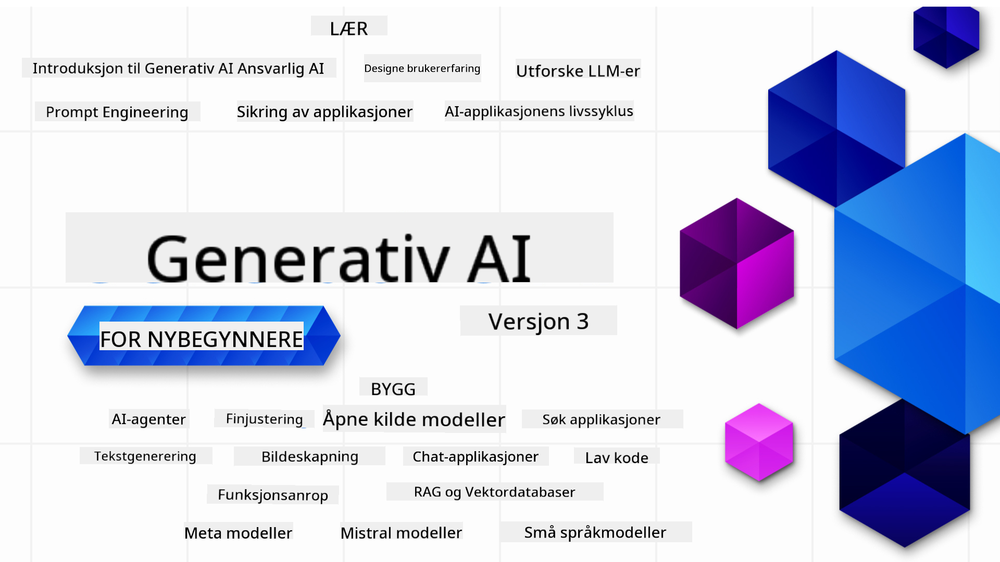

<!--
CO_OP_TRANSLATOR_METADATA:
{
  "original_hash": "c2ee25895ebbfa1a52868bb6eab686fc",
  "translation_date": "2025-05-19T11:48:26+00:00",
  "source_file": "README.md",
  "language_code": "no"
}
-->

### 21 Leksjoner som lærer deg alt du trenger å vite for å begynne å bygge Generativ AI-applikasjoner

### 🌐 Støtte for flere språk

#### Støttet via GitHub Action (Automatisk & Alltid Oppdatert)
[Norsk](./README.md)
# Generative AI for Beginners (Version 3) - Et kurs

Lær det grunnleggende om å bygge Generative AI-applikasjoner med vårt omfattende 21-leksjonskurs fra Microsoft Cloud Advocates.

## 🌱 Kom i gang

Dette kurset har 21 leksjoner. Hver leksjon dekker sitt eget tema, så start der du vil!

Leksjonene er merket enten som "Lær"-leksjoner som forklarer et Generative AI-konsept eller "Bygg"-leksjoner som forklarer et konsept og kodeeksempler i både **Python** og **TypeScript** når det er mulig.

For .NET-utviklere, sjekk ut [Generative AI for Beginners (.NET Edition)](https://github.com/microsoft/Generative-AI-for-beginners-dotnet?WT.mc_id=academic-105485-koreyst)!

Hver leksjon inkluderer også en "Fortsett å lære"-seksjon med flere læringsverktøy.

## Hva du trenger
### For å kjøre koden i dette kurset, kan du bruke enten: 
 - [Azure OpenAI Service](https://aka.ms/genai-beginners/azure-open-ai?WT.mc_id=academic-105485-koreyst) - **Leksjoner:** "aoai-assignment"
 - [GitHub Marketplace Model Catalog](https://aka.ms/genai-beginners/gh-models?WT.mc_id=academic-105485-koreyst) - **Leksjoner:** "githubmodels"
 - [OpenAI API](https://aka.ms/genai-beginners/open-ai?WT.mc_id=academic-105485-koreyst) - **Leksjoner:** "oai-assignment" 
   
- Grunnleggende kunnskap om Python eller TypeScript er nyttig - \*For nybegynnere, sjekk ut disse [Python](https://aka.ms/genai-beginners/python?WT.mc_id=academic-105485-koreyst) og [TypeScript](https://aka.ms/genai-beginners/typescript?WT.mc_id=academic-105485-koreyst) kursene
- En GitHub-konto for å [forke hele repoen](https://aka.ms/genai-beginners/github?WT.mc_id=academic-105485-koreyst) til din egen GitHub-konto

Vi har laget en **[Kursoppsett](./00-course-setup/README.md?WT.mc_id=academic-105485-koreyst)** leksjon for å hjelpe deg med å sette opp ditt utviklingsmiljø.

Ikke glem å [stjernemerke (🌟) denne repoen](https://docs.github.com/en/get-started/exploring-projects-on-github/saving-repositories-with-stars?WT.mc_id=academic-105485-koreyst) for å finne den lettere senere.

## 🧠 Klar til å distribuere?

Hvis du ser etter mer avanserte kodeeksempler, sjekk ut vår [samling av Generative AI-kodeeksempler](https://aka.ms/genai-beg-code?WT.mc_id=academic-105485-koreyst) i både **Python** og **TypeScript**.

## 🗣️ Møt andre lærere, få støtte

Bli med på vår [offisielle Azure AI Foundry Discord-server](https://aka.ms/genai-discord?WT.mc_id=academic-105485-koreyst) for å møte og nettverke med andre lærere som tar dette kurset og få støtte.

Still spørsmål eller del produktfeedback i vårt [Azure AI Foundry Developer Forum](https://aka.ms/azureaifoundry/forum) på Github.

## 🚀 Bygger du en oppstart?

Registrer deg for [Microsoft for Startups Founders Hub](https://aka.ms/genai-foundershub?WT.mc_id=academic-105485-koreyst) for å motta **gratis OpenAI-kreditter** og opptil **$150k mot Azure-kreditter for å få tilgang til OpenAI-modeller gjennom Azure OpenAI Services**.

## 🙏 Vil du hjelpe?

Har du forslag eller funnet skrivefeil eller kodefeil? [Opprett en sak](https://github.com/microsoft/generative-ai-for-beginners/issues?WT.mc_id=academic-105485-koreyst) eller [Lag en pull request](https://github.com/microsoft/generative-ai-for-beginners/pulls?WT.mc_id=academic-105485-koreyst)

## 📂 Hver leksjon inkluderer:

- En kort videointroduksjon til emnet
- En skriftlig leksjon som ligger i README
- Python og TypeScript kodeeksempler som støtter Azure OpenAI og OpenAI API
- Lenker til ekstra ressurser for å fortsette din læring

## 🗃️ Leksjoner

| #   | **Leksjonslink**                                                                                                                              | **Beskrivelse**                                                                                 | **Video**                                                                   | **Ekstra læring**                                                             |
| --- | -------------------------------------------------------------------------------------------------------------------------------------------- | ----------------------------------------------------------------------------------------------- | --------------------------------------------------------------------------- | ------------------------------------------------------------------------------ |
| 00  | [Kursoppsett](./00-course-setup/README.md?WT.mc_id=academic-105485-koreyst)                                                                 | **Lær:** Hvordan sette opp ditt utviklingsmiljø                                            | Video kommer snart                                                                 | [Lær mer](https://aka.ms/genai-collection?WT.mc_id=academic-105485-koreyst) |
| 01  | [Introduksjon til Generative AI og LLMs](./01-introduction-to-genai/README.md?WT.mc_id=academic-105485-koreyst)                              | **Lær:** Forstå hva Generative AI er og hvordan Large Language Models (LLMs) fungerer       | [Video](https://aka.ms/gen-ai-lesson-1-gh?WT.mc_id=academic-105485-koreyst) | [Lær mer](https://aka.ms/genai-collection?WT.mc_id=academic-105485-koreyst) |
| 02  | [Utforske og sammenligne forskjellige LLMs](./02-exploring-and-comparing-different-llms/README.md?WT.mc_id=academic-105485-koreyst)             | **Lær:** Hvordan velge riktig modell for din brukssituasjon                                      | [Video](https://aka.ms/gen-ai-lesson2-gh?WT.mc_id=academic-105485-koreyst)  | [Lær mer](https://aka.ms/genai-collection?WT.mc_id=academic-105485-koreyst) |
| 03  | [Bruke Generative AI Ansvarlig](./03-using-generative-ai-responsibly/README.md?WT.mc_id=academic-105485-koreyst)                           | **Lær:** Hvordan bygge Generative AI-applikasjoner ansvarlig                                  | [Video](https://aka.ms/gen-ai-lesson3-gh?WT.mc_id=academic-105485-koreyst)  | [Lær mer](https://aka.ms/genai-collection?WT.mc_id=academic-105485-koreyst) |
| 04  | [Forstå Grunnleggende om Prompt Engineering](./04-prompt-engineering-fundamentals/README.md?WT.mc_id=academic-105485-koreyst)             | **Lær:** Praktiske Beste Praksiser for Prompt Engineering                                           | [Video](https://aka.ms/gen-ai-lesson4-gh?WT.mc_id=academic-105485-koreyst)  | [Lær mer](https://aka.ms/genai-collection?WT.mc_id=academic-105485-koreyst) |
| 05  | [Lage avanserte prompt](./05-advanced-prompts/README.md?WT.mc_id=academic-105485-koreyst)                                                | **Lær:** Hvordan bruke teknikker for prompt engineering som forbedrer resultatene av dine prompt. | [Video](https://aka.ms/gen-ai-lesson5-gh?WT.mc_id=academic-105485-koreyst)  | [Lær mer](https://aka.ms/genai-collection?WT.mc_id=academic-105485-koreyst) |
| 06  | [Bygge tekstgenereringsapplikasjoner](./06-text-generation-apps/README.md?WT.mc_id=academic-105485-koreyst)                                | **Bygg:** En tekstgenereringsapp ved hjelp av Azure OpenAI / OpenAI API                                | [Video](https://aka.ms/gen-ai-lesson6-gh?WT.mc_id=academic-105485-koreyst)  | [Lær mer](https://aka.ms/genai-collection?WT.mc_id=academic-105485-koreyst) |
| 07  | [Bygge chatteapplikasjoner](./07-building-chat-applications/README.md?WT.mc_id=academic-105485-koreyst)                                     | **Bygg:** Teknikker for effektivt å bygge og integrere chatteapplikasjoner.               | [Video](https://aka.ms/gen-ai-lessons7-gh?WT.mc_id=academic-105485-koreyst) | [Lær mer](https://aka.ms/genai-collection?WT.mc_id=academic-105485-koreyst) |
| 08  | [Bygge søkeapplikasjoner med vektordatabaser](./08-building-search-applications/README.md?WT.mc_id=academic-105485-koreyst)                        | **Bygg:** En søkeapplikasjon som bruker Embeddings for å søke etter data.                        | [Video](https://aka.ms/gen-ai-lesson8-gh?WT.mc_id=academic-105485-koreyst)  | [Lær mer](https://aka.ms/genai-collection?WT.mc_id=academic-105485-koreyst) |
| 09  | [Bygge bildegenereringsapplikasjoner](./09-building-image-applications/README.md?WT.mc_id=academic-105485-koreyst)                        | **Bygg:** En bildegenereringsapplikasjon                                                       | [Video](https://aka.ms/gen-ai-lesson9-gh?WT.mc_id=academic-105485-koreyst)  | [Lær mer](https://aka.ms/genai-collection?WT.mc_id=academic-105485-koreyst) |
| 10  | [Bygge lavkode AI-applikasjoner](./10-building-low-code-ai-applications/README.md?WT.mc_id=academic-105485-koreyst)                       | **Bygg:** En generativ AI-applikasjon ved hjelp av lavkodeverktøy                                     | [Video](https://aka.ms/gen-ai-lesson10-gh?WT.mc_id=academic-105485-koreyst) | [Lær mer](https://aka.ms/genai-collection?WT.mc_id=academic-105485-koreyst) |
| 11  | [Integrere eksterne applikasjoner med funksjonskall](./11-integrating-with-function-calling/README.md?WT.mc_id=academic-105485-koreyst) | **Bygg:** Hva funksjonskall er og bruksområdene for applikasjoner                          | [Video](https://aka.ms/gen-ai-lesson11-gh?WT.mc_id=academic-105485-koreyst) | [Lær mer](https://aka.ms/genai-collection?WT.mc_id=academic-105485-koreyst) |
| 12  | [Designe brukeropplevelse for AI-applikasjoner](./12-designing-ux-for-ai-applications/README.md?WT.mc_id=academic-105485-koreyst)                         | **Lær:** Hvordan anvende prinsipper for brukeropplevelse når man utvikler generative AI-applikasjoner         | [Video](https://aka.ms/gen-ai-lesson12-gh?WT.mc_id=academic-105485-koreyst) | [Lær mer](https://aka.ms/genai-collection?WT.mc_id=academic-105485-koreyst) |
| 13  | [Sikre dine generative AI-applikasjoner](./13-securing-ai-applications/README.md?WT.mc_id=academic-105485-koreyst)                         | **Lær:** Truslene og risikoene for AI-systemer og metoder for å sikre disse systemene.             | [Video](https://aka.ms/gen-ai-lesson13-gh?WT.mc_id=academic-105485-koreyst) | [Lær mer](https://aka.ms/genai-collection?WT.mc_id=academic-105485-koreyst) |
| 14  | [Livssyklusen for generative AI-applikasjoner](./14-the-generative-ai-application-lifecycle/README.md?WT.mc_id=academic-105485-koreyst)           | **Lær:** Verktøyene og målemetodene for å håndtere LLM-livssyklusen og LLMOps                         | [Video](https://aka.ms/gen-ai-lesson14-gh?WT.mc_id=academic-105485-koreyst) | [Lær mer](https://aka.ms/genai-collection?WT.mc_id=academic-105485-koreyst) |
| 15  | [Gjenfinning Forsterket Generering (RAG) og Vektordatabaser](./15-rag-and-vector-databases/README.md?WT.mc_id=academic-105485-koreyst)        | **Bygg:** En applikasjon ved bruk av et RAG-rammeverk for å hente embeddings fra en vektordatabase  | [Video](https://aka.ms/gen-ai-lesson15-gh?WT.mc_id=academic-105485-koreyst) | [Lær Mer](https://aka.ms/genai-collection?WT.mc_id=academic-105485-koreyst) |
| 16  | [Åpen Kildekode-modeller og Hugging Face](./16-open-source-models/README.md?WT.mc_id=academic-105485-koreyst)                                    | **Bygg:** En applikasjon ved bruk av åpne kildekode-modeller tilgjengelig på Hugging Face                    | [Video](https://aka.ms/gen-ai-lesson16-gh?WT.mc_id=academic-105485-koreyst) | [Lær Mer](https://aka.ms/genai-collection?WT.mc_id=academic-105485-koreyst) |
| 17  | [AI-agenter](./17-ai-agents/README.md?WT.mc_id=academic-105485-koreyst)                                                                       | **Bygg:** En applikasjon ved bruk av et AI-agent rammeverk                                           | [Video](https://aka.ms/gen-ai-lesson17-gh?WT.mc_id=academic-105485-koreyst) | [Lær Mer](https://aka.ms/genai-collection?WT.mc_id=academic-105485-koreyst) |
| 18  | [Finjustering av LLM-er](./18-fine-tuning/README.md?WT.mc_id=academic-105485-koreyst)                                                              | **Lær:** Hva, hvorfor og hvordan finjustere LLM-er                                            | [Video](https://aka.ms/gen-ai-lesson18-gh?WT.mc_id=academic-105485-koreyst) | [Lær Mer](https://aka.ms/genai-collection?WT.mc_id=academic-105485-koreyst) |
| 19  | [Bygge med SLM-er](./19-slm/README.md?WT.mc_id=academic-105485-koreyst)                                                              | **Lær:** Fordelene ved å bygge med små språkmodeller                                            | Video Kommer Snart | [Lær Mer](https://aka.ms/genai-collection?WT.mc_id=academic-105485-koreyst) |
| 20  | [Bygge med Mistral-modeller](./20-mistral/README.md?WT.mc_id=academic-105485-koreyst)                                                              | **Lær:** Egenskapene og forskjellene til Mistral-familien modeller                                           | Video Kommer Snart | [Lær Mer](https://aka.ms/genai-collection?WT.mc_id=academic-105485-koreyst) |
| 21  | [Bygge med Meta-modeller](./21-meta/README.md?WT.mc_id=academic-105485-koreyst)                                                              | **Lær:** Egenskapene og forskjellene til Meta-familien modeller                                           | Video Kommer Snart | [Lær Mer](https://aka.ms/genai-collection?WT.mc_id=academic-105485-koreyst) |

### 🌟 Spesiell takk

Spesiell takk til [**John Aziz**](https://www.linkedin.com/in/john0isaac/) for å ha laget alle GitHub Actions og arbeidsflyter.

[**Bernhard Merkle**](https://www.linkedin.com/in/bernhard-merkle-738b73/) for viktige bidrag til hver leksjon for å forbedre lærings- og kodeopplevelsen.

## 🎒 Andre Kurs

Teamet vårt produserer andre kurs! Ta en titt på:

- [**NY** AI-agenter for nybegynnere](https://github.com/microsoft/ai-agents-for-beginners?WT.mc_id=academic-105485-koreyst)
- [**NY** Generativ AI for nybegynnere med .NET](https://github.com/microsoft/Generative-AI-for-beginners-dotnet?WT.mc_id=academic-105485-koreyst)
- [**NY** Generativ AI for nybegynnere med JavaScript](https://aka.ms/genai-js-course?WT.mc_id=academic-105485-koreyst)
- [ML for nybegynnere](https://aka.ms/ml-beginners?WT.mc_id=academic-105485-koreyst)
- [Data Science for nybegynnere](https://aka.ms/datascience-beginners?WT.mc_id=academic-105485-koreyst)
- [AI for nybegynnere](https://aka.ms/ai-beginners?WT.mc_id=academic-105485-koreyst)
- [Cybersikkerhet for nybegynnere](https://github.com/microsoft/Security-101??WT.mc_id=academic-96948-sayoung)
- [Webutvikling for nybegynnere](https://aka.ms/webdev-beginners?WT.mc_id=academic-105485-koreyst)
- [IoT for nybegynnere](https://aka.ms/iot-beginners?WT.mc_id=academic-105485-koreyst)
- [XR-utvikling for nybegynnere](https://github.com/microsoft/xr-development-for-beginners?WT.mc_id=academic-105485-koreyst)
- [Mestre GitHub Copilot para Programação em Par com IA](https://aka.ms/GitHubCopilotAI?WT.mc_id=academic-105485-koreyst)
- [Mestre GitHub Copilot para Desenvolvedores C#/.NET](https://github.com/microsoft/mastering-github-copilot-for-dotnet-csharp-developers?WT.mc_id=academic-105485-koreyst)
- [Escolha Sua Própria Aventura com Copilot](https://github.com/microsoft/CopilotAdventures?WT.mc_id=academic-105485-koreyst)

Sure, I can translate the text to Norwegian for you:

**Ansvarsfraskrivelse**:  
Dette dokumentet er oversatt ved hjelp av AI-oversettelsestjenesten [Co-op Translator](https://github.com/Azure/co-op-translator). Selv om vi streber etter nøyaktighet, vær oppmerksom på at automatiserte oversettelser kan inneholde feil eller unøyaktigheter. Det originale dokumentet på sitt opprinnelige språk bør betraktes som den autoritative kilden. For kritisk informasjon anbefales profesjonell menneskelig oversettelse. Vi er ikke ansvarlige for misforståelser eller feiltolkninger som oppstår fra bruken av denne oversettelsen.