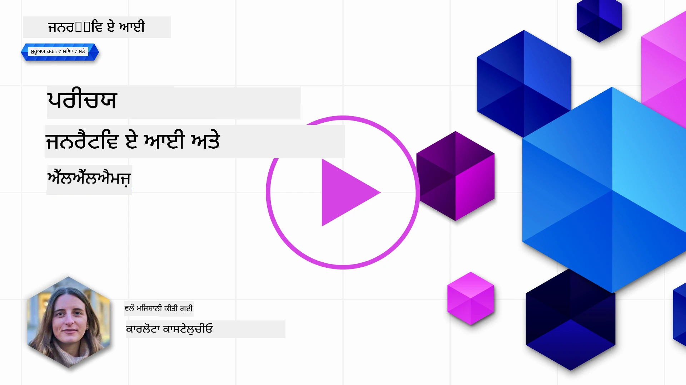
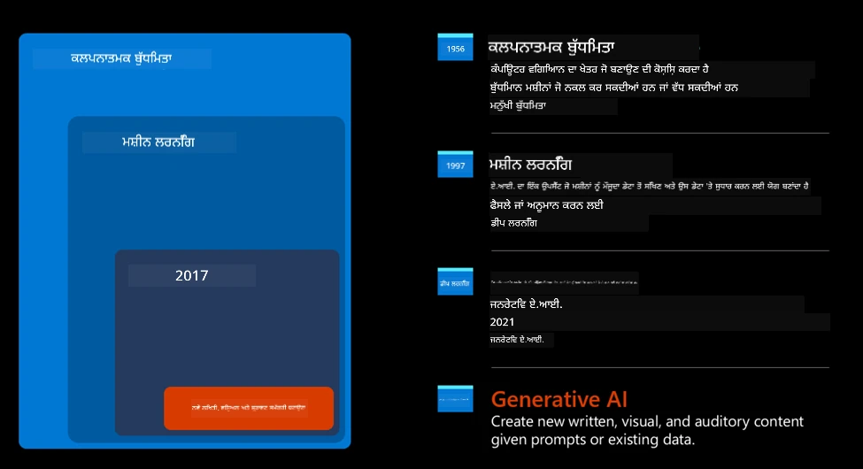
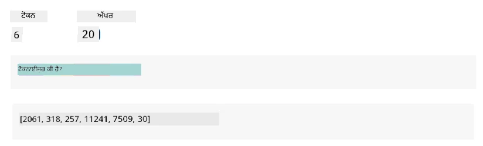
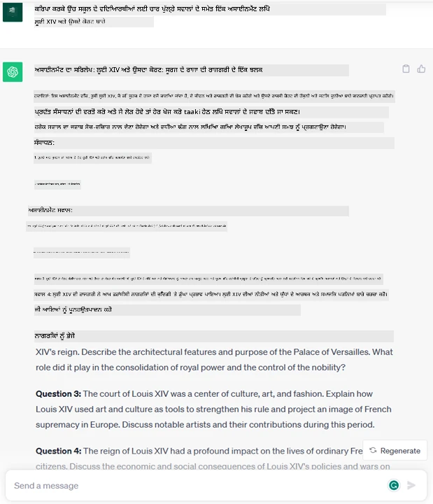
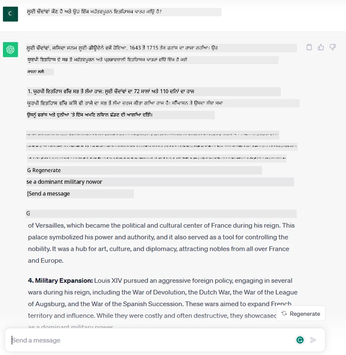
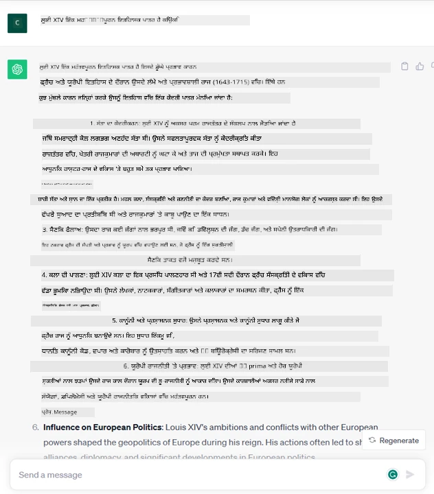
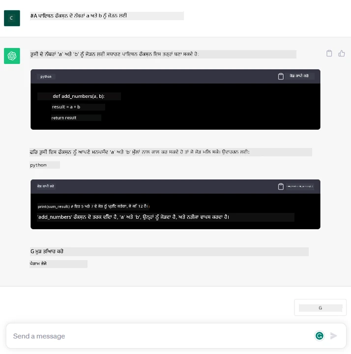

# ਜਨਰੇਟਿਵ AI ਅਤੇ ਵੱਡੇ ਭਾਸ਼ਾ ਮਾਡਲਾਂ ਦਾ ਪਰਿਚਯ

_(ਇਸ ਪਾਠ ਦੇ ਵੀਡੀਓ ਲਈ ਉੱਪਰ ਦਿੱਤੀ ਤਸਵੀਰ 'ਤੇ ਕਲਿੱਕ ਕਰੋ)_

ਜਨਰੇਟਿਵ AI ਇੱਕ ਅਜਿਹਾ ਕ੍ਰਿਤ੍ਰਿਮ ਬੁੱਧਿਮਤਾ ਹੈ ਜੋ ਪਾਠ, ਚਿੱਤਰ ਅਤੇ ਹੋਰ ਕਿਸਮ ਦੇ ਸਮੱਗਰੀ ਨੂੰ ਬਣਾਉਣ ਦੇ ਯੋਗ ਹੈ। ਇਹ ਇਸ ਲਈ ਬੇਹਤਰੀਨ ਤਕਨੀਕ ਹੈ ਕਿਉਂਕਿ ਇਹ AI ਨੂੰ ਹਰ ਕਿਸੇ ਲਈ ਉਪਲਬਧ ਕਰਵਾ ਦਿੰਦੀ ਹੈ, ਕੋਈ ਵੀ ਸਿਰਫ਼ ਕੁਝ ਵਾਕ ਬਣਾਕੇ ਇਸ ਦਾ ਉਪਯੋਗ ਕਰ ਸਕਦਾ ਹੈ। ਤੁਹਾਨੂੰ ਕਿਸੇ ਜਾਵਾ ਜਾਂ SQL ਵਰਗੀ ਭਾਸ਼ਾ ਸਿੱਖਣ ਦੀ ਲੋੜ ਨਹੀਂ ਹੈ, ਸਿਰਫ ਆਪਣੀ ਭਾਸ਼ਾ ਵਿੱਚ ਆਪਣੀ ਚਾਹਤ ਦਰਸਾਓ ਅਤੇ AI ਮਾਡਲ ਵੱਲੋਂ ਸਝਾਅ ਆਉਂਦਾ ਹੈ। ਇਸ ਦੇ ਤੇਜ਼ ਅਤੇ ਵਿਆਪਕ ਪ੍ਰਯੋਗਾਂ ਨਾਲ ਤੁਸੀਂ ਰਿਪੋਰਟ ਲਿਖ ਸਕਦੇ ਹੋ, ਐਪਲੀਕੇਸ਼ਨ ਬਣਾਉਂਦੇ ਹੋ ਅਤੇ ਹੋਰ ਬਹੁਤ ਕੁਝ ਸਕਿੰਟਾਂ ਵਿੱਚ ਕਰ ਸਕਦੇ ਹੋ।

ਇਸ ਕੋਰਸ ਵਿੱਚ ਅਸੀਂ ਦੇਖਾਂਗੇ ਕਿ ਸਾਡੀ ਸਟਾਰਟਅਪ ਜਨਰੇਟਿਵ AI ਨੂੰ ਕਿਵੇਂ ਵਰਤਦੀ ਹੈ ਤਾਂ ਜੋ ਸਿੱਖਿਆ ਦੇ ਖੇਤਰ ਵਿੱਚ ਨਵੇਂ ਮਾਉਕੇ ਖੋਲੇ ਜਾ ਸਕਣ ਅਤੇ ਸਿੱਖਿਆ ਦੀਆਂ ਸਮਾਜਿਕ ਅਤੇ ਤਕਨੀਕੀ ਚੁਣੌਤੀਆਂ ਦਾ ਕਿਵੇਂ ਸਮਨਾ ਕਰਦੀ ਹੈ।

## ਪਰਿਚਯ

ਇਸ ਪਾਠ ਵਿੱਚ ਸ਼ਾਮਲ ਹੈ:

- ਕਾਰੋਬਾਰੀ ਦ੍ਰਿਸ਼ਟੀਕੋਣ ਦਾ ਪਰਿਚਯ: ਸਾਡੀ ਸਟਾਰਟਅਪ ਦਾ ਵਿਚਾਰ ਅਤੇ ਮਿਸ਼ਨ।
- ਜਨਰੇਟਿਵ AI ਅਤੇ ਅੱਜ ਦੀ ਤਕਨੀਕੀ ਰੂਪਰੇਖਾ।
- ਵੱਡੇ ਭਾਸ਼ਾ ਮਾਡਲ ਦਾ ਅੰਦਰੂਨੀ ਕੰਮਕਾਜ।
- ਵੱਡੇ ਭਾਸ਼ਾ ਮਾਡਲ ਦੀਆਂ ਮੁੱਖ ਸਮਰੱਥਾਵਾਂ ਅਤੇ ਵਿਹਾਰਿਕ ਵਰਤੋਂ ਦੇ ਕੇਸ।

## ਸਿੱਖਣ ਦੇ ਲਕਸ਼

ਇਸ ਪਾਠ ਨੂੰ ਪੂਰਾ ਕਰਨ ਤੋਂ ਬਾਅਦ, ਤੁਸੀਂ ਸਮਝ ਪाओਗੇ:

- ਜਨਰੇਟਿਵ AI ਕੀ ਹੈ ਅਤੇ ਵੱਡੇ ਭਾਸ਼ਾ ਮਾਡਲ ਕਿਵੇਂ ਕੰਮ ਕਰਦੇ ਹਨ।
- ਤੁਸੀਂ ਵੱਡੇ ਭਾਸ਼ਾ ਮਾਡਲਾਂ ਨੂੰ ਵੱਖ-ਵੱਖ ਸਿੱਖਿਆ ਸੰਬੰਧੀ ਪਰਿਸਥਿਤੀਆਂ ਵਿੱਚ ਕਿਵੇਂ ਵਰਤ ਸਕਦੇ ਹੋ।

## ਸਥਿਤੀ: ਸਾਡੀ ਸਿੱਖਿਆ ਸਟਾਰਟਅਪ

ਜਨਰੇਟਿਵ ਕ੍ਰਿਤ੍ਰਿਮ ਬੁੱਧਿਮਤਾ (AI) ਉਹ ਸ਼੍ਰੇਸ਼ਠ ਤਕਨੀਕ ਹੈ ਜੋ ਸਮਝ ਸਮਰੱਥਾਵਾਂ ਦੀਆਂ ਹੱਦਾਂ ਨੂੰ ਅੱਗੇ ਵਧਾਉਂਦੀ ਹੈ। ਜਨਰੇਟਿਵ AI ਮਾਡਲ ਕਈ ਸਮਰੱਥਾਵਾਂ ਅਤੇ ਐਪਲੀਕੇਸ਼ਨਾਂ ਦੇ ਮਾਲਿਕ ਹਨ, ਪਰ ਇਸ ਕੋਰਸ ਲਈ ਅਸੀਂ ਇਹ ਦੇਖਾਂਗੇ ਕਿ ਇਹ ਸਿੱਖਿਆ ਵਿੱਚ ਕਿਵੇਂ ਬਦਲਾਅ ਲੈ ਕੇ ਆ ਰਿਹਾ ਹੈ, ਇੱਕ ਕਲਪਨਾਤਮਕ ਸਟਾਰਟਅਪ ਦੁਆਰਾ। ਇਸ ਸਟਾਰਟਅਪ ਨੂੰ ਅਸੀਂ _ਸਾਡੀ ਸਟਾਰਟਅਪ_ ਕਹਾਂਗੇ। ਸਾਡੀ ਸਟਾਰਟਅਪ ਸਿੱਖਿਆ ਖੇਤਰ ਵਿੱਚ ਕੰਮ ਕਰਦੀ ਹੈ ਅਤੇ ਇਸ ਦਾ ਉਦੇਸ਼ ਹੈ

> _ਸਿੱਖਣ ਦੀ ਪਹੁੰਚ ਨੂੰ ਦੁਨੀਆ ਭਰ ਵਿੱਚ ਸੁਧਾਰਨਾ, ਸਿੱਖਿਆ ਨੂੰ ਸਾਰੇ ਲਈ ਸਮਾਨ ਬਣਾਉਣਾ ਅਤੇ ਹਰ ਵਿਦਿਆਰਥੀ ਨੂੰ ਉਸ ਦੀ ਲੋੜ ਅਨੁਸਾਰ ਨਿੱਜੀ ਸਿੱਖਣ ਦੇ ਅਨੁਭਵ ਪ੍ਰਦਾਨ ਕਰਨਾ_।

ਸਾਡੀ ਸਟਾਰਟਅਪ ਦੀ ਟੀਮ ਜਾਣਦੀ ਹੈ ਕਿ ਇਹ ਮਕਸਦ Large Language Models (LLMs) ਵਰਗੇ ਸਭ ਤੋਂ ਸ਼ਕਤੀਸ਼ਾਲੀ ਸੰਦਾਂ ਨੂੰ ਵਰਤਣ ਬਿਨਾਂ ਪ੍ਰਾਪਤ ਨਹੀਂ ਕਰ ਸਕੀ।

ਜਨਰੇਟਿਵ AI ਅਜੋਕੇ ਸਮੇਂ ਸਿੱਖਣ ਅਤੇ ਪੜ੍ਹਾਉਣ ਦੇ ਢੰਗਾਂ ਵਿੱਚ ਕ੍ਰਾਂਤੀ ਲਿਆਉਣ ਵਾਲਾ ਹੈ, ਜਿੱਥੇ ਵਿਦਿਆਰਥੀਆਂ ਕੋਲ 24 ਘੰਟੇ ਵਰਚੁਅਲ ਅਧਿਆਪਕ ਮੌਜੂਦ ਹਨ ਜੋ ਵੱਡੀ ਮਾਤਰਾ ‘ਚ ਜਾਣਕਾਰੀ ਅਤੇ ਉਦਾਹਰਣ ਪ੍ਰਦਾਨ ਕਰਦੇ ਹਨ, ਅਤੇ ਅਧਿਆਪਕ ਨਵੇਂ ਸੰਦਾਂ ਨਾਲ ਆਪਣੀਆਂ ਪ੍ਰਦਰਸ਼ਨੀਆਂ ਦੀ ਮੁਲਾਂਕੜੀ ਅਤੇ ਪ੍ਰਤੀਕ੍ਰਿਆ ਸੌਂਪ ਸਕਦੇ ਹਨ।

ਸ਼ੁਰੂ ਕਰਨ ਲਈ, ਆਓ ਕੁਝ ਮੂਲ ਭਾਵਨਾ-ਸ਼ਬਦ ਅਤੇ ਸ਼ਬਦਾਵਲੀ ਨੂੰ ਪਰਿਭਾਸ਼ਿਤ ਕਰੀਏ ਜੋ ਅਸੀਂ ਕੋਰਸ ਦੌਰਾਨ ਵਰਤਣਗੇ।

## ਜਨਰੇਟਿਵ AI ਕਿਵੇਂ ਆਇਆ?

ਹਾਲ ਹੀ ਵਿੱਚ ਜਨਰੇਟਿਵ AI ਮਾਡਲਾਂ ਦੀ ਘੋਸ਼ਣਾ ਨਾਲ ਕਥਾਵਾਂ ਸਿਰਜੀਆਂ ਗਈਆਂ ਹਨ, ਪਰ ਇਹ ਤਕਨੀਕ ਦਹਾਕਿਆਂ ਤੋਂ ਤੇਿਆਰ ਹੋ ਰਹੀ ਹੈ, ਜਿੱਥੇ ਪਹਿਲੇ ਛੇਤੀ ਦੇ ਯਤਨ 60ਵੀਂ ਸਦੀ ਤੋਂ ਸ਼ੁਰੂ ਹੋਏ। ਅਸੀਂ ਹੁਣ ਇਸ ਮੋੜ ਤੇ ਹਾਂ ਜਿੱਥੇ AI ਕੋਲ ਮਨੁੱਖੀ ਮਾਨਸਿਕ ਸਮਰੱਥਾਵਾਂ ਹਨ, ਜਿਵੇਂ ਕਿ ਗੱਲ-ਬਾਤ, ਉਦਾਹਰਨ ਲਈ [OpenAI ChatGPT](https://openai.com/chatgpt) ਜਾਂ [Microsoft Copilot](https://copilot.microsoft.com/?WT.mc_id=academic-105485-koreyst), ਜੋ ਆਪਣੇ ਗੱਲਬਾਤੀ ਵੈੱਬ ਖੋਜ ਅਨੁਭਵ ਲਈ GPT ਮਾਡਲ ਵਰਤਦਾ ਹੈ।

ਥੋੜਾ ਪਿੱਛੇ ਵਾਪਸ ਜਾਈਏ, ਸਭ ਤੋਂ ਪਹਿਲੇ AI ਦੇ ਪ੍ਰੋਟੋਟਾਈਪ ਚੈਟਬੋਟਸ ਸਨ, ਜਿਨ੍ਹਾਂ ਨੇ ਵਿਦਵਾਨਾਂ ਦੇ ਗਿਆਨ ਆਧਾਰ ਤੇ ਕੰਮ ਕੀਤਾ ਅਤੇ ਜਿਹੜੇ ਕੰਪਿਊਟਰ ਵਿੱਚ ਦਰਜ ਸਨ। ਗਿਆਨ ਬੇਸ ਵਿੱਚ ਦਿੱਤੇ ਜਵਾਬ ਕੀਵਰਡ ਉੱਤੇ ਅਧਾਰਿਤ ਹੁੰਦੇ ਸਨ।
ਪਰ ਜਲਦ ਹੀ ਇਹ ਸਪਸ਼ਟ ਹੋ ਗਿਆ ਕਿ ਇਸ ਤਰ੍ਹਾਂ ਦੇ ਟਾਈਪ-ਲਿਖੇ ਚੈਟਬੋਟਸ ਵਧਦੀ ਸਤਰ ਤੇ ਕੰਮ ਨਹੀਂ ਕਰਦੇ।

### AI ਲਈ ਇੱਕ ਸਾਂਖਿਆਕ ਅਫ਼ਰੇਜ਼: ਮਸ਼ੀਨ ਲਰਨਿੰਗ

90ਵਿਆਂ ਦੇ ਦਹਾਕੇ ਵਿੱਚ ਇੱਕ ਮੋੜ ਆਇਆ, ਜਦੋਂ ਲਿਖਤੀ ਵਿਸ਼ਲੇਸ਼ਣ ਲਈ ਸਾਂਖਿਆਕ ਤਰੀਕੇ ਦੀ ਵਰਤੋਂ ਹੋਈ। ਇਸ ਨਾਲ ਮਸ਼ੀਨ ਲਰਨਿੰਗ ਦੇ ਨਵੇਂ ਐਲਗੋਰਿਦਮ ਬਣੇ, ਜੋ ਸਾਫ਼ ਸੇੜੇ ਪ੍ਰੋਗਰਾਮਿੰਗ ਦੇ ਬਿਨਾਂ ਡੇਟਾ ਤੋਂ ਰੁਝਾਨ ਸਿੱਖ ਸਕਦੇ ਹਨ। ਇਹ ਤਰੀਕਾ ਮਨੁੱਖੀ ਭਾਸ਼ਾ ਸਮਝਣ ਦੀ ਨਕਲ ਕਰਨ ਵਿੱਚ ਮਸ਼ੀਨਾਂ ਜ਼ੋਰ ਦਿੰਦਾ ਹੈ: ਇੱਕ ਸਾਂਖਿਆਕ ਮਾਡਲ ਪਾਠ-ਲੇਬਲ ਜੋੜੇ 'ਤੇ ਸਿੱਖਿਆ ਜਾਂਦਾ ਹੈ, ਜੋ ਮਾਡਲ ਨੂੰ ਅਣਜਾਣ ਪਾਠ ਨੂੰ ਪਰਿਭਾਸ਼ਿਤ ਲੇਬਲ ਨਾਲ ਵਰਗੀਕ੍ਰਿਤ ਕਰਨ ਦੇ ਯੋਗ ਬਣਾਉਂਦਾ ਹੈ।

### ਨਿਊਰਲ ਨੈੱਟਵਰਕ ਅਤੇ ਆਧੁਨਿਕ ਵਰਚੁਅਲ ਸਹਾਇਕ

ਹਾਲ ਹੀ ਦੇ ਸਾਲਾਂ ਵਿੱਚ, ਸੌਖਾ ਅਤੇ ਸਕੇਲ ਕਰਨ ਯੋਗ ਹਾਰਡਵੇਅਰ ਦੇ ਵਿਕਾਸ ਨੇ AI ਵਿੱਚ ਖੋਜ ਨੂੰ ਬਲ ਦਿੱਤਾ, ਅਤੇ ਨਿਊਰਲ ਨੈੱਟਵਰਕ ਜਾਂ ਡੀਪ ਲਰਨਿੰਗ ਐਲਗੋਰਿਦਮ ਵਿਕਸਿਤ ਹੋਏ, ਜਿਹੜੇ ਕਾਫ਼ੀ ਉੱਚ ਸਤਰ ਦੇ ਡੇਟਾ ਅਤੇ ਜਟਿਲ ਗਣਨਾਵਾਂ ਸੰਭਾਲ ਸਕਦੇ ਹਨ।

ਨਿਊਰਲ ਨੈੱਟਵਰਕ (ਵਿਸ਼ੇਸ਼ ਕਰਕੇ ਰਿਕਰਨਟ ਨਿਊਰਲ ਨੈੱਟਵਰਕ - RNNs) ਨੇ ਕੁਦਰਤੀ ਭਾਸ਼ਾ ਪ੍ਰੋਸੈਸਿੰਗ ਵਿੱਚ ਬੇਹਤਰੀ ਕੀਤੀ, ਅਤੇ ਪਾਠ ਦੇ ਮਤਲਬ ਨੂੰ ਸੰਦਰਭ ਅਨੁਸਾਰ ਦਰਸਾਉਣਾ ਸਿੱਖਾਇਆ।

ਇਹੀ ਤਕਨਾਲੋਜੀ ਆਧੁਨਿਕ ਵਰਚੁਅਲ ਸਹਾਇਕਾਂ ਨੂੰ ਜਨਮ ਦਿੱਤੀ ਜੋ ਪਹਿਲੇ ਦਹਾਕੇ ਵਿੱਚ ਆਏ, ਜੋ ਮਨੁੱਖੀ ਭਾਸ਼ਾ ਦੀ ਪ੍ਰੋਟੇਕਸ਼ਨ ਵਿੱਚ ਮਹਾਰਤ ਰੱਖਦੇ ਹਨ, ਲੋੜ ਨੂੰ ਪਛਾਣਦੇ ਹਨ ਅਤੇ ਕੰਮ ਕਰਦੇ ਹਨ - ਜਿਵੇਂ ਕਿ ਤਹਿ ਕੀਤਾ ਗਿਆ ਜਵਾਬ ਦੇਣਾ ਜਾਂ ਕਿਸੇ ਤੀਜੇ ਪੱਖੀ ਸੇਵਾ ਨੂੰ ਵਰਤਣਾ।

### ਵਰਤਮਾਨ ਸਮਾਂ, ਜਨਰੇਟਿਵ AI

ਇਨ੍ਹਾਂ ਸਭੀਆਂ ਅੱਗੇ ਚੱਲ ਕੇ ਅਸੀਂ ਜਨਰੇਟਿਵ AI ਤੱਕ ਪਹੁੰਚੇ ਹਾਂ, ਜੋ ਡੀਪ ਲਰਨਿੰਗ ਦਾ ਇੱਕ ਹਿੱਸਾ ਮੰਨਿਆ ਜਾ ਸਕਦਾ ਹੈ।

AI ਖੇਤਰ ਵਿੱਚ ਦਹਾਕਿਆਂ ਦੀ ਖੋਜ ਤੋਂ ਬਾਅਦ, ਇੱਕ ਨਵਾਂ ਮਾਡਲ ਆਰਕੀਟੈਕਚਰ - ਜਿਸਨੂੰ _Transformer_ ਕਿਹਾ ਜਾਂਦਾ ਹੈ - RNN ਦੀਆਂ ਸੀਮਾਵਾਂ ਨੂੰ ਪਾਰ ਕਰ ਗਿਆ, ਜੋ ਬਹੁਤ ਲੰਬੇ ਲਿਖਤੀ ਕ੍ਰਮਾਂ ਨੂੰ ਸਵਾਲ-ਜਵਾਬ ਲਈ ਲੈ ਸਕਦਾ ਹੈ। Transformers ਧਿਆਨ (attention mechanism) ਅਧਾਰਿਤ ਹੁੰਦੇ ਹਨ, ਜੋ ਮਾਡਲ ਨੂੰ ਇੰਪੁੱਟ ਵਿੱਚੋਂ ਜ਼ਿਆਦਾ ਮਹੱਤਵਪੂਰਣ ਜਾਣਕਾਰੀ 'ਤੇ ਜ਼ਿਆਦਾ ਧਿਆਨ ਦੇਣ ਦੇ ਯੋਗ ਬਣਾਉਂਦਾ ਹੈ, ਚਾਹੇ ਉਹ ਲੀਖਤ ਕ੍ਰਮ ਵਿੱਚ ਕਿਸੇ ਵੀ ਥਾਂ ਤੇ ਹੋਵੇ।

ਬਹੁਤ ਸਾਰੇ ਹਾਲੀਆ ਜਨਰੇਟਿਵ AI ਮਾਡਲ – ਜਿਨ੍ਹਾਂ ਨੂੰ Large Language Models (LLMs) ਵੀ ਕਹਿੰਦੇ ਹਨ ਕਿਉਂਕਿ ਇਹ ਪਾਠ ਦੇ ਇੰਪੁੱਟ ਅਤੇ ਆਉਟਪੁੱਟ ਨਾਲ ਕੰਮ ਕਰਦੇ ਹਨ – ਅਸਲ ਵਿੱਚ ਇਸ ਆਰਕੀਟੈਕਚਰ 'ਤੇ ਅਧਾਰਿਤ ਹਨ। ਇਹ ਮਾਡੇਲ ਵੱਡੀ ਮਾਤਰਾ ਵਿੱਚ ਅਲਿੰਗਿਕਿਤ ਡੇਟਾ ਤੋਂ ਸਿੱਖੇ ਜਾਂਦੇ ਹਨ, ਜਿਵੇਂ ਕਿ ਕਿਤਾਬਾਂ, ਲੇਖ ਅਤੇ ਵੈੱਬਸਾਈਟਾਂ। ਇਹ ਵੱਖ-ਵੱਖ ਟਾਸਕਾਂ ਲਈ ਅਨੁਕੂਲ ਕੀਤੇ ਜਾ ਸਕਦੇ ਹਨ ਅਤੇ ਤਰਤੀਬਵਾਰ ਸਹੀ ਪਾਠ ਅਤੇ ਰਚਨਾਤਮਕਤਾ ਦੇ ਅਨੁਭਵ ਦੇ ਸਕਦੇ ਹਨ। ਇਸ ਤਰ੍ਹਾਂ, ਨਾ ਸਿਰਫ ਇਹ ਮਸ਼ੀਨ ਦੀ ਇਸ ਸਮਰੱਥਾ ਨੂੰ ਵਧਾਉਂਦੇ ਹਨ ਕਿ ਇਹ ਇੰਪੁੱਟ ਪਾਠ ਨੂੰ 'ਸਮਝ ਸਕੇ', ਬਲਕਿ ਇਹ ਮਨੁੱਖੀ ਭਾਸ਼ਾ ਵਿੱਚ ਅਸਲੀ ਜਵਾਬ ਸਿਰਜੇ।

## ਵੱਡੇ ਭਾਸ਼ਾ ਮਾਡਲ ਕਿਵੇਂ ਕੰਮ ਕਰਦੇ ਹਨ?

ਅਗਲੇ ਅਧਾਯ ਵਿੱਚ ਅਸੀਂ ਵੱਖ-ਵੱਖ ਕਿਸਮਾਂ ਦੇ ਜਨਰੇਟਿਵ AI ਮਾਡਲਾਂ ਦੀ ਬਾਰੇ ਵਿਚਾਰ ਕਰਾਂਗੇ, ਪਰ ਹੁਣ ਲਈ ਆਓ ਵੇਖੀਏ ਕਿ ਵੱਡੇ ਭਾਸ਼ਾ ਮਾਡਲ, ਵਿਸ਼ੇਸ਼ ਕਰਕੇ OpenAI GPT (Generative Pre-trained Transformer) ਮਾਡਲ, ਕਿਵੇਂ ਕੰਮ ਕਰਦੇ ਹਨ।

- **ਟੋਕਨਾਈਜ਼ਰ, ਪਾਠ ਤੋਂ ਗਿਣਤੀ**: ਵੱਡੇ ਭਾਸ਼ਾ ਮਾਡਲ ਇੱਕ ਪਾਠ ਨੂੰ ਇੰਪੁੱਟ ਵਜੋਂ ਲੈਂਦੇ ਹਨ ਅਤੇ ਇੱਕ ਪਾਠ ਦੇ ਰੂਪ ਵਿੱਚ ਨਤੀਜਾ ਦਿੰਦੇ ਹਨ। ਪਰ ਜਾਂਚੀ ਸਾਂਖਿਆਕ ਮਾਡਲ ਹੋਣ ਕਰਕੇ, ਇਹ ਗਿਣਤੀ ਦੇ ਨਾਲ ਬਹੁਤ ਬਿਹਤਰ ਕੰਮ ਕਰਦੇ ਹਨ. ਇਸ ਲਈ ਹਰ ਇੰਪੁੱਟ ਨੂੰ ਟੋਕਨਾਈਜ਼ਰ ਦੁਆਰਾ ਸੰਸਾਧਿਤ ਕੀਤਾ ਜਾਂਦਾ ਹੈ। ਇੱਕ ਟੋਕਨ ਲਿਖਤੀ ਦਾ ਹਿੱਸਾ ਹੁੰਦਾ ਹੈ – ਜੋ ਵੱਖ-ਵੱਖ ਅੱਖਰਾਂ ਤੋਂ ਬਣਿਆ ਹੁੰਦਾ ਹੈ, ਇਸ ਲਈ ਟੋਕਨਾਈਜ਼ਰ ਦਾ ਮੂਲ ਕੰਮ ਇੰਪੁੱਟ ਨੂੰ ਟੋਕਨਾਂ ਦੇ ਐਰੇ ਵਿੱਚ ਬੰਟਣਾ ਹੈ। ਫਿਰ ਹਰ ਟੋਕਨ ਨੂੰ ਇੱਕ ਟੋਕਨ ਸੂਚੀਕਰਣ ਨਾਲ ਜੋੜਿਆ ਜਾਂਦਾ ਹੈ, ਜੋ ਮੂਲ ਟੈਕਸਟ ਦਾ ਆਪਤਾਤਮਕ ਇੰਕੋਡ ਹੈ।

- **ਆਉਟਪੁੱਟ ਟੋਕਨਾਂ ਦੀ ਪੇਸ਼ਗੋਈ**: ਮਾਡਲ ਨੂੰ n ਟੋਕਨਾਂ ਦਾ ਇੰਪੁੱਟ ਮਿਲਦਾ ਹੈ (ਜਿੱਥੇ ਵੱਧ ਤੋਂ ਵੱਧ n ਮਾਡਲ ਦੇ ਅਨੁਸਾਰ ਬਦਲਦਾ ਹੈ), ਫਿਰ ਮਾਡਲ ਇੱਕ ਟੋਕਨ ਨੂੰ ਆਉਟਪੁੱਟ ਵਜੋਂ ਭਵਿਸ਼ਵਾਣੀ ਕਰਦਾ ਹੈ। ਇਹ ਟੋਕਨ ਅਗਲੀ ਵਾਰੀ ਦੇ ਇੰਪੁੱਟ ਵਿੱਚ ਸ਼ਾਮਿਲ ਕੀਤਾ ਜਾਂਦਾ ਹੈ ਇਕ ਵਧਦੇ ਵਿਂਡੋ ਪੈਟਰਨ ਵਿੱਚ, ਜਿਸ ਨਾਲ ਵਰਤੋਂਕਾਰ ਨੂੰ ਇੱਕ ਜਾਂ ਇੱਕ ਤੋਂ ਵੱਧ ਵਾਕਾਂ ਦਾ ਜਵਾਬ ਮਿਲਦਾ ਹੈ। ਇਸ ਕਰਕੇ ਜੇ ਤੁਸੀਂ ਕਦੇ ChatGPT ਨਾਲ ਖੇਡਿਆ ਹੈ ਤਾਂ ਤੁਸੀਂ ਵੇਖਿਆ ਹੋਵੇ ਕਿ ਕਈ ਵਾਰੀ ਇਹ ਵਾਕ ਦੇ ਦਰਮਿਆਨ ਰੁਕ ਜਾਂਦਾ ਹੈ।

- **ਚੋਣ ਪ੍ਰਕਿਰਿਆ, ਸੰਭਾਵਨਾ ਵਿਤਰਨ**: ਇੱਕ ਆਉਟਪੁੱਟ ਟੋਕਨ ਮਾਡਲ ਵੱਲੋਂ ਇਸਦੀ ਸੰਭਾਵਨਾ ਅਨੁਸਾਰ ਚੁਣਿਆ ਜਾਂਦਾ ਹੈ ਕਿ ਉਹ ਮੌਜੂਦਾ ਪਾਠ ਕ੍ਰਮ ਦੇ ਬਾਅਦ ਕਿੰਨਾ ਆ ਸਕਦਾ ਹੈ। ਮਾਡਲ ਸੰਭਾਵਨਾ ਵਿਤਰਨ ਦੀ ਪੇਸ਼ਗੋਈ ਕਰਦਾ ਹੈ ਸਾਰੇ ਸੰਭਾਵਿਤ ‘ਅਗਲੇ ਟੋਕਨਾਂ’ ਤੇ, ਜੋ ਇਸਦੀ ਸਿਖਲਾਈ 'ਤੇ ਆਧਾਰਿਤ ਹੁੰਦਾ ਹੈ। ਪਰ ਹਮੇਸ਼ਾਂ ਸਭ ਤੋਂ ਊੱਚੀ ਸੰਭਾਵਨਾ ਵਾਲਾ ਟੋਕਨ ਹੀ ਨਹੀਂ ਚੁਣਿਆ ਜਾਂਦਾ। ਇਸ ਚੋਣ ਵਿੱਚ ਕੁਝ ਯਾਦਰਚ ਛੁਟਕਾਰਾ (randomness) ਦਿਤਾ ਜਾਂਦਾ ਹੈ, ਤਾਂ ਜੋ ਮਾਡਲ ਗੈਰ-ਨਿਯਮਤ ਢੰਗ ਨਾਲ ਕੰਮ ਕਰੇ - ਅਸੀਂ ਇੱਕੋ ਜਿਹਾ ਨਤੀਜਾ ਨਹੀਂ ਮਿਲਦਾ ਹਮੇਸ਼ਾਂ। ਇਹ ਯਾਦਰਚਤਾ ਸਿਰਜਣਾਤਮਕ ਸੋਚ ਨੂੰ ਅਨੁਕਰਣ ਕਰਨ ਲਈ ਆਤੀ ਹੈ ਅਤੇ ਇਸਨੂੰ ਇੱਕ ਮਾਡਲ ਪੈਰਾਮੀਟਰ ਜਿਸਦਾ ਨਾਮ 'temperature' ਹੈ, ਨਾਲ ਸਮਾਂਜੱਸ ਕੀਤਾ ਜਾ ਸਕਦਾ ਹੈ।

## ਸਾਡੀ ਸਟਾਰਟਅਪ ਵੱਡੇ ਭਾਸ਼ਾ ਮਾਡਲਾਂ ਨੂੰ ਕਿਵੇਂ ਵਰਤ ਸਕਦੀ ਹੈ?

ਹੁਣ ਜਦੋਂ ਸਾਨੂੰ ਵੱਡੇ ਭਾਸ਼ਾ ਮਾਡਲ ਦੇ ਅੰਦਰੂਨੀ ਕਾਰਜਕਾਰੀ ਤਰੀਕੇ ਦੀ ਸਮਝ ਆ ਗਈ ਹੈ, ਆਓ ਕੁਝ ਪ੍ਰਯੋਗਾਂ ਨੂੰ ਦੇਖੀਏ ਜੋ ਇਹ ਅਕਸਰ ਕਰਦੇ ਹਨ, ਵਿਸ਼ੇਸ਼ ਤੌਰ ਤੇ ਸਾਡੀ ਵਪਾਰਕ ਸਥਿਤੀ ਲਈ।
ਅਸੀਂ ਕਿਹਾ ਕਿ ਵੱਡੇ ਭਾਸ਼ਾ ਮਾਡਲ ਦੀ ਮੁੱਖ ਸਮਰੱਥਾ _ਕਿਸੇ ਪਾਠਕ ਇਨਪੁੱਟ ਤੋਂ ਪੂਰੀ ਤਰ੍ਹਾਂ ਨਵਾਂ ਪਾਠ ਤਿਆਰ ਕਰਨਾ ਹੈ_।

ਪਰ ਕੀ ਕਿਸਮ ਦਾ ਇਨਪੁੱਟ ਅਤੇ ਆਉਟਪੁੱਟ?
ਵੱਡੇ ਭਾਸ਼ਾ ਮਾਡਲ ਦਾ ਇਨਪੁੱਟ ਇੱਕ ਪ੍ਰਰੌਂਪਟ (prompt) ਕਹਿੰਦੇ ਹਨ, ਅਤੇ ਆਉਟਪੁੱਟ ਨੂੰ ਇੱਕ ਪੂਰਨਤਾ (completion) ਕਹਿੰਦੇ ਹਨ, ਜੋ ਮਾਡਲ ਦਾ ਅਗਲਾ ਟੋਕਨ ਬਣਾਉਣ ਦੀ ਪ੍ਰਕਿਰਿਆ ਹੈ ਜੋ ਮੌਜੂਦਾ ਇਨਪੁੱਟ ਨੂੰ ਪੂਰਾ ਕਰਦਾ ਹੈ। ਅਸੀਂ ਪੁਰੀ ਤਰ੍ਹਾਂ ਵੇਖਾਂਗੇ ਕਿ ਪ੍ਰਰੌਂਪਟ ਕੀ ਹੁੰਦਾ ਹੈ ਅਤੇ ਕਿਵੇਂ ਇਸ ਨੂੰ ਤਿਆਰ ਕਰਦੇ ਹਨ ਤਾਂ ਜੋ ਮਾਡਲ ਦੀ ਸਮਰੱਥਾ ਦਾ ਪੂਰਾ ਫਾਇਦਾ ਲਿਆ ਜਾ ਸਕੇ। ਪਰ ਹੁਣ ਲਈ ਇੱਥੇ ਕੁਝ ਸ਼ਾਮਲ ਹੋ ਸਕਦਾ ਹੈ:

- ਇੱਕ **ਹਦਾਇਤ** ਜੋ ਮਾਡਲ ਤੋਂ ਉਮੀਦ ਕੀਤੀ ਗਈ ਆਉਟਪੁੱਟ ਦੀ ਕਿਸਮ ਨਿਰਧਾਰਤ ਕਰਦੀ ਹੈ। ਇਹ ਹਦਾਇਤ ਕਈ ਵਾਰੀ ਕੁਝ ਉਦਾਹਰਣਾਂ ਜਾਂ ਵਾਧੂ ਡੇਟਾ ਵੀ ਸ਼ਾਮਲ ਕਰ ਸਕਦੀ ਹੈ।

  1. ਲੇਖ, ਕਿਤਾਬ, ਉਤਪਾਦ ਸਮੀਖਿਆਆ ਅਤੇ ਹੋਰ ਦੀ ਸੰਖੇਪਿਤ ਕਰਨ ਅਤੇ ਗੈਰ-ਸੰਰਚਿਤ ਡੇਟਾ ਤੋਂ ਜਾਣਕਾਰੀਆਂ ਨਿਕਾਲਣ ਦਾ ਕੰਮ।
    
    
  
  2. ਲੇਖ, ਨਿਬੰਧ, ਅਸਾਈਨਮੈਂਟ ਜਾਂ ਹੋਰ ਦੀ ਰਚਨਾਤਮਕ ਸੋਚ ਅਤੇ ਡਿਜ਼ਾਈਨ।
      
     

- ਇੱਕ **ਸਵਾਲ**, ਜੋ ਇੱਕ ਏਜੰਟ ਨਾਲ ਗੱਲਬਾਤ ਦੇ ਰੂਪ ਵਿੱਚ ਪੁੱਛਿਆ ਗਿਆ ਹੋਵੇ।
  
  

- ਇੱਕ ਪਾਠ ਦਾ ਹਿੱਸਾ ਜਿਸ ਨੂੰ ਪੂਰਾ ਕਰਨਾ ਹੋਵੇ, ਜੋ ਲਿਖਣ ਵਿੱਚ ਸਹਾਇਤਾ ਦੀ ਮੰਗ ਹੈ।
  
  

- ਇੱਕ ਹਿੱਸਾ **ਕੋਡ ਦਾ** ਜਿਸ ਨੂੰ ਸਮਝਾਉਣ ਅਤੇ ਦਸਤਾਵੇਜ਼ੀਕਰਨ ਕਰਨ, ਜਾਂ ਕਿਸੇ ਵਿਸ਼ੇਸ਼ ਕਾਰਜ ਲਈ ਕੋਡ ਲਿਖਣ ਦੀ ਬੇਨਤੀ ਕਰਨ ਵਾਲੀ ਟਿੱਪਣੀ ਸੰਗ।
  
  

ਉੱਪਰਲੇ ਉਦਾਹਰਣ ਸਧਾਰਣ ਹਨ ਅਤੇ ਵੱਡੇ ਭਾਸ਼ਾ ਮਾਡਲਾਂ ਦੀਆਂ ਸਮਰੱਥਾਵਾਂ ਦਾ ਵਿਆਪਕ ਪ੍ਰਦਰਸ਼ਨ ਕਰਨ ਦਾ ਇरਾਦਾ ਨਹੀਂ ਰੱਖਦੇ। ਇਹ ਸਿਰਫ਼ ਜਨਰੇਟਿਵ AI ਦੀ ਸੰਭਾਵਨਾ ਦਰਸਾਉਂਦੇ ਹਨ, ਖਾਸ ਕਰਕੇ ਸਿੱਖਿਆ ਸੰਬੰਧੀ ਸੰਦਰਭਾਂ ਵਿੱਚ।

ਇਸਦੇ ਨਾਲ-ਨਾਲ, ਜਨਰੇਟਿਵ AI ਮਾਡਲ ਦਾ ਨਤੀਜਾ ਪਰਫੈਕਟ ਨਹੀਂ ਹੁੰਦਾ ਅਤੇ ਕਈ ਵਾਰੀ ਮਾਡਲ ਦੀ ਰਚਨਾਤਮਕਤਾ ਉਸਦੇ ਖਿਲਾਫ ਕੰਮ ਕਰ ਸਕਦੀ ਹੈ, ਜਿਸ ਨਾਲ ਨਤੀਜਾ ਅਜਿਹਾ ਬਣ ਸਕਦਾ ਹੈ ਜੋ ਮਨੁੱਖੀ ਵਰਤੋਂਕਾਰ ਲਈ ਹਕੀਕਤ ਤੋਂ ਭਟਕਾਉਂਣ ਵਾਲਾ ਜਾਂ ਅਪਮਾਨਜਨਕ ਹੋ ਸਕਦਾ ਹੈ। ਜਨਰੇਟਿਵ AI ਬੁੱਧੀਮਾਨ ਨਹੀਂ ਹੈ - ਘੱਟੋ-ਘੱਟ ਉਸ ਜ਼ਿਆਦਾ ਵਿਆਪਕ ਪਰਾੜਾ ਵਿੱਚ ਜਿਸ ਵਿੱਚ ਆਲੋਚਨਾਤਮਕ ਅਤੇ ਰਚਨਾਤਮਕ ਤਰਕਸ਼ਕਤੀ ਜਾਂ ਭਾਵਾਤਮਕ ਬੁੱਧੀਮਾਨੀ ਦਾ ਸ਼ਾਮਲ ਹੈ; ਇਹ ਨਿਰਧਾਰਤ ਨਹੀਂ ਹੈ ਅਤੇ ਇਸ ਉੱਤੇ ਭਰੋਸਾ ਨਹੀਂ ਕੀਤਾ ਜਾ ਸਕਦਾ, ਕਿਉਂਕਿ ਸਹੀ ਜਾਣਕਾਰੀ ਨਾਲ ਗਲਤ ਹਵਾਲੇ, ਸਮੱਗਰੀ ਅਤੇ ਬਿਆਨ ਮਿਲ ਕੇ ਭਰਮਿਤ ਕਰਨ ਵਾਲਾ ਪ੍ਰਦਰਸ਼ਨ ਕਰ ਸਕਦੇ ਹਨ। ਅੱਗੇਲੇ ਪਾਠਾਂ ਵਿੱਚ ਅਸੀਂ ਇਹਨਾਂ ਸੀਮਾਵਾਂ ਨੂੰ ਸਮਝਾਂਗੇ ਅਤੇ ਇਹ ਦੇਖਾਂਗੇ ਕਿ ਅਸੀਂ ਇਨ੍ਹਾਂ ਨੂੰ ਕਿਵੇਂ ਘਟਾ ਸਕਦੇ ਹਾਂ।

## ਅਸਾਈਨਮੈਂਟ

ਤੁਹਾਡਾ ਕੰਮ ਹੈ ਕਿ ਤੁਸੀਂ [ਜਨਰੇਟਿਵ AI](https://en.wikipedia.org/wiki/Generative_artificial_intelligence?WT.mc_id=academic-105485-koreyst) ਬਾਰੇ ਹੋਰ ਪੜ੍ਹੋ ਅਤੇ ਕੋਈ ਇਲਾਕਾ ਲੱਭੋ ਜਿੱਥੇ ਤੁਸੀਂ ਅੱਜ ਜਨਰੇਟਿਵ AI ਸ਼ਾਮਲ ਕਰਨਾ ਚਾਹੁੰਦੇ ਹੋ ਜੋ ਅਜੇ ਤੱਕ ਇਸ ਵਿੱਚ ਨਹੀਂ ਹੈ। ਪੁਰਾਣੇ ਤਰੀਕੇ ਨਾਲ ਕਿਵੇਂ ਵੱਖਰਾ ਪ੍ਰਭਾਵ ਹੋਵੇਗਾ? ਕੀ ਤੁਸੀਂ ਕੁਝ ਐਸਾ ਕਰ ਸਕੋਗੇ ਜੋ ਪਹਿਲਾਂ ਨਹੀਂ ਸੀ, ਜਾਂ ਤੁਸੀਂ ਤੇਜ਼ ਹੋ? 300 ਸ਼ਬਦਾਂ ਦਾ ਸਰੰਸ਼ ਲਿਖੋ ਕਿ ਤੁਹਾਡੀ ਡਰੀਮ AI ਸਟਾਰਟਅਪ ਕਿਵੇਂ ਦਿਖੇਗੀ ਅਤੇ "ਸਮੱਸਿਆ", "ਮੈਂ ਕਿਵੇਂ AI ਨੂੰ ਵਰਤਾਂਗਾ", "ਪ੍ਰਭਾਵ" ਵਰਗੇ ਸਿਰਲੇਖ ਸ਼ਾਮਲ ਕਰੋ ਅਤੇ ਚਾਹੇ ਤਾਂ ਕਾਰੋਬਾਰੀ ਯੋਜਨਾ ਵੀ।

ਜੇ ਤੁਸੀਂ ਇਹ ਕੰਮ ਕੀਤਾ, ਤਾਂ ਤੁਸੀਂ Microsoft ਦੇ ਇੰਕਯੂਬੇਟਰ, [Microsoft for Startups Founders Hub](https://www.microsoft.com/startups?WT.mc_id=academic-105485-koreyst) 'ਚ ਅਪਲਾਈ ਕਰਨ ਲਈ ਤਿਆਰ ਹੋ ਸਕਦੇ ਹੋ। ਅਸੀਂ Azure, OpenAI, ਮੈਨਟਰਿੰਗ ਅਤੇ ਹੋਰ ਬਹੁਤ ਕੁਝ ਲਈ ਕਰੈਡਿਟ ਦਿੰਦੇ ਹਾਂ, ਇਸਨੂੰ ਜ਼ਰੂਰ ਵੇਖੋ!

## ਗਿਆਨ ਦੀ ਜਾਂਚ

ਵੱਡੇ ਭਾਸ਼ਾ ਮਾਡਲਾਂ ਬਾਰੇ ਕੀ ਸਹੀ ਹੈ?

1. ਤੁਹਾਨੂੰ ਹਰ ਵਾਰੀ ਬਿਲਕੁਲ ਇੱਕੋ ਜਿਹਾ ਜਵਾਬ ਮਿਲਦਾ ਹੈ।
1. ਇਹ ਕੁਝ ਕੰਮ ਬਿਲਕੁਲ ਠੀਕ ਕਰਦਾ ਹੈ, ਜਿਵੇਂ ਗਿਣਤੀ ਕਰਨਾ, ਕੰਮ ਕਰਨ ਵਾਲਾ ਕੋਡ ਬਣਾਉਣਾ ਆਦਿ।
1. ਜਵਾਬ ਇੱਕੋ ਪ੍ਰਰੌਂਪਟ ਦੇ ਬਾਵਜੂਦ ਵੱਖ-ਵੱਖ ਹੋ ਸਕਦਾ ਹੈ। ਇਹ ਤੁਹਾਨੂੰ ਕਿਸੇ ਪਾਠ ਜਾਂ ਕੋਡ ਦਾ ਪਹਿਲਾ ਡ੍ਰਾਫਟ ਦੇਣ ਵਿੱਚ ਮਹਾਰਤਮੰਦ ਹੈ। ਪਰ ਤੁਹਾਨੂੰ ਨਤੀਜਿਆਂ 'ਤੇ ਸੁਧਾਰ ਕਰਨਾ ਪਏਗਾ।

ਜਵਾਬ: 3, ਇੱਕ LLM ਗੈਰ-ਨਿਯਮਤ (non-deterministic) ਹੁੰਦਾ ਹੈ, ਜਵਾਬ ਵੱਖਰੇ ਹੁੰਦੇ ਹਨ, ਪਰ ਤੁਸੀਂ ਇਸ ਦੀ ਘਟਨਾ ਨੂੰ temperature ਸੈਟਿੰਗ ਨਾਲ ਨਿਯੰਤਰਿਤ ਕਰ ਸਕਦੇ ਹੋ। ਤੁਸੀਂ ਇਹ ਵੀ ਨਹੀਂ ਸੋਚਣਾ ਚਾਹੀਦਾ ਕਿ ਇਹ ਹਰ ਕੰਮ ਪਰਫੈਕਟ ਕਰੇਗਾ; ਇਹ ਸਧਾਰਨਲਾ ਤੁਹਾਡੇ ਲਈ ਭਾਰੀ ਕੰਮ ਕਰਦਾ ਹੈ ਜਿਸ ਦਾ ਮਤਲਬ ਹੈ ਕਿ ਤੁਹਾਨੂੰ ਹੁਣਹੀ ਇੱਕ ਚੰਗਾ ਪਹਿਲਾ ਪ੍ਰਯਾਸ ਮਿਲਦਾ ਹੈ ਜਿਸਨੂੰ ਤੁਹਾਨੂੰ ਧੀਰੇ-ਧੀਰੇ ਬਿਹਤਰ ਬਣਾਉਣਾ ਹੈ।

## ਸ਼ਾਬਾਸ਼! ਯਾਤਰਾ ਜਾਰੀ ਰੱਖੋ

ਇਸ ਪਾਠ ਨੂੰ ਪੂਰਾ ਕਰਨ ਤੋਂ ਬਾਅਦ, ਸਾਡੀ [ਜਨਰੇਟਿਵ AI ਸਿੱਖਣ ਵਾਲੀ ਸੰਗ੍ਰਹਿ](https://aka.ms/genai-collection?WT.mc_id=academic-105485-koreyst) ਵੇਖੋ ਤਾਂ ਜੋ ਆਪਣੀ ਜਨਰੇਟਿਵ AI ਜਾਣਕਾਰੀ ਨੂੰ ਹੋਰ ਵਧਾਇਆ ਜਾ ਸਕੇ!

ਦਰਸਨ 2 ਵੱਲ ਜਾਓ ਜਿੱਥੇ ਅਸੀਂ ਦੇਖਾਂਗੇ ਕਿ ਕਿਵੇਂ ਅਸੀਂ [ਵੱਖ-ਵੱਖ LLM ਕਿਸਮਾਂ ਦੀ ਖੋਜ ਅਤੇ ਤੁਲਨਾ ਕਰ ਸਕਦੇ ਹਾਂ](../02-exploring-and-comparing-different-llms/README.md?WT.mc_id=academic-105485-koreyst)!

---

<!-- CO-OP TRANSLATOR DISCLAIMER START -->
**ਅਸਵੀਕਾਰੋਪਣ**:
ਇਸ ਦਸਤਾਵੇਜ਼ ਦਾ ਅਨੁਵਾਦ ਏਆਈ ਅਨੁਵਾਦ ਸੇਵਾ [Co-op Translator](https://github.com/Azure/co-op-translator) ਦੀ ਵਰਤੋਂ ਕਰਕੇ ਕੀਤਾ ਗਿਆ ਹੈ। ਜਦੋਂ ਕਿ ਅਸੀਂ ਸਹੀਤਾਵਾਂ ਲਈ ਯਤਨਸ਼ੀਲ ਹਾਂ, ਕਿਰਪਾ ਕਰਕੇ ਧਿਆਨ ਰੱਖੋ ਕਿ ਸਵੈਚਾਲਿਤ ਅਨੁਵਾਦਾਂ ਵਿੱਚ ਗਲਤੀਆਂ ਜਾਂ ਅਸਮੱਤਿਆਵਾਂ ਹੋ ਸਕਦੀਆਂ ਹਨ। ਮੂਲ ਦਸਤਾਵੇਜ਼ ਆਪਣੀ ਮੂਲ ਭਾਸ਼ਾ ਵਿੱਚ ਅਧਿਕਾਰਕ ਸਰੋਤ ਮੰਨਿਆ ਜਾਣਾ ਚਾਹੀਦਾ ਹੈ। ਜਰੂਰੀ ਜਾਣਕਾਰੀ ਲਈ, ਪੇਸ਼ੇਵਰ ਮਨੁੱਖੀ ਅਨੁਵਾਦ ਦੀ ਸਿਫ਼ਾਰਸ਼ ਕੀਤੀ ਜਾਂਦੀ ਹੈ। ਅਸੀਂ ਇਸ ਅਨੁਵਾਦ ਦੇ ਉਪਯੋਗ ਤੋਂ ਪੈਦਾ ਹੋਣ ਵਾਲੀਆਂ ਕਿਸੇ ਵੀ ਗਲਤਫਹਿਮੀਆਂ ਜਾਂ ਗਲਤ ਵਿਆਖਿਆਵਾਂ ਲਈ ਜਵਾਬਦੇਹ ਨਹੀਂ ਹਾਂ।
<!-- CO-OP TRANSLATOR DISCLAIMER END -->