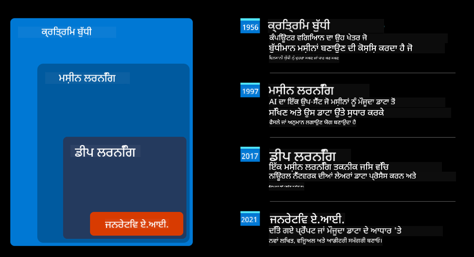
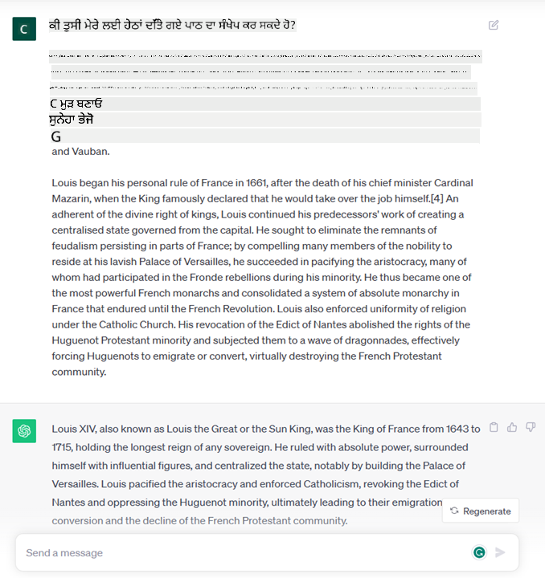
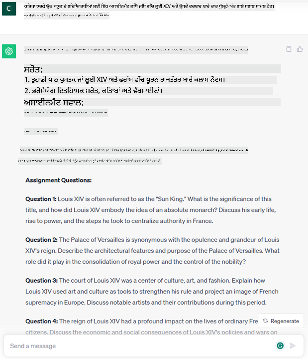
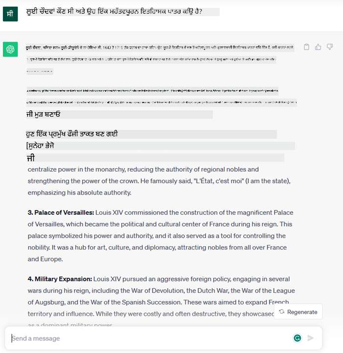
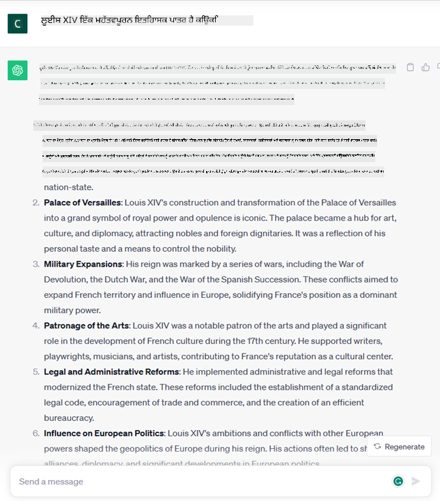
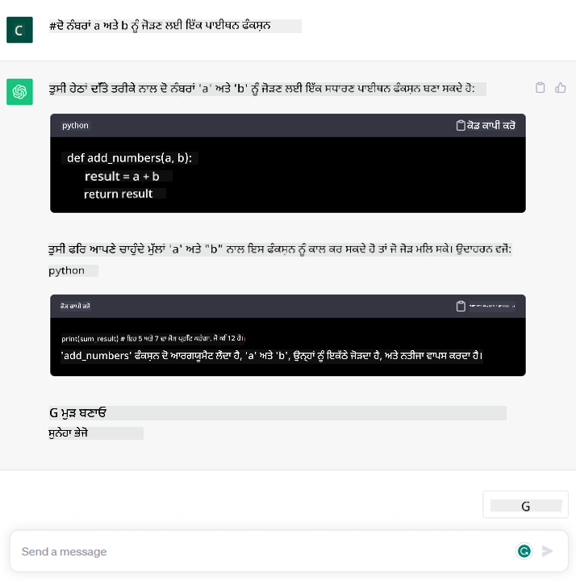

<!--
CO_OP_TRANSLATOR_METADATA:
{
  "original_hash": "bfb7901bdbece1ba3e9f35c400ca33e8",
  "translation_date": "2025-10-17T14:09:26+00:00",
  "source_file": "01-introduction-to-genai/README.md",
  "language_code": "pa"
}
-->
# ਜਨਰੇਟਿਵ AI ਅਤੇ ਵੱਡੇ ਭਾਸ਼ਾ ਮਾਡਲਾਂ ਦਾ ਪਰਚੇ

_(ਉਪਰ ਦਿੱਤੀ ਤਸਵੀਰ 'ਤੇ ਕਲਿਕ ਕਰਕੇ ਇਸ ਪਾਠ ਦਾ ਵੀਡੀਓ ਵੇਖੋ)_

ਜਨਰੇਟਿਵ AI ਇੱਕ ਐਸੀ ਕਲਪਨਾਤਮਕ ਬੁੱਧੀ ਹੈ ਜੋ ਲਿਖਤ, ਚਿੱਤਰ ਅਤੇ ਹੋਰ ਕਿਸਮਾਂ ਦੇ ਸਮੱਗਰੀ ਤਿਆਰ ਕਰਨ ਦੇ ਯੋਗ ਹੈ। ਇਸ ਤਕਨਾਲੋਜੀ ਨੂੰ ਸ਼ਾਨਦਾਰ ਬਣਾਉਣ ਵਾਲੀ ਗੱਲ ਇਹ ਹੈ ਕਿ ਇਹ AI ਨੂੰ ਲੋਕਤੰਤਰਿਕ ਬਣਾਉਂਦੀ ਹੈ, ਕੋਈ ਵੀ ਇਸਨੂੰ ਸਿਰਫ ਇੱਕ ਲਿਖਤ ਪ੍ਰੋੰਪਟ, ਇੱਕ ਕੁਦਰਤੀ ਭਾਸ਼ਾ ਵਿੱਚ ਲਿਖੀ ਗਈ ਵਾਕ ਦੇ ਨਾਲ ਵਰਤ ਸਕਦਾ ਹੈ। ਤੁਹਾਨੂੰ ਜਾਵਾ ਜਾਂ SQL ਵਰਗੀਆਂ ਭਾਸ਼ਾਵਾਂ ਸਿੱਖਣ ਦੀ ਲੋੜ ਨਹੀਂ ਹੈ, ਸਿਰਫ ਆਪਣੀ ਭਾਸ਼ਾ ਵਰਤੋ, ਜੋ ਤੁਸੀਂ ਚਾਹੁੰਦੇ ਹੋ ਉਹ ਦੱਸੋ ਅਤੇ AI ਮਾਡਲ ਤੋਂ ਇੱਕ ਸੁਝਾਅ ਪ੍ਰਾਪਤ ਕਰੋ। ਇਸ ਦੇ ਐਪਲੀਕੇਸ਼ਨ ਅਤੇ ਪ੍ਰਭਾਵ ਬਹੁਤ ਵੱਡੇ ਹਨ, ਤੁਸੀਂ ਰਿਪੋਰਟਾਂ ਲਿਖ ਸਕਦੇ ਹੋ ਜਾਂ ਸਮਝ ਸਕਦੇ ਹੋ, ਐਪਲੀਕੇਸ਼ਨ ਲਿਖ ਸਕਦੇ ਹੋ ਅਤੇ ਹੋਰ ਬਹੁਤ ਕੁਝ, ਸਿਰਫ ਸੈਕਿੰਡਾਂ ਵਿੱਚ।

ਇਸ ਪਾਠਕ੍ਰਮ ਵਿੱਚ, ਅਸੀਂ ਪੜ੍ਹਾਈ ਦੀ ਦੁਨੀਆ ਵਿੱਚ ਨਵੇਂ ਦ੍ਰਿਸ਼ਾਂ ਖੋਲ੍ਹਣ ਲਈ ਜਨਰੇਟਿਵ AI ਦੀ ਵਰਤੋਂ ਕਰਨ ਦੇ ਤਰੀਕੇ ਅਤੇ ਇਸ ਦੇ ਅਰਜ਼ੀਕਰਣ ਨਾਲ ਜੁੜੀਆਂ ਸਮਾਜਿਕ ਪ੍ਰਭਾਵਾਂ ਅਤੇ ਤਕਨਾਲੋਜੀ ਦੀਆਂ ਸੀਮਾਵਾਂ ਨਾਲ ਜੁੜੀਆਂ ਚੁਣੌਤੀਆਂ ਨੂੰ ਹੱਲ ਕਰਨ ਦੇ ਤਰੀਕੇ ਦੀ ਜਾਂਚ ਕਰਾਂਗੇ।

## ਪਰਚੇ

ਇਹ ਪਾਠ ਕਵਰੇਜ ਕਰੇਗਾ:

- ਕਾਰੋਬਾਰੀ ਦ੍ਰਿਸ਼: ਸਾਡਾ ਸਟਾਰਟਅਪ ਵਿਚਾਰ ਅਤੇ ਮਿਸ਼ਨ।
- ਜਨਰੇਟਿਵ AI ਅਤੇ ਅਸੀਂ ਮੌਜੂਦਾ ਤਕਨਾਲੋਜੀ ਲੈਂਡਸਕੇਪ 'ਤੇ ਕਿਵੇਂ ਪਹੁੰਚੇ।
- ਵੱਡੇ ਭਾਸ਼ਾ ਮਾਡਲ ਦਾ ਅੰਦਰੂਨੀ ਕੰਮ।
- ਵੱਡੇ ਭਾਸ਼ਾ ਮਾਡਲਾਂ ਦੀਆਂ ਮੁੱਖ ਯੋਗਤਾਵਾਂ ਅਤੇ ਵਿਆਹਾਰਕ ਵਰਤੋਂ ਦੇ ਕੇਸ।

## ਸਿੱਖਣ ਦੇ ਲਕਸ਼

ਇਹ ਪਾਠ ਪੂਰਾ ਕਰਨ ਤੋਂ ਬਾਅਦ, ਤੁਸੀਂ ਸਮਝ ਪਾਉਗੇ:

- ਜਨਰੇਟਿਵ AI ਕੀ ਹੈ ਅਤੇ ਵੱਡੇ ਭਾਸ਼ਾ ਮਾਡਲ ਕਿਵੇਂ ਕੰਮ ਕਰਦੇ ਹਨ।
- ਤੁਸੀਂ ਵੱਖ-ਵੱਖ ਵਰਤੋਂ ਦੇ ਕੇਸਾਂ ਲਈ ਵੱਡੇ ਭਾਸ਼ਾ ਮਾਡਲਾਂ ਦੀ ਵਰਤੋਂ ਕਿਵੇਂ ਕਰ ਸਕਦੇ ਹੋ, ਪੜ੍ਹਾਈ ਦੇ ਦ੍ਰਿਸ਼ਾਂ 'ਤੇ ਧਿਆਨ ਦੇ ਨਾਲ।

## ਦ੍ਰਿਸ਼: ਸਾਡਾ ਸਿੱਖਣ ਸਟਾਰਟਅਪ

ਜਨਰੇਟਿਵ ਕਲਪਨਾਤਮਕ ਬੁੱਧੀ (AI) AI ਤਕਨਾਲੋਜੀ ਦੀ ਚੋਟੀ ਦਾ ਪ੍ਰਤੀਕ ਹੈ, ਜੋ ਕਦੇ ਅਸੰਭਵ ਸਮਝੇ ਜਾਂਦੇ ਸੀ ਉਸ ਦੀਆਂ ਹੱਦਾਂ ਨੂੰ ਧੱਕ ਰਹੀ ਹੈ। ਜਨਰੇਟਿਵ AI ਮਾਡਲਾਂ ਵਿੱਚ ਕਈ ਯੋਗਤਾਵਾਂ ਅਤੇ ਐਪਲੀਕੇਸ਼ਨ ਹਨ, ਪਰ ਇਸ ਪਾਠਕ੍ਰਮ ਲਈ ਅਸੀਂ ਇਸ ਨੂੰ ਇੱਕ ਕਲਪਨਾਤਮਕ ਸਟਾਰਟਅਪ ਰਾਹੀਂ ਸਿੱਖਣ ਵਿੱਚ ਕਿਵੇਂ ਇਨਕਲਾਬ ਲਿਆ ਰਹੇ ਹਨ, ਦੀ ਜਾਂਚ ਕਰਾਂਗੇ। ਅਸੀਂ ਇਸ ਸਟਾਰਟਅਪ ਨੂੰ _ਸਾਡਾ ਸਟਾਰਟਅਪ_ ਕਹਾਂਗੇ। ਸਾਡਾ ਸਟਾਰਟਅਪ ਸਿੱਖਣ ਖੇਤਰ ਵਿੱਚ ਕੰਮ ਕਰਦਾ ਹੈ ਜਿਸਦਾ ਮਹੱਤਵਕਾਂਕਸ਼ੀ ਮਿਸ਼ਨ ਹੈ:

> _ਸਿੱਖਣ ਵਿੱਚ ਪਹੁੰਚਯੋਗਤਾ ਨੂੰ ਵਿਸਤਾਰ ਦੇਣਾ, ਵਿਸ਼ਵ ਪੱਧਰ 'ਤੇ ਸਿੱਖਣ ਦੀ ਸਮਾਨ ਪਹੁੰਚ ਯਕੀਨੀ ਬਣਾਉਣਾ ਅਤੇ ਹਰ ਸਿੱਖਣ ਵਾਲੇ ਨੂੰ ਉਸ ਦੀਆਂ ਜ਼ਰੂਰਤਾਂ ਅਨੁਸਾਰ ਨਿੱਜੀ ਸਿੱਖਣ ਦੇ ਤਜਰਬੇ ਪ੍ਰਦਾਨ ਕਰਨਾ।_

ਸਾਡੇ ਸਟਾਰਟਅਪ ਦੀ ਟੀਮ ਜਾਣਦੀ ਹੈ ਕਿ ਅਸੀਂ ਇਹ ਲਕਸ਼ ਪੂਰਾ ਨਹੀਂ ਕਰ ਸਕਦੇ ਜਦੋਂ ਤਕ ਅਸੀਂ ਮੌਜੂਦਾ ਸਮੇਂ ਦੇ ਸਭ ਤੋਂ ਸ਼ਕਤੀਸ਼ਾਲੀ ਸਾਧਨਾਂ ਵਿੱਚੋਂ ਇੱਕ ਦੀ ਵਰਤੋਂ ਨਹੀਂ ਕਰਦੇ – ਵੱਡੇ ਭਾਸ਼ਾ ਮਾਡਲ (LLMs)।

ਜਨਰੇਟਿਵ AI ਦੀ ਉਮੀਦ ਹੈ ਕਿ ਇਹ ਅੱਜ ਸਿੱਖਣ ਅਤੇ ਸਿਖਾਉਣ ਦੇ ਤਰੀਕੇ ਨੂੰ ਬਦਲ ਦੇਵੇਗਾ, ਵਿਦਿਆਰਥੀਆਂ ਦੇ ਪਾਸ 24 ਘੰਟੇ ਵਰਚੁਅਲ ਅਧਿਆਪਕ ਹੋਣਗੇ ਜੋ ਬਹੁਤ ਸਾਰੀ ਜਾਣਕਾਰੀ ਅਤੇ ਉਦਾਹਰਣ ਪ੍ਰਦਾਨ ਕਰਦੇ ਹਨ, ਅਤੇ ਅਧਿਆਪਕ ਆਪਣੇ ਵਿਦਿਆਰਥੀਆਂ ਦਾ ਮੁਲਾਂਕਣ ਕਰਨ ਅਤੇ ਫੀਡਬੈਕ ਦੇਣ ਲਈ ਨਵੀਂ ਤਕਨਾਲੋਜੀ ਦੀ ਵਰਤੋਂ ਕਰਨ ਦੇ ਯੋਗ ਹੋਣਗੇ।

ਸ਼ੁਰੂ ਕਰਨ ਲਈ, ਆਓ ਕੁਝ ਮੁੱਢਲੇ ਸੰਕਲਪ ਅਤੇ ਸ਼ਬਦਾਵਲੀ ਨੂੰ ਪਰਿਭਾਸ਼ਿਤ ਕਰੀਏ ਜੋ ਅਸੀਂ ਪਾਠਕ੍ਰਮ ਦੌਰਾਨ ਵਰਤਾਂਗੇ।

## ਜਨਰੇਟਿਵ AI ਕਿਵੇਂ ਮਿਲਿਆ?

ਜਨਰੇਟਿਵ AI ਮਾਡਲਾਂ ਦੀ ਘੋਸ਼ਣਾ ਦੁਆਰਾ ਹਾਲ ਹੀ ਵਿੱਚ ਬਣਾਈ ਗਈ ਅਸਧਾਰਨ _ਹਾਈਪ_ ਦੇ ਬਾਵਜੂਦ, ਇਹ ਤਕਨਾਲੋਜੀ ਦਹਾਕਿਆਂ ਤੋਂ ਬਣਾਈ ਜਾ ਰਹੀ ਹੈ, ਜਿਸਦੇ ਪਹਿਲੇ ਖੋਜ ਯਤਨ 60 ਦੇ ਦਹਾਕੇ ਵਿੱਚ ਸ਼ੁਰੂ ਹੋਏ। ਅਸੀਂ ਹੁਣ AI ਦੇ ਮਨੁੱਖੀ ਸੰਜੋਗੀ ਯੋਗਤਾਵਾਂ ਦੇ ਨਾਲ ਇੱਕ ਬਿੰਦੂ 'ਤੇ ਪਹੁੰਚ ਗਏ ਹਾਂ, ਜਿਵੇਂ ਕਿ ਗੱਲਬਾਤ, ਜਿਵੇਂ ਕਿ ਉਦਾਹਰਣ ਲਈ [OpenAI ChatGPT](https://openai.com/chatgpt) ਜਾਂ [Bing Chat](https://www.microsoft.com/edge/features/bing-chat?WT.mc_id=academic-105485-koreyst), ਜੋ GPT ਮਾਡਲ ਦੀ ਵਰਤੋਂ ਕਰਦਾ ਹੈ ਵੈੱਬ ਖੋਜ Bing ਗੱਲਬਾਤਾਂ ਲਈ।

### AI ਲਈ ਸਾਂਖਿਕ ਪਹੁੰਚ: ਮਸ਼ੀਨ ਲਰਨਿੰਗ

90 ਦੇ ਦਹਾਕੇ ਦੌਰਾਨ, ਲਿਖਤ ਵਿਸ਼ਲੇਸ਼ਣ ਲਈ ਸਾਂਖਿਕ ਪਹੁੰਚ ਦੇ ਅਰਜ਼ੀਕਰਣ ਨਾਲ ਇੱਕ ਮੋੜ ਆਇਆ। ਇਸ ਨੇ ਨਵੇਂ ਐਲਗੋਰਿਦਮਾਂ ਦੇ ਵਿਕਾਸ ਨੂੰ ਜਨਮ ਦਿੱਤਾ – ਜਿਨ੍ਹਾਂ ਨੂੰ ਮਸ਼ੀਨ ਲਰਨਿੰਗ ਕਿਹਾ ਜਾਂਦਾ ਹੈ – ਜੋ ਡਾਟਾ ਤੋਂ ਪੈਟਰਨ ਸਿੱਖਣ ਦੇ ਯੋਗ ਹਨ ਬਿਨਾਂ ਸਪਸ਼ਟ ਤੌਰ 'ਤੇ ਪ੍ਰੋਗਰਾਮ ਕੀਤੇ। 

### ਨਿਊਰਲ ਨੈੱਟਵਰਕ ਅਤੇ ਆਧੁਨਿਕ ਵਰਚੁਅਲ ਸਹਾਇਕ

ਹਾਲ ਦੇ ਸਾਲਾਂ ਵਿੱਚ, ਹਾਰਡਵੇਅਰ ਦੀ ਤਕਨਾਲੋਜੀਕਲ ਵਿਕਾਸ, ਜੋ ਵੱਡੇ ਮਾਤਰਾ ਦੇ ਡਾਟਾ ਅਤੇ ਹੋਰ ਜਟਿਲ ਗਣਨਾਵਾਂ ਨੂੰ ਸੰਭਾਲਣ ਦੇ ਯੋਗ ਹੈ, ਨੇ AI ਵਿੱਚ ਖੋਜ ਨੂੰ ਉਤਸ਼ਾਹਿਤ ਕੀਤਾ, ਜਿਸਦੇ ਕਾਰਨ ਨਿਊਰਲ ਨੈੱਟਵਰਕ ਜਾਂ ਡੀਪ ਲਰਨਿੰਗ ਐਲਗੋਰਿਦਮਾਂ ਦੇ ਵਿਕਾਸ ਹੋਏ।

### ਮੌਜੂਦਾ ਦਿਨ, ਜਨਰੇਟਿਵ AI

ਇਸ ਤਰ੍ਹਾਂ ਅਸੀਂ ਅੱਜ ਜਨਰੇਟਿਵ AI 'ਤੇ ਪਹੁੰਚੇ ਹਾਂ, ਜਿਸਨੂੰ ਡੀਪ ਲਰਨਿੰਗ ਦਾ ਇੱਕ ਉਪਸੈੱਟ ਮੰਨਿਆ ਜਾ ਸਕਦਾ ਹੈ।

## ਵੱਡੇ ਭਾਸ਼ਾ ਮਾਡਲ ਕਿਵੇਂ ਕੰਮ ਕਰਦੇ ਹਨ?

ਅਗਲੇ ਅਧਿਆਇ ਵਿੱਚ ਅਸੀਂ ਜਨਰੇਟਿਵ AI ਮਾਡਲਾਂ ਦੇ ਵੱਖ-ਵੱਖ ਕਿਸਮਾਂ ਦੀ ਜਾਂਚ ਕਰਨ ਜਾ ਰਹੇ ਹਾਂ, ਪਰ ਇਸ ਸਮੇਂ ਲਈ ਆਓ ਵੱਡੇ ਭਾਸ਼ਾ ਮਾਡਲਾਂ ਦੇ ਕੰਮ ਕਰਨ ਦੇ ਤਰੀਕੇ ਨੂੰ ਵੇਖੀਏ, ਖਾਸ ਤੌਰ 'ਤੇ OpenAI GPT (Generative Pre-trained Transformer) ਮਾਡਲਾਂ 'ਤੇ ਧਿਆਨ ਦੇ ਨਾਲ।

- **ਟੋਕਨਾਈਜ਼ਰ, ਲਿਖਤ ਤੋਂ ਨੰਬਰ ਤੱਕ**: ਵੱਡੇ ਭਾਸ਼ਾ ਮਾਡਲ ਲਿਖਤ ਨੂੰ ਇਨਪੁਟ ਵਜੋਂ ਪ੍ਰਾਪਤ ਕਰਦੇ ਹਨ ਅਤੇ ਲਿਖਤ ਨੂੰ ਆਉਟਪੁਟ ਵਜੋਂ ਤਿਆਰ ਕਰਦੇ ਹਨ। 

## ਸਾਡਾ ਸਟਾਰਟਅਪ ਵੱਡੇ ਭਾਸ਼ਾ ਮਾਡਲਾਂ ਦੀ ਵਰਤੋਂ ਕਿਵੇਂ ਕਰ ਸਕਦਾ ਹੈ?

ਹੁਣ ਜਦੋਂ ਕਿ ਅਸੀਂ ਵੱਡੇ ਭਾਸ਼ਾ ਮਾਡਲ ਦੇ ਅੰਦਰੂਨੀ ਕੰਮ ਨੂੰ ਬਿਹਤਰ ਸਮਝਦੇ ਹਾਂ, ਆਓ ਕੁਝ ਵਿਆਹਾਰਕ ਉਦਾਹਰਣ ਵੇਖੀਏ।

- **ਸੰਖੇਪਕਰਨ**: ਲੇਖ, ਕਿਤਾਬ, ਉਤਪਾਦ ਸਮੀਖਿਆਵਾਂ ਅਤੇ ਹੋਰ ਦੀ ਸੰਖੇਪਕਰਨ।

- **ਰਚਨਾਤਮਕ ਲੇਖਨ**: ਲੇਖ, ਨਿਬੰਧ, ਅਸਾਈਨਮੈਂਟ ਜਾਂ ਹੋਰ ਦੀ ਰਚਨਾਤਮਕ ਡਿਜ਼ਾਈਨ।

- **ਗੱਲਬਾਤ**: ਇੱਕ ਏਜੰਟ ਨਾਲ ਗੱਲਬਾਤ ਦੇ ਰੂਪ ਵਿੱਚ ਪੁੱਛੇ ਗਏ ਸਵਾਲ।

- **ਲਿਖਤ ਪੂਰਨਤਾ**: ਲਿਖਤ ਦੇ ਟੁਕੜੇ ਨੂੰ ਪੂਰਾ ਕਰਨ ਲਈ।

- **ਕੋਡ**: ਕੋਡ ਦੇ ਟੁਕੜੇ ਨੂੰ ਸਮਝਾਉਣ ਅਤੇ ਦਸਤਾਵੇਜ਼ ਕਰਨ ਲਈ।

## ਅਸਾਈਨਮੈਂਟ

ਤੁਹਾਡਾ ਅਸਾਈਨਮੈਂਟ ਹੈ ਕਿ [ਜਨਰੇਟਿਵ AI](https://en.wikipedia.org/wiki/Generative_artificial_intelligence?WT.mc_id=academic-105485-koreyst) ਬਾਰੇ ਹੋਰ ਪੜ੍ਹੋ। 

## ਗਿਆਨ ਦੀ ਜਾਂਚ

ਵੱਡੇ ਭਾਸ਼ਾ ਮਾਡਲਾਂ ਬਾਰੇ ਕੀ ਸੱਚ ਹੈ?

A: 3, ਇੱਕ LLM ਗੈਰ-ਨਿਰਧਾਰਤਮਿਕ ਹੈ, ਜਵਾਬ ਵੱਖ-ਵੱਖ ਹੋ ਸਕਦਾ ਹੈ। 

## ਸ਼ਾਨਦਾਰ ਕੰਮ! ਯਾਤਰਾ ਜਾਰੀ ਰੱਖੋ

ਇਹ ਪਾਠ ਪੂਰਾ ਕਰਨ ਤੋਂ ਬਾਅਦ, ਸਾਡੇ [ਜਨਰੇਟਿਵ AI ਸਿੱਖਣ ਸੰਗ੍ਰਹਿ](https://aka.ms/genai-collection?WT.mc_id=academic-105485-koreyst) ਨੂੰ ਵੇਖੋ।
ਲੈਸਨ 2 ਵੱਲ ਜਾਓ ਜਿੱਥੇ ਅਸੀਂ [ਵੱਖ-ਵੱਖ LLM ਕਿਸਮਾਂ ਦੀ ਜਾਂਚ ਅਤੇ ਤੁਲਨਾ ਕਰਨ](../02-exploring-and-comparing-different-llms/README.md?WT.mc_id=academic-105485-koreyst) ਬਾਰੇ ਦੇਖਾਂਗੇ!

---

**ਅਸਵੀਕਰਤਾ**:  
ਇਹ ਦਸਤਾਵੇਜ਼ AI ਅਨੁਵਾਦ ਸੇਵਾ [Co-op Translator](https://github.com/Azure/co-op-translator) ਦੀ ਵਰਤੋਂ ਕਰਕੇ ਅਨੁਵਾਦ ਕੀਤਾ ਗਿਆ ਹੈ। ਜਦੋਂ ਕਿ ਅਸੀਂ ਸਹੀ ਹੋਣ ਦਾ ਯਤਨ ਕਰਦੇ ਹਾਂ, ਕਿਰਪਾ ਕਰਕੇ ਧਿਆਨ ਦਿਓ ਕਿ ਸਵੈਚਾਲਿਤ ਅਨੁਵਾਦਾਂ ਵਿੱਚ ਗਲਤੀਆਂ ਜਾਂ ਅਸੁੱਤੀਆਂ ਹੋ ਸਕਦੀਆਂ ਹਨ। ਇਸ ਦੀ ਮੂਲ ਭਾਸ਼ਾ ਵਿੱਚ ਮੂਲ ਦਸਤਾਵੇਜ਼ ਨੂੰ ਅਧਿਕਾਰਤ ਸਰੋਤ ਮੰਨਿਆ ਜਾਣਾ ਚਾਹੀਦਾ ਹੈ। ਮਹੱਤਵਪੂਰਨ ਜਾਣਕਾਰੀ ਲਈ, ਪੇਸ਼ੇਵਰ ਮਨੁੱਖੀ ਅਨੁਵਾਦ ਦੀ ਸਿਫਾਰਸ਼ ਕੀਤੀ ਜਾਂਦੀ ਹੈ। ਅਸੀਂ ਇਸ ਅਨੁਵਾਦ ਦੀ ਵਰਤੋਂ ਤੋਂ ਪੈਦਾ ਹੋਣ ਵਾਲੇ ਕਿਸੇ ਵੀ ਗਲਤਫਹਿਮੀ ਜਾਂ ਗਲਤ ਵਿਆਖਿਆ ਲਈ ਜ਼ਿੰਮੇਵਾਰ ਨਹੀਂ ਹਾਂ।