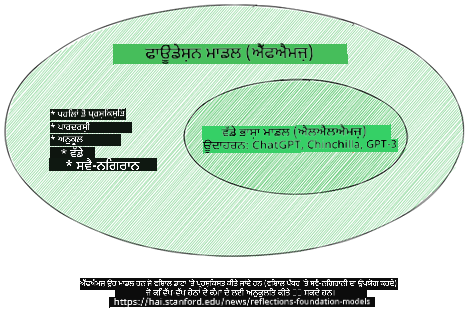
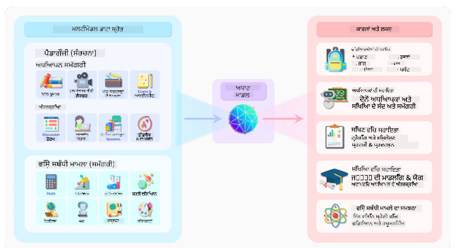
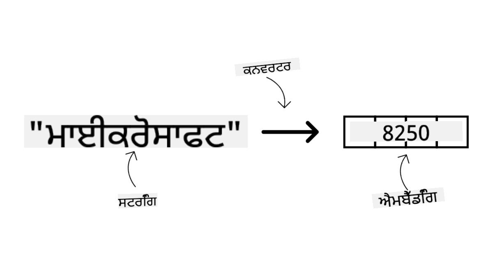
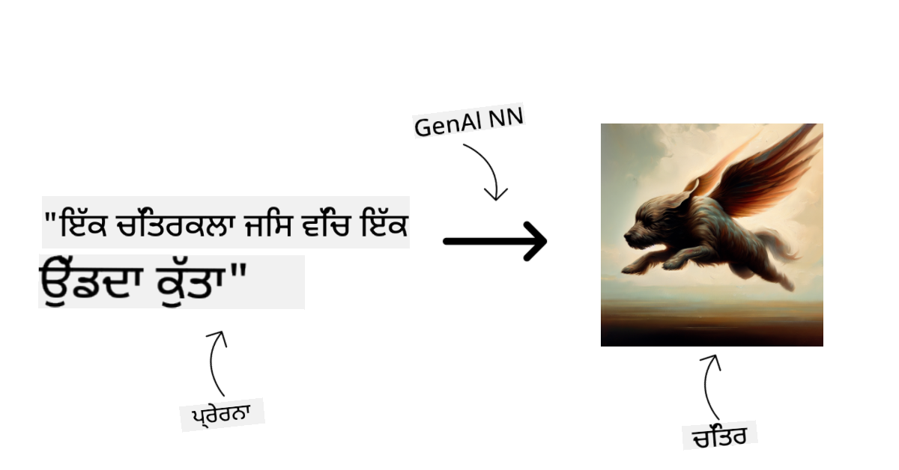
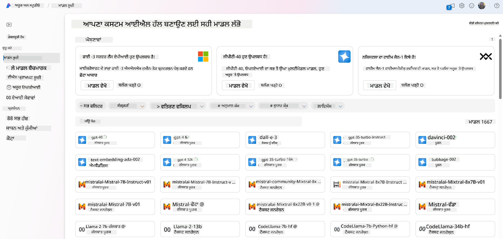
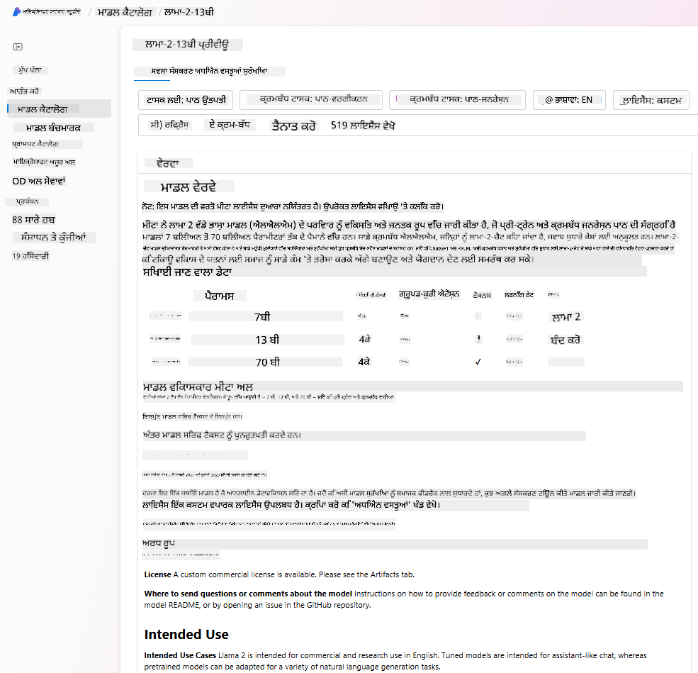
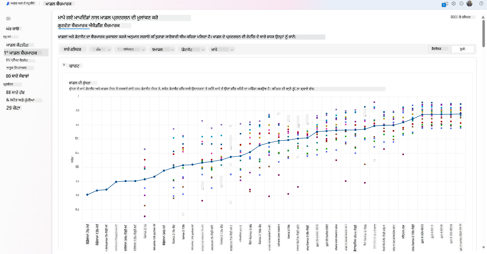
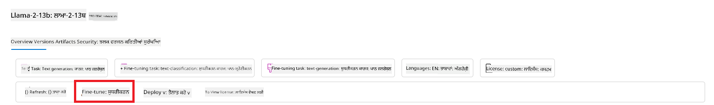
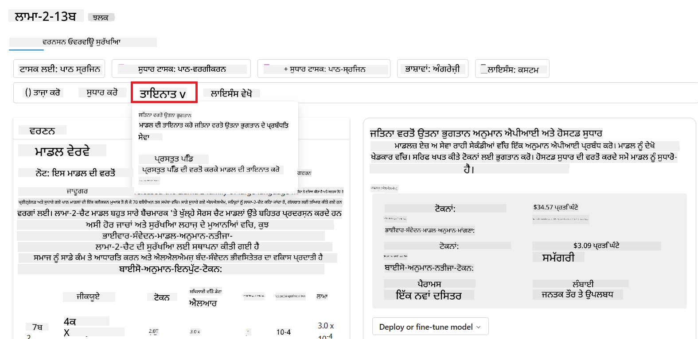
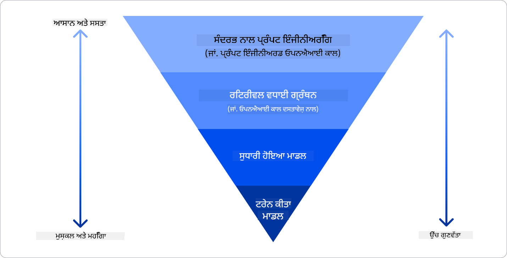

<!--
CO_OP_TRANSLATOR_METADATA:
{
  "original_hash": "6b7629b8ee4d7d874a27213e903d86a7",
  "translation_date": "2025-10-17T14:27:45+00:00",
  "source_file": "02-exploring-and-comparing-different-llms/README.md",
  "language_code": "pa"
}
-->
# ਵੱਖ-ਵੱਖ LLMs ਦੀ ਖੋਜ ਅਤੇ ਤੁਲਨਾ

> _ਉਪਰ ਦਿੱਤੀ ਤਸਵੀਰ 'ਤੇ ਕਲਿੱਕ ਕਰਕੇ ਇਸ ਪਾਠ ਦਾ ਵੀਡੀਓ ਵੇਖੋ_

ਪਿਛਲੇ ਪਾਠ ਵਿੱਚ, ਅਸੀਂ ਦੇਖਿਆ ਕਿ ਜਨਰੇਟਿਵ AI ਤਕਨਾਲੋਜੀ ਦੇ ਖੇਤਰ ਨੂੰ ਕਿਵੇਂ ਬਦਲ ਰਿਹਾ ਹੈ, ਵੱਡੇ ਭਾਸ਼ਾ ਮਾਡਲ (LLMs) ਕਿਵੇਂ ਕੰਮ ਕਰਦੇ ਹਨ ਅਤੇ ਇੱਕ ਕਾਰੋਬਾਰ - ਜਿਵੇਂ ਕਿ ਸਾਡਾ ਸਟਾਰਟਅਪ - ਕਿਵੇਂ ਉਨ੍ਹਾਂ ਨੂੰ ਆਪਣੇ ਕੇਸਾਂ ਵਿੱਚ ਲਾਗੂ ਕਰ ਸਕਦਾ ਹੈ ਅਤੇ ਵਧ ਸਕਦਾ ਹੈ! ਇਸ ਅਧਿਆਇ ਵਿੱਚ, ਅਸੀਂ ਵੱਖ-ਵੱਖ ਕਿਸਮ ਦੇ ਵੱਡੇ ਭਾਸ਼ਾ ਮਾਡਲਾਂ (LLMs) ਦੀ ਤੁਲਨਾ ਕਰਨ ਅਤੇ ਉਨ੍ਹਾਂ ਦੇ ਫਾਇਦੇ ਅਤੇ ਨੁਕਸਾਨ ਨੂੰ ਸਮਝਣ ਦੀ ਕੋਸ਼ਿਸ਼ ਕਰ ਰਹੇ ਹਾਂ।

ਸਾਡੇ ਸਟਾਰਟਅਪ ਦੇ ਯਾਤਰਾ ਦਾ ਅਗਲਾ ਕਦਮ ਮੌਜੂਦਾ LLMs ਦੇ ਖੇਤਰ ਦੀ ਖੋਜ ਕਰਨਾ ਅਤੇ ਸਮਝਣਾ ਹੈ ਕਿ ਕਿਹੜੇ ਸਾਡੇ ਕੇਸ ਲਈ ਉਚਿਤ ਹਨ।

## ਪਰਿਚਯ

ਇਸ ਪਾਠ ਵਿੱਚ ਕਵਰ ਕੀਤਾ ਜਾਵੇਗਾ:

- ਮੌਜੂਦਾ ਖੇਤਰ ਵਿੱਚ ਵੱਖ-ਵੱਖ ਕਿਸਮ ਦੇ LLMs।
- Azure ਵਿੱਚ ਆਪਣੇ ਕੇਸ ਲਈ ਵੱਖ-ਵੱਖ ਮਾਡਲਾਂ ਦੀ ਜਾਂਚ, ਦੁਹਰਾਈ ਅਤੇ ਤੁਲਨਾ।
- LLM ਨੂੰ ਕਿਵੇਂ ਤੈਨਾਤ ਕਰਨਾ ਹੈ।

## ਸਿੱਖਣ ਦੇ ਲਕਸ਼

ਇਸ ਪਾਠ ਨੂੰ ਪੂਰਾ ਕਰਨ ਤੋਂ ਬਾਅਦ, ਤੁਸੀਂ ਸਮਰੱਥ ਹੋਵੋਗੇ:

- ਆਪਣੇ ਕੇਸ ਲਈ ਸਹੀ ਮਾਡਲ ਦੀ ਚੋਣ ਕਰੋ।
- ਸਮਝੋ ਕਿ ਆਪਣੇ ਮਾਡਲ ਦੀ ਕਾਰਗੁਜ਼ਾਰੀ ਨੂੰ ਜਾਂਚਣ, ਦੁਹਰਾਉਣ ਅਤੇ ਸੁਧਾਰਨ ਦਾ ਤਰੀਕਾ।
- ਜਾਣੋ ਕਿ ਕਾਰੋਬਾਰ ਮਾਡਲਾਂ ਨੂੰ ਕਿਵੇਂ ਤੈਨਾਤ ਕਰਦੇ ਹਨ।

## ਵੱਖ-ਵੱਖ ਕਿਸਮ ਦੇ LLMs ਨੂੰ ਸਮਝੋ

LLMs ਨੂੰ ਉਨ੍ਹਾਂ ਦੇ ਆਰਕੀਟੈਕਚਰ, ਟ੍ਰੇਨਿੰਗ ਡੇਟਾ ਅਤੇ ਉਪਯੋਗਤਾ ਦੇ ਅਧਾਰ 'ਤੇ ਕਈ ਸ਼੍ਰੇਣੀਆਂ ਵਿੱਚ ਵੰਡਿਆ ਜਾ ਸਕਦਾ ਹੈ। ਇਹ ਅੰਤਰਾਂ ਨੂੰ ਸਮਝਣਾ ਸਾਡੇ ਸਟਾਰਟਅਪ ਨੂੰ ਸਹੀ ਮਾਡਲ ਚੁਣਨ ਵਿੱਚ ਮਦਦ ਕਰੇਗਾ ਅਤੇ ਇਹ ਸਮਝਣ ਵਿੱਚ ਮਦਦ ਕਰੇਗਾ ਕਿ ਕਾਰਗੁਜ਼ਾਰੀ ਨੂੰ ਕਿਵੇਂ ਜਾਂਚਣਾ, ਦੁਹਰਾਉਣਾ ਅਤੇ ਸੁਧਾਰਨਾ ਹੈ।

ਵੱਖ-ਵੱਖ ਕਿਸਮ ਦੇ LLM ਮਾਡਲ ਹਨ, ਤੁਹਾਡਾ ਮਾਡਲ ਦੀ ਚੋਣ ਇਸ ਗੱਲ 'ਤੇ ਨਿਰਭਰ ਕਰਦੀ ਹੈ ਕਿ ਤੁਸੀਂ ਉਨ੍ਹਾਂ ਨੂੰ ਕਿਸ ਲਈ ਵਰਤਣਾ ਚਾਹੁੰਦੇ ਹੋ, ਤੁਹਾਡਾ ਡੇਟਾ, ਤੁਸੀਂ ਕਿੰਨਾ ਖਰਚ ਕਰਨ ਲਈ ਤਿਆਰ ਹੋ ਅਤੇ ਹੋਰ।

ਜੇ ਤੁਸੀਂ ਮਾਡਲਾਂ ਨੂੰ ਟੈਕਸਟ, ਆਡੀਓ, ਵੀਡੀਓ, ਇਮੇਜ ਜਨਰੇਸ਼ਨ ਆਦਿ ਲਈ ਵਰਤਣਾ ਚਾਹੁੰਦੇ ਹੋ, ਤਾਂ ਤੁਸੀਂ ਵੱਖ-ਵੱਖ ਕਿਸਮ ਦੇ ਮਾਡਲਾਂ ਦੀ ਚੋਣ ਕਰ ਸਕਦੇ ਹੋ।

- **ਆਡੀਓ ਅਤੇ ਸਪੀਚ ਪਛਾਣ**। ਇਸ ਮਕਸਦ ਲਈ, Whisper-ਕਿਸਮ ਦੇ ਮਾਡਲ ਇੱਕ ਵਧੀਆ ਚੋਣ ਹਨ ਕਿਉਂਕਿ ਇਹ ਸਪੀਚ ਪਛਾਣ ਲਈ ਜਨਰਲ-ਪਰਪਜ਼ ਹਨ। ਇਹ ਵੱਖ-ਵੱਖ ਆਡੀਓ 'ਤੇ ਟ੍ਰੇਨ ਕੀਤਾ ਗਿਆ ਹੈ ਅਤੇ ਬਹੁਭਾਸ਼ੀ ਸਪੀਚ ਪਛਾਣ ਕਰ ਸਕਦਾ ਹੈ। [Whisper ਮਾਡਲਾਂ ਬਾਰੇ ਹੋਰ ਜਾਣੋ](https://platform.openai.com/docs/models/whisper?WT.mc_id=academic-105485-koreyst)।

- **ਇਮੇਜ ਜਨਰੇਸ਼ਨ**। ਇਮੇਜ ਜਨਰੇਸ਼ਨ ਲਈ, DALL-E ਅਤੇ Midjourney ਦੋ ਬਹੁਤ ਹੀ ਜਾਣੇ-ਪਛਾਣੇ ਚੋਣ ਹਨ। DALL-E Azure OpenAI ਦੁਆਰਾ ਪੇਸ਼ ਕੀਤਾ ਜਾਂਦਾ ਹੈ। [DALL-E ਬਾਰੇ ਹੋਰ ਪੜ੍ਹੋ](https://platform.openai.com/docs/models/dall-e?WT.mc_id=academic-105485-koreyst) ਅਤੇ ਇਸ ਪਾਠਕ੍ਰਮ ਦੇ ਅਧਿਆਇ 9 ਵਿੱਚ ਵੀ।

- **ਟੈਕਸਟ ਜਨਰੇਸ਼ਨ**। ਜ਼ਿਆਦਾਤਰ ਮਾਡਲ ਟੈਕਸਟ ਜਨਰੇਸ਼ਨ 'ਤੇ ਟ੍ਰੇਨ ਕੀਤੇ ਜਾਂਦੇ ਹਨ ਅਤੇ ਤੁਹਾਡੇ ਕੋਲ GPT-3.5 ਤੋਂ GPT-4 ਤੱਕ ਦੀਆਂ ਕਈ ਚੋਣਾਂ ਹਨ। ਇਹ ਵੱਖ-ਵੱਖ ਲਾਗਤਾਂ 'ਤੇ ਆਉਂਦੇ ਹਨ, ਜਿੱਥੇ GPT-4 ਸਭ ਤੋਂ ਮਹਿੰਗਾ ਹੈ। [Azure OpenAI playground](https://oai.azure.com/portal/playground?WT.mc_id=academic-105485-koreyst) ਵਿੱਚ ਵੇਖਣਾ ਯੋਗ ਹੈ ਕਿ ਕਿਹੜੇ ਮਾਡਲ ਤੁਹਾਡੇ ਲਈ ਸਮਰੱਥਾ ਅਤੇ ਲਾਗਤ ਦੇ ਹਿਸਾਬ ਨਾਲ ਸਭ ਤੋਂ ਵਧੀਆ ਹਨ।

- **ਮਲਟੀ-ਮੋਡੈਲਿਟੀ**। ਜੇ ਤੁਸੀਂ ਇਨਪੁਟ ਅਤੇ ਆਉਟਪੁਟ ਵਿੱਚ ਕਈ ਕਿਸਮ ਦੇ ਡੇਟਾ ਨੂੰ ਸੰਭਾਲਣ ਦੀ ਯੋਜਨਾ ਬਣਾ ਰਹੇ ਹੋ, ਤਾਂ ਤੁਸੀਂ [gpt-4 turbo with vision ਜਾਂ gpt-4o](https://learn.microsoft.com/azure/ai-services/openai/concepts/models#gpt-4-and-gpt-4-turbo-models?WT.mc_id=academic-105485-koreyst) ਵਰਗੇ ਮਾਡਲਾਂ 'ਤੇ ਧਿਆਨ ਦੇ ਸਕਦੇ ਹੋ - OpenAI ਮਾਡਲਾਂ ਦੇ ਤਾਜ਼ਾ ਰਿਲੀਜ਼ - ਜੋ ਕਿ ਕੁਦਰਤੀ ਭਾਸ਼ਾ ਪ੍ਰੋਸੈਸਿੰਗ ਨੂੰ ਵਿਜ਼ੂਅਲ ਸਮਝਣ ਨਾਲ ਜੋੜਨ ਦੇ ਯੋਗ ਹਨ, ਮਲਟੀ-ਮੋਡਲ ਇੰਟਰਫੇਸਾਂ ਰਾਹੀਂ ਇੰਟਰੈਕਸ਼ਨ ਨੂੰ ਯੋਗ ਬਣਾਉਂਦੇ ਹਨ।

ਮਾਡਲ ਦੀ ਚੋਣ ਕਰਨ ਦਾ ਮਤਲਬ ਹੈ ਕਿ ਤੁਹਾਨੂੰ ਕੁਝ ਬੁਨਿਆਦੀ ਸਮਰੱਥਾਵਾਂ ਮਿਲਦੀਆਂ ਹਨ, ਜੋ ਕਿ ਕਈ ਵਾਰ ਕਾਫ਼ੀ ਨਹੀਂ ਹੁੰਦੀਆਂ। ਅਕਸਰ ਤੁਹਾਡੇ ਕੋਲ ਕੰਪਨੀ-ਵਿਸ਼ੇਸ਼ ਡੇਟਾ ਹੁੰਦਾ ਹੈ ਜਿਸ ਬਾਰੇ ਤੁਹਾਨੂੰ ਕਿਸੇ ਤਰੀਕੇ ਨਾਲ LLM ਨੂੰ ਦੱਸਣ ਦੀ ਲੋੜ ਹੁੰਦੀ ਹੈ। ਇਸ ਨੂੰ ਪੂਰਾ ਕਰਨ ਦੇ ਕੁਝ ਵੱਖ-ਵੱਖ ਤਰੀਕੇ ਹਨ, ਜਿਸ ਬਾਰੇ ਅਗਲੇ ਭਾਗਾਂ ਵਿੱਚ ਹੋਰ ਜਾਣਕਾਰੀ ਦਿੱਤੀ ਜਾਵੇਗੀ।

### ਫਾਊਂਡੇਸ਼ਨ ਮਾਡਲਾਂ ਵਿਰੁੱਧ LLMs

ਫਾਊਂਡੇਸ਼ਨ ਮਾਡਲ ਦੀ ਸ਼ਬਦਾਵਲੀ [Stanford ਖੋਜਕਰਤਿਆਂ ਦੁਆਰਾ](https://arxiv.org/abs/2108.07258?WT.mc_id=academic-105485-koreyst) ਬਣਾਈ ਗਈ ਸੀ ਅਤੇ ਇਸਨੂੰ AI ਮਾਡਲ ਵਜੋਂ ਪਰਿਭਾਸ਼ਿਤ ਕੀਤਾ ਗਿਆ ਜੋ ਕੁਝ ਮਾਪਦੰਡਾਂ ਦੀ ਪਾਲਣਾ ਕਰਦਾ ਹੈ, ਜਿਵੇਂ ਕਿ:

- **ਇਹ ਅਨਸੁਪਰਵਾਈਜ਼ਡ ਲਰਨਿੰਗ ਜਾਂ ਸਵੈ-ਸੁਪਰਵਾਈਜ਼ਡ ਲਰਨਿੰਗ ਦੀ ਵਰਤੋਂ ਕਰਕੇ ਟ੍ਰੇਨ ਕੀਤੇ ਜਾਂਦੇ ਹਨ**, ਜਿਸਦਾ ਮਤਲਬ ਹੈ ਕਿ ਇਹ ਅਨਲੇਬਲਡ ਮਲਟੀ-ਮੋਡਲ ਡੇਟਾ 'ਤੇ ਟ੍ਰੇਨ ਕੀਤੇ ਜਾਂਦੇ ਹਨ ਅਤੇ ਉਨ੍ਹਾਂ ਦੇ ਟ੍ਰੇਨਿੰਗ ਪ੍ਰਕਿਰਿਆ ਲਈ ਡੇਟਾ ਦੀ ਮਨੁੱਖੀ ਐਨੋਟੇਸ਼ਨ ਜਾਂ ਲੇਬਲਿੰਗ ਦੀ ਲੋੜ ਨਹੀਂ ਹੁੰਦੀ।
- **ਇਹ ਬਹੁਤ ਵੱਡੇ ਮਾਡਲ ਹਨ**, ਬਹੁਤ ਹੀ ਡੂੰਘੇ ਨਿਊਰਲ ਨੈਟਵਰਕ 'ਤੇ ਅਰਬਾਂ ਪੈਰਾਮੀਟਰਾਂ 'ਤੇ ਟ੍ਰੇਨ ਕੀਤੇ ਗਏ।
- **ਇਹ ਆਮ ਤੌਰ 'ਤੇ ਹੋਰ ਮਾਡਲਾਂ ਲਈ 'ਫਾਊਂਡੇਸ਼ਨ' ਵਜੋਂ ਸੇਵਾ ਕਰਨ ਲਈ ਬਣਾਏ ਜਾਂਦੇ ਹਨ**, ਜਿਸਦਾ ਮਤਲਬ ਹੈ ਕਿ ਇਹ ਹੋਰ ਮਾਡਲਾਂ ਨੂੰ ਉਨ੍ਹਾਂ ਦੇ ਉੱਤੇ ਬਣਾਉਣ ਲਈ ਸ਼ੁਰੂਆਤੀ ਬਿੰਦੂ ਵਜੋਂ ਵਰਤੇ ਜਾ ਸਕਦੇ ਹਨ, ਜੋ ਕਿ ਫਾਈਨ-ਟਿਊਨਿੰਗ ਦੁਆਰਾ ਕੀਤਾ ਜਾ ਸਕਦਾ ਹੈ।

ਤਸਵੀਰ ਦਾ ਸਰੋਤ: [Essential Guide to Foundation Models and Large Language Models | by Babar M Bhatti | Medium](https://thebabar.medium.com/essential-guide-to-foundation-models-and-large-language-models-27dab58f7404)

ਇਸ ਫਰਕ ਨੂੰ ਹੋਰ ਸਪਸ਼ਟ ਕਰਨ ਲਈ, ਆਓ ChatGPT ਨੂੰ ਉਦਾਹਰਨ ਵਜੋਂ ਲਵਾਂ। ChatGPT ਦਾ ਪਹਿਲਾ ਵਰਜਨ ਬਣਾਉਣ ਲਈ, GPT-3.5 ਮਾਡਲ ਨੂੰ ਫਾਊਂਡੇਸ਼ਨ ਮਾਡਲ ਵਜੋਂ ਵਰਤਿਆ ਗਿਆ। ਇਸਦਾ ਮਤਲਬ ਹੈ ਕਿ OpenAI ਨੇ ਕੁਝ ਚੈਟ-ਵਿਸ਼ੇਸ਼ ਡੇਟਾ ਦੀ ਵਰਤੋਂ ਕੀਤੀ GPT-3.5 ਦਾ ਇੱਕ ਟਿਊਨ ਕੀਤਾ ਵਰਜਨ ਬਣਾਉਣ ਲਈ ਜੋ ਕਿ ਚੈਟਬੋਟਸ ਵਰਗੇ ਗੱਲਬਾਤੀ ਸਥਿਤੀਆਂ ਵਿੱਚ ਚੰਗਾ ਪ੍ਰਦਰਸ਼ਨ ਕਰਨ ਵਿੱਚ ਮਾਹਰ ਸੀ।

ਤਸਵੀਰ ਦਾ ਸਰੋਤ: [2108.07258.pdf (arxiv.org)](https://arxiv.org/pdf/2108.07258.pdf?WT.mc_id=academic-105485-koreyst)

### ਖੁੱਲ੍ਹੇ ਸਰੋਤ ਵਿਰੁੱਧ ਮਾਲਕਾਨਾ ਮਾਡਲ

LLMs ਨੂੰ ਇੱਕ ਹੋਰ ਤਰੀਕੇ ਨਾਲ ਸ਼੍ਰੇਣੀਬੱਧ ਕੀਤਾ ਜਾ ਸਕਦਾ ਹੈ ਕਿ ਕੀ ਇਹ ਖੁੱਲ੍ਹੇ ਸਰੋਤ ਹਨ ਜਾਂ ਮਾਲਕਾਨਾ।

ਖੁੱਲ੍ਹੇ-ਸਰੋਤ ਮਾਡਲ ਉਹ ਮਾਡਲ ਹਨ ਜੋ ਜਨਤਾ ਲਈ ਉਪਲਬਧ ਕੀਤੇ ਜਾਂਦੇ ਹਨ ਅਤੇ ਕਿਸੇ ਵੀ ਦੁਆਰਾ ਵਰਤੇ ਜਾ ਸਕਦੇ ਹਨ। ਇਹ ਅਕਸਰ ਉਸ ਕੰਪਨੀ ਦੁਆਰਾ ਉਪਲਬਧ ਕਰਵਾਏ ਜਾਂਦੇ ਹਨ ਜਿਸ ਨੇ ਉਨ੍ਹਾਂ ਨੂੰ ਬਣਾਇਆ ਹੈ, ਜਾਂ ਖੋਜਕਰਤਾ ਸਮੁਦਾਇ ਦੁਆਰਾ। ਇਹ ਮਾਡਲਾਂ ਨੂੰ ਜਾਂਚਿਆ, ਸੋਧਿਆ, ਅਤੇ LLMs ਵਿੱਚ ਵੱਖ-ਵੱਖ ਉਪਯੋਗਤਾਵਾਂ ਲਈ ਕਸਟਮਾਈਜ਼ ਕੀਤਾ ਜਾ ਸਕਦਾ ਹੈ। ਹਾਲਾਂਕਿ, ਇਹ ਹਮੇਸ਼ਾ ਉਤਪਾਦਨ ਦੇ ਉਪਯੋਗਤਾ ਲਈ ਅਨੁਕੂਲ ਨਹੀਂ ਹੁੰਦੇ, ਅਤੇ ਮਾਲਕਾਨਾ ਮਾਡਲਾਂ ਦੇ ਤੌਰ 'ਤੇ ਪ੍ਰਦਰਸ਼ਨਸ਼ੀਲ ਨਹੀਂ ਹੋ ਸਕਦੇ। ਇਸ ਤੋਂ ਇਲਾਵਾ, ਖੁੱਲ੍ਹੇ-ਸਰੋਤ ਮਾਡਲਾਂ ਲਈ ਫੰਡਿੰਗ ਸੀਮਿਤ ਹੋ ਸਕਦੀ ਹੈ, ਅਤੇ ਇਹ ਲੰਬੇ ਸਮੇਂ ਲਈ ਰੱਖ-ਰਖਾਅ ਨਹੀਂ ਕੀਤੇ ਜਾ ਸਕਦੇ ਜਾਂ ਨਵੀਂ ਖੋਜ ਨਾਲ ਅਪਡੇਟ ਨਹੀਂ ਕੀਤੇ ਜਾ ਸਕਦੇ। ਪ੍ਰਸਿੱਧ ਖੁੱਲ੍ਹੇ-ਸਰੋਤ ਮਾਡਲਾਂ ਦੇ ਉਦਾਹਰਨਾਂ ਵਿੱਚ [Alpaca](https://crfm.stanford.edu/2023/03/13/alpaca.html?WT.mc_id=academic-105485-koreyst), [Bloom](https://huggingface.co/bigscience/bloom) ਅਤੇ [LLaMA](https://llama.meta.com) ਸ਼ਾਮਲ ਹਨ।

ਮਾਲਕਾਨਾ ਮਾਡਲ ਉਹ ਮਾਡਲ ਹਨ ਜੋ ਕਿਸੇ ਕੰਪਨੀ ਦੇ ਮਾਲਕ ਹਨ ਅਤੇ ਜਨਤਾ ਲਈ ਉਪਲਬਧ ਨਹੀਂ ਕੀਤੇ ਜਾਂਦੇ। ਇਹ ਮਾਡਲ ਅਕਸਰ ਉਤਪਾਦਨ ਦੇ ਉਪਯੋਗਤਾ ਲਈ ਅਨੁਕੂਲ ਕੀਤੇ ਜਾਂਦੇ ਹਨ। ਹਾਲਾਂਕਿ, ਇਹ ਵੱਖ-ਵੱਖ ਉਪਯੋਗਤਾਵਾਂ ਲਈ ਜਾਂਚਿਆ, ਸੋਧਿਆ, ਜਾਂ ਕਸਟਮਾਈਜ਼ ਕਰਨ ਦੀ ਆਗਿਆ ਨਹੀਂ ਦਿੰਦੇ। ਇਸ ਤੋਂ ਇਲਾਵਾ, ਇਹ ਹਮੇਸ਼ਾ ਮੁਫ਼ਤ ਉਪਲਬਧ ਨਹੀਂ ਹੁੰਦੇ, ਅਤੇ ਉਨ੍ਹਾਂ ਨੂੰ ਵਰਤਣ ਲਈ ਸਬਸਕ੍ਰਿਪਸ਼ਨ ਜਾਂ ਭੁਗਤਾਨ ਦੀ ਲੋੜ ਹੋ ਸਕਦੀ ਹੈ। ਇਸ ਤੋਂ ਇਲਾਵਾ, ਵਰਤੋਂਕਾਰਾਂ ਨੂੰ ਉਸ ਡੇਟਾ 'ਤੇ ਕੰਟਰੋਲ ਨਹੀਂ ਹੁੰਦਾ ਜੋ ਮਾਡਲ ਨੂੰ ਟ੍ਰੇਨ ਕਰਨ ਲਈ ਵਰਤਿਆ ਜਾਂਦਾ ਹੈ, ਜਿਸਦਾ ਮਤਲਬ ਹੈ ਕਿ ਉਨ੍ਹਾਂ ਨੂੰ ਡੇਟਾ ਗੋਪਨੀਯਤਾ ਅਤੇ AI ਦੇ ਜ਼ਿੰਮੇਵਾਰ ਵਰਤੋਂ ਨੂੰ ਯਕੀਨੀ ਬਣਾਉਣ ਲਈ ਮਾਡਲ ਮਾਲਕ 'ਤੇ ਭਰੋਸਾ ਕਰਨਾ ਚਾਹੀਦਾ ਹੈ। ਪ੍ਰਸਿੱਧ ਮਾਲਕਾਨਾ ਮਾਡਲਾਂ ਦੇ ਉਦਾਹਰਨਾਂ ਵਿੱਚ [OpenAI ਮਾਡਲ](https://platform.openai.com/docs/models/overview?WT.mc_id=academic-105485-koreyst), [Google Bard](https://sapling.ai/llm/bard?WT.mc_id=academic-105485-koreyst) ਜਾਂ [Claude 2](https://www.anthropic.com/index/claude-2?WT.mc_id=academic-105485-koreyst) ਸ਼ਾਮਲ ਹਨ।

### ਐਮਬੈਡਿੰਗ ਵਿਰੁੱਧ ਇਮੇਜ ਜਨਰੇਸ਼ਨ ਵਿਰੁੱਧ ਟੈਕਸਟ ਅਤੇ ਕੋਡ ਜਨਰੇਸ਼ਨ

LLMs ਨੂੰ ਉਹ ਆਉਟਪੁਟ ਦੇ ਅਧਾਰ 'ਤੇ ਵੀ ਸ਼੍ਰੇਣੀਬੱਧ ਕੀਤਾ ਜਾ ਸਕਦਾ ਹੈ ਜੋ ਇਹ ਜਨਰੇਟ ਕਰਦੇ ਹਨ।

ਐਮਬੈਡਿੰਗ ਉਹ ਮਾਡਲਾਂ ਦਾ ਸੈੱਟ ਹੈ ਜੋ ਟੈਕਸਟ ਨੂੰ ਇੱਕ ਗਿਣਤੀ ਰੂਪ ਵਿੱਚ ਬਦਲ ਸਕਦੇ ਹਨ, ਜਿਸਨੂੰ ਐਮਬੈਡਿੰਗ ਕਿਹਾ ਜਾਂਦਾ ਹੈ, ਜੋ ਇਨਪੁਟ ਟੈਕਸਟ ਦੀ ਗਿਣਤੀ ਪ੍ਰਸਤੁਤੀ ਹੈ। ਐਮਬੈਡਿੰਗ ਮਸ਼ੀਨਾਂ ਲਈ ਸ਼ਬਦਾਂ ਜਾਂ ਵਾਕਾਂਸ਼ਾਂ ਦੇ ਰਿਸ਼ਤਿਆਂ ਨੂੰ ਸਮਝਣਾ ਆਸਾਨ ਬਣਾਉਂਦੇ ਹਨ ਅਤੇ ਹੋਰ ਮਾਡਲਾਂ ਦੁਆਰਾ ਖਪਤ ਕੀਤੇ ਜਾ ਸਕਦੇ ਹਨ, ਜਿਵੇਂ ਕਿ ਵਰਗੀਕਰਨ ਮਾਡਲ, ਜਾਂ ਕਲਸਟਰਿੰਗ ਮਾਡਲ ਜੋ ਗਿਣਤੀ ਡੇਟਾ 'ਤੇ ਚੰਗਾ ਪ੍ਰਦਰਸ਼ਨ ਕਰਦੇ ਹਨ। ਐਮਬੈਡਿੰਗ ਮਾਡਲ ਅਕਸਰ ਟ੍ਰਾਂਸਫਰ ਲਰਨਿੰਗ ਲਈ ਵਰਤੇ ਜਾਂਦੇ ਹਨ, ਜਿੱਥੇ ਇੱਕ ਮਾਡਲ ਇੱਕ ਸੁਰੋਗੇਟ ਟਾਸਕ ਲਈ ਬਣਾਇਆ ਜਾਂਦਾ ਹੈ ਜਿਸ ਲਈ ਡੇਟਾ ਦੀ ਬਹੁਤਾਤ ਹੈ, ਅਤੇ ਫਿਰ ਮਾਡਲ ਵਜ਼ਨ (ਐਮਬੈਡਿੰਗ) ਹੋਰ ਡਾਊਨਸਟ੍ਰੀਮ ਟਾਸਕਾਂ ਲਈ ਦੁਬਾਰਾ ਵਰਤੇ ਜਾਂਦੇ ਹਨ। ਇਸ ਸ਼੍ਰੇਣੀ ਦਾ ਇੱਕ ਉਦਾਹਰਨ [OpenAI embeddings](https://platform.openai.com/docs/models/embeddings?WT.mc_id=academic-105485-koreyst) ਹੈ।

ਇਮੇਜ ਜਨਰੇਸ਼ਨ ਮਾਡਲ ਉਹ ਮਾਡਲ ਹਨ ਜੋ ਤਸਵੀਰਾਂ ਨੂੰ ਜਨਰੇਟ ਕਰਦੇ ਹਨ। ਇਹ ਮਾਡਲ ਅਕਸਰ ਇਮੇਜ ਐਡਿਟਿੰਗ, ਇਮੇਜ ਸਿੰਥੇਸਿਸ, ਅਤੇ ਇਮੇਜ ਟ੍ਰਾਂਸਲੇਸ਼ਨ ਲਈ ਵਰਤੇ ਜਾਂਦੇ ਹਨ। ਇਮੇਜ ਜਨਰੇਸ਼ਨ ਮਾਡਲ ਅਕਸਰ ਤਸਵੀਰਾਂ ਦੇ ਵੱਡੇ ਡੇਟਾਸੈਟਾਂ 'ਤੇ ਟ੍ਰੇਨ ਕੀਤੇ ਜਾਂਦੇ ਹਨ, ਜਿਵੇਂ ਕਿ [LAION-5B](https://laion.ai/blog/laion-5b/?WT.mc_id=academic-105485-koreyst), ਅਤੇ ਨਵੀਆਂ ਤਸਵੀਰਾਂ ਜਨਰੇਟ ਕਰਨ ਜਾਂ ਮੌਜੂਦਾ ਤਸਵੀਰਾਂ ਨੂੰ ਇਨਪੇਂਟਿੰਗ, ਸੁਪਰ-ਰਿਜ਼ੋਲੂਸ਼ਨ, ਅਤੇ ਰੰਗਕਰਨ ਤਕਨੀਕਾਂ ਨਾਲ ਸੋਧਣ ਲਈ ਵਰਤੇ ਜਾ ਸਕਦੇ ਹਨ। ਉਦਾਹਰਨਾਂ ਵਿੱਚ [DALL-E-3](https://openai.com/dall-e-3?WT.mc_id=academic-105485-koreyst) ਅਤੇ [Stable Diffusion ਮਾਡਲ](https://github.com/Stability-AI/StableDiffusion?WT.mc_id=academic-105485-koreyst) ਸ਼ਾਮਲ ਹਨ।

ਟੈਕਸਟ ਅਤੇ ਕੋਡ ਜਨਰੇਸ਼ਨ ਮਾਡਲ ਉਹ ਮਾਡਲ ਹਨ ਜੋ ਟੈਕਸਟ ਜਾਂ ਕੋਡ ਜਨਰੇਟ ਕਰਦੇ ਹਨ। ਇਹ ਮਾਡਲ ਅਕਸਰ ਟੈਕਸਟ ਸੰਖੇਪਕਰਨ, ਅਨੁਵਾਦ, ਅਤੇ ਪ੍ਰਸ਼ਨ ਉੱਤਰ ਦੇਣ ਲਈ ਵਰਤੇ ਜਾਂਦੇ ਹਨ। ਟੈਕਸਟ ਜਨਰੇਸ਼ਨ ਮਾਡਲ ਅਕਸਰ ਟੈਕਸਟ ਦੇ ਵੱਡੇ ਡੇਟਾਸੈਟਾਂ 'ਤੇ ਟ੍ਰੇਨ ਕੀਤੇ ਜਾਂਦੇ ਹਨ, ਜਿਵੇਂ ਕਿ [BookCorpus](https://www.cv
ਜਿਨ ਮਾਡਲਾਂ ਦਾ ਜ਼ਿਕਰ ਪਿਛਲੇ ਪੈਰਾਗ੍ਰਾਫਾਂ ਵਿੱਚ ਕੀਤਾ ਗਿਆ ਹੈ (OpenAI ਮਾਡਲ, ਖੁੱਲੇ ਸਰੋਤ ਮਾਡਲ ਜਿਵੇਂ Llama2, ਅਤੇ Hugging Face ਟ੍ਰਾਂਸਫਾਰਮਰ), ਉਹ [Model Catalog](https://learn.microsoft.com/azure/ai-studio/how-to/model-catalog-overview?WT.mc_id=academic-105485-koreyst) ਵਿੱਚ [Azure AI Studio](https://ai.azure.com/?WT.mc_id=academic-105485-koreyst) ਵਿੱਚ ਉਪਲਬਧ ਹਨ।

[Azure AI Studio](https://learn.microsoft.com/azure/ai-studio/what-is-ai-studio?WT.mc_id=academic-105485-koreyst) ਇੱਕ ਕਲਾਉਡ ਪਲੇਟਫਾਰਮ ਹੈ ਜੋ ਡਿਵੈਲਪਰਾਂ ਨੂੰ ਜਨਰੇਟਿਵ AI ਐਪਲੀਕੇਸ਼ਨ ਬਣਾਉਣ ਅਤੇ ਪੂਰੇ ਵਿਕਾਸ ਚੱਕਰ ਨੂੰ ਪ੍ਰਬੰਧਿਤ ਕਰਨ ਲਈ ਡਿਜ਼ਾਈਨ ਕੀਤਾ ਗਿਆ ਹੈ - ਪ੍ਰਯੋਗ ਤੋਂ ਲੈ ਕੇ ਮੁਲਾਂਕਣ ਤੱਕ - ਸਾਰੇ Azure AI ਸੇਵਾਵਾਂ ਨੂੰ ਇੱਕ ਸਿੰਗਲ ਹੱਬ ਵਿੱਚ ਜੋੜ ਕੇ, ਜਿਸ ਵਿੱਚ ਇੱਕ ਸਹੂਲਤਮੰਦ GUI ਹੈ। Azure AI Studio ਵਿੱਚ ਮਾਡਲ ਕੈਟਾਲਾਗ ਯੂਜ਼ਰ ਨੂੰ ਇਹ ਸਹੂਲਤ ਦਿੰਦਾ ਹੈ:

- ਕੈਟਾਲਾਗ ਵਿੱਚ ਆਪਣੀ ਦਿਲਚਸਪੀ ਦਾ Foundation Model ਲੱਭੋ - ਚਾਹੇ ਉਹ ਮਾਲਕਾਨਾ ਹੋਵੇ ਜਾਂ ਖੁੱਲੇ ਸਰੋਤ ਦਾ, ਟਾਸਕ, ਲਾਇਸੰਸ ਜਾਂ ਨਾਮ ਦੁਆਰਾ ਫਿਲਟਰ ਕਰਕੇ। ਖੋਜ ਨੂੰ ਬਿਹਤਰ ਬਣਾਉਣ ਲਈ, ਮਾਡਲਾਂ ਨੂੰ ਕਲੈਕਸ਼ਨ ਵਿੱਚ ਆਯੋਜਿਤ ਕੀਤਾ ਗਿਆ ਹੈ, ਜਿਵੇਂ Azure OpenAI ਕਲੈਕਸ਼ਨ, Hugging Face ਕਲੈਕਸ਼ਨ, ਆਦਿ।

- ਮਾਡਲ ਕਾਰਡ ਦੀ ਸਮੀਖਿਆ ਕਰੋ, ਜਿਸ ਵਿੱਚ ਉਦੇਸ਼ਤ ਵਰਤੋਂ ਅਤੇ ਟ੍ਰੇਨਿੰਗ ਡਾਟਾ, ਕੋਡ ਨਮੂਨੇ ਅਤੇ ਅੰਦਰੂਨੀ ਮੁਲਾਂਕਣ ਲਾਇਬ੍ਰੇਰੀ 'ਤੇ ਮੁਲਾਂਕਣ ਨਤੀਜੇ ਸ਼ਾਮਲ ਹਨ।

- ਉਦਯੋਗ ਵਿੱਚ ਉਪਲਬਧ ਮਾਡਲਾਂ ਅਤੇ ਡਾਟਾਸੈਟਾਂ ਦੇ ਬੈਂਚਮਾਰਕ ਦੀ ਤੁਲਨਾ ਕਰੋ, ਤਾਂ ਜੋ ਇਹ ਅਨੁਮਾਨ ਲਗਾਇਆ ਜਾ ਸਕੇ ਕਿ ਕਿਹੜਾ ਮਾਡਲ ਕਾਰੋਬਾਰੀ ਸਥਿਤੀ ਨੂੰ ਪੂਰਾ ਕਰਦਾ ਹੈ, [Model Benchmarks](https://learn.microsoft.com/azure/ai-studio/how-to/model-benchmarks?WT.mc_id=academic-105485-koreyst) ਪੈਨ ਦੁਆਰਾ।

- ਮਾਡਲ ਦੇ ਪ੍ਰਦਰਸ਼ਨ ਨੂੰ ਕਿਸੇ ਵਿਸ਼ੇਸ਼ ਵਰਕਲੋਡ ਵਿੱਚ ਸੁਧਾਰਨ ਲਈ ਕਸਟਮ ਟ੍ਰੇਨਿੰਗ ਡਾਟਾ 'ਤੇ ਮਾਡਲ ਨੂੰ ਫਾਈਨ-ਟਿਊਨ ਕਰੋ, Azure AI Studio ਦੀ ਪ੍ਰਯੋਗ ਅਤੇ ਟ੍ਰੈਕਿੰਗ ਸਮਰੱਥਾਵਾਂ ਦਾ ਲਾਭ ਲੈ ਕੇ।

- ਅਸਲ ਪ੍ਰੀ-ਟ੍ਰੇਨਡ ਮਾਡਲ ਜਾਂ ਫਾਈਨ-ਟਿਊਨਡ ਵਰਜਨ ਨੂੰ ਰਿਮੋਟ ਰੀਅਲ-ਟਾਈਮ ਇੰਫਰੈਂਸ - ਮੈਨੇਜਡ ਕੰਪਿਊਟ - ਜਾਂ ਸਰਵਰਲੈਸ API ਐਂਡਪੌਇੰਟ - [pay-as-you-go](https://learn.microsoft.com/azure/ai-studio/how-to/model-catalog-overview#model-deployment-managed-compute-and-serverless-api-pay-as-you-go?WT.mc_id=academic-105485-koreyst) - 'ਤੇ ਡਿਪਲੌਇ ਕਰੋ, ਤਾਂ ਜੋ ਐਪਲੀਕੇਸ਼ਨ ਇਸਨੂੰ ਵਰਤ ਸਕਣ।

> [!NOTE]
> ਕੈਟਾਲਾਗ ਵਿੱਚ ਸਾਰੇ ਮਾਡਲ ਇਸ ਸਮੇਂ ਫਾਈਨ-ਟਿਊਨਿੰਗ ਅਤੇ/ਜਾਂ pay-as-you-go ਡਿਪਲੌਇਮੈਂਟ ਲਈ ਉਪਲਬਧ ਨਹੀਂ ਹਨ। ਮਾਡਲ ਦੀ ਸਮਰੱਥਾਵਾਂ ਅਤੇ ਸੀਮਾਵਾਂ ਬਾਰੇ ਵੇਰਵੇ ਲਈ ਮਾਡਲ ਕਾਰਡ ਦੀ ਜਾਂਚ ਕਰੋ।

## LLM ਨਤੀਜਿਆਂ ਵਿੱਚ ਸੁਧਾਰ

ਅਸੀਂ ਆਪਣੇ ਸਟਾਰਟਅਪ ਟੀਮ ਨਾਲ ਵੱਖ-ਵੱਖ ਕਿਸਮ ਦੇ LLMs ਅਤੇ ਇੱਕ ਕਲਾਉਡ ਪਲੇਟਫਾਰਮ (Azure Machine Learning) ਦੀ ਖੋਜ ਕੀਤੀ ਹੈ, ਜੋ ਸਾਨੂੰ ਵੱਖ-ਵੱਖ ਮਾਡਲਾਂ ਦੀ ਤੁਲਨਾ ਕਰਨ, ਟੈਸਟ ਡਾਟਾ 'ਤੇ ਮੁਲਾਂਕਣ ਕਰਨ, ਪ੍ਰਦਰਸ਼ਨ ਵਿੱਚ ਸੁਧਾਰ ਕਰਨ ਅਤੇ ਇੰਫਰੈਂਸ ਐਂਡਪੌਇੰਟਸ 'ਤੇ ਡਿਪਲੌਇ ਕਰਨ ਦੀ ਸਹੂਲਤ ਦਿੰਦਾ ਹੈ।

ਪਰ ਉਹਨਾਂ ਨੂੰ ਕਦੋਂ ਮਾਡਲ ਨੂੰ ਫਾਈਨ-ਟਿਊਨ ਕਰਨ ਬਾਰੇ ਸੋਚਣਾ ਚਾਹੀਦਾ ਹੈ ਬਜਾਏ ਪ੍ਰੀ-ਟ੍ਰੇਨਡ ਮਾਡਲ ਵਰਤਣ ਦੇ? ਕੀ ਮਾਡਲ ਦੇ ਪ੍ਰਦਰਸ਼ਨ ਨੂੰ ਵਿਸ਼ੇਸ਼ ਵਰਕਲੋਡ 'ਤੇ ਸੁਧਾਰਨ ਲਈ ਹੋਰ ਪਹੁੰਚਾਂ ਹਨ?

ਕਈ ਪਹੁੰਚਾਂ ਹਨ ਜੋ ਇੱਕ ਕਾਰੋਬਾਰ LLM ਤੋਂ ਜਰੂਰੀ ਨਤੀਜੇ ਪ੍ਰਾਪਤ ਕਰਨ ਲਈ ਵਰਤ ਸਕਦਾ ਹੈ। ਤੁਸੀਂ ਵੱਖ-ਵੱਖ ਤਰ੍ਹਾਂ ਦੇ ਮਾਡਲਾਂ ਦੀ ਚੋਣ ਕਰ ਸਕਦੇ ਹੋ ਜਿਨ੍ਹਾਂ ਵਿੱਚ ਵੱਖ-ਵੱਖ ਪੱਧਰਾਂ ਦੀ ਟ੍ਰੇਨਿੰਗ ਹੁੰਦੀ ਹੈ, ਜਦੋਂ ਤੁਸੀਂ LLM ਨੂੰ ਪ੍ਰੋਡਕਸ਼ਨ ਵਿੱਚ ਡਿਪਲੌਇ ਕਰਦੇ ਹੋ, ਵੱਖ-ਵੱਖ ਪੇਚੀਦਗੀ, ਲਾਗਤ ਅਤੇ ਗੁਣਵੱਤਾ ਦੇ ਪੱਧਰਾਂ ਨਾਲ। ਇੱਥੇ ਕੁਝ ਵੱਖ-ਵੱਖ ਪਹੁੰਚਾਂ ਹਨ:

- **ਪ੍ਰਾਂਪਟ ਇੰਜੀਨੀਅਰਿੰਗ ਨਾਲ ਸੰਦਰਭ**। ਵਿਚਾਰ ਇਹ ਹੈ ਕਿ ਜਦੋਂ ਤੁਸੀਂ ਪ੍ਰਾਂਪਟ ਦਿੰਦੇ ਹੋ ਤਾਂ ਤੁਹਾਨੂੰ ਜਰੂਰੀ ਜਵਾਬ ਪ੍ਰਾਪਤ ਕਰਨ ਲਈ ਕਾਫ਼ੀ ਸੰਦਰਭ ਪ੍ਰਦਾਨ ਕਰੋ।

- **Retrieval Augmented Generation, RAG**। ਤੁਹਾਡਾ ਡਾਟਾ ਉਦਾਹਰਣ ਲਈ ਡਾਟਾਬੇਸ ਜਾਂ ਵੈੱਬ ਐਂਡਪੌਇੰਟ ਵਿੱਚ ਹੋ ਸਕਦਾ ਹੈ, ਇਹ ਯਕੀਨੀ ਬਣਾਉਣ ਲਈ ਕਿ ਇਹ ਡਾਟਾ ਜਾਂ ਇਸ ਦਾ ਇੱਕ ਹਿੱਸਾ ਪ੍ਰਾਂਪਟ ਦੇ ਸਮੇਂ ਸ਼ਾਮਲ ਕੀਤਾ ਗਿਆ ਹੈ, ਤੁਸੀਂ ਸਬੰਧਤ ਡਾਟਾ ਲੈ ਸਕਦੇ ਹੋ ਅਤੇ ਇਸਨੂੰ ਯੂਜ਼ਰ ਦੇ ਪ੍ਰਾਂਪਟ ਦਾ ਹਿੱਸਾ ਬਣਾ ਸਕਦੇ ਹੋ।

- **ਫਾਈਨ-ਟਿਊਨਡ ਮਾਡਲ**। ਇੱਥੇ, ਤੁਸੀਂ ਮਾਡਲ ਨੂੰ ਆਪਣੇ ਡਾਟਾ 'ਤੇ ਹੋਰ ਟ੍ਰੇਨ ਕੀਤਾ ਹੈ ਜਿਸ ਨਾਲ ਮਾਡਲ ਤੁਹਾਡੀ ਜ਼ਰੂਰਤਾਂ ਲਈ ਹੋਰ ਸਹੀ ਅਤੇ ਜਵਾਬਦੇਹ ਬਣ ਗਿਆ ਹੈ ਪਰ ਇਹ ਮਹਿੰਗਾ ਹੋ ਸਕਦਾ ਹੈ।

Img source: [Four Ways that Enterprises Deploy LLMs | Fiddler AI Blog](https://www.fiddler.ai/blog/four-ways-that-enterprises-deploy-llms?WT.mc_id=academic-105485-koreyst)

### ਪ੍ਰਾਂਪਟ ਇੰਜੀਨੀਅਰਿੰਗ ਨਾਲ ਸੰਦਰਭ

ਪ੍ਰੀ-ਟ੍ਰੇਨਡ LLMs ਆਮਕੁਲਕ ਕੁਦਰਤੀ ਭਾਸ਼ਾ ਦੇ ਕੰਮਾਂ 'ਤੇ ਬਹੁਤ ਚੰਗਾ ਕੰਮ ਕਰਦੇ ਹਨ, ਇੱਥੇ ਤੱਕ ਕਿ ਉਹਨਾਂ ਨੂੰ ਇੱਕ ਛੋਟੇ ਪ੍ਰਾਂਪਟ ਨਾਲ ਕਾਲ ਕਰਕੇ, ਜਿਵੇਂ ਕਿ ਪੂਰਾ ਕਰਨ ਲਈ ਇੱਕ ਵਾਕ ਜਾਂ ਇੱਕ ਸਵਾਲ - ਜਿਸਨੂੰ "ਜ਼ੀਰੋ-ਸ਼ਾਟ" ਲਰਨਿੰਗ ਕਿਹਾ ਜਾਂਦਾ ਹੈ।

ਹਾਲਾਂਕਿ, ਜਿੰਨਾ ਜ਼ਿਆਦਾ ਯੂਜ਼ਰ ਆਪਣੀ ਪੁੱਛਗਿੱਛ ਨੂੰ ਫਰੇਮ ਕਰ ਸਕਦਾ ਹੈ, ਇੱਕ ਵਿਸਥਾਰਤ ਬੇਨਤੀ ਅਤੇ ਉਦਾਹਰਣਾਂ ਨਾਲ - ਸੰਦਰਭ - ਜਵਾਬ ਉਨਾ ਹੀ ਸਹੀ ਅਤੇ ਯੂਜ਼ਰ ਦੀਆਂ ਉਮੀਦਾਂ ਦੇ ਨਜ਼ਦੀਕ ਹੋਵੇਗਾ। ਇਸ ਮਾਮਲੇ ਵਿੱਚ, ਅਸੀਂ "ਵਨ-ਸ਼ਾਟ" ਲਰਨਿੰਗ ਦੀ ਗੱਲ ਕਰਦੇ ਹਾਂ ਜੇਕਰ ਪ੍ਰਾਂਪਟ ਵਿੱਚ ਸਿਰਫ ਇੱਕ ਉਦਾਹਰਣ ਸ਼ਾਮਲ ਹੈ ਅਤੇ "ਫਿਊ-ਸ਼ਾਟ ਲਰਨਿੰਗ" ਜੇਕਰ ਇਸ ਵਿੱਚ ਕਈ ਉਦਾਹਰਣ ਸ਼ਾਮਲ ਹਨ। ਸੰਦਰਭ ਨਾਲ ਪ੍ਰਾਂਪਟ ਇੰਜੀਨੀਅਰਿੰਗ ਸ਼ੁਰੂਆਤ ਕਰਨ ਲਈ ਸਭ ਤੋਂ ਲਾਗਤ-ਪ੍ਰਭਾਵੀ ਪਹੁੰਚ ਹੈ।

### Retrieval Augmented Generation (RAG)

LLMs ਦੀ ਸੀਮਾ ਹੈ ਕਿ ਉਹ ਸਿਰਫ ਉਸ ਡਾਟਾ ਨੂੰ ਵਰਤ ਸਕਦੇ ਹਨ ਜੋ ਉਹਨਾਂ ਦੀ ਟ੍ਰੇਨਿੰਗ ਦੌਰਾਨ ਵਰਤਿਆ ਗਿਆ ਹੈ ਜਵਾਬ ਜਨਰੇਟ ਕਰਨ ਲਈ। ਇਸਦਾ ਮਤਲਬ ਹੈ ਕਿ ਉਹ ਉਹਨਾਂ ਤਥਾਂ ਬਾਰੇ ਕੁਝ ਨਹੀਂ ਜਾਣਦੇ ਜੋ ਉਹਨਾਂ ਦੀ ਟ੍ਰੇਨਿੰਗ ਪ੍ਰਕਿਰਿਆ ਤੋਂ ਬਾਅਦ ਹੋਏ ਹਨ, ਅਤੇ ਉਹ ਗੈਰ-ਜਨਤਕ ਜਾਣਕਾਰੀ (ਜਿਵੇਂ ਕਿ ਕੰਪਨੀ ਡਾਟਾ) ਤੱਕ ਪਹੁੰਚ ਨਹੀਂ ਕਰ ਸਕਦੇ।
ਇਸਨੂੰ RAG ਦੁਆਰਾ ਦੂਰ ਕੀਤਾ ਜਾ ਸਕਦਾ ਹੈ, ਇੱਕ ਤਕਨੀਕ ਜੋ ਪ੍ਰਾਂਪਟ ਨੂੰ ਬਾਹਰੀ ਡਾਟਾ ਨਾਲ ਦਸਤਾਵੇਜ਼ਾਂ ਦੇ ਟੁਕੜਿਆਂ ਦੇ ਰੂਪ ਵਿੱਚ ਵਧਾਉਂਦੀ ਹੈ, ਪ੍ਰਾਂਪਟ ਦੀ ਲੰਬਾਈ ਦੀਆਂ ਸੀਮਾਵਾਂ ਨੂੰ ਧਿਆਨ ਵਿੱਚ ਰੱਖਦੀ ਹੈ। ਇਹ ਤਕਨੀਕ Vector ਡਾਟਾਬੇਜ਼ ਟੂਲਾਂ (ਜਿਵੇਂ [Azure Vector Search](https://learn.microsoft.com/azure/search/vector-search-overview?WT.mc_id=academic-105485-koreyst)) ਦੁਆਰਾ ਸਮਰਥਿਤ ਹੈ ਜੋ ਪੂਰਵ-ਨਿਰਧਾਰਤ ਡਾਟਾ ਸਰੋਤਾਂ ਤੋਂ ਲਾਭਦਾਇਕ ਟੁਕੜੇ ਲੈਂਦੇ ਹਨ ਅਤੇ ਉਹਨਾਂ ਨੂੰ ਪ੍ਰਾਂਪਟ ਸੰਦਰਭ ਵਿੱਚ ਸ਼ਾਮਲ ਕਰਦੇ ਹਨ।

ਇਹ ਤਕਨੀਕ ਬਹੁਤ ਮਦਦਗਾਰ ਹੈ ਜਦੋਂ ਇੱਕ ਕਾਰੋਬਾਰ ਕੋਲ ਕਾਫ਼ੀ ਡਾਟਾ, ਕਾਫ਼ੀ ਸਮਾਂ ਜਾਂ ਸਰੋਤ ਨਹੀਂ ਹੁੰਦੇ LLM ਨੂੰ ਫਾਈਨ-ਟਿਊਨ ਕਰਨ ਲਈ, ਪਰ ਫਿਰ ਵੀ ਉਹ ਵਿਸ਼ੇਸ਼ ਵਰਕਲੋਡ 'ਤੇ ਪ੍ਰਦਰਸ਼ਨ ਵਿੱਚ ਸੁਧਾਰ ਕਰਨ ਅਤੇ ਗਲਤੀਆਂ ਦੇ ਖਤਰੇ ਨੂੰ ਘਟਾਉਣ ਦੀ ਇੱਛਾ ਰੱਖਦਾ ਹੈ, ਜਿਵੇਂ ਕਿ ਹਕੀਕਤ ਦੀ ਗਲਤ ਪੇਸ਼ਕਾਰੀ ਜਾਂ ਹਾਨੀਕਾਰਕ ਸਮੱਗਰੀ।

### ਫਾਈਨ-ਟਿਊਨਡ ਮਾਡਲ

ਫਾਈਨ-ਟਿਊਨਿੰਗ ਇੱਕ ਪ੍ਰਕਿਰਿਆ ਹੈ ਜੋ ਟ੍ਰਾਂਸਫਰ ਲਰਨਿੰਗ ਨੂੰ ਵਰਤਦੀ ਹੈ ਤਾਂ ਜੋ ਮਾਡਲ ਨੂੰ ਡਾਊਨਸਟ੍ਰੀਮ ਟਾਸਕ ਲਈ 'ਅਨੁਕੂਲ' ਕੀਤਾ ਜਾ ਸਕੇ ਜਾਂ ਕਿਸੇ ਵਿਸ਼ੇਸ਼ ਸਮੱਸਿਆ ਨੂੰ ਹੱਲ ਕੀਤਾ ਜਾ ਸਕੇ। ਫਿਊ-ਸ਼ਾਟ ਲਰਨਿੰਗ ਅਤੇ RAG ਤੋਂ ਵੱਖ, ਇਹ ਇੱਕ ਨਵੇਂ ਮਾਡਲ ਦੇ ਜਨਰੇਸ਼ਨ ਵਿੱਚ ਨਤੀਜਾ ਦਿੰਦਾ ਹੈ, ਅਪਡੇਟ ਕੀਤੇ ਵਜ਼ਨ ਅਤੇ ਬਾਇਸ ਨਾਲ। ਇਸ ਲਈ ਟ੍ਰੇਨਿੰਗ ਉਦਾਹਰਣਾਂ ਦੇ ਇੱਕ ਸੈੱਟ ਦੀ ਲੋੜ ਹੁੰਦੀ ਹੈ ਜਿਸ ਵਿੱਚ ਇੱਕ ਸਿੰਗਲ ਇਨਪੁਟ (ਪ੍ਰਾਂਪਟ) ਅਤੇ ਇਸ ਨਾਲ ਸੰਬੰਧਿਤ ਆਉਟਪੁੱਟ (ਕੰਪਲੀਸ਼ਨ) ਸ਼ਾਮਲ ਹੁੰਦਾ ਹੈ।
ਇਹ ਪਸੰਦੀਦਾ ਪਹੁੰਚ ਹੋਵੇਗੀ ਜੇ:

- **ਫਾਈਨ-ਟਿਊਨਡ ਮਾਡਲ ਵਰਤਣਾ**। ਇੱਕ ਕਾਰੋਬਾਰ ਘੱਟ ਸਮਰੱਥਾ ਵਾਲੇ ਮਾਡਲਾਂ (ਜਿਵੇਂ ਐਮਬੈਡਿੰਗ ਮਾਡਲ) ਨੂੰ ਵਰਤਣਾ ਚਾਹੇਗਾ ਬਜਾਏ ਉੱਚ ਪ੍ਰਦਰਸ਼ਨ ਵਾਲੇ ਮਾਡਲਾਂ ਦੇ, ਜਿਸ ਨਾਲ ਇੱਕ ਹੋਰ ਲਾਗਤ-ਪ੍ਰਭਾਵੀ ਅਤੇ ਤੇਜ਼ ਹੱਲ ਪ੍ਰਾਪਤ ਹੁੰਦਾ ਹੈ।

- **ਲੇਟੈਂਸੀ ਨੂੰ ਧਿਆਨ ਵਿੱਚ ਰੱਖਣਾ**। ਲੇਟੈਂਸੀ ਕਿਸੇ ਵਿਸ਼ੇਸ਼ ਵਰਤੋਂ-ਕੇਸ ਲਈ ਮਹੱਤਵਪੂਰਨ ਹੈ, ਇਸ ਲਈ ਬਹੁਤ ਲੰਬੇ ਪ੍ਰਾਂਪਟ ਜਾਂ ਉਹਨਾਂ ਉਦਾਹਰਣਾਂ ਦੀ ਗਿਣਤੀ ਵਰਤਣਾ ਸੰਭਵ ਨਹੀਂ ਹੈ ਜੋ ਮਾਡਲ ਤੋਂ ਸਿੱਖਣੀ ਚਾਹੀਦੀ ਹੈ ਅਤੇ ਜੋ ਪ੍ਰਾਂਪਟ ਦੀ ਲੰਬਾਈ ਦੀ ਸੀਮਾ ਵਿੱਚ ਫਿੱਟ ਨਹੀਂ ਹੁੰਦੀ।

- **ਅਪਡੇਟ ਰਹਿਣਾ**। ਇੱਕ ਕਾਰੋਬਾਰ ਕੋਲ ਬਹੁਤ ਸਾਰਾ ਉੱਚ-ਗੁਣਵੱਤਾ ਵਾਲਾ ਡਾਟਾ ਅਤੇ ਗਰਾਊਂਡ ਟ੍ਰੂਥ ਲੇਬਲ ਹਨ ਅਤੇ ਇਸ ਡਾਟਾ ਨੂੰ ਸਮੇਂ ਦੇ ਨਾਲ ਅਪਡੇਟ ਰੱਖਣ ਲਈ ਲੋੜੀਂਦੇ ਸਰੋਤ ਹਨ।

### ਟ੍ਰੇਨਡ ਮਾਡਲ

ਸ਼ੁਰੂ ਤੋਂ LLM ਨੂੰ ਟ੍ਰੇਨ ਕਰਨਾ ਨਿਸ਼ਚਿਤ ਤੌਰ ਤੇ ਸਭ ਤੋਂ ਮੁਸ਼ਕਲ ਅਤੇ ਸਭ ਤੋਂ ਪੇਚੀਦਾ ਪਹੁੰਚ ਹੈ, ਜਿਸ ਲਈ ਬਹੁਤ ਵੱਡੀ ਮਾਤਰਾ ਵਿੱਚ ਡਾਟਾ, ਨਿਪੁਣ ਸਰੋਤ ਅਤੇ ਉਚਿਤ ਗਣਨਾਤਮਕ ਸ਼ਕਤੀ ਦੀ ਲੋੜ ਹੁੰਦੀ ਹੈ। ਇਸ ਵਿਕਲਪ ਨੂੰ ਸਿਰਫ਼ ਉਸ ਸਥਿਤੀ ਵਿੱਚ ਵਿਚਾਰਿਆ ਜਾਣਾ ਚਾਹੀਦਾ ਹੈ ਜਿੱਥੇ ਇੱਕ ਕਾਰੋਬਾਰ ਕੋਲ ਡੋਮੇਨ-ਵਿਸ਼ੇਸ਼ ਵਰਤੋਂ-ਕੇਸ ਅਤੇ ਡੋਮੇਨ-ਕੇਂਦਰਿਤ ਡਾਟਾ ਦੀ ਵੱਡੀ ਮਾਤਰਾ ਹੈ।

## ਗਿਆਨ ਦੀ ਜਾਂਚ

LLM ਕੰਪਲੀਸ਼ਨ ਨਤੀਜਿਆਂ ਨੂੰ ਸੁਧਾਰਨ ਲਈ ਇੱਕ ਚੰਗੀ ਪਹੁੰਚ ਕੀ ਹੋ ਸਕਦੀ ਹੈ?

1. ਪ੍ਰਾਂਪਟ ਇੰਜੀਨੀਅਰਿੰਗ ਨਾਲ ਸੰਦਰਭ
1. RAG
1. ਫਾਈਨ-ਟਿਊਨਡ ਮਾਡਲ

A:3, ਜੇ ਤੁਹਾਡੇ ਕੋਲ ਸਮਾਂ ਅਤੇ ਸਰੋਤ ਹਨ ਅਤੇ ਉੱਚ ਗੁਣਵੱਤਾ ਵਾਲਾ ਡਾਟਾ ਹੈ, ਫਾਈਨ-ਟਿਊਨਿੰਗ ਅਪਡੇਟ ਰਹਿਣ ਲਈ ਬਿਹਤਰ ਵਿਕਲਪ ਹੈ। ਹਾਲਾਂਕਿ, ਜੇ ਤੁਸੀਂ ਚੀਜ਼ਾਂ ਵਿੱਚ ਸੁਧਾਰ ਕਰਨ ਦੀ ਕੋਸ਼ਿਸ਼ ਕਰ ਰਹੇ ਹੋ ਅਤੇ ਤੁਹਾਡੇ ਕੋਲ ਸਮਾਂ ਦੀ ਘਾਟ ਹੈ ਤਾਂ ਪਹਿਲਾਂ RAG ਨੂੰ ਵਿਚਾਰਨਾ ਲਾਭਦਾਇਕ ਹੈ।

## 🚀 ਚੁਣੌਤੀ

ਇਸ ਬਾਰੇ ਹੋਰ ਪੜ੍ਹੋ ਕਿ ਤੁਸੀਂ ਆਪਣੇ ਕਾਰੋਬਾਰ ਲਈ [RAG ਵਰਤ](https://learn.microsoft.com/azure/search/retrieval-augmented-generation-overview?WT.mc_id=academic-105485-koreyst) ਕਿਵੇਂ ਸਕਦੇ ਹੋ।

## ਸ਼ਾਨਦਾਰ ਕੰਮ, ਆਪਣੀ ਸਿੱਖਿਆ ਜਾਰੀ ਰੱਖੋ

ਇਹ ਪਾਠ ਪੂਰਾ ਕਰਨ ਤੋਂ ਬਾਅਦ, ਜਨਰੇਟਿਵ AI ਬਾਰੇ ਆਪਣਾ ਗਿਆਨ ਵਧਾਉਣ ਲਈ ਸਾਡੀ [Generative AI Learning collection](https://aka.ms/genai-collection?WT.mc_id=academic-105485-koreyst) ਦੀ ਜਾਂਚ ਕਰੋ!

Lesson 3 'ਤੇ ਜਾਓ ਜਿੱਥੇ ਅਸੀਂ ਦੇਖਾਂਗੇ ਕਿ ਜਨਰੇਟਿਵ AI ਨੂੰ ਜ਼ਿੰਮੇਵਾਰੀ ਨਾਲ ਕਿਵੇਂ ਬਣਾਇਆ ਜਾ ਸਕਦਾ ਹੈ [build with Generative AI Responsibly](../03-using-generative-ai-responsibly/README.md?WT.mc_id=academic-105485-koreyst)!

---

**ਅਸਵੀਕਰਤਾ**:  
ਇਹ ਦਸਤਾਵੇਜ਼ AI ਅਨੁਵਾਦ ਸੇਵਾ [Co-op Translator](https://github.com/Azure/co-op-translator) ਦੀ ਵਰਤੋਂ ਕਰਕੇ ਅਨੁਵਾਦ ਕੀਤਾ ਗਿਆ ਹੈ। ਜਦੋਂ ਕਿ ਅਸੀਂ ਸਹੀ ਹੋਣ ਦੀ ਕੋਸ਼ਿਸ਼ ਕਰਦੇ ਹਾਂ, ਕਿਰਪਾ ਕਰਕੇ ਧਿਆਨ ਦਿਓ ਕਿ ਸਵੈਚਾਲਿਤ ਅਨੁਵਾਦਾਂ ਵਿੱਚ ਗਲਤੀਆਂ ਜਾਂ ਅਸੁੱਤੀਆਂ ਹੋ ਸਕਦੀਆਂ ਹਨ। ਇਸ ਦੀ ਮੂਲ ਭਾਸ਼ਾ ਵਿੱਚ ਮੂਲ ਦਸਤਾਵੇਜ਼ ਨੂੰ ਅਧਿਕਾਰਤ ਸਰੋਤ ਮੰਨਿਆ ਜਾਣਾ ਚਾਹੀਦਾ ਹੈ। ਮਹੱਤਵਪੂਰਨ ਜਾਣਕਾਰੀ ਲਈ, ਪੇਸ਼ੇਵਰ ਮਨੁੱਖੀ ਅਨੁਵਾਦ ਦੀ ਸਿਫਾਰਸ਼ ਕੀਤੀ ਜਾਂਦੀ ਹੈ। ਇਸ ਅਨੁਵਾਦ ਦੀ ਵਰਤੋਂ ਤੋਂ ਪੈਦਾ ਹੋਣ ਵਾਲੇ ਕਿਸੇ ਵੀ ਗਲਤਫਹਿਮੀ ਜਾਂ ਗਲਤ ਵਿਆਖਿਆ ਲਈ ਅਸੀਂ ਜ਼ਿੰਮੇਵਾਰ ਨਹੀਂ ਹਾਂ।