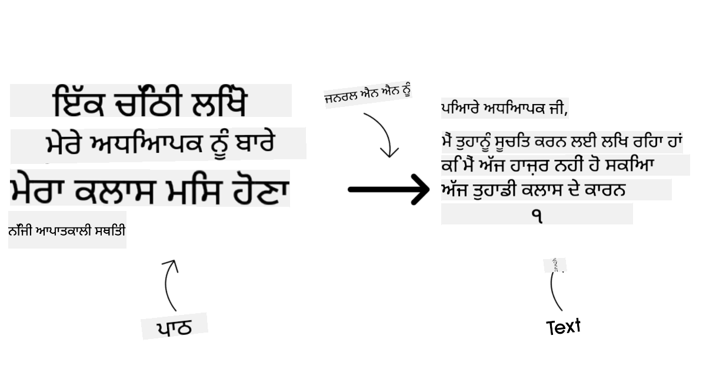

<!--
CO_OP_TRANSLATOR_METADATA:
{
  "original_hash": "e2f686f2eb794941761252ac5e8e090b",
  "translation_date": "2025-07-09T08:21:26+00:00",
  "source_file": "02-exploring-and-comparing-different-llms/README.md",
  "language_code": "pa"
}
-->
# ਵੱਖ-ਵੱਖ LLMs ਦੀ ਖੋਜ ਅਤੇ ਤੁਲਨਾ

> _ਇਸ ਪਾਠ ਦਾ ਵੀਡੀਓ ਦੇਖਣ ਲਈ ਉਪਰ ਦਿੱਤੀ ਤਸਵੀਰ 'ਤੇ ਕਲਿੱਕ ਕਰੋ_

ਪਿਛਲੇ ਪਾਠ ਵਿੱਚ, ਅਸੀਂ ਵੇਖਿਆ ਕਿ ਕਿਵੇਂ Generative AI ਤਕਨਾਲੋਜੀ ਦੇ ਮਾਹੌਲ ਨੂੰ ਬਦਲ ਰਿਹਾ ਹੈ, ਕਿਵੇਂ Large Language Models (LLMs) ਕੰਮ ਕਰਦੇ ਹਨ ਅਤੇ ਕਿਵੇਂ ਇੱਕ ਕਾਰੋਬਾਰ - ਜਿਵੇਂ ਸਾਡਾ ਸਟਾਰਟਅਪ - ਉਨ੍ਹਾਂ ਨੂੰ ਆਪਣੇ ਉਦੇਸ਼ਾਂ ਲਈ ਵਰਤ ਸਕਦਾ ਹੈ ਅਤੇ ਵਧ ਸਕਦਾ ਹੈ! ਇਸ ਅਧਿਆਇ ਵਿੱਚ, ਅਸੀਂ ਵੱਖ-ਵੱਖ ਕਿਸਮਾਂ ਦੇ ਵੱਡੇ ਭਾਸ਼ਾ ਮਾਡਲਾਂ (LLMs) ਦੀ ਤੁਲਨਾ ਅਤੇ ਵਿਰੋਧ ਕਰਾਂਗੇ ਤਾਂ ਜੋ ਉਨ੍ਹਾਂ ਦੇ ਫਾਇਦੇ ਅਤੇ ਨੁਕਸਾਨ ਸਮਝ ਸਕੀਏ।

ਸਾਡੇ ਸਟਾਰਟਅਪ ਦੀ ਅਗਲੀ ਕਦਮ ਹੈ ਮੌਜੂਦਾ LLMs ਦੇ ਮਾਹੌਲ ਦੀ ਖੋਜ ਕਰਨਾ ਅਤੇ ਸਮਝਣਾ ਕਿ ਕਿਹੜੇ ਸਾਡੇ ਉਦੇਸ਼ ਲਈ ਢੁਕਵੇਂ ਹਨ।

## ਪਰਿਚਯ

ਇਹ ਪਾਠ ਇਹਨਾਂ ਵਿਸ਼ਿਆਂ ਨੂੰ ਕਵਰ ਕਰੇਗਾ:

- ਮੌਜੂਦਾ ਮਾਹੌਲ ਵਿੱਚ ਵੱਖ-ਵੱਖ ਕਿਸਮਾਂ ਦੇ LLMs।
- Azure ਵਿੱਚ ਆਪਣੇ ਉਦੇਸ਼ ਲਈ ਵੱਖ-ਵੱਖ ਮਾਡਲਾਂ ਦੀ ਟੈਸਟਿੰਗ, ਦੁਹਰਾਈ ਅਤੇ ਤੁਲਨਾ।
- LLM ਨੂੰ ਕਿਵੇਂ ਡਿਪਲੋਇ ਕੀਤਾ ਜਾਂਦਾ ਹੈ।

## ਸਿੱਖਣ ਦੇ ਲਕੜ

ਇਸ ਪਾਠ ਨੂੰ ਪੂਰਾ ਕਰਨ ਤੋਂ ਬਾਅਦ, ਤੁਸੀਂ ਸਮਰੱਥ ਹੋਵੋਗੇ:

- ਆਪਣੇ ਉਦੇਸ਼ ਲਈ ਸਹੀ ਮਾਡਲ ਚੁਣਨਾ।
- ਸਮਝਣਾ ਕਿ ਮਾਡਲ ਦੀ ਟੈਸਟਿੰਗ, ਦੁਹਰਾਈ ਅਤੇ ਪ੍ਰਦਰਸ਼ਨ ਵਿੱਚ ਸੁਧਾਰ ਕਿਵੇਂ ਕਰਨਾ ਹੈ।
- ਜਾਣਨਾ ਕਿ ਕਾਰੋਬਾਰ ਮਾਡਲਾਂ ਨੂੰ ਕਿਵੇਂ ਡਿਪਲੋਇ ਕਰਦੇ ਹਨ।

## ਵੱਖ-ਵੱਖ ਕਿਸਮਾਂ ਦੇ LLMs ਨੂੰ ਸਮਝਣਾ

LLMs ਨੂੰ ਉਨ੍ਹਾਂ ਦੀ ਆਰਕੀਟੈਕਚਰ, ਟ੍ਰੇਨਿੰਗ ਡੇਟਾ ਅਤੇ ਉਦੇਸ਼ ਦੇ ਆਧਾਰ 'ਤੇ ਕਈ ਵੱਖ-ਵੱਖ ਸ਼੍ਰੇਣੀਆਂ ਵਿੱਚ ਵੰਡਿਆ ਜਾ ਸਕਦਾ ਹੈ। ਇਹ ਫਰਕ ਸਮਝਣਾ ਸਾਡੇ ਸਟਾਰਟਅਪ ਨੂੰ ਸਹੀ ਮਾਡਲ ਚੁਣਨ ਵਿੱਚ ਮਦਦ ਕਰੇਗਾ ਅਤੇ ਇਹ ਵੀ ਸਮਝਣ ਵਿੱਚ ਕਿ ਕਿਵੇਂ ਟੈਸਟ, ਦੁਹਰਾਈ ਅਤੇ ਪ੍ਰਦਰਸ਼ਨ ਵਿੱਚ ਸੁਧਾਰ ਕਰਨਾ ਹੈ।

ਬਹੁਤ ਸਾਰੇ ਵੱਖ-ਵੱਖ ਕਿਸਮਾਂ ਦੇ LLM ਮਾਡਲ ਹਨ, ਤੁਹਾਡਾ ਮਾਡਲ ਚੁਣਨ ਇਸ ਗੱਲ 'ਤੇ ਨਿਰਭਰ ਕਰਦਾ ਹੈ ਕਿ ਤੁਸੀਂ ਉਨ੍ਹਾਂ ਨੂੰ ਕਿਸ ਲਈ ਵਰਤਣਾ ਚਾਹੁੰਦੇ ਹੋ, ਤੁਹਾਡਾ ਡੇਟਾ ਕੀ ਹੈ, ਤੁਸੀਂ ਕਿੰਨਾ ਖਰਚ ਕਰਨ ਲਈ ਤਿਆਰ ਹੋ ਅਤੇ ਹੋਰ।

ਜੇ ਤੁਸੀਂ ਮਾਡਲਾਂ ਨੂੰ ਟੈਕਸਟ, ਆਡੀਓ, ਵੀਡੀਓ, ਚਿੱਤਰ ਬਣਾਉਣ ਆਦਿ ਲਈ ਵਰਤਣਾ ਚਾਹੁੰਦੇ ਹੋ, ਤਾਂ ਤੁਸੀਂ ਵੱਖ-ਵੱਖ ਕਿਸਮ ਦੇ ਮਾਡਲ ਦੀ ਚੋਣ ਕਰ ਸਕਦੇ ਹੋ।

- **ਆਡੀਓ ਅਤੇ ਬੋਲਚਾਲ ਦੀ ਪਹਿਚਾਣ**। ਇਸ ਲਈ, Whisper-ਟਾਈਪ ਮਾਡਲ ਬਹੁਤ ਵਧੀਆ ਚੋਣ ਹਨ ਕਿਉਂਕਿ ਇਹ ਜਨਰਲ-ਪਰਪਜ਼ ਹਨ ਅਤੇ ਬੋਲਚਾਲ ਦੀ ਪਹਿਚਾਣ ਲਈ ਬਣਾਏ ਗਏ ਹਨ। ਇਹ ਵੱਖ-ਵੱਖ ਆਡੀਓ 'ਤੇ ਟ੍ਰੇਨ ਕੀਤੇ ਗਏ ਹਨ ਅਤੇ ਬਹੁਭਾਸ਼ੀ ਬੋਲਚਾਲ ਦੀ ਪਹਿਚਾਣ ਕਰ ਸਕਦੇ ਹਨ। [Whisper ਟਾਈਪ ਮਾਡਲਾਂ ਬਾਰੇ ਹੋਰ ਜਾਣੋ](https://platform.openai.com/docs/models/whisper?WT.mc_id=academic-105485-koreyst)।

- **ਚਿੱਤਰ ਬਣਾਉਣਾ**। ਚਿੱਤਰ ਬਣਾਉਣ ਲਈ, DALL-E ਅਤੇ Midjourney ਦੋ ਬਹੁਤ ਪ੍ਰਸਿੱਧ ਚੋਣਾਂ ਹਨ। DALL-E ਨੂੰ Azure OpenAI ਵੱਲੋਂ ਪ੍ਰਦਾਨ ਕੀਤਾ ਜਾਂਦਾ ਹੈ। [DALL-E ਬਾਰੇ ਹੋਰ ਪੜ੍ਹੋ](https://platform.openai.com/docs/models/dall-e?WT.mc_id=academic-105485-koreyst) ਅਤੇ ਇਸ ਕਰਿਕੁਲਮ ਦੇ ਅਧਿਆਇ 9 ਵਿੱਚ ਵੀ।

- **ਟੈਕਸਟ ਬਣਾਉਣਾ**। ਜ਼ਿਆਦਾਤਰ ਮਾਡਲ ਟੈਕਸਟ ਬਣਾਉਣ ਲਈ ਟ੍ਰੇਨ ਕੀਤੇ ਜਾਂਦੇ ਹਨ ਅਤੇ ਤੁਹਾਡੇ ਕੋਲ GPT-3.5 ਤੋਂ ਲੈ ਕੇ GPT-4 ਤੱਕ ਵੱਡੀ ਚੋਣ ਹੈ। ਇਹ ਵੱਖ-ਵੱਖ ਕੀਮਤਾਂ 'ਤੇ ਆਉਂਦੇ ਹਨ, ਜਿੱਥੇ GPT-4 ਸਭ ਤੋਂ ਮਹਿੰਗਾ ਹੈ। [Azure OpenAI playground](https://oai.azure.com/portal/playground?WT.mc_id=academic-105485-koreyst) ਵਿੱਚ ਵੇਖਣਾ ਲਾਭਦਾਇਕ ਹੈ ਕਿ ਕਿਹੜੇ ਮਾਡਲ ਤੁਹਾਡੇ ਲੋੜਾਂ ਅਤੇ ਖਰਚ ਦੇ ਮੁਤਾਬਕ ਸਭ ਤੋਂ ਵਧੀਆ ਹਨ।

- **ਮਲਟੀ-ਮੋਡੈਲਿਟੀ**। ਜੇ ਤੁਸੀਂ ਇਨਪੁੱਟ ਅਤੇ ਆਉਟਪੁੱਟ ਵਿੱਚ ਕਈ ਕਿਸਮਾਂ ਦੇ ਡੇਟਾ ਨੂੰ ਸੰਭਾਲਣਾ ਚਾਹੁੰਦੇ ਹੋ, ਤਾਂ ਤੁਸੀਂ [gpt-4 turbo with vision ਜਾਂ gpt-4o](https://learn.microsoft.com/azure/ai-services/openai/concepts/models#gpt-4-and-gpt-4-turbo-models?WT.mc_id=academic-105485-koreyst) ਵਰਗੇ ਮਾਡਲਾਂ ਨੂੰ ਦੇਖ ਸਕਦੇ ਹੋ - ਜੋ OpenAI ਦੇ ਨਵੇਂ ਰਿਲੀਜ਼ ਹਨ - ਜੋ ਕੁਦਰਤੀ ਭਾਸ਼ਾ ਪ੍ਰੋਸੈਸਿੰਗ ਨੂੰ ਵਿਜ਼ੂਅਲ ਸਮਝ ਨਾਲ ਜੋੜਦੇ ਹਨ, ਅਤੇ ਮਲਟੀ-ਮੋਡਲ ਇੰਟਰਫੇਸਾਂ ਰਾਹੀਂ ਇੰਟਰੈਕਸ਼ਨ ਦੀ ਸਹੂਲਤ ਦਿੰਦੇ ਹਨ।

ਮਾਡਲ ਚੁਣਨ ਦਾ ਮਤਲਬ ਹੈ ਕਿ ਤੁਹਾਨੂੰ ਕੁਝ ਬੁਨਿਆਦੀ ਸਮਰੱਥਾਵਾਂ ਮਿਲਦੀਆਂ ਹਨ, ਪਰ ਇਹ ਕਾਫੀ ਨਹੀਂ ਹੋ ਸਕਦੀਆਂ। ਅਕਸਰ ਤੁਹਾਡੇ ਕੋਲ ਕੰਪਨੀ-ਵਿਸ਼ੇਸ਼ ਡੇਟਾ ਹੁੰਦਾ ਹੈ ਜਿਸ ਬਾਰੇ ਤੁਹਾਨੂੰ LLM ਨੂੰ ਜਾਣੂ ਕਰਵਾਉਣਾ ਪੈਂਦਾ ਹੈ। ਇਸ ਲਈ ਕੁਝ ਵੱਖ-ਵੱਖ ਵਿਕਲਪ ਹਨ, ਜੋ ਅਗਲੇ ਹਿੱਸਿਆਂ ਵਿੱਚ ਵਧੇਰੇ ਜਾਣਕਾਰੀ ਮਿਲੇਗੀ।

### Foundation Models ਅਤੇ LLMs ਵਿੱਚ ਫਰਕ

Foundation Model ਸ਼ਬਦ ਨੂੰ [Stanford ਦੇ ਖੋਜਕਾਰਾਂ ਨੇ ਬਣਾਇਆ](https://arxiv.org/abs/2108.07258?WT.mc_id=academic-105485-koreyst) ਅਤੇ ਇਸ ਨੂੰ ਇੱਕ ਐਸਾ AI ਮਾਡਲ ਵਜੋਂ ਪਰਿਭਾਸ਼ਿਤ ਕੀਤਾ ਗਿਆ ਜੋ ਕੁਝ ਮਿਆਰਾਂ ਨੂੰ ਪੂਰਾ ਕਰਦਾ ਹੈ, ਜਿਵੇਂ:

- **ਇਹਨਾਂ ਨੂੰ unsupervised learning ਜਾਂ self-supervised learning ਨਾਲ ਟ੍ਰੇਨ ਕੀਤਾ ਜਾਂਦਾ ਹੈ**, ਜਿਸਦਾ ਮਤਲਬ ਹੈ ਕਿ ਇਹਨਾਂ ਨੂੰ ਬਿਨਾਂ ਲੇਬਲ ਵਾਲੇ ਮਲਟੀ-ਮੋਡਲ ਡੇਟਾ 'ਤੇ ਟ੍ਰੇਨ ਕੀਤਾ ਜਾਂਦਾ ਹੈ ਅਤੇ ਇਨ੍ਹਾਂ ਨੂੰ ਟ੍ਰੇਨਿੰਗ ਲਈ ਮਨੁੱਖੀ ਐਨੋਟੇਸ਼ਨ ਜਾਂ ਲੇਬਲਿੰਗ ਦੀ ਲੋੜ ਨਹੀਂ ਹੁੰਦੀ।
- **ਇਹ ਬਹੁਤ ਵੱਡੇ ਮਾਡਲ ਹੁੰਦੇ ਹਨ**, ਜੋ ਬਹੁਤ ਡੂੰਘੇ ਨਿਊਰਲ ਨੈੱਟਵਰਕਾਂ 'ਤੇ ਅਧਾਰਿਤ ਹੁੰਦੇ ਹਨ ਅਤੇ ਅਰਬਾਂ ਪੈਰਾਮੀਟਰਾਂ 'ਤੇ ਟ੍ਰੇਨ ਕੀਤੇ ਜਾਂਦੇ ਹਨ।
- **ਇਹ ਆਮ ਤੌਰ 'ਤੇ ਹੋਰ ਮਾਡਲਾਂ ਲਈ ‘ਬੁਨਿਆਦ’ ਵਜੋਂ ਕੰਮ ਕਰਦੇ ਹਨ**, ਜਿਸਦਾ ਮਤਲਬ ਹੈ ਕਿ ਇਹਨਾਂ ਨੂੰ ਹੋਰ ਮਾਡਲਾਂ ਦੇ ਬਣਾਉਣ ਲਈ ਸ਼ੁਰੂਆਤੀ ਬਿੰਦੂ ਵਜੋਂ ਵਰਤਿਆ ਜਾ ਸਕਦਾ ਹੈ, ਜਿਸਨੂੰ ਫਾਈਨ-ਟਿਊਨਿੰਗ ਰਾਹੀਂ ਕੀਤਾ ਜਾ ਸਕਦਾ ਹੈ।

ਤਸਵੀਰ ਦਾ ਸਰੋਤ: [Essential Guide to Foundation Models and Large Language Models | by Babar M Bhatti | Medium](https://thebabar.medium.com/essential-guide-to-foundation-models-and-large-language-models-27dab58f7404)

ਇਸ ਫਰਕ ਨੂੰ ਹੋਰ ਸਪਸ਼ਟ ਕਰਨ ਲਈ, ਚਲੋ ChatGPT ਨੂੰ ਉਦਾਹਰਨ ਵਜੋਂ ਲੈਂਦੇ ਹਾਂ। ChatGPT ਦਾ ਪਹਿਲਾ ਵਰਜਨ ਬਣਾਉਣ ਲਈ, GPT-3.5 ਮਾਡਲ ਨੂੰ Foundation Model ਵਜੋਂ ਵਰਤਿਆ ਗਿਆ। ਇਸਦਾ ਮਤਲਬ ਹੈ ਕਿ OpenAI ਨੇ ਕੁਝ ਚੈਟ-ਵਿਸ਼ੇਸ਼ ਡੇਟਾ ਦੀ ਵਰਤੋਂ ਕਰਕੇ GPT-3.5 ਦਾ ਇੱਕ ਟਿਊਨ ਕੀਤਾ ਹੋਇਆ ਵਰਜਨ ਬਣਾਇਆ ਜੋ ਗੱਲਬਾਤ ਵਾਲੇ ਸੰਦਰਭਾਂ ਵਿੱਚ ਚੰਗਾ ਕੰਮ ਕਰਦਾ ਹੈ, ਜਿਵੇਂ ਕਿ ਚੈਟਬੋਟ।

ਤਸਵੀਰ ਦਾ ਸਰੋਤ: [2108.07258.pdf (arxiv.org)](https://arxiv.org/pdf/2108.07258.pdf?WT.mc_id=academic-105485-koreyst)

### Open Source ਅਤੇ Proprietary Models

LLMs ਨੂੰ ਇੱਕ ਹੋਰ ਤਰੀਕੇ ਨਾਲ ਵੰਡਿਆ ਜਾ ਸਕਦਾ ਹੈ ਕਿ ਉਹ open source ਹਨ ਜਾਂ proprietary।

Open-source ਮਾਡਲ ਉਹ ਹੁੰਦੇ ਹਨ ਜੋ ਜਨਤਾ ਲਈ ਉਪਲਬਧ ਹੁੰਦੇ ਹਨ ਅਤੇ ਕਿਸੇ ਵੀ ਵਿਅਕਤੀ ਵੱਲੋਂ ਵਰਤੇ ਜਾ ਸਕਦੇ ਹਨ। ਇਹ ਆਮ ਤੌਰ 'ਤੇ ਉਸ ਕੰਪਨੀ ਜਾਂ ਖੋਜ ਸਮੁਦਾਇ ਵੱਲੋਂ ਜਾਰੀ ਕੀਤੇ ਜਾਂਦੇ ਹਨ ਜਿਨ੍ਹਾਂ ਨੇ ਇਹ ਬਣਾਏ ਹਨ। ਇਹ ਮਾਡਲ ਜਾਂਚੇ, ਸੋਧੇ ਅਤੇ ਵੱਖ-ਵੱਖ ਉਦੇਸ਼ਾਂ ਲਈ ਅਨੁਕੂਲਿਤ ਕੀਤੇ ਜਾ ਸਕਦੇ ਹਨ। ਪਰ ਇਹ ਹਮੇਸ਼ਾ ਉਤਪਾਦਨ ਲਈ ਅਨੁਕੂਲਿਤ ਨਹੀਂ ਹੁੰਦੇ ਅਤੇ proprietary ਮਾਡਲਾਂ ਵਾਂਗ ਪ੍ਰਦਰਸ਼ਨਸ਼ੀਲ ਨਹੀਂ ਹੋ ਸਕਦੇ। ਇਸਦੇ ਨਾਲ, open-source ਮਾਡਲਾਂ ਲਈ ਫੰਡਿੰਗ ਸੀਮਿਤ ਹੋ ਸਕਦੀ ਹੈ, ਅਤੇ ਇਹ ਲੰਬੇ ਸਮੇਂ ਤੱਕ ਸੰਭਾਲੇ ਨਹੀਂ ਜਾਂਦੇ ਜਾਂ ਨਵੇਂ ਖੋਜ ਨਾਲ ਅਪਡੇਟ ਨਹੀਂ ਹੁੰਦੇ। ਪ੍ਰਸਿੱਧ open source ਮਾਡਲਾਂ ਦੇ ਉਦਾਹਰਨ ਹਨ [Alpaca](https://crfm.stanford.edu/2023/03/13/alpaca.html?WT.mc_id=academic-105485-koreyst), [Bloom](https://huggingface.co/bigscience/bloom) ਅਤੇ [LLaMA](https://llama.meta.com)।

Proprietary ਮਾਡਲ ਉਹ ਹੁੰਦੇ ਹਨ ਜੋ ਕਿਸੇ ਕੰਪਨੀ ਦੇ ਮਾਲਕ ਹਨ ਅਤੇ ਜਨਤਾ ਲਈ ਉਪਲਬਧ ਨਹੀਂ ਹੁੰਦੇ। ਇਹ ਮਾਡਲ ਆਮ ਤੌਰ 'ਤੇ ਉਤਪਾਦਨ ਲਈ ਅਨੁਕੂਲਿਤ ਹੁੰਦੇ ਹਨ। ਪਰ ਇਹਨਾਂ ਨੂੰ ਜਾਂਚਣਾ, ਸੋਧਣਾ ਜਾਂ ਵੱਖ-ਵੱਖ ਉਦੇਸ਼ਾਂ ਲਈ ਅਨੁਕੂਲਿਤ ਕਰਨਾ ਮਨਾਹੀ ਹੁੰਦਾ ਹੈ। ਇਹ ਹਮੇਸ਼ਾ ਮੁਫ਼ਤ ਨਹੀਂ ਹੁੰਦੇ ਅਤੇ ਵਰਤੋਂ ਲਈ ਸਬਸਕ੍ਰਿਪਸ਼ਨ ਜਾਂ ਭੁਗਤਾਨ ਦੀ ਲੋੜ ਹੋ ਸਕਦੀ ਹੈ। ਇਸਦੇ ਨਾਲ, ਉਪਭੋਗਤਾਵਾਂ ਕੋਲ ਮਾਡਲ ਨੂੰ ਟ੍ਰੇਨ ਕਰਨ ਲਈ ਵਰਤੇ ਗਏ ਡੇਟਾ 'ਤੇ ਕੰਟਰੋਲ ਨਹੀਂ ਹੁੰਦਾ, ਜਿਸਦਾ ਮਤਲਬ ਹੈ ਕਿ ਉਨ੍ਹਾਂ ਨੂੰ ਮਾਡਲ ਮਾਲਕ 'ਤੇ ਡੇਟਾ ਪ੍ਰਾਈਵੇਸੀ ਅਤੇ AI ਦੀ ਜ਼ਿੰਮੇਵਾਰ ਵਰਤੋਂ ਦੀ ਗਾਰੰਟੀ ਦੇਣੀ ਪੈਂਦੀ ਹੈ। ਪ੍ਰਸਿੱਧ proprietary ਮਾਡਲਾਂ ਦੇ ਉਦਾਹਰਨ ਹਨ [OpenAI ਮਾਡਲ](https://platform.openai.com/docs/models/overview?WT.mc_id=academic-105485-koreyst), [Google Bard](https://sapling.ai/llm/bard?WT.mc_id=academic-105485-koreyst) ਜਾਂ [Claude 2](https://www.anthropic.com/index/claude-2?WT.mc_id=academic-105485-koreyst)।

### Embedding, Image Generation ਅਤੇ Text ਅਤੇ Code Generation

LLMs ਨੂੰ ਉਨ੍ਹਾਂ ਦੇ ਨਤੀਜੇ ਦੇ ਆਧਾਰ 'ਤੇ ਵੀ ਵੰਡਿਆ ਜਾ ਸਕਦਾ ਹੈ।

Embedding ਮਾਡਲ ਉਹ ਹੁੰਦੇ ਹਨ ਜੋ ਟੈਕਸਟ ਨੂੰ ਗਿਣਤੀ ਵਾਲੇ ਰੂਪ ਵਿੱਚ ਬਦਲਦੇ ਹਨ, ਜਿਸਨੂੰ embedding ਕਹਿੰਦੇ ਹਨ, ਜੋ ਇਨਪੁੱਟ ਟੈਕਸਟ ਦੀ ਗਿਣਤੀ ਵਾਲੀ ਪ੍ਰਤੀਨਿਧਤਾ ਹੁੰਦੀ ਹੈ। Embeddings ਮਸ਼ੀਨਾਂ ਲਈ ਸ਼ਬਦਾਂ ਜਾਂ ਵਾਕਾਂਸ਼ਾਂ ਦੇ ਰਿਸ਼ਤਿਆਂ ਨੂੰ ਸਮਝਣਾ ਆਸਾਨ ਬਣਾਉਂਦੇ ਹਨ ਅਤੇ ਇਹਨਾਂ ਨੂੰ ਹੋਰ ਮਾਡਲਾਂ ਵੱਲੋਂ ਇਨਪੁੱਟ ਵਜੋਂ ਵਰਤਿਆ ਜਾ ਸਕਦਾ ਹੈ, ਜਿਵੇਂ ਕਿ ਕਲਾਸੀਫਿਕੇਸ਼ਨ ਮਾਡਲ ਜਾਂ ਕਲੱਸਟਰਿੰਗ ਮਾਡਲ ਜੋ ਗਿਣਤੀ ਵਾਲੇ ਡੇਟਾ 'ਤੇ ਵਧੀਆ ਕੰਮ ਕਰਦੇ ਹਨ। Embedding ਮਾਡਲ ਆਮ ਤੌਰ 'ਤੇ ਟ੍ਰਾਂਸਫਰ ਲਰਨਿੰਗ ਲਈ ਵਰਤੇ ਜਾਂਦੇ ਹਨ, ਜਿੱਥੇ ਇੱਕ ਮਾਡਲ ਕਿਸੇ ਸਹਾਇਕ ਕੰਮ ਲਈ ਬਣਾਇਆ ਜਾਂਦਾ ਹੈ ਜਿਸ ਲਈ ਡੇਟਾ ਬਹੁਤ ਹੁੰਦਾ ਹੈ, ਅਤੇ ਫਿਰ ਮਾਡਲ ਦੇ ਵਜ਼ਨ (embeddings) ਨੂੰ ਹੋਰ ਕੰਮਾਂ ਲਈ ਦੁਬਾਰਾ ਵਰਤਿਆ ਜਾਂਦਾ ਹੈ। ਇਸ ਸ਼੍ਰੇਣੀ ਦਾ ਉਦਾਹਰਨ ਹੈ [OpenAI embeddings](https://platform.openai.com/docs/models/embeddings?WT.mc_id=academic-105485-koreyst)।

ਚਿੱਤਰ ਬਣਾਉਣ ਵਾਲੇ ਮਾਡਲ ਉਹ ਹੁੰਦੇ ਹਨ ਜੋ ਚਿੱਤਰ ਬਣਾਉਂਦੇ ਹਨ। ਇਹ ਮਾਡਲ ਆਮ ਤੌਰ 'ਤੇ ਚਿੱਤਰ ਸੰਪਾਦਨ, ਚਿੱਤਰ ਸੰਸ਼ਲੇਸ਼ਣ ਅਤੇ ਚਿੱਤਰ ਅਨੁਵਾਦ ਲਈ ਵਰਤੇ ਜਾਂਦੇ ਹਨ। ਇਹ ਮਾਡਲ ਵੱਡੇ ਚਿੱਤਰ ਡੇਟਾਸੈੱਟਾਂ, ਜਿਵੇਂ [LAION-5B](https://laion.ai/blog/laion-5b/?WT.mc_id=academic-105485-koreyst) 'ਤੇ ਟ੍ਰੇਨ ਕੀਤੇ ਜਾਂਦੇ ਹਨ ਅਤੇ ਨਵੇਂ ਚਿੱਤਰ ਬਣਾਉਣ ਜਾਂ ਮੌਜੂਦਾ ਚਿੱਤਰਾਂ ਨੂੰ ਇੰਪੇਂਟਿੰਗ, ਸੁਪਰ-ਰੈਜ਼ੋਲੂਸ਼ਨ ਅਤੇ ਰੰਗ-ਭਰਨ ਤਕਨੀਕਾਂ ਨਾਲ ਸੰਪਾਦਿਤ ਕਰਨ ਲਈ ਵਰਤੇ ਜਾਂਦੇ ਹਨ। ਉਦਾਹਰਨਾਂ ਵਿੱਚ [DALL-E-3](https://openai.com/dall-e-3?WT.mc_id=academic-105485-koreyst) ਅਤੇ [Stable Diffusion ਮਾਡਲ](https://github.com/Stability-AI/StableDiffusion?WT.mc_id=academic-105485-koreyst) ਸ਼ਾਮਲ ਹਨ।

ਟੈਕਸਟ ਅਤੇ ਕੋਡ ਬਣਾਉਣ ਵਾਲੇ ਮਾਡਲ ਉਹ ਹੁੰਦੇ ਹਨ ਜੋ ਟੈਕਸਟ ਜਾਂ ਕੋਡ ਬਣਾਉਂਦੇ ਹਨ। ਇਹ ਮਾਡਲ ਆਮ ਤੌਰ 'ਤੇ ਟੈਕਸਟ ਸੰਖੇਪ, ਅਨੁਵਾਦ ਅਤੇ ਪ੍ਰਸ਼ਨ-ਉੱਤਰ ਲਈ ਵਰਤੇ ਜਾਂਦੇ ਹਨ। ਟੈਕਸਟ ਬਣਾਉਣ ਵਾਲੇ ਮਾਡਲ ਵੱਡੇ ਟੈਕਸਟ ਡੇਟਾਸੈੱਟਾਂ, ਜਿਵੇਂ [BookCorpus](https://www.cv-foundation.org/openaccess/content_iccv_2015/html/Zhu_Aligning_Books_and_ICCV_2015_paper.html?WT.mc_id=academic-105485-koreyst) 'ਤੇ ਟ੍ਰੇਨ ਕੀਤੇ ਜਾਂਦੇ ਹਨ ਅਤੇ ਨਵਾਂ ਟੈਕਸਟ ਬਣਾਉਣ ਜਾਂ ਪ੍ਰਸ਼ਨਾਂ ਦੇ ਜਵਾਬ ਦੇਣ ਲਈ ਵਰਤੇ ਜਾਂਦੇ ਹਨ। ਕੋਡ ਬਣਾਉਣ ਵਾਲੇ ਮਾਡਲ, ਜਿਵੇਂ [CodeParrot](https://huggingface.co/codeparrot?WT.mc_id=academic-105485-koreyst), ਵੱਡੇ ਕੋਡ ਡੇਟਾਸੈੱਟਾਂ, ਜਿਵੇਂ GitHub, 'ਤੇ ਟ੍ਰੇਨ ਕੀਤੇ ਜਾਂਦੇ ਹਨ ਅਤੇ ਨਵਾਂ ਕੋਡ ਬਣਾਉਣ ਜਾਂ ਮੌਜੂਦਾ ਕੋਡ ਵਿੱਚ ਬੱਗ ਠੀਕ ਕਰਨ ਲਈ ਵਰਤੇ ਜਾਂਦੇ ਹਨ।

### Encoder-Decoder ਅਤੇ Decoder-only

LLMs ਦੀਆਂ ਵੱਖ-ਵੱਖ ਆਰਕੀਟੈਕਚਰਾਂ ਬਾਰੇ ਗੱਲ ਕਰਨ ਲਈ, ਆਓ ਇੱਕ ਉਦਾਹਰਨ ਲਵਾਂ।

ਕਲਪਨਾ ਕਰੋ ਕਿ ਤੁਹਾਡੇ ਮੈਨੇਜਰ ਨੇ ਤੁਹਾਨੂੰ ਵਿਦਿਆਰਥੀਆਂ ਲਈ ਇੱਕ ਕਵਿਜ਼ ਲਿਖਣ ਦਾ ਕੰਮ ਦਿੱਤਾ ਹੈ। ਤੁਹਾਡੇ ਕੋਲ ਦੋ ਸਹਿਕਰਮੀ ਹਨ; ਇੱਕ ਸਮੱਗਰੀ ਬਣਾਉਂਦਾ ਹੈ ਅਤੇ ਦੂਜਾ ਉਸਦੀ ਸਮੀਖਿਆ ਕਰਦਾ ਹੈ।

ਸਮੱਗਰੀ ਬਣਾਉਣ ਵਾਲਾ ਇੱਕ Decoder-only ਮਾਡਲ ਵਾਂਗ ਹੈ, ਜੋ ਵਿਸ਼ੇ ਨੂੰ ਦੇਖ ਕੇ ਜੋ ਤੁਸੀਂ ਪਹਿਲਾਂ ਲਿਖਿਆ ਹੈ ਉਸਦੇ ਆਧ
ਸਾਡੇ ਪਿਛਲੇ ਪੈਰਾਗ੍ਰਾਫਾਂ ਵਿੱਚ ਜਿਨ੍ਹਾਂ ਮਾਡਲਾਂ ਦਾ ਜ਼ਿਕਰ ਕੀਤਾ ਗਿਆ ਸੀ (OpenAI ਮਾਡਲ, ਖੁੱਲ੍ਹੇ ਸਰੋਤ ਵਾਲੇ ਮਾਡਲ ਜਿਵੇਂ Llama2, ਅਤੇ Hugging Face transformers) ਉਹ [Model Catalog](https://learn.microsoft.com/azure/ai-studio/how-to/model-catalog-overview?WT.mc_id=academic-105485-koreyst) ਵਿੱਚ [Azure AI Studio](https://ai.azure.com/?WT.mc_id=academic-105485-koreyst) ਵਿੱਚ ਉਪਲਬਧ ਹਨ।

[Azure AI Studio](https://learn.microsoft.com/azure/ai-studio/what-is-ai-studio?WT.mc_id=academic-105485-koreyst) ਇੱਕ ਕਲਾਉਡ ਪਲੇਟਫਾਰਮ ਹੈ ਜੋ ਡਿਵੈਲਪਰਾਂ ਲਈ ਬਣਾਇਆ ਗਿਆ ਹੈ ਤਾਂ ਜੋ ਉਹ ਜਨਰੇਟਿਵ AI ਐਪਲੀਕੇਸ਼ਨਾਂ ਨੂੰ ਤਿਆਰ ਕਰ ਸਕਣ ਅਤੇ ਪੂਰੇ ਵਿਕਾਸ ਚੱਕਰ ਨੂੰ ਸੰਭਾਲ ਸਕਣ - ਪ੍ਰਯੋਗ ਤੋਂ ਲੈ ਕੇ ਮੁਲਾਂਕਣ ਤੱਕ - ਸਾਰੇ Azure AI ਸੇਵਾਵਾਂ ਨੂੰ ਇੱਕ ਸਿੰਗਲ ਹੱਬ ਵਿੱਚ ਇਕੱਠਾ ਕਰਕੇ ਇੱਕ ਆਸਾਨ GUI ਦੇ ਨਾਲ। Azure AI Studio ਵਿੱਚ ਮਾਡਲ ਕੈਟਾਲੌਗ ਯੂਜ਼ਰ ਨੂੰ ਇਹ ਸਹੂਲਤ ਦਿੰਦਾ ਹੈ:

- ਕੈਟਾਲੌਗ ਵਿੱਚ ਆਪਣੀ ਰੁਚੀ ਦਾ ਫਾਊਂਡੇਸ਼ਨ ਮਾਡਲ ਲੱਭੋ - ਚਾਹੇ ਉਹ ਪ੍ਰੋਪ੍ਰਾਇਟਰੀ ਹੋਵੇ ਜਾਂ ਖੁੱਲ੍ਹਾ ਸਰੋਤ, ਟਾਸਕ, ਲਾਇਸੈਂਸ ਜਾਂ ਨਾਮ ਦੇ ਅਧਾਰ 'ਤੇ ਫਿਲਟਰ ਕਰਕੇ। ਖੋਜ ਨੂੰ ਸੁਗਮ ਬਣਾਉਣ ਲਈ, ਮਾਡਲਾਂ ਨੂੰ ਕਲੈਕਸ਼ਨਾਂ ਵਿੱਚ ਵੰਡਿਆ ਗਿਆ ਹੈ, ਜਿਵੇਂ Azure OpenAI ਕਲੈਕਸ਼ਨ, Hugging Face ਕਲੈਕਸ਼ਨ, ਅਤੇ ਹੋਰ।

- ਮਾਡਲ ਕਾਰਡ ਦੀ ਸਮੀਖਿਆ ਕਰੋ, ਜਿਸ ਵਿੱਚ ਉਦੇਸ਼ਿਤ ਵਰਤੋਂ ਅਤੇ ਟ੍ਰੇਨਿੰਗ ਡੇਟਾ ਦਾ ਵਿਸਥਾਰ ਨਾਲ ਵਰਣਨ, ਕੋਡ ਨਮੂਨੇ ਅਤੇ ਅੰਦਰੂਨੀ ਮੁਲਾਂਕਣ ਲਾਇਬ੍ਰੇਰੀ 'ਤੇ ਮੁਲਾਂਕਣ ਨਤੀਜੇ ਸ਼ਾਮਲ ਹਨ।

- ਉਦਯੋਗ ਵਿੱਚ ਉਪਲਬਧ ਮਾਡਲਾਂ ਅਤੇ ਡੇਟਾਸੈੱਟਾਂ ਦੇ ਬੈਂਚਮਾਰਕਾਂ ਦੀ ਤੁਲਨਾ ਕਰੋ ਤਾਂ ਜੋ ਇਹ ਅੰਦਾਜ਼ਾ ਲਗਾਇਆ ਜਾ ਸਕੇ ਕਿ ਕਿਹੜਾ ਮਾਡਲ ਕਾਰੋਬਾਰੀ ਸਥਿਤੀ ਲਈ ਸਭ ਤੋਂ ਵਧੀਆ ਹੈ, [Model Benchmarks](https://learn.microsoft.com/azure/ai-studio/how-to/model-benchmarks?WT.mc_id=academic-105485-koreyst) ਪੈਨਲ ਰਾਹੀਂ।

- ਮਾਡਲ ਨੂੰ ਆਪਣੇ ਖਾਸ ਟ੍ਰੇਨਿੰਗ ਡੇਟਾ 'ਤੇ ਫਾਈਨ-ਟਿਊਨ ਕਰੋ ਤਾਂ ਜੋ ਕਿਸੇ ਵਿਸ਼ੇਸ਼ ਕੰਮ ਵਿੱਚ ਮਾਡਲ ਦੀ ਕਾਰਗੁਜ਼ਾਰੀ ਸੁਧਾਰੀ ਜਾ ਸਕੇ, Azure AI Studio ਦੀ ਪ੍ਰਯੋਗ ਅਤੇ ਟ੍ਰੈਕਿੰਗ ਖੂਬੀਆਂ ਦੀ ਵਰਤੋਂ ਕਰਦੇ ਹੋਏ।

- ਮੂਲ ਪ੍ਰੀ-ਟ੍ਰੇਨਡ ਮਾਡਲ ਜਾਂ ਫਾਈਨ-ਟਿਊਨ ਕੀਤਾ ਹੋਇਆ ਵਰਜਨ ਰੀਮੋਟ ਰੀਅਲ ਟਾਈਮ ਇੰਫਰੈਂਸ - ਮੈਨੇਜਡ ਕੰਪਿਊਟ - ਜਾਂ ਸਰਵਰਲੈੱਸ API ਐਂਡਪੌਇੰਟ - [pay-as-you-go](https://learn.microsoft.com/azure/ai-studio/how-to/model-catalog-overview#model-deployment-managed-compute-and-serverless-api-pay-as-you-go?WT.mc_id=academic-105485-koreyst) - 'ਤੇ ਡਿਪਲੋਇ ਕਰੋ ਤਾਂ ਜੋ ਐਪਲੀਕੇਸ਼ਨਾਂ ਨੂੰ ਇਸਦਾ ਉਪਯੋਗ ਕਰਨ ਦੀ ਸਹੂਲਤ ਮਿਲੇ।

> [!NOTE]
> ਕੈਟਾਲੌਗ ਵਿੱਚ ਸਾਰੇ ਮਾਡਲ ਇਸ ਸਮੇਂ ਫਾਈਨ-ਟਿਊਨਿੰਗ ਅਤੇ/ਜਾਂ pay-as-you-go ਡਿਪਲੋਇਮੈਂਟ ਲਈ ਉਪਲਬਧ ਨਹੀਂ ਹਨ। ਮਾਡਲ ਦੀਆਂ ਖੂਬੀਆਂ ਅਤੇ ਸੀਮਾਵਾਂ ਬਾਰੇ ਜਾਣਕਾਰੀ ਲਈ ਮਾਡਲ ਕਾਰਡ ਚੈੱਕ ਕਰੋ।

## LLM ਨਤੀਜਿਆਂ ਵਿੱਚ ਸੁਧਾਰ

ਅਸੀਂ ਆਪਣੀ ਸਟਾਰਟਅਪ ਟੀਮ ਨਾਲ ਵੱਖ-ਵੱਖ ਕਿਸਮਾਂ ਦੇ LLMs ਅਤੇ ਇੱਕ ਕਲਾਉਡ ਪਲੇਟਫਾਰਮ (Azure Machine Learning) ਦੀ ਜਾਂਚ ਕੀਤੀ ਹੈ ਜੋ ਸਾਨੂੰ ਵੱਖ-ਵੱਖ ਮਾਡਲਾਂ ਦੀ ਤੁਲਨਾ ਕਰਨ, ਟੈਸਟ ਡੇਟਾ 'ਤੇ ਮੁਲਾਂਕਣ ਕਰਨ, ਕਾਰਗੁਜ਼ਾਰੀ ਸੁਧਾਰਨ ਅਤੇ ਇੰਫਰੈਂਸ ਐਂਡਪੌਇੰਟਾਂ 'ਤੇ ਡਿਪਲੋਇ ਕਰਨ ਦੀ ਆਗਿਆ ਦਿੰਦਾ ਹੈ।

ਪਰ ਉਹ ਕਦੋਂ ਫਾਈਨ-ਟਿਊਨਿੰਗ ਮਾਡਲ ਨੂੰ ਵਰਤਣ ਬਜਾਏ ਪ੍ਰੀ-ਟ੍ਰੇਨਡ ਮਾਡਲ ਨੂੰ ਵਰਤਣ ਬਾਰੇ ਸੋਚਣ? ਕੀ ਹੋਰ ਤਰੀਕੇ ਹਨ ਜੋ ਕਿਸੇ ਵਿਸ਼ੇਸ਼ ਕੰਮ ਵਿੱਚ ਮਾਡਲ ਦੀ ਕਾਰਗੁਜ਼ਾਰੀ ਸੁਧਾਰ ਸਕਦੇ ਹਨ?

ਕਾਰੋਬਾਰ ਵੱਖ-ਵੱਖ ਤਰੀਕੇ ਵਰਤ ਸਕਦਾ ਹੈ ਤਾਂ ਜੋ ਉਹ LLM ਤੋਂ ਆਪਣੀਆਂ ਲੋੜਾਂ ਮੁਤਾਬਕ ਨਤੀਜੇ ਪ੍ਰਾਪਤ ਕਰ ਸਕੇ। ਤੁਸੀਂ ਉਤਪਾਦਨ ਵਿੱਚ LLM ਨੂੰ ਡਿਪਲੋਇ ਕਰਦੇ ਸਮੇਂ ਵੱਖ-ਵੱਖ ਕਿਸਮਾਂ ਦੇ ਮਾਡਲ ਚੁਣ ਸਕਦੇ ਹੋ, ਜਿਨ੍ਹਾਂ ਦੀ ਟ੍ਰੇਨਿੰਗ ਦੀ ਡਿਗਰੀ ਵੱਖ-ਵੱਖ ਹੁੰਦੀ ਹੈ, ਅਤੇ ਜਿਨ੍ਹਾਂ ਦੀ ਜਟਿਲਤਾ, ਲਾਗਤ ਅਤੇ ਗੁਣਵੱਤਾ ਵੀ ਵੱਖ-ਵੱਖ ਹੁੰਦੀ ਹੈ। ਇੱਥੇ ਕੁਝ ਵੱਖ-ਵੱਖ ਤਰੀਕੇ ਦਿੱਤੇ ਗਏ ਹਨ:

- **ਸੰਦਰਭ ਨਾਲ ਪ੍ਰਾਂਪਟ ਇੰਜੀਨੀਅਰਿੰਗ**। ਮਕਸਦ ਇਹ ਹੈ ਕਿ ਜਦੋਂ ਤੁਸੀਂ ਪ੍ਰਾਂਪਟ ਦਿੰਦੇ ਹੋ ਤਾਂ ਕਾਫੀ ਸੰਦਰਭ ਦਿੱਤਾ ਜਾਵੇ ਤਾਂ ਜੋ ਤੁਹਾਨੂੰ ਲੋੜੀਂਦੇ ਜਵਾਬ ਮਿਲਣ।

- **Retrieval Augmented Generation, RAG**। ਤੁਹਾਡਾ ਡੇਟਾ ਕਿਸੇ ਡੇਟਾਬੇਸ ਜਾਂ ਵੈੱਬ ਐਂਡਪੌਇੰਟ ਵਿੱਚ ਹੋ ਸਕਦਾ ਹੈ, ਉਦਾਹਰਨ ਵਜੋਂ, ਤਾਂ ਇਹ ਯਕੀਨੀ ਬਣਾਉਣ ਲਈ ਕਿ ਇਹ ਡੇਟਾ ਜਾਂ ਇਸ ਦਾ ਕੋਈ ਹਿੱਸਾ ਪ੍ਰਾਂਪਟ ਦੇ ਸਮੇਂ ਸ਼ਾਮਲ ਹੋਵੇ, ਤੁਸੀਂ ਸੰਬੰਧਿਤ ਡੇਟਾ ਲੈ ਸਕਦੇ ਹੋ ਅਤੇ ਇਸਨੂੰ ਯੂਜ਼ਰ ਦੇ ਪ੍ਰਾਂਪਟ ਦਾ ਹਿੱਸਾ ਬਣਾ ਸਕਦੇ ਹੋ।

- **ਫਾਈਨ-ਟਿਊਨਡ ਮਾਡਲ**। ਇੱਥੇ, ਤੁਸੀਂ ਮਾਡਲ ਨੂੰ ਆਪਣੇ ਖਾਸ ਡੇਟਾ 'ਤੇ ਹੋਰ ਟ੍ਰੇਨ ਕੀਤਾ ਹੈ ਜਿਸ ਨਾਲ ਮਾਡਲ ਤੁਹਾਡੀਆਂ ਲੋੜਾਂ ਲਈ ਹੋਰ ਸਹੀ ਅਤੇ ਜਵਾਬਦੇਹ ਬਣ ਗਿਆ ਹੈ ਪਰ ਇਹ ਮਹਿੰਗਾ ਹੋ ਸਕਦਾ ਹੈ।

ਚਿੱਤਰ ਸਰੋਤ: [Four Ways that Enterprises Deploy LLMs | Fiddler AI Blog](https://www.fiddler.ai/blog/four-ways-that-enterprises-deploy-llms?WT.mc_id=academic-105485-koreyst)

### ਸੰਦਰਭ ਨਾਲ ਪ੍ਰਾਂਪਟ ਇੰਜੀਨੀਅਰਿੰਗ

ਪ੍ਰੀ-ਟ੍ਰੇਨਡ LLMs ਆਮ ਤੌਰ 'ਤੇ ਜਨਰਲ ਨੈਚਰਲ ਲੈਂਗਵੇਜ ਟਾਸਕਾਂ 'ਤੇ ਬਹੁਤ ਵਧੀਆ ਕੰਮ ਕਰਦੇ ਹਨ, ਭਾਵੇਂ ਉਹਨਾਂ ਨੂੰ ਛੋਟੇ ਪ੍ਰਾਂਪਟ ਨਾਲ ਕਾਲ ਕੀਤਾ ਜਾਵੇ, ਜਿਵੇਂ ਕਿ ਪੂਰਾ ਕਰਨ ਲਈ ਇੱਕ ਵਾਕ ਜਾਂ ਇੱਕ ਸਵਾਲ – ਜਿਸਨੂੰ “ਜ਼ੀਰੋ-ਸ਼ਾਟ” ਲਰਨਿੰਗ ਕਹਿੰਦੇ ਹਨ।

ਪਰ ਜਿੰਨਾ ਜ਼ਿਆਦਾ ਯੂਜ਼ਰ ਆਪਣੀ ਪੁੱਛਤਾਛ ਨੂੰ ਫਰੇਮ ਕਰ ਸਕਦਾ ਹੈ, ਵਿਸਥਾਰ ਨਾਲ ਬੇਨਤੀ ਅਤੇ ਉਦਾਹਰਨਾਂ ਦੇ ਨਾਲ – ਸੰਦਰਭ – ਉੱਤਰ ਉਤਨਾ ਹੀ ਸਹੀ ਅਤੇ ਯੂਜ਼ਰ ਦੀਆਂ ਉਮੀਦਾਂ ਦੇ ਨੇੜੇ ਹੋਵੇਗਾ। ਇਸ ਸੰਦਰਭ ਵਿੱਚ, ਜੇ ਪ੍ਰਾਂਪਟ ਵਿੱਚ ਸਿਰਫ ਇੱਕ ਉਦਾਹਰਨ ਹੋਵੇ ਤਾਂ ਇਸਨੂੰ “ਵਨ-ਸ਼ਾਟ” ਲਰਨਿੰਗ ਕਹਿੰਦੇ ਹਨ ਅਤੇ ਜੇ ਕਈ ਉਦਾਹਰਨਾਂ ਹੋਣ ਤਾਂ “ਫਿਊ-ਸ਼ਾਟ” ਲਰਨਿੰਗ ਕਹਿੰਦੇ ਹਨ। ਸੰਦਰਭ ਨਾਲ ਪ੍ਰਾਂਪਟ ਇੰਜੀਨੀਅਰਿੰਗ ਸ਼ੁਰੂਆਤ ਕਰਨ ਲਈ ਸਭ ਤੋਂ ਲਾਗਤ-ਪ੍ਰਭਾਵਸ਼ਾਲੀ ਤਰੀਕਾ ਹੈ।

### Retrieval Augmented Generation (RAG)

LLMs ਦੀ ਸੀਮਾ ਇਹ ਹੈ ਕਿ ਉਹ ਸਿਰਫ ਉਹੀ ਡੇਟਾ ਵਰਤ ਸਕਦੇ ਹਨ ਜੋ ਉਹਨਾਂ ਦੀ ਟ੍ਰੇਨਿੰਗ ਦੌਰਾਨ ਵਰਤਿਆ ਗਿਆ ਸੀ। ਇਸਦਾ ਮਤਲਬ ਹੈ ਕਿ ਉਹ ਟ੍ਰੇਨਿੰਗ ਤੋਂ ਬਾਅਦ ਹੋਏ ਤੱਥਾਂ ਬਾਰੇ ਕੁਝ ਨਹੀਂ ਜਾਣਦੇ ਅਤੇ ਉਹ ਗੈਰ-ਸਾਰਵਜਨਿਕ ਜਾਣਕਾਰੀ (ਜਿਵੇਂ ਕੰਪਨੀ ਦਾ ਡੇਟਾ) ਤੱਕ ਪਹੁੰਚ ਨਹੀਂ ਕਰ ਸਕਦੇ।

ਇਸ ਨੂੰ RAG ਰਾਹੀਂ ਪਾਰ ਕੀਤਾ ਜਾ ਸਕਦਾ ਹੈ, ਜੋ ਪ੍ਰਾਂਪਟ ਨੂੰ ਬਾਹਰੀ ਡੇਟਾ ਦੇ ਟੁਕੜਿਆਂ ਦੇ ਰੂਪ ਵਿੱਚ ਵਧਾਉਂਦਾ ਹੈ, ਪ੍ਰਾਂਪਟ ਦੀ ਲੰਬਾਈ ਦੀ ਸੀਮਾ ਨੂੰ ਧਿਆਨ ਵਿੱਚ ਰੱਖਦੇ ਹੋਏ। ਇਹ Vector ਡੇਟਾਬੇਸ ਟੂਲਜ਼ (ਜਿਵੇਂ [Azure Vector Search](https://learn.microsoft.com/azure/search/vector-search-overview?WT.mc_id=academic-105485-koreyst)) ਦੁਆਰਾ ਸਹਾਇਤਾ ਪ੍ਰਾਪਤ ਹੈ ਜੋ ਵੱਖ-ਵੱਖ ਪਹਿਲਾਂ ਤੋਂ ਨਿਰਧਾਰਤ ਡੇਟਾ ਸਰੋਤਾਂ ਵਿੱਚੋਂ ਲਾਭਦਾਇਕ ਟੁਕੜੇ ਲੱਭ ਕੇ ਪ੍ਰਾਂਪਟ ਸੰਦਰਭ ਵਿੱਚ ਸ਼ਾਮਲ ਕਰਦੇ ਹਨ।

ਇਹ ਤਕਨੀਕ ਉਸ ਸਮੇਂ ਬਹੁਤ ਮਦਦਗਾਰ ਹੁੰਦੀ ਹੈ ਜਦੋਂ ਕਿਸੇ ਕਾਰੋਬਾਰ ਕੋਲ ਕਾਫੀ ਡੇਟਾ, ਸਮਾਂ ਜਾਂ ਸਰੋਤ ਨਹੀਂ ਹੁੰਦੇ LLM ਨੂੰ ਫਾਈਨ-ਟਿਊਨ ਕਰਨ ਲਈ, ਪਰ ਫਿਰ ਵੀ ਉਹ ਕਿਸੇ ਵਿਸ਼ੇਸ਼ ਕੰਮ ਵਿੱਚ ਕਾਰਗੁਜ਼ਾਰੀ ਸੁਧਾਰਨਾ ਚਾਹੁੰਦੇ ਹਨ ਅਤੇ ਗਲਤ ਜਾਣਕਾਰੀ ਜਾਂ ਨੁਕਸਾਨਦਾਇਕ ਸਮੱਗਰੀ ਦੇ ਖ਼ਤਰੇ ਨੂੰ ਘਟਾਉਣਾ ਚਾਹੁੰਦੇ ਹਨ।

### ਫਾਈਨ-ਟਿਊਨਡ ਮਾਡਲ

ਫਾਈਨ-ਟਿਊਨਿੰਗ ਇੱਕ ਪ੍ਰਕਿਰਿਆ ਹੈ ਜੋ ਟ੍ਰਾਂਸਫਰ ਲਰਨਿੰਗ ਦੀ ਵਰਤੋਂ ਕਰਕੇ ਮਾਡਲ ਨੂੰ ਕਿਸੇ ਨਿਯਤ ਟਾਸਕ ਲਈ ‘ਅਨੁਕੂਲਿਤ’ ਕਰਦੀ ਹੈ ਜਾਂ ਕਿਸੇ ਖਾਸ ਸਮੱਸਿਆ ਦਾ ਹੱਲ ਲੱਭਦੀ ਹੈ। ਫਿਊ-ਸ਼ਾਟ ਲਰਨਿੰਗ ਅਤੇ RAG ਤੋਂ ਵੱਖ, ਇਸ ਨਾਲ ਇੱਕ ਨਵਾਂ ਮਾਡਲ ਬਣਦਾ ਹੈ ਜਿਸਦੇ ਵਜ਼ਨ ਅਤੇ ਬਾਇਅਸ ਅਪਡੇਟ ਹੁੰਦੇ ਹਨ। ਇਸ ਲਈ ਟ੍ਰੇਨਿੰਗ ਉਦਾਹਰਨਾਂ ਦਾ ਸੈੱਟ ਲੋੜੀਂਦਾ ਹੈ ਜਿਸ ਵਿੱਚ ਇੱਕ ਇਨਪੁੱਟ (ਪ੍ਰਾਂਪਟ) ਅਤੇ ਉਸਦਾ ਸੰਬੰਧਿਤ ਆਉਟਪੁੱਟ (ਕੰਪਲੀਸ਼ਨ) ਹੁੰਦਾ ਹੈ।

ਇਹ ਤਰੀਕਾ ਤਰਜੀਹੀ ਹੈ ਜੇ:

- **ਫਾਈਨ-ਟਿਊਨਡ ਮਾਡਲ ਵਰਤ ਰਹੇ ਹੋ**। ਕਾਰੋਬਾਰ ਫਾਈਨ-ਟਿਊਨਡ ਘੱਟ ਸਮਰੱਥਾ ਵਾਲੇ ਮਾਡਲ (ਜਿਵੇਂ ਐਮਬੈਡਿੰਗ ਮਾਡਲ) ਵਰਤਣਾ ਚਾਹੁੰਦਾ ਹੈ ਬਜਾਏ ਉੱਚ ਕਾਰਗੁਜ਼ਾਰੀ ਵਾਲੇ ਮਾਡਲਾਂ ਦੇ, ਜਿਸ ਨਾਲ ਲਾਗਤ ਘੱਟ ਅਤੇ ਹੱਲ ਤੇਜ਼ ਹੁੰਦਾ ਹੈ।

- **ਲੇਟੈਂਸੀ ਨੂੰ ਧਿਆਨ ਵਿੱਚ ਰੱਖਣਾ**। ਕਿਸੇ ਖਾਸ ਵਰਤੋਂ ਲਈ ਲੇਟੈਂਸੀ ਮਹੱਤਵਪੂਰਨ ਹੈ, ਇਸ ਲਈ ਬਹੁਤ ਲੰਬੇ ਪ੍ਰਾਂਪਟ ਜਾਂ ਉਦਾਹਰਨਾਂ ਦੀ ਗਿਣਤੀ ਜੋ ਮਾਡਲ ਤੋਂ ਸਿੱਖਣੀ ਚਾਹੀਦੀ ਹੈ, ਪ੍ਰਾਂਪਟ ਦੀ ਲੰਬਾਈ ਦੀ ਸੀਮਾ ਵਿੱਚ ਫਿੱਟ ਨਹੀਂ ਹੁੰਦੀ।

- **ਅਪ-ਟੂ-ਡੇਟ ਰਹਿਣਾ**। ਕਾਰੋਬਾਰ ਕੋਲ ਬਹੁਤ ਸਾਰਾ ਉੱਚ ਗੁਣਵੱਤਾ ਵਾਲਾ ਡੇਟਾ ਅਤੇ ਗਰਾਊਂਡ ਟਰੂਥ ਲੇਬਲ ਹਨ ਅਤੇ ਉਹ ਇਸ ਡੇਟਾ ਨੂੰ ਸਮੇਂ ਦੇ ਨਾਲ ਅਪ-ਟੂ-ਡੇਟ ਰੱਖਣ ਲਈ ਸਰੋਤ ਰੱਖਦਾ ਹੈ।

### ਟ੍ਰੇਨਡ ਮਾਡਲ

ਸ਼ੁਰੂ ਤੋਂ LLM ਨੂੰ ਟ੍ਰੇਨ ਕਰਨਾ ਬੇਸ਼ੱਕ ਸਭ ਤੋਂ ਮੁਸ਼ਕਲ ਅਤੇ ਸਭ ਤੋਂ ਜਟਿਲ ਤਰੀਕਾ ਹੈ, ਜਿਸ ਲਈ ਵੱਡੀ ਮਾਤਰਾ ਵਿੱਚ ਡੇਟਾ, ਮਾਹਿਰ ਸਰੋਤ ਅਤੇ ਉਚਿਤ ਕੰਪਿਊਟਿੰਗ ਸ਼ਕਤੀ ਦੀ ਲੋੜ ਹੁੰਦੀ ਹੈ। ਇਹ ਵਿਕਲਪ ਸਿਰਫ ਉਸ ਸਥਿਤੀ ਵਿੱਚ ਸੋਚਿਆ ਜਾਣਾ ਚਾਹੀਦਾ ਹੈ ਜਿੱਥੇ ਕਾਰੋਬਾਰ ਕੋਲ ਕਿਸੇ ਖਾਸ ਖੇਤਰ ਦਾ ਉਪਯੋਗ ਮਾਮਲਾ ਅਤੇ ਖੇਤਰ-ਕੇਂਦਰਿਤ ਵੱਡੀ ਮਾਤਰਾ ਵਿੱਚ ਡੇਟਾ ਹੋਵੇ।

## ਗਿਆਨ ਦੀ ਜਾਂਚ

LLM ਕੰਪਲੀਸ਼ਨ ਨਤੀਜਿਆਂ ਨੂੰ ਸੁਧਾਰਨ ਲਈ ਕਿਹੜਾ ਤਰੀਕਾ ਵਧੀਆ ਹੋ ਸਕਦਾ ਹੈ?

1. ਸੰਦਰਭ ਨਾਲ ਪ੍ਰਾਂਪਟ ਇੰਜੀਨੀਅਰਿੰਗ  
1. RAG  
1. ਫਾਈਨ-ਟਿਊਨਡ ਮਾਡਲ

ਜਵਾਬ: 3, ਜੇ ਤੁਹਾਡੇ ਕੋਲ ਸਮਾਂ, ਸਰੋਤ ਅਤੇ ਉੱਚ ਗੁਣਵੱਤਾ ਵਾਲਾ ਡੇਟਾ ਹੈ, ਤਾਂ ਫਾਈਨ-ਟਿਊਨਿੰਗ ਸਭ ਤੋਂ ਵਧੀਆ ਵਿਕਲਪ ਹੈ ਅਪ-ਟੂ-ਡੇਟ ਰਹਿਣ ਲਈ। ਪਰ ਜੇ ਤੁਸੀਂ ਸੁਧਾਰ ਕਰਨਾ ਚਾਹੁੰਦੇ ਹੋ ਅਤੇ ਸਮਾਂ ਘੱਟ ਹੈ ਤਾਂ ਪਹਿਲਾਂ RAG ਬਾਰੇ ਸੋਚਣਾ ਚਾਹੀਦਾ ਹੈ।

## 🚀 ਚੈਲੈਂਜ

ਆਪਣੇ ਕਾਰੋਬਾਰ ਲਈ [RAG ਦੀ ਵਰਤੋਂ](https://learn.microsoft.com/azure/search/retrieval-augmented-generation-overview?WT.mc_id=academic-105485-koreyst) ਬਾਰੇ ਹੋਰ ਪੜ੍ਹੋ।

## ਸ਼ਾਬਾਸ਼, ਆਪਣੀ ਸਿੱਖਿਆ ਜਾਰੀ ਰੱਖੋ

ਇਸ ਪਾਠ ਨੂੰ ਪੂਰਾ ਕਰਨ ਤੋਂ ਬਾਅਦ, ਸਾਡੀ [Generative AI Learning collection](https://aka.ms/genai-collection?WT.mc_id=academic-105485-koreyst) ਨੂੰ ਵੇਖੋ ਤਾਂ ਜੋ ਆਪਣਾ Generative AI ਗਿਆਨ ਹੋਰ ਵਧਾ ਸਕੋ!

ਅਗਲੇ ਪਾਠ 3 ਵੱਲ ਜਾਓ ਜਿੱਥੇ ਅਸੀਂ ਵੇਖਾਂਗੇ ਕਿ ਕਿਵੇਂ [ਜਨਰੇਟਿਵ AI ਨੂੰ ਜ਼ਿੰਮੇਵਾਰੀ ਨਾਲ ਬਣਾਇਆ ਜਾ ਸਕਦਾ ਹੈ](../03-using-generative-ai-responsibly/README.md?WT.mc_id=academic-105485-koreyst)!

**ਅਸਵੀਕਾਰੋਪੱਤਰ**:  
ਇਹ ਦਸਤਾਵੇਜ਼ AI ਅਨੁਵਾਦ ਸੇਵਾ [Co-op Translator](https://github.com/Azure/co-op-translator) ਦੀ ਵਰਤੋਂ ਕਰਕੇ ਅਨੁਵਾਦਿਤ ਕੀਤਾ ਗਿਆ ਹੈ। ਜਦੋਂ ਕਿ ਅਸੀਂ ਸਹੀਤਾ ਲਈ ਕੋਸ਼ਿਸ਼ ਕਰਦੇ ਹਾਂ, ਕਿਰਪਾ ਕਰਕੇ ਧਿਆਨ ਰੱਖੋ ਕਿ ਸਵੈਚਾਲਿਤ ਅਨੁਵਾਦਾਂ ਵਿੱਚ ਗਲਤੀਆਂ ਜਾਂ ਅਸਮਰਥਤਾਵਾਂ ਹੋ ਸਕਦੀਆਂ ਹਨ। ਮੂਲ ਦਸਤਾਵੇਜ਼ ਆਪਣੀ ਮੂਲ ਭਾਸ਼ਾ ਵਿੱਚ ਪ੍ਰਮਾਣਿਕ ਸਰੋਤ ਮੰਨਿਆ ਜਾਣਾ ਚਾਹੀਦਾ ਹੈ। ਮਹੱਤਵਪੂਰਨ ਜਾਣਕਾਰੀ ਲਈ, ਪੇਸ਼ੇਵਰ ਮਨੁੱਖੀ ਅਨੁਵਾਦ ਦੀ ਸਿਫਾਰਸ਼ ਕੀਤੀ ਜਾਂਦੀ ਹੈ। ਅਸੀਂ ਇਸ ਅਨੁਵਾਦ ਦੀ ਵਰਤੋਂ ਤੋਂ ਉਤਪੰਨ ਕਿਸੇ ਵੀ ਗਲਤਫਹਿਮੀ ਜਾਂ ਗਲਤ ਵਿਆਖਿਆ ਲਈ ਜ਼ਿੰਮੇਵਾਰ ਨਹੀਂ ਹਾਂ।