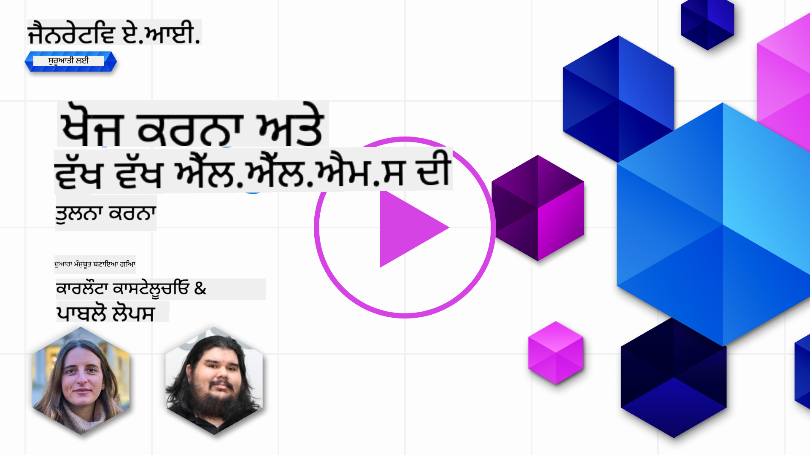
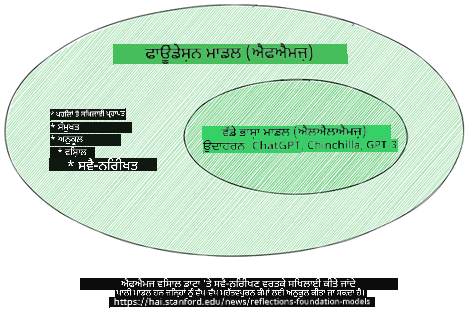
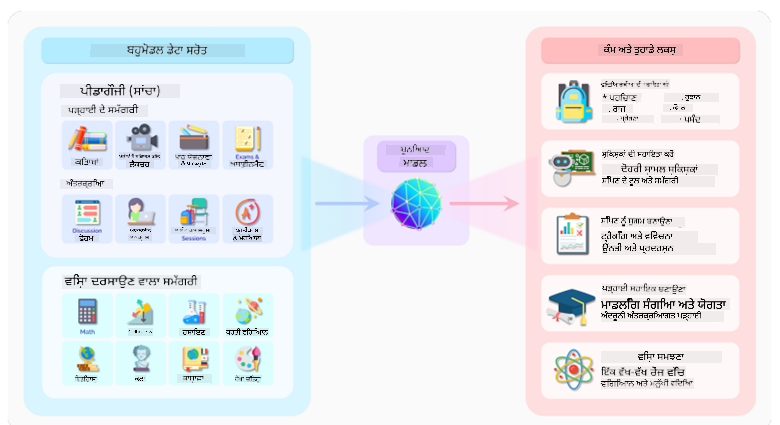
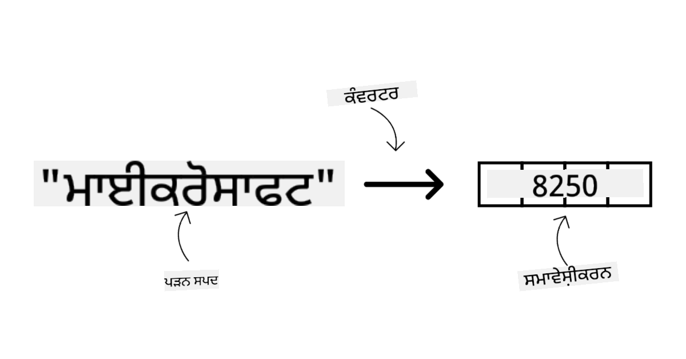
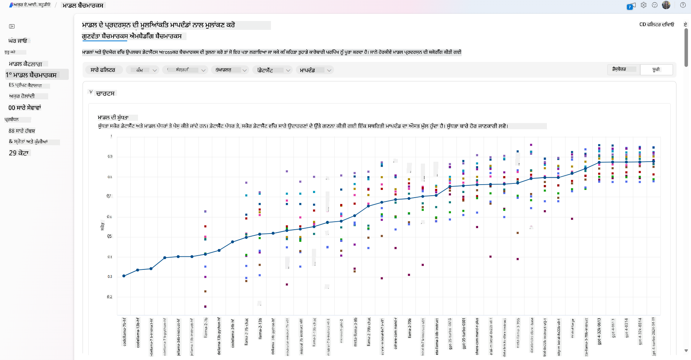
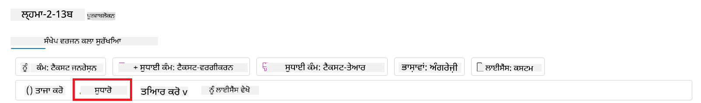
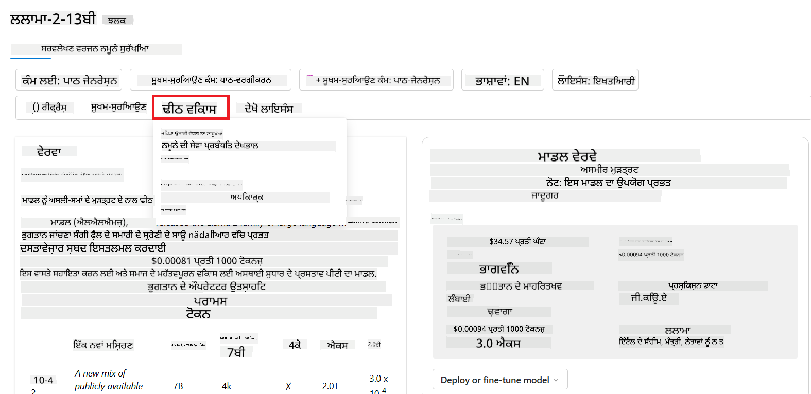
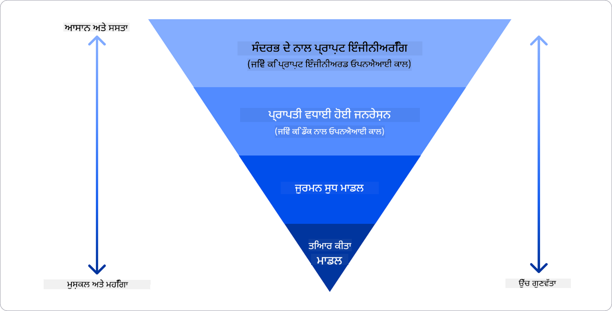

<!--
CO_OP_TRANSLATOR_METADATA:
{
  "original_hash": "e2f686f2eb794941761252ac5e8e090b",
  "translation_date": "2025-05-19T13:55:35+00:00",
  "source_file": "02-exploring-and-comparing-different-llms/README.md",
  "language_code": "pa"
}
-->
# ਵੱਖ-ਵੱਖ LLMs ਦੀ ਖੋਜ ਅਤੇ ਤੁਲਨਾ

> _ਇਸ ਪਾਠ ਦਾ ਵੀਡੀਓ ਵੇਖਣ ਲਈ ਉਪਰੋਕਤ ਚਿੱਤਰ 'ਤੇ ਕਲਿੱਕ ਕਰੋ_

ਪਿਛਲੇ ਪਾਠ ਨਾਲ, ਅਸੀਂ ਵੇਖਿਆ ਕਿ ਜਨਰੇਟਿਵ AI ਕਿਵੇਂ ਤਕਨਾਲੋਜੀ ਦੇ ਦ੍ਰਿਸ਼ ਨੂੰ ਬਦਲ ਰਿਹਾ ਹੈ, ਵੱਡੇ ਭਾਸ਼ਾ ਮਾਡਲ (LLMs) ਕਿਵੇਂ ਕੰਮ ਕਰਦੇ ਹਨ ਅਤੇ ਕਿਵੇਂ ਇੱਕ ਵਪਾਰ - ਜਿਵੇਂ ਸਾਡਾ ਸਟਾਰਟਅਪ - ਉਨ੍ਹਾਂ ਨੂੰ ਆਪਣੇ ਉਪਯੋਗ ਮਾਮਲਿਆਂ 'ਤੇ ਲਾਗੂ ਕਰ ਸਕਦਾ ਹੈ ਅਤੇ ਵਧ ਸਕਦਾ ਹੈ! ਇਸ ਅਧਿਆਇ ਵਿੱਚ, ਅਸੀਂ ਵੱਖ-ਵੱਖ ਕਿਸਮ ਦੇ ਵੱਡੇ ਭਾਸ਼ਾ ਮਾਡਲਾਂ (LLMs) ਦੀ ਤੁਲਨਾ ਕਰਨ ਦੀ ਕੋਸ਼ਿਸ਼ ਕਰ ਰਹੇ ਹਾਂ ਤਾਂ ਜੋ ਉਨ੍ਹਾਂ ਦੇ ਲਾਭ ਅਤੇ ਨੁਕਸਾਨ ਨੂੰ ਸਮਝ ਸਕੀਏ।

ਸਾਡੇ ਸਟਾਰਟਅਪ ਦੀ ਯਾਤਰਾ ਦਾ ਅਗਲਾ ਕਦਮ LLMs ਦੇ ਮੌਜੂਦਾ ਦ੍ਰਿਸ਼ ਨੂੰ ਖੋਜਣਾ ਅਤੇ ਸਮਝਣਾ ਹੈ ਕਿ ਕਿਹੜੇ ਸਾਡੇ ਉਪਯੋਗ ਮਾਮਲੇ ਲਈ ਉਚਿਤ ਹਨ।

## ਪੇਸ਼ਕਸ਼

ਇਹ ਪਾਠ ਕਵਰ ਕਰੇਗਾ:

- ਮੌਜੂਦਾ ਦ੍ਰਿਸ਼ ਵਿੱਚ ਵੱਖ-ਵੱਖ ਕਿਸਮ ਦੇ LLMs।
- ਆਪਣੇ ਉਪਯੋਗ ਮਾਮਲੇ ਲਈ Azure ਵਿੱਚ ਵੱਖ-ਵੱਖ ਮਾਡਲਾਂ ਦੀ ਜਾਂਚ, ਦੁਹਰਾਈ ਅਤੇ ਤੁਲਨਾ।
- LLM ਨੂੰ ਕਿਵੇਂ ਡਿਪਲੌਇ ਕਰਨਾ ਹੈ।

## ਸਿਖਣ ਦੇ ਲਕਸ਼

ਇਹ ਪਾਠ ਪੂਰਾ ਕਰਨ ਤੋਂ ਬਾਅਦ, ਤੁਸੀਂ ਕਰ ਸਕੋਗੇ:

- ਆਪਣੇ ਉਪਯੋਗ ਮਾਮਲੇ ਲਈ ਸਹੀ ਮਾਡਲ ਚੁਣੋ।
- ਸਮਝੋ ਕਿ ਆਪਣੇ ਮਾਡਲ ਦੀ ਪ੍ਰਦਰਸ਼ਨਸ਼ੀਲਤਾ ਨੂੰ ਜਾਂਚਣ, ਦੁਹਰਾਉਣ ਅਤੇ ਸੁਧਾਰ ਕਰਨ ਦੀ ਕਿਵੇਂ ਯੋਜਨਾ ਬਣਾਉਣੀ ਹੈ।
- ਜਾਣੋ ਕਿ ਵਪਾਰ ਮਾਡਲਾਂ ਨੂੰ ਕਿਵੇਂ ਡਿਪਲੌਇ ਕਰਦੇ ਹਨ।

## ਵੱਖ-ਵੱਖ ਕਿਸਮ ਦੇ LLMs ਨੂੰ ਸਮਝੋ

LLMs ਦੀ ਵਰਗਿਕਰਨ ਉਨ੍ਹਾਂ ਦੀ ਆਰਚਿਟੈਕਚਰ, ਟ੍ਰੇਨਿੰਗ ਡਾਟਾ ਅਤੇ ਉਪਯੋਗ ਮਾਮਲੇ ਦੇ ਅਧਾਰ 'ਤੇ ਕੀਤੀ ਜਾ ਸਕਦੀ ਹੈ। ਇਹ ਅੰਤਰ ਸਾਡੇ ਸਟਾਰਟਅਪ ਨੂੰ ਸਹੀ ਮਾਡਲ ਚੁਣਨ ਵਿੱਚ ਮਦਦ ਕਰਦੇ ਹਨ ਅਤੇ ਸਮਝਣ ਵਿੱਚ ਮਦਦ ਕਰਦੇ ਹਨ ਕਿ ਕਿਵੇਂ ਜਾਂਚ, ਦੁਹਰਾਈ ਅਤੇ ਪ੍ਰਦਰਸ਼ਨਸ਼ੀਲਤਾ ਵਿੱਚ ਸੁਧਾਰ ਕਰਨਾ ਹੈ।

ਬਹੁਤ ਸਾਰੇ ਵੱਖ-ਵੱਖ ਕਿਸਮ ਦੇ LLM ਮਾਡਲ ਹਨ, ਤੁਹਾਡੇ ਮਾਡਲ ਦੀ ਚੋਣ ਇਸ 'ਤੇ ਨਿਰਭਰ ਕਰਦੀ ਹੈ ਕਿ ਤੁਸੀਂ ਉਨ੍ਹਾਂ ਨੂੰ ਕਿਵੇਂ ਵਰਤਣਾ ਚਾਹੁੰਦੇ ਹੋ, ਤੁਹਾਡਾ ਡਾਟਾ, ਤੁਸੀਂ ਕਿੰਨਾ ਖਰਚ ਕਰਨ ਲਈ ਤਿਆਰ ਹੋ ਅਤੇ ਹੋਰ।

ਜੇ ਤੁਸੀਂ ਮਾਡਲਾਂ ਨੂੰ ਟੈਕਸਟ, ਆਡੀਓ, ਵੀਡੀਓ, ਚਿੱਤਰ ਜਨਰੇਸ਼ਨ ਆਦਿ ਲਈ ਵਰਤਣਾ ਚਾਹੁੰਦੇ ਹੋ, ਤਾਂ ਤੁਸੀਂ ਵੱਖ-ਵੱਖ ਕਿਸਮ ਦੇ ਮਾਡਲ ਦੀ ਚੋਣ ਕਰ ਸਕਦੇ ਹੋ।

- **ਆਡੀਓ ਅਤੇ ਬੋਲਣ ਦੀ ਪਛਾਣ**। ਇਸ ਲਈ, ਵਿਸਪਰ-ਕਿਸਮ ਦੇ ਮਾਡਲ ਬਹੁਤ ਵਧੀਆ ਚੋਣ ਹਨ ਕਿਉਂਕਿ ਇਹ ਜਨਰਲ-ਪਰਪਜ਼ ਹਨ ਅਤੇ ਬੋਲਣ ਦੀ ਪਛਾਣ ਲਈ ਬਣਾਏ ਗਏ ਹਨ। ਇਹ ਵਿਭਿੰਨ ਆਡੀਓ 'ਤੇ ਟ੍ਰੇਨ ਕੀਤਾ ਗਿਆ ਹੈ ਅਤੇ ਬਹੁ-ਭਾਸ਼ੀ ਬੋਲਣ ਦੀ ਪਛਾਣ ਕਰ ਸਕਦਾ ਹੈ। [ਵਿਸਪਰ ਕਿਸਮ ਦੇ ਮਾਡਲਾਂ ਬਾਰੇ ਹੋਰ ਜਾਣਕਾਰੀ ਲਵੋ](https://platform.openai.com/docs/models/whisper?WT.mc_id=academic-105485-koreyst).

- **ਚਿੱਤਰ ਜਨਰੇਸ਼ਨ**। ਚਿੱਤਰ ਜਨਰੇਸ਼ਨ ਲਈ, DALL-E ਅਤੇ Midjourney ਦੋ ਬਹੁਤ ਹੀ ਪ੍ਰਸਿੱਧ ਚੋਣਾਂ ਹਨ। DALL-E Azure OpenAI ਦੁਆਰਾ ਪੇਸ਼ ਕੀਤਾ ਜਾਂਦਾ ਹੈ। [DALL-E ਬਾਰੇ ਹੋਰ ਪੜ੍ਹੋ](https://platform.openai.com/docs/models/dall-e?WT.mc_id=academic-105485-koreyst) ਅਤੇ ਇਸ ਕੋਰਸ ਦੇ ਅਧਿਆਇ 9 ਵਿੱਚ ਵੀ।

- **ਟੈਕਸਟ ਜਨਰੇਸ਼ਨ**। ਜ਼ਿਆਦਾਤਰ ਮਾਡਲ ਟੈਕਸਟ ਜਨਰੇਸ਼ਨ 'ਤੇ ਟ੍ਰੇਨ ਕੀਤੇ ਜਾਂਦੇ ਹਨ ਅਤੇ ਤੁਹਾਡੇ ਕੋਲ GPT-3.5 ਤੋਂ GPT-4 ਤੱਕ ਚੋਣਾਂ ਦੀ ਵੱਡੀ ਕਿਸਮ ਹੈ। ਇਹ ਵੱਖ-ਵੱਖ ਲਾਗਤਾਂ 'ਤੇ ਆਉਂਦੇ ਹਨ, GPT-4 ਸਭ ਤੋਂ ਮਹਿੰਗਾ ਹੈ। [Azure OpenAI ਖੇਡ ਦਾ ਮੈਦਾਨ](https://oai.azure.com/portal/playground?WT.mc_id=academic-105485-koreyst) ਵਿੱਚ ਦੇਖਣ ਲਈ ਯੋਗ ਹੈ ਕਿ ਕਿਹੜੇ ਮਾਡਲ ਤੁਹਾਡੇ ਲੋੜਾਂ ਲਈ ਕਿਦਰ ਸਹੀ ਹਨ ਯੋਗਤਾ ਅਤੇ ਲਾਗਤ ਦੇ ਅਧਾਰ 'ਤੇ।

- **ਮਲਟੀ-ਮੋਡੈਲਟੀ**। ਜੇ ਤੁਸੀਂ ਇਨਪੁਟ ਅਤੇ ਆਉਟਪੁਟ ਵਿੱਚ ਬਹੁਤ ਸਾਰੇ ਡਾਟਾ ਦੀ ਸੰਭਾਲ ਕਰਨਾ ਚਾਹੁੰਦੇ ਹੋ, ਤਾਂ ਤੁਸੀਂ [gpt-4 turbo with vision or gpt-4o](https://learn.microsoft.com/azure/ai-services/openai/concepts/models#gpt-4-and-gpt-4-turbo-models?WT.mc_id=academic-105485-koreyst) ਵਰਗੇ ਮਾਡਲਾਂ 'ਤੇ ਧਿਆਨ ਦੇ ਸਕਦੇ ਹੋ - OpenAI ਮਾਡਲਾਂ ਦੇ ਤਾਜ਼ਾ ਰਿਲੀਜ਼ - ਜੋ ਕਿ ਕੁਦਰਤੀ ਭਾਸ਼ਾ ਪ੍ਰਕਿਰਿਆ ਨੂੰ ਵਿਜ਼ੁਅਲ ਸਮਝਣ ਲਈ ਜੋੜਨ ਦੇ ਯੋਗ ਹਨ, ਬਹੁ-ਮੋਡਲ ਇੰਟਰਫੇਸਾਂ ਦੁਆਰਾ ਇੰਟਰੈਕਸ਼ਨ ਦੀ ਸਹੂਲਤ ਪ੍ਰਦਾਨ ਕਰਦੇ ਹਨ।

ਮਾਡਲ ਦੀ ਚੋਣ ਕਰਨ ਦਾ ਮਤਲਬ ਹੈ ਕਿ ਤੁਹਾਨੂੰ ਕੁਝ ਮੂਲ ਯੋਗਤਾਵਾਂ ਮਿਲਦੀਆਂ ਹਨ, ਜੋ ਕਿ ਕਈ ਵਾਰ ਪੂਰੀ ਨਹੀਂ ਹੁੰਦੀਆਂ। ਅਕਸਰ ਤੁਹਾਡੇ ਕੋਲ ਕੰਪਨੀ ਦਾ ਖਾਸ ਡਾਟਾ ਹੁੰਦਾ ਹੈ ਜਿਸ ਬਾਰੇ ਤੁਸੀਂ ਕਿਸੇ ਤਰੀਕੇ ਨਾਲ LLM ਨੂੰ ਜਾਣਕਾਰੀ ਦੇਣ ਦੀ ਜ਼ਰੂਰਤ ਹੁੰਦੀ ਹੈ। ਇਸ ਨੂੰ ਹੱਲ ਕਰਨ ਲਈ ਕੁਝ ਵੱਖ-ਵੱਖ ਚੋਣਾਂ ਹਨ, ਜਿਨ੍ਹਾਂ ਬਾਰੇ ਅਗਲੇ ਭਾਗਾਂ ਵਿੱਚ ਹੋਰ ਜਾਣਕਾਰੀ ਪ੍ਰਾਪਤ ਹੋਵੇਗੀ।

### ਫਾਊਂਡੇਸ਼ਨ ਮਾਡਲ ਵਨਾਮ LLMs

ਫਾਊਂਡੇਸ਼ਨ ਮਾਡਲ ਸ਼ਬਦ [Stanford ਖੋਜਕਰਤਿਆਂ ਦੁਆਰਾ ਰਚਿਆ ਗਿਆ](https://arxiv.org/abs/2108.07258?WT.mc_id=academic-105485-koreyst) ਗਿਆ ਸੀ ਅਤੇ ਇਸਨੂੰ AI ਮਾਡਲ ਵਜੋਂ ਪਰਿਭਾਸ਼ਿਤ ਕੀਤਾ ਗਿਆ ਹੈ ਜੋ ਕੁਝ ਮਾਪਦੰਡਾਂ ਦੀ ਪਾਲਣਾ ਕਰਦਾ ਹੈ, ਜਿਵੇਂ ਕਿ:

- **ਇਹ ਅਨਸੁਪਰਵਾਈਜ਼ਡ ਲਰਨਿੰਗ ਜਾਂ ਸਵੈ-ਸੁਪਰਵਾਈਜ਼ਡ ਲਰਨਿੰਗ ਦਾ ਉਪਯੋਗ ਕਰਕੇ ਟ੍ਰੇਨ ਕੀਤੇ ਜਾਂਦੇ ਹਨ**, ਜਿਸਦਾ ਮਤਲਬ ਹੈ ਕਿ ਇਹ ਅਨਲੇਬਲਡ ਮਲਟੀ-ਮੋਡਲ ਡਾਟਾ 'ਤੇ ਟ੍ਰੇਨ ਕੀਤੇ ਜਾਂਦੇ ਹਨ, ਅਤੇ ਇਹਨਾਂ ਨੂੰ ਆਪਣੇ ਟ੍ਰੇਨਿੰਗ ਪ੍ਰਕਿਰਿਆ ਲਈ ਮਨੁੱਖੀ ਐਨੋਟੇਸ਼ਨ ਜਾਂ ਡਾਟਾ ਦੀ ਲੇਬਲਿੰਗ ਦੀ ਜ਼ਰੂਰਤ ਨਹੀਂ ਹੁੰਦੀ।
- **ਇਹ ਬਹੁਤ ਵੱਡੇ ਮਾਡਲ ਹਨ**, ਜੋ ਕਿ ਬਹੁਤ ਗਹਿਰੇ ਨਿਊਰਲ ਨੈਟਵਰਕ 'ਤੇ ਆਧਾਰਿਤ ਹਨ ਜੋ ਕਿ ਬਿਲੀਅਨ ਪੈਰਾਮੀਟਰਾਂ 'ਤੇ ਟ੍ਰੇਨ ਕੀਤੇ ਜਾਂਦੇ ਹਨ।
- **ਇਹ ਆਮ ਤੌਰ 'ਤੇ ਹੋਰ ਮਾਡਲਾਂ ਲਈ 'ਫਾਊਂਡੇਸ਼ਨ' ਵਜੋਂ ਸੇਵਾ ਕਰਨ ਲਈ ਬਣਾਏ ਜਾਂਦੇ ਹਨ**, ਜਿਸਦਾ ਮਤਲਬ ਹੈ ਕਿ ਇਹ ਹੋਰ ਮਾਡਲਾਂ ਨੂੰ ਬਣਾਉਣ ਲਈ ਸ਼ੁਰੂਆਤੀ ਬਿੰਦੂ ਵਜੋਂ ਵਰਤੇ ਜਾ ਸਕਦੇ ਹਨ, ਜੋ ਕਿ ਫਾਈਨ-ਟਿਊਨਿੰਗ ਦੁਆਰਾ ਕੀਤਾ ਜਾ ਸਕਦਾ ਹੈ।

ਚਿੱਤਰ ਸੌਰਸ: [Essential Guide to Foundation Models and Large Language Models | by Babar M Bhatti | Medium
](https://thebabar.medium.com/essential-guide-to-foundation-models-and-large-language-models-27dab58f7404)

ਇਸ ਫਰਕ ਨੂੰ ਹੋਰ ਸਪਸ਼ਟ ਕਰਨ ਲਈ, ਆਓ ChatGPT ਨੂੰ ਉਦਾਹਰਣ ਵਜੋਂ ਲਵੋ। ChatGPT ਦਾ ਪਹਿਲਾ ਸੰਸਕਰਣ ਬਣਾਉਣ ਲਈ, GPT-3.5 ਨਾਮਕ ਮਾਡਲ ਨੇ ਫਾਊਂਡੇਸ਼ਨ ਮਾਡਲ ਵਜੋਂ ਸੇਵਾ ਕੀਤੀ। ਇਸਦਾ ਮਤਲਬ ਹੈ ਕਿ OpenAI ਨੇ ਕੁਝ ਚੈਟ-ਵਿਸ਼ੇਸ਼ ਡਾਟਾ ਦੀ ਵਰਤੋਂ ਕੀਤੀ GPT-3.5 ਦਾ ਇੱਕ ਟਿਊਨ ਕੀਤਾ ਸੰਸਕਰਣ ਬਣਾਉਣ ਲਈ ਜੋ ਕਿ ਚੈਟਬੋਟ ਜਿਵੇਂ ਸੰਵਾਦਕਾਰੀ ਦ੍ਰਿਸ਼ਾਂ ਵਿੱਚ ਚੰਗਾ ਪ੍ਰਦਰਸ਼ਨ ਕਰਨ ਵਿੱਚ ਮਾਹਰ ਹੈ।

ਚਿੱਤਰ ਸੌਰਸ: [2108.07258.pdf (arxiv.org)](https://arxiv.org/pdf/2108.07258.pdf?WT.mc_id=academic-105485-koreyst)

### ਖੁੱਲ੍ਹਾ ਸਰੋਤ ਵਨਾਮ ਮਾਲਕਾਨਾ ਮਾਡਲ

LLMs ਨੂੰ ਵਰਗਿਕਰਨ ਕਰਨ ਦਾ ਇੱਕ ਹੋਰ ਤਰੀਕਾ ਹੈ ਕਿ ਕੀ ਇਹ ਖੁੱਲ੍ਹਾ ਸਰੋਤ ਹਨ ਜਾਂ ਮਾਲਕਾਨਾ।

ਖੁੱਲ੍ਹੇ ਸਰੋਤ ਮਾਡਲ ਉਹ ਮਾਡਲ ਹਨ ਜੋ ਜਨਤਾ ਨੂੰ ਉਪਲਬਧ ਕੀਤੇ ਜਾਂਦੇ ਹਨ ਅਤੇ ਕਿਸੇ ਵੀ ਵਿਅਕਤੀ ਦੁਆਰਾ ਵਰਤੇ ਜਾ ਸਕਦੇ ਹਨ। ਇਹਨਾਂ ਨੂੰ ਅਕਸਰ ਉਸ ਕੰਪਨੀ ਦੁਆਰਾ ਉਪਲਬਧ ਕਰਵਾਇਆ ਜਾਂਦਾ ਹੈ ਜਿਸਨੇ ਇਹਨਾਂ ਨੂੰ ਬਣਾਇਆ ਹੈ, ਜਾਂ ਖੋਜ ਸਮੁਦਾਇ ਦੁਆਰਾ। ਇਹ ਮਾਡਲਾਂ ਦੀ ਜਾਂਚ, ਸੋਧ ਅਤੇ LLMs ਵਿੱਚ ਵੱਖ-ਵੱਖ ਉਪਯੋਗ ਮਾਮਲਿਆਂ ਲਈ ਵਿਅਕਤੀਗਤ ਕਰਨ ਦੀ ਆਗਿਆ ਹੈ। ਹਾਲਾਂਕਿ, ਇਹ ਹਮੇਸ਼ਾਂ ਉਤਪਾਦਨ ਦੇ ਉਪਯੋਗ ਲਈ ਸੁਧਾਰਿਤ ਨਹੀਂ ਹੁੰਦੇ, ਅਤੇ ਮਾਲਕਾਨਾ ਮਾਡਲਾਂ ਵਾਂਗ ਪ੍ਰਦਰਸ਼ਨਸ਼ੀਲ ਨਹੀਂ ਹੋ ਸਕਦੇ। ਇਸ ਤੋਂ ਇਲਾਵਾ, ਖੁੱਲ੍ਹੇ ਸਰੋਤ ਮਾਡਲਾਂ ਲਈ ਫੰਡਿੰਗ ਸੀਮਿਤ ਹੋ ਸਕਦੀ ਹੈ, ਅਤੇ ਇਹ ਲੰਬੇ ਸਮੇਂ ਲਈ ਰੱਖਿਆ ਨਹੀਂ ਜਾ ਸਕਦੇ ਜਾਂ ਨਵੀਂ ਖੋਜ ਦੇ ਨਾਲ ਅਪਡੇਟ ਨਹੀਂ ਕੀਤੇ ਜਾ ਸਕਦੇ। ਪ੍ਰਸਿੱਧ ਖੁੱਲ੍ਹੇ ਸਰੋਤ ਮਾਡਲਾਂ ਦੇ ਉਦਾਹਰਣਾਂ ਵਿੱਚ [Alpaca](https://crfm.stanford.edu/2023/03/13/alpaca.html?WT.mc_id=academic-105485-koreyst), [Bloom](https://huggingface.co/bigscience/bloom) ਅਤੇ [LLaMA](https://llama.meta.com) ਸ਼ਾਮਲ ਹਨ।

ਮਾਲਕਾਨਾ ਮਾਡਲ ਉਹ ਮਾਡਲ ਹਨ ਜੋ ਕਿਸੇ ਕੰਪਨੀ ਦੁਆਰਾ ਮਾਲਕਾਨਾ ਹੁੰਦੇ ਹਨ ਅਤੇ ਜਨਤਾ ਨੂੰ ਉਪਲਬਧ ਨਹੀਂ ਕੀਤੇ ਜਾਂਦੇ। ਇਹ ਮਾਡਲਾਂ ਅਕਸਰ ਉਤਪਾਦਨ ਦੇ ਉਪਯੋਗ ਲਈ ਸੁਧਾਰਿਤ ਹੁੰਦੇ ਹਨ। ਹਾਲਾਂਕਿ, ਇਹਨਾਂ ਨੂੰ ਵੱਖ-ਵੱਖ ਉਪਯੋਗ ਮਾਮਲਿਆਂ ਲਈ ਜਾਂਚ, ਸੋਧ ਜਾਂ ਵਿਅਕਤੀਗਤ ਕਰਨ ਦੀ ਆਗਿਆ ਨਹੀਂ ਹੁੰਦੀ। ਇਸ ਤੋਂ ਇਲਾਵਾ, ਇਹ ਹਮੇਸ਼ਾਂ ਮੁਫ਼ਤ ਉਪਲਬਧ ਨਹੀਂ ਹੁੰਦੇ, ਅਤੇ ਵਰਤਣ ਲਈ ਕਿਸੇ ਸਬਸਕ੍ਰਿਪਸ਼ਨ ਜਾਂ ਭੁਗਤਾਨ ਦੀ ਜ਼ਰੂਰਤ ਹੋ ਸਕਦੀ ਹੈ। ਇਸ ਤੋਂ ਇਲਾਵਾ, ਵਰਤਣ ਵਾਲੇ ਡਾਟਾ 'ਤੇ ਕੰਟਰੋਲ ਨਹੀਂ ਹੁੰਦੇ ਜੋ ਮਾਡਲ ਨੂੰ ਟ੍ਰੇਨ ਕਰਨ ਲਈ ਵਰਤਿਆ ਜਾਂਦਾ ਹੈ, ਜਿਸਦਾ ਮਤਲਬ ਹੈ ਕਿ ਉਹ ਮਾਡਲ ਮਾਲਕ ਨੂੰ ਡਾਟਾ ਗੋਪਨੀਯਤਾ ਅਤੇ AI ਦੇ ਜ਼ਿੰਮੇਵਾਰ ਉਪਯੋਗ ਦੀ ਵਚਨਬੱਧਤਾ ਨੂੰ ਯਕੀਨੀ ਬਣਾਉਣ ਲਈ ਭਰੋਸਾ ਕਰਨ ਚਾਹੀਦਾ ਹੈ। ਪ੍ਰਸਿੱਧ ਮਾਲਕਾਨਾ ਮਾਡਲਾਂ ਦੇ ਉਦਾਹਰਣਾਂ ਵਿੱਚ [OpenAI ਮਾਡਲ](https://platform.openai.com/docs/models/overview?WT.mc_id=academic-105485-koreyst), [Google Bard](https://sapling.ai/llm/bard?WT.mc_id=academic-105485-koreyst) ਜਾਂ [Claude 2](https://www.anthropic.com/index/claude-2?WT.mc_id=academic-105485-koreyst) ਸ਼ਾਮਲ ਹਨ।

### ਐਮਬੈਡਿੰਗ ਵਨਾਮ ਚਿੱਤਰ ਜਨਰੇਸ਼ਨ ਵਨਾਮ ਟੈਕਸਟ ਅਤੇ ਕੋਡ ਜਨਰੇਸ਼ਨ

LLMs ਨੂੰ ਉਹਨਾਂ ਦੇ ਜਨਰੇਸ਼ਨ ਕੀਤੇ ਆਉਟਪੁਟ ਦੇ ਅਧਾਰ 'ਤੇ ਵੀ ਵਰਗਿਕਰਨ ਕੀਤਾ ਜਾ ਸਕਦਾ ਹੈ।

ਐਮਬੈਡਿੰਗ ਉਹ ਮਾਡਲਾਂ ਦਾ ਸੈੱਟ ਹੁੰਦਾ ਹੈ ਜੋ ਟੈਕਸਟ ਨੂੰ ਸੰਖਿਆਤਮਕ ਰੂਪ ਵਿੱਚ ਬਦਲ ਸਕਦੇ ਹਨ, ਜਿਸਨੂੰ ਐਮਬੈਡਿੰਗ ਕਿਹਾ ਜਾਂਦਾ ਹੈ, ਜੋ ਕਿ ਇਨਪੁਟ ਟੈਕਸਟ ਦਾ ਸੰਖਿਆਤਮਕ ਪ੍ਰਤੀਨਿਧਿਤਾ ਹੁੰਦੀ ਹੈ। ਐਮਬੈਡਿੰਗ ਮਸ਼ੀਨਾਂ ਨੂੰ ਸ਼ਬਦਾਂ ਜਾਂ ਵਾਕਾਂਸ਼ਾਂ ਦੇ ਰਿਸ਼ਤਿਆਂ ਨੂੰ ਸਮਝਣ ਵਿੱਚ ਆਸਾਨੀ ਪ੍ਰਦਾਨ ਕਰਦੇ ਹਨ ਅਤੇ ਹੋਰ ਮਾਡਲਾਂ ਦੁਆਰਾ ਇਨਪੁਟ ਵਜੋਂ ਵਰਤੇ ਜਾ ਸਕਦੇ ਹਨ, ਜਿਵੇਂ ਕਿ ਵਰਗੀਕਰਨ ਮਾਡਲਾਂ, ਜਾਂ ਕਲੱਸਟਰਿੰਗ ਮਾਡਲਾਂ ਜੋ ਸੰਖਿਆਤਮਕ ਡਾਟਾ 'ਤੇ ਚੰਗਾ ਪ੍ਰਦਰਸ਼ਨ ਕਰਦੇ ਹਨ। ਐਮਬੈਡਿੰਗ ਮਾਡਲਾਂ ਅਕਸਰ ਟ੍ਰਾਂਸਫਰ ਲਰਨਿੰਗ ਲਈ ਵਰਤੇ ਜਾਂਦੇ ਹਨ, ਜਿੱਥੇ ਇੱਕ ਮਾਡਲ ਇੱਕ ਸੂਰੋਗੇਟ ਟਾਸਕ ਲਈ ਬਣਾਇਆ ਜਾਂਦਾ ਹੈ ਜਿਸ ਲਈ ਬਹੁਤ ਸਾਰਾ ਡਾਟਾ ਉਪਲਬਧ ਹੁੰਦਾ ਹੈ, ਅਤੇ ਫਿਰ ਮਾਡਲ ਵਜ਼ਨ (ਐਮਬੈਡਿੰਗ) ਹੋਰ ਡਾਊਨਸਟ੍ਰੀਮ ਟਾਸਕਾਂ ਲਈ ਦੁਬਾਰਾ ਵਰਤੇ ਜਾਂਦੇ ਹਨ। ਇਸ ਵਰਗ ਦੇ ਉਦਾਹਰਣ ਵਿੱਚ [OpenAI ਐਮਬੈਡਿੰਗ](https://platform.openai.com/docs/models/embeddings?WT.mc_id=academic-105485-koreyst) ਸ਼ਾਮਲ ਹਨ।

ਚਿੱਤਰ ਜਨਰੇਸ਼ਨ ਮਾਡਲ ਉਹ ਮਾਡਲ ਹੁੰਦੇ ਹਨ ਜੋ ਚਿੱਤਰ ਜਨਰੇਸ਼ਨ ਕਰਦੇ ਹਨ। ਇਹ ਮਾਡਲ ਅਕਸਰ ਚਿੱਤਰ ਸੰਪਾਦਨ, ਚਿੱਤਰ ਸੰਸ਼ਲੇਸ਼ਣ ਅਤੇ ਚਿੱਤਰ ਅਨੁਵਾਦ ਲਈ ਵਰਤੇ ਜਾਂਦੇ ਹਨ। ਚਿੱਤਰ ਜਨਰੇਸ਼ਨ ਮਾਡਲ ਅਕਸਰ ਚਿੱਤਰਾਂ ਦੇ ਵੱਡੇ ਡਾਟਾਸੈੱਟਾਂ 'ਤੇ ਟ੍ਰੇਨ ਕੀਤੇ ਜਾਂਦੇ ਹਨ, ਜਿਵੇਂ ਕਿ [LAION-5B](https://laion.ai/blog/laion-5b/?WT.mc_id=academic-105485-koreyst), ਅਤੇ ਨਵੇਂ ਚਿੱਤਰ ਜਨਰੇਸ਼ਨ ਕਰਨ ਜਾਂ ਮੌਜੂਦਾ ਚਿੱਤਰਾਂ ਨੂੰ ਇਨਪੇਂਟਿੰਗ, ਸਪਰ-ਰੈਜ਼ੋਲੂਸ਼ਨ, ਅਤੇ ਰੰਗਕਰਨ ਤਕਨੀਕਾਂ ਨਾਲ ਸੰਪਾਦਨ ਕਰਨ ਲਈ ਵਰਤੇ ਜਾ ਸਕਦੇ ਹਨ। ਉਦਾਹਰਣਾਂ ਵਿੱਚ [DALL-E-3](https://openai.com/dall-e-3?WT.mc_id=academic-105485-koreyst) ਅਤੇ [Stable Diffusion ਮਾਡਲ](https://github.com/Stability-AI/StableDiffusion?WT.mc_id=academic-105485-koreyst) ਸ਼ਾਮਲ ਹਨ।

ਟੈਕਸਟ ਅਤੇ ਕੋਡ ਜਨਰੇਸ਼ਨ ਮਾਡਲ ਉਹ ਮਾਡਲ ਹੁੰਦੇ ਹਨ ਜੋ ਟੈਕਸਟ ਜਾਂ ਕੋਡ ਜਨਰੇਸ਼ਨ ਕਰਦੇ ਹਨ। ਇਹ ਮਾਡਲ ਅਕਸਰ ਟੈਕਸਟ ਸੰਖੇਪਕਰਨ, ਅਨੁਵਾਦ ਅਤੇ ਸਵਾਲ ਦਾ ਜਵਾਬ ਦੇਣ ਲਈ ਵਰਤੇ ਜਾਂਦੇ ਹਨ। ਟੈਕਸਟ ਜਨਰੇਸ਼ਨ ਮਾਡਲ ਅਕਸਰ ਟੈਕਸਟ ਦੇ ਵੱਡੇ ਡਾਟਾਸ
- ਉਦਯੋਗ ਵਿੱਚ ਉਪਲਬਧ ਮਾਡਲਾਂ ਅਤੇ ਡੇਟਾਸੈੱਟਾਂ ਦੇ ਬੈਂਚਮਾਰਕਾਂ ਦੀ ਤੁਲਨਾ ਕਰੋ ਤਾਂ ਜੋ [Model Benchmarks](https://learn.microsoft.com/azure/ai-studio/how-to/model-benchmarks?WT.mc_id=academic-105485-koreyst) ਪੈਨ ਦੁਆਰਾ ਕਿਸੇ ਕਾਰੋਬਾਰੀ ਸਥਿਤੀ ਨੂੰ ਪੂਰਾ ਕਰਨ ਵਾਲਾ ਮਾਡਲ ਪਤਾ ਕੀਤਾ ਜਾ ਸਕੇ।

- ਅਜਿਹੇ ਵੱਖਰੇ ਵਰਕਲੋਡ ਵਿੱਚ ਮਾਡਲ ਦੇ ਪ੍ਰਦਰਸ਼ਨ ਨੂੰ ਸੁਧਾਰਨ ਲਈ ਕਸਟਮ ਟ੍ਰੇਨਿੰਗ ਡੇਟਾ 'ਤੇ ਮਾਡਲ ਨੂੰ ਸੁਧਾਰੋ, Azure AI Studio ਦੀ ਪ੍ਰਯੋਗਸ਼ਾਲਾ ਅਤੇ ਟ੍ਰੈਕਿੰਗ ਸਮਰਥਾਵਾਂ ਦਾ ਲਾਭ ਲੈ ਕੇ।

- ਐਪਲੀਕੇਸ਼ਨ ਨੂੰ ਮਾਡਲ ਦੀ ਖਪਤ ਕਰਨ ਲਈ ਮੂਲ ਪੂਰਵ-ਟ੍ਰੇਨਡ ਮਾਡਲ ਜਾਂ ਸੁਧਾਰਿਆ ਵਰਜਨ ਨੂੰ ਰਿਮੋਟ ਰੀਅਲ ਟਾਈਮ ਇਨਫਰੈਂਸ - ਮੈਨੇਜਡ ਕੰਪਿਊਟ - ਜਾਂ ਸਰਵਰਲੇਸ ਐਪੀ ਐਂਡਪੌਇੰਟ - [pay-as-you-go](https://learn.microsoft.com/azure/ai-studio/how-to/model-catalog-overview#model-deployment-managed-compute-and-serverless-api-pay-as-you-go?WT.mc_id=academic-105485-koreyst) - 'ਤੇ ਡਿਪਲੌਇ ਕਰੋ।

> [!NOTE]
> ਕੈਟਾਲੌਗ ਵਿੱਚ ਸਾਰੇ ਮਾਡਲ ਇਸ ਵੇਲੇ ਸੁਧਾਰ ਅਤੇ/ਜਾਂ pay-as-you-go ਡਿਪਲੌਇਮੈਂਟ ਲਈ ਉਪਲਬਧ ਨਹੀਂ ਹਨ। ਮਾਡਲ ਦੀਆਂ ਸਮਰਥਾਵਾਂ ਅਤੇ ਸੀਮਾਵਾਂ ਦੇ ਵੇਰਵੇ ਲਈ ਮਾਡਲ ਕਾਰਡ ਦੀ ਜਾਂਚ ਕਰੋ।

## LLM ਨਤੀਜਿਆਂ ਨੂੰ ਸੁਧਾਰਨਾ

ਅਸੀਂ ਆਪਣੇ ਸਟਾਰਟਅਪ ਟੀਮ ਨਾਲ ਵੱਖ-ਵੱਖ ਕਿਸਮਾਂ ਦੇ LLMs ਅਤੇ ਇੱਕ ਕਲਾਉਡ ਪਲੇਟਫਾਰਮ (Azure Machine Learning) ਦੀ ਪੜਚੋਲ ਕੀਤੀ ਹੈ ਜੋ ਸਾਨੂੰ ਵੱਖ-ਵੱਖ ਮਾਡਲਾਂ ਦੀ ਤੁਲਨਾ ਕਰਨ, ਉਨ੍ਹਾਂ ਨੂੰ ਟੈਸਟ ਡੇਟਾ 'ਤੇ ਅੰਕਣ ਕਰਨ, ਪ੍ਰਦਰਸ਼ਨ ਸੁਧਾਰਨ ਅਤੇ ਉਨ੍ਹਾਂ ਨੂੰ ਇਨਫਰੈਂਸ ਐਂਡਪੌਇੰਟਸ 'ਤੇ ਡਿਪਲੌਇ ਕਰਨ ਦੀ ਯੋਗਤਾ ਦਿੰਦਾ ਹੈ।

ਪਰ ਉਹਨਾਂ ਨੂੰ ਕਦੋਂ ਪੂਰਵ-ਟ੍ਰੇਨਡ ਮਾਡਲ ਦੀ ਬਜਾਏ ਮਾਡਲ ਨੂੰ ਸੁਧਾਰਨ 'ਤੇ ਵਿਚਾਰ ਕਰਨਾ ਚਾਹੀਦਾ ਹੈ? ਕੀ ਕੁਝ ਹੋਰ ਪਹੁੰਚਾਂ ਹਨ ਜੋ ਖਾਸ ਵਰਕਲੋਡਾਂ 'ਤੇ ਮਾਡਲ ਦੇ ਪ੍ਰਦਰਸ਼ਨ ਨੂੰ ਸੁਧਾਰ ਸਕਦੀਆਂ ਹਨ?

ਕਈ ਪਹੁੰਚਾਂ ਹਨ ਜੋ ਇੱਕ ਕਾਰੋਬਾਰ LLM ਤੋਂ ਜਰੂਰੀ ਨਤੀਜੇ ਪ੍ਰਾਪਤ ਕਰਨ ਲਈ ਵਰਤ ਸਕਦਾ ਹੈ। ਤੁਸੀਂ ਉਤਪਾਦਨ ਵਿੱਚ LLM ਨੂੰ ਡਿਪਲੌਇ ਕਰਦੇ ਸਮੇਂ ਵੱਖ-ਵੱਖ ਸਿਖਲਾਈ ਦੇ ਮਿਆਰ ਦੇ ਮਾਡਲ ਚੁਣ ਸਕਦੇ ਹੋ, ਜਿਨ੍ਹਾਂ ਵਿੱਚ ਵੱਖ-ਵੱਖ ਪੇਚੀਦਗੀ, ਲਾਗਤ ਅਤੇ ਗੁਣਵੱਤਾ ਦੇ ਪੱਧਰ ਹਨ। ਇੱਥੇ ਕੁਝ ਵੱਖ-ਵੱਖ ਪਹੁੰਚਾਂ ਹਨ:

- **ਸੰਦੇਸ਼ ਇੰਜੀਨੀਅਰਿੰਗ ਸੰਦਰਭ ਨਾਲ**। ਵਿਚਾਰ ਇਹ ਹੈ ਕਿ ਤੁਸੀਂ ਜਦੋਂ ਸੰਦੇਸ਼ ਦਿੰਦੇ ਹੋ ਤਾਂ ਕਾਫੀ ਸੰਦਰਭ ਪ੍ਰਦਾਨ ਕਰੋ ਤਾਂ ਜੋ ਤੁਹਾਨੂੰ ਜਰੂਰੀ ਜਵਾਬ ਮਿਲ ਸਕੇ।

- **ਪ੍ਰਾਪਤੀ ਅਗਮਿਤ ਸ੍ਰਿਸ਼ਟੀ, RAG**। ਤੁਹਾਡਾ ਡੇਟਾ ਉਦਾਹਰਣ ਲਈ ਡੇਟਾਬੇਸ ਜਾਂ ਵੈੱਬ ਐਂਡਪੌਇੰਟ ਵਿੱਚ ਹੋ ਸਕਦਾ ਹੈ, ਇਹ ਸੁਨਿਸ਼ਚਿਤ ਕਰਨ ਲਈ ਕਿ ਇਹ ਡੇਟਾ ਜਾਂ ਇਸ ਦਾ ਇੱਕ ਸਬਸੈੱਟ ਸੰਦੇਸ਼ ਦੇ ਸਮੇਂ ਸ਼ਾਮਲ ਕੀਤਾ ਗਿਆ ਹੈ, ਤੁਸੀਂ ਸੰਬੰਧਿਤ ਡੇਟਾ ਪ੍ਰਾਪਤ ਕਰ ਸਕਦੇ ਹੋ ਅਤੇ ਇਸਨੂੰ ਯੂਜ਼ਰ ਦੇ ਸੰਦੇਸ਼ ਦਾ ਹਿੱਸਾ ਬਣਾ ਸਕਦੇ ਹੋ।

- **ਸੁਧਾਰਿਆ ਮਾਡਲ**। ਇੱਥੇ, ਤੁਸੀਂ ਆਪਣੇ ਖੁਦ ਦੇ ਡੇਟਾ 'ਤੇ ਮਾਡਲ ਨੂੰ ਅੱਗੇ ਸਿਖਾਇਆ ਜਿਸ ਨਾਲ ਮਾਡਲ ਤੁਹਾਡੀਆਂ ਜ਼ਰੂਰਤਾਂ ਲਈ ਹੋਰ ਸਟੀਕ ਅਤੇ ਜਵਾਬਦੇਹ ਬਣ ਗਿਆ ਪਰ ਇਹ ਮਹਿੰਗਾ ਹੋ ਸਕਦਾ ਹੈ।

Img source: [Four Ways that Enterprises Deploy LLMs | Fiddler AI Blog](https://www.fiddler.ai/blog/four-ways-that-enterprises-deploy-llms?WT.mc_id=academic-105485-koreyst)

### ਸੰਦਰਭ ਨਾਲ ਸੰਦੇਸ਼ ਇੰਜੀਨੀਅਰਿੰਗ

ਪੂਰਵ-ਟ੍ਰੇਨਡ LLMs ਆਮਕਿਸਮ ਦੇ ਕੁਦਰਤੀ ਭਾਸ਼ਾ ਦੇ ਕੰਮਾਂ 'ਤੇ ਬਹੁਤ ਵਧੀਆ ਕੰਮ ਕਰਦੇ ਹਨ, ਭਲੇ ਹੀ ਉਹਨਾਂ ਨੂੰ ਛੋਟੇ ਸੰਦੇਸ਼ ਨਾਲ ਬੁਲਾਇਆ ਜਾਵੇ, ਜਿਵੇਂ ਕਿ ਪੂਰਾ ਕਰਨ ਲਈ ਇੱਕ ਵਾਕ ਜਾਂ ਇੱਕ ਸਵਾਲ - ਜਿਸਨੂੰ "ਜ਼ੀਰੋ-ਸ਼ਾਟ" ਸਿਖਲਾਈ ਕਿਹਾ ਜਾਂਦਾ ਹੈ।

ਹਾਲਾਂਕਿ, ਜਿੰਨਾ ਹੋ ਸਕੇ ਯੂਜ਼ਰ ਆਪਣੀ ਪੁੱਛ ਗਿੱਛ ਨੂੰ ਫਰੇਮ ਕਰ ਸਕਦਾ ਹੈ, ਇੱਕ ਵਿਸਤ੍ਰਿਤ ਬੇਨਤੀ ਅਤੇ ਉਦਾਹਰਣਾਂ - ਸੰਦਰਭ - ਦੇ ਨਾਲ, ਉਨ੍ਹਾਂ ਦੀਆਂ ਉਮੀਦਾਂ ਦੇ ਅਨੁਸਾਰ ਜਵਾਬ ਹੋਰ ਸਟੀਕ ਅਤੇ ਹੋਰ ਕਰੀਬ ਹੋਵੇਗਾ। ਇਸ ਸਥਿਤੀ ਵਿੱਚ, ਅਸੀਂ "ਵਨ-ਸ਼ਾਟ" ਸਿਖਲਾਈ ਦੀ ਗੱਲ ਕਰਦੇ ਹਾਂ ਜੇ ਸੰਦੇਸ਼ ਵਿੱਚ ਸਿਰਫ ਇੱਕ ਉਦਾਹਰਣ ਸ਼ਾਮਲ ਹੈ ਅਤੇ "ਥੋੜ੍ਹਾ-ਸ਼ਾਟ ਸਿਖਲਾਈ" ਜੇ ਇਸ ਵਿੱਚ ਕਈ ਉਦਾਹਰਣਾਂ ਸ਼ਾਮਲ ਹਨ। ਸੰਦਰਭ ਨਾਲ ਸੰਦੇਸ਼ ਇੰਜੀਨੀਅਰਿੰਗ ਸ਼ੁਰੂਆਤ ਕਰਨ ਲਈ ਸਭ ਤੋਂ ਲਾਗਤ-ਪ੍ਰਭਾਵਸ਼ਾਲੀ ਪਹੁੰਚ ਹੈ।

### ਪ੍ਰਾਪਤੀ ਅਗਮਿਤ ਸ੍ਰਿਸ਼ਟੀ (RAG)

LLMs ਦੀ ਸੀਮਿਤਤਾ ਹੈ ਕਿ ਉਹ ਕੇਵਲ ਉਸ ਡੇਟਾ ਨੂੰ ਹੀ ਵਰਤ ਸਕਦੇ ਹਨ ਜੋ ਉਨ੍ਹਾਂ ਦੀ ਸਿਖਲਾਈ ਦੇ ਦੌਰਾਨ ਵਰਤਿਆ ਗਿਆ ਹੈ ਜਵਾਬ ਤਿਆਰ ਕਰਨ ਲਈ। ਇਸਦਾ ਮਤਲਬ ਹੈ ਕਿ ਉਹਨਾਂ ਨੂੰ ਆਪਣੇ ਸਿਖਲਾਈ ਪ੍ਰਕਿਰਿਆ ਤੋਂ ਬਾਅਦ ਹੋਈਆਂ ਘਟਨਾਵਾਂ ਬਾਰੇ ਕੁਝ ਨਹੀਂ ਪਤਾ, ਅਤੇ ਉਹ ਗੈਰ-ਜਨਤਕ ਜਾਣਕਾਰੀ (ਜਿਵੇਂ ਕਿ ਕੰਪਨੀ ਦਾ ਡੇਟਾ) ਤੱਕ ਪਹੁੰਚ ਨਹੀਂ ਕਰ ਸਕਦੇ।
ਇਸਨੂੰ RAG ਦੁਆਰਾ ਪਾਰ ਕੀਤਾ ਜਾ ਸਕਦਾ ਹੈ, ਇੱਕ ਤਕਨੀਕ ਜੋ ਡੌਕੂਮੈਂਟਾਂ ਦੇ ਟੁਕੜਿਆਂ ਦੇ ਰੂਪ ਵਿੱਚ ਬਾਹਰੀ ਡੇਟਾ ਨਾਲ ਸੰਦੇਸ਼ ਨੂੰ ਵਧਾਉਂਦੀ ਹੈ, ਸੰਦੇਸ਼ ਦੀ ਲੰਬਾਈ ਦੀਆਂ ਸੀਮਾਵਾਂ ਨੂੰ ਧਿਆਨ ਵਿੱਚ ਰੱਖਦਿਆਂ। ਇਹ ਵੈਕਟਰ ਡੇਟਾਬੇਸ ਟੂਲ (ਜਿਵੇਂ ਕਿ [Azure Vector Search](https://learn.microsoft.com/azure/search/vector-search-overview?WT.mc_id=academic-105485-koreyst)) ਦੁਆਰਾ ਸਹਾਇਕ ਹੈ ਜੋ ਵੱਖ-ਵੱਖ ਪੂਰਵ-ਨਿਰਧਾਰਿਤ ਡੇਟਾ ਸਰੋਤਾਂ ਤੋਂ ਲਾਭਕਾਰੀ ਟੁਕੜਿਆਂ ਨੂੰ ਪ੍ਰਾਪਤ ਕਰਦੇ ਹਨ ਅਤੇ ਉਨ੍ਹਾਂ ਨੂੰ ਸੰਦੇਸ਼ ਸੰਦਰਭ ਵਿੱਚ ਸ਼ਾਮਲ ਕਰਦੇ ਹਨ।

ਇਹ ਤਕਨੀਕ ਬਹੁਤ ਹੀ ਮਦਦਗਾਰ ਹੈ ਜਦੋਂ ਕੋਈ ਕਾਰੋਬਾਰ ਕਾਫੀ ਡੇਟਾ, ਕਾਫੀ ਸਮਾਂ, ਜਾਂ ਸਰੋਤਾਂ ਨਹੀਂ ਰੱਖਦਾ ਹੈ LLM ਨੂੰ ਸੁਧਾਰਨ ਲਈ, ਪਰ ਫਿਰ ਵੀ ਇੱਕ ਖਾਸ ਵਰਕਲੋਡ 'ਤੇ ਪ੍ਰਦਰਸ਼ਨ ਨੂੰ ਸੁਧਾਰਨਾ ਅਤੇ ਫਰਜ਼ੀਵਾਰੀਆਂ ਦੇ ਜੋਖਮ ਨੂੰ ਘਟਾਉਣਾ ਚਾਹੁੰਦਾ ਹੈ, ਜਿਵੇਂ ਕਿ ਅਸਲਤ ਦੀ ਗਲਤ ਵਿਆਖਿਆ ਜਾਂ ਹਾਨਿਕਾਰਕ ਸਮੱਗਰੀ।

### ਸੁਧਾਰਿਆ ਮਾਡਲ

ਸੁਧਾਰਨ ਇੱਕ ਪ੍ਰਕਿਰਿਆ ਹੈ ਜੋ ਮਾਡਲ ਨੂੰ ਡਾਊਨਸਟ੍ਰੀਮ ਕੰਮ ਜਾਂ ਖਾਸ ਸਮੱਸਿਆ ਦਾ ਹੱਲ ਕਰਨ ਲਈ 'ਡੁਨਲੋਡ' ਕਰਨ ਲਈ ਟ੍ਰਾਂਸਫਰ ਲਰਨਿੰਗ ਦਾ ਲਾਭ ਲੈਂਦੀ ਹੈ। ਕੁਝ-ਸ਼ਾਟ ਸਿਖਲਾਈ ਅਤੇ RAG ਤੋਂ ਵੱਖ, ਇਸਦੇ ਨਾਲ ਇੱਕ ਨਵਾਂ ਮਾਡਲ ਤਿਆਰ ਹੁੰਦਾ ਹੈ, ਅਪਡੇਟ ਕੀਤੇ ਵਜ਼ਨ ਅਤੇ ਬਾਇਸਾਂ ਦੇ ਨਾਲ। ਇਸਨੂੰ ਇੱਕ ਸਿਖਲਾਈ ਉਦਾਹਰਣਾਂ ਦੇ ਸੈਟ ਦੀ ਜ਼ਰੂਰਤ ਹੁੰਦੀ ਹੈ ਜੋ ਇੱਕ ਹੀ ਇਨਪੁਟ (ਸੰਦੇਸ਼) ਅਤੇ ਇਸਦਾ ਸੰਬੰਧਿਤ ਆਉਟਪੁੱਟ (ਪੂਰਾ ਕਰਨ) 'ਤੇ ਅਧਾਰਿਤ ਹੁੰਦੀ ਹੈ।
ਇਹ ਪਸੰਦੀਦਾ ਪਹੁੰਚ ਹੋਵੇਗੀ ਜੇ:

- **ਸੁਧਾਰਿਆ ਮਾਡਲ ਵਰਤਨਾ**। ਕੋਈ ਕਾਰੋਬਾਰ ਕਮ ਸਮਰਥਾ ਵਾਲੇ ਸੁਧਾਰਿਆ ਮਾਡਲ (ਜਿਵੇਂ ਕਿ ਇੰਬੈਡਿੰਗ ਮਾਡਲ) ਵਰਤਣਾ ਚਾਹੁੰਦਾ ਹੈ ਬਜਾਏ ਉੱਚ ਪ੍ਰਦਰਸ਼ਨ ਵਾਲੇ ਮਾਡਲਾਂ ਦੇ, ਜਿਸ ਨਾਲ ਇੱਕ ਹੋਰ ਲਾਗਤ-ਪ੍ਰਭਾਵਸ਼ਾਲੀ ਅਤੇ ਤੇਜ਼ ਹੱਲ ਪ੍ਰਾਪਤ ਹੁੰਦਾ ਹੈ।

- **ਵਿਲੰਬ 'ਤੇ ਵਿਚਾਰ ਕਰਨਾ**। ਕਿਸੇ ਖਾਸ ਵਰਤੋਂ-ਕੇਸ ਲਈ ਵਿਲੰਬ ਮਹੱਤਵਪੂਰਨ ਹੈ, ਇਸ ਲਈ ਬਹੁਤ ਲੰਬੇ ਸੰਦੇਸ਼ਾਂ ਦਾ ਵਰਤੋਂ ਕਰਨਾ ਸੰਭਵ ਨਹੀਂ ਹੈ ਜਾਂ ਉਦਾਹਰਣਾਂ ਦੀ ਗਿਣਤੀ ਜੋ ਮਾਡਲ ਤੋਂ ਸਿੱਖਣੀ ਚਾਹੀਦੀ ਹੈ ਸੰਦੇਸ਼ ਦੀ ਲੰਬਾਈ ਦੀ ਸੀਮਾ ਨਾਲ ਸੰਗਤ ਨਹੀਂ ਹੈ।

- **ਅਪ-ਟੂ-ਡੇਟ ਰਹਿਣਾ**। ਇੱਕ ਕਾਰੋਬਾਰ ਕੋਲ ਬਹੁਤ ਸਾਰਾ ਉੱਚ-ਗੁਣਵੱਤਾ ਡੇਟਾ ਅਤੇ ਗਰਾਉਂਡ ਸੱਚਾਈ ਲੇਬਲ ਹਨ ਅਤੇ ਇਸ ਡੇਟਾ ਨੂੰ ਸਮੇਂ-ਸਮੇਂ 'ਤੇ ਅਪ-ਟੂ-ਡੇਟ ਰੱਖਣ ਲਈ ਜ਼ਰੂਰੀ ਸਰੋਤ ਹਨ।

### ਸਿਖਲਾਈ ਮਾਡਲ

ਇੱਕ LLM ਨੂੰ ਸ਼ੁਰੂ ਤੋਂ ਸਿਖਲਾਉਣਾ ਨਿਸ਼ਚਿਤ ਤੌਰ 'ਤੇ ਸਭ ਤੋਂ ਮੁਸ਼ਕਲ ਅਤੇ ਸਭ ਤੋਂ ਪੇਚੀਦਾ ਪਹੁੰਚ ਹੈ, ਜਿਸ ਵਿੱਚ ਵੱਡੇ ਮਾਤਰਾ ਵਿੱਚ ਡੇਟਾ, ਕੁਸ਼ਲ ਸਰੋਤ ਅਤੇ ਉਚਿਤ ਗਣਨਾਤਮਕ ਸ਼ਕਤੀ ਦੀ ਲੋੜ ਹੁੰਦੀ ਹੈ। ਇਸ ਵਿਕਲਪ 'ਤੇ ਕੇਵਲ ਉਸ ਸਥਿਤੀ ਵਿੱਚ ਵਿਚਾਰ ਕਰਨਾ ਚਾਹੀਦਾ ਹੈ ਜਿੱਥੇ ਕੋਈ ਕਾਰੋਬਾਰ ਇੱਕ ਖੇਤਰ-ਵਿਸ਼ੇਸ਼ ਵਰਤੋਂ-ਕੇਸ ਅਤੇ ਖੇਤਰ-ਕੇਂਦਰਿਤ ਡੇਟਾ ਦੀ ਵੱਡੀ ਮਾਤਰਾ ਰੱਖਦਾ ਹੈ।

## ਗਿਆਨ ਦੀ ਜਾਂਚ

LLM ਪੂਰਨਤਾ ਦੇ ਨਤੀਜਿਆਂ ਨੂੰ ਸੁਧਾਰਨ ਲਈ ਇੱਕ ਵਧੀਆ ਪਹੁੰਚ ਕੀ ਹੋ ਸਕਦੀ ਹੈ?

1. ਸੰਦਰਭ ਨਾਲ ਸੰਦੇਸ਼ ਇੰਜੀਨੀਅਰਿੰਗ
1. RAG
1. ਸੁਧਾਰਿਆ ਮਾਡਲ

A:3, ਜੇ ਤੁਹਾਡੇ ਕੋਲ ਸਮਾਂ ਅਤੇ ਸਰੋਤ ਹਨ ਅਤੇ ਉੱਚ ਗੁਣਵੱਤਾ ਡੇਟਾ ਹੈ, ਤਾਂ ਅਪ-ਟੂ-ਡੇਟ ਰਹਿਣ ਲਈ ਸੁਧਾਰਨ ਇੱਕ ਵਧੀਆ ਵਿਕਲਪ ਹੈ। ਹਾਲਾਂਕਿ, ਜੇ ਤੁਸੀਂ ਚੀਜ਼ਾਂ ਨੂੰ ਸੁਧਾਰਨ 'ਤੇ ਧਿਆਨ ਦੇ ਰਹੇ ਹੋ ਅਤੇ ਤੁਹਾਡੇ ਕੋਲ ਸਮਾਂ ਦੀ ਘਾਟ ਹੈ ਤਾਂ ਪਹਿਲਾਂ RAG 'ਤੇ ਵਿਚਾਰਣਾ ਮੁੱਲਵਾਨ ਹੋਵੇਗਾ।

## 🚀 ਚੁਣੌਤੀ

ਜਾਣਕਾਰੀ ਪ੍ਰਾਪਤ ਕਰੋ ਕਿ ਤੁਸੀਂ ਆਪਣੇ ਕਾਰੋਬਾਰ ਲਈ [RAG ਦੀ ਵਰਤੋਂ](https://learn.microsoft.com/azure/search/retrieval-augmented-generation-overview?WT.mc_id=academic-105485-koreyst) ਕਿਵੇਂ ਕਰ ਸਕਦੇ ਹੋ।

## ਵਧੀਆ ਕੰਮ, ਆਪਣੀ ਸਿਖਲਾਈ ਜਾਰੀ ਰੱਖੋ

ਇਹ ਪਾਠ ਪੂਰਾ ਕਰਨ ਤੋਂ ਬਾਅਦ, ਆਪਣੀ ਜਨਰੇਟਿਵ AI ਦੀ ਜਾਣਕਾਰੀ ਨੂੰ ਅੱਗੇ ਵਧਾਉਣ ਲਈ ਸਾਡਾ [Generative AI Learning collection](https://aka.ms/genai-collection?WT.mc_id=academic-105485-koreyst) ਚੈੱਕ ਕਰੋ!

ਪਾਠ 3 ਵੱਲ ਜਾਓ ਜਿੱਥੇ ਅਸੀਂ ਦੇਖਾਂਗੇ ਕਿ ਜਨਰੇਟਿਵ AI ਦੇ ਨਾਲ [ਜ਼ਿੰਮੇਵਾਰੀ ਨਾਲ ਕਿਵੇਂ ਬਣਾਉਣਾ ਹੈ](../03-using-generative-ai-responsibly/README.md?WT.mc_id=academic-105485-koreyst)!

**ਅਸਵੀਕਰਤਾ**:  
ਇਹ ਦਸਤਾਵੇਜ਼ AI ਅਨੁਵਾਦ ਸੇਵਾ [Co-op Translator](https://github.com/Azure/co-op-translator) ਦੀ ਵਰਤੋਂ ਕਰਕੇ ਅਨੁਵਾਦ ਕੀਤਾ ਗਿਆ ਹੈ। ਜਦੋਂ ਕਿ ਅਸੀਂ ਸਹੀਅਤ ਲਈ ਕੋਸ਼ਿਸ਼ ਕਰਦੇ ਹਾਂ, ਕਿਰਪਾ ਕਰਕੇ ਸਾਵਧਾਨ ਰਹੋ ਕਿ ਸਵੈਚਾਲਿਤ ਅਨੁਵਾਦਾਂ ਵਿੱਚ ਗਲਤੀਆਂ ਜਾਂ ਅਸੁਣਮਤੀਆਂ ਹੋ ਸਕਦੀਆਂ ਹਨ। ਇਸ ਦੀ ਮੂਲ ਭਾਸ਼ਾ ਵਿੱਚ ਮੂਲ ਦਸਤਾਵੇਜ਼ ਨੂੰ ਅਧਿਕਾਰਤ ਸਰੋਤ ਮੰਨਿਆ ਜਾਣਾ ਚਾਹੀਦਾ ਹੈ। ਮਹੱਤਵਪੂਰਨ ਜਾਣਕਾਰੀ ਲਈ, ਪੇਸ਼ੇਵਰ ਮਨੁੱਖੀ ਅਨੁਵਾਦ ਦੀ ਸਿਫਾਰਸ਼ ਕੀਤੀ ਜਾਂਦੀ ਹੈ। ਇਸ ਅਨੁਵਾਦ ਦੀ ਵਰਤੋਂ ਕਰਕੇ ਉਪਜਣ ਵਾਲੀ ਕਿਸੇ ਵੀ ਗਲਤਫਹਿਮੀ ਜਾਂ ਗਲਤ ਵਿਆਖਿਆ ਲਈ ਅਸੀਂ ਜ਼ਿੰਮੇਵਾਰ ਨਹੀਂ ਹਾਂ।