# ਵੱਖ-ਵੱਖ LLMs ਦੀ ਪੜਤਾਲ ਅਤੇ ਤੁਲਨਾ

[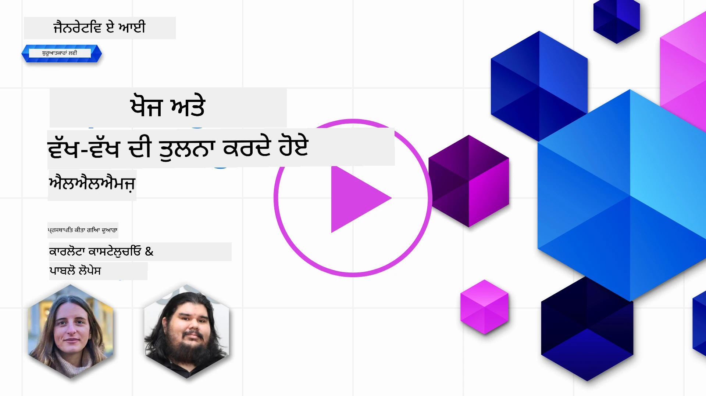](https://youtu.be/KIRUeDKscfI?si=8BHX1zvwzQBn-PlK)

> _ਇਸ ਪਾਠ ਦੀ ਵੀਡੀਓ ਦੇਖਣ ਲਈ ਉੱਪਰ ਦਿੱਤੀ ਚਿੱਤਰ 'ਤੇ ਕਲਿੱਕ ਕਰੋ_

ਪਿਛਲੇ ਪਾਠ ਵਿੱਚ, ਅਸੀਂ ਵੇਖਿਆ ਕਿ ਜੈਨਰੇਟਿਵ ਏਆਈ ਤਕਨਾਲੋਜੀ ਦ੍ਰਿਸ਼ ਨੂੰ ਕਿਵੇਂ ਬਦਲ ਰਿਹਾ ਹੈ, ਵੱਡੇ ਭਾਸ਼ਾ ਮਾਡਲ (LLMs) ਕਿਵੇਂ ਕੰਮ ਕਰਦੇ ਹਨ ਅਤੇ ਸਾਡੇ ਸਟਾਰਟਅਪ ਵਰਗੇ ਕਾਰੋਬਾਰ ਉਨ੍ਹਾਂ ਨੂੰ ਕੇਸ ਵਿੱਚ ਲਾਗੂ ਕਰਕੇ ਕਿਵੇਂ ਵਿਕਾਸ ਕਰ ਸਕਦਾ ਹੈ! ਇਸ ਅਧਿਆਇ ਵਿੱਚ, ਅਸੀਂ ਵੱਖ-ਵੱਖ ਕਿਸਮਾਂ ਦੇ ਵੱਡੇ ਭਾਸ਼ਾ ਮਾਡਲ (LLMs) ਦੀ ਤੁਲਨਾ ਅਤੇ ਭੇਦ ਭਾਵ ਕਰਕੇ ਉਨ੍ਹਾਂ ਦੇ ਫਾਇਦੇ ਤੇ ਨੁਕਸਾਨ ਸਮਝਣ ਦੀ ਕੋਸ਼ਿਸ਼ ਕਰ ਰਹੇ ਹਾਂ।

ਸਾਡੇ ਸਟਾਰਟਅਪ ਦੀ ਯਾਤਰਾ ਦਾ ਅਗਲਾ ਕਦਮ ਹਾਲੀਆ LLMs ਦੇ ਦ੍ਰਿਸ਼ ਨੂੰ ਪੜਤਾਲ ਕਰਨਾ ਅਤੇ ਸਮਝਣਾ ਹੈ ਕਿ ਕਿਹੜੇ ਸਾਡੀ ਵਰਤੋਂ ਲਈ ਉਚਿਤ ਹਨ।

## ਜਾਣਪਹਿਲਾ

ਇਹ ਪਾਠ ਸਮੇਤ:

- ਮੌਜੂਦਾ ਦ੍ਰਿਸ਼ ਵਿੱਚ ਵੱਖ-ਵੱਖ ਕਿਸਮਾਂ ਦੇ LLMs.
- ਆਪਣੇ ਕੇਸ ਲਈ ਐਜ਼ਿਊਰ ਵਿੱਚ ਵੱਖ-ਵੱਖ ਮਾਡਲਾਂ ਦੀ ਪੜਤਾਲ, ਦੁਹਰਾਈ ਅਤੇ ਤੁਲਨਾ ਕਰਨ ਦਾ ਤਰੀਕਾ.
- ਇੱਕ LLM ਨੂੰ ਡਿਪਲੌਇ ਕਰਨ ਦਾ ਤਰੀਕਾ.

## ਸਿੱਖਣ ਦੇ ਲਕੜ

ਇਸ ਪਾਠ ਨੂੰ ਪੂਰਾ ਕਰਨ ਤੋਂ ਬਾਅਦ, ਤੁਸੀਂ ਸਮਰੱਥ ਹੋਵੋਗੇ:

- ਆਪਣੇ ਕੇਸ ਲਈ ਸਹੀ ਮਾਡਲ ਚੁਣਨ ਲਈ।
- ਮਾਡਲ ਦੀ ਕਾਰਗੁਜ਼ਾਰੀ ਦੀ ਪੜਤਾਲ, ਦੁਹਰਾਈ ਅਤੇ ਸੁਧਾਰ ਕਰਨ ਦਾ ਤਰੀਕਾ ਸਮਝੋ।
- ਜਾਣੋ ਕਿ ਕਾਰੋਬਾਰ ਕਿਵੇਂ ਮਾਡਲਾਂ ਨੂੰ ਡਿਪਲੌਇ ਕਰਦੇ ਹਨ।

## ਵੱਖ-ਵੱਖ ਕਿਸਮਾਂ ਦੇ LLMs ਨੂੰ ਸਮਝੋ

LLMs ਨੂੰ ਉਨ੍ਹਾਂ ਦੀ ਆਰਕੀਟੈਕਚਰ, ਪ੍ਰਸ਼ਿਖਣ ਡਾਟਾ ਅਤੇ ਵਰਤੋਂ ਦੇ ਕੇਸ ਅਨੁਸਾਰ ਕਈ ਸ਼੍ਰੇਣੀਆਂ ਵਿੱਚ ਵੰਡਿਆ ਜਾ ਸਕਦਾ ਹੈ। ਇਹ ਅੰਤਰ ਸਮਝਣ ਨਾਲ ਸਾਡੇ ਸਟਾਰਟਅਪ ਨੂੰ ਮੌਕੇ ਲਈ ਸਹੀ ਮਾਡਲ ਚੁਣਨ ਵਿੱਚ ਮਦਦ ਮਿਲੇਗੀ, ਅਤੇ ਇਹ ਵੀ ਸਮਝਣ ਵਿੱਚ ਕਿ ਪੜਤਾਲ, ਦੁਹਰਾਈ ਅਤੇ ਪ੍ਰਦਰਸ਼ਨ ਸੁਧਾਰ ਕਿਵੇਂ ਕਰਨਾ ਹੈ।

LLM ਮਾਡਲਾਂ ਦੀਆਂ ਕਈ ਕਿਸਮਾਂ ਹੁੰਦੀਆਂ ਹਨ, ਤੁਹਾਡਾ ਮਾਡਲ ਚੁਣਾਅ ਇਸ 'ਤੇ ਨਿਰਭਰ ਕਰਦਾ ਹੈ ਕਿ ਤੁਸੀਂ ਉਨ੍ਹਾਂ ਨੂੰ ਕਿਦਾਂ ਵਰਤਣਾ ਚਾਹੁੰਦੇ ਹੋ, ਤੁਹਾਡੇ ਡਾਟਾ ਤੇ ਕਿੰਨਾ ਖਰਚਾ ਕਰਨ ਲਈ ਤਿਆਰ ਹੋ, ਆਦਿ।

ਜੇ ਤੁਸੀਂ ਮਾਡਲਾਂ ਨੂੰ ਲਿਖਤ, ਆਡੀਓ, ਵੀਡੀਓ, ਚਿੱਤਰ ਜਨਰੇਸ਼ਨ ਆਦਿ ਲਈ ਵਰਤਦੇ ਹੋ, ਤਾਂ ਤੁਸੀਂ ਕਿਸੇ ਹੋਰ ਕਿਸਮ ਦੇ ਮਾਡਲ ਦੀ ਚੋਣ ਕਰ ਸਕਦੇ ਹੋ।

- **ਆਡੀਓ ਅਤੇ ਬੋਲੀ ਪਛਾਣ**। Whisper ਸ਼ੈਲੀ ਦੇ ਮਾਡਲ ਹਜੇ ਵੀ ਆਮ ਉਦੇਸ਼ ਵਾਲੇ ਬੋਲੀ ਪਛਾਣ ਮਾਡਲ ਹਨ, ਪਰ ਉਤਪਾਦਨ ਚੋਣਾਂ ਵਿੱਚ ਹੁਣ ਨਵੇਂ ਸਪੀਚ-ਟੂ-ਟੈਕਸਟ ਮਾਡਲ ਜਿਵੇਂ `gpt-4o-transcribe`, `gpt-4o-mini-transcribe`, ਅਤੇ ਡਾਇਰਾਈਜ਼ੇਸ਼ਨ ਵੈਰੀਅੰਟ ਸ਼ਾਮਲ ਹਨ। ਆਪਣੀ ਸਥਿਤੀ ਲਈ ਭਾਸ਼ਾ ਕਵਰੇਜ, ਡਾਇਰਾਈਜ਼ੇਸ਼ਨ, ਸਤਤ ਸਮੇਂ ਸਹਾਇਤਾ, ਲੈਟੈਂਸੀ, ਅਤੇ ਲਾਗਤ ਦਾ ਮੂਲਾਂਕਣ ਕਰੋ। ਵਧੇਰੇ ਜਾਣਕਾਰੀ ਲਈ [OpenAI speech-to-text documentation](https://platform.openai.com/docs/guides/speech-to-text?WT.mc_id=academic-105485-koreyst) ਵੇਖੋ।

- **ਚਿੱਤਰ ਜਨਰੇਸ਼ਨ**। DALL-E ਅਤੇ Midjourney ਬਹੁਤ ਮਸ਼ਹੂਰ ਚਿੱਤਰ ਜਨਰੇਸ਼ਨ ਵਿਕਲਪ ਹਨ, ਪਰ ਮੌਜੂਦਾ OpenAI ਚਿੱਤਰ APIs GPT Image ਮਾਡਲਾਂ ਜਿਵੇਂ `gpt-image-2` 'ਤੇ ਕੇਂਦ੍ਰਿਤ ਹਨ, ਜਦਕਿ Stable Diffusion, Imagen, Flux, ਅਤੇ ਹੋਰ ਮਾਡਲ ਪਰਿਵਾਰ ਵੀ ਆਮ ਚੋਣ ਹਨ। ਪ੍ਰੋਅਮਪਟ ਅਨੁਕੂਲਤਾ, ਸੰਪਾਦਨ ਸਹਾਇਤਾ, ਸ਼ੈਲੀ ਨਿਯੰਤਰਣ, ਸੁਰੱਖਿਆ ਜ਼ਰੂਰਤਾਂ, ਅਤੇ ਲਾਇਸੰਸਿੰਗ ਦੀ ਤੁਲਨਾ ਕਰੋ। ਹੋਰ ਜਾਣਕਾਰੀ ਲਈ [OpenAI image generation guide](https://platform.openai.com/docs/guides/images?WT.mc_id=academic-105485-koreyst) ਅਤੇ ਇਸ ਪਾਠਕ੍ਰਮ ਦੇ ਅਧਿਆਇ 9 ਨੂੰ ਦੇਖੋ।

- **ਲਿਖਤ ਜਨਰੇਸ਼ਨ**। ਲਿਖਤ ਮਾਡਲ ਹੁਣ ਆਗੂ ਮਾਡਲ, ਕਾਰਨ ਸਮਝਣ ਵਾਲੇ ਮਾਡਲ, ਛੋਟੇ ਤੇਜ਼-ਲੈਟੈਂਸੀ ਵਾਲੇ ਮਾਡਲ, ਅਤੇ ਖੁੱਲ੍ਹੇ ਵਜ਼ਨ ਵਾਲੇ ਮਾਡਲਾਂ ਤੇ ਫੈਲੇ ਹੋਏ ਹਨ। ਮੌਜੂਦਾ ਉਦਾਹਰਨਾਂ ਵਿੱਚ OpenAI GPT-5.x ਮਾਡਲ, Anthropic Claude 4.x ਮਾਡਲ, Google Gemini 3.x ਮਾਡਲ, Meta Llama 4 ਮਾਡਲ, ਅਤੇ Mistral ਮਾਡਲ ਸ਼ਾਮਲ ਹਨ। ਸਿਰਫ ਜਾਰੀ ਕਰਨ ਦੀ ਤਾਰੀਖ ਜਾਂ ਕੀਮਤ ਦੇ ਆਧਾਰ 'ਤੇ ਨਹੀਂ ਚੁਣੋ; ਟਾਸਕ ਦੀ ਗੁਣਵੱਤਾ, ਲੈਟੈਂਸੀ, ਸੰਦਰਭ ਖਿੜਕੀ, ਟੂਲ ਵਰਤੋਂ, ਸੁਰੱਖਿਆ ਵਤੀਰਣ, ਖੇਤਰੀ ਉਪਲਬਧਤਾ, ਅਤੇ ਕੁੱਲ ਲਾਗਤ ਦੀ ਤੁਲਨਾ ਕਰੋ। [Microsoft Foundry ਮਾਡਲ ਕੈਟਾਲੌਗ](https://ai.azure.com/catalog?WT.mc_id=academic-105485-koreyst) ਐਜ਼ਿਊਰ 'ਤੇ ਉਪਲਬਧ ਮਾਡਲਾਂ ਦੀ ਤੁਲਨਾ ਕਰਨ ਲਈ ਚੰਗਾ ਸਥਾਨ ਹੈ।

- **ਮਲਟੀ-ਮੋਡੈਲਿਟੀ**। ਬਹੁਤ ਸਾਰੇ ਮੌਜੂਦਾ ਮਾਡਲ ਇੱਕ ਤੋਂ ਵੱਧ ਲਿਖਤ ਪ੍ਰਕਿਰਿਆ ਕਰ ਸਕਦੇ ਹਨ। ਕੁਝ ਚਿੱਤਰ, ਆਡੀਓ, ਜਾਂ ਵੀਡੀਓ ਇਨਪੁੱਟ ਸਵੀਕਾਰਦੇ ਹਨ; ਕੁਝ ਟੂਲ ਕਾਲ ਕਰ ਸਕਦੇ ਹਨ; ਅਤੇ ਖ਼ਾਸ ਮਾਡਲ ਚਿੱਤਰ, ਆਡੀਓ, ਜਾਂ ਵੀਡੀਓ ਜਨਰੇਟ ਕਰ ਸਕਦੇ ਹਨ। ਉਦਾਹਰਨ ਲਈ, ਮੌਜੂਦਾ OpenAI ਮਾਡਲ ਲਿਖਤ ਅਤੇ ਚਿੱਤਰ ਇਨਪੁੱਟ ਸਹਾਇਤਾ ਕਰਦੇ ਹਨ, Gemini ਮਾਡਲ ਵੈਰੀਅੰਟ ਦੇ ਅਨੁਸਾਰ ਲਿਖਤ, ਕੋਡ, ਚਿੱਤਰ, ਆਡੀਓ, ਅਤੇ ਵੀਡੀਓ ਸਹਾਇਤਾ ਕਰ ਸਕਦੇ ਹਨ, ਅਤੇ Llama 4 Scout ਅਤੇ Maverick ਖੁੱਲ੍ਹੇ ਵਜ਼ਨ ਵਾਲੇ ਖੁੱਧ-ਮਲਟੀਮੋਡਲ ਮਾਡਲ ਹਨ। ਹਮੇਸ਼ਾ ਹਰ ਮਾਡਲ ਕਾਰਡ ਵਿੱਚ ਸਮਰਥਿਤ ਇਨਪੁੱਟ ਅਤੇ ਆਉਟਪੁੱਟ ਮੋਡੈਲੀਟੀ ਨੂੰ ਦੇਖੋ ਪਹਿਲਾਂ ਕਿ ਤੁਸੀਂ ਇਸ ਦੇ ਆਸ-ਪਾਸ ਵਾਪਰ ਬਣਾਓ।

ਮਾਡਲ ਚੁਣਨ ਦਾ ਮਤਲਬ ਹੈ ਕਿ ਤੁਹਾਨੂੰ ਕੁਝ ਮੁੱਖ ਸਮਰੱਥਾਵਾਂ ਮਿਲਦੀਆਂ ਹਨ, ਪਰ ਕਈ ਵਾਰ ਇਹ ਕਾਫੀ ਨਹੀਂ ਹੁੰਦੀਆਂ। ਅਕਸਰ ਤੁਹਾਡੇ ਕੋਲ ਕੰਪਨੀ-ਵਿਸ਼ੇਸ਼ ਡਾਟਾ ਹੁੰਦਾ ਹੈ ਜਿਸਨੂੰ ਤੁਸੀਂ ਕਿਸੇ ਨਾ ਕਿਸੇ ਤਰੀਕੇ ਨਾਲ LLM ਨੂੰ ਦੱਸਣਾ ਹੁੰਦਾ ਹੈ। ਇਸ ਲਈ ਕੁਝ ਵੱਖਰੇ ਵਿਕਲਪ ਹਨ, ਜਿਨ੍ਹਾਂ ਬਾਰੇ ਅੱਗੇ ਸੈਕਸ਼ਨਾਂ ਵਿੱਚ ਹੋਰ ਜਾਣਕਾਰੀ ਦਿੱਤੀ ਜਾਵੇਗੀ।

### ਫਾਉਂਡੇਸ਼ਨ ਮਾਡਲਾਂ ਵਰਸਸ LLMs

ਫਾਉਂਡੇਸ਼ਨ ਮਾਡਲ ਸ਼ਬਦ Stanford ਦੇ ਖੋਜਕਾਰਾਂ ਵੱਲੋਂ [ਸ਼ੁਰੂ ਕੀਤਾ ਗਿਆ ਸੀ](https://arxiv.org/abs/2108.07258?WT.mc_id=academic-105485-koreyst) ਅਤੇ ਇਸ ਦੀ ਵਿਆਖਿਆ ਇੱਕ ਐਅਈ ਮਾਡਲ ਦੇ ਤੌਰ 'ਤੇ ਕੀਤੀ ਗਈ ਜੋ ਕੁਝ ਮਾਪਦੰਡਾਂ ਦੀ ਪਾਲਣਾ ਕਰਦਾ ਹੈ, ਜਿਵੇਂ ਕਿ:

- **ਉਹਨਾਂ ਨੂੰ ਬਿਨਾਂ ਨਿਰਦੇਸ਼ਕ ਸਿੱਖਣ ਜਾਂ ਖੁਦ-ਨਿਰਦੇਸ਼ਕ ਸਿੱਖਣ ਨਾਲ ਪ੍ਰਸ਼ਿਖਿਤ ਕੀਤਾ ਜਾਂਦਾ ਹੈ**, ਜਿਸ ਦਾ ਮਤਲਬ ਹੈ ਕਿ ਉਹ ਬਿਨਾਂ ਲੇਬਲ ਵਾਲੀ ਬਹੁ-ਮੋਡੈਲ ਡਾਟਾ 'ਤੇ ਪ੍ਰਸ਼ਿਖਿਤ ਹੁੰਦੇ ਹਨ ਅਤੇ ਉਨ੍ਹਾਂ ਦੀ ਪ੍ਰਸ਼ਿਖਣ ਪ੍ਰਕਿਰਿਆ ਲਈ ਮਨੁੱਖੀ ਟੈਗਿੰਗ ਜਾਂ ਲੇਬਲਿੰਗ ਦੀ ਲੋੜ ਨਹੀਂ ਹੁੰਦੀ।
- **ਉਹ ਬਹੁਤ ਵੱਡੇ ਮਾਡਲ ਹੁੰਦੇ ਹਨ**, ਬਹੁਤ ਡੂੰਘੇ ਨਿਊਰਲ ਨੈੱਟਵਰਕਾਂ ‘ਤੇ ਅਧਾਰਿਤ ਜੋ ਅਰਬਾਂ ਪੈਰਾਮੀਟਰਾਂ ‘ਤੇ ਪ੍ਰਸ਼ਿਖਿਤ ਹੁੰਦੇ ਹਨ।
- **ਆਮ ਤੌਰ 'ਤੇ ਉਨ੍ਹਾਂ ਦਾ ਉਦੇਸ਼ ਹੋਰ ਮਾਡਲਾਂ ਲਈ ‘ਫਾਉਂਡੇਸ਼ਨ’ ਦੇ ਤੌਰ ‘ਤੇ ਕੰਮ ਕਰਨਾ ਹੁੰਦਾ ਹੈ**, ਜਿਸ ਦਾ ਅਰਥ ਹੈ ਕਿ ਉਨ੍ਹਾਂ ਨੂੰ ਬੇਸ ਮਾਡਲ ਵਜੋਂ ਵਰਤ ਕੇ ਹੋਰ ਮਾਡਲ ਬਨਾਏ ਜਾ ਸਕਦੇ ਹਨ, ਜੋ ਫਾਈਨ-ਟਿਊਨਿੰਗ ਕੀਤੀ ਜਾ ਸਕਦੀ ਹੈ।

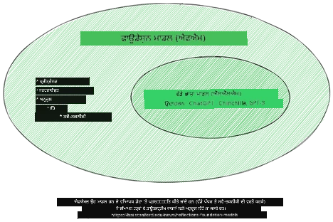

ਚਿੱਤਰ ਸ੍ਰੋਤ: [Essential Guide to Foundation Models and Large Language Models | by Babar M Bhatti | Medium
](https://thebabar.medium.com/essential-guide-to-foundation-models-and-large-language-models-27dab58f7404)

ਇਸ ਅੰਤਰ ਨੂੰ ਹੋਰ ਸਪਸ਼ਟ ਕਰਨ ਲਈ, ਆਓ ChatGPT ਨੂੰ ਇੱਕ ਇਤਿਹਾਸਕ ਉਦਾਹਰਨ ਵਜੋਂ ਲੈਂਦੇ ਹਾਂ। ਸ਼ੁਰੂਆਤੀ ਸੰਸਕਰਨਾਂ ਨੇ GPT-3.5 ਨੂੰ ਫਾਉਂਡੇਸ਼ਨ ਮਾਡਲ ਵਜੋਂ ਵਰਤਿਆ। OpenAI ਨੇ ਫਿਰ ਚੈਟ-ਨਿਰਧਾਰਿਤ ਡਾਟਾ ਅਤੇ ਅਨੁਕੂਲਣ ਤਕਨੀਕਾਂ ਨਾਲ ਇੱਕ ਟਿਊਨ ਕੀਤਾ ਹੋਇਆ ਵਰਜਨ ਬਣਾਇਆ ਜੋ ਗੱਲਬਾਤੀ ਸੰਦਰਭਾਂ ਵਿੱਚ ਬਿਹਤਰ ਪ੍ਰਦਰਸ਼ਨ ਕਰਦਾ ਸੀ, ਜਿਵੇਂ ਕਿ ਚੈਟਬੋਟ। ਮੌਡਰਨ ਏਆਈ ਸਰਵਿਸਿਜ਼ ਅਕਸਰ ਕਈ ਮਾਡਲ ਵਰਜੰਟਾਂ ਵਿਚਕਾਰ ਰੂਟ ਕਰਦੀਆਂ ਹਨ, ਇਸ ਲਈ ਸਰਵਿਸ ਦਾ ਨਾਮ ਅਤੇ ਅਧਾਰ ਮਾਡਲ ਦਾ ਨਾਮ ਹਮੇਸ਼ਾ ਉਹੋ ਜਿਹਾ ਨਹੀਂ ਹੁੰਦਾ।

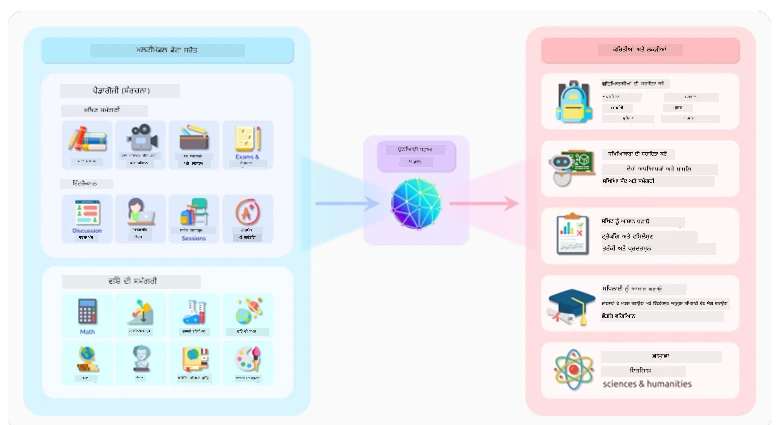

ਚਿੱਤਰ ਸ੍ਰੋਤ: [2108.07258.pdf (arxiv.org)](https://arxiv.org/pdf/2108.07258.pdf?WT.mc_id=academic-105485-koreyst)

### ਖੁੱਲ੍ਹੇ ਵਜ਼ਨ/ ਖੁੱਲ੍ਹਾ ਸ੍ਰੋਤ ਵਰਸਸ ਪ੍ਰੋਪ੍ਰਾਇਟਰੀ ਮਾਡਲ

LLMs ਨੂੰ ਇੱਕ ਹੋਰ ਤਰੀਕੇ ਨਾਲ ਵਰਗੀਕ੍ਰਿਤ ਕੀਤਾ ਜਾ ਸਕਦਾ ਹੈ ਕਿ ਕਿਹੜੇ ਖੁੱਲ੍ਹੇ ਵਜ਼ਨ, ਖੁੱਲ੍ਹੇ ਸ੍ਰੋਤ, ਜਾਂ ਪ੍ਰੋਪ੍ਰਾਇਟਰੀ ਹਨ।

ਖੁੱਲ੍ਹੇ ਸ੍ਰੋਤ ਅਤੇ ਖੁੱਲ੍ਹੇ ਵਜ਼ਨ ਵਾਲੇ ਮਾਡਲ ਮਾਡਲ ਆਰਟੀਫੈਕਟਾਂ ਦੀ ਜਾਂਚ, ਡਾਊਨਲੋਡ, ਜਾਂ ਵਿਅਕਤੀਗਤ ਕਰਨ ਲਈ ਉਪਲਬਧ ਕਰਵਾਉਂਦੇ ਹਨ, ਪਰ ਉਨ੍ਹਾਂ ਦੀਆਂ ਲਾਇਸੰਸਾਂ ਵਿੱਚ ਅੰਤਰ ਹੁੰਦਾ ਹੈ। ਕੁਝ ਪੂਰੀ ਤਰ੍ਹਾਂ ਖੁੱਲ੍ਹੇ ਸ੍ਰੋਤ ਹੁੰਦੇ ਹਨ, ਜਦਕਿ ਹੋਰ ਖੁੱਲ੍ਹੇ ਵਜ਼ਨ ਮਾਡਲ ਹਨ ਜਿਨ੍ਹਾਂ ਦੀ ਵਰਤੋਂ 'ਤੇ ਸੀਮਾਵਾਂ ਹੁੰਦੀਆਂ ਹਨ। ਇਹ ਉਦਯੋਗਾਂ ਨੂੰ ਡਿਪਲੌਇਮੈਂਟ, ਡਾਟਾ ਸਥਾਨਕਤਾ, ਲਾਗਤ ਜਾਂ ਵਿਅਕਤੀਗਤ ਕਰਨ 'ਤੇ ਵੱਧ ਨਿਯੰਤਰਣ ਚਾਹੀਦਾ ਹੋਵੇ ਉਸ ਵੇਲੇ ਮਦਦਗਾਰ ਸਾਬਤ ਹੁੰਦੇ ਹਨ। ਫਿਰ ਵੀ ਟੀਮਾਂ ਨੂੰ ਉਪਯੋਗ ਦੇ ਲਈ ਲਾਇਸੰਸ ਦੀਆਂ ਸ਼ਰਤਾਂ, ਸਰਵਿਸ ਲਾਗਤਾਂ, ਰਖ-ਰਖਾਅ, ਸੁਰੱਖਿਆ ਅੱਪਡੇਟ ਅਤੇ ਮੁੱਲਾਂਕਣ ਗੁਣਵੱਤਾ ਦੀ ਸਮੀਖਿਆ ਕਰਨੀ ਪੈਂਦੀ ਹੈ। ਉਦਾਹਰਣ ਵਜੋਂ [Meta Llama 4](https://ai.meta.com/blog/llama-4-multimodal-intelligence/?WT.mc_id=academic-105485-koreyst), ਕੁਝ [Mistral ਮਾਡਲ](https://docs.mistral.ai/models/overview?WT.mc_id=academic-105485-koreyst), ਅਤੇ ਕਈ ਮਾਡਲ ਜੋ [Hugging Face](https://huggingface.co/models?WT.mc_id=academic-105485-koreyst) ਤੇ ਹੋਸਟ ਕੀਤੇ ਗਏ ਹਨ।

ਪ੍ਰੋਪ੍ਰਾਇਟਰੀ ਮਾਡਲ ਕਿਸੇ ਪ੍ਰਦਾਤਾ ਦੇ ਅਧੀਨ ਹੁੰਦੇ ਹਨ ਅਤੇ ਉਨ੍ਹਾਂ ਵੱਲੋਂ ਹੋਸਟ ਕੀਤੇ ਜਾਂਦੇ ਹਨ। ਇਹ ਮਾਡਲ ਅਕਸਰ ਪ੍ਰਬੰਧਿਤ ਉਤਪਾਦਨ ਵਰਤੋਂ ਲਈ ਸੁਧਾਰਿਤ ਹੁੰਦੇ ਹਨ ਅਤੇ ਮਜ਼ਬੂਤ ਸਹਾਇਤਾ, ਸੁਰੱਖਿਆ ਪ੍ਰਣਾਲੀ, ਟੂਲ ਸਮਾਗਮ, ਅਤੇ ਮਾਪ-ਦੰਡ ਪ੍ਰਦਾਨ ਕਰ ਸਕਦੇ ਹਨ। ਪਰ ਖਰੀਦਦਾਰ ਅਕਸਰ ਮਾਡਲ ਵਜ਼ਨਾਂ ਦੀ ਜਾਂਚ ਜਾਂ ਸੋਧ ਨਹੀਂ ਕਰ ਸਕਦੇ, ਅਤੇ ਉਨ੍ਹਾਂ ਨੂੰ ਪ੍ਰਦਾਤਾ ਦੀਆਂ ਸ਼ਰਤਾਂ ਨੂੰ ਆਪਣੀ ਗੋਪਨੀਯਤਾ, ਰੱਖ-ਰਖਾਅ, ਪਾਲਣਾ, ਅਤੇ ਮਨਜ਼ੂਰਯੋਗ ਵਰਤੋਂ ਲਈ ਸਮੀਖਿਆ ਕਰਨੀ ਪੈਂਦੀ ਹੈ। ਉਦਾਹਰਨਾਂ ਵਿੱਚ [OpenAI ਮਾਡਲ](https://platform.openai.com/docs/models?WT.mc_id=academic-105485-koreyst), [Google Gemini](https://deepmind.google/models/gemini/pro/?WT.mc_id=academic-105485-koreyst), ਅਤੇ [Anthropic Claude](https://platform.claude.com/docs/en/about-claude/models/overview?WT.mc_id=academic-105485-koreyst) ਸ਼ਾਮਲ ਹਨ।

### ਐਂਬੈਡਿੰਗ ਵਿਰੁੱਧ ਚਿੱਤਰ ਜਨਰੇਸ਼ਨ ਵਿਰੁੱਧ ਲਿਖਤ ਅਤੇ ਕੋਡ ਜਨਰੇਸ਼ਨ

LLMs ਨੂੰ ਉਹਨਾਂ ਦੇ ਆਉਟਪੁੱਟ ਦੇ ਅਨੁਸਾਰ ਵੀ ਵਰਗੀਕ੍ਰਿਤ ਕੀਤਾ ਜਾ ਸਕਦਾ ਹੈ।

ਐਂਬੈਡਿੰਗ ਮਾਡਲ ਉਹ ਸੈੱਟ ਹੁੰਦੇ ਹਨ ਜੋ ਲਿਖਤ ਨੂੰ ਇੱਕ ਅੰਕਗਣਿਤ ਰੂਪ ਵਿੱਚ ਬਦਲ ਸਕਦੇ ਹਨ, ਜਿਸਨੂੰ ਐਂਬੈਡਿੰਗ ਕਹਿੰਦੇ ਹਨ, ਜੋ ਕਿ ਇਨਪੁੱਟ ਲਿਖਤ ਦੀ ਅੰਕਗਣਿਤ ਪ੍ਰਤੀਨਿਧਤਾ ਹੈ। ਐਂਬੈਡਿੰਗ ਮਸ਼ੀਨਾਂ ਲਈ ਸ਼ਬਦਾਂ ਜਾਂ ਵਾਕਾਂਸ਼ਾਂ ਵਿਚਕਾਰ ਸੰਬੰਧਾਂ ਨੂੰ ਸਮਝਣਾ ਅਸਾਨ ਕਰਦੇ ਹਨ ਅਤੇ ਹੋਰ ਮਾਡਲਾਂ ਦੁਆਰਾ ਆਉਟਪੁੱਟ ਹਿਸੇ ਵਜੋਂ ਵਰਤੇ ਜਾ ਸਕਦੇ ਹਨ, ਜਿਵੇਂ ਵਰਗੀਕਰਨ ਮਾਡਲ ਜਾਂ ਕਲੱਸਟਰਿੰਗ ਮਾਡਲ ਜੋ ਅੰਕਗਣਿਤ ਡੇਟਾ 'ਤੇ ਚੰਗਾ ਪ੍ਰਦਰਸ਼ਨ ਕਰਦੇ ਹਨ। ਐਂਬੈਡਿੰਗ ਮਾਡਲ ਅਕਸਰ ਟ੍ਰਾਂਸਫਰ ਲੇਰਨਿੰਗ ਲਈ ਵਰਤੇ ਜਾਂਦੇ ਹਨ, ਜਿੱਥੇ ਇੱਕ ਮਾਡਲ ਇੱਕ ਸਪੁਰਾਗੇਟ ਟਾਸਕ ਲਈ ਤਿਆਰ ਕੀਤਾ ਜਾਂਦਾ ਹੈ ਜਿਸ ਲਈ ਡਾਟਾ ਬਹੁਤ ਹੁੰਦਾ ਹੈ, ਅਤੇ ਫਿਰ ਮਾਡਲ ਦੇ ਵਜ਼ਨ (ਐਂਬੈਡਿੰਗ) ਹੋਰ ਥੱਲੇ-ਲੇਵਲ ਕੰਮਾਂ ਲਈ ਦੁਬਾਰਾ ਵਰਤੇ ਜਾਂਦੇ ਹਨ। ਇਸ ਸ਼੍ਰੇਣੀ ਦਾ ਉਦਾਹਰਨ ਹੈ [OpenAI ਐਂਬੈਡਿੰਗ](https://platform.openai.com/docs/models/embeddings?WT.mc_id=academic-105485-koreyst)।

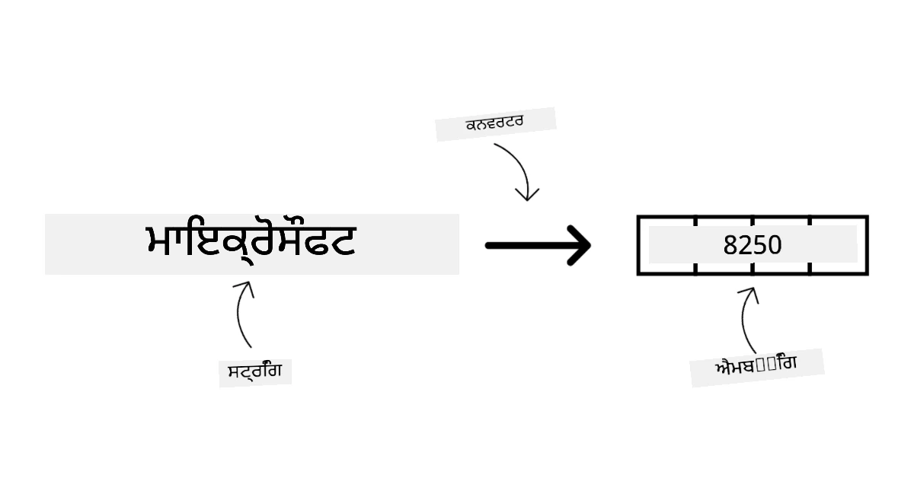

ਚਿੱਤਰ ਜਨਰੇਸ਼ਨ ਮਾਡਲ ਉਹ ਮਾਡਲ ਹਨ ਜੋ ਚਿੱਤਰ ਬਣਾਉਂਦੇ ਹਨ। ਇਹ ਮਾਡਲ ਅਕਸਰ ਚਿੱਤਰ ਸੰਪਾਦਨ, ਚਿੱਤਰ ਸੰਸ਼ਲੇਸ਼ਣ, ਅਤੇ ਚਿੱਤਰ ਅਨੁਵਾਦ ਲਈ ਵਰਤੇ ਜਾਂਦੇ ਹਨ। ਚਿੱਤਰ ਜਨਰੇਸ਼ਨ ਮਾਡਲ ਬਹੁਤ ਵੱਡੇ ਚਿੱਤਰ ਡੇਟਾਸੈੱਟਾਂ, ਜਿਵੇਂ ਕਿ [LAION-5B](https://laion.ai/blog/laion-5b/?WT.mc_id=academic-105485-koreyst) 'ਤੇ ਪ੍ਰਸ਼ਿਖਿਤ ਹੁੰਦੇ ਹਨ ਅਤੇ ਨਵੇਂ ਚਿੱਤਰ ਬਣਾਉਣ ਜਾਂ ਮੌਜੂਦਾ ਚਿੱਤਰਾਂ ਨੂੰ ਇੰਪੇਨਟਿੰਗ, ਸੁਪਰ-ਰੈਜ਼ੋਲਿਊਸ਼ਨ ਅਤੇ ਰੰਗ-ਸੰਮੇਲਨ ਤਕਨੀਕਾਂ ਨਾਲ ਸੰਪਾਦਿਤ ਕਰਨ ਲਈ ਵਰਤੇ ਜਾਂਦੇ ਹਨ। ਉਦਾਹਰਨਾਂ ਵਿੱਚ [GPT Image ਮਾਡਲ](https://platform.openai.com/docs/guides/images?WT.mc_id=academic-105485-koreyst), [Stable Diffusion ਮਾਡਲ](https://github.com/Stability-AI/StableDiffusion?WT.mc_id=academic-105485-koreyst), ਅਤੇ Imagen ਮਾਡਲ ਸ਼ਾਮਲ ਹਨ।

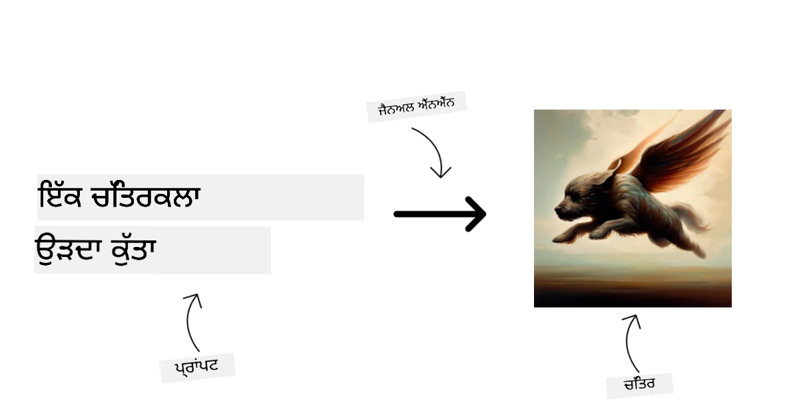

ਲਿਖਤ ਅਤੇ ਕੋਡ ਜਨਰੇਸ਼ਨ ਮਾਡਲ ਉਹ ਮਾਡਲ ਹਨ ਜੋ ਲਿਖਤ ਜਾਂ ਕੋਡ ਤਿਆਰ ਕਰਦੇ ਹਨ। ਇਹ ਮਾਡਲ ਅਕਸਰ ਲਿਖਤ ਸਾਰ-ਸੰਖੇਪ, ਅਨੁਵਾਦ, ਅਤੇ ਪ੍ਰਸ਼ਨ ਉੱਤਰ ਦੇਣ ਲਈ ਵਰਤੇ ਜਾਂਦੇ ਹਨ। ਲਿਖਤ ਜਨਰੇਸ਼ਨ ਮਾਡਲ ਬਹੁਤ ਵੱਡੇ ਲਿਖਤ ਡੇਟਾਸੈੱਟਾਂ ਜਿਵੇਂ [BookCorpus](https://www.cv-foundation.org/openaccess/content_iccv_2015/html/Zhu_Aligning_Books_and_ICCV_2015_paper.html?WT.mc_id=academic-105485-koreyst) 'ਤੇ ਪ੍ਰਸ਼ਿਖਿਤ ਹੁੰਦੇ ਹਨ ਅਤੇ ਨਵੀਂ ਲਿਖਤ ਬਣਾਉਣ ਜਾਂ ਪ੍ਰਸ਼ਨਾਂ ਦੇ ਉੱਤਰ ਦੇਣ ਲਈ ਉਪਯੋਗ ਕੀਤੇ ਜਾਂਦੇ ਹਨ। ਕੋਡ ਜਨਰੇਸ਼ਨ ਮਾਡਲ ਜਿਵੇਂ [CodeParrot](https://huggingface.co/codeparrot?WT.mc_id=academic-105485-koreyst) ਨੂੰ ਵੱਡੇ ਕੋਡ ਡੇਟਾ ਸੈੱਟਾਂ ਜਿਵੇਂ GitHub 'ਤੇ ਪ੍ਰਸ਼ਿਖਿਤ ਕੀਤਾ ਜਾਂਦਾ ਹੈ ਅਤੇ ਉਹ ਨਵਾਂ ਕੋਡ ਬਣਾਉਣ ਜਾਂ ਮੌਜੂਦਾ ਕੋਡ ਵਿੱਚ ਬੱਗ ਠੀਕ ਕਰਨ ਲਈ ਵਰਤੇ ਜਾਂਦੇ ਹਨ।

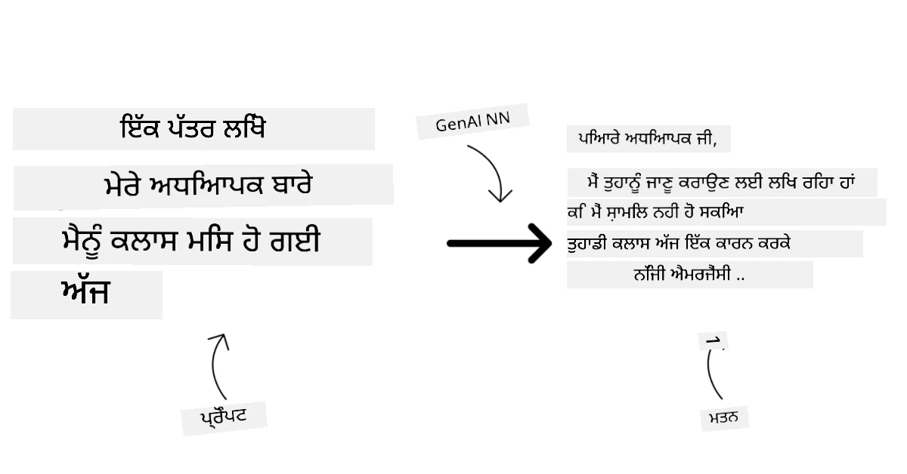

### ਐਂਕੋਡਰ-ਡੀਕੋਡਰ ਵਰਸਸ ਸਿਰਫ਼ ਡੀਕੋਡਰ

LLMs ਦੀਆਂ ਵੱਖ-ਵੱਖ ਆਰਕੀਟੈਕਚਰਾਂ ਬਾਰੇ ਗੱਲ ਕਰਨ ਲਈ ਉਹਦੇ ਲਈ ਇਕ ਤੁਲਨਾ ਵਰਤਦੇ ਹਾਂ।

ਕਲਪਨਾ ਕਰੋ ਤੁਹਾਡੇ ਮੈਨੇਜਰ ਨੇ ਤੁਹਾਨੂੰ ਵਿਦਿਆਰਥੀਆਂ ਲਈ ਇਕ ਕੁਇਜ਼ ਲਿਖਣ ਦਾ ਕੰਮ ਦਿੱਤਾ। ਤੁਹਾਡੇ ਕੋਲ ਦੋ ਸਹਿਕਰਮੀ ਹਨ; ਇੱਕ ਸਮੱਗਰੀ ਬਣਾਉਂਦਾ ਹੈ ਅਤੇ ਦੂਜਾ ਉਹਦਾ ਸਮੀਖਿਆ ਕਰਦਾ ਹੈ।

ਸਮੱਗਰੀ ਬਣਾਉਣ ਵਾਲਾ ਸਿਰਫ ਡੀਕੋਡਰ ਮਾਡਲ ਵਾਂਗ ਹੈ: ਉਹ ਵਿਸ਼ੇ ਨੂੰ ਦੇਖਦਾ ਹੈ, ਤੁਹਾਡੇ ਲਿਖੇ ਗਏ ਨੂੰ ਪੜ੍ਹਦਾ ਹੈ ਅਤੇ ਉਸ ਸੰਦਰਭ ਦੇ ਅਧਾਰ 'ਤੇ ਸਮੱਗਰੀ ਬਣਾਉਂਦਾ ਹੈ। ਉਹ ਦਿਲਚਸਪ ਅਤੇ ਜਾਣਕਾਰੀ-ਭਰਪੂਰ ਸਮੱਗਰੀ ਲਿਖਣ ਵਿੱਚ ਬਹੁਤ ਵਧੀਆ ਹੁੰਦੇ ਹਨ, ਪਰ ਉਹ ਹਰਵਾਰੀ ਕੇਸ ਜਿਵੇਂ ਕਿ ਵਰਗੀਕਰਨ, ਪ੍ਰਾਪਤੀ, ਜਾਂ ਜਾਣਕਾਰੀ ਐਨਕੋਡ ਕਰਨ ਲਈ ਸਭ ਤੋਂ ਵਧੀਆ ਚੋਣ ਨਹੀਂ ਹੁੰਦੇ। ਡੀਕੋਡਰ-ਸਿਰਫ ਮਾਡਲ ਪਰਿਵਾਰਾਂ ਦੇ ਉਦਾਹਰਨ ਹਨ GPT ਅਤੇ Llama ਮਾਡਲ।

ਸਮੀਖਿਆ ਕਰਨ ਵਾਲਾ ਐਂਕੋਡਰ ਸਿਰਫ ਮਾਡਲ ਵਾਂਗ ਹੈ, ਉਹ ਲਿਖਤ ਅਤੇ ਉੱਤਰਾਂ ਨੂੰ ਦੇਖਦਾ ਹੈ, ਉਨ੍ਹਾਂ ਦਰਮਿਆਨ ਸੰਬੰਧ ਨੂੰ ਨੋਟ ਕਰਦਾ ਹੈ ਅਤੇ ਸੰਦਰਭ ਨੂੰ ਸਮਝਦਾ ਹੈ, ਪਰ ਸਮੱਗਰੀ ਬਣਾਉਣ ਵਿੱਚ ਚੰਗਾ ਨਹੀਂ ਹੁੰਦਾ। ਐਂਕੋਡਰ ਸਿਰਫ ਮਾਡਲ ਦਾ ਉਦਾਹਰਨ BERT ਹੈ।

ਕਲਪਨਾ ਕਰੋ ਕਿ ਅਸੀਂ ਕਿਸੇ ਨੂੰ ਵੀ ਰੱਖ ਸਕਦੇ ਹਾਂ ਜੋ ਕੁਇਜ਼ ਬਣਾਉਣ ਅਤੇ ਸਮੀਖਿਆ ਦੋਹਾਂ ਕਰ ਸਕੇ, ਇਹ ਐਂਕੋਡਰ-ਡੀਕੋਡਰ ਮਾਡਲ ਹੈ। ਕੁਝ ਉਦਾਹਰਨ BART ਅਤੇ T5 ਹਨ।

### ਸਰਵਿਸ ਅਤੇ ਮਾਡਲ ਵਿੱਚ ਫਰਕ

ਹੁਣ, ਆਓ ਗੱਲ ਕਰੀਏ ਕਿ ਸਰਵਿਸ ਅਤੇ ਮਾਡਲ ਵਿੱਚ ਕਿਹੜਾ ਅੰਤਰ ਹੈ। ਸਰਵਿਸ ਇੱਕ ਉਤਪਾਦ ਹੈ ਜੋ ਕਲਾਉਡ ਸਰਵਿਸ ਪ੍ਰਦਾਤਾ ਵੱਲੋਂ ਮੁਹੱਈਆ ਕਰਵਾਇਆ ਜਾਂਦਾ ਹੈ ਅਤੇ ਅਕਸਰ ਮਾਡਲਾਂ, ਡਾਟਾ ਅਤੇ ਹੋਰ ਕਈ ਘਟਕਾਂ ਦਾ ਸੰਗਮ ਹੁੰਦਾ ਹੈ। ਮਾਡਲ ਇੱਕ ਸਰਵਿਸ ਦਾ ਮੁੱਖ ਭਾਗ ਹੁੰਦਾ ਹੈ ਅਤੇ ਆਮ ਤੌਰ 'ਤੇ ਇੱਕ ਫਾਉਂਡੇਸ਼ਨ ਮਾਡਲ ਜਿਵੇਂ ਇੱਕ LLM ਹੁੰਦਾ ਹੈ।

ਸਰਵਿਸਿਜ਼ ਆਮ ਤੌਰ 'ਤੇ ਉਤਪਾਦਨ ਵਰਤੋਂ ਲਈ ਸਧਾਰਿਤ ਹੁੰਦੇ ਹਨ ਅਤੇ ਗਰਾਫਿਕਲ ਯੂਜ਼ਰ ਇੰਟਰਫੇਸ ਦੁਆਰਾ ਮਾਡਲਾਂ ਨਾਲੋਂ ਵਰਤਣਾ ਆਸਾਨ ਹੁੰਦਾ ਹੈ। ਪਰ ਸਰਵਿਸਿਜ਼ ਹਮੇਸ਼ਾ ਮੁਫ਼ਤ ਉਪਲਬਧ ਨਹੀਂ ਹੁੰਦੀਆਂ ਅਤੇ ਉਨ੍ਹਾਂ ਨੂੰ ਵਰਤਣ ਲਈ ਸਬਸਕ੍ਰਿਪਸ਼ਨ ਜਾਂ ਭੁਗਤਾਨ ਦੀ ਲੋੜ ਪੈ ਸਕਦੀ ਹੈ, ਇਸਦੇ ਬਦਲ ਵਿੱਚ ਉਪਭੋਗਤਾ ਲਈ ਸਰਵਿਸ ਮਾਲਕ ਦੀ ਸਾਜੋ-ਸਾਮਾਨ ਅਤੇ ਸਰੋਤਾਂ ਦੀ ਵਰਤੋਂ ਕਰਨੀ ਆਸਾਨ ਹੁੰਦੀ ਹੈ, ਖਰਚਾ ਘਟਦਾ ਹੈ ਅਤੇ ਸਕੇਲਿੰਗ ਸੁਗਮ ਹੁੰਦੀ ਹੈ। ਇੱਕ ਸਰਵਿਸ ਦਾ ਉਦਾਹਰਨ ਹੈ [Azure OpenAI Service](https://learn.microsoft.com/azure/ai-foundry/openai/overview?WT.mc_id=academic-105485-koreyst), ਜੋ ਇੱਕ pay-as-you-go ਰੇਟ ਯੋਜਨਾ ਪ੍ਰਦਾਨ ਕਰਦੀ ਹੈ, ਜਿਸਦਾ ਮਤਲਬ ਹੈ ਕਿ ਉਪਭੋਗਤਾ ਉਸ ਮਾਤਰਾ ਦੇ ਅਨੁਸਾਰ ਚਾਰਜ ਹੁੰਦੇ ਹਨ ਜਿੰਨੀ ਉਹ ਸਰਵਿਸ ਦੀ ਵਰਤੋਂ ਕਰਦੇ ਹਨ। Azure OpenAI Service ਮਾਡਲਾਂ ਦੀ ਸਮਰੱਥਾ ਉੱਤੇ ਇੰਟਰਪ੍ਰਾਈਜ਼-ਗ੍ਰੇਡ ਸੁਰੱਖਿਆ ਅਤੇ ਜ਼ਿੰਮੇਵਾਰ ਏਆਈ ਫਰੇਮਵਰਕ ਵੀ ਦਿੰਦੀ ਹੈ।

ਮਾਡਲਾਂ ਤੰਤ੍ਰਿਕ ਜਾਲ ਅੰਸ਼ ਹਨ: ਪੈਰਾਮੀਟਰ, ਵਜ਼ਨ, ਆਰਕੀਟੈਕਚਰ, ਟੋਕਨਾਈਜ਼ਰ, ਅਤੇ ਸਹਾਇਕ ਕੰਫਿਗਰੇਸ਼ਨ। ਕਿਸੇ ਮਾਡਲ ਨੂੰ ਸਥਾਨਕ ਜਾਂ ਨਿੱਜੀ ਮਾਹੌਲ ਵਿੱਚ ਚਲਾਉਣ ਲਈ ਯੋਗ ਹਾਰਡਵੇਅਰ, ਸਰਵਿਸਿੰਗ ਢਾਂਚਾ, ਨਿਗਰਾਨੀ, ਅਤੇ ਜਾਂ ਤਾਂ ਖੁੱਲ੍ਹੇ-ਸ੍ਰੋਤ/ਖੁੱਲ੍ਹੇ ਵਜ਼ਨ ਵਾਲੀ ਲਾਇਸੰਸ ਜਾਂ ਵਪਾਰਕ ਲਾਇਸੰਸ ਦੀ ਲੋੜ ਹੁੰਦੀ ਹੈ। ਖੁੱਲ੍ਹੇ ਵਜ਼ਨ ਮਾਡਲ ਜਿਵੇਂ Llama 4 ਜਾਂ Mistral ਮਾਡਲਾਂ ਨੂੰ ਸਵੈ-ਅਤਿਵਾਸੀ ਕੀਤਾ ਜਾ ਸਕਦਾ ਹੈ, ਪਰ ਫਿਰ ਵੀ ਉਹਨਾਂ ਨੂੰ ਕੰਪਿਊਟਿੰਗ ਸ਼ਕਤੀ ਅਤੇ ਕਾਰਜਕੁਸ਼ਲਤਾ ਦੀ ਜ਼ਰੂਰਤ ਹੁੰਦੀ ਹੈ।

## ਐਜ਼ਿਊਰ 'ਤੇ ਵੱਖ-ਵੱਖ ਮਾਡਲਾਂ ਸਹਿਤ ਪ੍ਰਦਰਸ਼ਨ ਨੂੰ ਸਮਝਣ ਲਈ ਕਿਵੇਂ ਪੜਤਾਲ ਅਤੇ ਦੁਹਰਾਈ ਕਰਨੀ ਹੈ

ਜਦੋਂ ਸਾਡੀ ਟੀਮ ਨੇ ਮੌਜੂਦਾ LLMs ਦੇ ਨਜ਼ਾਰੇ ਦਾ ਅਧਿਐਨ ਕਰ ਲਿਆ ਅਤੇ ਉਹਨਾਂ ਦੇ ਸਾਥੀਆਂ ਲਈ ਕੁਝ ਵਧੀਆ ਉਮੀਦਵਾਰ ਚੁਣ ਲਏ, ਤਾਂ ਅਗਲਾ ਕਦਮ ਉਹਨਾਂ ਨੂੰ ਆਪਣੇ ਡੇਟਾ ਤੇ ਆਪਣੇ ਕਾਰਜਭਾਰ 'ਤੇ ਟੈਸਟ ਕਰਨਾ ਹੈ। ਇਹ ਇੱਕ ਦੋਹਰਾਇਆ ਜਾਣ ਵਾਲਾ ਪ੍ਰਕਿਰਿਆ ਹੈ, ਜੋ ਪ੍ਰਯੋਗਾਂ ਅਤੇ ਮਾਪਾਂ ਰਾਹੀਂ ਕੀਤਾ ਜਾਂਦਾ ਹੈ।
ਜਿਆਦਾਤਰ ਮਾਡਲ ਜਿਨ੍ਹਾਂ ਦਾ ਅਸੀਂ ਪਿਛਲੇ ਪੈਰਾਗ੍ਰਾਫਾਂ ਵਿੱਚ ਜ਼ਿਕਰ ਕੀਤਾ ਹੈ (OpenAI ਮਾਡਲ, ਖੁੱਲ੍ਹੇ ਵੇਟ ਵਾਲੇ ਮਾਡਲ ਜਿਵੇਂ Llama 4 ਅਤੇ Mistral, ਅਤੇ Hugging Face ਮਾਡਲ) [Microsoft Foundry Models](https://learn.microsoft.com/azure/foundry/concepts/foundry-models-overview?WT.mc_id=academic-105485-koreyst) ਵਿੱਚ ਉਪਲਬਧ ਹਨ।

[Microsoft Foundry](https://learn.microsoft.com/azure/foundry/what-is-foundry?WT.mc_id=academic-105485-koreyst), ਜੋ ਪਹਿਲਾਂ Azure AI Studio/Azure AI Foundry ਸੀ, ਇੱਕ ਇਕਜੁੱਟ ਐਜਰ ਪਲੇਟਫਾਰਮ ਹੈ ਜੋ AI ਐਪਾਂ ਅਤੇ ਏਜੇਟਸ ਬਣਾਉਣ ਲਈ ਹੈ। ਇਹ ਵਿਕਾਸਕਾਰਾਂ ਨੂੰ ਪਰਖ਼, ਮੁਲਾਂਕਣ ਤੱਕ ਜੀਵਨ ਚੱਕਰ ਨੂੰ ਸੰਭਾਲਨ ਵਿੱਚ ਮਦਦ ਕਰਦਾ ਹੈ, ਜਿਵੇਂ ਡਿਪਲਾਇਮੈਂਟ, ਮਾਨੀਟਰਿੰਗ ਅਤੇ ਗਵਰਨੈਂਸ। Microsoft Foundry ਵਿੱਚ ਮਾਡਲ ਕੈਟਾਲੌਗ ਉਪਭੋਗਤਾ ਨੂੰ ਇਹ ਯੋਗ ਬਣਾਉਂਦਾ ਹੈ:

- ਕੈਟਾਲੌਗ ਵਿੱਚ ਦਿਲਚਸਪੀ ਵਾਲਾ ਬੁਨਿਆਦੀ ਮਾਡਲ ਲੱਭੋ, ਜਿਸ ਵਿੱਚ Azure ਵੱਲੋਂ ਵੇਚੇ ਜਾਣ ਵਾਲੇ ਮਾਡਲ ਅਤੇ ਸਹਿਯੋਗੀਆਂ ਅਤੇ ਕਮਿਊਨਿਟੀ ਪ੍ਰਦਾਤਾ ਦੇ ਮਾਡਲ ਸ਼ਾਮਲ ਹਨ। ਉਪਭੋਗਤਾਵਾਂ ਟਾਸਕ, ਪ੍ਰਦਾਤਾ, ਲਾਇਸੈਂਸ, ਡਿਪਲਾਇਮੈਂਟ ਚੋਇਸ ਜਾਂ ਨਾਮ ਦੁਆਰਾ ਫਿਲਟਰ ਕਰ ਸਕਦੇ ਹਨ।

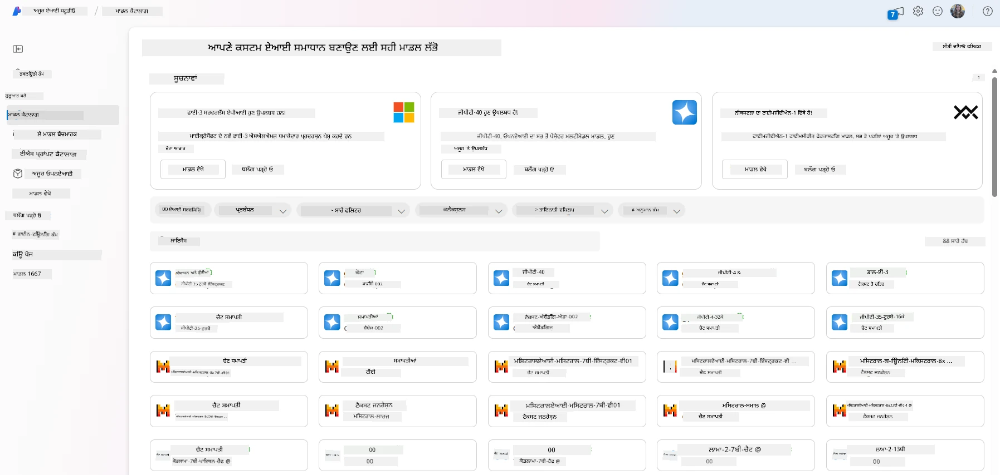

- ਮਾਡਲ ਕਾਰਡ ਦੀ ਸਮੀਖਿਆ ਕਰੋ, ਜਿਸ ਵਿੱਚ ਉਦੇਸ਼ਤ ਵਰਤੋਂ ਅਤੇ ਟ੍ਰੇਨਿੰਗ ਡੇਟਾ ਦੀ ਵਿਸਥਾਰਿਤ ਵਿਆਖਿਆ, ਕੋਡ ਨਮੂਨੇ ਅਤੇ ਅੰਦਰੂਨੀ ਮੁਲਾਂਕਣ ਲਾਇਬ੍ਰੇਰੀ 'ਤੇ ਮੁਲਾਂਕਣ ਨਤੀਜੇ ਸ਼ਾਮਲ ਹਨ।

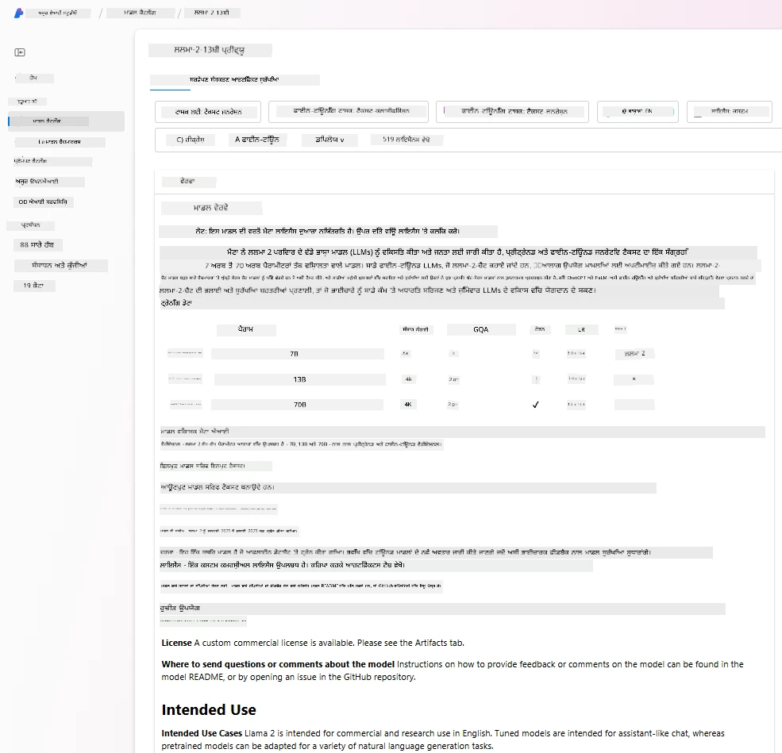

- ਉਦਯੋਗ ਵਿੱਚ ਉਪਲਬਧ ਮਾਡਲਾਂ ਅਤੇ ਡੇਟਾਸੈੱਟਾਂ ਦੇ ਪੈਮਾਨੇ ਦੀ ਤੁਲਨਾ ਕਰੋ ਤਾਂ ਕਿ ਇਹ ਜਾਣਿਆ ਜਾ ਸਕੇ ਕਿ کون-سا ਮਾਡਲ ਕਾਰੋਬਾਰੀ ਸੁਰਤ ਲਈ ਸਭ ਤੋਂ ਵਧੀਆ ਹੈ, [Model Benchmarks](https://learn.microsoft.com/azure/ai-foundry/concepts/model-benchmarks?WT.mc_id=academic-105485-koreyst) ਪੈਨਲ ਰਾਹੀਂ।

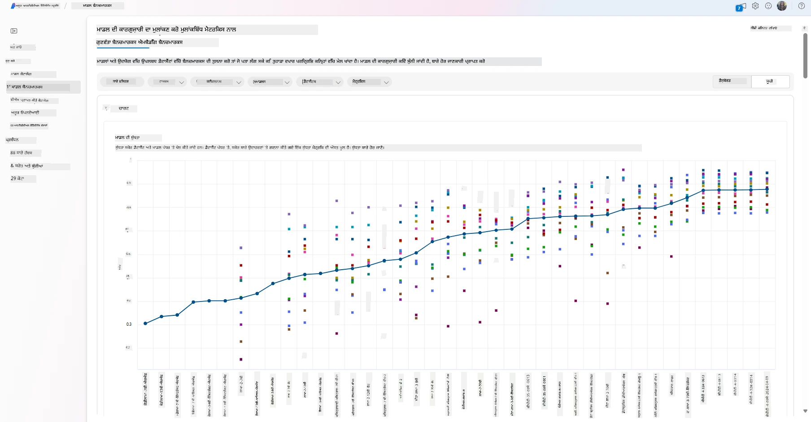

- Microsoft Foundry ਦੀ ਪ੍ਰਯੋਗ ਅਤੇ ਟ੍ਰੈਕਿੰਗ ਯੋਗਤਾਵਾਂ ਦੀ ਵਰਤੋਂ ਕਰਦੇ ਹੋਏ ਖਾਸ ਕਾਰਜਭਾਰ ਵਿੱਚ ਮਾਡਲ ਦੀ ਕਾਰਗੁਜ਼ਾਰੀ बेहतर ਬਣਾਉਣ ਲਈ ਕਸਟਮ ਟ੍ਰੇਨਿੰਗ ਡੇਟਾ 'ਤੇ ਸਹਾਇਤਾ ਅਤੇ ਸਮਰਥਤ ਮਾਡਲਾਂ ਨੂੰ ਫਾਈਨ-ਟਿਊਨ ਕਰੋ।

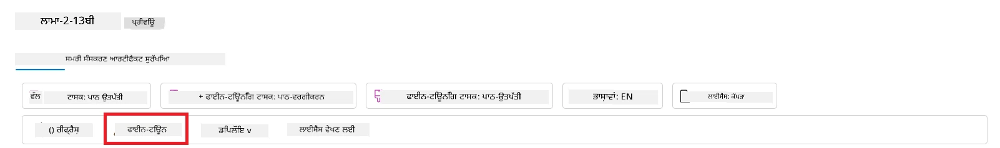

- ਮੂਲ ਪ੍ਰੀ-ਟ੍ਰੇਨਡ ਮਾਡਲ ਜਾਂ ਫਾਈਨ-ਟਿਊਨਵੇਂ ਮਾਡਲ ਨੂੰ ਇੱਕ ਰਿਮੋਟ ਰੀਅਲ-ਟਾਈਮ ਇੰਫਰੰਸ ਐਂਡਪੌਇੰਟ ਤੇ ਤਾਇਨਾਤ ਕਰੋ, ਪ੍ਰਬੰਧਿਤ ਕੰਪਿਊਟ ਜਾਂ ਸਰਵਰਲੇਸ ਡਿਪਲਾਇਮੈਂਟ ਵਿਕਲਪਾਂ ਦਾ ਇਸਤੇਮਾਲ ਕਰਦਿਆਂ, ਤਾਂ ਜੋ ਐਪਲੀਕੇਸ਼ਨ ਇਸ ਨੂੰ ਵਰਤ ਸਕਣ।

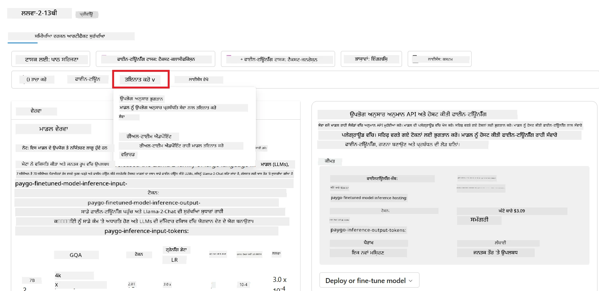

> [!NOTE]
> ਕੈਟਾਲੌਗ ਵਿੱਚ ਸਾਰੇ ਮਾਡਲ ਹਾਲੇ ਫਾਈਨ-ਟਿਊਨਿੰਗ ਅਤੇ/ਜਾਂ 'ਪੇ-ਐਜ਼-ਯੂ-ਗੋ' ਡਿਪਲਾਇਮੈਂਟ ਲਈ ਉਪਲਬਧ ਨਹੀਂ ਹਨ। ਮਾਡਲ ਕਾਰਡ ਵਿੱਚ ਮਾਡਲ ਦੀ ਯੋਗਤਾਵਾਂ ਅਤੇ ਸੀਮਾਵਾਂ ਦੇ ਵੇਰਵੇ ਲਈ ਜਾਂਚ ਕਰੋ।

## LLM ਨਤੀਜੇ ਸੁਧਾਰਨਾ

ਸਾਡੀ ਸਟਾਰਟਅੱਪ ਟੀਮ ਨੇ ਵੱਖ-ਵੱਖ ਕਿਸਮ ਦੇ LLMs ਅਤੇ ਇੱਕ ਕਲਾਊਡ ਪਲੇਟਫਾਰਮ (Microsoft Foundry) ਦਾ ਅਧਿਐਨ ਕੀਤਾ ਜੋ ਸਾਨੂੰ ਵੱਖ-ਵੱਖ ਮਾਡਲਾਂ ਦੀ ਤੁਲਨਾ ਕਰਨ, ਟੈਸਟ ਡੇਟਾ 'ਤੇ ਮੁਲਾਂਕਣ ਕਰਨ, ਪ੍ਰਦਰਸ਼ਨ ਸੁਧਾਰਨ ਅਤੇ ਇੰਫਰੰਸ ਐਂਡਪੌਇੰਟਸ 'ਤੇ ਡਿਪਲਾਇ ਕਰਨ ਯੋਗ ਬਣਾਉਂਦਾ ਹੈ।

ਪਰ ਉਹ ਕਿਸ ਵੇਲੇ ਕਿਸੇ ਪ੍ਰੀ-ਟ੍ਰੇਨਡ ਮਾਡਲ ਨੂੰ ਵਰਤਣ ਦੀ ਥਾਂ ਫਾਈਨ-ਟਿਊਨ ਕਰਨਾ ਸੋਚਣ? ਕੀ ਹੋਰ ਤਰੀਕੇ ਹਨ ਮਾਡਲ ਦੀ ਕਾਰਗੁਜ਼ਾਰੀ ਨੂੰ ਖਾਸ ਕਾਰਜਭਾਰ 'ਤੇ ਸੁਧਾਰਨ ਲਈ?

ਕਾਰੋਬਾਰ ਵੱਖ-ਵੱਖ ਤਰੀਕੇ ਵਰਤ ਸਕਦਾ ਹੈ LLM ਤੋਂ ਲੋੜੀਂਦੇ ਨਤੀਜੇ ਪ੍ਰਾਪਤ ਕਰਨ ਲਈ। ਤੁਸੀਂ ਉਤਪਾਦਨ ਵਿੱਚ LLM ਡਿਪਲਾਇ ਕਰਨ ਸਮੇਂ ਵੱਖ-ਵੱਖ ਪ੍ਰਸ਼ਿਖਿਆ ਨਾਲ ਵੱਖਰੇ ਕਿਸਮ ਦੇ ਮਾਡਲ ਚੁਣ ਸਕਦੇ ਹੋ, ਵੱਖ-ਵੱਖ ਜਟਿਲਤਾ, ਲਾਗਤ ਅਤੇ ਗੁਣਵੱਤਾ ਨਾਲ। ਇੱਥੇ ਕੁਝ ਵਿਭਿੰਨ ਤਰੀਕੇ ਹਨ:

- **ਸੰਦਰਭ ਨਾਲ ਪ੍ਰੋਂਪਟ ਇੰਜੀਨੀਅਰਿੰਗ**। ਵਿਚਾਰ ਇਹ ਹੈ ਕਿ ਜਦੋਂ ਤੁਸੀਂ ਪ੍ਰੋਂਪਟ ਦਿੰਦੇ ਹੋ ਤਾਂ ਕਾਫੀ ਸੰਦਰਭ ਉਪਲਬਧ ਕਰਵਾਇਆ ਜਾਵੇ ਤਾਂ ਜੋ ਤੁਸੀਂ ਲੋੜੀਂਦੇ ਜਵਾਬ ਪ੍ਰਾਪਤ ਕਰੋ।

- **ਰੀਟ੍ਰੀਵਲ ਆਗਮੈਂਟਡ ਜਨਰੇਸ਼ਨ, RAG**। ਤੁਹਾਡੇ ਡੇਟਾ ਵੀ ਇੱਕ ਡਾਟਾਬੇਸ ਜਾਂ ਵੈੱਬ ਐਂਡਪੌਇੰਟ ਵਿਚ ਹੋ ਸਕਦੇ ਹਨ, ਉਦਾਹਰਨ ਵਜੋਂ, ਤਾਂ ਜੋ ਇਹ ਡੇਟਾ ਜਾਂ ਉਸ ਦਾ ਇਕ ਹਿੱਸਾ ਪ੍ਰੋਂਪਟ ਦੇ ਸਮੇਂ ਸ਼ਾਮਲ ਕੀਤਾ ਜਾ ਸਕੇ, ਤੁਸੀਂ ਸੰਬੰਧਿਤ ਡੇਟਾ ਲੈ ਕੇ ਇਸ ਨੂੰ ਉਪਭੋਗਤਾ ਦੇ ਪ੍ਰੋਂਪਟ ਦਾ ਹਿੱਸਾ ਬਣਾ ਸਕਦੇ ਹੋ।

- **ਫਾਈਨ-ਟਿਊਨਡ ਮਾਡਲ**। ਇੱਥੇ, ਤੁਸੀਂ ਆਪਣਾ ਮਾਡਲ ਆਪਣੇ ਡੇਟਾ 'ਤੇ ਹੋਰ ਪ੍ਰਸ਼ਿਛਤ ਕੀਤਾ ਜੋ ਮਾਡਲ ਨੂੰ ਤੁਹਾਡੀ ਲੋੜਾਂ ਲਈ ਹੋਰ ਸਹੀ ਅਤੇ ਉੱਤਰਦਾਇਤ ਬਣਾਉਂਦਾ ਹੈ ਪਰ ਇਹ ਮਹਿੰਗਾ ਹੋ ਸਕਦਾ ਹੈ।

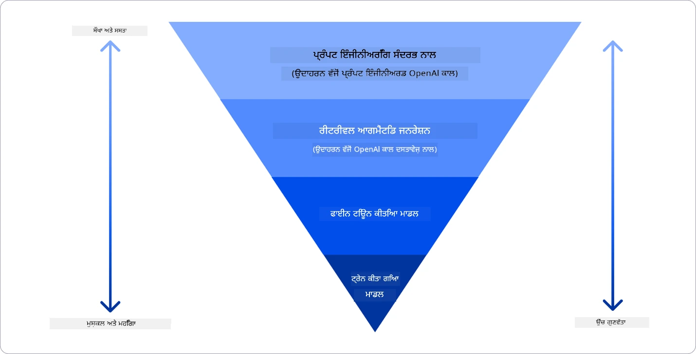

ਚਿੱਤਰ ਦਾ ਸਰੋਤ: [Four Ways that Enterprises Deploy LLMs | Fiddler AI Blog](https://www.fiddler.ai/blog/four-ways-that-enterprises-deploy-llms?WT.mc_id=academic-105485-koreyst)

### ਸੰਦਰਭ ਨਾਲ ਪ੍ਰੋਂਪਟ ਇੰਜੀਨੀਅਰਿੰਗ

ਪ੍ਰੀ-ਟ੍ਰੇਨਡ LLM ਬਹੁਤ ਚੰਗੇ ਤਰੀਕੇ ਨਾਲ ਸਭਿਆਚਾਰਕ ਭਾਸ਼ਾ ਕਾਰਜਾਂ ਵਿੱਚ ਕੰਮ ਕਰਦੇ ਹਨ, ਇੱਕ ਛੋਟੇ ਪ੍ਰੋਂਪਟ ਰਾਹੀਂ ਵੀ, ਜਿਵੇਂ ਪੂਰਾ ਕਰਨ ਲਈ ਇੱਕ ਵਾਕ ਜਾਂ ਸਵਾਲ - ਇਸਨੂੰ "ਜ਼ੀਰੋ-ਸ਼ਾਟ" ਲਰਨਿੰਗ ਕਹਿੰਦੇ ਹਨ।

ਪਰ ਮਹੱਤਵਪੂਰਨ ਗੱਲ ਇਹ ਹੈ ਕਿ ਜਿੰਨਾ ਜ਼ਿਆਦਾ ਉਪਭੋਗਤਾ ਆਪਣਾ ਸਵਾਲ ਵਿਸਥਾਰ ਨਾਲ, ਸੰਦਰਭ ਸਮੇਤ, ਪ੍ਰਸਤੁਤ ਕਰਦਾ ਹੈ, ਉਤਰ ਉਹਨਾ ਦੀ ਉਮੀਦਾਂ ਦੇ ਨੇੜੇ ਹੋਦਾ ਹੈ। ਇਸ ਸੰਦਰਭ ਵਿੱਚ, ਜੇ ਪ੍ਰੋਂਪਟ ਵਿੱਚ ਸਿਰਫ਼ ਇੱਕ ਉਦਾਹਰਨ ਹੈ ਤਾਂ ‘ਵਨ-ਸ਼ਾਟ’ ਅਤੇ ਜੇ ਕਈ ਉਦਾਹਰਨਾਂ ਹਨ ਤਾਂ ‘ਫਿਊ-ਸ਼ਾਟ’ ਲਰਨਿੰਗ ਕਹਿੰਦੇ ਹਾਂ। 
ਸੰਦਰਭ ਨਾਲ ਪ੍ਰੋਂਪਟ ਇੰਜੀਨੀਅਰਿੰਗ ਸ਼ੁਰੂ ਕਰਨ ਲਈ ਸਭ ਤੋਂ ਲਾਗਤ-ਪ੍ਰਭਾਵਸ਼ਾਲੀ ਤਰੀਕਾ ਹੈ।

### ਰੀਟ੍ਰੀਵਲ ਆਗਮੈਂਟਡ ਜਨਰੇਸ਼ਨ (RAG)

LLMs ਵਿੱਚ ਇਹ ਸੀਮਿਤਤਾ ਹੈ ਕਿ ਉਹ ਸਿਰਫ਼ ਉਹਨਾਂ ਡੇਟਾ ਨੂੰ ਵਰਤ ਸਕਦੇ ਹਨ ਜੋ ਟ੍ਰੇਨਿੰਗ ਦੌਰਾਨ ਵਰਤਿਆ ਗਿਆ ਸੀ। ਇਸ ਦਾ ਮੱਤਲਬ ਹੈ ਕਿ ਉਹ ਟ੍ਰੇਨਿੰਗ ਮਗਰੋਂ ਹੋਏ ਤੱਥਾਂ ਬਾਰੇ ਨਹੀਂ ਜਾਣਦੇ ਅਤੇ ਗੈਰ-ਜਨਤਕ ਜਾਣਕਾਰੀ (ਜਿਵੇਂ ਕੰਪਨੀ ਡੇਟਾ) ਤੱਕ ਪਹੁੰਚ ਨਹੀਂ ਕਰ ਸਕਦੇ।
ਇਹ ਸਮੱਸਿਆ RAG ਰਾਹੀਂ ਦਰੁਸਤ ਕੀਤੀ ਜਾ ਸਕਦੀ ਹੈ, ਜੋ ਪ੍ਰੋਂਪਟ ਨੂੰ ਬਾਹਰੀ ਡੇਟਾ ਦੇ ਦਸਤਾਵੇਜ਼ਾਂ ਦੇ ਹਿੱਸਿਆਂ ਦੇ ਰੂਪ ਵਿੱਚ ਵਧਾਉਂਦਾ ਹੈ, ਪ੍ਰੋਂਪਟ ਦੀ ਲੰਬਾਈ ਸੀਮਿਤਾ ਨੂੰ ਧਿਆਨ ਵਿੱਚ ਰੱਖਦੇ ਹੋਏ। ਇਹ ਵੈਕਟਰ ਡੈਟਾਬੇਸ ਟੂਲਜ਼ ([Azure Vector Search](https://learn.microsoft.com/azure/search/vector-search-overview?WT.mc_id=academic-105485-koreyst) ਵਰਗੇ) ਦੁਆਰਾ ਸਹਾਇਤਾ ਪ੍ਰਾਪਤ ਹੈ, ਜੋ ਵੱਖ-ਵੱਖ ਨਿਰਧਾਰਿਤ ਡੇਟਾ ਸਰੋਤਾਂ ਤੋਂ ਲਾਭਦਾਇਕ ਹਿੱਸੇ ਲੈ ਕੇ ਪ੍ਰੋਂਪਟ ਸੰਦਰਭ ਵਿੱਚ ਜੋੜਦੇ ਹਨ।

ਇਹ ਤਕਨੀਕ ਬਹੁਤ ਲਾਭਦਾਇਕ ਹੈ ਜਦੋਂ ਕਿਸੇ ਕਾਰੋਬਾਰ ਕੋਲ ਕਾਫੀ ਡੇਟਾ, ਸਮਾਂ ਜਾਂ ਸਰੋਤ ਨਹੀਂ ਹੁੰਦੇ ਫਾਈਨ-ਟਿਊਨਿੰਗ ਕਰਨ ਲਈ, ਪਰ ਫਿਰ ਵੀ ਇੱਕ ਵਿਸ਼ੇਸ਼ ਕਾਰਜਭਾਰ 'ਤੇ ਪ੍ਰਦਰਸ਼ਨ ਵਿੱਚ ਸੁਧਾਰ ਕਰਨ ਅਤੇ ਜਲਸਾਜ਼ੀ ਵਾਲੇ, ਪੁਰਾਣੇ ਜਾਂ ਅਣਸਮਰਥਿਤ ਜਵਾਬਾਂ ਦੇ ਖਤਰਿਆਂ ਨੂੰ ਘਟਾਉਣ ਦੀ ਇੱਛਾ ਰੱਖਦਾ ਹੈ।

### ਫਾਈਨ-ਟਿਊਨਡ ਮਾਡਲ

ਫਾਈਨ-ਟਿਊਨਿੰਗ ਇੱਕ ਐਸਾ ਪ੍ਰਕਿਰਿਆ ਹੈ ਜੋ ਟ੍ਰਾਂਸਫਰ ਲਰਨਿੰਗ ਦੀ ਵਰਤੋਂ ਕਰਦਾ ਹੈ ਤਾਂ ਜੋ ਮਾਡਲ ਨੂੰ ਕਿਸੇ ਨਿਯਤ ਕੰਮ ਜਾਂ ਸਮੱਸਿਆ ਨੂੰ ਹੱਲ ਕਰਨ ਲਈ ‘ਅਨੁਕੂਲਿਤ’ ਕੀਤਾ ਜਾ ਸਕੇ। ਫਿਊ-ਸ਼ਾਟ ਲਰਨਿੰਗ ਅਤੇ RAG ਤੋਂ ਵੱਖਰਾ, ਇਹ ਇੱਕ ਨਵਾਂ ਮਾਡਲ ਬਨਾਉਂਦਾ ਹੈ ਜਿਸ ਵਿੱਚ ਅੱਪਡੇਟ ਕੀਤੇ ਵਜ਼ਨ ਅਤੇ ਬਾਇਅਸ ਹੁੰਦੇ ਹਨ। ਇਸਨੂੰ ਪ੍ਰਸ਼ਿਖਣ ਉਦਾਹਰਨਾਂ ਦੇ ਸੈੱਟ ਦੀ ਲੋੜ ਹੁੰਦੀ ਹੈ, ਜਿਸ ਵਿੱਚ ਇੱਕ ਇਨਪੁਟ (ਪ੍ਰੋਂਪਟ) ਅਤੇ ਸੰਬੰਧਿਤ ਆਉਟਪੁਟ (ਸੰਪੂਰਨਤਾ) ਹੁੰਦਾ ਹੈ।
ਇਹ ਤਰੀਕਾ ਉਸ ਵੇਲੇ ਪਸੰਦੀਦਾ ਹੁੰਦਾ ਹੈ ਜਦੋਂ:

- **ਛੋਟੇ ਟਾਸਕ-ਖਾਸ ਮਾਡਲ ਵਰਤਣਾ**। ਕਾਰੋਬਾਰ ਇੱਕ ਵੱਡੇ ਮਾਡਲ ਨੂੰ ਬਾਰ-ਬਾਰ ਪ੍ਰੋਂਪਟ ਕਰਨ ਦੀ ਥਾਂ ਇੱਕ ਛੋਟੇ ਮਾਡਲ ਨੂੰ ਇੱਕ ਨਿਯਤ ਕੰਮ ਲਈ ਫਾਈਨ-ਟਿਊਨ ਕਰਨਾ ਚਾਹੁੰਦਾ ਹੈ, ਜੋ ਮਹਿੰਗਾ ਨਾ ਹੋ ਕੇ ਜ਼ਿਆਦਾ ਤੇਜ਼ ਸੌਲੂਸ਼ਨ ਦਿੰਦਾ ਹੈ।

- **ਲੈਟੈਂਸੀ ਦਾ ਧਿਆਨ ਰੱਖਣਾ**। ਕਿਸੇ ਵਿਸ਼ੇਸ਼ ਦੇਸ਼ ਦੀ ਲੈਟੈਂਸੀ ਮਹੱਤਵਪੂਰਨ ਹੁੰਦੀ ਹੈ, ਇਸ ਲਈ ਬਹੁਤ ਲੰਬੇ ਪ੍ਰੋਂਪਟ ਜਾਂ ਮਾਡਲ ਤੋਂ ਸਿੱਖਣ ਵਾਲੀਆਂ ਉਦਾਹਰਨਾਂ ਦੀ ਗਿਣਤੀ ਦੀ ਸੀਮਾ ਨੂੰ ਪੂਰਾ ਨਹੀਂ ਕੀਤਾ ਜਾ ਸਕਦਾ।

- **ਸਥਿਰ ਵਤੀਰੇ ਨੂੰ ਅਨੁਕੂਲਿਤ ਕਰਨਾ**। ਕਾਰੋਬਾਰ ਕੋਲ ਬਹੁਤ ਸਾਰੇ ਉੱਚ-ਗੁਣਵੱਤਾ ਵਾਲੇ ਉਦਾਹਰਨ ਹਨ ਅਤੇ ਚਾਹੁੰਦਾ ਹੈ ਕਿ ਮਾਡਲ ਨਿਰੰਤਰ ਟਾਸਕ ਦਾ ਪੈਟਰਨ, ਨਤੀਜੇ ਦਾ ਫਾਰਮੈਟ, ਟੋਨ ਜਾਂ ਖਾਸ ਡੋਮੇਨ-ਸਟਾਈਲ ਨੂੰ ਫਾਲੋ ਕਰੇ। ਜੇ ਮੁਖ ਸਮੱਸਿਆ ਤਾਜ਼ੇ ਤੱਥ ਜਾਂ ਨਿੱਜੀ ਗਿਆਨ ਹੈ ਜੋ ਬਾਰ-ਬਾਰ ਬਦਲਦਾ ਹੈ, ਤਾਂ ਸਿਰਫ ਫਾਈਨ-ਟਿਊਨਿੰਗ ’ਤੇ ਭਰੋਸਾ ਕਰਨ ਦੀ ਥਾਂ RAG ਦੀ ਵਰਤੋਂ ਕਰੋ।

### ਪ੍ਰਸ਼ਿਖਿਤ ਮਾਡਲ

ਨਵੇਂ ਸਿਰੇ ਤੋਂ LLM ਟ੍ਰੇਨਿੰਗ ਕਰਨਾ ਸਭ ਤੋਂ ਮੁਸ਼ਕਲ ਅਤੇ ਸਭ ਤੋਂ ਜਟਿਲ ਤਰੀਕਾ ਹੈ, ਜਿਸ ਲਈ ਵੱਡੀ ਮਾਤਰਾ ਵਿੱਚ ਡੇਟਾ, ਕਾਬਲ ਸਰੋਤ ਅਤੇ ਉਚਿਤ ਕੰਪਿਊਟਿੰਗ ਸਮਰੱਥਾ ਦੀ ਲੋੜ ਹੁੰਦੀ ਹੈ। ਇਹ ਵਿਕਲਪ ਸਿਰਫ਼ ਉਸ ਸੂਰਤ ਵਿੱਚ ਵਿਚਾਰਿਆ ਜਾਣਾ ਚਾਹੀਦਾ ਹੈ ਜਦੋਂ ਕਾਰੋਬਾਰ ਕੋਲ ਕੋਈ ਖਾਸ ਡੋਮੇਨ-ਖਾਸ ਮਾਮਲਾ ਅਤੇ ਡੋਮੇਨ-ਕੇਂਦਰਿਤ ਡੇਟਾ ਦੀ ਵੱਡੀ ਮਾਤਰਾ ਹੋਵੇ।

## ਗਿਆਨ ਜਾਂਚ

LLM ਸੰਪੂਰਨਤਾ ਨਤੀਜੇ ਸੁਧਾਰਨ ਲਈ ਵਧੀਆ ਤਰੀਕਾ ਕਿਹੜਾ ਹੋ ਸਕਦਾ ਹੈ?

1. ਸੰਦਰਭ ਨਾਲ ਪ੍ਰੋਂਪਟ ਇੰਜੀਨੀਅਰਿੰਗ
1. RAG
1. ਫਾਈਨ-ਟਿਊਨਡ ਮਾਡਲ

ਜਵਾਬ: ਤਿੰਨੇ ਤਰੀਕੇ ਮਦਦਗਾਰ ਹਨ। ਤੁਰੰਤ ਸੁਧਾਰ ਲਈ ਸੰਦਰਭ ਨਾਲ ਪ੍ਰੋਂਪਟ ਇੰਜੀਨੀਅਰਿੰਗ ਨਾਲ ਸ਼ੁਰੂ ਕਰੋ, ਅਤੇ ਜਦੋਂ ਮਾਡਲ ਨੂੰ ਮੌਜੂਦਾ ਤੱਥ ਜਾਂ ਨਿੱਜੀ ਕਾਰੋਬਾਰੀ ਡੇਟਾ ਦੀ ਲੋੜ ਹੋਵੇ ਤਾਂ RAG ਦੀ ਵਰਤੋਂ ਕਰੋ। ਜਦੋਂ ਤੁਹਾਡੇ ਕੋਲ ਕਾਫੀ ਉੱਚ-ਗੁਣਵੱਤਾ ਵਾਲੇ ਉਦਾਹਰਨ ਹੋਣ ਅਤੇ ਮਾਡਲ ਨੂੰ ਇਕ ਨਿਰੰਤਰ ਟਾਸਕ, ਫਾਰਮੈਟ, ਟੋਨ ਜਾਂ ਡੋਮੇਨ ਪੈਟਰਨ ਨੂੰ ਫਾਲੋ ਕਰਵਾਉਣ ਦੀ ਲੋੜ ਹੋਵੇ ਤਾਂ ਫਾਈਨ-ਟਿਊਨਿੰਗ ਚੁਣੋ।

## 🚀 ਚੁਣੌਤੀ

ਆਪਣੇ ਕਾਰੋਬਾਰ ਲਈ ਤੁਸੀਂ ਕਿਵੇਂ [RAG ਦੀ ਵਰਤੋਂ ਕਰ ਸਕਦੇ ਹੋ](https://learn.microsoft.com/azure/search/retrieval-augmented-generation-overview?WT.mc_id=academic-105485-koreyst) ਬਾਰੇ ਵਧੇਰੇ ਪੜ੍ਹੋ।

## ਵਧੀਆ ਕੰਮ, ਆਪਣਾ ਸਿੱਖਿਆ ਜਾਰੀ ਰੱਖੋ

ਇਸ ਪਾਠ ਨੂੰ ਪੂਰਾ ਕਰਨ ਤੋਂ ਬਾਦ, ਸਾਡੀ [Generative AI Learning collection](https://aka.ms/genai-collection?WT.mc_id=academic-105485-koreyst) ਵੇਖੋ ਤਾਂ ਜੋ ਆਪਣੀ Generative AI ਬਾਰੇ ਗਿਆਨ ਨੂੰ ਅੱਗੇ ਵਧਾ ਸਕੋ!

ਹੁਣ ਅੱਗੇ ਜਾਵੋ ਪਾਠ 3 ਵਿਚ ਜਿੱਥੇ ਅਸੀਂ ਵੇਖਾਂਗੇ ਕਿ ਕਿਵੇਂ [ਜਿੰਮੇਵਾਰੀ ਨਾਲ Generative AI ਨਾਲ ਬਣਾਓ](../03-using-generative-ai-responsibly/README.md?WT.mc_id=academic-105485-koreyst)!

---

<!-- CO-OP TRANSLATOR DISCLAIMER START -->
**ਅਸਵੀਕਾਰੋਪਣ**:
ਇਸ ਦਸਤਾਵੇਜ਼ ਦਾ ਅਨੁਵਾਦ ਏਆਈ ਅਨੁਵਾਦ ਸੇਵਾ [Co-op Translator](https://github.com/Azure/co-op-translator) ਦੀ ਵਰਤੋਂ ਕਰਕੇ ਕੀਤਾ ਗਿਆ ਹੈ। ਜਦੋਂ ਕਿ ਅਸੀਂ ਸਹੀਤਾਵਾਂ ਲਈ ਯਤਨਸ਼ੀਲ ਹਾਂ, ਕਿਰਪਾ ਕਰਕੇ ਧਿਆਨ ਰੱਖੋ ਕਿ ਸਵੈਚਾਲਿਤ ਅਨੁਵਾਦਾਂ ਵਿੱਚ ਗਲਤੀਆਂ ਜਾਂ ਅਸਮੱਤਿਆਵਾਂ ਹੋ ਸਕਦੀਆਂ ਹਨ। ਮੂਲ ਦਸਤਾਵੇਜ਼ ਆਪਣੀ ਮੂਲ ਭਾਸ਼ਾ ਵਿੱਚ ਅਧਿਕਾਰਕ ਸਰੋਤ ਮੰਨਿਆ ਜਾਣਾ ਚਾਹੀਦਾ ਹੈ। ਜਰੂਰੀ ਜਾਣਕਾਰੀ ਲਈ, ਪੇਸ਼ੇਵਰ ਮਨੁੱਖੀ ਅਨੁਵਾਦ ਦੀ ਸਿਫ਼ਾਰਸ਼ ਕੀਤੀ ਜਾਂਦੀ ਹੈ। ਅਸੀਂ ਇਸ ਅਨੁਵਾਦ ਦੇ ਉਪਯੋਗ ਤੋਂ ਪੈਦਾ ਹੋਣ ਵਾਲੀਆਂ ਕਿਸੇ ਵੀ ਗਲਤਫਹਿਮੀਆਂ ਜਾਂ ਗਲਤ ਵਿਆਖਿਆਵਾਂ ਲਈ ਜਵਾਬਦੇਹ ਨਹੀਂ ਹਾਂ।
<!-- CO-OP TRANSLATOR DISCLAIMER END -->