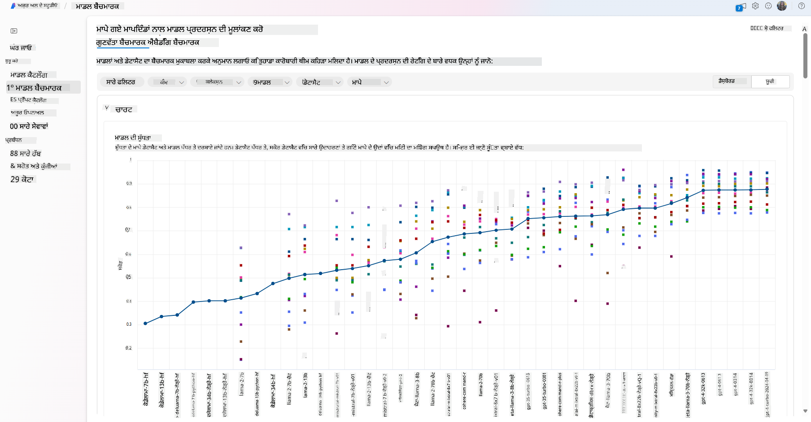
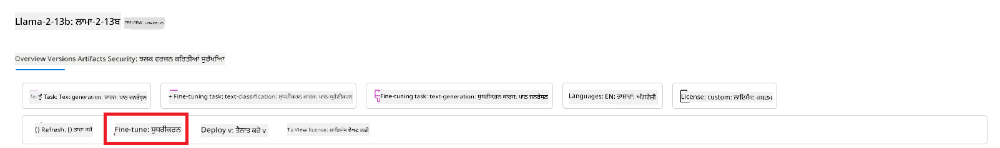
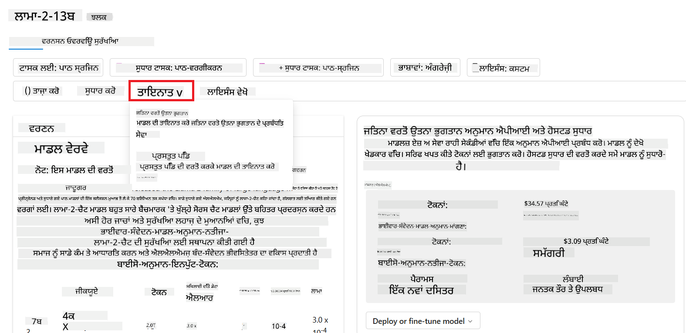
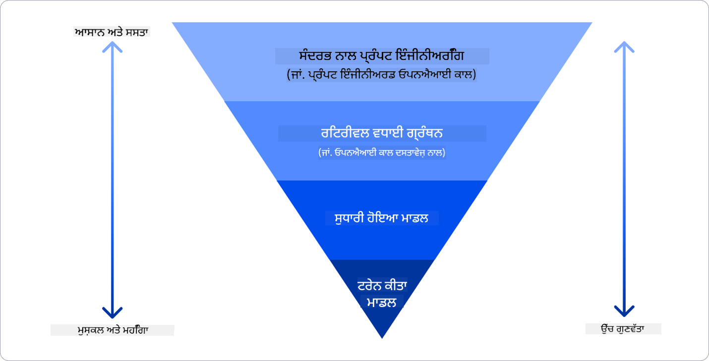

<!--
CO_OP_TRANSLATOR_METADATA:
{
  "original_hash": "e2f686f2eb794941761252ac5e8e090b",
  "translation_date": "2025-06-25T10:34:00+00:00",
  "source_file": "02-exploring-and-comparing-different-llms/README.md",
  "language_code": "pa"
}
-->
# ਵੱਖ-ਵੱਖ LLMs ਦੀ ਪੜਚੋਲ ਅਤੇ ਤੁਲਨਾ

> _ਉਪਰ ਦਿੱਤੀ ਤਸਵੀਰ 'ਤੇ ਕਲਿੱਕ ਕਰਕੇ ਇਸ ਪਾਠ ਦਾ ਵੀਡੀਓ ਵੇਖੋ_

ਪਿਛਲੇ ਪਾਠ ਨਾਲ, ਅਸੀਂ ਦੇਖਿਆ ਕਿ ਜਨਰੇਟਿਵ AI ਕਿਵੇਂ ਤਕਨਾਲੋਜੀ ਦ੍ਰਿਸ਼ ਨੂੰ ਬਦਲ ਰਿਹਾ ਹੈ, ਵੱਡੇ ਭਾਸ਼ਾ ਮਾਡਲ (LLMs) ਕਿਵੇਂ ਕੰਮ ਕਰਦੇ ਹਨ ਅਤੇ ਇੱਕ ਵਪਾਰ - ਜਿਵੇਂ ਸਾਡਾ ਸਟਾਰਟਅਪ - ਕਿਵੇਂ ਉਹਨਾਂ ਨੂੰ ਆਪਣੇ ਯੂਜ਼ ਕੇਸ 'ਤੇ ਲਾਗੂ ਕਰ ਸਕਦਾ ਹੈ ਅਤੇ ਵਧ ਸਕਦਾ ਹੈ! ਇਸ ਅਧਿਆਇ ਵਿੱਚ, ਅਸੀਂ ਵੱਖ-ਵੱਖ ਕਿਸਮ ਦੇ ਵੱਡੇ ਭਾਸ਼ਾ ਮਾਡਲਾਂ (LLMs) ਦੀ ਤੁਲਨਾ ਅਤੇ ਵਿਰੋਧ ਕਰ ਰਹੇ ਹਾਂ ਤਾਂ ਜੋ ਉਹਨਾਂ ਦੇ ਫਾਇਦੇ ਅਤੇ ਨੁਕਸਾਨ ਨੂੰ ਸਮਝ ਸਕੀਏ।

ਸਾਡੇ ਸਟਾਰਟਅਪ ਦੀ ਅਗਲੀ ਕਦਮ LLMs ਦੇ ਮੌਜੂਦਾ ਦ੍ਰਿਸ਼ ਨੂੰ ਖੋਜਣਾ ਅਤੇ ਸਮਝਣਾ ਹੈ ਕਿ ਕਿਹੜੇ ਸਾਡੇ ਯੂਜ਼ ਕੇਸ ਲਈ ਉਚਿਤ ਹਨ।

## ਪ੍ਰਸਤਾਵਨਾ

ਇਹ ਪਾਠ ਕਵਰ ਕਰੇਗਾ:

- ਮੌਜੂਦਾ ਦ੍ਰਿਸ਼ ਵਿੱਚ ਵੱਖ-ਵੱਖ ਕਿਸਮ ਦੇ LLMs।
- ਆਪਣੇ ਯੂਜ਼ ਕੇਸ ਲਈ ਅਜ਼ੂਰ ਵਿੱਚ ਵੱਖ-ਵੱਖ ਮਾਡਲਾਂ ਦੀ ਜਾਂਚ, ਦੁਹਰਾਈ ਅਤੇ ਤੁਲਨਾ।
- ਇੱਕ LLM ਨੂੰ ਕਿਵੇਂ ਤੈਨਾਤ ਕਰਨਾ ਹੈ।

## ਸਿੱਖਣ ਦੇ ਲਕਸ਼

ਇਹ ਪਾਠ ਪੂਰਾ ਕਰਨ ਦੇ ਬਾਅਦ, ਤੁਸੀਂ ਕਰਨ ਦੇ ਯੋਗ ਹੋਵੋਗੇ:

- ਆਪਣੇ ਯੂਜ਼ ਕੇਸ ਲਈ ਸਹੀ ਮਾਡਲ ਦੀ ਚੋਣ ਕਰੋ।
- ਸਮਝੋ ਕਿ ਆਪਣੇ ਮਾਡਲ ਦੀ ਕਾਰਗੁਜ਼ਾਰੀ ਦੀ ਜਾਂਚ, ਦੁਹਰਾਈ, ਅਤੇ ਸੁਧਾਰ ਕਿਵੇਂ ਕਰਨਾ ਹੈ।
- ਜਾਣੋ ਕਿ ਵਪਾਰ ਮਾਡਲਾਂ ਨੂੰ ਕਿਵੇਂ ਤੈਨਾਤ ਕਰਦੇ ਹਨ।

## ਵੱਖ-ਵੱਖ ਕਿਸਮ ਦੇ LLMs ਨੂੰ ਸਮਝੋ

LLMs ਨੂੰ ਉਹਨਾਂ ਦੀ ਆਰਕੀਟੈਕਚਰ, ਟ੍ਰੇਨਿੰਗ ਡੇਟਾ, ਅਤੇ ਯੂਜ਼ ਕੇਸ ਦੇ ਆਧਾਰ 'ਤੇ ਕਈ ਵੱਖ-ਵੱਖ ਸ਼੍ਰੇਣੀਆਂ ਵਿੱਚ ਵੰਡਿਆ ਜਾ ਸਕਦਾ ਹੈ। ਇਹ ਅੰਤਰਾਂ ਨੂੰ ਸਮਝਣ ਨਾਲ ਸਾਡਾ ਸਟਾਰਟਅਪ ਸਹੀ ਮਾਡਲ ਦੀ ਚੋਣ ਕਰ ਸਕੇਗਾ ਅਤੇ ਸਮਝ ਸਕੇਗਾ ਕਿ ਕਾਰਗੁਜ਼ਾਰੀ ਦੀ ਜਾਂਚ, ਦੁਹਰਾਈ, ਅਤੇ ਸੁਧਾਰ ਕਿਵੇਂ ਕਰਨਾ ਹੈ।

ਵੱਖ-ਵੱਖ ਕਿਸਮ ਦੇ LLM ਮਾਡਲ ਹਨ, ਤੁਹਾਡਾ ਮਾਡਲ ਦੀ ਚੋਣ ਇਸ 'ਤੇ ਨਿਰਭਰ ਕਰਦੀ ਹੈ ਕਿ ਤੁਸੀਂ ਉਹਨਾਂ ਨੂੰ ਕਿਸ ਲਈ ਵਰਤਣ ਦੀ ਯੋਜਨਾ ਬਣਾਉਂਦੇ ਹੋ, ਤੁਹਾਡਾ ਡੇਟਾ, ਤੁਸੀਂ ਕਿੰਨਾ ਖਰਚ ਕਰਨ ਲਈ ਤਿਆਰ ਹੋ ਅਤੇ ਹੋਰ ਵੀ।

ਜੇ ਤੁਸੀਂ ਮਾਡਲਾਂ ਨੂੰ ਟੈਕਸਟ, ਆਡੀਓ, ਵੀਡੀਓ, ਚਿੱਤਰ ਜਨਰੇਸ਼ਨ ਆਦਿ ਲਈ ਵਰਤਣ ਦੀ ਯੋਜਨਾ ਬਣਾਉਂਦੇ ਹੋ, ਤਾਂ ਤੁਸੀਂ ਇੱਕ ਵੱਖ-ਵੱਖ ਕਿਸਮ ਦੇ ਮਾਡਲ ਦੀ ਚੋਣ ਕਰ ਸਕਦੇ ਹੋ।

- **ਆਡੀਓ ਅਤੇ ਭਾਸ਼ਣ ਪਛਾਣ**। ਇਸ ਮਕਸਦ ਲਈ, ਵਿਸਪਰ-ਕਿਸਮ ਦੇ ਮਾਡਲ ਇੱਕ ਬਿਹਤਰ ਚੋਣ ਹਨ ਕਿਉਂਕਿ ਉਹ ਜਨਰਲ-ਪ੍ਰਯੋਗ ਹਨ ਅਤੇ ਭਾਸ਼ਣ ਪਛਾਣ 'ਤੇ ਧਿਆਨ ਦੇ ਰਹੇ ਹਨ। ਇਹ ਵਿਵਿਧ ਆਡੀਓ 'ਤੇ ਟ੍ਰੇਨ ਕੀਤਾ ਜਾਂਦਾ ਹੈ ਅਤੇ ਬਹੁ-ਭਾਸ਼ਾਈ ਭਾਸ਼ਣ ਪਛਾਣ ਕਰ ਸਕਦਾ ਹੈ। [ਵਿਸਪਰ ਕਿਸਮ ਦੇ ਮਾਡਲਾਂ ਬਾਰੇ ਹੋਰ ਜਾਣੋ](https://platform.openai.com/docs/models/whisper?WT.mc_id=academic-105485-koreyst)।

- **ਚਿੱਤਰ ਜਨਰੇਸ਼ਨ**। ਚਿੱਤਰ ਜਨਰੇਸ਼ਨ ਲਈ, DALL-E ਅਤੇ ਮਿਡਜਰਨੀ ਦੋ ਬਹੁਤ ਹੀ ਪ੍ਰਸਿੱਧ ਚੋਣਾਂ ਹਨ। DALL-E ਅਜ਼ੂਰ ਓਪਨ AI ਦੁਆਰਾ ਪੇਸ਼ ਕੀਤਾ ਜਾਂਦਾ ਹੈ। [DALL-E ਬਾਰੇ ਹੋਰ ਪੜ੍ਹੋ](https://platform.openai.com/docs/models/dall-e?WT.mc_id=academic-105485-koreyst) ਅਤੇ ਇਸ ਪਾਠਕ੍ਰਮ ਦੇ ਅਧਿਆਇ 9 ਵਿੱਚ ਵੀ।

- **ਟੈਕਸਟ ਜਨਰੇਸ਼ਨ**। ਬਹੁਤ ਸਾਰੇ ਮਾਡਲ ਟੈਕਸਟ ਜਨਰੇਸ਼ਨ 'ਤੇ ਟ੍ਰੇਨ ਕੀਤੇ ਜਾਂਦੇ ਹਨ ਅਤੇ ਤੁਹਾਡੇ ਕੋਲ GPT-3.5 ਤੋਂ GPT-4 ਤੱਕ ਦੀਆਂ ਬਹੁਤ ਸਾਰੀਆਂ ਚੋਣਾਂ ਹਨ। ਉਹ ਵੱਖ-ਵੱਖ ਲਾਗਤਾਂ 'ਤੇ ਆਉਂਦੇ ਹਨ ਜਿਨ੍ਹਾਂ ਵਿੱਚ GPT-4 ਸਭ ਤੋਂ ਮਹਿੰਗਾ ਹੈ। [ਅਜ਼ੂਰ ਓਪਨ AI ਪਲੇਗ੍ਰਾਊਂਡ](https://oai.azure.com/portal/playground?WT.mc_id=academic-105485-koreyst) ਵਿੱਚ ਵੇਖਣਾ ਫਾਇਦੇਮੰਦ ਹੈ ਕਿ ਕਿਹੜੇ ਮਾਡਲ ਸਮਰਥਾ ਅਤੇ ਲਾਗਤ ਦੇ ਦ੍ਰਿਸ਼ ਤੋਂ ਤੁਹਾਡੀਆਂ ਜ਼ਰੂਰਤਾਂ ਲਈ ਸਭ ਤੋਂ ਵਧੀਆ ਸੂਟ ਕਰਦੇ ਹਨ।

- **ਮਲਟੀ-ਮੋਡੈਲਿਟੀ**। ਜੇ ਤੁਸੀਂ ਇਨਪੁੱਟ ਅਤੇ ਆਉਟਪੁੱਟ ਵਿੱਚ ਕਈ ਕਿਸਮਾਂ ਦੇ ਡੇਟਾ ਨਾਲ ਨਜਿੱਠਣ ਦੀ ਯੋਜਨਾ ਬਣਾਉਂਦੇ ਹੋ, ਤਾਂ ਤੁਸੀਂ [gpt-4 turbo with vision or gpt-4o](https://learn.microsoft.com/azure/ai-services/openai/concepts/models#gpt-4-and-gpt-4-turbo-models?WT.mc_id=academic-105485-koreyst) ਵਰਗੇ ਮਾਡਲਾਂ 'ਤੇ ਵਿਚਾਰ ਕਰ ਸਕਦੇ ਹੋ - ਓਪਨ AI ਮਾਡਲਾਂ ਦੇ ਤਾਜ਼ਾ ਰਿਲੀਜ਼ - ਜੋ ਦ੍ਰਿਸ਼ ਸਮਝਣ ਲਈ ਕੁਦਰਤੀ ਭਾਸ਼ਾ ਪ੍ਰਕਿਰਿਆ ਨੂੰ ਜੋੜਨ ਦੇ ਯੋਗ ਹਨ, ਮਲਟੀ-ਮੋਡਲ ਇੰਟਰਫੇਸਾਂ ਦੁਆਰਾ ਅੰਤਰਕਿਰਿਆ ਨੂੰ ਯੋਗ ਬਣਾਉਂਦੇ ਹਨ।

ਮਾਡਲ ਦੀ ਚੋਣ ਕਰਨ ਦਾ ਮਤਲਬ ਹੈ ਕਿ ਤੁਸੀਂ ਕੁਝ ਬੁਨਿਆਦੀ ਸਮਰਥਾ ਪ੍ਰਾਪਤ ਕਰਦੇ ਹੋ, ਜੋ ਹਾਲਾਂਕਿ ਕਾਫ਼ੀ ਨਹੀਂ ਹੋ ਸਕਦਾ। ਅਕਸਰ ਤੁਹਾਡੇ ਕੋਲ ਕੰਪਨੀ ਵਿਸ਼ੇਸ਼ ਡੇਟਾ ਹੁੰਦਾ ਹੈ ਜਿਸ ਬਾਰੇ ਤੁਹਾਨੂੰ ਕਿਸੇ ਤਰੀਕੇ ਨਾਲ LLM ਨੂੰ ਦੱਸਣ ਦੀ ਜ਼ਰੂਰਤ ਹੁੰਦੀ ਹੈ। ਇਸ ਨੂੰ ਹੱਲ ਕਰਨ ਦੇ ਕਈ ਵੱਖ-ਵੱਖ ਵਿਕਲਪ ਹਨ, ਇਸ ਬਾਰੇ ਹੋਰ ਜਾਣਕਾਰੀ ਅਗਲੇ ਭਾਗਾਂ ਵਿੱਚ।

### ਫਾਊਂਡੇਸ਼ਨ ਮਾਡਲਜ਼ ਬਨਾਮ LLMs

ਫਾਊਂਡੇਸ਼ਨ ਮਾਡਲ ਦੀ ਸ਼ਬਦਾਵਲੀ [ਸਟੈਨਫੋਰਡ ਖੋਜਕਰਤਿਆਂ ਦੁਆਰਾ](https://arxiv.org/abs/2108.07258?WT.mc_id=academic-105485-koreyst) ਇਜਾਦ ਕੀਤੀ ਗਈ ਸੀ ਅਤੇ ਇੱਕ AI ਮਾਡਲ ਦੇ ਤੌਰ 'ਤੇ ਪਰਿਭਾਸ਼ਿਤ ਕੀਤਾ ਗਿਆ ਸੀ ਜੋ ਕੁਝ ਮਾਪਦੰਡਾਂ ਦੀ ਪਾਲਣਾ ਕਰਦਾ ਹੈ, ਜਿਵੇਂ:

- **ਉਹ ਅਨਸੁਪਰਵਾਈਜ਼ਡ ਲਰਨਿੰਗ ਜਾਂ ਸਵੈ-ਸੁਪਰਵਾਈਜ਼ਡ ਲਰਨਿੰਗ ਦੀ ਵਰਤੋਂ ਕਰਕੇ ਟ੍ਰੇਨ ਕੀਤੇ ਜਾਂਦੇ ਹਨ**, ਜਿਸਦਾ ਮਤਲਬ ਹੈ ਕਿ ਉਹ ਅਨਲੇਬਲਡ ਮਲਟੀ-ਮੋਡਲ ਡੇਟਾ 'ਤੇ ਟ੍ਰੇਨ ਕੀਤੇ ਜਾਂਦੇ ਹਨ, ਅਤੇ ਉਹਨਾਂ ਦੇ ਟ੍ਰੇਨਿੰਗ ਪ੍ਰਕਿਰਿਆ ਲਈ ਮਨੁੱਖੀ ਐਨੋਟੇਸ਼ਨ ਜਾਂ ਡੇਟਾ ਦੀ ਲੇਬਲਿੰਗ ਦੀ ਜ਼ਰੂਰਤ ਨਹੀਂ ਹੁੰਦੀ।
- **ਉਹ ਬਹੁਤ ਵੱਡੇ ਮਾਡਲ ਹਨ**, ਬਹੁਤ ਗਹਿਰੇ ਨਿਊਰਲ ਨੈਟਵਰਕਾਂ 'ਤੇ ਅਧਾਰਿਤ ਹਨ ਜੋ ਅਰਬਾਂ ਪੈਰਾਮੀਟਰਾਂ 'ਤੇ ਟ੍ਰੇਨ ਕੀਤੇ ਜਾਂਦੇ ਹਨ।
- **ਉਹ ਆਮ ਤੌਰ 'ਤੇ ਹੋਰ ਮਾਡਲਾਂ ਲਈ 'ਫਾਊਂਡੇਸ਼ਨ' ਵਜੋਂ ਕੰਮ ਕਰਨ ਲਈ ਤਿਆਰ ਕੀਤੇ ਜਾਂਦੇ ਹਨ**, ਜਿਸਦਾ ਮਤਲਬ ਹੈ ਕਿ ਉਹ ਹੋਰ ਮਾਡਲਾਂ ਨੂੰ ਉਸ ਦੇ ਉਪਰ ਬਣਾਉਣ ਲਈ ਇੱਕ ਸ਼ੁਰੂਆਤੀ ਬਿੰਦੂ ਵਜੋਂ ਵਰਤੇ ਜਾ ਸਕਦੇ ਹਨ, ਜੋ ਸੁਖ-ਸੁਧਾਰ ਦੁਆਰਾ ਕੀਤਾ ਜਾ ਸਕਦਾ ਹੈ।

ਇਸ ਫਰਕ ਨੂੰ ਹੋਰ ਸਪਸ਼ਟ ਕਰਨ ਲਈ, ਆਓ ਚੈਟGPT ਨੂੰ ਇੱਕ ਉਦਾਹਰਨ ਵਜੋਂ ਲੈਈਏ। ਚੈਟGPT ਦੇ ਪਹਿਲੇ ਵਰਜਨ ਨੂੰ ਬਣਾਉਣ ਲਈ, GPT-3.5 ਮਾਡਲ ਨੇ ਫਾਊਂਡੇਸ਼ਨ ਮਾਡਲ ਵਜੋਂ ਕੰਮ ਕੀਤਾ। ਇਸਦਾ ਮਤਲਬ ਹੈ ਕਿ ਓਪਨAI ਨੇ ਕੁਝ ਚੈਟ-ਵਿਸ਼ੇਸ਼ ਡੇਟਾ ਦੀ ਵਰਤੋਂ ਕੀਤੀ ਤਾਂ ਜੋ GPT-3.5 ਦਾ ਇੱਕ ਟਿਊਨ ਕੀਤਾ ਵਰਜਨ ਬਣਾਇਆ ਜਾਵੇ ਜੋ ਚੈਟਬੋਟਸ ਜਿਵੇਂ ਗੱਲਬਾਤੀ ਸਥਿਤੀਆਂ ਵਿੱਚ ਚੰਗਾ ਪ੍ਰਦਰਸ਼ਨ ਕਰਨ ਵਿੱਚ ਮਾਹਰ ਸੀ।

### ਖੁੱਲ੍ਹਾ ਸ੍ਰੋਤ ਬਨਾਮ ਮਾਲਿਕੀ ਮਾਡਲ

LLMs ਨੂੰ ਇਸ 'ਤੇ ਵੀ ਵੰਡਿਆ ਜਾ ਸਕਦਾ ਹੈ ਕਿ ਉਹ ਖੁੱਲ੍ਹਾ ਸ੍ਰੋਤ ਹਨ ਜਾਂ ਮਾਲਿਕੀ।

ਖੁੱਲ੍ਹੇ-ਸ੍ਰੋਤ ਮਾਡਲ ਉਹ ਮਾਡਲ ਹਨ ਜੋ ਜਨਤਕ ਲਈ ਉਪਲਬਧ ਕੀਤੇ ਜਾਂਦੇ ਹਨ ਅਤੇ ਕਿਸੇ ਵੀ ਵੱਲੋਂ ਵਰਤੇ ਜਾ ਸਕਦੇ ਹਨ। ਉਹ ਅਕਸਰ ਉਹਨਾਂ ਦੀ ਬਣਾਉਣ ਵਾਲੀ ਕੰਪਨੀ ਦੁਆਰਾ, ਜਾਂ ਖੋਜਕਰਤਾ ਸਮੁਦਾਇ ਦੁਆਰਾ ਉਪਲਬਧ ਕਰਵਾਏ ਜਾਂਦੇ ਹਨ। ਇਹ ਮਾਡਲਾਂ ਨੂੰ LLMs ਵਿੱਚ ਵੱਖ-ਵੱਖ ਯੂਜ਼ ਕੇਸਾਂ ਲਈ ਜਾਂਚਿਆ, ਸੋਧਿਆ ਅਤੇ ਕਸਟਮਾਈਜ਼ ਕੀਤਾ ਜਾ ਸਕਦਾ ਹੈ। ਹਾਲਾਂਕਿ, ਉਹ ਹਮੇਸ਼ਾਂ ਉਤਪਾਦਨ ਵਰਤੋਂ ਲਈ ਅਨੁਕੂਲਿਤ ਨਹੀਂ ਹੁੰਦੇ, ਅਤੇ ਮਾਲਿਕੀ ਮਾਡਲਾਂ ਜਿੰਨਾ ਪ੍ਰਦਰਸ਼ਨਸ਼ੀਲ ਨਹੀਂ ਹੋ ਸਕਦੇ। ਇਸ ਤੋਂ ਇਲਾਵਾ, ਖੁੱਲ੍ਹੇ-ਸ੍ਰੋਤ ਮਾਡਲਾਂ ਲਈ ਫੰਡਿੰਗ ਸੀਮਤ ਹੋ ਸਕਦੀ ਹੈ, ਅਤੇ ਉਹ ਲੰਬੇ ਸਮੇਂ ਤੱਕ ਸੰਭਾਲੇ ਨਹੀਂ ਜਾ ਸਕਦੇ ਜਾਂ ਉਨ੍ਹਾਂ ਨੂੰ ਤਾਜ਼ਾ ਖੋਜ ਨਾਲ ਅਪਡੇਟ ਨਹੀਂ ਕੀਤਾ ਜਾ ਸਕਦਾ। ਪ੍ਰਸਿੱਧ ਖੁੱਲ੍ਹੇ ਸ੍ਰੋਤ ਮਾਡਲਾਂ ਦੇ ਉਦਾਹਰਨਾਂ ਵਿੱਚ [Alpaca](https://crfm.stanford.edu/2023/03/13/alpaca.html?WT.mc_id=academic-105485-koreyst), [Bloom](https://huggingface.co/bigscience/bloom) ਅਤੇ [LLaMA](https://llama.meta.com) ਸ਼ਾਮਲ ਹਨ।

ਮਾਲਿਕੀ ਮਾਡਲ ਉਹ ਮਾਡਲ ਹਨ ਜੋ ਕਿਸੇ ਕੰਪਨੀ ਦੁਆਰਾ ਮਾਲਿਕੀਤ ਹੁੰਦੇ ਹਨ ਅਤੇ ਜਨਤਕ ਲਈ ਉਪਲਬਧ ਨਹੀਂ ਕੀਤੇ ਜਾਂਦੇ। ਇਹ ਮਾਡਲ ਅਕਸਰ ਉਤਪਾਦਨ ਵਰਤੋਂ ਲਈ ਅਨੁਕੂਲਿਤ ਹੁੰਦੇ ਹਨ। ਹਾਲਾਂਕਿ, ਉਹਨਾਂ ਨੂੰ ਵੱਖ-ਵੱਖ ਯੂਜ਼ ਕੇਸਾਂ ਲਈ ਜਾਂਚਿਆ, ਸੋਧਿਆ ਜਾਂ ਕਸਟਮਾਈਜ਼ ਨਹੀਂ ਕੀਤਾ ਜਾ ਸਕਦਾ। ਇਸ ਤੋਂ ਇਲਾਵਾ, ਉਹ ਹਮੇਸ਼ਾਂ ਮੁਫ਼ਤ ਉਪਲਬਧ ਨਹੀਂ ਹੁੰਦੇ, ਅਤੇ ਉਹਨਾਂ ਨੂੰ ਵਰਤਣ ਲਈ ਸਬਸਕ੍ਰਿਪਸ਼ਨ ਜਾਂ ਭੁਗਤਾਨ ਦੀ ਜ਼ਰੂਰਤ ਹੋ ਸਕਦੀ ਹੈ। ਇਸ ਤੋਂ ਇਲਾਵਾ, ਉਪਭੋਗਤਾਵਾਂ ਕੋਲ ਉਹ ਡੇਟਾ ਨਹੀਂ ਹੁੰਦਾ ਜੋ ਮਾਡਲ ਨੂੰ ਟ੍ਰੇਨ ਕਰਨ ਲਈ ਵਰਤਿਆ ਜਾਂਦਾ ਹੈ, ਜਿਸਦਾ ਮਤਲਬ ਹੈ ਕਿ ਉਹ ਡੇਟਾ ਗੋਪਨੀਯਤਾ ਅਤੇ AI ਦੀ ਜ਼ਿੰਮੇਵਾਰ ਵਰਤੋਂ ਨੂੰ ਯਕੀਨੀ ਬਣਾਉਣ ਦੇ ਪ੍ਰਤੀਬੱਧਤਾ ਦੇ ਨਾਲ ਮਾਡਲ ਮਾਲਕ 'ਤੇ ਭਰੋਸਾ ਕਰਦੇ ਹਨ। ਪ੍ਰਸਿੱਧ ਮਾਲਿਕੀ ਮਾਡਲਾਂ ਦੇ ਉਦਾਹਰਨਾਂ ਵਿੱਚ [OpenAI ਮਾਡਲ](https://platform.openai.com/docs/models/overview?WT.mc_id=academic-105485-koreyst), [Google Bard](https://sapling.ai/llm/bard?WT.mc_id=academic-105485-koreyst) ਜਾਂ [Claude 2](https://www.anthropic.com/index/claude-2?WT.mc_id=academic-105485-koreyst) ਸ਼ਾਮਲ ਹਨ।

### ਇੰਬੈਡਿੰਗ ਬਨਾਮ ਚਿੱਤਰ ਜਨਰੇਸ਼ਨ ਬਨਾਮ ਟੈਕਸਟ ਅਤੇ ਕੋਡ ਜਨਰੇਸ਼ਨ

LLMs ਨੂੰ ਉਹਨਾਂ ਦੇ ਆਉਟਪੁੱਟ ਦੁਆਰਾ ਵੀ ਵੰਡਿਆ ਜਾ ਸਕਦਾ ਹੈ ਜੋ ਉਹ ਜਨਰੇਟ ਕਰਦੇ ਹਨ।

ਇੰਬੈਡਿੰਗ ਉਹ ਮਾਡਲਾਂ ਦਾ ਸੈੱਟ ਹੈ ਜੋ ਟੈਕਸਟ ਨੂੰ ਇੱਕ ਸੰਖਿਆਤਮਕ ਰੂਪ ਵਿੱਚ ਬਦਲ ਸਕਦੇ ਹਨ, ਜਿਸਨੂੰ ਇੰਬੈਡਿੰਗ ਕਿਹਾ ਜਾਂਦਾ ਹੈ, ਜੋ ਇਨਪੁੱਟ ਟੈਕਸਟ ਦੀ ਸੰਖਿਆਤਮਕ ਪ੍ਰਤੀਨਿਧਤਾ ਹੈ। ਇੰਬੈਡਿੰਗ ਮਸ਼ੀਨਾਂ ਲਈ ਸ਼ਬਦਾਂ ਜਾਂ ਵਾਕਾਂਸ਼ਾਂ ਦੇ ਰਿਸ਼ਤੇ ਨੂੰ ਸਮਝਣਾ ਆਸਾਨ ਬਣਾਉਂਦੇ ਹਨ ਅਤੇ ਉਹਨਾਂ ਨੂੰ ਹੋਰ ਮਾਡਲਾਂ ਦੁਆਰਾ ਇਨਪੁੱਟ ਵਜੋਂ ਖਪਤ ਕੀਤਾ ਜਾ ਸਕਦਾ ਹੈ, ਜਿਵੇਂ ਕਿ ਵਰਗੀਕਰਨ ਮਾਡਲ, ਜਾਂ ਕਲਸਟਰਿੰਗ ਮਾਡਲ ਜੋ ਸੰਖਿਆਤਮਕ ਡੇਟਾ 'ਤੇ ਚੰਗਾ ਪ੍ਰਦਰਸ਼ਨ ਕਰਦੇ ਹਨ। ਇੰਬੈਡਿੰਗ ਮਾਡਲ ਅਕਸਰ ਟ੍ਰਾਂਸਫਰ ਲਰਨਿੰਗ ਲਈ ਵਰਤੇ ਜਾਂਦੇ ਹਨ, ਜਿੱਥੇ ਇੱਕ ਮਾਡਲ ਇੱਕ ਸਰੋਗੇਟ ਟਾਸਕ ਲਈ ਬਣਾਇਆ ਜਾਂਦਾ ਹੈ ਜਿਸ ਲਈ ਬਹੁਤ ਸਾਰਾ ਡੇਟਾ ਹੁੰਦਾ ਹੈ, ਅਤੇ ਫਿਰ ਮਾਡਲ ਵਜ਼ਨ (ਇੰਬੈਡਿੰਗ) ਹੋਰ ਡਾਊਨਸਟ੍ਰੀਮ ਟਾਸਕਾਂ ਲਈ ਦੁਬਾਰਾ ਵਰਤੇ ਜਾਂਦੇ ਹਨ। ਇਸ ਸ਼੍ਰੇਣੀ ਦਾ ਇੱਕ ਉਦਾਹਰਨ [OpenAI ਇੰਬੈਡਿੰਗ](https://platform.openai.com/docs/models/embeddings?WT.mc_id=academic-105485-koreyst) ਹੈ।

ਚਿੱਤਰ ਜਨਰੇਸ਼ਨ ਮਾਡਲ ਉਹ ਮਾਡਲ ਹਨ ਜੋ ਚਿੱਤਰਾਂ ਨੂੰ ਜਨਰੇਟ ਕਰਦੇ ਹਨ। ਇਹ ਮਾਡਲ ਅਕਸਰ ਚਿੱਤਰ ਸੰਪਾਦਨ, ਚਿੱਤਰ ਸੰਸ਼ਲੇਸ਼ਣ, ਅਤੇ ਚਿੱਤਰ ਅਨੁਵਾਦ ਲਈ ਵਰਤੇ ਜਾਂਦੇ ਹਨ। ਚਿੱਤਰ ਜਨਰੇਸ਼ਨ ਮਾਡਲ ਅਕਸਰ ਚਿੱਤਰਾਂ ਦੇ ਵੱਡੇ ਡੇਟਾਸੈਟਾਂ 'ਤੇ ਟ੍ਰੇਨ ਕੀਤੇ ਜਾਂਦੇ ਹਨ, ਜਿਵੇਂ ਕਿ [LAION-5B](https://laion.ai/blog/laion-5b/?WT.mc_id=academic-105485-koreyst), ਅਤੇ ਨਵੇਂ ਚਿੱਤਰਾਂ ਨੂੰ ਜਨਰੇਟ ਕਰਨ ਜਾਂ ਮੌਜੂਦਾ ਚਿੱਤਰਾਂ ਨੂੰ ਇੰਪੈਂਟਿੰਗ, ਸਪਰ-ਰਿਜ਼ੋਲੂਸ਼ਨ, ਅਤੇ ਰੰਗਕਰਨ ਤਕਨੀਕਾਂ ਨਾਲ ਸੰਪਾਦਨ ਕਰਨ ਲਈ ਵਰਤੇ ਜਾ ਸਕਦੇ ਹਨ। ਉਦਾਹਰਨਾਂ ਵਿੱਚ [DALL-E-3](https://openai.com/dall-e-3?WT.mc_id=academic-105485-koreyst) ਅਤੇ [Stable Diffusion ਮਾਡਲ](https://github.com/Stability-AI/StableDiffusion?WT.mc_id=academic-105485-koreyst) ਸ਼ਾਮਲ ਹਨ।

ਟੈਕਸਟ ਅਤੇ ਕੋਡ ਜਨਰੇਸ਼ਨ ਮਾਡਲ ਉਹ ਮਾਡਲ ਹਨ ਜੋ ਟੈਕਸਟ ਜਾਂ ਕੋਡ ਜਨਰੇਟ ਕਰਦੇ ਹਨ। ਇਹ ਮਾਡਲ ਅਕਸਰ ਟੈਕਸਟ ਸੰਖੇਪ, ਅਨੁਵਾਦ, ਅਤੇ ਪ੍ਰਸ਼ਨ ਉੱਤਰ ਦੇਣ ਲਈ ਵਰਤੇ ਜਾਂਦੇ ਹਨ। ਟੈਕਸਟ ਜਨਰੇਸ਼ਨ ਮਾਡਲ ਅਕਸਰ ਟੈਕਸਟ ਦੇ ਵੱਡੇ ਡੇਟਾਸੈਟਾਂ 'ਤੇ ਟ੍ਰੇਨ ਕੀਤੇ ਜਾਂਦੇ ਹਨ, ਜਿਵੇਂ ਕਿ [BookCorpus](https://www.cv-foundation.org/openaccess/content_iccv_2015/html/Zhu_Aligning_Books_and_ICCV_2015_paper.html?WT.mc_id=academic-105485-koreyst), ਅਤੇ ਨਵਾਂ ਟੈਕਸਟ ਜਨਰੇਟ ਕਰਨ ਲਈ, ਜਾਂ ਪ੍ਰਸ਼ਨਾਂ ਦੇ ਜਵਾਬ ਦੇਣ ਲਈ ਵਰਤੇ ਜਾ ਸਕਦੇ ਹਨ। ਕੋਡ ਜਨਰੇਸ਼ਨ ਮਾਡਲ, ਜਿਵੇਂ [CodeParrot](https://huggingface.co/codeparrot?WT.mc_id=academic-105485-koreyst), ਅਕਸਰ ਕੋਡ ਦੇ ਵੱਡੇ ਡੇਟਾਸੈਟਾਂ 'ਤੇ ਟ੍ਰੇਨ ਕੀਤੇ ਜਾਂਦੇ ਹਨ, ਜਿਵੇਂ ਕਿ GitHub, ਅਤੇ ਨਵਾਂ ਕੋਡ ਜਨਰੇਟ ਕਰਨ ਲਈ, ਜਾਂ ਮੌਜੂਦਾ ਕੋਡ ਵਿੱਚ ਗਲਤੀਆਂ ਠੀਕ ਕਰਨ ਲਈ ਵਰਤੇ ਜਾ ਸਕਦੇ ਹਨ।

### ਇਨਕੋਡਰ-ਡੀਕੋਡਰ ਬਨਾਮ ਕੇਵਲ ਡੀਕੋਡਰ

LLMs ਦੀਆਂ ਵੱਖ-ਵੱਖ ਕਿਸਮਾਂ
- ਉਦਯੋਗ ਵਿੱਚ ਉਪਲਬਧ ਮਾਡਲਾਂ ਅਤੇ ਡੇਟਾਸੈਟਾਂ 'ਤੇ ਬੈਂਚਮਾਰਕਾਂ ਦੀ ਤੁਲਨਾ ਕਰੋ ਤਾਂ ਜੋ ਵੇਖਿਆ ਜਾ ਸਕੇ ਕਿ ਕਿਹੜਾ ਵਪਾਰਕ ਦ੍ਰਿਸ਼ ਨੂੰ ਪੂਰਾ ਕਰਦਾ ਹੈ, [Model Benchmarks](https://learn.microsoft.com/azure/ai-studio/how-to/model-benchmarks?WT.mc_id=academic-105485-koreyst) ਪੈਨ ਦੁਆਰਾ।

- ਮਾਡਲ ਦੀ ਕਾਰਗੁਜ਼ਾਰੀ ਨੂੰ ਖਾਸ ਕੰਮ ਵਿੱਚ ਸੁਧਾਰਨ ਲਈ ਕਸਟਮ ਟ੍ਰੇਨਿੰਗ ਡੇਟਾ 'ਤੇ ਮਾਡਲ ਨੂੰ ਬਰੀਕ-ਤਰੀਕ ਕਰੋ, Azure AI Studio ਦੇ ਪ੍ਰਯੋਗ ਅਤੇ ਟ੍ਰੈਕਿੰਗ ਸਮਰਥਨ ਦਾ ਲਾਭ ਲੈ ਕੇ।

- ਅਸਲੀ ਪਹਿਲਾਂ ਤੋਂ ਸਿਖਾਇਆ ਮਾਡਲ ਜਾਂ ਬਰੀਕ-ਤਰੀਕ ਕੀਤਾ ਸੰਸਕਰਣ ਨੂੰ ਰਿਮੋਟ ਰੀਅਲ ਟਾਈਮ ਇਨਫਰੰਸ - ਪ੍ਰਬੰਧਿਤ ਕੰਪਿਊਟ - ਜਾਂ ਸਰਵਰਲੈਸ API ਐਂਡਪਾਇੰਟ - [pay-as-you-go](https://learn.microsoft.com/azure/ai-studio/how-to/model-catalog-overview#model-deployment-managed-compute-and-serverless-api-pay-as-you-go?WT.mc_id=academic-105485-koreyst) - 'ਤੇ ਡਿਪਲਾਇ ਕਰੋ ਤਾਂ ਜੋ ਐਪਲੀਕੇਸ਼ਨਾਂ ਨੂੰ ਇਸਨੂੰ ਵਰਤਣ ਲਈ ਯੋਗ ਬਣਾਇਆ ਜਾ ਸਕੇ।

> [!NOTE]
> ਕੈਟਾਲਾਗ ਵਿੱਚ ਸਾਰੇ ਮਾਡਲ ਇਸ ਵੇਲੇ ਬਰੀਕ-ਤਰੀਕ ਕਰਨ ਅਤੇ/ਜਾਂ pay-as-you-go ਡਿਪਲਾਇਮੈਂਟ ਲਈ ਉਪਲਬਧ ਨਹੀਂ ਹਨ। ਮਾਡਲ ਦੇ ਸਮਰਥਨ ਅਤੇ ਸੀਮਾਵਾਂ ਦੇ ਵਿਸਤਾਰ ਲਈ ਮਾਡਲ ਕਾਰਡ ਦੀ ਜਾਂਚ ਕਰੋ।

## LLM ਨਤੀਜਿਆਂ ਨੂੰ ਸੁਧਾਰਨਾ

ਅਸੀਂ ਆਪਣੇ ਸਟਾਰਟਅਪ ਟੀਮ ਨਾਲ ਵੱਖ-ਵੱਖ ਕਿਸਮ ਦੇ LLMs ਅਤੇ ਇੱਕ ਕਲਾਊਡ ਪਲੇਟਫਾਰਮ (Azure Machine Learning) ਦਾ ਅਧਿਐਨ ਕੀਤਾ ਹੈ, ਜੋ ਸਾਨੂੰ ਵੱਖ-ਵੱਖ ਮਾਡਲਾਂ ਦੀ ਤੁਲਨਾ ਕਰਨ, ਉਨ੍ਹਾਂ ਨੂੰ ਟੈਸਟ ਡੇਟਾ 'ਤੇ ਅਨੁਮਾਨਿਤ ਕਰਨ, ਕਾਰਗੁਜ਼ਾਰੀ ਸੁਧਾਰਨ ਅਤੇ ਉਨ੍ਹਾਂ ਨੂੰ ਇਨਫਰੰਸ ਐਂਡਪਾਇੰਟਾਂ 'ਤੇ ਡਿਪਲਾਇ ਕਰਨ ਦੀ ਯੋਗਤਾ ਦਿੰਦਾ ਹੈ।

ਪਰ ਉਹਨਾਂ ਨੂੰ ਪਹਿਲਾਂ ਤੋਂ ਸਿਖਾਇਆ ਮਾਡਲ ਵਰਤਣ ਦੇ ਬਜਾਏ ਕਦੋਂ ਮਾਡਲ ਨੂੰ ਬਰੀਕ-ਤਰੀਕ ਕਰਨ 'ਤੇ ਵਿਚਾਰ ਕਰਨਾ ਚਾਹੀਦਾ ਹੈ? ਕੀ ਖਾਸ ਕੰਮਾਂ 'ਤੇ ਮਾਡਲ ਦੀ ਕਾਰਗੁਜ਼ਾਰੀ ਸੁਧਾਰਨ ਲਈ ਹੋਰ ਪਹੁੰਚਾਂ ਹਨ?

ਕਈ ਪਹੁੰਚਾਂ ਹਨ ਜੋ ਇੱਕ ਵਪਾਰ LLM ਤੋਂ ਉਹ ਨਤੀਜੇ ਪ੍ਰਾਪਤ ਕਰਨ ਲਈ ਵਰਤ ਸਕਦਾ ਹੈ। ਤੁਸੀਂ ਵੱਖ-ਵੱਖ ਤਰ੍ਹਾਂ ਦੇ ਮਾਡਲ ਚੁਣ ਸਕਦੇ ਹੋ ਜਿਨ੍ਹਾਂ ਦੀ ਸਿਖਲਾਈ ਵੱਖ-ਵੱਖ ਡਿਗਰੀ 'ਤੇ ਕੀਤੀ ਗਈ ਹੈ ਜਦੋਂ LLM ਨੂੰ ਉਤਪਾਦਨ ਵਿੱਚ ਡਿਪਲਾਇ ਕਰਨਾ ਹੈ, ਜਿਨ੍ਹਾਂ ਵਿੱਚ ਵੱਖ-ਵੱਖ ਪੇਚੀਦਗੀ, ਲਾਗਤ ਅਤੇ ਗੁਣਵੱਤਾ ਦੇ ਪੱਧਰ ਹਨ। ਇੱਥੇ ਕੁਝ ਵੱਖ-ਵੱਖ ਪਹੁੰਚਾਂ ਹਨ:

- **ਕੰਟੈਕਸਟ ਨਾਲ ਪ੍ਰੋੰਪਟ ਇੰਜੀਨੀਅਰਿੰਗ**. ਵਿਚਾਰ ਇਹ ਹੈ ਕਿ ਜਦੋਂ ਤੁਸੀਂ ਪ੍ਰੋੰਪਟ ਕਰਦੇ ਹੋ ਤਾਂ ਤੁਹਾਨੂੰ ਜਰੂਰੀ ਜਵਾਬ ਪ੍ਰਾਪਤ ਕਰਨ ਲਈ ਕਾਫ਼ੀ ਕੰਟੈਕਸਟ ਪ੍ਰਦਾਨ ਕੀਤਾ ਜਾਵੇ।

- **ਰੀਟ੍ਰੀਵਲ ਆਗਮੈਂਟਡ ਜਨਰੇਸ਼ਨ, RAG**. ਤੁਹਾਡੇ ਡੇਟਾ ਦਾ ਮੌਜੂਦਗੀ ਇੱਕ ਡਾਟਾਬੇਸ ਜਾਂ ਵੈੱਬ ਐਂਡਪਾਇੰਟ ਵਿੱਚ ਹੋ ਸਕਦਾ ਹੈ ਉਦਾਹਰਣ ਲਈ, ਇਸ ਡੇਟਾ ਜਾਂ ਇਸ ਦਾ ਇੱਕ ਉਪਸੈੱਟ ਪ੍ਰੋੰਪਟ ਕਰਨ ਦੇ ਸਮੇਂ ਸ਼ਾਮਿਲ ਕੀਤਾ ਜਾਵੇ, ਤੁਸੀਂ ਸਬੰਧਤ ਡੇਟਾ ਨੂੰ ਪ੍ਰਾਪਤ ਕਰ ਸਕਦੇ ਹੋ ਅਤੇ ਉਸਨੂੰ ਉਪਭੋਗਤਾ ਦੇ ਪ੍ਰੋੰਪਟ ਦਾ ਹਿੱਸਾ ਬਣਾ ਸਕਦੇ ਹੋ।

- **ਬਰੀਕ-ਤਰੀਕ ਕੀਤਾ ਮਾਡਲ**. ਇੱਥੇ, ਤੁਸੀਂ ਆਪਣੇ ਡੇਟਾ 'ਤੇ ਮਾਡਲ ਨੂੰ ਹੋਰ ਸਿਖਾਇਆ ਹੈ ਜਿਸ ਕਾਰਨ ਮਾਡਲ ਤੁਹਾਡੇ ਜ਼ਰੂਰਤਾਂ ਲਈ ਹੋਰ ਸਹੀ ਅਤੇ ਪ੍ਰਤਿਕਰਮਾਤਮਕ ਬਣਿਆ ਹੈ ਪਰ ਇਹ ਮਹਿੰਗਾ ਹੋ ਸਕਦਾ ਹੈ।

Img source: [Four Ways that Enterprises Deploy LLMs | Fiddler AI Blog](https://www.fiddler.ai/blog/four-ways-that-enterprises-deploy-llms?WT.mc_id=academic-105485-koreyst)

### ਪ੍ਰੋੰਪਟ ਇੰਜੀਨੀਅਰਿੰਗ ਕੰਟੈਕਸਟ ਨਾਲ

ਪਹਿਲਾਂ ਤੋਂ ਸਿਖਾਇਆ LLMs ਆਮ ਕੁਦਰਤੀ ਭਾਸ਼ਾ ਕੰਮਾਂ 'ਤੇ ਬਹੁਤ ਚੰਗਾ ਕੰਮ ਕਰਦੇ ਹਨ, ਇੱਥੇ ਤੱਕ ਕਿ ਉਨ੍ਹਾਂ ਨੂੰ ਇੱਕ ਛੋਟੇ ਪ੍ਰੋੰਪਟ ਨਾਲ ਕਾਲ ਕਰਨ ਦੁਆਰਾ, ਜਿਵੇਂ ਕਿ ਪੂਰਾ ਕਰਨ ਲਈ ਇੱਕ ਵਾਕ ਜਾਂ ਇੱਕ ਸਵਾਲ – ਜਿਸਨੂੰ “ਜ਼ੀਰੋ-ਸ਼ਾਟ” ਸਿਖਲਾਈ ਕਿਹਾ ਜਾਂਦਾ ਹੈ।

ਹਾਲਾਂਕਿ, ਜਿਤਨਾ ਹੋਰ ਉਪਭੋਗਤਾ ਆਪਣੀ ਪੁੱਛਤਾਛ ਨੂੰ ਬਹੁਤ ਸਾਰੀਆਂ ਮੰਗਾਂ ਅਤੇ ਉਦਾਹਰਣਾਂ – ਕੰਟੈਕਸਟ – ਨਾਲ ਫਰੇਮ ਕਰ ਸਕਦਾ ਹੈ, ਜਵਾਬ ਉਤਨਾ ਹੀ ਸਹੀ ਅਤੇ ਉਪਭੋਗਤਾ ਦੀਆਂ ਉਮੀਦਾਂ ਦੇ ਸਭ ਤੋਂ ਕਰੀਬ ਹੋਵੇਗਾ। ਇਸ ਮਾਮਲੇ ਵਿੱਚ, ਅਸੀਂ “ਵਨ-ਸ਼ਾਟ” ਸਿਖਲਾਈ ਬਾਰੇ ਗੱਲ ਕਰਦੇ ਹਾਂ ਜੇ ਪ੍ਰੋੰਪਟ ਵਿੱਚ ਸਿਰਫ਼ ਇੱਕ ਉਦਾਹਰਣ ਸ਼ਾਮਿਲ ਹੈ ਅਤੇ “ਫਿਊ ਸ਼ਾਟ ਸਿਖਲਾਈ” ਜੇ ਇਸ ਵਿੱਚ ਕਈ ਉਦਾਹਰਣ ਸ਼ਾਮਿਲ ਹਨ।
ਕੰਟੈਕਸਟ ਨਾਲ ਪ੍ਰੋੰਪਟ ਇੰਜੀਨੀਅਰਿੰਗ ਸ਼ੁਰੂ ਕਰਨ ਲਈ ਸਭ ਤੋਂ ਕਿਫ਼ਾਇਤੀ ਪਹੁੰਚ ਹੈ।

### ਰੀਟ੍ਰੀਵਲ ਆਗਮੈਂਟਡ ਜਨਰੇਸ਼ਨ (RAG)

LLMs ਦੀ ਸੀਮਾ ਹੈ ਕਿ ਉਹ ਸਿਰਫ਼ ਉਸ ਡੇਟਾ ਨੂੰ ਵਰਤ ਸਕਦੇ ਹਨ ਜੋ ਉਨ੍ਹਾਂ ਦੀ ਸਿਖਲਾਈ ਦੌਰਾਨ ਵਰਤਿਆ ਗਿਆ ਹੈ ਜਵਾਬ ਜਨਰੇਟ ਕਰਨ ਲਈ। ਇਸਦਾ ਮਤਲਬ ਹੈ ਕਿ ਉਹ ਉਨ੍ਹਾਂ ਤੱਥਾਂ ਬਾਰੇ ਕੁਝ ਨਹੀਂ ਜਾਣਦੇ ਜੋ ਉਨ੍ਹਾਂ ਦੀ ਸਿਖਲਾਈ ਪ੍ਰਕਿਰਿਆ ਦੇ ਬਾਅਦ ਵਾਪਰਦੇ ਹਨ, ਅਤੇ ਉਹ ਗੈਰ-ਜਨਤਕ ਜਾਣਕਾਰੀ (ਜਿਵੇਂ ਕਿ ਕੰਪਨੀ ਡੇਟਾ) ਤੱਕ ਪਹੁੰਚ ਨਹੀਂ ਕਰ ਸਕਦੇ।
ਇਸਨੂੰ RAG ਦੁਆਰਾ ਹੱਲ ਕੀਤਾ ਜਾ ਸਕਦਾ ਹੈ, ਇੱਕ ਤਕਨੀਕ ਜੋ ਪ੍ਰੋੰਪਟ ਨੂੰ ਬਾਹਰੀ ਡੇਟਾ ਨਾਲ ਦਸਤਾਵੇਜ਼ਾਂ ਦੇ ਟੁਕੜਿਆਂ ਦੇ ਰੂਪ ਵਿੱਚ ਵਧਾਉਂਦੀ ਹੈ, ਪ੍ਰੋੰਪਟ ਦੀ ਲੰਬਾਈ ਦੀਆਂ ਸੀਮਾਵਾਂ ਨੂੰ ਦੇਖਦੇ ਹੋਏ। ਇਹ ਵੈਕਟਰ ਡਾਟਾਬੇਸ ਟੂਲਾਂ (ਜਿਵੇਂ ਕਿ [Azure Vector Search](https://learn.microsoft.com/azure/search/vector-search-overview?WT.mc_id=academic-105485-koreyst)) ਦੁਆਰਾ ਸਮਰਥਿਤ ਹੈ ਜੋ ਵੱਖ-ਵੱਖ ਪੂਰਵ-ਨਿਰਧਾਰਿਤ ਡੇਟਾ ਸਰੋਤਾਂ ਤੋਂ ਲਾਭਕਾਰੀ ਟੁਕੜਿਆਂ ਨੂੰ ਪ੍ਰਾਪਤ ਕਰਦੇ ਹਨ ਅਤੇ ਉਨ੍ਹਾਂ ਨੂੰ ਪ੍ਰੋੰਪਟ ਕੰਟੈਕਸਟ ਵਿੱਚ ਸ਼ਾਮਿਲ ਕਰਦੇ ਹਨ।

ਇਹ ਤਕਨੀਕ ਬਹੁਤ ਸਹਾਇਕ ਹੈ ਜਦੋਂ ਇੱਕ ਵਪਾਰ ਕੋਲ ਕਾਫ਼ੀ ਡੇਟਾ, ਕਾਫ਼ੀ ਸਮਾਂ ਜਾਂ ਸਰੋਤ ਨਹੀਂ ਹੁੰਦੇ LLM ਨੂੰ ਬਰੀਕ-ਤਰੀਕ ਕਰਨ ਲਈ, ਪਰ ਫਿਰ ਵੀ ਖਾਸ ਕੰਮ 'ਤੇ ਕਾਰਗੁਜ਼ਾਰੀ ਸੁਧਾਰਨਾ ਚਾਹੁੰਦਾ ਹੈ ਅਤੇ ਜਾਲਸਾਜ਼ੀ ਦੇ ਖਤਰੇ ਘਟਾਉਣ, ਜਿਵੇਂ ਕਿ ਹਕੀਕਤ ਦੀ ਗ਼ਲਤ ਵਿਵਸਥਾ ਜਾਂ ਹਾਨੀਕਾਰਕ ਸਮੱਗਰੀ।

### ਬਰੀਕ-ਤਰੀਕ ਕੀਤਾ ਮਾਡਲ

ਬਰੀਕ-ਤਰੀਕ ਇੱਕ ਪ੍ਰਕਿਰਿਆ ਹੈ ਜੋ ਟ੍ਰਾਂਸਫਰ ਸਿਖਲਾਈ ਦਾ ਲਾਭ ਲੈ ਕੇ ਮਾਡਲ ਨੂੰ ਇੱਕ ਡਾਊਨਸਟਰੀਮ ਕੰਮ ਜਾਂ ਖਾਸ ਸਮੱਸਿਆ ਨੂੰ ਹੱਲ ਕਰਨ ਲਈ 'ਅਨੁਕੂਲ' ਕਰਦੀ ਹੈ। ਫਿਊ-ਸ਼ਾਟ ਸਿਖਲਾਈ ਅਤੇ RAG ਤੋਂ ਵੱਖ, ਇਹ ਇੱਕ ਨਵੇਂ ਮਾਡਲ ਨੂੰ ਜਨਰੇਟ ਕਰਨ ਵਿੱਚ ਨਤੀਜਾ ਹੁੰਦਾ ਹੈ, ਅਪਡੇਟ ਕੀਤੇ ਵਜ਼ਨ ਅਤੇ ਪੱਖਪਾਤ ਨਾਲ। ਇਹ ਇੱਕ ਸਿਖਲਾਈ ਉਦਾਹਰਣਾਂ ਦੇ ਸੈੱਟ ਦੀ ਲੋੜ ਹੁੰਦੀ ਹੈ ਜੋ ਇੱਕ ਇਕਲ ਇਨਪੁਟ (ਪ੍ਰੋੰਪਟ) ਅਤੇ ਇਸਦੇ ਸਬੰਧਿਤ ਆਉਟਪੁੱਟ (ਪੂਰਨ) ਤੋਂ ਬਣੀ ਹੁੰਦੀ ਹੈ।
ਇਹ ਪਸੰਦੀਦਾ ਪਹੁੰਚ ਹੋਵੇਗੀ ਜੇ:

- **ਬਰੀਕ-ਤਰੀਕ ਮਾਡਲਾਂ ਦੀ ਵਰਤੋਂ**. ਇੱਕ ਵਪਾਰ ਬਰੀਕ-ਤਰੀਕ ਘੱਟ ਸਮਰਥ ਮਾਡਲਾਂ (ਜਿਵੇਂ ਕਿ ਐਂਬੈਡਿੰਗ ਮਾਡਲ) ਦੀ ਵਰਤੋਂ ਕਰਨਾ ਚਾਹੁੰਦਾ ਹੈ ਉੱਚ ਪ੍ਰਦਰਸ਼ਨ ਮਾਡਲਾਂ ਦੇ ਬਜਾਏ, ਜੋ ਇੱਕ ਹੋਰ ਕਿਫ਼ਾਇਤੀ ਅਤੇ ਤੇਜ਼ ਹੱਲ ਵਿੱਚ ਨਤੀਜਾ ਹੁੰਦਾ ਹੈ।

- **ਲੈਟੈਂਸੀ 'ਤੇ ਵਿਚਾਰ ਕਰਨਾ**. ਲੈਟੈਂਸੀ ਖਾਸ ਯੂਜ਼-ਕੇਸ ਲਈ ਮਹੱਤਵਪੂਰਨ ਹੈ, ਇਸ ਲਈ ਬਹੁਤ ਲੰਬੇ ਪ੍ਰੋੰਪਟ ਜਾਂ ਉਹਨਾਂ ਉਦਾਹਰਣਾਂ ਦੀ ਗਿਣਤੀ ਜੋ ਮਾਡਲ ਤੋਂ ਸਿਖਿਆ ਜਾਣਾ ਚਾਹੀਦਾ ਹੈ ਪ੍ਰੋੰਪਟ ਦੀ ਲੰਬਾਈ ਦੀ ਸੀਮਾ ਨਾਲ ਮੇਲ ਨਹੀਂ ਖਾਂਦੀ।

- **ਅਪਡੇਟ ਰਹਿਣਾ**. ਇੱਕ ਵਪਾਰ ਕੋਲ ਬਹੁਤ ਸਾਰਾ ਉੱਚ-ਗੁਣਵੱਤਾ ਡੇਟਾ ਅਤੇ ਜ਼ਮੀਨੀ ਸੱਚਾਈ ਲੇਬਲ ਹਨ ਅਤੇ ਇਸ ਡੇਟਾ ਨੂੰ ਸਮੇਂ ਦੇ ਨਾਲ ਅਪਡੇਟ ਰੱਖਣ ਲਈ ਲੋੜੀਂਦੇ ਸਰੋਤ ਹਨ।

### ਸਿਖਲਾਈ ਮਾਡਲ

ਇੱਕ LLM ਨੂੰ ਸ਼ੁਰੂ ਤੋਂ ਸਿਖਲਾਈ ਦੇਣਾ ਬੇਸ਼ਕ ਸਭ ਤੋਂ ਮੁਸ਼ਕਲ ਅਤੇ ਸਭ ਤੋਂ ਪੇਚੀਦਾ ਪਹੁੰਚ ਹੈ, ਜਿਸ ਵਿੱਚ ਬਹੁਤ ਸਾਰਾ ਡੇਟਾ, ਹੁਨਰਮੰਦ ਸਰੋਤ ਅਤੇ ਸਹੀ ਗਣਨਾ ਸ਼ਕਤੀ ਦੀ ਲੋੜ ਹੁੰਦੀ ਹੈ। ਇਸ ਵਿਕਲਪ 'ਤੇ ਸਿਰਫ਼ ਇੱਕ ਦ੍ਰਿਸ਼ ਵਿੱਚ ਵਿਚਾਰ ਕੀਤਾ ਜਾਣਾ ਚਾਹੀਦਾ ਹੈ ਜਿੱਥੇ ਇੱਕ ਵਪਾਰ ਕੋਲ ਖੇਤਰ-ਵਿਸ਼ੇਸ਼ ਯੂਜ਼ ਕੇਸ ਹੈ ਅਤੇ ਖੇਤਰ-ਕੇਂਦਰਿਤ ਡੇਟਾ ਦੀ ਬਹੁਤ ਵੱਡੀ ਮਾਤਰਾ ਹੈ।

## ਜਾਣਕਾਰੀ ਦੀ ਜਾਂਚ

LLM ਪੂਰਨ ਨਤੀਜਿਆਂ ਨੂੰ ਸੁਧਾਰਨ ਲਈ ਕੀ ਇੱਕ ਚੰਗੀ ਪਹੁੰਚ ਹੋ ਸਕਦੀ ਹੈ?

1. ਕੰਟੈਕਸਟ ਨਾਲ ਪ੍ਰੋੰਪਟ ਇੰਜੀਨੀਅਰਿੰਗ
1. RAG
1. ਬਰੀਕ-ਤਰੀਕ ਕੀਤਾ ਮਾਡਲ

A:3, ਜੇ ਤੁਹਾਡੇ ਕੋਲ ਸਮਾਂ ਅਤੇ ਸਰੋਤ ਅਤੇ ਉੱਚ ਗੁਣਵੱਤਾ ਡੇਟਾ ਹੈ, ਤਾਂ ਅਪਡੇਟ ਰਹਿਣ ਲਈ ਬਰੀਕ-ਤਰੀਕ ਕਰਨਾ ਬਿਹਤਰ ਵਿਕਲਪ ਹੈ। ਹਾਲਾਂਕਿ, ਜੇ ਤੁਸੀਂ ਚੀਜ਼ਾਂ ਨੂੰ ਸੁਧਾਰਨ ਦੇਖ ਰਹੇ ਹੋ ਅਤੇ ਤੁਹਾਡੇ ਕੋਲ ਸਮਾਂ ਦੀ ਘਾਟ ਹੈ ਤਾਂ ਪਹਿਲਾਂ RAG 'ਤੇ ਵਿਚਾਰ ਕਰਨਾ ਜ਼ਰੂਰੀ ਹੈ।

## 🚀 ਚੁਣੌਤੀ

ਇਸ ਬਾਰੇ ਹੋਰ ਪੜ੍ਹੋ ਕਿ ਤੁਸੀਂ ਆਪਣੇ ਵਪਾਰ ਲਈ [RAG ਦੀ ਵਰਤੋਂ](https://learn.microsoft.com/azure/search/retrieval-augmented-generation-overview?WT.mc_id=academic-105485-koreyst) ਕਿਵੇਂ ਕਰ ਸਕਦੇ ਹੋ।

## ਸ਼ਾਨਦਾਰ ਕੰਮ, ਆਪਣੀ ਸਿਖਲਾਈ ਜਾਰੀ ਰੱਖੋ

ਇਹ ਪਾਠ ਪੂਰਾ ਕਰਨ ਤੋਂ ਬਾਅਦ, ਆਪਣੇ ਜਨਰੇਟਿਵ AI ਗਿਆਨ ਨੂੰ ਵਧਾਉਣ ਲਈ ਸਾਡੇ [Generative AI Learning collection](https://aka.ms/genai-collection?WT.mc_id=academic-105485-koreyst) ਨੂੰ ਚੈੱਕ ਕਰੋ!

ਪਾਠ 3 ਵੱਲ ਜਾਓ ਜਿੱਥੇ ਅਸੀਂ ਦੇਖਾਂਗੇ ਕਿ ਜਨਰੇਟਿਵ AI ਨਾਲ [ਜ਼ਿੰਮੇਵਾਰੀ ਨਾਲ ਕਿਵੇਂ ਬਣਾਉਣਾ ਹੈ](../03-using-generative-ai-responsibly/README.md?WT.mc_id=academic-105485-koreyst)!

**ਅਸਵੀਕਾਰ ਯੋਗ:**
ਇਹ ਦਸਤਾਵੇਜ਼ AI ਅਨੁਵਾਦ ਸੇਵਾ [Co-op Translator](https://github.com/Azure/co-op-translator) ਦੀ ਵਰਤੋਂ ਕਰਕੇ ਅਨੁਵਾਦ ਕੀਤਾ ਗਿਆ ਹੈ। ਜਦੋਂ ਕਿ ਅਸੀਂ ਸਹੀ ਹੋਣ ਦੀ ਕੋਸ਼ਿਸ਼ ਕਰਦੇ ਹਾਂ, ਕਿਰਪਾ ਕਰਕੇ ਜਾਣੋ ਕਿ ਸਵੈਚਾਲਿਤ ਅਨੁਵਾਦਾਂ ਵਿੱਚ ਗਲਤੀਆਂ ਜਾਂ ਅਸੁੱਧਤਾਵਾਂ ਹੋ ਸਕਦੀਆਂ ਹਨ। ਇਸ ਦੀ ਮੂਲ ਭਾਸ਼ਾ ਵਿੱਚ ਮੂਲ ਦਸਤਾਵੇਜ਼ ਨੂੰ ਪ੍ਰਮਾਣਿਕ ਸਰੋਤ ਮੰਨਿਆ ਜਾਣਾ ਚਾਹੀਦਾ ਹੈ। ਮਹੱਤਵਪੂਰਨ ਜਾਣਕਾਰੀ ਲਈ, ਪੇਸ਼ੇਵਰ ਮਨੁੱਖੀ ਅਨੁਵਾਦ ਦੀ ਸਿਫਾਰਸ਼ ਕੀਤੀ ਜਾਂਦੀ ਹੈ। ਅਸੀਂ ਇਸ ਅਨੁਵਾਦ ਦੇ ਪ੍ਰਯੋਗ ਤੋਂ ਪੈਦਾ ਹੋਣ ਵਾਲੀਆਂ ਕਿਸੇ ਵੀ ਗਲਤਫਹਮੀਆਂ ਜਾਂ ਗਲਤ ਵਿਆਖਿਆਵਾਂ ਲਈ ਜ਼ਿੰਮੇਵਾਰ ਨਹੀਂ ਹਾਂ।