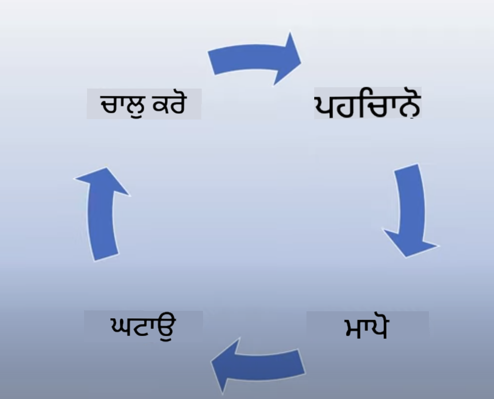
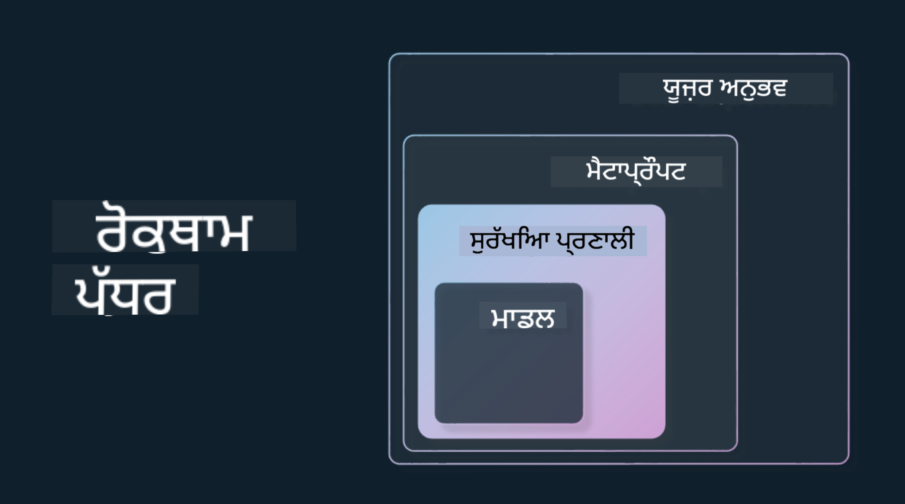

<!--
CO_OP_TRANSLATOR_METADATA:
{
  "original_hash": "4d57fad773cbeb69c5dd62e65c34200d",
  "translation_date": "2025-10-17T14:14:59+00:00",
  "source_file": "03-using-generative-ai-responsibly/README.md",
  "language_code": "pa"
}
-->
# ਜਨਰੇਟਿਵ AI ਨੂੰ ਜ਼ਿੰਮੇਵਾਰੀ ਨਾਲ ਵਰਤਣਾ

> _ਉਪਰ ਦਿੱਤੀ ਤਸਵੀਰ 'ਤੇ ਕਲਿਕ ਕਰਕੇ ਇਸ ਪਾਠ ਦਾ ਵੀਡੀਓ ਵੇਖੋ_

AI ਅਤੇ ਖਾਸ ਕਰਕੇ ਜਨਰੇਟਿਵ AI ਦੇ ਪ੍ਰਤੀ ਮੋਹਿਤ ਹੋਣਾ ਆਸਾਨ ਹੈ, ਪਰ ਤੁਹਾਨੂੰ ਇਹ ਵੀ ਸੋਚਣਾ ਚਾਹੀਦਾ ਹੈ ਕਿ ਤੁਸੀਂ ਇਸਨੂੰ ਕਿਵੇਂ ਜ਼ਿੰਮੇਵਾਰੀ ਨਾਲ ਵਰਤੋਂਗੇ। ਤੁਹਾਨੂੰ ਇਹ ਵੀ ਸੋਚਣਾ ਚਾਹੀਦਾ ਹੈ ਕਿ ਨਤੀਜਾ ਕਿਵੇਂ ਨਿਰਪੱਖ, ਹਾਨੀਰਹਿਤ ਅਤੇ ਹੋਰ ਹੋ ਸਕਦਾ ਹੈ। ਇਹ ਅਧਿਆਇ ਤੁਹਾਨੂੰ ਇਸ ਸੰਦਰਭ, ਵਿਚਾਰ ਕਰਨ ਵਾਲੀਆਂ ਚੀਜ਼ਾਂ ਅਤੇ AI ਦੀ ਵਰਤੋਂ ਨੂੰ ਸੁਧਾਰਨ ਲਈ ਕਦਮ ਚੁੱਕਣ ਦੇ ਤਰੀਕੇ ਦੇਣ ਦਾ ਉਦੇਸ਼ ਰੱਖਦਾ ਹੈ।

## ਪਰਚੇ

ਇਸ ਪਾਠ ਵਿੱਚ ਤੁਸੀਂ ਸਿੱਖੋਗੇ:

- ਜਨਰੇਟਿਵ AI ਐਪਲੀਕੇਸ਼ਨ ਬਣਾਉਣ ਸਮੇਂ ਜ਼ਿੰਮੇਵਾਰ AI ਨੂੰ ਤਰਜੀਹ ਦੇਣ ਦਾ ਮਹੱਤਵ।
- ਜ਼ਿੰਮੇਵਾਰ AI ਦੇ ਮੁੱਖ ਸਿਧਾਂਤ ਅਤੇ ਜਨਰੇਟਿਵ AI ਨਾਲ ਉਨ੍ਹਾਂ ਦਾ ਸੰਬੰਧ।
- ਜ਼ਿੰਮੇਵਾਰ AI ਦੇ ਸਿਧਾਂਤਾਂ ਨੂੰ ਰਣਨੀਤੀ ਅਤੇ ਟੂਲਿੰਗ ਰਾਹੀਂ ਅਮਲ ਵਿੱਚ ਕਿਵੇਂ ਲਿਆ ਜਾ ਸਕਦਾ ਹੈ।

## ਸਿੱਖਣ ਦੇ ਲਕਸ਼

ਇਸ ਪਾਠ ਨੂੰ ਪੂਰਾ ਕਰਨ ਤੋਂ ਬਾਅਦ ਤੁਸੀਂ ਜਾਣੋਗੇ:

- ਜਨਰੇਟਿਵ AI ਐਪਲੀਕੇਸ਼ਨ ਬਣਾਉਣ ਸਮੇਂ ਜ਼ਿੰਮੇਵਾਰ AI ਦਾ ਮਹੱਤਵ।
- ਜਨਰੇਟਿਵ AI ਐਪਲੀਕੇਸ਼ਨ ਬਣਾਉਣ ਸਮੇਂ ਜ਼ਿੰਮੇਵਾਰ AI ਦੇ ਮੁੱਖ ਸਿਧਾਂਤਾਂ ਨੂੰ ਕਦੋਂ ਸੋਚਣਾ ਅਤੇ ਅਮਲ ਵਿੱਚ ਲਿਆਉਣਾ।
- ਜ਼ਿੰਮੇਵਾਰ AI ਦੇ ਅਵਲੋਕਨ ਨੂੰ ਅਮਲ ਵਿੱਚ ਲਿਆਉਣ ਲਈ ਤੁਹਾਡੇ ਲਈ ਕਿਹੜੇ ਟੂਲ ਅਤੇ ਰਣਨੀਤੀਆਂ ਉਪਲਬਧ ਹਨ।

## ਜ਼ਿੰਮੇਵਾਰ AI ਦੇ ਸਿਧਾਂਤ

ਜਨਰੇਟਿਵ AI ਦੀ ਉਤਸ਼ਾਹਤਾ ਕਦੇ ਵੀ ਇਸ ਤੋਂ ਵੱਧ ਨਹੀਂ ਸੀ। ਇਸ ਉਤਸ਼ਾਹ ਨੇ ਇਸ ਖੇਤਰ ਵਿੱਚ ਬਹੁਤ ਸਾਰੇ ਨਵੇਂ ਡਿਵੈਲਪਰ, ਧਿਆਨ ਅਤੇ ਫੰਡਿੰਗ ਲਿਆਈ ਹੈ। ਜਦੋਂ ਕਿ ਇਹ ਜਨਰੇਟਿਵ AI ਦੀ ਵਰਤੋਂ ਕਰਕੇ ਉਤਪਾਦ ਅਤੇ ਕੰਪਨੀਆਂ ਬਣਾਉਣ ਦੇ ਇੱਛੁਕ ਕਿਸੇ ਵੀ ਵਿਅਕਤੀ ਲਈ ਬਹੁਤ ਹੀ ਸਕਾਰਾਤਮਕ ਹੈ, ਇਹ ਵੀ ਮਹੱਤਵਪੂਰਨ ਹੈ ਕਿ ਅਸੀਂ ਜ਼ਿੰਮੇਵਾਰੀ ਨਾਲ ਅੱਗੇ ਵਧੀਏ।

ਇਸ ਕੋਰਸ ਦੇ ਦੌਰਾਨ, ਅਸੀਂ ਆਪਣਾ ਸਟਾਰਟਅਪ ਅਤੇ ਆਪਣਾ AI ਸਿੱਖਿਆ ਉਤਪਾਦ ਬਣਾਉਣ 'ਤੇ ਧਿਆਨ ਦੇ ਰਹੇ ਹਾਂ। ਅਸੀਂ ਜ਼ਿੰਮੇਵਾਰ AI ਦੇ ਸਿਧਾਂਤਾਂ ਦੀ ਵਰਤੋਂ ਕਰਾਂਗੇ: ਨਿਰਪੱਖਤਾ, ਸ਼ਾਮਿਲਤਾ, ਭਰੋਸੇਯੋਗਤਾ/ਸੁਰੱਖਿਆ, ਸੁਰੱਖਿਆ ਅਤੇ ਗੋਪਨੀਯਤਾ, ਪਾਰਦਰਸ਼ਤਾ ਅਤੇ ਜਵਾਬਦੇਹੀ। ਇਨ੍ਹਾਂ ਸਿਧਾਂਤਾਂ ਨਾਲ, ਅਸੀਂ ਖੋਜ ਕਰਾਂਗੇ ਕਿ ਜਨਰੇਟਿਵ AI ਦੀ ਵਰਤੋਂ ਕਰਦੇ ਹੋਏ ਇਹ ਸਾਡੇ ਉਤਪਾਦਾਂ ਵਿੱਚ ਕਿਵੇਂ ਸਬੰਧਿਤ ਹਨ।

## ਜ਼ਿੰਮੇਵਾਰ AI ਨੂੰ ਤਰਜੀਹ ਕਿਉਂ ਦੇਣੀ ਚਾਹੀਦੀ ਹੈ

ਜਦੋਂ ਉਤਪਾਦ ਬਣਾਉਣ ਦੀ ਗੱਲ ਆਉਂਦੀ ਹੈ, ਤਾਂ ਮਨੁੱਖ-ਕੇਂਦਰਿਤ ਦ੍ਰਿਸ਼ਕੋਣ ਅਪਣਾਉਣਾ, ਆਪਣੇ ਉਪਭੋਗਤਾ ਦੇ ਵਧੀਆ ਹਿੱਤ ਨੂੰ ਧਿਆਨ ਵਿੱਚ ਰੱਖਣਾ, ਸਭ ਤੋਂ ਵਧੀਆ ਨਤੀਜੇ ਦਿੰਦਾ ਹੈ।

ਜਨਰੇਟਿਵ AI ਦੀ ਵਿਸ਼ੇਸ਼ਤਾ ਇਸ ਦੀ ਸਮਰੱਥਾ ਹੈ ਕਿ ਇਹ ਉਪਭੋਗਤਾਵਾਂ ਲਈ ਮਦਦਗਾਰ ਜਵਾਬ, ਜਾਣਕਾਰੀ, ਮਾਰਗਦਰਸ਼ਨ ਅਤੇ ਸਮੱਗਰੀ ਤਿਆਰ ਕਰ ਸਕਦਾ ਹੈ। ਇਹ ਬਿਨਾਂ ਕਿਸੇ ਵੱਡੇ ਮੈਨੂਅਲ ਕਦਮਾਂ ਦੇ ਕੀਤਾ ਜਾ ਸਕਦਾ ਹੈ ਜੋ ਬਹੁਤ ਪ੍ਰਭਾਵਸ਼ਾਲੀ ਨਤੀਜੇ ਦੇ ਸਕਦਾ ਹੈ। ਬਿਨਾਂ ਸਹੀ ਯੋਜਨਾ ਅਤੇ ਰਣਨੀਤੀਆਂ ਦੇ, ਇਹ ਦੁਖਭਾਗੇ ਨਾਲ ਤੁਹਾਡੇ ਉਪਭੋਗਤਾਵਾਂ, ਤੁਹਾਡੇ ਉਤਪਾਦ ਅਤੇ ਸਮਾਜ ਲਈ ਕੁਝ ਹਾਨੀਕਾਰਕ ਨਤੀਜੇ ਵੀ ਲਿਆ ਸਕਦਾ ਹੈ।

ਆਓ ਕੁਝ (ਪਰ ਸਾਰੇ ਨਹੀਂ) ਸੰਭਾਵਿਤ ਹਾਨੀਕਾਰਕ ਨਤੀਜਿਆਂ 'ਤੇ ਨਜ਼ਰ ਮਾਰਦੇ ਹਾਂ:

### ਹਾਲੂਸੀਨੇਸ਼ਨ

ਹਾਲੂਸੀਨੇਸ਼ਨ ਇੱਕ ਸ਼ਬਦ ਹੈ ਜੋ ਵਰਤਿਆ ਜਾਂਦਾ ਹੈ ਜਦੋਂ ਇੱਕ LLM ਸਮੱਗਰੀ ਪੈਦਾ ਕਰਦਾ ਹੈ ਜੋ ਜਾਂ ਤਾਂ ਪੂਰੀ ਤਰ੍ਹਾਂ ਬੇਤੁਕਾ ਹੁੰਦੀ ਹੈ ਜਾਂ ਕੁਝ ਅਜਿਹਾ ਹੁੰਦਾ ਹੈ ਜੋ ਅਸੀਂ ਹੋਰ ਸੂਤਰਾਂ ਦੇ ਅਧਾਰ 'ਤੇ ਤੱਥਾਤਮਕ ਤੌਰ 'ਤੇ ਗਲਤ ਜਾਣਦੇ ਹਾਂ।

ਆਓ ਮਿਸਾਲ ਲਈ ਸੋਚੀਏ ਕਿ ਅਸੀਂ ਆਪਣੇ ਸਟਾਰਟਅਪ ਲਈ ਇੱਕ ਫੀਚਰ ਬਣਾਉਂਦੇ ਹਾਂ ਜੋ ਵਿਦਿਆਰਥੀਆਂ ਨੂੰ ਮਾਡਲ ਨੂੰ ਇਤਿਹਾਸਕ ਸਵਾਲ ਪੁੱਛਣ ਦੀ ਆਗਿਆ ਦਿੰਦਾ ਹੈ। ਇੱਕ ਵਿਦਿਆਰਥੀ ਸਵਾਲ ਪੁੱਛਦਾ ਹੈ `ਟਾਇਟੈਨਿਕ ਦਾ ਇਕੱਲਾ ਬਚਣ ਵਾਲਾ ਕੌਣ ਸੀ?`

ਮਾਡਲ ਹੇਠਾਂ ਦਿੱਤੇ ਜਵਾਬ ਵਰਗਾ ਕੁਝ ਪੈਦਾ ਕਰਦਾ ਹੈ:

> _(ਸਰੋਤ: [Flying bisons](https://flyingbisons.com?WT.mc_id=academic-105485-koreyst))_

ਇਹ ਇੱਕ ਬਹੁਤ ਹੀ ਆਤਮਵਿਸ਼ਵਾਸੀ ਅਤੇ ਵਿਸਥਾਰਤ ਜਵਾਬ ਹੈ। ਦੁਖਭਾਗੇ ਨਾਲ, ਇਹ ਗਲਤ ਹੈ। ਘੱਟ ਤੋਂ ਘੱਟ ਖੋਜ ਨਾਲ ਵੀ, ਕੋਈ ਪਤਾ ਲਗਾ ਸਕਦਾ ਹੈ ਕਿ ਟਾਇਟੈਨਿਕ ਦੀ ਬਿਪਤਾ ਦੇ ਇੱਕ ਤੋਂ ਵੱਧ ਬਚਣ ਵਾਲੇ ਸਨ। ਇੱਕ ਵਿਦਿਆਰਥੀ ਜੋ ਇਸ ਵਿਸ਼ੇ 'ਤੇ ਖੋਜ ਸ਼ੁਰੂ ਕਰ ਰਿਹਾ ਹੈ, ਇਹ ਜਵਾਬ ਕਾਫ਼ੀ ਪ੍ਰੇਰਕ ਹੋ ਸਕਦਾ ਹੈ ਕਿ ਇਸਨੂੰ ਸਵਾਲ ਨਾ ਕੀਤਾ ਜਾਵੇ ਅਤੇ ਤੱਥ ਵਜੋਂ ਮੰਨਿਆ ਜਾਵੇ। ਇਸ ਦੇ ਨਤੀਜੇ ਵਜੋਂ AI ਸਿਸਟਮ ਅਣਭਰੋਸੇਯੋਗ ਹੋ ਸਕਦਾ ਹੈ ਅਤੇ ਸਾਡੇ ਸਟਾਰਟਅਪ ਦੀ ਸ਼ੋਹਰਤ 'ਤੇ ਨਕਾਰਾਤਮਕ ਪ੍ਰਭਾਵ ਪੈ ਸਕਦਾ ਹੈ।

ਕਿਸੇ ਵੀ ਦਿੱਤੇ ਗਏ LLM ਦੇ ਹਰ ਦੁਹਰਾਅ ਦੇ ਨਾਲ, ਅਸੀਂ ਹਾਲੂਸੀਨੇਸ਼ਨ ਨੂੰ ਘਟਾਉਣ ਦੇ ਆਲੇ-ਦੁਆਲੇ ਪ੍ਰਦਰਸ਼ਨ ਵਿੱਚ ਸੁਧਾਰ ਦੇਖਿਆ ਹੈ। ਇਸ ਸੁਧਾਰ ਦੇ ਨਾਲ ਵੀ, ਅਸੀਂ ਐਪਲੀਕੇਸ਼ਨ ਬਣਾਉਣ ਵਾਲੇ ਅਤੇ ਉਪਭੋਗਤਾਵਾਂ ਵਜੋਂ ਇਨ੍ਹਾਂ ਸੀਮਾਵਾਂ ਤੋਂ ਸਚੇਤ ਰਹਿਣ ਦੀ ਲੋੜ ਹੈ।

### ਹਾਨੀਕਾਰਕ ਸਮੱਗਰੀ

ਅਸੀਂ ਪਹਿਲੇ ਭਾਗ ਵਿੱਚ ਕਵਰ ਕੀਤਾ ਜਦੋਂ ਇੱਕ LLM ਗਲਤ ਜਾਂ ਬੇਤੁਕਾ ਜਵਾਬ ਪੈਦਾ ਕਰਦਾ ਹੈ। ਇੱਕ ਹੋਰ ਜੋਖਮ ਜਿਸ ਤੋਂ ਸਚੇਤ ਰਹਿਣ ਦੀ ਲੋੜ ਹੈ ਉਹ ਹੈ ਜਦੋਂ ਮਾਡਲ ਹਾਨੀਕਾਰਕ ਸਮੱਗਰੀ ਨਾਲ ਜਵਾਬ ਦਿੰਦਾ ਹੈ।

ਹਾਨੀਕਾਰਕ ਸਮੱਗਰੀ ਨੂੰ ਇਸ ਤਰ੍ਹਾਂ ਪਰਿਭਾਸ਼ਿਤ ਕੀਤਾ ਜਾ ਸਕਦਾ ਹੈ:

- ਸਵੈ-ਹਾਨੀ ਜਾਂ ਕੁਝ ਸਮੂਹਾਂ ਨੂੰ ਨੁਕਸਾਨ ਪਹੁੰਚਾਉਣ ਦੇ ਨਿਰਦੇਸ਼ ਦੇਣਾ ਜਾਂ ਉਤਸ਼ਾਹਿਤ ਕਰਨਾ।
- ਘ੍ਰਿਣਾ-ਭਰਪੂਰ ਜਾਂ ਨੀਚ ਸਮੱਗਰੀ।
- ਕਿਸੇ ਵੀ ਕਿਸਮ ਦੇ ਹਮਲੇ ਜਾਂ ਹਿੰਸਕ ਕਿਰਿਆਵਾਂ ਦੀ ਯੋਜਨਾ ਬਣਾਉਣ ਦਾ ਮਾਰਗਦਰਸ਼ਨ।
- ਗੈਰਕਾਨੂੰਨੀ ਸਮੱਗਰੀ ਲੱਭਣ ਜਾਂ ਗੈਰਕਾਨੂੰਨੀ ਕਿਰਿਆਵਾਂ ਕਰਨ ਦੇ ਨਿਰਦੇਸ਼।
- ਜਿਨਸੀ ਤੌਰ 'ਤੇ ਸਪਸ਼ਟ ਸਮੱਗਰੀ ਦਿਖਾਉਣਾ।

ਸਾਡੇ ਸਟਾਰਟਅਪ ਲਈ, ਅਸੀਂ ਇਹ ਯਕੀਨੀ ਬਣਾਉਣਾ ਚਾਹੁੰਦੇ ਹਾਂ ਕਿ ਸਹੀ ਟੂਲ ਅਤੇ ਰਣਨੀਤੀਆਂ ਸਥਾਪਿਤ ਕੀਤੀਆਂ ਗਈਆਂ ਹਨ ਤਾਂ ਜੋ ਵਿਦਿਆਰਥੀਆਂ ਦੁਆਰਾ ਇਸ ਕਿਸਮ ਦੀ ਸਮੱਗਰੀ ਨਾ ਦੇਖੀ ਜਾਵੇ।

### ਨਿਰਪੱਖਤਾ ਦੀ ਘਾਟ

ਨਿਰਪੱਖਤਾ ਨੂੰ "ਯਕੀਨੀ ਬਣਾਉਣਾ ਕਿ AI ਸਿਸਟਮ ਪੱਖਪਾਤ ਅਤੇ ਭੇਦਭਾਵ ਤੋਂ ਮੁਕਤ ਹੈ ਅਤੇ ਇਹ ਹਰ ਕਿਸੇ ਨਾਲ ਨਿਰਪੱਖ ਅਤੇ ਸਮਾਨ ਵਿਹਾਰ ਕਰਦਾ ਹੈ" ਵਜੋਂ ਪਰਿਭਾਸ਼ਿਤ ਕੀਤਾ ਜਾਂਦਾ ਹੈ। ਜਨਰੇਟਿਵ AI ਦੀ ਦੁਨੀਆ ਵਿੱਚ, ਅਸੀਂ ਇਹ ਯਕੀਨੀ ਬਣਾਉਣਾ ਚਾਹੁੰਦੇ ਹਾਂ ਕਿ ਮਾਡਲ ਦੇ ਨਤੀਜੇ ਦੁਆਰਾ ਹਾਸਲ ਕੀਤੇ ਗਏ ਹਾਸੇ-ਪ੍ਰਵਿਰਤੀਆਂ ਦੇ ਵਿਸ਼ਵਦ੍ਰਿਸ਼ਟੀ ਨੂੰ ਮਜ਼ਬੂਤ ਨਹੀਂ ਕੀਤਾ ਜਾ ਰਿਹਾ।

ਇਹ ਕਿਸਮ ਦੇ ਨਤੀਜੇ ਸਿਰਫ ਸਾਡੇ ਉਪਭੋਗਤਾਵਾਂ ਲਈ ਸਕਾਰਾਤਮਕ ਉਤਪਾਦ ਅਨੁਭਵ ਬਣਾਉਣ ਲਈ ਹਾਨੀਕਾਰਕ ਨਹੀਂ ਹਨ, ਪਰ ਇਹ ਸਮਾਜਿਕ ਤੌਰ 'ਤੇ ਹੋਰ ਨੁਕਸਾਨ ਵੀ ਪਹੁੰਚਾਉਂਦੇ ਹਨ। ਐਪਲੀਕੇਸ਼ਨ ਬਣਾਉਣ ਵਾਲੇ ਵਜੋਂ, ਜਨਰੇਟਿਵ AI ਨਾਲ ਹੱਲ ਬਣਾਉਣ ਸਮੇਂ ਸਾਨੂੰ ਹਮੇਸ਼ਾ ਇੱਕ ਵਿਆਪਕ ਅਤੇ ਵਿਵਿਧ ਉਪਭੋਗਤਾ ਅਧਾਰ ਨੂੰ ਧਿਆਨ ਵਿੱਚ ਰੱਖਣਾ ਚਾਹੀਦਾ ਹੈ।

## ਜਨਰੇਟਿਵ AI ਨੂੰ ਜ਼ਿੰਮੇਵਾਰੀ ਨਾਲ ਕਿਵੇਂ ਵਰਤਣਾ

ਹੁਣ ਜਦੋਂ ਅਸੀਂ ਜ਼ਿੰਮੇਵਾਰ ਜਨਰੇਟਿਵ AI ਦੇ ਮਹੱਤਵ ਦੀ ਪਛਾਣ ਕਰ ਲਈ ਹੈ, ਆਓ 4 ਕਦਮਾਂ 'ਤੇ ਨਜ਼ਰ ਮਾਰਦੇ ਹਾਂ ਜੋ ਅਸੀਂ ਆਪਣੇ AI ਹੱਲ ਨੂੰ ਜ਼ਿੰਮੇਵਾਰੀ ਨਾਲ ਬਣਾਉਣ ਲਈ ਲੈ ਸਕਦੇ ਹਾਂ:

### ਸੰਭਾਵਿਤ ਹਾਨੀਆਂ ਨੂੰ ਮਾਪੋ

ਸਾਫਟਵੇਅਰ ਟੈਸਟਿੰਗ ਵਿੱਚ, ਅਸੀਂ ਐਪਲੀਕੇਸ਼ਨ 'ਤੇ ਉਪਭੋਗਤਾ ਦੇ ਉਮੀਦ ਕੀਤੇ ਕਿਰਿਆਵਾਂ ਦੀ ਜਾਂਚ ਕਰਦੇ ਹਾਂ। ਇਸੇ ਤਰ੍ਹਾਂ, ਉਪਭੋਗਤਾਵਾਂ ਦੁਆਰਾ ਸਭ ਤੋਂ ਵੱਧ ਵਰਤੇ ਜਾਣ ਵਾਲੇ ਪ੍ਰੋਮਪਟਾਂ ਦੇ ਵਿਵਿਧ ਸੈੱਟ ਦੀ ਜਾਂਚ ਕਰਨਾ ਸੰਭਾਵਿਤ ਹਾਨੀ ਨੂੰ ਮਾਪਣ ਦਾ ਇੱਕ ਵਧੀਆ ਤਰੀਕਾ ਹੈ।

ਜਦੋਂ ਕਿ ਸਾਡਾ ਸਟਾਰਟਅਪ ਸਿੱਖਿਆ ਉਤਪਾਦ ਬਣਾਉਣ 'ਤੇ ਕੰਮ ਕਰ ਰਿਹਾ ਹੈ, ਇਹ ਸਿੱਖਿਆ-ਸਬੰਧੀ ਪ੍ਰੋਮਪਟਾਂ ਦੀ ਸੂਚੀ ਤਿਆਰ ਕਰਨਾ ਚੰਗਾ ਹੋਵੇਗਾ। ਇਹ ਕਿਸੇ ਵਿਸ਼ੇ ਨੂੰ ਕਵਰ ਕਰਨ ਲਈ ਹੋ ਸਕਦਾ ਹੈ, ਇਤਿਹਾਸਕ ਤੱਥ ਅਤੇ ਵਿਦਿਆਰਥੀ ਜੀਵਨ ਬਾਰੇ ਪ੍ਰੋਮਪਟ।

### ਸੰਭਾਵਿਤ ਹਾਨੀਆਂ ਨੂੰ ਘਟਾਓ

ਹੁਣ ਸਮਾਂ ਹੈ ਕਿ ਅਸੀਂ ਉਹ ਤਰੀਕੇ ਲੱਭੀਏ ਜਿੱਥੇ ਅਸੀਂ ਮਾਡਲ ਅਤੇ ਇਸਦੇ ਜਵਾਬਾਂ ਦੁਆਰਾ ਪੈਦਾ ਕੀਤੀ ਗਈ ਸੰਭਾਵਿਤ ਹਾਨੀ ਨੂੰ ਰੋਕ ਸਕਦੇ ਹਾਂ ਜਾਂ ਘਟਾ ਸਕਦੇ ਹਾਂ। ਅਸੀਂ ਇਸਨੂੰ 4 ਵੱਖ-ਵੱਖ ਪੱਧਰਾਂ ਵਿੱਚ ਦੇਖ ਸਕਦੇ ਹਾਂ:

- **ਮਾਡਲ**. ਸਹੀ ਮਾਮਲੇ ਲਈ ਸਹੀ ਮਾਡਲ ਦੀ ਚੋਣ ਕਰਨਾ। GPT-4 ਵਰਗੇ ਵੱਡੇ ਅਤੇ ਜਟਿਲ ਮਾਡਲ ਛੋਟੇ ਅਤੇ ਵਧੇਰੇ ਵਿਸ਼ੇਸ਼ ਮਾਮਲਿਆਂ 'ਤੇ ਲਾਗੂ ਕਰਨ ਸਮੇਂ ਹਾਨੀਕਾਰਕ ਸਮੱਗਰੀ ਦਾ ਵਧੇਰੇ ਜੋਖਮ ਪੈਦਾ ਕਰ ਸਕਦੇ ਹਨ। ਆਪਣੇ ਟ੍ਰੇਨਿੰਗ ਡੇਟਾ ਦੀ ਵਰਤੋਂ ਕਰਕੇ ਫਾਈਨ-ਟਿਊਨ ਕਰਨਾ ਵੀ ਹਾਨੀਕਾਰਕ ਸਮੱਗਰੀ ਦੇ ਜੋਖਮ ਨੂੰ ਘਟਾਉਂਦਾ ਹੈ।

- **ਸੁਰੱਖਿਆ ਸਿਸਟਮ**. ਸੁਰੱਖਿਆ ਸਿਸਟਮ ਮਾਡਲ ਨੂੰ ਸੇਵਾ ਦੇਣ ਵਾਲੇ ਪਲੇਟਫਾਰਮ 'ਤੇ ਟੂਲਾਂ ਅਤੇ ਸੰਰਚਨਾਵਾਂ ਦਾ ਇੱਕ ਸੈੱਟ ਹੈ ਜੋ ਹਾਨੀ ਨੂੰ ਘਟਾਉਣ ਵਿੱਚ ਮਦਦ ਕਰਦਾ ਹੈ। ਇਸਦਾ ਇੱਕ ਉਦਾਹਰਨ Azure OpenAI ਸੇਵਾ 'ਤੇ ਸਮੱਗਰੀ ਫਿਲਟਰਿੰਗ ਸਿਸਟਮ ਹੈ। ਸਿਸਟਮਾਂ ਨੂੰ ਜੇਲਬ੍ਰੇਕ ਹਮਲਿਆਂ ਅਤੇ ਬਿਨਾਂ ਚਾਹੀ ਗਈ ਕਿਰਿਆਵਾਂ ਜਿਵੇਂ ਕਿ ਬੋਟਾਂ ਤੋਂ ਆਉਣ ਵਾਲੀਆਂ ਬੇਨਤੀ ਦੀ ਪਛਾਣ ਵੀ ਕਰਨੀ ਚਾਹੀਦੀ ਹੈ।

- **ਮੈਟਾਪ੍ਰੋਮਪਟ**. ਮੈਟਾਪ੍ਰੋਮਪਟ ਅਤੇ ਗ੍ਰਾਊਂਡਿੰਗ ਉਹ ਤਰੀਕੇ ਹਨ ਜਿਨ੍ਹਾਂ ਨਾਲ ਅਸੀਂ ਕੁਝ ਵਿਹਾਰਾਂ ਅਤੇ ਜਾਣਕਾਰੀ ਦੇ ਅਧਾਰ 'ਤੇ ਮਾਡਲ ਨੂੰ ਨਿਰਦੇਸ਼ਿਤ ਜਾਂ ਸੀਮਿਤ ਕਰ ਸਕਦੇ ਹਾਂ। ਇਹ ਮਾਡਲ ਦੀਆਂ ਕੁਝ ਸੀਮਾਵਾਂ ਨੂੰ ਪਰਿਭਾਸ਼ਿਤ ਕਰਨ ਲਈ ਸਿਸਟਮ ਇਨਪੁਟ ਦੀ ਵਰਤੋਂ ਕਰ ਸਕਦਾ ਹੈ। ਇਸਦੇ ਨਾਲ-ਨਾਲ, ਸਿਸਟਮ ਦੇ ਵਿਸ਼ੇ ਜਾਂ ਖੇਤਰ ਲਈ ਹੋਰ ਸਬੰਧਤ ਨਤੀਜੇ ਪ੍ਰਦਾਨ ਕਰਨਾ।

ਇਹ ਰੀਟਰੀਵਲ ਆਗਮੈਂਟਡ ਜਨਰੇਸ਼ਨ (RAG) ਵਰਗੀਆਂ ਤਕਨੀਕਾਂ ਦੀ ਵਰਤੋਂ ਕਰਨਾ ਵੀ ਹੋ ਸਕਦਾ ਹੈ ਤਾਂ ਜੋ ਮਾਡਲ ਸਿਰਫ਼ ਭਰੋਸੇਯੋਗ ਸਰੋਤਾਂ ਦੇ ਚੁਣੇ ਗਏ ਚੋਣ ਤੋਂ ਜਾਣਕਾਰੀ ਖਿੱਚੇ। ਇਸ ਕੋਰਸ ਵਿੱਚ ਇੱਕ ਪਾਠ ਹੈ [ਖੋਜ ਐਪਲੀਕੇਸ਼ਨ ਬਣਾਉਣਾ](../08-building-search-applications/README.md?WT.mc_id=academic-105485-koreyst)

- **ਉਪਭੋਗਤਾ ਅਨੁਭਵ**. ਆਖਰੀ ਪੱਧਰ ਜਿੱਥੇ ਉਪਭੋਗਤਾ ਸਿੱਧੇ ਤੌਰ 'ਤੇ ਮਾਡਲ ਨਾਲ ਸਾਡੇ ਐਪਲੀਕੇਸ਼ਨ ਦੇ ਇੰਟਰਫੇਸ ਰਾਹੀਂ ਕੁਝ ਤਰੀਕੇ ਨਾਲ ਸੰਪਰਕ ਕਰਦਾ ਹੈ। ਇਸ ਤਰੀਕੇ ਨਾਲ ਅਸੀਂ UI/UX ਨੂੰ ਡਿਜ਼ਾਈਨ ਕਰ ਸਕਦੇ ਹਾਂ ਤਾਂ ਜੋ ਉਪਭੋਗਤਾ ਨੂੰ ਮਾਡਲ ਨੂੰ ਭੇਜੇ ਜਾਣ ਵਾਲੇ ਇਨਪੁਟਾਂ ਦੇ ਕਿਸਮਾਂ 'ਤੇ ਸੀਮਿਤ ਕੀਤਾ ਜਾ ਸਕੇ ਅਤੇ ਉਪਭੋਗਤਾ ਨੂੰ ਦਿਖਾਈ ਦੇਣ ਵਾਲੇ ਟੈਕਸਟ ਜਾਂ ਚਿੱਤਰਾਂ ਨੂੰ ਸੀਮਿਤ ਕੀਤਾ ਜਾ ਸਕੇ। ਜਦੋਂ ਅਸੀਂ AI ਐਪਲੀਕੇਸ਼ਨ ਨੂੰ ਤੈਨਾਤ ਕਰਦੇ ਹਾਂ, ਤਾਂ ਸਾਨੂੰ ਇਹ ਵੀ ਪਾਰਦਰਸ਼ੀ ਬਣਾਉਣਾ ਚਾਹੀਦਾ ਹੈ ਕਿ ਸਾਡਾ ਜਨਰੇਟਿਵ AI ਐਪਲੀਕੇਸ਼ਨ ਕੀ ਕਰ ਸਕਦਾ ਹੈ ਅਤੇ ਕੀ ਨਹੀਂ।

ਸਾਡੇ ਕੋਲ [AI ਐਪਲੀਕੇਸ਼ਨ ਲਈ UX ਡਿਜ਼ਾਈਨ](../12-designing-ux-for-ai-applications/README.md?WT.mc_id=academic-105485-koreyst) 'ਤੇ ਸਮਰਪਿਤ ਪਾਠ ਹੈ।

- **ਮਾਡਲ ਦਾ ਮੁਲਾਂਕਣ ਕਰੋ**. LLMs ਨਾਲ ਕੰਮ ਕਰਨਾ ਚੁਣੌਤੀਪੂਰਨ ਹੋ ਸਕਦਾ ਹੈ ਕਿਉਂਕਿ ਸਾਨੂੰ ਹਮੇਸ਼ਾ ਮਾਡਲ 'ਤੇ ਟ੍ਰੇਨਿੰਗ ਕੀਤੇ ਗਏ ਡੇਟਾ 'ਤੇ ਕੰਟਰੋਲ ਨਹੀਂ ਹੁੰਦਾ। ਫਿਰ ਵੀ, ਸਾਨੂੰ ਹਮੇਸ਼ਾ ਮਾਡਲ ਦੇ ਪ੍ਰਦਰਸ਼ਨ ਅਤੇ ਨਤੀਜਿਆਂ ਦਾ ਮੁਲਾਂਕਣ ਕਰਨਾ ਚਾਹੀਦਾ ਹੈ। ਮਾਡਲ ਦੇ ਨਤੀਜੇ ਦੀ ਸਹੀਤਾ, ਸਮਾਨਤਾ, ਗ੍ਰਾਊਂਡਡਨੈਸ ਅਤੇ ਸਬੰਧਿਤਤਾ ਨੂੰ ਮਾਪਣਾ ਅਜੇ ਵੀ ਮਹੱਤਵਪੂਰਨ ਹੈ। ਇਹ ਸਟੇਕਹੋਲਡਰਾਂ ਅਤੇ ਉਪਭੋਗਤਾਵਾਂ ਨੂੰ ਪਾਰਦਰਸ਼ਤਾ ਅਤੇ ਭਰੋਸਾ ਪ੍ਰਦਾਨ ਕਰਨ ਵਿੱਚ ਮਦਦ ਕਰਦਾ ਹੈ।

### ਜ਼ਿੰਮੇਵਾਰ ਜਨਰੇਟਿਵ AI ਹੱਲ ਚਲਾਓ

ਤੁਹਾਡੇ AI ਐਪਲੀਕੇਸ਼ਨ ਦੇ ਆਲੇ-ਦੁਆਲੇ ਇੱਕ ਓਪਰੇਸ਼ਨਲ

---

**ਅਸਵੀਕਰਤੀ**:  
ਇਹ ਦਸਤਾਵੇਜ਼ AI ਅਨੁਵਾਦ ਸੇਵਾ [Co-op Translator](https://github.com/Azure/co-op-translator) ਦੀ ਵਰਤੋਂ ਕਰਕੇ ਅਨੁਵਾਦ ਕੀਤਾ ਗਿਆ ਹੈ। ਜਦੋਂ ਕਿ ਅਸੀਂ ਸਹੀ ਹੋਣ ਦੀ ਕੋਸ਼ਿਸ਼ ਕਰਦੇ ਹਾਂ, ਕਿਰਪਾ ਕਰਕੇ ਧਿਆਨ ਦਿਓ ਕਿ ਸਵੈਚਾਲਿਤ ਅਨੁਵਾਦਾਂ ਵਿੱਚ ਗਲਤੀਆਂ ਜਾਂ ਅਸੁੱਤੀਆਂ ਹੋ ਸਕਦੀਆਂ ਹਨ। ਇਸ ਦੀ ਮੂਲ ਭਾਸ਼ਾ ਵਿੱਚ ਮੂਲ ਦਸਤਾਵੇਜ਼ ਨੂੰ ਅਧਿਕਾਰਤ ਸਰੋਤ ਮੰਨਿਆ ਜਾਣਾ ਚਾਹੀਦਾ ਹੈ। ਮਹੱਤਵਪੂਰਨ ਜਾਣਕਾਰੀ ਲਈ, ਪੇਸ਼ੇਵਰ ਮਨੁੱਖੀ ਅਨੁਵਾਦ ਦੀ ਸਿਫਾਰਸ਼ ਕੀਤੀ ਜਾਂਦੀ ਹੈ। ਇਸ ਅਨੁਵਾਦ ਦੀ ਵਰਤੋਂ ਤੋਂ ਪੈਦਾ ਹੋਣ ਵਾਲੇ ਕਿਸੇ ਵੀ ਗਲਤਫਹਿਮੀ ਜਾਂ ਗਲਤ ਵਿਆਖਿਆ ਲਈ ਅਸੀਂ ਜ਼ਿੰਮੇਵਾਰ ਨਹੀਂ ਹਾਂ।