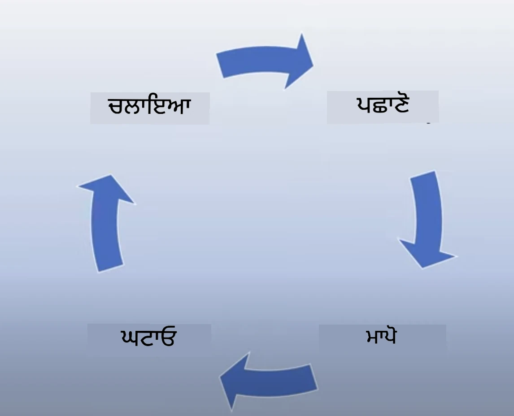
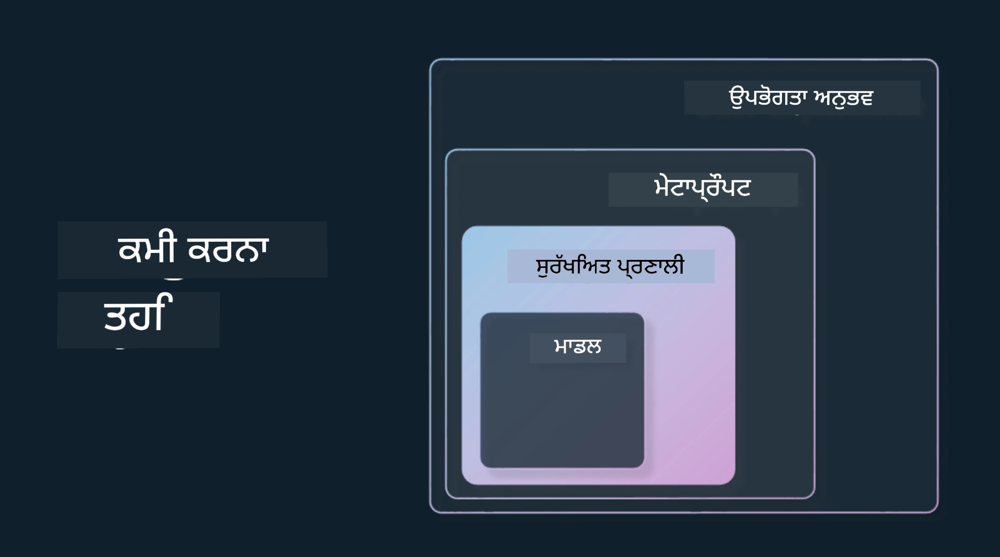

# ਜੇਨੇਰੇਟਿਵ AI ਨੂੰ ਜ਼ਿੰਮੇਵਾਰ ਢੰਗ ਨਾਲ ਵਰਤਣਾ

> _ਇਸ ਪਾਠ ਦਾ ਵੀਡੀਓ ਦੇਖਣ ਲਈ ਉੱਪਰ ਦਿੱਤੀ ਤਸਵੀਰ 'ਤੇ ਕਲਿੱਕ ਕਰੋ_

AI ਅਤੇ ਖਾਸ ਕਰਕੇ ਜੇਨੇਰੇਟਿਵ AI ਨਾਲ ਮੋਹ ਪਾਉਣਾ ਅਸਾਨ ਹੈ, ਪਰ ਤੁਹਾਨੂੰ ਇਹ ਸੋਚਣਾ ਚਾਹੀਦਾ ਹੈ ਕਿ ਤੁਸੀਂ ਇਸਦਾ ਜ਼ਿੰਮੇਵਾਰ ਢੰਗ ਨਾਲ ਕਿਵੇਂ ਇਸਤੇਮਾਲ ਕਰੋਗੇ। ਤੁਹਾਨੂੰ ਇਹ ਵੇਖਣਾ ਚਾਹੀਦਾ ਹੈ ਕਿ ਨਤੀਜਾ ਕਿਵੇਂ ਨਿਆਵੇਂ, ਗ਼ੈਰ-ਨੁਕਸਾਨਦਾਇਕ ਅਤੇ ਹੋਰ ਗੁਣਵੱਤੇ ਵਾਲਾ ਹੋਵੇ। ਇਹ ਅਧਿਆਇ ਤੁਹਾਨੂੰ ਦਿੱਤੇ ਗਏ ਸੰਦਰਭ, ਕੀ ਵਿਚਾਰ ਕਰਨਾ ਹੈ ਅਤੇ ਕਿਵੇਂ ਆਪਣੀ AI ਵਰਤੋਂ ਨੂੰ ਸੁਧਾਰਨ ਲਈ ਸਕ੍ਰਿਆ ਕਦਮ ਚੁੱਕਣੇ ਹਨ, ਬਾਰੇ ਜਾਣਕਾਰੀ ਦੇਣ ਦਾ ਉਦੇਸ਼ ਹੈ।

## ਪਰਚਾਰ

ਇਹ ਪਾਠ ਵਿੱਚ ਇਹ ਸਿਖਾਇਆ ਜਾਵੇਗਾ:

- ਜੇਨੇਰੇਟਿਵ AI ਐਪਲੀਕੇਸ਼ਨਾਂ ਦੀ ਬਣਾਉਟ ਦੌਰਾਨ ਜ਼ਿੰਮੇਵਾਰ AI ਨੂੰ ਪਹਿਲਤਵੈ ਕਿਉਂ ਦੇਣਾ ਚਾਹੀਦਾ ਹੈ।
- ਜ਼ਿੰਮੇਵਾਰ AI ਦੇ ਮੁੱਖ ਸਿਧਾਂਤ ਅਤੇ ਜਿਨ੍ਹਾਂ ਦਾ ਜੇਨੇਰੇਟਿਵ AI ਨਾਲ ਸੰਬੰਧ ਹੈ।
- ਜ਼ਿੰਮੇਵਾਰ AI ਸਿਧਾਂਤਾਂ ਨੂੰ ਯਥਾਰਥ ਵਿੱਚ ਲਿਆਉਣ ਲਈ ਰਣਨੀਤੀ ਅਤੇ ਸੰਦ ਕਿਵੇਂ ਵਰਤੇ ਜਾਣ।

## ਸਿੱਖਣ ਦੇ ਲਕੜੇ

ਇਸ ਪਾਠ ਨੂੰ ਪੂਰਾ ਕਰਨ ਤੋਂ ਬਾਅਦ ਤੁਸੀਂ ਜਾਣੋਗੇ:

- ਜਦੋਂ ਜੇਨੇਰੇਟਿਵ AI ਐਪਲੀਕੇਸ਼ਨਾਂ ਨੂੰ ਬਣਾਉਂਦੇ ਹੋ ਤਾਂ ਜ਼ਿੰਮੇਵਾਰ AI ਦਾ ਮਹੱਤਵ।
- ਕਦੋਂ ਸੋਚਣਾ ਅਤੇ ਅਮਲ ਕਰਨਾ ਚਾਹੀਦਾ ਹੈ ਜ਼ਿੰਮੇਵਾਰ AI ਦੇ ਮੁੱਖ ਸਿਧਾਂਤ ਜਦੋਂ ਜੇਨੇਰੇਟਿਵ AI ਐਪਲੀਕੇਸ਼ਨਾਂ ਨੂੰ ਬਣਾਉਂਦੇ ਹੋ।
- ਕਿਹੜੇ ਸੰਦ ਅਤੇ ਰਣਨੀਤੀਆਂ ਤੁਹਾਡੇ ਲਈ ਉਪਲੱਬਧ ਹਨ ਜ਼ਿੰਮੇਵਾਰ AI ਦੇ ਸੰਕਲਪ ਨੂੰ ਅਮਲ ਕਰਨ ਲਈ।

## ਜ਼ਿੰਮੇਵਾਰ AI ਸਿਧਾਂਤ

ਜੇਨੇਰੇਟਿਵ AI ਦੀ ਉਤਸ਼ਾਹ ਕਦੇ ਵੀ ਇਨਾ ਵੱਧ ਨਹੀ ਸੀ। ਇਸ ਉਤਸ਼ਾਹ ਨੇ ਬਹੁਤ ਸਾਰੇ ਨਵੇਂ ਵਿਕਾਸਕਾਰ, ਧਿਆਨ ਅਤੇ ਫੰਡਿੰਗ ਇਸ ਖੇਤਰ ਵੱਲ ਖਿੱਚੇ ਹਨ। ਜਦ ਕਿ ਇਹ ਕਿਸੇ ਵੀ ਵਿਅਕਤੀ ਲਈ ਜੋ ਜੇਨੇਰੇਟਿਵ AI ਦੀ ਵਰਤੋਂ ਕਰਕੇ ਉਤਪਾਦ ਅਤੇ ਕੰਪਨੀਆਂ ਬਨਾਉਣਾ ਚਾਹੁੰਦਾ ਹੈ ਬਹੁਤ ਸਕਾਰਾਤਮਕ ਹੈ, ਇਹ ਵੀ ਜ਼ਰੂਰੀ ਹੈ ਕਿ ਅਸੀਂ ਜ਼ਿੰਮੇਵਾਰੀ ਨਾਲ ਅੱਗੇ ਵਧੀਏ।

ਇਸ ਪਾਠ ਦੇ ਦੌਰਾਨ, ਅਸੀਂ ਆਪਣੀ ਸਟਾਰਟਅਪ ਅਤੇ ਸਾਡੇ AI ਸਿੱਖਿਆ ਉਤਪਾਦ ਨੂੰ ਤਿਆਰ ਕਰਨ ’ਤੇ ਧਿਆਨ ਦੇ ਰਹੇ ਹਾਂ। ਅਸੀਂ ਜ਼ਿੰਮੇਵਾਰ AI ਦੇ ਸਿਧਾਂਤ ਵਰਤੋਂਗੇ: ਨਿਆਂ, ਸ਼ਾਮਿਲੀਅਤ, ਭਰੋਸੇਯੋਗਤਾ/ਸੁਰੱਖਿਆ, ਸੁਰੱਖਿਆ ਅਤੇ ਪ੍ਰਾਈਵੇਸੀ, ਪਾਰਦਰਸ਼ਿਤਾ ਅਤੇ ਜਵਾਬਦੇਹੀ। ਇਨ੍ਹਾਂ ਸਿਧਾਂਤਾਂ ਨਾਲ, ਅਸੀਂ ਆਪਣੇ ਉਤਪਾਦਾਂ ਵਿੱਚ ਜੇਨੇਰੇਟਿਵ AI ਦੀ ਵਰਤੋਂ ਨਾਲ ਸੰਬੰਧਤ ਮੁੱਦਿਆਂ ਨੂੰ ਵੀ ਵੇਖਾਂਗੇ।

## ਤੁਸੀਂ ਜ਼ਿੰਮੇਵਾਰ AI ਨੂੰ ਪਹਿਲਤਵੈ ਕਿਉਂ ਦੇਵੋ

ਜਦੋਂ ਤੁਸੀਂ ਇਕ ਉਤਪਾਦ ਤਿਆਰ ਕਰ ਰਹੇ ਹੋ, ਤਦ ਆਪਣੇ ਯੂਜ਼ਰਾਂ ਦੇ ਵਧੀਆ ਹਿਤ ਨੂੰ ਧਿਆਨ ਵਿੱਚ ਰੱਖਦੇ ਹੋਏ ਮਨੁੱਖ-ਕੇਂਦਰਿਤ ਪਹੁੰਚ ਲੈਣਾ ਸਭ ਤੋਂ ਵਧੀਆ ਨਤੀਜੇ ਲਿਆਉਂਦਾ ਹੈ।

ਜੇਨੇਰੇਟਿਵ AI ਦੀ ਵਿਸ਼ੇਸ਼ਤਾ ਇਸ ਦੀ ਸਮਰੱਥਾ ਹੈ ਕਿ ਇਹ ਲਾਭਦਾਇਕ ਉੱਤਰ, ਜਾਣਕਾਰੀ, ਲੇਖਾ-ਜੋਖਾ ਅਤੇ ਸਮੱਗਰੀ ਬਣਾ ਸਕਦਾ ਹੈ। ਇਹ ਕੰਮ ਕਈ ਮਾਨਕ ਜ਼ਰੂਰੀ ਕਦਮਾਂ ਦੇ ਬਿਨਾਂ ਬਹੁਤ ਪ੍ਰਭਾਵਸ਼ালী ਨਤੀਜੇ ਲਿਆਉਂਦਾ ਹੈ। ਬਿਨਾਂ ਯਥਾਰਥ ਯੋਜਨਾ ਅਤੇ ਰਣਨੀਤੀਆਂ ਦੇ, ਇਹ ਬਦਕਿਸਮਤੀ ਨਾਲ ਤੁਹਾਡੇ ਯੂਜ਼ਰਾਂ, ਉਤਪਾਦ ਅਤੇ ਸਮਾਜ ਲਈ ਨੁਕਸਾਨਦਾਇਕ ਨਤੀਜੇ ਭੀ ਪੈਦਾ ਕਰ ਸਕਦਾ ਹੈ।

ਆਓ, ਕੁਝ (ਪਰ ਸਾਰੇ ਨਹੀਂ) ਇਨ੍ਹਾਂ ਸੰਭਾਵਿਤ ਨੁਕਸਾਨਦਾਇਕ ਨਤੀਜਿਆਂ ਨੂੰ ਵੇਖੀਏ:

### ਹਾਲੀਅੂਸੀਨੇਸ਼ਨ (ਭ੍ਰਮ)

ਹਾਲੀਅੂਸੀਨੇਸ਼ਨ ਉਹ ਸ਼ਬਦ ਹੈ ਜਦੋਂ ਕੋਈ LLM (ਲਾਰਜ ਲੈਂਗਵੇਜ ਮਾਡਲ) ਸਮੱਗਰੀ ਪ੍ਰਦਾਨ ਕਰਦਾ ਹੈ ਜੋ ਜਾਂ ਤਾਂ ਪੂਰੀ ਤਰ੍ਹਾਂ ਅਰਥਹੀਣ ਹੁੰਦੀ ਹੈ ਜਾਂ ਜਿਸਨੂੰ ਅਸੀਂ ਹੋਰ ਜਾਣਕਾਰੀ ਦੇ ਸਰੋਤਾਂ ਦੇ ਅਧਾਰ 'ਤੇ ਗਲਤ ਜਾਣਦੇ ਹਾਂ।

ਮਿਸਾਲ ਲਈ, ਅਸੀਂ ਆਪਣੀ ਸਟਾਰਟਅਪ ਲਈ ਇੱਕ ਵਿਸ਼ੇਸ਼ਤਾ ਤਿਆਰ ਕਰਦੇ ਹਾਂ ਜੋ ਵਿਦਿਆਰਥੀਆਂ ਨੂੰ ਮਾਡਲ ਤੋਂ ਇਤਿਹਾਸਕ ਸਵਾਲ ਪੁੱਛਣ ਦੀ ਆਗਿਆ ਦਿੰਦਾ ਹੈ। ਇਕ ਵਿਦਿਆਰਥੀ ਸਵਾਲ ਪੂਛਦਾ ਹੈ `ਟਾਇਟੈਨਿਕ ਦਾ ਇਕੱਲਾ ਬਚਿਆ ਕੌਣ ਸੀ?`

ਮਾਡਲ ਹੇਠ ਲਿਖਿਆ ਜਵਾਬ ਦਿੰਦਾ ਹੈ:

> _(ਸਰੋਤ: [Flying bisons](https://flyingbisons.com?WT.mc_id=academic-105485-koreyst))_

ਇਹ ਬਹੁਤ ਯਕੀਨੀ ਅਤੇ ਵਿਆਪਕ ਜਵਾਬ ਹੈ। ਦੁਖਦਾਈ ਗੱਲ ਇਹ ਹੈ ਕਿ ਇਹ ਗਲਤ ਹੈ। ਥੋੜ੍ਹੀ ਬਹੁਤ ਜਾਂਚ-ਪੜਤਾਲ ਨਾਲ ਹੀ ਕਿਸੇ ਨੂੰ ਪਤਾ ਲੱਗ ਜਾਵੇਗਾ ਕਿ ਟਾਇਟੈਨਿਕ ਹਾਦਸੇ ਵਿੱਚ ਇਕੋ ਨਹੀਂ, ਬਹੁਤ ਸਾਰੇ ਬਚੇ ਹਨ। ਇੱਕ ਵਿਦਿਆਰਥੀ ਜਿਸਨੇ ਇਸ ਵਿਸ਼ੇ ਦੀ ਤਹਕੀਕ਼ ਸ਼ੁਰੂ ਕੀਤੀ ਹੈ, ਉਹ ਇਸ ਜਵਾਬ ਨੂੰ ਬਿਨਾਂ ਸਵਾਲ ਕੀਤੇ ਸਚ ਮੰਨ ਸਕਦਾ ਹੈ। ਇਸਦਾ ਨਤੀਜਾ ਇਹ ਹੋ ਸਕਦਾ ਹੈ ਕਿ AI ਸਿਸਟਮ ਅਣਭਰੋਸੇਯੋਗ ਬਣ ਜਾਵੇ ਅਤੇ ਇਸ ਨਾਲ ਸਾਡੇ ਸਟਾਰਟਅਪ ਦੀ ਸ਼ੁਹਰਤ 'ਤੇ ਨਕਾਰਾਤਮਕ ਪ੍ਰਭਾਵ ਪਵੇ।

ਹਰ LLM ਦੇ ਇੱਕ ਨਵੇਂ ਸੰਸਕਰਣ ਨਾਲ, ਅਸੀਂ ਹਾਲੀਅੂਸੀਨੇਸ਼ਨ ਨੂੰ ਘਟਾਉਣ ਵਿੱਚ ਪਿੱਛੜਤਾਂ ਦੇਖੀਆਂ ਹਨ। ਇਸ ਸੁਧਾਰ ਦੇ ਬਾਵਜੂਦ, ਅਸੀਂ ਐਪਲੀਕੇਸ਼ਨ ਬਣਾਉਣ ਵਾਲੇ ਅਤੇ ਯੂਜ਼ਰ ਦੇ ਤੌਰ 'ਤੇ ਇਨ੍ਹਾਂ ਮਰਦਿਆਂ ਨੂੰ ਸਮਝਣ ਦੀ ਲੋੜ ਹੈ।

### ਨੁਕਸਾਨਦਾਇਕ ਸਮੱਗਰੀ

ਅਸੀਂ ਪਹਿਲੇ ਹਿੱਸੇ ਵਿੱਚ ਕਵਰ ਕੀਤਾ ਕਿ ਜਦੋਂ ਕੋਈ LLM ਗਲਤ ਜਾਂ ਅਰਥਹੀਣ ਜਵਾਬ ਦਿੰਦਾ ਹੈ। ਦੂਜੇ ਇੱਕ ਖ਼ਤਰਾ ਉਸ ਸਮੱਗਰੀ ਦਾ ਹੈ ਜੋ ਨੁਕਸਾਨਦਾਇਕ ਹੋਵੇ।

ਨੁਕਸਾਨਦਾਇਕ ਸਮੱਗਰੀ ਦੀ ਪਰਿਭਾਸ਼ਾ ਇਹ ਹੋ ਸਕਦੀ ਹੈ:

- ਕੁਝ ਨਿਰਦੇਸ਼ ਦਿੰਦਾ ਹੈ ਜਾਂ ਖ਼ੁਦ ਨੂੰ ਨੁਕਸਾਨ ਜਾਂ ਕੁਝ ਸਮੂਹਾਂ ਨੂੰ ਨੁਕਸਾਨ ਪੁਚਾਉਣ ਦੀ ਉਤੇਜਨਾ ਦਿੰਦਾ ਹੈ।
- ਨਫਰਤਿਆ ਭਰਾ ਜਾਂ ਘਟੀਆ ਸਮੱਗਰੀ।
- ਕਿਸੇ ਪ੍ਰਕਾਰ ਦੇ ਹਮਲੇ ਜਾਂ ਹਿੰਸਕ ਕਰਵਾਈ ਦੀ ਯੋਜਨਾ ਬਣਾਉਣਾ।
- ਗੈਰਕਾਨੂੰਨੀ ਸਮੱਗਰੀ ਲੱਭਣ ਜਾਂ ਗੈਰਕਾਨੂੰਨੀ ਕਿਰਿਆਵਾਂ ਕਰਨ ਦੇ ਨਿਰਦੇਸ਼।
- ਜਿਨਸੀ ਤੌਰ 'ਤੇ ਬੇਹੱਦ ਸਪਸ਼ਟ ਸਮੱਗਰੀ ਦਿਖਾਉਣਾ।

ਸਾਡੀ ਸਟਾਰਟਅਪ ਲਈ, ਅਸੀਂ ਇਹ ਯਕੀਨੀ ਬਣਾਉਣਾ ਚਾਹੁੰਦੇ ਹਾਂ ਕਿ ਇਸ ਤਰ੍ਹਾਂ ਦੀ ਸਮੱਗਰੀ ਵਿਦਿਆਰਥੀਆਂ ਵੱਲੋਂ ਨਾ ਵੇਖੀ ਜਾਵੇ, ਇਸ ਲਈ ਸਹੀ ਸੰਦ ਅਤੇ ਰਣਨੀਤੀਆਂ ਲਾਗੂ ਕਰਨੀਆਂ ਲੋੜੀਆਂ ਹਨ।

### ਨਿਆਂ ਦਾ ਘਾਟ

ਨਿਆਂ ਦਾ ਮਤਲਬ ਹੈ “ਇਹ ਯਕੀਨ ਕਰਨਾ ਕਿ AI ਸਿਸਟਮ ਪੱਖਪਾਤ ਅਤੇ ਭੇਦਭਾਵ ਤੋਂ ਮੁਕਤ ਹੈ ਅਤੇ ਹਰ ਕਿਸੇ ਨਾਲ ਨਿਆਇਕ ਅਤੇ ਬਰਾਬਰੀ ਵਾਲਾ ਸਲੂਕ ਕਰਦਾ ਹੈ।” ਜੇਨੇਰੇਟਿਵ AI ਦੀ ਦੁਨੀਆ ਵਿੱਚ ਲਾਜ਼ਮੀ ਹੈ ਕਿ ਮਾਡਲ ਦੇ ਨਤੀਜੇ ਪਿੱਛੜੇ ਸਮੂਹਾਂ ਦੀ ਬਿਨਸ਼ਦਨ੍ਹਵਾਦੀ ਵਿਸ਼ਵ-ਦ੍ਰਿਸ਼ਟੀਆਂ ਨੂੰ ਮੁੜ ਮਜ਼ਬੂਤ ਨਾ ਕਰਣ।

ਇਹ ਕਿਸਮਾਂ ਦੇ ਨਤੀਜੇ ਸਿਰਫ ਆਪਣੇ ਯੂਜ਼ਰਾਂ ਲਈ ਸਕਾਰਾਤਮਕ ਉਤਪਾਦ ਅਨੁਭਵ ਬਣਾਉਣ ਵਿੱਚ ਨੁਕਸਾਨਦਾਇਕ ਨਹੀਂ, ਬਲਕਿ ਸਮਾਜਕ ਤੌਰ 'ਤੇ ਵੀ ਨੁਕਸਾਨਦਾ ਹੈ। ਅਸੀਂ ਐਪਲੀਕੇਸ਼ਨ ਬਣਾਉਣ ਵਾਲੇ ਹਮੇਸ਼ਾ ਇਕ ਵਿਆਪਕ ਅਤੇ ਵਿਭਿੰਨ ਵਰਤੋਂਕਾਰ ਅਧਾਰ ਨੂੰ ਧਿਆਨ ਵਿੱਚ ਰੱਖਣਾ ਚਾਹੀਦਾ ਹੈ ਜਦੋਂ ਜੇਨੇਰੇਟਿਵ AI ਨਾਲ ਹੱਲ ਬਣਾ ਰਹੇ ਹੋ।

## ਜੇਨੇਰੇਟਿਵ AI ਨੂੰ ਜ਼ਿੰਮੇਵਾਰ ਢੰਗ ਨਾਲ ਕਿਵੇਂ ਵਰਤਣਾ ਹੈ

ਹੁਣ ਜਦੋਂ ਅਸੀਂ ਜ਼ਿੰਮੇਵਾਰ ਜੇਨੇਰੇਟਿਵ AI ਦੀ ਮਹੱਤਤਾ ਨੂੰ ਸਮਝ ਲਿਆ ਹੈ, ਚਲੋ 4 ਕਦਮ ਵੇਖੀਏ ਜਿਨ੍ਹਾਂ ਨਾਲ ਅਸੀਂ ਆਪਣੀਆਂ AI ਹੱਲਾਂ ਨੂੰ ਜ਼ਿੰਮੇਵਾਰੀ ਨਾਲ ਤਿਆਰ ਕਰ ਸਕਦੇ ਹਾਂ:

### ਸੰਭਾਵਿਤ ਨੁਕਸਾਨ ਨੂੰ ਮਾਪੋ

ਸਾਫਟਵੇਅਰ ਟੈਸਟਿੰਗ ਵਿੱਚ ਅਸੀਂ ਯੂਜ਼ਰ ਦੀ ਅਪੇਖਿਤ ਗਤੀਵਿਧੀਆਂ ਦੀ ਜਾਂਚ ਕਰਦੇ ਹਾਂ। ਓਸੇ ਤਰ੍ਹਾਂ, ਇਕ ਵਿਭਿੰਨ ਸੈੱਟ ਦੇ ਪ੍ਰਾਂਪਟ (ਪ੍ਰੇਰਣਾਵਾਂ) ਟੈਸਟ ਕਰਨਾ ਜੋ ਯੂਜ਼ਰ ਸਭ ਤੋਂ ਵੱਧ ਵਰਤਣਗੇ, ਸੰਭਾਵਿਤ ਨੁਕਸਾਨ ਮਾਪਣ ਦਾ ਚੰਗਾ ਰਸਤਾ ਹੈ।

ਸਾਡੇ ਸਟਾਰਟਅਪ ਨੇ ਸਿੱਖਿਆ ਉਤਪਾਦ ਤਿਆਰ ਕਰ ਰਿਹਾ ਹੈ, ਇਸ ਲਈ ਸਿੱਖਿਆ ਸਬੰਧੀ ਪ੍ਰਾਂਪਟਾਂ ਦੀ ਸੂਚੀ ਤਿਆਰ ਕਰਨੀ ਸਹੀ ਰਹੇਗੀ। ਇਸ ਵਿੱਚ ਕਿਸੇ ਖਾਸ ਵਿਸ਼ੇ ਦਾ ਢਕਣਾ, ਇਤਿਹਾਸਕ ਤੱਥ, ਅਤੇ ਵਿਦਿਆਰਥੀ ਜੀਵਨ ਬਾਰੇ ਪ੍ਰਸ਼ਨਾਂ ਸ਼ਾਮਲ ਹੋ ਸਕਦੇ ਹਨ।

### ਸੰਭਾਵਿਤ ਨੁਕਸਾਨ ਨੂੰ ਘਟਾਓ

ਹੁਣ ਸਮਾਂ ਹੈ ਢੰਗ ਲੱਭਣ ਦਾ ਜਿਥੇ ਅਸੀਂ ਮਾਡਲ ਅਤੇ ਉਸਦੇ ਜਵਾਬਾਂ ਵੱਲੋਂ ਪੈਦਾ ਹੋਣ ਵਾਲੇ ਸੰਭਾਵਿਤ ਨੁਕਸਾਨ ਨੂੰ ਰੋਕ ਸਕੀਏ ਜਾਂ ਘਟਾ ਸਕੀਏ। ਅਸੀਂ ਇਸਨੂੰ 4 ਵੱਖਰੇ ਪੱਧਰਾਂ 'ਤੇ ਵੇਖ ਸਕਦੇ ਹਾਂ:

- **ਮਾਡਲ**। ਸਹੀ ਮਾਡਲ ਚੁਣੋ ਜਿਸਦਾ ਸਹੀ ਉਪਯੋਗ ਮਾਮਲਾ ਹੋਵੇ। ਵੱਡੇ ਅਤੇ ਜਟਿਲ ਮਾਡਲ ਜਿਵੇਂ GPT-4 ਛੋਟੇ ਅਤੇ ਵਧੇਰੇ ਖਾਸ ਇਸਤੇਮਾਲ ਲਈ ਨੁਕਸਾਨਦਾਇਕ ਸਮੱਗਰੀ ਦਾ ਖ਼ਤਰਾ ਵਧਾ ਸਕਦੇ ਹਨ। ਆਪਣੀਆਂ ਟ੍ਰੇਨਿੰਗ ਡੇਟਾ ਨਾਲ ਫਾਈਨ-ਟਯੂਨ ਕਰਨਾ ਵੀ ਨੁਕਸਾਨਦਾਇਕ ਸਮੱਗਰੀ ਦੇ ਖ਼ਤਰੇ ਨੂੰ ਘਟਾਉਂਦਾ ਹੈ।

- **ਸੁਰੱਖਿਆ ਪ੍ਰਣਾਲੀ**। ਸੁਰੱਖਿਆ ਪ੍ਰਣਾਲੀ ਮਾਡਲ ਨੂੰ ਚੱਲਾਉਂਦੇ ਪਲੇਟਫਾਰਮ 'ਤੇ ਉਪਲੱਬਧ ਸੰਦ ਅਤੇ ਸੰਰਚਨਾਵਾਂ ਦਾ ਸੈੱਟ ਹੁੰਦਾ ਹੈ ਜੋ ਨੁਕਸਾਨ ਘਟਾਉਂਦਾ ਹੈ। ਉਦਾਹਰਣ ਵਜੋਂ, Azure OpenAI ਸੇਵਾ 'ਤੇ ਸਮੱਗਰੀ ਫਿਲਟਰਿੰਗ ਪ੍ਰਣਾਲੀ। ਇਨ੍ਹਾਂ ਪ੍ਰਣਾਲੀਆਂ ਨੂੰ ਜੇਲਬ੍ਰੇਕ ਹਮਲਿਆਂ ਅਤੇ ਬੋਟ ਦੀਆਂ ਅਣਚਾਹੀਆਂ ਗਤੀਵਿਧੀਆਂ ਦੀ ਪਹਿਚਾਣ ਵੀ ਕਰਨੀ ਚਾਹੀਦੀ ਹੈ।

- **ਮੇਟਾਫ੍ਰੰਪਟ**। ਮੇਟਾਫ੍ਰੰਪਟ ਅਤੇ ਗ੍ਰਾਉਂਡਿੰਗ ਤਰੀਕੇ ਹਨ ਜਿਨ੍ਹਾਂ ਨਾਲ ਅਸੀਂ ਮਾਡਲ ਨੂੰ ਕੁਝ ਵਿਸ਼ੇਸ਼ ਵਿਹਾਰਾਂ ਅਤੇ ਜਾਣਕਾਰੀਆਂ ਦੇ ਆਧਾਰ 'ਤੇ ਸੂਚਿਤ ਕਰ ਜਾਂ ਸੀਮਤ ਕਰ ਸਕਦੇ ਹਾਂ। ਇਹ ਸਿਸਟਮ ਇਨਪੁਟ ਦੀ ਵਰਤੋਂ ਕਰਕੇ ਮਾਡਲ ਦੀਆਂ ਕੁਝ ਹੱਦਾਂ ਤੈਅ ਕਰਨ ਲਈ ਹੋ ਸਕਦਾ ਹੈ। ਇਸ ਤੋਂ ਇਲਾਵਾ, ਐਸੇ ਨਤੀਜੇ ਦੇਣਾ ਜੋ ਸਿਸਟਮ ਦੇ ਦਾਇਰੇ ਜਾਂ ਖੇਤਰ ਨਾਲ ਮਿਲਦੇ ਜੁਲਦੇ ਹੋਣ।

ਇਹ ਤਕਨੀਕਾਂ ਜਿਵੇਂ ਕਿਵੇਂ ਰੀਟਰੀਵਲ ਆਗਮੈਂਟਡ ਜੇਨੇਰੇਸ਼ਨ (RAG) ਵਰਗੀ ਵਰਤੀ ਜਾ ਸਕਦੀ ਹੈ ਕਿ ਮਾਡਲ ਸਿਰਫ ਭਰੋਸੇਯੋਗ ਸਰੋਤਾਂ ਤੋਂ ਜਾਣਕਾਰੀ ਖਿੱਚੇ। ਇਸ ਕੋਰਸ ਵਿੱਚ ਇਸ ਖੇਤਰ ਲਈ ਇਕ ਪਾਠ ਹੈ [ਸਰਚ ਐਪਲੀਕੇਸ਼ਨਾਂ ਬਣਾਉਣਾ](../08-building-search-applications/README.md?WT.mc_id=academic-105485-koreyst)

- **ਯੂਜ਼ਰ ਅਨੁਭਵ**। ਆਖਰੀ ਪੱਧਰ ਜਥੇ ਯੂਜ਼ਰ ਸਾਡੇ ਐਪਲੀਕੇਸ਼ਨ ਦੇ ਇੰਟਰਫੇਸ ਰਾਹੀਂ ਸਿੱਧਾ ਮਾਡਲ ਨਾਲ ਸੰਵਾਦ ਕਰਦਾ ਹੈ। ਇਸ ਲਈ ਅਸੀਂ UI/UX ਨੂੰ ਇਸ ਤਰ੍ਹਾਂ ਡਿਜ਼ਾਇਨ ਕਰ ਸਕਦੇ ਹਾਂ ਕਿ ਯੂਜ਼ਰ ਮਾਡਲ ਨੂੰ ਭੇਜੇ ਜਾਣ ਵਾਲੇ ਇਨਪੁਟ ਦੀ ਕਿਸਮਾਂ ਅਤੇ ਯੂਜ਼ਰ ਨੂੰ ਦਿਖਾਈ ਜਾਣ ਵਾਲੇ ਲੇਖ ਜਾਂ ਤਸਵੀਰਾਂ ਤੇ ਸੀਮਾ ਲਗਾਈ ਜਾਵੇ। ਜਦੋਂ AI ਐਪਲੀਕੇਸ਼ਨ ਨੂੰ ਡੀਪਲੋਏ ਕਰ ਰਹੇ ਹੋ, ਤਾਂ ਅਸੀਂ ਇਹ ਵੀ ਪਾਰਦਰਸ਼ੀ ਹੋਣਾ ਚਾਹੀਦਾ ਹੈ ਕਿ ਸਾਡਾ ਜੇਨੇਰੇਟਿਵ AI ਐਪਲੀਕੇਸ਼ਨ ਕੀ ਕਰ ਸਕਦਾ ਹੈ ਅਤੇ ਕੀ ਨਹੀਂ।

ਸਾਡੇ ਕੋਲ ਇੱਕ ਪੂਰਾ ਪਾਠ ਹੈ [AI ਐਪਲੀਕੇਸ਼ਨ ਲਈ UX ਡਿਜ਼ਾਇਨ](../12-designing-ux-for-ai-applications/README.md?WT.mc_id=academic-105485-koreyst)

- **ਮਾਡਲ ਦਾ ਮੁਲਾਂਕਣ**। LLMs ਨਾਲ ਕੰਮ ਕਰਨਾ ਔਖਾ ਹੋ ਸਕਦਾ ਹੈ ਕਿਉਂਕਿ ਸਾਡੇ ਕੋਲ ਹਮੇਸ਼ਾ ਉਸ ਡੇਟਾ 'ਤੇ ਕੰਟਰੋਲ ਨਹੀਂ ਹੁੰਦਾ ਜਿਸ 'ਤੇ ਮਾਡਲ ਸਿਖਾਇਆ ਗਿਆ ਹੈ। ਤਾਂ ਵੀ, ਅਸੀਂ ਹਮੇਸ਼ਾ ਮਾਡਲ ਦੀ ਕਾਰਗੁਜਾਰੀ ਅਤੇ ਨਤੀਜੇ ਦਾ ਮੁਲਾਂਕਣ ਕਰਨਾ ਚਾਹੀਦਾ ਹੈ। ਇਹ ਮਾਡਲ ਦੀ ਸ਼ੁੱਧਤਾ, ਸਮਾਨਤਾ, ਗ੍ਰਾਉਂਡਡਨੈਸ ਅਤੇ ਨਤੀਜੇ ਦੀ ਸਬੰਧਿਤਤਾ ਨੂੰ ਮਾਪਣਾ ਮਹੱਤਵਪੂਰਣ ਹੈ। ਇਹ ਹਿੱਸੇਦਾਰਾਂ ਅਤੇ ਯੂਜ਼ਰਾਂ ਨੂੰ ਪਾਰਦਰਸ਼ਤਾ ਅਤੇ ਭਰੋਸਾ ਪ੍ਰਦਾਨ ਕਰਦਾ ਹੈ।

### ਜ਼ਿੰਮੇਵਾਰ ਜਨੇਰੇਟਿਵ AI ਹੱਲ ਚਲਾਓ

ਆਪਣੀਆਂ AI ਐਪਲੀਕੇਸ਼ਨਾਂ ਲਈ ਇਕ ਸੰਚਾਲਕ ਅਭਿਆਸ ਬਣਾਉਣਾ ਆਖਰੀ ਪੜਾਅ ਹੈ। ਇਸ ਵਿੱਚ ਸਾਡੇ ਸਟਾਰਟਅਪ ਦੇ ਹੋਰ ਹਿੱਸਿਆਂ ਜਿਵੇਂ ਕਿ ਕਾਨੂੰਨੀ ਅਤੇ ਸੁਰੱਖਿਆ ਨਾਲ ਭਾਗੀਦਾਰੀ ਕਰਨੀ ਸ਼ਾਮਲ ਹੈ ਤਾਂ ਜੋ ਸਾਰੇ ਨਿਯੰਤਰਕੀ ਨੀਤੀਆਂ ਦੀ ਪਾਲਣਾ ਹੋਵੇ। ਲਾਂਚ ਕਰਨ ਤੋਂ ਪਹਿਲਾਂ, ਅਸੀਂ ਡਿਲੀਵਰੀ, ਘਟਨਾਵਾਂ ਲਈ ਸੰਭਾਲ ਅਤੇ ਰੋਲਬੈਕ ਲਈ ਯੋਜਨਾਵਾਂ ਤਿਆਰ ਕਰنی ਚਾਹੀਦੀਆਂ ਹਨ ਤਾਂ ਜੋ ਕਿਸੇ ਵੀ ਨੁਕਸਾਨ ਤੋਂ ਯੂਜ਼ਰਾਂ ਨੂੰ ਬਚਾਇਆ ਜਾ ਸਕੇ।

## ਸੰਦ

ਜਦ ਕਿ ਜ਼ਿੰਮੇਵਾਰ AI ਹੱਲ ਵਿਕਾਸ ਦਾ ਕੰਮ ਬਹੁਤ ਜਟਿਲ ਲਗ ਸਕਦਾ ਹੈ, ਇਹ ਮਿਹਨਤ ਕਾਬਿਲ-ਏ-ਤਾਰੀਫ ਹੈ। ਜਕਰ ਜੇਨੇਰੇਟਿਵ AI ਖੇਤਰ ਵਧ ਰਿਹਾ ਹੈ, ਤਾਂ ਵਿਕਾਸਕਾਰਾਂ ਦੀ ਮਦਦ ਲਈ ਜ਼ਿੰਮੇਵਾਰੀ ਨੂੰ ਆਪਣੇ ਕਾਰਜ ਪ੍ਰਵਾਹ ਵਿੱਚ ਸ਼ਾਮਲ ਕਰਨ ਲਈ ਹੋਰ ਸੰਦ ਵਿਕਸਤ ਹੋ ਰਹੇ ਹਨ। ਉਦਾਹਰਨ ਲਈ, [Azure AI Content Safety](https://learn.microsoft.com/azure/ai-services/content-safety/overview?WT.mc_id=academic-105485-koreyst) ਨੁਕਸਾਨਦਾਇਕ ਸਮੱਗਰੀ ਅਤੇ ਤਸਵੀਰਾਂ ਦਾ ਪਤਾ ਲਗਾਉਣ ਲਈ API ਬੇਨਤੀ ਰਾਹੀਂ ਮਦਦ ਕਰ ਸਕਦਾ ਹੈ।

## ਗਿਆਨ ਦੀ ਜਾਂਚ

ਤੁਹਾਨੂੰ ਕਿਹੜੀਆਂ ਗੱਲਾਂ ਦਾ ਧਿਆਨ ਰੱਖਣਾ ਚਾਹੀਦਾ ਹੈ ਤਾਂ ਜੋ ਜ਼ਿੰਮੇਵਾਰ AI ਵਰਤੋਂ ਯਕੀਨੀ ਬਣੇ?

1. ਜਵਾਬ ਸਹੀ ਹੋਣਾ ਚਾਹੀਦਾ ਹੈ।
1. ਨੁਕਸਾਨਦਾਇਕ ਵਰਤੋਂ, ਇਹ ਕਿ AI ਦਾ ਆਪਰਾਧਿਕ ਉਦੇਸ਼ਾਂ ਲਈ ਇਸਤੇਮਾਲ ਨਾ ਹੋਵੇ।
1. ਯਕੀਨੀ ਬਣਾਉਣਾ ਕਿ AI ਪੱਖਪਾਤ ਅਤੇ ਭੇਦਭਾਵ ਤੋਂ ਮੁਕਤ ਹੈ।

ਉਤਰ: 2 ਅਤੇ 3 ਸਹੀ ਹਨ। ਜ਼ਿੰਮੇਵਾਰ AI ਤੁਹਾਨੂੰ ਨੁਕਸਾਨਦਾਇਕ ਪ੍ਰਭਾਵਾਂ ਅਤੇ ਪੱਖਪਾਤਾਂ ਨੂੰ ਘਟਾਉਣ ਬਾਰੇ ਸੋਚਣ ਵਿੱਚ ਮਦਦ ਕਰਦਾ ਹੈ।

## 🚀 ਚੈਲੰਜ

[Azure AI Content Safety](https://learn.microsoft.com/azure/ai-services/content-safety/overview?WT.mc_id=academic-105485-koreyst) ਬਾਰੇ ਪੜ੍ਹੋ ਅਤੇ ਦੇਖੋ ਕਿ ਤੁਸੀਂ ਆਪਣੇ ਵਰਤੋਂ ਲਈ ਕੀ ਅਪਣਾਉਣਾ ਚਾਹੁੰਦੇ ਹੋ।

## ਵਧੀਆ ਕੰਮ, ਆਪਣੀ ਸਿੱਖਿਆ ਜਾਰੀ ਰੱਖੋ

ਇਸ ਪਾਠ ਨੂੰ ਪੂਰਾ ਕਰਨ ਤੋਂ ਬਾਅਦ, ਸਾਡੇ [ਜੇਨੇਰੇਟਿਵ AI ਸਿੱਖਣ ਸੰਗ੍ਰਹਿ](https://aka.ms/genai-collection?WT.mc_id=academic-105485-koreyst) ਨੂੰ ਵੇਖੋ ਤਾਂ ਜੋ ਤੁਸੀਂ ਆਪਣੇ ਜੇਨੇਰੇਟਿਵ AI ਜ਼ਿਆਦਾ ਜਾਣ ਸਕੋ!

ਹੋਰ ਵਰਤੋਂ ਲਈ ਪਾਠ 4 ਤੇ ਜਾਓ ਜਿੱਥੇ ਅਸੀਂ [ਪ੍ਰਾਂਪਟ ਇੰਜਨੀਅਰਿੰਗ ਬੁਨਿਆਦੀ ਕਦਮ](../04-prompt-engineering-fundamentals/README.md?WT.mc_id=academic-105485-koreyst) ਵੇਖਾਂਗੇ!

---

<!-- CO-OP TRANSLATOR DISCLAIMER START -->
**ਅਸਵੀਕਾਰੋਪਣ**:
ਇਸ ਦਸਤਾਵੇਜ਼ ਦਾ ਅਨੁਵਾਦ ਏਆਈ ਅਨੁਵਾਦ ਸੇਵਾ [Co-op Translator](https://github.com/Azure/co-op-translator) ਦੀ ਵਰਤੋਂ ਕਰਕੇ ਕੀਤਾ ਗਿਆ ਹੈ। ਜਦੋਂ ਕਿ ਅਸੀਂ ਸਹੀਤਾਵਾਂ ਲਈ ਯਤਨਸ਼ੀਲ ਹਾਂ, ਕਿਰਪਾ ਕਰਕੇ ਧਿਆਨ ਰੱਖੋ ਕਿ ਸਵੈਚਾਲਿਤ ਅਨੁਵਾਦਾਂ ਵਿੱਚ ਗਲਤੀਆਂ ਜਾਂ ਅਸਮੱਤਿਆਵਾਂ ਹੋ ਸਕਦੀਆਂ ਹਨ। ਮੂਲ ਦਸਤਾਵੇਜ਼ ਆਪਣੀ ਮੂਲ ਭਾਸ਼ਾ ਵਿੱਚ ਅਧਿਕਾਰਕ ਸਰੋਤ ਮੰਨਿਆ ਜਾਣਾ ਚਾਹੀਦਾ ਹੈ। ਜਰੂਰੀ ਜਾਣਕਾਰੀ ਲਈ, ਪੇਸ਼ੇਵਰ ਮਨੁੱਖੀ ਅਨੁਵਾਦ ਦੀ ਸਿਫ਼ਾਰਸ਼ ਕੀਤੀ ਜਾਂਦੀ ਹੈ। ਅਸੀਂ ਇਸ ਅਨੁਵਾਦ ਦੇ ਉਪਯੋਗ ਤੋਂ ਪੈਦਾ ਹੋਣ ਵਾਲੀਆਂ ਕਿਸੇ ਵੀ ਗਲਤਫਹਿਮੀਆਂ ਜਾਂ ਗਲਤ ਵਿਆਖਿਆਵਾਂ ਲਈ ਜਵਾਬਦੇਹ ਨਹੀਂ ਹਾਂ।
<!-- CO-OP TRANSLATOR DISCLAIMER END -->