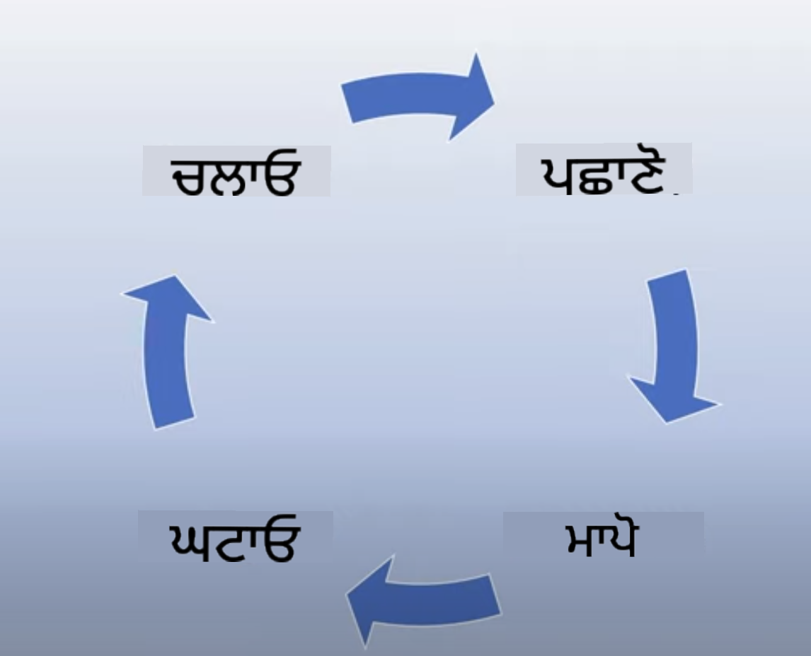
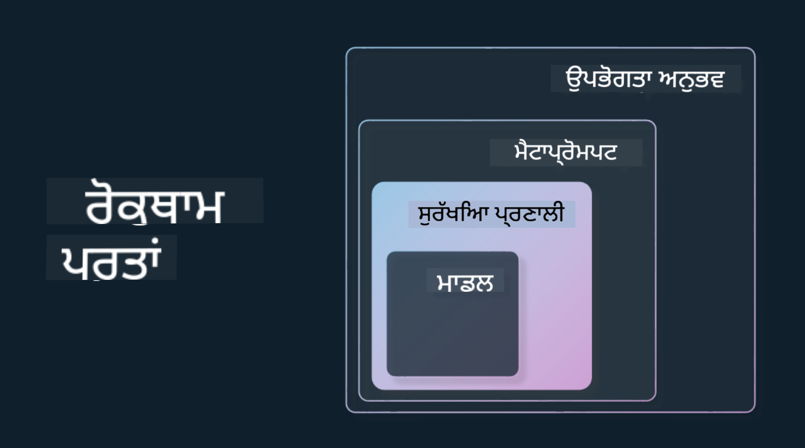

<!--
CO_OP_TRANSLATOR_METADATA:
{
  "original_hash": "7f8f4c11f8c1cb6e1794442dead414ea",
  "translation_date": "2025-07-09T08:53:34+00:00",
  "source_file": "03-using-generative-ai-responsibly/README.md",
  "language_code": "pa"
}
-->
# ਜਨਰੇਟਿਵ AI ਨੂੰ ਜ਼ਿੰਮੇਵਾਰੀ ਨਾਲ ਵਰਤਣਾ

> _ਇਸ ਪਾਠ ਦਾ ਵੀਡੀਓ ਦੇਖਣ ਲਈ ਉਪਰ ਦਿੱਤੀ ਤਸਵੀਰ 'ਤੇ ਕਲਿੱਕ ਕਰੋ_

AI ਅਤੇ ਖਾਸ ਕਰਕੇ ਜਨਰੇਟਿਵ AI ਨਾਲ ਮੋਹ ਪੈਣਾ ਆਸਾਨ ਹੈ, ਪਰ ਤੁਹਾਨੂੰ ਇਹ ਸੋਚਣਾ ਚਾਹੀਦਾ ਹੈ ਕਿ ਤੁਸੀਂ ਇਸਨੂੰ ਜ਼ਿੰਮੇਵਾਰੀ ਨਾਲ ਕਿਵੇਂ ਵਰਤੋਂਗੇ। ਤੁਹਾਨੂੰ ਇਹ ਵੀ ਧਿਆਨ ਵਿੱਚ ਰੱਖਣਾ ਚਾਹੀਦਾ ਹੈ ਕਿ ਨਤੀਜਾ ਨਿਰਪੱਖ, ਨੁਕਸਾਨ ਰਹਿਤ ਅਤੇ ਹੋਰ ਕਈ ਗੱਲਾਂ ਨੂੰ ਕਿਵੇਂ ਯਕੀਨੀ ਬਣਾਇਆ ਜਾਵੇ। ਇਹ ਅਧਿਆਇ ਤੁਹਾਨੂੰ ਇਸ ਸੰਦਰਭ, ਧਿਆਨ ਵਿੱਚ ਰੱਖਣ ਵਾਲੀਆਂ ਗੱਲਾਂ ਅਤੇ ਆਪਣੀ AI ਵਰਤੋਂ ਨੂੰ ਸੁਧਾਰਨ ਲਈ ਕਦਮ ਚੁੱਕਣ ਬਾਰੇ ਜਾਣਕਾਰੀ ਦੇਣ ਦਾ ਉਦੇਸ਼ ਰੱਖਦਾ ਹੈ।

## ਪਰਿਚਯ

ਇਸ ਪਾਠ ਵਿੱਚ ਇਹ ਗੱਲਾਂ ਕਵਰ ਕੀਤੀਆਂ ਜਾਣਗੀਆਂ:

- ਜਨਰੇਟਿਵ AI ਐਪਲੀਕੇਸ਼ਨਾਂ ਬਣਾਉਂਦੇ ਸਮੇਂ Responsible AI ਨੂੰ ਪਹਿਲ ਦੇਣ ਦੀ ਲੋੜ ਕਿਉਂ ਹੈ।
- Responsible AI ਦੇ ਮੁੱਖ ਸਿਧਾਂਤ ਅਤੇ ਉਹ ਜਨਰੇਟਿਵ AI ਨਾਲ ਕਿਵੇਂ ਜੁੜਦੇ ਹਨ।
- ਇਹ Responsible AI ਸਿਧਾਂਤਾਂ ਨੂੰ ਰਣਨੀਤੀ ਅਤੇ ਟੂਲਿੰਗ ਰਾਹੀਂ ਕਿਵੇਂ ਅਮਲ ਵਿੱਚ ਲਿਆਇਆ ਜਾਵੇ।

## ਸਿੱਖਣ ਦੇ ਲਕੜ

ਇਸ ਪਾਠ ਨੂੰ ਪੂਰਾ ਕਰਨ ਤੋਂ ਬਾਅਦ ਤੁਹਾਨੂੰ ਪਤਾ ਹੋਵੇਗਾ:

- ਜਨਰੇਟਿਵ AI ਐਪਲੀਕੇਸ਼ਨਾਂ ਬਣਾਉਂਦੇ ਸਮੇਂ Responsible AI ਦੀ ਮਹੱਤਤਾ।
- ਜਦੋਂ Responsible AI ਦੇ ਮੁੱਖ ਸਿਧਾਂਤਾਂ ਬਾਰੇ ਸੋਚਣਾ ਅਤੇ ਉਨ੍ਹਾਂ ਨੂੰ ਲਾਗੂ ਕਰਨਾ ਚਾਹੀਦਾ ਹੈ।
- Responsible AI ਦੇ ਸਿਧਾਂਤਾਂ ਨੂੰ ਅਮਲ ਵਿੱਚ ਲਿਆਉਣ ਲਈ ਤੁਹਾਡੇ ਕੋਲ ਕਿਹੜੇ ਟੂਲ ਅਤੇ ਰਣਨੀਤੀਆਂ ਉਪਲਬਧ ਹਨ।

## Responsible AI ਦੇ ਸਿਧਾਂਤ

ਜਨਰੇਟਿਵ AI ਦੀ ਉਤਸ਼ਾਹ ਕਦੇ ਵੀ ਇੰਨਾ ਵੱਧ ਨਹੀਂ ਸੀ। ਇਸ ਉਤਸ਼ਾਹ ਨੇ ਇਸ ਖੇਤਰ ਵਿੱਚ ਬਹੁਤ ਸਾਰੇ ਨਵੇਂ ਡਿਵੈਲਪਰ, ਧਿਆਨ ਅਤੇ ਫੰਡ ਲਿਆਏ ਹਨ। ਜਦੋਂ ਕਿ ਇਹ ਕਿਸੇ ਵੀ ਵਿਅਕਤੀ ਲਈ ਜੋ ਜਨਰੇਟਿਵ AI ਦੀ ਵਰਤੋਂ ਕਰਕੇ ਉਤਪਾਦ ਅਤੇ ਕੰਪਨੀਆਂ ਬਣਾਉਣਾ ਚਾਹੁੰਦਾ ਹੈ ਬਹੁਤ ਹੀ ਸਕਾਰਾਤਮਕ ਹੈ, ਇਹ ਵੀ ਜ਼ਰੂਰੀ ਹੈ ਕਿ ਅਸੀਂ ਜ਼ਿੰਮੇਵਾਰੀ ਨਾਲ ਅੱਗੇ ਵਧੀਏ।

ਇਸ ਕੋਰਸ ਦੌਰਾਨ, ਅਸੀਂ ਆਪਣੀ ਸਟਾਰਟਅਪ ਅਤੇ AI ਸਿੱਖਿਆ ਉਤਪਾਦ ਬਣਾਉਣ 'ਤੇ ਧਿਆਨ ਦੇ ਰਹੇ ਹਾਂ। ਅਸੀਂ Responsible AI ਦੇ ਸਿਧਾਂਤ ਵਰਤਾਂਗੇ: ਨਿਰਪੱਖਤਾ, ਸ਼ਾਮਿਲਤਾ, ਭਰੋਸੇਯੋਗਤਾ/ਸੁਰੱਖਿਆ, ਸੁਰੱਖਿਆ ਅਤੇ ਗੋਪਨੀਯਤਾ, ਪਾਰਦਰਸ਼ਤਾ ਅਤੇ ਜ਼ਿੰਮੇਵਾਰੀ। ਇਹਨਾਂ ਸਿਧਾਂਤਾਂ ਨਾਲ, ਅਸੀਂ ਵੇਖਾਂਗੇ ਕਿ ਇਹ ਸਾਡੇ ਉਤਪਾਦਾਂ ਵਿੱਚ ਜਨਰੇਟਿਵ AI ਦੀ ਵਰਤੋਂ ਨਾਲ ਕਿਵੇਂ ਜੁੜਦੇ ਹਨ।

## Responsible AI ਨੂੰ ਪਹਿਲ ਕਿਉਂ ਦੇਣੀ ਚਾਹੀਦੀ ਹੈ

ਕਿਸੇ ਉਤਪਾਦ ਨੂੰ ਬਣਾਉਂਦੇ ਸਮੇਂ, ਆਪਣੇ ਯੂਜ਼ਰ ਦੇ ਸਭ ਤੋਂ ਵਧੀਆ ਹਿਤ ਨੂੰ ਧਿਆਨ ਵਿੱਚ ਰੱਖ ਕੇ ਮਨੁੱਖ-ਕੇਂਦਰਿਤ ਦ੍ਰਿਸ਼ਟੀਕੋਣ ਅਪਣਾਉਣਾ ਸਭ ਤੋਂ ਵਧੀਆ ਨਤੀਜੇ ਲਿਆਉਂਦਾ ਹੈ।

ਜਨਰੇਟਿਵ AI ਦੀ ਖਾਸੀਅਤ ਇਹ ਹੈ ਕਿ ਇਹ ਯੂਜ਼ਰਾਂ ਲਈ ਮਦਦਗਾਰ ਜਵਾਬ, ਜਾਣਕਾਰੀ, ਮਾਰਗਦਰਸ਼ਨ ਅਤੇ ਸਮੱਗਰੀ ਤਿਆਰ ਕਰਨ ਦੀ ਸਮਰੱਥਾ ਰੱਖਦਾ ਹੈ। ਇਹ ਬਹੁਤ ਸਾਰੇ ਹੱਥੋਂ-ਹੱਥ ਕਦਮਾਂ ਤੋਂ ਬਿਨਾਂ ਕੀਤਾ ਜਾ ਸਕਦਾ ਹੈ, ਜਿਸ ਨਾਲ ਬਹੁਤ ਪ੍ਰਭਾਵਸ਼ਾਲੀ ਨਤੀਜੇ ਮਿਲ ਸਕਦੇ ਹਨ। ਪਰ ਯਥਾਰਥ ਯੋਜਨਾ ਅਤੇ ਰਣਨੀਤੀਆਂ ਦੇ ਬਿਨਾਂ, ਇਹ ਅਫਸੋਸਨਾਕ ਤੌਰ 'ਤੇ ਤੁਹਾਡੇ ਯੂਜ਼ਰਾਂ, ਤੁਹਾਡੇ ਉਤਪਾਦ ਅਤੇ ਸਮਾਜ ਲਈ ਨੁਕਸਾਨਦਾਇਕ ਨਤੀਜੇ ਵੀ ਲਿਆ ਸਕਦਾ ਹੈ।

ਆਓ ਕੁਝ (ਪਰ ਸਾਰੇ ਨਹੀਂ) ਸੰਭਾਵਿਤ ਨੁਕਸਾਨਦਾਇਕ ਨਤੀਜਿਆਂ 'ਤੇ ਨਜ਼ਰ ਮਾਰਦੇ ਹਾਂ:

### ਹਲੂਸੀਨੇਸ਼ਨ

ਹਲੂਸੀਨੇਸ਼ਨ ਉਹ ਸ਼ਬਦ ਹੈ ਜੋ ਇਸ ਵੇਲੇ ਵਰਤਿਆ ਜਾਂਦਾ ਹੈ ਜਦੋਂ ਕੋਈ LLM ਐਸਾ ਸਮੱਗਰੀ ਤਿਆਰ ਕਰਦਾ ਹੈ ਜੋ ਪੂਰੀ ਤਰ੍ਹਾਂ ਬੇਮਤਲਬ ਹੋਵੇ ਜਾਂ ਅਸੀਂ ਜਾਣਦੇ ਹਾਂ ਕਿ ਉਹ ਹੋਰ ਸੂਤਰਾਂ ਦੇ ਮੁਤਾਬਕ ਗਲਤ ਹੈ।

ਮਿਸਾਲ ਵਜੋਂ, ਸੋਚੋ ਅਸੀਂ ਆਪਣੀ ਸਟਾਰਟਅਪ ਲਈ ਇੱਕ ਫੀਚਰ ਬਣਾਇਆ ਹੈ ਜੋ ਵਿਦਿਆਰਥੀਆਂ ਨੂੰ ਮਾਡਲ ਨੂੰ ਇਤਿਹਾਸਕ ਸਵਾਲ ਪੁੱਛਣ ਦੀ ਆਗਿਆ ਦਿੰਦਾ ਹੈ। ਇੱਕ ਵਿਦਿਆਰਥੀ ਸਵਾਲ ਪੁੱਛਦਾ ਹੈ `Who was the sole survivor of Titanic?`

ਮਾਡਲ ਹੇਠਾਂ ਦਿੱਤੇ ਜਵਾਬ ਵਾਂਗ ਪ੍ਰਤੀਕਿਰਿਆ ਦਿੰਦਾ ਹੈ:

> _(ਸਰੋਤ: [Flying bisons](https://flyingbisons.com?WT.mc_id=academic-105485-koreyst))_

ਇਹ ਬਹੁਤ ਆਤਮਵਿਸ਼ਵਾਸੀ ਅਤੇ ਵਿਸਥਾਰਪੂਰਕ ਜਵਾਬ ਹੈ। ਪਰ ਅਫਸੋਸ, ਇਹ ਗਲਤ ਹੈ। ਥੋੜ੍ਹੀ ਖੋਜ ਨਾਲ ਪਤਾ ਲੱਗਦਾ ਹੈ ਕਿ ਟਾਈਟੈਨਿਕ ਹਾਦਸੇ ਦੇ ਇੱਕ ਤੋਂ ਵੱਧ ਬਚਾਏ ਗਏ ਸਨ। ਇੱਕ ਵਿਦਿਆਰਥੀ ਜੋ ਇਸ ਵਿਸ਼ੇ 'ਤੇ ਖੋਜ ਸ਼ੁਰੂ ਕਰ ਰਿਹਾ ਹੈ, ਇਹ ਜਵਾਬ ਕਾਫੀ ਪ੍ਰਭਾਵਸ਼ਾਲੀ ਹੋ ਸਕਦਾ ਹੈ ਕਿ ਉਹ ਇਸਨੂੰ ਸਵਾਲ ਨਾ ਕਰੇ ਅਤੇ ਇਸਨੂੰ ਸੱਚ ਮੰਨ ਲਏ। ਇਸਦਾ ਨਤੀਜਾ ਇਹ ਹੋ ਸਕਦਾ ਹੈ ਕਿ AI ਸਿਸਟਮ ਅਣਭਰੋਸੇਯੋਗ ਬਣ ਜਾਵੇ ਅਤੇ ਸਾਡੀ ਸਟਾਰਟਅਪ ਦੀ ਸਾਖ 'ਤੇ ਨਕਾਰਾਤਮਕ ਪ੍ਰਭਾਵ ਪਵੇ।

ਹਰ LLM ਦੇ ਹਰ ਨਵੇਂ ਸੰਸਕਰਣ ਨਾਲ, ਅਸੀਂ ਹਲੂਸੀਨੇਸ਼ਨ ਨੂੰ ਘਟਾਉਣ ਵਿੱਚ ਸੁਧਾਰ ਵੇਖਿਆ ਹੈ। ਇਸ ਸੁਧਾਰ ਦੇ ਬਾਵਜੂਦ, ਅਸੀਂ ਐਪਲੀਕੇਸ਼ਨ ਬਣਾਉਣ ਵਾਲੇ ਅਤੇ ਯੂਜ਼ਰ ਵਜੋਂ ਹਮੇਸ਼ਾ ਇਹਨਾਂ ਸੀਮਾਵਾਂ ਤੋਂ ਸਚੇਤ ਰਹਿਣਾ ਚਾਹੀਦਾ ਹੈ।

### ਨੁਕਸਾਨਦਾਇਕ ਸਮੱਗਰੀ

ਅਸੀਂ ਪਹਿਲਾਂ ਦੇ ਭਾਗ ਵਿੱਚ ਕਵਰ ਕੀਤਾ ਕਿ ਜਦੋਂ LLM ਗਲਤ ਜਾਂ ਬੇਮਤਲਬ ਜਵਾਬ ਦਿੰਦਾ ਹੈ। ਇੱਕ ਹੋਰ ਖਤਰਾ ਜਿਸ ਤੋਂ ਸਾਵਧਾਨ ਰਹਿਣਾ ਚਾਹੀਦਾ ਹੈ, ਉਹ ਹੈ ਜਦੋਂ ਮਾਡਲ ਨੁਕਸਾਨਦਾਇਕ ਸਮੱਗਰੀ ਪ੍ਰਦਾਨ ਕਰਦਾ ਹੈ।

ਨੁਕਸਾਨਦਾਇਕ ਸਮੱਗਰੀ ਨੂੰ ਇਸ ਤਰ੍ਹਾਂ ਪਰਿਭਾਸ਼ਿਤ ਕੀਤਾ ਜਾ ਸਕਦਾ ਹੈ:

- ਖੁਦ ਨੂੰ ਨੁਕਸਾਨ ਪਹੁੰਚਾਉਣ ਜਾਂ ਕੁਝ ਸਮੂਹਾਂ ਨੂੰ ਨੁਕਸਾਨ ਪਹੁੰਚਾਉਣ ਲਈ ਹਦਾਇਤਾਂ ਦੇਣਾ ਜਾਂ ਉਤਸ਼ਾਹਿਤ ਕਰਨਾ।
- ਨਫਰਤ ਭਰੀ ਜਾਂ ਤਲਖ ਸਮੱਗਰੀ।
- ਕਿਸੇ ਵੀ ਕਿਸਮ ਦੇ ਹਮਲੇ ਜਾਂ ਹਿੰਸਕ ਕਾਰਵਾਈ ਦੀ ਯੋਜਨਾ ਬਣਾਉਣ ਵਿੱਚ ਮਦਦ ਕਰਨਾ।
- ਗੈਰਕਾਨੂੰਨੀ ਸਮੱਗਰੀ ਲੱਭਣ ਜਾਂ ਗੈਰਕਾਨੂੰਨੀ ਕਾਰਵਾਈ ਕਰਨ ਦੀ ਹਦਾਇਤ ਦੇਣਾ।
- ਜਿਨਸੀ ਤੌਰ 'ਤੇ ਵਿਸਥਾਰਪੂਰਕ ਸਮੱਗਰੀ ਦਿਖਾਉਣਾ।

ਸਾਡੀ ਸਟਾਰਟਅਪ ਲਈ, ਅਸੀਂ ਇਹ ਯਕੀਨੀ ਬਣਾਉਣਾ ਚਾਹੁੰਦੇ ਹਾਂ ਕਿ ਸਾਡੇ ਕੋਲ ਸਹੀ ਟੂਲ ਅਤੇ ਰਣਨੀਤੀਆਂ ਹਨ ਤਾਂ ਜੋ ਵਿਦਿਆਰਥੀਆਂ ਨੂੰ ਇਸ ਤਰ੍ਹਾਂ ਦੀ ਸਮੱਗਰੀ ਨਾ ਵੇਖਣੀ ਪਵੇ।

### ਨਿਰਪੱਖਤਾ ਦੀ ਘਾਟ

ਨਿਰਪੱਖਤਾ ਦਾ ਮਤਲਬ ਹੈ “ਇਹ ਯਕੀਨੀ ਬਣਾਉਣਾ ਕਿ AI ਸਿਸਟਮ ਪੱਖਪਾਤ ਅਤੇ ਭੇਦਭਾਵ ਤੋਂ ਮੁਕਤ ਹੈ ਅਤੇ ਸਾਰੇ ਲੋਕਾਂ ਨਾਲ ਨਿਰਪੱਖ ਅਤੇ ਬਰਾਬਰੀ ਦਾ ਸਲੂਕ ਕਰਦਾ ਹੈ।” ਜਨਰੇਟਿਵ AI ਦੀ ਦੁਨੀਆ ਵਿੱਚ, ਅਸੀਂ ਇਹ ਯਕੀਨੀ ਬਣਾਉਣਾ ਚਾਹੁੰਦੇ ਹਾਂ ਕਿ ਮਾਡਲ ਦੇ ਨਤੀਜੇ ਮਾਰਜਿਨਲਾਈਜ਼ਡ ਸਮੂਹਾਂ ਦੇ ਬਾਹਰ ਕੱਢਣ ਵਾਲੇ ਵਿਚਾਰਧਾਰਾਵਾਂ ਨੂੰ ਮਜ਼ਬੂਤ ਨਾ ਕਰਨ।

ਇਹ ਤਰ੍ਹਾਂ ਦੇ ਨਤੀਜੇ ਸਿਰਫ ਸਾਡੇ ਯੂਜ਼ਰਾਂ ਲਈ ਸਕਾਰਾਤਮਕ ਉਤਪਾਦ ਅਨੁਭਵ ਬਣਾਉਣ ਵਿੱਚ ਰੁਕਾਵਟ ਨਹੀਂ ਪਾਉਂਦੇ, ਸਗੋਂ ਸਮਾਜਿਕ ਨੁਕਸਾਨ ਵੀ ਪਹੁੰਚਾਉਂਦੇ ਹਨ। ਐਪਲੀਕੇਸ਼ਨ ਬਣਾਉਣ ਵਾਲੇ ਵਜੋਂ, ਸਾਨੂੰ ਹਮੇਸ਼ਾ ਜਨਰੇਟਿਵ AI ਨਾਲ ਹੱਲ ਬਣਾਉਂਦੇ ਸਮੇਂ ਵਿਆਪਕ ਅਤੇ ਵਿਭਿੰਨ ਯੂਜ਼ਰ ਬੇਸ ਨੂੰ ਧਿਆਨ ਵਿੱਚ ਰੱਖਣਾ ਚਾਹੀਦਾ ਹੈ।

## ਜਨਰੇਟਿਵ AI ਨੂੰ ਜ਼ਿੰਮੇਵਾਰੀ ਨਾਲ ਕਿਵੇਂ ਵਰਤਣਾ ਹੈ

ਹੁਣ ਜਦੋਂ ਅਸੀਂ Responsible Generative AI ਦੀ ਮਹੱਤਤਾ ਨੂੰ ਸਮਝ ਲਿਆ ਹੈ, ਆਓ ਵੇਖੀਏ 4 ਕਦਮ ਜੋ ਅਸੀਂ ਆਪਣੀਆਂ AI ਹੱਲਾਂ ਨੂੰ ਜ਼ਿੰਮੇਵਾਰੀ ਨਾਲ ਬਣਾਉਣ ਲਈ ਲੈ ਸਕਦੇ ਹਾਂ:

### ਸੰਭਾਵਿਤ ਨੁਕਸਾਨਾਂ ਦੀ ਮਾਪ

ਸਾਫਟਵੇਅਰ ਟੈਸਟਿੰਗ ਵਿੱਚ, ਅਸੀਂ ਐਪਲੀਕੇਸ਼ਨ 'ਤੇ ਯੂਜ਼ਰ ਦੀ ਉਮੀਦ ਕੀਤੀ ਗਈ ਕਾਰਵਾਈਆਂ ਦੀ ਜਾਂਚ ਕਰਦੇ ਹਾਂ। ਇਸੇ ਤਰ੍ਹਾਂ, ਉਹਨਾਂ ਵੱਖ-ਵੱਖ ਪ੍ਰਾਂਪਟਾਂ ਦੀ ਜਾਂਚ ਕਰਨਾ ਜੋ ਯੂਜ਼ਰ ਸਭ ਤੋਂ ਜ਼ਿਆਦਾ ਵਰਤਣਗੇ, ਸੰਭਾਵਿਤ ਨੁਕਸਾਨ ਨੂੰ ਮਾਪਣ ਦਾ ਇੱਕ ਵਧੀਆ ਤਰੀਕਾ ਹੈ।

ਕਿਉਂਕਿ ਸਾਡੀ ਸਟਾਰਟਅਪ ਇੱਕ ਸਿੱਖਿਆ ਉਤਪਾਦ ਬਣਾ ਰਹੀ ਹੈ, ਇਸ ਲਈ ਸਿੱਖਿਆ ਨਾਲ ਸੰਬੰਧਿਤ ਪ੍ਰਾਂਪਟਾਂ ਦੀ ਸੂਚੀ ਤਿਆਰ ਕਰਨਾ ਚੰਗਾ ਰਹੇਗਾ। ਇਹ ਕਿਸੇ ਵਿਸ਼ੇ, ਇਤਿਹਾਸਕ ਤੱਥਾਂ ਅਤੇ ਵਿਦਿਆਰਥੀ ਜੀਵਨ ਬਾਰੇ ਹੋ ਸਕਦਾ ਹੈ।

### ਸੰਭਾਵਿਤ ਨੁਕਸਾਨਾਂ ਨੂੰ ਘਟਾਉਣਾ

ਹੁਣ ਸਮਾਂ ਹੈ ਇਹ ਲੱਭਣ ਦਾ ਕਿ ਅਸੀਂ ਮਾਡਲ ਅਤੇ ਇਸਦੇ ਜਵਾਬਾਂ ਵੱਲੋਂ ਪੈਦਾ ਹੋਣ ਵਾਲੇ ਸੰਭਾਵਿਤ ਨੁਕਸਾਨ ਨੂੰ ਕਿਵੇਂ ਰੋਕ ਸਕਦੇ ਹਾਂ ਜਾਂ ਘਟਾ ਸਕਦੇ ਹਾਂ। ਅਸੀਂ ਇਸਨੂੰ 4 ਵੱਖ-ਵੱਖ ਪੱਧਰਾਂ 'ਤੇ ਦੇਖ ਸਕਦੇ ਹਾਂ:

- **ਮਾਡਲ**। ਸਹੀ ਮਾਡਲ ਨੂੰ ਸਹੀ ਵਰਤੋਂ ਦੇ ਕੇ ਚੁਣਨਾ। ਵੱਡੇ ਅਤੇ ਜਟਿਲ ਮਾਡਲ ਜਿਵੇਂ GPT-4 ਛੋਟੇ ਅਤੇ ਵਿਸ਼ੇਸ਼ ਵਰਤੋਂ ਕੇਸਾਂ ਵਿੱਚ ਨੁਕਸਾਨਦਾਇਕ ਸਮੱਗਰੀ ਦਾ ਖਤਰਾ ਵਧਾ ਸਕਦੇ ਹਨ। ਆਪਣੇ ਟ੍ਰੇਨਿੰਗ ਡੇਟਾ ਨਾਲ ਫਾਈਨ-ਟਿਊਨਿੰਗ ਕਰਨਾ ਵੀ ਨੁਕਸਾਨਦਾਇਕ ਸਮੱਗਰੀ ਦੇ ਖਤਰੇ ਨੂੰ ਘਟਾਉਂਦਾ ਹੈ।

- **ਸੁਰੱਖਿਆ ਪ੍ਰਣਾਲੀ**। ਸੁਰੱਖਿਆ ਪ੍ਰਣਾਲੀ ਮਾਡਲ ਨੂੰ ਸਰਵ ਕਰ ਰਹੇ ਪਲੇਟਫਾਰਮ 'ਤੇ ਟੂਲਾਂ ਅਤੇ ਸੰਰਚਨਾਵਾਂ ਦਾ ਇੱਕ ਸੈੱਟ ਹੁੰਦੀ ਹੈ ਜੋ ਨੁਕਸਾਨ ਨੂੰ ਘਟਾਉਂਦੀ ਹੈ। ਉਦਾਹਰਨ ਵਜੋਂ, Azure OpenAI ਸੇਵਾ 'ਤੇ ਸਮੱਗਰੀ ਫਿਲਟਰਿੰਗ ਪ੍ਰਣਾਲੀ। ਪ੍ਰਣਾਲੀਆਂ ਨੂੰ ਜੇਲਬ੍ਰੇਕ ਹਮਲਿਆਂ ਅਤੇ ਬੋਟਾਂ ਵੱਲੋਂ ਕੀਤੀਆਂ ਗੈਰ-ਚਾਹਵੰਦ ਕਾਰਵਾਈਆਂ ਨੂੰ ਵੀ ਪਹਚਾਣਣਾ ਚਾਹੀਦਾ ਹੈ।

- **ਮੇਟਾਪ੍ਰਾਂਪਟ**। ਮੇਟਾਪ੍ਰਾਂਪਟ ਅਤੇ ਗ੍ਰਾਊਂਡਿੰਗ ਉਹ ਤਰੀਕੇ ਹਨ ਜਿਨ੍ਹਾਂ ਰਾਹੀਂ ਅਸੀਂ ਮਾਡਲ ਨੂੰ ਕੁਝ ਵਿਸ਼ੇਸ਼ ਵਰਤਾਰਿਆਂ ਅਤੇ ਜਾਣਕਾਰੀ ਦੇ ਆਧਾਰ 'ਤੇ ਦਿਸ਼ਾ ਦੇ ਸਕਦੇ ਹਾਂ ਜਾਂ ਸੀਮਿਤ ਕਰ ਸਕਦੇ ਹਾਂ। ਇਹ ਸਿਸਟਮ ਇਨਪੁੱਟਾਂ ਦੀ ਵਰਤੋਂ ਕਰਕੇ ਮਾਡਲ ਦੀਆਂ ਕੁਝ ਸੀਮਾਵਾਂ ਨਿਰਧਾਰਤ ਕਰ ਸਕਦਾ ਹੈ। ਇਸਦੇ ਨਾਲ-ਨਾਲ, ਉਹ ਨਤੀਜੇ ਪ੍ਰਦਾਨ ਕਰਦਾ ਹੈ ਜੋ ਸਿਸਟਮ ਦੇ ਖੇਤਰ ਜਾਂ ਡੋਮੇਨ ਨਾਲ ਹੋਰ ਸੰਬੰਧਿਤ ਹੁੰਦੇ ਹਨ।

ਇਸਦੇ ਨਾਲ, Retrieval Augmented Generation (RAG) ਵਰਗੀਆਂ ਤਕਨੀਕਾਂ ਦੀ ਵਰਤੋਂ ਕਰਕੇ ਮਾਡਲ ਨੂੰ ਸਿਰਫ ਭਰੋਸੇਯੋਗ ਸਰੋਤਾਂ ਤੋਂ ਜਾਣਕਾਰੀ ਖਿੱਚਣ ਲਈ ਕਹਿ ਸਕਦੇ ਹਾਂ। ਇਸ ਕੋਰਸ ਵਿੱਚ ਬਾਅਦ ਵਿੱਚ [ਸਰਚ ਐਪਲੀਕੇਸ਼ਨਾਂ ਬਣਾਉਣ](../08-building-search-applications/README.md?WT.mc_id=academic-105485-koreyst) ਬਾਰੇ ਪਾਠ ਹੈ।

- **ਯੂਜ਼ਰ ਅਨੁਭਵ**। ਆਖਰੀ ਪੱਧਰ ਉਹ ਹੈ ਜਿੱਥੇ ਯੂਜ਼ਰ ਸਾਡੇ ਐਪਲੀਕੇਸ਼ਨ ਦੇ ਇੰਟਰਫੇਸ ਰਾਹੀਂ ਸਿੱਧਾ ਮਾਡਲ ਨਾਲ ਇੰਟਰੈਕਟ ਕਰਦਾ ਹੈ। ਇਸ ਤਰੀਕੇ ਨਾਲ ਅਸੀਂ UI/UX ਨੂੰ ਇਸ ਤਰ੍ਹਾਂ ਡਿਜ਼ਾਈਨ ਕਰ ਸਕਦੇ ਹਾਂ ਕਿ ਯੂਜ਼ਰ ਮਾਡਲ ਨੂੰ ਭੇਜਣ ਵਾਲੇ ਇਨਪੁੱਟਾਂ ਦੀ ਕਿਸਮਾਂ 'ਤੇ ਸੀਮਾ ਲਗਾਈ ਜਾਵੇ ਅਤੇ ਯੂਜ਼ਰ ਨੂੰ ਦਿਖਾਈ ਜਾਣ ਵਾਲੇ ਟੈਕਸਟ ਜਾਂ ਤਸਵੀਰਾਂ 'ਤੇ ਵੀ। AI ਐਪਲੀਕੇਸ਼ਨ ਨੂੰ ਡਿਪਲੋਇ ਕਰਦੇ ਸਮੇਂ, ਸਾਨੂੰ ਇਹ ਵੀ ਪਾਰਦਰਸ਼ੀ ਹੋਣਾ ਚਾਹੀਦਾ ਹੈ ਕਿ ਸਾਡਾ ਜਨਰੇਟਿਵ AI ਐਪਲੀਕੇਸ਼ਨ ਕੀ ਕਰ ਸਕਦਾ ਹੈ ਅਤੇ ਕੀ ਨਹੀਂ।

ਸਾਡੇ ਕੋਲ [AI ਐਪਲੀਕੇਸ਼ਨਾਂ ਲਈ UX ਡਿਜ਼ਾਈਨ](../12-designing-ux-for-ai-applications/README.md?WT.mc_id=academic-105485-koreyst) ਲਈ ਪੂਰਾ ਪਾਠ ਹੈ।

- **ਮਾਡਲ ਦਾ ਮੁਲਾਂਕਣ ਕਰੋ**। LLMs ਨਾਲ ਕੰਮ ਕਰਨਾ ਚੁਣੌਤੀਪੂਰਨ ਹੋ ਸਕਦਾ ਹੈ ਕਿਉਂਕਿ ਸਾਡੇ ਕੋਲ ਹਮੇਸ਼ਾ ਮਾਡਲ ਦੇ ਟ੍ਰੇਨਿੰਗ ਡੇਟਾ 'ਤੇ ਕੰਟਰੋਲ ਨਹੀਂ ਹੁੰਦਾ। ਫਿਰ ਵੀ, ਸਾਨੂੰ ਹਮੇਸ਼ਾ ਮਾਡਲ ਦੇ ਪ੍ਰਦਰਸ਼ਨ ਅਤੇ ਨਤੀਜਿਆਂ ਦਾ ਮੁਲਾਂਕਣ ਕਰਨਾ ਚਾਹੀਦਾ ਹੈ। ਮਾਡਲ ਦੀ ਸਹੀਤਾ, ਸਮਾਨਤਾ, ਗ੍ਰਾਊਂਡਡਨੈੱਸ ਅਤੇ ਨਤੀਜੇ ਦੀ ਪ੍ਰਸੰਗਿਕਤਾ ਨੂੰ ਮਾਪਣਾ ਅਹੰਕਾਰਪੂਰਕ ਹੈ। ਇਹ ਸਟੇਕਹੋਲਡਰਾਂ ਅਤੇ ਯੂਜ਼ਰਾਂ ਨੂੰ ਪਾਰਦਰਸ਼ਤਾ ਅਤੇ ਭਰੋਸਾ ਪ੍ਰਦਾਨ ਕਰਦਾ ਹੈ।

### ਜ਼ਿੰਮੇਵਾਰ ਜਨਰੇਟਿਵ AI ਹੱਲ ਚਲਾਉਣਾ

ਆਪਣੀਆਂ AI ਐਪਲੀਕੇਸ਼ਨਾਂ ਦੇ ਆਲੇ-ਦੁਆਲੇ ਇੱਕ ਓਪਰੇਸ਼ਨਲ ਅਭਿਆਸ ਬਣਾਉਣਾ ਆਖਰੀ ਪੜਾਅ ਹੈ। ਇਸ ਵਿੱਚ ਸਾਡੀ ਸਟਾਰਟਅਪ ਦੇ ਹੋਰ ਹਿੱਸਿਆਂ ਜਿਵੇਂ ਕਿ ਕਾਨੂੰਨੀ ਅਤੇ ਸੁਰੱਖਿਆ ਟੀਮਾਂ ਨਾਲ ਸਾਂਝੇਦਾਰੀ ਕਰਨਾ ਸ਼ਾਮਲ ਹੈ ਤਾਂ ਜੋ ਅਸੀਂ ਸਾਰੇ ਨਿਯਮਾਂ ਦੀ ਪਾਲਣਾ ਕਰ ਰਹੇ ਹੋਈਏ। ਲਾਂਚ ਕਰਨ ਤੋਂ ਪਹਿਲਾਂ, ਅਸੀਂ ਡਿਲਿਵਰੀ, ਘਟਨਾਵਾਂ ਦੇ ਸੰਭਾਲ ਅਤੇ ਰੋਲਬੈਕ ਲਈ ਯੋਜਨਾਵਾਂ ਬਣਾਉਣੀਆਂ ਚਾਹੀਦੀਆਂ ਹਨ ਤਾਂ ਜੋ ਸਾਡੇ ਯੂਜ਼ਰਾਂ ਨੂੰ ਹੋਣ ਵਾਲੇ ਨੁਕਸਾਨ ਨੂੰ ਰੋਕਿਆ ਜਾ ਸਕੇ।

## ਟੂਲ

ਜਦੋਂ ਕਿ Responsible AI ਹੱਲ ਵਿਕਸਿਤ ਕਰਨ ਦਾ ਕੰਮ ਕਾਫੀ ਵੱਡਾ ਲੱਗ ਸਕਦਾ ਹੈ, ਇਹ ਮਿਹਨਤ ਬਹੁਤ ਹੀ ਲਾਇਕ ਹੈ। ਜ

**ਅਸਵੀਕਾਰੋਪੱਤਰ**:  
ਇਹ ਦਸਤਾਵੇਜ਼ AI ਅਨੁਵਾਦ ਸੇਵਾ [Co-op Translator](https://github.com/Azure/co-op-translator) ਦੀ ਵਰਤੋਂ ਕਰਕੇ ਅਨੁਵਾਦਿਤ ਕੀਤਾ ਗਿਆ ਹੈ। ਜਦੋਂ ਕਿ ਅਸੀਂ ਸਹੀਤਾ ਲਈ ਕੋਸ਼ਿਸ਼ ਕਰਦੇ ਹਾਂ, ਕਿਰਪਾ ਕਰਕੇ ਧਿਆਨ ਰੱਖੋ ਕਿ ਸਵੈਚਾਲਿਤ ਅਨੁਵਾਦਾਂ ਵਿੱਚ ਗਲਤੀਆਂ ਜਾਂ ਅਸਮਰਥਤਾਵਾਂ ਹੋ ਸਕਦੀਆਂ ਹਨ। ਮੂਲ ਦਸਤਾਵੇਜ਼ ਆਪਣੀ ਮੂਲ ਭਾਸ਼ਾ ਵਿੱਚ ਪ੍ਰਮਾਣਿਕ ਸਰੋਤ ਮੰਨਿਆ ਜਾਣਾ ਚਾਹੀਦਾ ਹੈ। ਮਹੱਤਵਪੂਰਨ ਜਾਣਕਾਰੀ ਲਈ, ਪੇਸ਼ੇਵਰ ਮਨੁੱਖੀ ਅਨੁਵਾਦ ਦੀ ਸਿਫਾਰਸ਼ ਕੀਤੀ ਜਾਂਦੀ ਹੈ। ਇਸ ਅਨੁਵਾਦ ਦੀ ਵਰਤੋਂ ਤੋਂ ਉਤਪੰਨ ਕਿਸੇ ਵੀ ਗਲਤਫਹਿਮੀ ਜਾਂ ਗਲਤ ਵਿਆਖਿਆ ਲਈ ਅਸੀਂ ਜ਼ਿੰਮੇਵਾਰ ਨਹੀਂ ਹਾਂ।