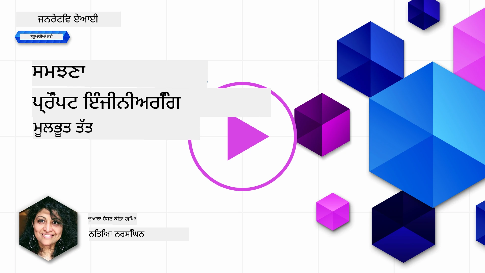
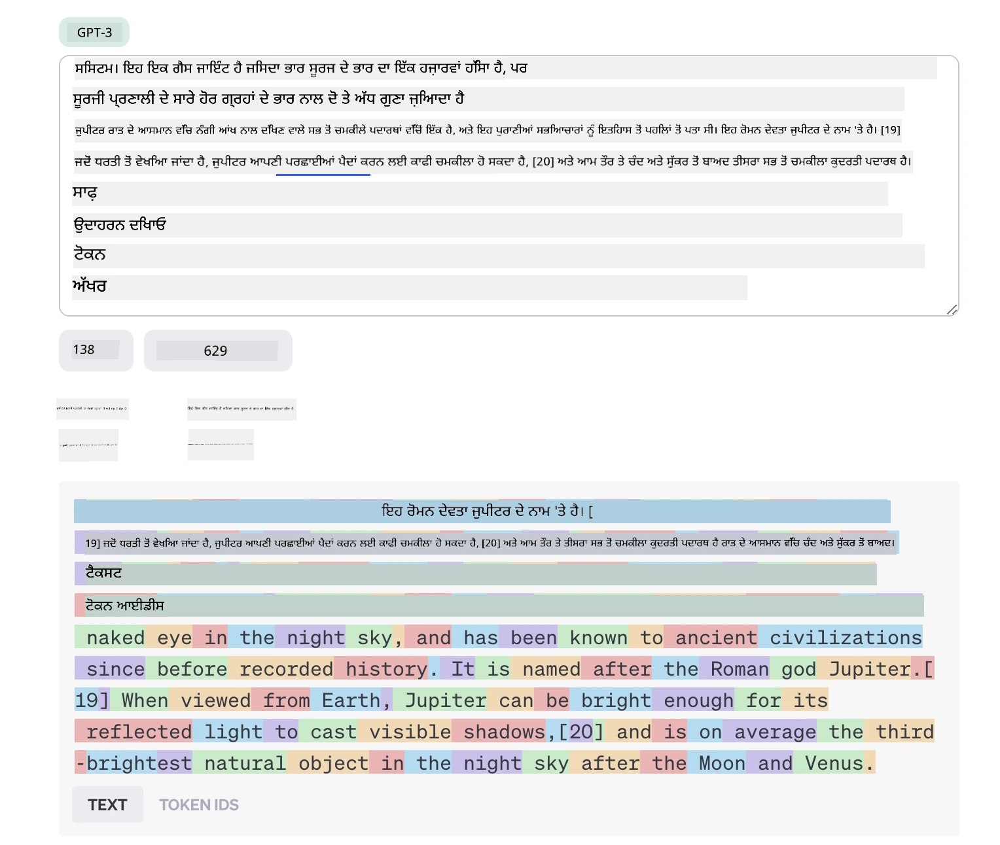
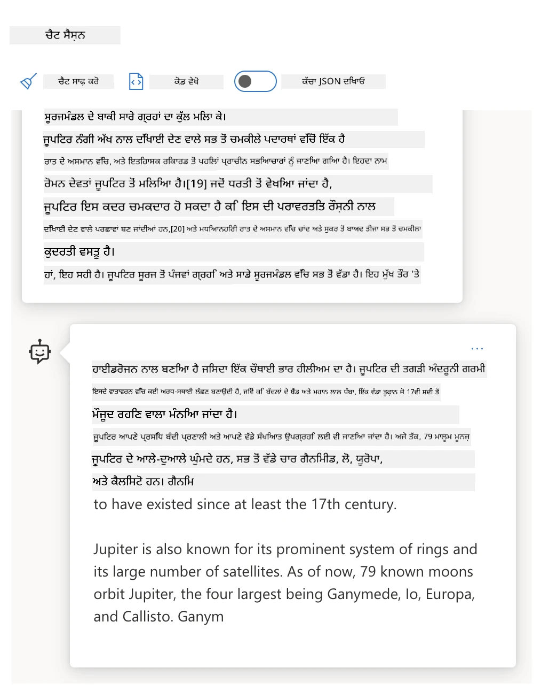
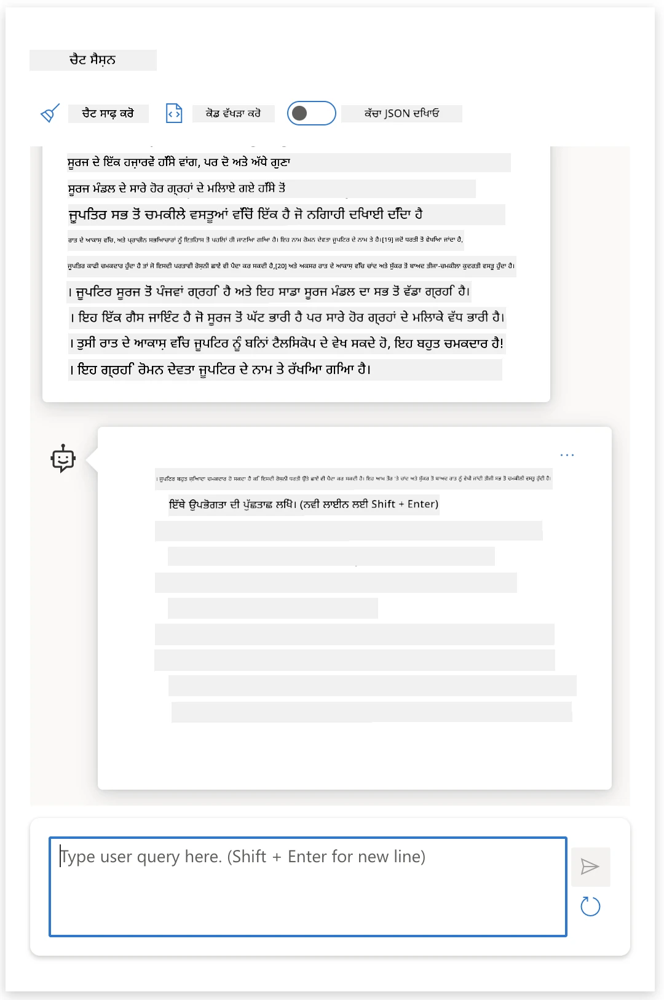
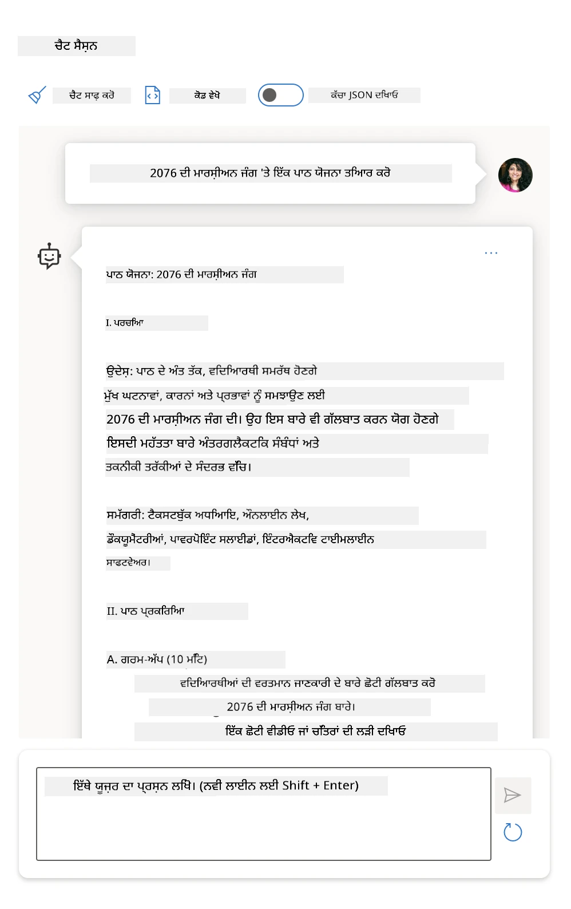
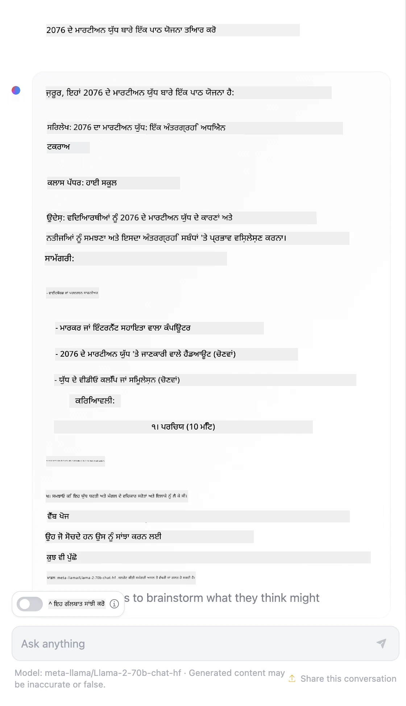

# ਪ੍ਰਾਪੰਪਟ ਇੰਜੀਨੀਅਰਿੰਗ ਮੂਲ ਭੂਤ

[](https://youtu.be/GElCu2kUlRs?si=qrXsBvXnCW12epb8)

## ਪਰਚਾਇ

ਇਹ ਮਾਡਿਊਲ ਜਨਰੇਟਿਵ ਏ.ਆਈ. ਮਾਡਲਾਂ ਵਿੱਚ ਪ੍ਰਭਾਵਸ਼ਾਲੀ ਪ੍ਰਾਪੰਪਟ ਬਣਾਉਣ ਲਈ ਜ਼ਰੂਰੀ ਸੰਕਲਪਾਂ ਅਤੇ ਤਕਨੀਕਾਂ ਨੂੰ ਕਵਰ ਕਰਦਾ ਹੈ। ਕਿਸ ਤਰ੍ਹਾਂ ਤੁਸੀਂ ਆਪਣੇ ਪ੍ਰਾਪੰਪਟ ਨੂੰ LLM ਨੂੰ ਲਿਖਦੇ ਹੋ, ਇਹ ਵੀ ਮਹੱਤਵਪੂਰਣ ਹੈ। ਧਿਆਨ ਨਾਲ ਤਿਆਰ ਕੀਤਾ ਗਿਆ ਪ੍ਰਾਪੰਪਟ ਬਿਹਤਰ ਗੁਣਵੱਤਾ ਦੀ ਪ੍ਰਤੀਕਿਰਿਆ ਹਾਸਲ ਕਰ ਸਕਦਾ ਹੈ। ਪਰ _ਪ੍ਰਾਪੰਪਟ_ ਅਤੇ _ਪ੍ਰਾਪੰਪਟ ਇੰਜੀਨੀਅਰਿੰਗ_ ਵਰਗੇ ਸ਼ਬਦ ਦਾ ਅਰਥ ਕੀ ਹੈ? ਅਤੇ ਮੈਂ LLM ਨੂੰ ਭੇਜੇ ਜਾਣ ਵਾਲੇ ਪ੍ਰਾਪੰਪਟ ਦੀ _ਇਨਪੁਟ_ ਨੂੰ ਕਿਵੇਂ ਸੁਧਾਰ ਸਕਦਾ ਹਾਂ? ਇਹ ਉਨ੍ਹਾਂ ਸਵਾਲਾਂ ਦੇ ਜਵਾਬ ਅਸੀਂ ਇਸ ਅਧਿਆਇ ਅਤੇ ਅਗਲੇ ਵਿੱਚ ਲੱਭਣ ਦੀ ਕੋਸ਼ਿਸ਼ ਕਰਾਂਗੇ।

_ਜਨਰੇਟਿਵ ਏ.ਆਈ._ ਉਪਭੋਗਤਾਵਾਂ ਦੀਆਂ ਬੇਨਤੀਆਂ ਦਾ ਜਵਾਬ ਦਿੰਦੀ ਨਵੀਂ ਸਮੱਗਰੀ ਬਣਾਉਣ ਵਿੱਚ ਸਮਰੱਥ ਹੈ (ਜਿਵੇਂ ਕਿ ਟੈਕਸਟ, ਚਿੱਤਰ, ਆਡੀਓ, ਕੋਡ ਆਦਿ)। ਇਹ ਕੁਦਰਤੀ ਭਾਸ਼ਾ ਅਤੇ ਕੋਡ ਲਈ ਪ੍ਰਸ਼ਿਖਤ _ਵੱਡੇ ਭਾਸ਼ਾ ਮਾਡਲਾਂ_ ਜਿਵੇਂ ਕਿ OpenAI ਦਾ GPT ("ਜਨਰੇਟਿਵ ਪ੍ਰੀ-ਟਰੈਨਡ ਟ੍ਰਾਂਸਫਰਮਰ") ਸੀਰੀਜ਼ ਵਰਤ ਕੇ ਇਹ ਪ੍ਰਾਪਤ ਕਰਦਾ ਹੈ।

ਹੁਣ ਉਪਭੋਗਤਾ ਇਹ ਮਾਡਲ ਚੈਟ ਵਰਗੀਆਂ ਜਾਣ-ਪਛਾਣ ਪ੍ਰਣਾਲੀਆਂ ਨਾਲ ਬਿਨਾ ਕਿਸੇ ਤਕਨੀਕੀ ਮਾਹਿਰਤਾ ਜਾਂ ਸਿਖਲਾਈ ਦੀ ਲੋੜ ਦੇ ਇੰਟਰੈਕਟ ਕਰ ਸਕਦੇ ਹਨ। ਇਹ ਮਾਡਲ _ਪ੍ਰਾਪੰਪਟ-ਆਧਾਰਿਤ_ ਹਨ - ਉਪਭੋਗਤਾ ਇੱਕ ਟੈਕਸਟ ਇਨਪੁਟ (ਪ੍ਰਾਪੰਪਟ) ਭੇਜਦੇ ਹਨ ਅਤੇ ਏ.ਆਈ. ਤੋਂ ਜਵਾਬ (ਪੂਰੀ) ਪ੍ਰਾਪਤ ਕਰਦੇ ਹਨ। ਫਿਰ ਉਹ ਬਾਰੰਬਾਰ "ਏ.ਆਈ. ਨਾਲ ਗੱਲਬਾਤ" ਕਰ ਸਕਦੇ ਹਨ, ਬਹੁ-ਚਰਣ ਸੰਵਾਦਾਂ ਵਿੱਚ, ਆਪਣਾ ਪ੍ਰਾਪੰਪਟ ਸੁਧਾਰਦੇ ਹੋਏ ਜੇ ਤਕ ਪ੍ਰਤੀਕਿਰਿਆ ਉਨ੍ਹਾਂ ਦੀ ਉਮੀਦਾਂ ਨਾਲ ਮੇਲ ਨਹੀਂ ਖਾਂਦੀ।

"ਪ੍ਰਾਪੰਪਟ" ਹੁਣ ਜਨਰੇਟਿਵ ਏ.ਆਈ. ਐਪਾਂ ਲਈ ਮੁੱਖ _ਪ੍ਰੋਗਰਾਮਿੰਗ ਇੰਟਰਫੇਸ_ ਬਣ ਜਾਂਦੇ ਹਨ, ਜੋ ਮਾਡਲਾਂ ਨੂੰ ਦੱਸਦੇ ਹਨ ਕਿ ਕੀ ਕਰਨਾ ਹੈ ਅਤੇ ਪਰਤਿਆ ਜਵਾਬਾਂ ਦੀ ਗੁਣਵੱਤਾ 'ਤੇ ਪ੍ਰਭਾਵ ਪਾਉਂਦੇ ਹਨ। "ਪ੍ਰਾਪੰਪਟ ਇੰਜੀਨੀਅਰਿੰਗ" ਇੱਕ ਤੇਜ਼ੀ ਨਾਲ ਵਧਦਾ ਖੇਤਰ ਹੈ ਜੋ ਪ੍ਰਾਪੰਪਟਾਂ ਦੇ _ਡਿਜ਼ਾਈਨ ਅਤੇ ਅੱਪਟਿਮਾਈਜ਼ੇਸ਼ਨ_ 'ਤੇ ਕੇਂਦ੍ਰਿਤ ਹੈ ਤਾਂ ਜੋ ਵੱਡੇ ਪੱਧਰ 'ਤੇ ਲਗਾਤਾਰ ਅਤੇ ਗੁਣਵੱਤਾ ਵਾਲੇ ਜਵਾਬ ਮਿਲ ਸਕਣ।

## ਸਿੱਖਣ ਦੇ ਲਕਸ਼

ਇਸ ਪਾਠ ਵਿੱਚ, ਅਸੀਂ ਜਾਣਾਂਗੇ ਕਿ ਪ੍ਰਾਪੰਪਟ ਇੰਜੀਨੀਅਰਿੰਗ ਕੀ ਹੈ, ਇਹ ਕਿਉਂ ਜ਼ਰੂਰੀ ਹੈ, ਅਤੇ ਅਸੀਂ ਕਿਸ ਤਰ੍ਹਾਂ ਵਧੀਆ ਪ੍ਰਭਾਵਸ਼ਾਲੀ ਪ੍ਰਾਪੰਪਟ ਤਿਆਰ ਕਰ ਸਕਦੇ ਹਾਂ ਕਿਸੇ ਮੁਤਿਆਰ ਮਾਡਲ ਅਤੇ ਕਾਰਜ ਦੇ ਲੱਕੜ ਉਦੇਸ਼ ਲਈ। ਅਸੀਂ ਪ੍ਰਾਪੰਪਟ ਇੰਜੀਨੀਅਰਿੰਗ ਲਈ ਮੁੱਖ ਸੰਕਲਪਾਂ ਅਤੇ ਸਭ ਤੋਂ ਵਧੀਆ ਅਮਲ ਜਾਣਾਂਗੇ - ਅਤੇ ਇੱਕ ਇੰਟਰੈਕਟਿਵ ਜੂਪਾਈਟਰ ਨੋਟਬੁੱਕਸ "sandbox" ਵਾਤਾਵਰਨ ਬਾਰੇ ਸਿੱਖਾਂਗੇ ਜਿੱਥੇ ਇਹ ਸੰਕਲਪ ਅਸਲੀ ਉਦਾਹਰਣਾਂ ਵਿੱਚ ਲਾਗੂ ਕੀਤੇ ਜਾਂਦੇ ਹਨ।

ਇਸ ਪਾਠ ਦੇ ਅੰਤ ਵਿੱਚ ਅਸੀਂ ਸਮਰੱਥ ਹੋਵਾਂਗੇ:

1. ਪ੍ਰਾਪੰਪਟ ਇੰਜੀਨੀਅਰਿੰਗ ਕੀ ਹੈ ਅਤੇ ਇਹ ਕਿਉਂ ਜ਼ਰੂਰੀ ਹੈ ਦੱਸਣਾ।
2. ਪ੍ਰਾਪੰਪਟ ਦੇ ਭਾਗਾਂ ਦਾ ਵਰਣਨ ਕਰਨਾ ਅਤੇ ਇਹ ਕਿਵੇਂ ਵਰਤੇ ਜਾਂਦੇ ਹਨ।
3. ਪ੍ਰਾਪੰਪਟ ਇੰਜੀਨੀਅਰਿੰਗ ਲਈ ਸਭ ਤੋਂ ਵਧੀਆ ਅਮਲ ਅਤੇ ਤਕਨੀਕਾਂ ਸਿੱਖਣਾ।
4. ਸਿੱਖੀਆਂ ਹੋਈਆਂ ਤਕਨੀਕਾਂ ਨੂੰ ਅਸਲੀ ਉਦਾਹਰਣਾਂ 'ਤੇ ਲਾਗੂ ਕਰਨਾ, OpenAI ਐਂਡਪੌਇੰਟ ਦੀ ਵਰਤੋਂ ਕਰਦੇ ਹੋਏ।

## ਮੁੱਖ ਸ਼ਬਦ

ਪ੍ਰਾਪੰਪਟ ਇੰਜੀਨੀਅਰਿੰਗ: ਮਾਡਲਾਂ ਨੂੰ ਚਾਹੇ ਗਏ ਨਤੀਜੇ ਉਤਪੰਨ ਕਰਨ ਲਈ ਗਾਈਡ ਕਰਨ ਵਾਲੇ ਇਨਪੁੱਟਾਂ ਦੀ ਡਿਜ਼ਾਈਨ ਅਤੇ ਸੁਧਾਰ ਕਰਨ ਦੀ ਅਭਿਆਸਿਕ ਪ੍ਰਣਾਲੀ।  
ਟੋਕਨਾਈਜ਼ੇਸ਼ਨ: ਟੈਕਸਟ ਨੂੰ ਛੋਟੇ ਇਕਾਈਆਂ (ਟੋਕਨਜ਼) ਵਿੱਚ ਬਦਲਣ ਦੀ ਪ੍ਰਕਿਰਿਆ, ਜਿਸਨੂੰ ਮਾਡਲ ਸਮਝ ਸਕਦਾ ਹੈ ਅਤੇ ਉਸ ਨੂੰ ਪ੍ਰਕਿਰਿਆ ਕਰ ਸਕਦਾ ਹੈ।  
ਇੰਸਟਰਕਸ਼ਨ-ਟਿਊਨਡ LLMs: ਵੱਡੇ ਭਾਸ਼ਾ ਮਾਡਲ (LLMs) ਜੋ ਖਾਸ ਇੰਸਟਰਕਸ਼ਨਾਂ ਨਾਲ ਬਿਹਤਰ ਜਵਾਬ ਦੇਣ ਲਈ ਸੁਧਾਰੇ ਗਏ ਹਨ।

## ਸਿੱਖਣ ਦਾ Sandbox

ਪ੍ਰਾਪੰਪਟ ਇੰਜੀਨੀਅਰਿੰਗ ਅਜੇ ਕਲਾ ਹੈ ਗਿਆਨ ਤੋਂ ਵੱਧ। ਇਸਦੇ ਲਈ ਸਾਡੀ ਸੂਝ-ਬੂਝ ਨੁੰਹ ਸੁਧਾਰਨ ਦਾ ਸਭ ਤੋਂ ਵਧੀਆ ਤਰੀਕਾ ਇਹ ਹੈ ਕਿ ਅਸੀਂ _ਵਧੇਰੇ ਅਭਿਆਸ ਕਰੀਏ_ ਅਤੇ ਇੱਕ ਟ੍ਰਾਇਲ-ਅਤੇ-ਐਰਰ ਪੱਧਤੀ ਅਪਣਾਈਏ ਜੋ ਐਪਲੀਕੇਸ਼ਨ ਖੇਤਰ ਦੀ ਮਹਾਰਤ ਨਾਲ ਸਲਾਹ-ਮਸ਼ਵਰਾ ਕੀਤੀਆਂ ਤਕਨੀਆਂ ਅਤੇ ਮਾਡਲ-ਮੁਲਕ ਸੁਧਾਰਾਂ ਨੂੰ ਮਿਲਾਉਂਦੀ ਹੈ।

ਇਸ ਪਾਠ ਨਾਲ ਜੁੜਿਆ ਜੂਪਾਈਟਰ ਨੋਟਬੁੱਕ ਇੱਕ _sandbox_ ਵਾਤਾਵਰਨ ਮੁਹੱਈਆ ਕਰਦਾ ਹੈ ਜਿੱਥੇ ਤੁਸੀਂ ਜੋ ਸਿੱਖਦੇ ਹੋ ਉਸਨੂੰ ਅਮਲ ਵਿੱਚ ਲਿਆ ਸਕਦੇ ਹੋ - ਜਾਂ ਤਾਂ ਅੱਗੇ ਜਾਂ ਕੋਡ ਚੈਲੇਂਜ ਦੇ ਹਿੱਸੇ ਵਜੋਂ। ਅਭਿਆਸਾਂ ਨੂੰ ਚਲਾਉਣ ਲਈ ਤੁਹਾਨੂੰ ਲੋੜ ਹੋਵੇਗੀ:

1. **ਇੱਕ Azure OpenAI API ਕੁੰਜੀ** - ਤਕਨੀਕੀ ਤੌਰ 'ਤੇ ਤੈਂਅਤ ਕੀਤਾ ਗਿਆ LLM ਲਈ ਸਰਵਿਸ ਐਂਡਪੌਇੰਟ।  
2. **ਇੱਕ Python ਰੰਟਾਈਮ** - ਜਿਸ ਵਿੱਚ ਨੋਟਬੁੱਕ ਚਲ ਰਿਹਾ ਹੋਵੇ।  
3. **ਲੋਕਲ ਐਨਵਾਇਰਨਮੈਂਟ ਵੈਰੀਏਬਲਜ਼** - _ਹੁਣੇ [SETUP](./../00-course-setup/02-setup-local.md?WT.mc_id=academic-105485-koreyst) ਕਦਮ ਪੂਰੇ ਕਰੋ_।

ਨੋਟਬੁੱਕ ਨਾਲ _ਸ਼ੁਰੂਆਤੀ_ ਅਭਿਆਸ ਆਉਂਦੇ ਹਨ - ਪਰ ਤੁਹਾਨੂੰ ਆਪਣੇ ਖ਼ਿਆਲਾਂ ਜਾਂ ਵਾਧੂ ਉਦਾਹਰਣਾਂ ਨੂੰ ਟ੍ਰਾਈ ਕਰਨ ਲਈ ਆਪਣਾ _Markdown_ (ਵਰਣਨ) ਅਤੇ _Code_ (ਪ੍ਰਾਪੰਪਟ ਬੇਨਤੀਆਂ) ਹਿੱਸੇ ਜੋੜਣ ਲਈ ਪ੍ਰੋਤਸਾਹਿਤ ਕੀਤਾ ਜਾਂਦਾ ਹੈ - ਅਤੇ ਪ੍ਰਾਪੰਪਟ ਡਿਜ਼ਾਈਨ ਲਈ ਆਪਣੀ ਸੂਝ-ਬੂਝ ਨੂੰ ਮਜ਼ਬੂਤ ਬਣਾਉਣਾ।

## ਦਰਸਾਈ ਗਈ ਰਹਿਨੁਮਾ

ਕੀ ਤੁਸੀਂ ਇਸ ਪਾਠ ਦਾ ਵਿਸ਼ਾਲ ਚਿੱਤਰ ਵੇਖਣਾ ਚਾਹੁੰਦੇ ਹੋ ਪਹਿਲਾਂ ਕਿ ਤੁਸੀਂ ਅੰਦਰ ਜਾਓ? ਇਸ ਦਰਸਾਈ ਗਈ ਮਾਰਗਦਰਸ਼ਕ ਨੂੰ ਚੈੱਕ ਕਰੋ, ਜੋ ਤੁਹਾਨੂੰ ਮੁੱਖ ਵਿਸ਼ਿਆਂ ਦੀ ਜਾਣਕਾਰੀ ਦੇਂਦਾ ਹੈ ਅਤੇ ਹਰ ਇਕ 'ਚ ਤੁਹਾਡੇ ਲਈ ਮੁੱਖ ਗੱਲਾਂ ਹਨ। ਪਾਠ ਰੋਡਮੈਪ ਤੁਹਾਨੂੰ ਮੂਲ ਸੰਕਲਪ ਅਤੇ ਚੁਣੌਤੀਆਂ ਨੂੰ ਸਮਝਣ ਤੋਂ ਲੈ ਕੇ ਸਮਝਦਾਰ ਪ੍ਰਾਪੰਪਟ ਇੰਜੀਨੀਅਰਿੰਗ ਤਕਨੀਕੀ ਅਤੇ ਵਧੀਆ ਪ੍ਰਭਾਵਸ਼ਾਲੀ ਅਮਲ ਨਾਲ ਉਨ੍ਹਾਂ ਨੂੰ ਨਿਪਟਾਉਣ ਦਿਖਾਉਂਦਾ ਹੈ। ਇਸ ਗਾਈਡ ਵਿੱਚ "ਉਨਤ ਤਕਨੀਕਾਂ" ਭਾਗ ਅਗਲੇ ਅਧਿਆਇ ਵਿੱਚ ਕਵਰੇਜ ਵਾਲੇ ਸਮੱਗਰੀ ਦੀ ਸੂਚੀ ਹੈ।


## ਸਾਡਾ ਸਟਾਰਟਅਪ

ਹੁਣ, ਆਓ ਗੱਲ ਕਰੀਏ ਕਿ _ਇਹ ਵਿਸ਼ਾ_ ਸਾਡੇ ਸਟਾਰਟਅਪ ਮਿਸ਼ਨ ਨਾਲ ਕਿਵੇਂ ਜੁੜਦਾ ਹੈ ਜੋ [ਇducation ਨੂੰ ਏ.ਆਈ. ਨਵੀਨੀਕਰਨ ਨਾਲ ਲੈ ਕੇ ਆਉਂਦਾ ਹੈ](https://educationblog.microsoft.com/2023/06/collaborating-to-bring-ai-innovation-to-education?WT.mc_id=academic-105485-koreyst)। ਅਸੀਂ _ਵਿਅਕਤਿਗਤ ਸਿੱਖਣ_ ਵਾਲੀਆਂ ਏ.ਆਈ.-ਚਲਤ ਐਪਲੀਕੇਸ਼ਨਾਂ ਬਣਾਉਣਾ ਚਾਹੁੰਦੇ ਹਾਂ - ਤਾਂ ਆਓ ਸੋਚੀਏ ਕਿ ਸਾਡੇ ਐਪਲੀਕੇਸ਼ਨ ਦੇ ਵੱਖ-ਵੱਖ ਉਪਭੋਗਤਾ ਕਿਵੇਂ "ਪ੍ਰਾਪੰਪਟ" ਦਾ ਡਿਜ਼ਾਈਨ ਕਰ ਸਕਦੇ ਹਨ:

- **ਪਰਬੰਧਕ** ਸ਼ਾਇਦ AI ਨੂੰ ਕਹਿਣ ਕਿ _ਕਰਿਕੁਲਮ ਡੇਟਾ ਦਾ ਵਿਸ਼ਲੇਸ਼ਣ ਕਰਕੇ ਕਵਰੇਜ ਵਿੱਚ ਖਾਮੀਆਂ ਦੀ ਪਹਿਚਾਣ ਕਰੋ_। AI ਨਤੀਜੇ ਸੰਖੇਪ ਕਰ ਸਕਦਾ ਹੈ ਜਾਂ ਕੋਡ ਨਾਲ ਵਿਜ਼ੂਲਾਈਜ਼ ਕਰ ਸਕਦਾ ਹੈ।  
- **ਅਧਿਆਪਕ** ਸ਼ਾਇਦ AI ਨੂੰ ਕਹਿਣ ਕਿ _ਲਕੜੀ ਦਰਸ਼ਕ ਅਤੇ ਵਿਸ਼ੇ ਲਈ ਪਾਠ ਯੋਜਨਾ ਤਿਆਰ ਕਰ�ੋ_। AI ਇੱਕ ਨਿਰਧਾਰਿਤ ਫਾਰਮੈਟ ਵਿੱਚ ਵਿਅਕਤੀਗਤ ਯੋਜਨਾ ਤਿਆਰ ਕਰ ਸਕਦਾ ਹੈ।  
- **ਵਿਦਿਆਰਥੀ** ਸ਼ਾਇਦ AI ਨੂੰ ਕਹਿਣ ਕਿ _ਉਹਨਾਂ ਨੂੰ ਇੱਕ ਮੁਸ਼ਕਲ ਵਿਸ਼ੇ ਵਿੱਚ ਟਿਊਟਰ ਕਰੋ_। ਹੁਣ AI ਵਿਦਿਆਰਥੀਆਂ ਨੂੰ ਉਨ੍ਹਾਂ ਦੇ ਸਤਰ ਦੇ ਅਨੁਕੂਲ ਪਾਠ, ਸੁਝਾਵ ਅਤੇ ਉਦਾਹਰਣਾਂ ਨਾਲ ਮਦਦ ਕਰ ਸਕਦਾ ਹੈ।

ਇਹ ਤਾਂ ਸਿਰਫ ਸ਼ੁਰੂਆਤ ਹੈ। [Prompts For Education](https://github.com/microsoft/prompts-for-edu/tree/main?WT.mc_id=academic-105485-koreyst) ਨੂੰ ਵੀ ਦੇਖੋ - ਵਿੱਦਿਆ ਮਹਿਰਾਂ ਦੁਆਰਾ ਸੰਭਾਲੀਆਂ ਗਈਆਂ ਓਪਨ-ਸੋਰਸ ਪ੍ਰਾਪੰਪਟ ਲਾਇਬ੍ਰੇਰੀ - ਇਸਦੇ ਨਾਲ ਇਸ ਮੂੰਹ ਭਰ ਪਰਦੇ ਦੇ ਮੌਕੇ ਬਾਰੇ ਹੋਰ ਜਾਣਕਾਰੀ ਮਿਲੇਗੀ! _ਕੈਂਚ ਪ੍ਰਾਪੰਪਟਸ ਨੂੰ ਸੈਂਡਬਾਕਸ ਵਿੱਚ ਜਾਂ OpenAI Playground ਵਿੱਚ ਚਲਾਉ ਕੇ ਦੇਖੋ ਕਿ ਕੀ ਹੁੰਦਾ ਹੈ!_

<!--  
LESSON TEMPLATE:
This unit should cover core concept #1.  
Reinforce the concept with examples and references.

CONCEPT #1:  
Prompt Engineering.  
Define it and explain why it is needed.  
-->

## ਪ੍ਰਾਪੰਪਟ ਇੰਜੀਨੀਅਰਿੰਗ ਕੀ ਹੈ?

ਅਸੀਂ ਇਸ ਪਾਠ ਦੀ ਸ਼ੁਰੂਆਤ ਕੀਤੀ ਸੀ **ਪ੍ਰਾਪੰਪਟ ਇੰਜੀਨੀਅਰਿੰਗ** ਨੂੰ ਇਸ ਤਰੀਕੇ ਨਾਲ ਪਰਿਭਾਸ਼ਿਤ ਕਰਕੇ ਕਿ ਇਹ ਵਰਤੋਂ ਬਾਰੇ ਇੱਕ ਤਕਨਿਕ ਹੈ ਜਿਸ ਵਿੱਚ ਕਿਸੇ ਮੁਤਿਆਰ ਕਾਰਜ ਉਦੇਸ਼ ਅਤੇ ਮਾਡਲ ਲਈ ਲਗਾਤਾਰ ਅਤੇ ਵਧੀਆ ਜਵਾਬ (ਪੂਰੀ) ਦੇਣ ਲਈ ਟੈਕਸਟ ਇਨਪੁੱਟ (ਪ੍ਰਾਪੰਪਟ) ਨੂੰ _ਡਿਜ਼ਾਈਨ ਅਤੇ ਸੁਧਾਰਨਾ_ ਸ਼ਾਮਲ ਹੈ। ਅਸੀਂ ਇਸਨੂੰ ਇੱਕ 2-ਕਦਮੀ ਪ੍ਰਕਿਰਿਆ ਵਜੋਂ ਸੋਚ ਸਕਦੇ ਹਾਂ:

- ਦਿੱਤੇ ਗਏ ਮਾਡਲ ਅਤੇ ਲਕੜ ਉਦੇਸ਼ ਲਈ ਮੁਢਲਾ ਪ੍ਰਾਪੰਪਟ _ਡਿਜ਼ਾਈਨ_ ਕਰਨਾ  
- ਜਵਾਬ ਦੀ ਗੁਣਵੱਤਾ ਸੁਧਾਰਨ ਲਈ ਪ੍ਰਾਪੰਪਟ ਦਾ ਕਈ ਵਾਰੀ _ਸੁਧਾਰ_ ਕਰਨਾ

ਇਹ ਜਰੂਰੀ ਤੌਰ 'ਤੇ ਇੱਕ ਟ੍ਰਾਇਲ-ਅਤੇ-ਐਰਰ ਪ੍ਰਕਿਰਿਆ ਹੈ ਜੋ ਸੱਭਿਆਚਾਰਿਕ ਸੁਝਾਂਈ ਅਤੇ ਮਿਹਨਤ ਦੀ ਮੰਗ ਕਰਦੀ ਹੈ ਤਾਂ ਜੋ ਵਧੀਆ ਨਤੀਜੇ ਮਿਲ ਸਕਣ। ਤਾਂ ਇਹ ਮਹੱਤਵਪੂਰਣ ਕਿਉਂ ਹੈ? ਇਸਦਾ ਜਵਾਬ ਦੇਣ ਲਈ ਸਾਨੂੰ ਪਹਿਲਾਂ ਤਿੰਨ ਸੰਕਲਪ ਸਮਝਣੇ ਪੈਣਗੇ:

- _ਟੋਕਨਾਈਜ਼ੇਸ਼ਨ_ = ਮਾਡਲ ਪ੍ਰਾਪੰਪਟ ਨੂੰ ਕਿਵੇਂ "ਦੇਖਦਾ" ਹੈ  
- _ਬੇਸ LLMs_ = ਫਾਊਂਡੇਸ਼ਨ ਮਾਡਲ ਪ੍ਰਾਪੰਪਟ ਨੂੰ ਕਿਵੇਂ "ਪ੍ਰਕਿਰਿਆ" ਕਰਦਾ ਹੈ  
- _ਇੰਸਟਰਕਸ਼ਨ-ਟਿਊਨਡ LLMs_ = ਮਾਡਲ ਹੁਣ "ਟਾਸਕ" ਕਿਵੇਂ ਵੇਖ ਸਕਦਾ ਹੈ

### ਟੋਕਨਾਈਜ਼ੇਸ਼ਨ

ਇੱਕ LLM ਪ੍ਰਾਪੰਪਟ ਨੂੰ ਟੋਕਨਾਂ ਦੀ ਇੱਕ _ਕ੍ਰਮ_ ਵਜੋਂ ਵੇਖਦਾ ਹੈ ਜਿੱਥੇ ਵੱਖ-ਵੱਖ ਮਾਡਲ (ਜਾਂ ਮਾਡਲ ਦੇ ਵਰਜਨ) ਇਕੋ ਜਿਹਾ ਪ੍ਰਾਪੰਪਟ ਵੱਖਰੇ ਤਰੀਕੇ ਨਾਲ ਟੋਕਨਾਈਜ਼ ਕਰ ਸਕਦੇ ਹਨ। ਕਿਉਂਕਿ LLMs ਟੋਕਨਾਂ 'ਤੇ ਤਿਆਰ ਕੀਤੇ ਜਾਂਦੇ ਹਨ (ਕੱਚੇ ਟੈਕਸਟ 'ਤੇ ਨਹੀਂ), ਇਸ ਲਈ ਇਹ ਜਰੂਰੀ ਹੈ ਕਿ ਪ੍ਰਾਪੰਪਟ ਵੱਧ ਚੰਗੀ ਤਰ੍ਹਾਂ ਟੋਕਨਾਈਜ਼ ਹੋਣ। ਇਹ ਹਰ ਪ੍ਰਟੀਕਿਰਿਆ ਦੀ ਗੁਣਵੱਤਾ 'ਤੇ ਸਿਧਾ ਪ੍ਰਭਾਵ ਪਾਉਂਦਾ ਹੈ।

ਟੋਕਨਾਈਜ਼ੇਸ਼ਨ ਬਾਰੇ ਸਮਝਣ ਲਈ, ਹੇਠਾਂ ਦਿੱਤੇ [OpenAI ਟੋਕਨਾਈਜ਼ਰ](https://platform.openai.com/tokenizer?WT.mc_id=academic-105485-koreyst) ਵਰਗੇ ਟੂਲ ਸਹਾਇਕ ਹਨ। ਆਪਾ ਆਪਣਾ ਪ੍ਰਾਪੰਪਟ ਇਥੇ ਨਕਲ ਕਰੋ ਅਤੇ ਦੇਖੋ ਕਿ ਇਹ ਕਿਵੇਂ ਟੋਕਨਾਂ ਵਿੱਚ ਬਦਲਦਾ ਹੈ, ਖ਼ਾਸ ਕਰਕੇ ਖ਼ਾਲੀ ਥਾਂ ਤੇ ਅੰਕ-ਵਿਚਾਰ ਚਿੰਨ੍ਹਾਂ ਦੇ ਕੰਮ ਵਿਖੇ ਧਿਆਨ ਦੇ। ਨੋਟ ਕਰੋ ਕਿ ਇਸ ਉਦਾਹਰਣ ਵਿੱਚ ਪੁਰਾਣਾ LLM (GPT-3) ਦਿਖਾਇਆ ਗਿਆ ਹੈ - ਇਸਨੂੰ ਕਿਸੇ ਨਵੇਂ ਮਾਡਲ ਨਾਲ ਟੈਸਟ ਕਰਨ 'ਤੇ ਨਤੀਜੇ ਵੱਖਰੇ ਹੋ ਸਕਦੇ ਹਨ।



### ਸੰਕਲਪ: ਫਾਊਂਡੇਸ਼ਨ ਮਾਡਲ

ਜਦੋਂ ਪ੍ਰਾਪੰਪਟ ਟੋਕਨਾਈਜ਼ ਕੀਤਾ ਜਾ ਚੁਕਾ ਹੁੰਦਾ ਹੈ, ਤਾਂ ["ਬੇਸ LLM"](https://blog.gopenai.com/an-introduction-to-base-and-instruction-tuned-large-language-models-8de102c785a6?WT.mc_id=academic-105485-koreyst) (ਜਾਂ ਫਾਊਂਡੇਸ਼ਨ ਮਾਡਲ) ਦਾ ਮੁੱਖ ਕੰਮ ਉਸ ਕ੍ਰਮ ਵਿੱਚ ਅਗਲਾ ਟੋਕਨ ਭਵਿੱਖਵਾਣੀ ਕਰਨਾ ਹੁੰਦਾ ਹੈ। ਕਿਉਂਕਿ LLMs ਵੱਡੇ ਟੈਕਸਟ ਡਾਟਾਸੇਟ 'ਤੇ ਪ੍ਰਸ਼ਿਖਤ ਹੁੰਦੇ ਹਨ, ਉਹ ਟੋਕਨਾਂ ਵਿੱਚ ਸAmongst the verstat relationships ਨੂੰ ਸਮਝਦੇ ਹਨ ਅਤੇ ਉਸਨੂੰ ਯਕੀਨੀ ਤੌਰ 'ਤੇ ਭਵਿੱਖਵਾਣੀ ਕਰ ਸਕਦੇ ਹਨ। ਨੋਟ ਕਰੋ ਕਿ ਇਹ ਸ਼ਬਦਾਂ ਦਾ ਅਰਥ ਨਹੀਂ ਸਮਝਦੇ; ਉਹ ਸਿਰਫ ਇੱਕ ਪੈਟਰਨ ਵੇਖਦੇ ਹਨ ਜਿਸਨੂੰ ਉਹ ਆਪਣੀ ਅਗਲੀ ਭਵਿੱਖਵਾਣੀ ਨਾਲ "ਪੂਰਾ" ਕਰ ਸਕਦੇ ਹਨ। ਇਹ ਸਲਾੜੀ ਅਦਾਂਤ ਤੱਕ ਜਾਰੀ ਰੱਖ ਸਕਦੇ ਹਨ ਜਦੋਂ ਤੱਕ ਯੂਜ਼ਰ ਦਖਲ ਨਹੀਂ ਦਿੰਦਾ ਜਾਂ ਪਹਿਲਾਂ ਤਯਾਰ ਕੀਤਾ ਕੋਈ ਸ਼ਰਤ ਪ੍ਰਾਪਤ ਨਹੀਂ ਹੁੰਦੀ।

ਤੁਸੀਂ ਪ੍ਰਾਪੰਪਟ-ਅਧਾਰਿਤ ਪੂਰੀ ਕਿਵੇਂ ਕੰਮ ਕਰਦੀ ਹੈ ਵੇਖਣਾ ਚਾਹੁੰਦੇ ਹੋ? Azure OpenAI Studio ਦੇ [_Chat Playground_](https://oai.azure.com/playground?WT.mc_id=academic-105485-koreyst) ਵਿੱਚ ਮעלੂਮਾਤੀ ਬੇਨਤੀ ਲਈ ਡਿਫ਼ਾਲਟ ਸੈਟਿੰਗਾਂ ਨਾਲ ਉਪਰੋਕਤ ਪ੍ਰਾਪੰਪਟ ਦਾਖਲ ਕਰੋ। ਸਿਸਟਮ ਇਸ ਤਰ੍ਹਾਂ ਕਾਂਫ਼ਿਗਰ ਕੀਤਾ ਗਿਆ ਹੈ ਕਿ ਪ੍ਰਾਪੰਪਟ ਨੂੰ ਜਾਣਕਾਰੀ ਦੀ ਬੇਨਤੀ ਵਜੋਂ ਲੈਂਦਾ ਹੈ - ਤਾਂ ਤੁਹਾਨੂੰ ਇਸ ਸੰਦਰਭ ਵਿੱਚ ਢੁਕਵਾਂ ਜਵਾਬ ਦੇਖਾਈ ਦੇਣਾ ਚਾਹੀਦਾ ਹੈ।

ਪਰ ਜੇ ਯੂਜ਼ਰ ਕਿਸੇ ਖ਼ਾਸ ਮਾਪਦੰਡ ਜਾਂ ਟਾਸਕ ਉਦੇਸ਼ ਨੂੰ ਪੂਰਾ ਕਰਦੀਆਂ ਚੀਜ਼ਾਂ ਦੇਖਣਾ ਚਾਹੁੰਦਾ ਹੈ? ਇਸ ਵਾਸਤੇ _ਇੰਸਟਰਕਸ਼ਨ-ਟਿਊਨਡ_ LLMs ਮਦਦਗਾਰ ਹਨ।



### ਸੰਕਲਪ: ਇੰਸਟਰਕਸ਼ਨ-ਟਿਊਨਡ LLMs

ਇੱਕ [ਇੰਸਟਰਕਸ਼ਨ-ਟਿਊਨਡ LLM](https://blog.gopenai.com/an-introduction-to-base-and-instruction-tuned-large-language-models-8de102c785a6?WT.mc_id=academic-105485-koreyst) ਫਾਊਂਡੇਸ਼ਨ ਮਾਡਲ ਨਾਲ ਸ਼ੁਰੂ ਹੁੰਦਾ ਹੈ ਅਤੇ ਸਪਸ਼ਟ ਹਦਾਇਤਾਂ ਵਾਲੇ ਉਦਾਹਰਣਾਂ ਜਾਂ ਇਨਪੁੱਟ/ਆਉਟਪੁੱਟ ਜੋੜਿਆਂ (ਜਿਵੇਂ ਕਿ ਬਹੁ-ਚਰਣ "ਸੰਦੇਸ਼") ਨਾਲ ਇਸਨੂੰ ਫ਼ਾਈਨ-ਟਿਊਨ ਕਰਦਾ ਹੈ ਜਿਸ ਨਾਲ ਏ.ਆਈ. ਨੂੰ ਉਸ ਹੁਕਮ ਦੀ ਪਾਲਣਾ ਕਰਨ ਦੀ ਕੋਸ਼ਿਸ਼ ਕਰਦਾ ਜਵਾਬ ਮਿਲਦੇ ਹਨ।

ਇਸ ਤਕਨੀਕ ਵਿੱਚ ਮਨੁੱਖੀ ਫੀਡਬੈਕ ਨਾਲ ਰੀਇਨਫੋਰਸਮੈਂਟ ਲਰਨਿੰਗ (RLHF) ਵਰਤੀ ਜਾਂਦੀ ਹੈ ਜੋ ਮਾਡਲ ਨੂੰ _ਹਦਾਇਤਾਂ ਦੀ ਪਾਲਣਾ_ ਅਤੇ _ਫੀਡਬੈਕ ਤੋਂ ਸਿੱਖਣ_ ਯੋਗ ਬਣਾਉਂਦੀ ਹੈ ਤਾਂ ਜੋ ਜਵਾਬ ਬਿਹਤਰ ਅਤੇ ਉਪਭੋਗਤਾ ਦੇ ਉਦਦੇਸ਼ਾਂ ਦੇ ਨਾਲ ਮੈਚ ਕਰਨ ਵਾਲੇ ਹੋਣ।

ਆਓ ਇਹ ਤਜਰਬਾ ਕਰੀਏ - ਉਪਰੋਕਤ ਪ੍ਰਾਪੰਪਟ 'ਤੇ ਵਾਪਸ ਜਾਓ ਪਰ ਹੁਣ _ਸਿਸਟਮ ਸੁਨੇਹਾ_ 'ਚ ਹੇਠਾਂ ਦਿੱਤੀ ਹਦਾਇਤ ਭੇਜੋ:

> _ਤੁਹਾਨੂੰ ਦਿੱਤੀ ਗਈ ਸਮੱਗਰੀ ਦਾ ਦੂਜੇ ਦਰਜੇ ਦੇ ਵਿਦਿਆਰਥੀ ਲਈ ਸੰਖੇਪ ਬਣਾ ਕਰੋ। ਨਤੀਜਾ ਇੱਕ ਪੈਰਾਗ੍ਰਾਫ ਅਤੇ 3-5 ਬੁਲੇਟ ਪੁਆਇੰਟਾਂ 'ਚ ਰੱਖੋ।_

ਦੇਖੋ ਕਿ ਜਵਾਬ ਹੁਣ ਲਕੜ ਉਦੇਸ਼ ਅਤੇ ਫਾਰਮੈਟ ਨਾਲ ਸੁਧਾਰਿਆ ਗਿਆ ਹੈ। ਇੱਕ ਅਧਿਆਪਕ ਹੁਣ ਇਸ ਜਵਾਬ ਨੂੰ ਸੀਝੇ ਆਪਣੇ ਸਲਾਈਡਾਂ ਲਈ ਵਰਤ ਸਕਦਾ ਹੈ।



## ਸਾਨੂੰ ਪ੍ਰਾਪੰਪਟ ਇੰਜੀਨੀਅਰਿੰਗ ਦੀ ਲੋੜ ਕਿਉਂ ਹੈ?

ਹੁਣ ਜਦੋਂ ਅਸੀਂ ਜਾਣਦੇ ਹਾਂ ਕਿ LLM ਪ੍ਰਾਪੰਪਟ ਨੂੰ ਕਿਵੇਂ ਪ੍ਰਕਿਰਿਆ ਕਰਦੇ ਹਨ, ਆਓ ਗੱਲ ਕਰੀਏ ਕਿ ਅਸੀਂ ਪ੍ਰਾਪੰਪਟ ਇੰਜੀਨੀਅਰਿੰਗ ਦੀ ਲੋੜ ਕਿਉਂ ਮਹਿਸੂਸ ਕਰਦੇ ਹਾਂ। ਜਵਾਬ ਇਹ ਹੈ ਕਿ ਮੌਜੂਦਾ LLMs ਵਿੱਚ ਕਈ ਚੁਣੌਤੀਆਂ ਹਨ ਜੋ _ਭਰੋਸੇਯੋਗ ਅਤੇ ਲਗਾਤਾਰ ਪੂਰੀਆਂ_ ਬਿਨਾਂ ਪ੍ਰਾਪੰਪਟ ਬਣਾਉਣ ਅਤੇ ਅੱਪਟਿਮਾਈਜ਼ੇਸ਼ਨ ਵਿੱਚ ਮਿਹਨਤ ਦੇ ਮੁਸ਼ਕਲ ਹੋ ਜਾਂਦੀਆਂ ਹਨ। ਉਦਾਹਰਣ ਲਈ:

1. **ਮਾਡਲ ਜਵਾਬ ਸਣੰਕੁਚਿਤ ਹਨ।** _ਇੱਕੋ ਪ੍ਰਾਪੰਪਟ_ ਵੱਖ-ਵੱਖ ਮਾਡਲਾਂ ਜਾਂ ਮਾਡਲ ਦੇ ਵਰਜਨਾਂ ਦੇ ਨਾਲ ਵੱਖਰੇ ਨਤੀਜੇ ਦੇ ਸਕਦਾ ਹੈ। ਇਹ ਇਕੋ ਮਾਡਲ ਨਾਲ ਵੱਖ-ਵੱਖ ਵਾਰਾਂ ਤੇ ਵੀ ਵੱਖਰਾ ਨਤੀਜਾ ਦੇ ਸਕਦਾ ਹੈ। _ਪ੍ਰਾਪੰਪਟ ਇੰਜੀਨੀਅਰਿੰਗ ਤਕਨੀਕਾਂ ਇਨ੍ਹਾਂ ਬਦਲਾਵਾਂ ਨੂੰ ਘਟਾਉਣ ਲਈ ਵਧੀਆ ਸੁਰੱਖਿਆ ਨਾਲ সাহাযਤ ਕਰਦੀਆਂ ਹਨ।_

1. **ਮਾਡਲ ਜਵਾਬਾਂ ਨੂੰ ਘੜਾ ਸਕਦੇ ਹਨ।** ਮਾਡਲ _ਵੱਡੇ ਪਰ ਸੀਮਿਤ_ ਡਾਟਾ 'ਤੇ ਪ੍ਰਸ਼ਿਖਤ ਹੁੰਦੇ ਹਨ, ਜਿਸਦਾ ਮਤਲਬ ਇਹ ਹੈ ਕਿ ਉਹ ਪਰਸ਼ਿਖਣ ਦਾਇਰੇ ਤੋਂ ਬਾਹਰ ਸੰਕਲਪਾਂ ਬਾਰੇ ਗਿਆਨ ਨਹੀਂ ਰੱਖਦੇ। ਇਸ ਲਈ, ਉਹ ਅਸਹੀ ਜਾਣਕਾਰੀ ਜਾਂ ਕਲਪਨਾਕਾਰੀ ਜਾਂ ਜ਼ਾਹਿਰ-ਸਪਸ਼ਟ ਤੌਰ 'ਤੇ ਸਹੀ ਤੱਥਾਂ ਦੇ ਵਿਰੁੱਧ ਪੂਰੀਆਂ ਪੈਦਾ ਕਰ ਸਕਦੇ ਹਨ। _ਪ੍ਰਾਪੰਪਟ ਇੰਜੀਨੀਅਰਿੰਗ ਉਪਭੋਗਤਾਵਾਂ ਨੂੰ ਇਹਾਂ ਫੈਬਰਿਕੇਸ਼ਨਾਂ ਦੀ ਪਛਾਣ ਕਰਨ ਅਤੇ ਉਨ੍ਹਾਂ ਨੂੰ ਘਟਾਉਣ ਵਿੱਚ ਮਦਦ ਕਰਦੀ ਹੈ ਜਿਵੇਂ ਕਿ AI ਤੋਂ ਹਵਾਲੇ ਜਾਂ ਤਰਕ ਪੂਛ ਕੇ।_

1. **ਮਾਡਲ ਦੀਆਂ ਸਮਰੱਥਾਵਾਂ ਵੱਖਰੀਆਂ ਹੋਣਗੀਆਂ।** ਨਵੇਂ ਮਾਡਲ ਜਾਂ ਮਾਡਲ ਪੀੜ੍ਹੀਆਂ ਵੱਧ ਸਮਰੱਥਾਵਾਂ ਵਾਲੀਆਂ ਹੁੰਦੀਆਂ ਹਨ ਪਰ ਨਾਲ ਹੀ ਖ਼ਰਚਾ ਅਤੇ ਕੰਪਲੀਕਸੀਟੀ ਵਿੱਚ ਨਵੀਂ ਵਿਸ਼ੇਸ਼ਤਾਵਾਂ ਅਤੇ ਤਰਕ-ਵਿਚਾਰ ਲਿਆਂਦਿਆਂ ਹਨ। _ਪ੍ਰਾਪੰਪਟ ਇੰਜੀਨੀਅਰਿੰਗ ਸਾਡੇ ਲਈ ਵਧੀਆ ਅਮਲ ਅਤੇ ਕੰਮ ਦੇ ਤਰੀਕਿਆਂ ਨੂੰ ਵਿਕਸਿਤ ਕਰਨ ਵਿੱਚ ਮਦਦ ਕਰਦੀ ਹੈ ਜੋ ਅੰਤਰਾਂ ਨੂੰ ਛਾਪਣ ਅਤੇ ਮਾਡਲ-ਵਿਸ਼ੇਸ਼ ਲੋੜਾਂ ਨਾਲ ਹੱਥ ਮੇਲ ਕਰਨ ਵਾਲੇ ਹਨ।_

ਆਓ ਇਸ ਨੂੰ OpenAI ਜਾਂ Azure OpenAI Playground ਵਿੱਚ ਅਮਲ ਵਿੱਚ ਵੇਖੀਏ:

- ਵੱਖ-ਵੱਖ LLM ਡਿਪਲੋਇਮੈਂਟ (ਜਿਵੇਂ OpenAI, Azure OpenAI, Hugging Face) ਨਾਲ ਇੱਕੋ ਪ੍ਰਾਪੰਪਟ ਦੀ ਵਰਤੋਂ ਕਰੋ - ਕੀ ਤੁਸੀਂ ਅੰਤਰ ਵੇਖਿਆ?  
- ਇੱਕੋ LLM ਡਿਪਲੋਇਮੈਂਟ ਨਾਲ ਬਾਰ-ਬਾਰ ਇੱਕੋ ਪ੍ਰਾਪੰਪਟ ਚਲਾਓ (ਜਿਵੇਂ Azure OpenAI playground) - ਇਹ ਵੱਖ-ਵੱਖ ਨਤੀਜੇ ਕਿਵੇਂ ਭਿੰਨ-ਭਿੰਨ ਸਨ?

### ਫੈਬਰਿਕੇਸ਼ਨਾਂ ਦਾ ਉਦਾਹਰਣ

ਇਸ ਕੋਰਸ ਵਿੱਚ ਅਸੀਂ ਸ਼ਬਦ **"ਫੈਬਰਿਕੇਸ਼ਨ"** ਇਸ ਪਰਿਭਾਸ਼ਾ ਲਈ ਵਰਤਦੇ ਹਾਂ ਜਦੋਂ LLMs ਕਈ ਵਾਰ ਆਪਣੇ ਪ੍ਰਸ਼ਿਖਣ ਜਾਂ ਹੋਰ ਸੀਮਤੀਆਂ ਕਾਰਨ ਤੱਥਾਂ ਵਿੱਚ ਗਲਤ ਜਾਣਕਾਰੀ ਪੈਦਾ ਕਰਦੇ ਹਨ। ਤੁਸੀਂ ਇਸਨੂੰ ਲੋਕਪ੍ਰਿਯ ਲੇਖਾਂ ਜਾਂ ਅਨੁਸ਼ੋਧਨ ਪੱਤਰਾਂ ਵਿੱਚ _"ਹੈਲੂਸੀਨੇਸ਼ਨ"_ ਵਜੋਂ ਵੀ ਸੁਣਿਆ ਹੋ ਸਕਦਾ ਹੈ। ਪਰ ਅਸੀਂ ਇਹ ਸੁਝਾਅ ਦਿੰਦੇ ਹਾਂ ਕਿ _"ਫੈਬਰਿਕੇਸ਼ਨ"_ ਸ਼ਬਦ ਵਰਤਿਆ ਜਾਵੇ ਤਾਂ ਜੋ ਅਸੀਂ ਗਲਤੀ ਨਾਲ ਇਸ ਵਿਹਾਰ ਨੂੰ ਮਨੁੱਖੀ ਦੀ ਕਿਸਮਤ ਨਾਲ ਜੋੜ ਕੇ anthropomorphize ਨਾ ਕਰੀਏ। ਇਹ [Responsible AI ਦਿਸ਼ਾ-ਨਿਰਦੇਸ਼ਾਂ](https://www.microsoft.com/ai/responsible-ai?WT.mc_id=academic-105485-koreyst) ਦੀ ਟਰਮੀਨੋਲੋਜੀਕਲ ਪ੍ਰਭਾਵਿਤ ਕਰਦਾ ਹੈ ਅਤੇ ਉਨ੍ਹਾਂ ਸ਼ਬਦਾਂ ਨੂੰ ਹਟਾਉਂਦਾ ਹੈ ਜਿਹੜੇ ਕੁਝ ਸੰਦਰਭਾਂ ਵਿੱਚ ਆਪੱਤੀਜਨਕ ਜਾਂ ਗੈਰ-ਸ਼ਾਮਿਲ ਕਹੇ ਜਾ ਸਕਦੇ ਹਨ।

ਫੈਬਰਿਕੇਸ਼ਨਾਂ ਕਿਵੇਂ ਕੰਮ ਕਰਦੀਆਂ ਹਨ ਇਹ ਜਾਣਨ ਲਈ, ਸੋਚੋ ਕਿ ਇੱਕ ਪ੍ਰਾਪੰਪਟ AI ਨੂੰ ਅਜਿਹਾ ਸਮੱਗਰੀ ਬਨਾਉਣ ਲਈ ਕਹਿੰਦਾ ਹੈ ਜੋ ਮੌਜੂਦਾ ਡਾਟਾ 'ਚ ਨਹੀਂ ਮਿਲਦੀ। ਉਦਾਹਰਣ ਵਜੋਂ - ਮੈਂ ਇਹ ਪ੍ਰਾਪੰਪਟ ਟ੍ਰਾਈ ਕੀਤਾ:

> **ਪ੍ਰਾਪੰਪਟ:** ਮਾਰਸ਼ੀਅਨ ਵਾਰ 2076 ਬਾਰੇ ਪਾਠ ਯੋਜਨਾ ਤਿਆਰ ਕਰੋ।
ਇੱਕ ਵੈੱਬ ਖੋਜ ਨੇ ਮੈਨੂੰ ਦਿਖਾਇਆ ਕਿ ਮਾਰਸ਼ੀ ਲੜਾਈਆਂ ਬਾਰੇ ਕਾਲਪਨਿਕ ਕਹਾਣੀਆਂ (ਜਿਵੇਂ, ਟੈਲੀਵਿਜ਼ਨ ਸੀਰੀਜ਼ ਜਾਂ ਕਿਤਾਬਾਂ) ਹਨ - ਪਰ 2076 ਵਿੱਚ ਨਹੀਂ। ਸਾਂਝੀ ਸਮਝ ਵੀ ਸਾਨੂੰ ਦੱਸਦੀ ਹੈ ਕਿ 2076 _ਭਵਿੱਖ ਵਿੱਚ_ ਹੈ ਅਤੇ ਇਸ ਲਈ ਇਸਨੂੰ ਕਿਸੇ ਅਸਲ ਘਟਨਾ ਨਾਲ ਜੋੜਿਆ ਨਹੀਂ ਜਾ ਸਕਦਾ।

ਤਾਂ ਜੋ ਹੁੰਦਾ ਹੈ ਜਦੋਂ ਅਸੀਂ ਇਹ ਪ੍ਰਾਂਪਟ ਵੱਖ-ਵੱਖ LLM ਪ੍ਰਦਾਤਿਆਂ ਨਾਲ ਚਲਾਈਏ?

> **ਪ੍ਰਤੀਕਿਰਿਆ 1**: OpenAI Playground (GPT-35)


> **ਪ੍ਰਤੀਕਿਰਿਆ 2**: Azure OpenAI Playground (GPT-35)



> **ਪ੍ਰਤੀਕਿਰਿਆ 3**: : Hugging Face Chat Playground (LLama-2)



ਜਿਵੇਂ ਉਮੀਦ ਕੀਤੀ ਗਈ ਸੀ, ਹਰ ਮਾਡਲ (ਜਾਂ ਮਾਡਲ ਸੰਸਕਰਣ) ਕੁਝ ਹੱਦ ਤੱਕ ਵੱਖ-ਵੱਖ ਪ੍ਰਤੀਕਿਰਿਆਵਾਂ ਪੈਦਾ ਕਰਦਾ ਹੈ ਧੰਨਵਾਦ ਉਸਦੇ ਸਟੋਕਾਸਟਿਕ ਵਰਤਾਰਾ ਅਤੇ ਮਾਡਲ ਯੋਗਤਾ ਵਿੱਚ ਫਰਕਾਂ ਦਾ। ਉਦਾਹਰਨ ਵਜੋਂ, ਇੱਕ ਮਾਡਲ 8ਵੀਂ ਜਮਾਤ ਦੇ ਦਰਸ਼ਕਾਂ ਨੂੰ ਨਿਸ਼ਾਨਾ ਬਣਾਉਂਦਾ ਹੈ ਜਦਕਿ ਦੂਜਾ ਉੱਚ-ਸਕੂਲ ਦੇ ਵਿਦਿਆਰਥੀ ਨੂੰ ਮੰਨਦਾ ਹੈ। ਪਰ ਸਾਰੇ ਤਿੰਨ ਮਾਡਲਾਂ ਨੇ ਉਹ ਜਵਾਬ ਦਿੱਤੇ ਜੋ ਇੱਕ ਅਣਜਾਣ ਵਰਤੋਂਕਾਰ ਨੂੰ ਇਹ ਭਰੋਸਾ ਦੇ ਸਕਦੇ ਹਨ ਕਿ ਇਹ ਘਟਨਾ ਅਸਲੀ ਹੈ।

ਪ੍ਰਾਂਪਟ ਇੰਜੀਨੀਅਰਿੰਗ ਤਕਨੀਕਾਂ ਜਿਵੇਂ ਕਿ _ਮੈਟਾਪ੍ਰਾਂਪਟਿੰਗ_ ਅਤੇ _ਟੈਮਪਰੇਚਰ ਕੰਫਿਗਰੇਸ਼ਨ_ ਕੁਝ ਹੱਦ ਤੱਕ ਮਾਡਲ ਦੀਆਂ ਕਪਟਕਥਨਾਂ ਨੂੰ ਘਟਾ ਸਕਦੀਆਂ ਹਨ। ਨਵੀਂ ਪ੍ਰਾਂਪਟ ਇੰਜੀਨੀਅਰਿੰਗ _ਆਰਕੀਟੈਕਚਰਾਂ_ ਵੀ ਨਵੀਨਤਮ ਸੰਦ ਅਤੇ ਤਕਨੀਕਾਂ ਨੂੰ ਪ੍ਰਾਂਪਟ ਪ੍ਰਵਾਹ ਵਿੱਚ ਬਿਨਾਂ ਰੁਕਾਵਟ ਸ਼ਾਮਲ ਕਰਦੀਆਂ ਹਨ, ਤਾਂ ਜੋ ਕੁਝ ਇਸ ਤਰ੍ਹਾਂ ਦੇ ਪ੍ਰਭਾਵਾਂ ਨੂੰ ਘਟਾਇਆ ਜਾ ਸਕੇ।

## ਕੇਸ ਸਟੱਡੀ: GitHub ਕੋਪਾਇਲਟ

ਚਲੋ ਇਸ ਭਾਗ ਨੂੰ ਸਮਾਪਤ ਕਰੀਏ ਇੱਕ ਕੇਸ ਸਟੱਡੀ ਦੇਖ ਕੇ ਕਿ ਕਿਵੇਂ ਪ੍ਰਾਂਪਟ ਇੰਜੀਨੀਅਰਿੰਗ ਨੂੰ ਅਸਲੀ ਦੁਨੀਆ ਦੇ ਹੱਲਾਂ ਵਿੱਚ ਵਰਤਿਆ ਜਾਂਦਾ ਹੈ: [GitHub Copilot](https://github.com/features/copilot?WT.mc_id=academic-105485-koreyst)।

GitHub Copilot ਤੁਹਾਡਾ "ਏਆਈ ਜੋੜੀ ਪ੍ਰੋਗ੍ਰਾਮਰ" ਹੈ - ਇਹ ਟੈਕਸਟ ਪ੍ਰਾਂਪਟਾਂ ਨੂੰ ਕੋਡ ਪੂਰੇ ਹੋਣ ਵਿੱਚ ਬਦਲਦਾ ਹੈ ਅਤੇ ਤੁਹਾਡੇ ਵਿਕਾਸ ਪਰਿਵਾਰਤਨ (ਜਿਵੇਂ, Visual Studio Code) ਵਿੱਚ ਬਰਾਬਰ ਦੀ ਵਰਤੋਂ ਦੇ ਲਈ ਏਕਠੇ ਕੀਤਾ ਗਿਆ ਹੈ। ਹੇਠਾਂ ਦਿੱਤੀਆਂ ਬਲਾਗ ਰੇਖਾਵਾਂ ਵਿੱਚ ਦਰਸਾਇਆ ਗਿਆ ਹੈ ਕਿ ਪਹਿਲਾ ਸੰਸਕਰਣ OpenAI Codex ਮਾਡਲ 'ਤੇ ਆਧਾਰਿਤ ਸੀ - ਇੰਜੀਨੀਅਰਾਂ ਨੇ ਜਲਦੀ ਹੀ ਮਾਡਲ ਨੂੰ ਬਿਹਤਰ ਬਣਾਉਣ ਅਤੇ ਬਿਹਤਰ ਪ੍ਰਾਂਪਟ ਇੰਜੀਨੀਅਰਿੰਗ ਤਕਨੀਕਾਂ ਵਿਕਸਿਤ ਕਰਨ ਦੀ ਲੋੜ ਸਮਝੀ, ਤਾਂ ਜੋ ਕੋਡ ਗੁਣਵੱਤਾ ਸੁਧਰੇ। ਜੁਲਾਈ ਵਿੱਚ, ਉਹ [ਇੱਕ ਸੁਧਾਰਿਆ ਹੋਇਆ ਏਆਈ ਮਾਡਲ ਮੁਹੱਈਆ ਕਰਵਾਇਆ ਜੋ Codex ਤੋਂ ਅੱਗੇ ਵਧਦਾ ਹੈ](https://github.blog/2023-07-28-smarter-more-efficient-coding-github-copilot-goes-beyond-codex-with-improved-ai-model/?WT.mc_id=academic-105485-koreyst) ਜ਼ਿਆਦਾ ਤੇਜ਼ ਸਿਫਾਰਸ਼ਾਂ ਲਈ।

ਇਨ੍ਹਾਂ ਪੋਸਟਾਂ ਨੂੰ ਕ੍ਰਮਵਾਰ ਪੜ੍ਹੋ, ਤਾਂ ਜੋ ਉਹਨਾਂ ਦੀ ਸਿੱਖਣ ਦੀ ਯਾਤਰਾ ਨੂੰ ਫਾਲੋ ਕੀਤਾ ਜਾ ਸਕੇ।

- **ਮਈ 2023** | [GitHub Copilot ਤੁਹਾਡੇ ਕੋਡ ਨੂੰ ਸਮਝਣ ਵਿੱਚ ਬਿਹਤਰ ਹੋ ਰਿਹਾ ਹੈ](https://github.blog/2023-05-17-how-github-copilot-is-getting-better-at-understanding-your-code/?WT.mc_id=academic-105485-koreyst)
- **ਮਈ 2023** | [GitHub ਦੇ ਅੰਦਰ: GitHub Copilot ਦੇ ਪਿੱਛੇ LLMs ਨਾਲ ਕੰਮ ਕਰਨਾ](https://github.blog/2023-05-17-inside-github-working-with-the-llms-behind-github-copilot/?WT.mc_id=academic-105485-koreyst)
- **ਜੂਨ 2023** | [GitHub Copilot ਲਈ ਬਿਹਤਰ ਪ੍ਰਾਂਪਟ ਕਿਵੇਂ ਲਿਖਣੇ](https://github.blog/2023-06-20-how-to-write-better-prompts-for-github-copilot/?WT.mc_id=academic-105485-koreyst)
- **ਜੁਲਾਈ 2023** | [.. GitHub Copilot Codex ਤੋਂ ਅੱਗੇ ਵਧਦਾ ਹੈ ਸੁਧਾਰਿਆ ਹੋਇਆ ਏਆਈ ਮਾਡਲ ਨਾਲ](https://github.blog/2023-07-28-smarter-more-efficient-coding-github-copilot-goes-beyond-codex-with-improved-ai-model/?WT.mc_id=academic-105485-koreyst)
- **ਜੁਲਾਈ 2023** | [ਪ੍ਰਾਂਪਟ ਇੰਜੀਨੀਅਰਿੰਗ ਅਤੇ LLMs ਲਈ ਡਿਵੈਲਪਰ ਦੀ ਗਾਈਡ](https://github.blog/2023-07-17-prompt-engineering-guide-generative-ai-llms/?WT.mc_id=academic-105485-koreyst)
- **ਸਤੰਬਰ 2023** | [ਇਨਟਰੇਪ੍ਰਾਈਜ਼ LLM ਐਪ ਕਿਵੇਂ ਬਣਾਈਏ: GitHub Copilot ਤੋਂ ਸਿੱਖਣ](https://github.blog/2023-09-06-how-to-build-an-enterprise-llm-application-lessons-from-github-copilot/?WT.mc_id=academic-105485-koreyst)

ਤੁਸੀਂ ਉਹਨਾਂ ਦੇ [ਇੰਜੀਨੀਅਰਿੰਗ ਬਲਾਗ](https://github.blog/category/engineering/?WT.mc_id=academic-105485-koreyst) ਨੂੰ ਵੀ ਬ੍ਰਾਉਜ਼ ਕਰ ਸਕਦੇ ਹੋ ਜੋ [ਇਸ ਤਰ੍ਹਾਂ ਦੀਆਂ ਪੋਸਟਾਂ](https://github.blog/2023-09-27-how-i-used-github-copilot-chat-to-build-a-reactjs-gallery-prototype/?WT.mc_id=academic-105485-koreyst) ਵਰਗੀਆਂ ਹਨ, ਜੋ ਦਿਖਾਉਂਦੀਆਂ ਹਨ ਕਿ ਇਹ ਮਾਡਲ ਅਤੇ ਤਕਨੀਕਾਂ ਅਸਲ ਦੁਨੀਆ ਦੇ ਐਪਲੀਕੇਸ਼ਨਾਂ ਲਈ ਕਿਵੇਂ _ਲਾਗੂ_ ਕੀਤੀਆਂ ਜਾ ਰਹੀਆਂ ਹਨ।

---

<!--
LESSON TEMPLATE:
This unit should cover core concept #2.
Reinforce the concept with examples and references.

CONCEPT #2:
Prompt Design.
Illustrated with examples.
-->

## ਪ੍ਰਾਂਪਟ ਬਣਾਉਣਾ

ਅਸੀਂ ਦੇਖਿਆ ਕਿ ਪ੍ਰਾਂਪਟ ਇੰਜੀਨੀਅਰਿੰਗ ਕਿਉਂ ਮਹੱਤਵਪੂਰਨ ਹੈ - ਹੁਣ ਅਸੀਂ ਸਮਝਦੇ ਹਾਂ ਕਿ ਪ੍ਰਾਂਪਟ ਕਿਵੇਂ _ਬਣਾਉਂਦੇ_ ਹਨ ਤਾਂ ਜੋ ਅਸੀਂ ਵੱਖ-ਵੱਖ ਤਕਨੀਕਾਂ ਦਾ ਮੁਆਇਨਾ ਕਰ ਸਕੀਏ ਅਤੇ ਜ਼ਿਆਦਾ ਪ੍ਰਭਾਵਸ਼ਾਲੀ ਪ੍ਰਾਂਪਟ ਡਿਜ਼ਾਈਨ ਨੂੰ ਬਣਾਈਏ।

### ਮੂਲ ਪ੍ਰਾਂਪਟ

ਆਓ ਮੂਲ ਪ੍ਰਾਂਪਟ ਨਾਲ ਸ਼ੁਰੂ ਕਰੀਏ: ਇੱਕ ਟੈਕਸਟ ਇੰਪੁਟ ਜੋ ਮਾਡਲ ਨੂੰ ਕਿਸੇ ਹੋਰ ਸੰਦਰਭ ਤੋਂ ਬਿਨਾਂ ਭੇਜਿਆ ਜਾਵੇ। ਇਹਾਂ ਇਕ ਉਦਾਹਰਨ ਹੈ - ਜਦੋਂ ਅਸੀਂ ਅਮਰੀਕਾ ਦੇ ਕੌਮੀ ਗੀਤ ਦੀਆਂ ਪਹਿਲੀਆਂ ਕੁਝ ਲਾਈਨਾਂ OpenAI [Completion API](https://platform.openai.com/docs/api-reference/completions?WT.mc_id=academic-105485-koreyst) ਨੂੰ ਭੇਜਦੇ ਹਾਂ, ਇਹ ਤੁਰੰਤ ਅਗਲੀ ਕੁਝ ਲਾਈਨਾਂ ਨਾਲ ਜਵਾਬ ਪੂਰਾ ਕਰਦਾ ਹੈ, ਜੋ ਮੂਲ ਅੰਦਾਜ਼ਾ ਲੱਗਾਉਣ ਦੇ ਵਿਹਾਰ ਨੂੰ ਦਿਖਾਉਂਦਾ ਹੈ।

| ਪ੍ਰਾਂਪਟ (ਇੰਪੁਟ)       | ਪੂਰਾ (ਆਉਟਪੁੱਟ)                                                                                                                        |
| :----------------- | :----------------------------------------------------------------------------------------------------------------------------------------- |
| Oh say can you see | ਇਹ ਲੱਗਦਾ ਹੈ ਕਿ ਤੁਸੀਂ "The Star-Spangled Banner," ਜੋ ਕਿ ਸੰਯੁਕਤ ਰਾਜ ਦਾ ਕੌਮੀ ਗੀਤ ਹੈ, ਦੇ ਬੋਲ ਸ਼ੁਰੂ ਕਰ ਰਹੇ ਹੋ। ਪੂਰੇ ਬੋਲ ਇਹ ਹਨ ... |

### ਜਟਿਲ ਪ੍ਰਾਂਪਟ

ਹੁਣ ਉਸ ਮੂਲ ਪ੍ਰਾਂਪਟ ਵਿੱਚ ਸੰਦਰਭ ਅਤੇ ਹੁਕਮ ਸ਼ਾਮਲ ਕਰੀਏ। [Chat Completion API](https://learn.microsoft.com/azure/ai-services/openai/how-to/chatgpt?WT.mc_id=academic-105485-koreyst) ਸਾਨੂੰ ਇੱਕ ਕਾਫੀ ਜਟਿਲ ਪ੍ਰਾਂਪਟ ਇੱਕ ਸੰਗ੍ਰਹਿ ਰੂਪ ਵਿੱਚ ਬਣਾਉਣ ਦੀ ਆਗਿਆ ਦਿੰਦਾ ਹੈ, ਜੋ _ਸંદેશਾਂ_ ਤੋਂ ਬਣਿਆ ਹੁੰਦਾ ਹੈ:

- ਇੰਪੁਟ / ਆਉਟਪੁੱਟ ਜੋੜੇ ਜੋ _ਉਪਭੋਗਤਾ_ ਇੰਪੁਟ ਅਤੇ _ਸਹਾਇਕ_ ਜਵਾਬ ਦਰਸਾਉਂਦੇ ਹਨ।
- ਸਿਸਟਮ ਸੁਨੇਹਾ ਜੋ ਸਹਾਇਕ ਦੇ ਵਿਹਾਰ ਜਾਂ ਸ਼ਖਸੀਅਤ ਲਈ ਸੰਦਰਭ ਸੈੱਟ ਕਰਦਾ ਹੈ।

ਹੁਣ ਬੇਨਤੀ ਹੇਠਾਂ ਦਿੱਤੇ ਅਕਾਰ ਵਿੱਚ ਹੈ, ਜਿੱਥੇ _ਟੋਕੇਨਾਈਜ਼ੇਸ਼ਨ_ ਸੰਦਰਭ ਅਤੇ ਗੱਲਬਾਤ ਵਿੱਚੋਂ ਸੰਬੰਧਿਤ ਜਾਣਕਾਰੀ ਨੂੰ ਪ੍ਰਭਾਵਸ਼ালী ਤੌਰ 'ਤੇ ਕੈਪਚਰ ਕਰਦਾ ਹੈ। ਹੁਣ, ਸਿਸਟਮ ਸੰਦਰਭ ਬਦਲਣਾ ਪੂਰੇ ਜਵਾਬ ਦੀ ਗੁਣਵੱਤਾ 'ਤੇ ਉਤਨਾ ਹੀ ਪ੍ਰਭਾਵਸ਼ਾਲੀ ਹੋ ਸਕਦਾ ਹੈ, ਜਿੰਨਾ ਕਿ ਉਪਭੋਗਤਾ ਦੇ ਇੰਪੁਟਾਂ ਦਾ।

```python
response = openai.chat.completions.create(
    model="gpt-3.5-turbo",
    messages=[
        {"role": "system", "content": "You are a helpful assistant."},
        {"role": "user", "content": "Who won the world series in 2020?"},
        {"role": "assistant", "content": "The Los Angeles Dodgers won the World Series in 2020."},
        {"role": "user", "content": "Where was it played?"}
    ]
)
```

### ਨਿਰਦੇਸ਼ ਪ੍ਰਾਂਪਟ

ਉਪਰ ਦਿੱਤੀਆਂ ਉਦਾਹਰਨਾਂ ਵਿੱਚ, ਉਪਭੋਗਤਾ ਪ੍ਰਾਂਪਟ ਇੱਕ ਸਧਾਰਣ ਟੈਕਸਟ ਪ੍ਰਸ਼ਨ ਸੀ ਜਿਸਨੂੰ ਜਾਣਕਾਰੀ ਦੀ ਮੰਗ ਵਜੋਂ ਸਮਝਿਆ ਜਾ ਸਕਦਾ ਹੈ। _ਨਿਰਦੇਸ਼_ ਪ੍ਰਾਂਪਟਾਂ ਵਿੱਚ, ਅਸੀਂ ਇਸ ਟੈਕਸਟ ਨੂੰ ਵਿਸਥਾਰ ਨਾਲ ਟਾਸਕ ਦਰਸਾਉਣ ਲਈ ਵਰਤ ਸਕਦੇ ਹਾਂ, ਏਆਈ ਲਈ ਬਿਹਤਰ ਮਾਰਗਦਰਸ਼ਨ ਦੇਂਦੇ ਹਾਂ। ਇਹ ਇੱਕ ਉਦਾਹਰਨ ਹੈ:

| ਪ੍ਰਾਂਪਟ (ਇੰਪੁਟ)                                                                                                                                                                                                                         | ਪੂਰਾ (ਆਉਟਪੁੱਟ)                                                                                                        | ਨਿਰਦੇਸ਼ ਕਿਸਮ       |
| :------------------------------------------------------------------------------------------------------------------------------------------------------------------------------------------------------------------------------------- | :------------------------------------------------------------------------------------------------------------------------- | :------------------ |
| Write a description of the Civil War                                                                                                                                                                                                   | _ਇੱਕ ਸਧਾਰਣ ਪੈਰਾ ਲਿਖਿਆ_                                                                                                | ਸਧਾਰਣ              |
| Write a description of the Civil War. Provide key dates and events and describe their significance                                                                                                                                     | _ਇੱਕ ਪੈਰਾ ਦੇ ਨਾਲ ਮੁੱਖ ਘਟਨਾਵਾਂ ਦੀ ਤਾਰੀਖਾਂ ਦੀ ਲਿਸਟ ਦਿੱਤੀ_                                                                | ਜਟਿਲ                |
| Write a description of the Civil War in 1 paragraph. Provide 3 bullet points with key dates and their significance. Provide 3 more bullet points with key historical figures and their contributions. Return the output as a JSON file | _ਇੱਕ ਪਾਠ ਬਕਸੇ ਵਿੱਚ ਵਧੇਰੇ ਵਿਸਥਾਰ ਦੇ ਨਤੀਜੇ ਦੇਂਦਾ ਹੈ, ਜਿਸ ਨੂੰ JSON ਫਾਇਲ ਵਜੋਂ ਫਰਮੈੱਟ ਕੀਤਾ ਗਿਆ ਹੈ, ਜਿਸਨੂੰ ਤੁਸੀਂ ਨਕਲ ਕਰਕੇ ਫਾਇਲ ਵਿੱਚ ਸਟੋਰ ਕਰ ਸਕਦੇ ਹੋ_ | ਜਟਿਲ। ਫਾਰਮੈਟ ਕੀਤਾ। |

## ਮੁੱਖ ਸਮੱਗਰੀ

ਉਪਰ ਦਿੱਤੀਆਂ ਉਦਾਹਰਨਾਂ ਵਿੱਚ, ਪ੍ਰਾਂਪਟ ਅਜੇ ਵੀ ਕਾਫੀ ਖੁੱਲ੍ਹਾ ਸੀ, ਜਿਸ ਨਾਲ LLM ਇਹ ਤੈਅ ਕਰ ਸਕਦਾ ਸੀ ਕਿ ਉਸ ਦੀ ਪ੍ਰੀ-ਟ੍ਰੇਨਡ ਡੇਟਾਸੈਟ ਦਾ ਕਿਹੜਾ ਹਿੱਸਾ ਸੰਬੰਧਿਤ ਹੈ। _ਮੁੱਖ ਸਮੱਗਰੀ_ ਡਿਜ਼ਾਈਨ ਪੈਟਰਨ ਨਾਲ, ਇਨਪੁਟ ਟੈਕਸਟ ਨੂੰ ਦੋ ਹਿੱਸਿਆਂ ਵਿੱਚ ਵੰਡਿਆ ਜਾਂਦਾ ਹੈ:

- ਇੱਕ ਨਿਰਦੇਸ਼ (ਕਾਰਵਾਈ)
- ਸੰਬੰਧਿਤ ਸਮੱਗਰੀ (ਜੋ ਕਾਰਵਾਈ ਨੂੰ ਪ੍ਰਭਾਵਿਤ ਕਰਦੀ ਹੈ)

ਇਥੇ ਇੱਕ ਉਦਾਹਰਨ ਹੈ ਜਿਸ ਵਿੱਚ ਨਿਰਦੇਸ਼ ਹੈ "ਇਸ ਨੂੰ 2 ਵਾਕਾਂ ਵਿੱਚ ਸਾਰ ਸੰਗ੍ਰਹਿਤ ਕਰੋ"।

| ਪ੍ਰਾਂਪਟ (ਇੰਪੁਟ)                                                                                                                                                                                                                                                                                                                                                                                                                                                                                                                                                                                                                                                                                      | ਪੂਰਾ (ਆਉਟਪੁੱਟ)                                                                                                                                                                                                                                                                             |
| :-------------------------------------------------------------------------------------------------------------------------------------------------------------------------------------------------------------------------------------------------------------------------------------------------------------------------------------------------------------------------------------------------------------------------------------------------------------------------------------------------------------------------------------------------------------------------------------------------------------------------------------------------------------------------------------------------- | :---------------------------------------------------------------------------------------------------------------------------------------------------------------------------------------------------------------------------------------------------------------------------------------------- |
| Jupiter ਸੂਰਜ ਤੋਂ ਪੰਜਵਾਂ ਗ੍ਰਹਿ ਹੈ ਅਤੇ ਸੋਲਰ ਸਿਸਟਮ ਦਾ ਸਭ ਤੋਂ ਵੱਡਾ ਗ੍ਰਹਿ ਹੈ। ਇਹ ਇੱਕ ਗੈਸ ਜਾਇੰਟ ਹੈ ਜਿਸਦਾ ਭਾਰ ਸੂਰਜ ਦੇ ਇੱਕ ਹਜ਼ਾਰਵੇਂ ਭਾਗ ਦੇ ਬਰਾਬਰ ਹੈ, ਪਰ ਸੋਲਰ ਸਿਸਟਮ ਦੇ ਸਾਰੇ ਹੋਰ ਗ੍ਰਹਿਆਂ ਦੇ ਭਾਰ ਦੇ ਦੋ-ਅੱਧ ਗੁਣਾ ਹੈ। Jupiter ਅਜਿਹਾ ਇੱਕ ਚਮਕਦਾਰ ਪਦਾਰਥ ਹੈ ਜੋ ਨੰਗੀ ਅੱਖ ਨਾਲ ਰਾਤ ਦੇ ਅਸਮਾਨ ਵਿੱਚ ਵੇਖਿਆ ਜਾ ਸਕਦਾ ਹੈ ਅਤੇ ਯਾਦਗਾਰੀ ਸੰਸਕ੍ਰਿਤੀਆਂ ਲਈ ਇਤਿਹਾਸ ਤੋਂ ਪਹਿਲਾਂ ਹੀ ਮਲੂਮ ਹੈ। ਇਸ ਦਾ ਨਾਮ ਰੋਮਨ ਦੇਵਤਾ Jupiter ਦੇ ਨਾਮ 'ਤੇ ਹੈ।[19] ਧਰਤੀ ਤੋਂ ਵੇਖਣ 'ਤੇ, Jupiter ਆਪਣੀ ਪਰਾਵਰਤਿਤ ਰੋਸ਼ਨੀ ਨਾਲ ਛਾਂਵਾ ਪੈਦਾ ਕਰ ਸਕਦਾ ਹੈ,[20] ਅਤੇ ਆਮ ਤੌਰ 'ਤੇ ਚੰਨ ਅਤੇ ਵਿਚਨ ਤੋਂ ਬਾਅਦ ਰਾਤ ਦੇ ਅਸਮਾਨ ਵਿੱਚ ਤੀਜਾ ਸਭ ਤੋਂ ਚਮਕਦਾਰ ਕੁਦਰਤੀ ਪਦਾਰਥ ਹੈ। <br/> **ਇਸ ਨੂੰ 2 ਛੋਟੇ ਵਾਕਾਂ ਵਿੱਚ ਸਾਰ ਸੰਗ੍ਰਹਿਤ ਕਰੋ** | Jupiter, ਸੂਰਜ ਤੋਂ ਪੰਜਵਾਂ ਗ੍ਰਹਿ, ਸੋਲਰ ਸਿਸਟਮ ਦਾ ਸਭ ਤੋਂ ਵੱਡਾ ਹੈ ਅਤੇ ਰਾਤ ਦੇ ਅਸਮਾਨ ਵਿੱਚ ਸਭ ਤੋਂ ਚਮਕਦਾਰ ਪਦਾਰਥਾਂ ਵਿੱਚੋਂ ਇੱਕ ਮੰਨਿਆ ਜਾਂਦਾ ਹੈ। ਇਹ ਰੋਮਨ ਦੇਵਤਾ Jupiter ਦੇ ਨਾਮ 'ਤੇ ਰੱਖਿਆ ਗਿਆ ਹੈ, ਅਤੇ ਇਹ ਇੱਕ ਗੈਸ ਜਾਇੰਟ ਹੈ ਜਿਸਦਾ ਭਾਰ ਸਾਰੇ ਹੋਰ ਗ੍ਰਹਿਆਂ ਦੇ ਭਾਰ ਦੇ ਦੋ-ਅੱਧ ਗੁਣਾ ਹੈ। |

ਮੁੱਖ ਸਮੱਗਰੀ ਹਿੱਸਾ ਵੱਖ-ਵੱਖ ਤਰੀਕਿਆਂ ਨਾਲ ਵਰਤਿਆ ਜਾ ਸਕਦਾ ਹੈ ਕਿ ਬਿਹਤਰ ਨਿਰਦੇਸ਼ਨ ਦਿੱਤੇ ਜਾ ਸਕਣ:

- **ਉਦਾਹਰਨਾਂ** - ਮਾਡਲ ਨੂੰ ਸਪਸ਼ਟ ਹੁਕਮ ਦੇਣ ਦੀ ਥਾਂ, ਉਹਨਾਂ ਨੂੰ ਚਾਹੀਦੇ ਨਤੀਜੇ ਦੀਆਂ ਉਦਾਹਰਨਾਂ ਦੇਣਾ ਅਤੇ ਮਾਡਲੋਂ ਨੂੰ ਪੈਟਰਨ ਸਮਝਣ ਦੀ ਆਗਿਆ ਦੇਣਾ।
- **ਸੰਕੇਤ** - ਨਿਰਦੇਸ਼ ਦੇ ਨਾਲ ਇੱਕ "ਸੰਕੇਤ" ਦਿੰਦੇ ਹਾਂ ਜੋ ਪੂਰਾ ਕਰਨ ਨੂੰ ਪ੍ਰੇਰਿਤ ਕਰਦਾ ਹੈ ਅਤੇ ਮਾਡਲ ਨੂੰ ਸਮਰਥ ਜਵਾਬ ਵੱਲ ਦਿਸ਼ਾ ਦਿੰਦਾ ਹੈ।
- **ਟੈਂਪਲੇਟਸ** - ਇਹ ਦੁਹਰਾਏ ਜਾਣ ਵਾਲੇ "ਰੇਸੀਪੀ" ਹੁੰਦੇ ਹਨ ਜਿਨ੍ਹਾਂ ਵਿੱਚ ਜਗ੍ਹਾਂ-ਰੱਖਣ ਵਾਲੇ (ਵੈਰੀਏਬਲ) ਹੁੰਦੇ ਹਨ, ਜਿਨ੍ਹਾਂ ਨੂੰ ਵਿਸ਼ੇਸ਼ ਮਾਮਲਿਆਂ ਲਈ ਡੇਟਾ ਨਾਲ ਕਸਟਮਾਈਜ਼ ਕੀਤਾ ਜਾ ਸਕਦਾ ਹੈ।

ਆਓ ਇਨ੍ਹਾਂ ਨੂੰ ਕਿਰਿਆਸ਼ੀਲਤਾ ਵਿਚ ਵੇਖੀਏ।

### ਉਦਾਹਰਨਾਂ ਦੀ ਵਰਤੋਂ

ਇਹ ਇੱਕ ਅਜਿਹੀ ਪদ্ধਤੀ ਹੈ ਜਿੱਥੇ ਤੁਸੀਂ ਮੁੱਖ ਸਮੱਗਰੀ ਨੂੰ ਇਸ ਤਰ੍ਹਾਂ ਵਰਤਦੇ ਹੋ ਕਿ ਮਾਡਲ ਨੂੰ ਚਾਹੀਦੇ ਨਤੀਜੇ ਦੀਆਂ ਕੁਝ ਉਦਾਹਰਨਾਂ "ਖੁਰਾਕ" ਵਜੋਂ ਦਿੱਤੀਆਂ ਜਾਂਦੀਆਂ ਹਨ ਅਤੇ ਉਹ ਮਾਡਲ ਤੋਂ ਨਤੀਜੇ ਲਈ ਪੈਟਰਨ ਕੱਢਦਾ ਹੈ। ਦਿੱਤੀਆਂ ਗਈਆਂ ਉਦਾਹਰਨਾਂ ਦੀ ਗਿਣਤੀ ਦੇ ਆਧਾਰ 'ਤੇ ਅਸੀਂ ਜ਼ੀਰੋ-ਸ਼ਾਟ, ਵਨ-ਸ਼ਾਟ, ਫਿਊ-ਸ਼ਾਟ ਪ੍ਰਾਂਪਟਿੰਗ ਕਰ ਸਕਦੇ ਹਾਂ।

ਹੁਣ ਪ੍ਰਾਂਪਟ ਤਿੰਨ ਤੱਤਾਂ ਤੋਂ ਬਣਦਾ ਹੈ:

- ਟਾਸਕ ਵੇਰਵਾ
- ਚਾਹੀਦੇ ਨਤੀਜੇ ਦੀਆਂ ਕੁਝ ਉਦਾਹਰਨਾਂ
- ਇੱਕ ਨਵੀਂ ਉਦਾਹਰਨ ਦੀ ਸ਼ੁਰੂਆਤ (ਜੋ ਨਿਰਦੇਸ਼ ਦਾ ਅਪ੍ਰਤੱਖ ਵਰਣਨ ਬਣ ਜਾਂਦੀ ਹੈ)

| ਸਿੱਖਣ ਦੀ ਕਿਸਮ | ਪ੍ਰਾਂਪਟ (ਇੰਪੁਟ)                                                                                                                                        | ਪੂਰਾ (ਆਉਟਪੁੱਟ)         |
| :------------ | :---------------------------------------------------------------------------------------------------------------------------------------------------- | :-------------------------- |
| ਜ਼ੀਰੋ-ਸ਼ਾਟ     | "The Sun is Shining". Translate to Spanish                                                                                                            | "El Sol está brillando".    |
| ਵਨ-ਸ਼ਾਟ       | "The Sun is Shining" => ""El Sol está brillando". <br> "It's a Cold and Windy Day" =>                                                                 | "Es un día frío y ventoso". |
| ਫਿਊ-ਸ਼ਾਟ       | The player ran the bases => Baseball <br/> The player hit an ace => Tennis <br/> The player hit a six => Cricket <br/> The player made a slam-dunk => | Basketball                  |
|               |                                                                                                                                                       |                             |

ਨੋਟ ਕਰੋ ਕਿ ਜ਼ੀਰੋ-ਸ਼ਾਟ ਪ੍ਰਾਂਪਟਿੰਗ ਵਿੱਚ ਸਾਨੂੰ ਸਪਸ਼ਟ ਨਿਰਦੇਸ਼ ("Translate to Spanish") ਦੇਣਾ ਪੈਂਦਾ ਸੀ, ਪਰ ਵਨ-ਸ਼ਾਟ ਵਿੱਚ ਇਹ ਨਿਰਦੇਸ਼ ਅਪ੍ਰਤੱਖ ਹੋ ਜਾਂਦਾ ਹੈ। ਫਿਊ-ਸ਼ਾਟ ਉਦਾਹਰਨ ਦਿਖਾਉਂਦੀ ਹੈ ਕਿ ਜ਼ਿਆਦਾ ਉਦਾਹਰਨਾਂ ਦੇਣ ਨਾਲ ਮਾਡਲ ਬਿਨਾਂ ਕਿਸੇ ਨਿਰਦੇਸ਼ ਦੇ ਬਿਹਤਰ ਅੰਦਰੂਨੀ ਅਰਥਗ੍ਰਹਣ ਕਰ ਸਕਦਾ ਹੈ।

### ਪ੍ਰਾਂਪਟ ਸੰਕੇਤ

ਮੁੱਖ ਸਮੱਗਰੀ ਦੀ ਇੱਕ ਹੋਰ ਤਕਨੀਕ ਹੈ _ਸੰਕੇਤ_ ਪ੍ਰਦਾਨ ਕਰਨਾ, ਉਦਾਹਰਨਾਂ ਦੇਣ ਦੀ ਥਾਂ। ਇਸ ਵਿੱਚ, ਅਸੀਂ ਮਾਡਲ ਨੂੰ ਸਹੀ ਦਿਸ਼ਾ ਵਿੱਚ ਇੱਕ ਛੋਟਾ ਜਿਹਾ ਸਰੂਆਤ ਦੇਂਦੇ ਹਾਂ, ਜੋ ਚਾਹੀਦੇ ਜਵਾਬ ਦੇ ਫਾਰਮੈਟ ਨੂੰ ਦਰਸਾਉਂਦਾ ਹੈ। ਮਾਡਲ ਫਿਰ ਇਸ "ਸੰਕੇਤ" ਨੂੰ ਲੈ ਕੇ ਉਸੇ ਸੁਰ ਵਿੱਚ ਜਾਰੀ ਰੱਖਦਾ ਹੈ।

| ਸੰਕੇਤਾਂ ਦੀ ਗਿਣਤੀ | ਪ੍ਰਾਂਪਟ (ਇੰਪੁਟ)                                                                                                                                                                                                                                                                                                                                                                                                                                               | ਪੂਰਾ (ਆਉਟਪੁੱਟ)                                                                                                                                                                                                                                                                                       |
| :------------- | :----------------------------------------------------------------------------------------------------------------------------------------------------------------------------------------------------------------------------------------------------------------------------------------------------------------------------------------------------------------------------------------------------------------------------------------------------------- | :-------------------------------------------------------------------------------------------------------------------------------------------------------------------------------------------------------------------------------------------------------------------------------------------------------- |
| 0              | Jupiter ਸੂਰਜ ਤੋਂ ਪੰਜਵਾਂ ਗ੍ਰਹਿ ਹੈ ਅਤੇ ਸੋਲਰ ਸਿਸਟਮ ਦਾ ਸਭ ਤੋਂ ਵੱਡਾ ਗ੍ਰਹਿ ਹੈ। ਇਹ ਇੱਕ ਗੈਸ ਜਾਇੰਟ ਹੈ ਜਿਸਦਾ ਭਾਰ ਸੂਰਜ ਦੇ ਇੱਕ ਹਜ਼ਾਰਵੇਂ ਭਾਗ ਦੇ ਬਰਾਬਰ ਹੈ, ਪਰ ਸੋਲਰ ਸਿਸਟਮ ਦੇ ਸਾਰੇ ਹੋਰ ਗ੍ਰਹਿਆਂ ਦੇ ਭਾਰ ਦੇ ਦੋ-ਅੱਧ ਗੁਣਾ ਹੈ। Jupiter ਅਜਿਹਾ ਇੱਕ ਚਮਕਦਾਰ ਪਦਾਰਥ ਹੈ ਜੋ ਨੰਗੀ ਅੱਖ ਨਾਲ ਰਾਤ ਦੇ ਅਸਮਾਨ ਵਿੱਚ ਵੇਖਿਆ ਜਾ ਸਕਦਾ ਹੈ ਅਤੇ ਯਾਦਗਾਰੀ ਸੰਸਕ੍ਰਿਤੀਆਂ ਲਈ ਇਤਿਹਾਸ ਤੋਂ ਪਹਿਲਾਂ ਹੀ ਮਲੂਮ ਹੈ। <br/>**ਇਸ ਨੂੰ ਸਾਰ ਸੰਗ੍ਰਹਿਤ ਕਰੋ**                                       | Jupiter ਸਾਡੇ ਸੂਰਜੀ ਪ੍ਰਣਾਲੀ ਦਾ ਸਭ ਤੋਂ ਵੱਡਾ ਗ੍ਰਹਿ ਹੈ ਅਤੇ ਸੂਰਜ ਤੋਂ ਪੰਜਵਾਂ ਹੈ। ਇਹ ਇੱਕ ਗੈਸ ਜਾਇੰਟ ਹੈ ਜਿਸਦਾ ਭਾਰ ਸੂਰਜ ਦੇ 1/1000 ਹਿੱਸੇ ਦੇ ਬਰਾਬਰ ਹੈ, ਪਰ ਇਹ ਸਾਰੇ ਹੋਰ ਗ੍ਰਹਿਆਂ ਦੇ ਭਾਰ ਤੋਂ ਜ਼ਿਆਦਾ ਭਾਰੀ ਹੈ। ਪ੍ਰਾਚੀਨ ਸਭਿਆਚਾਰਾਂ ਨੂੰ Jupiter ਬਾਰੇ ਪੁਰਾਣੇ ਸਮੇਂ ਤੋਂ ਪਤਾ ਹੈ, ਅਤੇ ਇਹ ਰਾਤ ਦੇ ਅਸਮਾਨ ਵਿੱਚ ਆਸਾਨੀ ਨਾਲ ਦਿਸਦਾ ਹੈ। |
| 1              | ਜੂਪੀਟਰ ਸੂਰਜ ਤੋਂ ਪੰਜਵਾਂ ਗ੍ਰਹਿ ਹੈ ਅਤੇ ਸੂਰਜਮੰਡਲ ਵਿੱਚ ਸਭ ਤੋਂ ਵੱਡਾ ਹੈ। ਇਹ ਗੈਸ ਮਹਾਨਗ੍ਰਹਿ ਹੈ ਜਿਸਦਾ ਭਾਰ ਸੂਰਜ ਦੇ ਦਸਾਂ ਹਜ਼ਾਰਵੇਂ ਹਿੱਸੇ ਦੇ ਬਰਾਬਰ ਹੈ, ਪਰ ਸੂਰਜਮੰਡਲ ਦੇ ਬਾਕੀ ਸਾਰੇ ਗ੍ਰਹਾਂ ਦੇ ਮਿਸ਼ਰਣ ਨਾਲੋਂ ਦੋ ਤੇ ਅੱਧ ਗੁਣਾ ਹੈ। ਜੂਪੀਟਰ ਰਾਤ ਦੇ ਆਕਾਸ਼ ਵਿੱਚ ਨੰਗੀ ਅੱਖ ਨਾਲ ਦੇਖਣ ਵਾਲੀਆਂ ਸਭ ਤੋਂ ਚਮਕੀਲੀਆਂ ਚੀਜ਼ਾਂ ਵਿੱਚੋਂ ਇੱਕ ਹੈ, ਅਤੇ ਇਤਿਹਾਸ ਦੇ ਦਰਜ ਹੋਣ ਤੋਂ ਪਹਿਲਾਂ ਹੀ ਪ੍ਰਾਚੀਨ ਸਭਿਆਚਾਰਾਂ ਵਿੱਚ ਜਾਣਿਆ ਜਾਂਦਾ ਸੀ। <br/>**ਇਸਦਾ ਸਾਰ** <br/> ਅਸੀਂ ਸਿੱਖਿਆ ਕਿ ਜੂਪੀਟਰ | ਸੂਰਜ ਤੋਂ ਪੰਜਵਾਂ ਗ੍ਰਹਿ ਹੈ ਅਤੇ ਸੂਰਜਮੰਡਲ ਵਿੱਚ ਸਭ ਤੋਂ ਵੱਡਾ ਹੈ। ਇਹ ਗੈਸ ਮਹਾਨਗ੍ਰਹਿ ਹੈ ਜਿਸਦਾ ਭਾਰ ਸੂਰਜ ਦੇ ਦਸਾਂ ਹਜ਼ਾਰਵੇਂ ਹਿੱਸੇ ਦੇ ਬਰਾਬਰ ਹੈ, ਪਰ ਬਾਕੀ ਸਾਰੇ ਗ੍ਰਹਾਂ ਦੇ ਮਿਲਾਏ ਗਏ ਭਾਰ ਦੇ ਦੋ ਤੇ ਅੱਧ ਗੁਣਾ ਹੈ। ਇਹ ਨੰਗੀ ਅੱਖ ਨਾਲ ਆਸਾਨੀ ਨਾਲ ਦਿਸਦਾ ਹੈ ਅਤੇ ਪ੍ਰਾਚੀਨ ਸਮਿਆਂ ਤੋਂ ਜਾਣਿਆ ਜਾਂਦਾ ਹੈ।                        |
| 2              | ਜੂਪੀਟਰ ਸੂਰਜ ਤੋਂ ਪੰਜਵਾਂ ਗ੍ਰਹਿ ਹੈ ਅਤੇ ਸੂਰਜਮੰਡਲ ਵਿੱਚ ਸਭ ਤੋਂ ਵੱਡਾ ਹੈ। ਇਹ ਗੈਸ ਮਹਾਨਗ੍ਰਹਿ ਹੈ ਜਿਸਦਾ ਭਾਰ ਸੂਰਜ ਦੇ ਦਸਾਂ ਹਜ਼ਾਰਵੇਂ ਹਿੱਸੇ ਦੇ ਬਰਾਬਰ ਹੈ, ਪਰ ਸੂਰਜਮੰਡਲ ਦੇ ਬਾਕੀ ਸਾਰੇ ਗ੍ਰਹਾਂ ਦੇ ਮਿਲਾਏ ਗਏ ਭਾਰ ਦੇ ਦੋ ਤੇ ਅੱਧ ਗੁਣਾ ਹੈ। ਜੂਪੀਟਰ ਰਾਤ ਦੇ ਆਕਾਸ਼ ਵਿੱਚ ਨੰਗੀ ਅੱਖ ਨਾਲ ਦੇਖਣ ਵਾਲੀਆਂ ਸਭ ਤੋਂ ਚਮਕੀਲੀਆਂ ਚੀਜ਼ਾਂ ਵਿੱਚੋਂ ਇੱਕ ਹੈ, ਅਤੇ ਇਤਿਹਾਸ ਦੇ ਦਰਜ ਹੋਣ ਤੋਂ ਪਹਿਲਾਂ ਹੀ ਪ੍ਰਾਚੀਨ ਸਭਿਆਚਾਰਾਂ ਵਿੱਚ ਜਾਣਿਆ ਜਾਂਦਾ ਸੀ। <br/>**ਇਸਦਾ ਸਾਰ** <br/> ਅਸੀਂ ਜੋ 3 ਮੁੱਖ ਤੱਥ ਸਿੱਖੇ:         | 1. ਜੂਪੀਟਰ ਸੂਰਜ ਤੋਂ ਪੰਜਵਾਂ ਗ੍ਰਹਿ ਹੈ ਅਤੇ ਸੂਰਜਮੰਡਲ ਵਿੱਚ ਸਭ ਤੋਂ ਵੱਡਾ ਹੈ। <br/> 2. ਇਹ ਗੈਸ ਮਹਾਨਗ੍ਰਹਿ ਹੈ ਜਿਸਦਾ ਭਾਰ ਸੂਰਜ ਦੇ ਦਸਾਂ ਹਜ਼ਾਰਵੇਂ ਹਿੱਸੇ ਦੇ ਬਰਾਬਰ ਹੈ...<br/> 3. ਜੂਪੀਟਰ ਪ੍ਰਾਚੀਨ ਸਮਿਆਂ ਤੋਂ ਨੰਗੀ ਅੱਖ ਨਾਲ ਦਿਸਦਾ ਆ ਰਿਹਾ ਹੈ ...                                                                       |
|                |                                                                                                                                                                                                                                                                                                                                                                                                                                                              |                                                                                                                                                                                                                                                                                                           |

### Prompt Templates

ਇੱਕ ਪ੍ਰੰਪਟ ਟੈਂਪਲੇਟ ਇੱਕ _ਪূর্ব-ਤਯਾਰ ਕੀਤੀ ਹੋਈ ਪ੍ਰੰਪਟ ਦਾ ਨੁਸਖਾ_ ਹੁੰਦਾ ਹੈ ਜੋ ਜਰੂਰਤ ਅਨੁਸਾਰ ਸੰਭਾਲਿਆ ਜਾਂਦਾ ਹੈ ਅਤੇ ਦੁਬਾਰਾ ਵਰਤਿਆ ਜਾ ਸਕਦਾ ਹੈ, ਤਾਂ ਜੋ ਵਿਆਪਕ ਪੱਧਰ 'ਤੇ ਵਧੇਰੇ ਲਗਾਤਾਰ ਉਪਭੋਗਤਾ ਅਨੁਭਵ ਸਮਰਥਿਤ ਕੀਤੇ ਜਾ ਸਕਣ। ਇਸਦਾ ਸਧਾਰਣ ਰੂਪ ਵਿੱਚ ਇਹ ਸਿਰਫ ਇਕ ਪ੍ਰੰਪਟ ਉਦਾਹਰਣਾਂ ਦਾ ਸੰਗ੍ਰਹਿ ਹੁੰਦਾ ਹੈ ਜਿਵੇਂ ਕਿ [OpenAI ਦਾ ਇਹ ਉਦਾਹਰਣ](https://platform.openai.com/examples?WT.mc_id=academic-105485-koreyst) ਜੋ ਇੰਟਰੇਕਟਿਵ ਪ੍ਰੰਪਟ ਹਿੱਸਿਆਂ (ਉਪਭੋਗਤਾ ਅਤੇ ਸਿਸਟਮ ਸੰਦੇਸ਼) ਅਤੇ API-ਚਲਿਤ ਬੇਨਤੀ ਫਾਰਮੈਟ ਦੋਹਾਂ ਨੂੰ ਪ੍ਰਦਾਨ ਕਰਦਾ ਹੈ - ਦੁਬਾਰਾ ਵਰਤੋਂ ਦੇ ਸਮਰਥਨ ਲਈ।

ਇਸਦੇ ਹੋਰ ਜਟਿਲ ਰੂਪ ਵਿੱਚ, ਜਿਵੇਂ [LangChain ਦਾ ਇਹ ਉਦਾਹਰਣ](https://python.langchain.com/docs/concepts/prompt_templates/?WT.mc_id=academic-105485-koreyst) ਇਹ _ਪਲੇਸਹੋਲਡਰ_ ਧਾਰੂ ਹੁੰਦਾ ਹੈ ਜਿਹੜੇ ਵੱਖ-ਵੱਖ ਸਰੋਤਾਂ (ਉਪਭੋਗਤਾ ਇਨਪੁੱਟ, ਸਿਸਟਮ ਸੰਦਰਭ, ਬਾਹਰੀ ਡੇਟਾ ਸਰੋਤ ਆਦਿ) ਦੇ ਡੇਟਾ ਨਾਲ ਬਦਲੇ ਜਾ ਸਕਦੇ ਹਨ ਤਾਂ ਜੋ ਗਤੀਸ਼ੀਲ ਤਰੀਕੇ ਨਾਲ ਪ੍ਰੰਪਟ ਤਿਆਰ ਕੀਤਾ ਜਾ ਸਕੇ। ਇਹ ਸਾਨੂੰ ਦੁਬਾਰਾ ਵਰਤਣ ਯੋਗ ਪ੍ਰੰਪਟਾਂ ਦੀ ਇੱਕ ਲਾਇਬ੍ਰੇਰੀ ਤਿਆਰ ਕਰਨ ਦਿੰਦਾ ਹੈ ਜੋ ਪ੍ਰੋਗਰਾਮੈਟਿਕ ਤਰੀਕੇ ਨਾਲ ਵਿਆਪਕ ਪੱਧਰ 'ਤੇ ਲਗਾਤਾਰ ਉਪਭੋਗਤਾ ਅਨੁਭਵ ਚਲਾਉਂਦੇ ਹਨ।

ਆਖ਼ਰਕਾਰ, ਟੈਂਪਲੇਟਾਂ ਦਾ ਅਸਲੀ ਮਲ ਓਹਨਾ ਸਮਰਧਿਤ ਖੇਤਰਾਂ ਲਈ _ਪ੍ਰੰਪਟ ਲਾਇਬ੍ਰੇਰੀਆਂ_ ਬਣਾਉਣ ਅਤੇ ਛਾਪਣ ਵਿੱਚ ਹੁੰਦਾ ਹੈ - ਜਿੱਥੇ ਪ੍ਰੰਪਟ ਟੈਂਪਲੇਟ ਹੁਣ _ਅਪਲੀਕੇਸ਼ਨ-ਖਾਸ ਸੰਦਰਭ ਜਾਂ ਉਦਾਹਰਣਾਂ_ ਨੂੰ ਦਰਸਾਉਂਦੇ ਹੋਏ ਪ੍ਰਤੀਸ਼ੁਰੂ ਉਪਭੋਗਤਾ ਦਰਸ਼ਕਾਂ ਲਈ ਜ਼ਿਆਦਾ ਮਹੱਤਵਪੂਰਨ ਅਤੇ ਸਹੀ ਪ੍ਰਤੀਕਿਰਿਆ ਦਿੰਦਾ ਹੈ। [Prompts For Edu](https://github.com/microsoft/prompts-for-edu?WT.mc_id=academic-105485-koreyst) ਰਿਪੋਸਿੱਟਰੀ ਇਸ ਪਹੁੰਚ ਦਾ ਇੱਕ ਵਧੀਆ ਉਦਾਹਰਣ ਹੈ, ਜੋ ਸਿੱਖਿਆ ਖੇਤਰ ਲਈ ਪ੍ਰੰਪਟਾਂ ਦੀ ਲਾਇਬ੍ਰੇਰੀ ਦਾ ਸੰਚਾਲਨ ਕਰਦੀ ਹੈ, ਜਿਸਦਾ ਧਿਆਨ ਮੌਲਿਕ ਉਦੇਸ਼ਾਂ ਜਿਵੇਂ ਪਾਠ ਯੋਜਨਾ, ਪਾਠਕਰਮ ਡਿਜ਼ਾਈਨ, ਵਿਦਿਆਰਥੀ ਟਿਊਟੋਰਿੰਗ ਆਦਿ ਉੱਤੇ ਹੈ।

## Supporting Content

ਜੇ ਅਸੀਂ ਪ੍ਰੰਪਟ ਬਣਾਉਣ ਨੂੰ ਇੱਕ ਨਿਰਦੇਸ਼ (ਕਾਰਜ) ਅਤੇ ਮਕਸਦ (ਮੁੱਖ ਸਮੱਗਰੀ) ਦੇ ਤੌਰ 'ਤੇ ਦੇਖੀਏ, ਤਾਂ _ਮਾਧ੍ਯਮਿਕ ਸਮੱਗਰੀ_ ਇੱਕ ਵਾਧੂ ਸੰਦਰਭ ਵਾਂਗ ਹੈ ਜੋ ਅਸੀਂ ਨਿਰੀਆਤ ਨੂੰ **ਕਿਸੇ ਤਰੀਕੇ ਨਾਲ ਪ੍ਰਭਾਵਿਤ ਕਰਨ ਲਈ** ਪ੍ਰਦਾਨ ਕਰਦੇ ਹਾਂ। ਇਹ ਤਨੂੰਨ ਅਦਾਇਗੀ, ਫਾਰਮੈਟਿੰਗ ਨਿਰਦੇਸ਼, ਵਿਸ਼ੇਵਾਰਗ ਆਦਿ ਹੋ ਸਕਦਾ ਹੈ ਜੋ ਮਾਡਲ ਨੂੰ ਲਕੜੀ ਦੇ ਮਕਸਦ ਜਾਂ ਉਮੀਦਾਂ ਅਨੁਸਾਰ ਜਵਾਬ ਨੂੰ_Customize_ ਕਰਨ ਵਿੱਚ ਸਹਾਇਕ ਹੁੰਦੇ ਹਨ।

ਉਦਾਹਰਣ ਵਜੋਂ: ਜੇ ਸਾਡੇ ਕੋਲ ਪਾਠਕਰਮ ਵਿੱਚ ਉਪਲਬਧ ਸਾਰੀਆਂ ਕੋਰਸਲਾਂ ਦਾ ਵਿਸਥਾਰ ਅਤੇ ਮੈਟਾਡੇਟਾ (ਨਾਂ, ਵੇਰਵਾ, ਪੱਧਰ, ਟੈਗ, ਅਧਿਆਪਕ ਆਦਿ) ਉਪਲਬਧ ਹੈ:

- ਅਸੀਂ ਇੱਕ ਨਿਰਦੇਸ਼ ਦੇ ਸਕਦੇ ਹਾਂ "ਫਾਲ 2023 ਲਈ ਕੋਰਸ ਕੈਟਾਲੌਗ ਦਾ ਸਰੰਸ਼ ਕਰੋ"
- ਅਸੀਂ ਮੁੱਖ ਸਮੱਗਰੀ ਵਰਤ ਕੇ ਕੁਝ ਨਮੂਨੇ ਦੇ ਸਕਦੇ ਹਾਂ ਜੋ ਚਾਹੀਦੇ ਨਤੀਜੇ ਨੂੰ ਦਰਸਾਉਂਦੇ ਹਨ
- ਅਸੀਂ ਮਾਧ੍ਯਮਿਕ ਸਮੱਗਰੀ ਵਰਤ ਕੇ ਸਭ ਤੋਂ ਵਧੀਆ 5 "ਟੈਗ" ਦੀ ਪਛਾਣ ਕਰ ਸਕਦੇ ਹਾਂ।

ਹੁਣ, ਮਾਡਲ ਕੁਝ ਨਮੂਨਿਆਂ ਦੁਆਰਾ ਦਿੱਖਾਏ ਗਏ ਫਾਰਮੈਟ ਵਿੱਚ ਸਰੰਸ਼ ਪ੍ਰਦਾਨ ਕਰ ਸਕਦਾ ਹੈ - ਪਰ ਜੇ ਨਤੀਜੇ ਵਿੱਚ ਕਈ ਟੈਗ ਹਨ, ਤਾਂ ਇਹ ਮਾਧ੍ਯਮਿਕ ਸਮੱਗਰੀ ਵਿੱਚ ਪਛਾਣ ਕੀਤੇ 5 ਟੈਗਾਂ ਨੂੰ ਮਹੱਤਵ ਦੇ ਸਕਦਾ ਹੈ।

---

<!--
LESSON TEMPLATE:
This unit should cover core concept #1.
Reinforce the concept with examples and references.

CONCEPT #3:
Prompt Engineering Techniques.
What are some basic techniques for prompt engineering?
Illustrate it with some exercises.
-->

## ਪ੍ਰੰਪਟਿੰਗ ਬਿਹਤਰ ਅਮਲ

ਹੁਣ ਜਦੋਂ ਅਸੀਂ ਜਾਣਦੇ ਹਾਂ ਕਿ ਪ੍ਰੰਪਟ ਕਿਵੇਂ _ਤਿਆਰ_ ਕੀਤੇ ਜਾਂਦੇ ਹਨ, ਅਸੀਂ ਸੋਚਣਾ ਸ਼ੁਰੂ ਕਰ ਸਕਦੇ ਹਾਂ ਕਿ ਉਨ੍ਹਾਂ ਨੂੰ _ਡਿਜ਼ਾਇਨ_ ਕਿਵੇਂ ਕੀਤਾ ਜਾਵੇ ਤਾਂ ਜੋ ਬਿਹਤਰ ਅਮਲ ਦਰਸਾਏ ਜਾ ਸਕਣ। ਅਸੀਂ ਇਸਨੂੰ ਦੋ ਹਿੱਸਿਆਂ ਵਿੱਚ ਸੋਚ ਸਕਦੇ ਹਾਂ - ਸਹੀ _ਮਨੋਭਾਵ_ ਰੱਖਣਾ ਅਤੇ ਸਹੀ _ਤਕਨੀਕਾਂ_ ਲਾਗੂ ਕਰਨਾ।

### ਪ੍ਰੰਪਟ ਇੰਜੀਨੀਅਰਿੰਗ ਮਨੋਭਾਵ

ਪ੍ਰੰਪਟ ਇੰਜੀਨੀਅਰਿੰਗ ਇਕ ਕੋਸ਼ਿਸ਼-ਅਤੇ-ਗਲਤੀ ਪ੍ਰਕਿਰਿਆ ਹੈ, ਇਸ ਲਈ ਤਿੰਨ ਵੱਡੇ ਮਾਰਗ ਦਰਸ਼ਕ ਤੱਤਾਂ ਨੂੰ ਯਾਦ ਰੱਖੋ:

1. **ਡੋਮੇਨ ਦੀ ਸਮਝ ਮਹੱਤਵਪੂਰਨ ਹੈ।** ਪ੍ਰਤੀਕਿਰਿਆ ਦੀ ਸ਼ੁੱਧਤਾ ਅਤੇ ਸਬੰਧਤਾ ਉਸ _ਖੇਤਰ_ ਉੱਤੇ ਨਿਰਭਰ ਕਰਦੀ ਹੈ ਜਿਸ ਵਿੱਚ ਉਹ ਅਪਲੀਕੇਸ਼ਨ ਜਾਂ ਉਪਭੋਗਤਾ ਕੰਮ ਕਰਦਾ ਹੈ। ਆਪਣੀ ਬੂੰਦ ਅਤੇ ਖੇਤਰ ਦੀ ਪ੍ਰਤੀਭਾ ਜਲਦੀ ਵਰਤ ਕੇ ਤਕਨੀਕਾਂ ਨੂੰ ਹੋਰ ਅਨੁਕੂਲ ਬਣਾਓ। ਉਦਾਹਰਣ ਵਜੋਂ, ਆਪਣੇ ਸਿਸਟਮ ਪ੍ਰੰਪਟਾਂ ਵਿੱਚ _ਖੇਤਰ-ਖਾਸ ਪੁਰਸਨਾਲਿਟੀਜ਼_ ਤੈਅ ਕਰੋ, ਜਾਂ ਉਪਭੋਗਤਾ ਪ੍ਰੰਪਟਾਂ ਵਿੱਚ _ਖੇਤਰ-ਖਾਸ ਟੈਂਪਲੇਟ_ ਵਰਤੋਂ। ਮਾਧ੍ਯਮਿਕ ਸਮੱਗਰੀ ਪ੍ਰਦਾਨ ਕਰੋ ਜੋ ਖੇਤਰ-ਖਾਸ ਸੰਦਰਭ ਦਰਸਾਉਂਦੀ ਹੋਵੇ, ਜਾਂ ਮਾਡਲ ਨੂੰ ਜਾਣੂ ਵਰਤਾਰਾ ਪੈਟਰਨਾਂ ਵੱਲ ਮਾਰਗਦਰਸ਼ਨ ਕਰਨ ਲਈ _ਖੇਤਰ-ਖਾਸ ਸੰਕੇਤ ਅਤੇ ਉਦਾਹਰਣ_ ਵਰਤੋ।

2. **ਮਾਡਲ ਦੀ ਸਮਝ ਮਹੱਤਵਪੂਰਨ ਹੈ।** ਅਸੀਂ ਜਾਣਦੇ ਹਾਂ ਕਿ ਮਾਡਲ ਕੁਦਰਤੀ ਤੌਰ 'ਤੇ ਵਾਰੰਵਾਰਿਕ ਹੁੰਦੇ ਹਨ। ਪਰ ਮਾਡਲ ਦੀਆਂ ਲਾਗੂਗੀਆਂ ਵੀ ਤਰਬੀਯਤ ਡੇਟਾਸੇਟ (ਪੂਰਵ-ਤਰਬੀਤ ਗਿਆਨ), ਉਹ ਪੇਸ਼ ਕਰਦੀਆਂ ਸਮਰਥਾਵਾਂ (ਜਿਵੇਂ API ਜਾਂ SDK ਰਾਹੀਂ), ਅਤੇ ਉਹ ਕਿਸ ਤਰ੍ਹਾਂ ਦੀ ਸਮੱਗਰੀ ਲਈ ਵਧੀਆ ਹਨ (ਜਿਵੇਂ ਕੋਡ, ਚਿੱਤਰ ਜਾਂ ਟੈਕਸਟ) ਦੇ ਅਧਾਰ 'ਤੇ ਵੱਖ-ਵੱਖ ਹੋ ਸਕਦੀਆਂ ਹਨ। ਤੁਸੀਂ ਜਿਹੜਾ ਮਾਡਲ ਵਰਤ ਰਹੇ ਹੋ ਉਸ ਦੀਆਂ ਤਾਕਤਾਂ ਅਤੇ ਸੀਮਾਵਾਂ ਨੂੰ ਸਮਝੋ, ਅਤੇ ਉਹ ਜਾਣਕਾਰੀ ਇਸ ਲਈ ਵਰਤੋਂ ਕਿ _ਕਾਰਜਾਂ ਦੀ ਪ੍ਰਾਥਮਿਕਤਾ ਰੱਖੀ ਜਾਵੇ_ ਜਾਂ _ਮਾਡਲ ਦੀ ਸਮਰਥਾ ਲਈ ਮੋਹਰਬੱਦ ਟੈਂਪਲੇਟ ਬਣਾਏ ਜਾਂ_।

3. **ਦੁਹਰਾਈ ਅਤੇ ਜਾਂਚ ਮਹੱਤਵਪੂਰਨ ਹੈ।** ਮਾਡਲ ਤੇਜ਼ੀ ਨਾਲ ਵਿਕਸਤ ਹੋ ਰਹੇ ਹਨ, ਅਤੇ ਪ੍ਰੰਪਟ ਇੰਜੀਨੀਅਰਿੰਗ ਲਈ ਤਕਨੀਕਾਂ ਵੀ। ਇੱਕ ਖੇਤਰ ਵਿਸ਼ੇਸ਼ਜ્ઞ ਹੋਣ ਦੇ ਨਾਤੇ, ਤੁਹਾਡੇ ਕੋਲ ਆਪਣੇ ਖੇਤਰ ਜਾਂ ਮਿਸ਼ਨ ਲਈ ਹੋਰ ਸੰਦਰਭ ਜਾਂ ਮਾਪਦੰਡ ਹੋ ਸਕਦੇ ਹਨ ਜੋ ਵਿਆਪਕ ਸਮੁਦਾਇ 'ਤੇ ਲਾਗੂ ਨਾ ਹੋਣ। ਪ੍ਰੰਪਟ ਇੰਜੀਨੀਅਰਿੰਗ ਸਾਧਨਾਂ ਅਤੇ ਤਕਨੀਕਾਂ ਨੂੰ ਵਰਤ ਕੇ ਪ੍ਰੰਪਟ ਬਣਾਉਣ ਸ਼ੁਰੂ ਕਰੋ, ਫਿਰ ਆਪਣੇ ਬੂੰਦ ਅਤੇ ਖੇਤਰ ਪ੍ਰਵੀਣਤਾ ਦੀ ਵਰਤੋਂ ਕਰਕੇ ਨਤੀਜਿਆਂ ਨੂੰ ਦੁਹਰਾਓ ਅਤੇ ਜਾਂਚੋ। ਆਪਣੇ ਅਨੁਭਵ ਨੂੰ ਦਰਜ ਕਰੋ ਅਤੇ ਇੱਕ ** ਗਿਆਨ ਦਾ ਖਜ਼ਾਨਾ** (ਜਿਵੇਂ ਪ੍ਰੰਪਟ ਲਾਇਬ੍ਰੇਰੀਆਂ) ਬਣਾਓ ਜੋ ਦੂਜਿਆਂ ਲਈ ਨਵਾਂ ਮਿਆਰੀ ਤਰੀਕਾ ਬਣ ਸਕਦਾ ਹੈ, ਤੇਜ਼ ਦੁਹਰਾਈ ਲਈ।

## ਬਿਹਤਰ ਅਮਲ

ਹੁਣ ਆਓ ਕੁਝ ਆਮ ਬਿਹਤਰ ਅਮਲ ਵੇਖੀਏ ਜੋ [OpenAI](https://help.openai.com/en/articles/6654000-best-practices-for-prompt-engineering-with-openai-api?WT.mc_id=academic-105485-koreyst) ਅਤੇ [Azure OpenAI](https://learn.microsoft.com/azure/ai-services/openai/concepts/prompt-engineering#best-practices?WT.mc_id=academic-105485-koreyst) ਦੇ ਅਭਿਆਸਕਰਤਿਆਂ ਵੱਲੋਂ ਸਿਫ਼ਾਰਸ਼ ਕੀਤੇ ਜਾਂਦੇ ਹਨ।

| ਕੀ                              | ਕਿਉਂ                                                                                                                                                                                                                                               |
| :-------------------------------- | :------------------------------------------------------------------------------------------------------------------------------------------------------------------------------------------------------------------------------------------------ |
| ਨਵੇਂ ਮਾਡਲਾਂ ਦਾ ਮੁਲਾਂਕਣ ਕਰੋ।       | ਨਵੀਆਂ ਪੀੜੀਆਂ ਵਿੱਚ ਸੰਭਵ ਤੌਰ ਤੇ ਸੁਧਾਰੇ ਹੋਏ ਫੀਚਰ ਅਤੇ ਗੁਣਵੱਤਾ ਹੁੰਦੀ ਹੈ - ਪਰ ਇਹ ਵਧੇਰੇ ਖ਼ਰਚੇ ਵੀ ਲਿਆ ਸਕਦੀਆਂ ਹਨ। ਪ੍ਰਭਾਵ ਲਈ ਮੁਲਾਂਕਣ ਕਰੋ, ਫਿਰ ਮਾਈਗ੍ਰੇਸ਼ਨ ਫੈਸਲੇ ਕਰੋ।                                                                                |
| ਨਿਰਦੇਸ਼ ਅਤੇ ਸੰਦਰਭ ਨੂੰ ਵੱਖਰਾ ਕਰੋ   | ਦੇਖੋ ਕਿ ਤੁਹਾਡੇ ਮਾਡਲ/ਪ੍ਰਦਾਤਾ ਦੇ ਕੋਲ ਨਿਰਦੇਸ਼ਾਂ, ਮੁੱਖ ਅਤੇ ਮਾਧ੍ਯਮਿਕ ਸਮੱਗਰੀ ਨੂੰ ਵੱਖ ਕਰਨ ਲਈ _ਡੇਲੀਮੀਟਰ_ ਹਨ ਜਾਂ ਨਹੀਂ। ਇਹ ਮਾਡਲਾਂ ਨੂੰ ਟੋਕਨਾਂ 'ਤੇ ਵਧੀਆ ਤੌਰ ਤੇ ਵਜ਼ਨ ਦੇਣ ਵਿੱਚ ਮਦਦ ਕਰ ਸਕਦਾ ਹੈ।                                                         |
| ਵਿਸ਼ੇਸ਼ ਅਤੇ ਸਾਫ਼-ਸੁਥਰਾ ਹੋਵੋ             | ਚਾਹੀਦੇ ਸੰਦਰਭ, ਨਤੀਜਾ, ਲੰਬਾਈ, ਫਾਰਮੈਟ, ਸ਼ੈਲੀ ਆਦਿ ਬਾਰੇ ਜ਼ਿਆਦਾ ਵੇਰਵਾ ਦਿਓ। ਇਸ ਨਾਲ ਜਵਾਬਾਂ ਦੀ ਗੁਣਵੱਤਾ ਅਤੇ ਲਗਾਤਾਰਤਾ ਵਿੱਚ ਸੁਧਾਰ ਹੁੰਦਾ ਹੈ। ਵਿਅਵਹਾਰਯੋਗ ਟੈਂਪਲੇਟਾਂ ਵਿੱਚ ਰੈਸੀਪੀਆਂ ਦਰਜ ਕਰੋ।                                                          |
| ਵਰਣਨਾਤਮਕ ਹੋਵੋ, ਉਦਾਹਰਣ ਵਰਤੋ      | ਮਾਡਲ "ਦਿਖਾ ਕੇ ਦੱਸੋ" ਦੀ ਰਣਨੀਤੀ ਨਾਲ ਵਧੀਆ ਜਵਾਬ ਦੇ ਸਕਦੇ ਹਨ। ਸ਼ੁਰੂਆਤ ਕਰੋ ਇੱਕ `ਜੀਰੋ-ਸ਼ਾਟ` ਤਰੀਕੇ ਨਾਲ ਜਿੱਥੇ ਤੁਸੀਂ ਨਿਰਦੇਸ਼ ਦਿੰਦੇ ਹੋ (ਪਰ ਕੋਈ ਉਦਾਹਰਣ ਨਹੀਂ) ਫਿਰ ਇੱਕ `ਥੋੜਾ-ਸ਼ਾਟ` ਵਜੋਂ ਉਦਾਹਰਣ ਦੇ ਕੇ ਨਤੀਜੇ ਨੂੰ ਸੁਧਾਰੋ। ਉਪਮਾ ਵਰਤੋਂ। |
| ਪ੍ਰੰਪਟ ਪੂਰਾ ਕਰਨ ਲਈ ਸੰਕੇਤ ਵਰਤੋ | ਇਸਨੂੰ ਇੱਕ ਚਾਹੀਦੇ ਨਤੀਜੇ ਵੱਲ ਧੱਕਣ ਲਈ ਕੁਝ ਅਗਲੇ ਸ਼ਬਦ ਜਾਂ ਵਾਕਾਂਸ਼ ਦਿਓ ਜਿਸ ਨੂੰ ਇਹ ਸ਼ੁਰੂਆਤ ਵਜੋਂ ਵਰਤ ਸਕੇ।                                                                                                               |
| ਦੁਹਰਾਓ ਅਤੇ ਮਜ਼ਬੂਤ ਕਰੋ              | ਕਦੇ-ਕਦੇ ਤੁਹਾਨੂੰ ਮਾਡਲ ਨੂੰ ਆਪਣੇ ਆਪ ਨੂੰ ਦੁਹਰਾਉਣਾ ਪੈ ਸਕਦਾ ਹੈ। ਮੁੱਖ ਸਮੱਗਰੀ ਤੋਂ ਪਹਿਲਾਂ ਅਤੇ ਬਾਅਦ ਨਿਰਦੇਸ਼ ਦਿਓ, ਨਿਰਦੇਸ਼ ਅਤੇ ਸੰਕੇਤ ਵਰਤੋਂ ਆਦਿ। ਦੇਖੋ ਕੀ ਕੰਮ ਕਰਦਾ ਹੈ, ਦੁਹਰਾਕਾਰ ਅਤੇ ਜਾਂਚ ਕਰੋ।                                                         |
| ਕ੍ਰਮ ਮਹੱਤਵਪੂਰਨ ਹੈ                     | ਤੁਹਾਡੇ ਜਾਣਕਾਰੀ ਮਾਡਲ ਨੂੰ ਦੇਣ ਦੀ ਕ੍ਰਮ ਵੱਲੋਂ ਨਤੀਜੇ ਪੈਦਾ ਕਰਨ ਤੇ ਪ੍ਰਭਾਵ ਪੈ ਸਕਦਾ ਹੈ, ਇੱਥੋਂ ਤੱਕ ਕਿ ਸਿੱਖਣ ਵਾਲੇ ਉਦਾਹਰਣਾਂ ਵਿੱਚ ਵੀ। ਵੱਖ ਵੱਖ ਵਿਕਲਪਾਂ ਅਜ਼ਮਾਓ।                                                               |
| ਮਾਡਲ ਨੂੰ “ਰਾਹਤ” ਦਿਓ           | ਮਾਡਲ ਨੂੰ ਇੱਕ _ਬੈਕਅਪ_ ਪ੍ਰਤੀਕਿਰਿਆ ਦਿਓ ਜੋ ਉਹ ਕੰਮ ਪੂਰਾ ਨਾ ਕਰ ਸਕਣ 'ਤੇ ਦੇ ਸਕੇ। ਇਸ ਨਾਲ ਗਲਤ ਜਾਂ ਗੁੜੜੀਆਂ ਪ੍ਰਤੀਕਿਰਿਆਨਾਂ ਦੀ ਸੰਭਾਵਨਾ ਘੱਟ ਹੁੰਦੀ ਹੈ।                                                         |
|                                   |                                                                                                                                                                                                                                                   |

ਜਿਵੇਂ ਕਿਸੇ ਵੀ ਬਿਹਤਰ ਅਮਲ ਦੇ ਨਾਲ, ਯਾਦ ਰਹੇ ਕਿ _ਤੁਹਾਡਾ ਅਨੁਭਵ ਮਾਡਲ, ਕਾਰਜ ਅਤੇ ਖੇਤਰ ਅਨੁਸਾਰ ਵੱਖ-ਵੱਖ ਹੋ ਸਕਦਾ ਹੈ_। ਇਹਨਾਂ ਨੂੰ ਸ਼ੁਰੂਆਤ ਲਈ ਵਰਤੋਂ, ਫਿਰ ਆਪਣੇ ਲਈ ਸਭ ਤੋਂ ਵਧੀਆ ਚੀਜ਼ ਲੱਭਣ ਲਈ ਦੁਹਰਾਓ। ਨਵੇਂ ਮਾਡਲਾਂ ਅਤੇ ਸਾਧਨਾਂ ਉਪਲਬਧ ਹੋਣ ਤੇ ਆਪਣੇ ਪ੍ਰੰਪਟ ਇੰਜੀਨੀਅਰਿੰਗ ਪ੍ਰਕਿਰਿਆ ਨੂੰ ਲਗਾਤਾਰ ਮੁਲਾਂਕਣ ਕਰਦੇ ਰਹੋ, ਜਵਾਬ ਦੀ ਗੁਣਵੱਤਾ ਅਤੇ ਪ੍ਰਕਿਰਿਆ ਦੀ ਵਿਕਾਸ ਯੋਗਤਾ 'ਤੇ ਧਿਆਨ ਦੇ ਕੇ।

<!--
LESSON TEMPLATE:
This unit should provide a code challenge if applicable

CHALLENGE:
Link to a Jupyter Notebook with only the code comments in the instructions (code sections are empty).

SOLUTION:
Link to a copy of that Notebook with the prompts filled in and run, showing what one example could be.
-->

## ਕਾਰਜ

ਵਧਾਈ ਹੋਵੇ! ਤੁਸੀਂ ਪਾਠ ਦੇ ਅੰਤ 'ਤੇ ਪਹੁੰਚ ਗਏ ਹੋ! ਹੁਣ ਸਮਾਂ ਹੈ ਕਿ ਕੁਝ ਆਮ ਨਾਜ਼ੁਕ ਧਾਰਾਵਾਂ ਅਤੇ ਤਕਨੀਕਾਂ ਨੂੰ ਅਸਲ ਉਦਾਹਰਣਾਂ ਨਾਲ ਪਰਖਿਆ ਜਾਵੇ!

ਸਾਡੇ ਕਾਰਜ ਲਈ, ਅਸੀਂ ਇੱਕ Jupyter Notebook ਵਰਤਾਂਗੇ ਜਿਸ ਵਿੱਚ ਤੁਸੀਂ ਪ੍ਰਯੋਗਸ਼ੀਲ ਤਰੀਕੇ ਨਾਲ ਕਈ ਕਸਰਤਾਂ ਕਹਿ ਸਕਦੇ ਹੋ। ਤੁਸੀਂ ਆਪਣੇ ਆਪਣੀ ਮਾਰਕਡਾਊਨ ਅਤੇ ਕੋਡ ਸੈੱਲਾਂ ਨਾਲ ਨੋਟਬੁੱਕ ਨੂੰ ਵਧਾ ਕੇ ਆਪਣੇ ਵਿਚਾਰਾਂ ਅਤੇ ਤਕਨੀਕਾਂ ਦੀ ਖੋਜ ਵੀ ਕਰ ਸਕਦੇ ਹੋ।

### ਸ਼ੁਰੂ ਕਰਨ ਲਈ, ਰਿਪੋ ਨੂੰ ਫੋਰਕ ਕਰੋ, ਫਿਰ

- (ਸਿਫ਼ਾਰਸ਼ ਕੀਤੀ) GitHub Codespaces ਲਾਂਚ ਕਰੋ  
- (ਵਿਕਲਪਿਕ) ਆਪਣੀ ਸਥਾਨਕ ਯੰਤਰ 'ਤੇ ਰਿਪੋ ਕਲੋਨ ਕਰੋ ਅਤੇ Docker Desktop ਨਾਲ ਵਰਤੋਂ ਕਰੋ  
- (ਵਿਕਲਪਿਕ) ਆਪਣੇ ਮਨਪਸੰਦ Notebook ਰਨਟਾਈਮ ਮਾਹੌਲ ਨਾਲ ਨੋਟਬੁੱਕ ਖੋਲ੍ਹੋ

### ਅਗਲੇ ਕਦਮ ਵਜੋਂ, ਆਪਣੇ ਵਾਤਾਵਰਣ ਵੈਰੀਏਬਲ ਸੈੱਟ ਕਰੋ

- ਰਿਪੋ ਦੀ ਜੜ੍ਹ `.env.copy` ਫਾਇਲ ਨੂੰ `.env` ਵਜੋਂ ਕੌਪੀ ਕਰੋ ਅਤੇ `AZURE_OPENAI_API_KEY`, `AZURE_OPENAI_ENDPOINT` ਅਤੇ `AZURE_OPENAI_DEPLOYMENT` ਦੀਆਂ ਕਿਮਤਾਂ ਭਰੋ। ਵਾਪਸ [Learning Sandbox ਭਾਗ](../../../04-prompt-engineering-fundamentals) ਵਿੱਚ ਜਾ ਕੇ ਸਿੱਖੋ ਕਿਵੇਂ।

### ਫਿਰ, Jupyter Notebook ਖੋਲ੍ਹੋ

- ਰਨਟਾਈਮ ਕਰਨਲ ਚੁਣੋ। ਜੇ ਵਿਕਲਪ 1 ਜਾਂ 2 ਵਰਤ ਰਹੇ ਹੋ ਤਾਂ ਸਿਰਫ ਡਿਫਾਲਟ Python 3.10.x ਕਰਨਲ ਨੂੰ ਚੁਣੋ ਜੋ ਡੈਵ ਕੰਟੇਨਰ ਨਾਲ ਦਿੱਤਾ ਗਿਆ ਹੈ।

ਤੁਸੀਂ ਕਸਰਤਾਂ ਚਲਾਉਣ ਲਈ ਤਿਆਰ ਹੋ। ਇੱਥੇ ਕੋਈ _ਸਹੀ ਜਾਂ ਗਲਤ_ ਜਵਾਬ ਨਹੀਂ ਹਨ - ਸਿਰਫ ਐਸੀ ਵਿਕਲਪਾਂ ਦੀ ਖੋਜ ਜੋ ਟ੍ਰਾਇਲ-ਅਤੇ-ਗਲਤੀ 'ਤੇ ਅਧਾਰਿਤ ਹੁੰਦੀ ਹੈ ਅਤੇ ਮਾਡਲ ਅਤੇ ਅਪਲੀਕੇਸ਼ਨ ਖੇਤਰ ਲਈ ਰੂਪ-ਰੇਖਾ ਬਣਾਉਂਦੀ ਹੈ।

_ਇਸ ਕਾਰਨ, ਇਸ ਪਾਠ ਵਿੱਚ ਕੋਈ ਕੋਡ ਹੱਲ ਭਾਾਗ ਨਹੀਂ ਹੈ। ਇਸਦੀ ਜਗ੍ਹਾ, ਨੋਟਬੁੱਕ ਵਿੱਚ "ਮੇਰਾ ਹੱਲ:" ਸਿਰਲੇਖ ਵਾਲੇ ਮਾਰਕਡਾਊਨ ਸੈੱਲ ਹੋਣਗੇ ਜੋ ਇੱਕ ਸੰਦਰਭ ਲਈ ਇੱਕ ਉਦਾਹਰਣ ਨਤੀਜਾ ਦਿਖਾਉਂਦੇ ਹਨ।_

 <!--
LESSON TEMPLATE:
Wrap the section with a summary and resources for self-guided learning.
-->

## ਗਿਆਨ ਪ੍ਰਭਾਸ਼ਾ

ਹੇਠਾਂ ਦਿੱਤੇ ਵਿੱਚੋਂ ਕਿਹੜਾ ਇੱਕ ਚੰਗਾ ਪ੍ਰੰਪਟ ਹੈ ਜੋ ਕੁਝ ਵਾਜਬ ਬਿਹਤਰ ਅਮਲਾਂ ਨੂੰ ਮੰਨਦਾ ਹੈ?

1. ਮੈਨੂੰ ਲਾਲ ਕਾਰ ਦੀ ਤਸਵੀਰ ਦਿਖਾਓ  
2. ਮੈਨੂੰ ਵੋਲ੍ਵੋ ਬਰਾਂਡ ਦੀ ਲਾਲ ਕਾਰ ਅਤੇ ਮਾਡਲ XC90 ਦੀ ਤਸਵੀਰ ਦਿਖਾਓ ਜੋ ਇੱਕ ਚਟਾਨ ਦੇ ਨਾਲ ਪਾਰਕ ਕੀਤੀ ਗਈ ਹੈ ਤੇ ਸੂਰਜ ਡੁੱਬ ਰਹਾ ਹੈ  
3. ਮੈਨੂੰ ਵੋਲ੍ਵੋ ਬਰਾਂਡ ਦੀ ਲਾਲ ਕਾਰ ਅਤੇ ਮਾਡਲ XC90 ਦੀ ਤਸਵੀਰ ਦਿਖਾਓ

ਜਵਾਬ: 2, ਇਹ ਸਭ ਤੋਂ ਵਧੀਆ ਪ੍ਰੰਪਟ ਹੈ ਕਿਉਂਕਿ ਇਹ "ਕੀ" ਦਿੱਤਾ ਗਿਆ ਹੈ ਅਤੇ ਵਿਸ਼ੇਸ਼ ਜਾਣਕਾਰੀਆਂ ਉੱਪਰ ਦਿੰਦਾ ਹੈ (ਨਾ ਕਿ ਸਿਰਫ ਕਿਸੇ ਵੀ ਕਾਰ ਦੀ ਗੱਲ, ਪਰ ਇੱਕ ਨਿਰਦਿਸ਼ਟ ਬਰਾਂਡ ਅਤੇ ਮਾਡਲ) ਅਤੇ ਇਹ ਕੁੱਲ ਮਾਹੌਲ ਨੂੰ ਵੀ ਵਰਣਨ ਕਰਦਾ ਹੈ। 3 ਦੂਜਾ ਸਭ ਤੋਂ ਵਧੀਆ ਹੈ ਕਿਉਂਕਿ ਇਸ ਵਿੱਚ ਵੀ ਕਾਫ਼ੀ ਵਰਣਨ ਹੈ।

## 🚀 ਚੈਲੰਜ

ਤੁਸੀਂ "ਸੰਕੇਤ" ਤਕਨੀਕ ਨੂੰ ਇਸ ਪ੍ਰੰਪਟ ਨਾਲ ਵਰਤ ਸਕਦੇ ਹੋ ਕਿ ਨਹੀਂ: ਵਾਕ ਭਰੋ "ਮੈਨੂੰ ਵੋਲ੍ਵੋ ਬਰਾਂਡ ਦੀ ਲਾਲ ਕਾਰ ਅਤੇ "। ਇਹ ਕੀ ਜਵਾਬ ਦਿੰਦਾ ਹੈ, ਅਤੇ ਤੁਸੀਂ ਇਸਨੂੰ ਕਿਵੇਂ ਸੁਧਾਰੋਂਗੇ?

## ਵਧੀਆ ਕੰਮ! ਆਪਣਾ ਅਧਿਐਨ ਜਾਰੀ ਰੱਖੋ

ਕਈ ਵੱਖਰੇ ਪ੍ਰੰਪਟ ਇੰਜੀਨੀਅਰਿੰਗ ਸੰਕਲਪ ਬਾਰੇ ਹੋਰ ਸਿੱਖਣਾ ਚਾਹੁੰਦੇ ਹੋ? ਜਾਣਕਾਰੀ ਲਈ [ਜਾਰੀ ਅਧਿਐਨ ਸਫ਼ਾ](https://aka.ms/genai-collection?WT.mc_id=academic-105485-koreyst) ਤੇ ਜਾਓ।

ਪਾਠ 5 ‘ਤੇ ਜਾਓ ਜਿੱਥੇ ਅਸੀਂ [ਉੱਨਤ ਪ੍ਰੰਪਟ ਤਕਨੀਕਾਂ](../05-advanced-prompts/README.md?WT.mc_id=academic-105485-koreyst) ਬਾਰੇ ਵੇਖਾਂਗੇ!

---

<!-- CO-OP TRANSLATOR DISCLAIMER START -->
**ਐਲਾਨ**:
ਇਹ ਦਸਤਾਵੇਜ਼ ਏਆਈ ਅਨੁਵਾਦ ਸੇਵਾ [Co-op Translator](https://github.com/Azure/co-op-translator) ਦੀ ਵਰਤੋਂ ਨਾਲ ਅਨੁਵਾਦਿਤ ਕੀਤਾ ਗਿਆ ਹੈ। ਜਦੋਂ ਕਿ ਅਸੀਂ ਸਹੀਤਾ ਲਈ ਯਤਨ ਕਰਦੇ ਹਾਂ, ਕਿਰਪਾ ਕਰਕੇ ਧਿਆਨ ਵਿੱਚ ਰੱਖੋ ਕਿ ਆਟੋਮੈਟਿਕ ਅਨੁਵਾਦਾਂ ਵਿੱਚ ਗਲਤੀਆਂ ਜਾਂ ਅਸਥਿਰਤਾ ਹੋ ਸਕਦੀ ਹੈ। ਮੂਲ ਦਸਤਾਵੇਜ਼ ਆਪਣੀ ਮੂਲ ਭਾਸ਼ਾ ਵਿੱਚ ਹੀ ਅਧਿਕਾਰਤ ਸ੍ਰੋਤ ਮੰਨਿਆ ਜਾਣਾ ਚਾਹੀਦਾ ਹੈ। ਜਰੂਰੀ ਜਾਣਕਾਰੀ ਲਈ ਪ੍ਰੋਫੈਸ਼ਨਲ ਮਨੁੱਖੀ ਅਨੁਵਾਦ ਦੀ ਸਿਫਾਰਿਸ਼ ਕੀਤੀ ਜਾਂਦੀ ਹੈ। ਅਸੀਂ ਇਸ ਅਨੁਵਾਦ ਦੇ ਉਪਯੋਗ ਤੋਂ ਹੋਣ ਵਾਲੀਆਂ ਕਿਸੇ ਵੀ ਗਲਤਫਹਮੀਆਂ ਜਾਂ ਗਲਤ ਵਿਆਖਿਆਵਾਂ ਲਈ ਜਿੰਮੇਵਾਰ ਨਹੀਂ ਹਾਂ।
<!-- CO-OP TRANSLATOR DISCLAIMER END -->