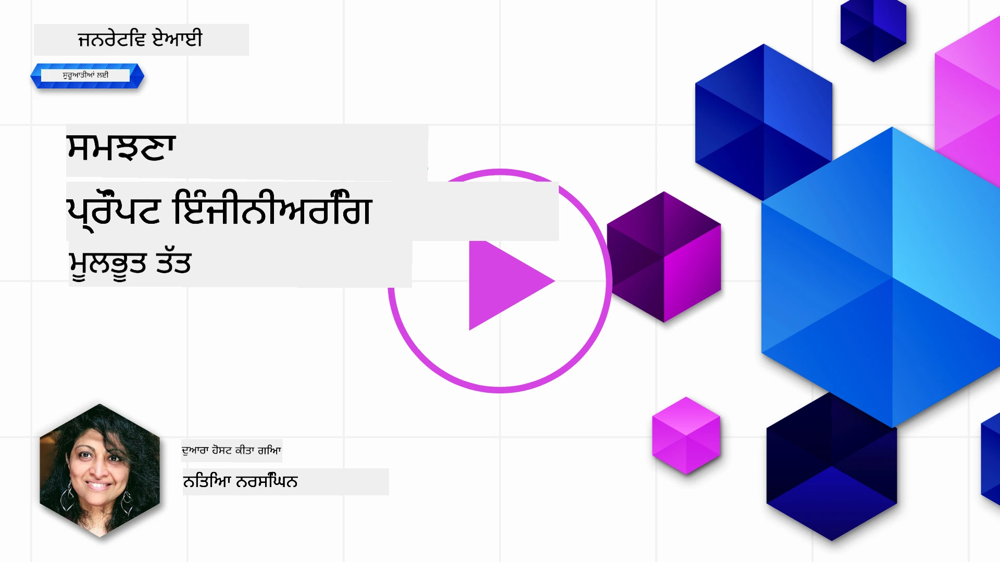
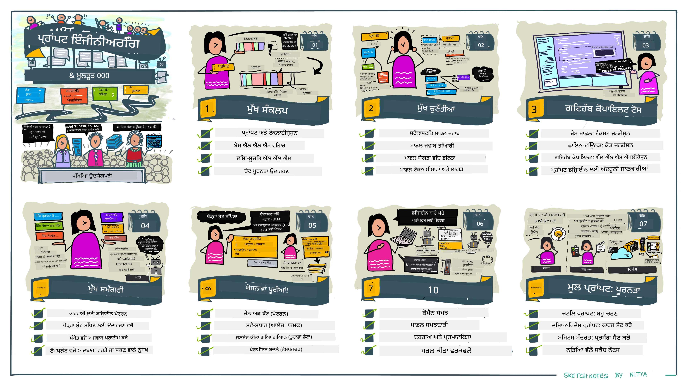
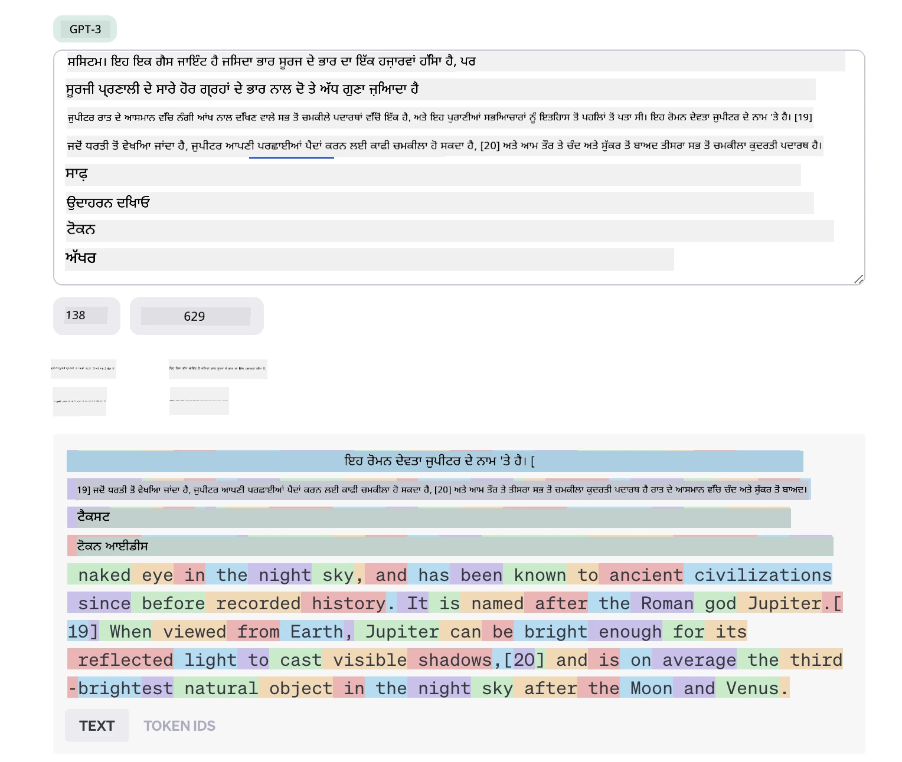
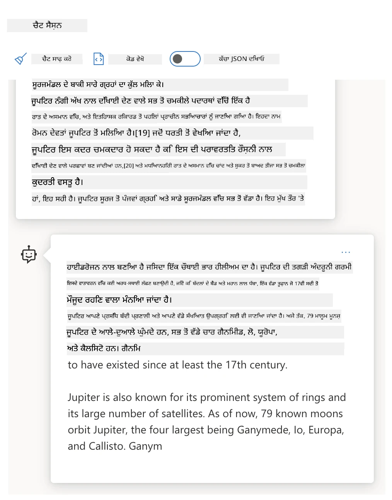
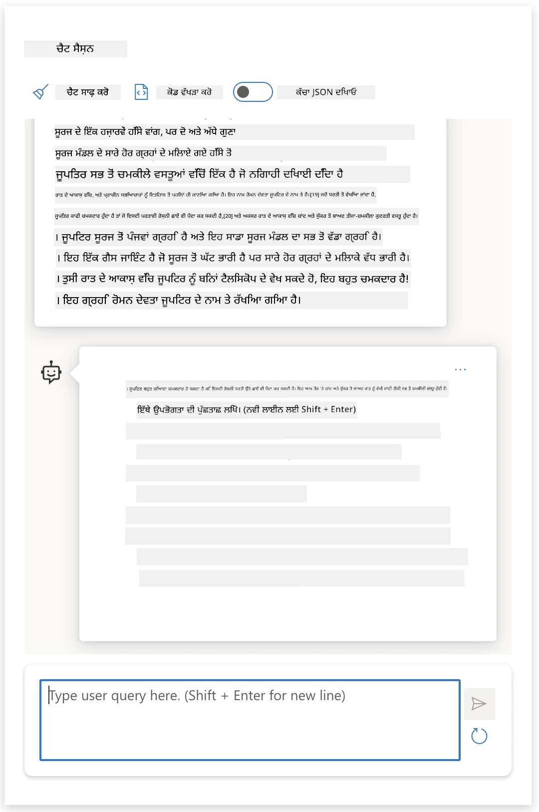
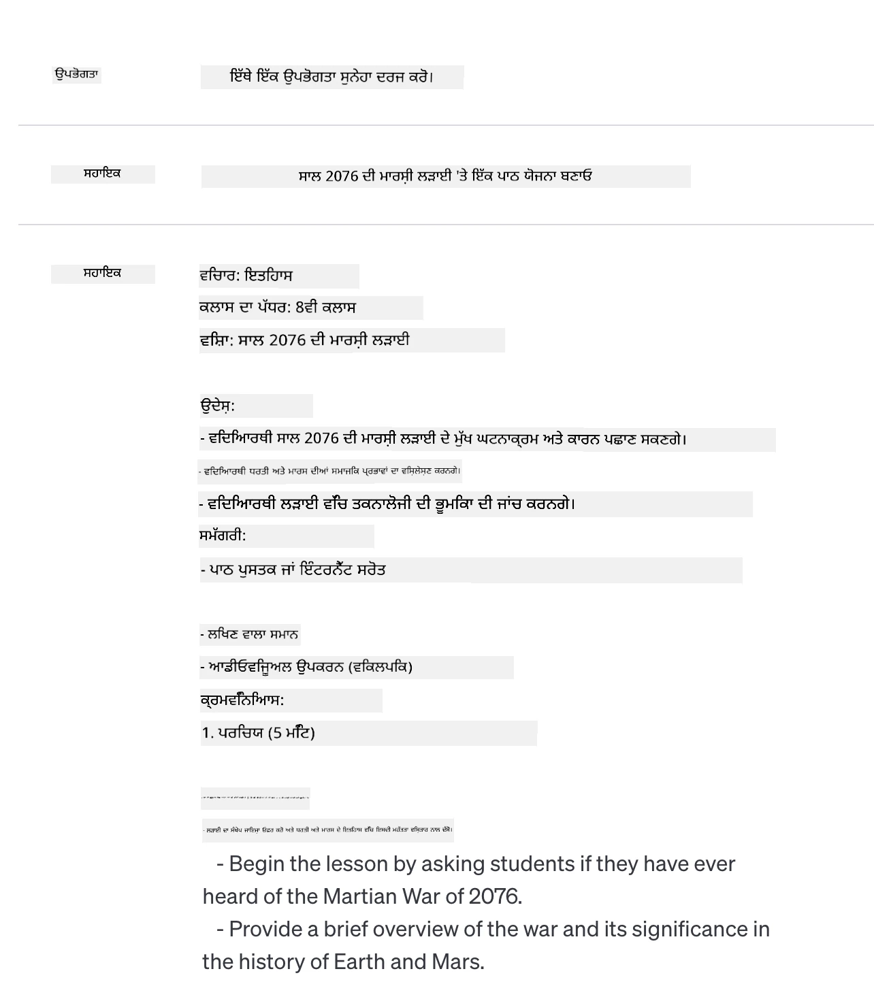
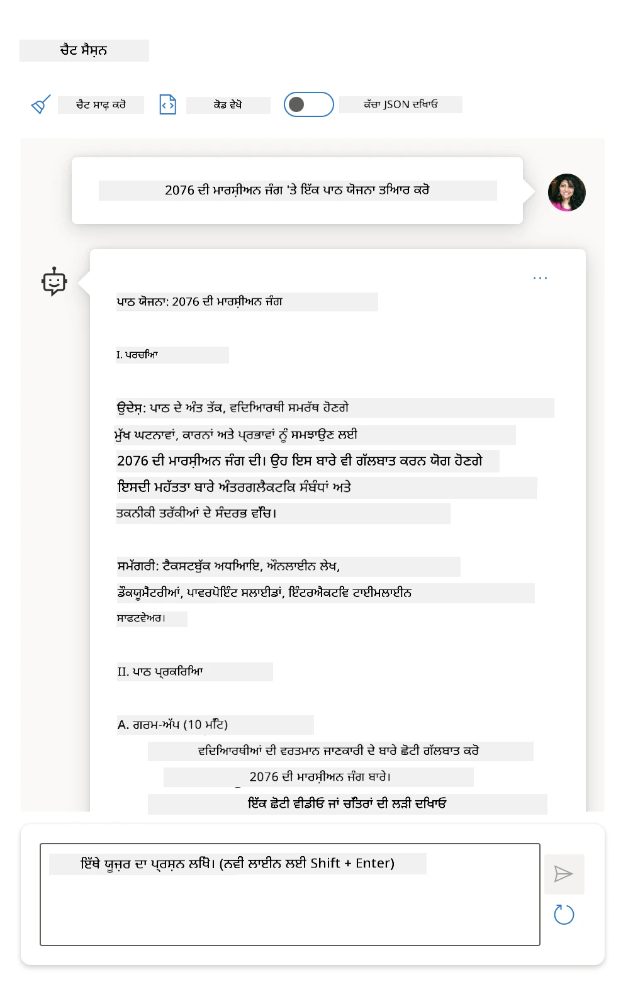
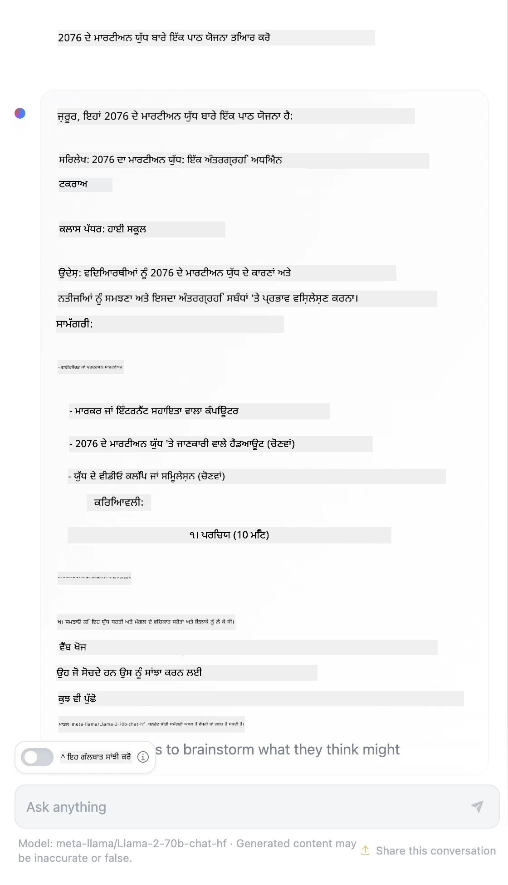

# ਪ੍ਰੌੰਪਟ ਇੰਜੀਨੀਅਰਿੰਗ ਬੁਨਿਆਦੀ ਗੁਣ

[](https://youtu.be/GElCu2kUlRs?si=qrXsBvXnCW12epb8)

## ਤਰੰਭ
ਇਹ ਮੌਡੀਊਲ ਜਨਰੇਟਿਵ AI ਮਾਡਲਾਂ ਵਿੱਚ ਪ੍ਰਭਾਵਸ਼ਾਲੀ ਪ੍ਰੌੰਪਟ ਬਣਾਉਣ ਲਈ ਅਹਮ ਧਾਰਣਾ ਅਤੇ ਤਕਨੀਕਾਂ ਨੂੰ ਕਵਰ ਕਰਦਾ ਹੈ। ਦੱਸਣ ਵਾਲਾ ਇੱਕ ਪਰੋਮਪਟ LL.M. ਨੂੰ ਕਿਵੇਂ ਲਿਖਿਆ ਜਾਂਦਾ ਹੈ, ਇਸ ਦਾ ਵੀ ਅਹਮ ਹੈ। ਧਿਆਨ ਨਾਲ ਬਣਾਇਆ ਹੋਇਆ ਪ੍ਰੌੰਪਟ ਉਚਿਤ ਜਵਾਬ ਦੀ ਗੁਣਵੱਤਾ ਪ੍ਰਾਪਤ ਕਰ ਸਕਦਾ ਹੈ। ਪਰ, ਸਹੀ-ਸਹੀ ਸ਼ਬਦ ਜਿਵੇਂ ਕਿ "_prompt_" ਅਤੇ "_prompt engineering_" ਦਾ ਕੀ ਅਰਥ ਹੁੰਦਾ ਹੈ? ਅਤੇ ਮੈਂ ਓਹ ਪ੍ਰੌੰਪਟ "ਇਨਪੁਟ" ਨੂੰ ਕਿਵੇਂ ਸੁਧਾਰ ਸਕਦਾ ਹਾਂ ਜੋ ਮੈਂ LLM ਨੂੰ ਭੇਜਦਾ ਹਾਂ? ਇਹ ਉਹ ਸਵਾਲ ਹਨ ਜਿਨ੍ਹਾਂ ਦੇ ਜਵਾਬ ਅਸੀਂ ਇਸ ਪਾਠ ਅਤੇ ਅਗਲੇ ਵਿੱਚ ਦੇਖਾਂਗੇ।

_ਜਨਰੇਟਿਵ AI_ ਨਵਾਂ ਸਮਗਰੀ (ਜਿਵੇਂ ਕਿ ਟੈਕਸਟ, ਚਿਤਰ, ਆਡੀਓ, ਕੋਡ ਆਦਿ) ਵਰਤੋਂਕਾਰ ਦੀ ਬੇਨਤੀ 'ਤੇ ਤਿਆਰ ਕਰਨ ਦੇ ਯੋਗ ਹੈ। ਇਹ _ਵੱਡੇ ਭਾਸ਼ਾ ਮਾਡਲਾਂ_ ਜਿਵੇਂ ਕਿ OpenAI ਦੇ GPT ("Generative Pre-trained Transformer") ਸਿਰੀਜ਼ ਦੀ ਵਰਤੋਂ ਕਰਕੇ ਪ੍ਰਾਪਤ ਹੁੰਦਾ ਹੈ ਜੋ ਕੁਦਰਤੀ ਭਾਸ਼ਾ ਅਤੇ ਕੋਡ ਲਈ ਪ੍ਰਸ਼ਿਕਸ਼ਿਤ ਕੀਤੇ ਗਏ ਹਨ।

ਵਰਤੋਂਕਾਰ ਹੁਣ ਇਹਨਾਂ ਮਾਡਲਾਂ ਨਾਲ ਜਾਣ-ਪਛਾਣ ਹੋਈ ਕਹਾਣੀਆਂ ਜਿਵੇਂ ਚੈਟ ਰਾਹੀਂ ਗੱਲਬਾਤ ਕਰ ਸਕਦੇ ਹਨ, ਬਿਨਾਂ ਕਿਸੇ ਤਕਨੀਕੀ ਮਹਾਰਤ ਜਾਂ ਤਾਲੀਮ ਦੇ। ਮਾਡਲ _prompt-ਅਧਾਰਿਤ_ ਹੁੰਦੇ ਹਨ - ਵਰਤੋਂਕਾਰ ਇੱਕ ਲਿਖਤੀ ਇਨਪੁਟ (ਪ੍ਰੌੰਪਟ) ਭੇਜਦੇ ਹਨ ਅਤੇ AI ਤੋਂ ਜਵਾਬ (ਪੂਰੀ) ਪ੍ਰਾਪਤ ਕਰਦੇ ਹਨ। ਫਿਰ ਉਹ ਇਸ ਪ੍ਰੋਕਿਰਿਆ ਨੂੰ ਕਈ ਵਾਰ ਦੁਹਰਾ ਕੇ ਆਪਣੇ ਪ੍ਰੌੰਪਟ ਨੂੰ ਸੁਧਾਰ ਕੇ ਹੁਣ ਮਿਲਦੀਆਂ ਉਮੀਦਾਂ ਨੂੰ ਪੂਰਾ ਕਰਦੇ ਹਨ।

"Prompts" ਹੁਣ ਜਨਰੇਟਿਵ AI ਐਪ ਲਈ ਮੁੱਖ _ਪ੍ਰੋਗ੍ਰਾਮਿੰਗ ਇੰਟਰਫੇਸ_ ਬਣ ਗਏ ਹਨ, ਜੋ ਮਾਡਲਾਂ ਨੂੰ ਦੱਸਦੇ ਹਨ ਕਿ ਕੀ ਕਰਨਾ ਹੈ ਅਤੇ ਜਵਾਬ ਦੀ ਗੁਣਵੱਤਾ ਨੂੰ ਪ੍ਰਭਾਵਿਤ ਕਰਦੇ ਹਨ। "Prompt Engineering" ਇੱਕ ਤੇਜ਼ੀ ਨਾਲ ਵਿਕਸਿਤ ਹੋ ਰਹੀ ਖੇਤਰ ਹੈ ਜੋ ਪ੍ਰੌੰਪਟਾਂ ਦੀ _ਡਿਜ਼ਾਈਨ ਅਤੇ ਅਪਟੀਮਾਈਜ਼ੇਸ਼ਨ_ 'ਤੇ ਧਿਆਨ ਦਿੰਦੀ ਹੈ ਤਾਂ ਜੋ ਵੱਡੀ ਪੱਧਰ 'ਤੇ ਅਨੁਕੂਲ ਅਤੇ ਗੁਣਵੱਤਾ ਵਾਲੇ ਜਵਾਬ ਮਿਲਣ।

## ਸਿੱਖਣ ਦੇ ਲਕੜੀ

ਇਸ ਪਾਠ ਵਿੱਚ ਅਸੀਂ ਸਿੱਖਾਂਗੇ ਕਿ ਪ੍ਰੌੰਪਟ ਇੰਜੀਨੀਅਰਿੰਗ ਕੀ ਹੈ, ਇਹ ਕਿਉਂ ਮਹੱਤਵਪੂਰਨ ਹੈ ਅਤੇ ਕਿਸੇ ਮਾਡਲ ਅਤੇ ਐਪਲੀਕੇਸ਼ਨ ਹਦਫ਼ ਲਈ ਕਿਵੇਂ ਪ੍ਰਭਾਵਸ਼ਾਲੀ ਪ੍ਰੌੰਪਟ ਤਿਆਰ ਕਰੀਏ। ਅਸੀਂ ਪ੍ਰੌੰਪਟ ਇੰਜੀਨੀਅਰਿੰਗ ਲਈ ਮੂਲ ਧਾਰਣਾ ਅਤੇ ਸਰੋਤਮ ਅਭਿਆਸ ਸਮਝਾਂਗੇ - ਅਤੇ ਇੱਕ ਇੰਟਰੈਕਟਿਵ ਜੂਪਿਟਰ ਨੋਟਬੁੱਕ "ਸੈਂਡਬਾਕਸ" ਵਾਤਾਵਰਨ ਬਾਰੇ ਜਾਣਾਂਗੇ ਜਿੱਥੇ ਅਸੀਂ ਇਹ ਧਾਰਣਾ ਅਸਲੀ ਉਦਾਹਰਨਾਂ 'ਤੇ ਦੇਖ ਸਕਦੇ ਹਾਂ।

ਇਸ ਪਾਠ ਦੇ ਆਖ਼ਿਰ ਤੱਕ ਅਸੀਂ ਸਮਰੱਥ ਹੋਵਾਂਗੇ:

1. ਸਮਝਾਉਣਾ ਕਿ ਪ੍ਰੌੰਪਟ ਇੰਜੀਨੀਅਰਿੰਗ ਕੀ ਹੈ ਅਤੇ ਇਹ ਕਿਉਂ ਜ਼ਰੂਰੀ ਹੈ।
2. ਪ੍ਰੌੰਪਟ ਦੇ ਹਿੱਸਿਆਂ ਦਾ ਵੇਰਵਾ ਦੇਣਾ ਅਤੇ ਇਹ ਕਿਸ ਢੰਗ ਨਾਲ ਵਰਤੇ ਜਾਂਦੇ ਹਨ।
3. ਪ੍ਰੌੰਪਟ ਇੰਜੀਨੀਅਰਿੰਗ ਲਈ ਸਰੋਤਮ ਅਭਿਆਸ ਅਤੇ ਤਕਨੀਕਾਂ ਸਿੱਖਣਾ।
4. OpenAI ਐਂਡਪੌਇੰਟ ਦੀ ਵਰਤੋਂ ਕਰਕੇ ਸਿੱਖੀਆਂ ਤਕਨੀਕਾਂ ਨੂੰ ਅਸਲੀ ਉਦਾਹਰਨਾਂ ’ਤੇ ਲਾਗੂ ਕਰਨਾ।

## ਮੁੱਖ ਸ਼ਬਦ

ਪ੍ਰੌੰਪਟ ਇੰਜੀਨੀਅਰਿੰਗ: ਉਹ ਅਭਿਆਸ ਜਿਸ ਵਿੱਚ ਇਨਪੁਟ ਤਿਆਰ ਅਤੇ ਸੁਧਾਰੇ ਜਾਂਦੇ ਹਨ ਤਾਂ ਜੋ AI ਮਾਡਲਾਂ ਨੂੰ ਚਾਹੁੰਦੇ ਨਤੀਜੇ ਪ੍ਰਦਾਨ ਕਰਨ ਵੱਲ ਦਿਸ਼ਾ ਮਿਲੇ।  
ਟੋਕਨਾਈਜ਼ੇਸ਼ਨ: ਲਿਖਤੀ ਨੂੰ ਛੋਟਿਆਂ ਹਿੱਸਿਆਂ (ਟੋਕਨਾਂ) ਵਿੱਚ ਤਬਦੀਲ ਕਰਨ ਦੀ ਪ੍ਰਕਿਰਿਆ, ਜਿਸ ਨੂੰ ਮਾਡਲ ਸਮਝ ਸਕੇ।  
ਇਨਸਟਰੱਕਸ਼ਨ-ਟਿਊਨ ਕੀਤੇ LLMs: ਵੱਡੇ ਭਾਸ਼ਾ ਮਾਡਲ (LLMs) ਜੋ ਖਾਸ ਹਦਾਇਤਾਂ ਨਾਲ ਸੁਧਾਰੇ ਗਏ ਹੁੰਦੇ ਹਨ ਤਾਂ ਜੋ ਜਵਾਬ ਦੀ ਸਹੀਅਤ ਅਤੇ ਸਬੰਧਤਾ ਵਧੇ।

## ਸਿੱਖਣ ਲਈ ਸੈਂਡਬਾਕਸ

ਪ੍ਰੌੰਪਟ ਇੰਜੀਨੀਅਰਿੰਗ ਹਾਲੀਅਤ ਵਿਚ ਜ਼ਿਆਦਾਤਰ ਕਲਾ ਹੈ ਨਾ ਕਿ ਵਿਗਿਆਨ। ਇਸਦੀ ਬੁਝਣਾ ਲਈ ਸਭ ਤੋਂ ਵਧੀਆ ਤਰੀਕਾ ਇਹ ਹੈ ਕਿ ਅਸੀਂ _ਵੱਧ ਪ੍ਰੈਕਟਿਸ_ ਕਰੀਏ ਅਤੇ ਟ੍ਰਾਇਅਲ ਅਤੇ ਏਰਰ ਅਪ੍ਰੋਚ ਅਪਣਾਈਏ ਜੋ ਐਪਲੀਕੇਸ਼ਨ ਖੇਤਰ ਦੀ ਮਹਾਰਤ ਨਾਲ ਸਿਫਾਰਸ਼ੀ ਤਕਨੀਕਾਂ ਅਤੇ ਮਾਡਲ-ਖਾਸ ਸੁਧਾਰਾਂ ਨੂੰ ਜੋੜਦਾ ਹੈ।

ਇਸ ਪਾਠ ਨਾਲ ਜੂੜੇ ਜੂਪਿਟਰ ਨੋਟਬੁੱਕ ਇੱਕ _ਸੈਂਡਬਾਕਸ_ ਵਾਤਾਵਰਨ ਮੁਹੱਈਆ ਕਰਦਾ ਹੈ ਜਿੱਥੇ ਤੁਸੀਂ ਜੋ ਸਿੱਖਦੇ ਹੋ ਉਹ ਅਜ਼ਮਾਇਸ਼ ਕਰ ਸਕਦੇ ਹੋ - ਜਿਵੇਂ ਜਦੋਂ ਚਾਹੋਂ ਜਾਂ ਕੋਡ ਚੈਲੰਜ ਦੇ ਅੰਤ ਵਿੱਚ। ਕਸਰਤਾਂ ਕਰਨ ਲਈ ਤੁਹਾਨੂੰ ਲੋੜ ਪਏਗੀ:

1. **Azure OpenAI API ਕੁੰਜੀ** - ਇੱਕ ਤੈਨਾਤ LLM ਦੀ ਸੇਵਾ ਐਂਡਪੌਇੰਟ।  
2. **ਪਾਇਥਨ ਰੰਟਾਈਮ** - ਜਿਸ ਵਿੱਚ ਨੋਟਬੁੱਕ ਚਲ ਸਕੇ।  
3. **ਲੋਕਲ ਵਾਤਾਵਰਨ ਵਰੰਦੇ** - _[SETUP](./../00-course-setup/02-setup-local.md?WT.mc_id=academic-105485-koreyst) ਕਦਮ ਹਾਲੇ ਪੂਰੇ ਕਰੋ_।  

ਨੋਟਬੁੱਕ ਵਿਚ _ਆਰੰਭਿਕ_ ਕਸਰਤਾਂ ਹਨ - ਪਰ ਤੁਹਾਨੂੰ ਆਪਣੇ ਆਪਣੇ _Markdown_ (ਵਰਣਨ) ਅਤੇ _Code_ (ਪ੍ਰੌੰਪਟ ਬੇਨਤੀਆਂ) ਹਿੱਸੇ ਸ਼ਾਮਿਲ ਕਰਨ ਲਈ ਪ੍ਰੋਤਸਾਹਿਤ ਕੀਤਾ ਜਾਂਦਾ ਹੈ, ਤਾਂ ਕਿ ਤੁਸੀਂ ਹੋਰ ਉਦਾਹਰਨਾਂ ਜਾਂ ਵਿਚਾਰ ਅਜ਼ਮਾ ਸਕੋ ਅਤੇ ਪ੍ਰੌੰਪਟ ਡਿਜ਼ਾਈਨ ਲਈ ਆਪਣਾ ਅਨੁਭਵ ਬਣਾਉ।

## ਚਿੱਤਰਕ੍ਰਿਤ ਮਾਰਗਦਰਸ਼ਕ

ਕੀ ਤੂੰ ਮੈਨੂੰ ਪੂਰਾ ਖਾਕਾ ਦੇਖਣਾ ਚਾਹੁੰਦਾ ਹੈ ਜਿਹੜਾ ਇਹ ਪਾਠ ਕਵਰ ਕਰਦਾ ਹੈ ਇਸ ਤੋਂ ਪਹਿਲਾਂ ਕਿ ਤੂੰ ਡੁੱਬ ਜਾਵੇ? ਇਸ ਚਿੱਤਰਕ੍ਰਿਤ ਮਾਰਗਦਰਸ਼ਿਕ ਨੂੰ ਦੇਖੋ, ਜੋ ਮੁੱਖ ਵਿਸ਼ਿਆਂ ਦੀ ਇੱਕ ਖਾਕਾ ਅਤੇ ਤੁਹਾਡੇ ਲਈ ਸੋਚਣ ਲਈ ਮੁੱਖ ਨਤੀਜੇ ਦਿੰਦਾ ਹੈ। ਪਾਠ ਰੋਡਮੇਪ ਤੈਨੂੰ ਮੁੱਖ ਧਾਰਣਾ ਅਤੇ ਚੁਣੌਤੀਆਂ ਦੀ ਸਮਝ ਤੋਂ ਲੈ ਕੇ, ਸੰਬੰਧਿਤ ਪ੍ਰੌੰਪਟ ਇੰਜੀਨੀਅਰਿੰਗ ਤਕਨੀਕਾਂ ਅਤੇ ਸਰੋਤਮ ਅਭਿਆਸ ਨਾਲ ਹੱਲ ਕਰਨ ਲਈ ਲੈ ਜਾਂਦਾ ਹੈ। ਧਿਆਨ ਰਹੇ ਕਿ ਇਸ ਗਾਈਡ ਵਿਚ "ਉੱਨਤ ਤਕਨੀਕਾਂ" ਅਗਲੇ ਅਧਿਆਏ ਵਿੱਚ ਕਵਰੇਜ ਹਵਾਲਾ ਕਰਦੀਆਂ ਹਨ।



## ਸਾਡਾ ਸਟਾਰਟਅਪ

ਹੁਣ ਗੱਲ ਕਰੀਏ ਕਿ _ਇਹ ਵਿਸ਼ਾ_ ਸਾਡੇ ਸਟਾਰਟਅਪ ਮਿਸ਼ਨ ਨਾਲ ਕਿਵੇਂ ਸੰਬੰਧਤ ਹੈ ਜੋ [ਸਿੱਖਿਆ ਵਿੱਚ AI ਨਵੀਨਤਾ ਲਿਆਉਂਦਾ ਹੈ](https://educationblog.microsoft.com/2023/06/collaborating-to-bring-ai-innovation-to-education?WT.mc_id=academic-105485-koreyst)। ਅਸੀਂ _ਵਿਆਕਤੀਗਤ ਸਿੱਖਣ_ ਦੇ AI-ਸਮਰਥਿਤ ਐਪਲੀਕੇਸ਼ਨ ਬਣਾਉਣੇ ਚਾਹੁੰਦੇ ਹਾਂ - ਇਸ ਲਈ ਸੋਚੀਏ ਕਿ ਸਾਡੇ ਐਪ ਦੇ ਵੱਖ-ਵੱਖ ਵਰਤੋਂਕਾਰ ਕਿਵੇਂ "ਡਿਜ਼ਾਈਨ" ਕਰਨਗੇ ਪ੍ਰੌੰਪਟ:

- **ਐਡਮਿਨਿਸਟ੍ਰੇਟਰਜ਼** AI ਨੂੰ ਪੁੱਛ ਸਕਦੇ ਹਨ ਕਿ _ਕਰਿਕੁਲਮ ਡਾਟਾ ਦਾ ਵਿਸ਼ਲੇਸ਼ਣ ਕਰਕੇ ਫ਼ੈਲਾਵਾਂ ਪਛਾਣੋ_. AI ਨਤੀਜੇ ਸਾਰਗ੍ਰਹਿ ਕਰ ਸਕਦਾ ਹੈ ਜਾਂ ਕੋਡ ਨਾਲ ਵਿਜ਼ੁਅਲਾਈਜ਼ ਕਰ ਸਕਦਾ ਹੈ।  
- **ਸਿੱਖਿਆਕਾਰ** AI ਨੂੰ ਪੁੱਛ ਸਕਦੇ ਹਨ ਕਿ _ਕਿਸੇ ਨਿਸ਼ਚਿਤ ਦਰਸ਼ਕ ਅਤੇ ਵਿਸ਼ੇ ਲਈ ਪਾਠ ਯੋਜਨਾ ਤਿਆਰ ਕਰੋ_. AI ਨਿਸ਼ਚਿਤ ਫਾਰਮੈਟ ਵਿੱਚ ਵਿਅਕਤਿਗਤ ਯੋਜਨਾ ਬਣਾਉਂਦਾ ਹੈ।  
- **ਵਿਦਿਆਰਥੀ** AI ਨੂੰ ਪੁੱਛ ਸਕਦੇ ਹਨ ਕਿ _ਉਹਨਾਂ ਨੂੰ ਇੱਕ ਮੁਸ਼ਕਲ ਵਿਸ਼ੇ ਵਿੱਚ ਟਿਊਟਰ ਕਰੇ_. AI ਹੁਣ ਵਿਦਿਆਰਥੀਆਂ ਨੂੰ ਉਹਨਾਂ ਦੇ ਪੱਧਰ ਅਨੁસર ਪਾਠ, ਸੁਝਾਵ ਅਤੇ ਉਦਾਹਰਨਾਂ ਦੇ ਨਾਲ ਮਦਦ ਕਰਦਾ ਹੈ।

ਇਹ ਤਾਂ ਮੁੱਢਲੀ ਗੱਲ ਹੈ। [Prompts For Education](https://github.com/microsoft/prompts-for-edu/tree/main?WT.mc_id=academic-105485-koreyst) ਵੇਖੋ - ਸਿੱਖਿਆ ਮਾਹਿਰਾਂ ਦੁਆਰਾ ਸੰਭਾਲਿਆ ਹੋਇਆ ਇੱਕ ਖੁੱਲਾ ਸਰੋਤ ਪ੍ਰੌੰਪਟ ਲਾਇਬ੍ਰੇਰੀ - ਜੋ ਸੰਭਾਵਨਾਵਾਂ ਦਾ ਇੱਕ ਵਿਸਤ੍ਰਿਤ ਅਹਿਸਾਸ ਦਿੰਦਾ ਹੈ! _ਇਨ੍ਹਾਂ ਪ੍ਰੌੰਪਟਾਂ ਨੂੰ ਸੈਂਡਬਾਕਸ ਵਿੱਚ ਚਲਾਉਣ ਦੀ ਕੋਸ਼ਿਸ਼ ਕਰੋ ਜਾਂ OpenAI Playground ਦੀ ਵਰਤੋਂ ਕਰਕੇ ਦੇਖੋ ਕਿ ਕੀ ਹੁੰਦਾ ਹੈ!_

<!--
LESSON TEMPLATE:
This unit should cover core concept #1.
Reinforce the concept with examples and references.

CONCEPT #1:
Prompt Engineering.
Define it and explain why it is needed.
-->

## ਪ੍ਰੌੰਪਟ ਇੰਜੀਨੀਅਰਿੰਗ ਕੀ ਹੈ?

ਅਸੀਂ ਇਸ ਪਾਠ ਦੀ ਸ਼ੁਰੂਆਤ ਇਸ ਤਰ੍ਹਾਂ ਕੀਤੀ ਕਿ **ਪ੍ਰੌੰਪਟ ਇੰਜੀਨੀਅਰਿੰਗ** ਉਹ ਪ੍ਰਕਿਰਿਆ ਹੈ ਜਿਸ ਵਿੱਚ ਪਾਠ ਇਨਪੁਟ (ਪ੍ਰੌੰਪਟ) ਨੂੰ _ਡਿਜ਼ਾਈਨ ਅਤੇ ਅਪਟਿਮਾਈਜ਼_ ਕਰਕੇ ਇੱਕ ਦਿੱਤੇ ਮਾਡਲ ਅਤੇ ਲਕੜੀ ਲਈ ਲਗਾਤਾਰ ਅਤੇ ਗੁਣਵੱਤਾ ਵਾਲੇ ਜਵਾਬ (ਕੰਪਲੀਸ਼ਨ) ਪ੍ਰਦਾਨ ਕਰਵਾਉਂਦੇ ਹਨ। ਅਸੀਂ ਇਸ ਨੂੰ ਦੋ-ਕਦਮੀ ਪ੍ਰਕਿਰਿਆ ਵਜੋਂ ਸੋਚ ਸਕਦੇ ਹਾਂ:

- ਕਿਸੇ ਦਿੱਤੇ ਮਾਡਲ ਅਤੇ ਲਕੜੀ ਲਈ ਮੁੱਢਲੀ ਪ੍ਰੌੰਪਟ _ਡਿਜ਼ਾਈਨ_ ਕਰਨਾ  
- ਜਵਾਬ ਦੀ ਗੁਣਵੱਤਾ ਨੂੰ ਸੁਧਾਰਨ ਲਈ ਪ੍ਰੌੰਪਟ ਨੂੰ ਦੁਹਰਾਉਂਦੇ ਹੋਏ _ਸੁਧਾਰਣਾ_

ਇਹ ਲਾਜ਼ਮੀ ਤੌਰ ਤੇ ਇੱਕ ਟ੍ਰਾਇਅਲ-ਅਤੇ-ਏਰਰ ਪ੍ਰਕਿਰਿਆ ਹੈ ਜੋ ਵਧੀਆ ਨਤੀਜਿਆਂ ਲਈ ਵਰਤੋਂਕਾਰ ਦੀ ਦ੍ਰਿਸ਼ਟਿਕੋਣ ਅਤੇ ਮਿਹਨਤ ਦੀ ਲੋੜ ਹੈ। ਪਰੇ, ਇਹ ਕਿਉਂ ਜ਼ਰੂਰੀ ਹੈ? ਇਸਦਾ ਜਵਾਬ ਦੇਣ ਲਈ ਸਾਨੂੰ ਤਿੰਨ ਧਾਰਣਾਵਾਂ ਨੂੰ ਸਮਝਣਾ ਪਵੇਗਾ:

- _ਟੋਕਨਾਈਜ਼ੇਸ਼ਨ_ = ਮਾਡਲ ਪ੍ਰੌੰਪਟ ਨੂੰ "ਕਿਵੇਂ ਦੇਖਦਾ ਹੈ"  
- _ਬੇਸ LLMs_ = ਫਾਉਂਡੇਸ਼ਨ ਮਾਡਲ "ਕਿਵੇਂ ਪ੍ਰੌੰਪਟ ਦਾ ਪ੍ਰੋਸੈਸ ਕਰਦਾ ਹੈ"  
- _ਇਨਸਟਰੱਕਸ਼ਨ-ਟਿਊਨ ਕੀਤੇ LLMs_ = ਮਾਡਲ ਹੁਣ "ਟਾਸਕ" ਨੂੰ ਕਿਵੇਂ ਦੇਖ ਸਕਦਾ ਹੈ

### ਟੋਕਨਾਈਜ਼ੇਸ਼ਨ

ਇੱਕ LLM ਪ੍ਰੌੰਪਟਾਂ ਨੂੰ _ਟੋਕਨਾਂ ਦੀ ਕੜੀ_ ਵਜੋਂ ਦੇਖਦਾ ਹੈ ਜਿਸ ਵਿੱਚ ਵੱਖ-ਵੱਖ ਮਾਡਲ (ਜਾਂ ਮਾਡਲ ਦੇ ਵਰਜ਼ਨ) ਇਕੋ ਪ੍ਰੌੰਪਟ ਨੂੰ ਵੱਖ-ਵੱਖ ਢੰਗ ਨਾਲ ਟੋਕਨਾਈਜ਼ ਕਰ ਸਕਦੇ ਹਨ। ਕਿਉਂਕਿ LLMs ਟੋਕਨਾਂ 'ਤੇ ਟਰੇਨ ਕੀਤੇ ਜਾਂਦੇ ਹਨ (ਸਿੱਧੇ ਕੱਚੇ ਲਿਖਤੀ 'ਤੇ ਨਹੀਂ), ਇਸ ਲਈ ਪ੍ਰੌੰਪਟਾਂ ਦੀ ਟੋਕਨਾਈਜ਼ੇਸ਼ਨ ਦਾ ਸਿੱਧਾ ਅਸਰ ਤੈਆਰ ਹੋਏ ਜਵਾਬ ਦੀ ਗੁਣਵੱਤਾ 'ਤੇ ਪੈਂਦਾ ਹੈ।

ਟੋਕਨਾਈਜ਼ੇਸ਼ਨ ਦਾ ਅਨੁਭਵ ਪ੍ਰਾਪਤ ਕਰਨ ਲਈ, [OpenAI Tokenizer](https://platform.openai.com/tokenizer?WT.mc_id=academic-105485-koreyst) ਵਰਗੇ ਟੂਲ ਨੂੰ ਵਰਤੋ ਜੋ ਹੇਠਾਂ ਦਿੱਤਾ ਗਿਆ ਹੈ। ਆਪਣਾ ਪ੍ਰੌੰਪਟ ਕਾਪੀ ਕਰੋ ਅਤੇ ਦੇਖੋ ਕਿ ਇਹ ਕਿਵੇਂ ਟੋਕਨਾਂ ਵਿੱਚ ਬਦਲਿਆ ਜਾਂਦਾ ਹੈ, ਖ਼ਿਆਲ ਕਰੋ ਕਿ ਫਾ਼ਲਕ (ਵਾਈਟਸਪੇਸ) ਅਤੇ ਪੰਕਚੂਐਸ਼ਨ ਅੰਕ ਕਿਵੇਂ ਸੰਭਾਲੇ ਜਾਂਦੇ ਹਨ। ਧਿਆਨ ਦਿਓ ਕਿ ਇਹ ਉਦਾਹਰਨ ਪੁਰਾਣੇ LLM (GPT-3) ਦੀ ਹੈ - ਇਸ ਲਈ ਨਵੇਂ ਮਾਡਲ ਨਾਲ ਟੈਸਟ ਕਰਨ ਤੇ ਨਤੀਜੇ ਵੱਖਰੇ ਹੋ ਸਕਦੇ ਹਨ।



### ਧਾਰਣਾ: ਫਾਉਂਡੇਸ਼ਨ ਮਾਡਲ

ਜਦੋਂ ਪ੍ਰੌੰਪਟ ਟੋਕਨਾਈਜ਼ ਹੋ ਜਾਂਦਾ ਹੈ, ਤਾਂ ["ਬੇਸ LLM"](https://blog.gopenai.com/an-introduction-to-base-and-instruction-tuned-large-language-models-8de102c785a6?WT.mc_id=academic-105485-koreyst) (ਜਾਂ ਫਾਉਂਡੇਸ਼ਨ ਮਾਡਲ) ਦਾ ਮੁੱਖ ਕੰਮ ਉਸ ਕੜੀ ਵਿੱਚ ਅਗਲਾ ਟੋਕਨ ਭਵਿੱਖਬਾਣੀ ਕਰਨਾ ਹੁੰਦਾ ਹੈ। ਕਿਉਂਕਿ LLMs ਵੱਡੇ ਲਿਖਤੀ ਡਾਟਾ ਸੈੱਟ ਉੱਤੇ ਟਰੇਨ ਕੀਤੇ ਜਾਂਦੇ ਹਨ, ਉਹਨਾਂ ਨੂੰ ਟੋ ਐਕਿਨ ਦੇ ਆੰਕੜਿਆਂ ਵਿੱਚ ਭਲੀਆਂ ਜਾਣਕਾਰੀਆਂ ਹੁੰਦੀਆਂ ਹਨ ਅਤੇ ਉਹ ਆਪਣੇ ਭਵਿੱਖਬਾਣੀ ਨੂੰ ਕੁਝ ਵਿਸ਼ਵਾਸ ਨਾਲ ਕਰ ਸਕਦੇ ਹਨ। ਉਹ ਪ੍ਰੌੰਪਟ ਦੇ ਸ਼ਬਦਾਂ ਜਾਂ ਟੋਕਨਾਂ ਦਾ ਅਰਥ ਨਹੀਂ ਸਮਝਦੇ; ਉਹ ਸਿਰਫ ਇੱਕ ਨਮੂਨਾ ਦੇਖਦੇ ਹਨ ਜੋ ਉਹ ਅਗਲੀ ਭਵਿੱਖਬਾਣੀ ਨਾਲ "ਪੂਰਾ" ਕਰ ਸਕਦੇ ਹਨ। ਇਹ ਭਵਿੱਖਬਾਣੀ ਵਰਤੋਂਕਾਰ ਦੇ ਦਰਖਾਸਤ ਜਾਂ ਕਿਸੇ ਪ੍ਰੀ-ਰੱਖੇ ਸ਼ਰਤ ਦੁਆਰਾ ਸਮਾਪਤ ਹੋਣ ਤੱਕ ਚਲਦੀ ਰਹਿੰਦੀ ਹੈ।

ਚਾਹੁੰਦੇ ਹੋ ਵੇਖਣਾ ਕਿ ਪ੍ਰੌੰਪਟ-ਅਧਾਰਿਤ ਪੂਰੀ ਕਿਵੇਂ ਹੁੰਦੀ ਹੈ? ਉੱਪਰ ਦਿੱਤਾ ਪ੍ਰੌੰਪਟ Azure OpenAI Studio [_Chat Playground_](https://oai.azure.com/playground?WT.mc_id=academic-105485-koreyst) ਵਿੱਚ ਡਿਫਾਲਟ ਸੈਟਿੰਗਾਂ ਨਾਲ ਦਰਜ ਕਰੋ। ਸਿਸਟਮ ਇਸ ਨੂੰ ਜਾਣਕਾਰੀ ਦੀ ਬੇਨਤੀ ਵਜੋਂ ਮਾਨਦਾ ਹੈ - ਇਸ ਲਈ ਤੁਸੀਂ ਇਸ ਸੰਦਰਭ ਲਈ ਉਚਿਤ ਪੂਰੀ ਵੇਖੋਗੇ।

ਪਰ ਜੇ ਵਰਤੋਂਕਾਰ ਕਿਸੇ ਖਾਸ ਮਾਪਦੰਡ ਜਾਂ ਟਾਸਕ ਹਦਫ਼ ਵਾਲਾ ਨਤੀਜਾ ਵੇਖਣਾ ਚਾਹੁੰਦਾ ਹੋਵੇ? ਇਸੀ ਲਈ _ਇਨਸਟਰੱਕਸ਼ਨ-ਟਿਊਨ ਕੀਤੇ_ LLM ਦਰਸ਼ਨ ਵਿੱਚ ਆਉਂਦੇ ਹਨ।



### ਧਾਰਣਾ: ਇਨਸਟਰੱਕਸ਼ਨ ਟਿਊਨ ਕੀਤੇ LLMs

ਇੱਕ [ਇਨਸਟਰੱਕਸ਼ਨ ਟਿਊਨ ਕੀਤੇ LLM](https://blog.gopenai.com/an-introduction-to-base-and-instruction-tuned-large-language-models-8de102c785a6?WT.mc_id=academic-105485-koreyst) ਫਾਉਂਡੇਸ਼ਨ ਮਾਡਲ ਨਾਲ ਸ਼ੁਰੂ ਕਰਦਾ ਹੈ ਅਤੇ ਉਦਾਹਰਨਾਂ ਜਾਂ ਇਨਪੁਟ/ਆਉਟਪੁਟ ਜੋੜੇ (ਜਿਵੇਂ ਕਈ ਵਾਰੀ "ਮੇਸੇਜ") ਨਾਲ ਉਸਨੂੰ ਸੁਧਾਰਦਾ ਹੈ ਜੋ ਸਾਫ਼ ਨਿਰਦੇਸ਼ਾਂ ਸੰਭਾਲ ਸਕਦੇ ਹਨ - ਅਤੇ AI ਦਾ ਜਵਾਬ ਉਹ ਨਿਰਦੇਸ਼ ਮਾਨਨ ਦੀ ਕੋਸ਼ਿਸ਼ ਕਰਦਾ ਹੈ।

ਇਹ ਤਕਨੀਕਾਂ ਵਰਤਦਾ ਹੈ ਜਿਵੇਂ ਕਿ Reinforcement Learning with Human Feedback (RLHF) ਜੋ ਮਾਡਲ ਨੂੰ _ਨਿਰਦੇਸ਼ਾਂ ਮੰਨਣ_ ਅਤੇ _ਮੁਲਾਂਕਣ ਤੋਂ ਸਿੱਖਣ_ ਦੀ ਤਾਲੀਮ ਦਿੰਦੇ ਹਨ, ਤਾਂ ਜੋ ਨਤੀਜੇ ਅਜ਼ਾਈ ਟਿਕਾਊ ਅਤੇ ਵਰਤੋਂਕਾਰ ਦੇ ਮਕਸਦ ਲਈ ਹੋਰ ਲਾਭਦਾਇਕ ਹੋਣ।

ਚਲੋ ਇਸਨੂੰ ਕੋਸ਼ਿਸ਼ ਕਰੀਏ - ਉਪਰ ਦਿੱਤਾ ਪ੍ਰੌੰਪਟ ਮੁੜ ਲਵੋ, ਪਰ ਹੁਣ _ਸਿਸਟਮ ਸੁਨੇਹਾ_ ਵਿੱਚ ਲਗਾਓ ਇਹ ਨਿਰਦੇਸ਼:

> _ਜੋ ਸਮੱਗਰੀ ਤੁਹਾਨੂੰ ਦਿੱਤੀ ਜਾਂਦੀ ਹੈ ਉਸਨੂੰ ਦੂਜੇ ਦਰਜੇ ਦੇ ਵਿਦਿਆਰਥੀ ਲਈ ਸੰਖੇਪ ਕਰੋ। ਨਤੀਜਾ ਇੱਕ ਪੈਰਾਗ੍ਰਾਫ ਅਤੇ 3-5 ਬੁਲੇਟ ਪੁਆਇੰਟਾਂ ਵਿੱਚ ਰੱਖੋ।_

ਦੇਖੋ ਨਤੀਜਾ ਹੁਣ ਹਾਈ ਟਿਊਨ ਹੋਇਆ ਹੈ ਅਤੇ ਚਾਹੁੰਦੇ ਲਕੜੀ ਅਤੇ ਫਾਰਮੈਟ ਨੂੰ ਦਰਸਾਉਂਦਾ ਹੈ? ਸਿੱਖਿਆਕਾਰ ਹੁਣ ਇਸ ਜਵਾਬ ਨੂੰ ਆਪਣੇ ਸਲਾਈਡਾਂ ਵਿੱਚ ਸਿੱਧਾ ਵਰਤ ਸਕਦਾ ਹੈ।



## ਸਾਨੂੰ ਪ੍ਰੌੰਪਟ ਇੰਜੀਨੀਅਰਿੰਗ ਕਿਉਂ ਚਾਹੀਦੀ ਹੈ?

ਹੁਣ ਜਦੋਂ ਅਸੀਂ ਜਾਣਦੇ ਹਾਂ ਕਿ LLM ਕਿਵੇਂ ਪ੍ਰੌੰਪਟਾਂ ਨੂੰ ਪ੍ਰੋਸੈਸ ਕਰਦੇ ਹਨ, ਆਓ ਗੱਲ ਕਰੀਏ ਕਿ ਅਸੀਂ ਪ੍ਰੌੰਪਟ ਇੰਜੀਨੀਅਰਿੰਗ ਲਈ ਕਿਉਂ ਜਰੂਰੀ ਹੈ। ਇਸ ਦਾ ਜਵਾਬ ਇਸ ਗੱਲ ਵਿੱਚ ਲੁਕਿਆ ਹੈ ਕਿ ਮੌਜੂਦਾ LLMs ਵਿੱਚ ਕੁਝ ਚੁਣੌਤੀਆਂ ਹਨ ਜੋ _ਭਰੋਸੇਯੋਗ ਅਤੇ ਲਗਾਤਾਰ ਪੂਰੀਾਂ_ ਪ੍ਰਾਪਤ ਕਰਨਾ ਮੁਸ਼ਕਿਲ ਬਣਾਉਂਦੀਆਂ ਹਨ ਜੇਕਰ ਪ੍ਰੌੰਪਟ ਬਨਾਉਣ ਅਤੇ ਸੁਧਾਰ ਵਿੱਚ ਮਿਹਨਤ ਨਾ ਕਰੀਏ। ਉਦਾਹਰਨ ਲਈ:

1. **ਮਾਡਲ ਜਵਾਬ ਚਾਂਦੀਹਾਰ (ਸਟੋਕਾਸਟਿਕ) ਹੁੰਦੇ ਹਨ।** _ਇਕੋ ਪ੍ਰੌੰਪਟ_ ਵੱਖ-ਵੱਖ ਮਾਡਲ ਜਾਂ ਮਾਡਲ ਵਰਜ਼ਨਾਂ ਨਾਲ ਵੱਖਰੇ ਜਵਾਬ ਦੇ ਸਕਦਾ ਹੈ। ਅਤੇ ਇੱਥੇ ਤੱਕ ਕਿ _ਇਕੋ ਮਾਡਲ_ ਵਿੱਚ ਵੀ ਵੱਖ-ਵੱਖ ਵਾਰ ਵੱਖਰੇ ਨਤੀਜੇ ਆ ਸਕਦੇ ਹਨ। _ਪ੍ਰੌੰਪਟ ਇੰਜੀਨੀਅਰਿੰਗ ਤਕਨੀਕਾਂ ਇਨ੍ਹਾਂ ਫਰਕਾਂ ਨੂੰ ਘਟਾਉਣ ਵਿੱਚ ਮਦਦ ਕਰਦੀਆਂ ਹਨ_।

2. **ਮਾਡਲ ਕਦાચਿਤ ਜਵਾਬ ਜਾਲਸਾਜ਼ੀ ਕਰ ਸਕਦੇ ਹਨ।** ਮਾਡਲ ਵੱਡੇ ਪਰ ਸੀਮਿਤ ਡਾਟਾਸੈੱਟ ਉੱਤੇ ਪ੍ਰਸ਼ਿਕਸ਼ਿਤ ਹੁੰਦੇ ਹਨ, ਜਿਸਦਾ ਅਰਥ ਹੈ ਕਿ ਉਹ ਉਸ ਤਾਲੀਮ ਤੋਂ ਬਾਹਰ ਧਾਰਣਾਵਾਂ ਬਾਰੇ ਜਾਣਕਾਰੀ ਨਹੀਂ ਰੱਖਦੇ। ਇਸ ਕਰਕੇ ਉਹ ਅਕੌਰਟੇ ਜਾਂ ਕੱਲਪਨਾਤਮਕ ਜਾਂ ਲੁਕਸੜੇ ਜਾਣਕਾਰੀ ਦੇ ਸਕਦੇ ਹਨ। _ਪ੍ਰੌੰਪਟ ਇੰਜੀਨੀਅਰਿੰਗ ਤਕਨੀਕਾਂ ਵਰਤੋਂਕਾਰਾਂ ਨੂੰ ਐਸੀਆਂ ਗਲਤੀਆਂ ਪਛਾਣਨ ਅਤੇ ਘਟਾਉਣ ਵਿੱਚ ਮਦਦ ਕਰਦੀਆਂ ਹਨ, ਜਿਵੇਂ ਕਿ AI ਤੋਂ ਹਵਾਲੇ ਜਾਂ ਤਰਕ ਮੰਗ ਕੇ_।

3. **ਮਾਡਲ ਦੀਆਂ ਸਮਰੱਥਾਵਾਂ ਵੱਖ-ਵੱਖ ਹੁੰਦੀਆਂ ਹਨ।** ਨਵੇਂ ਮਾਡਲ ਜਾਂ ਮਾਡਲ ਪੀੜ੍ਹੀਆਂ ਵਿੱਚ ਵਧੀਆ ਸਮਰੱਥਾਵਾਂ ਹੁੰਦੀਆਂ ਹਨ ਪਰ ਉਨ੍ਹਾਂ ਆਪਣੇ ਖਾਸ ਵਿਸ਼ੇਸ਼ਤਾਵਾਂ ਅਤੇ ਖ਼ਰਚਿਆਂ ਅਤੇ ਕੁਠੜਾਂ ਨਾਲ ਸੰਘਰਸ਼ ਹੁੰਦਾ ਹੈ। _ਪ੍ਰੌੰਪਟ ਇੰਜੀਨੀਅਰਿੰਗ ਸਾਨੂੰ ਵਧੀਆ ਅਭਿਆਸ ਅਤੇ ਵਰਕਫਲੋ ਵਿਕਸਿਤ ਕਰਨ ਵਿੱਚ ਮਦਦ ਕਰਦਾ ਹੈ ਜੋ ਅੰਤਰਾਂ ਨੂੰ ਓਡ੍ਹ ਕਰਦਾ ਹੈ ਅਤੇ ਕਿਸੇ ਮਾਡਲ ਖਾਸ ਲੋੜਾਂ ਅਨੁਸਾਰ ਟਿਕਾਊ ਅਤੇ ਨਿਰਵਿਘਨ ਤਰੀਕੇ ਨਾਲ ਅਡਾਪਟ ਕਰਦਾ ਹੈ_।

ਇਸਨੂੰ OpenAI ਜਾਂ Azure OpenAI Playground ਵਿੱਚ ਅਜ਼ਮਾਇਓ:

- ਵੱਖ-ਵੱਖ LLM ਤैनਾਤੀਆਂ (ਜਿਵੇਂ OpenAI, Azure OpenAI, Hugging Face) ਨਾਲ ਇੱਕੋ ਪ੍ਰੌੰਪਟ ਵਰਤੋ - ਕੀ ਤੁਸੀਂ ਫਰਕ ਵੇਖਿਆ?  
- ਇੱਕੋ LLM ਤੈਨਾਤੀ (ਜਿਵੇਂ Azure OpenAI Playground) ਨਾਲ ਇੱਕੋ ਪ੍ਰੌੰਪਟ ਨੂੰ ਬਾਰ-ਬਾਰ ਵਰਤੋ - ਇਹ ਵੇਖੋ ਕਿ ਇਹ ਫਰਕ ਕਿਵੇਂ ਵੱਖਰੇ ਹਨ?

### ਜਾਲਸਾਜ਼ੀ ਦੀ ਇੱਕ ਉਦਾਹਰਨ

ਇਸ ਕੋਰਸ ਵਿੱਚ ਅਸੀਂ ਸ਼ਬਦ **"ਜਾਲਸਾਜ਼ੀ"** ਵਰਤਦੇ ਹਾਂ ਜਿਸਦਾ ਮਤਲਬ ਹੈ ਉਹ ਹਾਲਾਤ ਜਦੋਂ LLMs ਕਈ ਵਾਰੀ ਅਸਲ ਵਿੱਚ ਗਲਤ ਜਾਣਕਾਰੀ ਤਿਆਰ ਕਰਦੇ ਹਨ ਜੋ ਉਹਨਾਂ ਦੀ ਤਾਲੀਮ ਜਾਂ ਹੋਰ ਸੀਮਾਵਾਂ ਕਾਰਨ ਹੁੰਦੀ ਹੈ। ਤੁਸੀਂ ਇਸਨੂੰ ਲੋਕਪ੍ਰਿਯ ਲੇਖਾਂ ਜਾਂ ਖੋਜ ਪੱਤਰੀਆਂ ਵਿੱਚ _"ਹੈਲੂਸੀਨੇਸ਼ਨ"_ ਦੇ ਨਾਂ 'ਤੇ ਵੀ ਸੁਣਿਆ ਹੋ ਸਕਦਾ ਹੈ। ਪਰ ਅਸੀਂ ਬਲਦ ਦੇ ਨਾਲ ਸੁਝਾਉਂਦੇ ਹਾਂ ਕਿ _"ਜਾਲਸਾਜ਼ੀ"_ ਸ਼ਬਦ ਵਰਤੋਂ ਤਾਂ ਜੋ ਅਸੀਂ ਮਸ਼ੀਨ ਵਲੋਂ ਚਲਾਏ ਨਤੀਜੇ ਲਈ ਮਨੁੱਖੀ ਰੂਪ ਦਿਣ ਦੇ ਜਿਹੇ ਵਿਹਾਰ ਨਹੀਂ ਪੈਦਾ ਕਰੀਏ। ਇਹ [ਜ਼ਿੰਮੇਵਾਰ AI ਦਿਸ਼ਾ ਨਿਰਦੇਸ਼ਾਂ](https://www.microsoft.com/ai/responsible-ai?WT.mc_id=academic-105485-koreyst) ਨੂੰ ਵੀ ਪੂਰਾ ਕਰਦਾ ਹੈ, ਕਈ ਥਾਵਾਂ 'ਤੇ ਗੈਰ-ਸ਼ਾਮਲ ਜਾਂ ਅਪਮਾਨਕਰ ਸ਼ਬਦਾਂ ਨੂੰ ਹਟਾਉਂਦਾ ਹੈ।  

ਜਾਲਸਾਜ਼ੀ ਕਿਵੇਂ ਹੁੰਦੀ ਹੈ ਇਹ ਸਮਝਣ ਲਈ ਸੋਚੋ ਕੋਈ ਐਸਾ ਪ੍ਰੌੰਪਟ ਜੋ AI ਨੂੰ ਇੱਕ ਅਸਤਿਤਵ ਵਿੱਚ ਨਾਹ ਰਹਿਣ ਵਾਲੇ ਵਿਸ਼ੇ ਲਈ ਸਮੱਗਰੀ ਤਿਆਰ ਕਰਨ ਦੱਸਦਾ ਹੋਵੇ (ਤਾਕਿ ਇਹ ਪ੍ਰਸ਼ਿਕਸ਼ਣ ਡਾਟਾਸੈੱਟ ਵਿੱਚ ਨਾ ਮਿਲੇ)। ਉਦਾਹਰਨ ਲਈ ਮੈਂ ਇਹ ਪ੍ਰੌੰਪਟ ਕੋਸ਼ਿਸ਼ ਕੀਤਾ:

> **Prompt:** generate a lesson plan on the Martian War of 2076.
ਇੱਕ ਵੈੱਬ ਖੋਜ ਨੇ ਮੈਨੂੰ ਦਿਖਾਇਆ ਕਿ ਮਾਰਸ਼ੀ ਯੁੱਧਾਂ 'ਤੇ ਕਲਪਨਾਤਮਕ ਖਾਤੇ (ਉਦਾਹਰਨ ਵਜੋਂ, ਟੈਲੀਵਿਜ਼ਨ ਸੀਰੀਜ਼ ਜਾਂ ਕਿਤਾਬਾਂ) ਸਨ - ਪਰ 2076 ਵਿੱਚ ਕੋਈ ਨਹੀਂ। ਸਧਾਰਨ ਸਮਝ ਵੱਲੋਂ ਵੀ ਇਹ ਕਹਿ ਦਿੱਤਾ ਜਾਂਦਾ ਹੈ ਕਿ 2076 _ਭਵਿੱਖ ਵਿੱਚ_ ਹੈ ਅਤੇ ਇਸ ਲਈ, ਇਸਨੂੰ ਕਿਸੇ ਅਸਲੀ ਘਟਨਾ ਨਾਲ ਜੋੜਿਆ ਨਹੀਂ ਜਾ ਸਕਦਾ।

ਤਾਂ ਫਿਰ ਕੀ ਹੁੰਦਾ ਹੈ ਜਦੋਂ ਅਸੀਂ ਇਹ ਪ੍ਰాంపਟ ਵੱਖ-ਵੱਖ LLM ਪ੍ਰਦਾਤਿਆਂ ਨਾਲ ਚਲਾਉਂਦੇ ਹਾਂ?

> **ਜਵਾਬ 1**: OpenAI Playground (GPT-35)



> **ਜਵਾਬ 2**: Azure OpenAI Playground (GPT-35)



> **ਜਵਾਬ 3**: : Hugging Face Chat Playground (LLama-2)



ਜਿਵੇਂ ਉਮੀਦ ਸੀ, ਹਰ ਮਾਡਲ (ਜਾਂ ਮਾਡਲ ਦੇ ਵਰਜਨ) ਨੇ ਥੋੜ੍ਹੇ ਜਿਹਾ ਵੱਖ-ਵੱਖ ਜਵਾਬ ਦਿੱਤੇ, ਜੋ ਕਿ ਸਟੋਕੇਸਟਿਕ ਰਵੱਈਏ ਅਤੇ ਮਾਡਲ ਦੀ ਯੋਗਤਾ ਵਿੱਚ ਫਰਕਾਂ ਕਰਕੇ ਹੈ। ਉਦਾਹਰਨ ਵਜੋਂ, ਇੱਕ ਮਾਡਲ 8ਵੀਂ ਕਲਾਸ ਦੇ ਦਰਸ਼ਕ ਨੂੰ ਮਨ ਨੱਖਦਾ ਹੈ ਜਦਕਿ ਦੂਜਾ ਹਾਈ-ਸਕੂਲ ਵਿਦਿਆਰਥੀ ਨੂੰ ਮੰਨ ਕੇ ਚੱਲਦਾ ਹੈ। ਪਰ ਇਹਨਾਂ ਤਿੰਨਾਂ ਮਾਡਲਾਂ ਨੇ ਐਸੇ ਜਵਾਬ ਦਿੱਤੇ ਜੋ ਬਿਨਾਂ ਜਾਣਕਾਰੀ ਵਾਲੇ ਉਪਭੋਗਤਾ ਨੂੰ ਵਿਸ਼ਵਾਸ ਦਿਵਾ ਸਕਦੇ ਹਨ ਕਿ ਉਹ ਘਟਨਾ ਅਸਲੀ ਸੀ।

ਪ੍ਰਾਂਪਟ ਇੰਜੀਨੀਅਰਿੰਗ ਤਕਨੀਕਾਂ ਜਿਵੇਂ ਕਿ _ਮੇਟਾਪ੍ਰਾਂਪਟਿੰਗ_ ਅਤੇ _ਟੈਂਪਰੇਚਰ ਕਾਨਫਿਗਰੈਸ਼ਨ_ ਕੁਝ ਹੱਦ ਤੱਕ ਮਾਡਲ ਦੀਆਂ ਕਲਪਨਾਵਾਂ ਨੂੰ ਘੱਟ ਕਰ ਸਕਦੀਆਂ ਹਨ। ਨਵੀਆਂ ਪ੍ਰਾਂਪਟ ਇੰਜੀਨੀਅਰਿੰਗ _ਆਰਕੀਟੈਕਚਰਜ਼_ ਵੀ ਨਵੀਆਂ ਸੰਦਾਂ ਅਤੇ ਤਕਨੀਕਾਂ ਨੂੰ ਪ੍ਰਾਂਪਟ ਫਲੋ ਵਿੱਚ ਬਿਨਾਂ ਕਿਸੇ ਰੁਕਾਵਟ ਦੇ ਸ਼ਾਮਿਲ ਕਰਦੇ ਹਨ, ਤਾਂ ਜੋ ਇਨ੍ਹਾਂ ਪ੍ਰਭਾਵਾਂ ਨੂੰ ਕਮ ਕੀਤਾ ਜਾ ਸਕੇ।

## ਕੇਸ ਅਧਿਐਨ: GitHub Copilot

ਆਓ ਇਸ ਸੈਕਸ਼ਨ ਨੂੰ ਸਮਾਪਤ ਕਰੀਏ ਇਹ ਸਮਝ ਕੇ ਕਿ ਅਸਲ ਜਗਤ ਵਿੱਚ ਪ੍ਰਾਂਪਟ ਇੰਜੀਨੀਅਰਿੰਗ ਕਿਵੇਂ ਵਰਤੀ ਜਾਂਦੀ ਹੈ ਇਕ ਕੇਸ ਅਧਿਐਨ ਦੇਖ ਕੇ: [GitHub Copilot](https://github.com/features/copilot?WT.mc_id=academic-105485-koreyst)।

GitHub Copilot ਤੁਹਾਡਾ "AI ਜੋੜੀ ਪ੍ਰੋਗਰਾਮਰ" ਹੈ - ਇਹ ਟੈਕਸਟ ਪ੍ਰਾਂਪਟਾਂ ਨੂੰ ਕੋਡ ਪੂਰਨਤਾ ਵਿੱਚ ਬਦਲਦਾ ਹੈ ਅਤੇ ਤੁਹਾਡੇ ਵਿਕਾਸ ਮਾਹੌਲ (ਜਿਵੇਂ Visual Studio Code) ਵਿੱਚ ਇੱਕਠਾ ਹੁੰਦਾ ਹੈ, ਜੋ ਇੱਕ ਬਿਨਾਂ ਰੁਕਾਵਟ ਵਾਲਾ ਉਪਭੋਗਤਾ ਅਨੁਭਵ ਪ੍ਰਦਾਨ ਕਰਦਾ ਹੈ। ਹੇਠਾਂ ਦਿੱਤੇ ਬਲੌਗਾਂ ਦੀ ਲੜੀ ਵਿੱਚ ਜਿਵੇਂ ਡੌਕਯੂਮੈਂਟ ਕੀਤਾ ਗਿਆ ਹੈ, ਸ਼ੁਰੂਆਤੀ ਵਰਜਨ OpenAI Codex ਮਾਡਲ 'ਤੇ ਆਧਾਰਤ ਸੀ - ਜਿੱਥੇ ਇੰਜੀਨੀਅਰ ਜਲਦੀ ਹੀ ਮਾਡਲ ਨੂੰ ਫਾਈਨ-ਟਿਊਨ ਕਰਨ ਅਤੇ ਬਿਹਤਰ ਪ੍ਰਾਂਪਟ ਇੰਜੀਨੀਅਰਿੰਗ ਤਕਨੀਕਾਂ ਵਿਕਸਿਤ ਕਰਨ ਦੀ ਲੋੜ ਨੂੰ ਸਮਝ ਗਏ, ਤਾਂ ਜੋ ਕੋਡ ਦੀ ਗੁਣਵੱਤਾ ਸੁਧਰੇ। ਜੁਲਾਈ ਵਿੱਚ, ਉਹਨਾਂ ਨੇ [Codex ਤੋਂ ਅੱਗੇ ਵਧੇ ਹੋਏ ਬਿਹਤਰ AI ਮਾਡਲ ਦਾ ਪਰਚਾ ਕਰਵਾਇਆ](https://github.blog/2023-07-28-smarter-more-efficient-coding-github-copilot-goes-beyond-codex-with-improved-ai-model/?WT.mc_id=academic-105485-koreyst) ਜੋ ਹੋਰ ਤੇਜ਼ ਸੁਝਾਵਾਂ ਲਈ ਹੈ।

ਉਨ੍ਹਾਂ ਦੀ ਸਿਖਲਾਈ ਯਾਤਰਾ ਨੂੰ ਸਮਝਣ ਲਈ ਇਨ੍ਹਾਂ ਪੋਸਟਾਂ ਨੂੰ ਕ੍ਰਮਵਾਰ ਪੜ੍ਹੋ।

- **ਮੇ 2023** | [GitHub Copilot ਤੁਹਾਡੇ ਕੋਡ ਨੂੰ ਸਮਝਣ ਵਿੱਚ ਬਿਹਤਰ ਹੋ ਰਿਹਾ ਹੈ](https://github.blog/2023-05-17-how-github-copilot-is-getting-better-at-understanding-your-code/?WT.mc_id=academic-105485-koreyst)
- **ਮੇ 2023** | [GitHub ਦੇ ਅੰਦਰ: GitHub Copilot ਦੇ ਪਿੱਛੇ LLM ਦੇ ਨਾਲ ਕੰਮ ਕਰਨਾ](https://github.blog/2023-05-17-inside-github-working-with-the-llms-behind-github-copilot/?WT.mc_id=academic-105485-koreyst)
- **ਜੂਨ 2023** | [GitHub Copilot ਲਈ ਬਿਹਤਰ ਪ੍ਰਾਂਪਟ ਕਿਵੇਂ ਲਿਖੇ ਜਾਣ](https://github.blog/2023-06-20-how-to-write-better-prompts-for-github-copilot/?WT.mc_id=academic-105485-koreyst)
- **ਜੁਲਾਈ 2023** | [.. GitHub Copilot Codex ਤੋਂ ਅੱਗੇ ਬਿਹਤਰ AI ਮਾਡਲ ਨਾਲ ਵੱਧਦਾ ਹੈ](https://github.blog/2023-07-28-smarter-more-efficient-coding-github-copilot-goes-beyond-codex-with-improved-ai-model/?WT.mc_id=academic-105485-koreyst)
- **ਜੁਲਾਈ 2023** | [ਪ੍ਰਾਂਪਟ ਇੰਜੀਨੀਅਰਿੰਗ ਅਤੇ LLMs ਲਈ ਡਿਵੈਲਪਰ ਦੀ ਮਾਰਗਦਰਸ਼ਿਕਾ](https://github.blog/2023-07-17-prompt-engineering-guide-generative-ai-llms/?WT.mc_id=academic-105485-koreyst)
- **ਸਿਤੰਬਰ 2023** | [ਇਕ ਐਂਟਰਪ੍ਰਾਈਜ਼ LLM ਐਪ ਕਿਵੇਂ ਬਣਾਈਏ: GitHub Copilot ਤੋਂ ਸਿੱਖਿਆ](https://github.blog/2023-09-06-how-to-build-an-enterprise-llm-application-lessons-from-github-copilot/?WT.mc_id=academic-105485-koreyst)

ਤੁਸੀਂ ਉਨ੍ਹਾਂ ਦੇ [ਇੰਜੀਨੀਅਰਿੰਗ ਬਲੌਗ](https://github.blog/category/engineering/?WT.mc_id=academic-105485-koreyst) ਨੂੰ ਵੀ ਵੇਖ ਸਕਦੇ ਹੋ ਹੋਰ ਪੋਸਟਾਂ ਲਈ ਜਿਵੇਂ [ਇਹ ਪੋਸਟ](https://github.blog/2023-09-27-how-i-used-github-copilot-chat-to-build-a-reactjs-gallery-prototype/?WT.mc_id=academic-105485-koreyst) ਜੋ ਦਿਖਾਉਂਦੀ ਹੈ ਕਿ ਇਹ ਮਾਡਲ ਅਤੇ ਤਕਨੀਕਾਂ ਅਸਲੀ ਦੁਨੀਆ ਵਿੱਚ ਅਰਜ਼ੀ ਤਿਆਰ ਕਰਨ ਲਈ ਕਿਵੇਂ _ਲਾਗੂ_ ਕੀਤੀਆਂ ਜਾਂਦੀਆਂ ਹਨ।

---

<!--
LESSON TEMPLATE:
This unit should cover core concept #2.
Reinforce the concept with examples and references.

CONCEPT #2:
Prompt Design.
Illustrated with examples.
-->

## ਪ੍ਰਾਂਪਟ ਨਿਰਮਾਣ

ਅਸੀਂ ਵੇਖਿਆ ਕਿ ਪ੍ਰਾਂਪਟ ਇੰਜੀਨੀਅਰਿੰਗ ਕਿਉਂ ਮਹੱਤਵਪੂਰਨ ਹੈ - ਹੁਣ ਅਸੀਂ ਸਮਝੀਏ ਕਿ ਪ੍ਰਾਂਪਟਾਂ ਨੂੰ ਕਿਵੇਂ _ਤਿਆਰ_ ਕੀਤਾ ਜਾਂਦਾ ਹੈ ਤਾਂ ਜੋ ਅਸੀਂ ਵੱਖ-ਵੱਖ ਤਕਨੀਕਾਂ ਨੂੰ ਜ਼ਿਆਦਾ ਪ੍ਰਭਾਵਸ਼ালী ਪ੍ਰਾਂਪਟ ਡਿਜ਼ਾਇਨ ਲਈ ਮੂਲਾਂਕਣ ਕਰ ਸਕੀਏ।

### ਬੁਨਿਆਦੀ ਪ੍ਰਾਂਪਟ

ਚੱਲੋ ਬੁਨਿਆਦੀ ਪ੍ਰਾਂਪਟ ਨਾਲ ਸ਼ੁਰੂ ਕਰੀਏ: ਮਾਡਲ ਨੂੰ ਬਿਨਾਂ ਹੋਰ ਸੰਦਰਭ ਦੇ ਭੇਜਿਆ ਗਿਆ ਇੱਕ ਪਾਠ ਇਨਪੁੱਟ। ਇਹ ਇੱਕ ਉਦਾਹਰਨ ਹੈ - ਜਦੋਂ ਅਸੀਂ US ਦੇ ਰਾਸ਼ਟਰੀ ਗੀਤ ਦੇ ਪਹਿਲੇ ਕੁਝ ਸ਼ਬਦ OpenAI [Completion API](https://platform.openai.com/docs/api-reference/completions?WT.mc_id=academic-105485-koreyst) ਨੂੰ ਭੇਜਦੇ ਹਾਂ ਤਾਂ ਇਹ ਤੁਰੰਤ ਜਵਾਬ ਨੂੰ ਅਗਲੇ ਕੁਝ ਲਾਈਨਾਂ ਨਾਲ ਪੂਰਾ ਕਰਦਾ ਹੈ, ਜੋ ਕਿ ਬੁਨਿਆਦੀ ਭਵਿੱਖਬਾਣੀ ਵਿਹਾਰ ਨੂੰ ਦਰਸਾਉਂਦਾ ਹੈ।

| ਪ੍ਰਾਂਪਟ (ਇਨਪੁੱਟ)     | ਪੂਰਨਤਾ (ਆਉਟਪੁੱਟ)                                                                                                                        |
| :----------------- | :----------------------------------------------------------------------------------------------------------------------------------------- |
| Oh say can you see | ਇਹ ਲੱਗਦਾ ਹੈ ਤੁਹਾਨੂੰ "The Star-Spangled Banner," ਜੋ ਕਿ ਸੰਯੁਕਤ ਰਾਜ ਦਾ ਰਾਸ਼ਟਰੀ ਗੀਤ ਹੈ, ਦੇ ਬੋਲ ਸ਼ੁਰੂ ਕਰਨ ਵਾਲੇ ਹੋ। ਪੂਰੇ ਬੋਲ ਹਨ ... |

### ਜਟਿਲ ਪ੍ਰਾਂਪਟ

ਹੁਣ ਉਸ ਬੁਨਿਆਦੀ ਪ੍ਰਾਂਪਟ ਵਿੱਚ ਸੰਦਰਭ ਅਤੇ ਹੁਕਮ ਸ਼ਾਮਿਲ ਕਰੀਏ। [Chat Completion API](https://learn.microsoft.com/azure/ai-services/openai/how-to/chatgpt?WT.mc_id=academic-105485-koreyst) ਸਾਨੂੰ ਇੱਕ ਜਟਿਲ ਪ੍ਰਾਂਪਟ ਨੂੰ ਬਹੁਤ ਸਾਰਿਆਂ _ਸੰਦੇਸ਼ਾਂ_ ਦੇ ਸੰਗ੍ਰਹਿ ਵਜੋਂ ਬਣਾਉਣ ਦੀ ਆਗਿਆ ਦਿੰਦਾ ਹੈ:

- ਇਨਪੁੱਟ/ਆਉਟਪੁੱਟ ਜੋੜੇ ਜੋ _ਉਪਭੋਗਤਾ_ ਦੇ ਇਨਪੁੱਟ ਅਤੇ _ਸਹਾਇਕ_ ਦੇ ਜਵਾਬ ਨੂੰ ਦਰਸਾਉਂਦੇ ਹਨ।
- ਸਿਸਟਮ ਸੰਦੇਸ਼ ਜੋ ਸਹਾਇਕ ਦੇ ਵਿਵਹਾਰ ਜਾਂ ਪ شناਸਕੀ ਲਈ ਸੰਦਰਭ ਸੈਟ ਕਰਦਾ ਹੈ।

ਦਰਖ਼ਾਸਤ ਹੁਣ ਹੇਠਾਂ ਦਿੱਤੇ ਆਕਾਰ ਵਿੱਚ ਹੈ, ਜਿੱਥੇ _ਟੋਕਨਾਈਜ਼ੇਸ਼ਨ_ ਪ੍ਰਭਾਵੀ ਤਰੀਕੇ ਨਾਲ ਸੰਦਰਭ ਅਤੇ ਗੱਲਬਾਤ ਤੋਂ ਸਬੰਧਿਤ ਜਾਣਕਾਰੀ ਕੈਪਚਰ ਕਰਦਾ ਹੈ। ਹੁਣ, ਸਿਸਟਮ ਸੰਦਰਭ ਬਦਲਣਾ ਪੂਰਨਤਾਵਾਂ ਦੀ ਗੁਣਵੱਤਾ 'ਤੇ ਉਤਨਾ ਹੀ ਪ੍ਰਭਾਵਸ਼ਾਲੀ ਹੋ ਸਕਦਾ ਹੈ, ਜਿੰਨਾ ਕਿ ਉਪਭੋਗਤਾ ਨੇ ਦਿੱਤੇ ਇਨਪੁੱਟ।

```python
response = openai.chat.completions.create(
    model="gpt-3.5-turbo",
    messages=[
        {"role": "system", "content": "You are a helpful assistant."},
        {"role": "user", "content": "Who won the world series in 2020?"},
        {"role": "assistant", "content": "The Los Angeles Dodgers won the World Series in 2020."},
        {"role": "user", "content": "Where was it played?"}
    ]
)
```

### ਨਿਰਦੇਸ਼ ਪ੍ਰਾਂਪਟ

ਉੱਪਰ ਦਿੱਤੇ ਉਦਾਹਰਣਾਂ ਵਿੱਚ, ਉਪਭੋਗਤਾ ਦਾ ਪ੍ਰਾਂਪਟ ਇੱਕ ਸਧਾਰਣ ਟੈਕਸਟ ਪ੍ਰਸ਼ਨ ਸੀ ਜੋ ਸੂਚਨਾ ਦੀ ਮੰਗ ਵਜੋਂ ਸਮਝਿਆ ਜਾ ਸਕਦਾ ਹੈ। _ਨਿਰਦੇਸ਼_ ਪ੍ਰਾਂਪਟਾਂ ਦੇ ਨਾਲ, ਅਸੀਂ ਇਸ ਟੈਕਸਟ ਨੂੰ ਟਾਸਕ ਨੂੰ ਹੋਰ ਵਿਸਥਾਰ ਵਿੱਚ ਵਿਵਰਣ ਕਰਨ ਲਈ ਵਰਤ ਸਕਦੇ ਹਾਂ, AI ਨੂੰ ਬਹਿਤਰੀਨ ਮਾਰਗਦਰਸ਼ਨ ਦਿੰਦਿਆਂ। ਇੱਕ ਉਦਾਹਰਨ ਦੇਖੋ:

| ਪ੍ਰਾਂਪਟ (ਇਨਪੁੱਟ)                                                                                                                                                                                                                         | ਪੂਰਨਤਾ (ਆਉਟਪੁੱਟ)                                                                                                        | ਨਿਰਦੇਸ਼ ਦਾ ਤਰ੍ਹਾਂ    |
| :------------------------------------------------------------------------------------------------------------------------------------------------------------------------------------------------------------------------------------- | :------------------------------------------------------------------------------------------------------------------------- | :------------------ |
| Write a description of the Civil War                                                                                                                                                                                                   | _ਸਾਦਾ ਪੈਰਾ ਵਾਪਸ ਕੀਤਾ_                                                                                              | ਸਧਾਰਣ              |
| Write a description of the Civil War. Provide key dates and events and describe their significance                                                                                                                                     | _ਇੱਕ ਪੈਰਾ ਅਤੇ ਮੁੱਖ ਘਟਨਾਵਾਂ ਦੀਆਂ ਤਾਰਿੱਖਾਂ ਦੀ ਸੂਚੀ ਦੇ ਨਾਲ ਵਾਪਸੀ_                                             | ਜਟਿਲ             |
| Write a description of the Civil War in 1 paragraph. Provide 3 bullet points with key dates and their significance. Provide 3 more bullet points with key historical figures and their contributions. Return the output as a JSON file | _ਹੋਰ ਵਿਸਥਾਰ ਨਾਲ JSON ਰੂਪ ਵਿੱਚ ਵਾਪਸੀ ਜਿਹੜਾ ਤੁਸੀਂ ਕਾਪੀ-ਪੇਸਟ ਕਰਕੇ ਫਾਇਲ ਵਜੋਂ ਵਰਤ ਅਤੇ ਵੈਰੀਫਾਈ ਕਰ ਸਕਦੇ ਹੋ_ | ਜਟਿਲ। ਫਾਰਮੇਟ ਕੀਤੀ। |

## ਮੁੱਖ ਸਮੱਗਰੀ

ਉੱਪਰ ਦਿੱਤੇ ਉਦਾਹਰਣਾਂ ਵਿੱਚ, ਪ੍ਰਾਂਪਟ ਅਜੇ ਵੀ ਬਹੁਤ ਖੁੱਲ੍ਹਾ ਸੀ, ਜੋ LLM ਨੂੰ ਇਹ ਫੈਸਲਾ ਕਰਨ ਦੀ ਆਜ਼ਾਦੀ ਦਿੰਦਾ ਕਿ ਉਸ ਦਾ ਪ੍ਰੀ-ਟ੍ਰੇਨਡ ਡੇਟਾਸੈੱਟ ਦਾ ਕਿਹੜਾ ਹਿੱਸਾ ਸਬੰਧਿਤ ਹੈ। _ਮੁੱਖ ਸਮੱਗਰੀ_ ਡਿਜ਼ਾਇਨ ਪੈਟਰਨ ਦੇ ਨਾਲ, ਇਨਪੁੱਟ ਟੈਕਸਟ ਨੂੰ ਦੋ ਹਿੱਸਿਆਂ ਵਿੱਚ ਵੰਡਿਆ ਜਾਂਦਾ ਹੈ:

- ਇੱਕ ਨਿਰਦੇਸ਼ (ਕਿਰਿਆ)
- ਸਬੰਧਿਤ ਸਮੱਗਰੀ (ਜੋ ਕਾਰਵਾਈ ਨੂੰ ਪ੍ਰਭਾਵਿਤ ਕਰਦੀ ਹੈ)

ਇੱਥੇ ਇੱਕ ਉਦਾਹਰਨ ਹੈ ਜਿੱਥੇ ਨਿਰਦੇਸ਼ ਹੈ "ਇਸ ਨੂੰ 2 ਵਾਕਾਂ ਵਿੱਚ ਸੰਖੇਪ ਕਰੋ।"

| ਪ੍ਰਾਂਪਟ (ਇਨਪੁੱਟ)                                                                                                                                                                                                                                                                                                                                                                                                                                                                                                                                                                                                                                                                                      | ਪੂਰਨਤਾ (ਆਉਟਪੁੱਟ)                                                                                                                                                                                                                                                                             |
| :-------------------------------------------------------------------------------------------------------------------------------------------------------------------------------------------------------------------------------------------------------------------------------------------------------------------------------------------------------------------------------------------------------------------------------------------------------------------------------------------------------------------------------------------------------------------------------------------------------------------------------------------------------------------------------------------------- | :---------------------------------------------------------------------------------------------------------------------------------------------------------------------------------------------------------------------------------------------------------------------------------------------- |
| Jupiter is the fifth planet from the Sun and the largest in the Solar System. It is a gas giant with a mass one-thousandth that of the Sun, but two-and-a-half times that of all the other planets in the Solar System combined. Jupiter is one of the brightest objects visible to the naked eye in the night sky, and has been known to ancient civilizations since before recorded history. It is named after the Roman god Jupiter.[19] When viewed from Earth, Jupiter can be bright enough for its reflected light to cast visible shadows,[20] and is on average the third-brightest natural object in the night sky after the Moon and Venus. <br/> **Summarize this in 2 short sentences** | ਬृहਸਪਤਿ, ਸੂਰਜ ਤੋਂ ਪੰਜਵਾਂ ਗ੍ਰਹਿ ਅਤੇ ਸੌਰ ਮੰਡਲ ਦਾ ਸਭ ਤੋਂ ਵੱਡਾ ਗ੍ਰਹਿ ਹੈ, ਜੋ ਰਾਤ ਦੇ ਅਸਮਾਨ ਵਿੱਚ ਸਭ ਤੋਂ ਚਮਕਦਾਰ ਪਦਾਰਥਾਂ ਵਿੱਚੋਂ ਇੱਕ ਹੈ। ਇਸਦਾ ਨਾਮ ਰੋਮਨ ਦੇਵਤਾ ਬृहਸਪਤਿ ਦੇ ਨਾਮ 'ਤੇ ਹੈ ਅਤੇ ਇਹ ਇੱਕ ਗੈਸ ਦਿਗਗਜ ਹੈ ਜਿਸਦਾ ਭਾਰ ਸਾਰੇ ਹੋਰ ਗ੍ਰਹਿਆਂ ਦੇ ਭਾਰ ਦਾ ਡੁੱਗਣਾ ਅਤੇ ਅੱਧਾ ਹੈ। |

ਮੁੱਖ ਸਮੱਗਰੀ ਸੈਕਸ਼ਨ ਨੂੰ ਵੱਖ-ਵੱਖ ਤਰੀਕਿਆਂ ਨਾਲ ਵਰਤਿਆ ਜਾ ਸਕਦਾ ਹੈ ਤਾਂ ਜੋ ਬਿਹਤਰ ਨਿਰਦੇਸ਼ਾਂ ਨੂੰ ਪ੍ਰੇਰਿਤ ਕੀਤਾ ਜਾ ਸਕੇ:

- **ਉਦਾਹਣੇ** - ਮਾਡਲ ਨੂੰ ਸਪਸ਼ਟ ਹਦਾਇਤ ਦੇਣ ਦੇ ਬਜਾਏ, ਇਹ ਦੱਸਣ ਲਈ ਕਿ ਕੀ ਕਰਨਾ ਹੈ, ਉਹਨਾਂ ਨੂੰ ਉਦਾਹਰਣ ਦਿਓ ਅਤੇ ਮਾਡਲ ਨੂੰ ਓਹਦਾ ਪੈਟਰਨ ਸਮਝਣ ਦਿਓ।
- **ਇਸ਼ਾਰੇ** - ਨਿਰਦੇਸ਼ ਦੇ ਨਾਲ "ਇਸ਼ਾਰਾ" ਦਿਓ ਜੋ ਪੂਰਨਤਾ ਨੂੰ ਪ੍ਰੇਰਿਤ ਕਰਦਾ ਹੈ, ਮਾਡਲ ਨੂੰ ਜ਼ਿਆਦਾ ਸਬੰਧਿਤ ਉੱਤਰ ਵੱਲ ਲੈ ਜਾਂਦਾ ਹੈ।
- **ਟੈਮਪਲੇਟਸ** - ਇਹ ਦੁਹਰਾਉਣ ਯੋਗ 'ਰੇਸਿਪੀਜ਼' ਹੁੰਦੇ ਹਨ ਜਿਨ੍ਹਾਂ ਵਿੱਚ ਸਥਾਨਪੱਤਰ (ਵੈਰੀਏਬਲ) ਹੁੰਦੇ ਹਨ ਜੋ ਖਾਸ ਕੇਸ ਲਈ ਡਾਟਾ ਨਾਲ ਕਸਟਮਾਈਜ਼ ਕੀਤੇ ਜਾ ਸਕਦੇ ਹਨ।

ਆਓ ਇਨ੍ਹਾਂ ਨੂੰ ਕਿਰਿਆ ਵਿੱਚ ਵੇਖੀਏ।

### ਉਦਾਹਰਣ ਵਰਤਨਾ

ਇਹ ਇੱਕ ਤਰੀਕਾ ਹੈ ਜਿੱਥੇ ਤੁਸੀਂ ਮੁੱਖ ਸਮੱਗਰੀ ਦੇ ਨਾਲ ਮਾਡਲ ਨੂੰ ਕਿਸੇ ਨਿਰਦੇਸ਼ ਲਈ ਚਾਹੀਦਾ ਹੋਇਆ ਨਤੀਜਾ ਦੇ ਕੁਝ ਉਦਾਹਰਣ ਦਿੰਦੇ ਹੋ ਅਤੇ ਮਾਡਲ ਨੂੰ ਪੈਟਰਨ ਸਮਝਣ ਦਿੰਦੇ ਹੋ। ਉਦਾਹਰਣਾਂ ਦੀ ਗਿਣਤੀ ਦੇ ਆਧਾਰ 'ਤੇ, ਸਾਨੂੰ ਜ਼ੀਰੋ-ਸ਼ਟ, ਵਨ-ਸ਼ਟ, ਫਿਊ-ਸ਼ਟ ਪ੍ਰਾਂਪਟਿੰਗ ਮਿਲਦੀ ਹੈ।

ਹੁਣ ਪ੍ਰਾਂਪਟ ਵਿੱਚ ਤਿੰਨ ਹਿੱਸੇ ਹਨ:

- ਇੱਕ ਟਾਸਕ ਦਾ ਵਰਣਨ
- ਚਾਹੀਦਾ ਨਤੀਜਾ ਵਾਲੇ ਕੁਝ ਉਦਾਹਰਣ
- ਨਵੇਂ ਉਦਾਹਰਣ ਦੀ ਸ਼ੁਰੂਆਤ (ਜੋ ਇਕ ਗੁਪਤ ਟਾਸਕ ਦਾ ਵਰਣਨ ਬਣ ਜਾਂਦਾ ਹੈ)

| ਸਿਖਲਾਈ ਦੀ ਕਿਸਮ | ਪ੍ਰਾਂਪਟ (ਇਨਪੁੱਟ)                                                                                                                                        | ਪੂਰਨਤਾ (ਆਉਟਪੁੱਟ)         |
| :------------ | :---------------------------------------------------------------------------------------------------------------------------------------------------- | :-------------------------- |
| ਜ਼ੀਰੋ-ਸ਼ਟ     | "The Sun is Shining". Translate to Spanish                                                                                                            | "El Sol está brillando".    |
| ਵਨ-ਸ਼ਟ      | "The Sun is Shining" => ""El Sol está brillando". <br> "It's a Cold and Windy Day" =>                                                                 | "Es un día frío y ventoso". |
| ਫਿਊ-ਸ਼ਟ      | The player ran the bases => Baseball <br/> The player hit an ace => Tennis <br/> The player hit a six => Cricket <br/> The player made a slam-dunk => | Basketball                  |
|               |                                                                                                                                                       |                             |

ਦੇਖੋ ਕਿਵੇਂ ਜ਼ੀਰੋ-ਸ਼ਟ ਪ੍ਰਾਂਪਟਿੰਗ ਵਿੱਚ ਸਪਸ਼ਟ ਨਿਰਦੇਸ਼ ("Translate to Spanish") ਦੀ ਲੋੜ ਹੁੰਦੀ ਹੈ, ਪਰ ਵਨ-ਸ਼ਟ ਪ੍ਰਾਂਪਟਿੰਗ ਵਿੱਚ ਇਹ ਸਮਝ ਲਿਆ ਜਾਂਦਾ ਹੈ। ਫਿਊ-ਸ਼ਟ ਉਦਾਹਰਨ ਦਿਖਾਉਂਦਾ ਹੈ ਕਿ ਹੋਰ ਉਦਾਹਰਣ ਸ਼ਾਮਿਲ ਕਰਨ ਨਾਲ ਮਾਡਲ ਜ਼ਿਆਦਾ ਸਹੀ ਤਰੀਕੇ ਨਾਲ ਪੈਟਰਨ ਨੂੰ ਸਮਝਦਾ ਹੈ ਬਿਨਾਂ ਕਿਸੇ ਵਧੇਰੇ ਹਦਾਇਤ ਦੇ।

### ਪ੍ਰਾਂਪਟ ਇਸ਼ਾਰੇ

ਮੁੱਖ ਸਮੱਗਰੀ ਵਰਤਣ ਦੀ ਇੱਕ ਹੋਰ ਤਕਨੀਕ ਇਹ ਹੈ ਕਿ ਉਦਾਹਰਣਾਂ ਦੀ ਬਜਾਏ _ਇਸ਼ਾਰੇ_ ਦਿੱਤੇ ਜਾਣ। ਇਸ ਸੰਦਰਭ ਵਿੱਚ, ਅਸੀਂ ਮਾਡਲ ਨੂੰ ਚਾਹੀਦੇ ਫਾਰਮੈਟ ਵਿੱਚ ਇੱਕ ਛੋਟਾ ਹਿੱਸਾ ਦੇ ਕੇ ਸਹੀ ਦਿਸ਼ਾ ਵਿੱਚ ਧੱਕਾ ਦਿੰਦੇ ਹਾਂ। ਮਾਡਲ ਫਿਰ ਉਸ ਰੁਝਾਨ ਨੂੰ ਲੈ ਕੇ ਜਾਰੀ ਰੱਖਦਾ ਹੈ।

| ਇਸ਼ਾਰਿਆਂ ਦੀ ਗਿਣਤੀ | ਪ੍ਰਾਂਪਟ (ਇਨਪੁੱਟ)                                                                                                                                                                                                                                                                                                                                                                                                                                               | ਪੂਰਨਤਾ (ਆਉਟਪੁੱਟ)                                                                                                                                                                                                                                                                                       |
| :------------- | :----------------------------------------------------------------------------------------------------------------------------------------------------------------------------------------------------------------------------------------------------------------------------------------------------------------------------------------------------------------------------------------------------------------------------------------------------------- | :-------------------------------------------------------------------------------------------------------------------------------------------------------------------------------------------------------------------------------------------------------------------------------------------------------- |
| 0              | Jupiter is the fifth planet from the Sun and the largest in the Solar System. It is a gas giant with a mass one-thousandth that of the Sun, but two-and-a-half times that of all the other planets in the Solar System combined. Jupiter is one of the brightest objects visible to the naked eye in the night sky, and has been known to ancient civilizations since before recorded history. <br/>**Summarize This**                                       | ਬृहਸਪਤਿ ਸਾਡੀ ਸੂਰਜ ਮੰਡਲ ਦਾ ਸਭ ਤੋਂ ਵੱਡਾ ਗ੍ਰਹਿ ਹੈ ਅਤੇ ਸੂਰਜ ਤੋਂ ਪੰਜਵੇਂ ਨੰਬਰ 'ਤੇ ਹੈ। ਇਹ ਇੱਕ ਗੈਸ ਦਿਗਗਜ ਹੈ ਜਿਸਦਾ ਭਾਰ ਸੂਰਜ ਦੇ ਭਾਰ ਦਾ ਹਜ਼ਾਰਵਾਂ ਹਿੱਸਾ ਹੈ, ਪਰ ਇਹ ਸਾਰੇ ਹੋਰ ਗ੍ਰਹਿਆਂ ਦੇ ਭਾਰ ਦਾ ਇਕੱਠਾ ਡੁੱਗਣਾ ਹੈ। ਪ੍ਰਾਚੀਨ ਸਭਿਆਚਾਰਾਂ ਤੋਂ ਇਹ ਜਾਣਿਆ ਜਾਂਦਾ ਹੈ ਅਤੇ ਰਾਤ ਦੇ ਅਸਮਾਨ ਵਿੱਚ ਆਸਾਨੀ ਨਾਲ ਦਿਖਾਈ ਦਿੰਦਾ ਹੈ। |
| 1              | ਬ੍ਰਹਿਸ਼ਪਤਿਗ੍ਰਹਿ ਸੁਰੀਜ ਤੋਂ ਪੰਜਵਾਂ ਗ੍ਰਹਿ ਹੈ ਅਤੇ ਸੂਰਜ ਮੰਡਲ ਵਿੱਚ ਸਭ ਤੋਂ ਵੱਡਾ ਹੈ। ਇਹ ਇੱਕ ਗੈਸ ਜਾਇੰਟ ਹੈ ਜਿਸਦਾ ਭਾਰ ਸੂਰਜ ਦੇ ਭਾਰ ਦਾ ਇੱਕ-ਹਜਾਰਵਾਂ ਹਿੱਸਾ ਹੈ, ਪਰ ਸਾਰੇ ਹੋਰ ਗ੍ਰਹਾਂ ਦੇ ਮਿਲੇ-जੁਲੇ ਭਾਰ ਦਾ ਦੇੜ ਗੁਣਾ ਹੈ। ਬ੍ਰਹਿਸ਼ਪਤਿਗ੍ਰਹਿ ਰਾਤ ਦੇ ਅਸਮਾਨ ਵਿੱਚ ਨੰਗੀ ਅੱਖ ਨਾਲ ਦਿਖਾਈ ਦੇਣ ਵਾਲੇ ਸਭ ਤੋਂ ਚਮਕਦਾਰ ਪੱਥਰਾਂ ਵਿੱਚੋਂ ਇੱਕ ਹੈ, ਅਤੇ ਇਹ ਪੁਰਾਤਨ ਸਭਿਆਚਾਰਾਂ ਨੂੰ ਬੇਹਿਸਾਬ ਇਤਿਹਾਸ ਤੋਂ ਪਹਿਲਾਂ ਹੀ ਜਾਣਿਆ ਜਾ ਚੁਕਾ ਹੈ। <br/>**ਇਸਦਾ ਸੰਖੇਪ** <br/> ਜੋ ਅਸੀਂ ਸਿੱਖਿਆ ਉਹ ਹੈ ਕਿ ਬ੍ਰਹਿਸ਼ਪਤਿਗ੍ਰਹਿ | ਸੂਰਜ ਤੋਂ ਪੰਜਵਾਂ ਗ੍ਰਹਿ ਹੈ ਅਤੇ ਸੂਰਜ ਮੰਡਲ ਵਿੱਚ ਸਭ ਤੋਂ ਵੱਡਾ ਹੈ। ਇਹ ਇੱਕ ਗੈਸ ਜਾਇੰਟ ਹੈ ਜਿਸਦਾ ਭਾਰ ਸੂਰਜ ਦੇ ਭਾਰ ਦਾ ਇੱਕ-ਹਜਾਰਵਾਂ ਹਿੱਸਾ ਹੈ, ਪਰ ਸਾਰੇ ਹੋਰ ਗ੍ਰਹਾਂ ਦੇ ਮਿਲੇ-जੁਲੇ ਭਾਰ ਦਾ ਦੇੜ ਗੁਣਾ ਹੈ। ਇਹ ਸੌਖੀ ਤਰ੍ਹਾਂ ਨੰਗੀ ਅੱਖ ਨਾਲ ਦਿਖਾਈ ਦੇਂਦਾ ਹੈ ਅਤੇ ਪ੍ਰਾਚੀਨ ਸਮਿਆਂ ਤੋਂ ਜਾਣਿਆ ਜਾਂਦਾ ਹੈ।                        |
| 2              | ਬ੍ਰਹਿਸ਼ਪਤਿਗ੍ਰਹਿ ਸੂਰਜ ਤੋਂ ਪੰਜਵਾਂ ਗ੍ਰਹਿ ਹੈ ਅਤੇ ਸੂਰਜ ਮੰਡਲ ਵਿੱਚ ਸਭ ਤੋਂ ਵੱਡਾ ਹੈ। ਇਹ ਇੱਕ ਗੈਸ ਜਾਇੰਟ ਹੈ ਜਿਸਦਾ ਭਾਰ ਸੂਰਜ ਦੇ ਭਾਰ ਦਾ ਇੱਕ-ਹਜਾਰਵਾਂ ਹਿੱਸਾ ਹੈ, ਪਰ ਸਾਰੇ ਹੋਰ ਗ੍ਰਹਾਂ ਦੇ ਮਿਲੇ-जੁਲੇ ਭਾਰ ਦਾ ਦੇੜ ਗੁਣਾ ਹੈ। ਬ੍ਰਹਿਸ਼ਪਤਿਗ੍ਰਹਿ ਰਾਤ ਦੇ ਅਸਮਾਨ ਵਿੱਚ ਨੰਗੀ ਅੱਖ ਨਾਲ ਦਿਖਾਈ ਦੇਣ ਵਾਲੇ ਸਭ ਤੋਂ ਚਮਕਦਾਰ ਪੱਥਰਾਂ ਵਿੱਚੋਂ ਇੱਕ ਹੈ, ਅਤੇ ਇਹ ਪੁਰਾਤਨ ਸਭਿਆਚਾਰਾਂ ਨੂੰ ਬੇਹਿਸਾਬ ਇਤਿਹਾਸ ਤੋਂ ਪਹਿਲਾਂ ਹੀ ਜਾਣਿਆ ਜਾ ਚੁਕਾ ਹੈ। <br/>**ਇਸਦਾ ਸੰਖੇਪ** <br/> ਸਿੱਖੇ ਗਏ ਸਿਖਰਲੇ 3 ਤੱਥ:         | 1. ਬ੍ਰਹਿਸ਼ਪਤਿਗ੍ਰਹਿ ਸੂਰਜ ਤੋਂ ਪੰਜਵਾਂ ਗ੍ਰਹਿ ਹੈ ਅਤੇ ਸੂਰਜ ਮੰਡਲ ਵਿੱਚ ਸਭ ਤੋਂ ਵੱਡਾ ਹੈ। <br/> 2. ਇਹ ਇੱਕ ਗੈਸ ਜਾਇੰਟ ਹੈ ਜਿਸਦਾ ਭਾਰ ਸੂਰਜ ਦੇ ਭਾਰ ਦਾ ਇੱਕ-ਹਜਾਰਵਾਂ...<br/> 3. ਬ੍ਰਹਿਸ਼ਪਤਿਗ੍ਰਹਿ ਪ੍ਰਾਚੀਨ ਸਮਿਆਂ ਤੋਂ ਨੰਗੀ ਅੱਖ ਨਾਲ ਦਿਖਾਈ ਦੇਂਦਾ ਹੈ...                                                                       |
|                |                                                                                                                                                                                                                                                                                                                                                                                                                                                              |                                                                                                                                                                                                                                                                                                           |

### ਪ੍ਰੰਪਟ ਟੈਮਪਲੇਟ

ਇੱਕ ਪ੍ਰੰਪਟ ਟੈਮਪਲੇਟ ਇੱਕ _ਪੂਰਵ-ਪ੍ਰਤੀਭਾਸ਼ੀਤ ਰੇਸਿਪੀ_ ਹੁੰਦੀ ਹੈ ਜਿਸਨੂੰ ਜਰੂਰਤ ਅਨੁਸਾਰ ਸੰਗ੍ਰਹਿਤ ਅਤੇ ਪ生ਰਵਰਤਨ ਕੀਤਾ ਜਾ ਸਕਦਾ ਹੈ, ਤਾਂ ਜੋ ਸਕੇਲ 'ਤੇ ਜ਼ਿਆਦਾ ਲਗਾਤਾਰ ਉਪਭੋਗਤਾ ਅਨੁਭਵ ਹਾਸਲ ਕੀਤੇ ਜਾ ਸਕਣ। ਸਭ ਤੋਂ ਸਧਾਰਣ ਰੂਪ ਵਿੱਚ, ਇਹ ਸਿਰਫ਼ ਪ੍ਰੰਪਟ ਉਦਾਹਰਣਾਂ ਦੀ ਇੱਕ ਸੰਗ੍ਰਿਹ ਹੁੰਦੀ ਹੈ ਜਿਵੇਂ ਕਿ [OpenAI ਤੋਂ ਇਹ ਇੱਕ](https://cookbook.openai.com/examples/gpt4-1_prompting_guide?WT.mc_id=academic-105485-koreyst) ਜੋ ਇੰਟਰੇਕਟਿਵ ਪ੍ਰੰਪਟ घटਕ (ਉਪਭੋਗਤਾ ਅਤੇ ਪ੍ਰਣਾਲੀ ਸੁਨੇਹੇ) ਅਤੇ ਏਪੀਆਈ ਨਿਵੇਦਨ ਫਾਰਮੈਟ ਦੋਹਾਂ ਨੂੰ ਮੁਹੱਈਆ ਕਰਦਾ ਹੈ — ਦੁਬਾਰਾ ਵਰਤੋਂ ਲਈ ਸਹਾਇਕ।

ਇਸਦੇ ਵਧੇਰੇ ਜਟਿਲ ਰੂਪ ਵਿੱਚ, ਜਿਵੇਂ ਕਿ [LangChain ਤੋਂ ਇਹ ਉਦਾਹਰਣ](https://python.langchain.com/docs/concepts/prompt_templates/?WT.mc_id=academic-105485-koreyst) ਵਿੱਚ ਹੈ, ਇਹ _ਪ्लੇਸਹੋਲਡਰ_ ਹੌਂਦੇ ਹਨ ਜੋ ਵੱਖ-ਵੱਖ ਸਰੋਤਾਂ (ਉਪਭੋਗਤਾ ਇਨਪੁੱਟ, ਪ੍ਰਣਾਲੀ ਸੰਦਰਭ, ਬਾਹਰੀ ਡਾਟਾ ਸਰੋਤ ਆਦਿ) ਤੋਂ डਾਟਾ ਨਾਲ ਬਦਲੇ ਜਾ ਸਕਦੇ ਹਨ, ਜਿਸ ਨਾਲ ਪ੍ਰੰਪਟ ਡਾਇਨੈਮਿਕ ਤੌਰ 'ਤੇ ਤਿਆਰ ਕੀਤਾ ਜਾ ਸਕਦਾ ਹੈ। ਇਸ ਨਾਲ ਅਸੀਂ ਪ生ਰਵਰਤਨਯੋਗ ਪ੍ਰੰਪਟਾਂ ਦੀ ਇੱਕ ਲਾਇਬ੍ਰੇਰੀ ਬਣਾਉਂਦੇ ਹਾਂ ਜੋ ਸਕੇਲ 'ਤੇ ਸੁਚੱਜੇ ਉਪਭੋਗਤਾ ਅਨੁਭਵ ਨੂੰ ਪ੍ਰਦਾਨ ਕਰ ਸਕਦੇ ਹਨ।

ਅੰਤ ਵਿੱਚ, ਟੈਮਪਲੇਟਾਂ ਦਾ ਵਾਸਤਵਿਕ ਮੁੱਲ ਇਹ ਹੈ ਕਿ ਇਹ ਖਾਸ ਖੇਤਰਾਂ ਲਈ _ਪ੍ਰੰਪਟ ਲਾਇਬ੍ਰੇਰੀਆਂ_ ਬਨਾਉਣ ਅਤੇ ਪ੍ਰਕਾਸ਼ਿਤ ਕਰਨ ਦੀ ਸਮਰੱਥਾ ਦਿੰਦੇ ਹਨ — ਜਿਥੇ ਪ੍ਰੰਪਟ ਟੈਮਪਲੇਟ ਹੁਣ _ਐਪਲੀਕੇਸ਼ਨ-ਖਾਸ ਸੰਦਰਭ ਜਾਂ ਉਦਾਹਰਣਾਂ_ ਨੂੰ ਦਰਸਾਉਂਦਾ ਹੈ ਜੋ ਟਾਰਗੇਟ ਉਪਭੋਗਤਾ ਸਮੂਹ ਲਈ ਜ਼ਿਆਦਾ ਮਹਿਲ ਅਤੇ ਸਹੀ ਜਵਾਬ ਮੁਹੱਈਆ ਕਰਦੇ ਹਨ। [Prompts For Edu](https://github.com/microsoft/prompts-for-edu?WT.mc_id=academic-105485-koreyst) ਰਿਪੋਜ਼ੇਟਰੀ ਇਸ ਦਿਸ਼ਾ ਦੀ ਸ਼ਾਨਦਾਰ ਮਿਸਾਲ ਹੈ, ਜੋ ਸਿੱਖਿਆ ਖੇਤਰ ਲਈ ਪ੍ਰੰਪਟਾਂ ਦੀ ਇੱਕ ਲਾਇਬ੍ਰੇਰੀ ਨੂੰ ਇਕੱਠਾ ਕਰਦਾ ਹੈ ਜਿਸ ਵਿੱਚ ਮੁੱਖ ਮਕਸਦ ਜਿਵੇਂ ਕਿ ਪਾਠ-ਯੋਜਨਾ, ਕਰੀਕੁਲਮ ਡਿਜ਼ਾਈਨ, ਵਿਦਿਆਰਥੀ ਟਿਊਟਰਿੰਗ ਆਦਿ 'ਤੇ ਜ਼ੋਰ ਦਿੱਤਾ ਗਿਆ ਹੈ।

## ਸਹਾਇਕ ਸਮੱਗਰੀ

ਜੇ ਅਸੀਂ ਪ੍ਰੰਪਟ ਨਿਰਮਾਣ ਨੂੰ ਇੱਕ ਦੇਸ਼-ਦੇਸ਼ਿਕਾ (ਟਾਸਕ) ਅਤੇ ਇੱਕ ਲਕਸ਼ (ਮੁੱਖ ਸਮੱਗਰੀ) ਸਮਝੀਏ, ਤਾਂ _ਦੂਜੀ ਸਮੱਗਰੀ_ ਉਹ ਹੋਰ ਹੋਰ ਵਿਰਾਸਤ ਜਾਂ ਸੰਦਰਭ ਹੈ ਜੋ ਅਸੀਂ ਨਿਕਾਸ ਵਿੱਚ ਕੁਝ ਤਰੀਕੇ ਨਾਲ ਪ੍ਰਭਾਵ ਪਾਉਣ ਲਈ ਪ੍ਰਦਾਨ ਕਰਦੇ ਹਾਂ। ਇਹ ਟਿਊਨਿੰਗ ਪੈਰਾਮੀਟਰ, ਫਾਰਮੈਟਿੰਗ ਨਿਰਦੇਸ਼, ਵਿਸ਼ਿਆਂ ਦੀ ਵਰਗੀਕਰਨ ਆਦਿ ਹੋ ਸਕਦੇ ਹਨ ਜੋ ਮਾਡਲ ਨੂੰ ਆਪਣੇ ਜਵਾਬ ਨੂੰ ਉਚਿਤ ਉਪਭੋਗਤਾ ਲਕਸ਼ਾਂ ਜਾਂ ਉਮੀਦਾਂ ਲਈ _ਮਰਯਾਦਾ ਕਰਨ_ ਵਿੱਚ ਸਹਾਇਤਾ ਕਰਦੇ ਹਨ।

ਉਦਾਹਰਣ ਲਈ: ਇੱਕ ਕੋਰਸ ਕੈਟਾਲੌਗ ਜਿਸ ਵਿੱਚ ਵਿਸ਼ਾਲ ਮੈਟਾ ਡਾਟਾ (ਨਾਂ, ਵਰਣਨ, ਪੱਧਰ, ਮੈਟਾ ਡਾਟਾ ਟੈਗ, ਇੰਸਟ੍ਰਕਟਰ ਆਦਿ) ਸ਼ਾਮਲ ਹਨ ਸਾਰੇ ਕੋਰਸਾਂ ਲਈ:

- ਅਸੀਂ ਇੱਕ ਨਿਰਦੇਸ਼ ਸੰਜੋ ਸਕਦੇ ਹਾਂ "ਫਾਲ 2023 ਲਈ ਕੋਰਸ ਕੈਟਾਲੌਗ ਦਾ ਸਾਰ ਉਪਲਬਧ ਕਰਾਓ"
- ਅਸੀਂ ਮੁੱਖ ਸਮੱਗਰੀ ਨਾਲ ਕੁਝ ਉਦਾਹਰਣਾਂ ਦੇ ਕੇ ਨਿਕਾਸ ਦੇ ਫਾਰਮੈਟ ਨੂੰ ਦਿਖਾ ਸਕਦੇ ਹਾਂ
- ਅਸੀਂ ਦੂਜੀ ਸਮੱਗਰੀ ਨਾਲ ਸਭ ਤੋਂ ਵੱਧ 5 “ਟੈਗ” ਦੀ ਪਛਾਣ ਕਰ ਸਕਦੇ ਹਾਂ।

ਹੁਣ, ਮਾਡਲ ਉਦਾਹਰਣ ਰੂਪ ਵਿੱਚ ਦਿੱਤੇ ਗਏ ਕੁਝ ਉਦਾਹਰਣਾਂ ਦੇ ਫਾਰਮੈਟ ਵਿੱਚ ਸਾਰ ਪ੍ਰਦਾਨ ਕਰ ਸਕਦਾ ਹੈ - ਪਰ ਜੇ ਨਤੀਜੇ ਵਿੱਚ ਕਈ ਟੈਗ ਹਨ, ਤਾਂ ਇਹ ਦੂਜੀ ਸਮੱਗਰੀ ਵਿੱਚ ਪਛਾਣ ਕੀਤੇ 5 ਟੈਗ ਨੂੰ ਤਰਜੀਹ ਦੇ ਸਕਦਾ ਹੈ।

---

<!--
LESSON TEMPLATE:
ਇਹ ਇਕਾਈ ਮੁੱਖ ਸੰਕਲਪ #1 ਨੂੰ ਕਵਰ ਕਰੇਗੀ।
ਸੰਕਲਪ ਨੂੰ ਉਦਾਹਰਣਾਂ ਅਤੇ ਹਵਾਲਿਆਂ ਨਾਲ ਮਜ਼ਬੂਤ ਕਰੋ।

ਸੰਕਲਪ #3:
ਪ੍ਰੰਪਟ ਇੰਜੀਨੀਅਰਿੰਗ ਤਕਨੀਕਾਂ।
ਪ੍ਰੰਪਟ ਇੰਜੀਨੀਅਰਿੰਗ ਲਈ ਕੁਝ ਮੁੱਢਲੀ ਤਕਨੀਕਾਂ ਕੀ ਹਨ?
ਇਹਨੂੰ ਕੁਝ ਅਭਿਆਸਾਂ ਨਾਲ ਦਰਸਾਓ।
-->

## ਪ੍ਰੰਪਟਿੰਗ ਬੇਹਤਰ ਪ੍ਰਣਾਲੀਆਂ

ਹੁਣ ਕਿ ਅਸੀਂ ਜਾਣਦੇ ਹਾਂ ਕਿ ਪ੍ਰੰਪਟ ਕਿਵੇਂ _ਤਿਆਰ_ ਕੀਤੇ ਜਾ ਸਕਦੇ ਹਨ, ਅਸੀਂ ਸੋਚ ਸਕਦੇ ਹਾਂ ਕਿ ਉਨ੍ਹਾਂ ਨੂੰ ਬੇਹਤਰ ਬਣਾਉਣ ਲਈ _ਡਿਜ਼ਾਈਨ_ ਕਿਵੇਂ ਕਰਨਾ ਹੈ। ਅਸੀਂ ਇਸਨੂੰ ਦੋ ਹਿੱਸਿਆਂ ਵਿੱਚ ਸੋਚ ਸਕਦੇ ਹਾਂ - ਠੀਕ _ਮਨੋਭਾਵ_ ਹੋਣਾ ਅਤੇ ਠੀਕ _ਤਕਨੀਕਾਂ_ ਲਾਗੂ ਕਰਨਾ।

### ਪ੍ਰੰਪਟ ਇੰਜੀਨੀਅਰਿੰਗ ਮਨੋਭਾਵ

ਪ੍ਰੰਪਟ ਇੰਜੀਨੀਅਰਿੰਗ ਇੱਕ ਟਰਾਇਅਲ-ਅੰਦਰ-ਭੁੱਲਣ ਪ੍ਰਕਿਰਿਆ ਹੈ, ਇਸ ਲਈ ਤਿੰਨ ਵੱਡੇ ਦਿਸ਼ਾ-ਦਰਸ਼ਨ因素 ਧਿਆਨ ਵਿੱਚ ਰੱਖੋ:

1. **ਡੋਮੇਨ ਸਮਝਣਾ ਜਰੂਰੀ ਹੈ।** ਜਵਾਬ ਦੀ ਸੁਚਿਤਾ ਅਤੇ ਪ੍ਰਾਸੰਗਿਕਤਾ ਉਸ ਡੋਮੇਨ ਦੀ ਫਂਕਸ਼ਨ ਹੈ ਜਿਸ ਵਿੱਚ ਉਹ ਐਪਲੀਕੇਸ਼ਨ ਜਾਂ ਉਪਭੋਗਤਾ ਕੰਮ ਕਰਦਾ ਹੈ। ਆਪਣੀ ਅੰਦਰੂਨੀ ਅਕਲ ਅਤੇ ਡੋਮੇਨ ਵਿਸ਼ੇਸ਼ਗਤਾ ਨੂੰ ਵਰਤ ਕੇ **ਤਕਨੀਕਾਂ ਨੂੰ ਕਸਟਮਾਈਜ਼ ਕਰੋ।** ਉਦਾਹਰਣ ਲਈ, ਆਪਣੇ ਪ੍ਰਣਾਲੀ ਪ੍ਰੰਪਟਾਂ ਵਿੱਚ _ਡੋਮੇਨ-ਖਾਸ ਵਿਅਕਤਿਤਵ_ ਨਿਰਧਾਰਿਤ ਕਰੋ, ਜਾਂ ਉਪਭੋਗਤਾ ਪ੍ਰੰਪਟਾਂ ਵਿੱਚ _ਡੋਮੇਨ-ਖਾਸ ਟੈਮਪਲੇਟ_ ਵਰਤੋ। ਡੋਮੇਨ-ਖਾਸ ਸੰਦਰਭ ਨੂੰ ਦਰਸਾਉਂਦਾ ਦੂਜਾ ਸਮੱਗਰੀ ਪੇਸ਼ ਕਰੋ, ਜਾਂ ਮਾਡਲ ਨੂੰ ਜਾਣੂ ਵਰਤੋਂ ਦੇ ਨਮੂਨੇ ਦਿਖਾਉਣ ਲਈ _ਡੋਮੇਨ-ਖਾਸ ਸੰਕੇਤ ਅਤੇ ਉਦਾਹਰਣ_ ਦੀ ਵਰਤੋਂ ਕਰੋ।

2. **ਮਾਡਲ ਦੀ ਸਮਝ ਜਰੂਰੀ ਹੈ।** ਅਸੀਂ ਜਾਣਦੇ ਹਾਂ ਕਿ ਮਾਡਲ ਐਸਪਸ਼ਟਿਕ ਹੁੰਦੇ ਹਨ। ਪਰ ਮਾਡਲ ਦੇ ਨਿਰਮਾਣ ਵਿੱਚ ਉਸ ਟ੍ਰੇਨਿੰਗ ਡਾਟਾ ਸੈਟ ਦੀ ਵਰਤੋਂ (ਪੂਰਵ-ਤਿਆਰ ਗਿਆ ਗਿਆਨ), ਯੋਗਤਾਵਾਂ (ਜਿਵੇਂ ਏਪੀਆਈ ਜਾਂ ਐਸਡੀਕੇ ਰਾਹੀਂ) ਅਤੇ ਮਾਡਲ ਜਿਸ ਸਮੱਗਰੀ ਲਈ ਵਿਸ਼ੇਸ਼ਤਹਾ ਨਾਲ ਤਿਆਰ ਹੋਇਆ (ਜਿਵੇਂ ਕੌਡ, ਖ਼ਾਕੇ, ਜਾਂ ਲਿਖਤ) ਤੱਕ ਅੰਤਰ ਹੋ ਸਕਦਾ ਹੈ। ਤੁਸੀਂ ਜੋ ਮਾਡਲ ਵਰਤ ਰਹੇ ਹੋ ਉਸ ਦੀਆਂ ਤਾਕਤਾਂ ਅਤੇ ਸੀਮਾਵਾਂ ਨੂੰ ਸਮਝੋ, ਅਤੇ ਇਸ ਗਿਆਨ ਨੂੰ ਵਰਤ ਕੇ ਕੰਮਾਂ ਨੂੰ ਤਰਜੀਹ ਦਿਓ ਜਾਂ _ਕਸਟਮ ਟੈਮਪਲੇਟ_ ਤਿਆਰ ਕਰੋ ਜੋ ਮਾਡਲ ਦੀ ਯੋਗਤਾ ਲਈ ਢਾਲੇ ਹੋਏ ਹਨ।

3. **ਦੁਹਰਾਈ ਅਤੇ ਪ੍ਰਮਾਣਿਤ ਕਰਨ ਦੀ ਮਹੱਤਤਾ।** ਮਾਡਲ ਤੇਜ਼ੀ ਨਾਲ ਵਿਕਸਿਤ ਹੋ ਰਹੇ ਹਨ, ਅਤੇ ਪ੍ਰੰਪਟ ਇੰਜੀਨੀਅਰਿੰਗ ਦੀਆਂ ਤਕਨੀਕਾਂ ਵੀ। ਇੱਕ ਡੋਮੇਨ ਵਿਸ਼ੇਸ਼ਗਿਆਹ ਹੋਣ ਦੇ ਨਾਤੇ, ਤੁਹਾਡੇ ਕੋਲ ਹੋਰ ਸੰਦਰਭ ਜਾਂ ਮਾਪਦੰਡ ਹੋ ਸਕਦੇ ਹਨ ਜੋ ਸਮੂਹਿਕ ਸਮੁਦਾਏ 'ਤੇ ਲਾਗੂ ਨਹੀਂ ਹੁੰਦੇ। ਪ੍ਰੰਪਟ ਇੰਜੀਨੀਅਰਿੰਗ ਟੂਲ ਅਤੇ ਤਕਨੀਕਾਂ ਦੀ ਵਰਤੋਂ ਕਰਕੇ "ਜੰਪ ਸਟਾਰਟ" ਪ੍ਰੰਪਟ ਨਿਰਮਾਣ ਕਰੋ, ਫਿਰ ਆਪਣੇ ਗੁਟਕਲ ਅੰਦਰੂਨੀ ਅਕਲ ਅਤੇ ਡੋਮੇਨ ਅਨੁਭਵ ਨਾਲ ਨਤੀਜਿਆਂ ਦਾ ਮੁਲਾਂਕਣ ਕਰੋ। ਆਪਣੀਆਂ ਜਾਣਕਾਰੀਆਂ ਨੂੰ ਦਰਜ ਕਰੋ ਅਤੇ ਇੱਕ **ਨਾਲੇ ਬੇਸ** (ਜਿਵੇਂ ਪ੍ਰੰਪਟ ਲਾਇਬ੍ਰੇਰੀਆਂ) ਬਣਾਓ, ਜੋ ਦੂਜਿਆਂ ਲਈ ਨਵੇਂ ਮੁਕੰਮਲ ਲਈ ਅਧਾਰ ਸਿਧ ਹੋ ਸਕਦੀ ਹੈ।

## ਬੇਹਤਰ ਕਾਰਜਵਾਈ ਲਈ ਨਿਯਮ

ਹੁਣ ਆਓ ਕੁਝ ਆਮ ਬੇਹਤਰ ਕਾਰਜਵਾਈ ਦੇ ਨਿਯਮਾਂ ਨੂੰ ਦੇਖੀਏ ਜੋ [OpenAI](https://help.openai.com/en/articles/6654000-best-practices-for-prompt-engineering-with-openai-api?WT.mc_id=academic-105485-koreyst) ਅਤੇ [Azure OpenAI](https://learn.microsoft.com/azure/ai-services/openai/concepts/prompt-engineering#best-practices?WT.mc_id=academic-105485-koreyst) ਪ੍ਰੈਕਟੀਸ਼ਨਰਾਂ ਦੁਆਰਾ ਸਿਫ਼ਾਰਸ਼ ਕੀਤੇ ਗਏ ਹਨ।

| ਕੀ                               | ਕਿਉਂ                                                    |
| :-------------------------------- | :------------------------------------------------------- |
| ਨਵੀਨਤਮ ਮਾਡਲਾਂ ਦਾ ਮੂਲਾਂਕਣ ਕਰੋ।       | ਨਵੇਂ ਮਾਡਲ ਜਨਰੇਸ਼ਨਾਂ ਵਿੱਚ ਸੁਧਾਰ ਹੋ ਸਕਦਾ ਹੈ ਪਰ ਮੁਲਾਂਝੇ ਹੋ ਸਕਦੇ ਹਨ। ਪ੍ਰਭਾਵ ਦਾ ਮੂਲਾਂਕਣ ਕਰੋ ਫਿਰ ਮਾਈਗ੍ਰੇਸ਼ਨ ਫੈਸਲੇ ਲਓ।                 |
| ਨਿਰਦੇਸ਼ ਅਤੇ ਸੰਦਰਭ ਨੂੰ ਵੱਖ ਕਰੋ। | ਦੇਖੋ ਕਿ ਤੁਹਾਡਾ ਮਾਡਲ/ਪ੍ਰਦਾਤਾ _ਡੇਲੀਮੀਟਰ_ ਨਿਰਧਾਰਿਤ ਕਰਦਾ ਹੈ ਕਿ ਨਿਰਦੇਸ਼, ਮੁੱਖ ਅਤੇ ਦੂਜੀ ਸਮੱਗਰੀ ਨੂੰ ਵੱਖ ਕਿਵੇਂ ਕਰਨਾ ਹੈ। ਇਹ ਟੋਕਨਾਂ ਨੂੰ ਸਹੀ ਭਾਰ ਦੇਣ ਵਿੱਚ ਮਦਦ ਕਰਦਾ ਹੈ।              |
| ਵਿਸ਼ੇਸ਼ ਅਤੇ ਸਾਫ-ਸੂਥਰਾ ਰਹੋ।         | ਇੱਛਿਤ ਸੰਦਰਭ, ਨਤੀਜਾ, ਲੰਬਾਈ, ਫਾਰਮੈਟ, ਅੰਦਾਜ਼ ਆਦਿ ਬਾਰੇ ਹੋਰ ਜਾਣਕਾਰੀ ਦਿਓ। ਇਹ ਜਵਾਬਾਂ ਦੀ ਗੁਣਵੱਤਾ ਅਤੇ ਸਥਿਰਤਾ ਬਹਾਲ ਕਰਦਾ ਹੈ। ਟੈਮਪਲੇਟਾਂ ਵਿੱਚ ਰੇਸੀਪੀਜ਼ ਕੈਪਚਰ ਕਰੋ।        |
| ਵੇਰਵਾ ਦਿਓ, ਉਦਾਹਰਣ ਵਰਤੋਂ।          | ਮਾਡਲ ਇੱਕ “ਦਿਖਾਓ ਅਤੇ ਦੱਸੋ” ਵਿਧੀ ਨੂੰ ਬਿਹਤਰ ਸੰਬੋਧਨ ਕਰ ਸਕਦੇ ਹਨ। ਪਹਿਲਾਂ `ਜੀਰੋ-ਸ਼ਾਟ` ਨਾਲ ਸ਼ੁਰੂ ਕਰੋ ਜਿੱਥੇ ਤੁਸੀਂ ਨਿਰਦੇਸ਼ ਦਿੰਦੇ ਹੋ (ਪਰ ਕੋਈ ਉਦਾਹਰਣ ਨਹੀਂ) ਫਿਰ `ਫਿਊ-ਸ਼ਾਟ` ਨਾਲ ਇਹ ਸੁਧਾਰੋ, ਕੁਝ ਉਦਾਹਰਣ ਮੁਹੱਈਆ ਕਰਕੇ। ਉਪਮਾ ਵਰਤੋਂ। |
| ਇشارਿਆਂ ਨਾਲ ਮਦਦ ਕਰੋ।               | ਨਤੀਜੇ ਵੱਲ ਧੱਕਣ ਲਈ ਕੁਝ ਮੁੱਖ ਸ਼ਬਦ ਜਾਂ ਵਾਕਾਂਸ਼ ਦਿਓ ਜੋ ਮਾਡਲ ਸ਼ੁਰੂਆਤ ਵਜੋਂ ਵਰਤ ਸਕੇ।                                              |
| ਦੋਬਾਰਾ ਕਹੋ।                       | ਕਈ ਵਾਰੀ ਤੁਹਾਨੂੰ ਮਾਡਲ ਨੂੰ ਵਾਰ-ਵਾਰ ਦਸਣਾ ਪੈਂਦਾ ਹੈ। ਮੁੱਖ ਸਮੱਗਰੀ ਤੋਂ ਪਹਿਲਾਂ ਅਤੇ ਬਾਅਦ ਨਿਰਦੇਸ਼ ਦਿਓ, ਨਿਰਦੇਸ਼ ਅਤੇ ਇਸ਼ਾਰਾ ਵਰਤੋਂ, ਆਦਿ। ਮੁਲਾਂਕਣ ਅਤੇ ਦੁਹਰਾਈ ਕਰੋ ਕਿ ਕੀ ਕੰਮ ਕਰਦਾ ਹੈ।    |
| ਕ੍ਰਮ ਮਹੱਤਵ ਰੱਖਦਾ ਹੈ।             | ਜਾਣਕਾਰੀ ਨੂੰ ਮਾਡਲ ਅੱਗੇ ਸਮਰਪਿਤ ਕਰਨ ਦਾ ਕ੍ਰਮ ਨਿਕਾਸ ਉੱਤੇ ਪ੍ਰਭਾਵ ਪਾ ਸਕਦਾ ਹੈ। ਵੱਖ-ਵੱਖ ਉਪਾਅ ਕਰੋ ਕਿ ਕੀ ਮੇਲ ਖਾਂਦਾ ਹੈ।                                 |
| ਮਾਡਲ ਨੂੰ ਇੱਕ “ਰਾਹਤ” ਦਿਓ।           | ਮਾਡਲ ਨੂੰ ਇੱਕ _ਫੈਲਬੈਕ_ ਨਿਕਾਸ ਉੱਤਰ ਦਿਓ ਜੋ ਇਹ ਕਿਸੇ ਵੀ ਕਾਰਨ ਕਰਕੇ ਕੰਮ ਮੁਕੰਮਲ ਨਾ ਕਰ ਸਕਣ 'ਤੇ ਦੇ ਸਕੇ। ਇਹ ਗਲਤ ਜਾਂ ਬਣਾਵਟੀ ਜਵਾਬ ਦੇਣ ਦੇ ਮੌਕੇ ਘਟਾਉਂਦਾ ਹੈ।           |
|                                   |                                                      |

ਕਿਸੇ ਵੀ ਬਿਹਤਰ ਅਮਲ ਵਾਂਗ, ਯਾਦ ਰੱਖੋ ਕਿ _ਤੁਹਾਡਾ ਅਨੁਭਵ ਵੱਖ-ਵੱਖ ਹੋ ਸਕਦਾ ਹੈ_ ਮਾਡਲ, ਕੰਮ ਅਤੇ ਡੋਮੇਨ ਦੇ ਅਨੁਸਾਰ। ਇਹਨਾਂ ਨੂੰ ਸ਼ੁਰੂਆਤੀ ਬਿੰਦੂ ਵਜੋਂ ਵਰਤੋ, ਅਤੇ ਆਪੇ ਵਿੱਚ ਪ੍ਰਭਾਵਸ਼ਾਲੀ ਤਰੀਕੇ ਲੱਭਣ ਲਈ ਮੁਲਾਂਕਣ ਕਰੋ। ਨਵੇਂ ਮਾਡਲਾਂ ਅਤੇ ਸੰਦਾਂ ਦੇ ਆਉਣ ਨਾਲ ਪ੍ਰੰਪਟ ਇੰਜੀਨੀਅਰਿੰਗ ਪ੍ਰਕਿਰਿਆ ਨੂੰ ਅਜੇ ਪ੍ਰਗਟਿਤ ਅਤੇ ਕਾਇਮ ਕਰੋ, ਫੋਕਸ ਰੱਖਦੇ ਹੋਏ ਪ੍ਰਕਿਰਿਆ ਦੀ ਸਕੇਲਿੰਗ ਅਤੇ ਜਵਾਬ ਦੀ ਗੁਣਵੱਤਾ 'ਤੇ।

<!--
LESSON TEMPLATE:
ਇਹ ਇਕਾਈ ਕੋਡ ਚੈਲੇਂਜ ਵੀ ਪ੍ਰਦਾਨ ਕਰੇ, ਜੇ ਲਾਗੂ ਹੋਵੇ

ਚੈਲੇਂਜ:
ਸਿਰਫ ਕੋਡ ਟਿੱਪਣੀਆਂ ਵਾਲੀ ਇੱਕ Jupyter ਨੋਟਬੁੱਕ ਦੇ ਲਿੰਕ (ਕੋਡ ਸੈਕਸ਼ਨਾਂ ਖਾਲੀ).

ਸੋਲੀਊਸ਼ਨ:
ਉਦਾਹਰਣ ਲਈ ਮੁਕੰਮਲ ਕੀਤੀ ਨੋਟਬੁੱਕ ਦੀ ਕਾਪੀ ਦਾ ਲਿੰਕ।
-->

## ਅਸਾਈਨਮੈਂਟ

ਮੁਬਾਰਕਾਂ! ਤੁਸੀਂ ਪਾਠ ਦੇ ਅੰਤ ਤੱਕ ਪਹੁੰਚ ਗਏ ਹੋ! ਸਮੇਂ ਦੀ ਇਜਾਜ਼ਤ ਦਿਓ ਕਿ ਕੁਝ ਸੰਕਲਪ ਅਤੇ ਤਕਨੀਕਾਂ ਨੂੰ ਅਸਲੀ ਉਦਾਹਰਣਾਂ ਨਾਲ ਪਰਖਿਆ ਜਾਵੇ!

ਸਾਡੇ ਅਸਾਈਨਮੈਂਟ ਲਈ ਅਸੀਂ ਇੱਕ Jupyter ਨੋਟਬੁੱਕ ਦੀ ਵਰਤੋਂ ਕਰਾਂਗੇ ਜਿਸ ਵਿੱਚ ਤੁਸੀਂ ਇੰਟਰਐਕਟਿਵ ਤਰੀਕੇ ਨਾਲ ਅਭਿਆਸ ਪੂਰੇ ਕਰ ਸਕਦੇ ਹੋ। ਤੁਸੀਂ ਨੋਟਬੁੱਕ ਨੂੰ ਆਪਣੇ ਮਾਰਕਡਾਉਨ ਅਤੇ ਕੋਡ ਸੈੱਲਾਂ ਨਾਲ ਵਧਾ ਕੇ ਆਪਣੇ ਵਿਚਾਰ ਅਤੇ ਤਕਨੀਕਾਂ ਦੀ ਚਾਂਚ ਕਰ ਸਕਦੇ ਹੋ।

### ਸ਼ੁਰੂ ਕਰਨ ਲਈ, ਰਿਪੋ Fork ਕਰੋ, ਫਿਰ

- (ਸਿਫ਼ਾਰਸ਼ੀ) GitHub Codespaces ਲਾਂਚ ਕਰੋ
- (ਵਿਕਲਪ ਵਜੋਂ) ਰਿਪੋ ਨੂੰ ਆਪਣੇ ਸਥਾਨਕ ਡਿਵਾਈਸ 'ਤੇ ਕਲੋਨ ਕਰੋ ਅਤੇ Docker Desktop ਨਾਲ ਵਰਤੋਂ ਕਰੋ
- (ਵਿਕਲਪ ਵਜੋਂ) ਨੋਟਬੁੱਕ ਨੂੰ ਆਪਣੇ ਪਸੰਦੀਦਾ ਨੋਟਬੁੱਕ ਰਨਟਾਈਮ ਵਾਤਾਵਰਨ ਨਾਲ ਖੋਲ੍ਹੋ।

### ਫਿਰ, ਆਪਣੇ ਵਾਤਾਵਰਨ ਵੈਰੀਏਬਲ਼ ਕਨਫਿਗਰ ਕਰੋ

- ਰਿਪੋ ਰੂਟ ਵਿੱਚ `.env.copy` ਫਾਈਲ ਨੂੰ `.env` ਵਿੱਚ ਕਾਪੀ ਕਰੋ ਅਤੇ `AZURE_OPENAI_API_KEY`, `AZURE_OPENAI_ENDPOINT` ਅਤੇ `AZURE_OPENAI_DEPLOYMENT` ਦੇ ਮੁੱਲ ਭਰੋ। [Learning Sandbox ਸਕੈਸ਼ਨ](#ਸਿੱਖਣ-ਲਈ-ਸੈਂਡਬਾਕਸ) 'ਤੇ ਵਾਪਸ ਆਓ ਕਿ ਇਹ ਕਿਵੇਂ ਕਰਨਾ ਹੈ।

### ਫਿਰ, Jupyter Notebook ਖੋਲ੍ਹੋ

- ਰਨਟਾਈਮ ਕਰਨਲ ਦੀ ਚੋਣ ਕਰੋ। ਜੇ ਵਿਕਲਪ 1 ਜਾਂ 2 ਵਰਤ ਰਹੇ ਹੋ, ਤਾਂ ਸਧਾਰਨ ਤੌਰ 'ਤੇ ਡੀਫਾਲਟ Python 3.10.x ਕਰਨਲ ਪ੍ਰਦਾਨ ਕੀਤੀ ਜਾ ਰਹੀ ਹੈ।

ਤੁਸੀਂ ਸਾਰੇ ਆExercises ਚਲਾਉਣ ਲਈ ਤਿਆਰ ਹੋ। ਧਿਆਨ ਰੱਖੋ ਕਿ ਇੱਥੇ ਕੋਈ _ਸਹੀ ਜਾਂ ਗਲਤ_ ਜਵਾਬ ਨਹੀਂ ਹਨ — ਸਿਰਫ਼ ਟ੍ਰਾਇਅਂਡ-ਐਂਡ-ਇਰਰ ਨਾਲ ਵਿਕਲਪਾਂ ਦੀ ਤੁਲਨਾ ਅਤੇ ਮਾਡਲ ਅਤੇ ਐਪਲੀਕੇਸ਼ਨ ਡੋਮੇਨ ਲਈ ਕੰਮ ਕਰਨ ਵਾਲੀਆਂ ਚੀਜ਼ਾਂ ਲਈ ਅੰਦਰੂਨੀ ਅਕਲ ਬਣਾਉਣਾ ਹੈ।

_ਇਸ ਲਈ, ਇਸ ਪਾਠ ਵਿੱਚ ਕੋਈ ਕੋਡ ਸੁੱਲਝਾਅ ਹਿੱਸੇ ਨਹੀਂ ਹਨ। ਬਦਲੇ ਵਿੱਚ, ਨੋਟਬੁੱਕ ਵਿੱਚ ਮਾਰਕਡਾਉਨ ਸੈੱਲਾਂ "ਮੇਰਾ ਹੱਲ:" ਵਿਸ਼ੇਸ਼ ਤੌਰ 'ਤੇ ਜੜ੍ਹੀਆਂ ਹੋਈਆਂ ਹਨ ਜੋ ਇਕ ਉਦਾਹਰਣ ਨਤੀਜਾ ਦਿਖਾਉਂਦੀਆਂ ਹਨ।_

 <!--
LESSON TEMPLATE:
ਸੈਕਸ਼ਨ ਨੂੰ ਇੱਕ ਸੰਖੇਪ ਅਤੇ ਸਵੈ-ਗਾਈਡਡ ਲਰਨਿੰਗ ਲਈ ਸਰੋਤਾਂ ਨਾਲ ਮੋੜੋ।
-->

## ਗਿਆਨ ਜਾਂਚ

ਹੇਠਲਿਖੇ ਵਿੱਚੋਂ ਕਿਹੜਾ ਪ੍ਰੰਪਟ ਕੁਝ ਸਮਝਦਾਰ ਬਿਹਤਰ ਪ੍ਰਯੋਗਾਂ ਨੂੰ ਅਨੁਸਰਣ ਕਰਦਾ ਹੈ?

1. ਮੈਨੂੰ ਲਾਲ ਕਾਰ ਦੀ ਤਸਵੀਰ ਦਿਖਾਓ
2. ਮੈਨੂੰ ਵੋਲਵੋ ਮਾਡਲ XC90 ਦੀ ਲਾਲ ਕਾਰ ਦੀ ਤਸਵੀਰ ਦਿਖਾਓ ਜੋ ਇੱਕ ਖੜ੍ਹਾਂ ਕਿਨਾਰੇ ਖੜੀ ਹੈ ਜਿੱਥੇ ਸੂਰਜ ਡੁੱਬ ਰਿਹਾ ਹੈ
3. ਮੈਨੂੰ ਵੋਲਵੋ ਮਾਡਲ XC90 ਦੀ ਲਾਲ ਕਾਰ ਦੀ ਤਸਵੀਰ ਦਿਖਾਓ

ਉੱਤਰ: 2, ਇਹ ਸਭ ਤੋਂ ਵਧੀਆ ਪ੍ਰੰਪਟ ਹੈ ਕਿਉਂਕਿ ਇਸ ਵਿੱਚ "ਕੀ" ਦੀ ਵਿਸਥਾਰਿਤ ਜਾਣਕਾਰੀ ਦੇਣ ਨਾਲ ਸਾਥ ਨਾਲ ਸੈਟਿੰਗ ਦਾ ਵੀ ਵਰਣਨ ਹੈ। 3 ਦੂਜਾ ਸਭ ਤੋਂ ਚੰਗਾ ਹੈ ਕਿਉਂਕਿ ਇਹ ਵੀ ਬਹੁਤ ਵੇਰਵਾ ਰੱਖਦਾ ਹੈ।

## 🚀 ਚੈਲੇਂਜ

"ਕਿਊ" ਤਕਨੀਕ ਦਾ ਲਾਭ ਉਠਾਉਣ ਦੀ ਕੋਸ਼ਿਸ਼ ਕਰੋ ਪ੍ਰੰਪਟ ਨਾਲ: ਵਾਕ ਨੂੰ ਪੂਰਾ ਕਰੋ "ਮੈਨੂੰ ਵੋਲਵੋ ਬਣਾਵਟ ਅਤੇ ". ਇਸ ਦਾ ਕੀ ਜਵਾਬ ਆਉਂਦਾ ਹੈ, ਅਤੇ ਤੁਸੀਂ ਇਸਨੂੰ ਕਿਵੇਂ ਸੁਧਾਰੋਗੇ?

## ਸ਼ਾਨਦਾਰ ਕੰਮ! ਆਪਣੇ ਅਧਿਐਨ ਨੂੰ ਜਾਰੀ ਰੱਖੋ

ਵੱਖ-ਵੱਖ ਪ੍ਰੰਪਟ ਇੰਜੀਨੀਅਰਿੰਗ ਸੰਕਲਪਾਂ ਬਾਰੇ ਹੋਰ ਸਿੱਖਣਾ ਚਾਹੁੰਦੇ ਹੋ? ਹੋਰ ਵਧੀਆ ਸਰੋਤ ਲੱਭਣ ਲਈ [ਜਾਰੀ ਰੱਖਣ ਵਾਲਾ ਅਧਿਐਨ ਸਫ਼ਾ](https://aka.ms/genai-collection?WT.mc_id=academic-105485-koreyst) ਤੇ ਜਾਓ।

ਪਾਠ 5 ਵੱਲ ਜਾਓ ਜਿੱਥੇ ਅਸੀਂ [ਉੱਚ-ਤਰਹਾਂ ਦੇ ਪ੍ਰੰਪਟਿੰਗ ਤਕਨੀਕਾਂ](../05-advanced-prompts/README.md?WT.mc_id=academic-105485-koreyst) ਦੀ ਚਰਚਾ ਕਰਾਂਗੇ!

---

<!-- CO-OP TRANSLATOR DISCLAIMER START -->
**ਅਸਵੀਕਾਰੋਪਣ**:
ਇਸ ਦਸਤਾਵੇਜ਼ ਦਾ ਅਨੁਵਾਦ ਏਆਈ ਅਨੁਵਾਦ ਸੇਵਾ [Co-op Translator](https://github.com/Azure/co-op-translator) ਦੀ ਵਰਤੋਂ ਕਰਕੇ ਕੀਤਾ ਗਿਆ ਹੈ। ਜਦੋਂ ਕਿ ਅਸੀਂ ਸਹੀਤਾਵਾਂ ਲਈ ਯਤਨਸ਼ੀਲ ਹਾਂ, ਕਿਰਪਾ ਕਰਕੇ ਧਿਆਨ ਰੱਖੋ ਕਿ ਸਵੈਚਾਲਿਤ ਅਨੁਵਾਦਾਂ ਵਿੱਚ ਗਲਤੀਆਂ ਜਾਂ ਅਸਮੱਤਿਆਵਾਂ ਹੋ ਸਕਦੀਆਂ ਹਨ। ਮੂਲ ਦਸਤਾਵੇਜ਼ ਆਪਣੀ ਮੂਲ ਭਾਸ਼ਾ ਵਿੱਚ ਅਧਿਕਾਰਕ ਸਰੋਤ ਮੰਨਿਆ ਜਾਣਾ ਚਾਹੀਦਾ ਹੈ। ਜਰੂਰੀ ਜਾਣਕਾਰੀ ਲਈ, ਪੇਸ਼ੇਵਰ ਮਨੁੱਖੀ ਅਨੁਵਾਦ ਦੀ ਸਿਫ਼ਾਰਸ਼ ਕੀਤੀ ਜਾਂਦੀ ਹੈ। ਅਸੀਂ ਇਸ ਅਨੁਵਾਦ ਦੇ ਉਪਯੋਗ ਤੋਂ ਪੈਦਾ ਹੋਣ ਵਾਲੀਆਂ ਕਿਸੇ ਵੀ ਗਲਤਫਹਿਮੀਆਂ ਜਾਂ ਗਲਤ ਵਿਆਖਿਆਵਾਂ ਲਈ ਜਵਾਬਦੇਹ ਨਹੀਂ ਹਾਂ।
<!-- CO-OP TRANSLATOR DISCLAIMER END -->