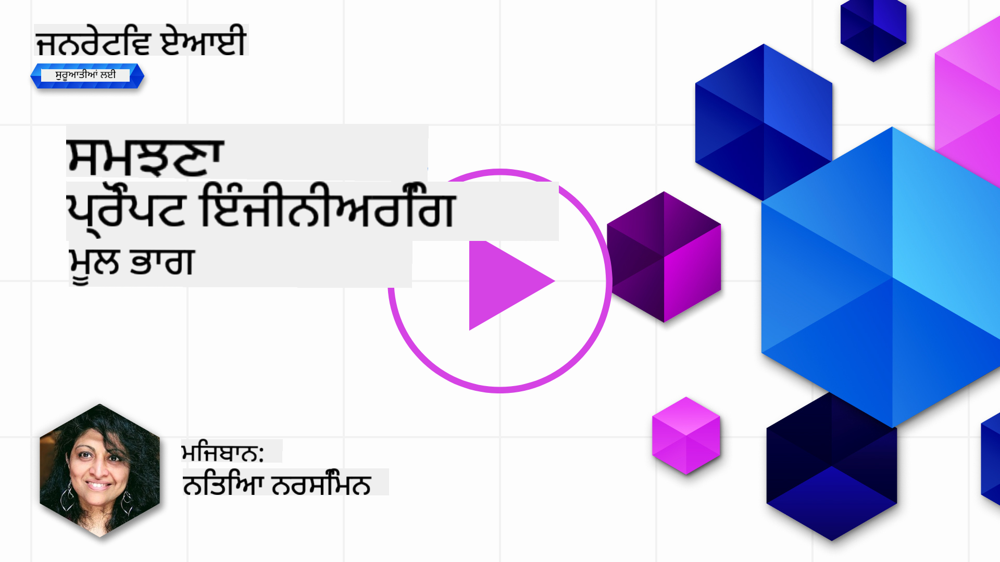
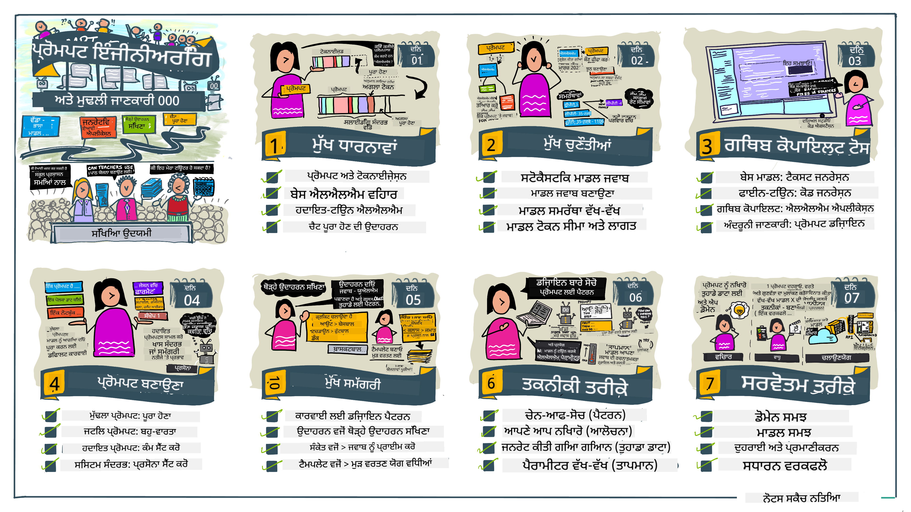
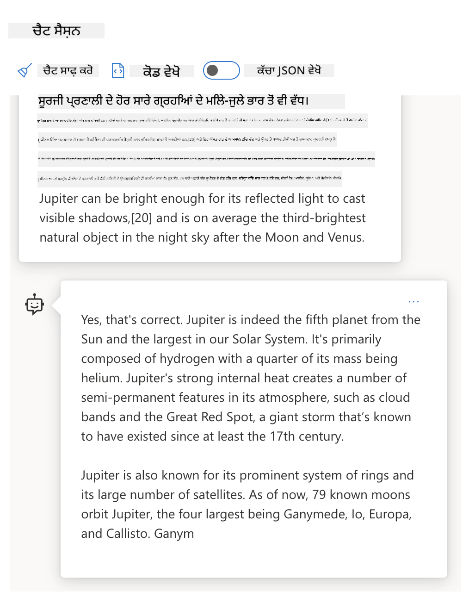
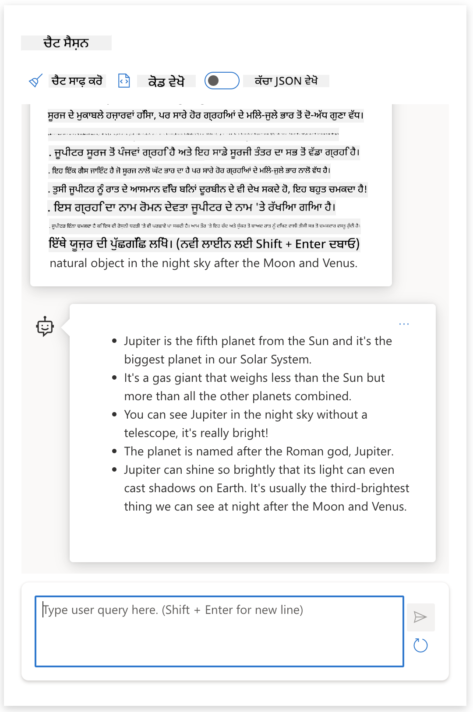
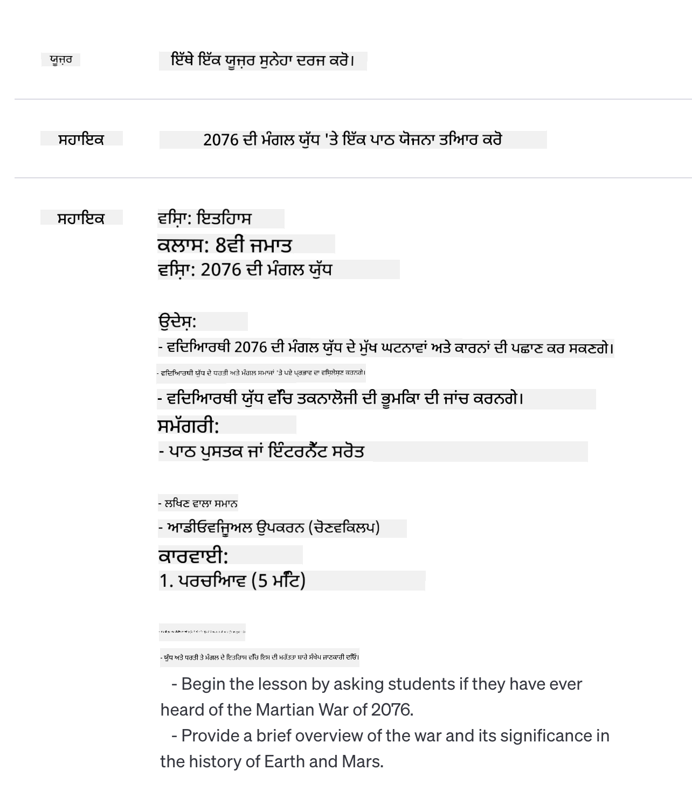

<!--
CO_OP_TRANSLATOR_METADATA:
{
  "original_hash": "dcbaaae026cb50fee071e690685b5843",
  "translation_date": "2025-08-26T16:06:52+00:00",
  "source_file": "04-prompt-engineering-fundamentals/README.md",
  "language_code": "pa"
}
-->
# ਪ੍ਰੌਂਪਟ ਇੰਜੀਨੀਅਰਿੰਗ ਦੀਆਂ ਬੁਨਿਆਦਾਂ

[](https://aka.ms/gen-ai-lesson4-gh?WT.mc_id=academic-105485-koreyst)

## ਜਾਣ-ਪਛਾਣ
ਇਸ ਮੋਡੀਊਲ ਵਿੱਚ ਜਨਰੇਟਿਵ ਏਆਈ ਮਾਡਲਾਂ ਵਿੱਚ ਪ੍ਰਭਾਵਸ਼ਾਲੀ ਪ੍ਰੌਂਪਟ ਬਣਾਉਣ ਲਈ ਜ਼ਰੂਰੀ ਧਾਰਨਾਵਾਂ ਅਤੇ ਤਕਨੀਕਾਂ ਬਾਰੇ ਗੱਲ ਕੀਤੀ ਗਈ ਹੈ। ਤੁਸੀਂ ਆਪਣੇ LLM ਨੂੰ ਜੋ ਪ੍ਰੌਂਪਟ ਲਿਖਦੇ ਹੋ, ਉਹ ਵੀ ਮਹੱਤਵਪੂਰਨ ਹੈ। ਧਿਆਨ ਨਾਲ ਬਣਾਇਆ ਗਿਆ ਪ੍ਰੌਂਪਟ ਵਧੀਆ ਜਵਾਬ ਦੇ ਸਕਦਾ ਹੈ। ਪਰ ਅਸਲ ਵਿੱਚ _prompt_ ਅਤੇ _prompt engineering_ ਵਰਗੇ ਸ਼ਬਦਾਂ ਦਾ ਕੀ ਮਤਲਬ ਹੈ? ਅਤੇ ਮੈਂ LLM ਨੂੰ ਭੇਜਣ ਵਾਲੇ ਪ੍ਰੌਂਪਟ _input_ ਨੂੰ ਕਿਵੇਂ ਵਧੀਆ ਕਰ ਸਕਦਾ ਹਾਂ? ਇਹ ਉਹ ਸਵਾਲ ਹਨ ਜਿਨ੍ਹਾਂ ਦੇ ਜਵਾਬ ਅਸੀਂ ਇਸ ਚੈਪਟਰ ਅਤੇ ਅਗਲੇ ਵਿੱਚ ਲੱਭਣ ਦੀ ਕੋਸ਼ਿਸ਼ ਕਰਾਂਗੇ।

_ਜਨਰੇਟਿਵ ਏਆਈ_ ਨਵੇਂ ਸਮੱਗਰੀ (ਜਿਵੇਂ ਕਿ ਲਿਖਤ, ਚਿੱਤਰ, ਆਡੀਓ, ਕੋਡ ਆਦਿ) ਉਪਭੋਗਤਾ ਦੀ ਮੰਗ 'ਤੇ ਤਿਆਰ ਕਰ ਸਕਦੀ ਹੈ। ਇਹ _Large Language Models_ ਵਰਗੇ OpenAI ਦੇ GPT ("Generative Pre-trained Transformer") ਸੀਰੀਜ਼ ਦੀ ਵਰਤੋਂ ਕਰਦੀ ਹੈ, ਜੋ ਕਿ ਕੁਦਰਤੀ ਭਾਸ਼ਾ ਅਤੇ ਕੋਡ ਲਈ ਟ੍ਰੇਨ ਕੀਤੇ ਜਾਂਦੇ ਹਨ।

ਹੁਣ ਉਪਭੋਗਤਾ ਇਨ੍ਹਾਂ ਮਾਡਲਾਂ ਨਾਲ ਚੈਟ ਵਰਗੀਆਂ ਆਮ ਪੈਰਾਡਾਈਮਾਂ ਰਾਹੀਂ ਗੱਲਬਾਤ ਕਰ ਸਕਦੇ ਹਨ, ਬਿਨਾਂ ਕਿਸੇ ਤਕਨੀਕੀ ਗਿਆਨ ਜਾਂ ਟ੍ਰੇਨਿੰਗ ਦੇ। ਇਹ ਮਾਡਲ _prompt-based_ ਹਨ - ਉਪਭੋਗਤਾ ਲਿਖਤ ਰੂਪ ਵਿੱਚ ਪ੍ਰੌਂਪਟ ਭੇਜਦੇ ਹਨ ਅਤੇ ਏਆਈ ਵਲੋਂ ਜਵਾਬ (completion) ਮਿਲਦਾ ਹੈ। ਉਹ "ਏਆਈ ਨਾਲ ਚੈਟ" ਕਰਦੇ ਹੋਏ, ਕਈ ਵਾਰ ਗੱਲਬਾਤ ਕਰ ਸਕਦੇ ਹਨ, ਆਪਣੇ ਪ੍ਰੌਂਪਟ ਨੂੰ ਸੋਧਦੇ ਹਨ ਜਦ ਤੱਕ ਜਵਾਬ ਉਨ੍ਹਾਂ ਦੀ ਉਮੀਦਾਂ 'ਤੇ ਪੂਰਾ ਨਹੀਂ ਉਤਰਦਾ।

"Prompts" ਹੁਣ ਜਨਰੇਟਿਵ ਏਆਈ ਐਪਸ ਲਈ ਮੁੱਖ _programming interface_ ਬਣ ਗਏ ਹਨ, ਜੋ ਮਾਡਲਾਂ ਨੂੰ ਦੱਸਦੇ ਹਨ ਕਿ ਕੀ ਕਰਨਾ ਹੈ ਅਤੇ ਜਵਾਬ ਦੀ ਗੁਣਵੱਤਾ 'ਤੇ ਅਸਰ ਪਾਉਂਦੇ ਹਨ। "Prompt Engineering" ਇੱਕ ਤੇਜ਼ੀ ਨਾਲ ਵਧ ਰਹੀ ਵਿਦਿਆ ਹੈ, ਜੋ _prompts_ ਦੇ ਡਿਜ਼ਾਇਨ ਅਤੇ optimization 'ਤੇ ਧਿਆਨ ਦਿੰਦੀ ਹੈ, ਤਾਂ ਜੋ ਵੱਡੇ ਪੱਧਰ 'ਤੇ ਲਗਾਤਾਰ ਅਤੇ ਉੱਚ ਗੁਣਵੱਤਾ ਵਾਲੇ ਜਵਾਬ ਮਿਲ ਸਕਣ।

## ਸਿੱਖਣ ਦੇ ਲਕੜ

ਇਸ ਪਾਠ ਵਿੱਚ ਅਸੀਂ ਜਾਣਾਂਗੇ ਕਿ Prompt Engineering ਕੀ ਹੈ, ਇਹ ਕਿਉਂ ਜ਼ਰੂਰੀ ਹੈ, ਅਤੇ ਅਸੀਂ ਕਿਸ ਤਰੀਕੇ ਨਾਲ ਕਿਸੇ ਮਾਡਲ ਜਾਂ ਐਪਲੀਕੇਸ਼ਨ ਉਦੇਸ਼ ਲਈ ਵਧੀਆ prompts ਤਿਆਰ ਕਰ ਸਕਦੇ ਹਾਂ। ਅਸੀਂ prompt engineering ਦੇ ਮੁੱਖ ਧਾਰਨਾਵਾਂ ਅਤੇ ਵਧੀਆ ਤਰੀਕਿਆਂ ਨੂੰ ਸਮਝਾਂਗੇ - ਅਤੇ ਇੱਕ ਇੰਟਰਐਕਟਿਵ Jupyter Notebooks "sandbox" environment ਬਾਰੇ ਜਾਣਾਂਗੇ, ਜਿੱਥੇ ਅਸੀਂ ਇਹ ਧਾਰਨਾਵਾਂ ਅਸਲ ਉਦਾਹਰਨਾਂ 'ਤੇ ਲਾਗੂ ਹੋਦਿਆਂ ਵੇਖ ਸਕਦੇ ਹਾਂ।

ਇਸ ਪਾਠ ਦੇ ਅੰਤ 'ਤੇ ਅਸੀਂ:

1. ਸਮਝਾ ਸਕਦੇ ਹਾਂ ਕਿ prompt engineering ਕੀ ਹੈ ਅਤੇ ਇਹ ਕਿਉਂ ਜ਼ਰੂਰੀ ਹੈ।
2. ਪ੍ਰੌਂਪਟ ਦੇ ਹਿੱਸਿਆਂ ਦੀ ਵਿਆਖਿਆ ਕਰ ਸਕਦੇ ਹਾਂ ਅਤੇ ਇਹ ਕਿਵੇਂ ਵਰਤੇ ਜਾਂਦੇ ਹਨ।
3. Prompt engineering ਲਈ ਵਧੀਆ ਤਰੀਕੇ ਅਤੇ ਤਕਨੀਕਾਂ ਸਿੱਖ ਸਕਦੇ ਹਾਂ।
4. ਸਿੱਖੀਆਂ ਤਕਨੀਕਾਂ ਨੂੰ ਅਸਲ ਉਦਾਹਰਨਾਂ 'ਤੇ ਲਾਗੂ ਕਰ ਸਕਦੇ ਹਾਂ, OpenAI endpoint ਦੀ ਵਰਤੋਂ ਕਰਕੇ।

## ਮੁੱਖ ਸ਼ਬਦ

Prompt Engineering: AI ਮਾਡਲਾਂ ਨੂੰ ਚਾਹੀਦੇ ਨਤੀਜੇ ਵੱਲ ਲੈ ਜਾਣ ਲਈ inputs ਨੂੰ ਡਿਜ਼ਾਇਨ ਅਤੇ refine ਕਰਨ ਦੀ ਪ੍ਰਕਿਰਿਆ।
Tokenization: ਲਿਖਤ ਨੂੰ ਛੋਟੇ units (tokens) ਵਿੱਚ ਤਬਦੀਲ ਕਰਨ ਦੀ ਪ੍ਰਕਿਰਿਆ, ਜੋ ਮਾਡਲ ਸਮਝ ਅਤੇ process ਕਰ ਸਕਦਾ ਹੈ।
Instruction-Tuned LLMs: ਵੱਡੇ ਭਾਸ਼ਾਈ ਮਾਡਲ (LLMs) ਜੋ ਖਾਸ ਹਦਾਇਤਾਂ ਨਾਲ fine-tune ਕੀਤੇ ਜਾਂਦੇ ਹਨ, ਤਾਂ ਜੋ ਉਨ੍ਹਾਂ ਦੇ ਜਵਾਬ ਵਧੀਆ ਅਤੇ ਸਬੰਧਤ ਹੋਣ।

## ਸਿੱਖਣ ਵਾਲਾ Sandbox

Prompt engineering ਹੁਣ ਤਕ ਵਿਗਿਆਨ ਨਾਲੋਂ ਵਧੇਰੇ ਕਲਾ ਹੈ। ਇਸ ਲਈ, ਆਪਣੀ intuition ਵਧਾਉਣ ਦਾ ਸਭ ਤੋਂ ਵਧੀਆ ਤਰੀਕਾ _ਵਧੇਰੇ ਅਭਿਆਸ_ ਕਰਨਾ ਅਤੇ trial-and-error ਤਰੀਕਾ ਅਪਣਾਉਣਾ ਹੈ, ਜੋ ਕਿ domain ਦੀ ਮਹਾਰਤ, ਤਜਰਬੇ ਅਤੇ ਮਾਡਲ-ਖਾਸ ਤਕਨੀਕਾਂ ਨੂੰ ਮਿਲਾ ਕੇ ਕੀਤਾ ਜਾਂਦਾ ਹੈ।

ਇਸ ਪਾਠ ਨਾਲ ਆਉਣ ਵਾਲਾ Jupyter Notebook ਤੁਹਾਨੂੰ ਇੱਕ _sandbox_ environment ਦਿੰਦਾ ਹੈ, ਜਿੱਥੇ ਤੁਸੀਂ ਜੋ ਸਿੱਖਦੇ ਹੋ, ਉਹ try ਕਰ ਸਕਦੇ ਹੋ - ਜਾਂ ਪਾਠ ਦੇ ਅੰਤ 'ਤੇ code challenge ਦੇ ਹਿੱਸੇ ਵਜੋਂ। Exercises ਚਲਾਉਣ ਲਈ ਤੁਹਾਨੂੰ ਲੋੜ ਹੋਵੇਗੀ:

1. **Azure OpenAI API key** - deployed LLM ਲਈ service endpoint।
2. **Python Runtime** - ਜਿਸ ਵਿੱਚ Notebook ਚਲਾਇਆ ਜਾ ਸਕੇ।
3. **Local Env Variables** - _[SETUP](./../00-course-setup/02-setup-local.md?WT.mc_id=academic-105485-koreyst) ਦੇ ਕਦਮ ਹੁਣ ਪੂਰੇ ਕਰੋ, ਤਿਆਰ ਹੋਣ ਲਈ_।

Notebook ਵਿੱਚ _starter_ exercises ਹਨ - ਪਰ ਤੁਹਾਨੂੰ ਆਪਣੇ _Markdown_ (description) ਅਤੇ _Code_ (prompt requests) sections ਸ਼ਾਮਲ ਕਰਨ ਦੀ ਹੌਂਸਲਾ-ਅਫ਼ਜ਼ਾਈ ਕੀਤੀ ਜਾਂਦੀ ਹੈ, ਤਾਂ ਜੋ ਹੋਰ ਉਦਾਹਰਨਾਂ ਜਾਂ ਵਿਚਾਰ try ਕਰ ਸਕੋ - ਅਤੇ prompt design ਲਈ ਆਪਣੀ intuition ਬਣ ਸਕੋ।

## ਚਿੱਤਰਾਂ ਵਾਲੀ ਗਾਈਡ

ਕੀ ਤੁਸੀਂ ਚਾਹੁੰਦੇ ਹੋ ਕਿ ਪਾਠ ਸ਼ੁਰੂ ਕਰਨ ਤੋਂ ਪਹਿਲਾਂ ਇਹ ਪਾਠ ਕੀ cover ਕਰਦਾ ਹੈ, ਉਸ ਦੀ ਵੱਡੀ ਤਸਵੀਰ ਮਿਲ ਜਾਵੇ? ਇਸ illustrated guide ਨੂੰ ਵੇਖੋ, ਜੋ ਤੁਹਾਨੂੰ ਮੁੱਖ ਵਿਸ਼ਿਆਂ ਅਤੇ key takeaways ਦੀ ਝਲਕ ਦਿੰਦੀ ਹੈ। ਪਾਠ ਦਾ roadmap ਤੁਹਾਨੂੰ ਮੁੱਖ ਧਾਰਨਾਵਾਂ ਅਤੇ ਚੁਣੌਤੀਆਂ ਨੂੰ ਸਮਝਣ ਤੋਂ ਲੈ ਕੇ, ਉਨ੍ਹਾਂ ਨੂੰ prompt engineering ਦੀਆਂ ਤਕਨੀਕਾਂ ਅਤੇ ਵਧੀਆ ਤਰੀਕਿਆਂ ਨਾਲ address ਕਰਨ ਤੱਕ ਲੈ ਜਾਂਦਾ ਹੈ। ਧਿਆਨ ਦਿਓ ਕਿ "Advanced Techniques" section ਇਸ guide ਵਿੱਚ curriculum ਦੇ _ਅਗਲੇ_ ਚੈਪਟਰ ਦੀ ਸਮੱਗਰੀ ਨੂੰ reference ਕਰਦੀ ਹੈ।



## ਸਾਡਾ Startup

ਹੁਣ, ਆਓ ਗੱਲ ਕਰੀਏ ਕਿ _ਇਹ ਵਿਸ਼ਾ_ ਸਾਡੀ startup mission ਨਾਲ ਕਿਵੇਂ ਜੁੜਦਾ ਹੈ, ਜਿਸਦਾ ਮਕਸਦ [AI innovation ਨੂੰ ਸਿੱਖਿਆ ਵਿੱਚ ਲਿਆਉਣਾ](https://educationblog.microsoft.com/2023/06/collaborating-to-bring-ai-innovation-to-education?WT.mc_id=academic-105485-koreyst) ਹੈ। ਅਸੀਂ AI-ਚਲਿਤ _personalized learning_ ਐਪਲੀਕੇਸ਼ਨ ਬਣਾਉਣਾ ਚਾਹੁੰਦੇ ਹਾਂ - ਤਾਂ ਆਓ ਸੋਚੀਏ ਕਿ ਸਾਡੀ ਐਪ ਦੇ ਵੱਖ-ਵੱਖ ਉਪਭੋਗਤਾ "prompts" ਕਿਵੇਂ design ਕਰ ਸਕਦੇ ਹਨ:

- **Administrators** AI ਨੂੰ _curriculum data ਦਾ ਵਿਸ਼ਲੇਸ਼ਣ ਕਰਕੇ coverage ਵਿੱਚ ਕਮੀ ਲੱਭਣ_ ਲਈ ਪੁੱਛ ਸਕਦੇ ਹਨ। AI ਨਤੀਜੇ summarize ਕਰ ਸਕਦੀ ਹੈ ਜਾਂ code ਨਾਲ visualize ਕਰ ਸਕਦੀ ਹੈ।
- **Educators** AI ਨੂੰ _target audience ਅਤੇ ਵਿਸ਼ੇ ਲਈ lesson plan ਬਣਾਉਣ_ ਲਈ ਪੁੱਛ ਸਕਦੇ ਹਨ। AI ਨਿਰਧਾਰਤ format ਵਿੱਚ personalized plan ਤਿਆਰ ਕਰ ਸਕਦੀ ਹੈ।
- **Students** AI ਨੂੰ _ਕਿਸੇ ਔਖੇ ਵਿਸ਼ੇ ਵਿੱਚ ਟਿਊਟਰ ਕਰਨ_ ਲਈ ਪੁੱਛ ਸਕਦੇ ਹਨ। AI ਹੁਣ ਵਿਦਿਆਰਥੀਆਂ ਨੂੰ ਉਨ੍ਹਾਂ ਦੇ ਪੱਧਰ ਅਨੁਸਾਰ ਪਾਠ, hints ਅਤੇ ਉਦਾਹਰਨਾਂ ਦੇ ਕੇ guide ਕਰ ਸਕਦੀ ਹੈ।

ਇਹ ਤਾਂ ਸਿਰਫ਼ ਸ਼ੁਰੂਆਤ ਹੈ। [Prompts For Education](https://github.com/microsoft/prompts-for-edu/tree/main?WT.mc_id=academic-105485-koreyst) ਵੇਖੋ - ਇੱਕ open-source prompts library, ਜੋ ਸਿੱਖਿਆ ਦੇ ਮਾਹਿਰਾਂ ਵਲੋਂ curate ਕੀਤੀ ਗਈ ਹੈ - ਤਾਂ ਜੋ ਤੁਹਾਨੂੰ ਹੋਰ ਸੰਭਾਵਨਾਵਾਂ ਦੀ ਸਮਝ ਆ ਸਕੇ! _Sandbox ਜਾਂ OpenAI Playground ਵਿੱਚ ਉਹ prompts ਚਲਾਕੇ ਵੇਖੋ ਕਿ ਕੀ ਹੁੰਦਾ ਹੈ!_

<!--
LESSON TEMPLATE:
This unit should cover core concept #1.
Reinforce the concept with examples and references.

CONCEPT #1:
Prompt Engineering.
Define it and explain why it is needed.
-->

## Prompt Engineering ਕੀ ਹੈ?

ਅਸੀਂ ਇਹ ਪਾਠ ਸ਼ੁਰੂ ਕੀਤਾ ਸੀ **Prompt Engineering** ਨੂੰ _prompts_ (text inputs) ਨੂੰ design ਅਤੇ optimize ਕਰਨ ਦੀ ਪ੍ਰਕਿਰਿਆ ਵਜੋਂ define ਕਰਕੇ, ਤਾਂ ਜੋ ਕਿਸੇ ਐਪਲੀਕੇਸ਼ਨ ਉਦੇਸ਼ ਅਤੇ ਮਾਡਲ ਲਈ ਲਗਾਤਾਰ ਅਤੇ ਉੱਚ ਗੁਣਵੱਤਾ ਵਾਲੇ ਜਵਾਬ (completions) ਮਿਲ ਸਕਣ। ਅਸੀਂ ਇਸਨੂੰ 2-ਕਦਮ ਦੀ ਪ੍ਰਕਿਰਿਆ ਵਜੋਂ ਸੋਚ ਸਕਦੇ ਹਾਂ:

- ਦਿੱਤੇ ਮਾਡਲ ਅਤੇ ਉਦੇਸ਼ ਲਈ _initial prompt_ design ਕਰਨਾ
- ਜਵਾਬ ਦੀ ਗੁਣਵੱਤਾ ਵਧਾਉਣ ਲਈ _prompt_ ਨੂੰ ਵਾਰ-ਵਾਰ refine ਕਰਨਾ

ਇਹ ਲਾਜ਼ਮੀ ਤੌਰ 'ਤੇ trial-and-error ਪ੍ਰਕਿਰਿਆ ਹੈ, ਜਿਸ ਵਿੱਚ ਉਪਭੋਗਤਾ ਦੀ intuition ਅਤੇ ਮਿਹਨਤ ਲੋੜੀਂਦੀ ਹੈ, ਤਾਂ ਜੋ ਵਧੀਆ ਨਤੀਜੇ ਮਿਲ ਸਕਣ। ਪਰ ਇਹ ਕਿਉਂ ਜ਼ਰੂਰੀ ਹੈ? ਇਸ ਸਵਾਲ ਦਾ ਜਵਾਬ ਲੱਭਣ ਲਈ, ਪਹਿਲਾਂ ਤਿੰਨ ਧਾਰਨਾਵਾਂ ਨੂੰ ਸਮਝਣਾ ਜ਼ਰੂਰੀ ਹੈ:

- _Tokenization_ = ਮਾਡਲ "prompt" ਨੂੰ ਕਿਵੇਂ ਵੇਖਦਾ ਹੈ
- _Base LLMs_ = foundation model "prompt" ਨੂੰ ਕਿਵੇਂ process ਕਰਦਾ ਹੈ
- _Instruction-Tuned LLMs_ = ਮਾਡਲ ਹੁਣ "tasks" ਨੂੰ ਕਿਵੇਂ ਵੇਖ ਸਕਦਾ ਹੈ

### Tokenization

LLM prompts ਨੂੰ _tokens ਦੀ ਲੜੀ_ ਵਜੋਂ ਵੇਖਦਾ ਹੈ, ਜਿੱਥੇ ਵੱਖ-ਵੱਖ ਮਾਡਲ (ਜਾਂ ਮਾਡਲ ਦੇ ਵਰਜਨ) ਇੱਕੋ prompt ਨੂੰ ਵੱਖ-ਵੱਖ ਤਰੀਕੇ ਨਾਲ tokenize ਕਰ ਸਕਦੇ ਹਨ। ਕਿਉਂਕਿ LLMs tokens 'ਤੇ train ਹੁੰਦੇ ਹਨ (raw text 'ਤੇ ਨਹੀਂ), prompt ਦੇ tokenize ਹੋਣ ਦਾ ਤਰੀਕਾ generated response ਦੀ ਗੁਣਵੱਤਾ 'ਤੇ ਸਿੱਧਾ ਅਸਰ ਪਾਉਂਦਾ ਹੈ।

Tokenization ਕਿਵੇਂ ਕੰਮ ਕਰਦੀ ਹੈ, ਇਸ ਦੀ intuition ਲੈਣ ਲਈ [OpenAI Tokenizer](https://platform.openai.com/tokenizer?WT.mc_id=academic-105485-koreyst) ਵਰਗੇ tools try ਕਰੋ। ਆਪਣਾ prompt copy ਕਰੋ - ਅਤੇ ਵੇਖੋ ਕਿ ਉਹ tokens ਵਿੱਚ ਕਿਵੇਂ ਤਬਦੀਲ ਹੁੰਦਾ ਹੈ, whitespace ਅਤੇ punctuation ਨੂੰ ਧਿਆਨ ਨਾਲ ਵੇਖੋ। ਧਿਆਨ ਦਿਓ ਕਿ ਇਹ ਉਦਾਹਰਨ ਪੁਰਾਣੇ LLM (GPT-3) ਦੀ ਹੈ - ਨਵੇਂ ਮਾਡਲ ਨਾਲ try ਕਰਨ 'ਤੇ ਵੱਖ-ਵੱਖ ਨਤੀਜੇ ਆ ਸਕਦੇ ਹਨ।


### ਧਾਰਨਾ: Foundation Models

Prompt tokenize ਹੋਣ ਤੋਂ ਬਾਅਦ, ["Base LLM"](https://blog.gopenai.com/an-introduction-to-base-and-instruction-tuned-large-language-models-8de102c785a6?WT.mc_id=academic-105485-koreyst) (Foundation model) ਦਾ ਮੁੱਖ ਕੰਮ ਉਸ ਲੜੀ ਵਿੱਚ ਅਗਲਾ token predict ਕਰਨਾ ਹੁੰਦਾ ਹੈ। LLMs ਵੱਡੇ ਲਿਖਤ dataset 'ਤੇ train ਹੁੰਦੇ ਹਨ, ਇਸ ਲਈ ਉਨ੍ਹਾਂ ਨੂੰ tokens ਦੇ statistical relationships ਦੀ ਚੰਗੀ ਸਮਝ ਹੁੰਦੀ ਹੈ ਅਤੇ prediction ਕਰ ਸਕਦੇ ਹਨ। ਧਿਆਨ ਦਿਓ ਕਿ ਉਹ prompt ਜਾਂ token ਦੇ _ਅਰਥ_ ਨੂੰ ਨਹੀਂ ਸਮਝਦੇ; ਉਹ ਸਿਰਫ਼ pattern ਵੇਖਦੇ ਹਨ, ਜਿਸਨੂੰ "complete" ਕਰ ਸਕਦੇ ਹਨ। ਉਹ ਲੜੀ ਨੂੰ predict ਕਰਦੇ ਰਹਿੰਦੇ ਹਨ, ਜਦ ਤੱਕ ਉਪਭੋਗਤਾ ਜਾਂ ਕੋਈ condition ਰੋਕ ਨਾ ਲਵੇ।

Prompt-based completion ਕਿਵੇਂ ਕੰਮ ਕਰਦੀ ਹੈ, ਵੇਖਣਾ ਚਾਹੁੰਦੇ ਹੋ? ਉਪਰੋਕਤ prompt ਨੂੰ Azure OpenAI Studio ਦੇ [_Chat Playground_](https://oai.azure.com/playground?WT.mc_id=academic-105485-koreyst) ਵਿੱਚ default settings ਨਾਲ enter ਕਰੋ। System prompts ਨੂੰ information requests ਵਜੋਂ treat ਕਰਦਾ ਹੈ - ਤਾਂ ਤੁਸੀਂ completion ਵੇਖੋ, ਜੋ ਇਸ context ਨੂੰ satisfy ਕਰਦੀ ਹੈ।

ਪਰ ਜੇ ਉਪਭੋਗਤਾ ਕੁਝ ਖਾਸ criteria ਜਾਂ task objective ਵਾਲਾ ਨਤੀਜਾ ਵੇਖਣਾ ਚਾਹੁੰਦਾ ਹੋਵੇ? ਇੱਥੇ _instruction-tuned_ LLMs ਦੀ ਲੋੜ ਪੈਂਦੀ ਹੈ।



### ਧਾਰਨਾ: Instruction Tuned LLMs

[Instruction Tuned LLM](https://blog.gopenai.com/an-introduction-to-base-and-instruction-tuned-large-language-models-8de102c785a6?WT.mc_id=academic-105485-koreyst) foundation model ਤੋਂ ਸ਼ੁਰੂ ਹੁੰਦਾ ਹੈ ਅਤੇ ਉਸਨੂੰ examples ਜਾਂ input/output pairs (ਜਿਵੇਂ ਕਿ multi-turn "messages") ਨਾਲ fine-tune ਕੀਤਾ ਜਾਂਦਾ ਹੈ, ਜਿਨ੍ਹਾਂ ਵਿੱਚ ਸਾਫ਼ ਹਦਾਇਤਾਂ ਹੋ ਸਕਦੀਆਂ ਹਨ - ਅਤੇ AI ਦਾ ਜਵਾਬ ਉਹ ਹਦਾਇਤ follow ਕਰਨ ਦੀ ਕੋਸ਼ਿਸ਼ ਕਰਦਾ ਹੈ।

ਇਹ Reinforcement Learning with Human Feedback (RLHF) ਵਰਗੀਆਂ ਤਕਨੀਕਾਂ ਦੀ ਵਰਤੋਂ ਕਰਦਾ ਹੈ, ਜੋ ਮਾਡਲ ਨੂੰ _ਹਦਾਇਤਾਂ follow_ ਕਰਨ ਅਤੇ _feedback ਤੋਂ ਸਿੱਖਣ_ ਲਈ train ਕਰਦੀਆਂ ਹਨ, ਤਾਂ ਜੋ ਜਵਾਬ ਵਧੀਆ ਅਤੇ ਉਪਭੋਗਤਾ ਦੇ ਉਦੇਸ਼ ਲਈ ਸਬੰਧਤ ਹੋਣ।

ਆਓ try ਕਰੀਏ - ਉਪਰੋਕਤ prompt ਨੂੰ ਦੁਬਾਰਾ try ਕਰੋ, ਪਰ ਹੁਣ _system message_ ਨੂੰ ਹੇਠਾਂ ਦਿੱਤੀ ਹਦਾਇਤ ਦੇ ਕੇ context ਦਿਓ:

> _Summarize content you are provided with for a second-grade student. Keep the result to one paragraph with 3-5 bullet points._

ਵੇਖੋ ਕਿ ਨਤੀਜਾ ਹੁਣ goal ਅਤੇ format ਅਨੁਸਾਰ tuned ਹੋ ਗਿਆ? Educator ਹੁਣ ਇਹ ਜਵਾਬ ਆਪਣੇ class ਦੀ slides ਵਿੱਚ direct ਵਰਤ ਸਕਦਾ ਹੈ।



## Prompt Engineering ਦੀ ਲੋੜ ਕਿਉਂ ਹੈ?

ਹੁਣ ਜਦ ਅਸੀਂ ਜਾਣ ਲਿਆ ਕਿ prompts LLMs ਵਲੋਂ ਕਿਵੇਂ process ਹੁੰਦੇ ਹਨ, ਆਓ ਗੱਲ ਕਰੀਏ ਕਿ _ਕਿਉਂ_ prompt engineering ਦੀ ਲੋੜ ਹੈ। ਜਵਾਬ ਇਹ ਹੈ ਕਿ ਮੌਜੂਦਾ LLMs ਵਿੱਚ ਕਈ ਚੁਣੌਤੀਆਂ ਹਨ, ਜੋ _ਭਰੋਸੇਯੋਗ ਅਤੇ ਲਗਾਤਾਰ completions_ ਪ੍ਰਾਪਤ ਕਰਨਾ ਔਖਾ ਬਣਾਉਂਦੀਆਂ ਹਨ, ਜਦ ਤੱਕ prompt construction ਅਤੇ optimization 'ਤੇ ਮਿਹਨਤ ਨਾ ਕੀਤੀ ਜਾਵੇ। ਉਦਾਹਰਨ ਵਜੋਂ:

1. **Model responses stochastic ਹਨ।** _ਇੱਕੋ prompt_ ਵੱਖ-ਵੱਖ ਮਾਡਲ ਜਾਂ ਮਾਡਲ ਵਰਜਨ ਨਾਲ ਵੱਖ-ਵੱਖ ਜਵਾਬ ਦੇ ਸਕਦਾ ਹੈ। ਅਤੇ ਇਹ _ਇੱਕੋ ਮਾਡਲ_ ਨਾਲ ਵੀ ਵੱਖ-ਵੱਖ ਸਮੇਂ 'ਤੇ ਵੱਖ-ਵੱਖ ਨਤੀਜੇ ਦੇ ਸਕਦਾ ਹੈ। _Prompt engineering techniques ਇਨ੍ਹਾਂ variations ਨੂੰ minimize ਕਰਨ ਵਿੱਚ ਮਦਦ ਕਰਦੀਆਂ ਹਨ, ਵਧੀਆ guardrails ਦੇ ਕੇ_।

1. **Models fabrication ਕਰ ਸਕਦੇ ਹਨ।** ਮਾਡਲ _ਵੱਡੇ ਪਰ ਸੀਮਤ_ datasets ਨਾਲ pre-train ਹੁੰਦੇ ਹਨ, ਜਿਸਦਾ ਮਤਲਬ ਉਹਨਾਂ ਨੂੰ training scope ਤੋਂ ਬਾਹਰ concepts ਦੀ ਜਾਣਕਾਰੀ ਨਹੀਂ ਹੁੰਦੀ। ਇਸ ਕਰਕੇ, ਉਹ inaccurate, imaginary ਜਾਂ ਜਾਣੀ-ਪਛਾਣੀ ਸੱਚਾਈ ਦੇ ਉਲਟ completions ਦੇ ਸਕਦੇ ਹਨ। _Prompt engineering techniques ਉਪਭੋਗਤਾਵਾਂ ਨੂੰ fabrication ਪਛਾਣਣ ਅਤੇ mitigate ਕਰਨ ਵਿੱਚ ਮਦਦ ਕਰਦੀਆਂ ਹਨ, ਜਿਵੇਂ ਕਿ AI ਤੋਂ citations ਜਾਂ reasoning ਮੰਗਣਾ_।

1. **Models ਦੀਆਂ capabilities ਵੱਖ-ਵੱਖ ਹੋ ਸਕਦੀਆਂ ਹਨ।** ਨਵੇਂ ਮਾਡਲ ਜਾਂ ਮਾਡਲ generations ਵਿੱਚ ਹੋਰ capabilities ਹੋ ਸਕਦੀਆਂ ਹਨ, ਪਰ ਉਹਨਾਂ ਨਾਲ ਕੁਝ unique quirks ਅਤੇ cost & complexity ਦੇ tradeoffs ਵੀ ਆਉਂਦੇ ਹਨ। _Prompt engineering ਵਧੀਆ ਤਰੀਕੇ ਅਤੇ workflows ਵਿਕਸਤ ਕਰਨ ਵਿੱਚ ਮਦਦ ਕਰਦੀ ਹੈ, ਜੋ differences ਨੂੰ abstract ਕਰਕੇ
ਮੰਗਲ ਯੁੱਧ 2076 'ਤੇ ਪਾਠ ਯੋਜਨਾ

# ਪਾਠ ਦਾ ਵਿਸ਼ਾ: ਮੰਗਲ ਯੁੱਧ 2076

## ਪਾਠ ਦੇ ਉਦੇਸ਼

- ਵਿਦਿਆਰਥੀਆਂ ਨੂੰ 2076 ਵਿੱਚ ਹੋਏ ਮੰਗਲ ਯੁੱਧ ਦੀਆਂ ਮੁੱਖ ਘਟਨਾਵਾਂ ਬਾਰੇ ਜਾਣੂ ਕਰਵਾਉਣਾ
- ਯੁੱਧ ਦੇ ਕਾਰਨਾਂ, ਪ੍ਰਭਾਵਾਂ ਅਤੇ ਨਤੀਜਿਆਂ ਦੀ ਜਾਂਚ ਕਰਨਾ
- ਵਿਦਿਆਰਥੀਆਂ ਵਿੱਚ ਆਲੋਚਨਾਤਮਕ ਸੋਚ ਅਤੇ ਚਰਚਾ ਦੀ ਪ੍ਰੇਰਣਾ ਕਰਨਾ

## ਪਾਠ ਦੀ ਲੰਬਾਈ

1 ਘੰਟਾ

## ਪਾਠ ਦੀ ਰਚਨਾ

### 1. ਤਰੀਕਾ ਅਤੇ ਪਿਛੋਕੜ (10 ਮਿੰਟ)

- ਮੰਗਲ ਉੱਤੇ ਮਨੁੱਖੀ ਬਸਤੀ ਦੀ ਸਥਾਪਨਾ
- ਧਰਤੀ ਅਤੇ ਮੰਗਲ ਵਿਚਕਾਰ ਵਧ ਰਹੀ ਤਣਾਅ
- 2076 ਵਿੱਚ ਯੁੱਧ ਦੇ ਭੜਕਣ ਦੇ ਮੁੱਖ ਕਾਰਨ

### 2. ਮੁੱਖ ਘਟਨਾਵਾਂ (15 ਮਿੰਟ)

- ਯੁੱਧ ਦੀ ਸ਼ੁਰੂਆਤ: @@INLINE_CODE_1@@
- ਮੰਗਲ ਦੀ ਰਣਨੀਤੀ ਅਤੇ ਧਰਤੀ ਦੀ ਪ੍ਰਤੀਕਿਰਿਆ
- @@INLINE_CODE_2@@ ਦੀ ਭੂਮਿਕਾ

### 3. ਯੁੱਧ ਦੇ ਨਤੀਜੇ (10 ਮਿੰਟ)

- ਮੰਗਲ ਅਤੇ ਧਰਤੀ ਦੇ ਰਿਸ਼ਤੇ 'ਚ ਆਏ ਬਦਲਾਅ
- ਵਿਗਿਆਨਕ ਅਤੇ ਤਕਨੀਕੀ ਤਰੱਕੀ
- ਆਮ ਲੋਕਾਂ 'ਤੇ ਪੈਦਾ ਹੋਏ ਪ੍ਰਭਾਵ

### 4. ਚਰਚਾ ਅਤੇ ਵਿਸ਼ਲੇਸ਼ਣ (15 ਮਿੰਟ)

- ਕੀ ਮੰਗਲ ਯੁੱਧ ਟਲ ਸਕਦਾ ਸੀ?
- ਵਿਦਿਆਰਥੀਆਂ ਦੀ ਰਾਏ: ਯੁੱਧ ਦੇ ਚੰਗੇ ਅਤੇ ਮਾੜੇ ਪੱਖ
- ਆਉਣ ਵਾਲੇ ਸਮੇਂ ਲਈ ਸਿੱਖਿਆ

### 5. ਗਤੀਵਿਧੀ (10 ਮਿੰਟ)

- ਵਿਦਿਆਰਥੀਆਂ ਨੂੰ ਛੋਟੇ ਗਰੁੱਪਾਂ ਵਿੱਚ ਵੰਡੋ
- ਹਰ ਗਰੁੱਪ ਨੂੰ ਇੱਕ ਮੁੱਖ ਪਾਤਰ ਜਾਂ ਸੰਸਥਾ ਦੀ ਭੂਮਿਕਾ ਨਿਭਾਉਣ ਲਈ ਕਹੋ
- ਯੁੱਧ ਦੌਰਾਨ ਲਿਆ ਗਿਆ ਇੱਕ ਫੈਸਲਾ ਵੱਖ-ਵੱਖ ਪੱਖਾਂ ਤੋਂ ਵਿਸ਼ਲੇਸ਼ਣ

## ਹੋਮਵਰਕ

- 2076 ਦੇ ਮੰਗਲ ਯੁੱਧ 'ਤੇ ਇੱਕ ਲਘੂ ਨਿਬੰਧ ਲਿਖੋ
- @@INLINE_CODE_3@@ ਦੀ ਭੂਮਿਕਾ 'ਤੇ ਵਿਚਾਰ ਕਰੋ

## ਸਰੋਤ

- ਮੰਗਲ ਯੁੱਧ 2076: ਇੱਕ ਇਤਿਹਾਸਕ ਝਲਕ
- @@INLINE_CODE_4@@
- ਵਿਦਿਆਰਥੀਆਂ ਲਈ ਸਿਫਾਰਸ਼ੀ ਪਾਠ

---

> ਟਿੱਪਣੀ: ਇਹ ਪਾਠ ਯੋਜਨਾ ਮੰਗਲ ਯੁੱਧ 2076 ਦੀਆਂ ਮੁੱਖ ਘਟਨਾਵਾਂ, ਕਾਰਨਾਂ ਅਤੇ ਨਤੀਜਿਆਂ ਦੀ ਪੂਰੀ ਸਮਝ ਦੇਣ ਲਈ ਤਿਆਰ ਕੀਤੀ ਗਈ ਹੈ.
ਇੱਕ ਵੈੱਬ ਖੋਜ ਤੋਂ ਪਤਾ ਲੱਗਾ ਕਿ ਮੰਗਲ ਗ੍ਰਹਿ ਦੀ ਜੰਗਾਂ 'ਤੇ ਕਈ ਕਹਾਣੀਆਂ (ਜਿਵੇਂ ਟੀਵੀ ਸੀਰੀਜ਼ ਜਾਂ ਕਿਤਾਬਾਂ) ਲਿਖੀਆਂ ਗਈਆਂ ਹਨ - ਪਰ 2076 ਵਿੱਚ ਕੋਈ ਨਹੀਂ। ਆਮ ਤੌਰ 'ਤੇ ਵੀ ਪਤਾ ਲੱਗਦਾ ਹੈ ਕਿ 2076 _ਭਵਿੱਖ_ ਵਿੱਚ ਹੈ, ਇਸ ਲਈ ਇਹ ਕਿਸੇ ਅਸਲ ਘਟਨਾ ਨਾਲ ਨਹੀਂ ਜੋੜੀ ਜਾ ਸਕਦੀ।

ਹੁਣ ਵੇਖੀਏ ਕਿ ਜਦੋਂ ਅਸੀਂ ਇਹ ਪ੍ਰੋੰਪਟ ਵੱਖ-ਵੱਖ LLM ਪ੍ਰੋਵਾਈਡਰਾਂ 'ਤੇ ਚਲਾਉਂਦੇ ਹਾਂ ਤਾਂ ਕੀ ਹੁੰਦਾ?

> **Response 1**: OpenAI Playground (GPT-35)



> **Response 2**: Azure OpenAI Playground (GPT-35)


> **Response 3**: : Hugging Face Chat Playground (LLama-2)


ਜਿਵੇਂ ਉਮੀਦ ਸੀ, ਹਰ ਮਾਡਲ (ਜਾਂ ਮਾਡਲ ਵਰਜਨ) ਵੱਖ-ਵੱਖ ਜਵਾਬ ਦਿੰਦੇ ਹਨ, ਕਿਉਂਕਿ stochastic ਵਿਹਾਰ ਅਤੇ ਮਾਡਲ ਦੀ ਸਮਰੱਥਾ ਵਿੱਚ ਫਰਕ ਹੁੰਦਾ ਹੈ। ਉਦਾਹਰਨ ਵਜੋਂ, ਇੱਕ ਮਾਡਲ 8ਵੀਂ ਜਮਾਤ ਦੇ ਵਿਦਿਆਰਥੀਆਂ ਲਈ ਲਿਖਦਾ ਹੈ, ਦੂਜਾ high-school ਦੇ ਵਿਦਿਆਰਥੀ ਲਈ। ਪਰ ਤਿੰਨੇ ਮਾਡਲਾਂ ਨੇ ਅਜਿਹੇ ਜਵਾਬ ਦਿੱਤੇ ਜੋ ਕਿਸੇ ਅਣਜਾਣ ਯੂਜ਼ਰ ਨੂੰ ਇਹ ਯਕੀਨ ਦਿਵਾ ਸਕਦੇ ਹਨ ਕਿ ਇਹ ਘਟਨਾ ਅਸਲ ਹੈ।

Prompt engineering ਦੀਆਂ ਤਕਨੀਕਾਂ ਜਿਵੇਂ _metaprompting_ ਅਤੇ _temperature configuration_ ਕੁਝ ਹੱਦ ਤੱਕ ਮਾਡਲ ਦੀ fabrication ਘਟਾ ਸਕਦੀਆਂ ਹਨ। ਨਵੇਂ prompt engineering _architectures_ ਵੀ ਨਵੇਂ ਟੂਲ ਅਤੇ ਤਕਨੀਕਾਂ ਨੂੰ prompt flow ਵਿੱਚ ਆਸਾਨੀ ਨਾਲ ਸ਼ਾਮਲ ਕਰਦੇ ਹਨ, ਤਾਂ ਜੋ ਇਨ੍ਹਾਂ ਪ੍ਰਭਾਵਾਂ ਨੂੰ ਘਟਾਇਆ ਜਾ ਸਕੇ।

## ਕੇਸ ਸਟਡੀ: GitHub Copilot

ਆਓ, ਇਸ ਹਿੱਸੇ ਨੂੰ wrap ਕਰੀਏ ਅਤੇ ਵੇਖੀਏ ਕਿ prompt engineering ਅਸਲ ਜ਼ਿੰਦਗੀ ਵਿੱਚ ਕਿਵੇਂ ਵਰਤੀ ਜਾਂਦੀ ਹੈ, ਇੱਕ ਕੇਸ ਸਟਡੀ ਦੇ ਰੂਪ ਵਿੱਚ: [GitHub Copilot](https://github.com/features/copilot?WT.mc_id=academic-105485-koreyst)।

GitHub Copilot ਤੁਹਾਡਾ "AI Pair Programmer" ਹੈ - ਇਹ ਟੈਕਸਟ ਪ੍ਰੋੰਪਟ ਨੂੰ ਕੋਡ completions ਵਿੱਚ ਬਦਲਦਾ ਹੈ ਅਤੇ ਤੁਹਾਡੇ development environment (ਜਿਵੇਂ Visual Studio Code) ਵਿੱਚ integrate ਹੁੰਦਾ ਹੈ, ਤਾਂ ਜੋ ਯੂਜ਼ਰ experience seamless ਰਹੇ। ਹੇਠਾਂ ਦਿੱਤੇ blogs ਵਿੱਚ ਦਰਸਾਇਆ ਗਿਆ ਹੈ ਕਿ ਸਭ ਤੋਂ ਪਹਿਲਾ ਵਰਜਨ OpenAI Codex ਮਾਡਲ 'ਤੇ ਆਧਾਰਿਤ ਸੀ - ਇੰਜੀਨੀਅਰਾਂ ਨੇ ਜਲਦੀ ਹੀ ਮਾਡਲ ਨੂੰ fine-tune ਕਰਨ ਅਤੇ ਵਧੀਆ prompt engineering ਤਕਨੀਕਾਂ ਵਿਕਸਤ ਕਰਨ ਦੀ ਲੋੜ ਸਮਝ ਲਈ, ਤਾਂ ਜੋ ਕੋਡ ਦੀ quality ਵਧਾਈ ਜਾ ਸਕੇ। ਜੁਲਾਈ ਵਿੱਚ, ਉਨ੍ਹਾਂ ਨੇ [ਇੱਕ ਨਵਾਂ AI ਮਾਡਲ ਲਾਂਚ ਕੀਤਾ ਜੋ Codex ਤੋਂ ਵੀ ਅੱਗੇ ਹੈ](https://github.blog/2023-07-28-smarter-more-efficient-coding-github-copilot-goes-beyond-codex-with-improved-ai-model/?WT.mc_id=academic-105485-koreyst), ਜਿਸ ਨਾਲ suggestions ਹੋਰ ਤੇਜ਼ ਮਿਲਦੀਆਂ ਹਨ।

ਇਹ posts ਲੜੀਵਾਰ ਪੜ੍ਹੋ, ਤਾਂ ਜੋ ਉਨ੍ਹਾਂ ਦੀ ਸਿੱਖਣ ਦੀ ਯਾਤਰਾ ਨੂੰ ਸਮਝ ਸਕੋ।

- **ਮਈ 2023** | [GitHub Copilot ਤੁਹਾਡਾ ਕੋਡ ਹੋਰ ਚੰਗੀ ਤਰ੍ਹਾਂ ਸਮਝਣ ਲੱਗ ਪਿਆ ਹੈ](https://github.blog/2023-05-17-how-github-copilot-is-getting-better-at-understanding-your-code/?WT.mc_id=academic-105485-koreyst)
- **ਮਈ 2023** | [GitHub ਦੇ ਅੰਦਰ: GitHub Copilot ਦੇ ਪਿੱਛੇ LLMs ਨਾਲ ਕੰਮ ਕਰਨਾ](https://github.blog/2023-05-17-inside-github-working-with-the-llms-behind-github-copilot/?WT.mc_id=academic-105485-koreyst)
- **ਜੂਨ 2023** | [GitHub Copilot ਲਈ ਵਧੀਆ prompts ਕਿਵੇਂ ਲਿਖੀਏ](https://github.blog/2023-06-20-how-to-write-better-prompts-for-github-copilot/?WT.mc_id=academic-105485-koreyst)
- **ਜੁਲਾਈ 2023** | [.. GitHub Copilot improved AI ਮਾਡਲ ਨਾਲ Codex ਤੋਂ ਅੱਗੇ](https://github.blog/2023-07-28-smarter-more-efficient-coding-github-copilot-goes-beyond-codex-with-improved-ai-model/?WT.mc_id=academic-105485-koreyst)
- **ਜੁਲਾਈ 2023** | [Developer ਲਈ Prompt Engineering ਅਤੇ LLMs Guide](https://github.blog/2023-07-17-prompt-engineering-guide-generative-ai-llms/?WT.mc_id=academic-105485-koreyst)
- **ਸਤੰਬਰ 2023** | [Enterprise LLM ਐਪ ਕਿਵੇਂ ਬਣਾਈਏ: GitHub Copilot ਤੋਂ ਸਿੱਖ](https://github.blog/2023-09-06-how-to-build-an-enterprise-llm-application-lessons-from-github-copilot/?WT.mc_id=academic-105485-koreyst)

ਤੁਸੀਂ ਉਨ੍ਹਾਂ ਦਾ [Engineering blog](https://github.blog/category/engineering/?WT.mc_id=academic-105485-koreyst) ਵੀ ਵੇਖ ਸਕਦੇ ਹੋ, ਹੋਰ posts ਲਈ, ਜਿਵੇਂ [ਇਹ](https://github.blog/2023-09-27-how-i-used-github-copilot-chat-to-build-a-reactjs-gallery-prototype/?WT.mc_id=academic-105485-koreyst), ਜਿਸ ਵਿੱਚ ਦਿਖਾਇਆ ਗਿਆ ਹੈ ਕਿ ਇਹ ਮਾਡਲ ਅਤੇ ਤਕਨੀਕਾਂ ਅਸਲ ਐਪਲੀਕੇਸ਼ਨ ਬਣਾਉਣ ਲਈ _ਵਰਤੀਆਂ_ ਜਾਂਦੀਆਂ ਹਨ।

---

<!--
LESSON TEMPLATE:
ਇਹ ਯੂਨਿਟ ਕੋਰ ਕਾਂਸੈਪਟ #2 ਨੂੰ ਕਵਰ ਕਰਨਾ ਚਾਹੀਦਾ ਹੈ।
ਉਦਾਹਰਨਾਂ ਅਤੇ ਹਵਾਲਿਆਂ ਨਾਲ ਕਾਂਸੈਪਟ ਨੂੰ ਮਜ਼ਬੂਤ ਕਰੋ।

CONCEPT #2:
Prompt Design.
ਉਦਾਹਰਨਾਂ ਨਾਲ ਵਿਖਾਇਆ ਗਿਆ।
-->

## ਪ੍ਰੋੰਪਟ ਬਣਾਉਣ ਦੀ ਪ੍ਰਕਿਰਿਆ

ਅਸੀਂ ਵੇਖਿਆ ਕਿ prompt engineering ਕਿਉਂ ਜ਼ਰੂਰੀ ਹੈ - ਹੁਣ ਸਮਝੀਏ ਕਿ prompts _ਕਿਵੇਂ ਬਣਾਏ ਜਾਂਦੇ ਹਨ_, ਤਾਂ ਜੋ ਵੱਖ-ਵੱਖ ਤਕਨੀਕਾਂ ਦੀ effectiveness ਦਾ ਮੁਲਾਂਕਣ ਕਰ ਸਕੀਏ।

### ਬੇਸਿਕ ਪ੍ਰੋੰਪਟ

ਚਲੋ, ਬੇਸਿਕ ਪ੍ਰੋੰਪਟ ਤੋਂ ਸ਼ੁਰੂ ਕਰੀਏ: ਇੱਕ ਸਧਾਰਨ ਟੈਕਸਟ ਇਨਪੁੱਟ ਜੋ ਮਾਡਲ ਨੂੰ ਕੋਈ ਹੋਰ context ਦੇ ਬਿਨਾਂ ਭੇਜਿਆ ਜਾਂਦਾ ਹੈ। ਉਦਾਹਰਨ ਵਜੋਂ - ਜਦੋਂ ਅਸੀਂ US ਦੇ ਰਾਸ਼ਟਰੀ ਗੀਤ ਦੇ ਪਹਿਲੇ ਕੁ ਸ਼ਬਦ OpenAI [Completion API](https://platform.openai.com/docs/api-reference/completions?WT.mc_id=academic-105485-koreyst) ਨੂੰ ਭੇਜਦੇ ਹਾਂ, ਤਾਂ ਇਹ ਤੁਰੰਤ _ਅਗਲੇ ਕੁ ਲਾਈਨਾਂ_ ਨਾਲ ਜਵਾਬ ਪੂਰਾ ਕਰ ਦਿੰਦਾ ਹੈ, ਜੋ ਕਿ ਮੂਲ prediction ਵਿਹਾਰ ਨੂੰ ਦਰਸਾਉਂਦਾ ਹੈ।

| ਪ੍ਰੋੰਪਟ (Input)     | Completion (Output)                                                                                                                        |
| :----------------- | :----------------------------------------------------------------------------------------------------------------------------------------- |
| Oh say can you see | ਇਹ ਲੱਗਦਾ ਹੈ ਤੁਸੀਂ "The Star-Spangled Banner," ਜੋ ਕਿ United States ਦਾ ਰਾਸ਼ਟਰੀ ਗੀਤ ਹੈ, ਦੇ lyrics ਸ਼ੁਰੂ ਕਰ ਰਹੇ ਹੋ। ਪੂਰੇ lyrics ਹਨ ... |

### ਕੰਪਲੈਕਸ ਪ੍ਰੋੰਪਟ

ਹੁਣ ਆਓ, ਉਸ ਬੇਸਿਕ ਪ੍ਰੋੰਪਟ ਵਿੱਚ context ਅਤੇ instructions ਸ਼ਾਮਲ ਕਰੀਏ। [Chat Completion API](https://learn.microsoft.com/azure/ai-services/openai/how-to/chatgpt?WT.mc_id=academic-105485-koreyst) ਸਾਨੂੰ complex prompt ਬਣਾਉਣ ਦੀ ਆਗਿਆ ਦਿੰਦੀ ਹੈ, ਜਿਸ ਵਿੱਚ _messages_ ਦਾ ਸਮੂਹ ਹੁੰਦਾ ਹੈ:

- Input/output ਜੋੜੇ, ਜਿਨ੍ਹਾਂ ਵਿੱਚ _user_ ਦੀ ਇਨਪੁੱਟ ਅਤੇ _assistant_ ਦਾ ਜਵਾਬ ਹੁੰਦਾ ਹੈ।
- System message, ਜੋ assistant ਦੇ ਵਿਹਾਰ ਜਾਂ personality ਲਈ context ਸੈੱਟ ਕਰਦੀ ਹੈ।

ਹੁਣ request ਹੇਠਾਂ ਦਿੱਤੇ ਰੂਪ ਵਿੱਚ ਹੈ, ਜਿੱਥੇ _tokenization_ context ਅਤੇ conversation ਤੋਂ ਲੋੜੀਂਦੀ ਜਾਣਕਾਰੀ capture ਕਰਦੀ ਹੈ। ਹੁਣ, system context ਬਦਲਣ ਨਾਲ completions ਦੀ quality ਉੱਤੇ ਉਤਨਾ ਹੀ ਅਸਰ ਪੈਂਦਾ ਹੈ, ਜਿੰਨਾ user input ਉੱਤੇ।

```python
response = openai.chat.completions.create(
    model="gpt-3.5-turbo",
    messages=[
        {"role": "system", "content": "You are a helpful assistant."},
        {"role": "user", "content": "Who won the world series in 2020?"},
        {"role": "assistant", "content": "The Los Angeles Dodgers won the World Series in 2020."},
        {"role": "user", "content": "Where was it played?"}
    ]
)
```

### ਇੰਸਟ੍ਰਕਸ਼ਨ ਪ੍ਰੋੰਪਟ

ਉਪਰੋਕਤ ਉਦਾਹਰਨਾਂ ਵਿੱਚ, user prompt ਇੱਕ ਸਧਾਰਨ text query ਸੀ, ਜਿਸ ਨੂੰ ਜਾਣਕਾਰੀ ਦੀ ਮੰਗ ਵਜੋਂ ਲਿਆ ਜਾ ਸਕਦਾ ਹੈ। _Instruction_ prompts ਨਾਲ, ਅਸੀਂ ਉਸ text ਰਾਹੀਂ task ਨੂੰ ਹੋਰ detail ਵਿੱਚ specify ਕਰ ਸਕਦੇ ਹਾਂ, AI ਨੂੰ ਵਧੀਆ guidance ਦੇ ਸਕਦੇ ਹਾਂ। ਉਦਾਹਰਨ:

| ਪ੍ਰੋੰਪਟ (Input)                                                                                                                                                                                                                         | Completion (Output)                                                                                                        | Instruction Type    |
| :------------------------------------------------------------------------------------------------------------------------------------------------------------------------------------------------------------------------------------- | :------------------------------------------------------------------------------------------------------------------------- | :------------------ |
| Write a description of the Civil War                                                                                                                                                                                                   | _ਇੱਕ ਸਧਾਰਨ ਪੈਰਾ ਵਾਪਸ ਆਇਆ_                                                                                              | Simple              |
| Write a description of the Civil War. Provide key dates and events and describe their significance                                                                                                                                     | _ਇੱਕ ਪੈਰਾ ਆਇਆ, ਫਿਰ ਮੁੱਖ event dates ਦੀ ਲਿਸਟ, ਉਨ੍ਹਾਂ ਦੀ ਵਿਆਖਿਆ ਨਾਲ_                                             | Complex             |
| Write a description of the Civil War in 1 paragraph. Provide 3 bullet points with key dates and their significance. Provide 3 more bullet points with key historical figures and their contributions. Return the output as a JSON file | _ਹੋਰ detail, text box ਵਿੱਚ, JSON format ਵਿੱਚ, ਜੋ ਤੁਸੀਂ file ਵਿੱਚ copy-paste ਕਰ ਸਕਦੇ ਹੋ ਅਤੇ validate ਕਰ ਸਕਦੇ ਹੋ_ | Complex. Formatted. |

## ਪ੍ਰਾਇਮਰੀ ਸਮੱਗਰੀ

ਉਪਰੋਕਤ ਉਦਾਹਰਨਾਂ ਵਿੱਚ, prompt ਫਿਰ ਵੀ ਕਾਫੀ ਖੁੱਲ੍ਹਾ ਸੀ, ਜਿਸ ਨਾਲ LLM ਆਪਣੇ pre-trained dataset ਵਿੱਚੋਂ ਜੋ relevant ਲੱਗੇ, ਉਹ ਚੁਣ ਲੈਂਦਾ। _Primary content_ design pattern ਵਿੱਚ, input text ਨੂੰ ਦੋ ਹਿੱਸਿਆਂ ਵਿੱਚ ਵੰਡਿਆ ਜਾਂਦਾ ਹੈ:

- ਇੱਕ instruction (action)
- relevant content (ਜੋ action ਨੂੰ ਪ੍ਰਭਾਵਿਤ ਕਰਦਾ ਹੈ)

ਇੱਥੇ ਉਦਾਹਰਨ ਹੈ, ਜਿੱਥੇ instruction ਹੈ "summarize this in 2 sentences".

| ਪ੍ਰੋੰਪਟ (Input)                                                                                                                                                                                                                                                                                                                                                                                                                                                                                                                                                                                                                                                                                      | Completion (Output)                                                                                                                                                                                                                                                                             |
| :-------------------------------------------------------------------------------------------------------------------------------------------------------------------------------------------------------------------------------------------------------------------------------------------------------------------------------------------------------------------------------------------------------------------------------------------------------------------------------------------------------------------------------------------------------------------------------------------------------------------------------------------------------------------------------------------------- | :---------------------------------------------------------------------------------------------------------------------------------------------------------------------------------------------------------------------------------------------------------------------------------------------- |
| Jupiter is the fifth planet from the Sun and the largest in the Solar System. It is a gas giant with a mass one-thousandth that of the Sun, but two-and-a-half times that of all the other planets in the Solar System combined. Jupiter is one of the brightest objects visible to the naked eye in the night sky, and has been known to ancient civilizations since before recorded history. It is named after the Roman god Jupiter.[19] When viewed from Earth, Jupiter can be bright enough for its reflected light to cast visible shadows,[20] and is on average the third-brightest natural object in the night sky after the Moon and Venus. <br/> **Summarize this in 2 short sentences** | Jupiter, the fifth planet from the Sun, is the largest in the Solar System and is known for being one of the brightest objects in the night sky. Named after the Roman god Jupiter, it's a gas giant whose mass is two-and-a-half times that of all other planets in the Solar System combined. |

Primary content segment ਨੂੰ ਵੱਖ-ਵੱਖ ਤਰੀਕਿਆਂ ਨਾਲ ਵਰਤਿਆ ਜਾ ਸਕਦਾ ਹੈ, ਤਾਂ ਜੋ instructions ਹੋਰ ਪ੍ਰਭਾਵਸ਼ਾਲੀ ਬਣ ਸਕਣ:

- **Examples** - explicit instruction ਦੇਣ ਦੀ ਬਜਾਏ, ਮਾਡਲ ਨੂੰ ਕੁਝ ਉਦਾਹਰਨਾਂ ਦੇ ਦਿਓ, ਤਾਂ ਜੋ ਉਹ pattern infer ਕਰ ਲਵੇ।
- **Cues** - instruction ਤੋਂ ਬਾਅਦ "cue" ਦੇ ਦਿਓ, ਜੋ completion ਨੂੰ prime ਕਰਦਾ ਹੈ, ਮਾਡਲ ਨੂੰ relevant ਜਵਾਬ ਵੱਲ ਲੈ ਜਾਂਦਾ ਹੈ।
- **Templates** - ਇਹ repeatable 'recipes' ਹਨ, prompts ਲਈ, ਜਿਨ੍ਹਾਂ ਵਿੱਚ placeholders (variables) ਹੁੰਦੇ ਹਨ, ਜੋ data ਨਾਲ customize ਕੀਤੇ ਜਾ ਸਕਦੇ ਹਨ।

ਆਓ, ਇਹਨਾਂ ਨੂੰ ਅਮਲ ਵਿੱਚ ਵੇਖੀਏ।

### Examples ਦੀ ਵਰਤੋਂ

ਇਹ ਤਰੀਕਾ ਹੈ, ਜਿਸ ਵਿੱਚ ਤੁਸੀਂ primary content ਰਾਹੀਂ ਮਾਡਲ ਨੂੰ ਕੁਝ ਉਦਾਹਰਨਾਂ "ਖਿਲਾਉਂਦੇ" ਹੋ, ਤਾਂ ਜੋ ਉਹ instruction ਲਈ ਚੰਗਾ output infer ਕਰ ਲਵੇ। ਜਿੰਨੀ ਵਾਰੀ ਤੁਸੀਂ ਉਦਾਹਰਨਾਂ ਦਿੰਦੇ ਹੋ, ਉਸ ਅਨੁਸਾਰ zero-shot prompting, one-shot prompting, few-shot prompting ਆਦਿ ਹੋ ਸਕਦੇ ਹਨ।

Prompt ਹੁਣ ਤਿੰਨ ਹਿੱਸਿਆਂ ਵਿੱਚ ਬਣਦਾ ਹੈ:

- Task description
- ਕੁਝ ਉਦਾਹਰਨਾਂ, desired output ਦੀਆਂ
- ਨਵੇਂ example ਦੀ ਸ਼ੁਰੂਆਤ (implicit task description ਬਣ ਜਾਂਦੀ ਹੈ)

| Learning Type | ਪ੍ਰੋੰਪਟ (Input)                                                                                                                                        | Completion (Output)         |
| :------------ | :---------------------------------------------------------------------------------------------------------------------------------------------------- | :-------------------------- |
| Zero-shot     | "The Sun is Shining". Translate to Spanish                                                                                                            | "El Sol está brillando".    |
| One-shot      | "The Sun is Shining" => ""El Sol está brillando". <br> "It's a Cold and Windy Day" =>                                                                 | "Es un día frío y ventoso". |
| Few-shot      | The player ran the bases => Baseball <br/> The player hit an ace => Tennis <br/> The player hit a six => Cricket <br/> The player made a slam-dunk => | Basketball                  |
|               |                                                                                                                                                       |                             |

ਵੇਖੋ ਕਿ zero-shot prompting ਵਿੱਚ explicit instruction ("Translate to Spanish") ਦੇਣੀ ਪਈ, ਪਰ one-shot prompting ਵਿੱਚ ਇਹ infer ਹੋ ਜਾਂਦੀ ਹੈ। Few-shot example ਵਿੱਚ, ਹੋਰ ਉਦਾਹਰਨਾਂ ਦੇਣ ਨਾਲ, ਮਾਡਲ ਹੋਰ accurate inference ਕਰ ਲੈਂਦਾ ਹੈ, extra instructions ਦੇ ਬਿਨਾਂ।

### Prompt Cues

Primary content ਵਰਤਣ ਦੀ ਇੱਕ ਹੋਰ ਤਕਨੀਕ ਹੈ _cues_ ਦੇਣਾ, ਉਦਾਹਰਨਾਂ ਦੀ ਬਜਾਏ। ਇੱਥੇ, ਅਸੀਂ ਮਾਡਲ ਨੂੰ "hint" ਦਿੰਦੇ ਹਾਂ, ਜਵਾਬ ਦੇ format ਦੀ ਸ਼ੁਰੂਆਤ ਕਰਕੇ। ਮਾਡਲ ਫਿਰ "cue" ਲੈ ਕੇ, ਉਸੇ format ਵਿੱਚ ਜਵਾਬ ਪੂਰਾ ਕਰਦਾ ਹੈ।

| Number of Cues | ਪ੍ਰੋੰਪਟ (Input)                                                                                                                                                                                                                                                                                                                                                                                                                                               | Completion (Output)                                                                                                                                                                                                                                                                                       |
| :------------- | :----------------------------------------------------------------------------------------------------------------------------------------------------------------------------------------------------------------------------------------------------------------------------------------------------------------------------------------------------------------------------------------------------------------------------------------------------------- | :-------------------------------------------------------------------------------------------------------------------------------------------------------------------------------------------------------------------------------------------------------------------------------------------------------- |
| 0              | Jupiter is the fifth planet from the Sun and the largest in the Solar System. It is a gas giant with a mass one-thousandth that of the Sun, but two-and-a-half times that of all the other planets in the Solar System combined. Jupiter is one of the brightest objects visible to the naked eye in the night sky, and has been known to ancient civilizations since before recorded history.

**ਇਸਦਾ ਸੰਖੇਪ ਕਰੋ**                                       | ਬ੍ਰਹਿਸਪਤਿ ਸਾਡੀ ਸੂਰਜ ਮੰਡਲ ਦਾ ਸਭ ਤੋਂ ਵੱਡਾ ਗ੍ਰਹਿ ਹੈ ਅਤੇ ਸੂਰਜ ਤੋਂ ਪੰਜਵਾਂ। ਇਹ ਇੱਕ ਗੈਸ ਜਾਇੰਟ ਹੈ ਜਿਸਦੀ ਭਾਰਤਾ ਸੂਰਜ ਦੇ 1/1000 ਦੇ ਬਰਾਬਰ ਹੈ, ਪਰ ਇਹ ਸਾਰੇ ਹੋਰ ਗ੍ਰਹਿਆਂ ਦੇ ਜੋੜ ਤੋਂ ਵੀ ਵੱਧ ਭਾਰੀ ਹੈ। ਪੁਰਾਤਨ ਸਭਿਆਚਾਰਾਂ ਨੂੰ ਬ੍ਰਹਿਸਪਤਿ ਬਾਰੇ ਕਾਫੀ ਸਮੇਂ ਤੋਂ ਪਤਾ ਸੀ, ਅਤੇ ਇਹ ਰਾਤ ਦੇ ਆਸਮਾਨ ਵਿੱਚ ਆਸਾਨੀ ਨਾਲ ਦਿਖਾਈ ਦਿੰਦਾ ਹੈ। |
| 1              | ਬ੍ਰਹਿਸਪਤਿ ਸੂਰਜ ਤੋਂ ਪੰਜਵਾਂ ਗ੍ਰਹਿ ਹੈ ਅਤੇ ਸੂਰਜ ਮੰਡਲ ਵਿੱਚ ਸਭ ਤੋਂ ਵੱਡਾ। ਇਹ ਇੱਕ ਗੈਸ ਜਾਇੰਟ ਹੈ ਜਿਸਦੀ ਭਾਰਤਾ ਸੂਰਜ ਦੇ ਇੱਕ ਹਜ਼ਾਰਵੇਂ ਹਿੱਸੇ ਦੇ ਬਰਾਬਰ ਹੈ, ਪਰ ਸੂਰਜ ਮੰਡਲ ਦੇ ਸਾਰੇ ਹੋਰ ਗ੍ਰਹਿਆਂ ਦੇ ਜੋੜ ਤੋਂ ਦੋ-ਅੱਧ ਵਾਰੀ ਵੱਧ ਹੈ। ਬ੍ਰਹਿਸਪਤਿ ਰਾਤ ਦੇ ਆਸਮਾਨ ਵਿੱਚ ਨੰਗੀ ਅੱਖ ਨਾਲ ਦਿਖਾਈ ਦੇਣ ਵਾਲੀਆਂ ਸਭ ਤੋਂ ਚਮਕਦਾਰ ਚੀਜ਼ਾਂ ਵਿੱਚੋਂ ਇੱਕ ਹੈ, ਅਤੇ ਇਹ ਪੁਰਾਤਨ ਸਭਿਆਚਾਰਾਂ ਨੂੰ ਇਤਿਹਾਸ ਲਿਖੇ ਜਾਣ ਤੋਂ ਪਹਿਲਾਂ ਤੋਂ ਪਤਾ ਸੀ। <br/>**ਇਸਦਾ ਸੰਖੇਪ ਕਰੋ** <br/> ਅਸੀਂ ਇਹ ਸਿੱਖਿਆ ਕਿ ਬ੍ਰਹਿਸਪਤਿ | ਸੂਰਜ ਤੋਂ ਪੰਜਵਾਂ ਗ੍ਰਹਿ ਹੈ ਅਤੇ ਸੂਰਜ ਮੰਡਲ ਵਿੱਚ ਸਭ ਤੋਂ ਵੱਡਾ। ਇਹ ਇੱਕ ਗੈਸ ਜਾਇੰਟ ਹੈ ਜਿਸਦੀ ਭਾਰਤਾ ਸੂਰਜ ਦੇ ਇੱਕ ਹਜ਼ਾਰਵੇਂ ਹਿੱਸੇ ਦੇ ਬਰਾਬਰ ਹੈ, ਪਰ ਸਾਰੇ ਹੋਰ ਗ੍ਰਹਿਆਂ ਦੇ ਜੋੜ ਤੋਂ ਦੋ-ਅੱਧ ਵਾਰੀ ਵੱਧ ਹੈ। ਇਹ ਨੰਗੀ ਅੱਖ ਨਾਲ ਆਸਾਨੀ ਨਾਲ ਦਿਖਾਈ ਦਿੰਦਾ ਹੈ ਅਤੇ ਪੁਰਾਤਨ ਸਮਿਆਂ ਤੋਂ ਜਾਣਿਆ ਜਾਂਦਾ ਹੈ।                        |
| 2              | ਬ੍ਰਹਿਸਪਤਿ ਸੂਰਜ ਤੋਂ ਪੰਜਵਾਂ ਗ੍ਰਹਿ ਹੈ ਅਤੇ ਸੂਰਜ ਮੰਡਲ ਵਿੱਚ ਸਭ ਤੋਂ ਵੱਡਾ। ਇਹ ਇੱਕ ਗੈਸ ਜਾਇੰਟ ਹੈ ਜਿਸਦੀ ਭਾਰਤਾ ਸੂਰਜ ਦੇ ਇੱਕ ਹਜ਼ਾਰਵੇਂ ਹਿੱਸੇ ਦੇ ਬਰਾਬਰ ਹੈ, ਪਰ ਸੂਰਜ ਮੰਡਲ ਦੇ ਸਾਰੇ ਹੋਰ ਗ੍ਰਹਿਆਂ ਦੇ ਜੋੜ ਤੋਂ ਦੋ-ਅੱਧ ਵਾਰੀ ਵੱਧ ਹੈ। ਬ੍ਰਹਿਸਪਤਿ ਰਾਤ ਦੇ ਆਸਮਾਨ ਵਿੱਚ ਨੰਗੀ ਅੱਖ ਨਾਲ ਦਿਖਾਈ ਦੇਣ ਵਾਲੀਆਂ ਸਭ ਤੋਂ ਚਮਕਦਾਰ ਚੀਜ਼ਾਂ ਵਿੱਚੋਂ ਇੱਕ ਹੈ, ਅਤੇ ਇਹ ਪੁਰਾਤਨ ਸਭਿਆਚਾਰਾਂ ਨੂੰ ਇਤਿਹਾਸ ਲਿਖੇ ਜਾਣ ਤੋਂ ਪਹਿਲਾਂ ਤੋਂ ਪਤਾ ਸੀ। <br/>**ਇਸਦਾ ਸੰਖੇਪ ਕਰੋ** <br/> ਅਸੀਂ ਸਿੱਖੇ ਟੌਪ 3 ਤੱਥ:         | 1. ਬ੍ਰਹਿਸਪਤਿ ਸੂਰਜ ਤੋਂ ਪੰਜਵਾਂ ਗ੍ਰਹਿ ਹੈ ਅਤੇ ਸੂਰਜ ਮੰਡਲ ਵਿੱਚ ਸਭ ਤੋਂ ਵੱਡਾ। <br/> 2. ਇਹ ਇੱਕ ਗੈਸ ਜਾਇੰਟ ਹੈ ਜਿਸਦੀ ਭਾਰਤਾ ਸੂਰਜ ਦੇ ਇੱਕ ਹਜ਼ਾਰਵੇਂ ਹਿੱਸੇ ਦੇ ਬਰਾਬਰ ਹੈ...<br/> 3. ਬ੍ਰਹਿਸਪਤਿ ਪੁਰਾਤਨ ਸਮਿਆਂ ਤੋਂ ਨੰਗੀ ਅੱਖ ਨਾਲ ਦਿਖਾਈ ਦਿੰਦਾ ਆ ਰਿਹਾ ਹੈ ...                                                                       |
|                |                                                                                                                                                                                                                                                                                                                                                                                                                                                              |                                                                                                                                                                                                                                                                                                           |

### ਪ੍ਰੌਂਪਟ ਟੈਮਪਲੇਟਸ

ਪ੍ਰੌਂਪਟ ਟੈਮਪਲੇਟ ਇੱਕ _ਪਹਿਲਾਂ ਤੋਂ ਬਣਾਇਆ ਹੋਇਆ ਪ੍ਰੌਂਪਟ ਦਾ ਨੁਸਖਾ_ ਹੁੰਦਾ ਹੈ, ਜਿਸਨੂੰ ਸੰਭਾਲਿਆ ਅਤੇ ਵਾਪਰਿਆ ਜਾ ਸਕਦਾ ਹੈ, ਤਾਂ ਜੋ ਵੱਡੇ ਪੱਧਰ 'ਤੇ ਯੂਜ਼ਰ ਅਨੁਭਵ ਵਧੀਆ ਅਤੇ ਇਕਸਾਰ ਰਹੇ। ਸਭ ਤੋਂ ਆਸਾਨ ਰੂਪ ਵਿੱਚ, ਇਹ ਸਿਰਫ਼ ਪ੍ਰੌਂਪਟ ਉਦਾਹਰਣਾਂ ਦਾ ਇਕੱਠ ਹੈ, ਜਿਵੇਂ [OpenAI ਦੀ ਇਹ ਉਦਾਹਰਣ](https://platform.openai.com/examples?WT.mc_id=academic-105485-koreyst) ਜਿਸ ਵਿੱਚ ਇੰਟਰਐਕਟਿਵ ਪ੍ਰੌਂਪਟ ਹਿੱਸੇ (ਯੂਜ਼ਰ ਅਤੇ ਸਿਸਟਮ ਸੁਨੇਹੇ) ਅਤੇ API-ਅਧਾਰਿਤ ਬੇਨਤੀ ਫਾਰਮੈਟ ਹੁੰਦੇ ਹਨ - ਤਾਂ ਜੋ ਵਾਪਰਿਆ ਜਾ ਸਕੇ।

ਇਸਦੇ ਵਧੇਰੇ ਪੇਚੀਦੇ ਰੂਪ ਵਿੱਚ, ਜਿਵੇਂ [LangChain ਦੀ ਇਹ ਉਦਾਹਰਣ](https://python.langchain.com/docs/concepts/prompt_templates/?WT.mc_id=academic-105485-koreyst) ਵਿੱਚ _ਪਲੇਸਹੋਲਡਰ_ ਹੁੰਦੇ ਹਨ, ਜੋ ਵੱਖ-ਵੱਖ ਸਰੋਤਾਂ (ਯੂਜ਼ਰ ਇਨਪੁੱਟ, ਸਿਸਟਮ ਸੰਦਰਭ, ਬਾਹਰੀ ਡਾਟਾ ਆਦਿ) ਤੋਂ ਡਾਟਾ ਨਾਲ ਬਦਲੇ ਜਾ ਸਕਦੇ ਹਨ, ਤਾਂ ਜੋ ਪ੍ਰੌਂਪਟ ਡਾਇਨਾਮਿਕ ਤਰੀਕੇ ਨਾਲ ਬਣਾਇਆ ਜਾ ਸਕੇ। ਇਸ ਤਰੀਕੇ ਨਾਲ ਅਸੀਂ ਵਾਪਰਨਯੋਗ ਪ੍ਰੌਂਪਟਾਂ ਦੀ ਲਾਇਬ੍ਰੇਰੀ ਤਿਆਰ ਕਰ ਸਕਦੇ ਹਾਂ, ਜੋ ਵੱਡੇ ਪੱਧਰ 'ਤੇ ਯੂਜ਼ਰ ਅਨੁਭਵ ਇਕਸਾਰ ਬਣਾਉਣ ਲਈ ਵਰਤੀ ਜਾ ਸਕਦੀ ਹੈ।

ਅੰਤ ਵਿੱਚ, ਟੈਮਪਲੇਟਸ ਦੀ ਅਸਲ ਵੈਲਿਊ ਇਹ ਹੈ ਕਿ ਅਸੀਂ _ਪ੍ਰੌਂਪਟ ਲਾਇਬ੍ਰੇਰੀਆਂ_ ਬਣਾਈਏ ਜੋ ਖਾਸ ਐਪਲੀਕੇਸ਼ਨ ਖੇਤਰਾਂ ਲਈ ਹੋਣ - ਜਿੱਥੇ ਪ੍ਰੌਂਪਟ ਟੈਮਪਲੇਟ ਹੁਣ ਐਪਲੀਕੇਸ਼ਨ-ਖਾਸ ਸੰਦਰਭ ਜਾਂ ਉਦਾਹਰਣਾਂ ਨਾਲ _ਅਪਟਿਮਾਈਜ਼_ ਹੁੰਦੀ ਹੈ, ਤਾਂ ਜੋ ਟਾਰਗਟ ਯੂਜ਼ਰ ਲਈ ਜਵਾਬ ਹੋਰ ਸਬੰਧਤ ਅਤੇ ਸਹੀ ਹੋਣ। [Prompts For Edu](https://github.com/microsoft/prompts-for-edu?WT.mc_id=academic-105485-koreyst) ਰਿਪੋਜ਼ਟਰੀ ਇਸ ਤਰੀਕੇ ਦੀ ਵਧੀਆ ਉਦਾਹਰਣ ਹੈ, ਜੋ ਸਿੱਖਿਆ ਖੇਤਰ ਲਈ ਪ੍ਰੌਂਪਟਾਂ ਦੀ ਲਾਇਬ੍ਰੇਰੀ ਬਣਾਉਂਦੀ ਹੈ, ਜਿਵੇਂ ਪਾਠ ਯੋਜਨਾ, ਪਾਠਕ੍ਰਮ ਡਿਜ਼ਾਈਨ, ਵਿਦਿਆਰਥੀ ਟਿਊਟੋਰਿੰਗ ਆਦਿ ਉਦੇਸ਼ਾਂ 'ਤੇ ਧਿਆਨ।

## ਸਹਾਇਕ ਸਮੱਗਰੀ

ਜੇ ਅਸੀਂ ਪ੍ਰੌਂਪਟ ਬਣਾਉਣ ਨੂੰ ਇੱਕ ਨਿਰਦੇਸ਼ (ਟਾਸਕ) ਅਤੇ ਟਾਰਗਟ (ਮੁੱਖ ਸਮੱਗਰੀ) ਵਜੋਂ ਸੋਚੀਏ, ਤਾਂ _ਦੂਜੀ ਸਮੱਗਰੀ_ ਉਹ ਵਾਧੂ ਸੰਦਰਭ ਹੁੰਦੀ ਹੈ ਜੋ ਅਸੀਂ **ਆਉਟਪੁੱਟ 'ਤੇ ਅਸਰ ਪਾਉਣ ਲਈ** ਦਿੰਦੇ ਹਾਂ। ਇਹ ਟਿਊਨਿੰਗ ਪੈਰਾਮੀਟਰ, ਫਾਰਮੈਟਿੰਗ ਨਿਰਦੇਸ਼, ਵਿਸ਼ਾ ਟੈਕਸੋਨੋਮੀ ਆਦਿ ਹੋ ਸਕਦੇ ਹਨ, ਜੋ ਮਾਡਲ ਨੂੰ ਜਵਾਬ _ਕਸਟਮਾਈਜ਼_ ਕਰਨ ਵਿੱਚ ਮਦਦ ਕਰਦੇ ਹਨ।

ਉਦਾਹਰਣ ਵਜੋਂ: ਜੇ ਪਾਠਕ੍ਰਮ ਦੀ ਲੰਮੀ ਮੈਟਾਡਾਟਾ ਵਾਲੀ ਕੋਰਸ ਕੈਟਾਲੌਗ ਹੈ (ਨਾਮ, ਵੇਰਵਾ, ਪੱਧਰ, ਟੈਗ, ਅਧਿਆਪਕ ਆਦਿ):

- ਅਸੀਂ ਨਿਰਦੇਸ਼ ਦੇ ਸਕਦੇ ਹਾਂ "Fall 2023 ਲਈ ਕੋਰਸ ਕੈਟਾਲੌਗ ਦਾ ਸੰਖੇਪ ਕਰੋ"
- ਮੁੱਖ ਸਮੱਗਰੀ ਵਿੱਚ ਕੁਝ ਚੰਗੀਆਂ ਉਦਾਹਰਣਾਂ ਦੇ ਸਕਦੇ ਹਾਂ
- ਦੂਜੀ ਸਮੱਗਰੀ ਵਿੱਚ ਟੌਪ 5 "ਟੈਗ" ਚੁਣ ਸਕਦੇ ਹਾਂ

ਹੁਣ, ਮਾਡਲ ਉਹ ਸੰਖੇਪ ਉਸ ਫਾਰਮੈਟ ਵਿੱਚ ਦੇ ਸਕਦਾ ਹੈ ਜੋ ਉਦਾਹਰਣਾਂ ਵਿੱਚ ਦਿੱਤਾ ਗਿਆ - ਪਰ ਜੇ ਨਤੀਜੇ ਵਿੱਚ ਕਈ ਟੈਗ ਹਨ, ਤਾਂ ਉਹ ਦੂਜੀ ਸਮੱਗਰੀ ਵਿੱਚ ਦਿੱਤੇ 5 ਟੈਗ ਨੂੰ ਤਰਜੀਹ ਦੇ ਸਕਦਾ ਹੈ।

---

<!--
LESSON TEMPLATE:
ਇਹ ਯੂਨਿਟ ਮੁੱਖ ਸੰਕਲਪ #1 ਨੂੰ ਕਵਰ ਕਰਨਾ ਚਾਹੀਦਾ ਹੈ।
ਉਦਾਹਰਣਾਂ ਅਤੇ ਹਵਾਲਿਆਂ ਨਾਲ ਸੰਕਲਪ ਨੂੰ ਮਜ਼ਬੂਤ ਕਰੋ।

CONCEPT #3:
ਪ੍ਰੌਂਪਟ ਇੰਜੀਨੀਅਰਿੰਗ ਤਕਨੀਕਾਂ।
ਪ੍ਰੌਂਪਟ ਇੰਜੀਨੀਅਰਿੰਗ ਦੀਆਂ ਕੁਝ ਮੁੱਢਲੀਆਂ ਤਕਨੀਕਾਂ ਕੀ ਹਨ?
ਕੁਝ ਅਭਿਆਸਾਂ ਨਾਲ ਵਿਖਾਓ।
-->

## ਪ੍ਰੌਂਪਟਿੰਗ ਦੀਆਂ ਵਧੀਆ ਤਕਨੀਕਾਂ

ਹੁਣ ਜਦੋਂ ਅਸੀਂ ਜਾਣ ਲਿਆ ਕਿ ਪ੍ਰੌਂਪਟ ਕਿਵੇਂ _ਬਣਾਏ_ ਜਾਂਦੇ ਹਨ, ਅਸੀਂ ਸੋਚ ਸਕਦੇ ਹਾਂ ਕਿ ਉਹਨਾਂ ਨੂੰ _ਡਿਜ਼ਾਈਨ_ ਕਿਵੇਂ ਕਰੀਏ ਤਾਂ ਜੋ ਵਧੀਆ ਤਜਰਬਾ ਮਿਲੇ। ਅਸੀਂ ਇਹ ਦੋ ਹਿੱਸਿਆਂ ਵਿੱਚ ਸੋਚ ਸਕਦੇ ਹਾਂ - ਠੀਕ _ਮਾਈਂਡਸੈਟ_ ਰੱਖਣਾ ਅਤੇ ਠੀਕ _ਤਕਨੀਕਾਂ_ ਲਾਗੂ ਕਰਨਾ।

### ਪ੍ਰੌਂਪਟ ਇੰਜੀਨੀਅਰਿੰਗ ਮਾਈਂਡਸੈਟ

ਪ੍ਰੌਂਪਟ ਇੰਜੀਨੀਅਰਿੰਗ ਇੱਕ ਟਰਾਇਲ-ਐਂਡ-ਐਰਰ ਪ੍ਰਕਿਰਿਆ ਹੈ, ਇਸ ਲਈ ਤਿੰਨ ਮੁੱਖ ਗਾਈਡਿੰਗ ਫੈਕਟਰ ਯਾਦ ਰੱਖੋ:

1. **ਡੋਮੇਨ ਦੀ ਸਮਝ ਜ਼ਰੂਰੀ ਹੈ।** ਜਵਾਬ ਦੀ ਸਹੀਤਾ ਅਤੇ ਸਬੰਧਤਾ ਉਸ _ਡੋਮੇਨ_ 'ਤੇ ਨਿਰਭਰ ਕਰਦੀ ਹੈ ਜਿਸ ਵਿੱਚ ਐਪਲੀਕੇਸ਼ਨ ਜਾਂ ਯੂਜ਼ਰ ਕੰਮ ਕਰਦਾ ਹੈ। ਆਪਣੀ ਸੂਝ ਅਤੇ ਡੋਮੇਨ ਦੀ ਮਹਾਰਤ ਵਰਤ ਕੇ **ਤਕਨੀਕਾਂ ਨੂੰ ਹੋਰ ਕਸਟਮਾਈਜ਼** ਕਰੋ। ਉਦਾਹਰਣ ਵਜੋਂ, ਆਪਣੇ ਸਿਸਟਮ ਪ੍ਰੌਂਪਟ ਵਿੱਚ _ਡੋਮੇਨ-ਖਾਸ ਪਰਸਨੈਲਿਟੀ_ ਪਰਿਭਾਸ਼ਿਤ ਕਰੋ, ਜਾਂ ਯੂਜ਼ਰ ਪ੍ਰੌਂਪਟ ਵਿੱਚ _ਡੋਮੇਨ-ਖਾਸ ਟੈਮਪਲੇਟ_ ਵਰਤੋ। ਦੂਜੀ ਸਮੱਗਰੀ ਵਿੱਚ ਡੋਮੇਨ-ਖਾਸ ਸੰਦਰਭ ਦਿਓ, ਜਾਂ _ਡੋਮੇਨ-ਖਾਸ ਇਸ਼ਾਰੇ ਅਤੇ ਉਦਾਹਰਣ_ ਵਰਤੋ, ਤਾਂ ਜੋ ਮਾਡਲ ਨੂੰ ਜਾਣ-ਪਛਾਣ ਵਾਲੇ ਪੈਟਰਨ ਵੱਲ ਲੈ ਜਾਏ।

2. **ਮਾਡਲ ਦੀ ਸਮਝ ਜ਼ਰੂਰੀ ਹੈ।** ਅਸੀਂ ਜਾਣਦੇ ਹਾਂ ਕਿ ਮਾਡਲ ਸਟੋਕਾਸਟਿਕ ਹੁੰਦੇ ਹਨ। ਪਰ ਮਾਡਲ ਦੀ ਇੰਪਲੀਮੈਂਟੇਸ਼ਨ ਵੀ ਵੱਖ-ਵੱਖ ਹੋ ਸਕਦੀ ਹੈ, ਜਿਵੇਂ ਕਿ ਉਹ ਕਿਸ ਟ੍ਰੇਨਿੰਗ ਡਾਟਾਸੈੱਟ 'ਤੇ ਟ੍ਰੇਨ ਹੋਏ ਹਨ (ਪ੍ਰੀ-ਟ੍ਰੇਨਡ ਨੌਲਿਜ), ਉਹ ਕੀ-ਕੀ ਕਰ ਸਕਦੇ ਹਨ (API ਜਾਂ SDK ਰਾਹੀਂ), ਅਤੇ ਉਹ ਕਿਸ ਕਿਸਮ ਦੀ ਸਮੱਗਰੀ ਲਈ ਅਪਟਿਮਾਈਜ਼ ਹਨ (ਕੋਡ, ਇਮੇਜ, ਟੈਕਸਟ ਆਦਿ)। ਤੁਸੀਂ ਜੋ ਮਾਡਲ ਵਰਤ ਰਹੇ ਹੋ, ਉਸ ਦੀਆਂ ਤਾਕਤਾਂ ਅਤੇ ਸੀਮਾਵਾਂ ਨੂੰ ਸਮਝੋ, ਅਤੇ ਉਸ ਜਾਣਕਾਰੀ ਨਾਲ _ਟਾਸਕਾਂ ਨੂੰ ਤਰਜੀਹ_ ਦਿਓ ਜਾਂ _ਕਸਟਮ ਟੈਮਪਲੇਟ_ ਬਣਾਓ ਜੋ ਮਾਡਲ ਦੀਆਂ ਖੂਬੀਆਂ ਲਈ ਅਪਟਿਮਾਈਜ਼ ਹਨ।

3. **ਇਟਰੈਸ਼ਨ ਅਤੇ ਵੈਲੀਡੇਸ਼ਨ ਜ਼ਰੂਰੀ ਹੈ।** ਮਾਡਲ ਤੇਜ਼ੀ ਨਾਲ ਵਿਕਸਤ ਹੋ ਰਹੇ ਹਨ, ਅਤੇ ਪ੍ਰੌਂਪਟ ਇੰਜੀਨੀਅਰਿੰਗ ਦੀਆਂ ਤਕਨੀਕਾਂ ਵੀ। ਇੱਕ ਡੋਮੇਨ ਵਿਸ਼ੇਸ਼ਜ्ञ ਵਜੋਂ, ਤੁਹਾਡੇ ਕੋਲ ਹੋਰ ਸੰਦਰਭ ਜਾਂ ਮਾਪਦੰਡ ਹੋ ਸਕਦੇ ਹਨ ਜੋ _ਤੁਹਾਡੇ_ ਐਪਲੀਕੇਸ਼ਨ ਲਈ ਲਾਗੂ ਹੁੰਦੇ ਹਨ, ਪਰ ਹੋਰਾਂ ਲਈ ਨਹੀਂ। ਪ੍ਰੌਂਪਟ ਇੰਜੀਨੀਅਰਿੰਗ ਦੇ ਟੂਲ ਅਤੇ ਤਕਨੀਕਾਂ ਵਰਤ ਕੇ "ਸ਼ੁਰੂਆਤ" ਕਰੋ, ਫਿਰ ਆਪਣੀ ਸੂਝ ਅਤੇ ਡੋਮੇਨ ਮਹਾਰਤ ਨਾਲ ਨਤੀਜਿਆਂ ਨੂੰ ਇਟਰੈਟ ਅਤੇ ਵੈਲੀਡੇਟ ਕਰੋ। ਆਪਣੀਆਂ ਸਿੱਖਿਆਵਾਂ ਨੂੰ ਦਰਜ ਕਰੋ ਅਤੇ ਇੱਕ **ਨੌਲਿਜ ਬੇਸ** (ਜਿਵੇਂ ਪ੍ਰੌਂਪਟ ਲਾਇਬ੍ਰੇਰੀ) ਬਣਾਓ, ਜੋ ਹੋਰਾਂ ਲਈ ਨਵਾਂ ਬੇਸਲਾਈਨ ਬਣ ਸਕਦੀ ਹੈ, ਤਾਂ ਜੋ ਭਵਿੱਖ ਵਿੱਚ ਤੇਜ਼ ਇਟਰੈਸ਼ਨ ਹੋ ਸਕਣ।

## ਵਧੀਆ ਤਕਨੀਕਾਂ

ਹੁਣ ਆਓ ਉਹ ਆਮ ਵਧੀਆ ਤਕਨੀਕਾਂ ਵੇਖੀਏ ਜੋ [OpenAI](https://help.openai.com/en/articles/6654000-best-practices-for-prompt-engineering-with-openai-api?WT.mc_id=academic-105485-koreyst) ਅਤੇ [Azure OpenAI](https://learn.microsoft.com/azure/ai-services/openai/concepts/prompt-engineering#best-practices?WT.mc_id=academic-105485-koreyst) ਦੇ ਪ੍ਰੈਕਟੀਸ਼ਨਰਾਂ ਵਲੋਂ ਸਿਫਾਰਸ਼ ਕੀਤੀਆਂ ਜਾਂਦੀਆਂ ਹਨ।

| ਕੀ                              | ਕਿਉਂ                                                                                                                                                                                                                                               |
| :-------------------------------- | :------------------------------------------------------------------------------------------------------------------------------------------------------------------------------------------------------------------------------------------------ |
| ਨਵੇਂ ਮਾਡਲਾਂ ਦਾ ਮੁਲਾਂਕਣ ਕਰੋ       | ਨਵੇਂ ਮਾਡਲ ਜਨਰੇਸ਼ਨ ਵਿੱਚ ਵਧੀਆ ਫੀਚਰ ਅਤੇ ਗੁਣਵੱਤਾ ਹੋ ਸਕਦੀ ਹੈ - ਪਰ ਖਰਚ ਵੱਧ ਹੋ ਸਕਦਾ ਹੈ। ਪ੍ਰਭਾਵ ਵੇਖੋ, ਫਿਰ ਮਾਈਗ੍ਰੇਸ਼ਨ ਦਾ ਫੈਸਲਾ ਕਰੋ।                                                                                |
| ਨਿਰਦੇਸ਼ ਅਤੇ ਸੰਦਰਭ ਵੱਖ ਕਰੋ   | ਵੇਖੋ ਕਿ ਤੁਹਾਡਾ ਮਾਡਲ/ਪਰੋਵਾਈਡਰ _ਡਿਲੀਮੀਟਰ_ ਵਰਤਦਾ ਹੈ ਜਾਂ ਨਹੀਂ, ਤਾਂ ਜੋ ਨਿਰਦੇਸ਼, ਮੁੱਖ ਅਤੇ ਦੂਜੀ ਸਮੱਗਰੀ ਨੂੰ ਵੱਖ-ਵੱਖ ਕਰ ਸਕੋ। ਇਸ ਨਾਲ ਮਾਡਲ ਟੋਕਨ ਨੂੰ ਵਧੀਆ ਤਰੀਕੇ ਨਾਲ ਵਜ਼ਨ ਦੇ ਸਕਦੇ ਹਨ।                                                         |
| ਖਾਸ ਅਤੇ ਸਾਫ਼ ਹੋਵੋ             | ਚਾਹੀਦੇ ਸੰਦਰਭ, ਨਤੀਜੇ, ਲੰਬਾਈ, ਫਾਰਮੈਟ, ਸਟਾਈਲ ਆਦਿ ਬਾਰੇ ਹੋਰ ਵੇਰਵਾ ਦਿਓ। ਇਸ ਨਾਲ ਜਵਾਬਾਂ ਦੀ ਗੁਣਵੱਤਾ ਅਤੇ ਇਕਸਾਰਤਾ ਵਧੇਗੀ। ਨੁਸਖੇ ਵਾਪਰਨਯੋਗ ਟੈਮਪਲੇਟ ਵਿੱਚ ਸੰਭਾਲੋ।                                                          |
| ਵੇਰਵਾ ਦਿਓ, ਉਦਾਹਰਣ ਵਰਤੋ      | ਮਾਡਲ "ਸ਼ੋਅ ਐਂਡ ਟੈਲ" ਤਰੀਕੇ ਨਾਲ ਵਧੀਆ ਜਵਾਬ ਦੇ ਸਕਦੇ ਹਨ। ਪਹਿਲਾਂ `zero-shot` ਤਰੀਕਾ ਵਰਤੋ, ਜਿੱਥੇ ਸਿਰਫ਼ ਨਿਰਦੇਸ਼ ਦਿੰਦੇ ਹੋ (ਉਦਾਹਰਣ ਨਹੀਂ), ਫਿਰ `few-shot` ਤਰੀਕਾ ਅਜ਼ਮਾਓ, ਕੁਝ ਚੰਗੀਆਂ ਉਦਾਹਰਣਾਂ ਦੇ ਕੇ। ਉਪਮਾ ਵਰਤੋ। |
| ਇਸ਼ਾਰੇ ਨਾਲ ਜਵਾਬ ਸ਼ੁਰੂ ਕਰਵਾਓ | ਮਾਡਲ ਨੂੰ ਚਾਹੀਦੇ ਨਤੀਜੇ ਵੱਲ ਲੈ ਜਾਣ ਲਈ ਕੁਝ ਸ਼ੁਰੂਆਤੀ ਸ਼ਬਦ ਜਾਂ ਵਾਕਾਂਸ਼ ਦਿਓ, ਜੋ ਜਵਾਬ ਦੀ ਸ਼ੁਰੂਆਤ ਵਜੋਂ ਵਰਤੇ ਜਾ ਸਕਦੇ ਹਨ।                                                                                                               |
| ਦੁਹਰਾਓ                       | ਕਈ ਵਾਰ ਮਾਡਲ ਨੂੰ ਵਧੇਰੇ ਸਪਸ਼ਟਤਾ ਦੀ ਲੋੜ ਹੁੰਦੀ ਹੈ। ਨਿਰਦੇਸ਼ ਮੁੱਖ ਸਮੱਗਰੀ ਤੋਂ ਪਹਿਲਾਂ ਅਤੇ ਬਾਅਦ ਦਿਓ, ਨਿਰਦੇਸ਼ ਅਤੇ ਇਸ਼ਾਰਾ ਦਿਓ ਆਦਿ। ਇਟਰੈਟ ਅਤੇ ਵੈਲੀਡੇਟ ਕਰੋ ਕਿ ਕੀ ਚੰਗਾ ਕੰਮ ਕਰਦਾ ਹੈ।                                                         |
| ਕ੍ਰਮ ਮਹੱਤਵ ਰੱਖਦਾ ਹੈ                     | ਤੁਸੀਂ ਮਾਡਲ ਨੂੰ ਜਾਣਕਾਰੀ ਕਿਸ ਕ੍ਰਮ ਵਿੱਚ ਦਿੰਦੇ ਹੋ, ਇਸ ਨਾਲ ਨਤੀਜਾ ਪ੍ਰਭਾਵਿਤ ਹੋ ਸਕਦਾ ਹੈ, ਇ'en ਲਰਨਿੰਗ ਉਦਾਹਰਣਾਂ ਵਿੱਚ ਵੀ, ਕਿਉਂਕਿ ਰੀਸੈਂਸੀ ਬਾਇਸ ਹੁੰਦੀ ਹੈ। ਵੱਖ-ਵੱਖ ਵਿਕਲਪ ਅਜ਼ਮਾਓ।                                                               |
| ਮਾਡਲ ਨੂੰ "ਆਉਟ" ਦਿਓ           | ਮਾਡਲ ਨੂੰ ਇੱਕ _ਫਾਲਬੈਕ_ ਜਵਾਬ ਦਿਓ, ਜੋ ਉਹ ਟਾਸਕ ਪੂਰਾ ਨਾ ਕਰ ਸਕਣ 'ਤੇ ਦੇ ਸਕਦਾ ਹੈ। ਇਸ ਨਾਲ ਮਾਡਲ ਵਲੋਂ ਗਲਤ ਜਾਂ ਬਣਾਈ ਹੋਈ ਜਾਣਕਾਰੀ ਦੇਣ ਦੀ ਸੰਭਾਵਨਾ ਘੱਟ ਹੁੰਦੀ ਹੈ।                                                         |
|                                   |                                                                                                                                                                                                                                                   |

ਹਰ ਵਧੀਆ ਤਕਨੀਕ ਦੀ ਤਰ੍ਹਾਂ, ਯਾਦ ਰੱਖੋ ਕਿ _ਤੁਹਾਡਾ ਅਨੁਭਵ_ ਮਾਡਲ, ਟਾਸਕ ਅਤੇ ਡੋਮੇਨ 'ਤੇ ਨਿਰਭਰ ਕਰਦਾ ਹੈ। ਇਹਨਾਂ ਨੂੰ ਸ਼ੁਰੂਆਤ ਵਜੋਂ ਵਰਤੋ, ਅਤੇ ਇਟਰੈਟ ਕਰਕੇ ਵੇਖੋ ਕਿ ਤੁਹਾਡੇ ਲਈ ਕੀ ਚੰਗਾ ਕੰਮ ਕਰਦਾ ਹੈ। ਨਵੇਂ ਮਾਡਲ ਅਤੇ ਟੂਲ ਆਉਣ 'ਤੇ ਆਪਣੀ ਪ੍ਰੌਂਪਟ ਇੰਜੀਨੀਅਰਿੰਗ ਪ੍ਰਕਿਰਿਆ ਨੂੰ ਮੁੜ-ਮੁਲਾਂਕਣ ਕਰੋ, ਤਾਂ ਜੋ ਪ੍ਰਕਿਰਿਆ ਸਕੇਲਬਲ ਅਤੇ ਜਵਾਬਾਂ ਦੀ

---

**ਅਸਵੀਕਰਨ**:  
ਇਹ ਦਸਤਾਵੇਜ਼ AI ਅਨੁਵਾਦ ਸੇਵਾ [Co-op Translator](https://github.com/Azure/co-op-translator) ਦੀ ਵਰਤੋਂ ਕਰਕੇ ਅਨੁਵਾਦ ਕੀਤਾ ਗਿਆ ਹੈ। ਅਸੀਂ ਯਥਾਸੰਭਵ ਸਹੀ ਅਨੁਵਾਦ ਕਰਨ ਦੀ ਕੋਸ਼ਿਸ਼ ਕਰਦੇ ਹਾਂ, ਪਰ ਕਿਰਪਾ ਕਰਕੇ ਧਿਆਨ ਵਿੱਚ ਰੱਖੋ ਕਿ ਆਟੋਮੈਟਿਕ ਅਨੁਵਾਦ ਵਿੱਚ ਗਲਤੀਆਂ ਜਾਂ ਅਣਪਛਾਤੀਆਂ ਹੋ ਸਕਦੀਆਂ ਹਨ। ਮੂਲ ਦਸਤਾਵੇਜ਼, ਜਿਸ ਭਾਸ਼ਾ ਵਿੱਚ ਉਹ ਲਿਖਿਆ ਗਿਆ ਹੈ, ਨੂੰ ਹੀ ਅਧਿਕਾਰਤ ਸਰੋਤ ਮੰਨਿਆ ਜਾਣਾ ਚਾਹੀਦਾ ਹੈ। ਮਹੱਤਵਪੂਰਨ ਜਾਣਕਾਰੀ ਲਈ, ਪੇਸ਼ੇਵਰ ਮਨੁੱਖੀ ਅਨੁਵਾਦ ਦੀ ਸਿਫਾਰਸ਼ ਕੀਤੀ ਜਾਂਦੀ ਹੈ। ਇਸ ਅਨੁਵਾਦ ਦੀ ਵਰਤੋਂ ਕਰਕੇ ਹੋਣ ਵਾਲੀਆਂ ਕਿਸੇ ਵੀ ਗਲਤਫਹਿਮੀਆਂ ਜਾਂ ਗਲਤ ਅਰਥ ਲਗਾਉਣ ਲਈ ਅਸੀਂ ਜ਼ਿੰਮੇਵਾਰ ਨਹੀਂ ਹਾਂ।