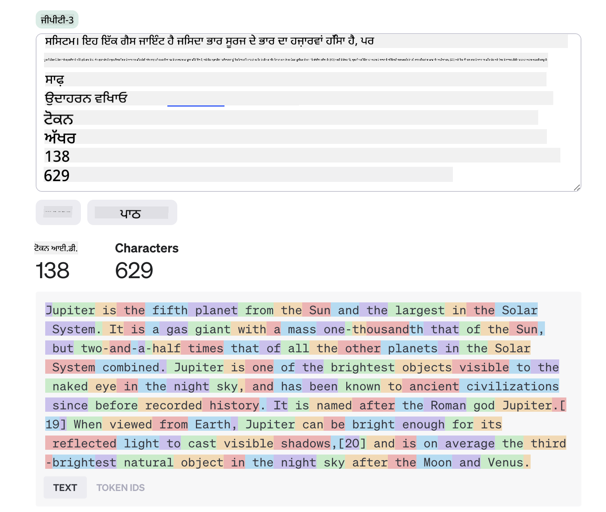
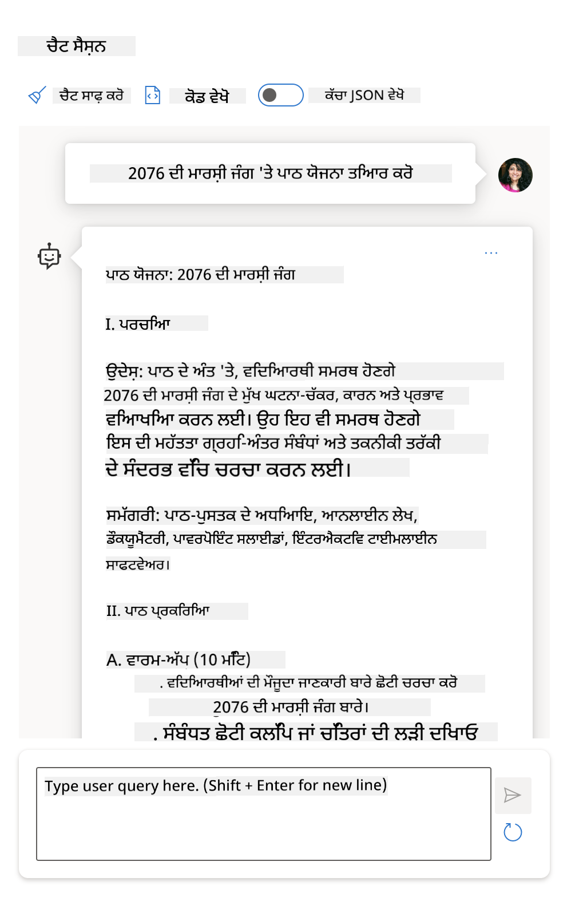

<!--
CO_OP_TRANSLATOR_METADATA:
{
  "original_hash": "8b3cb38518cf4fe7714d2f5e74dfa3eb",
  "translation_date": "2025-10-03T09:06:35+00:00",
  "source_file": "04-prompt-engineering-fundamentals/README.md",
  "language_code": "pa"
}
-->
# ਪ੍ਰੋਮਪਟ ਇੰਜੀਨੀਅਰਿੰਗ ਮੂਲਭੂਤ

[](https://aka.ms/gen-ai-lesson4-gh?WT.mc_id=academic-105485-koreyst)

## ਪਰਿਚਯ
ਇਸ ਮੋਡਿਊਲ ਵਿੱਚ ਜਨਰੇਟਿਵ AI ਮਾਡਲਾਂ ਵਿੱਚ ਪ੍ਰਭਾਵਸ਼ਾਲੀ ਪ੍ਰੋਮਪਟ ਬਣਾਉਣ ਲਈ ਜ਼ਰੂਰੀ ਧਾਰਨਾਵਾਂ ਅਤੇ ਤਕਨੀਕਾਂ ਨੂੰ ਕਵਰ ਕੀਤਾ ਗਿਆ ਹੈ। ਜਿਵੇਂ ਤੁਸੀਂ LLM ਨੂੰ ਆਪਣਾ ਪ੍ਰੋਮਪਟ ਲਿਖਦੇ ਹੋ, ਇਹ ਵੀ ਮਹੱਤਵਪੂਰਨ ਹੈ। ਧਿਆਨ ਨਾਲ ਤਿਆਰ ਕੀਤਾ ਪ੍ਰੋਮਪਟ ਉੱਚ ਗੁਣਵੱਤਾ ਵਾਲਾ ਜਵਾਬ ਪ੍ਰਾਪਤ ਕਰਨ ਵਿੱਚ ਮਦਦ ਕਰ ਸਕਦਾ ਹੈ। ਪਰ _ਪ੍ਰੋਮਪਟ_ ਅਤੇ _ਪ੍ਰੋਮਪਟ ਇੰਜੀਨੀਅਰਿੰਗ_ ਵਰਗੇ ਸ਼ਬਦਾਂ ਦਾ ਅਰਥ ਕੀ ਹੈ? ਅਤੇ ਮੈਂ LLM ਨੂੰ ਭੇਜੇ ਜਾਣ ਵਾਲੇ ਪ੍ਰੋਮਪਟ _ਇਨਪੁਟ_ ਨੂੰ ਕਿਵੇਂ ਸੁਧਾਰ ਸਕਦਾ ਹਾਂ? ਇਹ ਸਵਾਲ ਹਨ ਜਿਨ੍ਹਾਂ ਦੇ ਜਵਾਬ ਅਸੀਂ ਇਸ ਅਧਿਆਇ ਅਤੇ ਅਗਲੇ ਵਿੱਚ ਲੱਭਣ ਦੀ ਕੋਸ਼ਿਸ਼ ਕਰਾਂਗੇ।

_ਜਨਰੇਟਿਵ AI_ ਨਵੇਂ ਸਮੱਗਰੀ (ਜਿਵੇਂ ਕਿ ਟੈਕਸਟ, ਚਿੱਤਰ, ਆਡੀਓ, ਕੋਡ ਆਦਿ) ਬਣਾਉਣ ਦੇ ਯੋਗ ਹੈ ਜੋ ਉਪਭੋਗਤਾ ਦੀਆਂ ਬੇਨਤੀਆਂ ਦੇ ਜਵਾਬ ਵਿੱਚ ਹੁੰਦੀ ਹੈ। ਇਹ _ਵੱਡੇ ਭਾਸ਼ਾ ਮਾਡਲਾਂ_ ਵਰਗੇ OpenAI ਦੇ GPT ("Generative Pre-trained Transformer") ਸੀਰੀਜ਼ ਦੀ ਵਰਤੋਂ ਕਰਕੇ ਪ੍ਰਾਪਤ ਕੀਤਾ ਜਾਂਦਾ ਹੈ ਜੋ ਕੁਦਰਤੀ ਭਾਸ਼ਾ ਅਤੇ ਕੋਡ ਦੀ ਵਰਤੋਂ ਲਈ ਤਿਆਰ ਕੀਤੇ ਗਏ ਹਨ।

ਉਪਭੋਗਤਾ ਹੁਣ ਚੈਟ ਵਰਗੇ ਜਾਣ-ਪਛਾਣ ਵਾਲੇ ਪੈਰਾਈਡਮਾਂ ਦੀ ਵਰਤੋਂ ਕਰਕੇ ਇਨ੍ਹਾਂ ਮਾਡਲਾਂ ਨਾਲ ਸੰਚਾਰ ਕਰ ਸਕਦੇ ਹਨ, ਬਿਨਾਂ ਕਿਸੇ ਤਕਨੀਕੀ ਮਾਹਰਤਾ ਜਾਂ ਤਰਬੀਅਤ ਦੀ ਲੋੜ। ਮਾਡਲ _ਪ੍ਰੋਮਪਟ-ਅਧਾਰਿਤ_ ਹਨ - ਉਪਭੋਗਤਾ ਟੈਕਸਟ ਇਨਪੁਟ (ਪ੍ਰੋਮਪਟ) ਭੇਜਦੇ ਹਨ ਅਤੇ AI ਜਵਾਬ (ਪੂਰਨਤਾ) ਪ੍ਰਾਪਤ ਕਰਦੇ ਹਨ। ਉਹ "AI ਨਾਲ ਗੱਲਬਾਤ" ਕਰ ਸਕਦੇ ਹਨ, ਬਹੁ-ਟਰਨ ਗੱਲਬਾਤਾਂ ਵਿੱਚ, ਆਪਣੇ ਪ੍ਰੋਮਪਟ ਨੂੰ ਸੁਧਾਰਦੇ ਹੋਏ ਜਦੋਂ ਤੱਕ ਜਵਾਬ ਉਨ੍ਹਾਂ ਦੀਆਂ ਉਮੀਦਾਂ ਨਾਲ ਮੇਲ ਨਹੀਂ ਖਾਂਦਾ।

"ਪ੍ਰੋਮਪਟ" ਹੁਣ ਜਨਰੇਟਿਵ AI ਐਪਸ ਲਈ ਮੁੱਖ _ਪ੍ਰੋਗਰਾਮਿੰਗ ਇੰਟਰਫੇਸ_ ਬਣ ਜਾਂਦੇ ਹਨ, ਮਾਡਲਾਂ ਨੂੰ ਕੀ ਕਰਨਾ ਹੈ ਦੱਸਦੇ ਹਨ ਅਤੇ ਵਾਪਸ ਆਉਣ ਵਾਲੇ ਜਵਾਬਾਂ ਦੀ ਗੁਣਵੱਤਾ ਨੂੰ ਪ੍ਰਭਾਵਿਤ ਕਰਦੇ ਹਨ। "ਪ੍ਰੋਮਪਟ ਇੰਜੀਨੀਅਰਿੰਗ" ਇੱਕ ਤੇਜ਼ੀ ਨਾਲ ਵਧ ਰਹੇ ਅਧਿਐਨ ਦਾ ਖੇਤਰ ਹੈ ਜੋ ਸਥਿਰ ਅਤੇ ਗੁਣਵੱਤਾ ਵਾਲੇ ਜਵਾਬਾਂ ਨੂੰ ਵੱਡੇ ਪੱਧਰ 'ਤੇ ਪ੍ਰਦਾਨ ਕਰਨ ਲਈ ਪ੍ਰੋਮਪਟਾਂ ਦੇ _ਡਿਜ਼ਾਈਨ ਅਤੇ ਅਪਟਾਈਮਾਈਜ਼ੇਸ਼ਨ_ 'ਤੇ ਧਿਆਨ ਕੇਂਦਰਿਤ ਕਰਦਾ ਹੈ।

## ਸਿੱਖਣ ਦੇ ਲਕਸ਼

ਇਸ ਪਾਠ ਵਿੱਚ, ਅਸੀਂ ਸਿੱਖਾਂਗੇ ਕਿ ਪ੍ਰੋਮਪਟ ਇੰਜੀਨੀਅਰਿੰਗ ਕੀ ਹੈ, ਇਹ ਕਿਉਂ ਮਹੱਤਵਪੂਰਨ ਹੈ, ਅਤੇ ਅਸੀਂ ਦਿੱਤੇ ਗਏ ਮਾਡਲ ਅਤੇ ਐਪਲੀਕੇਸ਼ਨ ਉਦੇਸ਼ ਲਈ ਕਿਵੇਂ ਪ੍ਰਭਾਵਸ਼ਾਲੀ ਪ੍ਰੋਮਪਟ ਤਿਆਰ ਕਰ ਸਕਦੇ ਹਾਂ। ਅਸੀਂ ਪ੍ਰੋਮਪਟ ਇੰਜੀਨੀਅਰਿੰਗ ਲਈ ਮੁੱਖ ਧਾਰਨਾਵਾਂ ਅਤੇ ਸ੍ਰੇਸ਼ਠ ਅਭਿਆਸਾਂ ਨੂੰ ਸਮਝਾਂਗੇ - ਅਤੇ ਇੱਕ ਇੰਟਰਐਕਟਿਵ Jupyter Notebooks "sandbox" ਵਾਤਾਵਰਣ ਬਾਰੇ ਸਿੱਖਾਂਗੇ ਜਿੱਥੇ ਅਸੀਂ ਇਹ ਧਾਰਨਾਵਾਂ ਅਸਲ ਉਦਾਹਰਣਾਂ 'ਤੇ ਲਾਗੂ ਕਰ ਸਕਦੇ ਹਾਂ।

ਇਸ ਪਾਠ ਦੇ ਅੰਤ ਤੱਕ ਅਸੀਂ ਯੋਗ ਹੋਵਾਂਗੇ:

1. ਪ੍ਰੋਮਪਟ ਇੰਜੀਨੀਅਰਿੰਗ ਕੀ ਹੈ ਅਤੇ ਇਹ ਕਿਉਂ ਮਹੱਤਵਪੂਰਨ ਹੈ, ਇਹ ਸਮਝਾਉਣਾ।
2. ਪ੍ਰੋਮਪਟ ਦੇ ਅੰਗਾਂ ਦਾ ਵਰਣਨ ਕਰਨਾ ਅਤੇ ਇਹ ਕਿਵੇਂ ਵਰਤੇ ਜਾਂਦੇ ਹਨ।
3. ਪ੍ਰੋਮਪਟ ਇੰਜੀਨੀਅਰਿੰਗ ਲਈ ਸ੍ਰੇਸ਼ਠ ਅਭਿਆਸ ਅਤੇ ਤਕਨੀਕਾਂ ਸਿੱਖਣਾ।
4. ਸਿੱਖੀਆਂ ਤਕਨੀਕਾਂ ਨੂੰ ਅਸਲ ਉਦਾਹਰਣਾਂ 'ਤੇ ਲਾਗੂ ਕਰਨਾ, OpenAI ਐਂਡਪੌਇੰਟ ਦੀ ਵਰਤੋਂ ਕਰਕੇ।

## ਮੁੱਖ ਸ਼ਬਦ

ਪ੍ਰੋਮਪਟ ਇੰਜੀਨੀਅਰਿੰਗ: AI ਮਾਡਲਾਂ ਨੂੰ ਇੱਛਿਤ ਨਤੀਜੇ ਪੈਦਾ ਕਰਨ ਵੱਲ ਮਾਰਗਦਰਸ਼ਨ ਦੇਣ ਲਈ ਇਨਪੁਟਾਂ ਨੂੰ ਡਿਜ਼ਾਈਨ ਅਤੇ ਸੁਧਾਰਨ ਦੀ ਪ੍ਰਕਿਰਿਆ।
ਟੋਕਨਾਈਜ਼ੇਸ਼ਨ: ਟੈਕਸਟ ਨੂੰ ਛੋਟੇ ਯੂਨਿਟਾਂ, ਜਿਨ੍ਹਾਂ ਨੂੰ ਟੋਕਨ ਕਿਹਾ ਜਾਂਦਾ ਹੈ, ਵਿੱਚ ਬਦਲਣ ਦੀ ਪ੍ਰਕਿਰਿਆ ਜੋ ਮਾਡਲ ਸਮਝ ਅਤੇ ਪ੍ਰਕਿਰਿਆ ਕਰ ਸਕਦਾ ਹੈ।
ਇੰਸਟ੍ਰਕਸ਼ਨ-ਟਿਊਨਡ LLMs: ਵੱਡੇ ਭਾਸ਼ਾ ਮਾਡਲ (LLMs) ਜੋ ਉਨ੍ਹਾਂ ਦੇ ਜਵਾਬਾਂ ਦੀ ਸਹੀਤਾ ਅਤੇ ਸਬੰਧਿਤਤਾ ਨੂੰ ਸੁਧਾਰਨ ਲਈ ਵਿਸ਼ੇਸ਼ ਹਦਾਇਤਾਂ ਨਾਲ ਸੁਧਾਰੇ ਗਏ ਹਨ।

## ਸਿੱਖਣ ਦਾ ਸੈਂਡਬਾਕਸ

ਪ੍ਰੋਮਪਟ ਇੰਜੀਨੀਅਰਿੰਗ ਇਸ ਸਮੇਂ ਵਿਗਿਆਨ ਨਾਲੋਂ ਕਲਾ ਵਧੇਰੇ ਹੈ। ਇਸ ਲਈ ਇਸ ਲਈ ਸਾਡੀ ਸੂਝ ਨੂੰ ਸੁਧਾਰਨ ਦਾ ਸਭ ਤੋਂ ਵਧੀਆ ਤਰੀਕਾ ਹੈ _ਵਧੇਰੇ ਅਭਿਆਸ ਕਰਨਾ_ ਅਤੇ ਅਨੁਸ਼ੀਲਨ-ਅਤੇ-ਗਲਤੀ ਪਹੁੰਚ ਨੂੰ ਅਪਣਾਉਣਾ ਜੋ ਐਪਲੀਕੇਸ਼ਨ ਡੋਮੇਨ ਮਾਹਰਤਾ ਨੂੰ ਸਿਫਾਰਸ਼ ਕੀਤੀਆਂ ਤਕਨੀਕਾਂ ਅਤੇ ਮਾਡਲ-ਵਿਸ਼ੇਸ਼ ਅਪਟਾਈਮਾਈਜ਼ੇਸ਼ਨ ਨਾਲ ਜੋੜਦਾ ਹੈ।

ਇਸ ਪਾਠ ਦੇ ਨਾਲ ਆਉਣ ਵਾਲਾ Jupyter Notebook ਇੱਕ _sandbox_ ਵਾਤਾਵਰਣ ਪ੍ਰਦਾਨ ਕਰਦਾ ਹੈ ਜਿੱਥੇ ਤੁਸੀਂ ਜੋ ਸਿੱਖਦੇ ਹੋ ਉਸ ਨੂੰ ਅਭਿਆਸ ਕਰ ਸਕਦੇ ਹੋ - ਜਿਵੇਂ ਤੁਸੀਂ ਜਾਂ ਕੋਡ ਚੈਲੈਂਜ ਦੇ ਅੰਤ ਵਿੱਚ। ਅਭਿਆਸਾਂ ਨੂੰ ਅੰਜਾਮ ਦੇਣ ਲਈ, ਤੁਹਾਨੂੰ ਲੋੜ ਹੋਵੇਗੀ:

1. **ਇੱਕ Azure OpenAI API ਕੁੰਜੀ** - ਇੱਕ ਤਿਆਰ LLM ਲਈ ਸੇਵਾ ਐਂਡਪੌਇੰਟ।
2. **ਇੱਕ Python Runtime** - ਜਿਸ ਵਿੱਚ Notebook ਚਲਾਇਆ ਜਾ ਸਕੇ।
3. **ਸਥਾਨਕ ਵਾਤਾਵਰਣ ਚਰ** - _[SETUP](./../00-course-setup/02-setup-local.md?WT.mc_id=academic-105485-koreyst) ਕਦਮਾਂ ਨੂੰ ਹੁਣ ਪੂਰਾ ਕਰੋ ਤਿਆਰ ਹੋਣ ਲਈ_।

Notebook ਵਿੱਚ _ਸ਼ੁਰੂਆਤੀ_ ਅਭਿਆਸ ਹਨ - ਪਰ ਤੁਹਾਨੂੰ ਆਪਣੇ _Markdown_ (ਵਰਣਨ) ਅਤੇ _Code_ (ਪ੍ਰੋਮਪਟ ਬੇਨਤੀਆਂ) ਭਾਗਾਂ ਨੂੰ ਸ਼ਾਮਲ ਕਰਨ ਲਈ ਪ੍ਰੇਰਿਤ ਕੀਤਾ ਜਾਂਦਾ ਹੈ ਤਾਂ ਕਿ ਹੋਰ ਉਦਾਹਰਣਾਂ ਜਾਂ ਵਿਚਾਰਾਂ ਦੀ ਕੋਸ਼ਿਸ਼ ਕੀਤੀ ਜਾ ਸਕੇ - ਅਤੇ ਪ੍ਰੋਮਪਟ ਡਿਜ਼ਾਈਨ ਲਈ ਆਪਣੀ ਸੂਝ ਬਣਾਈ ਜਾ ਸਕੇ।

## ਚਿੱਤਰਮਈ ਗਾਈਡ

ਕੀ ਤੁਸੀਂ ਇਸ ਪਾਠ ਵਿੱਚ ਕਵਰ ਕੀਤੇ ਗਏ ਮੁੱਖ ਵਿਸ਼ਿਆਂ ਦੀ ਵੱਡੀ ਤਸਵੀਰ ਪ੍ਰਾਪਤ ਕਰਨਾ ਚਾਹੁੰਦੇ ਹੋ? ਇਸ ਚਿੱਤਰਮਈ ਗਾਈਡ ਨੂੰ ਦੇਖੋ, ਜੋ ਤੁਹਾਨੂੰ ਮੁੱਖ ਵਿਸ਼ਿਆਂ ਦਾ ਅਹਿਸਾਸ ਦਿੰਦੀ ਹੈ ਅਤੇ ਪ੍ਰਤੀਕਰਮਾਂ ਲਈ ਕੁਝ ਮੁੱਖ ਸਿੱਖਣ ਵਾਲੀਆਂ ਗੱਲਾਂ। ਪਾਠ ਰੋਡਮੈਪ ਤੁਹਾਨੂੰ ਮੁੱਖ ਧਾਰਨਾਵਾਂ ਅਤੇ ਚੁਣੌਤੀਆਂ ਨੂੰ ਸਮਝਣ ਤੋਂ ਲੈ ਕੇ ਉਨ੍ਹਾਂ ਨੂੰ ਸਬੰਧਿਤ ਪ੍ਰੋਮਪਟ ਇੰਜੀਨੀਅਰਿੰਗ ਤਕਨੀਕਾਂ ਅਤੇ ਸ੍ਰੇਸ਼ਠ ਅਭਿਆਸਾਂ ਨਾਲ ਸੰਬੋਧਨ ਕਰਨ ਤੱਕ ਲੈ ਜਾਂਦੀ ਹੈ। ਧਿਆਨ ਦਿਓ ਕਿ ਇਸ ਗਾਈਡ ਵਿੱਚ "Advanced Techniques" ਭਾਗ ਇਸ ਪਾਠਕ੍ਰਮ ਦੇ _ਅਗਲੇ_ ਅਧਿਆਇ ਵਿੱਚ ਕਵਰ ਕੀਤੇ ਸਮੱਗਰੀ ਨੂੰ ਦਰਸਾਉਂਦਾ ਹੈ।


## ਸਾਡਾ ਸਟਾਰਟਅਪ

ਹੁਣ, ਆਓ ਗੱਲ ਕਰੀਏ ਕਿ _ਇਹ ਵਿਸ਼ਾ_ ਸਾਡੇ ਸਟਾਰਟਅਪ ਮਿਸ਼ਨ ਨਾਲ [AI ਨਵੀਨਤਾ ਨੂੰ ਸਿੱਖਿਆ ਵਿੱਚ ਲਿਆਉਣ](https://educationblog.microsoft.com/2023/06/collaborating-to-bring-ai-innovation-to-education?WT.mc_id=academic-105485-koreyst) ਨਾਲ ਕਿਵੇਂ ਸਬੰਧਿਤ ਹੈ। ਅਸੀਂ _ਪ੍ਰਸਨਸਨਾਤਮਕ ਸਿੱਖਣ_ ਦੇ AI-ਚਾਲਤ ਐਪਲੀਕੇਸ਼ਨ ਬਣਾਉਣ ਚਾਹੁੰਦੇ ਹਾਂ - ਤਾਂ ਆਓ ਸੋਚੀਏ ਕਿ ਸਾਡੇ ਐਪਲੀਕੇਸ਼ਨ ਦੇ ਵੱਖ-ਵੱਖ ਉਪਭੋਗਤਾ ਕਿਵੇਂ "ਪ੍ਰੋਮਪਟ" ਡਿਜ਼ਾਈਨ ਕਰ ਸਕਦੇ ਹਨ:

- **ਪ੍ਰਸ਼ਾਸਕ** AI ਨੂੰ _ਕਰਿਕੁਲਮ ਡੇਟਾ ਦਾ ਵਿਸ਼ਲੇਸ਼ਣ ਕਰਨ ਲਈ ਕਹਿ ਸਕਦੇ ਹਨ ਤਾਂ ਕਿ ਕਵਰੇਜ ਵਿੱਚ ਖਾਮੀਆਂ ਦੀ ਪਛਾਣ ਕੀਤੀ ਜਾ ਸਕੇ।_ AI ਨਤੀਜਿਆਂ ਨੂੰ ਸੰਖੇਪ ਕਰ ਸਕਦਾ ਹੈ ਜਾਂ ਕੋਡ ਨਾਲ ਉਨ੍ਹਾਂ ਨੂੰ ਵਿਜ਼ੁਅਲਾਈਜ਼ ਕਰ ਸਕਦਾ ਹੈ।
- **ਸਿੱਖਿਆਕਾਰ** AI ਨੂੰ _ਲਕਸ਼ਿਤ ਦਰਸ਼ਕ ਅਤੇ ਵਿਸ਼ੇ ਲਈ ਪਾਠ ਯੋਜਨਾ ਬਣਾਉਣ ਲਈ ਕਹਿ ਸਕਦੇ ਹਨ।_ AI ਨਿਰਧਾਰਿਤ ਫਾਰਮੈਟ ਵਿੱਚ ਵਿਅਕਤੀਗਤ ਯੋਜਨਾ ਬਣਾਉਣ ਵਿੱਚ ਸਹਾਇਕ ਹੋ ਸਕਦਾ ਹੈ।
- **ਵਿਦਿਆਰਥੀ** AI ਨੂੰ _ਕਠਿਨ ਵਿਸ਼ੇ ਵਿੱਚ ਉਨ੍ਹਾਂ ਨੂੰ ਟਿਊਟਰ ਕਰਨ ਲਈ ਕਹਿ ਸਕਦੇ ਹਨ।_ AI ਹੁਣ ਵਿਦਿਆਰਥੀਆਂ ਨੂੰ ਉਨ੍ਹਾਂ ਦੇ ਪੱਧਰ ਦੇ ਅਨੁਕੂਲ ਪਾਠਾਂ, ਸੰਕੇਤਾਂ ਅਤੇ ਉਦਾਹਰਣਾਂ ਨਾਲ ਮਾਰਗਦਰਸ਼ਨ ਦੇ ਸਕਦਾ ਹੈ।

ਇਹ ਸਿਰਫ ਸ਼ੁਰੂਆਤ ਹੈ। [ਸਿੱਖਿਆ ਲਈ ਪ੍ਰੋਮਪਟ](https://github.com/microsoft/prompts-for-edu/tree/main?WT.mc_id=academic-105485-koreyst) - ਸਿੱਖਿਆ ਮਾਹਰਾਂ ਦੁਆਰਾ ਕਿਉਰੇਟ ਕੀਤੀ ਗਈ ਇੱਕ ਖੁੱਲ੍ਹੇ-ਸਰੋਤ ਪ੍ਰੋਮਪਟ ਲਾਇਬ੍ਰੇਰੀ - ਨੂੰ ਦੇਖੋ ਤਾਂ ਕਿ ਸੰਭਾਵਨਾਵਾਂ ਦਾ ਵਿਆਪਕ ਅਹਿਸਾਸ ਪ੍ਰਾਪਤ ਕੀਤਾ ਜਾ ਸਕੇ! _Sandbox ਵਿੱਚ ਜਾਂ OpenAI Playground ਦੀ ਵਰਤੋਂ ਕਰਕੇ ਕੁਝ ਪ੍ਰੋਮਪਟ ਚਲਾਉਣ ਦੀ ਕੋਸ਼ਿਸ਼ ਕਰੋ ਅਤੇ ਦੇਖੋ ਕਿ ਕੀ ਹੁੰਦਾ ਹੈ!_

<!--
LESSON TEMPLATE:
This unit should cover core concept #1.
Reinforce the concept with examples and references.

CONCEPT #1:
Prompt Engineering.
Define it and explain why it is needed.
-->

## ਪ੍ਰੋਮਪਟ ਇੰਜੀਨੀਅਰਿੰਗ ਕੀ ਹੈ?

ਅਸੀਂ ਇਸ ਪਾਠ ਦੀ ਸ਼ੁਰੂਆਤ **ਪ੍ਰੋਮਪਟ ਇੰਜੀਨੀਅਰਿੰਗ** ਨੂੰ _ਟੈਕਸਟ ਇਨਪੁਟ (ਪ੍ਰੋਮਪਟ) ਨੂੰ ਡਿਜ਼ਾਈਨ ਅਤੇ ਅਪਟਾਈਮਾਈਜ਼ ਕਰਨ ਦੀ ਪ੍ਰਕਿਰਿਆ_ ਵਜੋਂ ਪਰਿਭਾਸ਼ਿਤ ਕਰਕੇ ਕੀਤੀ ਸੀ ਤਾਂ ਕਿ ਦਿੱਤੇ ਗਏ ਐਪਲੀਕੇਸ਼ਨ ਉਦੇਸ਼ ਅਤੇ ਮਾਡਲ ਲਈ ਸਥਿਰ ਅਤੇ ਗੁਣਵੱਤਾ ਵਾਲੇ ਜਵਾਬ (ਪੂਰਨਤਾ) ਪ੍ਰਦਾਨ ਕੀਤੇ ਜਾ ਸਕਣ। ਅਸੀਂ ਇਸ ਨੂੰ 2-ਕਦਮ ਪ੍ਰਕਿਰਿਆ ਵਜੋਂ ਸੋਚ ਸਕਦੇ ਹਾਂ:

- _ਡਿਜ਼ਾਈਨ_ ਦਿੱਤੇ ਗਏ ਮਾਡਲ ਅਤੇ ਉਦੇਸ਼ ਲਈ ਸ਼ੁਰੂਆਤੀ ਪ੍ਰੋਮਪਟ
- _ਸੁਧਾਰ_ ਪ੍ਰੋਮਪਟ ਨੂੰ ਵਾਰ-ਵਾਰ ਜਵਾਬ ਦੀ ਗੁਣਵੱਤਾ ਨੂੰ ਸੁਧਾਰਨ ਲਈ

ਇਹ ਲਾਜ਼ਮੀ ਤੌਰ 'ਤੇ ਇੱਕ ਅਨੁਸ਼ੀਲਨ-ਅਤੇ-ਗਲਤੀ ਪ੍ਰਕਿਰਿਆ ਹੈ ਜੋ ਵਧੀਆ ਨਤੀਜੇ ਪ੍ਰਾਪਤ ਕਰਨ ਲਈ ਉਪਭੋਗਤਾ ਦੀ ਸੂਝ ਅਤੇ ਯਤਨ ਦੀ ਲੋੜ ਹੁੰਦੀ ਹੈ। ਤਾਂ ਇਹ ਕਿਉਂ ਮਹੱਤਵਪੂਰਨ ਹੈ? ਇਸ ਸਵਾਲ ਦਾ ਜਵਾਬ ਦੇਣ ਲਈ, ਸਾਨੂੰ ਪਹਿਲਾਂ ਤਿੰਨ ਧਾਰਨਾਵਾਂ ਨੂੰ ਸਮਝਣ ਦੀ ਲੋੜ ਹੈ:

- _ਟੋਕਨਾਈਜ਼ੇਸ਼ਨ_ = ਮਾਡਲ ਪ੍ਰੋਮਪਟ ਨੂੰ ਕਿਵੇਂ "ਵੇਖਦਾ" ਹੈ
- _ਬੇਸ LLMs_ = ਮੂਲ ਮਾਡਲ ਪ੍ਰੋਮਪਟ ਨੂੰ ਕਿਵੇਂ "ਪ੍ਰਕਿਰਿਆ" ਕਰਦਾ ਹੈ
- _ਇੰਸਟ੍ਰਕਸ਼ਨ-ਟਿਊਨਡ LLMs_ = ਮਾਡਲ ਹੁਣ "ਕੰਮਾਂ" ਨੂੰ ਕਿਵੇਂ ਵੇਖ ਸਕਦਾ ਹੈ

### ਟੋਕਨਾਈਜ਼ੇਸ਼ਨ

ਇੱਕ LLM ਪ੍ਰੋਮਪਟ ਨੂੰ _ਟੋਕਨ ਦੀ ਲੜੀ_ ਵਜੋਂ ਵੇਖਦਾ ਹੈ ਜਿੱਥੇ ਵੱਖ-ਵੱਖ ਮਾਡਲ (ਜਾਂ ਮਾਡਲ ਦੇ ਵਰਜਨ) ਇੱਕੋ ਪ੍ਰੋਮਪਟ ਨੂੰ ਵੱਖ-ਵੱਖ ਤਰੀਕਿਆਂ ਨਾਲ ਟੋਕਨਾਈਜ਼ ਕਰ ਸਕਦੇ ਹਨ। ਕਿਉਂਕਿ LLMs ਟੋਕਨ 'ਤੇ (ਕੱਚੇ ਟੈਕਸਟ 'ਤੇ ਨਹੀਂ) ਤਿਆਰ ਕੀਤੇ ਜਾਂਦੇ ਹਨ, ਪ੍ਰੋਮਪਟ ਟੋਕਨਾਈਜ਼ ਹੋਣ ਦਾ ਤਰੀਕਾ ਬਣਾਏ ਗਏ ਜਵਾਬ ਦੀ ਗੁਣਵੱਤਾ 'ਤੇ ਸਿੱਧਾ ਪ੍ਰਭਾਵ ਪਾਉਂਦਾ ਹੈ।

ਟੋਕਨਾਈਜ਼ੇਸ਼ਨ ਕਿਵੇਂ ਕੰਮ ਕਰਦਾ ਹੈ ਇਸ ਲਈ ਸੂਝ ਪ੍ਰਾਪਤ ਕਰਨ ਲਈ, [OpenAI Tokenizer](https://platform.openai.com/tokenizer?WT.mc_id=academic-105485-koreyst) ਵਰਗੇ ਸੰਦਾਂ ਦੀ ਕੋਸ਼ਿਸ਼ ਕਰੋ। ਆਪਣੇ ਪ੍ਰੋਮਪਟ ਨੂੰ ਕਾਪੀ ਕਰੋ - ਅਤੇ ਦੇਖੋ ਕਿ ਇਹ ਟੋਕਨ ਵਿੱਚ ਕਿਵੇਂ ਬਦਲਿਆ ਜਾਂਦਾ ਹੈ, ਧਿਆਨ ਦਿਓ ਕਿ ਵਾਈਟਸਪੇਸ ਅੱਖਰ ਅਤੇ ਪੰਕਟੂਏਸ਼ਨ ਮਾਰਕਾਂ ਨੂੰ ਕਿਵੇਂ ਸੰਭਾਲਿਆ ਜਾਂਦਾ ਹੈ। ਧਿਆਨ ਦਿਓ ਕਿ ਇਹ ਉਦਾਹਰਣ ਇੱਕ ਪੁਰਾਣੇ LLM (GPT-3) ਨੂੰ ਦਰਸਾਉਂਦਾ ਹੈ - ਇਸ ਲਈ ਇਸ ਨੂੰ ਇੱਕ ਨਵੇਂ ਮਾਡਲ ਨਾਲ ਅਜ਼ਮਾਉਣ ਨਾਲ ਵੱਖ-ਵੱਖ ਨਤੀਜੇ ਪ੍ਰਾਪਤ ਹੋ ਸਕਦੇ ਹਨ।



### ਧਾਰਨਾ: ਫਾਊਂਡੇਸ਼ਨ ਮਾਡਲ

ਜਦੋਂ ਇੱਕ ਪ੍ਰੋਮਪਟ ਟੋਕਨਾਈਜ਼ ਕੀਤਾ ਜਾਂਦਾ ਹੈ, ["ਬੇਸ LLM"](https://blog.gopenai.com/an-introduction-to-base-and-instruction-tuned-large-language-models-8de102c785a6?WT.mc_id=academic-105485-koreyst) (ਜਾਂ ਫਾਊਂਡੇਸ਼ਨ ਮਾਡਲ) ਦਾ ਮੁੱਖ ਕੰਮ ਉਸ ਲੜੀ ਵਿੱਚ ਟੋਕਨ ਦੀ ਪੇਸ਼ਗੂਈ ਕਰਨਾ ਹੁੰਦਾ ਹੈ। ਕਿਉਂਕਿ LLMs ਵੱਡੇ ਟੈਕਸਟ ਡੇਟਾਸੈਟਾਂ 'ਤੇ ਤਿਆਰ ਕੀਤੇ ਜਾਂਦੇ ਹਨ, ਉਨ੍ਹਾਂ ਨੂੰ ਟੋਕਨਾਂ ਦੇ ਵਿਚਕਾਰ ਸਾਂਖਿਕਿਕ ਸੰਬੰਧਾਂ ਦਾ ਚੰਗਾ ਅਹਿਸਾਸ ਹੁੰਦਾ ਹੈ ਅਤੇ ਉਹ ਉਸ ਪੇਸ਼ਗੂਈ ਨੂੰ ਕੁਝ ਭਰੋਸੇ ਨਾਲ ਕਰ ਸਕਦੇ ਹਨ। ਧਿਆਨ ਦਿਓ ਕਿ ਉਹ ਪ੍ਰੋਮਪਟ ਜਾਂ ਟੋਕਨ ਵਿੱਚ ਸ਼ਬਦਾਂ ਦੇ _ਅਰਥ_ ਨੂੰ ਨਹੀਂ ਸਮਝਦੇ; ਉਹ ਸਿਰਫ ਇੱਕ ਪੈਟਰਨ ਵੇਖਦੇ ਹਨ ਜਿਸ ਨੂੰ ਉਹ ਆਪਣੀ ਅਗਲੀ ਪੇਸ਼ਗੂਈ ਨਾਲ "ਪੂਰਾ" ਕਰ ਸਕਦੇ ਹਨ। ਉਹ ਲੜੀ ਦੀ ਪੇਸ਼ਗੂਈ ਕਰਨਾ ਜਾਰੀ ਰੱਖ ਸਕਦੇ ਹਨ ਜਦੋਂ ਤੱਕ ਉਪਭੋਗਤਾ ਦੇ ਦਖਲ ਜਾਂ ਕੁਝ ਪੂਰਵ-ਸਥਾਪਿਤ ਸ਼ਰਤਾਂ ਦੁਆਰਾ ਰੋਕਿਆ ਨਹੀਂ ਜਾਂਦਾ।

ਪ੍ਰੋਮਪਟ-ਅਧਾਰਿਤ ਪੂਰਨਤਾ ਕਿਵ
ਇੱਕ ਵੈੱਬ ਖੋਜ ਨੇ ਦਿਖਾਇਆ ਕਿ ਮੰਗਲ ਗ੍ਰਹਿ ਦੇ ਯੁੱਧਾਂ 'ਤੇ ਕਈ ਕਲਪਨਾਤਮਕ ਕਹਾਣੀਆਂ (ਜਿਵੇਂ ਕਿ ਟੈਲੀਵਿਜ਼ਨ ਸੀਰੀਜ਼ ਜਾਂ ਕਿਤਾਬਾਂ) ਹਨ - ਪਰ 2076 ਵਿੱਚ ਕੋਈ ਨਹੀਂ। ਸਧਾਰਨ ਬੁੱਧੀ ਵੀ ਦੱਸਦੀ ਹੈ ਕਿ 2076 _ਭਵਿੱਖ_ ਵਿੱਚ ਹੈ ਅਤੇ ਇਸ ਲਈ ਇਸਨੂੰ ਕਿਸੇ ਅਸਲ ਘਟਨਾ ਨਾਲ ਨਹੀਂ ਜੋੜਿਆ ਜਾ ਸਕਦਾ।

ਤਾਂ ਕੀ ਹੁੰਦਾ ਹੈ ਜਦੋਂ ਅਸੀਂ ਇਹ ਪ੍ਰੋੰਪਟ ਵੱਖ-ਵੱਖ LLM ਪ੍ਰਦਾਤਾਵਾਂ ਨਾਲ ਚਲਾਉਂਦੇ ਹਾਂ?

> **ਜਵਾਬ 1**: OpenAI Playground (GPT-35)


> **ਜਵਾਬ 2**: Azure OpenAI Playground (GPT-35)



> **ਜਵਾਬ 3**: Hugging Face Chat Playground (LLama-2)


ਜਿਵੇਂ ਉਮੀਦ ਕੀਤੀ ਗਈ ਸੀ, ਹਰ ਮਾਡਲ (ਜਾਂ ਮਾਡਲ ਵਰਜਨ) stochastic ਵਿਵਹਾਰ ਅਤੇ ਮਾਡਲ ਸਮਰੱਥਾ ਵਿੱਚ ਵੱਖ-ਵੱਖਤਾ ਦੇ ਕਾਰਨ ਥੋੜ੍ਹੇ ਵੱਖਰੇ ਜਵਾਬ ਪੈਦਾ ਕਰਦਾ ਹੈ। ਉਦਾਹਰਣ ਲਈ, ਇੱਕ ਮਾਡਲ 8ਵੀਂ ਜਮਾਤ ਦੇ ਦਰਸ਼ਕਾਂ ਨੂੰ ਨਿਸ਼ਾਨਾ ਬਣਾਉਂਦਾ ਹੈ ਜਦੋਂ ਕਿ ਦੂਜਾ ਹਾਈ-ਸਕੂਲ ਦੇ ਵਿਦਿਆਰਥੀ ਨੂੰ ਧਿਆਨ ਵਿੱਚ ਰੱਖਦਾ ਹੈ। ਪਰ ਤਿੰਨੋ ਮਾਡਲਾਂ ਨੇ ਅਜਿਹੇ ਜਵਾਬ ਪੈਦਾ ਕੀਤੇ ਜੋ ਇੱਕ ਅਣਜਾਣ ਉਪਭੋਗਤਾ ਨੂੰ ਇਹ ਯਕੀਨ ਦਿਵਾ ਸਕਦੇ ਹਨ ਕਿ ਇਹ ਘਟਨਾ ਅਸਲ ਸੀ।

ਪ੍ਰੋੰਪਟ ਇੰਜੀਨੀਅਰਿੰਗ ਤਕਨੀਕਾਂ ਜਿਵੇਂ ਕਿ _metaprompting_ ਅਤੇ _temperature configuration_ ਮਾਡਲ ਦੇ ਗਲਤ ਜਵਾਬਾਂ ਨੂੰ ਕੁਝ ਹੱਦ ਤੱਕ ਘਟਾ ਸਕਦੇ ਹਨ। ਨਵੀਆਂ ਪ੍ਰੋੰਪਟ ਇੰਜੀਨੀਅਰਿੰਗ _architectures_ ਵੀ ਨਵੀਆਂ ਸਾਧਨਾਂ ਅਤੇ ਤਕਨੀਕਾਂ ਨੂੰ ਪ੍ਰੋੰਪਟ ਦੇ ਪ੍ਰਵਾਹ ਵਿੱਚ ਬਿਨਾਂ ਕਿਸੇ ਰੁਕਾਵਟ ਦੇ ਸ਼ਾਮਲ ਕਰਦੀਆਂ ਹਨ, ਤਾਂ ਜੋ ਇਨ੍ਹਾਂ ਪ੍ਰਭਾਵਾਂ ਨੂੰ ਘਟਾਇਆ ਜਾ ਸਕੇ।

## ਕੇਸ ਸਟਡੀ: GitHub Copilot

ਆਓ ਇਸ ਭਾਗ ਨੂੰ ਸਮਾਪਤ ਕਰੀਏ ਅਤੇ ਸਮਝੀਏ ਕਿ ਪ੍ਰੋੰਪਟ ਇੰਜੀਨੀਅਰਿੰਗ ਨੂੰ ਅਸਲ-ਜੀਵਨ ਹੱਲਾਂ ਵਿੱਚ ਕਿਵੇਂ ਵਰਤਿਆ ਜਾਂਦਾ ਹੈ। ਇਸ ਲਈ ਇੱਕ ਕੇਸ ਸਟਡੀ ਦੇਖਦੇ ਹਾਂ: [GitHub Copilot](https://github.com/features/copilot?WT.mc_id=academic-105485-koreyst)।

GitHub Copilot ਤੁਹਾਡਾ "AI Pair Programmer" ਹੈ - ਇਹ ਟੈਕਸਟ ਪ੍ਰੋੰਪਟ ਨੂੰ ਕੋਡ ਪੂਰਨਾਂ ਵਿੱਚ ਬਦਲਦਾ ਹੈ ਅਤੇ ਤੁਹਾਡੇ ਵਿਕਾਸ ਵਾਤਾਵਰਣ (ਜਿਵੇਂ ਕਿ Visual Studio Code) ਵਿੱਚ ਇੱਕ ਸਹੀ ਅਨੁਭਵ ਲਈ ਇੰਟੀਗਰੇਟ ਕੀਤਾ ਜਾਂਦਾ ਹੈ। ਹੇਠਾਂ ਦਿੱਤੇ ਬਲੌਗ ਦੀ ਲੜੀ ਵਿੱਚ ਦਰਸਾਇਆ ਗਿਆ ਹੈ ਕਿ ਸਭ ਤੋਂ ਪਹਿਲਾ ਵਰਜਨ OpenAI Codex ਮਾਡਲ 'ਤੇ ਆਧਾਰਿਤ ਸੀ - ਜਿਸ ਵਿੱਚ ਇੰਜੀਨੀਅਰਾਂ ਨੇ ਜਲਦੀ ਹੀ ਮਾਡਲ ਨੂੰ fine-tune ਕਰਨ ਦੀ ਜ਼ਰੂਰਤ ਅਤੇ ਕੋਡ ਗੁਣਵੱਤਾ ਨੂੰ ਸੁਧਾਰਨ ਲਈ ਵਧੀਆ ਪ੍ਰੋੰਪਟ ਇੰਜੀਨੀਅਰਿੰਗ ਤਕਨੀਕਾਂ ਵਿਕਸਿਤ ਕਰਨ ਦੀ ਲੋੜ ਨੂੰ ਸਮਝਿਆ। ਜੁਲਾਈ ਵਿੱਚ, ਉਨ੍ਹਾਂ ਨੇ [Codex ਤੋਂ ਅੱਗੇ ਵਧੇਰੇ ਸੁਧਾਰਿਤ AI ਮਾਡਲ](https://github.blog/2023-07-28-smarter-more-efficient-coding-github-copilot-goes-beyond-codex-with-improved-ai-model/?WT.mc_id=academic-105485-koreyst) ਦੀ ਸ਼ੁਰੂਆਤ ਕੀਤੀ ਜੋ ਹੋਰ ਤੇਜ਼ ਸੁਝਾਅ ਦਿੰਦਾ ਹੈ।

ਇਨ੍ਹਾਂ ਬਲੌਗ ਪੋਸਟਾਂ ਨੂੰ ਕ੍ਰਮਵਾਰ ਪੜ੍ਹੋ, ਤਾਂ ਜੋ ਉਨ੍ਹਾਂ ਦੇ ਸਿੱਖਣ ਦੇ ਯਾਤਰਾ ਨੂੰ ਸਮਝ ਸਕੋ।

- **ਮਈ 2023** | [GitHub Copilot ਤੁਹਾਡੇ ਕੋਡ ਨੂੰ ਸਮਝਣ ਵਿੱਚ ਹੋਰ ਬਿਹਤਰ ਹੋ ਰਿਹਾ ਹੈ](https://github.blog/2023-05-17-how-github-copilot-is-getting-better-at-understanding-your-code/?WT.mc_id=academic-105485-koreyst)
- **ਮਈ 2023** | [GitHub ਦੇ ਅੰਦਰ: GitHub Copilot ਦੇ ਪਿੱਛੇ LLMs ਨਾਲ ਕੰਮ ਕਰਨਾ](https://github.blog/2023-05-17-inside-github-working-with-the-llms-behind-github-copilot/?WT.mc_id=academic-105485-koreyst).
- **ਜੂਨ 2023** | [GitHub Copilot ਲਈ ਵਧੀਆ ਪ੍ਰੋੰਪਟ ਕਿਵੇਂ ਲਿਖਣੇ ਹਨ](https://github.blog/2023-06-20-how-to-write-better-prompts-for-github-copilot/?WT.mc_id=academic-105485-koreyst).
- **ਜੁਲਾਈ 2023** | [GitHub Copilot goes beyond Codex with improved AI model](https://github.blog/2023-07-28-smarter-more-efficient-coding-github-copilot-goes-beyond-codex-with-improved-ai-model/?WT.mc_id=academic-105485-koreyst)
- **ਜੁਲਾਈ 2023** | [ਡਿਵੈਲਪਰ ਲਈ ਪ੍ਰੋੰਪਟ ਇੰਜੀਨੀਅਰਿੰਗ ਅਤੇ LLMs ਦੀ ਗਾਈਡ](https://github.blog/2023-07-17-prompt-engineering-guide-generative-ai-llms/?WT.mc_id=academic-105485-koreyst)
- **ਸਤੰਬਰ 2023** | [ਇੱਕ ਐਨਟਰਪ੍ਰਾਈਜ਼ LLM ਐਪ ਬਣਾਉਣ ਲਈ: GitHub Copilot ਤੋਂ ਸਿੱਖਿਆ](https://github.blog/2023-09-06-how-to-build-an-enterprise-llm-application-lessons-from-github-copilot/?WT.mc_id=academic-105485-koreyst)

ਤੁਸੀਂ ਉਨ੍ਹਾਂ ਦੇ [ਇੰਜੀਨੀਅਰਿੰਗ ਬਲੌਗ](https://github.blog/category/engineering/?WT.mc_id=academic-105485-koreyst) ਨੂੰ ਹੋਰ ਪੋਸਟਾਂ ਲਈ ਵੀ ਬ੍ਰਾਊਜ਼ ਕਰ ਸਕਦੇ ਹੋ ਜਿਵੇਂ ਕਿ [ਇਹ](https://github.blog/2023-09-27-how-i-used-github-copilot-chat-to-build-a-reactjs-gallery-prototype/?WT.mc_id=academic-105485-koreyst) ਜੋ ਦਿਖਾਉਂਦਾ ਹੈ ਕਿ ਇਹ ਮਾਡਲ ਅਤੇ ਤਕਨੀਕਾਂ ਅਸਲ-ਜੀਵਨ ਐਪਲੀਕੇਸ਼ਨਾਂ ਨੂੰ ਚਲਾਉਣ ਲਈ ਕਿਵੇਂ ਵਰਤੀਆਂ ਜਾਂਦੀਆਂ ਹਨ।

---

## ਪ੍ਰੋੰਪਟ ਬਣਾਉਟ

ਅਸੀਂ ਵੇਖਿਆ ਕਿ ਪ੍ਰੋੰਪਟ ਇੰਜੀਨੀਅਰਿੰਗ ਕਿਉਂ ਮਹੱਤਵਪੂਰਨ ਹੈ - ਹੁਣ ਆਓ ਸਮਝੀਏ ਕਿ ਪ੍ਰੋੰਪਟ ਕਿਵੇਂ _ਬਣਾਏ_ ਜਾਂਦੇ ਹਨ ਤਾਂ ਜੋ ਅਸੀਂ ਵਧੇਰੇ ਪ੍ਰਭਾਵਸ਼ਾਲੀ ਪ੍ਰੋੰਪਟ ਡਿਜ਼ਾਈਨ ਲਈ ਵੱਖ-ਵੱਖ ਤਕਨੀਕਾਂ ਦਾ ਮੁਲਾਂਕਣ ਕਰ ਸਕੀਏ।

### ਬੁਨਿਆਦੀ ਪ੍ਰੋੰਪਟ

ਆਓ ਬੁਨਿਆਦੀ ਪ੍ਰੋੰਪਟ ਨਾਲ ਸ਼ੁਰੂ ਕਰੀਏ: ਮਾਡਲ ਨੂੰ ਭੇਜਿਆ ਗਿਆ ਇੱਕ ਟੈਕਸਟ ਇਨਪੁਟ ਜਿਸ ਵਿੱਚ ਹੋਰ ਕੋਈ ਸੰਦਰਭ ਨਹੀਂ। ਇੱਥੇ ਇੱਕ ਉਦਾਹਰਣ ਹੈ - ਜਦੋਂ ਅਸੀਂ ਅਮਰੀਕੀ ਰਾਸ਼ਟਰੀ ਗੀਤ ਦੇ ਪਹਿਲੇ ਕੁਝ ਸ਼ਬਦ OpenAI [Completion API](https://platform.openai.com/docs/api-reference/completions?WT.mc_id=academic-105485-koreyst) ਨੂੰ ਭੇਜਦੇ ਹਾਂ, ਤਾਂ ਇਹ ਤੁਰੰਤ ਜਵਾਬ ਨੂੰ _ਪੂਰਾ_ ਕਰਦਾ ਹੈ, ਜੋ ਬੁਨਿਆਦੀ ਅਨੁਮਾਨ ਵਿਵਹਾਰ ਨੂੰ ਦਰਸਾਉਂਦਾ ਹੈ।

| ਪ੍ਰੋੰਪਟ (ਇਨਪੁਟ)     | ਪੂਰਨ (ਆਉਟਪੁਟ)                                                                                                                        |
| :----------------- | :----------------------------------------------------------------------------------------------------------------------------------------- |
| Oh say can you see | ਇਹ ਲੱਗਦਾ ਹੈ ਕਿ ਤੁਸੀਂ "The Star-Spangled Banner," ਅਮਰੀਕਾ ਦੇ ਰਾਸ਼ਟਰੀ ਗੀਤ ਦੇ ਗੀਤ ਸ਼ੁਰੂ ਕਰ ਰਹੇ ਹੋ। ਪੂਰੇ ਗੀਤ ਹਨ ... |

### ਜਟਿਲ ਪ੍ਰੋੰਪਟ

ਹੁਣ ਆਓ ਉਸ ਬੁਨਿਆਦੀ ਪ੍ਰੋੰਪਟ ਵਿੱਚ ਸੰਦਰਭ ਅਤੇ ਹਦਾਇਤਾਂ ਸ਼ਾਮਲ ਕਰੀਏ। [Chat Completion API](https://learn.microsoft.com/azure/ai-services/openai/how-to/chatgpt?WT.mc_id=academic-105485-koreyst) ਸਾਨੂੰ ਇੱਕ ਜਟਿਲ ਪ੍ਰੋੰਪਟ ਨੂੰ _messages_ ਦੇ ਸੰਗ੍ਰਹਿ ਵਜੋਂ ਬਣਾਉਣ ਦੀ ਆਗਿਆ ਦਿੰਦਾ ਹੈ:

- ਇਨਪੁਟ/ਆਉਟਪੁਟ ਜੋੜੇ ਜੋ _ਉਪਭੋਗਤਾ_ ਇਨਪੁਟ ਅਤੇ _ਸਹਾਇਕ_ ਜਵਾਬ ਨੂੰ ਦਰਸਾਉਂਦੇ ਹਨ।
- ਸਿਸਟਮ ਸੁਨੇਹਾ ਜੋ ਸਹਾਇਕ ਦੇ ਵਿਵਹਾਰ ਜਾਂ ਸ਼ਖਸੀਅਤ ਲਈ ਸੰਦਰਭ ਸੈਟ ਕਰਦਾ ਹੈ।

ਬੇਨਤੀ ਹੁਣ ਹੇਠਾਂ ਦਿੱਤੇ ਰੂਪ ਵਿੱਚ ਹੈ, ਜਿੱਥੇ _tokenization_ ਸੰਦਰਭ ਅਤੇ ਗੱਲਬਾਤ ਤੋਂ ਸਬੰਧਤ ਜਾਣਕਾਰੀ ਨੂੰ ਪ੍ਰਭਾਵਸ਼ਾਲੀ ਤਰੀਕੇ ਨਾਲ ਕੈਪਚਰ ਕਰਦਾ ਹੈ। ਹੁਣ, ਸਿਸਟਮ ਸੰਦਰਭ ਨੂੰ ਬਦਲਣਾ ਪੂਰਨਾਂ ਦੀ ਗੁਣਵੱਤਾ 'ਤੇ ਉਤਨਾ ਹੀ ਪ੍ਰਭਾਵਸ਼ਾਲੀ ਹੋ ਸਕਦਾ ਹੈ, ਜਿੰਨਾ ਕਿ ਉਪਭੋਗਤਾ ਦੁਆਰਾ ਦਿੱਤੇ ਗਏ ਇਨਪੁਟ।

```python
response = openai.chat.completions.create(
    model="gpt-3.5-turbo",
    messages=[
        {"role": "system", "content": "You are a helpful assistant."},
        {"role": "user", "content": "Who won the world series in 2020?"},
        {"role": "assistant", "content": "The Los Angeles Dodgers won the World Series in 2020."},
        {"role": "user", "content": "Where was it played?"}
    ]
)
```

### ਹਦਾਇਤ ਪ੍ਰੋੰਪਟ

ਉਪਰੋਕਤ ਉਦਾਹਰਣਾਂ ਵਿੱਚ, ਉਪਭੋਗਤਾ ਪ੍ਰੋੰਪਟ ਇੱਕ ਸਧਾਰਨ ਟੈਕਸਟ ਪੁੱਛਗਿੱਛ ਸੀ ਜਿਸਨੂੰ ਜਾਣਕਾਰੀ ਦੀ ਬੇਨਤੀ ਵਜੋਂ ਵਿਆਖਿਆ ਕੀਤਾ ਜਾ ਸਕਦਾ ਹੈ। _ਹਦਾਇਤ_ ਪ੍ਰੋੰਪਟਾਂ ਨਾਲ, ਅਸੀਂ ਉਸ ਟੈਕਸਟ ਨੂੰ ਹੋਰ ਵਿਸਥਾਰ ਵਿੱਚ ਇੱਕ ਕੰਮ ਨੂੰ ਦਰਸਾਉਣ ਲਈ ਵਰਤ ਸਕਦੇ ਹਾਂ, AI ਨੂੰ ਵਧੀਆ ਮਾਰਗਦਰਸ਼ਨ ਪ੍ਰਦਾਨ ਕਰਦੇ ਹੋਏ। ਇੱਥੇ ਇੱਕ ਉਦਾਹਰਣ ਹੈ:

| ਪ੍ਰੋੰਪਟ (ਇਨਪੁਟ)                                                                                                                                                                                                                         | ਪੂਰਨ (ਆਉਟਪੁਟ)                                                                                                        | ਹਦਾਇਤ ਦੀ ਕਿਸਮ    |
| :------------------------------------------------------------------------------------------------------------------------------------------------------------------------------------------------------------------------------------- | :------------------------------------------------------------------------------------------------------------------------- | :------------------ |
| Write a description of the Civil War                                                                                                                                                                                                   | _ਇੱਕ ਸਧਾਰਨ ਪੈਰਾ ਵਾਪਸ ਕੀਤਾ_                                                                                              | ਸਧਾਰਨ              |
| Write a description of the Civil War. Provide key dates and events and describe their significance                                                                                                                                     | _ਇੱਕ ਪੈਰਾ ਦੇ ਨਾਲ ਕੁੰਜੀ ਘਟਨਾ ਦੀਆਂ ਮਿਤੀਆਂ ਅਤੇ ਵਰਣਨ ਦੀ ਸੂਚੀ ਵਾਪਸ ਕੀਤੀ_                                             | ਜਟਿਲ             |
| Write a description of the Civil War in 1 paragraph. Provide 3 bullet points with key dates and their significance. Provide 3 more bullet points with key historical figures and their contributions. Return the output as a JSON file | _JSON ਵਿੱਚ ਫਾਰਮੈਟ ਕੀਤਾ ਹੋਇਆ ਵਧੇਰੇ ਵਿਸਥਾਰਵਾਦੀ ਜਵਾਬ ਵਾਪਸ ਕੀਤਾ_ | ਜਟਿਲ. ਫਾਰਮੈਟ ਕੀਤਾ. |

## ਪ੍ਰਾਇਮਰੀ ਸਮੱਗਰੀ

ਉਪਰੋਕਤ ਉਦਾਹਰਣਾਂ ਵਿੱਚ, ਪ੍ਰੋੰਪਟ ਅਜੇ ਵੀ ਕਾਫ਼ੀ ਖੁੱਲ੍ਹਾ ਸੀ, ਜਿਸਨੇ LLM ਨੂੰ ਇਹ ਫੈਸਲਾ ਕਰਨ ਦੀ ਆਗਿਆ ਦਿੱਤੀ ਕਿ ਇਸਦੇ ਪ੍ਰੀ-ਟ੍ਰੇਨਡ ਡੇਟਾਸੈਟ ਦਾ ਕਿਹੜਾ ਹਿੱਸਾ ਸਬੰਧਤ ਹੈ। _ਪ੍ਰਾਇਮਰੀ ਸਮੱਗਰੀ_ ਡਿਜ਼ਾਈਨ ਪੈਟਰਨ ਨਾਲ, ਇਨਪੁਟ ਟੈਕਸਟ ਨੂੰ ਦੋ ਹਿੱਸਿਆਂ ਵਿੱਚ ਵੰਡਿਆ ਜਾਂਦਾ ਹੈ:

- ਇੱਕ ਹਦਾਇਤ (ਕਰਵਾਈ)
- ਸਬੰਧਤ ਸਮੱਗਰੀ (ਜੋ ਕਰਵਾਈ ਨੂੰ ਪ੍ਰਭਾਵਿਤ ਕਰਦੀ ਹੈ)

ਇੱਥੇ ਇੱਕ ਉਦਾਹਰਣ ਹੈ ਜਿੱਥੇ ਹਦਾਇਤ "ਇਸਨੂੰ 2 ਵਾਕਾਂ ਵਿੱਚ ਸੰਖੇਪ ਕਰੋ" ਹੈ।

| ਪ੍ਰੋੰਪਟ (ਇਨਪੁਟ)                                                                                                                                                                                                                                                                                                                                                                                                                                                                                                                                                                                                                                                                                      | ਪੂਰਨ (ਆਉਟਪੁਟ)                                                                                                                                                                                                                                                                             |
| :-------------------------------------------------------------------------------------------------------------------------------------------------------------------------------------------------------------------------------------------------------------------------------------------------------------------------------------------------------------------------------------------------------------------------------------------------------------------------------------------------------------------------------------------------------------------------------------------------------------------------------------------------------------------------------------------------- | :---------------------------------------------------------------------------------------------------------------------------------------------------------------------------------------------------------------------------------------------------------------------------------------------- |
| Jupiter is the fifth planet from the Sun and the largest in the Solar System. It is a gas giant with a mass one-thousandth that of the Sun, but two-and-a-half times that of all the other planets in the Solar System combined. Jupiter is one of the brightest objects visible to the naked eye in the night sky, and has been known to ancient civilizations since before recorded history. It is named after the Roman god Jupiter.[19] When viewed from Earth, Jupiter can be bright enough for its reflected light to cast visible shadows,[20] and is on average the third-brightest natural object in the night sky after the Moon and Venus. <br/> **Summarize this in 2 short sentences** | Jupiter, the fifth planet from the Sun, is the largest in the Solar System and is known for being one of the brightest objects in the night sky. Named after the Roman god Jupiter, it's a gas giant whose mass is two-and-a-half times that of all other planets in the Solar System combined. |

ਪ੍ਰਾਇਮਰੀ ਸਮੱਗਰੀ ਖੰਡ ਨੂੰ ਵੱਖ-ਵੱਖ ਤਰੀਕਿਆਂ ਨਾਲ ਵਰਤਿਆ ਜਾ ਸਕਦਾ ਹੈ ਤਾਂ ਜੋ ਹੋਰ ਪ੍ਰਭਾਵਸ਼ਾਲੀ ਹਦਾਇਤਾਂ ਚਲਾਈਆਂ ਜਾ ਸਕਣ:

- **ਉਦਾਹਰਣ** - ਮਾਡਲ ਨੂੰ ਸਪਸ਼ਟ ਹਦਾਇਤ ਦੇਣ ਦੀ ਬਜਾਏ, ਇਸਨੂੰ ਕੁਝ ਉਦਾਹਰਣ ਦਿਓ ਕਿ ਕੀ ਕਰਨਾ ਹੈ ਅਤੇ ਇਸਨੂੰ ਪੈਟਰਨ ਦਾ ਅਨੁਮਾਨ ਲਗਾਉਣ ਦਿਓ।
- **ਸੰਕੇਤ** - ਹਦਾਇਤ ਦੇ ਬਾਅਦ ਇੱਕ "ਸੰਕੇਤ" ਜੋ ਪੂਰਨ ਨੂੰ ਪ੍ਰਾਈਮ ਕਰਦਾ ਹੈ, ਮਾਡਲ ਨੂੰ ਹੋਰ ਸਬੰਧਤ ਜਵਾਬਾਂ ਵੱਲ ਮਾਰਗਦਰਸ਼ਨ ਕਰਦਾ ਹੈ।
- **ਟੈਂਪਲੇਟ** - ਇਹ ਦੁਹਰਾਏ ਜਾਣ ਵਾਲੇ 'recipes' ਹਨ ਜਿਨ੍ਹਾਂ ਵਿੱਚ placeholders (variables) ਹੁੰਦੀਆਂ ਹਨ ਜੋ ਖਾਸ ਵਰਤੋਂ ਦੇ ਕੇਸਾਂ ਲਈ ਡੇਟਾ ਨਾਲ ਕਸਟਮਾਈਜ਼ ਕੀਤੀਆਂ ਜਾ ਸਕਦੀਆਂ ਹਨ।

ਆਓ ਇਹਨਾਂ ਨੂੰ ਕਾਰਵਾਈ ਵਿੱਚ ਵੇਖੀਏ।

### ਉਦਾਹਰਣ ਵਰਤਣਾ

ਇਹ ਇੱਕ ਤਰੀਕਾ ਹੈ ਜਿੱਥੇ ਤੁਸੀਂ ਪ੍ਰਾਇਮਰੀ ਸਮੱਗਰੀ ਨੂੰ "ਮਾਡਲ ਨੂੰ ਖੁਰਾਕ" ਦੇਣ ਲਈ ਕੁਝ ਉਦਾਹਰਣਾਂ ਵਰਤਦੇ ਹੋ ਜੋ ਦਿੱਤੀ ਗਈ ਹਦਾਇਤ ਲਈ ਚਾਹੀਦਾ ਆਉਟਪੁਟ ਦਰਸਾਉਂਦੇ ਹਨ, ਅਤੇ ਇਸਨੂੰ ਚਾਹੀਦੇ ਆਉਟਪੁਟ ਲਈ ਪੈਟਰਨ ਦਾ ਅਨੁਮਾਨ ਲਗਾਉਣ ਦਿੰਦੇ ਹੋ। ਦਿੱਤੇ ਗਏ ਉਦਾਹਰਣਾਂ ਦੀ ਗਿਣਤੀ ਦੇ ਆਧਾਰ 'ਤੇ, ਅਸੀਂ zero-shot prompting, one-shot prompting, few-shot prompting ਆਦਿ ਕਰ ਸਕਦੇ ਹਾਂ।

ਹੁਣ ਪ੍ਰੋੰਪਟ ਤਿੰਨ ਹਿੱਸਿਆਂ ਵਿੱਚ ਹੁੰਦਾ ਹੈ:

- ਇੱਕ ਕੰਮ ਦਾ ਵਰਣਨ
- ਚਾਹੀਦੇ ਆਉਟਪੁਟ ਦੇ ਕੁਝ ਉਦਾਹਰਣ
- ਇੱਕ ਨਵੇਂ ਉਦਾਹਰਣ ਦੀ ਸ਼ੁਰੂਆਤ (ਜੋ ਇੱਕ ਅਪਰੋਕਸ਼ ਕੰਮ ਦਾ ਵਰਣਨ ਬਣ ਜਾਂਦਾ ਹੈ)

| ਸਿੱਖਣ ਦੀ ਕਿਸਮ | ਪ੍ਰੋੰਪਟ (ਇਨਪੁਟ)                                                                                                                                        | ਪੂਰਨ (ਆਉਟਪੁਟ)         |
| :------------ | :---------------------------------------------------------------------------------------------------------------------------------------------------- | :-------------------------- |
| Zero-shot     | "The Sun is Shining". Translate to Spanish                                                                                                            | "El Sol está brillando".    |
| One-shot      | "The Sun is Shining" => ""El Sol está brillando". <br> "It's a Cold and Windy Day" =>                                                                 | "Es un día frío y ventoso". |
| Few-shot      | The player ran the bases => Baseball <br/> The player hit an ace => Tennis <br/> The player hit a six => Cricket <br/> The player made a slam-dunk => | Basketball                  |
|               |                                                                                                                                                       |                             |

ਨੋਟ ਕਰੋ ਕਿ ਸਾਨੂੰ explicit ਹਦਾਇਤ ("Translate to Spanish") zero-shot prompting ਵਿੱਚ ਦੇਣੀ ਪਈ, ਪਰ ਇਹ one-shot prompting ਉਦਾਹਰਣ ਵਿੱਚ inferred ਹੋ ਜਾਂਦੀ ਹੈ। Few-shot ਉਦਾਹਰਣ ਦਿਖਾਉਂਦਾ ਹੈ ਕਿ ਹੋਰ ਉਦਾਹਰਣ ਸ਼ਾਮਲ ਕਰਨ ਨਾਲ ਮਾਡਲਾਂ ਨੂੰ ਹੋਰ ਸਹੀ ਅਨੁਮਾਨ ਲਗਾਉਣ ਦੀ ਆਗਿਆ ਮਿਲਦੀ ਹੈ ਬਿਨਾਂ ਹੋਰ ਹਦਾਇਤਾਂ ਦੇ।

### ਪ੍ਰੋੰਪਟ ਸੰਕੇਤ

ਪ੍ਰਾਇਮਰੀ ਸਮੱਗਰੀ ਵਰਤਣ ਦਾ ਇੱਕ ਹੋਰ ਤਰੀਕਾ _ਸੰਕੇਤ_ ਪ੍ਰਦਾਨ ਕਰਨਾ ਹੈ। ਇਸ ਮਾਮਲੇ ਵਿੱਚ, ਅਸੀਂ ਮਾਡਲ ਨੂੰ _ਸ਼ੁਰੂ ਕਰਕੇ_ ਇੱਕ snippet ਦੇ ਕੇ
| 1              | ਜੂਪਿਟਰ ਸੂਰਜ ਤੋਂ ਪੰਜਵਾਂ ਗ੍ਰਹਿ ਹੈ ਅਤੇ ਸੌਰ ਮੰਡਲ ਵਿੱਚ ਸਭ ਤੋਂ ਵੱਡਾ ਹੈ। ਇਹ ਇੱਕ ਗੈਸ ਜਾਇੰਟ ਹੈ ਜਿਸ ਦਾ ਭਾਰ ਸੂਰਜ ਦੇ ਭਾਰ ਦਾ ਹਜ਼ਾਰਵਾਂ ਹਿੱਸਾ ਹੈ, ਪਰ ਸੌਰ ਮੰਡਲ ਦੇ ਬਾਕੀ ਸਾਰੇ ਗ੍ਰਹਿਆਂ ਦੇ ਭਾਰ ਦੇ ਦੋ-ਅੱਧ ਗੁਣਾ ਹੈ। ਜੂਪਿਟਰ ਰਾਤ ਦੇ ਆਕਾਸ਼ ਵਿੱਚ ਨੰਗੀ ਅੱਖ ਨਾਲ ਦਿਖਾਈ ਦੇਣ ਵਾਲੀ ਸਭ ਤੋਂ ਚਮਕਦਾਰ ਚੀਜ਼ਾਂ ਵਿੱਚੋਂ ਇੱਕ ਹੈ, ਅਤੇ ਇਹ ਪ੍ਰਾਚੀਨ ਸਭਿਆਚਾਰਾਂ ਨੂੰ ਇਤਿਹਾਸਿਕ ਰਿਕਾਰਡ ਤੋਂ ਪਹਿਲਾਂ ਤੋਂ ਪਤਾ ਹੈ। <br/>**ਇਸ ਦਾ ਸਾਰ ਲਿਖੋ** <br/> ਜੋ ਸਾਨੂੰ ਪਤਾ ਲੱਗਿਆ ਹੈ ਉਹ ਇਹ ਹੈ ਕਿ ਜੂਪਿਟਰ | ਸੂਰਜ ਤੋਂ ਪੰਜਵਾਂ ਗ੍ਰਹਿ ਹੈ ਅਤੇ ਸੌਰ ਮੰਡਲ ਵਿੱਚ ਸਭ ਤੋਂ ਵੱਡਾ ਹੈ। ਇਹ ਇੱਕ ਗੈਸ ਜਾਇੰਟ ਹੈ ਜਿਸ ਦਾ ਭਾਰ ਸੂਰਜ ਦੇ ਭਾਰ ਦਾ ਹਜ਼ਾਰਵਾਂ ਹਿੱਸਾ ਹੈ, ਪਰ ਸਾਰੇ ਗ੍ਰਹਿਆਂ ਦੇ ਭਾਰ ਦੇ ਦੋ-ਅੱਧ ਗੁਣਾ ਹੈ। ਇਹ ਨੰਗੀ ਅੱਖ ਨਾਲ ਆਸਾਨੀ ਨਾਲ ਦਿਖਾਈ ਦੇ ਸਕਦਾ ਹੈ ਅਤੇ ਪ੍ਰਾਚੀਨ ਸਮਿਆਂ ਤੋਂ ਜਾਣਿਆ ਜਾਂਦਾ ਹੈ।                        |
| 2              | ਜੂਪਿਟਰ ਸੂਰਜ ਤੋਂ ਪੰਜਵਾਂ ਗ੍ਰਹਿ ਹੈ ਅਤੇ ਸੌਰ ਮੰਡਲ ਵਿੱਚ ਸਭ ਤੋਂ ਵੱਡਾ ਹੈ। ਇਹ ਇੱਕ ਗੈਸ ਜਾਇੰਟ ਹੈ ਜਿਸ ਦਾ ਭਾਰ ਸੂਰਜ ਦੇ ਭਾਰ ਦਾ ਹਜ਼ਾਰਵਾਂ ਹਿੱਸਾ ਹੈ, ਪਰ ਸੌਰ ਮੰਡਲ ਦੇ ਬਾਕੀ ਸਾਰੇ ਗ੍ਰਹਿਆਂ ਦੇ ਭਾਰ ਦੇ ਦੋ-ਅੱਧ ਗੁਣਾ ਹੈ। ਜੂਪਿਟਰ ਰਾਤ ਦੇ ਆਕਾਸ਼ ਵਿੱਚ ਨੰਗੀ ਅੱਖ ਨਾਲ ਦਿਖਾਈ ਦੇਣ ਵਾਲੀ ਸਭ ਤੋਂ ਚਮਕਦਾਰ ਚੀਜ਼ਾਂ ਵਿੱਚੋਂ ਇੱਕ ਹੈ, ਅਤੇ ਇਹ ਪ੍ਰਾਚੀਨ ਸਭਿਆਚਾਰਾਂ ਨੂੰ ਇਤਿਹਾਸਿਕ ਰਿਕਾਰਡ ਤੋਂ ਪਹਿਲਾਂ ਤੋਂ ਪਤਾ ਹੈ। <br/>**ਇਸ ਦਾ ਸਾਰ ਲਿਖੋ** <br/> ਸਿਖੇ ਗਏ ਸਿਖਰਲੇ 3 ਤੱਥ:         | 1. ਜੂਪਿਟਰ ਸੂਰਜ ਤੋਂ ਪੰਜਵਾਂ ਗ੍ਰਹਿ ਹੈ ਅਤੇ ਸੌਰ ਮੰਡਲ ਵਿੱਚ ਸਭ ਤੋਂ ਵੱਡਾ ਹੈ। <br/> 2. ਇਹ ਇੱਕ ਗੈਸ ਜਾਇੰਟ ਹੈ ਜਿਸ ਦਾ ਭਾਰ ਸੂਰਜ ਦੇ ਭਾਰ ਦਾ ਹਜ਼ਾਰਵਾਂ ਹਿੱਸਾ ਹੈ...<br/> 3. ਜੂਪਿਟਰ ਪ੍ਰਾਚੀਨ ਸਮਿਆਂ ਤੋਂ ਨੰਗੀ ਅੱਖ ਨਾਲ ਦਿਖਾਈ ਦੇ ਰਿਹਾ ਹੈ ...                                                                       |
|                |                                                                                                                                                                                                                                                                                                                                                                                                                                                              |                                                                                                                                                                                                                                                                                                           |

### ਪ੍ਰੋੰਪਟ ਟੈਂਪਲੇਟਸ

ਪ੍ਰੋੰਪਟ ਟੈਂਪਲੇਟ ਇੱਕ _ਪੂਰਵ-ਨਿਰਧਾਰਤ ਨੁਸਖਾ_ ਹੈ ਜੋ ਇੱਕ ਪ੍ਰੋੰਪਟ ਲਈ ਸਟੋਰ ਕੀਤਾ ਜਾ ਸਕਦਾ ਹੈ ਅਤੇ ਜ਼ਰੂਰਤ ਪੜਨ 'ਤੇ ਦੁਬਾਰਾ ਵਰਤਿਆ ਜਾ ਸਕਦਾ ਹੈ, ਜਿਸ ਨਾਲ ਵੱਡੇ ਪੱਧਰ 'ਤੇ ਵਧੇਰੇ ਸਥਿਰ ਉਪਭੋਗਤਾ ਅਨੁਭਵ ਪ੍ਰਾਪਤ ਹੁੰਦੇ ਹਨ। ਇਸ ਦੇ ਸਭ ਤੋਂ ਸਧਾਰਨ ਰੂਪ ਵਿੱਚ, ਇਹ ਸਿਰਫ਼ ਪ੍ਰੋੰਪਟ ਉਦਾਹਰਣਾਂ ਦਾ ਇੱਕ ਸੰਗ੍ਰਹਿ ਹੈ ਜਿਵੇਂ ਕਿ [OpenAI ਤੋਂ ਇਹ](https://platform.openai.com/examples?WT.mc_id=academic-105485-koreyst) ਜੋ ਇੰਟਰਐਕਟਿਵ ਪ੍ਰੋੰਪਟ ਕੰਪੋਨੈਂਟਸ (ਉਪਭੋਗਤਾ ਅਤੇ ਸਿਸਟਮ ਸੁਨੇਹੇ) ਅਤੇ API-ਚਲਿਤ ਬੇਨਤੀ ਫਾਰਮੈਟ ਦੋਵੇਂ ਪ੍ਰਦਾਨ ਕਰਦਾ ਹੈ - ਦੁਬਾਰਾ ਵਰਤਣ ਲਈ ਸਹਾਇਕ।

ਇਸ ਦੇ ਜਟਿਲ ਰੂਪ ਵਿੱਚ ਜਿਵੇਂ [LangChain ਤੋਂ ਇਹ ਉਦਾਹਰਣ](https://python.langchain.com/docs/concepts/prompt_templates/?WT.mc_id=academic-105485-koreyst) ਇਹ _ਪਲੇਸਹੋਲਡਰ_ ਸ਼ਾਮਲ ਕਰਦਾ ਹੈ ਜੋ ਵੱਖ-ਵੱਖ ਸਰੋਤਾਂ (ਉਪਭੋਗਤਾ ਇਨਪੁਟ, ਸਿਸਟਮ ਸੰਦਰਭ, ਬਾਹਰੀ ਡਾਟਾ ਸਰੋਤ ਆਦਿ) ਤੋਂ ਡਾਟਾ ਨਾਲ ਬਦਲਿਆ ਜਾ ਸਕਦਾ ਹੈ ਤਾਂ ਜੋ ਇੱਕ ਪ੍ਰੋੰਪਟ ਗਤੀਸ਼ੀਲ ਤੌਰ 'ਤੇ ਤਿਆਰ ਕੀਤਾ ਜਾ ਸਕੇ। ਇਹ ਸਾਨੂੰ ਦੁਬਾਰਾ ਵਰਤਣ ਯੋਗ ਪ੍ਰੋੰਪਟਸ ਦੀ ਲਾਇਬ੍ਰੇਰੀ ਬਣਾਉਣ ਦੀ ਆਗਿਆ ਦਿੰਦਾ ਹੈ ਜੋ ਵੱਡੇ ਪੱਧਰ 'ਤੇ ਸਥਿਰ ਉਪਭੋਗਤਾ ਅਨੁਭਵ ਪ੍ਰਾਪਤ ਕਰਨ ਲਈ ਵਰਤੀ ਜਾ ਸਕਦੀ ਹੈ।

ਅੰਤ ਵਿੱਚ, ਟੈਂਪਲੇਟਸ ਦੀ ਅਸਲ ਕੀਮਤ _ਪ੍ਰੋੰਪਟ ਲਾਇਬ੍ਰੇਰੀਆਂ_ ਬਣਾਉਣ ਦੀ ਯੋਗਤਾ ਵਿੱਚ ਹੈ ਜੋ ਖੜੇ ਐਪਲੀਕੇਸ਼ਨ ਡੋਮੇਨ ਲਈ ਹੁਣ _ਆਪਟੀਮਾਈਜ਼ਡ_ ਹੈ ਤਾਂ ਜੋ ਐਪਲੀਕੇਸ਼ਨ-ਵਿਸ਼ੇਸ਼ ਸੰਦਰਭ ਜਾਂ ਉਦਾਹਰਣਾਂ ਨੂੰ ਦਰਸਾਇਆ ਜਾ ਸਕੇ ਜੋ ਟਾਰਗੇਟ ਕੀਤੇ ਗਏ ਉਪਭੋਗਤਾ ਦਰਸ਼ਕਾਂ ਲਈ ਜਵਾਬਾਂ ਨੂੰ ਵਧੇਰੇ ਸਬੰਧਤ ਅਤੇ ਸਹੀ ਬਣਾਉਂਦੇ ਹਨ। [Prompts For Edu](https://github.com/microsoft/prompts-for-edu?WT.mc_id=academic-105485-koreyst) ਰਿਪੋਜ਼ਟਰੀ ਇਸ ਪਹੁੰਚ ਦਾ ਇੱਕ ਸ਼ਾਨਦਾਰ ਉਦਾਹਰਣ ਹੈ, ਜੋ ਸਿੱਖਿਆ ਖੇਤਰ ਲਈ ਪ੍ਰੋੰਪਟਸ ਦੀ ਲਾਇਬ੍ਰੇਰੀ ਨੂੰ ਕਿਉਰੇਟ ਕਰਦਾ ਹੈ ਜਿਸ ਵਿੱਚ ਪਾਠ ਯੋਜਨਾ, ਪਾਠਕ੍ਰਮ ਡਿਜ਼ਾਈਨ, ਵਿਦਿਆਰਥੀ ਟਿਊਟੋਰਿੰਗ ਆਦਿ ਜਿਵੇਂ ਮੁੱਖ ਉਦੇਸ਼ਾਂ 'ਤੇ ਜ਼ੋਰ ਦਿੱਤਾ ਜਾਂਦਾ ਹੈ।

## ਸਹਾਇਕ ਸਮੱਗਰੀ

ਜੇਕਰ ਅਸੀਂ ਪ੍ਰੋੰਪਟ ਨਿਰਮਾਣ ਨੂੰ ਇੱਕ ਹਦਾਇਤ (ਕੰਮ) ਅਤੇ ਇੱਕ ਟਾਰਗੇਟ (ਮੁੱਖ ਸਮੱਗਰੀ) ਦੇ ਰੂਪ ਵਿੱਚ ਸੋਚਦੇ ਹਾਂ, ਤਾਂ _ਦੂਜੀ ਸਮੱਗਰੀ_ ਉਹ ਵਾਧੂ ਸੰਦਰਭ ਹੈ ਜੋ ਅਸੀਂ **ਕਿਸੇ ਤਰੀਕੇ ਨਾਲ ਨਤੀਜੇ ਨੂੰ ਪ੍ਰਭਾਵਿਤ ਕਰਨ ਲਈ** ਪ੍ਰਦਾਨ ਕਰਦੇ ਹਾਂ। ਇਹ ਟਿਊਨਿੰਗ ਪੈਰਾਮੀਟਰ, ਫਾਰਮੈਟਿੰਗ ਹਦਾਇਤਾਂ, ਵਿਸ਼ੇ ਟੈਕਸੋਨੋਮੀਆਂ ਆਦਿ ਹੋ ਸਕਦੇ ਹਨ ਜੋ ਮਾਡਲ ਨੂੰ _ਉਪਭੋਗਤਾ ਦੇ ਉਦੇਸ਼ਾਂ ਜਾਂ ਉਮੀਦਾਂ ਦੇ ਅਨੁਕੂਲ_ ਆਪਣੇ ਜਵਾਬ ਨੂੰ ਢਾਲਣ ਵਿੱਚ ਮਦਦ ਕਰ ਸਕਦੇ ਹਨ।

ਉਦਾਹਰਣ ਲਈ: ਜੇਕਰ ਪਾਠਕ੍ਰਮ ਕੈਟਾਲਾਗ ਵਿੱਚ ਪਾਠਕ੍ਰਮ ਵਿੱਚ ਉਪਲਬਧ ਸਾਰੇ ਕੋਰਸਾਂ ਦੇ ਨਾਮ, ਵੇਰਵਾ, ਪੱਧਰ, ਮੈਟਾਡੇਟਾ ਟੈਗ, ਅਧਿਆਪਕ ਆਦਿ ਬਾਰੇ ਵਿਸਤ੍ਰਿਤ ਮੈਟਾਡੇਟਾ ਹੈ:

- ਅਸੀਂ "ਪਾਠਕ੍ਰਮ ਕੈਟਾਲਾਗ ਦਾ Fall 2023 ਲਈ ਸਾਰ ਲਿਖੋ" ਲਈ ਇੱਕ ਹਦਾਇਤ ਨੂੰ ਪਰਿਭਾਸ਼ਿਤ ਕਰ ਸਕਦੇ ਹਾਂ
- ਅਸੀਂ ਕੁਝ ਉਦਾਹਰਣਾਂ ਦੇਣ ਲਈ ਮੁੱਖ ਸਮੱਗਰੀ ਦੀ ਵਰਤੋਂ ਕਰ ਸਕਦੇ ਹਾਂ
- ਅਸੀਂ ਦੂਜੀ ਸਮੱਗਰੀ ਦੀ ਵਰਤੋਂ ਕਰਕੇ ਸਿਖਰਲੇ 5 "ਟੈਗ" ਦੀ ਪਛਾਣ ਕਰ ਸਕਦੇ ਹਾਂ।

ਹੁਣ, ਮਾਡਲ ਕੁਝ ਉਦਾਹਰਣਾਂ ਦੁਆਰਾ ਦਰਸਾਏ ਗਏ ਫਾਰਮੈਟ ਵਿੱਚ ਸਾਰ ਪ੍ਰਦਾਨ ਕਰ ਸਕਦਾ ਹੈ - ਪਰ ਜੇਕਰ ਕਿਸੇ ਨਤੀਜੇ ਵਿੱਚ ਕਈ ਟੈਗ ਹਨ, ਤਾਂ ਇਹ ਦੂਜੀ ਸਮੱਗਰੀ ਵਿੱਚ ਪਛਾਣ ਕੀਤੇ 5 ਟੈਗਾਂ ਨੂੰ ਤਰਜੀਹ ਦੇ ਸਕਦਾ ਹੈ।

---

<!--
LESSON TEMPLATE:
ਇਹ ਯੂਨਿਟ ਕੋਰ ਧਾਰਨਾ #1 ਨੂੰ ਕਵਰ ਕਰਨਾ ਚਾਹੀਦਾ ਹੈ।
ਧਾਰਨਾ ਨੂੰ ਉਦਾਹਰਣਾਂ ਅਤੇ ਸੰਦਰਭਾਂ ਨਾਲ ਮਜ਼ਬੂਤ ਕਰੋ।

ਧਾਰਨਾ #3:
ਪ੍ਰੋੰਪਟ ਇੰਜੀਨੀਅਰਿੰਗ ਤਕਨੀਕਾਂ।
ਪ੍ਰੋੰਪਟ ਇੰਜੀਨੀਅਰਿੰਗ ਲਈ ਕੁਝ ਮੂਲ ਤਕਨੀਕਾਂ ਕੀ ਹਨ?
ਇਸ ਨੂੰ ਕੁਝ ਅਭਿਆਸਾਂ ਨਾਲ ਦਰਸਾਓ।
-->

## ਪ੍ਰੋੰਪਟਿੰਗ ਬਿਹਤਰ ਅਭਿਆਸ

ਹੁਣ ਜਦੋਂ ਅਸੀਂ ਜਾਣਦੇ ਹਾਂ ਕਿ ਪ੍ਰੋੰਪਟਸ ਨੂੰ ਕਿਵੇਂ _ਨਿਰਮਿਤ_ ਕੀਤਾ ਜਾ ਸਕਦਾ ਹੈ, ਅਸੀਂ ਸ਼ੁਰੂ ਕਰ ਸਕਦੇ ਹਾਂ ਕਿ ਕਿਵੇਂ _ਡਿਜ਼ਾਈਨ_ ਕੀਤਾ ਜਾਵੇ ਤਾਂ ਜੋ ਬਿਹਤਰ ਅਭਿਆਸਾਂ ਨੂੰ ਦਰਸਾਇਆ ਜਾ ਸਕੇ। ਅਸੀਂ ਇਸ ਨੂੰ ਦੋ ਹਿੱਸਿਆਂ ਵਿੱਚ ਸੋਚ ਸਕਦੇ ਹਾਂ - ਸਹੀ _ਮਨੋਵਿਰਤੀ_ ਰੱਖਣਾ ਅਤੇ ਸਹੀ _ਤਕਨੀਕਾਂ_ ਲਾਗੂ ਕਰਨਾ।

### ਪ੍ਰੋੰਪਟ ਇੰਜੀਨੀਅਰਿੰਗ ਮਨੋਵਿਰਤੀ

ਪ੍ਰੋੰਪਟ ਇੰਜੀਨੀਅਰਿੰਗ ਇੱਕ ਟ੍ਰਾਇਲ-ਐਂਡ-ਐਰਰ ਪ੍ਰਕਿਰਿਆ ਹੈ ਇਸ ਲਈ ਤਿੰਨ ਵਿਆਪਕ ਮਾਰਗਦਰਸ਼ਕ ਕਾਰਕਾਂ ਨੂੰ ਯਾਦ ਰੱਖੋ:

1. **ਡੋਮੇਨ ਦੀ ਸਮਝ ਮਹੱਤਵਪੂਰਨ ਹੈ।** ਜਵਾਬ ਦੀ ਸਹੀਤਾ ਅਤੇ ਸਬੰਧਤਾ ਉਸ _ਡੋਮੇਨ_ ਦਾ ਫੰਕਸ਼ਨ ਹੈ ਜਿਸ ਵਿੱਚ ਉਹ ਐਪਲੀਕੇਸ਼ਨ ਜਾਂ ਉਪਭੋਗਤਾ ਕੰਮ ਕਰਦਾ ਹੈ। ਆਪਣੀ ਸੂਝ-ਬੂਝ ਅਤੇ ਖੇਤਰ ਦੀ ਵਿਸ਼ੇਸ਼ਤਾ ਨੂੰ ਲਾਗੂ ਕਰੋ **ਤਕਨੀਕਾਂ ਨੂੰ ਕਸਟਮਾਈਜ਼ ਕਰਨ ਲਈ**। ਉਦਾਹਰਣ ਲਈ, ਆਪਣੇ ਸਿਸਟਮ ਪ੍ਰੋੰਪਟਸ ਵਿੱਚ _ਡੋਮੇਨ-ਵਿਸ਼ੇਸ਼ ਸ਼ਖਸੀਅਤਾਂ_ ਨੂੰ ਪਰਿਭਾਸ਼ਿਤ ਕਰੋ, ਜਾਂ ਆਪਣੇ ਉਪਭੋਗਤਾ ਪ੍ਰੋੰਪਟਸ ਵਿੱਚ _ਡੋਮੇਨ-ਵਿਸ਼ੇਸ਼ ਟੈਂਪਲੇਟਸ_ ਦੀ ਵਰਤੋਂ ਕਰੋ। ਦੂਜੀ ਸਮੱਗਰੀ ਪ੍ਰਦਾਨ ਕਰੋ ਜੋ ਡੋਮੇਨ-ਵਿਸ਼ੇਸ਼ ਸੰਦਰਭਾਂ ਨੂੰ ਦਰਸਾਉਂਦੀ ਹੈ, ਜਾਂ ਮਾਡਲ ਨੂੰ ਜਾਣ-ਪਛਾਣ ਵਾਲੇ ਵਰਤੋਂ ਦੇ ਪੈਟਰਨ ਵੱਲ ਦਿਸ਼ਾ ਦੇਣ ਲਈ _ਡੋਮੇਨ-ਵਿਸ਼ੇਸ਼ ਸੰਕੇਤ ਅਤੇ ਉਦਾਹਰਣਾਂ_ ਦੀ ਵਰਤੋਂ ਕਰੋ।

2. **ਮਾਡਲ ਦੀ ਸਮਝ ਮਹੱਤਵਪੂਰਨ ਹੈ।** ਅਸੀਂ ਜਾਣਦੇ ਹਾਂ ਕਿ ਮਾਡਲ ਸਟੋਕੈਸਟਿਕ ਪ੍ਰਕਿਰਤੀ ਦੇ ਹਨ। ਪਰ ਮਾਡਲ ਦੇ ਨਿਰਮਾਣ ਵੀ ਉਸ ਤਰ੍ਹਾਂ ਵੱਖ-ਵੱਖ ਹੋ ਸਕਦੇ ਹਨ ਜਿਸ ਤਰ੍ਹਾਂ ਉਹ ਟ੍ਰੇਨਿੰਗ ਡਾਟਾਸੈਟ (ਪੂਰਵ-ਟ੍ਰੇਨ ਕੀਤੇ ਗਿਆਨ), ਉਹ ਸਮਰੱਥਾਵਾਂ ਜੋ ਉਹ ਪ੍ਰਦਾਨ ਕਰਦੇ ਹਨ (ਜਿਵੇਂ ਕਿ API ਜਾਂ SDK ਰਾਹੀਂ) ਅਤੇ ਉਹ ਸਮੱਗਰੀ ਜਿਸ ਲਈ ਉਹ ਆਪਟੀਮਾਈਜ਼ਡ ਹਨ (ਜਿਵੇਂ ਕਿ ਕੋਡ ਵਿਰੁੱਧ ਚਿੱਤਰ ਵਿਰੁੱਧ ਪਾਠ)। ਤੁਸੀਂ ਜੋ ਮਾਡਲ ਵਰਤ ਰਹੇ ਹੋ ਉਸ ਦੀ ਤਾਕਤਾਂ ਅਤੇ ਸੀਮਾਵਾਂ ਨੂੰ ਸਮਝੋ, ਅਤੇ ਉਸ ਗਿਆਨ ਦੀ ਵਰਤੋਂ _ਕੰਮਾਂ ਨੂੰ ਤਰਜੀਹ ਦੇਣ ਲਈ_ ਜਾਂ _ਕਸਟਮਾਈਜ਼ਡ ਟੈਂਪਲੇਟਸ_ ਬਣਾਉਣ ਲਈ ਕਰੋ ਜੋ ਮਾਡਲ ਦੀ ਸਮਰੱਥਾ ਲਈ ਆਪਟੀਮਾਈਜ਼ਡ ਹਨ।

3. **ਦੁਹਰਾਈ ਅਤੇ ਵੈਧਤਾ ਮਹੱਤਵਪੂਰਨ ਹੈ।** ਮਾਡਲ ਤੇਜ਼ੀ ਨਾਲ ਵਿਕਸਿਤ ਹੋ ਰਹੇ ਹਨ, ਅਤੇ ਪ੍ਰੋੰਪਟ ਇੰਜੀਨੀਅਰਿੰਗ ਲਈ ਤਕਨੀਕਾਂ ਵੀ। ਇੱਕ ਖੇਤਰ ਦੇ ਮਾਹਰ ਦੇ ਤੌਰ 'ਤੇ, ਤੁਹਾਡੇ ਕੋਲ ਹੋਰ ਸੰਦਰਭ ਜਾਂ ਮਾਪਦੰਡ ਹੋ ਸਕਦੇ ਹਨ ਜੋ ਤੁਹਾਡੇ ਵਿਸ਼ੇਸ਼ ਐਪਲੀਕੇਸ਼ਨ 'ਤੇ ਲਾਗੂ ਹੁੰਦੇ ਹਨ, ਜੋ ਵਿਆਪਕ ਸਮੁਦਾਇ 'ਤੇ ਲਾਗੂ ਨਹੀਂ ਹੁੰਦੇ। ਪ੍ਰੋੰਪਟ ਇੰਜੀਨੀਅਰਿੰਗ ਟੂਲਸ ਅਤੇ ਤਕਨੀਕਾਂ ਦੀ ਵਰਤੋਂ ਕਰੋ "ਪ੍ਰੋੰਪਟ ਨਿਰਮਾਣ" ਨੂੰ ਸ਼ੁਰੂ ਕਰਨ ਲਈ, ਫਿਰ ਆਪਣੇ ਅੰਤਰ-ਦ੍ਰਿਸ਼ਟੀ ਅਤੇ ਖੇਤਰ ਦੀ ਵਿਸ਼ੇਸ਼ਤਾ ਦੀ ਵਰਤੋਂ ਕਰਕੇ ਨਤੀਜਿਆਂ ਨੂੰ ਦੁਹਰਾਓ ਅਤੇ ਵੈਧ ਕਰੋ। ਆਪਣੇ ਅੰਤਰ-ਦ੍ਰਿਸ਼ਟੀ ਨੂੰ ਰਿਕਾਰਡ ਕਰੋ ਅਤੇ ਇੱਕ **ਗਿਆਨ ਅਧਾਰ** (ਜਿਵੇਂ ਕਿ ਪ੍ਰੋੰਪਟ ਲਾਇਬ੍ਰੇਰੀਆਂ) ਬਣਾਓ ਜੋ ਭਵਿੱਖ ਵਿੱਚ ਤੇਜ਼ ਦੁਹਰਾਈ ਲਈ ਹੋਰਾਂ ਦੁਆਰਾ ਇੱਕ ਨਵਾਂ ਬੇਸਲਾਈਨ ਵਜੋਂ ਵਰਤਿਆ ਜਾ ਸਕਦਾ ਹੈ।

## ਬਿਹਤਰ ਅਭਿਆਸ

ਹੁਣ ਆਓ ਆਮ ਬਿਹਤਰ ਅਭਿਆਸਾਂ ਨੂੰ ਵੇਖੀਏ ਜੋ [OpenAI](https://help.openai.com/en/articles/6654000-best-practices-for-prompt-engineering-with-openai-api?WT.mc_id=academic-105485-koreyst) ਅਤੇ [Azure OpenAI](https://learn.microsoft.com/azure/ai-services/openai/concepts/prompt-engineering#best-practices?WT.mc_id=academic-105485-koreyst) ਦੇ ਅਭਿਆਸਕਾਂ ਦੁਆਰਾ ਸਿਫਾਰਸ਼ ਕੀਤੇ ਗਏ ਹਨ।

| ਕੀ                              | ਕਿਉਂ                                                                                                                                                                                                                                               |
| :-------------------------------- | :------------------------------------------------------------------------------------------------------------------------------------------------------------------------------------------------------------------------------------------------ |
| ਨਵੇਂ ਮਾਡਲਾਂ ਦਾ ਮੁਲਾਂਕਨ ਕਰੋ।       | ਨਵੇਂ ਮਾਡਲ ਜਨਰੇਸ਼ਨ ਦੇ ਸੰਭਾਵੀ ਤੌਰ 'ਤੇ ਸੁਧਾਰਿਤ ਵਿਸ਼ੇਸ਼ਤਾਵਾਂ ਅਤੇ ਗੁਣਵੱਤਾ ਹੋ ਸਕਦੀ ਹੈ - ਪਰ ਇਹ ਵਧੇਰੇ ਲਾਗਤਾਂ ਵੀ ਪੈਦਾ ਕਰ ਸਕਦੇ ਹਨ। ਪ੍ਰਭਾਵ ਲਈ ਮੁਲਾਂਕਨ ਕਰੋ, ਫਿਰ ਮਾਈਗ੍ਰੇਸ਼ਨ ਫੈਸਲੇ ਕਰੋ।                                                                                |
| ਹਦਾਇਤਾਂ ਅਤੇ ਸੰਦਰਭ ਨੂੰ ਵੱਖ ਕਰੋ   | ਜਾਂਚ ਕਰੋ ਕਿ ਤੁਹਾਡਾ ਮਾਡਲ/ਪ੍ਰਦਾਤਾ _ਡਿਲੀਮੀਟਰ_ ਨੂੰ ਪਰਿਭਾਸ਼ਿਤ ਕਰਦਾ ਹੈ ਤਾਂ ਜੋ ਹਦਾਇਤਾਂ, ਮੁੱਖ ਅਤੇ ਦੂਜੀ ਸਮੱਗਰੀ ਨੂੰ ਵਧੇਰੇ ਸਪਸ਼ਟ ਤੌਰ 'ਤੇ ਵੱਖ ਕੀਤਾ ਜਾ ਸਕੇ। ਇਹ ਮਾਡਲਾਂ ਨੂੰ ਟੋਕਨਸ ਨੂੰ ਵਧੇਰੇ ਸਹੀ ਤੌਰ 'ਤੇ ਭਾਰ ਸੌਂਪਣ ਵਿੱਚ ਮਦਦ ਕਰ ਸਕਦਾ ਹੈ।                                                         |
| ਸਪਸ਼ਟ ਅਤੇ ਸਾਫ਼ ਹੋਵੋ             | ਚਾਹੀਦੇ ਸੰਦਰਭ, ਨਤੀਜੇ, ਲੰਬਾਈ, ਫਾਰਮੈਟ, ਸ਼ੈਲੀ ਆਦਿ ਬਾਰੇ ਵਧੇਰੇ ਵੇਰਵੇ ਦਿਓ। ਇਹ ਜਵਾਬਾਂ ਦੀ ਗੁਣਵੱਤਾ ਅਤੇ ਸਥਿਰਤਾ ਦੋਵੇਂ ਨੂੰ ਸੁਧਾਰੇਗਾ। ਨੁਸਖੇ ਨੂੰ ਦੁਬਾਰਾ ਵਰਤਣ ਯੋਗ ਟੈਂਪਲੇਟਸ ਵਿੱਚ ਕੈਪਚਰ ਕਰੋ।                                                          |
| ਵਰਣਨਾਤਮਕ ਹੋਵੋ, ਉਦਾਹਰਣਾਂ ਦੀ ਵਰਤੋਂ ਕਰੋ      | ਮਾਡਲ "ਦਿਖਾਓ ਅਤੇ ਦੱਸੋ" ਪਹੁੰਚ ਲਈ ਵਧੇਰੇ ਚੰਗੇ ਜਵਾਬ ਦੇ ਸਕਦੇ ਹਨ। ਇੱਕ `ਜ਼ੀਰੋ-ਸ਼ਾਟ` ਪਹੁੰਚ ਨਾਲ ਸ਼ੁਰੂ ਕਰੋ ਜਿੱਥੇ ਤੁਸੀਂ ਇਸ ਨੂੰ ਇੱਕ ਹਦਾਇਤ ਦਿੰਦੇ ਹੋ (ਪਰ ਕੋਈ ਉਦਾਹਰਣ ਨਹੀਂ) ਫਿਰ `ਫਿਊ-ਸ਼ਾਟ` ਨੂੰ ਸੁਧਾਰ ਵਜੋਂ ਅਜ਼ਮਾਓ, ਚਾਹੀਦੇ ਨਤੀਜੇ ਦੇ ਕੁਝ ਉਦਾਹਰਣ ਪ੍ਰਦਾਨ ਕਰਦੇ ਹੋ। ਸੰਗਤਾਂ ਦੀ ਵਰਤੋਂ ਕਰੋ। |
| ਪੂਰਨਤਾ ਨੂੰ ਸ਼ੁਰੂ ਕਰਨ ਲਈ ਸੰਕੇਤ ਦੀ ਵਰਤੋਂ ਕਰੋ | ਇਸ ਨੂੰ ਕੁਝ ਅਗਲੇ ਸ਼ਬਦਾਂ ਜਾਂ ਵਾਕਾਂਸ਼ਾਂ ਦੇਣ ਦੁਆਰਾ ਚਾਹੀਦੇ ਨਤੀਜੇ ਵੱਲ ਦਿਸ਼ਾ ਦਿਓ ਜੋ ਇਹ ਜਵਾਬ ਲਈ ਸ਼ੁਰੂਆਤੀ ਬਿੰਦੂ ਵਜੋਂ ਵਰਤ ਸਕਦਾ ਹੈ।                                                                                                               |
| ਦੁਹਰਾਓ                       | ਕਈ ਵਾਰ ਤੁਹਾਨੂੰ ਮਾਡਲ ਨੂੰ ਦੁਹਰਾਉਣ ਦੀ ਜ਼ਰੂਰਤ ਹੋ ਸਕਦੀ ਹੈ। ਮੁੱਖ ਸਮੱਗਰੀ ਤੋਂ ਪਹਿਲਾਂ ਅਤੇ ਬਾਅਦ ਹਦਾਇਤਾਂ ਦਿਓ, ਇੱਕ ਹਦਾਇਤ ਅਤੇ ਇੱਕ ਸੰਕੇਤ ਦੀ ਵਰਤੋਂ ਕਰੋ, ਆਦਿ। ਦੁਹਰਾਓ ਅਤੇ ਵੈਧ ਕਰੋ ਕਿ ਕੀ ਚੰਗਾ ਕੰਮ ਕਰਦਾ ਹੈ।                                                         |
| ਕ੍ਰਮ ਮਹੱਤਵਪੂਰਨ ਹੈ                     | ਜਿਸ ਕ੍ਰਮ ਵਿੱਚ ਤੁਸੀਂ ਮਾਡਲ ਨੂੰ ਜਾਣਕਾਰੀ ਪ੍ਰਸਤੁਤ ਕਰਦੇ ਹੋ ਉਹ ਨਤੀਜੇ ਨੂੰ ਪ੍ਰਭਾਵਿਤ ਕਰ ਸਕਦਾ ਹੈ, ਇੱਥੋਂ ਤੱਕ ਕਿ ਸਿਖਲਾਈ ਦੇ ਉਦਾਹਰਣਾਂ ਵਿੱਚ, ਹਾਲ ਹੀ bias ਦੇ ਕਾਰਨ। ਵੇਖੋ ਕਿ ਕਿਹੜੇ ਵਿਕਲਪ ਸਭ ਤੋਂ ਵਧੀਆ ਕੰਮ ਕਰਦੇ ਹਨ।                                                               |
| ਮਾਡਲ ਨੂੰ "ਬਾਹਰ" ਦਿਓ           | ਮਾਡਲ ਨੂੰ ਇੱਕ _fallback_ ਪੂਰਨਤਾ ਜਵਾਬ ਦਿਓ ਜੋ ਇਹ ਪ੍ਰਦਾਨ ਕਰ ਸਕਦਾ ਹੈ ਜੇਕਰ ਇਹ ਕਿਸ

---

**ਅਸਵੀਕਰਤਾ**:  
ਇਹ ਦਸਤਾਵੇਜ਼ AI ਅਨੁਵਾਦ ਸੇਵਾ [Co-op Translator](https://github.com/Azure/co-op-translator) ਦੀ ਵਰਤੋਂ ਕਰਕੇ ਅਨੁਵਾਦ ਕੀਤਾ ਗਿਆ ਹੈ। ਹਾਲਾਂਕਿ ਅਸੀਂ ਸਹੀਤਾ ਲਈ ਯਤਨਸ਼ੀਲ ਹਾਂ, ਕਿਰਪਾ ਕਰਕੇ ਧਿਆਨ ਦਿਓ ਕਿ ਸਵੈਚਾਲਿਤ ਅਨੁਵਾਦਾਂ ਵਿੱਚ ਗਲਤੀਆਂ ਜਾਂ ਅਸੁੱਤੀਆਂ ਹੋ ਸਕਦੀਆਂ ਹਨ। ਇਸ ਦੀ ਮੂਲ ਭਾਸ਼ਾ ਵਿੱਚ ਮੌਜੂਦ ਅਸਲ ਦਸਤਾਵੇਜ਼ ਨੂੰ ਅਧਿਕਾਰਤ ਸਰੋਤ ਮੰਨਿਆ ਜਾਣਾ ਚਾਹੀਦਾ ਹੈ। ਮਹੱਤਵਪੂਰਨ ਜਾਣਕਾਰੀ ਲਈ, ਪੇਸ਼ੇਵਰ ਮਨੁੱਖੀ ਅਨੁਵਾਦ ਦੀ ਸਿਫਾਰਸ਼ ਕੀਤੀ ਜਾਂਦੀ ਹੈ। ਇਸ ਅਨੁਵਾਦ ਦੀ ਵਰਤੋਂ ਤੋਂ ਪੈਦਾ ਹੋਣ ਵਾਲੇ ਕਿਸੇ ਵੀ ਗਲਤ ਫਹਿਮੀ ਜਾਂ ਗਲਤ ਵਿਆਖਿਆ ਲਈ ਅਸੀਂ ਜ਼ਿੰਮੇਵਾਰ ਨਹੀਂ ਹਾਂ।