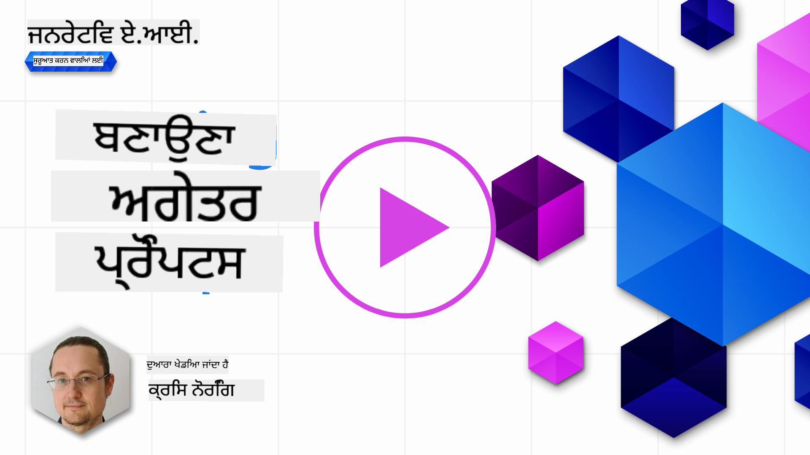

<!--
CO_OP_TRANSLATOR_METADATA:
{
  "original_hash": "ffb706de93ef518f31e0a675c66dfce1",
  "translation_date": "2025-10-17T14:22:22+00:00",
  "source_file": "05-advanced-prompts/README.md",
  "language_code": "pa"
}
-->
# ਉੱਚੇ ਪੱਧਰ ਦੇ ਪ੍ਰੋੰਪਟ ਬਣਾਉਣਾ

[](https://youtu.be/BAjzkaCdRok?si=NmUIyRf7-cDgbjtt)

ਪਿਛਲੇ ਅਧਿਆਇ ਤੋਂ ਕੁਝ ਸਿੱਖਿਆਵਾਂ ਨੂੰ ਦੁਹਰਾਈਏ:

> ਪ੍ਰੋੰਪਟ _ਇੰਜੀਨੀਅਰਿੰਗ_ ਉਹ ਪ੍ਰਕਿਰਿਆ ਹੈ ਜਿਸ ਵਿੱਚ ਅਸੀਂ **ਮਾਡਲ ਨੂੰ ਵਧੇਰੇ ਸਬੰਧਤ ਜਵਾਬਾਂ ਵੱਲ ਦਿਸ਼ਾ ਦਿੰਦੇ ਹਾਂ** ਜ਼ਿਆਦਾ ਉਪਯੋਗੀ ਹਦਾਇਤਾਂ ਜਾਂ ਸੰਦਰਭ ਪ੍ਰਦਾਨ ਕਰਕੇ।

ਪ੍ਰੋੰਪਟ ਲਿਖਣ ਦੇ ਦੋ ਕਦਮ ਵੀ ਹਨ, ਪ੍ਰੋੰਪਟ ਬਣਾਉਣਾ, ਸੰਦਰਭ ਪ੍ਰਦਾਨ ਕਰਕੇ ਅਤੇ ਦੂਜਾ ਹਿੱਸਾ _ਆਪਟੀਮਾਈਜ਼ੇਸ਼ਨ_, ਪ੍ਰੋੰਪਟ ਨੂੰ ਕਿਵੇਂ ਧੀਰੇ-ਧੀਰੇ ਸੁਧਾਰਿਆ ਜਾ ਸਕਦਾ ਹੈ।

ਇਸ ਮੌਕੇ 'ਤੇ, ਸਾਨੂੰ ਪ੍ਰੋੰਪਟ ਲਿਖਣ ਦੇ ਬੁਨਿਆਦੀ ਸਮਝ ਹੈ, ਪਰ ਸਾਨੂੰ ਹੋਰ ਗਹਿਰਾਈ ਵਿੱਚ ਜਾਣ ਦੀ ਲੋੜ ਹੈ। ਇਸ ਅਧਿਆਇ ਵਿੱਚ, ਤੁਸੀਂ ਵੱਖ-ਵੱਖ ਪ੍ਰੋੰਪਟਾਂ ਦੀ ਕੋਸ਼ਿਸ਼ ਕਰਨ ਤੋਂ ਲੈ ਕੇ ਇਹ ਸਮਝਣ ਤੱਕ ਜਾਓਗੇ ਕਿ ਕਿਉਂ ਇੱਕ ਪ੍ਰੋੰਪਟ ਦੂਜੇ ਨਾਲੋਂ ਵਧੀਆ ਹੈ। ਤੁਸੀਂ ਕੁਝ ਬੁਨਿਆਦੀ ਤਕਨੀਕਾਂ ਦੀ ਪਾਲਣਾ ਕਰਦੇ ਹੋਏ ਪ੍ਰੋੰਪਟ ਬਣਾਉਣ ਦੇ ਤਰੀਕੇ ਸਿੱਖੋਗੇ ਜੋ ਕਿਸੇ ਵੀ LLM 'ਤੇ ਲਾਗੂ ਕੀਤੇ ਜਾ ਸਕਦੇ ਹਨ।

## ਪਰਿਚਯ

ਇਸ ਅਧਿਆਇ ਵਿੱਚ, ਅਸੀਂ ਹੇਠਾਂ ਦਿੱਤੇ ਵਿਸ਼ਿਆਂ ਨੂੰ ਕਵਰ ਕਰਾਂਗੇ:

- ਵੱਖ-ਵੱਖ ਤਕਨੀਕਾਂ ਨੂੰ ਆਪਣੇ ਪ੍ਰੋੰਪਟਾਂ 'ਤੇ ਲਾਗੂ ਕਰਕੇ ਪ੍ਰੋੰਪਟ ਇੰਜੀਨੀਅਰਿੰਗ ਦਾ ਗਿਆਨ ਵਧਾਓ।
- ਆਪਣੇ ਪ੍ਰੋੰਪਟਾਂ ਨੂੰ ਆਉਟਪੁੱਟ ਵਿੱਚ ਵੱਖ-ਵੱਖਤਾ ਲਿਆਉਣ ਲਈ ਸੰਰਚਿਤ ਕਰੋ।

## ਸਿੱਖਣ ਦੇ ਲਕਸ਼

ਇਹ ਪਾਠ ਪੂਰਾ ਕਰਨ ਤੋਂ ਬਾਅਦ, ਤੁਸੀਂ ਯੋਗ ਹੋਵੋਗੇ:

- ਪ੍ਰੋੰਪਟ ਇੰਜੀਨੀਅਰਿੰਗ ਤਕਨੀਕਾਂ ਨੂੰ ਲਾਗੂ ਕਰੋ ਜੋ ਤੁਹਾਡੇ ਪ੍ਰੋੰਪਟਾਂ ਦੇ ਨਤੀਜੇ ਨੂੰ ਸੁਧਾਰਦੇ ਹਨ।
- ਪ੍ਰੋੰਪਟਿੰਗ ਕਰੋ ਜੋ ਵੱਖ-ਵੱਖ ਜਾਂ ਨਿਰਧਾਰਤ ਹੋਵੇ।

## ਪ੍ਰੋੰਪਟ ਇੰਜੀਨੀਅਰਿੰਗ

ਪ੍ਰੋੰਪਟ ਇੰਜੀਨੀਅਰਿੰਗ ਉਹ ਪ੍ਰਕਿਰਿਆ ਹੈ ਜਿਸ ਵਿੱਚ ਪ੍ਰੋੰਪਟ ਬਣਾਏ ਜਾਂਦੇ ਹਨ ਜੋ ਚਾਹੇ ਗਏ ਨਤੀਜੇ ਪੈਦਾ ਕਰਨਗੇ। ਪ੍ਰੋੰਪਟ ਇੰਜੀਨੀਅਰਿੰਗ ਸਿਰਫ਼ ਇੱਕ ਟੈਕਸਟ ਪ੍ਰੋੰਪਟ ਲਿਖਣ ਤੋਂ ਵੱਧ ਹੈ। ਪ੍ਰੋੰਪਟ ਇੰਜੀਨੀਅਰਿੰਗ ਇੱਕ ਇੰਜੀਨੀਅਰਿੰਗ ਵਿਸ਼ੇ ਨਹੀਂ ਹੈ, ਇਹ ਤਕਨੀਕਾਂ ਦਾ ਇੱਕ ਸੈੱਟ ਹੈ ਜੋ ਤੁਸੀਂ ਚਾਹੇ ਗਏ ਨਤੀਜੇ ਪ੍ਰਾਪਤ ਕਰਨ ਲਈ ਲਾਗੂ ਕਰ ਸਕਦੇ ਹੋ।

### ਪ੍ਰੋੰਪਟ ਦਾ ਇੱਕ ਉਦਾਹਰਨ

ਆਓ ਇੱਕ ਬੁਨਿਆਦੀ ਪ੍ਰੋੰਪਟ ਲਵੋ ਜਿਵੇਂ ਕਿ ਇਹ:

> ਭੂਗੋਲ 'ਤੇ 10 ਪ੍ਰਸ਼ਨ ਬਣਾਓ।

ਇਸ ਪ੍ਰੋੰਪਟ ਵਿੱਚ, ਤੁਸੀਂ ਵਾਸਤਵ ਵਿੱਚ ਵੱਖ-ਵੱਖ ਪ੍ਰੋੰਪਟ ਤਕਨੀਕਾਂ ਦਾ ਸੈੱਟ ਲਾਗੂ ਕਰ ਰਹੇ ਹੋ।

ਆਓ ਇਸ ਨੂੰ ਤੋੜ ਕੇ ਵੇਖੀਏ।

- **ਸੰਦਰਭ**, ਤੁਸੀਂ ਨਿਰਧਾਰਤ ਕੀਤਾ ਕਿ ਇਹ "ਭੂਗੋਲ" ਬਾਰੇ ਹੋਣਾ ਚਾਹੀਦਾ ਹੈ।
- **ਆਉਟਪੁੱਟ ਨੂੰ ਸੀਮਿਤ ਕਰਨਾ**, ਤੁਸੀਂ 10 ਤੋਂ ਵੱਧ ਪ੍ਰਸ਼ਨ ਨਹੀਂ ਚਾਹੁੰਦੇ।

### ਸਧਾਰਨ ਪ੍ਰੋੰਪਟਿੰਗ ਦੀਆਂ ਸੀਮਾਵਾਂ

ਤੁਹਾਨੂੰ ਚਾਹੇ ਗਏ ਨਤੀਜੇ ਮਿਲਣ ਜਾਂ ਨਾ ਮਿਲਣ। ਤੁਹਾਨੂੰ ਆਪਣੇ ਪ੍ਰਸ਼ਨ ਜਨਰੇਟ ਹੋਣਗੇ, ਪਰ ਭੂਗੋਲ ਇੱਕ ਵੱਡਾ ਵਿਸ਼ਾ ਹੈ ਅਤੇ ਤੁਹਾਨੂੰ ਜੋ ਚਾਹੀਦਾ ਹੈ ਉਹ ਨਹੀਂ ਮਿਲ ਸਕਦਾ ਹੇਠਾਂ ਦਿੱਤੇ ਕਾਰਨਾਂ ਕਰਕੇ:

- **ਵੱਡਾ ਵਿਸ਼ਾ**, ਤੁਹਾਨੂੰ ਨਹੀਂ ਪਤਾ ਕਿ ਇਹ ਦੇਸ਼ਾਂ, ਰਾਜਧਾਨੀਆਂ, ਦਰਿਆਵਾਂ ਆਦਿ ਬਾਰੇ ਹੋਵੇਗਾ।
- **ਫਾਰਮੈਟ**, ਜੇ ਤੁਸੀਂ ਚਾਹੁੰਦੇ ਹੋ ਕਿ ਪ੍ਰਸ਼ਨ ਕਿਸੇ ਨਿਰਧਾਰਤ ਤਰੀਕੇ ਵਿੱਚ ਫਾਰਮੈਟ ਕੀਤੇ ਜਾਣ।

ਜਿਵੇਂ ਕਿ ਤੁਸੀਂ ਦੇਖ ਸਕਦੇ ਹੋ, ਪ੍ਰੋੰਪਟ ਬਣਾਉਣ ਸਮੇਂ ਬਹੁਤ ਕੁਝ ਵਿਚਾਰ ਕਰਨ ਦੀ ਲੋੜ ਹੈ।

ਅਜੇ ਤੱਕ, ਅਸੀਂ ਇੱਕ ਸਧਾਰਨ ਪ੍ਰੋੰਪਟ ਉਦਾਹਰਨ ਦੇਖੀ ਹੈ, ਪਰ ਜਨਰੇਟਿਵ AI ਲੋਕਾਂ ਨੂੰ ਵੱਖ-ਵੱਖ ਭੂਮਿਕਾਵਾਂ ਅਤੇ ਉਦਯੋਗਾਂ ਵਿੱਚ ਮਦਦ ਕਰਨ ਲਈ ਬਹੁਤ ਕੁਝ ਕਰਨ ਦੇ ਯੋਗ ਹੈ। ਆਓ ਅਗਲੇ ਕੁਝ ਬੁਨਿਆਦੀ ਤਕਨੀਕਾਂ ਦੀ ਪੜਤਾਲ ਕਰੀਏ।

### ਪ੍ਰੋੰਪਟਿੰਗ ਲਈ ਤਕਨੀਕਾਂ

ਸਭ ਤੋਂ ਪਹਿਲਾਂ, ਸਾਨੂੰ ਸਮਝਣ ਦੀ ਲੋੜ ਹੈ ਕਿ ਪ੍ਰੋੰਪਟਿੰਗ ਇੱਕ _ਉਭਰਦੀ_ ਗੁਣਵੱਤਾ ਹੈ LLM ਦੀ, ਜਿਸਦਾ ਮਤਲਬ ਹੈ ਕਿ ਇਹ ਮਾਡਲ ਵਿੱਚ ਬਣਾਈ ਗਈ ਵਿਸ਼ੇਸ਼ਤਾ ਨਹੀਂ ਹੈ ਪਰ ਕੁਝ ਹੈ ਜੋ ਅਸੀਂ ਮਾਡਲ ਦੀ ਵਰਤੋਂ ਕਰਦੇ ਹੋਏ ਖੋਜਦੇ ਹਾਂ।

ਕੁਝ ਬੁਨਿਆਦੀ ਤਕਨੀਕਾਂ ਹਨ ਜੋ ਅਸੀਂ LLM ਨੂੰ ਪ੍ਰੋੰਪਟ ਕਰਨ ਲਈ ਵਰਤ ਸਕਦੇ ਹਾਂ। ਆਓ ਉਨ੍ਹਾਂ ਦੀ ਪੜਤਾਲ ਕਰੀਏ।

- **ਜ਼ੀਰੋ-ਸ਼ਾਟ ਪ੍ਰੋੰਪਟਿੰਗ**, ਇਹ ਪ੍ਰੋੰਪਟਿੰਗ ਦਾ ਸਭ ਤੋਂ ਬੁਨਿਆਦੀ ਰੂਪ ਹੈ। ਇਹ ਇੱਕ ਸਿੰਗਲ ਪ੍ਰੋੰਪਟ ਹੈ ਜੋ ਸਿਰਫ਼ LLM ਦੇ ਟ੍ਰੇਨਿੰਗ ਡੇਟਾ ਦੇ ਆਧਾਰ 'ਤੇ ਜਵਾਬ ਦੀ ਬੇਨਤੀ ਕਰਦਾ ਹੈ।
- **ਫਿਊ-ਸ਼ਾਟ ਪ੍ਰੋੰਪਟਿੰਗ**, ਇਸ ਕਿਸਮ ਦੀ ਪ੍ਰੋੰਪਟਿੰਗ LLM ਨੂੰ 1 ਜਾਂ ਵੱਧ ਉਦਾਹਰਨ ਪ੍ਰਦਾਨ ਕਰਕੇ ਦਿਸ਼ਾ ਦਿੰਦੀ ਹੈ ਜਿਸ 'ਤੇ ਇਹ ਆਪਣੇ ਜਵਾਬ ਨੂੰ ਜਨਰੇਟ ਕਰਨ ਲਈ ਨਿਰਭਰ ਕਰ ਸਕਦੀ ਹੈ।
- **ਚੇਨ-ਆਫ-ਥੌਟ**, ਇਸ ਕਿਸਮ ਦੀ ਪ੍ਰੋੰਪਟਿੰਗ LLM ਨੂੰ ਦੱਸਦੀ ਹੈ ਕਿ ਸਮੱਸਿਆ ਨੂੰ ਕਦਮਾਂ ਵਿੱਚ ਕਿਵੇਂ ਤੋੜਨਾ ਹੈ।
- **ਜਨਰੇਟ ਕੀਤੀ ਗਿਆਨ**, ਪ੍ਰੋੰਪਟ ਦੇ ਜਵਾਬ ਨੂੰ ਸੁਧਾਰਨ ਲਈ, ਤੁਸੀਂ ਆਪਣੇ ਪ੍ਰੋੰਪਟ ਵਿੱਚ ਵਾਧੂ ਤੱਥ ਜਾਂ ਗਿਆਨ ਪ੍ਰਦਾਨ ਕਰ ਸਕਦੇ ਹੋ।
- **ਲੀਸਟ ਤੋਂ ਮੋਸਟ**, ਚੇਨ-ਆਫ-ਥੌਟ ਵਾਂਗ, ਇਹ ਤਕਨੀਕ ਇੱਕ ਸਮੱਸਿਆ ਨੂੰ ਕਦਮਾਂ ਦੀ ਲੜੀ ਵਿੱਚ ਤੋੜਨ ਬਾਰੇ ਹੈ ਅਤੇ ਫਿਰ ਇਹ ਕਦਮ ਕ੍ਰਮ ਵਿੱਚ ਕਰਨ ਲਈ ਕਹਿੰਦੀ ਹੈ।
- **ਸੈਲਫ-ਰਿਫਾਈਨ**, ਇਹ ਤਕਨੀਕ LLM ਦੇ ਆਉਟਪੁੱਟ ਦੀ ਆਲੋਚਨਾ ਕਰਨ ਅਤੇ ਫਿਰ ਇਸ ਨੂੰ ਸੁਧਾਰਨ ਲਈ ਕਹਿਣ ਬਾਰੇ ਹੈ।
- **ਮਾਇਯੂਟਿਕ ਪ੍ਰੋੰਪਟਿੰਗ**। ਤੁਸੀਂ ਇੱਥੇ ਇਹ ਯਕੀਨੀ ਬਣਾਉਣਾ ਚਾਹੁੰਦੇ ਹੋ ਕਿ LLM ਦਾ ਜਵਾਬ ਸਹੀ ਹੈ ਅਤੇ ਤੁਸੀਂ ਇਸ ਨੂੰ ਜਵਾਬ ਦੇ ਵੱਖ-ਵੱਖ ਹਿੱਸਿਆਂ ਨੂੰ ਸਮਝਾਉਣ ਲਈ ਕਹਿੰਦੇ ਹੋ। ਇਹ ਸੈਲਫ-ਰਿਫਾਈਨ ਦਾ ਇੱਕ ਰੂਪ ਹੈ।

### ਜ਼ੀਰੋ-ਸ਼ਾਟ ਪ੍ਰੋੰਪਟਿੰਗ

ਪ੍ਰੋੰਪਟਿੰਗ ਦੀ ਇਹ ਸ਼ੈਲੀ ਬਹੁਤ ਸਧਾਰਨ ਹੈ, ਇਹ ਇੱਕ ਸਿੰਗਲ ਪ੍ਰੋੰਪਟ 'ਤੇ ਆਧਾਰਿਤ ਹੈ। ਇਹ ਤਕਨੀਕ ਸ਼ਾਇਦ ਉਹ ਹੈ ਜੋ ਤੁਸੀਂ LLMs ਬਾਰੇ ਸਿੱਖਣ ਦੀ ਸ਼ੁਰੂਆਤ ਕਰਦੇ ਹੋ। ਇੱਥੇ ਇੱਕ ਉਦਾਹਰਨ ਹੈ:

- ਪ੍ਰੋੰਪਟ: "ਅਲਜਬਰਾ ਕੀ ਹੈ?"
- ਜਵਾਬ: "ਅਲਜਬਰਾ ਗਣਿਤ ਦਾ ਇੱਕ ਸ਼ਾਖਾ ਹੈ ਜੋ ਗਣਿਤ ਦੇ ਚਿੰਨ੍ਹਾਂ ਅਤੇ ਇਨ੍ਹਾਂ ਚਿੰਨ੍ਹਾਂ ਨੂੰ ਮੈਨਿਪੁਲੇਟ ਕਰਨ ਦੇ ਨਿਯਮਾਂ ਦਾ ਅਧਿਐਨ ਕਰਦਾ ਹੈ।"

### ਫਿਊ-ਸ਼ਾਟ ਪ੍ਰੋੰਪਟਿੰਗ

ਪ੍ਰੋੰਪਟਿੰਗ ਦੀ ਇਹ ਸ਼ੈਲੀ ਮਾਡਲ ਦੀ ਮਦਦ ਕਰਦੀ ਹੈ ਕਿ ਕੁਝ ਉਦਾਹਰਨਾਂ ਦੇ ਨਾਲ ਬੇਨਤੀ ਪ੍ਰਦਾਨ ਕੀਤੀ ਜਾਵੇ। ਇਹ ਇੱਕ ਸਿੰਗਲ ਪ੍ਰੋੰਪਟ ਹੈ ਜਿਸ ਵਿੱਚ ਵਾਧੂ ਟਾਸਕ-ਸਪੈਸਿਫਿਕ ਡੇਟਾ ਸ਼ਾਮਲ ਹੁੰਦਾ ਹੈ। ਇੱਥੇ ਇੱਕ ਉਦਾਹਰਨ ਹੈ:

- ਪ੍ਰੋੰਪਟ: "ਸ਼ੇਕਸਪੀਅਰ ਦੇ ਅੰਦਾਜ਼ ਵਿੱਚ ਇੱਕ ਕਵਿਤਾ ਲਿਖੋ। ਇੱਥੇ ਸ਼ੇਕਸਪੀਅਰ ਦੇ ਕੁਝ ਸੌਨਟ ਦੇ ਉਦਾਹਰਨ ਹਨ:
  ਸੌਨਟ 18: 'ਕੀ ਮੈਂ ਤੁਹਾਨੂੰ ਗਰਮੀ ਦੇ ਦਿਨ ਨਾਲ ਤੁਲਨਾ ਕਰਾਂ? ਤੁਸੀਂ ਹੋਰ ਸੁਹਣੇ ਅਤੇ ਹੋਰ ਸੰਤੁਲਿਤ ਹੋ...
  ਸੌਨਟ 116: 'ਸੱਚੇ ਮਨਾਂ ਦੇ ਵਿਆਹ ਵਿੱਚ ਰੁਕਾਵਟਾਂ ਨੂੰ ਸਵੀਕਾਰ ਨਾ ਕਰੋ। ਪਿਆਰ ਪਿਆਰ ਨਹੀਂ ਹੈ ਜੋ ਬਦਲਣ 'ਤੇ ਬਦਲਦਾ ਹੈ...
  ਸੌਨਟ 132: 'ਤੁਹਾਡੇ ਅੱਖਾਂ ਨੂੰ ਮੈਂ ਪਿਆਰ ਕਰਦਾ ਹਾਂ, ਅਤੇ ਉਹ, ਜਿਵੇਂ ਕਿ ਮੈਨੂੰ ਦਇਆ ਕਰਦੇ ਹਨ, ਤੁਹਾਡੇ ਦਿਲ ਨੂੰ ਜਾਣਦੇ ਹਨ...
  ਹੁਣ, ਚੰਦ ਦੀ ਸੁੰਦਰਤਾ ਬਾਰੇ ਇੱਕ ਸੌਨਟ ਲਿਖੋ।"
- ਜਵਾਬ: "ਆਸਮਾਨ 'ਤੇ, ਚੰਦ ਹੌਲੀ ਹੌਲੀ ਚਮਕਦਾ ਹੈ, ਚਾਂਦੀ ਦੀ ਰੋਸ਼ਨੀ ਵਿੱਚ ਜੋ ਆਪਣਾ ਨਰਮ ਗ੍ਰੇਸ ਦਿੰਦਾ ਹੈ,..."

ਉਦਾਹਰਨਾਂ LLM ਨੂੰ ਚਾਹੇ ਗਏ ਆਉਟਪੁੱਟ ਦਾ ਸੰਦਰਭ, ਫਾਰਮੈਟ ਜਾਂ ਸ਼ੈਲੀ ਸਮਝਣ ਵਿੱਚ ਮਦਦ ਕਰਦੀਆਂ ਹਨ। ਇਹ ਮਾਡਲ ਨੂੰ ਵਿਸ਼ੇਸ਼ ਟਾਸਕ ਸਮਝਣ ਅਤੇ ਹੋਰ ਸਹੀ ਅਤੇ ਸਬੰਧਤ ਜਵਾਬ ਜਨਰੇਟ ਕਰਨ ਵਿੱਚ ਮਦਦ ਕਰਦੀਆਂ ਹਨ।

### ਚੇਨ-ਆਫ-ਥੌਟ

ਚੇਨ-ਆਫ-ਥੌਟ ਇੱਕ ਬਹੁਤ ਦਿਲਚਸਪ ਤਕਨੀਕ ਹੈ ਕਿਉਂਕਿ ਇਹ LLM ਨੂੰ ਕਦਮਾਂ ਦੀ ਲੜੀ ਵਿੱਚ ਲੈ ਕੇ ਜਾਣ ਬਾਰੇ ਹੈ। ਵਿਚਾਰ ਇਹ ਹੈ ਕਿ LLM ਨੂੰ ਇਸ ਤਰੀਕੇ ਨਾਲ ਦਿਸ਼ਾ ਦਿੰਦੇ ਹੋਏ ਦੱਸਿਆ ਜਾਵੇ ਕਿ ਇਹ ਕੁਝ ਕਿਵੇਂ ਕਰਨਾ ਹੈ। ਹੇਠਾਂ ਦਿੱਤੇ ਉਦਾਹਰਨ ਨੂੰ ਵੇਖੋ, ਚੇਨ-ਆਫ-ਥੌਟ ਦੇ ਨਾਲ ਅਤੇ ਬਿਨਾਂ:

    - ਪ੍ਰੋੰਪਟ: "ਐਲਿਸ ਕੋਲ 5 ਸੇਬ ਹਨ, 3 ਸੇਬ ਸੁੱਟਦੀ ਹੈ, 2 ਬੌਬ ਨੂੰ ਦਿੰਦੀ ਹੈ ਅਤੇ ਬੌਬ ਇੱਕ ਵਾਪਸ ਦਿੰਦਾ ਹੈ, ਐਲਿਸ ਕੋਲ ਕਿੰਨੇ ਸੇਬ ਹਨ?"
    - ਜਵਾਬ: 5

LLM 5 ਨਾਲ ਜਵਾਬ ਦਿੰਦਾ ਹੈ, ਜੋ ਗਲਤ ਹੈ। ਸਹੀ ਜਵਾਬ 1 ਸੇਬ ਹੈ, ਦਿੱਤੇ ਗਣਨਾ (5 -3 -2 + 1 = 1) ਦੇ ਅਨੁਸਾਰ।

ਤਾਂ ਅਸੀਂ LLM ਨੂੰ ਇਹ ਸਹੀ ਕਰਨ ਲਈ ਕਿਵੇਂ ਸਿਖਾ ਸਕਦੇ ਹਾਂ?

ਆਓ ਚੇਨ-ਆਫ-ਥੌਟ ਦੀ ਕੋਸ਼ਿਸ਼ ਕਰੀਏ। ਚੇਨ-ਆਫ-ਥੌਟ ਲਾਗੂ ਕਰਨ ਦਾ ਮਤਲਬ ਹੈ:

1. LLM ਨੂੰ ਇੱਕ ਸਮਾਨ ਉਦਾਹਰਨ ਦਿਓ।
1. ਗਣਨਾ ਦਿਖਾਓ, ਅਤੇ ਇਸ ਨੂੰ ਸਹੀ ਤਰੀਕੇ ਨਾਲ ਗਿਣਨ ਦਾ ਤਰੀਕਾ ਦਿਖਾਓ।
1. ਅਸਲ ਪ੍ਰੋੰਪਟ ਪ੍ਰਦਾਨ ਕਰੋ।

ਇਹ ਹੈ ਕਿ ਕਿਵੇਂ:

- ਪ੍ਰੋੰਪਟ: "ਲੀਸਾ ਕੋਲ 7 ਸੇਬ ਹਨ, 1 ਸੇਬ ਸੁੱਟਦੀ ਹੈ, 4 ਸੇਬ ਬਾਰਟ ਨੂੰ ਦਿੰਦੀ ਹੈ ਅਤੇ ਬਾਰਟ ਇੱਕ ਵਾਪਸ ਦਿੰਦਾ ਹੈ:
  7 -1 = 6
  6 -4 = 2
  2 +1 = 3  
  ਐਲਿਸ ਕੋਲ 5 ਸੇਬ ਹਨ, 3 ਸੇਬ ਸੁੱਟਦੀ ਹੈ, 2 ਬੌਬ ਨੂੰ ਦਿੰਦੀ ਹੈ ਅਤੇ ਬੌਬ ਇੱਕ ਵਾਪਸ ਦਿੰਦਾ ਹੈ, ਐਲਿਸ ਕੋਲ ਕਿੰਨੇ ਸੇਬ ਹਨ?"
  ਜਵਾਬ: 1

ਨੋਟ ਕਰੋ ਕਿ ਅਸੀਂ ਹੋਰ ਲੰਬੇ ਪ੍ਰੋੰਪਟ ਲਿਖਦੇ ਹਾਂ ਜਿਸ ਵਿੱਚ ਇੱਕ ਹੋਰ ਉਦਾਹਰਨ, ਇੱਕ ਗਣਨਾ ਅਤੇ ਫਿਰ ਅਸਲ ਪ੍ਰੋੰਪਟ ਸ਼ਾਮਲ ਹੁੰਦਾ ਹੈ ਅਤੇ ਅਸੀਂ ਸਹੀ ਜਵਾਬ 1 'ਤੇ ਪਹੁੰਚਦੇ ਹਾਂ।

ਜਿਵੇਂ ਕਿ ਤੁਸੀਂ ਦੇਖ ਸਕਦੇ ਹੋ ਚੇਨ-ਆਫ-ਥੌਟ ਇੱਕ ਬਹੁਤ ਸ਼ਕਤੀਸ਼ਾਲੀ ਤਕਨੀਕ ਹੈ।

### ਜਨਰੇਟ ਕੀਤੀ ਗਿਆਨ

ਅਕਸਰ ਜਦੋਂ ਤੁਸੀਂ ਇੱਕ ਪ੍ਰੋੰਪਟ ਬਣਾਉਣਾ ਚਾਹੁੰਦੇ ਹੋ, ਤੁਸੀਂ ਇਹ ਆਪਣੇ ਕੰਪਨੀ ਦੇ ਡੇਟਾ ਦੀ ਵਰਤੋਂ ਕਰਕੇ ਕਰਨਾ ਚਾਹੁੰਦੇ ਹੋ। ਤੁਸੀਂ ਚਾਹੁੰਦੇ ਹੋ ਕਿ ਪ੍ਰੋੰਪਟ ਦਾ ਇੱਕ ਹਿੱਸਾ ਕੰਪਨੀ ਤੋਂ ਹੋਵੇ ਅਤੇ ਦੂਜਾ ਹਿੱਸਾ ਅਸਲ ਪ੍ਰੋੰਪਟ ਹੋਵੇ ਜਿਸ ਵਿੱਚ ਤੁਸੀਂ ਦਿਲਚਸਪੀ ਰੱਖਦੇ ਹੋ।

ਇੱਕ ਉਦਾਹਰਨ ਦੇ ਤੌਰ 'ਤੇ, ਜੇ ਤੁਸੀਂ ਬੀਮਾ ਦੇ ਕਾਰੋਬਾਰ ਵਿੱਚ ਹੋ ਤਾਂ ਤੁਹਾਡਾ ਪ੍ਰੋੰਪਟ ਇਸ ਤਰ੍ਹਾਂ ਦੇਖ ਸਕਦਾ ਹੈ:

```text
{{company}}: {{company_name}}
{{products}}:
{{products_list}}
Please suggest an insurance given the following budget and requirements:
Budget: {{budget}}
Requirements: {{requirements}}
```

ਉਪਰ, ਤੁਸੀਂ ਵੇਖਦੇ ਹੋ ਕਿ ਪ੍ਰੋੰਪਟ ਇੱਕ ਟੈਂਪਲੇਟ ਦੀ ਵਰਤੋਂ ਕਰਕੇ ਬਣਾਇਆ ਗਿਆ ਹੈ। ਟੈਂਪਲੇਟ ਵਿੱਚ ਕੁਝ ਵੈਰੀਏਬਲ ਹਨ, ਜੋ `{{variable}}` ਦੁਆਰਾ ਦਰਸਾਏ ਗਏ ਹਨ, ਜੋ ਕਿ ਇੱਕ ਕੰਪਨੀ API ਤੋਂ ਅਸਲ ਮੁੱਲਾਂ ਨਾਲ ਬਦਲੇ ਜਾਣਗੇ।

ਇੱਕ ਉਦਾਹਰਨ ਹੈ ਕਿ ਪ੍ਰੋੰਪਟ ਕਿਵੇਂ ਦੇਖ ਸਕਦਾ ਹੈ ਜਦੋਂ ਵੈਰੀਏਬਲਾਂ ਨੂੰ ਤੁਹਾਡੀ ਕੰਪਨੀ ਦੇ ਸਮੱਗਰੀ ਨਾਲ ਬਦਲਿਆ ਜਾਂਦਾ ਹੈ:

```text
Insurance company: ACME Insurance
Insurance products (cost per month):
- Car, cheap, 500 USD
- Car, expensive, 1100 USD
- Home, cheap, 600 USD
- Home, expensive, 1200 USD
- Life, cheap, 100 USD

Please suggest an insurance given the following budget and requirements:
Budget: $1000
Requirements: Car, Home, and Life insurance
```

ਇਸ ਪ੍ਰੋੰਪਟ ਨੂੰ ਇੱਕ LLM ਦੇ ਰਾਹੀਂ ਚਲਾਉਣ ਨਾਲ ਇਹ ਜਵਾਬ ਪੈਦਾ ਹੋਵੇਗਾ:

```output
Given the budget and requirements, we suggest the following insurance package from ACME Insurance:
- Car, cheap, 500 USD
- Home, cheap, 600 USD
- Life, cheap, 100 USD
Total cost: $1,200 USD
```

ਜਿਵੇਂ ਕਿ ਤੁਸੀਂ ਵੇਖ ਸਕਦੇ ਹੋ, ਇਹ ਵੀ ਲਾਈਫ ਇੰਸ਼ੋਰੈਂਸ ਦਾ ਸੁਝਾਅ ਦਿੰਦਾ ਹੈ, ਜੋ ਇਸਨੂੰ ਨਹੀਂ ਦੇਣਾ ਚਾਹੀਦਾ। ਇਹ ਨਤੀਜਾ ਇਸ ਗੱਲ ਦਾ ਸੰਕੇਤ ਹੈ ਕਿ ਸਾਨੂੰ ਪ੍ਰੋੰਪਟ ਨੂੰ ਸਪਸ਼ਟ ਕਰਨ ਲਈ ਬਦਲਣ ਦੀ ਲੋੜ ਹੈ ਕਿ ਇਹ ਕੀ ਦੀ ਇਜਾਜ਼ਤ ਦੇ ਸਕਦਾ ਹੈ। ਕੁਝ _ਟ੍ਰਾਇਲ ਅਤੇ ਐਰਰ_ ਦੇ ਬਾਅਦ, ਅਸੀਂ ਹੇਠਾਂ ਦਿੱਤੇ ਪ੍ਰੋੰਪਟ 'ਤੇ ਪਹੁੰਚਦੇ ਹਾਂ:

```text
Insurance company: ACME Insurance
Insurance products (cost per month):
- type: Car, cheap, cost: 500 USD
- type: Car, expensive, cost: 1100 USD
- type: Home, cheap, cost: 600 USD
- type: Home, expensive, cost: 1200 USD
- type: Life, cheap, cost: 100 USD

Please suggest an insurance given the following budget and requirements:
Budget: $1000 restrict choice to types: Car, Home
```

ਨੋਟ ਕਰੋ ਕਿ _ਟਾਈਪ_ ਅਤੇ _ਕੋਸਟ_ ਸ਼ਾਮਲ ਕਰਨਾ ਅਤੇ ਕੀਵਰਡ _ਰਿਸਟ੍ਰਿਕਟ_ ਦੀ ਵਰਤੋਂ ਕਰਨਾ LLM ਨੂੰ ਸਮਝਣ ਵਿੱਚ ਮਦਦ ਕਰਦਾ ਹੈ ਕਿ ਅਸੀਂ ਕੀ ਚਾਹੁੰਦੇ ਹਾਂ।

ਹੁਣ ਸਾਨੂੰ ਹੇਠਾਂ ਦਿੱਤਾ ਜਵਾਬ ਮਿਲਦਾ ਹੈ:

```output
Given the budget and requirements, we suggest the Car, Cheap insurance product which costs 500 USD per month.
```

ਇਸ ਉਦਾਹਰਨ ਦਾ ਮਕਸਦ ਇਹ ਦਿਖਾਉਣਾ ਸੀ ਕਿ ਹਾਲਾਂਕਿ ਅਸੀਂ _ਜਨਰੇਟ ਕੀਤੀ ਗਿਆਨ_ ਵਰਗੇ ਬੁਨਿਆਦੀ ਤਕਨੀਕ ਦੀ ਵਰਤੋਂ ਕਰ ਰਹੇ ਹਾਂ, ਸਾਨੂੰ ਜ਼ਿਆਦਾਤਰ ਮਾਮਲਿਆਂ ਵਿੱਚ ਚਾਹੇ ਗਏ ਨਤੀਜੇ ਪ੍ਰਾਪਤ ਕਰਨ ਲਈ ਪ੍ਰੋੰਪਟ ਨੂੰ ਸੁਧਾਰਨ ਦੀ ਲੋੜ ਹੁੰਦੀ ਹੈ।

### ਲੀਸਟ-ਟੂ-ਮੋਸਟ

ਲੀਸਟ-ਟੂ-ਮੋਸਟ ਪ੍ਰੋੰਪਟਿੰਗ ਦਾ ਵਿਚਾਰ ਇੱਕ ਵੱਡੀ ਸਮੱਸਿਆ ਨੂੰ ਉਪ-ਸਮੱਸਿਆਵਾਂ ਵਿੱਚ ਤੋੜਨ ਬਾਰੇ ਹੈ। ਇਸ ਤਰੀਕੇ ਨਾਲ, ਤੁਸੀਂ LLM ਨੂੰ "ਵੱਡੀ ਸਮੱਸਿਆ" ਨੂੰ ਜਿੱਤਣ ਲਈ ਦਿਸ਼ਾ ਦਿੰਦੇ ਹੋ। ਇੱਕ ਵਧੀਆ ਉਦਾਹرن ਡੇਟਾ ਸਾਇੰਸ ਲਈ ਹੋ ਸਕਦਾ ਹੈ ਜਿੱਥੇ ਤੁਸੀਂ LLM ਨੂੰ ਇਸ ਤਰ੍ਹਾਂ ਸਮੱਸਿਆ ਨੂੰ ਵੰਡਣ ਲਈ ਕਹਿ ਸਕਦੇ ਹੋ:

> ਪ੍ਰੋੰਪਟ: ਡੇਟਾ ਸਾਇੰਸ ਨੂੰ 5 ਕਦਮਾਂ ਵਿੱਚ ਕਿਵੇਂ ਕਰਨਾ ਹੈ?

ਤੁਹਾਡੇ AI ਸਹਾਇਕ ਦੇ ਜਵਾਬ ਦੇ ਨਾਲ:

1. ਡੇਟ
ਜਿਵੇਂ ਤੁਸੀਂ ਦੇਖ ਸਕਦੇ ਹੋ, ਨਤੀਜੇ ਬਹੁਤ ਵੱਖ-ਵੱਖ ਹੋ ਸਕਦੇ ਹਨ।

> Note, ਕਿ ਹੋਰ ਪੈਰਾਮੀਟਰ ਹਨ ਜਿਨ੍ਹਾਂ ਨੂੰ ਤੁਸੀਂ ਨਤੀਜੇ ਨੂੰ ਵੱਖ-ਵੱਖ ਕਰਨ ਲਈ ਬਦਲ ਸਕਦੇ ਹੋ, ਜਿਵੇਂ top-k, top-p, repetition penalty, length penalty ਅਤੇ diversity penalty, ਪਰ ਇਹ ਇਸ ਪਾਠਕ੍ਰਮ ਦੇ ਦਾਇਰੇ ਤੋਂ ਬਾਹਰ ਹਨ।

## ਚੰਗੀਆਂ ਅਭਿਆਸ

ਤੁਹਾਨੂੰ ਜੋ ਚਾਹੀਦਾ ਹੈ ਉਹ ਪ੍ਰਾਪਤ ਕਰਨ ਲਈ ਕਈ ਅਭਿਆਸ ਲਾਗੂ ਕੀਤੇ ਜਾ ਸਕਦੇ ਹਨ। ਜਿਵੇਂ ਤੁਸੀਂ prompting ਨੂੰ ਵਧੇਰੇ ਵਰਤਦੇ ਹੋ, ਤੁਸੀਂ ਆਪਣਾ ਖੁਦ ਦਾ ਅੰਦਾਜ਼ ਵਿਕਸਿਤ ਕਰ ਲਵੋਗੇ।

ਜਿਨ੍ਹਾਂ ਤਕਨੀਕਾਂ ਨੂੰ ਅਸੀਂ ਕਵਰ ਕੀਤਾ ਹੈ, ਉਨ੍ਹਾਂ ਦੇ ਇਲਾਵਾ, ਕੁਝ ਚੰਗੀਆਂ ਅਭਿਆਸਾਂ ਨੂੰ ਧਿਆਨ ਵਿੱਚ ਰੱਖਣਾ ਚਾਹੀਦਾ ਹੈ ਜਦੋਂ ਤੁਸੀਂ LLM ਨੂੰ prompt ਕਰ ਰਹੇ ਹੋ।

ਇਹ ਚੰਗੀਆਂ ਅਭਿਆਸਾਂ ਧਿਆਨ ਵਿੱਚ ਰੱਖੋ:

- **ਸੰਦੇਸ਼ ਦਾ ਸੰਦਰਭ ਦਿਓ**। ਸੰਦਰਭ ਮਹੱਤਵਪੂਰਨ ਹੈ, ਜਿੰਨਾ ਤੁਸੀਂ ਡੋਮੇਨ, ਵਿਸ਼ਾ ਆਦਿ ਵਰਗੇ ਸੰਦਰਭ ਨੂੰ ਸਪਸ਼ਟ ਕਰ ਸਕਦੇ ਹੋ, ਉਨਾ ਹੀ ਵਧੀਆ।
- ਨਤੀਜੇ ਨੂੰ ਸੀਮਿਤ ਕਰੋ। ਜੇ ਤੁਸੀਂ ਨਿਰਧਾਰਤ ਗਿਣਤੀ ਦੇ ਆਈਟਮ ਜਾਂ ਨਿਰਧਾਰਤ ਲੰਬਾਈ ਚਾਹੁੰਦੇ ਹੋ, ਤਾਂ ਇਸਨੂੰ ਸਪਸ਼ਟ ਕਰੋ।
- **ਕੀ ਅਤੇ ਕਿਵੇਂ ਦੋਵੇਂ ਸਪਸ਼ਟ ਕਰੋ**। ਯਾਦ ਰੱਖੋ ਕਿ ਤੁਸੀਂ ਕੀ ਚਾਹੁੰਦੇ ਹੋ ਅਤੇ ਕਿਵੇਂ ਚਾਹੁੰਦੇ ਹੋ, ਦੋਵੇਂ ਦਾ ਜ਼ਿਕਰ ਕਰੋ, ਉਦਾਹਰਣ ਲਈ "Python Web API ਬਣਾਓ ਜਿਸ ਵਿੱਚ routes products ਅਤੇ customers ਹੋਣ, ਇਸਨੂੰ 3 ਫਾਈਲਾਂ ਵਿੱਚ ਵੰਡੋ"।
- **ਟੈਂਪਲੇਟ ਵਰਤੋ**। ਅਕਸਰ, ਤੁਸੀਂ ਆਪਣੇ ਕੰਪਨੀ ਦੇ ਡਾਟਾ ਨਾਲ ਆਪਣੇ prompts ਨੂੰ enrich ਕਰਨਾ ਚਾਹੁੰਦੇ ਹੋ। ਇਸ ਲਈ ਟੈਂਪਲੇਟ ਵਰਤੋ। ਟੈਂਪਲੇਟ ਵਿੱਚ variables ਹੋ ਸਕਦੇ ਹਨ ਜਿਨ੍ਹਾਂ ਨੂੰ ਤੁਸੀਂ ਅਸਲ ਡਾਟਾ ਨਾਲ ਬਦਲ ਸਕਦੇ ਹੋ।
- **ਸਹੀ ਤਰੀਕੇ ਨਾਲ ਸਪੈਲ ਕਰੋ**। LLMs ਤੁਹਾਨੂੰ ਸਹੀ ਜਵਾਬ ਦੇ ਸਕਦੇ ਹਨ, ਪਰ ਜੇ ਤੁਸੀਂ ਸਹੀ ਤਰੀਕੇ ਨਾਲ ਸਪੈਲ ਕਰੋ, ਤਾਂ ਤੁਹਾਨੂੰ ਵਧੀਆ ਜਵਾਬ ਮਿਲੇਗਾ।

## ਅਸਾਈਨਮੈਂਟ

ਇੱਥੇ Python ਵਿੱਚ ਇੱਕ ਸਧਾਰਨ API ਬਣਾਉਣ ਲਈ Flask ਦੀ ਵਰਤੋਂ ਕਰਦੇ ਹੋਏ ਕੋਡ ਦਿੱਤਾ ਗਿਆ ਹੈ:

```python
from flask import Flask, request

app = Flask(__name__)

@app.route('/')
def hello():
    name = request.args.get('name', 'World')
    return f'Hello, {name}!'

if __name__ == '__main__':
    app.run()
```

GitHub Copilot ਜਾਂ ChatGPT ਵਰਗੇ AI ਸਹਾਇਕ ਦੀ ਵਰਤੋਂ ਕਰੋ ਅਤੇ "self-refine" ਤਕਨੀਕ ਲਾਗੂ ਕਰਕੇ ਕੋਡ ਨੂੰ ਸੁਧਾਰੋ।

## ਹੱਲ

ਕਿਰਪਾ ਕਰਕੇ ਕੋਡ ਵਿੱਚ ਉਚਿਤ prompts ਸ਼ਾਮਲ ਕਰਕੇ ਅਸਾਈਨਮੈਂਟ ਨੂੰ ਹੱਲ ਕਰਨ ਦੀ ਕੋਸ਼ਿਸ਼ ਕਰੋ।

> [!TIP]
> ਇੱਕ prompt phrase ਕਰੋ ਤਾਂ ਕਿ ਇਹ ਸੁਧਾਰ ਕਰਨ ਲਈ ਪੁੱਛੇ। ਇਹ ਚੰਗਾ ਵਿਚਾਰ ਹੈ ਕਿ ਕਿੰਨੇ ਸੁਧਾਰਾਂ ਦੀ ਸੀਮਿਤਤਾ ਕੀਤੀ ਜਾਵੇ। ਤੁਸੀਂ ਇਹ ਵੀ ਪੁੱਛ ਸਕਦੇ ਹੋ ਕਿ ਇਸਨੂੰ ਕਿਸੇ ਨਿਰਧਾਰਤ ਤਰੀਕੇ ਨਾਲ ਸੁਧਾਰਿਆ ਜਾਵੇ, ਉਦਾਹਰਣ ਲਈ architecture, performance, security ਆਦਿ।

[Solution](../../../05-advanced-prompts/python/aoai-solution.py)

## ਗਿਆਨ ਜਾਂਚ

ਮੈਂ chain-of-thought prompting ਕਿਉਂ ਵਰਤਾਂਗਾ? ਮੈਨੂੰ 1 ਸਹੀ ਜਵਾਬ ਅਤੇ 2 ਗਲਤ ਜਵਾਬ ਦਿਖਾਓ।

1. LLM ਨੂੰ ਸਮੱਸਿਆ ਹੱਲ ਕਰਨ ਦਾ ਸਿਖਾਉਣ ਲਈ।
1. B, LLM ਨੂੰ ਕੋਡ ਵਿੱਚ ਗਲਤੀਆਂ ਲੱਭਣ ਦਾ ਸਿਖਾਉਣ ਲਈ।
1. C, LLM ਨੂੰ ਵੱਖ-ਵੱਖ ਹੱਲ ਲੱਭਣ ਲਈ ਨਿਰਦੇਸ਼ ਦੇਣ ਲਈ।

A: 1, ਕਿਉਂਕਿ chain-of-thought ਦਾ ਮਤਲਬ ਹੈ LLM ਨੂੰ ਸਮੱਸਿਆ ਹੱਲ ਕਰਨ ਦਾ ਤਰੀਕਾ ਦਿਖਾਉਣਾ, ਕਦਮ-ਦਰ-ਕਦਮ ਅਤੇ ਸਮਾਨ ਸਮੱਸਿਆਵਾਂ ਅਤੇ ਉਹ ਕਿਵੇਂ ਹੱਲ ਕੀਤੀਆਂ ਗਈਆਂ।

## 🚀 ਚੁਣੌਤੀ

ਤੁਸੀਂ ਅਸਾਈਨਮੈਂਟ ਵਿੱਚ self-refine ਤਕਨੀਕ ਦੀ ਵਰਤੋਂ ਕੀਤੀ। ਕੋਈ ਵੀ ਪ੍ਰੋਗਰਾਮ ਜੋ ਤੁਸੀਂ ਬਣਾਇਆ ਹੈ, ਉਸਨੂੰ ਲਓ ਅਤੇ ਸੋਚੋ ਕਿ ਤੁਸੀਂ ਕਿਹੜੇ ਸੁਧਾਰ ਲਾਗੂ ਕਰਨਾ ਚਾਹੁੰਦੇ ਹੋ। ਹੁਣ self-refine ਤਕਨੀਕ ਦੀ ਵਰਤੋਂ ਕਰਕੇ ਪ੍ਰਸਤਾਵਿਤ ਬਦਲਾਅ ਲਾਗੂ ਕਰੋ। ਤੁਹਾਨੂੰ ਨਤੀਜਾ ਕਿਵੇਂ ਲੱਗਿਆ, ਵਧੀਆ ਜਾਂ ਖਰਾਬ?

## ਸ਼ਾਨਦਾਰ ਕੰਮ! ਆਪਣੀ ਸਿੱਖਿਆ ਜਾਰੀ ਰੱਖੋ

ਇਸ ਪਾਠ ਨੂੰ ਪੂਰਾ ਕਰਨ ਤੋਂ ਬਾਅਦ, ਆਪਣਾ Generative AI ਗਿਆਨ ਵਧਾਉਣ ਲਈ ਸਾਡੇ [Generative AI Learning collection](https://aka.ms/genai-collection?WT.mc_id=academic-105485-koreyst) ਨੂੰ ਚੈੱਕ ਕਰੋ!

Lesson 6 ਵਿੱਚ ਜਾਓ ਜਿੱਥੇ ਅਸੀਂ Prompt Engineering ਦੇ ਆਪਣੇ ਗਿਆਨ ਨੂੰ ਲਾਗੂ ਕਰਕੇ [text generation apps ਬਣਾਉਣ](../06-text-generation-apps/README.md?WT.mc_id=academic-105485-koreyst) ਦੀ ਕੋਸ਼ਿਸ਼ ਕਰਾਂਗੇ।

---

**ਅਸਵੀਕਰਤੀ**:  
ਇਹ ਦਸਤਾਵੇਜ਼ AI ਅਨੁਵਾਦ ਸੇਵਾ [Co-op Translator](https://github.com/Azure/co-op-translator) ਦੀ ਵਰਤੋਂ ਕਰਕੇ ਅਨੁਵਾਦ ਕੀਤਾ ਗਿਆ ਹੈ। ਜਦੋਂ ਕਿ ਅਸੀਂ ਸਹੀ ਹੋਣ ਦੀ ਕੋਸ਼ਿਸ਼ ਕਰਦੇ ਹਾਂ, ਕਿਰਪਾ ਕਰਕੇ ਧਿਆਨ ਦਿਓ ਕਿ ਸਵੈਚਾਲਿਤ ਅਨੁਵਾਦਾਂ ਵਿੱਚ ਗਲਤੀਆਂ ਜਾਂ ਅਸੁੱਤੀਆਂ ਹੋ ਸਕਦੀਆਂ ਹਨ। ਇਸ ਦੀ ਮੂਲ ਭਾਸ਼ਾ ਵਿੱਚ ਮੂਲ ਦਸਤਾਵੇਜ਼ ਨੂੰ ਅਧਿਕਾਰਤ ਸਰੋਤ ਮੰਨਿਆ ਜਾਣਾ ਚਾਹੀਦਾ ਹੈ। ਮਹੱਤਵਪੂਰਨ ਜਾਣਕਾਰੀ ਲਈ, ਪੇਸ਼ੇਵਰ ਮਨੁੱਖੀ ਅਨੁਵਾਦ ਦੀ ਸਿਫਾਰਸ਼ ਕੀਤੀ ਜਾਂਦੀ ਹੈ। ਇਸ ਅਨੁਵਾਦ ਦੀ ਵਰਤੋਂ ਤੋਂ ਪੈਦਾ ਹੋਣ ਵਾਲੇ ਕਿਸੇ ਵੀ ਗਲਤਫਹਿਮੀ ਜਾਂ ਗਲਤ ਵਿਆਖਿਆ ਲਈ ਅਸੀਂ ਜ਼ਿੰਮੇਵਾਰ ਨਹੀਂ ਹਾਂ।