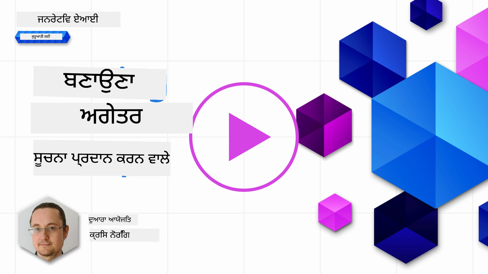

# ਉੱਨਤ ਪ੍ਰਾਂਪਟ ਬਣਾਉਣਾ

[](https://youtu.be/BAjzkaCdRok?si=NmUIyRf7-cDgbjtt)

ਆਓ ਪਿਛਲੈ ਅਧਿਆਇ ਤੋਂ ਕੁਝ ਸਿੱਖਿਆਵਾਂ ਦਾ ਪੁਨਰਾਵਲੋਕਨ ਕਰੀਏ:

> ਪ੍ਰਾਂਪਟ _ਇੰਜੀਨੀਅਰਿੰਗ_ ਉਹ ਪ੍ਰਕਿਰਿਆ ਹੈ ਜਿਸ ਰਾਹੀਂ ਅਸੀਂ **ਮਾਡਲ ਨੂੰ ਜ਼ਿਆਦਾ ਸੰਬੰਧਿਤ ਜਵਾਬਾਂ ਵੱਲ ਮਾਰਗਦਰਸ਼ਨ ਦਿੰਦੇ ਹਾਂ** ਵਧੀਆ ਨਿਰਦੇਸ਼ ਜਾਂ ਪ੍ਰਸੰਗ ਦੇ ਕੇ।

ਪ੍ਰਾਂਪਟ ਲਿਖਣ ਲਈ ਦੋ ਕਦਮ ਵੀ ਹੁੰਦੇ ਹਨ: ਪ੍ਰਾਂਪਟ ਬਣਾਉਣਾ, ਜੋ ਪ੍ਰਸੰਗ ਦਿੰਦਾ ਹੈ, ਅਤੇ _ਜਾਂਚ-ਪੜਤਾਲ_ ਜੋ ਪ੍ਰਾਂਪਟ ਨੂੰ ਧੀਰੇ-ਧੀਰੇ ਬਿਹਤਰ ਬਣਾਉਣਾ ਹੈ।

ਇਸ ਮੋੜ 'ਤੇ ਸਾਨੂੰ ਪ੍ਰਾਂਪਟ ਲਿਖਣ ਬਾਰੇ ਕੁਝ ਬੁਨਿਆਦੀ ਸਮਝ ਹੋ ਗਈ ਹੈ, ਪਰ ਸਾਨੂੰ ਹੋਰ ਡੂੰਘਾਈ ਵਿੱਚ ਜਾਣਾ ਪਵੇਗਾ। ਇਸ ਅਧਿਆਇ ਵਿੱਚ, ਤੁਸੀਂ ਵੱਖ-ਵੱਖ ਪ੍ਰਾਂਪਟ ਆਜ਼ਮਾਉਣ ਤੋਂ ਲੈ ਕੇ ਸਮਝੋਗੇ ਕਿ ਇੱਕ ਪ੍ਰਾਂਪਟ ਦੂਜੇ ਨਾਲੋਂ ਵਧੀਆ ਕਿਉਂ ਹੈ। ਤੁਸੀਂ ਬੁਨਿਆਦੀ ਤਕਨੀਕਾਂ ਦੇ ਅਨੁਸਾਰ ਪ੍ਰਾਂਪਟ ਬਣਾਉਣਾ ਸਿੱਖੋਗੇ ਜੋ ਕਿਸੇ ਵੀ LLM 'ਤੇ ਲਾਗੂ ਕੀਤੇ ਜਾ ਸਕਦੇ ਹਨ।

## ਪਰਿਚਯ

ਇਸ ਅਧਿਆਇ ਵਿੱਚ ਅਸੀਂ ਹੇਠ ਲਿਖੇ ਵਿਸ਼ਿਆਂ 'ਤੇ ਚਰਚਾ ਕਰਾਂਗੇ:

- ਵੱਖ-ਵੱਖ ਤਕਨੀਕਾਂ ਲਾਗੂ ਕਰਕੇ ਪ੍ਰਾਂਪਟ ਇੰਜੀਨੀਅਰਿੰਗ ਦੀ ਆਪਣੀ ਜਾਣਕਾਰੀ ਨੂੰ ਵਧਾਓ।
- ਆਪਣੇ ਪ੍ਰਾਂਪਟਾਂ ਨੂੰ ਐਸਾ ਸੰਰਚਿਤ ਕਰਨਾ ਕਿ ਆਉਟਪੁੱਟ ਵਿੱਚ ਬਦਲਾਅ ਆਵੇ।

## ਸਿੱਖਣ ਦੇ ਲਕਸ਼

ਇਸ ਪਾਠ ਨੂੰ ਪੂਰਾ ਕਰਨ ਤੋਂ ਬਾਦ, ਤੁਸੀਂ ਸਮਰੱਥ ਹੋਵੇਗੇ:

- ਪ੍ਰਾਂਪਟ ਇੰਜੀਨੀਅਰਿੰਗ ਤਕਨੀਕਾਂ ਲਾਗੂ ਕਰਨ ਦੀਆਂ ਜੋ ਤੁਹਾਡੇ ਪ੍ਰਾਂਪਟਾਂ ਦੇ ਨਤੀਜੇ ਨੂੰ ਸਧਾਰਨ।
- ਇਹ ਪ੍ਰਾਂਪਟ ਕਰਨਾ ਜੋ ਕਿ ਵੱਖ-ਵੱਖ ਜਾਂ ਨਿਸ਼ਚਿਤ ਹੋ।

## ਪ੍ਰਾਂਪਟ ਇੰਜੀਨੀਅਰਿੰਗ

ਪ੍ਰਾਂਪਟ ਇੰਜੀਨੀਅਰਿੰਗ ਉਹ ਚਰਿਆ ਹੈ ਜਿਸ ਵਿਚ ਅਸੀਂ ਚਾਹੁੰਦੇ ਨਤੀਜੇ ਵਾਲੇ ਪ੍ਰਾਂਪਟ ਬਣਾਉਂਦੇ ਹਾਂ। ਸਿਰਫ ਇੱਕ ਟੈਕਸਟ ਪ੍ਰਾਂਪਟ ਲਿਖਣ ਤੋਂ ਵੱਧ ਹੈ ਇਸ ਵਿੱਚ। ਇਹ ਜਾਂਚ-ਪੜਤਾਲ ਪ੍ਰਨਾਲੀ ਨਹੀਂ, ਬਲਕਿ ਉਹ ਤਕਨੀਕਾਂ ਹਨ ਜੋ ਤੁਸੀਂ ਚਾਹੁੰਦੇ ਨਤੀਜੇ ਪ੍ਰਾਪਤ ਕਰਨ ਲਈ ਲਾਗੂ ਕਰ ਸਕਦੇ ਹੋ।

### ਪ੍ਰਾਂਪਟ ਦੀ ਇੱਕ ਉਦਾਹਰਨ

ਆਓ ਇਸ ਸਧਾਰਣ ਪ੍ਰਾਂਪਟ ਨੂੰ ਲਈਏ:

> ਜਗਗਿਆਨ 'ਤੇ 10 ਸਵਾਲ ਬਣਾਓ।

ਇਸ ਪ੍ਰਾਂਪਟ ਵਿੱਚ ਤੁਸੀਂ ਵੱਖ-ਵੱਖ ਪ੍ਰਾਂਪਟ ਤਕਨੀਕਾਂ ਲਾਗੂ ਕਰ ਰਹੇ ਹੋ।

ਆਓ ਇਹ ਵਿਸਥਾਰ ਨਾਲ ਵੇਖੀਏ।

- **ਪ੍ਰਸੰਗ**, ਤੁਸੀਂ ਦੱਸਿਆ ਕਿ ਇਹ "ਜਗਗਿਆਨ" ਬਾਰੇ ਹੋਣਾ ਚਾਹੀਦਾ ਹੈ।
- **ਆਉਟਪੁੱਟ ਸੀਮਿਤ ਕਰਨਾ**, ਤੁਸੀਂ ਚਾਹੁੰਦੇ ਹੋ ਕਿ 10 ਸਵਾਲ ਤੋਂ ਵੱਧ ਨਾ ਬਣਨ।

### ਸਧਾਰਣ ਪ੍ਰਾਂਪਟਿੰਗ ਦੀਆਂ ਸੀਮਾਵਾਂ

ਤੁਹਾਨੂੰ ਚਾਹੁੰਦਾ ਨਤੀਜਾ ਮਿਲ ਸਕਦਾ ਹੈ ਜਾਂ ਨਹੀਂ ਵੀ ਮਿਲ ਸਕਦਾ। ਤੁਹਾਡੇ ਸਵਾਲ ਬਣ ਕੇ ਆ ਜਾਣਗੇ, ਪਰ ਜਗਗਿਆਨ ਇਕ ਵੱਡਾ ਵਿਸ਼ਾ ਹੈ ਅਤੇ ਤੁਸੀਂ ਜਰੂਰਤ ਮੁਤਾਬਕ ਨਹੀਂ ਪਾ ਸਕਦੇ ਕਿਉਂਕਿ:

- **ਵੱਡਾ ਵਿਸ਼ਾ**, ਤੁਹਾਨੂੰ ਪਤਾ ਨਹੀਂ ਕਿ ਇਹ ਦੇਸ਼ਾਂ, ਰਾਜਧਾਨੀਆਂ, ਦਰਿਆਵਾਂ ਆਦਿ ਬਾਰੇ ਹੋਵੇਗਾ।
- **ਫਾਰਮੈਟ**, ਜੇ ਤੁਸੀਂ ਚਾਹੁੰਦੇ ਹੋ ਕਿ ਸਵਾਲ ਕਿਸੇ ਖਾਸ ਢੰਗ ਨਾਲ ਹੋਣ ਤਾਂ ਕੀ?

ਜਿਵੇਂ ਤੁਸੀਂ ਵੇਖ ਸਕਦੇ ਹੋ, ਪ੍ਰਾਂਪਟ ਬਣਾਉਂਦਿਆਂ ਬਹੁਤ ਕੁਝ ਧਿਆਨ ਵਿੱਚ ਰੱਖਣਾ ਪੈਂਦਾ ਹੈ।

ਹੁਣ ਤੱਕ ਅਸੀਂ ਇੱਕ ਸਧਾਰਣ ਪ੍ਰਾਂਪਟ ਉਦਾਹਰਨ ਵੇਖੀ, ਪਰ ਜਨਰੇਟਿਵ AI ਬਹੁਤ ਕੁਝ ਹੋਰ ਕਰ ਸਕਦਾ ਹੈ ਜੋ ਕਿ ਵੱਖ-ਵੱਖ ਭੂਮਿਕਾਵਾਂ ਅਤੇ ਉਦਯੋਗਾਂ ਵਿੱਚ ਲੋਕਾਂ ਦੀ ਮਦਦ ਕਰਦਾ ਹੈ। ਆਉ ਅਗਲੀ ਬੁਨਿਆਦੀ ਤਕਨੀਕਾਂ ਨੂੰ ਵੇਖੀਏ।

### ਪ੍ਰਾਂਪਟਿੰਗ ਲਈ ਤਕਨੀਕਾਂ

ਸਭ ਤੋਂ ਪਹਿਲਾਂ, ਸਾਨੂੰ ਸਮਝਣਾ ਪਵੇਗਾ ਕਿ ਪ੍ਰਾਂਪਟਿੰਗ ਇੱਕ _ਉਤਪੰਨ_ ਗੁਣ ਹੈ ਜੋ LLM ਦਾ ਹਿੱਸਾ ਨਹੀਂ ਪਰ ਇਸਦੇ ਉਪਯੋਗ ਦੁਆਰਾ ਸਾਨੂੰ ਮਿਲਦੀ ਗੁਣਵੱਤਾ ਹੈ।

ਤਕਨੀਕਾਂ:

- **ਜ਼ੀਰੋ-ਸ਼ਾਟ ਪ੍ਰਾਂਪਟਿੰਗ**, ਇਹ ਸਭ ਤੋਂ ਬੁਨਿਆਦੀ ਤਰੀਕਾ ਹੈ, ਇਹ ਸਿਰਫ ਇਕੱਲਾ ਪ੍ਰਾਂਪਟ ਹੁੰਦਾ ਹੈ ਜੋ ਸਿੱਧਾ ਟਰੇਨਿੰਗ ਡੇਟਾ 'ਤੇ ਲਿਖਿਆ ਜਾਂਦਾ ਹੈ।
- **ਫਿਊ-ਸ਼ਾਟ ਪ੍ਰਾਂਪਟਿੰਗ**, ਇਸ ਵਿਚ ਮਾਡਲ ਨੂੰ ਇੱਕ ਜਾਂ ਵੱਧ ਉਦਾਹਰਣ ਦਿੱਤੀਆਂ ਜਾਂਦੀਆਂ ਹਨ ਜੋ ਮਾਡਲ ਨੂੰ ਜਵਾਬ ਬਣਾਉਣ ਵਿੱਚ ਮਦਦ ਕਰਦੀਆਂ ਹਨ।
- **ਚੇਨ-ਆਫ਼-ਥਾਟ**, ਇਸ ਤਰ੍ਹਾਂ ਦਾ ਪ੍ਰਾਂਪਟ ਮਾਡਲ ਨੂੰ ਸਮੱਸਿਆ ਨੂੰ ਕਦਮਾਂ ਵਿੱਚ ਵੰਡਣਾ ਸਿਖਾਉਂਦਾ ਹੈ।
- **ਜਨਰੇਟ ਕੀਤੀ ਗਿਆਨ**, ਪ੍ਰਾਂਪਟ ਦੇ ਜਵਾਬ ਨੂੰ ਬਿਹਤਰ ਬਣਾਉਣ ਲਈ ਤੁਸੀਂ ਆਪਣੇ ਪ੍ਰਾਂਪਟ ਨਾਲ ਕੁਝ ਤੱਥ ਜਾਂ ਗਿਆਨ ਵੀ ਦੇ ਸਕਦੇ ਹੋ।
- **ਲੀਸਟ-ਟੂ-ਮੋਸਟ**, ਚੇਨ-ਆਫ਼-ਥਾਟ ਦੇ ਵਰਗਾ, ਇਹ ਸਮੱਸਿਆ ਨੂੰ ਕਈ ਕਦਮਾਂ ਵਿੱਚ ਵੰਡਦਾ ਹੈ ਅਤੇ ਕਦਮ ਕਦਮ ਕਰਕੇ ਪੁੱਛਦਾ ਹੈ।
- **ਸੈਲ੍ਫ-ਰੀਫਾਈਨ**, ਇਹ ਤਕਨੀਕ LLM ਦੇ ਜਵਾਬ ਦੀ ਸਮੀਖਿਆ ਕਰਨ ਅਤੇ ਬਿਹਤਰੀ ਲਈ ਮੰਗ ਕਰਨ 'ਤੇ ਧਿਆਨ ਦਿੰਦੀ ਹੈ।
- **ਮਾਇਯੂਟਿਕ ਪ੍ਰਾਂਪਟਿੰਗ**, ਜਿਸ ਵਿੱਚ ਤੁਸੀਂ LLM ਤੋਂ ਸਹੀ ਜਵਾਬ ਦੀ ਪੱਕੀ ਪੁਸ਼ਟੀ ਕਰਵਾਉਂਦੇ ਹੋ ਅਤੇ ਉਨ੍ਹਾਂ ਹਿੱਸਿਆਂ ਦੀ ਵਿਆਖਿਆ ਕਰਵਾਓਂਦੇ ਹੋ। ਇਹ ਸੈਲਫ-ਰੀਫਾਈਨ ਦਾ ਇਕ ਰੂਪ ਹੈ।

### ਜ਼ੀਰੋ-ਸ਼ਾਟ ਪ੍ਰਾਂਪਟਿੰਗ

ਇਹ ਪ੍ਰਾਂਪਟਿੰਗ ਬਹੁਤ ਸਧਾਰਣ ਹੈ, ਸਿਰਫ ਇਕੱਲਾ ਪ੍ਰਾਂਪਟ ਹੁੰਦਾ ਹੈ। ਇਸ ਤਕਨੀਕ ਦਾ ਉਦੇਸ਼ ਸਿੱਧਾ ਜਵਾਬ ਲੈਣਾ ਹੁੰਦਾ ਹੈ ਪਹਿਲਾਂ ਦਿੱਤੇ ਟਰੇਨਿੰਗ ਡੇਟਾ ਤੇ। ਉਦਾਹਰਨ:

- ਪ੍ਰਾਂਪਟ: "ਆਲਜੀਬਰ ਕੀ ਹੈ?"
- ਜਵਾਬ: "ਆਲਜੀਬਰ ਗਣਿਤ ਦੀ ਇਕ ਸ਼ਾਖਾ ਹੈ ਜੋ ਗਣਿਤਕ ਸਿੰਬਲਾਂ ਅਤੇ ਉਨ੍ਹਾਂ ਦੇ ਨਿਯਮਾਂ ਨੂੰ ਪੜ੍ਹਦੀ ਹੈ।"

### ਫਿਊ-ਸ਼ਾਟ ਪ੍ਰਾਂਪਟਿੰਗ

ਇਸ ਤਕਨੀਕ ਵਿੱਚ ਮਾਡਲ ਨੂੰ ਕੁਝ ਉਦਾਹਰਨ ਦਿੱਤੀਆਂ ਜਾਂਦੀਆਂ ਹਨ ਜੋ ਉਸਦੇ ਜਵਾਬ ਲਈ ਮਦਦਗਾਰ ਹੁੰਦੀਆਂ ਹਨ। ਇਸ ਵਿੱਚ ਇਨਪੁੱਟ ਨਾਲ ਕੁਝ ਟਾਸਕ-ਖ਼ਾਸ ਡਾਟਾ ਹੁੰਦਾ ਹੈ। ਉਦਾਹਰਨ:

- ਪ੍ਰਾਂਪਟ: "ਸ਼ੇਕਸਪੀਅਰ ਸ਼ੈਲੀ ਵਿਚ ਕਵਿਤਾ ਲਿਖੋ। ਇੱਥੇ ਸ਼ੇਕਸਪੀਅਰੀਅਨ ਸੋਨੇਟ ਦੇ ਕੁਝ ਉਦਾਹਰਨ ਹਨ:
  ਸੋਨੇਟ 18: 'ਕੀ ਮੈਂ ਤੁਹਾਨੂੰ ਗਰਮੀ ਦੇ ਦਿਨ ਨਾਲ ਤੁਲਨਾ ਕਰਾਂ? ਤੁਸੀਂ ਹੋ ਜ਼ਿਆਦਾ ਸੁਹਾਵਣੇ ਅਤੇ ਨਰਮ...'
  ਸੋਨੇਟ 116: 'ਮੈਂ ਸੱਚੇ ਦਿਲਾਂ ਦੀ ਵਿਆਹਗੀਰਦੀ ਨੂੰ ਰੋਕ ਨਹੀਂ ਵੇਖਦਾ...'
  ਸੋਨੇਟ 132: 'ਤੁਹਾਡੀਆਂ ਅੱਖਾਂ ਨੂੰ ਮੈਂ ਪਿਆਰ ਕਰਦਾ ਹਾਂ, ਤੇ ਉਹ ਮੈਨੂੰ ਤਿਰਸਾ ਕੇ ਮੇਰੇ ਦਿਲ ਨੂੰ ਦੁੱਖ ਦਿੰਦੇ ਹਨ...'
  ਹੁਣ, ਚੰਦ ਦੀ ਸੁੰਦਰਤਾ ਬਾਰੇ ਇੱਕ ਸੋਨੇਟ ਲਿਖੋ।"
- ਜਵਾਬ: "ਆਕਾਸ਼ ਉੱਤੇ, ਚੰਦ ਨਰਮ ਚਮਕਦਾ ਹੈ, ਚਾਂਦੀ ਵਰਗਾ ਪ੍ਰਕਾਸ਼ ਜਿਹੜਾ ਉਸਦੀ ਕਿਰਪਾ ਦਿਖਾਉਂਦਾ ਹੈ,..."

ਉਦਾਹਰਨ ਮਾਡਲ ਨੂੰ ਪ੍ਰਸੰਗ, ਫਾਰਮੈਟ ਜਾਂ ਸ਼ੈਲੀ ਸਮਝਾਉਂਦੇ ਹਨ ਅਤੇ ਬਿਹਤਰ ਜਵਾਬ ਪੈਦਾ ਕਰਦੇ ਹਨ।

### ਚੇਨ-ਆਫ਼-ਥਾਟ

ਇਹ ਤਕਨੀਕ ਬਹੁਤ ਦਿਲਚਸਪ ਹੈ, ਜੋ LLM ਨੂੰ ਕਦਮਾਂ ਵਿੱਚ ਗਾਈਡ ਕਰਦੀ ਹੈ। ਮਕਸਦ ਹੈ ਕਿ ਮਾਡਲ ਨੂੰ ਸਿਖਾਇਆ ਜਾਏ ਕਿ ਕਿਵੇਂ ਕੰਮ ਤੇਜੀ ਨਾਲ ਜਟਿਲ ਸਮੱਸਿਆ ਨੂੰ ਹੱਲ ਕਰਨਾ ਹੈ। ਉਦਾਹਰਨ ਦੇਖੋ, ਚੇਨ-ਆਫ਼-ਥਾਟ ਨਾਲ ਅਤੇ ਬਿਨਾਂ:

    - ਪ੍ਰਾਂਪਟ: "ਐਲਿਸ ਕੋਲ 5 ਸੇਬ ਹਨ, 3 ਸੇਬ ਫੈਂਕ ਦਿੰਦੀ ਹੈ, 2 ਬਾਬ ਨੂੰ ਦਿੰਦੀ ਹੈ ਅਤੇ ਬਾਬ ਇਕ ਵਾਪਸ ਕਰਦਾ ਹੈ, ਐਲਿਸ ਕੋਲ ਕਿੰਨੇ ਸੇਬ ਰਹਿੰਦੈ?"
    - ਜਵਾਬ: 5

LLM ਜਵਾਬ ਦਿੰਦਾ ਹੈ 5, ਜਿਸਦਾ ਸਹੀ ਜਵਾਬ 1 ਸੇਬ ਹੈ (5 - 3 - 2 + 1 = 1)।

ਹੁਣ ਅਸੀਂ ਕਿਵੇਂ ਮਾਡਲ ਨੂੰ ਇਸ ਸਹੀ ਤਰੀਕੇ ਨਾਲ ਸਿਖਾਈਏ?

ਚੇਨ-ਆਫ਼-ਥਾਟ ਇਸ ਤਰ੍ਹਾਂ ਕੀਤਾ ਜਾ ਸਕਦਾ ਹੈ:

1. ਮਾਡਲ ਨੂੰ ਇੱਕ ਸਮਾਨ ਉਦਾਹਰਨ ਦਿਓ।
2. ਗਣਨਾ ਦਿਖਾਓ ਅਤੇ ਕਿਵੇਂ ਸਹੀ ਕਦਮ ਲੈਣੇ ਹਨ, ਉਦਾਹਰਨ ਨਾਲ।
3. ਇਸ ਤੋਂ ਬਾਅਦ ਅਸਲੀ ਪ੍ਰਾਂਪਟ ਦਿਓ।

ਉਦਾਹਰਨ:

- ਪ੍ਰਾਂਪਟ: "ਲੀਸਾ ਕੋਲ 7 ਸੇਬ ਹਨ, 1 ਸੇਬ ਫੈਂਕਦੀ ਹੈ, 4 ਸੇਬ ਬਾਰਟ ਨੂੰ ਦਿੰਦੀ ਹੈ, ਬਾਰਟ ਇਕ ਵਾਪਸ ਕਰਦਾ ਹੈ:
  7 - 1 = 6
  6 - 4 = 2
  2 + 1 = 3  
  ਐਲਿਸ ਕੋਲ 5 ਸੇਬ ਹਨ, 3 ਸੇਬ ਫੈਂਕਦੀ ਹੈ, 2 ਬਾਬ ਨੂੰ ਦਿੰਦੀ ਹੈ ਅਤੇ ਬਾਬ ਇਕ ਵਾਪਸ ਕਰਦਾ ਹੈ, ਐਲਿਸ ਕੋਲ ਕਿੰਨੇ ਸੇਬ ਹਨ?"
- ਜਵਾਬ: 1

ਤੁਸੀਂ ਵੇਖੋਗੇ ਕਿ ਅਸੀਂ ਇੱਕ ਲੰਬਾ ਪ੍ਰਾਂਪਟ ਲਿਖਿਆ ਹੈ ਜਿਸ ਵਿੱਚ ਉਦਾਹਰਨ, ਗਣਨਾ ਅਤੇ ਅਸਲੀ ਪ੍ਰਾਂਪਟ ਵੀ ਹੈ ਅਤੇ ਇਨ੍ਹਾਂ ਨਾਲ ਸਹੀ ਜਵਾਬ 1 ਮਿਲਦਾ ਹੈ।

ਚੇਨ-ਆਫ਼-ਥਾਟ ਇੱਕ ਬਹੁਤ ਸ਼ਕਤੀਸ਼ਾਲੀ ਤਕਨੀਕ ਹੈ।

### ਜਨਰੇਟ ਕੀਤੀ ਗਿਆਨ

ਅਕਸਰ, ਜਦੋਂ ਤੁਸੀਂ ਪ੍ਰਾਂਪਟ ਬਣਾਉਂਦੇ ਹੋ, ਤਾਂ ਤੁਸੀਂ ਆਪਣੀ ਕੰਪਨੀ ਦੇ ਡਾਟਾ ਦੀ ਵਰਤੋਂ ਕਰਨੀ ਚਾਹੁੰਦੇ ਹੋ। ਇਨ੍ਹਾਂ ਵਿੱਚ ਕੰਪਨੀ ਦੀ ਜਾਣਕਾਰੀ ਅਤੇ ਅਸਲੀ ਪ੍ਰਾਂਪਟ ਸ਼ਾਮਲ ਹੁੰਦੇ ਹਨ।

ਉਦਾਹਰਨ ਵਜੋਂ, ਜੇ ਤੁਸੀਂ ਇੰਸ਼ੋਰੈਂਸ ਕਾਰੋਬਾਰ ਵਿੱਚ ਹੋ ਤਾਂ ਤੁਹਾਡਾ ਪ੍ਰਾਂਪਟ ਇਸ ਤਰ੍ਹਾਂ ਦਿਸ ਸਕਦਾ ਹੈ:

```text
{{company}}: {{company_name}}
{{products}}:
{{products_list}}
Please suggest an insurance given the following budget and requirements:
Budget: {{budget}}
Requirements: {{requirements}}
```

ਉਪਰ, ਤੁਸੀਂ ਦੇਖਦੇ ਹੋ ਕਿ ਪ੍ਰਾਂਪਟ ਇੱਕ ਟੈਂਪਲੇਟ ਦੀ ਵਰਤੋਂ ਕਰਕੇ ਬਣਾਇਆ ਗਿਆ ਹੈ। ਟੈਂਪਲੇਟ ਵਿੱਚ ਕਈ ਵੈਰੀਏਬਲ ਹੁੰਦੇ ਹਨ, ਜਿਵੇਂ ਕਿ `{{variable}}`, ਜੋ ਕੰਪਨੀ ਦੇ API ਤੋਂ ਲਾਈਵ ਡਾਟਾ ਨਾਲ ਬਦਲੇ ਜਾਂਦੇ ਹਨ।

ਇਹ ਇਸ ਤਰ੍ਹਾਂ ਲੱਗ ਸਕਦਾ ਹੈ ਜਦੋਂ ਵੈਰੀਏਬਲਜ਼ ਕੰਪਨੀ ਦੀ ਸੂਚਨਾ ਨਾਲ ਬਦਲੇ ਜਾਂਦੇ ਹਨ:

```text
Insurance company: ACME Insurance
Insurance products (cost per month):
- Car, cheap, 500 USD
- Car, expensive, 1100 USD
- Home, cheap, 600 USD
- Home, expensive, 1200 USD
- Life, cheap, 100 USD

Please suggest an insurance given the following budget and requirements:
Budget: $1000
Requirements: Car, Home, and Life insurance
```

ਇਸ ਪ੍ਰਾਂਪਟ ਨੂੰ LLM ਵਿਚ ਚਲਾਇਆ ਜਾਣ 'ਤੇ ਜਵਾਬ ਕੁਝ ਐਸਾ ਆ ਸਕਦਾ ਹੈ:

```output
Given the budget and requirements, we suggest the following insurance package from ACME Insurance:
- Car, cheap, 500 USD
- Home, cheap, 600 USD
- Life, cheap, 100 USD
Total cost: $1,200 USD
```

ਤੁਸੀਂ ਵੇਖੋਗੇ ਕਿ ਇਹ ਲਾਈਫ ਇੰਸ਼ੋਰੈਂਸ ਵੀ ਸੁਝਾਉਂਦਾ ਹੈ ਜੋ ਨਹੀਂ ਕਰਨਾ ਚਾਹੀਦਾ ਸੀ। ਇਹ ਨਤੀਜਾ ਦਿੱਸਦਾ ਹੈ ਕਿ ਸਾਨੂੰ ਪ੍ਰਾਂਪਟ ਨੂੰ ਹੋਰ ਸਪਸ਼ਟ ਕਰਕੇ ਠੀਕ ਕਰਨਾ ਪਵੇਗਾ। ਕਈ ਕੋਸ਼ਿਸ਼ਾਂ ਤੋਂ ਬਾਅਦ ਸਾਨੂੰ ਇਹ ਪ੍ਰਾਂਪਟ ਮਿਲਿਆ:

```text
Insurance company: ACME Insurance
Insurance products (cost per month):
- type: Car, cheap, cost: 500 USD
- type: Car, expensive, cost: 1100 USD
- type: Home, cheap, cost: 600 USD
- type: Home, expensive, cost: 1200 USD
- type: Life, cheap, cost: 100 USD

Please suggest an insurance given the following budget and requirements:
Budget: $1000 restrict choice to types: Car, Home
```

ਦਿਨ ਵਿੱਚ ਤੁਸੀਂ ਵੇਖ ਰਹੇ ਹੋ ਕਿ _type_ ਅਤੇ _cost_ ਸ਼ਬਦ ਅਤੇ _restrict_ ਸ਼ਬਦ LLM ਨੂੰ ਜੋ ਚਾਹੀਦਾ ਹੈ ਉਹ ਸਮਝਣ ਵਿੱਚ ਮਦਦ ਕਰਦੈ।

ਹੁਣ ਨਤੀਜਾ ਇਹ ਆਇਆ:

```output
Given the budget and requirements, we suggest the Car, Cheap insurance product which costs 500 USD per month.
```

ਇਸ ਉਦਾਹਰਨ ਦਾ ਮਕਸਦ ਇਹ ਦਿਖਾਉਣਾ ਸੀ ਕਿ ਹਾਲਾਂਕਿ ਅਸੀਂ ਸਧਾਰਣ ਤਕਨੀਕ ਜਿਵੇਂ ਕਿ _ਜਨਰੇਟ ਕੀਤੀ ਗਿਆਨ_ ਵਰਤ ਰਹੇ ਹਾਂ, ਪਰ ਜ਼ਿਆਦਾਤਰ ਮਾਮਲਿਆਂ ਵਿੱਚ ਪ੍ਰਾਂਪਟ ਨੂੰ ਧੀਰੇ-ਧੀਰੇ ਬਿਹਤਰ ਕਰਨਾ ਪੈਂਦਾ ਹੈ ਤਾਂ ਜੋ ਚੰਗਾ ਨਤੀਜਾ ਆ ਸਕੇ।

### Least-to-most

Least-to-most ਪ੍ਰਾਂਪਟਿੰਗ ਦਾ ਮਤਲਬ ਵੱਡੀ ਸਮੱਸਿਆ ਨੂੰ ਛੋਟੇ ਹਿੱਸਿਆਂ ਵਿੱਚ ਵੰਡਣਾ ਹੁੰਦਾ ਹੈ। ਇਸ ਤਰ੍ਹਾਂ ਤੁਸੀਂ LLM ਨੂੰ ਦਸਦੇ ਹੋ ਕਿ ਵੱਡੀ ਸਮੱਸਿਆ ਕਿਵੇਂ ਹੱਲ ਕਰਨੀ ਹੈ। ਡੇਟਾ ਸਾਇੰਸ ਲਈ ਇਹ ਚੰਗਾ ਉਦਾਹਰਨ ਹੋ ਸਕਦਾ ਹੈ ਜਿਥੇ ਤੁਸੀਂ LLM ਨੂੰ ਸਮੱਸਿਆ ਕਦਮਾਂ ਵਿੱਚ ਵੰਡਣ ਲਈ ਕਹਿੰਦੇ ਹੋ:

> ਪ੍ਰਾਂਪਟ: ਡੇਟਾ ਸਾਇੰਸ 5 ਕਦਮਾਂ ਵਿੱਚ ਕਿਵੇਂ ਕਰੀਏ?

ਤੁਹਾਡੇ AI ਸਹਾਇਕ ਦਾ ਜਵਾਬ:

1. ਡਾਟਾ ਇਕੱਠਾ ਕਰੋ  
1. ਡਾਟਾ ਸਾਫ ਕਰੋ  
1. ਡਾਟਾ ਵਿਸ਼ਲੇਸ਼ਣ ਕਰੋ  
1. ਡਾਟਾ ਪਲਾਟ ਕਰੋ  
1. ਡਾਟਾ ਪੇਸ਼ ਕਰੋ

### ਸੈਲ੍ਫ-ਰੀਫਾਈਨ, ਨਤੀਜਿਆਂ ਦੀ ਸਮੀਖਿਆ ਕਰੋ

ਜਨਰੇਟਿਵ AI ਅਤੇ LLM ਦੇ ਆਉਟਪੁੱਟ 'ਤੇ ਅੰਝਣਾ ਨਾ ਕਰੋ। ਤੁਹਾਨੂੰ ਇਸਦੀ ਜਾਂਚ ਕਰਨੀ ਪਵੇਗੀ। ਅੰਤ ਵਿੱਚ, LLM ਸਿਰਫ ਇਹ ਦੱਸ ਰਿਹਾ ਹੈ ਕਿ ਅਗਲਾ ਸੰਭਾਵੀ ਕਹਿਣ ਵਾਲਾ ਕੀ ਹੋਵੇਗਾ, ਨਾ ਕਿ ਸਹੀ ਕੀ ਹੈ। ਇਸ ਲਈ, ਇੱਕ ਚੰਗੀ ਵਿਚਾਰਧਾਰਾ ਇਹ ਹੈ ਕਿ ਆਪ LLM ਨੂੰ ਆਪਣਾ ਜਵਾਬ ਸਮੀਖਿਆ ਕਰਨ ਲਈ ਕਹੋ, ਜਿਸ ਨੂੰ ਸੈਲਫ-ਰੀਫਾਈਨ ਤਕਨੀਕ ਕਹਿੰਦੇ ਹਨ।

ਕਿਵੇਂ ਹੁੰਦਾ ਹੈ:

1. ਮੁੱਢਲਾ ਪ੍ਰਾਂਪਟ LLM ਨੂੰ ਸਮੱਸਿਆ ਹੱਲ ਕਰਨ ਲਈ ਦਿਓ  
1. LLM ਜਵਾਬ ਦਿੰਦਾ ਹੈ  
1. ਤੁਸੀਂ ਇਸ ਜਵਾਬ ਦੀ ਵਿਸ਼ਲੇਸ਼ਣਾ ਕਰਦੇ ਹੋ ਅਤੇ AI ਨੂੰ ਸੁਧਾਰ ਕਰਨ ਲਈ ਕਹਿੰਦੇ ਹੋ  
1. LLM ਫਿਰ ਦੁਬਾਰਾ ਜਵਾਬ ਦਿੰਦਾ ਹੈ, ਸਮੀਖਿਆ ਦਾ ਧਿਆਨ ਰੱਖਦਾ ਹੋਇਆ।

ਤੁਸੀਂ ਇਹ ਪ੍ਰਕਿਰਿਆ ਕਈ ਵਾਰੀ ਦੁਹਰਾ ਸਕਦੇ ਹੋ।

ਇੱਥੇ ਇੱਕ ਉਦਾਹਰਨ ਹੈ:

> ਪ੍ਰਾਂਪਟ: "ਪਾਈਥਨ Web API ਬਣਾਓ ਜਿਸ ਵਿੱਚ products ਅਤੇ customers ਰੂਟ ਹਨ"

AI ਜਵਾਬ:

```python
import flask
app = Flask(__name__)

@app.route('/products')
def products():
    return 'Products'

@app.route('/customers')
def customers():
    return 'Customers'
```

> ਪ੍ਰੰਪਟ: ਉਪਰ ਦਿੱਤੇ ਕੋਡ ਦੇ 3 ਸੁਧਾਰ ਸੁਝਾਓ

AI ਜਵਾਬ:

```text
Sure, here are three suggestions to improve the code:

Import the correct module: The first line should import Flask instead of flask. The correct import statement should be from flask import Flask.

Add a main function: Add a if __name__ == '__main__': block to the end of the file to run the application when the file is executed.

Use f-strings: Use f-strings to format the return statements in the route functions. For example, return 'Products' can be changed to return f'This is the {request.path} page'.
```

```python
from flask import Flask, request

app = Flask(__name__)

@app.route('/products')
def products():
    return f'This is the {request.path} page'

@app.route('/customers')
def customers():
    return f'This is the {request.path} page'

if __name__ == '__main__':
    app.run()
```

ਤੁਸੀਂ ਵੇਖ ਸਕਦੇ ਹੋ ਕਿ AI ਦੂਜੇ ਜਵਾਬ ਵਿੱਚ ਪਹਿਲੀ ਸੁਝਾਈ ਗਈ ਕੋਡ ਨੂੰ ਬਿਹਤਰ ਕਰ ਰਿਹਾ ਹੈ।

### ਮਾਇਯੂਟਿਕ ਪ੍ਰਾਂਪਟਿੰਗ

ਮਾਇਯੂਟਿਕ ਪ੍ਰਾਂਪਟਿੰਗ ਸੈਲਫ-ਰੀਫਾਈਨ ਜਿਹੀ ਹੈ ਪਰ ਇਸ ਵਿੱਚ ਤੁਸੀਂ LLM ਨੂੰ ਆਪਣਾ ਜਵਾਬ ਸਮਝਾਉਣ ਲਈ ਕਹਿੰਦੇ ਹੋ। ਲਕੜੀ ਦਾ ਮਕਸਦ ਇਹ ਹੈ ਕਿ LLM ਦੇ ਜਵਾਬ ਵਿਚ ਅਸੰਗਤੀਆਂ ਘਟਾਈਆਂ ਜਾਣ ਅਤੇ ਜਵਾਬ ਸਹੀ ਹੋਵੇ। ਇਹ ਪ੍ਰਕਿਰਿਆ ਐਸੇ ਹੈ:

1. LLM ਨੂੰ ਇੱਕ ਸਵਾਲ ਦਾ ਜਵਾਬ ਦੇਣ ਲਈ ਕਹੋ  
1. ਹਰ ਹਿੱਸੇ ਲਈ LLM ਨੂੰ ਵਿਆਖਿਆ ਕਰਨ ਲਈ ਕਹੋ  
1. ਜੇ ਅਸੰਗਤੀਆਂ ਹੋਣ, ਤਾਂ ਉਹਨਾਂ ਹਿੱਸਿਆਂ ਨੂੰ ਅਣਡਿੱਠਾ ਕਰੋ।

ਦੋਹਰਾਓ ਜਦ ਤੱਕ ਤੁਸੀਂ ਸਾਰੇ ਹਿੱਸੇ ਵੇਖ ਨਾ ਲਓ ਅਤੇ ਜਵਾਬ ਤੋਂ ਸੰਤੁਸ਼ਟ ਨਾ ਹੋਵੋ।

ਇੱਕ ਪ੍ਰਾਂਪਟ ਉਦਾਹਰਨ:

> ਪ੍ਰਾਂਪਟ: ਕਿਸੇ ਮਹਾਂਮਾਰੀ ਦਾ ਨਿਯੰਤ੍ਰਣ ਕਰਨ ਲਈ 5 ਕਦਮਾਂ ਵਿੱਚ ਇੱਕ ਸੰਕਟ ਯੋਜਨਾ ਕਿਵੇਂ ਬਣਾਈ ਜਾਵੇ?  
> LLM ਜਵਾਬ:

```text
1. Identify the risks
1. Identify the stakeholders
1. Identify the resources
1. Identify the actions
1. Identify the communication channels
```

ਇਸਨੇ 5 ਕਦਮ ਪਛਾਣੇ ਹਨ, ਪਰ ਕੀ ਇਹ ਸਹੀ ਹੈ? ਆਓ LLM ਨੂੰ ਹਰ ਕਦਮ ਦੀ ਵਿਆਖਿਆ ਕਰਨ ਲਈ ਕਹੀਏ:

> ਪ੍ਰਾਂਪਟ: ਪਹਿਲੇ ਕਦਮ ਦੀ ਵਧੀਕ ਵਿਸਥਾਰ ਨਾਲ ਵਿਆਖਿਆ ਕਰੋ, ਮਹਾਂਮਾਰੀ ਨਾਲ ਜੁੜੇ ਖਤਰੇ ਕੀ ਹਨ?

```text
The risks are the following:

- Loss of life
- Loss of business
- Loss of reputation
- Loss of customers
- Loss of employees
```

ਹੁਣ ਅਸੀਂ ਯਕੀਨੀ ਬਣਾਉਣਾ ਚਾਹੁੰਦੇ ਹਾਂ ਕਿ LLM ਸਹੀ ਹੈ, ਇਸ ਲਈ ਪਹਿਲੇ ਖਤਰੇ ਦੀ ਹੋਰ ਵਰਣਨਾ ਮੰਗਦੇ ਹਾਂ ਅਤੇ ਉਮੀਦ ਕਰਦੇ ਹਾਂ ਕਿ ਇਹ ਉਪਰ ਦਿੱਤੇ ਜਵਾਬ ਨਾਲ ਮੇਲ ਖਾਂਦਾ ਹੋਵੇ:

> ਪ੍ਰਾਂਪਟ: ਮਹਾਂਮਾਰੀ ਵਿੱਚ ਸਭ ਤੋਂ ਵੱਡਾ ਖਤਰਾ ਕੀ ਹੈ ਅਤੇ ਕਿਉਂ?

```text
The biggest risk is loss of life because it's the most important thing to protect.
```

> ਮਹਾਂਮਾਰੀ ਵਿੱਚ ਦੋ ਸਭ ਤੋਂ ਵੱਡੇ ਖਤਰਿਆਂ ਕੀ ਹਨ?

```text
The two biggest risks are loss of life and loss of business.
```

ਇਸ ਮੋੜ 'ਤੇ, LLM ਸੰਗਤਿਸ਼ੀਲ ਹੈ ਅਤੇ "ਜ਼ਿੰਦਗੀ" ਅਤੇ "ਕਾਰੋਬਾਰ" ਨੂੰ ਸਭ ਤੋਂ ਵੱਡੇ ਖਤਰੇ ਵਜੋਂ ਦਰਸਾਉਂਦਾ ਹੈ। ਹੁਣ ਅਸੀਂ ਅਗਲਾ ਕਦਮ ਜਾਰੀ ਰੱਖ ਸਕਦੇ ਹਾਂ ਅਤੇ ਭਰੋਸੇਮੰਦ ਮਹਿਸੂਸ ਕਰਦੇ ਹਾਂ। ਹਾਲਾਂਕਿ, ਅਸੀਂ LLM ਤੇ ਅੰਝਣਾ ਨਹੀਂ ਕਰਨਾ ਚਾਹੀਦਾ, ਸਦਾ ਆਉਟਪੁੱਟ ਦੀ ਪੁਸ਼ਟੀ ਕਰਨੀ ਚਾਹੀਦੀ ਹੈ।

## ਆਪਣੀ ਆਉਟਪੁੱਟ ਨੂੰ ਬਦਲਦੇ ਰਹੋ

LLM ਕੁਦਰਤੀ ਤੌਰ 'ਤੇ ਗੈਰ-ਨਿਸ਼ਚਿਤ ਹੁੰਦੇ ਹਨ, ਜਿਸਦਾ ਮਤਲਬ ਹੈ ਕਿ ਤੁਸੀਂ ਹਰ ਵਾਰੀ ਇੱਕੋ ਪ੍ਰਾਂਪਟ ਦੌੜਾਉਣ 'ਤੇ ਵੱਖ-ਵੱਖ ਨਤੀਜੇ ਪ੍ਰਾਪਤ ਕਰਾਂਗੇ। ਹੇਠਾਂ ਦਿੱਤਾ ਪ੍ਰਾਂਪਟ ਅਜ਼ਮਾਇਆ ਜਾ ਸਕਦਾ ਹੈ:

> "ਪਾਈਥਨ Web API ਲਈ ਕੋਡ ਜਨਰੇਟ ਕਰੋ"

```python
# ਲੋੜੀਂਦੇ ਮੋਡਿਊਲ ਆਯਾਤ ਕਰੋ
import flask
from flask import request, jsonify

# ਇੱਕ ਫਲਾਸਕ ਐਪ ਬਣਾਓ
app = flask.Flask(__name__)

# ਏਪੀਆਈ ਲਈ ਇੱਕ ਰੂਟ ਬਣਾਓ
@app.route('/api', methods=['GET'])
def api():
    # ਬੇਨਤੀ ਤੋਂ ਡਾਟਾ ਪ੍ਰਾਪਤ ਕਰੋ
    data = request.args

    # ਡਾਟਾ ਪ੍ਰੋਸੈਸ ਕਰੋ
    result = process_data(data)

    # ਨਤੀਜਾ JSON ਵਜੋਂ ਵਾਪਸ ਕਰੋ
    return jsonify(result)

# ਡਾਟਾ ਪ੍ਰੋਸੈਸ ਕਰਨ ਲਈ ਫੰਕਸ਼ਨ
def process_data(data):
    # ਡਾਟਾ ਨਾਲ ਕੁਝ ਕਰੋ
    result = data + 1

    # ਨਤੀਜਾ ਵਾਪਸ ਕਰੋ
    return result

# ਐਪ ਚਲਾਓ
if __name__ == '__main__':
    app.run()

```

ਇਹ ਹੇਠਾਂ ਦਿੱਤੇ ਪ੍ਰਾਂਪਟ ਨੂੰ ਦੁਬਾਰਾ ਚਲਾਉਣ 'ਤੇ ਸਲਾਈਟ ਤੌਰ 'ਤੇ ਵੱਖਰਾ ਨਤੀਜਾ ਬਣਾਉਂਦਾ ਹੈ:

```python
#ਲੋੜੀਂਦੇ ਪੈਕੇਜ ਇੰਪੋਰਟ ਕਰੋ
import flask
from flask import request, jsonify

#ਫਲੇਸਕ ਐਪਲੀਕੇਸ਼ਨ ਬਣਾਓ
app = flask.Flask(__name__)
app.config["DEBUG"] = True

#ਕਿਤਾਬਾਂ ਦੀ ਇੱਕ ਸੂਚੀ ਬਣਾਓ
books = [
    {'id': 0,
     'title': 'A Fire Upon the Deep',
     'author': 'Vernor Vinge',
     'first_sentence': 'The coldsleep itself was dreamless.',
     'year_published': '1992'},
    {'id': 1,
     'title': 'The Ones Who Walk Away From Omelas',
     'author': 'Ursula K. Le Guin',
     'first_sentence': 'With a clamor of bells that set the swallows soaring, the Festival of Summer came to the city Omelas, bright-towered by the sea.',
     'published': '1973'},
    {'id': 2,
     'title': 'Dhalgren',
     'author': 'Samuel R. Delany',
     'first_sentence': 'to wound the autumnal city.',
     'published': '1975'}
]

#API ਲਈ ਇੱਕ ਐਂਡਪੁਆਇੰਟ ਬਣਾਓ
@app.route('/', methods=['GET'])
def home():
    return '''<h1>Books API</h1>
<p>A prototype API for retrieving books.</p>'''

#ਸਾਰੀਆਂ ਕਿਤਾਬਾਂ ਵਾਪਸ ਕਰਨ ਲਈ ਇੱਕ ਐਂਡਪੁਆਇੰਟ ਬਣਾਓ
@app.route('/api/v1/resources/books/all', methods=['GET'])
def api_all():
    return jsonify(books)

#ਇਕੱਲੀ ਕਿਤਾਬ ਵਾਪਸ ਕਰਨ ਲਈ ਇੱਕ ਐਂਡਪੁਆਇੰਟ ਬਣਾਓ
@app.route('/api/v1/resources/books', methods=['GET'])
def api_id():
    #ਜਾਂਚੋ ਕਿ ਕੀ URL ਦੇ ਹਿੱਸੇ ਵਜੋਂ ਕੋਈ ID ਦਿੱਤੀ ਗਈ ਹੈ
    #ਜੇ ID ਦਿੱਤੀ ਗਈ ਹੋਵੇ, ਤਾਂ ਇਸਨੂੰ ਇੱਕ ਵੈਰੀਏਬਲ ਵਿਚ ਸੌਂਪੋ
    #ਜੇ ਕੋਈ ID ਨਹੀਂ ਦਿੱਤੀ ਗਈ, ਤਾਂ ਇੱਕ ਗਲਤੀ ਦਿਖਾਓ
    if 'id' in request.args:
        id = int(request.args['id'])
    else:
        return "Error: No id field provided. Please specify an id."

    #ਸਾਡੇ ਨਤੀਜਿਆਂ ਲਈ ਇੱਕ ਖਾਲੀ ਸੂਚੀ ਬਣਾਓ
    results = []

    #ਡੇਟਾ ਵਿੱਚ ਲੂਪ ਕਰੋ ਅਤੇ ਐਸੇ ਨਤੀਜੇ ਪਤਾ ਕਰੋ ਜੋ ਅਨੁਰੋਧ ਕੀਤੀ ID ਨਾਲ ਮੇਲ ਖਾਂਦੇ ਹਨ
    #ID ਵਿਲੱਖਣ ਹੁੰਦੇ ਹਨ, ਪਰ ਹੋਰ ਖੇਤਰ ਬਹੁਤ ਸਾਰੇ ਨਤੀਜੇ ਵਾਪਸ ਕਰ ਸਕਦੇ ਹਨ
    for book in books:
        if book['id'] == id:
            results.append(book)

    #ਸਾਡੇ ਪਾਈਥਨ ਡਿਕਸ਼ਨਰੀਜ਼ ਦੀ ਸੂਚੀ ਨੂੰ JSON ਫਾਰਮੈਟ ਵਿੱਚ ਬਦਲਣ ਲਈ Flask ਤੋਂ jsonify ਫੰਕਸ਼ਨ ਦੀ ਵਰਤੋਂ ਕਰੋ
    #Python ਡਿਕਸ਼ਨਰੀਜ਼ ਨੂੰ JSON ਫਾਰਮੈਟ ਵਿੱਚ ਤਬਦੀਲ ਕਰਨ ਲਈ jsonify ਫੰਕਸ਼ਨ ਦੀ ਵਰਤੋਂ ਕਰੋ
    return jsonify(results)

app.run()
```

> ਤਾਂ ਕੀ ਵੱਖ-ਵੱਖ ਆਉਟਪੁੱਟ ਕੋਈ ਸਮੱਸਿਆ ਹੈ?

ਇਹ ਤੁਹਾਡੇ ਲਕੜ ਦੀ ਮਨਸਾ 'ਤੇ ਨਿਰਭਰ ਕਰਦਾ ਹੈ। ਜੇ ਤੁਸੀਂ ਨਿਰਧਾਰਤ ਜਵਾਬ ਚਾਹੁੰਦੇ ਹੋ ਤਾਂ ਇਹ ਸਮੱਸਿਆ ਹੋ ਸਕਦੀ ਹੈ। ਜੇ ਤੁਸੀਂ "ਭੂਗੋਲ 'ਤੇ ਕੋਈ ਵੀ 3 ਸਵਾਲ ਬਣਾਓ" ਵਰਗੇ ਬਦਲੇ ਹੋਏ ਜਵਾਬ ਲਈ ਤਿਆਰ ਹੋ ਤਾਂ ਕੋਈ ਸਮੱਸਿਆ ਨਹੀਂ।

### ਤਾਪਮਾਨ ਦwara ਆਪਣੀ ਆਉਟਪੁੱਟ ਨੂੰ ਬਦਲੋ

ਚੰਗਾ, ਸਿੱਧਾ ਨਤੀਜਾ ਚਾਹੁੰਦੇ ਹੋ ਤਾਂ ਤਾਪਮਾਨ ਨੂੰ ਕਿਵੇਂ ਸੈੱਟ ਕਰੀਏ?

ਤਾਪਮਾਨ 0 ਤੋਂ 1 ਦਾ ਮੁੱਲ ਹੁੰਦਾ ਹੈ, ਜਿੱਥੇ 0 ਸਭ ਤੋਂ ਧੁਸਰਮਯ (ਨਿਸ਼ਚਿਤ) ਅਤੇ 1 ਸਭ ਤੋਂ ਜਿਆਦਾ ਵੱਖਰਾ ਹੁੰਦਾ ਹੈ। ਡਿਫਾਲਟ ਮੁੱਲ 0.7 ਹੈ। ਆਓ ਵੇਖੀਏ ਜੇ ਤਾਪਮਾਨ 0.1 ਤੇ ਪ੍ਰਾਂਪਟ ਦੋ ਵਾਰੀ ਚਲਾਇਆ ਜਾਵੇ ਤਾਂ ਕੀ ਹੁੰਦਾ ਹੈ:

> "ਪਾਈਥਨ Web API ਲਈ ਕੋਡ ਜਨਰੇਟ ਕਰੋ"

```python
#ਜਰੂਰੀ ਲਾਇਬ੍ਰੇਰੀਆਂ ਇਮਪੋਰਟ ਕਰੋ
import flask
from flask import request, jsonify

#Flask ਕਲਾਸ ਦਾ ਇੱਕ ਇੰਸਟੈਂਸ ਬਣਾਓ
app = flask.Flask(__name__)

#API ਲਈ ਇੱਕ ਐਂਡਪੌਇੰਟ ਬਣਾਓ
@app.route('/api/v1/endpoint', methods=['GET'])
def api_endpoint():
    #ਰਿਕਵੇਸਟ ਡਾਟਾ ਪ੍ਰਾਪਤ ਕਰੋ
    data = request.get_json()

    #ਡਾਟਾ ਪ੍ਰੋਸੈਸ ਕਰੋ
    result = process_data(data)

    #ਨਤੀਜਾ ਵਾਪਸ ਕਰੋ
    return jsonify(result)

#ਡਾਟਾ ਪ੍ਰੋਸੈਸ ਕਰਨ ਲਈ ਫੰਕਸ਼ਨ
def process_data(data):
    #ਡਾਟਾ ਪ੍ਰੋਸੈਸ ਕਰੋ
    result = {'result': 'success'}

    #ਨਤੀਜਾ ਵਾਪਸ ਕਰੋ
    return result

#Flask ਐਪ ਚਲਾਓ
if __name__ == '__main__':
    app.run()

```

ਇਸ ਪ੍ਰਾਂਪਟ ਨੂੰ ਮੁੜ ਚਲਾਉਣਾ ਇਹ ਨਤੀਜਾ ਲੈ ਕੇ ਆਉਂਦਾ ਹੈ:

```python
#ਜ਼ਰੂਰੀ ਲائب੍ਰੇਰੀਆਂ import ਕਰੋ
import flask
from flask import request, jsonify

#ਇੱਕ Flask ਐਪ ਬਣਾਓ
app = flask.Flask(__name__)

#API ਲਈ ਇੱਕ ਰੂਟ ਬਣਾਓ
@app.route('/api', methods=['GET'])
def api_call():
    #request ਤੋਂ ਡੇਟਾ ਲਵੋ
    data = request.get_json()

    #ਡੇਟਾ ਨੂੰ ਪ੍ਰੋਸੈਸ ਕਰੋ
    result = process_data(data)

    #ਨਤੀਜਾ ਵਾਪਸ ਕਰੋ
    return jsonify(result)

#process_data ਫੰਕਸ਼ਨ ਨੂੰ ਪਰਿਭਾਸ਼ਿਤ ਕਰੋ
def process_data(data):
    #ਡੇਟਾ ਨਾਲ ਕੁਝ ਕਰੋ
    result = data + 1

    #ਨਤੀਜਾ ਵਾਪਸ ਕਰੋ
    return result

#ਐਪ ਨੂੰ ਚਲਾਓ
if __name__ == '__main__':
    app.run()

```

ਇਨ੍ਹਾਂ ਦੋ ਨਤੀਜਿਆਂ ਵਿੱਚ ਬਹੁਤ ਛੋਟਾ ਫਰਕ ਹੈ। ਹੁਣ ਅਗਲਾ ਵਾਰੀ ਇਸਦੇ ਉਲਟ 0.9 ਤੇ ਚਲਾਈਏ:

```python
# ਜ਼ਰੂਰੀ ਲਾਇਬ੍ਰੇਰੀਆਂ ਨੂੰ ਇਮпорт ਕਰੋ
import flask
from flask import request, jsonify

# ਇੱਕ ਫਲਾਸਕ ਐਪ ਬਣਾਓ
app = flask.Flask(__name__)

# ਏਪੀਆਈ ਲਈ ਇੱਕ ਰੂਟ ਬਣਾਓ
@app.route('/api', methods=['GET'])
def api_call():
    # ਬੇਨਤੀ ਵਲੋਂ ਡਾਟਾ ਪ੍ਰਾਪਤ ਕਰੋ
    data = request.args

    # ਡਾਟੇ ਨੂੰ ਪ੍ਰੋਸੈਸ ਕਰੋ
    result = process_data(data)

    # ਨਤੀਜਾ ਵਾਪਸ ਕਰੋ
    return jsonify(result)

# ਡਾਟੇ ਨੂੰ ਪ੍ਰੋਸੈਸ ਕਰਨ ਲਈ ਫੰਕਸ਼ਨ
def process_data(data):
    # ਡਾਟੇ ਨਾਲ ਕੁਝ ਕਰੋ
    result = data + 1

    # ਨਤੀਜਾ ਵਾਪਸ ਕਰੋ
    return result

# ਐਪ ਚਲਾਓ
if __name__ == '__main__':
    app.run()

```

ਅਤੇ ਦੂਜੀ ਕੋਸ਼ਿਸ਼ ਵੀ 0.9 ਤਾਪਮਾਨ ਨਾਲ:

```python
import flask
from flask import request, jsonify

# ਫਲਾਸਕ ਐਪ ਬਣਾਓ
app = flask.Flask(__name__)
app.config['DEBUG'] = True

# ਕੁਝ ਟੈਸਟ ਡੇਟਾ ਬਣਾਓ
books = [
    {'id': 0, 'title': 'A Fire Upon The Deep', 'author': 'Vernor Vinge', 'first_sentence': 'The coldsleep itself was dreamless.', 'year_published': '1992'},
    {'id': 1, 'title': 'The Ones Who Walk Away From Omelas', 'author': 'Ursula K. Le Guin', 'first_sentence': 'With a clamor of bells that set the swallows soaring, the Festival of Summer came to the city Omelas, bright-towered by the sea.', 'published': '1973'},
    {'id': 2, 'title': 'Dhalgren', 'author': 'Samuel R. Delany', 'first_sentence': 'to wound the autumnal city.', 'published': '1975'}
]

# ਇੱਕ ਐਂਡਪੋਇੰਟ ਬਣਾਓ
@app.route('/', methods=['GET'])
def home():
    return '''<h1>Welcome to our book API!</h1>'''

@app.route('/api/v1/resources/books

```

ਕਿਸੇ ਵੀ ਹਾਲਤ ਵਿੱਚ, ਨਤੀਜੇ ਬਹੁਤ ਜਿਆਦਾ ਵੱਖਰੇ ਹਨ।
> ਨੋਟ ਕਰੋ, ਕਿ ਹੋਰ ਵੀ ਪਰਮੀਟਰ ਹਨ ਜੋ ਤੁਸੀਂ ਨਿਕਾਸ ਨੂੰ ਵੱਖ-ਵੱਖ ਕਰਨ ਲਈ ਬਦਲ ਸਕਦੇ ਹੋ, ਜਿਵੇਂ top-k, top-p, repetition penalty, length penalty ਅਤੇ diversity penalty ਪਰ ਇਹ ਇਸ ਕਾਰਕ੍ਰਮ ਦੀ ਸਕੋਪ ਤੋਂ ਬਾਹਰ ਹਨ।

## ਵਧੀਆ ਅਭਿਆਸ

ਤੁਸੀਂ ਕਈ ਅਭਿਆਸ ਲਾਗੂ ਕਰ ਸਕਦੇ ਹੋ ਤਾਂ ਜੋ ਤੁਸੀਂ ਆਪਣੇ ਚਾਹੁੰਦੇ ਨਤੀਜੇ ਪ੍ਰਾਪਤ ਕਰ ਸਕੋ। ਜਿਵੇਂ ਜਿਵੇਂ ਤੁਸੀਂ ਪ੍ਰਾਂਪਟਿੰਗ ਨੂੰ ਵੱਧ ਅਤੇ ਵੱਧ ਵਰਤੋਂਗੇ, ਤੁਹਾਨੂੰ ਆਪਣਾ ਸਟਾਈਲ ਮਿਲੇਗਾ।

ਜੋ ਤਕਨੀਕਾਂ ਅਸੀਂ ਕਵਰੇ ਕੀਤੀਆਂ ਹਨ, ਇਸਦੇ ਨਾਲ ਨਾਲ ਕੁਝ ਵਧੀਆ ਅਭਿਆਸ ਵੀ ਹਨ ਜੋ LLM ਨੂੰ ਪ੍ਰਾਂਪਟ ਕਰਦੇ ਸਮੇਂ ਧਿਆਨ ਵਿਚ ਰੱਖਣ ਯੋਗ ਹਨ।

ਇੱਥੇ ਕੁਝ ਵਧੀਆ ਅਭਿਆਸ ਹਨ ਜੋ ਧਿਆਨ ਵਿਚ ਰੱਖਣ ਯੋਗ ਹਨ:

- **ਸੰਦਰਭ ਨੂੰ ਵਿਸ਼ੇਸ਼ ਕਰੋ**। ਸੰਦਰਭ ਮਹੱਤਵਪੂਰਨ ਹੈ, ਜਿੰਨਾ ਜ਼ਿਆਦਾ ਤੁਸੀਂ ਜਿਵੇਂ ਡੋਮੇਨ, ਵਿਸ਼ਾ ਆਦਿ ਨੂੰ ਵਿਸ਼ੇਸ਼ ਕਰ ਸਕਦੇ ਹੋ,ੋਉਣਾ ਚੰਗਾ।
- ਨਿਕਾਸ ਨੂੰ ਸੀਮਿਤ ਕਰੋ। ਜੇ ਤੁਸੀਂ ਕਿਸੇ ਵਿਸ਼ੇਸ਼ ਗਿਣਤੀ ਦੀ ਆਈਟਮਾਂ ਜਾਂ ਕਿਸੇ ਵਿਸ਼ੇਸ਼ ਲੰਬਾਈ ਚਾਹੁੰਦੇ ਹੋ ਤਾਂ ਇਸਨੂੰ ਵਿਸ਼ੇਸ਼ ਕਰੋ।
- **ਦੋਹਾਂ ਕੀ ਅਤੇ ਕਿਵੇਂ ਦੀ ਵਿਸ਼ੇਸ਼ਤਾ ਕਰੋ**। ਯਾਦ ਰੱਖੋ ਕਿ ਦੱਸੋ ਕਿ ਤੁਸੀਂ ਕੀ ਚਾਹੁੰਦੇ ਹੋ ਅਤੇ ਕਿਵੇਂ ਚਾਹੁੰਦੇ ਹੋ, ਉਦਾਹਰਨ ਵਜੋਂ "Python ਵੈੱਬ API ਬਣਾਓ ਜਿਸ ਵਿੱਚ routes products ਅਤੇ customers ਹਨ, ਇਸਨੂੰ 3 ਫਾਇਲਾਂ ਵਿੱਚ ਵੰਡੋ"।
- **ਟੈਂਪਲੇਟ ਵਰਤੋਂ**। ਅਕਸਰ, ਤੁਸੀਂ ਆਪਣੇ কোম্পਨੀ ਦੇ ਡੇਟਾ ਨਾਲ ਆਪਣੇ ਪ੍ਰਾਂਪਟਾਂ ਨੂੰ ਅਮੀਰ ਕਰਨਾ ਚਾਹੋਗੇ। ਇਸ ਲਈ ਟੈਂਪਲੇਟ ਵਰਤੋਂ ਕਰੋ। ਟੈਂਪਲੇਟਾਂ ਵਿੱਚ ਵੈਰੀਏਬਲ ਹੋ ਸਕਦੇ ਹਨ ਜਿਨ੍ਹਾਂ ਨੂੰ ਤੁਸੀਂ ਅਸਲ ਡੇਟਾ ਨਾਲ ਬਦਲਦੇ ਹੋ।
- **ਸਹੀ ਬੋਲੇ ਖੇੜੋ**। LLMs ਤੁਹਾਨੂੰ ਸਹੀ ਜਵਾਬ ਦੇ ਸਕਦੇ ਹਨ, ਪਰ ਜੇ ਤੁਸੀਂ ਸਹੀ ਸਪੀਲਿੰਗ ਕਰਦੇ ਹੋ, ਤਾਂ ਤੁਸੀਂ ਹੋਰ ਚੰਗਾ ਜਵਾਬ ਮਿਲੇਗਾ।

## ਅਸਾਇਨਮੈਂਟ

ਇੱਥੇ Python ਵਿੱਚ ਕੋਡ ਹੈ ਜੋ Flask ਦੀ ਵਰਤੋਂ ਕਰਕੇ ਇੱਕ ਸਧਾਰਣ API ਬਨਾਉਂਦਾ ਹੈ:

```python
from flask import Flask, request

app = Flask(__name__)

@app.route('/')
def hello():
    name = request.args.get('name', 'World')
    return f'Hello, {name}!'

if __name__ == '__main__':
    app.run()
```

GitHub Copilot ਜਾਂ ChatGPT ਵਰਗਾ AI ਸਹਾਇਕ ਵਰਤੋਂ ਅਤੇ "self-refine" ਤਕਨੀਕ ਨੂੰ ਲਾਗੂ ਕਰਕੇ ਕੋਡ ਨੂੰ ਸੁਧਾਰੋਂ।

## ਹੱਲ

ਕ੍ਰਿਪਾ ਕਰਕੇ ਆਪਣੇ ਕੋਡ ਵਿੱਚ ਉਚਿਤ ਪ੍ਰਾਂਪਟ ਸ਼ਾਮਲ ਕਰਕੇ ਅਸਾਇਨਮੈਂਟ ਹੱਲ ਕਰਨ ਦੀ ਕੋਸ਼ਿਸ਼ ਕਰੋ।

> [!TIP]
> ਸੁਧਾਰਨ ਲਈ ਪ੍ਰਾਂਪਟ ਬਣਾਓ, ਇਹ ਚੰਗਾ ਹੈ ਕਿ ਤੁਸੀਂ ਸੁਧਾਰ ਦੀ ਗਿਣਤੀ ਸੀਮਿਤ ਕਰੋ। ਤੁਸੀਂ ਵੀ ਕਿਸੇ ਵਿਸ਼ੇਸ਼ ਤਰੀਕੇ ਨਾਲ ਸੁਧਾਰ ਕਰਨ ਲਈ ਪੂڇ ਸਕਦੇ ਹੋ, ਉਦਾਹਰਨ ਵਜੋਂ ਆਰਕੀਟੈਕਚਰ, ਪ੍ਰਦਰਸ਼ਨ, ਸੁਰੱਖਿਆ ਆਦਿ।

[Solution](../../../05-advanced-prompts/python/aoai-solution.py)

## ਗਿਆਨ ਜਾਂਚ

ਮੈਂ chain-of-thought prompting ਕਿਉਂ ਵਰਤਾਂ? ਮੈਨੂੰ 1 ਸਹੀ ਜਵਾਬ ਅਤੇ 2 ਗਲਤ ਜਵਾਬ ਦਿਖਾਓ।

1. LLM ਨੂੰ ਸਮੱਸਿਆ ਸुलਝਾਉਣਾ ਸਿਖਾਉਣ ਲਈ।
1. ਬੀ, LLM ਨੂੰ ਕੋਡ ਵਿੱਚ ਗਲਤੀਆਂ ਲੱਭਣ ਲਈ ਸਿਖਾਉਣ ਲਈ।
1. ਸੀ, LLM ਨੂੰ ਵੱਖ-ਵੱਖ ਹੱਲ ਲੱਭਣ ਲਈ ਦਿਸ਼ਾ-ਨਿਰਦੇਸ਼ ਦੇਣ ਲਈ।

ਉੱਤਰ: 1, ਕਿਉਂਕਿ chain-of-thought LLM ਨੂੰ ਕਈ ਕਦਮਾਂ ਅਤੇ ਸਮਾਨ ਸਮੱਸਿਆਵਾਂ ਦੇ ਨਾਲ ਇਹ ਦਿਖਾਉਂਦੀ ਹੈ ਕਿ ਸਮੱਸਿਆ ਕਿਵੇਂ ਸُلਝਾਈ ਜਾਂਦੀ ਹੈ।

## 🚀 ਚੈਲੰਜ

ਤੁਸੀਂ ਹਾਲ ਹੀ ਵਿੱਚ ਅਸਾਇਨਮੈਂਟ ਵਿੱਚ self-refine ਤਕਨੀਕ ਵਰਤੀ। ਕੋਈ ਵੀ ਪ੍ਰੋਗ੍ਰਾਮ ਲਓ ਜੋ ਤੁਸੀਂ ਬਣਾਇਆ ਹੈ ਅਤੇ ਸੋਚੋ ਕਿ ਤੁਸੀਂ ਇਸ ਵਿੱਚ ਕਿਹੜੇ ਸੁਧਾਰ ਲਿਆਉਣਾ ਚਾਹੁੰਦੇ ਹੋ। ਹੁਣ self-refine ਤਕਨੀਕ ਨੂੰ ਲਾਗੂ ਕਰਕੇ ਪਰਿਵਰਤਨ ਕਰੋ। ਤੁਹਾਡਾ ਨਤੀਜਾ ਕੀ ਲੱਗਿਆ, ਵਧੀਆ ਜਾਂ ਖਰਾਬ?

## ਵਧੀਆ ਕੰਮ! ਆਪਣੀ ਸਿੱਖਿਆ ਜਾਰੀ ਰੱਖੋ

ਇਸ ਪਾਠ ਨੂੰ ਪੂਰਾ ਕਰਨ ਤੋਂ ਬਾਅਦ, ਸਾਡਾ [Generative AI Learning collection](https://aka.ms/genai-collection?WT.mc_id=academic-105485-koreyst) ਵੇਖੋ ਤांकि ਆਪਣੇ Generative AI ਗਿਆਨ ਨੂੰ ਅੱਗੇ ਵਧਾ ਸਕੋ!

ਲੈਸਨ 6 ਵੱਲ ਜਾਓ ਜਿੱਥੇ ਅਸੀਂ ਆਪਣਾ ਗਿਆਨ Prompt Engineering ਦਾ ਲਾਗੂ ਕਰਦੇ ਹੋਏ [ਟੈਕਸਟ ਜਨਰੇਸ਼ਨ ਐਪਸ ਬਣਾਉਂਦੇ ਹਾਂ](../06-text-generation-apps/README.md?WT.mc_id=academic-105485-koreyst)

---

<!-- CO-OP TRANSLATOR DISCLAIMER START -->
**ਅਸਵੀਕਾਰੋਪਣ**:
ਇਸ ਦਸਤਾਵੇਜ਼ ਦਾ ਅਨੁਵਾਦ ਏਆਈ ਅਨੁਵਾਦ ਸੇਵਾ [Co-op Translator](https://github.com/Azure/co-op-translator) ਦੀ ਵਰਤੋਂ ਕਰਕੇ ਕੀਤਾ ਗਿਆ ਹੈ। ਜਦੋਂ ਕਿ ਅਸੀਂ ਸਹੀਤਾਵਾਂ ਲਈ ਯਤਨਸ਼ੀਲ ਹਾਂ, ਕਿਰਪਾ ਕਰਕੇ ਧਿਆਨ ਰੱਖੋ ਕਿ ਸਵੈਚਾਲਿਤ ਅਨੁਵਾਦਾਂ ਵਿੱਚ ਗਲਤੀਆਂ ਜਾਂ ਅਸਮੱਤਿਆਵਾਂ ਹੋ ਸਕਦੀਆਂ ਹਨ। ਮੂਲ ਦਸਤਾਵੇਜ਼ ਆਪਣੀ ਮੂਲ ਭਾਸ਼ਾ ਵਿੱਚ ਅਧਿਕਾਰਕ ਸਰੋਤ ਮੰਨਿਆ ਜਾਣਾ ਚਾਹੀਦਾ ਹੈ। ਜਰੂਰੀ ਜਾਣਕਾਰੀ ਲਈ, ਪੇਸ਼ੇਵਰ ਮਨੁੱਖੀ ਅਨੁਵਾਦ ਦੀ ਸਿਫ਼ਾਰਸ਼ ਕੀਤੀ ਜਾਂਦੀ ਹੈ। ਅਸੀਂ ਇਸ ਅਨੁਵਾਦ ਦੇ ਉਪਯੋਗ ਤੋਂ ਪੈਦਾ ਹੋਣ ਵਾਲੀਆਂ ਕਿਸੇ ਵੀ ਗਲਤਫਹਿਮੀਆਂ ਜਾਂ ਗਲਤ ਵਿਆਖਿਆਵਾਂ ਲਈ ਜਵਾਬਦੇਹ ਨਹੀਂ ਹਾਂ।
<!-- CO-OP TRANSLATOR DISCLAIMER END -->