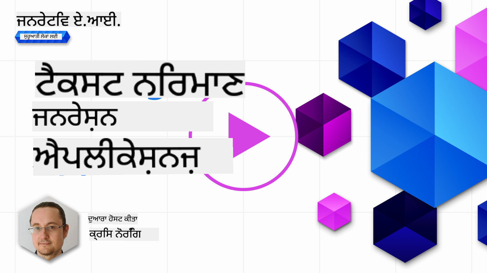

<!--
CO_OP_TRANSLATOR_METADATA:
{
  "original_hash": "5ec6c92b629564538ef397c550adb73e",
  "translation_date": "2025-05-19T16:51:54+00:00",
  "source_file": "06-text-generation-apps/README.md",
  "language_code": "pa"
}
-->
# ਟੈਕਸਟ ਜਨਰੇਸ਼ਨ ਐਪਲੀਕੇਸ਼ਨ ਬਣਾਉਣਾ

[](https://aka.ms/gen-ai-lesson6-gh?WT.mc_id=academic-105485-koreyst)

> _(ਇਸ ਪਾਠ ਦੇ ਵੀਡੀਓ ਨੂੰ ਦੇਖਣ ਲਈ ਉੱਪਰ ਦੀ ਤਸਵੀਰ 'ਤੇ ਕਲਿਕ ਕਰੋ)_

ਤੁਸੀਂ ਹੁਣ ਤੱਕ ਇਸ ਪਾਠਕ੍ਰਮ ਦੇ ਮਾਧਿਅਮ ਨਾਲ ਦੇਖਿਆ ਹੈ ਕਿ ਕੁਝ ਮੁੱਖ ਸੰਕਲਪ ਹਨ ਜਿਵੇਂ ਕਿ ਪ੍ਰੋਮਪਟ ਅਤੇ ਇੱਕ ਪੂਰੀ ਵਿਸ਼ੇਸ਼ਤਾ "ਪ੍ਰੋਮਪਟ ਇੰਜੀਨੀਅਰਿੰਗ" ਕਹੀ ਜਾਂਦੀ ਹੈ। ਬਹੁਤ ਸਾਰੇ ਸੰਦ ਜਿਨ੍ਹਾਂ ਨਾਲ ਤੁਸੀਂ ਸੰਪਰਕ ਕਰ ਸਕਦੇ ਹੋ ਜਿਵੇਂ ਕਿ ChatGPT, Office 365, Microsoft Power Platform ਅਤੇ ਹੋਰ, ਤੁਹਾਨੂੰ ਕੁਝ ਹਾਸਲ ਕਰਨ ਲਈ ਪ੍ਰੋਮਪਟ ਵਰਤਣ ਦੀ ਸਹਾਇਤਾ ਕਰਦੇ ਹਨ।

ਇੱਕ ਐਪ ਵਿੱਚ ਇਸ ਤਰ੍ਹਾਂ ਦਾ ਅਨੁਭਵ ਸ਼ਾਮਲ ਕਰਨ ਲਈ, ਤੁਹਾਨੂੰ ਪ੍ਰੋਮਪਟ, ਪੂਰਨਤਾ ਵਰਗੇ ਸੰਕਲਪਾਂ ਨੂੰ ਸਮਝਣ ਦੀ ਲੋੜ ਹੈ ਅਤੇ ਕੰਮ ਕਰਨ ਲਈ ਇੱਕ ਲਾਇਬ੍ਰੇਰੀ ਚੁਣੋ। ਇਹੀ ਹੈ ਜੋ ਤੁਸੀਂ ਇਸ ਅਧਿਆਇ ਵਿੱਚ ਸਿੱਖੋਗੇ।

## ਪ੍ਰਸਤਾਵਨਾ

ਇਸ ਅਧਿਆਇ ਵਿੱਚ, ਤੁਸੀਂ:

- openai ਲਾਇਬ੍ਰੇਰੀ ਅਤੇ ਇਸਦੇ ਮੁੱਖ ਸੰਕਲਪਾਂ ਬਾਰੇ ਸਿੱਖੋ।
- openai ਵਰਤ ਕੇ ਇੱਕ ਟੈਕਸਟ ਜਨਰੇਸ਼ਨ ਐਪ ਬਣਾਓ।
- ਟੈਕਸਟ ਜਨਰੇਸ਼ਨ ਐਪ ਬਣਾਉਣ ਲਈ ਪ੍ਰੋਮਪਟ, ਟੈਂਪਰਚਰ, ਅਤੇ ਟੋਕਨ ਵਰਗੇ ਸੰਕਲਪਾਂ ਨੂੰ ਵਰਤਣ ਦਾ ਤਰੀਕਾ ਸਮਝੋ।

## ਸਿੱਖਣ ਦੇ ਲਕਸ਼

ਇਸ ਪਾਠ ਦੇ ਅੰਤ ਵਿੱਚ, ਤੁਸੀਂ ਸਮਝਣ ਦੇ ਯੋਗ ਹੋਵੋਗੇ:

- ਟੈਕਸਟ ਜਨਰੇਸ਼ਨ ਐਪ ਕੀ ਹੈ, ਇਹ ਸਮਝਾਓ।
- openai ਵਰਤ ਕੇ ਇੱਕ ਟੈਕਸਟ ਜਨਰੇਸ਼ਨ ਐਪ ਬਣਾਓ।
- ਆਪਣੇ ਐਪ ਨੂੰ ਵਧੇਰੇ ਜਾਂ ਘੱਟ ਟੋਕਨ ਵਰਤਣ ਲਈ ਸੰਰਚਿਤ ਕਰੋ ਅਤੇ ਬਦਲਦੇ ਟੈਂਪਰਚਰ ਨਾਲ ਵੱਖ-ਵੱਖ ਨਤੀਜੇ ਲਈ।

## ਟੈਕਸਟ ਜਨਰੇਸ਼ਨ ਐਪ ਕੀ ਹੈ?

ਆਮ ਤੌਰ 'ਤੇ ਜਦੋਂ ਤੁਸੀਂ ਇੱਕ ਐਪ ਬਣਾਉਂਦੇ ਹੋ ਤਾਂ ਇਸਦਾ ਕੁਝ ਕਿਸਮ ਦਾ ਇੰਟਰਫੇਸ ਹੁੰਦਾ ਹੈ ਜਿਵੇਂ ਕਿ ਹੇਠਾਂ ਦਿੱਤਾ ਗਿਆ ਹੈ:

- ਕਮਾਂਡ-ਅਧਾਰਿਤ। ਕਨਸੋਲ ਐਪਸ ਆਮ ਤੌਰ 'ਤੇ ਐਪਸ ਹੁੰਦੀਆਂ ਹਨ ਜਿੱਥੇ ਤੁਸੀਂ ਇੱਕ ਕਮਾਂਡ ਲਿਖਦੇ ਹੋ ਅਤੇ ਇਹ ਇੱਕ ਕੰਮ ਕਰਦੀ ਹੈ। ਉਦਾਹਰਣ ਲਈ, `git` ਇੱਕ ਕਮਾਂਡ-ਅਧਾਰਿਤ ਐਪ ਹੈ।
- ਯੂਜ਼ਰ ਇੰਟਰਫੇਸ (UI)। ਕੁਝ ਐਪਸ ਵਿੱਚ ਗ੍ਰਾਫਿਕਲ ਯੂਜ਼ਰ ਇੰਟਰਫੇਸ (GUIs) ਹੁੰਦੇ ਹਨ ਜਿੱਥੇ ਤੁਸੀਂ ਬਟਨ 'ਤੇ ਕਲਿਕ ਕਰਦੇ ਹੋ, ਟੈਕਸਟ ਦਾਖਲ ਕਰਦੇ ਹੋ, ਵਿਕਲਪ ਚੁਣਦੇ ਹੋ ਅਤੇ ਹੋਰ।

### ਕਨਸੋਲ ਅਤੇ UI ਐਪਸ ਸੀਮਿਤ ਹਨ

ਇਸਨੂੰ ਇੱਕ ਕਮਾਂਡ-ਅਧਾਰਿਤ ਐਪ ਨਾਲ ਤੁਲਨਾ ਕਰੋ ਜਿੱਥੇ ਤੁਸੀਂ ਇੱਕ ਕਮਾਂਡ ਲਿਖਦੇ ਹੋ:

- **ਇਹ ਸੀਮਿਤ ਹੈ**। ਤੁਸੀਂ ਸਿਰਫ ਉਹਨਾਂ ਕਮਾਂਡਾਂ ਨੂੰ ਲਿਖ ਸਕਦੇ ਹੋ ਜੋ ਐਪ ਸਹਾਇਕ ਕਰਦਾ ਹੈ।
- **ਭਾਸ਼ਾ ਵਿਸ਼ੇਸ਼**। ਕੁਝ ਐਪਸ ਬਹੁਤ ਸਾਰੀਆਂ ਭਾਸ਼ਾਵਾਂ ਦਾ ਸਮਰਥਨ ਕਰਦੇ ਹਨ, ਪਰ ਮੂਲ ਰੂਪ ਵਿੱਚ ਐਪ ਨੂੰ ਇੱਕ ਵਿਸ਼ੇਸ਼ ਭਾਸ਼ਾ ਲਈ ਬਣਾਇਆ ਜਾਂਦਾ ਹੈ, ਭਾਵੇਂ ਤੁਸੀਂ ਹੋਰ ਭਾਸ਼ਾ ਸਮਰਥਨ ਸ਼ਾਮਲ ਕਰ ਸਕਦੇ ਹੋ।

### ਟੈਕਸਟ ਜਨਰੇਸ਼ਨ ਐਪਸ ਦੇ ਲਾਭ

ਤਾਂ ਟੈਕਸਟ ਜਨਰੇਸ਼ਨ ਐਪ ਕਿਸ ਤਰ੍ਹਾਂ ਵੱਖਰਾ ਹੈ?

ਇੱਕ ਟੈਕਸਟ ਜਨਰੇਸ਼ਨ ਐਪ ਵਿੱਚ, ਤੁਹਾਡੇ ਕੋਲ ਵਧੇਰੇ ਲਚਕਦਾਰਤਾ ਹੁੰਦੀ ਹੈ, ਤੁਸੀਂ ਕਿਸੇ ਕਮਾਂਡ ਜਾਂ ਵਿਸ਼ੇਸ਼ ਇਨਪੁਟ ਭਾਸ਼ਾ ਤੱਕ ਸੀਮਿਤ ਨਹੀਂ ਹੁੰਦੇ। ਇਸਦੀ ਬਜਾਏ, ਤੁਸੀਂ ਐਪ ਨਾਲ ਸੰਪਰਕ ਕਰਨ ਲਈ ਕੁਦਰਤੀ ਭਾਸ਼ਾ ਵਰਤ ਸਕਦੇ ਹੋ। ਇੱਕ ਹੋਰ ਲਾਭ ਇਹ ਹੈ ਕਿ ਤੁਸੀਂ ਪਹਿਲਾਂ ਹੀ ਇੱਕ ਡਾਟਾ ਸਰੋਤ ਨਾਲ ਸੰਪਰਕ ਕਰ ਰਹੇ ਹੋ ਜੋ ਬਹੁਤ ਵੱਡੇ ਜਾਣਕਾਰੀ ਦੇ ਭੰਡਾਰ 'ਤੇ ਪ੍ਰਸ਼ਿਖਿਤ ਕੀਤਾ ਗਿਆ ਹੈ, ਜਦੋਂ ਕਿ ਇੱਕ ਪਾਰੰਪਰਿਕ ਐਪ ਡਾਟਾਬੇਸ ਵਿੱਚ ਮੌਜੂਦ ਜਾਣਕਾਰੀ ਤੱਕ ਸੀਮਿਤ ਹੋ ਸਕਦਾ ਹੈ।

### ਮੈਂ ਟੈਕਸਟ ਜਨਰੇਸ਼ਨ ਐਪ ਨਾਲ ਕੀ ਬਣਾ ਸਕਦਾ ਹਾਂ?

ਕਈ ਚੀਜ਼ਾਂ ਹਨ ਜੋ ਤੁਸੀਂ ਬਣਾ ਸਕਦੇ ਹੋ। ਉਦਾਹਰਣ ਲਈ:

- **ਇੱਕ ਚੈਟਬੋਟ**। ਇੱਕ ਚੈਟਬੋਟ ਜੋ ਵੱਖ-ਵੱਖ ਵਿਸ਼ਿਆਂ ਬਾਰੇ ਸਵਾਲਾਂ ਦੇ ਜਵਾਬ ਦਿੰਦਾ ਹੈ, ਜਿਵੇਂ ਕਿ ਤੁਹਾਡੀ ਕੰਪਨੀ ਅਤੇ ਇਸਦੇ ਉਤਪਾਦਾਂ ਬਾਰੇ ਇੱਕ ਚੰਗਾ ਮੇਲ ਹੋ ਸਕਦਾ ਹੈ।
- **ਹੈਲਪਰ**। LLMs ਟੈਕਸਟ ਦਾ ਸੰਖੇਪ ਕਰਨ, ਟੈਕਸਟ ਤੋਂ ਅੰਤਰਦ੍ਰਿਸ਼ਟੀ ਪ੍ਰਾਪਤ ਕਰਨ, ਰਿਜ਼ੂਮ ਜਿਵੇਂ ਟੈਕਸਟ ਉਤਪਾਦਿਤ ਕਰਨ ਵਿੱਚ ਮਹਾਨ ਹਨ।
- **ਕੋਡ ਸਹਾਇਕ**। ਤੁਸੀਂ ਜੋ ਭਾਸ਼ਾ ਮਾਡਲ ਵਰਤਦੇ ਹੋ ਉਸ ਦੇ ਆਧਾਰ 'ਤੇ, ਤੁਸੀਂ ਇੱਕ ਕੋਡ ਸਹਾਇਕ ਬਣਾ ਸਕਦੇ ਹੋ ਜੋ ਤੁਹਾਨੂੰ ਕੋਡ ਲਿਖਣ ਵਿੱਚ ਮਦਦ ਕਰਦਾ ਹੈ। ਉਦਾਹਰਣ ਲਈ, ਤੁਸੀਂ GitHub Copilot ਜਿਵੇਂ ਉਤਪਾਦ ਨਾਲ-साथ ChatGPT ਵਰਤ ਸਕਦੇ ਹੋ ਜੋ ਤੁਹਾਨੂੰ ਕੋਡ ਲਿਖਣ ਵਿੱਚ ਮਦਦ ਕਰਦਾ ਹੈ।

## ਮੈਂ ਕਿਵੇਂ ਸ਼ੁਰੂ ਕਰ ਸਕਦਾ ਹਾਂ?

ਖੈਰ, ਤੁਹਾਨੂੰ ਇੱਕ LLM ਨਾਲ ਇਕੱਤਰ ਹੋਣ ਦਾ ਤਰੀਕਾ ਲੱਭਣ ਦੀ ਲੋੜ ਹੈ ਜੋ ਆਮ ਤੌਰ 'ਤੇ ਹੇਠਾਂ ਦਿੱਤੇ ਦੋ ਪਹੁੰਚਾਂ ਨੂੰ ਸ਼ਾਮਲ ਕਰਦਾ ਹੈ:

- ਇੱਕ API ਵਰਤੋ। ਇੱਥੇ ਤੁਸੀਂ ਆਪਣਾ ਪ੍ਰੋਮਪਟ ਬਣਾਉਣ ਦੇ ਨਾਲ ਵੈੱਬ ਬੇਨਤੀ ਕਰਦੇ ਹੋ ਅਤੇ ਵਾਪਸ ਜਨਰੇਟ ਕੀਤਾ ਟੈਕਸਟ ਪ੍ਰਾਪਤ ਕਰਦੇ ਹੋ।
- ਇੱਕ ਲਾਇਬ੍ਰੇਰੀ ਵਰਤੋ। ਲਾਇਬ੍ਰੇਰੀਆਂ API ਕਾਲਾਂ ਨੂੰ ਘੇਰੀ ਹੋਈ ਸਹਾਇਕ ਕਰਦੀਆਂ ਹਨ ਅਤੇ ਉਹਨਾਂ ਨੂੰ ਵਰਤਣ ਲਈ ਆਸਾਨ ਬਣਾਉਂਦੀਆਂ ਹਨ।

## ਲਾਇਬ੍ਰੇਰੀ/SDKs

LLMs ਨਾਲ ਕੰਮ ਕਰਨ ਲਈ ਕੁਝ ਜਾਣੇ-ਪਛਾਣੇ ਲਾਇਬ੍ਰੇਰੀ ਹਨ ਜਿਵੇਂ ਕਿ:

- **openai**, ਇਹ ਲਾਇਬ੍ਰੇਰੀ ਤੁਹਾਡੇ ਮਾਡਲ ਨਾਲ ਜੁੜਨ ਅਤੇ ਪ੍ਰੋਮਪਟ ਭੇਜਣ ਲਈ ਆਸਾਨੀ ਪ੍ਰਦਾਨ ਕਰਦੀ ਹੈ।

ਫਿਰ ਕੁਝ ਲਾਇਬ੍ਰੇਰੀਆਂ ਹਨ ਜੋ ਇੱਕ ਉੱਚ ਪੱਧਰ 'ਤੇ ਕੰਮ ਕਰਦੀਆਂ ਹਨ ਜਿਵੇਂ ਕਿ:

- **Langchain**। Langchain ਜਾਣਿਆ ਜਾਂਦਾ ਹੈ ਅਤੇ Python ਦਾ ਸਮਰਥਨ ਕਰਦਾ ਹੈ।
- **Semantic Kernel**। Semantic Kernel Microsoft ਦੁਆਰਾ ਇੱਕ ਲਾਇਬ੍ਰੇਰੀ ਹੈ ਜੋ C#, Python, ਅਤੇ Java ਭਾਸ਼ਾਵਾਂ ਦਾ ਸਮਰਥਨ ਕਰਦਾ ਹੈ।

## openai ਵਰਤ ਕੇ ਪਹਿਲਾ ਐਪ

ਚਲੋ ਦੇਖੀਏ ਕਿ ਅਸੀਂ ਆਪਣਾ ਪਹਿਲਾ ਐਪ ਕਿਵੇਂ ਬਣਾਉਣ ਦੇ, ਕਿਹੜੀਆਂ ਲਾਇਬ੍ਰੇਰੀਆਂ ਦੀ ਲੋੜ ਹੈ, ਕਿੰਨਾ ਜ਼ਰੂਰੀ ਹੈ ਅਤੇ ਹੋਰ।

### openai ਇੰਸਟਾਲ ਕਰੋ

OpenAI ਜਾਂ Azure OpenAI ਨਾਲ ਸੰਪਰਕ ਕਰਨ ਲਈ ਬਹੁਤ ਸਾਰੀਆਂ ਲਾਇਬ੍ਰੇਰੀਆਂ ਹਨ। ਕਈ ਪ੍ਰੋਗਰਾਮਿੰਗ ਭਾਸ਼ਾਵਾਂ ਵਰਤਣਾ ਵੀ ਸੰਭਵ ਹੈ ਜਿਵੇਂ ਕਿ C#, Python, JavaScript, Java ਅਤੇ ਹੋਰ। ਅਸੀਂ `openai` Python ਲਾਇਬ੍ਰੇਰੀ ਦੀ ਚੋਣ ਕੀਤੀ ਹੈ, ਇਸ ਲਈ ਅਸੀਂ `pip` ਨੂੰ ਇੰਸਟਾਲ ਕਰਨ ਲਈ ਵਰਤਾਂਗੇ।

```bash
pip install openai
```

### ਇੱਕ ਸਰੋਤ ਬਣਾਓ

ਤੁਹਾਨੂੰ ਹੇਠਾਂ ਦਿੱਤੇ ਕਦਮ ਕਰਨ ਦੀ ਲੋੜ ਹੈ:

- Azure 'ਤੇ ਇੱਕ ਖਾਤਾ ਬਣਾਓ [https://azure.microsoft.com/free/](https://azure.microsoft.com/free/?WT.mc_id=academic-105485-koreyst)।
- Azure OpenAI 'ਤੇ ਪਹੁੰਚ ਪ੍ਰਾਪਤ ਕਰੋ। [https://learn.microsoft.com/azure/ai-services/openai/overview#how-do-i-get-access-to-azure-openai](https://learn.microsoft.com/azure/ai-services/openai/overview#how-do-i-get-access-to-azure-openai?WT.mc_id=academic-105485-koreyst) 'ਤੇ ਜਾਓ ਅਤੇ ਪਹੁੰਚ ਲਈ ਬੇਨਤੀ ਕਰੋ।

  > [!NOTE]
  > ਲਿਖਣ ਦੇ ਸਮੇਂ, ਤੁਹਾਨੂੰ Azure OpenAI 'ਤੇ ਪਹੁੰਚ ਲਈ ਅਰਜ਼ੀ ਦੇਣੀ ਪੈਦੀ ਹੈ।

- Python ਇੰਸਟਾਲ ਕਰੋ <https://www.python.org/>
- ਇੱਕ Azure OpenAI Service ਸਰੋਤ ਬਣਾਇਆ ਹੋਇਆ ਹੈ। ਇਹ ਗਾਈਡ ਦੇਖੋ ਕਿ [ਸਰੋਤ ਕਿਵੇਂ ਬਣਾਇਆ ਜਾਵੇ](https://learn.microsoft.com/azure/ai-services/openai/how-to/create-resource?pivots=web-portal?WT.mc_id=academic-105485-koreyst)।

### API ਕੁੰਜੀ ਅਤੇ ਐਂਡਪੋਇੰਟ ਖੋਜੋ

ਇਸ ਸਮੇਂ, ਤੁਹਾਨੂੰ ਆਪਣੀ `openai` ਲਾਇਬ੍ਰੇਰੀ ਨੂੰ ਦੱਸਣ ਦੀ ਲੋੜ ਹੈ ਕਿ ਕਿਹੜੀ API ਕੁੰਜੀ ਵਰਤਣੀ ਹੈ। ਆਪਣੀ API ਕੁੰਜੀ ਲੱਭਣ ਲਈ, ਆਪਣੇ Azure OpenAI ਸਰੋਤ ਦੇ "Keys and Endpoint" ਭਾਗ 'ਤੇ ਜਾਓ ਅਤੇ "Key 1" ਮੁੱਲ ਨੂੰ ਕਾਪੀ ਕਰੋ।


ਹੁਣ ਕਿ ਤੁਸੀਂ ਇਹ ਜਾਣਕਾਰੀ ਕਾਪੀ ਕਰ ਲਈ ਹੈ, ਚਲੋ ਲਾਇਬ੍ਰੇਰੀਆਂ ਨੂੰ ਇਸ ਨੂੰ ਵਰਤਣ ਲਈ ਸੂਚਿਤ ਕਰਦੇ ਹਾਂ।

> [!NOTE]
> ਆਪਣੀ API ਕੁੰਜੀ ਨੂੰ ਆਪਣੇ ਕੋਡ ਤੋਂ ਵੱਖ ਕਰਨਾ ਮੁੱਲਵਾਨ ਹੈ। ਤੁਸੀਂ ਵਾਤਾਵਰਣ ਚਰਾਂ ਦਾ ਉਪਯੋਗ ਕਰਕੇ ਇਹ ਕਰ ਸਕਦੇ ਹੋ।
>
> - ਵਾਤਾਵਰਣ ਚਰ `OPENAI_API_KEY` to your API key.
>   `export OPENAI_API_KEY='sk-...'` ਸੈਟ ਕਰੋ।

### Azure ਸੰਰਚਨਾ ਸੈਟਅੱਪ

ਜੇਕਰ ਤੁਸੀਂ Azure OpenAI ਵਰਤ ਰਹੇ ਹੋ, ਤਾਂ ਇੱਥੇ ਹੈ ਕਿ ਤੁਸੀਂ ਸੰਰਚਨਾ ਕਿਵੇਂ ਸੈਟਅੱਪ ਕਰਦੇ ਹੋ:

```python
openai.api_type = 'azure'
openai.api_key = os.environ["OPENAI_API_KEY"]
openai.api_version = '2023-05-15'
openai.api_base = os.getenv("API_BASE")
```

ਉਪਰ ਹੇਠਾਂ ਦਿੱਤਾ ਗਿਆ ਹੈ:

- `api_type` to `azure`. This tells the library to use Azure OpenAI and not OpenAI.
- `api_key`, this is your API key found in the Azure Portal.
- `api_version`, this is the version of the API you want to use. At the time of writing, the latest version is `2023-05-15`.
- `api_base`, this is the endpoint of the API. You can find it in the Azure Portal next to your API key.

> [!NOTE] > `os.getenv` is a function that reads environment variables. You can use it to read environment variables like `OPENAI_API_KEY` and `API_BASE`. Set these environment variables in your terminal or by using a library like `dotenv`.

## Generate text

The way to generate text is to use the `Completion` ਕਲਾਸ। ਇਹਦਾ ਉਦਾਹਰਣ:

```python
prompt = "Complete the following: Once upon a time there was a"

completion = openai.Completion.create(model="davinci-002", prompt=prompt)
print(completion.choices[0].text)
```

ਉਪਰੋਕਤ ਕੋਡ ਵਿੱਚ, ਅਸੀਂ ਇੱਕ ਪੂਰਨਤਾ ਵਸਤੂ ਬਣਾਉਂਦੇ ਹਾਂ ਅਤੇ ਮਾਡਲ ਅਤੇ ਪ੍ਰੋਮਪਟ ਪਾਸ ਕਰਦੇ ਹਾਂ। ਫਿਰ ਅਸੀਂ ਜਨਰੇਟ ਕੀਤਾ ਟੈਕਸਟ ਪ੍ਰਿੰਟ ਕਰਦੇ ਹਾਂ।

### ਚੈਟ ਪੂਰਨਤਾ

ਹੁਣ ਤੱਕ, ਤੁਸੀਂ ਦੇਖਿਆ ਹੈ ਕਿ ਅਸੀਂ `Completion` to generate text. But there's another class called `ChatCompletion` ਵਰਤ ਰਹੇ ਹਾਂ ਜੋ ਚੈਟਬੋਟਸ ਲਈ ਜ਼ਿਆਦਾ ਸੁਹਜ ਹੈ। ਇਸਦਾ ਉਦਾਹਰਣ:

```python
import openai

openai.api_key = "sk-..."

completion = openai.ChatCompletion.create(model="gpt-3.5-turbo", messages=[{"role": "user", "content": "Hello world"}])
print(completion.choices[0].message.content)
```

ਇਸ ਵਿਸ਼ੇਸ਼ਤਾ 'ਤੇ ਹੋਰ ਇੱਕ ਆਉਣ ਵਾਲੇ ਅਧਿਆਇ ਵਿੱਚ।

## ਅਭਿਆਸ - ਆਪਣਾ ਪਹਿਲਾ ਟੈਕਸਟ ਜਨਰੇਸ਼ਨ ਐਪ

ਹੁਣ ਕਿ ਅਸੀਂ ਸਿੱਖਿਆ ਕਿ openai ਨੂੰ ਕਿਵੇਂ ਸੈਟਅੱਪ ਅਤੇ ਸੰਰਚਿਤ ਕਰਨਾ ਹੈ, ਇਹ ਸਮਾਂ ਹੈ ਕਿ ਆਪਣਾ ਪਹਿਲਾ ਟੈਕਸਟ ਜਨਰੇਸ਼ਨ ਐਪ ਬਣਾਉਣ ਦਾ। ਆਪਣਾ ਐਪ ਬਣਾਉਣ ਲਈ, ਇਹ ਕਦਮ ਕਰੋ:

1. ਇੱਕ ਵਰਚੁਅਲ ਵਾਤਾਵਰਣ ਬਣਾਓ ਅਤੇ openai ਇੰਸਟਾਲ ਕਰੋ:

   ```bash
   python -m venv venv
   source venv/bin/activate
   pip install openai
   ```

   > [!NOTE]
   > ਜੇਕਰ ਤੁਸੀਂ Windows ਵਰਤ ਰਹੇ ਹੋ ਤਾਂ `venv\Scripts\activate` instead of `source venv/bin/activate`.

   > [!NOTE]
   > Locate your Azure OpenAI key by going to [https://portal.azure.com/](https://portal.azure.com/?WT.mc_id=academic-105485-koreyst) and search for `Open AI` and select the `Open AI resource` and then select `Keys and Endpoint` and copy the `Key 1` ਮੁੱਲ ਲਿਖੋ।

1. ਇੱਕ _app.py_ ਫਾਈਲ ਬਣਾਓ ਅਤੇ ਇਸ ਵਿੱਚ ਹੇਠਾਂ ਦਿੱਤਾ ਕੋਡ ਦਿਓ:

   ```python
   import openai

   openai.api_key = "<replace this value with your open ai key or Azure OpenAI key>"

   openai.api_type = 'azure'
   openai.api_version = '2023-05-15'
   openai.api_base = "<endpoint found in Azure Portal where your API key is>"
   deployment_name = "<deployment name>"

   # add your completion code
   prompt = "Complete the following: Once upon a time there was a"
   messages = [{"role": "user", "content": prompt}]

   # make completion
   completion = openai.chat.completions.create(model=deployment_name, messages=messages)

   # print response
   print(completion.choices[0].message.content)
   ```

   > [!NOTE]
   > ਜੇਕਰ ਤੁਸੀਂ Azure OpenAI ਵਰਤ ਰਹੇ ਹੋ, ਤਾਂ ਤੁਹਾਨੂੰ `api_type` to `azure` and set the `api_key` ਨੂੰ ਆਪਣੇ Azure OpenAI ਕੁੰਜੀ ਨਾਲ ਸੈਟ ਕਰਨ ਦੀ ਲੋੜ ਹੈ।

   ਤੁਹਾਨੂੰ ਹੇਠਾਂ ਦਿੱਤੇ ਜਿਵੇਂ ਨਤੀਜੇ ਦੇਖਣੇ ਚਾਹੀਦੇ ਹਨ:

   ```output
    very unhappy _____.

   Once upon a time there was a very unhappy mermaid.
   ```

## ਵੱਖ-ਵੱਖ ਚੀਜ਼ਾਂ ਲਈ ਵੱਖ-ਵੱਖ ਕਿਸਮ ਦੇ ਪ੍ਰੋਮਪਟ

ਹੁਣ ਤੁਸੀਂ ਦੇਖਿਆ ਹੈ ਕਿ ਇੱਕ ਪ੍ਰੋਮਪਟ ਵਰਤ ਕੇ ਟੈਕਸਟ ਕਿਵੇਂ ਜਨਰੇਟ ਕਰਨਾ ਹੈ। ਤੁਹਾਡੇ ਕੋਲ ਇੱਕ ਪ੍ਰੋਗਰਾਮ ਹੈ ਜੋ ਚਲ ਰਿਹਾ ਹੈ ਜੋ ਤੁਸੀਂ ਵੱਖ-ਵੱਖ ਕਿਸਮ ਦੇ ਟੈਕਸਟ ਜਨਰੇਟ ਕਰਨ ਲਈ ਸੋਧ ਅਤੇ ਬਦਲ ਸਕਦੇ ਹੋ।

ਪ੍ਰੋਮਪਟ ਵੱਖ-ਵੱਖ ਕੰਮਾਂ ਲਈ ਵਰਤੇ ਜਾ ਸਕਦੇ ਹਨ। ਉਦਾਹਰਣ ਲਈ:

- **ਟੈਕਸਟ ਦੀ ਕਿਸਮ ਜਨਰੇਟ ਕਰੋ**। ਉਦਾਹਰਣ ਲਈ, ਤੁਸੀਂ ਇੱਕ ਕਵਿਤਾ, ਇੱਕ ਕਵਿਜ਼ ਲਈ ਸਵਾਲ ਆਦਿ ਜਨਰੇਟ ਕਰ ਸਕਦੇ ਹੋ।
- **ਜਾਣਕਾਰੀ ਲੁਕਾਓ**। ਤੁਸੀਂ ਜਾਣਕਾਰੀ ਲੱਭਣ ਲਈ ਪ੍ਰੋਮਪਟ ਵਰਤ ਸਕਦੇ ਹੋ ਜਿਵੇਂ ਕਿ ਹੇਠਾਂ ਦਿੱਤਾ ਉਦਾਹਰਣ 'What does CORS mean in web development?'।
- **ਕੋਡ ਜਨਰੇਟ ਕਰੋ**। ਤੁਸੀਂ ਕੋਡ ਜਨਰੇਟ ਕਰਨ ਲਈ ਪ੍ਰੋਮਪਟ ਵਰਤ ਸਕਦੇ ਹੋ, ਉਦਾਹਰਣ ਲਈ ਇਮੇਲ ਨੂੰ ਸਤਾਵਾਂ ਕਰਨ ਲਈ ਵਰਤੀ ਜਾਣ ਵਾਲੀ ਇੱਕ ਨਿਯਮਤ ਅਭਿਵੈਕਤੀ ਵਿਕਸਿਤ ਕਰਨਾ ਜਾਂ ਕਿਉਂਕਿ ਇੱਕ ਪੂਰਾ ਪ੍ਰੋਗਰਾਮ ਜਨਰੇਟ ਕਰਨਾ, ਜਿਵੇਂ ਕਿ ਇੱਕ ਵੈੱਬ ਐਪ?

## ਇੱਕ ਹੋਰ ਵਿਅਵਹਾਰਿਕ ਉਪਯੋਗਤਾ: ਇੱਕ ਰੇਸਿਪੀ ਜਨਰੇਟਰ

ਕਲਪਨਾ ਕਰੋ ਕਿ ਤੁਹਾਡੇ ਕੋਲ ਘਰ ਵਿੱਚ ਸਮੱਗਰੀ ਹੈ ਅਤੇ ਤੁਸੀਂ ਕੁਝ ਪਕਾਉਣਾ ਚਾਹੁੰਦੇ ਹੋ। ਇਸ ਲਈ, ਤੁਹਾਨੂੰ ਇੱਕ ਰੇਸਿਪੀ ਦੀ ਲੋੜ ਹੈ। ਰੇਸਿਪੀਆਂ ਲੱਭਣ ਦਾ ਇੱਕ ਤਰੀਕਾ ਇੱਕ ਖੋਜ ਇੰਜਣ ਨੂੰ ਵਰਤਣਾ ਹੈ ਜਾਂ ਤੁਸੀਂ ਇਸ ਲਈ ਇੱਕ LLM ਵਰਤ ਸਕਦੇ ਹੋ।

ਤੁਸੀਂ ਹੇਠਾਂ ਦਿੱਤਾ ਪ੍ਰੋਮਪਟ ਲਿਖ ਸਕਦੇ ਹੋ:

> "ਮੈਨੂੰ ਹੇਠਾਂ ਦਿੱਤੀ ਸਮੱਗਰੀ ਨਾਲ ਇਕ ਪਕਵਾਨ ਲਈ 5 ਰੇਸਿਪੀਆਂ ਦਿਖਾਓ: ਚਿਕਨ, ਆਲੂ, ਅਤੇ ਗਾਜਰ। ਪ੍ਰਤੀ ਰੇਸਿਪੀ, ਵਰਤੀ ਸਮੱਗਰੀ ਦੀ ਸੂਚੀ ਦਿਓ"

ਉਪਰੋਕਤ ਪ੍ਰੋਮਪਟ ਦੇ ਨਾਲ, ਤੁਹਾਨੂੰ ਇਸਦੇ ਜਿਵੇਂ ਜਵਾਬ ਮਿਲ ਸਕਦਾ ਹੈ:

```output
1. Roasted Chicken and Vegetables:
Ingredients:
- 4 chicken thighs
- 2 potatoes, cut into cubes
- 2 carrots, cut into cubes
- 2 tablespoons olive oil
- 2 cloves garlic, minced
- 1 teaspoon dried thyme
- 1 teaspoon dried oregano
- Salt and pepper, to taste

2. Chicken and Potato Stew:
Ingredients:
- 2 tablespoons olive oil
- 1 onion, diced
- 2 cloves garlic, minced
- 2 chicken breasts, cut into cubes
- 2 potatoes, cut into cubes
- 2 carrots, cut into cubes
- 1 teaspoon dried oregano
- 1 teaspoon dried thyme
- 1 cup chicken broth
- Salt and pepper, to taste

3. Chicken and Potato Bake:
Ingredients:
- 2 tablespoons olive oil
- 2 chicken breasts, cut into cubes
- 2 potatoes, cut into cubes
- 2 carrots, cut into cubes
- 1 onion, diced
- 2 cloves garlic, minced
- 1 teaspoon dried oregano
- 1 teaspoon dried thyme
- 1 cup chicken broth
- Salt and pepper, to taste

4. Chicken and Potato Soup:
Ingredients:
- 2 tablespoons olive oil
- 1 onion, diced
- 2 cloves garlic, minced
- 2 chicken breasts, cut into cubes
- 2 potatoes, cut into cubes
- 2 carrots, cut into cubes
- 1 teaspoon dried oregano
- 1 teaspoon dried thyme
- 4 cups chicken broth
- Salt and pepper, to taste

5. Chicken and Potato Hash:
Ingredients:
- 2 tablespoons olive oil
- 2 chicken breasts, cut into cubes
- 2 potatoes, cut into cubes
- 2 carrots, cut into cubes
- 1 onion, diced
- 2 cloves garlic, minced
- 1 teaspoon dried oregano
```

ਇਹ ਨਤੀਜਾ ਬਹੁਤ ਵਧੀਆ ਹੈ, ਮੈਨੂੰ ਪਕਾਉਣ ਲਈ ਪਤਾ ਹੈ। ਇਸ ਸਮੇਂ, ਕੀ ਕਾਰਗਰ ਸੁਧਾਰਾਂ ਹੋ ਸਕਦੇ ਹਨ:

- ਉਹ ਸਮੱਗਰੀ ਹਟਾਉਣਾ ਜੋ ਮੈਨੂੰ ਪਸੰਦ ਨਹੀਂ ਹੈ ਜਾਂ ਜਿਸ ਨਾਲ ਮੈਂ الرجਿਕ ਹਾਂ।
- ਇੱਕ ਖਰੀਦਦਾਰੀ ਸੂਚੀ ਬਣਾਓ, ਜੇਕਰ ਮੇਰੇ ਕੋਲ ਸਾਰੇ ਸਮੱਗਰੀ ਘਰ ਵਿੱਚ ਨਹੀਂ ਹਨ।

ਉਪਰੋਕਤ ਮਾਮਲਿਆਂ ਲਈ, ਆਓ ਇੱਕ ਹੋਰ ਪ੍ਰੋਮਪਟ ਸ਼ਾਮਲ ਕਰਦੇ ਹਾਂ:

> "ਕਿਰਪਾ ਕਰਕੇ ਲਸਣ ਵਾਲੀਆਂ ਰੇਸਿਪੀਆਂ ਨੂੰ ਹਟਾਓ ਕਿਉਂਕਿ ਮੈਂ ਇਸ ਨਾਲ الرجਿਕ ਹਾਂ ਅਤੇ ਇਸ ਨੂੰ ਕੁਝ ਹੋਰ ਨਾਲ ਬਦਲੋ। ਸਾਰੇ ਰੇਸਿਪੀਆਂ ਲਈ ਇੱਕ ਖਰੀਦਦਾਰੀ ਸੂਚੀ ਬਣਾਓ, ਇਹ ਧ

**ਅਸਵੀਕਰਤਾ**:  
ਇਹ ਦਸਤਾਵੇਜ਼ AI ਅਨੁਵਾਦ ਸੇਵਾ [Co-op Translator](https://github.com/Azure/co-op-translator) ਦੀ ਵਰਤੋਂ ਕਰਕੇ ਅਨੁਵਾਦ ਕੀਤਾ ਗਿਆ ਹੈ। ਜਦੋਂ ਕਿ ਅਸੀਂ ਸਹੀਅਤ ਲਈ ਯਤਨਸ਼ੀਲ ਹਾਂ, ਕਿਰਪਾ ਕਰਕੇ ਧਿਆਨ ਦਿਓ ਕਿ ਸਵੈਚਾਲਿਤ ਅਨੁਵਾਦਾਂ ਵਿੱਚ ਗਲਤੀਆਂ ਜਾਂ ਅਸੁਣਤੀਆਂ ਹੋ ਸਕਦੀਆਂ ਹਨ। ਇਸਦੀ ਮੂਲ ਭਾਸ਼ਾ ਵਿੱਚ ਮੂਲ ਦਸਤਾਵੇਜ਼ ਨੂੰ ਅਧਿਕਾਰਤ ਸਰੋਤ ਮੰਨਿਆ ਜਾਣਾ ਚਾਹੀਦਾ ਹੈ। ਮਹੱਤਵਪੂਰਨ ਜਾਣਕਾਰੀ ਲਈ, ਪੇਸ਼ੇਵਰ ਮਨੁੱਖੀ ਅਨੁਵਾਦ ਦੀ ਸਿਫਾਰਸ਼ ਕੀਤੀ ਜਾਂਦੀ ਹੈ। ਇਸ ਅਨੁਵਾਦ ਦੇ ਵਰਤੋਂ ਤੋਂ ਪੈਦਾ ਹੋਣ ਵਾਲੀਆਂ ਕਿਸੇ ਵੀ ਗਲਤਫਹਿਮੀਆਂ ਜਾਂ ਗਲਤ ਵਿਆਖਿਆਵਾਂ ਲਈ ਅਸੀਂ ਜ਼ਿੰਮੇਵਾਰ ਨਹੀਂ ਹਾਂ।