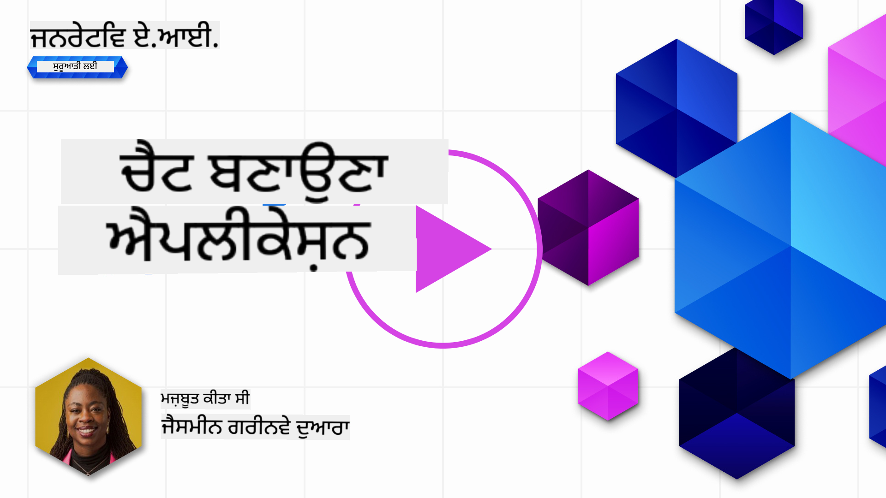
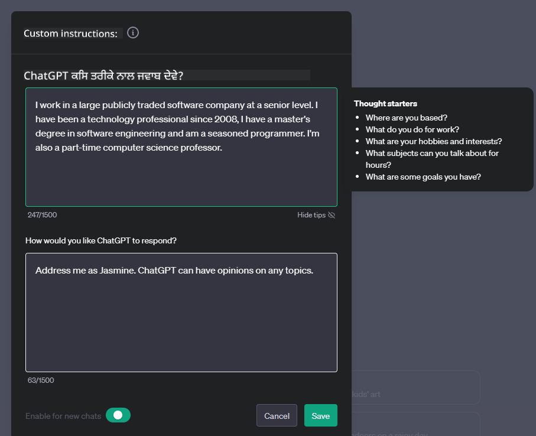

<!--
CO_OP_TRANSLATOR_METADATA:
{
  "original_hash": "ea4bbe640847aafbbba14dae4625e9af",
  "translation_date": "2025-05-19T17:45:53+00:00",
  "source_file": "07-building-chat-applications/README.md",
  "language_code": "pa"
}
-->
# ਜਨਰੇਟਿਵ AI-ਚਲਿਤ ਚੈਟ ਐਪਲੀਕੇਸ਼ਨ ਬਣਾਉਣਾ

[](https://aka.ms/gen-ai-lessons7-gh?WT.mc_id=academic-105485-koreyst)

> _(ਇਸ ਪਾਠ ਦੇ ਵੀਡੀਓ ਨੂੰ ਵੇਖਣ ਲਈ ਉਪਰੋਕਤ ਚਿੱਤਰ 'ਤੇ ਕਲਿੱਕ ਕਰੋ)_

ਹੁਣ ਜਦੋਂ ਕਿ ਅਸੀਂ ਵੇਖ ਚੁੱਕੇ ਹਾਂ ਕਿ ਅਸੀਂ ਟੈਕਸਟ-ਜਨਰੇਸ਼ਨ ਐਪਸ ਕਿਵੇਂ ਬਣਾ ਸਕਦੇ ਹਾਂ, ਆਓ ਚੈਟ ਐਪਲੀਕੇਸ਼ਨਾਂ ਵਿੱਚ ਝਾਤ ਮਾਰਦੇ ਹਾਂ।

ਚੈਟ ਐਪਲੀਕੇਸ਼ਨ ਸਾਡੇ ਰੋਜ਼ਾਨਾ ਜੀਵਨ ਦਾ ਹਿੱਸਾ ਬਣ ਗਏ ਹਨ, ਜੋ ਸਿਰਫ ਆਮ ਗੱਲਬਾਤ ਦਾ ਮਾਧਿਅਮ ਨਹੀਂ ਹਨ। ਇਹ ਗਾਹਕ ਸੇਵਾ, ਤਕਨੀਕੀ ਸਹਾਇਤਾ, ਅਤੇ ਇੱਥੋਂ ਤੱਕ ਕਿ ਉੱਚ-ਦਰਜੇ ਦੇ ਸਲਾਹਕਾਰ ਪ੍ਰਣਾਲੀਆਂ ਦੇ ਅਹਿਮ ਹਿੱਸੇ ਹਨ। ਇਹ ਸੰਭਵ ਹੈ ਕਿ ਤੁਹਾਨੂੰ ਹਾਲ ਹੀ ਵਿੱਚ ਕਿਸੇ ਚੈਟ ਐਪਲੀਕੇਸ਼ਨ ਤੋਂ ਕੁਝ ਮਦਦ ਮਿਲੀ ਹੋਵੇ। ਜਿਵੇਂ ਜਿਵੇਂ ਅਸੀਂ ਜਨਰੇਟਿਵ AI ਵਰਗੀਆਂ ਅਗੇਤਰਨ ਤਕਨਾਲੋਜੀਆਂ ਨੂੰ ਇਨ੍ਹਾਂ ਪਲੇਟਫਾਰਮਾਂ ਵਿੱਚ ਸ਼ਾਮਲ ਕਰਦੇ ਹਾਂ, ਜਟਿਲਤਾ ਵੱਧਦੀ ਹੈ ਅਤੇ ਇਸੇ ਤਰ੍ਹਾਂ ਚੁਣੌਤੀਆਂ ਵੀ ਵੱਧਦੀਆਂ ਹਨ।

ਕੁਝ ਸਵਾਲ ਜਿਨ੍ਹਾਂ ਦੇ ਜਵਾਬ ਲੱਭਣ ਦੀ ਲੋੜ ਹੈ:

- **ਐਪ ਬਣਾਉਣਾ**. ਸਪੇਸ਼ਲ ਵਰਤੋਂ ਦੇ ਕੇਸਾਂ ਲਈ ਇਨ੍ਹਾਂ AI-ਚਲਿਤ ਐਪਲੀਕੇਸ਼ਨਾਂ ਨੂੰ ਕਿਵੇਂ ਕੁਸ਼ਲਤਾ ਨਾਲ ਬਣਾਇਆ ਅਤੇ ਬੇਤਰਤੀਬੀ ਨਾਲ ਇਕੱਠਾ ਕੀਤਾ ਜਾ ਸਕਦਾ ਹੈ?
- **ਨਿਗਰਾਨੀ**. ਇਕ ਵਾਰ ਤੈਨਾਤ ਹੋਣ 'ਤੇ, ਅਸੀਂ ਕਿਵੇਂ ਨਿਗਰਾਨੀ ਕਰ ਸਕਦੇ ਹਾਂ ਅਤੇ ਇਹ ਸੁਨਿਸ਼ਚਿਤ ਕਰ ਸਕਦੇ ਹਾਂ ਕਿ ਐਪਲੀਕੇਸ਼ਨ ਸਭ ਤੋਂ ਉੱਚ ਗੁਣਵੱਤਾ ਦੇ ਸਥਰ 'ਤੇ ਕੰਮ ਕਰ ਰਹੇ ਹਨ, ਦੋਨੋਂ ਕਾਰਗੁਜ਼ਾਰੀ ਦੇ ਮਾਮਲੇ ਵਿੱਚ ਅਤੇ [ਜ਼ਿੰਮੇਵਾਰ AI ਦੇ ਛੇ ਸਿਧਾਂਤਾਂ](https://www.microsoft.com/ai/responsible-ai?WT.mc_id=academic-105485-koreyst) ਦੀ ਪਾਲਣਾ ਕਰਦੇ ਹੋਏ?

ਜਿਵੇਂ ਜਿਵੇਂ ਅਸੀਂ ਇੱਕ ਉਮਰ ਵੱਲ ਵੱਧ ਰਹੇ ਹਾਂ ਜੋ ਆਟੋਮੇਸ਼ਨ ਅਤੇ ਬੇਤਰਤੀਬੀ ਮਨੁੱਖ-ਮਸ਼ੀਨ ਅੰਤਰਕ੍ਰਿਆਵਾਂ ਦੁਆਰਾ ਨਿਰਧਾਰਿਤ ਹੈ, ਜਨਰੇਟਿਵ AI ਚੈਟ ਐਪਲੀਕੇਸ਼ਨਾਂ ਦੀ ਗੁੰਜਾਈਸ਼, ਗਹਿਰਾਈ, ਅਤੇ ਅਨੁਕੂਲਤਾ ਨੂੰ ਕਿਵੇਂ ਬਦਲਦਾ ਹੈ, ਇਹ ਸਮਝਣਾ ਜਰੂਰੀ ਹੋ ਜਾਂਦਾ ਹੈ। ਇਹ ਪਾਠ ਉਨ੍ਹਾਂ ਜਟਿਲ ਪ੍ਰਣਾਲੀਆਂ ਦਾ ਸਮਰਥਨ ਕਰਨ ਵਾਲੇ ਆਰਕੀਟੈਕਚਰ ਦੇ ਪੱਖਾਂ ਦੀ ਜਾਂਚ ਕਰੇਗਾ, ਉਨ੍ਹਾਂ ਨੂੰ ਖੇਤਰ-ਵਿਸ਼ੇਸ਼ ਕੰਮਾਂ ਲਈ ਸੁਧਾਰਨ ਦੇ ਤਰੀਕਿਆਂ ਵਿੱਚ ਡੁੱਬੇਗਾ, ਅਤੇ ਜ਼ਿੰਮੇਵਾਰ AI ਤੈਨਾਤੀ ਨੂੰ ਸੁਨਿਸ਼ਚਿਤ ਕਰਨ ਲਈ ਪ੍ਰਸੰਗਿਕ ਮੈਟ੍ਰਿਕਸ ਅਤੇ ਵਿਚਾਰਧਾਰਾਵਾਂ ਦਾ ਮੁਲਾਂਕਣ ਕਰੇਗਾ।

## ਜਾਣ ਪਛਾਣ

ਇਹ ਪਾਠ ਕਵਰ ਕਰਦਾ ਹੈ:

- ਚੈਟ ਐਪਲੀਕੇਸ਼ਨਾਂ ਨੂੰ ਕੁਸ਼ਲਤਾ ਨਾਲ ਬਣਾਉਣ ਅਤੇ ਇਕੱਠਾ ਕਰਨ ਦੀਆਂ ਤਕਨੀਕਾਂ।
- ਐਪਲੀਕੇਸ਼ਨਾਂ 'ਤੇ ਕਸਟਮਾਈਜ਼ੇਸ਼ਨ ਅਤੇ ਸੁਧਾਰਨ ਕਿਵੇਂ ਲਾਗੂ ਕਰਨਾ ਹੈ।
- ਚੈਟ ਐਪਲੀਕੇਸ਼ਨਾਂ ਦੀ ਕੁਸ਼ਲਤਾ ਨਾਲ ਨਿਗਰਾਨੀ ਕਰਨ ਲਈ ਰਣਨੀਤੀਆਂ ਅਤੇ ਵਿਚਾਰਧਾਰਾਵਾਂ।

## ਸਿੱਖਣ ਦੇ ਉਦੇਸ਼

ਇਸ ਪਾਠ ਦੇ ਅੰਤ ਤੱਕ, ਤੁਸੀਂ ਸਮਰੱਥ ਹੋ ਜਾਵੋਗੇ:

- ਮੌਜੂਦਾ ਪ੍ਰਣਾਲੀਆਂ ਵਿੱਚ ਚੈਟ ਐਪਲੀਕੇਸ਼ਨਾਂ ਨੂੰ ਬਣਾਉਣ ਅਤੇ ਇਕੱਠਾ ਕਰਨ ਲਈ ਵਿਚਾਰਧਾਰਾਵਾਂ ਦਾ ਵਰਣਨ ਕਰੋ।
- ਖਾਸ ਵਰਤੋਂ ਦੇ ਕੇਸਾਂ ਲਈ ਚੈਟ ਐਪਲੀਕੇਸ਼ਨਾਂ ਨੂੰ ਕਸਟਮਾਈਜ਼ ਕਰੋ।
- AI-ਚਲਿਤ ਚੈਟ ਐਪਲੀਕੇਸ਼ਨਾਂ ਦੀ ਗੁਣਵੱਤਾ ਨੂੰ ਕੁਸ਼ਲਤਾ ਨਾਲ ਨਿਗਰਾਨੀ ਕਰਨ ਅਤੇ ਰੱਖਣ ਲਈ ਕੁੰਜੀ ਮੈਟ੍ਰਿਕਸ ਅਤੇ ਵਿਚਾਰਧਾਰਾਵਾਂ ਦੀ ਪਛਾਣ ਕਰੋ।
- ਇਹ ਸੁਨਿਸ਼ਚਿਤ ਕਰੋ ਕਿ ਚੈਟ ਐਪਲੀਕੇਸ਼ਨ ਜ਼ਿੰਮੇਵਾਰੀ ਨਾਲ AI ਦਾ ਲਾਭ ਲੈਂਦੇ ਹਨ।

## ਚੈਟ ਐਪਲੀਕੇਸ਼ਨਾਂ ਵਿੱਚ ਜਨਰੇਟਿਵ AI ਦਾ ਇੰਟੀਗਰੇਸ਼ਨ

ਜਨਰੇਟਿਵ AI ਦੇ ਜ਼ਰੀਏ ਚੈਟ ਐਪਲੀਕੇਸ਼ਨਾਂ ਨੂੰ ਉੱਚਾ ਕਰਨਾ ਸਿਰਫ ਉਨ੍ਹਾਂ ਨੂੰ ਹੋਸ਼ਿਆਰ ਬਣਾਉਣ 'ਤੇ ਕੇਂਦ੍ਰਿਤ ਨਹੀਂ ਹੈ; ਇਹ ਉਨ੍ਹਾਂ ਦੇ ਆਰਕੀਟੈਕਚਰ, ਕਾਰਗੁਜ਼ਾਰੀ, ਅਤੇ ਯੂਜ਼ਰ ਇੰਟਰਫੇਸ ਨੂੰ ਗੁਣਵੱਤਾ ਯੂਜ਼ਰ ਅਨੁਭਵ ਪ੍ਰਦਾਨ ਕਰਨ ਲਈ ਅਨੁਕੂਲ ਬਣਾਉਣ ਬਾਰੇ ਹੈ। ਇਸ ਵਿੱਚ ਆਰਕੀਟੈਕਚਰਲ ਨੀਂਹਾਂ, API ਇੰਟੀਗਰੇਸ਼ਨ, ਅਤੇ ਯੂਜ਼ਰ ਇੰਟਰਫੇਸ ਦੇ ਵਿਚਾਰਧਾਰਾਵਾਂ ਦੀ ਜਾਂਚ ਸ਼ਾਮਲ ਹੈ। ਇਹ ਭਾਗ ਤੁਹਾਨੂੰ ਇਨ੍ਹਾਂ ਜਟਿਲ ਲੈਂਡਸਕੇਪਾਂ ਨੂੰ ਨੈਵੀਗੇਟ ਕਰਨ ਲਈ ਇੱਕ ਵਿਆਪਕ ਰੋਡਮੈਪ ਪ੍ਰਦਾਨ ਕਰਨ ਦਾ ਉਦੇਸ਼ ਰੱਖਦਾ ਹੈ, ਚਾਹੇ ਤੁਸੀਂ ਉਨ੍ਹਾਂ ਨੂੰ ਮੌਜੂਦਾ ਪ੍ਰਣਾਲੀਆਂ ਵਿੱਚ ਪਲੱਗ ਕਰ ਰਹੇ ਹੋ ਜਾਂ ਉਨ੍ਹਾਂ ਨੂੰ ਸਵੈ-ਖੜੇ ਪਲੇਟਫਾਰਮਾਂ ਵਜੋਂ ਬਣਾ ਰਹੇ ਹੋ।

ਇਸ ਭਾਗ ਦੇ ਅੰਤ ਤੱਕ, ਤੁਸੀਂ ਚੈਟ ਐਪਲੀਕੇਸ਼ਨਾਂ ਨੂੰ ਕੁਸ਼ਲਤਾ ਨਾਲ ਬਣਾਉਣ ਅਤੇ ਸ਼ਾਮਲ ਕਰਨ ਲਈ ਲੋੜੀਂਦੇ ਵਿਸ਼ੇਸ਼ਜਨਤਾ ਨਾਲ ਲੈਸ ਹੋਵੋਗੇ।

### ਚੈਟਬਾਟ ਜਾਂ ਚੈਟ ਐਪਲੀਕੇਸ਼ਨ?

ਚੈਟ ਐਪਲੀਕੇਸ਼ਨ ਬਣਾਉਣ ਵਿੱਚ ਡੁੱਬਣ ਤੋਂ ਪਹਿਲਾਂ, ਆਓ 'ਚੈਟਬਾਟ' ਨੂੰ 'AI-ਚਲਿਤ ਚੈਟ ਐਪਲੀਕੇਸ਼ਨ' ਦੇ ਖਿਲਾਫ ਤੁਲਨਾ ਕਰੀਏ, ਜੋ ਵੱਖ-ਵੱਖ ਭੂਮਿਕਾਵਾਂ ਅਤੇ ਕਾਰਗੁਜ਼ਾਰੀ ਸੇਵਾ ਕਰਦੇ ਹਨ। ਚੈਟਬਾਟ ਦਾ ਮੁੱਖ ਉਦੇਸ਼ ਖਾਸ ਗੱਲਬਾਤੀ ਕੰਮਾਂ ਨੂੰ ਆਟੋਮੇਟ ਕਰਨਾ ਹੈ, ਜਿਵੇਂ ਕਿ ਬਾਰ-ਬਾਰ ਪੁੱਛੇ ਜਾਣ ਵਾਲੇ ਸਵਾਲਾਂ ਦੇ ਜਵਾਬ ਦੇਣਾ ਜਾਂ ਇੱਕ ਪੈਕੇਜ ਨੂੰ ਟ੍ਰੈਕ ਕਰਨਾ। ਇਹ ਆਮ ਤੌਰ 'ਤੇ ਨਿਯਮ-ਆਧਾਰਿਤ ਤਰਕ ਜਾਂ ਜਟਿਲ AI ਐਲਗੋਰਿਦਮ ਦੁਆਰਾ ਸਾਧਾਰਿਤ ਹੁੰਦਾ ਹੈ। ਇਸਦੇ ਉਲਟ, ਇੱਕ AI-ਚਲਿਤ ਚੈਟ ਐਪਲੀਕੇਸ਼ਨ ਇੱਕ ਕਾਫ਼ੀ ਵਿਆਪਕ ਵਾਤਾਵਰਣ ਹੈ ਜੋ ਮਨੁੱਖੀ ਉਪਭੋਗਤਾਵਾਂ ਵਿੱਚ ਵੱਖ-ਵੱਖ ਰੂਪਾਂ ਦੀ ਡਿਜ਼ੀਟਲ ਸੰਚਾਰ ਨੂੰ ਸਹੂਲਤ ਪ੍ਰਦਾਨ ਕਰਨ ਲਈ ਤਿਆਰ ਕੀਤਾ ਗਿਆ ਹੈ, ਜਿਵੇਂ ਕਿ ਟੈਕਸਟ, ਵੌਇਸ, ਅਤੇ ਵੀਡੀਓ ਚੈਟ। ਇਸਦੀ ਮੁੱਖ ਵਿਸ਼ੇਸ਼ਤਾ ਇੱਕ ਜਨਰੇਟਿਵ AI ਮਾਡਲ ਦੀ ਇੰਟੀਗਰੇਸ਼ਨ ਹੈ ਜੋ ਸੁਗੰਧੀ, ਮਨੁੱਖੀ-ਨੁਮਾ ਗੱਲਬਾਤਾਂ ਨੂੰ ਨਕਲ ਕਰਦਾ ਹੈ, ਵੱਖ-ਵੱਖ ਇਨਪੁਟ ਅਤੇ ਸੰਦਰਭ ਸੰਕੇਤਾਂ ਦੇ ਆਧਾਰ 'ਤੇ ਪ੍ਰਤਿਕ੍ਰਿਆਉਂ ਦਾ ਉਤਪਾਦਨ ਕਰਦਾ ਹੈ। ਇੱਕ ਜਨਰੇਟਿਵ AI-ਚਲਿਤ ਚੈਟ ਐਪਲੀਕੇਸ਼ਨ ਖੁੱਲ੍ਹੇ-ਡੋਮੇਨ ਚਰਚਾਵਾਂ ਵਿੱਚ ਸ਼ਾਮਲ ਹੋ ਸਕਦਾ ਹੈ, ਵਿਕਾਸਸ਼ੀਲ ਗੱਲਬਾਤੀ ਸੰਦਰਭਾਂ ਵਿੱਚ ਅਨੁਕੂਲਿਤ ਹੋ ਸਕਦਾ ਹੈ, ਅਤੇ ਇੱਥੋਂ ਤੱਕ ਕਿ ਰਚਨਾਤਮਕ ਜਾਂ ਜਟਿਲ ਸੰਵਾਦ ਦਾ ਉਤਪਾਦਨ ਵੀ ਕਰ ਸਕਦਾ ਹੈ।

ਹੇਠਾਂ ਦਿੱਤੀ ਸਾਰਣੀ ਡਿਜ਼ੀਟਲ ਸੰਚਾਰ ਵਿੱਚ ਉਨ੍ਹਾਂ ਦੀਆਂ ਵਿਲੱਖਣ ਭੂਮਿਕਾਵਾਂ ਨੂੰ ਸਮਝਣ ਵਿੱਚ ਸਾਡੀ ਮਦਦ ਕਰਨ ਲਈ ਮੁੱਖ ਅੰਤਰ ਅਤੇ ਸਮਾਨਤਾਵਾਂ ਨੂੰ ਦਰਸਾਉਂਦੀ ਹੈ।

| ਚੈਟਬਾਟ                              | ਜਨਰੇਟਿਵ AI-ਚਲਿਤ ਚੈਟ ਐਪਲੀਕੇਸ਼ਨ |
| ----------------------------------- | -------------------------------- |
| ਕੰਮ-ਕੇਂਦ੍ਰਿਤ ਅਤੇ ਨਿਯਮ-ਆਧਾਰਿਤ     | ਸੰਦਰਭ-ਜਾਗਰੂਕ                   |
| ਅਕਸਰ ਵੱਡੇ ਪ੍ਰਣਾਲੀਆਂ ਵਿੱਚ ਸ਼ਾਮਲ ਹੁੰਦਾ | ਇੱਕ ਜਾਂ ਕਈ ਚੈਟਬਾਟਾਂ ਦੀ ਮੇਜ਼ਬਾਨੀ ਕਰ ਸਕਦਾ ਹੈ |
| ਪ੍ਰੋਗਰਾਮ ਕੀਤੀਆਂ ਕਾਰਗੁਜ਼ਾਰੀ ਤੱਕ ਸੀਮਿਤ | ਜਨਰੇਟਿਵ AI ਮਾਡਲ ਸ਼ਾਮਲ ਕਰਦਾ ਹੈ  |
| ਵਿਸ਼ੇਸ਼ ਅਤੇ ਸੰਰਚਿਤ ਗੱਲਬਾਤਾਂ        | ਖੁੱਲ੍ਹੇ-ਡੋਮੇਨ ਚਰਚਾਵਾਂ ਕਰਨ ਦੇ ਯੋਗ |

### SDKs ਅਤੇ APIs ਨਾਲ ਪੂਰਵ-ਨਿਰਮਿਤ ਕਾਰਗੁਜ਼ਾਰੀ ਦਾ ਲਾਭ ਲੈਣਾ

ਜਦੋਂ ਇੱਕ ਚੈਟ ਐਪਲੀਕੇਸ਼ਨ ਬਣਾਉਣਾ, ਇੱਕ ਵਧੀਆ ਪਹਿਲਾ ਕਦਮ ਇਹ ਮੁਲਾਂਕਣ ਕਰਨਾ ਹੈ ਕਿ ਪਹਿਲਾਂ ਹੀ ਬਾਹਰ ਕੀ ਹੈ। ਚੈਟ ਐਪਲੀਕੇਸ਼ਨਾਂ ਨੂੰ ਬਣਾਉਣ ਲਈ SDKs ਅਤੇ APIs ਦੀ ਵਰਤੋਂ ਇੱਕ ਲਾਭਕਾਰੀ ਰਣਨੀਤੀ ਹੈ ਕਈ ਕਾਰਨਾਂ ਕਰਕੇ। ਚੰਗੀ ਤਰ੍ਹਾਂ ਦਸਤਾਵੇਜ਼ੀਕ੍ਰਿਤ SDKs ਅਤੇ APIs ਨੂੰ ਸ਼ਾਮਲ ਕਰਕੇ, ਤੁਸੀਂ ਆਪਣੀ ਐਪਲੀਕੇਸ਼ਨ ਨੂੰ ਲੰਬੇ ਸਮੇਂ ਦੀ ਸਫਲਤਾ ਲਈ ਰਣਨੀਤਿਕ ਤੌਰ 'ਤੇ ਸਥਿਤ ਕਰ ਰਹੇ ਹੋ, ਸਕੇਲਬਿਲਟੀ ਅਤੇ ਰਖਰਖਾਅ ਸੰਬੰਧੀ ਚਿੰਤਾਵਾਂ ਨੂੰ ਹੱਲ ਕਰ ਰਹੇ ਹੋ।

- **ਵਿਕਾਸ ਪ੍ਰਕਿਰਿਆ ਨੂੰ ਤੇਜ਼ ਕਰਦਾ ਹੈ ਅਤੇ ਖਰਚ ਨੂੰ ਘਟਾਉਂਦਾ ਹੈ**: ਆਪਣੇ ਆਪ ਨੂੰ ਬਣਾਉਣ ਦੀ ਮਹਿੰਗੀ ਪ੍ਰਕਿਰਿਆ ਦੇ ਬਜਾਏ ਪੂਰਵ-ਨਿਰਮਿਤ ਕਾਰਗੁਜ਼ਾਰੀ 'ਤੇ ਨਿਰਭਰ ਰਹਿਣਾ ਤੁਹਾਨੂੰ ਆਪਣੇ ਐਪਲੀਕੇਸ਼ਨ ਦੇ ਦੂਜੇ ਪੱਖਾਂ 'ਤੇ ਧਿਆਨ ਕੇਂਦ੍ਰਿਤ ਕਰਨ ਦੀ ਆਗਿਆ ਦਿੰਦਾ ਹੈ, ਜਿਵੇਂ ਕਿ ਵਪਾਰ ਤਰਕ।
- **ਬਿਹਤਰ ਕਾਰਗੁਜ਼ਾਰੀ**: ਜਦੋਂ ਨੁੰਹੀ ਤੋਂ ਕਾਰਗੁਜ਼ਾਰੀ ਬਣਾਉਣ, ਤੁਸੀਂ ਅਖੀਰਕਾਰ ਆਪਣੇ ਆਪ ਨੂੰ ਪੁੱਛੋਂਗੇ "ਇਹ ਕਿਵੇਂ ਸਕੇਲ ਕਰਦਾ ਹੈ? ਕੀ ਇਹ ਐਪਲੀਕੇਸ਼ਨ ਵਰਤੋਂਕਾਰਾਂ ਦੇ ਅਚਾਨਕ ਭੇੜ ਦਾ ਸੰਭਾਲ ਕਰਨ ਦੇ ਯੋਗ ਹੈ?" ਚੰਗੀ ਤਰ੍ਹਾਂ ਰੱਖਿਆ ਗਿਆ SDK ਅਤੇ APIs ਅਕਸਰ ਇਨ੍ਹਾਂ ਚਿੰਤਾਵਾਂ ਲਈ ਅੰਦਰੂਨੀ ਹੱਲਾਂ ਹੁੰਦੇ ਹਨ।
- **ਸੌਖੀ ਰਖਰਖਾਅ**: ਅੱਪਡੇਟ ਅਤੇ ਸੁਧਾਰਾਂ ਨੂੰ ਸੰਭਾਲਣਾ ਸੌਖਾ ਹੁੰਦਾ ਹੈ ਕਿਉਂਕਿ ਜ਼ਿਆਦਾਤਰ APIs ਅਤੇ SDKs ਨੂੰ ਸਿਰਫ ਇੱਕ ਲਾਇਬ੍ਰੇਰੀ ਨੂੰ ਅੱਪਡੇਟ ਕਰਨ ਦੀ ਲੋੜ ਹੁੰਦੀ ਹੈ ਜਦੋਂ ਇੱਕ ਨਵੀਂ ਵਰਜਨ ਜਾਰੀ ਹੁੰਦੀ ਹੈ।
- **ਅਗੇਤਰਨ ਤਕਨਾਲੋਜੀ ਤੱਕ ਪਹੁੰਚ**: ਮਾਡਲਾਂ ਦਾ ਲਾਭ ਲੈਣਾ ਜੋ ਵਿਆਪਕ ਡਾਟਾਸੈਟਾਂ 'ਤੇ ਸੁਧਾਰਿਤ ਅਤੇ ਸਿਖਲਾਈ ਕੀਤੀ ਗਈ ਹੈ ਤੁਹਾਡੀ ਐਪਲੀਕੇਸ਼ਨ ਨੂੰ ਕੁਦਰਤੀ ਭਾਸ਼ਾ ਯੋਗਤਾਵਾਂ ਪ੍ਰਦਾਨ ਕਰਦਾ ਹੈ।

ਕਿਸੇ SDK ਜਾਂ API ਦੀ ਕਾਰਗੁਜ਼ਾਰੀ ਤੱਕ ਪਹੁੰਚ ਅਕਸਰ ਪ੍ਰਦਾਨ ਕੀਤੀਆਂ ਸੇਵਾਵਾਂ ਦੀ ਵਰਤੋਂ ਕਰਨ ਦੀ ਆਗਿਆ ਪ੍ਰਾਪਤ ਕਰਨ ਵਿੱਚ ਸ਼ਾਮਲ ਹੁੰਦੀ ਹੈ, ਜੋ ਅਕਸਰ ਇੱਕ ਵਿਲੱਖਣ ਕੁੰਜੀ ਜਾਂ ਪ੍ਰਮਾਣਿਕਤਾ ਟੋਕਨ ਦੀ ਵਰਤੋਂ ਰਾਹੀਂ ਹੁੰਦੀ ਹੈ। ਅਸੀਂ ਵੇਖਾਂਗੇ ਕਿ ਇਹ ਕੀ ਵਿਖਾਵਾ ਹੈ, ਇਸ ਲਈ ਅਸੀਂ OpenAI ਪਾਇਥਨ ਲਾਇਬ੍ਰੇਰੀ ਦੀ ਵਰਤੋਂ ਕਰਾਂਗੇ। ਤੁਸੀਂ ਇਸ ਨੂੰ ਆਪਣੇ ਆਪ ਵੀ ਅਜ਼ਮਾਈ ਸਕਦੇ ਹੋ ਹੇਠਾਂ ਦਿੱਤੇ [ਨੋਟਬੁੱਕ ਲਈ OpenAI](../../../07-building-chat-applications/python/oai-assignment.ipynb) ਜਾਂ [ਨੋਟਬੁੱਕ ਲਈ Azure OpenAI ਸੇਵਾਵਾਂ](../../../07-building-chat-applications/python/aoai-assignment.ipynb) ਇਸ ਪਾਠ ਲਈ।

```python
import os
from openai import OpenAI

API_KEY = os.getenv("OPENAI_API_KEY","")

client = OpenAI(
    api_key=API_KEY
    )

chat_completion = client.chat.completions.create(model="gpt-3.5-turbo", messages=[{"role": "user", "content": "Suggest two titles for an instructional lesson on chat applications for generative AI."}])
```

ਉਪਰੋਕਤ ਉਦਾਹਰਣ GPT-3.5 ਟਰਬੋ ਮਾਡਲ ਦੀ ਵਰਤੋਂ ਕਰਦਾ ਹੈ ਪ੍ਰੋਮਪਟ ਨੂੰ ਪੂਰਾ ਕਰਨ ਲਈ, ਪਰ ਧਿਆਨ ਦਿਓ ਕਿ API ਕੁੰਜੀ ਨੂੰ ਪੂਰਵ-ਸਥਾਪਿਤ ਕੀਤਾ ਗਿਆ ਹੈ। ਤੁਹਾਨੂੰ ਇੱਕ ਗਲਤੀ ਪ੍ਰਾਪਤ ਹੋਵੇਗੀ ਜੇ ਤੁਸੀਂ ਕੁੰਜੀ ਸਥਾਪਿਤ ਨਹੀਂ ਕਰਦੇ।

## ਯੂਜ਼ਰ ਅਨੁਭਵ (UX)

ਆਮ UX ਸਿਧਾਂਤ ਚੈਟ ਐਪਲੀਕੇਸ਼ਨਾਂ 'ਤੇ ਲਾਗੂ ਹੁੰਦੇ ਹਨ, ਪਰ ਇੱਥੇ ਕੁਝ ਹੋਰ ਵਿਚਾਰ ਹਨ ਜੋ ਮਸ਼ੀਨ ਲਰਨਿੰਗ ਘਟਕਾਂ ਦੇ ਸ਼ਾਮਿਲ ਹੋਣ ਕਾਰਨ ਵਿਸ਼ੇਸ਼ ਮਹੱਤਵਪੂਰਨ ਬਣ ਜਾਂਦੇ ਹਨ।

- **ਅਸਪਸ਼ਟਤਾ ਨੂੰ ਸੰਬੋਧਨ ਕਰਨ ਲਈ ਤੰਤ੍ਰ**: ਜਨਰੇਟਿਵ AI ਮਾਡਲ ਕਦੇ-ਕਦੇ ਅਸਪਸ਼ਟ ਜਵਾਬ ਜਨਰੇਟ ਕਰਦੇ ਹਨ। ਇੱਕ ਵਿਸ਼ੇਸ਼ਤਾ ਜੋ ਉਪਭੋਗਤਾਵਾਂ ਨੂੰ ਸਪਸ਼ਟੀਕਰਨ ਲਈ ਪੁੱਛਣ ਦੀ ਆਗਿਆ ਦਿੰਦੀ ਹੈ, ਸਹਾਇਕ ਹੋ ਸਕਦੀ ਹੈ ਜੇਕਰ ਉਹ ਇਸ ਸਮੱਸਿਆ ਦਾ ਸਾਹਮਣਾ ਕਰਦੇ ਹਨ।
- **ਸੰਦਰਭ ਰੱਖਣ**: ਉੱਚ ਜਨਰੇਟਿਵ AI ਮਾਡਲਾਂ ਦੇ ਕੋਲ ਇੱਕ ਗੱਲਬਾਤ ਦੇ ਅੰਦਰ ਸੰਦਰਭ ਨੂੰ ਯਾਦ ਰੱਖਣ ਦੀ ਯੋਗਤਾ ਹੁੰਦੀ ਹੈ, ਜੋ ਉਪਭੋਗਤਾ ਅਨੁਭਵ ਲਈ ਇੱਕ ਲੋੜੀਂਦਾ ਸੰਪਤੀ ਹੋ ਸਕਦੀ ਹੈ। ਉਪਭੋਗਤਾਵਾਂ ਨੂੰ ਸੰਦਰਭ ਨੂੰ ਨਿਯੰਤ੍ਰਿਤ ਅਤੇ ਪ੍ਰਬੰਧਿਤ ਕਰਨ ਦੀ ਯੋਗਤਾ ਦੇਣਾ ਉਪਭੋਗਤਾ ਅਨੁਭਵ ਨੂੰ ਸੁਧਾਰਦਾ ਹੈ, ਪਰ ਸੰਵੇਦਨਸ਼ੀਲ ਉਪਭੋਗਤਾ ਜਾਣਕਾਰੀ ਨੂੰ ਰੱਖਣ ਦੇ ਜੋਖਮ ਨੂੰ ਪੇਸ਼ ਕਰਦਾ ਹੈ। ਇਸ ਜਾਣਕਾਰੀ ਨੂੰ ਕਿੰਨਾ ਲੰਮਾ ਰੱਖਿਆ ਜਾਂਦਾ ਹੈ, ਜਿਵੇਂ ਕਿ ਰੱਖਣ ਨੀਤੀ ਨੂੰ ਪੇਸ਼ ਕਰਨਾ, ਸੰਦਰਭ ਦੀ ਲੋੜ ਅਤੇ ਗੋਪਨੀਯਤਾ ਦੇ ਵਿਰੋਧ ਨੂੰ ਸੰਤੁਲਿਤ ਕਰ ਸਕਦਾ ਹੈ।
- **ਵੈਪਨਕਰਨ**: ਸਿਖਲਾਈ ਅਤੇ ਅਨੁਕੂਲਣ ਦੀ ਯੋਗਤਾ ਨਾਲ, AI ਮਾਡਲ ਉਪਭੋਗਤਾ ਲਈ ਇੱਕ ਵਿਅਕਤੀਗਤ ਅਨੁਭਵ ਪ੍ਰਦਾਨ ਕਰਦੇ ਹਨ। ਯੂਜ਼ਰ ਪ੍ਰੋਫਾਈਲਾਂ ਵਰਗੀਆਂ ਵਿਸ਼ੇਸ਼ਤਾਵਾਂ ਰਾਹੀਂ ਉਪਭੋਗਤਾ ਅਨੁਭਵ ਨੂੰ ਵਿਅਕਤੀਗਤ ਬਣਾਉਣਾ ਸਿਰਫ ਉਪਭੋਗਤਾ ਨੂੰ ਸਮਝਣੀ ਮਹਿਸੂਸ ਨਹੀਂ ਕਰਵਾਉਂਦਾ, ਪਰ ਇਹ ਉਨ੍ਹਾਂ ਦੀ ਖਾਸ ਜਵਾਬ ਲੱਭਣ ਦੀ ਖੋਜ ਵਿੱਚ ਵੀ ਮਦਦ ਕਰਦਾ ਹੈ, ਜੋ ਇੱਕ ਜ਼ਿਆਦਾ ਕੁਸ਼ਲ ਅਤੇ ਸੰਤੋਸ਼ਜਨਕ ਅਨੁਕ੍ਰਮ ਬਣਾਉਂਦਾ ਹੈ।

ਵੈਪਨਕਰਨ ਦਾ ਇੱਕ ਉਦਾਹਰਣ OpenAI ਦੇ ChatGPT ਵਿੱਚ "ਕਸਟਮ ਨਿਰਦੇਸ਼" ਸੈਟਿੰਗਾਂ ਹੈ। ਇਹ ਤੁਹਾਨੂੰ ਆਪਣੇ ਬਾਰੇ ਜਾਣਕਾਰੀ ਪ੍ਰਦਾਨ ਕਰਨ ਦੀ ਆਗਿਆ ਦਿੰਦਾ ਹੈ ਜੋ ਤੁਹਾਡੇ ਪ੍ਰੋਮਪਟਾਂ ਲਈ ਮਹੱਤਵਪੂਰਨ ਸੰਦਰਭ ਹੋ ਸਕਦੀ ਹੈ। ਇੱਥੇ ਇੱਕ ਕਸਟਮ ਨਿਰਦੇਸ਼ ਦਾ ਉਦਾਹਰਣ ਹੈ।



ਇਹ "ਪ੍ਰੋਫਾਈਲ" ChatGPT ਨੂੰ ਲਿੰਕਡ ਲਿਸਟਾਂ 'ਤੇ ਇੱਕ ਪਾਠ ਯੋਜਨਾ ਬਣਾਉਣ ਲਈ ਪ੍ਰੇਰਿਤ ਕਰਦਾ ਹੈ। ਧਿਆਨ ਦਿਓ ਕਿ ChatGPT ਇਸ ਗੱਲ ਨੂੰ ਧਿਆਨ ਵਿੱਚ ਰੱਖਦਾ ਹੈ ਕਿ ਉਪਭੋਗਤਾ ਆਪਣੀ ਤਜਰ

**ਅਸਵੀਕਰਤੀ**:  
ਇਹ ਦਸਤਾਵੇਜ਼ AI ਅਨੁਵਾਦ ਸੇਵਾ [Co-op Translator](https://github.com/Azure/co-op-translator) ਦੀ ਵਰਤੋਂ ਕਰਕੇ ਅਨੁਵਾਦ ਕੀਤਾ ਗਿਆ ਹੈ। ਜਦੋਂ ਕਿ ਅਸੀਂ ਸਹੀ ਹੋਣ ਦੀ ਕੋਸ਼ਿਸ਼ ਕਰਦੇ ਹਾਂ, ਕਿਰਪਾ ਕਰਕੇ ਜਾਣੋ ਕਿ ਸਵੈਚਾਲਿਤ ਅਨੁਵਾਦਾਂ ਵਿੱਚ ਗਲਤੀਆਂ ਜਾਂ ਗਲਤੀਆਂ ਹੋ ਸਕਦੀਆਂ ਹਨ। ਮੂਲ ਦਸਤਾਵੇਜ਼ ਨੂੰ ਇਸਦੀ ਮੂਲ ਭਾਸ਼ਾ ਵਿੱਚ ਅਧਿਕਾਰਕ ਸਰੋਤ ਮੰਨਿਆ ਜਾਣਾ ਚਾਹੀਦਾ ਹੈ। ਮਹੱਤਵਪੂਰਨ ਜਾਣਕਾਰੀ ਲਈ, ਪੇਸ਼ੇਵਰ ਮਨੁੱਖੀ ਅਨੁਵਾਦ ਦੀ ਸਿਫਾਰਿਸ਼ ਕੀਤੀ ਜਾਂਦੀ ਹੈ। ਅਸੀਂ ਇਸ ਅਨੁਵਾਦ ਦੀ ਵਰਤੋਂ ਤੋਂ ਪੈਦਾ ਹੋਈ ਕਿਸੇ ਵੀ ਗਲਤਫਹਮੀ ਜਾਂ ਗਲਤ ਵਿਆਖਿਆ ਲਈ ਜ਼ਿੰਮੇਵਾਰ ਨਹੀਂ ਹਾਂ।