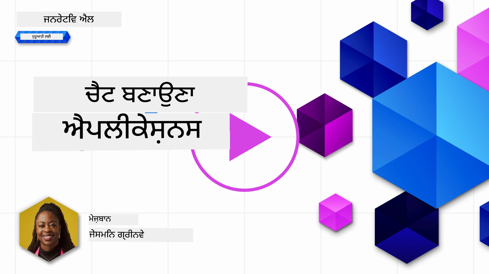
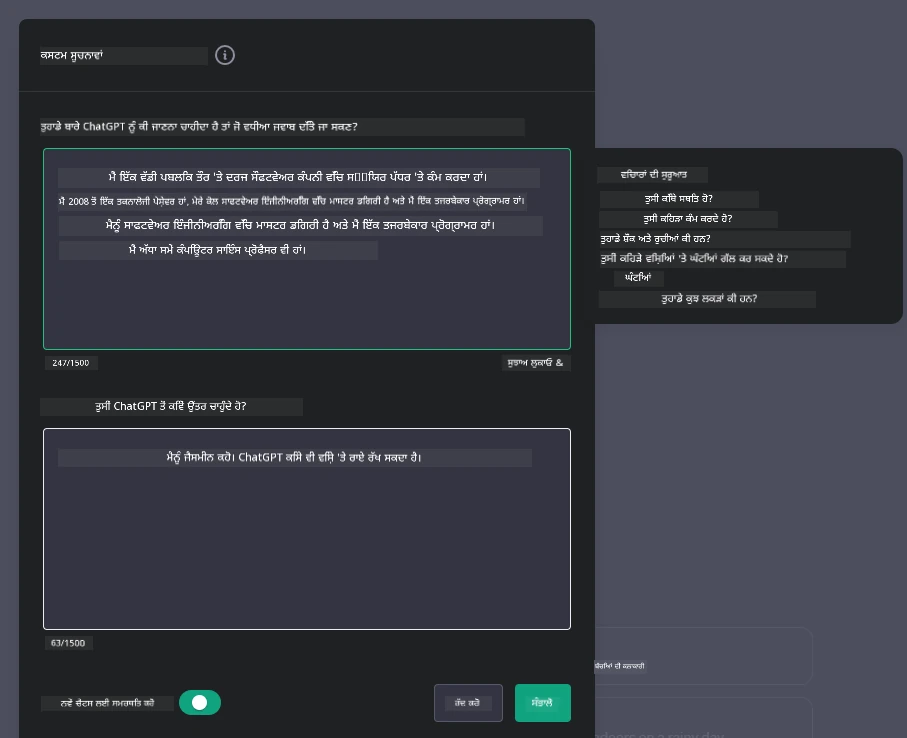

# ਜਨਰੇਟਿਵ ਏਆਈ-ਸੰਚਾਲਿਤ ਚੈਟ ਐਪਲੀਕੇਸ਼ਨਾਂ ਦਾ ਨਿਰਮਾਣ

[](https://youtu.be/R9V0ZY1BEQo?si=IHuU-fS9YWT8s4sA)

> _(ਇਸ ਪਾਠ ਦੀ ਵੀਡੀਓ ਵੇਖਣ ਲਈ ਉੱਪਰ ਦਿੱਤੀ ਗਈ ਤਸਵੀਰ 'ਤੇ ਕਲਿੱਕ ਕਰੋ)_

ਹੁਣ ਜਦੋਂ ਕਿ ਅਸੀਂ ਵੇਖ ਲਿਆ ਹੈ ਕਿ ਅਸੀਂ ਟੈਕਸਟ-ਜਨਰੇਸ਼ਨ ਐਪ ਬਣਾਉਂਦੇ ਹਾਂ, ਆਓ ਚੈਟ ਐਪਲੀਕੇਸ਼ਨਾਂ ਨੂੰ ਦੇਖੀਏ।

ਚੈਟ ਐਪਲੀਕੇਸ਼ਨ ਸਾਡੇ ਰੋਜ਼ਾਨਾ ਜੀਵਨ ਵਿੱਚ ਸ਼ਾਮਲ ਹੋ ਚੁੱਕੀਆਂ ਹਨ, ਜੋ ਸਿਰਫ ਆਮ ਗੱਲਬਾਤ ਲਈ ਇੱਕ ਮਾਧਿਅਮ ਹੀ ਨਹੀਂ ਹਨ। ਇਹ ਗਾਹਕ ਸੇਵਾ, ਤਕਨਕੀ ਸਹਾਇਤਾ ਅਤੇ ਇੰਜਾਇਲਤ ਸਲਾਹਕਾਰ ਪ੍ਰਣਾਲੀਆਂ ਦੇ ਅਹੰਕਾਰ ਹਿੱਸੇ ਹਨ। ਸੰਭਵ ਹੈ ਕਿ ਤੁਸੀਂ ਕੁਝ ਸਮਾਂ ਪਹਿਲਾਂ ਇੱਕ ਚੈਟ ਐਪਲੀਕੇਸ਼ਨ ਤੋਂ ਮਦਦ ਲੈ ਚੁੱਕੇ ਹੋ। ਜਿਵੇਂ ਜਿਵੇਂ ਅਸੀਂ ਜਨਰੇਟਿਵ ਏਆਈ ਵਰਗੀ ਉੱਨਤ ਤਕਨੀਕਾਂ ਨੂੰ ਇਨ੍ਹਾਂ ਪਲੇਟਫਾਰਮਾਂ ਵਿੱਚ ਸ਼ਾਮਲ ਕਰਦੇ ਹਾਂ, ਤਾਂ ਇਸ ਦੀ ਜਟਿਲਤਾ ਅਤੇ ਚੁਣੌਤੀਆਂ ਵੱਧਦੀਆਂ ਹਨ।

ਕੁਝ ਸਵਾਲ ਜਿਨ੍ਹਾਂ ਦੇ ਜਵਾਬ ਲੱਭਣ ਲਾਜ਼ਮੀ ਹਨ:

- **ਐਪ ਤਿਆਰ ਕਰਨਾ**। ਅਸੀਂ ਕਿਵੇਂ ਦੱਖਲਦਾਰੀ ਨਾਲ ਇਹ ਏਆਈ-ਸੰਚਾਲਿਤ ਐਪਲੀਕੇਸ਼ਨਾਂ ਨੂੰ ਵਿਸ਼ੇਸ਼ ਉਦੇਸ਼ਾਂ ਲਈ ਬਣਾਈਏ ਅਤੇ ਬਿਨਾ ਰੁਕਾਵਟ ਇਕੱਠੇ ਕਰੀਏ?
- **ਮਾਨੀਟਰਿੰਗ**। ਇਕ ਵਾਰੀ ਲਾਗੂ ਕਰਨ ਤੋਂ ਬਾਅਦ, ਅਸੀਂ ਕਿਵੇਂ ਨਿਗਰਾਨੀ ਕਰ ਸਕਦੇ ਹਾਂ ਅਤੇ ਯਕੀਨੀ ਬਨਾਈਏ ਕਿ ਐਪਲੀਕੇਸ਼ਨ ਸਭ ਤੋਂ ਉੱਚੇ ਪੱਧਰ ਦੀ ਗੁਣਵੱਤਾ ਨਾਲ ਕੰਮ ਕਰ ਰਹੀਆਂ ਹਨ, ਫੰਕਸ਼ਨਲਿਟੀ ਅਤੇ [ਜਿੰਮੇਵਾਰ ਏਆਈ ਦੇ ਛੇ ਸਿਧਾਂਤਾਂ](https://www.microsoft.com/ai/responsible-ai?WT.mc_id=academic-105485-koreyst) ਦੀ ਪਾਲਣਾ ਦੀ ਕੋਈ ਘਾਟ ਨਾ ਹੋਵੇ?

ਜਿਵੇਂ ਅਸੀਂ ਆਟੋਮੇਸ਼ਨ ਅਤੇ ਬਿਨਾ ਰੁਕਾਵਟ ਮਨੁੱਖ-ਮਸ਼ੀਨ ਇੰਟਰੈੱਕਸ਼ਨਾਂ ਦੇ ਯੁੱਗ ਵਿੱਚ ਅੱਗੇ ਵਧ ਰਹੇ ਹਾਂ, ਇਹ ਜਾਣਨਾ ਜਰੂਰੀ ਹੈ ਕਿ ਜਨਰੇਟਿਵ ਏਆਈ ਕਿਵੇਂ ਚੈਟ ਐਪਲੀਕੇਸ਼ਨਾਂ ਦੀ ਸੀਮਾ, ਗਹਿਰਾਈ ਅਤੇ ਢਾਲਸ਼ੀਲਤਾ ਨੂੰ ਬਦਲਦਾ ਹੈ। ਇਹ ਪਾਠ ਇਨ੍ਹਾਂ ਜਟਿਲ ਪ੍ਰਣਾਲੀਆਂ ਨੂੰ ਸਹਾਰਨ ਵਾਲੀ ਵਾਸਤੂ-ਕਾਰਗੁਜ਼ਾਰੀ ਦੀਆਂ ਪਹਲੂਆਂ ਦੀ ਜਾਂਚ ਕਰੇਗਾ, ਖੇਤਰ-ਵਿਸ਼ੇਸ਼ ਕੰਮਾਂ ਲਈ ਉਨ੍ਹਾਂ ਦੀ ਬਿਹਤਰੀ ਲਈ ਤਰੀਕੇ ਤੇ ਧਿਆਨ ਦੇਵੇਗਾ, ਅਤੇ ਜਿੰਮੇਵਾਰ ਏਆਈ ਲਾਗੂ ਕਰਨ ਲਈ ਦਰਕਾਰ ਮਾਪਦੰਡ ਅਤੇ ਵਿਚਾਰਾਂ ਦੀ ਮੁਲਾਂਕਣ ਕਰੇਗਾ।

## ਪਰਿਚਯ

ਇਸ ਪਾਠ ਵਿੱਚ ਸ਼ਾਮਲ ਹਨ:

- ਚੈਟ ਐਪਲੀਕੇਸ਼ਨਾਂ ਨੂੰ ਦੱਖਲਦਾਰੀ ਨਾਲ ਬਣਾਉਣ ਅਤੇ ਇਕੱਠੇ ਕਰਨ ਦੇ ਤਰੀਕੇ।
- ਐਪਲੀਕੇਸ਼ਨਾਂ ਉੱਤੇ ਕਸਟਮਾਈਜੇਸ਼ਨ ਅਤੇ ਫਾਈਨ-ਟਿਊਨਿੰਗ ਲਗਾਉਣ ਦੇ ਤਰੀਕੇ।
- ਚੈਟ ਐਪਲੀਕੇਸ਼ਨਾਂ ਦੀ ਪ੍ਰਭਾਵਸ਼ਾਲੀ ਨਿਗਰਾਨੀ ਲਈ ਰਣਨੀਤੀਆਂ ਅਤੇ ਵਿਚਾਰ।

## ਸਿੱਖਣ ਦੇ ਲੱਕੜ

ਇਸ ਪਾਠ ਦੇ ਅੰਤ ਤੱਕ, ਤੁਸੀਂ ਸਮਰੱਥ ਹੋਵੋਗੇ:

- ਮੌਜੂਦਾ ਸਿਸਟਮਾਂ ਵਿੱਚ ਚੈਟ ਐਪਲੀਕੇਸ਼ਨਾਂ ਨੂੰ ਬਣਾਉਣ ਅਤੇ ਇਕੱਠੇ ਕਰਨ ਦੀਆਂ ਵਿਚਾਰਧਾਰਾਵਾਂ ਦੀ ਵਰਣਨਾ ਕਰਨ ਲਈ।
- ਖ਼ਾਸ ਉਦੇਸ਼ਾਂ ਲਈ ਚੈਟ ਐਪਲੀਕੇਸ਼ਨਾਂ ਨੂੰ ਕਸਟਮਾਈਜ਼ ਕਰਨ ਲਈ।
- ਪ੍ਰਭਾਵਸ਼ਾਲੀ ਤਰੀਕੇ ਨਾਲ ਏਆਈ ਸੰਜਾਲਤ ਚੈਟ ਐਪਲੀਕੇਸ਼ਨਾਂ ਦੀ ਗੁਣਵੱਤਾ ਦੀ ਨਿਗਰਾਨੀ ਅਤੇ ਸੰਭਾਲ ਲਈ ਮੁੱਖ ਮਾਪਦੰਡਾਂ ਅਤੇ ਵਿਚਾਰਾਂ ਦੀ ਪਛਾਣ ਕਰਨ ਲਈ।
- ਇਹ ਯਕੀਨੀ ਬਣਾਉਣ ਲਈ ਕਿ ਚੈਟ ਐਪਲੀਕੇਸ਼ਨਾਂ ਜਿੰਮੇਵਾਰ ਤਰੀਕੇ ਨਾਲ ਏਆਈ ਦੀ ਵਰਤੋਂ ਕਰਦੀਆਂ ਹਨ।

## ਚੈਟ ਐਪਲੀਕੇਸ਼ਨਾਂ ਵਿੱਚ ਜਨਰੇਟਿਵ ਏਆਈ ਸ਼ਾਮਲ ਕਰਨਾ

ਜਨਰੇਟਿਵ ਏਆਈ ਰਾਹੀਂ ਚੈਟ ਐਪਲੀਕੇਸ਼ਨਾਂ ਨੂੰ ਉੱਚਾ ਕਰਨ ਦਾ ਮਕਸਦ ਸਿਰਫ਼ ਉਨ੍ਹਾਂ ਨੂੰ ਸਿਆਣਾ ਬਣਾਉਣਾ ਨਹੀਂ ਹੈ; ਇਹ ਦੀ ਰਚਨਾ, ਪ੍ਰਦਰਸ਼ਨ ਅਤੇ ਉਪਭੋਗਤਾ ਇੰਟਰਫੇਸ ਨੂੰ ਬਿਹਤਰ ਕਰਕੇ ਗੁਣਵੱਤਾ ਵਾਲਾ ਉਪਭੋਗਤਾ ਅਨੁਭਵ ਪ੍ਰਦਾਨ ਕਰਨਾ ਹੈ। ਇਸ ਵਿੱਚ ਵਾਸਤੂ-ਕਾਰਗੁਜ਼ਾਰੀ ਦੇ ਨਿਰਮਾਣ, API ਇਕੀਕਰਨ ਅਤੇ ਉਪਭੋਗਤਾ ਇੰਟਰਫੇਸ ਦੇ ਵਿਚਾਰਾਂ ਦੀ ਜਾਂਚ ਸ਼ਾਮਲ ਹੈ। ਇਹ ਭਾਗ ਤੁਹਾਨੂੰ ਇਹਨਾਂ ਜਟਿਲ ਹਾਲਾਤਾਂ ਵਿੱਚ ਸਹੀ ਰਾਹ ਨਿਰਦੇਸ਼ ਦੇਣ ਦਾ ਉਦੇਸ਼ ਰੱਖਦਾ ਹੈ, ਚਾਹੇ ਤੁਸੀਂ ਉਨ੍ਹਾਂ ਨੂੰ ਮੌਜੂਦਾ ਸਿਸਟਮਾਂ ਵਿੱਚ ਸ਼ਾਮਿਲ ਕਰ ਰਹੇ ਹੋ ਜਾਂ ਖ਼ੁਦਮੁਖਤਾਰ ਪਲੇਟਫਾਰਮ ਤਿਆਰ ਕਰ ਰਹੇ ਹੋ।

ਇਸ ਭਾਗ ਦੇ ਅੰਤ ਤੱਕ, ਤੁਹਾਡੇ ਕੋਲ ਚੈਟ ਐਪਲੀਕੇਸ਼ਨਾਂ ਨੂੰ ਪ੍ਰਭਾਵਸ਼ਾਲੀ ਬਣਾਉਣ ਅਤੇ ਸ਼ਾਮਿਲ ਕਰਨ ਦੀ ਮਹਿਰਤ ਹੋਵੇਗੀ।

### ਚੈਟਬੋਟ ਜਾਂ ਚੈਟ ਐਪਲੀਕੇਸ਼ਨ?

ਚੈਟ ਐਪਲੀਕੇਸ਼ਨਾਂ ਬਣਾਉਣ ਵਿੱਚ ਡੁੱਬਕੀ ਮਾਰਨ ਤੋਂ ਪਹਿਲਾਂ, ਆਓ 'ਚੈਟਬੋਟ' ਦਾ ਮੁਕਾਬਲਾ 'ਏਆਈ-ਸੰਚਾਲਿਤ ਚੈਟ ਐਪਲੀਕੇਸ਼ਨਾਂ' ਨਾਲ ਕਰੀਏ, ਜੋ ਵੱਖ-ਵੱਖ ਭੂਮਿਕਾਵਾਂ ਅਤੇ ਕਾਰਜਾਂ ਨੂੰ ਸਮਭਾਲਦੇ ਹਨ। ਇੱਕ ਚੈਟਬੋਟ ਦਾ ਮੁੱਖ ਮਕਸਦ ਵਿਸ਼ੇਸ਼ ਗੱਲਬਾਤੀ ਕੰਮਾਂ ਨੂੰ ਸੁਚਾਰੂ ਕਰਨਾ ਹੈ, ਜਿਵੇਂ ਕਿ ਆਮ ਪੁੱਛਤाछ ਦੇ ਜਵਾਬ ਦੇਣਾ ਜਾਂ ਪੈਕੇਜ ਟ੍ਰੈਕ ਕਰਨਾ। ਇਹ ਆਮ ਤੌਰ 'ਤੇ ਨਿਯਮ-ਆਧਾਰਿਤ ਤਰਕ ਜਾਂ ਜਟਿਲ ਏਆਈ ਅਲਗੋਰਿਥਮਾਂ ਨਾਲ ਸੰਜਾਲਿਤ ਹੁੰਦਾ ਹੈ। ਦੂਜੇ ਪਾਸੇ, ਏਆਈ-ਸੰਚਾਲਿਤ ਚੈਟ ਐਪਲੀਕੇਸ਼ਨ ਇੱਕ ਕਾਫੀ ਵਿਆਪਕ ਮਾਹੌਲ ਹੈ ਜਿਸਦਾ ਉਦਦੇਸ਼ ਮਨੁੱਖੀ ਉਪਭੋਗਤਾਵਾਂ ਵਿੱਚ ਵੱਖ-ਵੱਖ ਰੂਪਾਂ ਦੀ ਡਿਜ਼ਿਟਲ ਸੰਚਾਰ ਜਿਵੇਂ ਟੈਕਸਟ, ਵੌਇਸ ਅਤੇ ਵੀਡੀਓ ਚੈਟ ਨੂੰ ਸਹੂਲਤ ਦੇਣਾ ਹੈ। ਇਸਦੀ ਵਖਰੀ ਖਾਸੀਅਤ ਇਹ ਹੈ ਕਿ ਇਹ ਜਨਰੇਟਿਵ ਏਆਈ ਮਾਡਲ ਨੂੰ ਸ਼ਾਮਲ ਕਰਦਾ ਹੈ ਜੋ ਨੁਜ਼ੂਕੀ, ਮਨੁੱਖ-ਜਿਹਾ ਗੱਲਬਾਤੀ ਅਨੁਕੂਲ ਸੰਜਾਲ ਬਣਾਉਂਦਾ ਹੈ, ਵਿਆਪਕ ਇਨਪੁੱਟ ਅਤੇ ਪ੍ਰਸੰਗਿਕ ਸੰਕੇਤਾਂ ਦੇ ਅਧਾਰ 'ਤੇ ਜਵਾਬ ਤਿਆਰ ਕਰਦਾ ਹੈ। ਜਨਰੇਟਿਵ ਏਆਈ-ਸੰਚਾਲਿਤ ਚੈਟ ਐਪਲੀਕੇਸ਼ਨ ਖੁੱਲੇ ਖੇਤਰ ਦੀਆਂ ਗੱਲਾਂ ਵਿੱਚ ਸੰਜਲਿਤ ਹੋ ਸਕਦੀ ਹੈ, ਬਦਲਦੇ ਗੱਲਬਾਤੀ ਪ੍ਰਸੰਗਾਂ ਨੂੰ ਅਨੁਕੂਲਿਤ ਕਰ ਸਕਦੀ ਹੈ, ਅਤੇ ਕ੍ਰੀਏਟਿਵ ਜਾਂ ਜਟਿਲ ਸੰਵਾਦ ਵੀ ਤਿਆਰ ਕਰ ਸਕਦੀ ਹੈ।

ਹੇਠਾਂ ਦਿੱਤਾ ਗਿਆ ਟੇਬਲ ਮੁੱਖ ਫਰਕਾਂ ਅਤੇ ਸ similaritiesਂਜਿਆਵਾਂ ਨੂੰ ਦਰਸਾਉਂਦਾ ਹੈ ਤਾਂ ਜੋ ਅਸੀਂ ਉਨ੍ਹਾਂ ਦੀ ਵੱਖਰੀ ਭੂਮਿਕਾਵਾਂ ਨੂੰ ਡਿਜ਼ਿਟਲ ਸੰਚਾਰ ਵਿੱਚ ਸਮਝ ਸਕੀਏ।

| ਚੈਟਬੋਟ                               | ਜਨਰੇਟਿਵ ਏਆਈ-ਸੰਚਾਲਿਤ ਚੈਟ ਐਪਲੀਕੇਸ਼ਨ |
| ------------------------------------- | -------------------------------------- |
| ਕਾਰਜ ਕੇਂਦਰਿਤ ਅਤੇ ਨਿਯਮ-ਆਧਾਰਿਤ           | ਪ੍ਰਸੰਗ-ਜਾਣੂ                            |
| ਅਕਸਰ ਵੱਡੀਆਂ ਪ੍ਰਣਾਲੀਆਂ ਵਿੱਚ ਸ਼ਾਮਲ          | ਇਕ ਜਾਂ ਵੱਖ-ਵੱਖ ਚੈਟਬੋਟਾਂ ਦੀ ਮਿਆਜ਼                         |
| ਪ੍ਰੋਗ੍ਰਾਮ ਕੀਤੀਆਂ ਕਾਰਜਾਂ ਤਕ ਸੀਮਤ            | ਜਨਰੇਟਿਵ ਏਆਈ ਮਾਡਲ ਸ਼ਾਮਲ ਕਰਦਾ ਹੈ                       |
| ਵਿਸ਼ੇਸ਼ੀਕਰਨ ਅਤੇ ਸੰਰਚਿਤ ਸੰਵਾਦ         | ਖੁੱਲੇ ਖੇਤਰ ਦੀਆਂ ਗੱਲਾਂ ਕਰਨ ਦੇ ਯੋਗ                          |

### SDKs ਅਤੇ APIs ਨਾਲ ਪਹਿਲਾਂ ਬਣੇ ਫੰਕਸ਼ਨਲਿਟੀਜ਼ ਦੀ ਵਰਤੋਂ ਕਰਨਾ

ਜਦੋਂ ਤੁਸੀਂ ਇੱਕ ਚੈਟ ਐਪਲੀਕੇਸ਼ਨ ਬਣਾਉਂਦੇ ਹੋ, ਤਾਂ ਪਹਿਲਾ ਚੰਗਾ ਕਦਮ ਇਹ ਤੈਅ ਕਰਨਾ ਹੈ ਕਿ ਪਹਿਲਾਂ ਹੀ ਕੀ ਮੌਜੂਦ ਹੈ। SDKs ਅਤੇ APIs ਦੀ ਵਰਤੋਂ ਕਰਕੇ ਚੈਟ ਐਪਲੀਕੇਸ਼ਨਾਂ ਨੂੰ ਬਣਾਉਣਾ ਵੱਖ-ਵੱਖ ਕਾਰਨਾਂ ਲਈ ਲਾਭਦਾਇਕ ਰਣਨੀਤੀ ਹੈ। ਬਹੁਤ ਵਧੀਆ ਦਸਤਾਵੇਜ਼ਾਂ ਵਾਲੇ SDKs ਅਤੇ APIs ਨੂੰ ਸ਼ਾਮਲ ਕਰਕੇ, ਤੁਸੀਂ ਆਪਣੀ ਐਪਲੀਕੇਸ਼ਨ ਨੂੰ ਲੰਬੇ ਸਮੇਂ ਦੀ ਸਫਲਤਾ ਲਈ ਜਗ੍ਹਾ ਦਿੱਤੀ ਹੈ, ਜੋ ਕਿ ਸਕੇਲਬਿਲਟੀ ਅਤੇ ਮੁਰੰਮਤ ਚਿੰਤਾਵਾਂ ਨੂੰ ਧਿਆਨ ਵਿੱਚ ਰੱਖਦਾ ਹੈ।

- **ਇਹ ਵਿਕਾਸ ਪ੍ਰਕਿਰਿਆ ਨੂੰ ਤੇਜ਼ ਕਰਦਾ ਹੈ ਅਤੇ ਓਵਰਹੈੱਡ ਘਟਾਉਂਦਾ ਹੈ**: ਖ਼ੁਦ ਬਣਾਉਣ ਦੀ ਮਹਿੰਗੀ ਪ੍ਰਕਿਰਿਆ ਦੇ ਬਜਾਏ ਪਹਿਲਾਂ ਤੋਂ ਬਣਾਈਆਂ ਫੰਕਸ਼ਨਲਿਟੀਜ਼ 'ਤੇ ਅਧਾਰਿਤ ਹੋਣਾ ਤੁਹਾਨੂੰ ਆਪਣੀ ਐਪਲੀਕੇਸ਼ਨ ਦੇ ਹੋਰ ਖੇਤਰਾਂ 'ਤੇ ਧਿਆਨ ਕੇਂਦਰਿਤ ਕਰਨ ਦਾ ਮੌਕਾ ਦਿੰਦਾ ਹੈ, ਜਿਵੇਂ ਕਿ ਕਾਰੋਬਾਰੀ ਤਰਕ।
- **ਵਧੀਆ ਪ੍ਰਦਰਸ਼ਨ**: ਜਦੋਂ ਤੁਹਾਨੂੰ ਫੰਕਸ਼ਨਲਿਟੀ ਜ਼ੀਰੋ ਤੋਂ ਬਣਾਉਣੀ ਪੈਂਦੀ ਹੈ, ਤਾਂ ਤੁਸੀਂ ਆਖਿਰਕਾਰ ਆਪਣੇ ਆਪ ਨੂੰ ਪੁੱਛਦੇ ਹੋ "ਇਹ ਕਿਵੇਂ ਵਧੇਗੀ? ਕੀ ਇਹ ਐਪਲੀਕੇਸ਼ਨ ਇੱਕ ਅਚਾਨਕ ਵੱਧੇ ਉਪਭੋਗਤਾ ਭਰਾਵ ਨੂੰ ਸੰਭਾਲ ਸਕਦੀ ਹੈ?" ਸਹੀ ਤਰੀਕੇ ਨਾਲ ਸੰਭਾਲ ਕੀਤੇ SDK ਅਤੇ APIs ਅਕਸਰ ਇਹ ਸਮੱਸਿਆਵਾਂ ਲਈ ਬਣੇ ਹੱਲ ਰੱਖਦੇ ਹਨ।
- **ਅਸਾਨ ਮੁਰੰਮਤ**: ਅਪਡੇਟਾਂ ਅਤੇ ਸੁਧਾਰਾਂ ਦਾ ਪ੍ਰਬੰਧਨ ਕਾਫੀ ਅਸਾਨ ਹੁੰਦਾ ਹੈ ਕਿਉਂਕਿ ਜ਼ਿਆਦਾਤਰ APIs ਅਤੇ SDKs ਨੂੰ ਨਵੀਂ ਵਰਜਨ ਜਾਰੀ ਹੋਣ 'ਤੇ ਸਿਰਫ ਲਾਇਬ੍ਰੇਰੀ ਅਪਡੇਟ ਕਰਨ ਦੀ ਲੋੜ ਹੁੰਦੀ ਹੈ।
- **ਸਭ ਤੋਂ ਸੰਪੂਰਨ ਤਕਨੀਕ ਤੱਕ ਪਹੁੰਚ**: ਫਾਈਨ-ਟਿਊਨ ਕਿਤੇ ਅਤੇ ਵਿਅਾਪਕ ਡੇਟਾ ਸੈੱਟਾਂ 'ਤੇ ਸਿਖਾਏ ਗਏ ਮਾਡਲਾਂ ਦੀ ਵਰਤੋਂ ਕਰਨ ਨਾਲ ਤੇਰੀ ਐਪਲੀਕੇਸ਼ਨ ਨੂੰ ਕੁਦਰਤੀ ਭਾਸ਼ਾ ਸਮਰਥਾ ਮਿਲਦੀ ਹੈ।

SDK ਜਾਂ API ਦੀ ਫੰਕਸ਼ਨਲਿਟੀ ਤੱਕ ਪਹੁੰਚ ਕਰਨਾ ਆਮ ਤੌਰ 'ਤੇ ਪ੍ਰਦਾਤ ਕੀਤੀਆਂ ਸੇਵਾਵਾਂ ਦੀ ਵਰਤੋਂ ਲਈ ਅਨੁਮਤੀ ਪ੍ਰਾਪਤ ਕਰਨਾ ਹੁੰਦਾ ਹੈ, ਜਿਹੜਾ ਅਕਸਰ ਇੱਕ ਵਿਲੱਖਣ ਕੁੰਜੀ ਜਾਂ ਪ੍ਰਮਾਣਿਕਤਾ ਟੋਕਨ ਰਾਹੀਂ ਹੁੰਦਾ ਹੈ। ਅਸੀਂ OpenAI ਪਾਇਥਨ ਲਾਇਬ੍ਰੇਰੀ ਦੀ ਵਰਤੋਂ ਕਰਕੇ ਇਸ ਨੂੰ ਦੇਖਾਂਗੇ ਕਿ ਇਹ ਕਿਵੇਂ ਹੁੰਦਾ ਹੈ। ਤੁਸੀਂ ਆਪਣੇ ਆਪ ਵੀ ਇਸ ਨੂੰ ਹੇਠਾਂ ਦਿੱਤੇ [OpenAI ਲਈ ਨੋਟਬੁੱਕ](./python/oai-assignment.ipynb?WT.mc_id=academic-105485-koreyst) ਜਾਂ ਇਸ ਪਾਠ ਲਈ [Azure OpenAI ਸੇਵਾਵਾਂ ਦਾ ਨੋਟਬੁੱਕ](./python/aoai-assignment.ipynb?WT.mc_id=academic-105485-koreys) 'ਚ ਅਜ਼ਮਾ ਸਕਦੇ ਹੋ।

```python
import os
from openai import OpenAI

API_KEY = os.getenv("OPENAI_API_KEY","")

client = OpenAI(
    api_key=API_KEY
    )

response = client.responses.create(model="gpt-5-mini", input="Suggest two titles for an instructional lesson on chat applications for generative AI.", store=False)
print(response.output_text)
```

ਉੱਪਰ ਦਿੱਤਾ ਉਦਾਹਰਨ GPT-5 ਮਿਨੀ ਮਾਡਲ ਨਾਲ Responses API ਦੀ ਵਰਤੋਂ ਕਰਦਾ ਹੈ ਪ੍ਰਾਂਪਟ ਨੂੰ ਪੂਰਾ ਕਰਨ ਲਈ, ਪਰ ਧਿਆਨ ਦਿਓ ਕਿ API ਕੁੰਜੀ ਪਹਿਲਾਂ ਹੀ ਸੈੱਟ ਕੀਤੀ ਗਈ ਹੈ। ਜੇ ਤੁਸੀਂ ਕੁੰਜੀ ਸੈੱਟ ਨਾ ਕਰੋ ਤਾਂ ਤੁਹਾਨੂੰ ਤਰੁਟੀ ਮਿਲੇਗੀ।

## ਉਪਭੋਗਤਾ ਅਨੁਭਵ (UX)

ਆਮ UX ਸਿਧਾਂਤ ਚੈਟ ਐਪਲੀਕੇਸ਼ਨਾਂ 'ਤੇ ਲਾਗੂ ਹੁੰਦੇ ਹਨ, ਪਰ ਇੱਥੇ ਕੁਝ ਵਾਧੂ ਵਿਚਾਰ ਹਨ ਜੋ ਮਸ਼ੀਨ ਲਰਨਿੰਗ ਘਟਕਾਂ ਦੇ ਸ਼ਾਮਿਲ ਹੋਣ ਕਾਰਨ ਵਿਸ਼ੇਸ਼ ਤੌਰ 'ਤੇ ਮਹੱਤਵਪੂਰਨ ਹੋ ਜਾਂਦੇ ਹਨ।

- **ਅਸਪਸ਼ਟਤਾ ਨਿਬਟਣ ਦਾ ਮਕੈਨਿਜ਼ਮ**: ਜਨਰੇਟਿਵ ਏਆਈ ਮਾਡਲ ਕਦੇ ਕਦੇ ਅਸਪਸ਼ਟ ਜਵਾਬ ਤਿਆਰ ਕਰਦੇ ਹਨ। ਇੱਕ ਫੀਚਰ ਜੋ ਉਪਭੋਗਤਾਵਾਂ ਨੂੰ ਸਪਸ਼ਟੀਕਰਨ ਲਈ ਪੁੱਛਣ ਦੀ ਆਗਿਆ ਦਿੰਦਾ ਹੈ, ਵਰਤੇ ਜਾਣ ਵਾਲਾ ਹਨੇਰਾ ਘਟਾ ਸਕਦਾ ਹੈ।
- **ਪ੍ਰਸੰਗ ਰੱਖਣਾ**: ਉੱਨਤ ਜਨਰੇਟਿਵ ਏਆਈ ਮਾਡਲ ਗੱਲਬਾਤ ਵਿੱਚ ਪ੍ਰਸੰਗ ਯਾਦ ਰੱਖਣ ਦੀ ਸਮਰੱਥਾ ਰੱਖਦੇ ਹਨ, ਜੋ ਉਪਭੋਗਤਾ ਅਨੁਭਵ ਲਈ ਜ਼ਰੂਰੀ ਹੋ ਸਕਦੀ ਹੈ। ਉਪਭੋਗਤਾਵਾਂ ਨੂੰ ਪ੍ਰਸੰਗ ਕੰਟਰੋਲ ਅਤੇ ਪ੍ਰਬੰਧ ਕਰਨ ਦਾ ਤੌਰ ਦਿੰਦਿਆਂ ਉਪਭੋਗਤਾ ਅਨੁਭਵ ਨੂੰ ਸੁਧਾਰਿਆ ਜਾ ਸਕਦਾ ਹੈ, ਪਰ ਇਸ ਨਾਲ ਸੰਵੇਦਨਸ਼ੀਲ ਜਾਣਕਾਰੀ ਨਾਲ ਸਬੰਧਤ ਖਤਰਾ ਵੀ ਜੁੜਦਾ ਹੈ। ਇਸ ਜਾਣਕਾਰੀ ਨੂੰ ਕਿੰਨੀ ਦੇਰ ਇਕੱਤਰ ਰੱਖਣਾ ਚਾਹੀਦਾ ਹੈ, ਜਿਵੇਂ ਇੱਕ ਰੀਟੈਂਸ਼ਨ ਨੀਤੀ ਲਾਗੂ ਕਰਨਾ, ਇਸ ਬਾਲੀ ਰਕਸ਼ਾ ਅਤੇ ਗੋਪਨੀਯਤਾ ਵਿੱਚ ਸੰਤੁਲਨ ਬਨਾਵੇਗਾ।
- **ਨਿੱਜੀਕਰਨ**: ਸਿੱਖਣ ਅਤੇ ਢਾਲਣ ਦੀ ਯੋਗਤਾ ਨਾਲ, ਏਆਈ ਮਾਡਲ ਉਪਭੋਗਤਾਵਾਂ ਲਈ ਵਿਅਕਤੀਗਤ ਅਨੁਭਵ ਦਿੰਦੇ ਹਨ। ਉਪਭੋਗਤਾ ਦੇ ਪ੍ਰੋਫ਼ਾਈਲ ਵਰਗੀਆਂ ਖਾਸੀਅਤਾਂ ਰਾਹੀਂ ਅਨੁਭਵ ਨੂੰ ਅਨੁਕੂਲਿਤ ਕਰਨਾ ਨਾ ਸਿਰਫ਼ ਉਪਭੋਗਤਾ ਨੂੰ ਸਮਝਿਆ ਮਹਿਸੂਸ ਕਰਵਾਂਦਾ ਹੈ, ਬਲਕਿ ਇਹ ਖਾਸ ਜਵਾਬ ਲੱਭਣ ਵਿੱਚ ਵੀ ਮਦਦ ਕਰਦਾ ਹੈ, ਜਿਸ ਨਾਲ ਸਾਰਥਕ ਅਤੇ ਸੰਤੁਸ਼ਟਿਕ ਰਹਿਣ ਵਾਲੀ ਗੱਲਬਾਤ ਬਣਦੀ ਹੈ।

ਇੰਝ ਨਿੱਜੀਕਰਨ ਦਾ ਇੱਕ ਉਦਾਹਰਨ OpenAI ਦੀ ChatGPT ਵਿੱਚ "ਕਸਟਮ ਨਿਰਦੇਸ਼" ਸੈਟਿੰਗਾਂ ਹਨ। ਇਹ ਤੁਹਾਨੂੰ ਆਪਣੀ ਸੂਚਨਾ ਪ੍ਰਦਾਨ ਕਰਨ ਦੀ ਆਗਿਆ ਦਿੰਦਾ ਹੈ ਜੋ ਤੁਹਾਡੇ ਪ੍ਰਾਂਪਟਾਂ ਦੀ ਸੰਦਰਭ ਜਾਣਕਾਰੀ ਹੋ ਸਕਦੀ ਹੈ। ਹੇਠਾਂ ਇੱਕ ਨਿੱਜੀਕਰਨ ਨਿਰਦੇਸ਼ ਦਾ ਉਦਾਹਰਨ ਦਿੱਤਾ ਗਿਆ ਹੈ।



ਇਸ "ਪ੍ਰੋਫ਼ਾਈਲ" ਨਾਲ ChatGPT ਲਿੰਕਡ ਲਿਸਟਾਂ 'ਤੇ ਇੱਕ ਪਾਠ ਯੋਜਨਾ ਬਣਾਉਣ ਦਾ ਆਦੇਸ਼ ਲੈਂਦਾ ਹੈ। ਧਿਆਨ ਦਿਓ ਕਿ ChatGPT ਇਸ ਗੱਲ ਨੂੰ ਧਿਆਨ ਵਿੱਚ ਰੱਖਦਾ ਹੈ ਕਿ ਉਪਭੋਗਤਾ ਆਪਣਾ ਤਜ਼ੁਰਬਾ ਦੇਖਦਿਆਂ ਹੋਰ ਵਿਸਥਾਰਤ ਪਾਠ ਯੋਜਨਾ ਚਾਹੁੰਦਾ ਹੈ।


### ਵੱਡੇ ਭਾਸ਼ਾ ਮਾਡਲਾਂ ਲਈ ਮਾਈਕਰੋਸਾਫਟ ਦਾ ਸਿਸਟਮ ਮੈਸੇਜ ਫਰੇਮਵਰਕ

[ਮਾਈਕਰੋਸਾਫਟ ਨੇ ਨਿਰਦੇਸ਼ ਦਿੱਤੇ ਹਨ](https://learn.microsoft.com/azure/ai-foundry/openai/concepts/system-message#define-the-models-output-format?WT.mc_id=academic-105485-koreyst) LLMs ਤੋਂ ਜਵਾਬ ਤਿਆਰ ਕਰਦੇ ਸਮੇਂ ਪ੍ਰਭਾਵਸ਼ਾਲੀ ਸਿਸਟਮ ਮੈਸੇਜ ਲਿਖਣ ਲਈ ਜੋ 4 ਖੇਤਰਾਂ 'ਚ ਵੰਡੇ ਗਏ ਹਨ:

1. ਨਿਰਧਾਰਿਤ ਕਰਨਾ ਮਾਡਲ ਕਿਸ ਲਈ ਹੈ, ਉਨ੍ਹਾਂ ਦੀਆਂ ਸਮਰੱਥਾਵਾਂ ਅਤੇ ਸੀਮਾਵਾਂ ਦੇ ਨਾਲ।
2. ਮਾਡਲ ਦਾ ਆਉਟਪੁੱਟ ਫਾਰਮੈਟ ਨਿਰਧਾਰਿਤ ਕਰਨਾ।
3. ਖਾਸ ਉਦਾਹਰਨ ਪ੍ਰਦਾਨ ਕਰਨਾ ਜੋ ਮਾਡਲ ਦੇ ਇਰਾਦੇ ਬਰਤਾਵ ਨੂੰ ਦਰਸਾਉਂਦੇ ਹਨ।
4. ਵਾਧੂ ਵਤੀਰੇ ਗਾਰਡਰੇਲਾਂ ਪ੍ਰਦਾਨ ਕਰਨਾ।

### ਪਹੁੰਚਯੋਗਤਾ

ਚਾਹੇ ਉਪਭੋਗਤਾ ਵਿਜੁਅਲ, ਸੁਨਣ, ਮੋਟਰ ਜਾਂ ਗਿਆਨਾਤਮਕ ਸਮਰੱਥਾ ਘਟਾਓਂ ਵਾਲਾ ਹੋਵੇ, ਇੱਕ ਸੁਚੱਜੀ ਤਰੀਕੇ ਨਾਲ ਤਿਆਰ ਕੀਤੀ ਚੈਟ ਐਪਲੀਕੇਸ਼ਨ ਸਾਰੇ ਲਈ ਵਰਤੋਂਯੋਗ ਹੋਣੀ ਚਾਹੀਦੀ ਹੈ। ਹੇਠਾਂ ਦਿੱਤੀ ਸੂਚੀ ਵੱਖ-ਵੱਖ ਉਪਭੋਗਤਾ ਘਟਾਵਾਂ ਲਈ ਪਹੁੰਚਯੋਗਤਾ ਸੁਧਾਰਨ ਵਾਲੀਆਂ ਖਾਸੀਅਤਾਂ ਨੂੰ ਤੋੜਦਾ ਹੈ।

- **ਦ੍ਰਿਸ਼ਟੀ ਘਟਾਉਂ ਵਾਲਿਆਂ ਲਈ ਖਾਸੀਅਤਾਂ**: ਉੱਚ ਵਿਭੇਦਕ ਥੀਮ ਅਤੇ ਪਾਠ ਦਾ ਆਕਾਰ ਬਦਲਣ ਯੋਗਤਾ, ਸਕਰੀਨ ਰੀਡਰ ਸੰਗਤਤਾ।
- **ਸੰਵੇਦਨ ਘਟਾਉਣ ਵਾਲਿਆਂ ਲਈ ਖਾਸੀਅਤਾਂ**: ਟੈਕਸਟ ਤੋਂ ਭਾਸ਼ਣ ਅਤੇ ਭਾਸ਼ण ਤੋਂ ਟੈਕਸਟ ਫੰਕਸ਼ਨਲਿਟੀਜ਼, ਆਡੀਓ ਨੋਟੀਫਿਕੇਸ਼ਨਾਂ ਲਈ ਦ੍ਰਿਸ਼ਟਿਮਾਨ ਸੰਕੇਤ।
- **ਮੋਟਰ ਘਟਾਉ ਵਾਲਿਆਂ ਲਈ ਖਾਸੀਅਤਾਂ**: ਕੀਬੋਰਡ ਨੈਵੀਗੇਸ਼ਨ ਸਹਾਇਤਾ, ਵੌਇਸ ਕਮਾਂਡਜ਼।
- **ਗਿਆਨਾਤਮਕ ਘਟਾਉਂ ਵਾਲਿਆਂ ਲਈ ਖਾਸੀਅਤਾਂ**: ਸਧਾਰਨ ਭਾਸ਼ਾ ਵਿਕਲਪ।

## ਖੇਤਰ ਵਿਸ਼ੇਸ਼ ਭਾਸ਼ਾ ਮਾਡਲਾਂ ਲਈ ਕਸਟਮਾਈਜੇਸ਼ਨ ਅਤੇ ਫਾਈਨ-ਟਿਊਨਿੰਗ

ਕਲਪਨਾ ਕਰੋ ਇੱਕ ਐਸਾ ਚੈਟ ਐਪਲੀਕੇਸ਼ਨ ਜੋ ਤੁਹਾਡੀ ਕੰਪਨੀ ਦੀ ਸੰਬੰਧਿਤ ਭਾਸ਼ਾ ਨੂੰ ਸਮਝਦਾ ਹੈ ਅਤੇ ਉਸਦੇ ਉਪਭੋਗਤਾ ਆਮ ਤੌਰ ਤੇ ਜੋ ਖਾਸ ਸਵਾਲ ਪੁੱਛਦੇ ਹਨ, ਉਹਨਾਂ ਦੀ ਅਗਵਾਈ ਕਰਦਾ ਹੈ। ਕੁਝ ਤਰੀਕੇ ਹਨ ਜੋ ਇਸ ਬਾਰੇ ਦੱਸਣ ਰਹੇ ਹਨ:

- **DSL ਮਾਡਲਾਂ ਦੀ ਵਰਤੋਂ ਕਰਨਾ**। DSL ਦਾ ਅਰਥ ਹੈ ਖੇਤਰ ਵਿਸ਼ੇਸ਼ ਭਾਸ਼ਾ। ਤੁਸੀਂ ਇੱਕ ਖੇਤਰ-ਵਿਸ਼ੇਸ਼ DSL ਮਾਡਲ ਦੀ ਵਰਤੋਂ ਕਰ ਸਕਦੇ ਹੋ ਜੋ ਉਸ ਖੇਤਰ ਦੇ ਅਰਥ ਅਤੇ ਸੰਦਰਭ ਨੂੰ ਸਮਝਦਾ ਹੈ।
- **ਫਾਈਨ-ਟਿਊਨਿੰਗ ਲਗਾਉਣਾ**। ਫਾਈਨ-ਟਿਊਨਿੰਗ ਉਹ ਪ੍ਰਕਿਰਿਆ ਹੈ ਜਿਸ ਵਿੱਚ ਆਪਣੇ ਮਾਡਲ ਨੂੰ ਖਾਸ ਡੇਟਾ ਨਾਲ ਹੋਰ ਸਿਖਾਇਆ ਜਾਂਦਾ ਹੈ।

## ਕਸਟਮਾਈਜੇਸ਼ਨ: DSL ਦੀ ਵਰਤੋਂ ਕਰਨਾ

ਖੇਤਰ ਵਿਸ਼ੇਸ਼ ਭਾਸ਼ਾ ਮਾਡਲਾਂ (DSL ਮਾਡਲਾਂ) ਦੀ ਵਰਤੋਂ ਨਾਲ ਉਪਭੋਗਤਾ ਦੀ ਭਾਗੀਦਾਰੀ ਵਿੱਚ ਵਾਧਾ ਕੀਤਾ ਜਾ ਸਕਦਾ ਹੈ ਅਤੇ ਖਾਸ, ਪ੍ਰਸੰਗਾਨਕ ਸੰਵਾਦ ਪ੍ਰਦਾਨ ਕੀਤਾ ਜਾ ਸਕਦਾ ਹੈ। ਇਹ ਉਹ ਮਾਡਲ ਹੁੰਦਾ ਹੈ ਜੋ ਇੱਕ ਖਾਸ ਖੇਤਰ, ਉਦਯੋਗ ਜਾਂ ਵਿਸ਼ੇ ਨਾਲ ਜੁੜੇ ਟੈਕਸਟ ਨੂੰ ਸਮਝਣ ਅਤੇ ਤਿਆਰ ਕਰਨ ਲਈ ਸਿੱਖਾਇਆ ਜਾਂਦਾ ਹੈ ਜਾਂ ਫਾਈਨ-ਟਿਊਨ ਕੀਤਾ ਜਾਂਦਾ ਹੈ। DSL ਮਾਡਲ ਦੀ ਵਰਤੋਂ ਲਈ ਵਿਕਲਪ ਸਕ੍ਰੈਚ ਤੋਂ ਟ੍ਰੇਨ ਕਰਨ ਤੋਂ ਲੈ ਕੇ SDKs ਅਤੇ APIs ਰਾਹੀਂ ਮੌਜੂਦਾ ਮਾਡਲਾਂ ਦੀ ਵਰਤੋਂ ਕਰਨ ਤੱਕ ਵੱਖਰੇ ਹੋ ਸਕਦੇ ਹਨ। ਦੂਜਾ ਵਿਕਲਪ ਫਾਈਨ-ਟਿਊਨਿੰਗ ਹੈ, ਜਿਸ ਵਿੱਚ ਮੌਜੂਦਾ ਪ੍ਰੀ-ਟ੍ਰੇਨਡ ਮਾਡਲ ਨੂੰ ਕਿਸੇ ਖੇਤਰ ਲਈ ਅਨੁਕੂਲਿਤ ਕੀਤਾ ਜਾਂਦਾ ਹੈ।

## ਕਸਟਮਾਈਜੇਸ਼ਨ: ਫਾਈਨ-ਟਿਊਨਿੰਗ ਲਗਾਉਣਾ

ਜਦੋਂ ਇੱਕ ਪ੍ਰੀ-ਟ੍ਰੇਨਡ ਮਾਡਲ ਕਿਸੇ ਵਿਸ਼ੇਸ਼ ਖੇਤਰ ਜਾਂ ਕੰਮ ਵਿੱਚ ਅਪਰ्यਾਪਤ ਹੋਵੇ, ਤਾਂ ਅਕਸਰ ਫਾਈਨ-ਟਿਊਨਿੰਗ ਦੀ ਸੋਚੀ ਜਾਂਦੀ ਹੈ।

ਉਦਾਹਰਨ ਲਈ, ਮੈਡੀਕਲ ਸਵਾਲ ਜਟਿਲ ਹੁੰਦੇ ਹਨ ਅਤੇ ਵੱਡੀ ਪਰਿਸਥਿਤੀਆਂ ਦੀ ਲੋੜ ਹੁੰਦੀ ਹੈ। ਜਦੋਂ ਇੱਕ ਮੈਡੀਕਲ ਪੇਸ਼ੇਵਰ ਕਿਸੇ ਮਰੀਜ਼ ਦੀ ਜਾਂਚ ਕਰਦਾ ਹੈ ਤਾਂ ਉਹ ਜੀਵਨ ਸ਼ੈਲੀ ਜਾਂ ਪਹਿਲਾਂ ਮੌਜੂਦ ਬੀਮਾਰੀਆਂ ਵਰਗੇ ਕਈ ਕਾਰਕਾਂ 'ਤੇ ਆਧਾਰਿਤ ਹੁੰਦਾ ਹੈ, ਅਤੇ ਨਵੇਂ ਮੈਡੀਕਲ ਜਰਨਲਾਂ ਦੀ ਵਰਤੋਂ ਵੀ ਕਰ ਸਕਦਾ ਹੈ ਆਪਣੀ ਜਾਂਚ ਦੀ ਪੁਸ਼ਟੀ ਲਈ। ਅਜਿਹੇ ਸੂਖਮ ਮਾਮਲਿਆਂ ਵਿੱਚ, ਇੱਕ ਆਮ ਉਦੇਸ਼ ਵਾਲਾ AI ਚੈਟ ਐਪਲੀਕੇਸ਼ਨ ਇੱਕ ਭਰੋਸੇਯੋਗ ਸਰੋਤ ਨਹੀਂ ਹੋ ਸਕਦਾ।

### ਦ੍ਰਿਸ਼; ਇੱਕ ਮੈਡੀਕਲ ਐਪਲੀਕੇਸ਼ਨ

ਸੋਚੋ ਇੱਕ ਐਸਾ ਚੈਟ ਐਪਲੀਕੇਸ਼ਨ ਜੋ ਮੈਡੀਕਲ ਪ੍ਰੈਕਟੀਸ਼ਨਰਾਂ ਨੂੰ ਚੰਗੀ ਤਰ੍ਹਾਂ ਸਹਾਇਤਾ ਦੇਵੇ, ਜਿਵੇਂ ਇਲਾਜ ਦੇ ਨਿਰਦੇਸ਼, ਦਵਾਈਆਂ ਦੇ ਇੰਟਰਐਕਸ਼ਨਾਂ ਜਾਂ ਨਵੇਂ ਖੋਜ ਨਤੀਜੇ।

ਇੱਕ ਆਮ ਉਦੇਸ਼ ਵਾਲਾ ਮਾਡਲ ਸਧਾਰਨ ਮੈਡੀਕਲ ਸਵਾਲਾਂ ਦੇ ਜਵਾਬ ਦੇਣ ਜਾਂ ਜਨਰਲ ਸਲਾਹ ਦੇਣ ਲਈ ਠੀਕ ਹੋ ਸਕਦਾ ਹੈ, ਪਰ ਇਹ ਹੇਠਾਂ ਦਿੱਤੀਆਂ ਗੱਲਾਂ ਨਾਲ ਸੰਘਰਸ਼ ਕਰ ਸਕਦਾ ਹੈ:

- **ਬਹੁਤ ਵਿਸ਼ੇਸ਼ ਜਾਂ ਜਟਿਲ ਮਾਮਲੇ**। ਉਦਾਹਰਨ ਵਜੋਂ, ਇੱਕ ਨਿਊਰੋਲੋਜਿਸਟ ਐਪਲੀਕੇਸ਼ਨ ਨੂੰ ਪੁੱਛ ਸਕਦਾ ਹੈ, "ਬਾਲ ਰੋਗੀਆਂ ਵਿੱਚ ਦਵਾਈ-ਪ੍ਰਤੀਰੋਧਕ ਜ਼ੇਨਾਕਤੀ ਰੋਕਣ ਲਈ ਮੌਜੂਦਾ ਸਭ ਤੋਂ ਵਧੀਆ ਪ੍ਰਥਾਵਾਂ ਕੀ ਹਨ?"
- **ਨਵੀਨਤਮ ਤਰੱਕੀਆਂ ਦੀ ਘਾਟ**। ਇੱਕ ਆਮ ਉਦੇਸ਼ ਵਾਲਾ ਮਾਡਲ ਨਿਊਰੋਲੋਜੀ ਅਤੇ ਫਾਰਮਾਕੋਲੋਜੀ ਵਿੱਚ ਸਭ ਤੋਂ ਨਵੇਂ ਤਰੱਕੀਆਂ ਵਾਲਾ ਜਵਾਬ ਪ੍ਰਦਾਨ ਕਰਨ ਵਿੱਚ ਮੁਸ਼ਕਿਲ ਹੋ ਸਕਦਾ ਹੈ।

ਅਜਿਹੇ ਮਾਮਲਿਆਂ ਵਿੱਚ, ਇੱਕ ਵਿਸ਼ੇਸ਼ ਮੈਡੀਕਲ ਡੇਟਾਸੈੱਟ ਨਾਲ ਮਾਡਲ ਦੀ ਫਾਈਨ-ਟਿਊਨਿੰਗ ਇਸ ਦੀ ਸਮਰੱਥਾ ਨੂੰ ਕਾਫੀ ਚੰਗਾ ਕਰ ਸਕਦੀ ਹੈ ਕਿ ਇਹ ਬਹੁਤ ਹੀ ਜਟਿਲ ਮੈਡੀਕਲ ਸਵਾਲਾਂ ਨੂੰ ਬਹੁਤ ਕੁਸ਼ਲਤਾ ਨਾਲ ਅਤੇ ਭਰੋਸੇਯੋਗ ਤਰੀਕੇ ਨਾਲ ਸੰਭਾਲ ਸਕੇ। ਇਸ ਲਈ ਇੱਕ ਵੱਡੇ ਅਤੇ ਉਚਿਤ ਡੇਟਾਸੈੱਟ ਤੱਕ ਪਹੁੰਚ ਦੀ ਲੋੜ ਹੁੰਦੀ ਹੈ ਜੋ ਖੇਤਰ-ਵਿਸ਼ੇਸ਼ ਚੁਣੌਤੀਆਂ ਅਤੇ ਸਵਾਲਾਂ ਨੂੰ ਦਰਸਾਉਂਦਾ ਹੈ।

## ਉੱਚ ਗੁਣਵੱਤਾ ਵਾਲੇ ਏਆਈ-ਚਾਲਿਤ ਚੈਟ ਅਨੁਭਵ ਲਈ ਵਿਚਾਰ

ਇਸ ਭਾਗ ਵਿੱਚ ਉੱਚ ਗੁਣਵੱਤਾ ਵਾਲੇ ਚੈਟ ਐਪਲੀਕੇਸ਼ਨਾਂ ਲਈ ਮਾਪਦੰਡ ਦਿੱਤੇ ਗਏ ਹਨ, ਜਿਨ੍ਹਾਂ ਵਿੱਚ ਕਾਰਵਾਈਯੋਗ ਮਾਪਦੰਡਾਂ ਦਾ ਸੰਕਲਨ ਅਤੇ ਏਆਈ ਤਕਨਾਲੋਜੀ ਦੀ ਜਿੰਮੇਵਾਰ ਵਰਤੋਂ ਲਈ ਇੱਕ ਫਰੇਮਵਰਕ ਦੀ ਪਾਲਣਾ ਸ਼ਾਮਲ ਹੈ।

### ਮੁੱਖ ਮਾਪਦੰਡ

ਇੱਕ ਐਪਲੀਕੇਸ਼ਨ ਦੇ ਉੱਚ ਗੁਣਵੱਤਾ ਵਾਲੇ ਪ੍ਰਦਰਸ਼ਨ ਨੂੰ ਕਾਇਮ ਰੱਖਣ ਲਈ, ਇਹ ਜ਼ਰੂਰੀ ਹੈ ਕਿ ਮੁੱਖ ਮਾਪਦੰਡਾਂ ਅਤੇ ਵਿਚਾਰਾਂ ਨੂੰ ਟ੍ਰੈਕ ਕੀਤਾ ਜਾਵੇ। ਇਹ ਮਾਪਦੰਡ ਸਿਰਫ ਐਪਲੀਕੇਸ਼ਨ ਦੀ ਕਾਰਗੁਜ਼ਾਰੀ ਨੂੰ ਯਕੀਨੀ ਨਹੀਂ ਕਰਦੇ, ਸਗੋਂ ਏਆਈ ਮਾਡਲ ਅਤੇ ਉਪਭੋਗਤਾ ਅਨੁਭਵ ਦੀ ਗੁਣਵੱਤਾ ਦਾ ਮੁਲਿਆਂਕਣ ਵੀ ਕਰਦੇ ਹਨ। ਹੇਠਾਂ ਇੱਕ ਸੂਚੀ ਦਿੱਤੀ ਗਈ ਹੈ ਜੋ ਬੁਨਿਆਦੀ, ਏਆਈ ਅਤੇ ਉਪਭੋਗਤਾ ਅਨੁਭਵ ਨਾਲ ਸੰਬੰਧਿਤ ਮਾਪਦੰਡਾਂ ਨੂੰ ਕਵਰ ਕਰਦੀ ਹੈ।

| ਮਾਪਦੰਡ                      | ਪਰਿਭਾਸ਼ਾ                                                                                                          | ਚੈਟ ਡਿਵੈਲਪਰ ਲਈ ਵਿਚਾਰ                                               |
| ----------------------------- | ---------------------------------------------------------------------------------------------------------------------- | ----------------------------------------------------------------------- |
| **ਅਪਟਾਈਮ**                  | ਮਾਪਦਾ ਹੈ ਕਿ ਐਪਲੀਕੇਸ਼ਨ ਕਿੰਨੇ ਸਮੇਂ ਲਈ ਚਾਲੂ ਅਤੇ ਉਪਭੋਗਤਾਵਾਂ ਲਈ ਪਹੁੰਚਯੋਗ ਹੈ।                                            | ਤੁਸੀਂ ਡਾਊਨਟਾਈਮ ਕਿਵੇਂ ਘਟਾਵੋਗੇ?                                        |
| **ਜਵਾਬ ਦਾ ਸਮਾਂ**            | ਉਪਭੋਗਤਾ ਦੇ ਸਵਾਲ ਦਾ ਜਵਾਬ ਦੇਣ ਵਿੱਚ ਲੱਗਣ ਵਾਲਾ ਸਮਾਂ।                                                                    | ਤੁਸੀਂ ਕਿਵੇਂ ਕਵੈਰੀ ਪ੍ਰੋਸੈਸਿੰਗ ਨੂੰ ਸੁਧਾਰਕੇ ਜਵਾਬ ਦੇਣ ਦਾ ਸਮਾਂ ਘਟਾਵੋਗੇ?      |
| **ਠੀਕਤਾ (Precision)**       | ਸਹੀ ਸਕਾਰਾਤਮਕ ਭਵਿੱਖਬਾਣੀਆਂ ਦਾ ਸਾਰੇ ਸਕਾਰਾਤਮਕ ਅੰਦਾਜਿਆਂ ਵਿੱਚ ਅਨੁਪਾਤ।                                                     | ਤੁਸੀਂ ਮਾਡਲ ਦੀ ਠੀਕਤਾ ਕਿਵੇਂ ਪ੍ਰਮਾਣਿਤ ਕਰੋਗੇ?                            |
| **ਰਿਕਾਲ (ਸੰਵੇਦਨਸ਼ੀਲਤਾ)**   | ਸਹੀ ਸਕਾਰਾਤਮਕ ਭਵਿੱਖਬਾਣੀਆਂ ਦਾ ਅਸਲੀ ਸਕਾਰਾਤਮਕ ਗਿਣਤੀ ਵਿੱਚ ਅਨੁਪਾਤ।                                                        | ਤੁਸੀਂ ਕਿਵੇਂ ਮਾਪੋਗੇ ਅਤੇ ਰਿਕਾਲ ਵਿੱਚ ਸੁਧਾਰ ਕਰੋਗੇ?                       |
| **F1 ਸਕੋਰ**                 | ਠੀਕਤਾ ਅਤੇ ਰਿਕਾਲ ਦਾ ਹਰਮੋਨਿਕ ਮੀਨ, ਜੋ ਦੋਹਾਂ ਦਰਮਿਆਂਦਾ ਸੰਤੁਲਨ ਕਰਦਾ ਹੈ।                                                  | ਤੁਹਾਡਾ ਲਕੜੀ ਬੀ1 ਸਕੋਰ ਕੀ ਹੈ? ਤੁਸੀਂ ਠੀਕਤਾ ਅਤੇ ਰਿਕਾਲ ਨੂੰ ਕਿਵੇਂ ਬੈਲੈਂਸ ਕਰਦੇ ਹੋ? |
| **ਪਰਪਲੈਸੀਟੀ**              | ਮਾਡਲ ਦੁਆਰਾ ਅਨੁਮਾਨਿਤ ਸੰਭਾਵਨਾ ਵੰਡਦਾ ਹੈ ਕਿ ਕਿਵੇਂ ਅਸਲੀ ਡੇਟਾ ਵੰਡ ਨਾਲ ਮੇਲ ਖਾਂਦਾ ਹੈ।                                         | ਤੁਸੀਂ ਪਰਪਲੈਸੀਟੀ ਕਿਵੇਂ ਘਟਾਵੋਗੇ?                                      |
| **ਉਪਭੋਗਤਾ ਸੈਟਿਸਫੈਕਸ਼ਨ ਮੈਟ੍ਰਿਕਸ** | ਐਪਲੀਕੇਸ਼ਨ ਬਾਰੇ ਉਪਭੋਗਤਾ ਦੀ ਧਾਰਨਾ ਨੂੰ ਮਾਪਦਾ ਹੈ। ਆਮ ਤੌਰ 'ਤੇ ਸਰਵੇਖਣਾਂ ਰਾਹੀਂ ਇਕੱਤਰ ਕੀਤਾ ਜਾਂਦਾ ਹੈ।                              | ਤੁਸੀਂ ਉਪਭੋਗਤਾ ਫੀਡਬੈਕ ਕਿੰਨੀ ਵਾਰ ਇਕੱਤਰ ਕਰੋਗੇ? ਤੁਸੀਂ ਇਸ ਦੇ ਅਧਾਰ 'ਤੇ ਕਿਵੇਂ ਅਨੁਕੂਲਿਤ ਹੋਵੋਗੇ?  |
| **ਗਲਤੀ ਦਰ**               | ਮਾਡਲ ਦੇ ਸਮਝਣ ਜਾਂ ਨਤੀਜੇ ਵਿੱਚ ਗਲਤੀਆਂ ਕਰਨ ਦੀ ਦਰ।                                                                           | ਤੁਸੀਂ ਗਲਤੀ ਦਰਾਂ ਘਟਾਉਣ ਲਈ ਕੀ ਰਣਨੀਤੀਆਂ ਰੱਖਦੇ ਹੋ?                      |
| **ਮਾਡਲ ਨੂੰ ਮੁੜ ਸਿਖਿਆਵਾਂ ਸਮੇਂ** | ਮਾਡਲ ਨੂੰ ਨਵੀਂ ਜਾਣਕਾਰੀ ਅਤੇ ਅਸੂਲ ਰਹਿਤ ਕਰਨ ਲਈ ਅਪਡੇਟ ਕਰਨ ਦੀ ਬਾਰੰਬਾਰਤਾ।                                                   | ਤੁਸੀਂ ਮਾਡਲ ਨੂੰ ਕਿੰਨੀ ਵਾਰ ਮੁੜ ਸਿਖਾਵੋਗੇ? ਮੁੜ ਸਿਖਾਉਣ ਦਾ ਕਾਰਨ ਕੀ ਹੋਵੇਗਾ?  |

| **ਵਿਅਤਿਕ੍ਰਮ ਪਛਾਣ**         | ਅਜਿਹੇ ਟੂਲਾਂ ਅਤੇ ਤਕਨੀਕਾਂ ਜੋ ਅਸਾਧਾਰਣ ਪੈਟਰਨਾਂ ਦੀ ਪਹਚਾਣ ਕਰਦੇ ਹਨ ਜੋ ਉਮੀਦ ਕੀਤੇ ਬਿਹੇਵੀਅਰ ਦੇ ਅਨੁਕੂਲ ਨਹੀਂ ਹੁੰਦੇ।                        | ਤੁਸੀਂ ਵਿਅਤਿਕ੍ਰਮਾਂ ਦਾ ਕਿਵੇਂ ਜਵਾਬ ਦੇਵੋਗੇ?                                        |

### ਗੱਲਬਾਤ ਐਪਲੀਕੇਸ਼ਨਾਂ ਵਿੱਚ ਜ਼ਿੰਮੇਵਾਰ AI ਅਭਿਆਸ ਲਾਗੂ ਕਰਨਾ

ਮਾਈਕ੍ਰੋਸੌਫਟ ਦਾ ਜ਼ਿੰਮੇਵਾਰ AI ਲਈ ਰਵੱਈਆ ਛੇ ਸਿਧਾਂਤਾਂ ਦੀ ਪਛਾਣ ਕਰਦਾ ਹੈ ਜੋ AI ਵਿਕਾਸ ਅਤੇ ਇਸਤੇਮਾਲ ਨੂੰ ਮਾਰਗਦਰਸ਼ਨ ਦੇਣੇ ਚਾਹੀਦੇ ਹਨ। ਹੇਠਾਂ ਸਿਧਾਂਤ, ਉਹਨਾਂ ਦੀ ਵਿਆਖਿਆ ਅਤੇ ਗੱਲਬਾਤ ਵਿਕਾਸਕਾਰ ਲਈ ਵਿਚਾਰ ਕਰਨ ਵਾਲੀਆਂ ਗੱਲਾਂ ਅਤੇ ਉਹਨਾਂ ਨੂੰ ਗੰਭੀਰਤਾ ਨਾਲ ਕਿਉਂ ਲੈਣਾ ਚਾਹੀਦਾ ਹੈ ਦਿੱਤਾ ਗਿਆ ਹੈ।

| ਸਿਧਾਂਤ             | ਮਾਈਕ੍ਰੋਸੌਫਟ ਦੀ ਵਿਆਖਿਆ                                | ਗੱਲਬਾਤ ਵਿਕਾਸਕਾਰ ਲਈ ਵਿਚਾਰ                                      | ਇਸ ਦੀ ਮਹੱਤਤਾ                                                                     |
| ---------------------- | ----------------------------------------------------- | ---------------------------------------------------------------------- | -------------------------------------------------------------------------------------- |
| ਨਿਆਂਸੰਗਤਾ               | AI ਸਿਸਟਮਾਂ ਨੂੰ ਸਾਰੇ ਲੋਕਾਂ ਨਾਲ ਨਿਆਂਸੰਗਤਾ ਨਾਲ ਵਤੀਰਾ ਕਰਨਾ ਚਾਹੀਦਾ ਹੈ।            | ਯਕੀਨੀ ਬਣਾਓ ਕਿ ਗੱਲਬਾਤ ਐਪਲੀਕੇਸ਼ਨ ਵਰਤੋਂਕਾਰ ਡੇਟਾ ਦੇ ਆਧਾਰ 'ਤੇ ਬੇਇਨਸਾਫ਼ੀ ਨਾ ਕਰੇ।  | ਵਰਤੋਂਕਾਰਾਂ ਵਿਚ ਭਰੋਸਾ ਅਤੇ ਸ਼ਾਮਿਲੀਅਤ ਬਣਾਉਣ ਲਈ; ਕਾਨੂੰਨੀ ਪਰਿਣਾਮਾਂ ਤੋਂ ਬਚਾਉਂਦਾ ਹੈ।                |
| ਭਰੋਸੇਯੋਗਤਾ ਅਤੇ ਸੁਰੱਖਿਆ | AI ਸਿਸਟਮਾਂ ਨੂੰ ਭਰੋਸੇਯੋਗ ਅਤੇ ਸੁਰੱਖਿਅਤ ਹੋਣਾ ਚਾਹੀਦਾ ਹੈ।        | ਗਲਤੀਆਂ ਅਤੇ ਖਤਰੇ ਘਟਾਉਣ ਲਈ ਟੈਸਟਿੰਗ ਅਤੇ ਨੁਕਸਾਨ ਰੋਕਣ ਵਾਲੇ ਉਪਾਅ ਲਾਗੂ ਕਰੋ।         | ਵਰਤੋਂਕਾਰ ਸੰਤੁਸ਼ਟੀ ਸੁਨਿਸ਼ਚਿਤ ਕਰਦਾ ਹੈ ਅਤੇ ਸੰਭਾਵਿਤ ਨੁਕਸਾਨ ਨੂੰ ਰੋਕਦਾ ਹੈ।                                 |
| ਗੋਪਨੀਯਤਾ ਅਤੇ ਸੁਰੱਖਿਆ   | AI ਸਿਸਟਮਾਂ ਨੂੰ ਸੁਰੱਖਿਅਤ ਹੋਣਾ ਚਾਹੀਦਾ ਹੈ ਅਤੇ ਗੋਪਨੀਯਤਾ ਦਾ ਆਦਰ ਕਰਨਾ ਚਾਹੀਦਾ ਹੈ।      | ਮਜ਼ਬੂਤ ਇਨਕ੍ਰਿਪਸ਼ਨ ਅਤੇ ਡੇਟਾ ਸੁਰੱਖਿਆ ਉਪਾਅ ਲਾਗੂ ਕਰੋ।              | ਸੰਵੇਦਨਸ਼ੀਲ ਵਰਤੋਂਕਾਰ ਡੇਟਾ ਦੀ ਰੱਖਿਆ ਅਤੇ ਗੋਪਨੀਯਤਾ ਕਾਨੂੰਨਾਂ ਦੀ ਪਾਲਣਾ ਲਈ।                         |
| ਸ਼ਾਮਿਲੀਅਤ          | AI ਸਿਸਟਮਾਂ ਨੂੰ ਹਰ ਕਿਸੇ ਨੂੰ ਸਮਰਥਿਤ ਕਰਨਾ ਅਤੇ ਲੋਕਾਂ ਦੀ ਭਾਗੀਦਾਰੀ ਕਰਵਾਉਣੀ ਚਾਹੀਦੀ ਹੈ। | ਐਸਾ UI/UX ਡਿਜ਼ਾਈਨ ਕਰੋ ਜੋ ਵੱਖ-ਵੱਖ ਦਰਸ਼ਕਾਂ ਲਈ ਪਹੁੰਚਯੋਗ ਅਤੇ ਸੌਖਾ ਹੋਵੇ। | ਇਹ ਸੁਨਿਸ਼ਚਿਤ ਕਰਦਾ ਹੈ ਕਿ ਵੱਧ ਤੋਂ ਵੱਧ ਲੋਕ ਐਪਲੀਕੇਸ਼ਨ ਨੂੰ ਪ੍ਰਭਾਵਸ਼ਾਲੀ ਤਰੀਕੇ ਨਾਲ ਵਰਤ ਸਕਣ।                   |
| ਪਾਰਦਰਸ਼ਤਾ           | AI ਸਿਸਟਮਾਂ ਨੂੰ ਸਮਝਣਯੋਗ ਹੋਣਾ ਚਾਹੀਦਾ ਹੈ।                  | AI ਜਵਾਬਾਂ ਲਈ ਸਪਸ਼ਟ ਦਸਤਾਵੇਜ਼ੀਕਰਨ ਅਤੇ ਤਰਕ ਪ੍ਰਦਾਨ ਕਰੋ।            | ਜੇ ਵਰਤੋਂਕਾਰ ਸਮਝ ਸਕਦੇ ਹਨ ਕਿ ਕੇਸੇ ਫੈਸਲੇ ਕੀਤੇ ਗਏ ਹਨ ਤਾਂ ਉਹ ਸਿਸਟਮ ਤੇ ਵੱਧ ਭਰੋਸਾ ਕਰਨਗੇ। |
| ਜ਼ਿੰਮੇਵਾਰੀ         | ਲੋਕ AI ਸਿਸਟਮਾਂ ਲਈ ਜ਼ਿੰਮੇਵਾਰ ਹੋਣੇ ਚਾਹੀਦੇ ਹਨ।          | AI ਫੈਸਲਿਆਂ ਦੀ ਆਡਿਟਿੰਗ ਅਤੇ ਸੁਧਾਰ ਲਈ ਇੱਕ ਸਪਸ਼ਟ ਪ੍ਰਕਿਰਿਆ ਸਥਾਪਿਤ ਕਰੋ।     | ਗਲਤੀਆਂ ਦੀ ਸੂਰਤ ਵਿੱਚ ਲਗਾਤਾਰ ਸੁਧਾਰ ਅਤੇ ਸਹੀ ਕਰਨ ਵਾਲੇ ਉਪਾਅ ਨੂੰ ਯੋਗ ਬਣਾਉਂਦਾ ਹੈ।               |

## ਅਸਾਈਨਮੈਂਟ

ਦੇਖੋ [assignment](../../../07-building-chat-applications/python). ਇਹ ਤੁਹਾਨੂੰ ਪਹਿਲੀ ਗੱਲਬਾਤ ਪ੍ਰੰਪਟ ਚਲਾਉਣ ਤੋਂ ਲੈ ਕੇ ਲੇਖ ਨੂੰ ਵਰਗੀਕ੍ਰਿਤ ਅਤੇ ਸੰਖੇਪ ਕਰਨ ਵਗੈਰਾ ਦੀਆਂ ਕਈ ਕਸਰਤਾਂ ਰਾਹੀਂ ਲੈ ਜਾਵੇਗਾ। ਧਿਆਨ ਦਿਓ ਕਿ ਅਸਾਈਨਮੈਂਟ ਵੱਖ-ਵੱਖ ਪ੍ਰੋਗ੍ਰਾਮਿੰਗ ਭਾਸ਼ਾਵਾਂ ਵਿੱਚ ਉਪਲਬਧ ਹਨ!

## ਸ਼ਾਨਦਾਰ ਕੰਮ! ਯਾਤਰਾ ਜਾਰੀ ਰੱਖੋ

ਇਸ ਪਾਠ ਨੂੰ ਪੂਰਾ ਕਰਨ ਤੋਂ ਬਾਅਦ, ਸਾਡੇ [ਜਨਰੇਟਿਵ AI ਲਰਣਿੰਗ ਕਲੇਕਸ਼ਨ](https://aka.ms/genai-collection?WT.mc_id=academic-105485-koreyst) ਨੂੰ দেখੋ ਤਾਂ ਜੋ ਆਪਣਾ ਜਨਰੇਟਿਵ AI ਗਿਆਨ ਅੱਗੇ ਵਧਾਇਆ ਜਾ ਸਕੇ!

ਪਾਠ 8 ਵੱਲ ਵਧੋ ਅਤੇ ਦੇਖੋ ਕਿ ਤੁਸੀਂ ਕਿਵੇਂ [ਸਰਚ ਐਪਲੀਕੇਸ਼ਨਾਂ ਦੇ ਨਿਰਮਾਣ](../08-building-search-applications/README.md?WT.mc_id=academic-105485-koreyst) ਦੀ ਸ਼ੁਰੂਆਤ ਕਰ ਸਕਦੇ ਹੋ!

---

<!-- CO-OP TRANSLATOR DISCLAIMER START -->
**ਅਸਵੀਕਾਰੋਪਣ**:
ਇਸ ਦਸਤਾਵੇਜ਼ ਦਾ ਅਨੁਵਾਦ ਏਆਈ ਅਨੁਵਾਦ ਸੇਵਾ [Co-op Translator](https://github.com/Azure/co-op-translator) ਦੀ ਵਰਤੋਂ ਕਰਕੇ ਕੀਤਾ ਗਿਆ ਹੈ। ਜਦੋਂ ਕਿ ਅਸੀਂ ਸਹੀਤਾਵਾਂ ਲਈ ਯਤਨਸ਼ੀਲ ਹਾਂ, ਕਿਰਪਾ ਕਰਕੇ ਧਿਆਨ ਰੱਖੋ ਕਿ ਸਵੈਚਾਲਿਤ ਅਨੁਵਾਦਾਂ ਵਿੱਚ ਗਲਤੀਆਂ ਜਾਂ ਅਸਮੱਤਿਆਵਾਂ ਹੋ ਸਕਦੀਆਂ ਹਨ। ਮੂਲ ਦਸਤਾਵੇਜ਼ ਆਪਣੀ ਮੂਲ ਭਾਸ਼ਾ ਵਿੱਚ ਅਧਿਕਾਰਕ ਸਰੋਤ ਮੰਨਿਆ ਜਾਣਾ ਚਾਹੀਦਾ ਹੈ। ਜਰੂਰੀ ਜਾਣਕਾਰੀ ਲਈ, ਪੇਸ਼ੇਵਰ ਮਨੁੱਖੀ ਅਨੁਵਾਦ ਦੀ ਸਿਫ਼ਾਰਸ਼ ਕੀਤੀ ਜਾਂਦੀ ਹੈ। ਅਸੀਂ ਇਸ ਅਨੁਵਾਦ ਦੇ ਉਪਯੋਗ ਤੋਂ ਪੈਦਾ ਹੋਣ ਵਾਲੀਆਂ ਕਿਸੇ ਵੀ ਗਲਤਫਹਿਮੀਆਂ ਜਾਂ ਗਲਤ ਵਿਆਖਿਆਵਾਂ ਲਈ ਜਵਾਬਦੇਹ ਨਹੀਂ ਹਾਂ।
<!-- CO-OP TRANSLATOR DISCLAIMER END -->