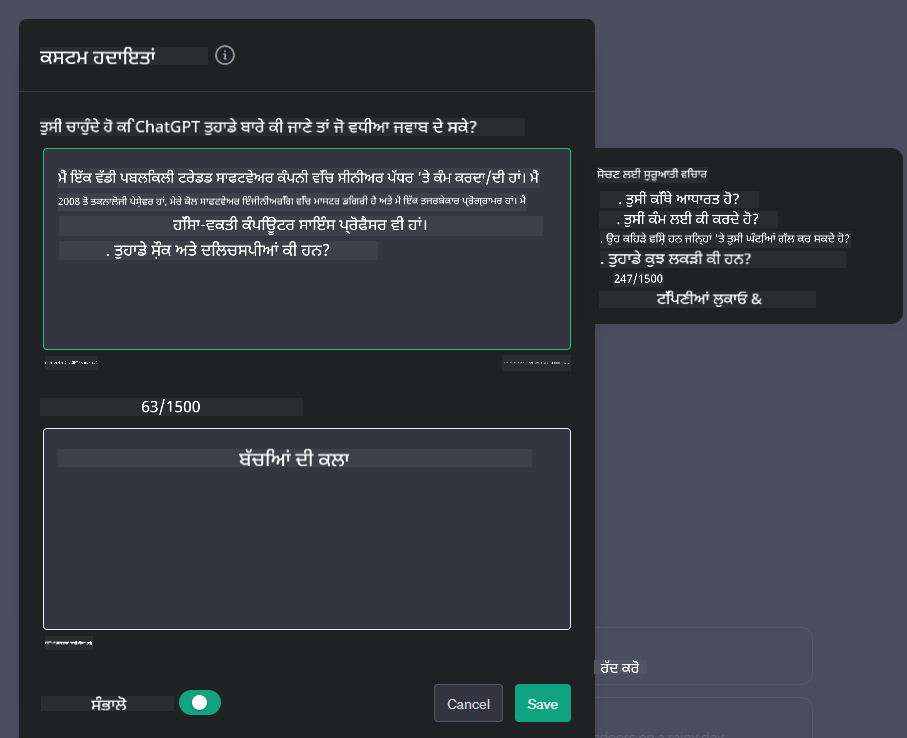
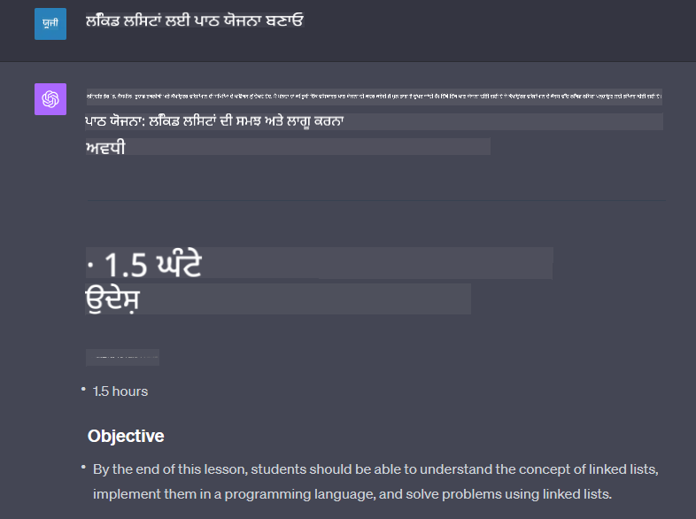

<!--
CO_OP_TRANSLATOR_METADATA:
{
  "original_hash": "a1f836db3d459bfd326b6fadca90866c",
  "translation_date": "2025-10-17T14:23:57+00:00",
  "source_file": "07-building-chat-applications/README.md",
  "language_code": "pa"
}
-->
# ਜਨਰੇਟਿਵ AI-ਚਲਿਤ ਚੈਟ ਐਪਲੀਕੇਸ਼ਨ ਬਣਾਉਣਾ

[](https://youtu.be/R9V0ZY1BEQo?si=IHuU-fS9YWT8s4sA)

> _(ਉਪਰ ਦਿੱਤੀ ਤਸਵੀਰ 'ਤੇ ਕਲਿਕ ਕਰਕੇ ਇਸ ਪਾਠ ਦਾ ਵੀਡੀਓ ਵੇਖੋ)_

ਹੁਣ ਜਦੋਂ ਕਿ ਅਸੀਂ ਦੇਖ ਲਿਆ ਹੈ ਕਿ ਅਸੀਂ ਟੈਕਸਟ-ਜਨਰੇਸ਼ਨ ਐਪਸ ਕਿਵੇਂ ਬਣਾਉਂਦੇ ਹਾਂ, ਆਓ ਚੈਟ ਐਪਲੀਕੇਸ਼ਨਜ਼ ਦੀ ਜਾਂਚ ਕਰੀਏ।

ਚੈਟ ਐਪਲੀਕੇਸ਼ਨਜ਼ ਸਾਡੇ ਰੋਜ਼ਾਨਾ ਜੀਵਨ ਦਾ ਹਿੱਸਾ ਬਣ ਗਈਆਂ ਹਨ, ਜੋ ਸਿਰਫ਼ ਆਮ ਗੱਲਬਾਤ ਦਾ ਸਾਧਨ ਹੀ ਨਹੀਂ ਹਨ। ਇਹ ਗਾਹਕ ਸੇਵਾ, ਤਕਨੀਕੀ ਸਹਾਇਤਾ, ਅਤੇ ਜਟਿਲ ਸਲਾਹਕਾਰ ਪ੍ਰਣਾਲੀਆਂ ਦੇ ਅਹਿਮ ਹਿੱਸੇ ਹਨ। ਸੰਭਵ ਹੈ ਕਿ ਤੁਹਾਨੂੰ ਹਾਲ ਹੀ ਵਿੱਚ ਕਿਸੇ ਚੈਟ ਐਪਲੀਕੇਸ਼ਨ ਤੋਂ ਮਦਦ ਮਿਲੀ ਹੋਵੇ। ਜਦੋਂ ਅਸੀਂ ਜਨਰੇਟਿਵ AI ਵਰਗੀਆਂ ਅਗਰਗਾਮੀ ਤਕਨੀਕਾਂ ਨੂੰ ਇਨ੍ਹਾਂ ਪਲੇਟਫਾਰਮਾਂ ਵਿੱਚ ਸ਼ਾਮਲ ਕਰਦੇ ਹਾਂ, ਤਾਂ ਜਟਿਲਤਾ ਵਧਦੀ ਹੈ ਅਤੇ ਚੁਣੌਤੀਆਂ ਵੀ ਵਧਦੀਆਂ ਹਨ।

ਕੁਝ ਸਵਾਲ ਜਿਨ੍ਹਾਂ ਦੇ ਜਵਾਬ ਲੱਭਣੇ ਜ਼ਰੂਰੀ ਹਨ:

- **ਐਪ ਬਣਾਉਣਾ**। ਅਸੀਂ ਕਿਵੇਂ ਕੁਸ਼ਲਤਾਪੂਰਵਕ AI-ਚਲਿਤ ਐਪਲੀਕੇਸ਼ਨਜ਼ ਨੂੰ ਖਾਸ ਉਪਯੋਗਤਾ ਲਈ ਬਣਾਉਂਦੇ ਅਤੇ ਸ਼ਾਮਲ ਕਰਦੇ ਹਾਂ?
- **ਨਿਗਰਾਨੀ**। ਜਦੋਂ ਇਹ ਤੈਨਾਤ ਹੁੰਦੇ ਹਨ, ਅਸੀਂ ਕਿਵੇਂ ਇਹ ਯਕੀਨੀ ਬਣਾਉਂਦੇ ਹਾਂ ਕਿ ਐਪਲੀਕੇਸ਼ਨਜ਼ ਉੱਚ ਗੁਣਵੱਤਾ ਦੇ ਸਥਰ 'ਤੇ ਕੰਮ ਕਰ ਰਹੇ ਹਨ, ਫੰਕਸ਼ਨਲਟੀ ਅਤੇ [ਜਿੰਮੇਵਾਰ AI ਦੇ ਛੇ ਸਿਧਾਂਤਾਂ](https://www.microsoft.com/ai/responsible-ai?WT.mc_id=academic-105485-koreyst) ਦੇ ਅਨੁਸਾਰ?

ਜਦੋਂ ਅਸੀਂ ਆਟੋਮੇਸ਼ਨ ਅਤੇ ਮਨੁੱਖ-ਮਸ਼ੀਨ ਸੰਚਾਰ ਦੇ ਯੁੱਗ ਵਿੱਚ ਅੱਗੇ ਵਧਦੇ ਹਾਂ, ਜਨਰੇਟਿਵ AI ਕਿਵੇਂ ਚੈਟ ਐਪਲੀਕੇਸ਼ਨਜ਼ ਦੀ ਵਿਸਤਾਰ, ਗਹਿਰਾਈ, ਅਤੇ ਅਨੁਕੂਲਤਾ ਨੂੰ ਬਦਲਦਾ ਹੈ, ਇਹ ਸਮਝਣਾ ਅਹਿਮ ਹੋ ਜਾਂਦਾ ਹੈ। ਇਹ ਪਾਠ ਇਨ੍ਹਾਂ ਜਟਿਲ ਪ੍ਰਣਾਲੀਆਂ ਨੂੰ ਸਹਾਇਕ ਬਣਾਉਣ ਵਾਲੇ ਆਰਕੀਟੈਕਚਰ ਦੇ ਪਹਲੂਆਂ ਦੀ ਜਾਂਚ ਕਰੇਗਾ, ਖੇਤਰ-ਵਿਸ਼ੇਸ਼ ਕੰਮਾਂ ਲਈ ਇਨ੍ਹਾਂ ਨੂੰ ਸੁਧਾਰਨ ਦੇ ਤਰੀਕਿਆਂ ਦੀ ਜਾਂਚ ਕਰੇਗਾ, ਅਤੇ ਜਿੰਮੇਵਾਰ AI ਤੈਨਾਤੀ ਨੂੰ ਯਕੀਨੀ ਬਣਾਉਣ ਲਈ ਮਾਪਦੰਡਾਂ ਅਤੇ ਵਿਚਾਰਾਂ ਦਾ ਮੁਲਾਂਕਣ ਕਰੇਗਾ।

## ਪਰਿਚਯ

ਇਹ ਪਾਠ ਕਵਰ ਕਰਦਾ ਹੈ:

- ਚੈਟ ਐਪਲੀਕੇਸ਼ਨਜ਼ ਨੂੰ ਕੁਸ਼ਲਤਾਪੂਰਵਕ ਬਣਾਉਣ ਅਤੇ ਸ਼ਾਮਲ ਕਰਨ ਦੇ ਤਕਨੀਕਾਂ।
- ਐਪਲੀਕੇਸ਼ਨਜ਼ ਵਿੱਚ ਕਸਟਮਾਈਜ਼ੇਸ਼ਨ ਅਤੇ ਸੁਧਾਰਨ ਨੂੰ ਕਿਵੇਂ ਲਾਗੂ ਕਰਨਾ ਹੈ।
- ਚੈਟ ਐਪਲੀਕੇਸ਼ਨਜ਼ ਦੀ ਨਿਗਰਾਨੀ ਕਰਨ ਦੇ ਤਰੀਕੇ ਅਤੇ ਵਿਚਾਰ।

## ਸਿੱਖਣ ਦੇ ਲਕਸ਼

ਇਸ ਪਾਠ ਦੇ ਅੰਤ ਤੱਕ, ਤੁਸੀਂ ਸਮਰੱਥ ਹੋਵੋਗੇ:

- ਮੌਜੂਦਾ ਪ੍ਰਣਾਲੀਆਂ ਵਿੱਚ ਚੈਟ ਐਪਲੀਕੇਸ਼ਨਜ਼ ਨੂੰ ਬਣਾਉਣ ਅਤੇ ਸ਼ਾਮਲ ਕਰਨ ਲਈ ਵਿਚਾਰਾਂ ਦਾ ਵਰਣਨ ਕਰਨ।
- ਖਾਸ ਉਪਯੋਗਤਾਵਾਂ ਲਈ ਚੈਟ ਐਪਲੀਕੇਸ਼ਨਜ਼ ਨੂੰ ਕਸਟਮਾਈਜ਼ ਕਰਨਾ।
- AI-ਚਲਿਤ ਚੈਟ ਐਪਲੀਕੇਸ਼ਨਜ਼ ਦੀ ਗੁਣਵੱਤਾ ਨੂੰ ਕੁਸ਼ਲਤਾਪੂਰਵਕ ਨਿਗਰਾਨੀ ਅਤੇ ਰੱਖਣ ਲਈ ਮੁੱਖ ਮਾਪਦੰਡਾਂ ਅਤੇ ਵਿਚਾਰਾਂ ਦੀ ਪਛਾਣ।
- ਯਕੀਨੀ ਬਣਾਉਣਾ ਕਿ ਚੈਟ ਐਪਲੀਕੇਸ਼ਨਜ਼ ਜਿੰਮੇਵਾਰ ਤਰੀਕੇ ਨਾਲ AI ਦਾ ਲਾਭ ਲੈਂਦੇ ਹਨ।

## ਚੈਟ ਐਪਲੀਕੇਸ਼ਨਜ਼ ਵਿੱਚ ਜਨਰੇਟਿਵ AI ਨੂੰ ਸ਼ਾਮਲ ਕਰਨਾ

ਚੈਟ ਐਪਲੀਕੇਸ਼ਨਜ਼ ਨੂੰ ਜਨਰੇਟਿਵ AI ਦੇ ਜ਼ਰੀਏ ਉੱਚਾ ਚੁੱਕਣਾ ਸਿਰਫ਼ ਇਹਨਾਂ ਨੂੰ ਹੋਸ਼ਿਆਰ ਬਣਾਉਣ ਬਾਰੇ ਨਹੀਂ ਹੈ; ਇਹਨਾਂ ਦੇ ਆਰਕੀਟੈਕਚਰ, ਪ੍ਰਦਰਸ਼ਨ, ਅਤੇ ਯੂਜ਼ਰ ਇੰਟਰਫੇਸ ਨੂੰ ਅਨੁਕੂਲ ਬਣਾਉਣ ਬਾਰੇ ਹੈ ਤਾਂ ਜੋ ਇੱਕ ਗੁਣਵੱਤਾ ਵਾਲਾ ਯੂਜ਼ਰ ਅਨੁਭਵ ਪ੍ਰਦਾਨ ਕੀਤਾ ਜਾ ਸਕੇ। ਇਸ ਵਿੱਚ ਆਰਕੀਟੈਕਚਰਲ ਨੀਵਾਂ, API ਇੰਟੀਗ੍ਰੇਸ਼ਨ, ਅਤੇ ਯੂਜ਼ਰ ਇੰਟਰਫੇਸ ਦੇ ਵਿਚਾਰਾਂ ਦੀ ਜਾਂਚ ਸ਼ਾਮਲ ਹੈ। ਇਹ ਭਾਗ ਤੁਹਾਨੂੰ ਇਨ੍ਹਾਂ ਜਟਿਲ ਖੇਤਰਾਂ ਨੂੰ ਸਮਝਣ ਲਈ ਇੱਕ ਵਿਸਤ੍ਰਿਤ ਰੋਡਮੈਪ ਪ੍ਰਦਾਨ ਕਰਨ ਦਾ ਉਦੇਸ਼ ਰੱਖਦਾ ਹੈ, ਚਾਹੇ ਤੁਸੀਂ ਇਹਨਾਂ ਨੂੰ ਮੌਜੂਦਾ ਪ੍ਰਣਾਲੀਆਂ ਵਿੱਚ ਸ਼ਾਮਲ ਕਰ ਰਹੇ ਹੋ ਜਾਂ ਇਹਨਾਂ ਨੂੰ ਸਵਤੰਤਰ ਪਲੇਟਫਾਰਮਾਂ ਵਜੋਂ ਬਣਾਉਣ ਦੀ ਯੋਜਨਾ ਬਣਾ ਰਹੇ ਹੋ।

ਇਸ ਭਾਗ ਦੇ ਅੰਤ ਤੱਕ, ਤੁਸੀਂ ਚੈਟ ਐਪਲੀਕੇਸ਼ਨਜ਼ ਨੂੰ ਕੁਸ਼ਲਤਾਪੂਰਵਕ ਬਣਾਉਣ ਅਤੇ ਸ਼ਾਮਲ ਕਰਨ ਲਈ ਜ਼ਰੂਰੀ ਮਾਹਰਤਾ ਨਾਲ ਸਜਜ ਹੋਵੋਗੇ।

### ਚੈਟਬੋਟ ਜਾਂ ਚੈਟ ਐਪਲੀਕੇਸ਼ਨ?

ਚੈਟ ਐਪਲੀਕੇਸ਼ਨਜ਼ ਬਣਾਉਣ ਤੋਂ ਪਹਿਲਾਂ, ਆਓ 'ਚੈਟਬੋਟ' ਅਤੇ 'AI-ਚਲਿਤ ਚੈਟ ਐਪਲੀਕੇਸ਼ਨਜ਼' ਦੀ ਤੁਲਨਾ ਕਰੀਏ, ਜੋ ਵੱਖ-ਵੱਖ ਭੂਮਿਕਾਵਾਂ ਅਤੇ ਕਾਰਗੁਜ਼ਾਰੀ ਪ੍ਰਦਾਨ ਕਰਦੇ ਹਨ। ਚੈਟਬੋਟ ਦਾ ਮੁੱਖ ਉਦੇਸ਼ ਖਾਸ ਗੱਲਬਾਤੀ ਕੰਮਾਂ ਨੂੰ ਆਟੋਮੇਟ ਕਰਨਾ ਹੈ, ਜਿਵੇਂ ਕਿ ਅਕਸਰ ਪੁੱਛੇ ਜਾਣ ਵਾਲੇ ਸਵਾਲਾਂ ਦੇ ਜਵਾਬ ਦੇਣਾ ਜਾਂ ਪੈਕੇਜ ਨੂੰ ਟ੍ਰੈਕ ਕਰਨਾ। ਇਹ ਆਮ ਤੌਰ 'ਤੇ ਨਿਯਮ-ਅਧਾਰਿਤ ਤਰਕ ਜਾਂ ਜਟਿਲ AI ਅਲਗੋਰਿਥਮਾਂ ਦੁਆਰਾ ਚਲਾਇਆ ਜਾਂਦਾ ਹੈ। ਇਸਦੇ ਉਲਟ, AI-ਚਲਿਤ ਚੈਟ ਐਪਲੀਕੇਸ਼ਨ ਇੱਕ ਕਾਫ਼ੀ ਵਿਆਪਕ ਵਾਤਾਵਰਣ ਹੈ ਜੋ ਮਨੁੱਖੀ ਯੂਜ਼ਰਾਂ ਵਿਚਕਾਰ ਟੈਕਸਟ, ਵਾਇਸ, ਅਤੇ ਵੀਡੀਓ ਚੈਟ ਵਰਗੇ ਵੱਖ-ਵੱਖ ਡਿਜੀਟਲ ਸੰਚਾਰ ਦੇ ਰੂਪਾਂ ਨੂੰ ਸਹਾਇਕ ਬਣਾਉਣ ਲਈ ਡਿਜ਼ਾਈਨ ਕੀਤਾ ਗਿਆ ਹੈ। ਇਸਦੀ ਪਰਿਭਾਸ਼ਿਤ ਵਿਸ਼ੇਸ਼ਤਾ ਇੱਕ ਜਨਰੇਟਿਵ AI ਮਾਡਲ ਦੀ ਸ਼ਾਮਲਤਾ ਹੈ ਜੋ ਸੁਮਝਦਾਰ, ਮਨੁੱਖ-ਜਿਵੇਂ ਗੱਲਬਾਤਾਂ ਦਾ ਨਕਲ ਕਰਦਾ ਹੈ, ਵੱਖ-ਵੱਖ ਇਨਪੁਟ ਅਤੇ ਸੰਦਰਭ ਸੰਕੇਤਾਂ ਦੇ ਆਧਾਰ 'ਤੇ ਜਵਾਬ ਪੈਦਾ ਕਰਦਾ ਹੈ। ਜਨਰੇਟਿਵ AI-ਚਲਿਤ ਚੈਟ ਐਪਲੀਕੇਸ਼ਨ ਖੁੱਲੇ-ਡੋਮੇਨ ਚਰਚਾ ਵਿੱਚ ਸ਼ਾਮਲ ਹੋ ਸਕਦਾ ਹੈ, ਵਿਕਾਸਸ਼ੀਲ ਗੱਲਬਾਤੀ ਸੰਦਰਭਾਂ ਨੂੰ ਅਨੁਕੂਲ ਕਰ ਸਕਦਾ ਹੈ, ਅਤੇ ਰਚਨਾਤਮਕ ਜਾਂ ਜਟਿਲ ਗੱਲਬਾਤ ਪੈਦਾ ਕਰ ਸਕਦਾ ਹੈ।

ਹੇਠਾਂ ਦਿੱਤੇ ਟੇਬਲ ਵਿੱਚ ਡਿਜੀਟਲ ਸੰਚਾਰ ਵਿੱਚ ਇਹਨਾਂ ਦੀ ਵਿਲੱਖਣ ਭੂਮਿਕਾਵਾਂ ਨੂੰ ਸਮਝਣ ਲਈ ਮੁੱਖ ਅੰਤਰ ਅਤੇ ਸਮਾਨਤਾਵਾਂ ਦਰਸਾਈਆਂ ਗਈਆਂ ਹਨ।

| ਚੈਟਬੋਟ                              | ਜਨਰੇਟਿਵ AI-ਚਲਿਤ ਚੈਟ ਐਪਲੀਕੇਸ਼ਨ |
| ------------------------------------ | -------------------------------- |
| ਕੰਮ-ਕੇਂਦਰਤ ਅਤੇ ਨਿਯਮ-ਅਧਾਰਿਤ         | ਸੰਦਰਭ-ਜਾਗਰੂਕ                   |
| ਆਮ ਤੌਰ 'ਤੇ ਵੱਡੇ ਸਿਸਟਮਾਂ ਵਿੱਚ ਸ਼ਾਮਲ  | ਇੱਕ ਜਾਂ ਕਈ ਚੈਟਬੋਟਾਂ ਦੀ ਮਜ਼ਬਾਨੀ ਕਰ ਸਕਦਾ ਹੈ |
| ਪ੍ਰੋਗਰਾਮ ਕੀਤੀਆਂ ਕਾਰਗੁਜ਼ਾਰੀ ਤੱਕ ਸੀਮਿਤ | ਜਨਰੇਟਿਵ AI ਮਾਡਲਾਂ ਨੂੰ ਸ਼ਾਮਲ ਕਰਦਾ ਹੈ |
| ਵਿਸ਼ੇਸ਼ ਅਤੇ ਸੰਰਚਿਤ ਗੱਲਬਾਤ            | ਖੁੱਲੇ-ਡੋਮੇਨ ਚਰਚਾ ਕਰਨ ਦੇ ਯੋਗ |

### SDKs ਅਤੇ APIs ਨਾਲ ਪਹਿਲਾਂ ਤੋਂ ਬਣੀ ਕਾਰਗੁਜ਼ਾਰੀ ਦਾ ਲਾਭ ਲੈਣਾ

ਜਦੋਂ ਚੈਟ ਐਪਲੀਕੇਸ਼ਨ ਬਣਾਉਣ ਦੀ ਗੱਲ ਆਉਂਦੀ ਹੈ, ਤਾਂ ਇੱਕ ਵਧੀਆ ਪਹਿਲਾ ਕਦਮ ਇਹ ਹੈ ਕਿ ਜੋ ਪਹਿਲਾਂ ਹੀ ਉਪਲਬਧ ਹੈ ਉਸਦੀ ਜਾਂਚ ਕੀਤੀ ਜਾਵੇ। SDKs ਅਤੇ APIs ਦੀ ਵਰਤੋਂ ਕਰਕੇ ਚੈਟ ਐਪਲੀਕੇਸ਼ਨ ਬਣਾਉਣਾ ਕਈ ਕਾਰਨਾਂ ਕਰਕੇ ਲਾਭਦਾਇਕ ਰਣਨੀਤੀ ਹੈ। ਚੰਗੀ ਤਰ੍ਹਾਂ ਦਸਤਾਵੇਜ਼ ਕੀਤੇ ਗਏ SDKs ਅਤੇ APIs ਨੂੰ ਸ਼ਾਮਲ ਕਰਕੇ, ਤੁਸੀਂ ਆਪਣੀ ਐਪਲੀਕੇਸ਼ਨ ਨੂੰ ਲੰਬੇ ਸਮੇਂ ਦੀ ਸਫਲਤਾ ਲਈ ਰਣਨੀਤਿਕ ਤੌਰ 'ਤੇ ਸਥਿਤ ਕਰਦੇ ਹੋ, ਸਕੇਲਬਿਲਟੀ ਅਤੇ ਰੱਖ-ਰਖਾਵ ਦੇ ਚਿੰਤਾਵਾਂ ਨੂੰ ਹੱਲ ਕਰਦੇ ਹੋ।

- **ਵਿਕਾਸ ਪ੍ਰਕਿਰਿਆ ਨੂੰ ਤੇਜ਼ ਕਰਦਾ ਹੈ ਅਤੇ ਖਰਚ ਨੂੰ ਘਟਾਉਂਦਾ ਹੈ**: ਪਹਿਲਾਂ ਤੋਂ ਬਣੀ ਕਾਰਗੁਜ਼ਾਰੀ 'ਤੇ ਨਿਰਭਰ ਰਹਿਣਾ, ਆਪਣੇ ਆਪ ਇਹਨਾਂ ਨੂੰ ਬਣਾਉਣ ਦੀ ਮਹਿੰਗੀ ਪ੍ਰਕਿਰਿਆ ਦੇ ਬਦਲੇ, ਤੁਹਾਨੂੰ ਆਪਣੀ ਐਪਲੀਕੇਸ਼ਨ ਦੇ ਹੋਰ ਪਹਲੂਆਂ 'ਤੇ ਧਿਆਨ ਕੇਂਦਰਿਤ ਕਰਨ ਦੀ ਆਜ਼ਾਦੀ ਦਿੰਦਾ ਹੈ।
- **ਵਧੀਆ ਪ੍ਰਦਰਸ਼ਨ**: ਜਦੋਂ ਕਾਰਗੁਜ਼ਾਰੀ ਨੂੰ ਸ਼ੁਰੂ ਤੋਂ ਬਣਾਇਆ ਜਾਂਦਾ ਹੈ, ਤਾਂ ਤੁਸੀਂ ਅਖੀਰ ਵਿੱਚ ਆਪਣੇ ਆਪ ਨੂੰ ਪੁੱਛਦੇ ਹੋ "ਇਹ ਕਿਵੇਂ ਸਕੇਲ ਕਰਦਾ ਹੈ? ਕੀ ਇਹ ਐਪਲੀਕੇਸ਼ਨ ਯੂਜ਼ਰਾਂ ਦੇ ਅਚਾਨਕ ਵਾਧੇ ਨੂੰ ਸੰਭਾਲਣ ਦੇ ਯੋਗ ਹੈ?" ਚੰਗੀ ਤਰ੍ਹਾਂ ਰੱਖ-ਰਖਾਵ ਕੀਤੇ ਗਏ SDK ਅਤੇ APIs ਅਕਸਰ ਇਨ੍ਹਾਂ ਚਿੰਤਾਵਾਂ ਲਈ ਬਣਾਈਆਂ ਗਈਆਂ ਹੱਲਾਂ ਰੱਖਦੇ ਹਨ।
- **ਸੌਖਾ ਰੱਖ-ਰਖਾਵ**: ਅੱਪਡੇਟ ਅਤੇ ਸੁਧਾਰਾਂ ਨੂੰ ਮੈਨੇਜ ਕਰਨਾ ਸੌਖਾ ਹੁੰਦਾ ਹੈ ਕਿਉਂਕਿ ਜ਼ਿਆਦਾਤਰ APIs ਅਤੇ SDKs ਸਿਰਫ਼ ਇੱਕ ਲਾਇਬ੍ਰੇਰੀ ਨੂੰ ਅੱਪਡੇਟ ਕਰਨ ਦੀ ਲੋੜ ਹੁੰਦੀ ਹੈ ਜਦੋਂ ਨਵਾਂ ਵਰਜਨ ਜਾਰੀ ਕੀਤਾ ਜਾਂਦਾ ਹੈ।
- **ਅਗਰਗਾਮੀ ਤਕਨੀਕ ਤੱਕ ਪਹੁੰਚ**: ਮਾਡਲਾਂ ਨੂੰ ਲਾਭਦਾਇਕ ਬਣਾਉਣਾ ਜੋ ਵੱਡੇ ਡੇਟਾਸੈਟਾਂ 'ਤੇ ਸੁਧਾਰੇ ਅਤੇ ਪ੍ਰਸ਼ਿਕਸ਼ਿਤ ਕੀਤੇ ਗਏ ਹਨ ਤੁਹਾਡੀ ਐਪਲੀਕੇਸ਼ਨ ਨੂੰ ਕੁਦਰਤੀ ਭਾਸ਼ਾ ਦੀ ਸਮਰੱਥਾ ਪ੍ਰਦਾਨ ਕਰਦਾ ਹੈ।

SDK ਜਾਂ API ਦੀ ਕਾਰਗੁਜ਼ਾਰੀ ਤੱਕ ਪਹੁੰਚ ਹਾਸਲ ਕਰਨਾ ਆਮ ਤੌਰ 'ਤੇ ਪ੍ਰਦਾਨ ਕੀਤੇ ਗਏ ਸੇਵਾਵਾਂ ਦੀ ਵਰਤੋਂ ਕਰਨ ਦੀ ਇਜਾਜ਼ਤ ਪ੍ਰਾਪਤ ਕਰਨ ਨੂੰ ਸ਼ਾਮਲ ਕਰਦਾ ਹੈ, ਜੋ ਅਕਸਰ ਇੱਕ ਵਿਲੱਖਣ ਕੁੰਜੀ ਜਾਂ ਪ੍ਰਮਾਣਿਕਤਾ ਟੋਕਨ ਦੀ ਵਰਤੋਂ ਦੁਆਰਾ ਹੁੰਦਾ ਹੈ। ਅਸੀਂ OpenAI ਪਾਇਥਨ ਲਾਇਬ੍ਰੇਰੀ ਦੀ ਵਰਤੋਂ ਕਰਕੇ ਇਸ ਨੂੰ ਕਿਵੇਂ ਕਰਨਾ ਹੈ, ਦੀ ਜਾਂਚ ਕਰਾਂਗੇ। ਤੁਸੀਂ ਇਸ ਪਾਠ ਲਈ [OpenAI ਲਈ ਨੋਟਬੁੱਕ](./python/oai-assignment.ipynb?WT.mc_id=academic-105485-koreyst) ਜਾਂ [Azure OpenAI ਸੇਵਾਵਾਂ ਲਈ ਨੋਟਬੁੱਕ](./python/aoai-assignment.ipynb?WT.mc_id=academic-105485-koreys) 'ਤੇ ਆਪਣੇ ਆਪ ਨੂੰ ਅਜ਼ਮਾਈ ਸਕਦੇ ਹੋ।

```python
import os
from openai import OpenAI

API_KEY = os.getenv("OPENAI_API_KEY","")

client = OpenAI(
    api_key=API_KEY
    )

chat_completion = client.chat.completions.create(model="gpt-3.5-turbo", messages=[{"role": "user", "content": "Suggest two titles for an instructional lesson on chat applications for generative AI."}])
```

ਉਪਰ ਦਿੱਤੇ ਉਦਾਹਰਣ ਵਿੱਚ GPT-3.5 Turbo ਮਾਡਲ ਨੂੰ ਪ੍ਰੋੰਪਟ ਪੂਰਾ ਕਰਨ ਲਈ ਵਰਤਿਆ ਗਿਆ ਹੈ, ਪਰ ਧਿਆਨ ਦਿਓ ਕਿ API ਕੁੰਜੀ ਨੂੰ ਪਹਿਲਾਂ ਸੈਟ ਕੀਤਾ ਗਿਆ ਹੈ। ਜੇ ਤੁਸੀਂ ਕੁੰਜੀ ਸੈਟ ਨਹੀਂ ਕਰਦੇ ਤਾਂ ਤੁਹਾਨੂੰ ਇੱਕ ਗਲਤੀ ਮਿਲੇਗੀ।

## ਯੂਜ਼ਰ ਅਨੁਭਵ (UX)

ਜਨਰਲ UX ਸਿਧਾਂਤ ਚੈਟ ਐਪਲੀਕੇਸ਼ਨਜ਼ 'ਤੇ ਲਾਗੂ ਹੁੰਦੇ ਹਨ, ਪਰ ਇੱਥੇ ਕੁਝ ਵਾਧੂ ਵਿਚਾਰ ਹਨ ਜੋ ਮਸ਼ੀਨ ਲਰਨਿੰਗ ਦੇ ਘਟਕਾਂ ਦੇ ਕਾਰਨ ਖਾਸ ਤੌਰ 'ਤੇ ਮਹੱਤਵਪੂਰਨ ਬਣ ਜਾਂਦੇ ਹਨ।

- **ਅਸਪਸ਼ਟਤਾ ਨੂੰ ਦੂਰ ਕਰਨ ਦਾ ਮਕੈਨਿਜ਼ਮ**: ਜਨਰੇਟਿਵ AI ਮਾਡਲ ਕਈ ਵਾਰ ਅਸਪਸ਼ਟ ਜਵਾਬ ਪੈਦਾ ਕਰਦੇ ਹਨ। ਇੱਕ ਵਿਸ਼ੇਸ਼ਤਾ ਜੋ ਯੂਜ਼ਰਾਂ ਨੂੰ ਸਪਸ਼ਟੀਕਰਨ ਲਈ ਪੁੱਛਣ ਦੀ ਆਗਿਆ ਦਿੰਦੀ ਹੈ, ਇਸ ਸਮੱਸਿਆ ਦਾ ਸਾਹਮਣਾ ਕਰਨ 'ਤੇ ਮਦਦਗਾਰ ਹੋ ਸਕਦੀ ਹੈ।
- **ਸੰਦਰਭ ਰੱਖਣਾ**: ਅਗਰਗਾਮੀ ਜਨਰੇਟਿਵ AI ਮਾਡਲ ਗੱਲਬਾਤ ਵਿੱਚ ਸੰਦਰਭ ਨੂੰ ਯਾਦ ਰੱਖਣ ਦੀ ਸਮਰੱਥਾ ਰੱਖਦੇ ਹਨ, ਜੋ ਕਿ ਯੂਜ਼ਰ ਅਨੁਭਵ ਲਈ ਇੱਕ ਜ਼ਰੂਰੀ ਸੰਪਤੀ ਹੋ ਸਕਦੀ ਹੈ। ਯੂਜ਼ਰਾਂ ਨੂੰ ਸੰਦਰਭ ਨੂੰ ਨਿਯੰਤਰਿਤ ਅਤੇ ਪ੍ਰਬੰਧਿਤ ਕਰਨ ਦੀ ਸਮਰੱਥਾ ਦੇਣ ਨਾਲ ਯੂਜ਼ਰ ਅਨੁਭਵ ਵਿੱਚ ਸੁਧਾਰ ਹੁੰਦਾ ਹੈ, ਪਰ ਸੰਵੇਦਨਸ਼ੀਲ ਯੂਜ਼ਰ ਜਾਣਕਾਰੀ ਨੂੰ ਰੱਖਣ ਦਾ ਖਤਰਾ ਪੈਦਾ ਹੁੰਦਾ ਹੈ। ਇਸ ਜਾਣਕਾਰੀ ਨੂੰ ਕਿੰਨਾ ਸਮਾਂ ਰੱਖਿਆ ਜਾਂਦਾ ਹੈ, ਜਿਵੇਂ ਕਿ ਰਿਟੇਨਸ਼ਨ ਨੀਤੀ ਲਾਗੂ ਕਰਨਾ, ਸੰਦਰਭ ਦੀ ਲੋੜ ਨੂੰ ਗੋਪਨੀਯਤਾ ਦੇ ਖਿਲਾਫ ਸੰਤੁਲਿਤ ਕਰ ਸਕਦਾ ਹੈ।
- **ਪ੍ਰਸਨਿਕਤਾ**: ਸਿੱਖਣ ਅਤੇ ਅਨੁਕੂਲ ਕਰਨ ਦੀ ਸਮਰੱਥਾ ਨਾਲ, AI ਮਾਡਲ ਯੂਜ਼ਰ ਲਈ ਇੱਕ ਵਿਅਕਤੀਗਤ ਅਨੁਭਵ ਪ੍ਰਦਾਨ ਕਰਦੇ ਹਨ। ਯੂਜ਼ਰ ਪ੍ਰੋਫਾਈਲ ਵਰਗੀਆਂ ਵਿਸ਼ੇਸ਼ਤਾਵਾਂ ਦੁਆਰਾ ਯੂਜ਼ਰ ਅਨੁਭਵ ਨੂੰ ਅਨੁਕੂਲ ਬਣਾਉਣਾ ਸਿਰਫ਼ ਯੂਜ਼ਰ ਨੂੰ ਸਮਝਣ ਦਾ ਅਹਿਸਾਸ ਹੀ ਨਹੀਂ ਦਿੰਦਾ, ਪਰ ਇਹ ਉਨ੍ਹਾਂ ਦੇ ਖਾਸ ਜਵਾਬ ਲੱਭਣ ਦੇ ਯਤਨ ਵਿੱਚ ਵੀ ਮਦਦ ਕਰਦਾ ਹੈ, ਇੱਕ ਹੋਰ ਕੁਸ਼ਲ ਅਤੇ ਸੰਤੁਸ਼ਟ ਗੱਲਬਾਤ ਬਣਾਉਂਦਾ ਹੈ।

ਇੱਕ ਪ੍ਰਸਨਿਕਤਾ ਦਾ ਉਦਾਹਰਣ OpenAI ਦੇ ChatGPT ਵਿੱਚ "Custom instructions" ਸੈਟਿੰਗ ਹੈ। ਇਹ ਤੁਹਾਨੂੰ ਆਪਣੇ ਬਾਰੇ ਜਾਣਕਾਰੀ ਪ੍ਰਦਾਨ ਕਰਨ ਦੀ ਆਗਿਆ ਦਿੰਦਾ ਹੈ ਜੋ ਤੁਹਾਡੇ ਪ੍ਰੋੰਪਟਾਂ ਲਈ ਮਹੱਤਵਪੂਰਨ ਸੰਦਰਭ ਹੋ ਸਕਦੀ ਹੈ। ਇੱਥੇ ਇੱਕ ਕਸਟਮ ਇੰਸਟ੍ਰਕਸ਼ਨ ਦਾ ਉਦਾਹਰਣ ਹੈ।



ਇਹ "ਪ੍ਰੋਫਾਈਲ" ChatGPT ਨੂੰ ਲਿੰਕਡ ਲਿਸਟਾਂ 'ਤੇ ਪਾਠ ਯੋਜਨਾ ਬਣਾਉਣ ਲਈ ਪ੍ਰੋੰਪਟ ਕਰਦਾ ਹੈ। ਧਿਆਨ ਦਿਓ ਕਿ ChatGPT ਇਹ ਗੱਲ ਧਿਆਨ ਵਿੱਚ ਰੱਖਦਾ ਹੈ ਕਿ ਯੂਜ਼ਰ ਆਪਣੇ ਅਨੁਭਵ ਦੇ ਆਧਾਰ 'ਤੇ ਇੱਕ ਹੋਰ ਵਿਸਤ੍ਰਿਤ ਪਾਠ ਯੋਜਨਾ ਚਾਹੁੰਦਾ ਹੈ।



### ਮਾਈਕਰੋਸਾਫਟ ਦਾ ਸਿਸਟਮ ਮੈਸੇਜ ਫਰੇਮਵਰਕ ਵੱਡੇ ਭਾਸ਼ਾ ਮਾਡਲਾਂ ਲਈ

[ਮਾਈਕਰੋਸਾਫਟ ਨੇ](https://learn.microsoft.com/azure/ai-services/openai/concepts/system-message#define-the-models-output-format?WT.mc_id=academic
| **ਅਨੋਮਲੀ ਡਿਟੈਕਸ਼ਨ**         | ਅਜਿਹੇ ਪੈਟਰਨ ਦੀ ਪਛਾਣ ਕਰਨ ਲਈ ਸੰਦ ਅਤੇ ਤਕਨੀਕਾਂ ਜੋ ਉਮੀਦਵਾਰ ਵਿਹਾਰ ਨਾਲ ਮੇਲ ਨਹੀਂ ਖਾਂਦੀਆਂ।                        | ਤੁਸੀਂ ਅਨੋਮਲੀਜ਼ ਨੂੰ ਕਿਵੇਂ ਜਵਾਬ ਦੋਗੇ?                                        |

### ਚੈਟ ਐਪਲੀਕੇਸ਼ਨ ਵਿੱਚ ਜ਼ਿੰਮੇਵਾਰ AI ਅਭਿਆਸ ਲਾਗੂ ਕਰਨਾ

ਮਾਈਕਰੋਸਾਫਟ ਦੇ ਜ਼ਿੰਮੇਵਾਰ AI ਦੇ ਦ੍ਰਿਸ਼ਟਿਕੋਣ ਨੇ ਛੇ ਸਿਧਾਂਤਾਂ ਦੀ ਪਛਾਣ ਕੀਤੀ ਹੈ ਜੋ AI ਵਿਕਾਸ ਅਤੇ ਇਸਦੇ ਉਪਯੋਗ ਨੂੰ ਮਾਰਗਦਰਸ਼ਨ ਕਰਨ ਚਾਹੀਦੇ ਹਨ। ਹੇਠਾਂ ਸਿਧਾਂਤ, ਉਨ੍ਹਾਂ ਦੀ ਪਰਿਭਾਸ਼ਾ, ਅਤੇ ਚੈਟ ਡਿਵੈਲਪਰ ਨੂੰ ਕੀ ਵਿਚਾਰ ਕਰਨਾ ਚਾਹੀਦਾ ਹੈ ਅਤੇ ਉਹਨਾਂ ਨੂੰ ਗੰਭੀਰਤਾ ਨਾਲ ਕਿਉਂ ਲੈਣਾ ਚਾਹੀਦਾ ਹੈ।

| ਸਿਧਾਂਤ             | ਮਾਈਕਰੋਸਾਫਟ ਦੀ ਪਰਿਭਾਸ਼ਾ                                | ਚੈਟ ਡਿਵੈਲਪਰ ਲਈ ਵਿਚਾਰ                                      | ਇਹ ਕਿਉਂ ਮਹੱਤਵਪੂਰਨ ਹੈ                                                                     |
| ---------------------- | ----------------------------------------------------- | ---------------------------------------------------------------------- | -------------------------------------------------------------------------------------- |
| ਨਿਆਂ               | AI ਸਿਸਟਮ ਨੂੰ ਸਾਰੇ ਲੋਕਾਂ ਨਾਲ ਨਿਆਂਪੂਰਨ ਵਿਹਾਰ ਕਰਨਾ ਚਾਹੀਦਾ ਹੈ।            | ਯਕੀਨੀ ਬਣਾਓ ਕਿ ਚੈਟ ਐਪਲੀਕੇਸ਼ਨ ਉਪਭੋਗਤਾ ਡੇਟਾ ਦੇ ਆਧਾਰ 'ਤੇ ਭੇਦਭਾਵ ਨਹੀਂ ਕਰਦਾ।  | ਉਪਭੋਗਤਾਵਾਂ ਵਿੱਚ ਭਰੋਸਾ ਅਤੇ ਸ਼ਾਮਿਲਤਾ ਬਣਾਉਣ ਲਈ; ਕਾਨੂੰਨੀ ਨਤੀਜਿਆਂ ਤੋਂ ਬਚਦਾ ਹੈ।                |
| ਭਰੋਸੇਯੋਗਤਾ ਅਤੇ ਸੁਰੱਖਿਆ | AI ਸਿਸਟਮ ਨੂੰ ਭਰੋਸੇਯੋਗ ਅਤੇ ਸੁਰੱਖਿਅਤ ਤਰੀਕੇ ਨਾਲ ਕੰਮ ਕਰਨਾ ਚਾਹੀਦਾ ਹੈ।        | ਗਲਤੀਆਂ ਅਤੇ ਖਤਰੇ ਘਟਾਉਣ ਲਈ ਟੈਸਟਿੰਗ ਅਤੇ ਫੇਲ-ਸੇਫ ਲਾਗੂ ਕਰੋ।         | ਉਪਭੋਗਤਾ ਸੰਤੁਸ਼ਟੀ ਯਕੀਨੀ ਬਣਾਉਂਦਾ ਹੈ ਅਤੇ ਸੰਭਾਵਿਤ ਨੁਕਸਾਨ ਤੋਂ ਬਚਾਉਂਦਾ ਹੈ।                                 |
| ਗੋਪਨੀਯਤਾ ਅਤੇ ਸੁਰੱਖਿਆ   | AI ਸਿਸਟਮ ਨੂੰ ਸੁਰੱਖਿਅਤ ਹੋਣਾ ਚਾਹੀਦਾ ਹੈ ਅਤੇ ਗੋਪਨੀਯਤਾ ਦਾ ਆਦਰ ਕਰਨਾ ਚਾਹੀਦਾ ਹੈ।      | ਮਜ਼ਬੂਤ ​​ਇੰਕ੍ਰਿਪਸ਼ਨ ਅਤੇ ਡੇਟਾ ਸੁਰੱਖਿਆ ਉਪਾਅ ਲਾਗੂ ਕਰੋ।              | ਸੰਵੇਦਨਸ਼ੀਲ ਉਪਭੋਗਤਾ ਡੇਟਾ ਦੀ ਰੱਖਿਆ ਕਰਨ ਲਈ ਅਤੇ ਗੋਪਨੀਯਤਾ ਕਾਨੂੰਨਾਂ ਦੀ ਪਾਲਣਾ ਕਰਨ ਲਈ।                         |
| ਸ਼ਾਮਿਲਤਾ          | AI ਸਿਸਟਮ ਨੂੰ ਹਰ ਕਿਸੇ ਨੂੰ ਸਸ਼ਕਤ ਕਰਨਾ ਚਾਹੀਦਾ ਹੈ ਅਤੇ ਲੋਕਾਂ ਨੂੰ ਸ਼ਾਮਿਲ ਕਰਨਾ ਚਾਹੀਦਾ ਹੈ। | UI/UX ਨੂੰ ਡਿਜ਼ਾਈਨ ਕਰੋ ਜੋ ਵੱਖ-ਵੱਖ ਦਰਸ਼ਕਾਂ ਲਈ ਪਹੁੰਚਯੋਗ ਅਤੇ ਵਰਤਣ ਵਿੱਚ ਆਸਾਨ ਹੋਵੇ। | ਯਕੀਨੀ ਬਣਾਉਂਦਾ ਹੈ ਕਿ ਵੱਡੀ ਰੇਂਜ ਦੇ ਲੋਕ ਐਪਲੀਕੇਸ਼ਨ ਨੂੰ ਪ੍ਰਭਾਵਸ਼ਾਲੀ ਤਰੀਕੇ ਨਾਲ ਵਰਤ ਸਕਦੇ ਹਨ।                   |
| ਪਾਰਦਰਸ਼ਤਾ           | AI ਸਿਸਟਮ ਨੂੰ ਸਮਝਣਯੋਗ ਹੋਣਾ ਚਾਹੀਦਾ ਹੈ।                  | AI ਜਵਾਬਾਂ ਲਈ ਸਪਸ਼ਟ ਦਸਤਾਵੇਜ਼ ਅਤੇ ਕਾਰਨ ਪ੍ਰਦਾਨ ਕਰੋ।            | ਉਪਭੋਗਤਾ ਇੱਕ ਸਿਸਟਮ 'ਤੇ ਜ਼ਿਆਦਾ ਭਰੋਸਾ ਕਰਦੇ ਹਨ ਜੇ ਉਹ ਸਮਝ ਸਕਦੇ ਹਨ ਕਿ ਫੈਸਲੇ ਕਿਵੇਂ ਕੀਤੇ ਜਾਂਦੇ ਹਨ। |
| ਜਵਾਬਦੇਹੀ         | ਲੋਕਾਂ ਨੂੰ AI ਸਿਸਟਮਾਂ ਲਈ ਜਵਾਬਦੇਹ ਹੋਣਾ ਚਾਹੀਦਾ ਹੈ।          | AI ਫੈਸਲਿਆਂ ਦੀ ਜਾਂਚ ਅਤੇ ਸੁਧਾਰ ਲਈ ਸਪਸ਼ਟ ਪ੍ਰਕਿਰਿਆ ਸਥਾਪਿਤ ਕਰੋ।     | ਗਲਤੀਆਂ ਦੇ ਮਾਮਲੇ ਵਿੱਚ ਲਗਾਤਾਰ ਸੁਧਾਰ ਅਤੇ ਸਹੀ ਉਪਾਅ ਯਕੀਨੀ ਬਣਾਉਂਦਾ ਹੈ।               |

## ਅਸਾਈਨਮੈਂਟ

[ਅਸਾਈਨਮੈਂਟ](../../../07-building-chat-applications/python) ਵੇਖੋ ਜੋ ਤੁਹਾਨੂੰ ਪਹਿਲੀ ਵਾਰ ਚੈਟ ਪ੍ਰੋਮਪਟ ਚਲਾਉਣ ਤੋਂ ਲੈ ਕੇ ਟੈਕਸਟ ਨੂੰ ਵਰਗਬੱਧ ਕਰਨ ਅਤੇ ਸੰਖੇਪ ਕਰਨ ਤੱਕ ਕਈ ਅਭਿਆਸਾਂ ਵਿੱਚ ਲੈ ਜਾਵੇਗਾ। ਧਿਆਨ ਦਿਓ ਕਿ ਅਸਾਈਨਮੈਂਟ ਵੱਖ-ਵੱਖ ਪ੍ਰੋਗਰਾਮਿੰਗ ਭਾਸ਼ਾਵਾਂ ਵਿੱਚ ਉਪਲਬਧ ਹਨ!

## ਸ਼ਾਨਦਾਰ ਕੰਮ! ਯਾਤਰਾ ਜਾਰੀ ਰੱਖੋ

ਇਹ ਪਾਠ ਪੂਰਾ ਕਰਨ ਤੋਂ ਬਾਅਦ, ਸਾਡੇ [Generative AI Learning collection](https://aka.ms/genai-collection?WT.mc_id=academic-105485-koreyst) ਨੂੰ ਵੇਖੋ ਤਾਂ ਜੋ ਆਪਣੀ Generative AI ਜਾਣਕਾਰੀ ਨੂੰ ਹੋਰ ਉੱਚਾ ਕਰ ਸਕੋ!

ਪਾਠ 8 'ਤੇ ਜਾਓ ਤਾਂ ਜੋ ਤੁਸੀਂ [ਖੋਜ ਐਪਲੀਕੇਸ਼ਨ ਬਣਾਉਣ](../08-building-search-applications/README.md?WT.mc_id=academic-105485-koreyst) ਦੀ ਸ਼ੁਰੂਆਤ ਕਰ ਸਕੋ!

---

**ਅਸਵੀਕਰਤਾ**:  
ਇਹ ਦਸਤਾਵੇਜ਼ AI ਅਨੁਵਾਦ ਸੇਵਾ [Co-op Translator](https://github.com/Azure/co-op-translator) ਦੀ ਵਰਤੋਂ ਕਰਕੇ ਅਨੁਵਾਦ ਕੀਤਾ ਗਿਆ ਹੈ। ਜਦੋਂ ਕਿ ਅਸੀਂ ਸਹੀ ਹੋਣ ਦਾ ਯਤਨ ਕਰਦੇ ਹਾਂ, ਕਿਰਪਾ ਕਰਕੇ ਧਿਆਨ ਦਿਓ ਕਿ ਸਵੈਚਾਲਿਤ ਅਨੁਵਾਦਾਂ ਵਿੱਚ ਗਲਤੀਆਂ ਜਾਂ ਅਸੁੱਤੀਆਂ ਹੋ ਸਕਦੀਆਂ ਹਨ। ਇਸ ਦੀ ਮੂਲ ਭਾਸ਼ਾ ਵਿੱਚ ਮੂਲ ਦਸਤਾਵੇਜ਼ ਨੂੰ ਅਧਿਕਾਰਤ ਸਰੋਤ ਮੰਨਿਆ ਜਾਣਾ ਚਾਹੀਦਾ ਹੈ। ਮਹੱਤਵਪੂਰਨ ਜਾਣਕਾਰੀ ਲਈ, ਪੇਸ਼ੇਵਰ ਮਨੁੱਖੀ ਅਨੁਵਾਦ ਦੀ ਸਿਫਾਰਸ਼ ਕੀਤੀ ਜਾਂਦੀ ਹੈ। ਇਸ ਅਨੁਵਾਦ ਦੀ ਵਰਤੋਂ ਤੋਂ ਪੈਦਾ ਹੋਣ ਵਾਲੇ ਕਿਸੇ ਵੀ ਗਲਤਫਹਿਮੀ ਜਾਂ ਗਲਤ ਵਿਆਖਿਆ ਲਈ ਅਸੀਂ ਜ਼ਿੰਮੇਵਾਰ ਨਹੀਂ ਹਾਂ।