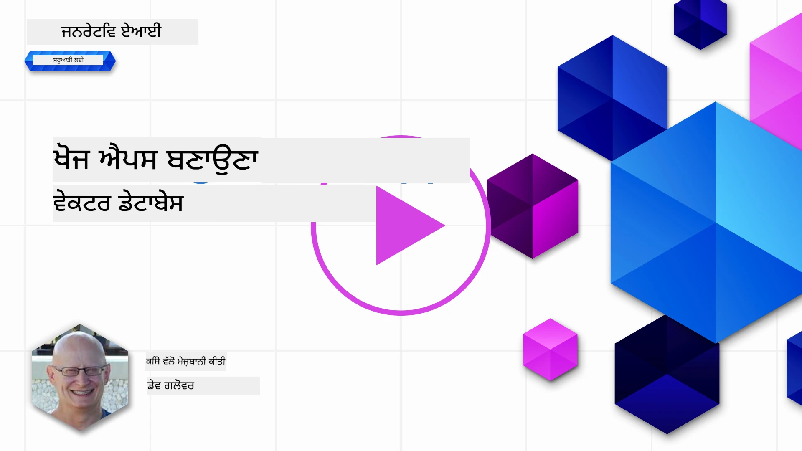
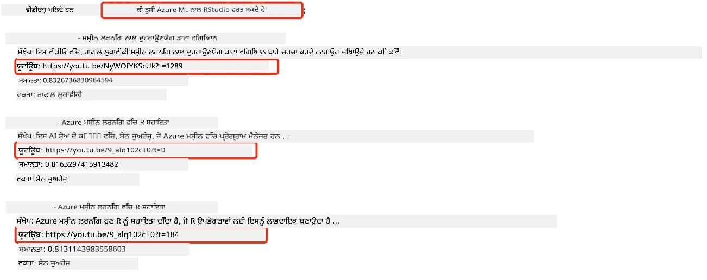
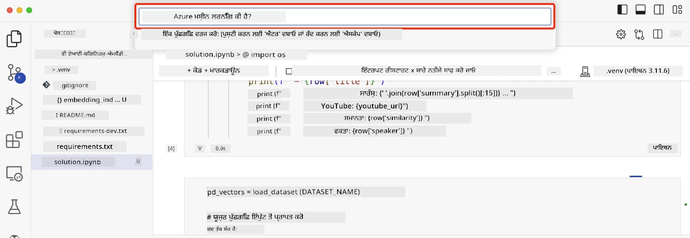

# ਖੋਜ ਐਪਲੀਕੇਸ਼ਨ ਤਿਆਰ ਕਰਨਾ

[](https://youtu.be/W0-nzXjOjr0?si=GcsqiTTvd7RKbo7V)

> > _ਇਸ ਪਾਠ ਦੀ ਵੀਡੀਓ ਵੇਖਣ ਲਈ ਉੱਪਰ ਦਿੱਤੀ ਤਸਵੀਰ 'ਤੇ ਕਲਿਕ ਕਰੋ_

LLM ਚੈਟਬੋਟ ਅਤੇ ਟੈਕਸਟ ਜਨਰੇਸ਼ਨ ਤੋਂ ਇਲਾਵਾ ਹੋਰ ਵੀ ਬਹੁਤ ਕੁਝ ਹਨ। ਇਮਬੈਡਿੰਗ ਦੀ ਵਰਤੋਂ ਕਰਕੇ ਖੋਜ ਐਪਲੀਕੇਸ਼ਨ ਬਣਾਉਣਾ ਵੀ ਸੰਭਵ ਹੈ। ਇਮਬੈਡਿੰਗ ਡੇਟਾ ਦੇ ਗਣਤੰਮਕ ਪ੍ਰਤੀਕ ਹਨ, ਜਿਨ੍ਹਾਂ ਨੂੰ ਵੈਕਟਰ ਵੀ ਕਹਿੰਦੇ ਹਨ, ਅਤੇ ਇਹ ਡੇਟਾ ਲਈ ਸੈਮੈਂਟਿਕ ਖੋਜ ਵਿੱਚ ਵਰਤੇ ਜਾ ਸਕਦੇ ਹਨ।

ਇਸ ਪਾਠ ਵਿਚ, ਤੁਸੀਂ ਆਪਣੇ ਸਿੱਖਿਆ ਸਟਾਰਟਅਪ ਲਈ ਇੱਕ ਖੋਜ ਐਪਲੀਕੇਸ਼ਨ ਬਣਾਉਣ ਜਾ ਰਹੇ ਹੋ। ਸਾਡਾ ਸਟਾਰਟਅਪ ਇੱਕ ਗੈਰ-ਨਫ਼ਾ ਸੰਗਠਨ ਹੈ ਜੋ ਵਿਕਾਸਸ਼ੀਲ ਦੇਸ਼ਾਂ ਦੇ ਵਿਦਿਆਰਥੀਆਂ ਨੂੰ ਮੁਫ਼ਤ ਸਿੱਖਿਆ ਪ੍ਰਦਾਨ ਕਰਦਾ ਹੈ। ਸਾਡਾ ਸਟਾਰਟਅਪ ਕੋਲ YouTube ਦੇ ਬਹੁਤ ਸਾਰੇ ਵੀਡੀਓ ਹਨ ਜਿਨ੍ਹਾਂ ਰਾਹੀਂ ਵਿਦਿਆਰਥੀ ਏਆਈ ਬਾਰੇ ਸਿੱਖ ਸਕਦੇ ਹਨ। ਸਾਡਾ ਸਟਾਰਟਅਪ ਇੱਕ ਐਸਾ ਖੋਜ ਐਪਲੀਕੇਸ਼ਨ ਬਣਾਉਣਾ ਚਾਹੁੰਦਾ ਹੈ ਜੋ ਵਿਦਿਆਰਥੀਆਂ ਨੂੰ ਇੱਕ ਪ੍ਰਸ਼ਨ ਟਾਈਪ ਕਰਕੇ YouTube ਵੀਡੀਓ ਖੋਜਣ ਦੀ ਆਗਿਆ ਦਿੰਦਾ ਹੈ।

ਉਦਾਹਰਨ ਵਜੋਂ, ਇੱਕ ਵਿਦਿਆਰਥੀ 'ਜੂਪੀਟਰ ਨੋਟਬੁੱਕ ਕੀ ਹਨ?' ਜਾਂ 'ਅਜ਼ੁਰ ਐਮਐਲ ਕੀ ਹੈ?' ਲਿਖ ਸਕਦਾ ਹੈ ਅਤੇ ਖੋਜ ਐਪਲੀਕੇਸ਼ਨ ਉਹ ਪ੍ਰਸ਼ਨ ਦੇ ਸਬੰਧਿਤ YouTube ਵੀਡੀਓਜ਼ ਦੀ ਸੂਚੀ ਵਾਪਸ ਕਰੇਗਾ, ਅਤੇ ਹੋਰ ਵਧੀਆ, ਖੋਜ ਐਪਲੀਕੇਸ਼ਨ ਉਸ ਵੀਡੀਓ ਵਿੱਚ ਉਸ ਥਾਂ ਦਾ ਲਿੰਕ ਵਾਪਸ ਕਰੇਗਾ ਜਿੱਥੇ ਇਸ ਪ੍ਰਸ਼ਨ ਦਾ ਜਵਾਬ ਦਿੱਤਾ ਗਿਆ ਹੈ।

## ਪਰਿਚਯ

ਇਸ ਪਾਠ ਵਿੱਚ ਅਸੀਂ ਕਵਰ ਕਰਾਂਗੇ:

- ਸੈਮੈਂਟਿਕ ਵਿਰੁੱਧ ਕੀਵਰਡ ਖੋਜ।
- ਟੈਕਸਟ ਇਮਬੈਡਿੰਗ ਕੀ ਹਨ।
- ਟੈਕਸਟ ਇਮਬੈਡਿੰਗ ਇੰਡੈਕਸ ਬਣਾਉਣਾ।
- ਟੈਕਸਟ ਇਮਬੈਡਿੰਗ ਇੰਡੈਕਸ ਵਿੱਚ ਖੋਜ ਕਰਨਾ।

## ਸਿੱਖਣ ਦੇ ਲਕੜੀ

ਇਸ ਪਾਠ ਨੂੰ ਪੂਰਾ ਕਰਨ ਤੋਂ ਬਾਅਦ, ਤੁਸੀਂ ਸਮਰਥ ਹੋਵੋਗੇ ਕਿ:

- ਸੈਮੈਂਟਿਕ ਅਤੇ ਕੀਵਰਡ ਖੋਜ ਵਿੱਚ ਫਰਕ ਦੱਸ ਸਕੋ।
- ਸਮਝਾ ਸਕੋ ਕਿ ਟੈਕਸਟ ਇਮਬੈਡਿੰਗ ਕੀ ਹਨ।
- ਡੇਟਾ ਖੋਜਣ ਲਈ ਇਮਬੈਡਿੰਗ ਦੀ ਵਰਤੋਂ ਕਰਕੇ ਇੱਕ ਐਪਲੀਕੇਸ਼ਨ ਬਣਾਉ।

## ਖੋਜ ਐਪਲੀਕੇਸ਼ਨ ਕਿਉਂ ਬਣਾਈਏ?

ਇੱਕ ਖੋਜ ਐਪਲੀਕੇਸ਼ਨ ਬਣਾਉਣ ਨਾਲ ਤੁਹਾਨੂੰ ਸਮਝ ਆਵੇਗੀ ਕਿ ਡੇਟਾ ਖੋਜਣ ਲਈ ਇਮਬੈਡਿੰਗ ਦੀ ਵਰਤੋਂ ਕਿਵੇਂ ਕਰਨੀ ਹੈ। ਤੁਸੀਂ ਇਹ ਵੀ ਸਿੱਖੋਗੇ ਕਿ ਕਿਵੇਂ ਵਿਦਿਆਰਥੀਆਂ ਨੂੰ ਤੁਰੰਤ ਜਾਣਕਾਰੀ ਲੱਭਣ ਲਈ ਐਪਲੀਕੇਸ਼ਨ ਦਿਤਾ ਜਾ ਸਕਦਾ ਹੈ।

ਇਸ ਪਾਠ ਵਿੱਚ Microsoft [AI Show](https://www.youtube.com/playlist?list=PLlrxD0HtieHi0mwteKBOfEeOYf0LJU4O1) YouTube ਚੈਨਲ ਦੇ ਟਰਾਂਸਕ੍ਰਿਪਟ ਲਈ ਇੱਕ ਇਮਬੈਡਿੰਗ ਇੰਡੈਕਸ ਸ਼ਾਮਿਲ ਹੈ। AI Show ਏਆਈ ਅਤੇ ਮਸ਼ੀਨ ਲਰਣਿੰਗ ਬਾਰੇ ਸਿੱਖਾਉਣ ਵਾਲਾ YouTube ਚੈਨਲ ਹੈ। ਇਮਬੈਡਿੰਗ ਇੰਡੈਕਸ ਵਿੱਚ ਹਰ YouTube ਟਰਾਂਸਕ੍ਰਿਪਟ ਲਈ ਇਮਬੈਡਿੰਗ ਹਨ ਜੋ ਅਕਤੂਬਰ 2023 ਤੱਕ ਹਨ। ਤੁਸੀਂ ਇਸ ਇਮਬੈਡਿੰਗ ਇੰਡੈਕਸ ਦੀ ਵਰਤੋਂ ਕਰਕੇ ਸਾਡਾ ਸਟਾਰਟਅਪ ਲਈ ਇੱਕ ਖੋਜ ਐਪਲੀਕੇਸ਼ਨ ਬਣਾਉਗੇ। ਖੋਜ ਐਪਲੀਕੇਸ਼ਨ ਵੀਡੀਓ ਵਿੱਚ ਉਸ ਥਾਂ ਦਾ ਲਿੰਕ ਵਾਪਸ ਕਰੇਗਾ ਜਿੱਥੇ ਪ੍ਰਸ਼ਨ ਦਾ ਜਵਾਬ ਦਿੱਤਾ ਗਿਆ ਹੈ। ਇਹ ਵਿਦਿਆਰਥੀਆਂ ਲਈ ਜਰੂਰੀ ਜਾਣਕਾਰੀ ਤੁਰੰਤ ਲੱਭਣ ਦਾ ਬਹੁਤ ਵਧੀਆ ਤਰੀਕਾ ਹੈ।

ਹੇਠਾਂ 'ਕੀ ਤੁਸੀਂ rstudio ਨੂੰ ਅਜ਼ੁਰ ਐਮਐਲ ਨਾਲ ਵਰਤ ਸਕਦੇ ਹੋ?' ਪ੍ਰਸ਼ਨ ਲਈ ਸੈਮੈਂਟਿਕ ਕੁਏਰੀ ਦਾ ਉਦਾਹਰਨ ਦਿੱਤਾ ਗਿਆ ਹੈ। YouTube ਯੂਆਰਐਲ ਚੈੱਕ ਕਰੋ, ਤੁਸੀਂ ਵੇਖੋਗੇ ਕਿ ਯੂਆਰਐਲ ਵਿੱਚ ਇੱਕ ਟਾਈਮਸਟੈਂਪ ਹੈ ਜੋ ਤੁਹਾਨੂੰ ਵੀਡੀਓ ਦੇ ਉਸ ਹਿੱਸੇ ਤੇ ਲੈ ਜਾਂਦਾ ਹੈ ਜਿੱਥੇ ਜਵਾਬ ਹੈ।



## ਸੈਮੈਂਟਿਕ ਖੋਜ ਕੀ ਹੈ?

ਹੁਣ ਤੁਸੀਂ ਸੋਚ ਰਹੇ ਹੋਵੋਗੇ, ਸੈਮੈਂਟਿਕ ਖੋਜ ਕੀ ਹੈ? ਸੈਮੈਂਟਿਕ ਖੋਜ ਇੱਕ ਖੋਜ ਤਕਨੀਕ ਹੈ ਜੋ ਕਿਸੇ ਕੁਏਰੀ ਦੇ ਸ਼ਬਦਾਂ ਦੇ ਅਰਥ ਜਾਂ ਮਤਲਬ ਨੂੰ ਵਰਤ ਕੇ ਸੰਬੰਧਿਤ ਨਤੀਜੇ ਵਾਪਸ ਕਰਦੀ ਹੈ।

ਇੱਥੇ ਸੈਮੈਂਟਿਕ ਖੋਜ ਦਾ ਇੱਕ ਉਦਾਹਰਨ ਹੈ। ਮਾਨ ਲਓ ਤੁਸੀਂ ਇੱਕ ਕਾਰ ਖਰੀਦਣੀ ਚਾਹੁੰਦੇ ਹੋ, ਤੁਸੀਂ 'ਮੇਰੀ ਸਪਨਾ ਕਾਰ' ਖੋਜ ਸਕਦੇ ਹੋ, ਸੈਮੈਂਟਿਕ ਖੋਜ ਸਮਝਦਾ ਹੈ ਕਿ ਤੁਸੀਂ ਕਾਰ ਦੇ ਸੁਪਨੇ ਨਹੀਂ ਦੇਖ ਰਹੇ, ਸਗੋਂ ਤੁਸੀਂ ਆਪਣੀ 'ਪਸੰਦੀਦਾ' ਕਾਰ ਖਰੀਦਣੀ ਚਾਹੁੰਦੇ ਹੋ। ਸੈਮੈਂਟਿਕ ਖੋਜ ਤੁਹਾਡੀ ਮੰਗ ਸਮਝਦਾ ਹੈ ਅਤੇ ਸੰਬੰਧਿਤ ਨਤੀਜੇ ਦਿੰਦਾ ਹੈ। ਇਸਦਾ ਵੱਖਰਾ ਹੈ 'ਕੀਵਰਡ ਖੋਜ' ਜੋ ਅੱਖਰ ਬਾਹਰਲੇ ਲਫ਼ਜ਼ਾਂ ਨੂੰ ਖੋਜਦਾ ਹੈ ਅਤੇ ਅਕਸਰ ਅਸੰਬੰਧਿਤ ਨਤੀਜੇ ਲਿਆਉਂਦਾ ਹੈ।

## ਟੈਕਸਟ ਇਮਬੈਡਿੰਗ ਕੀ ਹਨ?

[ਟੈਕਸਟ ਇਮਬੈਡਿੰਗ](https://en.wikipedia.org/wiki/Word_embedding?WT.mc_id=academic-105485-koreyst) ਇੱਕ ਟੈਕਸਟ ਨੂੰ ਦਰਸਾਉਣ ਦੀ ਤਕਨੀਕ ਹੈ ਜੋ [ਕ੍ਰਿਤ੍ਰਿਮ ਭਾਸ਼ਾ ਪ੍ਰੋਸੈਸਿੰਗ](https://en.wikipedia.org/wiki/Natural_language_processing?WT.mc_id=academic-105485-koreyst) ਵਿੱਚ ਵਰਤੀ ਜਾਂਦੀ ਹੈ। ਟੈਕਸਟ ਇਮਬੈਡਿੰਗ ਟੈਕਸਟ ਦੇ ਸੈਮੈਂਟਿਕ ਗਣਤੰਮਕ ਪ੍ਰਤੀਕ ਹਨ। ਇਮਬੈਡਿੰਗ ਡੇਟਾ ਨੂੰ ਇਸ ਢੰਗ ਨਾਲ ਦਰਸਾਉਂਦੇ ਹਨ ਜੋ ਮਸ਼ੀਨ ਲਈ ਸਮਝਣਾ ਆਸਾਨ ਹੁੰਦਾ ਹੈ। ਟੈਕਸਟ ਇਮਬੈਡਿੰਗ ਬਣਾਉਣ ਲਈ ਕਈ ਮਾਡਲ ਹਨ, ਇਸ ਪਾਠ ਵਿੱਚ ਅਸੀਂ OpenAI ਇਮਬੈਡਿੰਗ ਮਾਡਲ ਦੀ ਵਰਤੋਂ ਕਰਕੇ ਇਮਬੈਡਿੰਗ ਬਣਾਉਣ 'ਤੇ ਧਿਆਨ ਦੇਵਾਂਗੇ।

ਇੱਥੇ ਇੱਕ ਉਦਾਹਰਨ ਹੈ, ਕਲਪਨਾ ਕਰੋ ਕਿ ਹੇਠਾਂ ਦਿੱਤਾ ਟੈਕਸਟ AI Show YouTube ਚੈਨਲ ਦੇ ਇੱਕ ਐਪਿਸੋਡ ਦੇ ਟਰਾਂਸਕ੍ਰਿਪਟ ਵਿੱਚ ਹੈ:

```text
Today we are going to learn about Azure Machine Learning.
```

ਅਸੀਂ ਇਸ ਟੈਕਸਟ ਨੂੰ OpenAI ਇਮਬੈਡਿੰਗ API ਨੂੰ ਦਿਆਂਗੇ ਅਤੇ ਇਹ 1536 ਨੰਬਰਾਂ ਵਾਲਾ ਇੱਕ ਵੈਕਟਰ ਵਾਪਸ ਕਰੇਗਾ। ਵੈਕਟਰ ਵਿੱਚ ਹਰ ਇੱਕ ਨੰਬਰ ਟੈਕਸਟ ਦੇ ਇੱਕ ਵੱਖਰੇ ਪੱਖ ਨੂੰ ਦਰਸਾਉਂਦਾ ਹੈ। ਸੰਗੁਪਤ ਵਾਸਤੇ, ਇੱਥੇ ਵੈਕਟਰ ਦੇ ਪਹਿਲੇ 10 ਨੰਬਰ ਹਨ।

```python
[-0.006655829958617687, 0.0026128944009542465, 0.008792596869170666, -0.02446001023054123, -0.008540431968867779, 0.022071078419685364, -0.010703742504119873, 0.003311325330287218, -0.011632772162556648, -0.02187200076878071, ...]
```

## ਇਮਬੈਡਿੰਗ ਇੰਡੈਕਸ ਕਿਵੇਂ ਬਣਾਇਆ ਜਾਂਦਾ ਹੈ?

ਇਸ ਪਾਠ ਲਈ ਇਮਬੈਡਿੰਗ ਇੰਡੈਕਸ Python ਸਕ੍ਰਿਪਟਾਂ ਦੀ ਇੱਕ ਲੜੀ ਨਾਲ ਬਣਾਇਆ ਗਿਆ। ਤੁਹਾਨੂੰ ਸਕ੍ਰਿਪਟਾਂ 'scripts' ਫੋਲਡਰ ਵਿੱਚ [README](./scripts/README.md?WT.mc_id=academic-105485-koreyst) ਵਿੱਚ ਮਿਲ ਜਾਣਗੀਆਂ। ਇਸ ਪਾਠ ਨੂੰ ਪੂਰਾ ਕਰਨ ਲਈ ਇਹ ਸਕ੍ਰਿਪਟ ਚਲਾਉਣ ਦੀ ਲੋੜ ਨਹੀਂ ਹੈ ਕਿਉਂਕਿ ਇਮਬੈਡਿੰਗ ਇੰਡੈਕਸ ਤੁਹਾਡੇ ਲਈ ਮੁਹੱਈਆ ਹੈ।

ਸਕ੍ਰਿਪਟ ਹੇਠ ਲਿਖੇ ਕੰਮ ਕਰਦੀਆਂ ਹਨ:

1. [AI Show](https://www.youtube.com/playlist?list=PLlrxD0HtieHi0mwteKBOfEeOYf0LJU4O1) ਪਲੇਲਿਸਟ ਵਿੱਚ ਹਰ YouTube ਵੀਡੀਓ ਦਾ ਟਰਾਂਸਕ੍ਰਿਪਟ ਡਾਊਨਲੋਡ ਕੀਤਾ ਜਾਂਦਾ ਹੈ।
2. [OpenAI Functions](https://learn.microsoft.com/azure/ai-services/openai/how-to/function-calling?WT.mc_id=academic-105485-koreyst) ਦੀ ਵਰਤੋਂ ਕਰਕੇ ਯਕੀਨ ਕਰਨ ਦੀ ਕੋਸ਼ਿਸ਼ ਕੀਤੀ ਜਾਂਦੀ ਹੈ ਕਿ YouTube ਟਰਾਂਸਕ੍ਰਿਪਟ ਦੇ ਪਹਿਲੇ 3 ਮਿਨਟ ਵਿੱਚੋਂ ਬੋਲਣਹਾਰ ਦਾ ਨਾਮ ਕੱਢਿਆ ਜਾ ਸਕੇ। ਹਰ ਵੀਡੀਓ ਲਈ ਬੋਲਣਹਾਰ ਦਾ ਨਾਮ `embedding_index_3m.json` ਇਮਬੈਡਿੰਗ ਇੰਡੈਕਸ ਵਿੱਚ ਸਟੋਰ ਕੀਤਾ ਜਾਂਦਾ ਹੈ।
3. ਟਰਾਂਸਕ੍ਰਿਪਟ ਟੈਕਸਟ ਨੂੰ **3 ਮਿੰਟਾਂ ਦੇ ਟੈਕਸਟ ਸੈਗਮੈਂਟਾਂ** ਵਿੱਚ ਵੰਡਿਆ ਜਾਂਦਾ ਹੈ। ਹਰ ਸੈਗਮੈਂਟ ਵਿੱਚ ਅਗਲੇ ਸੈਗਮੈਂਟ ਵੱਲੋਂ ਲਗਭਗ 20 ਸ਼ਬਦ ਦੋਹਰਾਏ ਜਾਂਦੇ ਹਨ ਤਾਂ ਜੋ ਸੈਗਮੈਂਟ ਦੀ ਇਮਬੈਡਿੰਗ ਕੱਟ ਨਾ ਜਾਏ ਅਤੇ ਖੋਜ ਸੰਦਰਭ ਵਧੀਆ ਮਿਲੇ।
4. ਹਰ ਟੈਕਸਟ ਸੈਗਮੈਂਟ ਨੂੰ OpenAI ਚੈਟ API ਨੂੰ ਸਪੁਰਦ ਕਰਕੇ ਟੈਕਸਟ ਨੂੰ 60 ਸ਼ਬਦਾਂ ਵਿੱਚ ਸੰਖੇਪ ਕੀਤਾ ਜਾਂਦਾ ਹੈ। ਇਹ ਸੰਖੇਪ ਵੀ `embedding_index_3m.json` ਇਮਬੈਡਿੰਗ ਇੰਡੈਕਸ ਵਿੱਚ ਸਟੋਰ ਕੀਤਾ ਜਾਂਦਾ ਹੈ।
5. ਅੰਤਨ, ਸੈਗਮੈਂਟ ਟੈਕਸਟ ਨੂੰ OpenAI ਇਮਬੈਡਿੰਗ API ਨੂੰ ਦਿੰਦੇ ਹਾਂ। ਇਮਬੈਡਿੰਗ API ਇੱਕ 1536 ਨੰਬਰਾਂ ਦਾ ਵੈਕਟਰ ਵਾਪਸ ਕਰਦਾ ਹੈ ਜੋ ਸੈਮੈਂਟਿਕ ਅਰਥ ਨੂੰ ਦਰਸਾਉਂਦਾ ਹੈ। ਸੈਗਮੈਂਟ ਅਤੇ OpenAI ਇਮਬੈਡਿੰਗ ਵੈਕਟਰ ਨੂੰ `embedding_index_3m.json` ਇਮਬੈਡਿੰਗ ਇੰਡੈਕਸ ਵਿੱਚ ਸਟੋਰ ਕੀਤਾ ਜਾਂਦਾ ਹੈ।

### ਵੈਕਟਰ ਡਾਟਾਬੇਸ

ਸਿਖਲਾਈ ਦੇ ਸਹੁਲਤ ਲਈ, ਇਮਬੈਡਿੰਗ ਇੰਡੈਕਸ ਨੂੰ `embedding_index_3m.json` ਨਾਮਕ JSON ਫਾਇਲ ਵਿੱਚ ਸਟੋਰ ਕੀਤਾ ਗਿਆ ਹੈ ਅਤੇ ਇੱਕ Pandas ਡੇਟਾਫ੍ਰੇਮ ਵਿੱਚ ਲੋਡ ਕੀਤਾ ਗਿਆ ਹੈ। ਹਾਲਾਂਕਿ, ਪ੍ਰੋਡਕਸ਼ਨ ਵਿੱਚ, ਇਮਬੈਡਿੰਗ ਇੰਡੈਕਸ ਨੂੰ [Azure Cognitive Search](https://learn.microsoft.com/training/modules/improve-search-results-vector-search?WT.mc_id=academic-105485-koreyst), [Redis](https://cookbook.openai.com/examples/vector_databases/redis/readme?WT.mc_id=academic-105485-koreyst), [Pinecone](https://cookbook.openai.com/examples/vector_databases/pinecone/readme?WT.mc_id=academic-105485-koreyst), [Weaviate](https://cookbook.openai.com/examples/vector_databases/weaviate/readme?WT.mc_id=academic-105485-koreyst) ਵਰਗੇ ਵੈਕਟਰ ਡਾਟਾਬੇਸ ਵਿੱਚ ਸਟੋਰ ਕੀਤਾ ਜਾ ਸਕਦਾ ਹੈ।

## ਕੋਸਾਈਨ ਸਮਾਨਤਾ ਨੂੰ ਸਮਝਣਾ

ਅਸੀਂ ਟੈਕਸਟ ਇਮਬੈਡਿੰਗ ਬਾਰੇ ਸਿੱਖਿਆ, ਅਗਲਾ ਕਦਮ ਹੈ ਟੈਕਸਟ ਇਮਬੈਡਿੰਗ ਦੀ ਵਰਤੋਂ ਕਰਕੇ ਡੇਟਾ ਵਿੱਚ ਖੋਜ ਕਰਨਾ ਅਤੇ ਖਾਸ ਕਰਕੇ ਪ੍ਰਦੱਤ ਕੁਏਰੀ ਨਾਲ ਸਭ ਤੋਂ ਸਮਾਨ ਇਮਬੈਡਿੰਗ ਲੱਭਣ ਲਈ ਕੋਸਾਈਨ ਸਮਾਨਤਾ ਦੀ ਵਰਤੋਂ ਕਰਨਾ।

### ਕੋਸਾਈਨ ਸਮਾਨਤਾ ਕੀ ਹੈ?

ਕੋਸਾਈਨ ਸਮਾਨਤਾ ਦੋ ਵੈਕਟਰਾਂ ਵਿਚਕਾਰ ਸਮਾਨਤਾ ਦੀ ਮਾਪ ਹੈ, ਇਸਨੂੰ ਤੁਸੀਂ `ਨਜ਼ਦੀਕੀ ਪੜੋਸੀ ਖੋਜ` ਵਜੋਂ ਵੀ ਸੁਣੋਗੇ। ਕੋਸਾਈਨ ਸਮਾਨਤਾ ਦੀ ਖੋਜ ਕਰਨ ਲਈ ਤੁਹਾਨੂੰ ਪ੍ਰਸ਼ਨ ਵਾਲੇ ਟੈਕਸਟ ਨੂੰ OpenAI ਇਮਬੈਡਿੰਗ API ਨਾਲ ਵੈਕਟਰਿਸ਼ਨ ਕਰਨਾ ਪੈਂਦਾ ਹੈ। ਫਿਰ ਪ੍ਰਸ਼ਨ ਦੇ ਵੈਕਟਰ ਅਤੇ ਇਮਬੈਡਿੰਗ ਇੰਡੈਕਸ ਵਿੱਚ ਹਰ ਵੈਕਟਰ ਦੇ ਵਿਚਕਾਰ ਕੋਸਾਈਨ ਸਮਾਨਤਾ ਗਣਨਾ ਕਰਨੀ ਹੁੰਦੀ ਹੈ। ਯਾਦ ਰੱਖੋ, ਇਮਬੈਡਿੰਗ ਇੰਡੈਕਸ ਵਿੱਚ ਹਰ YouTube ਟਰਾਂਸਕ੍ਰਿਪਟ ਟੈਕਸਟ ਸੈਗਮੈਂਟ ਲਈ ਇੱਕ ਵੈਕਟਰ ਹੁੰਦਾ ਹੈ। ਆਖ਼ਰ ਵਿੱਚ ਨਤੀਜਿਆਂ ਨੂੰ ਕੋਸਾਈਨ ਸਮਾਨਤਾ ਦੇ ਆਧਾਰ ਤੇ ਛਾਂਟੋ ਅਤੇ ਜਿਹੜੇ ਟੈਕਸਟ ਸੈਗਮੈਂਟਾਂ ਦੀ ਕੋਸਾਈਨ ਸਮਾਨਤਾ ਸਭ ਤੋਂ ਵੱਧ ਹੈ ਉਹ ਕੁਏਰੀ ਨਾਲ ਸਭ ਤੋਂ ਸਮਾਨ ਹੁੰਦੇ ਹਨ।

ਗਣਿਤਕ ਦ੍ਰਿਸ਼ਟਿਕੋਣ ਤੋਂ, ਕੋਸਾਈਨ ਸਮਾਨਤਾ ਉਹ ਕੋਣ ਦਾ ਕੋਸਾਈਨ ਮਾਪਦਾ ਹੈ ਜੋ ਦੋ ਵੈਕਟਰਾਂ ਦਰਮਿਆਨ ਇੱਕ ਬਹੁ-ਮਿਆਰੀ ਖੇਤਰ ਵਿੱਚ ਪ੍ਰੋਜੈਕਟ ਕੀਤੇ ਗਏ ਹਨ। ਇਹ ਮਾਪ ਲਾਭਦਾਇਕ ਹੈ ਕਿ ਕਈ ਵਾਰ ਦੋ ਦਸਤਾਵੇਜ਼ Euclidean ਦੂਰੀ ਕਾਰਨ ਬਹੁਤ ਦੂਰ ਹੋ ਸਕਦੇ ਹਨ ਪਰ ਕੋਣ ਛੋਟਾ ਹੋਣ ਕਰਕੇ ਕੋਸਾਈਨ ਸਮਾਨਤਾ ਵੱਧ ਹੋ ਸਕਦੀ ਹੈ। ਕੋਸਾਈਨ ਸਮਾਨਤਾ ਸਮੀਕਰਨਾਂ ਬਾਰੇ ਵੱਧ ਜਾਣਕਾਰੀ ਲਈ ਵੇਖੋ [Cosine similarity](https://en.wikipedia.org/wiki/Cosine_similarity?WT.mc_id=academic-105485-koreyst).

## ਆਪਣਾ ਪਹਿਲਾ ਖੋਜ ਐਪਲੀਕੇਸ਼ਨ ਬਣਾਉਣਾ

ਅਗਲੇ ਕਦਮ ਵਿੱਚ, ਅਸੀਂ ਇਮਬੈਡਿੰਗ ਦੀ ਵਰਤੋਂ ਕਰਕੇ ਖੋਜ ਐਪਲੀਕੇਸ਼ਨ ਬਣਾਉਣਾ ਸਿੱਖਾਂਗੇ। ਖੋਜ ਐਪਲੀਕੇਸ਼ਨ ਵਿਦਿਆਰਥੀਆਂ ਨੂੰ ਇੱਕ ਪ੍ਰਸ਼ਨ ਟਾਈਪ ਕਰਕੇ ਵੀਡੀਓ ਖੋਜਣ ਦਿੰਦਾ ਹੈ। ਖੋਜ ਐਪਲੀਕੇਸ਼ਨ ਪ੍ਰਸ਼ਨ ਨਾਲ ਸੰਬੰਧਿਤ ਵੀਡੀਓਜ਼ ਦੀ ਸੂਚੀ ਅਤੇ ਹੁਣੇ ਹੀ ਜਵਾਬ ਵਾਲੀ ਥਾਂ ਦਾ ਲਿੰਕ ਵਾਪਸ ਕਰੇਗਾ।

ਇਹ ਹੱਲ Windows 11, macOS, ਅਤੇ Ubuntu 22.04 ’ਤੇ Python 3.10 ਜਾਂ ਉੱਪਰ ਨਾਲ ਬਣਾਇਆ ਅਤੇ ਟੈਸਟ ਕੀਤਾ ਗਿਆ। ਤੁਸੀਂ [python.org](https://www.python.org/downloads/?WT.mc_id=academic-105485-koreyst) ਤੋਂ Python ਡਾਊਨਲੋਡ ਕਰ ਸਕਦੇ ਹੋ।

## ਅਸਾਈਨਮੈਂਟ - ਵਿਦਿਆਰਥੀਆਂ ਲਈ ਖੋਜ ਐਪਲੀਕੇਸ਼ਨ ਬਣਾਉਣਾ

ਅਸੀਂ ਇਸ ਪਾਠ ਦੀ ਸ਼ੁਰੂਆਤ ਵਿੱਚ ਆਪਣੇ ਸਟਾਰਟਅਪ ਦਾ ਪਰਿਚਯ ਦਿੱਤਾ ਸੀ। ਹੁਣ ਵਿਦਿਆਰਥੀਆਂ ਨੂੰ ਆਪਣੇ ਅਸਾਈਨਮੈਂਟਾਂ ਲਈ ਖੋਜ ਐਪਲੀਕੇਸ਼ਨ ਬਣਾਉਣ ਯੋਗ ਬਣਾਉਣਾ ਹੈ।

ਇਸ ਅਸਾਈਨਮੈਂਟ ਵਿੱਚ, ਤੁਸੀਂ Azure OpenAI ਸਰਵਿਸਾਂ ਤਿਆਰ ਕਰੋਗੇ ਜੋ ਖੋਜ ਐਪਲੀਕੇਸ਼ਨ ਬਣਾਉਣ ਲਈ ਲੋੜੀਂਦੀਆਂ ਹਨ। ਤੁਹਾਨੂੰ ਇਹ ਅਸਾਈਨਮੈਂਟ ਪੂਰਾ ਕਰਨ ਲਈ ਇੱਕ Azure ਸਬਸਕ੍ਰਿਪਸ਼ਨ ਦੀ ਲੋੜ ਹੋਵੇਗੀ।

### Azure Cloud Shell ਸ਼ੁਰੂ ਕਰੋ

1. [Azure ਪੋਰਟਲ](https://portal.azure.com/?WT.mc_id=academic-105485-koreyst) ਵਿੱਚ ਸਾਈਨ ਇਨ ਕਰੋ।
2. Azure ਪੋਰਟਲ ਦੇ ਉੱਪਰ-ਸੱਜੇ ਕੋਨੇ ਵਿੱਚ Cloud Shell ਆਈਕਨ ਚੁਣੋ।
3. ਵਾਤਾਵਰਣ ਕਿਸਮ ਲਈ **Bash** ਚੁਣੋ।

#### ਰਿਸੋਰਸ ਗਰੁੱਪ ਬਣਾਓ

> ਇਹ ਹਦਾਇਤਾਂ ਪੂਰਬੀ ਯੂਐਸ ਵਿੱਚ "semantic-video-search" ਨਾਮਕ ਰਿਸੋਰਸ ਗਰੁੱਪ 'ਤੇ ਅਧਾਰਿਤ ਹਨ।
> ਤੁਸੀਂ ਰਿਸੋਰਸ ਗਰੁੱਪ ਦਾ ਨਾਮ ਬਦਲ ਸਕਦੇ ਹੋ, ਪਰ ਜਦੋਂ ਰਿਸੋਰਸਾਂ ਦੇ ਅਸਥਾਨ ਨੂੰ ਬਦਲਦੇ ਹੋ,
> [ਮਾਡਲ ਉਪਲਬਧਤਾ ਦੀ ਸੂਚੀ](https://aka.ms/oai/models?WT.mc_id=academic-105485-koreyst) ਨੂੰ ਵੇਖੋ।

```shell
az group create --name semantic-video-search --location eastus
```

#### Azure OpenAI ਸਰਵਿਸ ਰਿਸੋਰਸ ਬਣਾਓ

Azure Cloud Shell ਤੋਂ ਹੇਠਾਂ ਦਿੱਤਾ ਕਮਾਂਡ ਚਲਾ ਕੇ Azure OpenAI ਸਰਵਿਸ ਰਿਸੋਰਸ ਬਣਾਓ।

```shell
az cognitiveservices account create --name semantic-video-openai --resource-group semantic-video-search \
    --location eastus --kind OpenAI --sku s0
```

#### ਇਸ ਐਪਲੀਕੇਸ਼ਨ ਵਿੱਚ ਵਰਤੋਂ ਲਈ ਐਂਡਪોએਂਟ ਅਤੇ ਚਾਬੀਆਂ ਪ੍ਰਾਪਤ ਕਰੋ

Azure Cloud Shell ਤੋਂ ਹੇਠਾਂ ਦਿੱਤੇ ਕਮਾਂਡ ਚਲਾ ਕੇ Azure OpenAI ਸਰਵਿਸ ਰਿਸੋਰਸ ਲਈ ਐਂਡਪੋਇੰਟ ਅਤੇ ਕੀਜ਼ ਪ੍ਰਾਪਤ ਕਰੋ।

```shell
az cognitiveservices account show --name semantic-video-openai \
   --resource-group  semantic-video-search | jq -r .properties.endpoint
az cognitiveservices account keys list --name semantic-video-openai \
   --resource-group semantic-video-search | jq -r .key1
```

#### OpenAI ਇਮਬੈਡਿੰਗ ਮਾਡਲ ਨੂੰ ਡਿਪਲੌਏ ਕਰੋ

Azure Cloud Shell ਤੋਂ ਹੇਠਾਂ ਦਿੱਤਾ ਕਮਾਂਡ ਚਲਾ ਕੇ OpenAI ਇਮਬੈਡਿੰਗ ਮਾਡਲ ਨੂੰ ਡਿਪਲੌਏ ਕਰੋ।

```shell
az cognitiveservices account deployment create \
    --name semantic-video-openai \
    --resource-group  semantic-video-search \
    --deployment-name text-embedding-ada-002 \
    --model-name text-embedding-ada-002 \
    --model-version "2"  \
    --model-format OpenAI \
    --sku-capacity 100 --sku-name "Standard"
```

## ਹੱਲ

GitHub Codespaces ਵਿੱਚ [solution notebook](./python/aoai-solution.ipynb?WT.mc_id=academic-105485-koreyst) ਖੋਲ੍ਹੋ ਅਤੇ Jupyter Notebook ਵਿੱਚ ਦਿੱਤੀਆਂ ਸਿੱਖਿਆਵਾਂ ਦਾ ਪਾਲਣ ਕਰੋ।

ਜਦੋਂ ਤੁਸੀਂ ਨੋਟਬੁੱਕ ਚਲਾਉਂਦੇ ਹੋ, ਤਾਂ ਤੁਹਾਨੂੰ ਇੱਕ ਕੁਏਰੀ ਦਰਜ ਕਰਨ ਲਈ ਕਿਹਾ ਜਾਵੇਗਾ। ਇਨਪੁੱਟ ਬਾਕਸ ਕੁਝ ਇਸ ਤਰ੍ਹਾਂ ਦਿੱਸੇਗਾ:



## ਸ਼ਾਬਾਸ਼! ਆਪਣੀ ਸਿੱਖਿਆ ਜਾਰੀ ਰੱਖੋ

ਇਸ ਪਾਠ ਨੂੰ ਪੂਰਾ ਕਰਨ ਤੋਂ ਬਾਅਦ, ਸਾਡੀ [ਜਨਰੇਟਿਵ ਏਆਈ ਸਿੱਖਿਆ ਕਲੈਕਸ਼ਨ](https://aka.ms/genai-collection?WT.mc_id=academic-105485-koreyst) ਦੇਖੋ ਅਤੇ ਆਪਣੀ ਜਨਰੇਟਿਵ ਏਆਈ ਜਾਣਕਾਰੀ ਨੂੰ ਹੋਰ ਵਧਾਓ!

ਅਗਲੇ ਪਾਠ 9 ਵਿਚ ਜਾਓ ਜਿੱਥੇ ਅਸੀਂ [ਚਿੱਤਰ ਜਨਰੇਸ਼ਨ ਐਪਲੀਕੇਸ਼ਨ ਬਣਾਉਣ ਬਾਰੇ](../09-building-image-applications/README.md?WT.mc_id=academic-105485-koreyst) ਸਿੱਖਾਂਗੇ!

---

<!-- CO-OP TRANSLATOR DISCLAIMER START -->
**ਅਸਵੀਕਾਰੋਪਣ**:
ਇਸ ਦਸਤਾਵੇਜ਼ ਦਾ ਅਨੁਵਾਦ ਏਆਈ ਅਨੁਵਾਦ ਸੇਵਾ [Co-op Translator](https://github.com/Azure/co-op-translator) ਦੀ ਵਰਤੋਂ ਕਰਕੇ ਕੀਤਾ ਗਿਆ ਹੈ। ਜਦੋਂ ਕਿ ਅਸੀਂ ਸਹੀਤਾਵਾਂ ਲਈ ਯਤਨਸ਼ੀਲ ਹਾਂ, ਕਿਰਪਾ ਕਰਕੇ ਧਿਆਨ ਰੱਖੋ ਕਿ ਸਵੈਚਾਲਿਤ ਅਨੁਵਾਦਾਂ ਵਿੱਚ ਗਲਤੀਆਂ ਜਾਂ ਅਸਮੱਤਿਆਵਾਂ ਹੋ ਸਕਦੀਆਂ ਹਨ। ਮੂਲ ਦਸਤਾਵੇਜ਼ ਆਪਣੀ ਮੂਲ ਭਾਸ਼ਾ ਵਿੱਚ ਅਧਿਕਾਰਕ ਸਰੋਤ ਮੰਨਿਆ ਜਾਣਾ ਚਾਹੀਦਾ ਹੈ। ਜਰੂਰੀ ਜਾਣਕਾਰੀ ਲਈ, ਪੇਸ਼ੇਵਰ ਮਨੁੱਖੀ ਅਨੁਵਾਦ ਦੀ ਸਿਫ਼ਾਰਸ਼ ਕੀਤੀ ਜਾਂਦੀ ਹੈ। ਅਸੀਂ ਇਸ ਅਨੁਵਾਦ ਦੇ ਉਪਯੋਗ ਤੋਂ ਪੈਦਾ ਹੋਣ ਵਾਲੀਆਂ ਕਿਸੇ ਵੀ ਗਲਤਫਹਿਮੀਆਂ ਜਾਂ ਗਲਤ ਵਿਆਖਿਆਵਾਂ ਲਈ ਜਵਾਬਦੇਹ ਨਹੀਂ ਹਾਂ।
<!-- CO-OP TRANSLATOR DISCLAIMER END -->