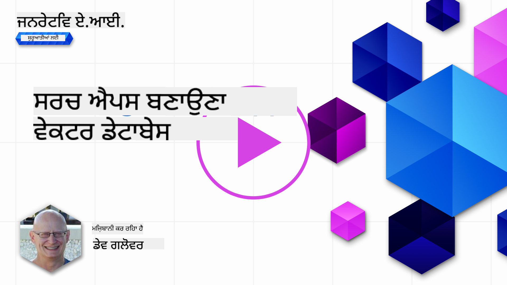
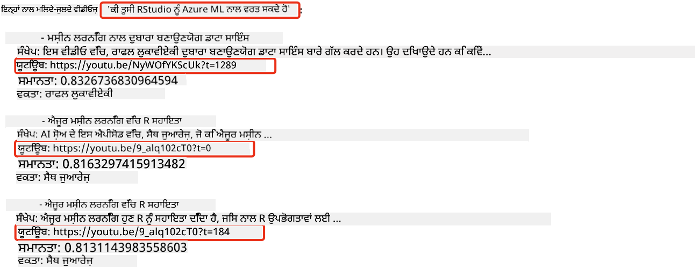

<!--
CO_OP_TRANSLATOR_METADATA:
{
  "original_hash": "58953c08b8ba7073b836d4270ea0fe86",
  "translation_date": "2025-10-17T14:14:24+00:00",
  "source_file": "08-building-search-applications/README.md",
  "language_code": "pa"
}
-->
# ਖੋਜ ਐਪਲੀਕੇਸ਼ਨ ਬਣਾਉਣਾ

[](https://youtu.be/W0-nzXjOjr0?si=GcsqiTTvd7RKbo7V)

> > _ਉਪਰ ਦਿੱਤੀ ਤਸਵੀਰ 'ਤੇ ਕਲਿੱਕ ਕਰਕੇ ਇਸ ਪਾਠ ਦਾ ਵੀਡੀਓ ਵੇਖੋ_

LLMs ਸਿਰਫ ਚੈਟਬੋਟ ਅਤੇ ਟੈਕਸਟ ਜਨਰੇਸ਼ਨ ਲਈ ਹੀ ਨਹੀਂ ਹਨ। ਇਹ ਸੰਭਵ ਹੈ ਕਿ ਐਮਬੈਡਿੰਗਜ਼ ਦੀ ਵਰਤੋਂ ਕਰਕੇ ਖੋਜ ਐਪਲੀਕੇਸ਼ਨ ਬਣਾਈ ਜਾ ਸਕੇ। ਐਮਬੈਡਿੰਗਜ਼ ਡਾਟਾ ਦੇ ਗਿਣਤੀਗਤ ਪ੍ਰਤੀਨਿਧੀ ਹਨ, ਜਿਨ੍ਹਾਂ ਨੂੰ ਵੈਕਟਰ ਵੀ ਕਿਹਾ ਜਾਂਦਾ ਹੈ, ਅਤੇ ਇਹ ਡਾਟਾ ਲਈ ਸੈਮੈਂਟਿਕ ਖੋਜ ਲਈ ਵਰਤੇ ਜਾ ਸਕਦੇ ਹਨ।

ਇਸ ਪਾਠ ਵਿੱਚ, ਤੁਸੀਂ ਸਾਡੇ ਸਿੱਖਿਆ ਸਟਾਰਟਅਪ ਲਈ ਇੱਕ ਖੋਜ ਐਪਲੀਕੇਸ਼ਨ ਬਣਾਉਣ ਜਾ ਰਹੇ ਹੋ। ਸਾਡਾ ਸਟਾਰਟਅਪ ਇੱਕ ਗੈਰ-ਮੁਨਾਫਾ ਸੰਗਠਨ ਹੈ ਜੋ ਵਿਕਾਸਸ਼ੀਲ ਦੇਸ਼ਾਂ ਵਿੱਚ ਵਿਦਿਆਰਥੀਆਂ ਨੂੰ ਮੁਫ਼ਤ ਸਿੱਖਿਆ ਪ੍ਰਦਾਨ ਕਰਦਾ ਹੈ। ਸਾਡੇ ਸਟਾਰਟਅਪ ਕੋਲ ਬਹੁਤ ਸਾਰੇ YouTube ਵੀਡੀਓ ਹਨ ਜਿਨ੍ਹਾਂ ਦੀ ਵਰਤੋਂ ਵਿਦਿਆਰਥੀ AI ਬਾਰੇ ਸਿੱਖਣ ਲਈ ਕਰ ਸਕਦੇ ਹਨ। ਸਾਡਾ ਸਟਾਰਟਅਪ ਇੱਕ ਖੋਜ ਐਪਲੀਕੇਸ਼ਨ ਬਣਾਉਣਾ ਚਾਹੁੰਦਾ ਹੈ ਜੋ ਵਿਦਿਆਰਥੀਆਂ ਨੂੰ ਇੱਕ ਸਵਾਲ ਟਾਈਪ ਕਰਕੇ YouTube ਵੀਡੀਓ ਦੀ ਖੋਜ ਕਰਨ ਦੀ ਆਗਿਆ ਦਿੰਦਾ ਹੈ।

ਉਦਾਹਰਣ ਲਈ, ਇੱਕ ਵਿਦਿਆਰਥੀ 'Jupyter Notebooks ਕੀ ਹਨ?' ਜਾਂ 'Azure ML ਕੀ ਹੈ?' ਟਾਈਪ ਕਰ ਸਕਦਾ ਹੈ ਅਤੇ ਖੋਜ ਐਪਲੀਕੇਸ਼ਨ ਸਵਾਲ ਨਾਲ ਸਬੰਧਤ YouTube ਵੀਡੀਓਜ਼ ਦੀ ਸੂਚੀ ਵਾਪਸ ਕਰੇਗਾ। ਇਸ ਤੋਂ ਵੀ ਵਧੀਆ, ਖੋਜ ਐਪਲੀਕੇਸ਼ਨ ਵੀਡੀਓ ਵਿੱਚ ਉਸ ਸਥਾਨ ਦਾ ਲਿੰਕ ਵਾਪਸ ਕਰੇਗਾ ਜਿੱਥੇ ਸਵਾਲ ਦਾ ਜਵਾਬ ਦਿੱਤਾ ਗਿਆ ਹੈ।

## ਪਰਿਚਯ

ਇਸ ਪਾਠ ਵਿੱਚ, ਅਸੀਂ ਕਵਰ ਕਰਾਂਗੇ:

- ਸੈਮੈਂਟਿਕ ਖੋਜ ਵਿਰੁੱਧ ਕੀਵਰਡ ਖੋਜ।
- ਟੈਕਸਟ ਐਮਬੈਡਿੰਗਜ਼ ਕੀ ਹਨ।
- ਟੈਕਸਟ ਐਮਬੈਡਿੰਗਜ਼ ਇੰਡੈਕਸ ਬਣਾਉਣਾ।
- ਟੈਕਸਟ ਐਮਬੈਡਿੰਗਜ਼ ਇੰਡੈਕਸ ਦੀ ਖੋਜ।

## ਸਿੱਖਣ ਦੇ ਲਕਸ਼

ਇਸ ਪਾਠ ਨੂੰ ਪੂਰਾ ਕਰਨ ਤੋਂ ਬਾਅਦ, ਤੁਸੀਂ ਸਮਰੱਥ ਹੋਵੋਗੇ:

- ਸੈਮੈਂਟਿਕ ਅਤੇ ਕੀਵਰਡ ਖੋਜ ਵਿੱਚ ਅੰਤਰ ਦੱਸਣ।
- ਟੈਕਸਟ ਐਮਬੈਡਿੰਗਜ਼ ਕੀ ਹਨ, ਇਹ ਸਮਝਾਉਣ।
- ਡਾਟਾ ਦੀ ਖੋਜ ਲਈ ਐਮਬੈਡਿੰਗਜ਼ ਦੀ ਵਰਤੋਂ ਕਰਕੇ ਇੱਕ ਐਪਲੀਕੇਸ਼ਨ ਬਣਾਉਣਾ।

## ਖੋਜ ਐਪਲੀਕੇਸ਼ਨ ਕਿਉਂ ਬਣਾਈਏ?

ਇੱਕ ਖੋਜ ਐਪਲੀਕੇਸ਼ਨ ਬਣਾਉਣ ਨਾਲ ਤੁਹਾਨੂੰ ਸਮਝ ਆਵੇਗੀ ਕਿ ਡਾਟਾ ਦੀ ਖੋਜ ਲਈ ਐਮਬੈਡਿੰਗਜ਼ ਦੀ ਵਰਤੋਂ ਕਿਵੇਂ ਕੀਤੀ ਜਾ ਸਕਦੀ ਹੈ। ਤੁਸੀਂ ਇੱਕ ਖੋਜ ਐਪਲੀਕੇਸ਼ਨ ਬਣਾਉਣ ਦੇ ਤਰੀਕੇ ਵੀ ਸਿੱਖੋਗੇ ਜੋ ਵਿਦਿਆਰਥੀਆਂ ਨੂੰ ਜਲਦੀ ਜਾਣਕਾਰੀ ਲੱਭਣ ਵਿੱਚ ਮਦਦ ਕਰ ਸਕੇ।

ਇਸ ਪਾਠ ਵਿੱਚ Microsoft [AI Show](https://www.youtube.com/playlist?list=PLlrxD0HtieHi0mwteKBOfEeOYf0LJU4O1) YouTube ਚੈਨਲ ਦੇ ਟ੍ਰਾਂਸਕ੍ਰਿਪਟਸ ਦੇ ਐਮਬੈਡਿੰਗ ਇੰਡੈਕਸ ਸ਼ਾਮਲ ਹੈ। AI Show ਇੱਕ YouTube ਚੈਨਲ ਹੈ ਜੋ ਤੁਹਾਨੂੰ AI ਅਤੇ ਮਸ਼ੀਨ ਲਰਨਿੰਗ ਬਾਰੇ ਸਿੱਖਾਉਂਦਾ ਹੈ। ਐਮਬੈਡਿੰਗ ਇੰਡੈਕਸ ਵਿੱਚ ਅਕਤੂਬਰ 2023 ਤੱਕ ਦੇ ਸਾਰੇ YouTube ਟ੍ਰਾਂਸਕ੍ਰਿਪਟਸ ਲਈ ਐਮਬੈਡਿੰਗਜ਼ ਸ਼ਾਮਲ ਹਨ। ਤੁਸੀਂ ਸਾਡੇ ਸਟਾਰਟਅਪ ਲਈ ਇੱਕ ਖੋਜ ਐਪਲੀਕੇਸ਼ਨ ਬਣਾਉਣ ਲਈ ਐਮਬੈਡਿੰਗ ਇੰਡੈਕਸ ਦੀ ਵਰਤੋਂ ਕਰੋਗੇ। ਖੋਜ ਐਪਲੀਕੇਸ਼ਨ ਵੀਡੀਓ ਵਿੱਚ ਉਸ ਸਥਾਨ ਦਾ ਲਿੰਕ ਵਾਪਸ ਕਰਦਾ ਹੈ ਜਿੱਥੇ ਸਵਾਲ ਦਾ ਜਵਾਬ ਦਿੱਤਾ ਗਿਆ ਹੈ। ਇਹ ਵਿਦਿਆਰਥੀਆਂ ਲਈ ਜਲਦੀ ਜਾਣਕਾਰੀ ਲੱਭਣ ਦਾ ਇੱਕ ਸ਼ਾਨਦਾਰ ਤਰੀਕਾ ਹੈ।

ਹੇਠਾਂ ਦਿੱਤਾ ਇੱਕ ਸੈਮੈਂਟਿਕ ਕਵੈਰੀ ਦਾ ਉਦਾਹਰਣ ਹੈ 'ਕੀ ਤੁਸੀਂ rstudio ਨੂੰ azure ml ਨਾਲ ਵਰਤ ਸਕਦੇ ਹੋ?'। YouTube url ਨੂੰ ਚੈੱਕ ਕਰੋ, ਤੁਸੀਂ ਦੇਖੋਗੇ ਕਿ url ਵਿੱਚ ਇੱਕ ਟਾਈਮਸਟੈਂਪ ਹੈ ਜੋ ਤੁਹਾਨੂੰ ਵੀਡੀਓ ਵਿੱਚ ਉਸ ਸਥਾਨ 'ਤੇ ਲੈ ਜਾਂਦਾ ਹੈ ਜਿੱਥੇ ਸਵਾਲ ਦਾ ਜਵਾਬ ਦਿੱਤਾ ਗਿਆ ਹੈ।



## ਸੈਮੈਂਟਿਕ ਖੋਜ ਕੀ ਹੈ?

ਹੁਣ ਤੁਸੀਂ ਸੋਚ ਰਹੇ ਹੋ ਸਕਦੇ ਹੋ, ਸੈਮੈਂਟਿਕ ਖੋਜ ਕੀ ਹੈ? ਸੈਮੈਂਟਿਕ ਖੋਜ ਇੱਕ ਖੋਜ ਤਕਨੀਕ ਹੈ ਜੋ ਕਵੈਰੀ ਵਿੱਚ ਸ਼ਬਦਾਂ ਦੇ ਅਰਥ ਜਾਂ ਸੈਮੈਂਟਿਕਸ ਦੀ ਵਰਤੋਂ ਕਰਕੇ ਸਬੰਧਤ ਨਤੀਜੇ ਵਾਪਸ ਕਰਦੀ ਹੈ।

ਇੱਥੇ ਸੈਮੈਂਟਿਕ ਖੋਜ ਦਾ ਇੱਕ ਉਦਾਹਰਣ ਹੈ। ਮੰਨ ਲਓ ਤੁਸੀਂ ਇੱਕ ਕਾਰ ਖਰੀਦਣ ਦੀ ਸੋਚ ਰਹੇ ਹੋ, ਤੁਸੀਂ 'ਮੇਰੀ ਸੁਪਨਾ ਦੀ ਕਾਰ' ਲਈ ਖੋਜ ਕਰ ਸਕਦੇ ਹੋ। ਸੈਮੈਂਟਿਕ ਖੋਜ ਸਮਝਦੀ ਹੈ ਕਿ ਤੁਸੀਂ ਕਾਰ ਬਾਰੇ 'ਸੁਪਨਾ' ਨਹੀਂ ਦੇਖ ਰਹੇ ਹੋ, ਬਲਕਿ ਤੁਸੀਂ ਆਪਣੀ 'ਆਦਰਸ਼' ਕਾਰ ਖਰੀਦਣ ਦੀ ਖੋਜ ਕਰ ਰਹੇ ਹੋ। ਸੈਮੈਂਟਿਕ ਖੋਜ ਤੁਹਾਡੇ ਇਰਾਦੇ ਨੂੰ ਸਮਝਦੀ ਹੈ ਅਤੇ ਸਬੰਧਤ ਨਤੀਜੇ ਵਾਪਸ ਕਰਦੀ ਹੈ। ਇਸ ਦੇ ਵਿਰੁੱਧ 'ਕੀਵਰਡ ਖੋਜ' ਹੈ ਜੋ ਸ਼ਬਦਾਂ ਨੂੰ ਸ਼ਾਬਦਿਕ ਤੌਰ 'ਤੇ ਖੋਜਦੀ ਹੈ ਅਤੇ ਅਕਸਰ ਗੈਰ-ਸਬੰਧਤ ਨਤੀਜੇ ਵਾਪਸ ਕਰਦੀ ਹੈ।

## ਟੈਕਸਟ ਐਮਬੈਡਿੰਗਜ਼ ਕੀ ਹਨ?

[ਟੈਕਸਟ ਐਮਬੈਡਿੰਗਜ਼](https://en.wikipedia.org/wiki/Word_embedding?WT.mc_id=academic-105485-koreyst) ਇੱਕ ਟੈਕਸਟ ਪ੍ਰਤੀਨਿਧੀ ਤਕਨੀਕ ਹੈ ਜੋ [ਕੁਦਰਤੀ ਭਾਸ਼ਾ ਪ੍ਰਕਿਰਿਆ](https://en.wikipedia.org/wiki/Natural_language_processing?WT.mc_id=academic-105485-koreyst) ਵਿੱਚ ਵਰਤੀ ਜਾਂਦੀ ਹੈ। ਟੈਕਸਟ ਐਮਬੈਡਿੰਗਜ਼ ਟੈਕਸਟ ਦੇ ਸੈਮੈਂਟਿਕ ਗਿਣਤੀਗਤ ਪ੍ਰਤੀਨਿਧੀ ਹਨ। ਐਮਬੈਡਿੰਗਜ਼ ਡਾਟਾ ਨੂੰ ਇਸ ਤਰੀਕੇ ਨਾਲ ਪ੍ਰਤੀਨਿਧੀ ਕਰਨ ਲਈ ਵਰਤੇ ਜਾਂਦੇ ਹਨ ਜੋ ਮਸ਼ੀਨ ਲਈ ਸਮਝਣਾ ਆਸਾਨ ਹੁੰਦਾ ਹੈ। ਟੈਕਸਟ ਐਮਬੈਡਿੰਗਜ਼ ਬਣਾਉਣ ਲਈ ਕਈ ਮਾਡਲ ਹਨ, ਇਸ ਪਾਠ ਵਿੱਚ, ਅਸੀਂ OpenAI Embedding Model ਦੀ ਵਰਤੋਂ ਕਰਕੇ ਐਮਬੈਡਿੰਗਜ਼ ਜਨਰੇਟ ਕਰਨ 'ਤੇ ਧਿਆਨ ਦੇਵਾਂਗੇ।

ਇੱਥੇ ਇੱਕ ਉਦਾਹਰਣ ਹੈ, ਕਲਪਨਾ ਕਰੋ ਕਿ ਹੇਠਾਂ ਦਿੱਤਾ ਟੈਕਸਟ AI Show YouTube ਚੈਨਲ ਦੇ ਇੱਕ ਐਪੀਸੋਡ ਦੇ ਟ੍ਰਾਂਸਕ੍ਰਿਪਟ ਵਿੱਚ ਹੈ:

```text
Today we are going to learn about Azure Machine Learning.
```

ਅਸੀਂ ਟੈਕਸਟ ਨੂੰ OpenAI Embedding API ਨੂੰ ਪਾਸ ਕਰਦੇ ਹਾਂ ਅਤੇ ਇਹ ਹੇਠਾਂ ਦਿੱਤਾ ਐਮਬੈਡਿੰਗ ਵਾਪਸ ਕਰਦਾ ਹੈ ਜੋ 1536 ਨੰਬਰਾਂ ਦਾ ਬਣਿਆ ਹੁੰਦਾ ਹੈ, ਜਿਸ ਨੂੰ ਵੈਕਟਰ ਕਿਹਾ ਜਾਂਦਾ ਹੈ। ਵੈਕਟਰ ਵਿੱਚ ਹਰ ਨੰਬਰ ਟੈਕਸਟ ਦੇ ਵੱਖ-ਵੱਖ ਪਹਲੂ ਨੂੰ ਦਰਸਾਉਂਦਾ ਹੈ। ਸੰਖੇਪ ਲਈ, ਇੱਥੇ ਵੈਕਟਰ ਵਿੱਚ ਪਹਿਲੇ 10 ਨੰਬਰ ਹਨ।

```python
[-0.006655829958617687, 0.0026128944009542465, 0.008792596869170666, -0.02446001023054123, -0.008540431968867779, 0.022071078419685364, -0.010703742504119873, 0.003311325330287218, -0.011632772162556648, -0.02187200076878071, ...]
```

## ਐਮਬੈਡਿੰਗ ਇੰਡੈਕਸ ਕਿਵੇਂ ਬਣਾਇਆ ਜਾਂਦਾ ਹੈ?

ਇਸ ਪਾਠ ਲਈ ਐਮਬੈਡਿੰਗ ਇੰਡੈਕਸ ਕਈ Python ਸਕ੍ਰਿਪਟਸ ਦੀ ਮਦਦ ਨਾਲ ਬਣਾਇਆ ਗਿਆ ਸੀ। ਤੁਸੀਂ ਸਕ੍ਰਿਪਟਸ ਅਤੇ ਹਦਾਇਤਾਂ ਨੂੰ 'scripts' ਫੋਲਡਰ ਵਿੱਚ [README](./scripts/README.md?WT.mc_id=academic-105485-koreyst) ਵਿੱਚ ਪਾਓਗੇ। ਤੁਹਾਨੂੰ ਇਹ ਪਾਠ ਪੂਰਾ ਕਰਨ ਲਈ ਇਹ ਸਕ੍ਰਿਪਟਸ ਚਲਾਉਣ ਦੀ ਲੋੜ ਨਹੀਂ ਹੈ ਕਿਉਂਕਿ ਐਮਬੈਡਿੰਗ ਇੰਡੈਕਸ ਤੁਹਾਡੇ ਲਈ ਪ੍ਰਦਾਨ ਕੀਤਾ ਗਿਆ ਹੈ।

ਸਕ੍ਰਿਪਟਸ ਹੇਠਾਂ ਦਿੱਤੇ ਕਾਰਜ ਕਰਦੇ ਹਨ:

1. [AI Show](https://www.youtube.com/playlist?list=PLlrxD0HtieHi0mwteKBOfEeOYf0LJU4O1) ਪਲੇਲਿਸਟ ਵਿੱਚ ਹਰ YouTube ਵੀਡੀਓ ਲਈ ਟ੍ਰਾਂਸਕ੍ਰਿਪਟ ਡਾਊਨਲੋਡ ਕੀਤਾ ਜਾਂਦਾ ਹੈ।
2. [OpenAI Functions](https://learn.microsoft.com/azure/ai-services/openai/how-to/function-calling?WT.mc_id=academic-105485-koreyst) ਦੀ ਵਰਤੋਂ ਕਰਕੇ YouTube ਟ੍ਰਾਂਸਕ੍ਰਿਪਟ ਦੇ ਪਹਿਲੇ 3 ਮਿੰਟਾਂ ਵਿੱਚੋਂ ਸਪੀਕਰ ਦਾ ਨਾਮ ਕੱਢਣ ਦੀ ਕੋਸ਼ਿਸ਼ ਕੀਤੀ ਜਾਂਦੀ ਹੈ। ਹਰ ਵੀਡੀਓ ਲਈ ਸਪੀਕਰ ਦਾ ਨਾਮ `embedding_index_3m.json` ਵਿੱਚ ਸਟੋਰ ਕੀਤਾ ਜਾਂਦਾ ਹੈ।
3. ਟ੍ਰਾਂਸਕ੍ਰਿਪਟ ਟੈਕਸਟ ਨੂੰ **3 ਮਿੰਟ ਟੈਕਸਟ ਸੈਗਮੈਂਟਸ** ਵਿੱਚ ਵੰਡਿਆ ਜਾਂਦਾ ਹੈ। ਸੈਗਮੈਂਟ ਵਿੱਚ ਅਗਲੇ ਸੈਗਮੈਂਟ ਤੋਂ ਲਗਭਗ 20 ਸ਼ਬਦ ਸ਼ਾਮਲ ਹੁੰਦੇ ਹਨ ਤਾਂ ਜੋ ਸੈਗਮੈਂਟ ਲਈ ਐਮਬੈਡਿੰਗ ਕੱਟੀ ਨਾ ਜਾਵੇ ਅਤੇ ਵਧੀਆ ਖੋਜ ਸੰਦਰਭ ਪ੍ਰਦਾਨ ਕੀਤਾ ਜਾਵੇ।
4. ਹਰ ਟੈਕਸਟ ਸੈਗਮੈਂਟ ਨੂੰ OpenAI Chat API ਨੂੰ ਪਾਸ ਕੀਤਾ ਜਾਂਦਾ ਹੈ ਤਾਂ ਜੋ ਟੈਕਸਟ ਨੂੰ 60 ਸ਼ਬਦਾਂ ਵਿੱਚ ਸੰਖੇਪ ਕੀਤਾ ਜਾਵੇ। ਸੰਖੇਪ ਨੂੰ ਵੀ `embedding_index_3m.json` ਵਿੱਚ ਸਟੋਰ ਕੀਤਾ ਜਾਂਦਾ ਹੈ।
5. ਆਖਿਰਕਾਰ, ਸੈਗਮੈਂਟ ਟੈਕਸਟ ਨੂੰ OpenAI Embedding API ਨੂੰ ਪਾਸ ਕੀਤਾ ਜਾਂਦਾ ਹੈ। Embedding API 1536 ਨੰਬਰਾਂ ਦਾ ਵੈਕਟਰ ਵਾਪਸ ਕਰਦਾ ਹੈ ਜੋ ਸੈਗਮੈਂਟ ਦੇ ਸੈਮੈਂਟਿਕ ਅਰਥ ਨੂੰ ਦਰਸਾਉਂਦਾ ਹੈ। ਸੈਗਮੈਂਟ ਨੂੰ OpenAI Embedding ਵੈਕਟਰ ਦੇ ਨਾਲ `embedding_index_3m.json` ਵਿੱਚ ਸਟੋਰ ਕੀਤਾ ਜਾਂਦਾ ਹੈ।

### ਵੈਕਟਰ ਡੇਟਾਬੇਸ

ਪਾਠ ਦੀ ਸਧਾਰਨਤਾ ਲਈ, ਐਮਬੈਡਿੰਗ ਇੰਡੈਕਸ ਨੂੰ `embedding_index_3m.json` ਨਾਮਕ JSON ਫਾਇਲ ਵਿੱਚ ਸਟੋਰ ਕੀਤਾ ਜਾਂਦਾ ਹੈ ਅਤੇ Pandas DataFrame ਵਿੱਚ ਲੋਡ ਕੀਤਾ ਜਾਂਦਾ ਹੈ। ਹਾਲਾਂਕਿ, ਪ੍ਰੋਡਕਸ਼ਨ ਵਿੱਚ, ਐਮਬੈਡਿੰਗ ਇੰਡੈਕਸ ਨੂੰ [Azure Cognitive Search](https://learn.microsoft.com/training/modules/improve-search-results-vector-search?WT.mc_id=academic-105485-koreyst), [Redis](https://cookbook.openai.com/examples/vector_databases/redis/readme?WT.mc_id=academic-105485-koreyst), [Pinecone](https://cookbook.openai.com/examples/vector_databases/pinecone/readme?WT.mc_id=academic-105485-koreyst), [Weaviate](https://cookbook.openai.com/examples/vector_databases/weaviate/readme?WT.mc_id=academic-105485-koreyst) ਵਰਗੇ ਵੈਕਟਰ ਡੇਟਾਬੇਸ ਵਿੱਚ ਸਟੋਰ ਕੀਤਾ ਜਾਵੇਗਾ।

## ਕੋਸਾਈਨ ਸਮਾਨਤਾ ਨੂੰ ਸਮਝਣਾ

ਅਸੀਂ ਟੈਕਸਟ ਐਮਬੈਡਿੰਗਜ਼ ਬਾਰੇ ਸਿੱਖ ਚੁੱਕੇ ਹਾਂ, ਅਗਲਾ ਕਦਮ ਇਹ ਸਿੱਖਣਾ ਹੈ ਕਿ ਟੈਕਸਟ ਐਮਬੈਡਿੰਗਜ਼ ਦੀ ਵਰਤੋਂ ਕਰਕੇ ਡਾਟਾ ਦੀ ਖੋਜ ਕਿਵੇਂ ਕੀਤੀ ਜਾ ਸਕਦੀ ਹੈ ਅਤੇ ਵਿਸ਼ੇਸ਼ ਤੌਰ 'ਤੇ ਦਿੱਤੀ ਗਈ ਕਵੈਰੀ ਨਾਲ ਸਭ ਤੋਂ ਸਮਾਨ ਐਮਬੈਡਿੰਗਜ਼ ਨੂੰ ਕਿਵੇਂ ਲੱਭਿਆ ਜਾ ਸਕਦਾ ਹੈ।

### ਕੋਸਾਈਨ ਸਮਾਨਤਾ ਕੀ ਹੈ?

ਕੋਸਾਈਨ ਸਮਾਨਤਾ ਦੋ ਵੈਕਟਰਾਂ ਦੇ ਵਿਚਕਾਰ ਸਮਾਨਤਾ ਦੀ ਮਾਪ ਹੈ, ਇਸਨੂੰ `nearest neighbor search` ਵੀ ਕਿਹਾ ਜਾਂਦਾ ਹੈ। ਕੋਸਾਈਨ ਸਮਾਨਤਾ ਖੋਜ ਕਰਨ ਲਈ ਤੁਹਾਨੂੰ OpenAI Embedding API ਦੀ ਵਰਤੋਂ ਕਰਕੇ _query_ ਟੈਕਸਟ ਲਈ _ਵੈਕਟਰਾਈਜ਼_ ਕਰਨਾ ਪਵੇਗਾ। ਫਿਰ ਕਵੈਰੀ ਵੈਕਟਰ ਅਤੇ ਐਮਬੈਡਿੰਗ ਇੰਡੈਕਸ ਵਿੱਚ ਹਰ ਵੈਕਟਰ ਦੇ ਵਿਚਕਾਰ _ਕੋਸਾਈਨ ਸਮਾਨਤਾ_ ਦੀ ਗਣਨਾ ਕਰੋ। ਯਾਦ ਰੱਖੋ, ਐਮਬੈਡਿੰਗ ਇੰਡੈਕਸ ਵਿੱਚ ਹਰ YouTube ਟ੍ਰਾਂਸਕ੍ਰਿਪਟ ਟੈਕਸਟ ਸੈਗਮੈਂਟ ਲਈ ਇੱਕ ਵੈਕਟਰ ਹੁੰਦਾ ਹੈ। ਆਖਿਰਕਾਰ, ਕੋਸਾਈਨ ਸਮਾਨਤਾ ਦੁਆਰਾ ਨਤੀਜਿਆਂ ਨੂੰ ਸਾਰਟ ਕਰੋ ਅਤੇ ਸਭ ਤੋਂ ਉੱਚੀ ਕੋਸਾਈਨ ਸਮਾਨਤਾ ਵਾਲੇ ਟੈਕਸਟ ਸੈਗਮੈਂਟ ਕਵੈਰੀ ਨਾਲ ਸਭ ਤੋਂ ਸਮਾਨ ਹੁੰਦੇ ਹਨ।

ਗਣਿਤਕ ਪੱਖ ਤੋਂ, ਕੋਸਾਈਨ ਸਮਾਨਤਾ ਦੋ ਵੈਕਟਰਾਂ ਦੇ ਵਿਚਕਾਰ ਕੋਸਾਈਨ ਦਾ ਮਾਪ ਕਰਦੀ ਹੈ ਜੋ ਬਹੁ-ਵਿਆਪਕ ਸਥਾਨ ਵਿੱਚ ਪ੍ਰੋਜੈਕਟ ਕੀਤੇ ਜਾਂਦੇ ਹਨ। ਇਹ ਮਾਪ ਲਾਭਦਾਇਕ ਹੈ, ਕਿਉਂਕਿ ਜੇਕਰ ਦੋ ਦਸਤਾਵੇਜ਼ ਆਕਾਰ ਦੇ ਕਾਰਨ ਯੂਕਲਿਡੀਅਨ ਦੂਰੀ ਦੁਆਰਾ ਦੂਰ ਹਨ, ਤਾਂ ਉਹਨਾਂ ਦੇ ਵਿਚਕਾਰ ਛੋਟਾ ਕੋਣ ਹੋ ਸਕਦਾ ਹੈ ਅਤੇ ਇਸ ਲਈ ਉੱਚੀ ਕੋਸਾਈਨ ਸਮਾਨਤਾ ਹੋ ਸਕਦੀ ਹੈ। ਕੋਸਾਈਨ ਸਮਾਨਤਾ ਸਮੀਕਰਨਾਂ ਬਾਰੇ ਹੋਰ ਜਾਣਕਾਰੀ ਲਈ, [Cosine similarity](https://en.wikipedia.org/wiki/Cosine_similarity?WT.mc_id=academic-105485-koreyst) ਵੇਖੋ।

## ਆਪਣਾ ਪਹਿਲਾ ਖੋਜ ਐਪਲੀਕੇਸ਼ਨ ਬਣਾਉਣਾ

ਅਗਲੇ, ਅਸੀਂ ਸਿੱਖਾਂਗੇ ਕਿ ਐਮਬੈਡਿੰਗਜ਼ ਦੀ ਵਰਤੋਂ ਕਰਕੇ ਇੱਕ ਖੋਜ ਐਪਲੀਕੇਸ਼ਨ ਕਿਵੇਂ ਬਣਾਈ ਜਾ ਸਕਦੀ ਹੈ। ਖੋਜ ਐਪਲੀਕੇਸ਼ਨ ਵਿਦਿਆਰਥੀਆਂ ਨੂੰ ਇੱਕ ਸਵਾਲ ਟਾਈਪ ਕਰਕੇ ਵੀਡੀਓ ਦੀ ਖੋਜ ਕਰਨ ਦੀ ਆਗਿਆ ਦੇਵੇਗੀ। ਖੋਜ ਐਪਲੀਕੇਸ਼ਨ ਸਵਾਲ ਨਾਲ ਸਬੰਧਤ ਵੀਡੀਓਜ਼ ਦੀ ਸੂਚੀ ਵਾਪਸ ਕਰੇਗੀ। ਖੋਜ ਐਪਲੀਕੇਸ਼ਨ ਵੀਡੀਓ ਵਿੱਚ ਉਸ ਸਥਾਨ ਦਾ ਲਿੰਕ ਵੀ ਵਾਪਸ ਕਰੇਗੀ ਜਿੱਥੇ ਸਵਾਲ ਦਾ ਜਵਾਬ ਦਿੱਤਾ ਗਿਆ ਹੈ।

ਇਹ ਹੱਲ Windows 11, macOS, ਅਤੇ Ubuntu 22.04 'ਤੇ Python 3.10 ਜਾਂ ਇਸ ਤੋਂ ਉੱਚੇ ਵਰਜਨ ਦੀ ਵਰਤੋਂ ਕਰਕੇ ਬਣਾਇਆ ਅਤੇ ਟੈਸਟ ਕੀਤਾ ਗਿਆ ਸੀ। ਤੁਸੀਂ [python.org](https://www.python.org/downloads/?WT.mc_id=academic-105485-koreyst) ਤੋਂ Python ਡਾਊਨਲੋਡ ਕਰ ਸਕਦੇ ਹੋ।

## ਅਸਾਈਨਮੈਂਟ - ਵਿਦਿਆਰਥੀਆਂ ਲਈ ਖੋਜ ਐਪਲੀਕੇਸ਼ਨ ਬਣਾਉਣਾ

ਅਸੀਂ ਇਸ ਪਾਠ ਦੇ ਸ਼ੁਰੂ ਵਿੱਚ ਆਪਣੇ ਸਟਾਰਟਅਪ ਦਾ ਪਰਿਚਯ ਦਿੱਤਾ ਸੀ। ਹੁਣ ਸਮਾਂ ਹੈ ਕਿ ਵਿਦਿਆਰਥੀਆਂ ਨੂੰ ਆਪਣੇ ਅਸੈਸਮੈਂਟ ਲਈ ਇੱਕ ਖੋਜ ਐਪਲੀਕੇਸ਼ਨ ਬਣਾਉਣ ਯੋਗ ਬਣਾਇਆ ਜਾਵੇ।

ਇਸ ਅਸਾਈਨਮੈਂਟ ਵਿੱਚ, ਤੁਸੀਂ Azure OpenAI Services ਬਣਾਉਗੇ ਜੋ ਖੋਜ ਐਪਲੀਕੇਸ਼ਨ ਬਣਾਉਣ ਲਈ ਵਰਤੇ ਜਾਣਗੇ। ਤੁਸੀਂ ਹੇਠਾਂ ਦਿੱਤੇ Azure OpenAI Services ਬਣਾਉਗੇ। ਇਸ ਅਸਾਈਨਮੈਂਟ ਨੂੰ ਪੂਰਾ ਕਰਨ ਲਈ ਤੁਹਾਨੂੰ ਇੱਕ Azure subscription ਦੀ ਲੋੜ ਹੋਵੇਗੀ।

### Azure Cloud Shell ਸ਼ੁਰੂ ਕਰੋ

1. [Azure portal](https://portal.azure.com/?WT.mc_id=academic-105485-koreyst) ਵਿੱਚ ਸਾਈਨ ਇਨ ਕਰੋ।
2. Azure portal ਵਿੱਚ ਉੱਪਰ-ਸੱਜੇ ਕੋਨੇ ਵਿੱਚ Cloud Shell ਆਈਕਨ ਚੁਣੋ।
3. **Bash

---

**ਅਸਵੀਕਰਤੀ**:  
ਇਹ ਦਸਤਾਵੇਜ਼ AI ਅਨੁਵਾਦ ਸੇਵਾ [Co-op Translator](https://github.com/Azure/co-op-translator) ਦੀ ਵਰਤੋਂ ਕਰਕੇ ਅਨੁਵਾਦ ਕੀਤਾ ਗਿਆ ਹੈ। ਜਦੋਂ ਕਿ ਅਸੀਂ ਸਹੀ ਹੋਣ ਦੀ ਕੋਸ਼ਿਸ਼ ਕਰਦੇ ਹਾਂ, ਕਿਰਪਾ ਕਰਕੇ ਧਿਆਨ ਦਿਓ ਕਿ ਸਵੈਚਾਲਿਤ ਅਨੁਵਾਦਾਂ ਵਿੱਚ ਗਲਤੀਆਂ ਜਾਂ ਅਸੁੱਤੀਆਂ ਹੋ ਸਕਦੀਆਂ ਹਨ। ਇਸ ਦੀ ਮੂਲ ਭਾਸ਼ਾ ਵਿੱਚ ਮੂਲ ਦਸਤਾਵੇਜ਼ ਨੂੰ ਅਧਿਕਾਰਤ ਸਰੋਤ ਮੰਨਿਆ ਜਾਣਾ ਚਾਹੀਦਾ ਹੈ। ਮਹੱਤਵਪੂਰਨ ਜਾਣਕਾਰੀ ਲਈ, ਪੇਸ਼ੇਵਰ ਮਨੁੱਖੀ ਅਨੁਵਾਦ ਦੀ ਸਿਫਾਰਸ਼ ਕੀਤੀ ਜਾਂਦੀ ਹੈ। ਇਸ ਅਨੁਵਾਦ ਦੀ ਵਰਤੋਂ ਤੋਂ ਪੈਦਾ ਹੋਣ ਵਾਲੇ ਕਿਸੇ ਵੀ ਗਲਤਫਹਿਮੀ ਜਾਂ ਗਲਤ ਵਿਆਖਿਆ ਲਈ ਅਸੀਂ ਜ਼ਿੰਮੇਵਾਰ ਨਹੀਂ ਹਾਂ।