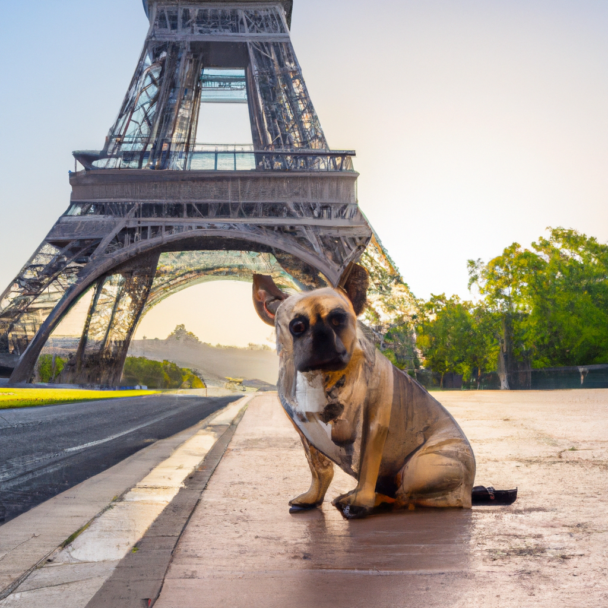

<!--
CO_OP_TRANSLATOR_METADATA:
{
  "original_hash": "238cde5c90363d70ecc939569378da51",
  "translation_date": "2025-10-17T14:25:20+00:00",
  "source_file": "09-building-image-applications/README.md",
  "language_code": "pa"
}
-->
# ਚਿੱਤਰ ਜਨਰੇਸ਼ਨ ਐਪਲੀਕੇਸ਼ਨ ਬਣਾਉਣਾ

[](https://youtu.be/B5VP0_J7cs8?si=5P3L5o7F_uS_QcG9)

LLMs ਸਿਰਫ਼ ਟੈਕਸਟ ਜਨਰੇਸ਼ਨ ਤੱਕ ਹੀ ਸੀਮਿਤ ਨਹੀਂ ਹਨ। ਇਹ ਟੈਕਸਟ ਵਰਣਨ ਤੋਂ ਚਿੱਤਰ ਬਣਾਉਣ ਦੇ ਯੋਗ ਹਨ। ਚਿੱਤਰਾਂ ਨੂੰ ਇੱਕ ਮੋਡੈਲਿਟੀ ਵਜੋਂ ਵਰਤਣਾ ਕਈ ਖੇਤਰਾਂ ਵਿੱਚ ਬਹੁਤ ਲਾਭਦਾਇਕ ਹੋ ਸਕਦਾ ਹੈ ਜਿਵੇਂ ਕਿ ਮੈਡਟੈਕ, ਆਰਕੀਟੈਕਚਰ, ਟੂਰਿਜ਼ਮ, ਗੇਮ ਡਿਵੈਲਪਮੈਂਟ ਅਤੇ ਹੋਰ। ਇਸ ਅਧਿਆਇ ਵਿੱਚ, ਅਸੀਂ ਦੋ ਸਭ ਤੋਂ ਪ੍ਰਸਿੱਧ ਚਿੱਤਰ ਜਨਰੇਸ਼ਨ ਮਾਡਲਾਂ, DALL-E ਅਤੇ Midjourney, ਦੇ ਬਾਰੇ ਜਾਣਾਂਗੇ।

## ਪਰਿਚਯ

ਇਸ ਪਾਠ ਵਿੱਚ, ਅਸੀਂ ਕਵਰ ਕਰਾਂਗੇ:

- ਚਿੱਤਰ ਜਨਰੇਸ਼ਨ ਅਤੇ ਇਹ ਕਿਉਂ ਲਾਭਦਾਇਕ ਹੈ।
- DALL-E ਅਤੇ Midjourney, ਇਹ ਕੀ ਹਨ ਅਤੇ ਇਹ ਕਿਵੇਂ ਕੰਮ ਕਰਦੇ ਹਨ।
- ਤੁਸੀਂ ਚਿੱਤਰ ਜਨਰੇਸ਼ਨ ਐਪ ਕਿਵੇਂ ਬਣਾਉਂਦੇ ਹੋ।

## ਸਿੱਖਣ ਦੇ ਲਕਸ਼

ਇਹ ਪਾਠ ਪੂਰਾ ਕਰਨ ਤੋਂ ਬਾਅਦ, ਤੁਸੀਂ ਯੋਗ ਹੋਵੋਗੇ:

- ਚਿੱਤਰ ਜਨਰੇਸ਼ਨ ਐਪਲੀਕੇਸ਼ਨ ਬਣਾਉਣਾ।
- ਆਪਣੇ ਐਪਲੀਕੇਸ਼ਨ ਲਈ ਮੈਟਾ ਪ੍ਰੋਮਪਟਸ ਨਾਲ ਸੀਮਾਵਾਂ ਨਿਰਧਾਰਤ ਕਰਨਾ।
- DALL-E ਅਤੇ Midjourney ਨਾਲ ਕੰਮ ਕਰਨਾ।

## ਚਿੱਤਰ ਜਨਰੇਸ਼ਨ ਐਪਲੀਕੇਸ਼ਨ ਕਿਉਂ ਬਣਾਈਏ?

ਚਿੱਤਰ ਜਨਰੇਸ਼ਨ ਐਪਲੀਕੇਸ਼ਨ ਜਨਰੇਟਿਵ AI ਦੀ ਸਮਰਥਾ ਦੀ ਪੜਚੋਲ ਕਰਨ ਦਾ ਇੱਕ ਸ਼ਾਨਦਾਰ ਤਰੀਕਾ ਹੈ। ਇਹ ਕਈ ਉਦਾਹਰਣਾਂ ਲਈ ਵਰਤੇ ਜਾ ਸਕਦੇ ਹਨ:

- **ਚਿੱਤਰ ਸੰਪਾਦਨ ਅਤੇ ਸੰਸ਼ਲੇਸ਼ਣ**। ਤੁਸੀਂ ਚਿੱਤਰ ਸੰਪਾਦਨ ਅਤੇ ਚਿੱਤਰ ਸੰਸ਼ਲੇਸ਼ਣ ਵਰਗੇ ਕਈ ਉਪਯੋਗਾਂ ਲਈ ਚਿੱਤਰ ਜਨਰੇਟ ਕਰ ਸਕਦੇ ਹੋ।

- **ਕਈ ਉਦਯੋਗਾਂ ਵਿੱਚ ਲਾਗੂ**। ਇਹ ਮੈਡਟੈਕ, ਟੂਰਿਜ਼ਮ, ਗੇਮ ਡਿਵੈਲਪਮੈਂਟ ਅਤੇ ਹੋਰ ਵਰਗੇ ਕਈ ਉਦਯੋਗਾਂ ਲਈ ਚਿੱਤਰ ਜਨਰੇਟ ਕਰਨ ਲਈ ਵੀ ਵਰਤੇ ਜਾ ਸਕਦੇ ਹਨ।

## ਸਥਿਤੀ: Edu4All

ਇਸ ਪਾਠ ਦੇ ਹਿੱਸੇ ਵਜੋਂ, ਅਸੀਂ ਆਪਣੇ ਸਟਾਰਟਅਪ Edu4All ਨਾਲ ਕੰਮ ਜਾਰੀ ਰੱਖਾਂਗੇ। ਵਿਦਿਆਰਥੀ ਆਪਣੇ ਅਸੈਸਮੈਂਟ ਲਈ ਚਿੱਤਰ ਬਣਾਉਣਗੇ, ਕਿਹੜੇ ਚਿੱਤਰ ਬਣਾਉਣੇ ਹਨ ਇਹ ਵਿਦਿਆਰਥੀਆਂ ਉੱਤੇ ਹੈ, ਪਰ ਉਹ ਆਪਣੇ ਪਰੀਆਂ ਦੀ ਕਹਾਣੀ ਲਈ ਚਿੱਤਰ ਬਣਾਉਣ ਜਾਂ ਆਪਣੇ ਕਹਾਣੇ ਲਈ ਨਵਾਂ ਪਾਤਰ ਬਣਾਉਣ ਜਾਂ ਆਪਣੇ ਵਿਚਾਰਾਂ ਅਤੇ ਧਾਰਨਾਵਾਂ ਨੂੰ ਦ੍ਰਿਸ਼ਮਾਨ ਕਰਨ ਵਿੱਚ ਮਦਦ ਕਰ ਸਕਦੇ ਹਨ।

ਇਹ ਹੈ ਜੋ Edu4All ਦੇ ਵਿਦਿਆਰਥੀ ਜਨਰੇਟ ਕਰ ਸਕਦੇ ਹਨ ਜੇ ਉਹ ਕਲਾਸ ਵਿੱਚ ਸਮਾਰਕਾਂ 'ਤੇ ਕੰਮ ਕਰ ਰਹੇ ਹਨ:



ਇੱਕ ਪ੍ਰੋਮਪਟ ਵਰਤ ਕੇ

> "ਸਵੇਰੇ ਦੀ ਰੋਸ਼ਨੀ ਵਿੱਚ Eiffel Tower ਦੇ ਨਾਲ ਕੁੱਤਾ"

## DALL-E ਅਤੇ Midjourney ਕੀ ਹਨ?

[DALL-E](https://openai.com/dall-e-2?WT.mc_id=academic-105485-koreyst) ਅਤੇ [Midjourney](https://www.midjourney.com/?WT.mc_id=academic-105485-koreyst) ਦੋ ਸਭ ਤੋਂ ਪ੍ਰਸਿੱਧ ਚਿੱਤਰ ਜਨਰੇਸ਼ਨ ਮਾਡਲ ਹਨ, ਇਹ ਤੁਹਾਨੂੰ ਪ੍ਰੋਮਪਟਸ ਵਰਤ ਕੇ ਚਿੱਤਰ ਜਨਰੇਟ ਕਰਨ ਦੀ ਆਗਿਆ ਦਿੰਦੇ ਹਨ।

### DALL-E

DALL-E ਤੋਂ ਸ਼ੁਰੂ ਕਰਦੇ ਹਾਂ, ਜੋ ਕਿ ਇੱਕ ਜਨਰੇਟਿਵ AI ਮਾਡਲ ਹੈ ਜੋ ਟੈਕਸਟ ਵਰਣਨ ਤੋਂ ਚਿੱਤਰ ਜਨਰੇਟ ਕਰਦਾ ਹੈ।

> [DALL-E ਦੋ ਮਾਡਲਾਂ, CLIP ਅਤੇ diffused attention, ਦਾ ਸੰਯੋਗ ਹੈ](https://towardsdatascience.com/openais-dall-e-and-clip-101-a-brief-introduction-3a4367280d4e?WT.mc_id=academic-105485-koreyst)।

- **CLIP**, ਇੱਕ ਮਾਡਲ ਹੈ ਜੋ ਚਿੱਤਰਾਂ ਅਤੇ ਟੈਕਸਟ ਤੋਂ ਐਮਬੈਡਿੰਗਸ, ਜੋ ਡਾਟਾ ਦੇ ਸੰਖਿਆਤਮਕ ਪ੍ਰਤੀਨਿਧਾਨ ਹਨ, ਜਨਰੇਟ ਕਰਦਾ ਹੈ।

- **Diffused attention**, ਇੱਕ ਮਾਡਲ ਹੈ ਜੋ ਐਮਬੈਡਿੰਗਸ ਤੋਂ ਚਿੱਤਰ ਜਨਰੇਟ ਕਰਦਾ ਹੈ। DALL-E ਨੂੰ ਚਿੱਤਰਾਂ ਅਤੇ ਟੈਕਸਟ ਦੇ ਡੇਟਾਸੈਟ 'ਤੇ ਟ੍ਰੇਨ ਕੀਤਾ ਗਿਆ ਹੈ ਅਤੇ ਇਸਨੂੰ ਟੈਕਸਟ ਵਰਣਨ ਤੋਂ ਚਿੱਤਰ ਜਨਰੇਟ ਕਰਨ ਲਈ ਵਰਤਿਆ ਜਾ ਸਕਦਾ ਹੈ। ਉਦਾਹਰਣ ਲਈ, DALL-E ਨੂੰ ਇੱਕ ਟੋਪੀ ਵਿੱਚ ਬਿੱਲੀ ਜਾਂ ਮੋਹਾਕ ਵਾਲੇ ਕੁੱਤੇ ਦੇ ਚਿੱਤਰ ਜਨਰੇਟ ਕਰਨ ਲਈ ਵਰਤਿਆ ਜਾ ਸਕਦਾ ਹੈ।

### Midjourney

Midjourney DALL-E ਦੇ ਸਮਾਨ ਹੀ ਕੰਮ ਕਰਦਾ ਹੈ, ਇਹ ਟੈਕਸਟ ਪ੍ਰੋਮਪਟਸ ਤੋਂ ਚਿੱਤਰ ਜਨਰੇਟ ਕਰਦਾ ਹੈ। Midjourney ਨੂੰ "ਟੋਪੀ ਵਿੱਚ ਬਿੱਲੀ" ਜਾਂ "ਮੋਹਾਕ ਵਾਲਾ ਕੁੱਤਾ" ਵਰਗੇ ਪ੍ਰੋਮਪਟਸ ਵਰਤ ਕੇ ਚਿੱਤਰ ਜਨਰੇਟ ਕਰਨ ਲਈ ਵੀ ਵਰਤਿਆ ਜਾ ਸਕਦਾ ਹੈ।


_ਚਿੱਤਰ ਕ੍ਰੈਡਿਟ Wikipedia, Midjourney ਦੁਆਰਾ ਜਨਰੇਟ ਕੀਤਾ ਚਿੱਤਰ_

## DALL-E ਅਤੇ Midjourney ਕਿਵੇਂ ਕੰਮ ਕਰਦੇ ਹਨ

ਸਭ ਤੋਂ ਪਹਿਲਾਂ, [DALL-E](https://arxiv.org/pdf/2102.12092.pdf?WT.mc_id=academic-105485-koreyst)। DALL-E ਇੱਕ ਜਨਰੇਟਿਵ AI ਮਾਡਲ ਹੈ ਜੋ ਟ੍ਰਾਂਸਫਾਰਮਰ ਆਰਕੀਟੈਕਚਰ 'ਤੇ ਅਧਾਰਿਤ ਹੈ ਜਿਸ ਵਿੱਚ ਇੱਕ _autoregressive transformer_ ਹੈ।

ਇੱਕ _autoregressive transformer_ ਨਿਰਧਾਰਤ ਕਰਦਾ ਹੈ ਕਿ ਇੱਕ ਮਾਡਲ ਟੈਕਸਟ ਵਰਣਨ ਤੋਂ ਚਿੱਤਰ ਕਿਵੇਂ ਜਨਰੇਟ ਕਰਦਾ ਹੈ, ਇਹ ਇੱਕ ਸਮੇਂ ਵਿੱਚ ਇੱਕ ਪਿਕਸਲ ਜਨਰੇਟ ਕਰਦਾ ਹੈ, ਅਤੇ ਫਿਰ ਜਨਰੇਟ ਕੀਤੇ ਪਿਕਸਲਾਂ ਨੂੰ ਅਗਲੇ ਪਿਕਸਲ ਨੂੰ ਜਨਰੇਟ ਕਰਨ ਲਈ ਵਰਤਦਾ ਹੈ। ਇੱਕ ਨਿਊਰਲ ਨੈਟਵਰਕ ਵਿੱਚ ਕਈ ਲੇਅਰਾਂ ਵਿੱਚੋਂ ਗੁਜ਼ਰਦਾ ਹੈ, ਜਦ ਤੱਕ ਚਿੱਤਰ ਪੂਰਾ ਨਹੀਂ ਹੋ ਜਾਂਦਾ।

ਇਸ ਪ੍ਰਕਿਰਿਆ ਨਾਲ, DALL-E, ਜਨਰੇਟ ਕੀਤੇ ਚਿੱਤਰ ਵਿੱਚ ਗੁਣ, ਵਸਤੂਆਂ, ਵਿਸ਼ੇਸ਼ਤਾਵਾਂ ਅਤੇ ਹੋਰ ਨੂੰ ਨਿਯੰਤਰਿਤ ਕਰਦਾ ਹੈ। ਹਾਲਾਂਕਿ, DALL-E 2 ਅਤੇ 3 ਜਨਰੇਟ ਕੀਤੇ ਚਿੱਤਰ 'ਤੇ ਹੋਰ ਨਿਯੰਤਰਣ ਰੱਖਦੇ ਹਨ।

## ਆਪਣਾ ਪਹਿਲਾ ਚਿੱਤਰ ਜਨਰੇਸ਼ਨ ਐਪਲੀਕੇਸ਼ਨ ਬਣਾਉਣਾ

ਤਾਂ ਚਿੱਤਰ ਜਨਰੇਸ਼ਨ ਐਪਲੀਕੇਸ਼ਨ ਬਣਾਉਣ ਲਈ ਤੁਹਾਨੂੰ ਕੀ ਚਾਹੀਦਾ ਹੈ? ਤੁਹਾਨੂੰ ਹੇਠਾਂ ਦਿੱਤੀਆਂ ਲਾਇਬ੍ਰੇਰੀਆਂ ਦੀ ਲੋੜ ਹੈ:

- **python-dotenv**, ਇਹ ਲਾਇਬ੍ਰੇਰੀ ਤੁਹਾਡੇ ਰਾਜ਼ਾਂ ਨੂੰ _.env_ ਫਾਈਲ ਵਿੱਚ ਕੋਡ ਤੋਂ ਦੂਰ ਰੱਖਣ ਲਈ ਵਰਤਣ ਦੀ ਸਿਫਾਰਸ਼ ਕੀਤੀ ਜਾਂਦੀ ਹੈ।
- **openai**, ਇਹ ਲਾਇਬ੍ਰੇਰੀ ਤੁਹਾਨੂੰ OpenAI API ਨਾਲ ਸੰਚਾਰ ਕਰਨ ਲਈ ਵਰਤਣੀ ਹੈ।
- **pillow**, Python ਵਿੱਚ ਚਿੱਤਰਾਂ ਨਾਲ ਕੰਮ ਕਰਨ ਲਈ।
- **requests**, HTTP ਰਿਕਵੈਸਟ ਕਰਨ ਵਿੱਚ ਮਦਦ ਕਰਨ ਲਈ।

## Azure OpenAI ਮਾਡਲ ਬਣਾਓ ਅਤੇ ਡਿਪਲੌਇ ਕਰੋ

ਜੇਕਰ ਪਹਿਲਾਂ ਨਹੀਂ ਕੀਤਾ, ਤਾਂ [Microsoft Learn](https://learn.microsoft.com/azure/ai-foundry/openai/how-to/create-resource?pivots=web-portal) ਪੇਜ 'ਤੇ ਦਿੱਤੀਆਂ ਹਦਾਇਤਾਂ ਦੀ ਪਾਲਣਾ ਕਰੋ
Azure OpenAI ਸਰੋਤ ਅਤੇ ਮਾਡਲ ਬਣਾਉਣ ਲਈ। ਮਾਡਲ ਵਜੋਂ DALL-E 3 ਚੁਣੋ।  

## ਐਪ ਬਣਾਓ

1. _.env_ ਨਾਮ ਦੀ ਫਾਈਲ ਬਣਾਓ ਜਿਸ ਵਿੱਚ ਹੇਠਾਂ ਦਿੱਤਾ ਸਮੱਗਰੀ ਹੋਵੇ:

   ```text
   AZURE_OPENAI_ENDPOINT=<your endpoint>
   AZURE_OPENAI_API_KEY=<your key>
   AZURE_OPENAI_DEPLOYMENT="dall-e-3"
   ```

   ਇਹ ਜਾਣਕਾਰੀ Azure OpenAI Foundry Portal ਵਿੱਚ ਆਪਣੇ ਸਰੋਤ ਦੇ "Deployments" ਸੈਕਸ਼ਨ ਵਿੱਚ ਲੱਭੋ।

1. ਉਪਰੋਕਤ ਲਾਇਬ੍ਰੇਰੀਆਂ ਨੂੰ _requirements.txt_ ਨਾਮਕ ਫਾਈਲ ਵਿੱਚ ਇਕੱਠਾ ਕਰੋ:

   ```text
   python-dotenv
   openai
   pillow
   requests
   ```

1. ਅਗਲੇ ਕਦਮ ਵਿੱਚ, ਵਰਚੁਅਲ ਐਨਵਾਇਰਨਮੈਂਟ ਬਣਾਓ ਅਤੇ ਲਾਇਬ੍ਰੇਰੀਆਂ ਇੰਸਟਾਲ ਕਰੋ:

   ```bash
   python3 -m venv venv
   source venv/bin/activate
   pip install -r requirements.txt
   ```

   Windows ਲਈ, ਵਰਚੁਅਲ ਐਨਵਾਇਰਨਮੈਂਟ ਬਣਾਉਣ ਅਤੇ ਐਕਟੀਵੇਟ ਕਰਨ ਲਈ ਹੇਠਾਂ ਦਿੱਤੇ ਕਮਾਂਡ ਵਰਤੋ:

   ```bash
   python3 -m venv venv
   venv\Scripts\activate.bat
   ```

1. _app.py_ ਨਾਮਕ ਫਾਈਲ ਵਿੱਚ ਹੇਠਾਂ ਦਿੱਤਾ ਕੋਡ ਸ਼ਾਮਲ ਕਰੋ:

    ```python
    import openai
    import os
    import requests
    from PIL import Image
    import dotenv
    from openai import OpenAI, AzureOpenAI
    
    # import dotenv
    dotenv.load_dotenv()
    
    # configure Azure OpenAI service client 
    client = AzureOpenAI(
      azure_endpoint = os.environ["AZURE_OPENAI_ENDPOINT"],
      api_key=os.environ['AZURE_OPENAI_API_KEY'],
      api_version = "2024-02-01"
      )
    try:
        # Create an image by using the image generation API
        generation_response = client.images.generate(
                                prompt='Bunny on horse, holding a lollipop, on a foggy meadow where it grows daffodils',
                                size='1024x1024', n=1,
                                model=os.environ['AZURE_OPENAI_DEPLOYMENT']
                              )

        # Set the directory for the stored image
        image_dir = os.path.join(os.curdir, 'images')

        # If the directory doesn't exist, create it
        if not os.path.isdir(image_dir):
            os.mkdir(image_dir)

        # Initialize the image path (note the filetype should be png)
        image_path = os.path.join(image_dir, 'generated-image.png')

        # Retrieve the generated image
        image_url = generation_response.data[0].url  # extract image URL from response
        generated_image = requests.get(image_url).content  # download the image
        with open(image_path, "wb") as image_file:
            image_file.write(generated_image)

        # Display the image in the default image viewer
        image = Image.open(image_path)
        image.show()

    # catch exceptions
    except openai.InvalidRequestError as err:
        print(err)
   ```

ਇਸ ਕੋਡ ਨੂੰ ਸਮਝਦੇ ਹਾਂ:

- ਸਭ ਤੋਂ ਪਹਿਲਾਂ, ਅਸੀਂ ਲੋੜੀਂਦੇ ਲਾਇਬ੍ਰੇਰੀਆਂ ਨੂੰ ਇੰਪੋਰਟ ਕਰਦੇ ਹਾਂ, ਜਿਵੇਂ ਕਿ OpenAI ਲਾਇਬ੍ਰੇਰੀ, dotenv ਲਾਇਬ੍ਰੇਰੀ, requests ਲਾਇਬ੍ਰੇਰੀ, ਅਤੇ Pillow ਲਾਇਬ੍ਰੇਰੀ।

  ```python
  import openai
  import os
  import requests
  from PIL import Image
  import dotenv
  ```

- ਅਗਲੇ ਕਦਮ ਵਿੱਚ, ਅਸੀਂ _.env_ ਫਾਈਲ ਤੋਂ ਵਾਤਾਵਰਣ ਚਰਾਂ ਨੂੰ ਲੋਡ ਕਰਦੇ ਹਾਂ।

  ```python
  # import dotenv
  dotenv.load_dotenv()
  ```

- ਇਸ ਤੋਂ ਬਾਅਦ, ਅਸੀਂ Azure OpenAI ਸੇਵਾ ਕਲਾਇੰਟ ਨੂੰ ਸੰਰਚਿਤ ਕਰਦੇ ਹਾਂ।

  ```python
  # Get endpoint and key from environment variables
  client = AzureOpenAI(
      azure_endpoint = os.environ["AZURE_OPENAI_ENDPOINT"],
      api_key=os.environ['AZURE_OPENAI_API_KEY'],
      api_version = "2024-02-01"
      )
  ```

- ਅਗਲੇ ਕਦਮ ਵਿੱਚ, ਅਸੀਂ ਚਿੱਤਰ ਜਨਰੇਟ ਕਰਦੇ ਹਾਂ:

  ```python
  # Create an image by using the image generation API
  generation_response = client.images.generate(
                        prompt='Bunny on horse, holding a lollipop, on a foggy meadow where it grows daffodils',
                        size='1024x1024', n=1,
                        model=os.environ['AZURE_OPENAI_DEPLOYMENT']
                      )
  ```

  ਉਪਰੋਕਤ ਕੋਡ JSON ਆਬਜੈਕਟ ਨਾਲ ਜਵਾਬ ਦਿੰਦਾ ਹੈ ਜਿਸ ਵਿੱਚ ਜਨਰੇਟ ਕੀਤੇ ਚਿੱਤਰ ਦਾ URL ਹੁੰਦਾ ਹੈ। ਅਸੀਂ URL ਨੂੰ ਵਰਤ ਕੇ ਚਿੱਤਰ ਡਾਊਨਲੋਡ ਕਰ ਸਕਦੇ ਹਾਂ ਅਤੇ ਇਸਨੂੰ ਫਾਈਲ ਵਿੱਚ ਸੇਵ ਕਰ ਸਕਦੇ ਹਾਂ।

- ਆਖਰੀ ਵਿੱਚ, ਅਸੀਂ ਚਿੱਤਰ ਨੂੰ ਖੋਲ੍ਹਦੇ ਹਾਂ ਅਤੇ ਮਿਆਰੀ ਚਿੱਤਰ ਦਰਸ਼ਕ ਨੂੰ ਵਰਤ ਕੇ ਇਸਨੂੰ ਦਿਖਾਉਂਦੇ ਹਾਂ:

  ```python
  image = Image.open(image_path)
  image.show()
  ```

### ਚਿੱਤਰ ਜਨਰੇਟ ਕਰਨ ਦੇ ਹੋਰ ਵੇਰਵੇ

ਆਓ ਉਸ ਕੋਡ ਨੂੰ ਵੇਖਦੇ ਹਾਂ ਜੋ ਚਿੱਤਰ ਜਨਰੇਟ ਕਰਦਾ ਹੈ:

   ```python
     generation_response = client.images.generate(
                               prompt='Bunny on horse, holding a lollipop, on a foggy meadow where it grows daffodils',
                               size='1024x1024', n=1,
                               model=os.environ['AZURE_OPENAI_DEPLOYMENT']
                           )
   ```

- **prompt**, ਉਹ ਟੈਕਸਟ ਪ੍ਰੋਮਪਟ ਹੈ ਜੋ ਚਿੱਤਰ ਜਨਰੇਟ ਕਰਨ ਲਈ ਵਰਤਿਆ ਜਾਂਦਾ ਹੈ। ਇਸ ਮਾਮਲੇ ਵਿੱਚ, ਅਸੀਂ "ਘੋੜੇ 'ਤੇ ਖਰਗੋਸ਼, ਲਾਲ ਪੋਪ ਲੇ ਕੇ, ਧੁੰਦਲੇ ਮੈਦਾਨ 'ਤੇ ਜਿੱਥੇ ਡੈਫੋਡਿਲਸ ਉਗਦੇ ਹਨ" ਵਰਤ ਰਹੇ ਹਾਂ।
- **size**, ਜਨਰੇਟ ਕੀਤੇ ਚਿੱਤਰ ਦਾ ਆਕਾਰ ਹੈ। ਇਸ ਮਾਮਲੇ ਵਿੱਚ, ਅਸੀਂ 1024x1024 ਪਿਕਸਲ ਦਾ ਚਿੱਤਰ ਜਨਰੇਟ ਕਰ ਰਹੇ ਹਾਂ।
- **n**, ਜਨਰੇਟ ਕੀਤੇ ਚਿੱਤਰਾਂ ਦੀ ਗਿਣਤੀ ਹੈ। ਇਸ ਮਾਮਲੇ ਵਿੱਚ, ਅਸੀਂ ਦੋ ਚਿੱਤਰ ਜਨਰੇਟ ਕਰ ਰਹੇ ਹਾਂ।
- **temperature**, ਇੱਕ ਪੈਰਾਮੀਟਰ ਹੈ ਜੋ ਜਨਰੇਟਿਵ AI ਮਾਡਲ ਦੇ ਆਉਟਪੁੱਟ ਦੀ ਰੈਂਡਮਨੈਸ ਨੂੰ ਨਿਯੰਤਰਿਤ ਕਰਦਾ ਹੈ। temperature 0 ਅਤੇ 1 ਦੇ ਵਿਚਕਾਰ ਇੱਕ ਮੁੱਲ ਹੈ ਜਿੱਥੇ 0 ਦਾ ਮਤਲਬ ਹੈ ਕਿ ਆਉਟਪੁੱਟ ਨਿਰਧਾਰਤ ਹੈ ਅਤੇ 1 ਦਾ ਮਤਲਬ ਹੈ ਕਿ ਆਉਟਪੁੱਟ ਰੈਂਡਮ ਹੈ। ਡਿਫਾਲਟ ਮੁੱਲ 0.7 ਹੈ।

ਚਿੱਤਰਾਂ ਨਾਲ ਹੋਰ ਚੀਜ਼ਾਂ ਕੀਤੀਆਂ ਜਾ ਸਕਦੀਆਂ ਹਨ ਜੋ ਅਸੀਂ ਅਗਲੇ ਸੈਕਸ਼ਨ ਵਿੱਚ ਕਵਰ ਕਰਾਂਗੇ।

## ਚਿੱਤਰ ਜਨਰੇਸ਼ਨ ਦੀ ਵਾਧੂ ਸਮਰਥਾ

ਤੁਸੀਂ ਹੁਣ ਤੱਕ ਦੇਖਿਆ ਕਿ ਅਸੀਂ ਕੁਝ ਪੰਗਤਾਂ ਦੇ ਕੋਡ ਨਾਲ ਚਿੱਤਰ ਜਨਰੇਟ ਕਰਨ ਦੇ ਯੋਗ ਹੋਏ। ਹਾਲਾਂਕਿ, ਚਿੱਤਰਾਂ ਨਾਲ ਹੋਰ ਚੀਜ਼ਾਂ ਕੀਤੀਆਂ ਜਾ ਸਕਦੀਆਂ ਹਨ।

ਤੁਸੀਂ ਹੇਠਾਂ ਦਿੱਤੀਆਂ ਚੀਜ਼ਾਂ ਵੀ ਕਰ ਸਕਦੇ ਹੋ:

- **ਸੰਪਾਦਨ ਕਰੋ**। ਮੌਜੂਦਾ ਚਿੱਤਰ, ਇੱਕ ਮਾਸਕ ਅਤੇ ਇੱਕ ਪ੍ਰੋਮਪਟ ਦੇ ਕੇ, ਤੁਸੀਂ ਚਿੱਤਰ ਨੂੰ ਬਦਲ ਸਕਦੇ ਹੋ। ਉਦਾਹਰਣ ਲਈ, ਤੁਸੀਂ ਚਿੱਤਰ ਦੇ ਕਿਸੇ ਹਿੱਸੇ ਵਿੱਚ ਕੁਝ ਸ਼ਾਮਲ ਕਰ ਸਕਦੇ ਹੋ। ਸਾਡੇ ਖਰਗੋਸ਼ ਚਿੱਤਰ ਦੀ ਕਲਪਨਾ ਕਰੋ, ਤੁਸੀਂ ਖਰਗੋਸ਼ ਨੂੰ ਇੱਕ ਟੋਪੀ ਸ਼ਾਮਲ ਕਰ ਸਕਦੇ ਹੋ। ਤੁਸੀਂ ਇਹ ਕਿਵੇਂ ਕਰਦੇ ਹੋ ਇਹ ਹੈ ਚਿੱਤਰ, ਇੱਕ ਮਾਸਕ (ਬਦਲਾਅ ਲਈ ਖੇਤਰ ਦੀ ਪਛਾਣ ਕਰਦੇ ਹੋ) ਅਤੇ ਇੱਕ ਟੈਕਸਟ ਪ੍ਰੋਮਪਟ ਦੇ ਕੇ ਕਿਹਾ ਕਿ ਕੀ ਕੀਤਾ ਜਾਣਾ ਚਾਹੀਦਾ ਹੈ। 
> ਨੋਟ: ਇਹ DALL-E 3 ਵਿੱਚ ਸਮਰਥਿਤ ਨਹੀਂ ਹੈ। 
 
ਇਹ GPT ਚਿੱਤਰ ਵਰਤ ਕੇ ਇੱਕ ਉਦਾਹਰਣ ਹੈ:

   ```python
   response = client.images.edit(
       model="gpt-image-1",
       image=open("sunlit_lounge.png", "rb"),
       mask=open("mask.png", "rb"),
       prompt="A sunlit indoor lounge area with a pool containing a flamingo"
   )
   image_url = response.data[0].url
   ```

  ਬੇਸ ਚਿੱਤਰ ਵਿੱਚ ਸਿਰਫ਼ ਲਾਊਂਜ ਅਤੇ ਪੂਲ ਹੋਵੇਗਾ ਪਰ ਅੰਤਿਮ ਚਿੱਤਰ ਵਿੱਚ ਇੱਕ ਫਲਾਮਿੰਗੋ ਹੋਵੇਗਾ:

<div style="display: flex; justify-content: space-between; align-items: center; margin: 20px 0;">
  
  
  
</div>


- **ਵੈਰੀਏਸ਼ਨ ਬਣਾਓ**। ਵਿਚਾਰ ਇਹ ਹੈ ਕਿ ਤੁਸੀਂ ਮੌਜੂਦਾ ਚਿੱਤਰ ਲੈਂਦੇ ਹੋ ਅਤੇ ਮੰਗਦੇ ਹੋ ਕਿ ਵੈਰੀਏਸ਼ਨ ਬਣਾਏ ਜਾਣ। ਵੈਰੀਏਸ਼ਨ ਬਣਾਉਣ ਲਈ, ਤੁਸੀਂ ਇੱਕ ਚਿੱਤਰ ਅਤੇ ਇੱਕ ਟੈਕਸਟ ਪ੍ਰੋਮਪਟ ਪ੍ਰਦਾਨ ਕਰਦੇ ਹੋ ਅਤੇ ਹੇਠਾਂ ਦਿੱਤੇ ਕੋਡ ਵਰਗੇ ਕੋਡ:

  ```python
  response = openai.Image.create_variation(
    image=open("bunny-lollipop.png", "rb"),
    n=1,
    size="1024x1024"
  )
  image_url = response['data'][0]['url']
  ```

  > ਨੋਟ, ਇਹ ਸਿਰਫ਼ OpenAI 'ਤੇ ਸਮਰਥਿਤ ਹੈ

## Temperature

Temperature ਇੱਕ ਪੈਰਾਮੀਟਰ ਹੈ ਜੋ ਜਨਰੇਟਿਵ AI ਮਾਡਲ ਦੇ ਆਉਟਪੁੱਟ ਦੀ ਰੈਂਡਮਨੈਸ ਨੂੰ ਨਿਯੰਤਰਿਤ ਕਰਦਾ ਹੈ। temperature 0 ਅਤੇ 1 ਦੇ ਵਿਚਕਾਰ ਇੱਕ ਮੁੱਲ ਹੈ ਜਿੱਥੇ 0 ਦਾ ਮਤਲਬ ਹੈ ਕਿ ਆਉਟਪੁੱਟ ਨਿਰਧਾਰਤ ਹੈ ਅਤੇ 1 ਦਾ ਮਤਲਬ ਹੈ ਕਿ ਆਉਟਪੁੱਟ ਰੈਂਡਮ ਹੈ। ਡਿਫਾਲਟ ਮੁੱਲ 0.7 ਹੈ।

ਆਓ ਇੱਕ ਉਦਾਹਰਣ ਦੇਖਦੇ ਹਾਂ ਕਿ temperature ਕਿਵੇਂ ਕੰਮ ਕਰਦਾ ਹੈ, ਇਸ ਪ੍ਰੋਮਪਟ ਨੂੰ ਦੋ ਵਾਰ ਚਲਾਕੇ:

> ਪ੍ਰੋਮਪਟ : "ਘੋੜੇ 'ਤੇ ਖਰਗੋਸ਼, ਲਾਲ ਪੋਪ ਲੇ ਕੇ, ਧੁੰਦਲੇ ਮੈਦਾਨ 'ਤੇ ਜਿੱਥੇ ਡੈਫੋਡਿਲਸ ਉਗਦੇ ਹਨ"


ਹੁਣ ਆਓ ਉਸੇ ਪ੍ਰੋਮਪਟ ਨੂੰ ਚਲਾਈਏ ਸਿਰਫ਼ ਇਹ ਦੇਖਣ ਲਈ ਕਿ ਅਸੀਂ ਇੱਕੋ ਚਿੱਤਰ ਦੋ ਵਾਰ ਨਹੀਂ ਲੈਂਦੇ:


```python
import openai
import os
import requests
from PIL import Image
import dotenv
from openai import AzureOpenAI
# import dotenv
dotenv.load_dotenv()

# Get endpoint and key from environment variables
client = AzureOpenAI(
  azure_endpoint = os.environ["AZURE_OPENAI_ENDPOINT"],
  api_key=os.environ['AZURE_OPENAI_API_KEY'],
  api_version = "2024-02-01"
  )


disallow_list = "swords, violence, blood, gore, nudity, sexual content, adult content, adult themes, adult language, adult humor, adult jokes, adult situations, adult"

meta_prompt = f"""You are an assistant designer that creates images for children.

The image needs to be safe for work and appropriate for children.

The image needs to be in color.

The image needs to be in landscape orientation.

The image needs to be in a 16:9 aspect ratio.

Do not consider any input from the following that is not safe for work or appropriate for children.
{disallow_list}
"""

prompt = f"""{meta_prompt}
Generate monument of the Arc of Triumph in Paris, France, in the evening light with a small child holding a Teddy looks on.
""""

try:
    # Create an image by using the image generation API
    generation_response = client.images.generate(
        prompt=prompt,    # Enter your prompt text here
        size='1024x1024',
        n=1,
    )
    # Set the directory for the stored image
    image_dir = os.path.join(os.curdir, 'images')

    # If the directory doesn't exist, create it
    if not os.path.isdir(image_dir):
        os.mkdir(image_dir)

    # Initialize the image path (note the filetype should be png)
    image_path = os.path.join(image_dir, 'generated-image.png')

    # Retrieve the generated image
    image_url = generation_response.data[0].url  # extract image URL from response
    generated_image = requests.get(image_url).content  # download the image
    with open(image_path, "wb") as image_file:
        image_file.write(generated_image)

    # Display the image in the default image viewer
    image = Image.open(image_path)
    image.show()

# catch exceptions
except openai.BadRequestError as err:
    print(err)
```

## ਸ਼ਾਨਦਾਰ ਕੰਮ! ਆਪਣੀ ਸਿੱਖਣ ਜਾਰੀ ਰੱਖੋ

ਇਸ ਪਾਠ ਨੂੰ ਪੂਰਾ ਕਰਨ ਤੋਂ ਬਾਅਦ, ਆਪਣਾ ਜਨਰੇਟਿਵ AI ਗਿਆਨ ਵਧਾਉਣ ਲਈ ਸਾਡੀ [Generative AI Learning collection](https://aka.ms/genai-collection?WT.mc_id=academic-105485-koreyst) ਨੂੰ ਚੈੱਕ ਕਰੋ!

ਪਾਠ 10 ਵੱਲ ਜਾਓ ਜਿੱਥੇ ਅਸੀਂ [ਘੱਟ-ਕੋਡ ਨਾਲ AI ਐਪਲੀਕੇਸ਼ਨ ਬਣਾਉਣ](../10-building-low-code-ai-applications/README.md?WT.mc_id=academic-105485-koreyst) ਦੇ ਤਰੀਕੇ ਦੇਖਾਂਗੇ।

---

**ਅਸਵੀਕਰਤੀ**:  
ਇਹ ਦਸਤਾਵੇਜ਼ AI ਅਨੁਵਾਦ ਸੇਵਾ [Co-op Translator](https://github.com/Azure/co-op-translator) ਦੀ ਵਰਤੋਂ ਕਰਕੇ ਅਨੁਵਾਦ ਕੀਤਾ ਗਿਆ ਹੈ। ਜਦੋਂ ਕਿ ਅਸੀਂ ਸਹੀ ਹੋਣ ਦਾ ਯਤਨ ਕਰਦੇ ਹਾਂ, ਕਿਰਪਾ ਕਰਕੇ ਧਿਆਨ ਦਿਓ ਕਿ ਸਵੈਚਾਲਿਤ ਅਨੁਵਾਦਾਂ ਵਿੱਚ ਗਲਤੀਆਂ ਜਾਂ ਅਸੁਚਤਤਾਵਾਂ ਹੋ ਸਕਦੀਆਂ ਹਨ। ਇਸ ਦੀ ਮੂਲ ਭਾਸ਼ਾ ਵਿੱਚ ਮੂਲ ਦਸਤਾਵੇਜ਼ ਨੂੰ ਅਧਿਕਾਰਤ ਸਰੋਤ ਮੰਨਿਆ ਜਾਣਾ ਚਾਹੀਦਾ ਹੈ। ਮਹੱਤਵਪੂਰਨ ਜਾਣਕਾਰੀ ਲਈ, ਪੇਸ਼ੇਵਰ ਮਨੁੱਖੀ ਅਨੁਵਾਦ ਦੀ ਸਿਫਾਰਸ਼ ਕੀਤੀ ਜਾਂਦੀ ਹੈ। ਅਸੀਂ ਇਸ ਅਨੁਵਾਦ ਦੀ ਵਰਤੋਂ ਤੋਂ ਪੈਦਾ ਹੋਣ ਵਾਲੇ ਕਿਸੇ ਵੀ ਗਲਤਫਹਿਮੀ ਜਾਂ ਗਲਤ ਵਿਆਖਿਆ ਲਈ ਜ਼ਿੰਮੇਵਾਰ ਨਹੀਂ ਹਾਂ।