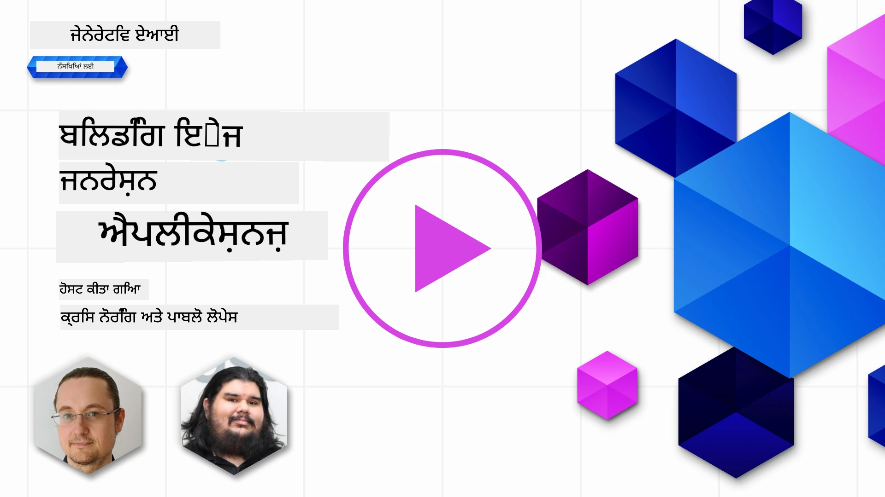

# ਇਮেজ ਬਣਾਉਣ ਵਾਲੀਆਂ ਐਪਲੀਕੇਸ਼ਨਾਂ ਬਣਾਉਣਾ

[](https://aka.ms/gen-ai-lesson9-gh?WT.mc_id=academic-105485-koreyst)

LLMs ਵਿੱਚ ਸਿਰਫ਼ ਟੈਕਸਟ ਜਨਰੇਸ਼ਨ ਹੀ ਨਹੀਂ ਹੁੰਦਾ। ਤੁਸੀਂ ਟੈਕਸਟ ਵੇਰਵਿਆਂ ਤੋਂ ਤਸਵੀਰਾਂ ਵੀ ਤਿਆਰ ਕਰ ਸਕਦੇ ਹੋ। ਤਸਵੀਰਾਂ ਵੱਖ-ਵੱਖ ਮੋਡੈਲਿਟੀ ਵਜੋਂ MedTech, ਆਰਕੀਟੈਕਚਰ, ਟੂਰਿਜ਼ਮ, ਗੇਮ ਵਿਕਾਸ, ਮਾਰਕੀਟਿੰਗ ਅਤੇ ਹੋਰ ਖੇਤਰਾਂ ਵਿੱਚ ਲਾਭਦਾਇਕ ਹਨ। ਇਸ ਪਾਠ ਵਿੱਚ ਅਸੀਂ ਅੱਜ ਦੇ **GPT Image** ਮਾਡਲਾਂ ਨੂੰ ਦੇਖਦੇ ਹਾਂ ਅਤੇ ਇੱਕ ਤਸਵੀਰ ਬਣਾਉਣ ਵਾਲੀ ਐਪ ਬਣਾਉਂਦੇ ਹਾਂ।

## ਜਾਣ ਪਛਾਣ

ਤਸਵੀਰ ਬਣਾਉਣ ਨਾਲ ਤੁਸੀਂ ਕੁਦਰਤੀ-ਭਾਸ਼ਾ ਪ੍ਰੰਪਟ ਨੂੰ ਇੱਕ ਤਸਵੀਰ ਵਿੱਚ ਬਦਲ ਸਕਦੇ ਹੋ। ਇਸ ਪਾਠ ਵਿੱਚ ਅਸੀਂ OpenAI ਤੋਂ **`gpt-image`** ਮਾਡਲ ਪਰਿਵਾਰ ਨਾਲ ਕੰਮ ਕਰਦੇ ਹਾਂ - ਜੋ **[Microsoft Foundry](https://ai.azure.com?WT.mc_id=academic-105485-koreyst)** ਅਤੇ OpenAI ਪਲੇਟਫਾਰਮ ਉੱਤੇ ਉਪਲਬਧ ਮੌਜੂਦਾ ਜਨਰੇਸ਼ਨ ਦੇ ਤਸਵੀਰ ਮਾਡਲ ਹਨ। ਇਹ ਮਾਡਲ ਪੁਰਾਣੇ DALL·E ਮਾਡਲਾਂ (DALL·E 2/3 ਲੈਗੇਸੀ ਹਨ) ਨੂੰ ਬਦਲਦੇ ਹਨ।

ਪੂਰੇ ਪਾਠ ਵੱਖਰੇ ਸਾਡਾ ਕਲਪਨਾਤਮਕ ਸਟਾਰਟਅਪ, **Edu4All**, ਵਰਤਦੇ ਹਾਂ ਜੋ ਸਿੱਖਣ ਦੇ ਸਾਧਨ ਬਣਾਉਂਦਾ ਹੈ। ਟੀਮ ਅਸਾਈਨਮੈਂਟਾਂ ਅਤੇ ਅਧਿਐਨ ਸਾਮਗਰੀ ਲਈ ਚਿੱਤਰ ਬਣਾਉਣਾ ਚਾਹੁੰਦੀ ਹੈ।

## ਸਿੱਖਣ ਦੇ ਲਕੜੀ

ਇਸ ਪਾਠ ਦੇ ਅੰਤ ਤੱਕ ਤੁਸੀਂ ਸਕੋਗੇ:

- ਸਮਝਾਓ ਕਿ ਤਸਵੀਰ ਬਣਾਉਣ ਕੀ ਹੈ ਅਤੇ ਇਹ ਕਿੱਥੇ ਲਾਭਦਾਇਕ ਹੈ।
- `gpt-image` ਮਾਡਲ ਪਰਿਵਾਰ ਬਾਰੇ ਸਮਝੋ ਅਤੇ ਇਹ ਲੈਗੇਸੀ DALL·E ਮਾਡਲਾਂ ਨਾਲ ਕਿਵੇਂ ਵੱਖਰਾ ਹੈ।
- Python (ਅਤੇ TypeScript / .NET) ਵਿੱਚ ਤਸਵੀਰ ਬਣਾਉਣ ਵਾਲੀ ਐਪ ਬਣਾਓ।
- ਤਸਵੀਰਾਂ ਨੂੰ ਸੰਪਾਦਿਤ ਕਰੋ ਅਤੇ ਮੈਟਾਪ੍ਰੰਪਟਸ ਨਾਲ ਸੁਰੱਖਿਆ ਦੀਆਂ ਰੇਖਾਵਾਂ ਲਗਾਓ।

## ਤਸਵੀਰ ਬਣਾਉਣ ਕੀ ਹੈ?

ਤਸਵੀਰ ਬਣਾਉਣ ਵਾਲੇ ਮਾਡਲ ਟੈਕਸਟ ਪ੍ਰੰਪਟ ਤੋਂ ਤਸਵੀਰ ਬਣਾਉਂਦੇ ਹਨ। ਆਧੁਨਿਕ ਮਾਡਲ ਜਿਵੇਂ ਕਿ `gpt-image` ਟ੍ਰਾਂਸਫਾਰਮਰ + ਡਿਫਿਊਜ਼ਨ ਤਕਨਾਲੋਜੀ ਉੱਤੇ ਆਧਾਰਿਤ ਹਨ: ਮਾਡਲ ਟੈਕਸਟ ਅਤੇ ਤਸਵੀਰਾਂ ਵਿਚਕਾਰ ਸਬੰਧ ਸਿੱਖਦਾ ਹੈ, ਫਿਰ ਪ੍ਰੰਪਟ ਦੇਣ ਤੇ ਕ੍ਰਮਵਾਰ "ਡਿਨੋਇਜ਼" ਕਰ ਕੇ ਰੈਂਡਮ ਸ਼ੋਰ ਨੂੰ ਤਸਵੀਰ ਵਿੱਚ ਬਦਲਦਾ ਹੈ ਜੋ ਵੇਰਵੇ ਨੂੰ ਮਿਲਦੀ ਹੈ।

ਦੋ ਪ੍ਰਸਿੱਧ ਤਸਵੀਰ ਮਾਡਲ ਪਰਿਵਾਰ ਹਨ:

- **`gpt-image` (OpenAI)** - ਮੌਜੂਦਾ ਜਨਰੇਸ਼ਨ, ਜਿਸ ਦਾ ਇਸ ਪਾਠ ਵਿੱਚ ਇਸਤੇਮਾਲ ਹੋਇਆ। ਇਹ ਟੈਕਸਟ-ਟੂ-ਇਮੀਜ ਜਨਰੇਸ਼ਨ ਅਤੇ ਤਸਵੀਰ ਸੰਪਾਦਨ (ਮਾਸਕ ਨਾਲ ਇੰਪੇਂਟਿੰਗ) ਨੂੰ ਸਹਾਇਤਾ ਦਿੰਦਾ ਹੈ।
- **Midjourney** - ਇੱਕ ਪ੍ਰਸਿੱਧ ਤੀਸਰੇ-ਪੱਖੀ ਮਾਡਲ ਜਿਸ ਦੀ ਆਪਣੀ ਸੇਵਾ ਅਤੇ Discord ਨਾਲ ਕੰਮ ਕਰਨ ਦਾ ਤਰੀਕਾ ਹੈ।

> ਪੁਰਾਣੇ OpenAI ਤਸਵੀਰ ਮਾਡਲ - **DALL·E 2** ਅਤੇ **DALL·E 3** - ਲੈਗੇਸੀ ਹਨ। DALL·E 3 ਹੁਣ ਨਵੀਆਂ ਡਿਪਲੋਇਮੈਂਟਸ ਲਈ ਉਪਲਬਧ ਨਹੀਂ ਹੈ, ਤੇ `create_variation` ਵਰਗੀਆਂ ਖੂਬੀਆਂ ਸਿਰਫ਼ DALL·E 2 ਵਿੱਚ ਸੀ। ਨਵੀਂਆਂ ਐਪਲੀਕੇਸ਼ਨਾਂ ਲਈ `gpt-image` ਮਾਡਲ ਵਰਤੋ।

### ਕਿਹੜਾ `gpt-image` ਮਾਡਲ ਮੈਂ ਵਰਤਾਂ?

Microsoft Foundry ਉੱਤੇ ਹੇਠਾਂ ਦਿੱਤੇ ਮਾਡਲ **ਆਮ ਤੌਰ 'ਤੇ ਉਪਲਬਧ** ਹਨ:

| ਮਾਡਲ | ਨੋਟਸ |
| --- | --- |
| **`gpt-image-2`** | ਸਭ ਤੋਂ ਨਵਾਂ ਅਤੇ ਸਭ ਤੋਂ ਸਮਰੱਥ ਤਸਵੀਰ ਮਾਡਲ - ਸਿਫਾਰਸ਼ੀ ਡਿਫਾਲਟ। |
| `gpt-image-1.5` | ਆਮ ਤੌਰ 'ਤੇ ਉਪਲਬਧ; ਘਟੇਰੀ ਲਾਗਤ ਉੱਤੇ ਮਜ਼ਬੂਤ ਗੁਣਵੱਤਾ। |
| `gpt-image-1-mini` | ਆਮ ਤੌਰ 'ਤੇ ਉਪਲਬਧ; ਸਭ ਤੋਂ ਤੇਜ਼ / ਸਭ ਤੋਂ ਘੱਟ ਲਾਗਤ। |
| `gpt-image-1` | ਸਿਰਫ਼ ਪਰੇਖਣਾ ਲਈ। |

ਹਮੇਸ਼ਾ ਮੌਜੂਦਾ [Foundry ਤਸਵੀਰ ਮਾਡਲ ਸੂਚੀ](https://learn.microsoft.com/azure/ai-foundry/openai/concepts/models?WT.mc_id=academic-105485-koreyst) ਵੱਲੋਂ ਉਪਲਬਧਤਾ ਅਤੇ ਖੇਤਰ ਜਾਂਚੋ।

> **ਮਹੱਤਵਪੂਰਣ:** `gpt-image` ਮਾਡਲ ਜਨਰੇਟ ਕੀਤੀ ਗਈ ਤਸਵੀਰ ਨੂੰ **base64** (`b64_json`) ਵੱਜੋਂ ਵਾਪਸ ਕਰਦੇ ਹਨ, URL ਵਜੋਂ ਨਹੀਂ। ਤੁਹਾਡਾ ਕੋਡ base64 ਸਤਰ ਨੂੰ ਬਾਈਟਸ ਵਿਚ ਡੀਕੋਡ ਕਰਕੇ ਸੇਵ ਕਰਦਾ ਹੈ - ਡਾਊਨਲੋਡ ਕਰਨ ਲਈ ਕੋਈ ਤਸਵੀਰ URL ਨਹੀਂ ਹੁੰਦਾ।

## ਸੈਟਅਪ

ਤੁਸੀਂ ਸੈਂਪਲਾਂ ਨੂੰ **Microsoft Foundry ਵਿੱਚ Azure OpenAI** (ਜਿਸ ਵਿੱਚ `aoai-*` ਸੈਂਪਲ ਹਨ) ਜਾਂ **OpenAI ਪਲੇਟਫਾਰਮ** (ਜਿਸ ਵਿੱਚ `oai-*` ਸੈਂਪਲ ਹਨ) ਉੱਤੇ ਚਲਾ ਸਕਦੇ ਹੋ।

### 1. ਇੱਕ ਮਾਡਲ ਬਣਾਓ ਅਤੇ ਡਿਪਲੋਇ ਕਰੋ

[create a resource](https://learn.microsoft.com/azure/ai-foundry/openai/how-to/create-resource?pivots=web-portal&WT.mc_id=academic-105485-koreyst) ਗਾਈਡ ਦੀ ਪਾਲਣਾ ਕਰਕੇ Microsoft Foundry ਰਿਸੋਰਸ ਬਣਾਓ, ਫਿਰ ਤਸਵੀਰ ਮਾਡਲ ਡਿਪਲੋਇ ਕਰੋ - **`gpt-image-2`** ਸਿਫਾਰਸ਼ੀ ਹੈ।

### 2. ਆਪਣਾ `.env` ਕਾਂਫਿਗਰ ਕਰੋ

```text
AZURE_OPENAI_ENDPOINT=<your endpoint>
AZURE_OPENAI_API_KEY=<your key>
AZURE_OPENAI_DEPLOYMENT="gpt-image-2"
```

ਇਹ ਮੁੱਲ ਆਪਣੇ ਰਿਸੋਰਸ ਦੇ **Deployments** ਪੰਨੇ ਤੋਂ [Foundry ਪੋਰਟਲ](https://ai.azure.com?WT.mc_id=academic-105485-koreyst) ਵਿੱਚ ਲੱਭੋ।

### 3. ਲਾਇਬ੍ਰੇਰੀਆਂ ਇੰਸਟਾਲ ਕਰੋ

ਇੱਕ `requirements.txt` ਬਣਾਓ:

```text
python-dotenv
openai
pillow
```

ਫਿਰ ਇਕ ਵਰਚੁਅਲ ਇਨਵਾਇਰੰਮੈਂਟ ਬਣਾਓ ਅਤੇ ਸක්ਰਿਆ ਕਰੋ ਅਤੇ ਇੰਸਟਾਲ ਕਰੋ:

```bash
python3 -m venv venv
source venv/bin/activate        # Windows: venv\Scripts\activate
pip install -r requirements.txt
```

## ਐਪ ਬਣਾਓ

`app.py` ਬਣਾ ਕੇ ਹੇਠਾਂ ਦਿੱਤਾ ਕੋਡ ਰੱਖੋ। ਇਹ ਇੱਕ ਤਸਵੀਰ ਬਣਾਉਂਦਾ ਹੈ ਅਤੇ PNG ਵਜੋਂ ਸੇਵ ਕਰਦਾ ਹੈ।

```python
import os
import base64
from openai import AzureOpenAI
from PIL import Image
import dotenv

dotenv.load_dotenv()

# ਕਲਾਇਟ ਨੂੰ ਆਪਣੀ Azure OpenAI (Microsoft Foundry) ਸਰੋਤ ਵੱਲ ਇਸ਼ਾਰਾ ਕਰੋ।
# ਚਿੱਤਰ ਮਾਡਲਾਂ ਨੂੰ ਹਾਲੀਆ API ਵਰਜ਼ਨ ਦੀ ਲੋੜ ਹੁੰਦੀ ਹੈ - ਉਹ ਜੋ ਤੁਹਾਡੇ ਮਾਡਲ ਲਈ ਲੋੜੀਂਦਾ ਹੈ, ਉਸ ਲਈ Foundry ਦਸਤਾਵੇਜ਼ਾਂ ਦੀ ਜਾਂਚ ਕਰੋ।
client = AzureOpenAI(
    api_key=os.environ["AZURE_OPENAI_API_KEY"],
    api_version="2025-04-01-preview",
    azure_endpoint=os.environ["AZURE_OPENAI_ENDPOINT"],
)

deployment = os.environ["AZURE_OPENAI_DEPLOYMENT"]  # ਉਦਾਹਰਨ ਵਜੋਂ "gpt-image-2"

result = client.images.generate(
    model=deployment,
    prompt='Bunny on a horse, holding a lollipop, on a foggy meadow where it grows daffodils',
    size="1024x1024",   # ਨਾਲ ਹੀ 1536x1024 (ਦ੍ਰਿਸ਼), 1024x1536 (ਪੋਰਟਰੇਟ), ਜਾਂ "ਆਟੋ"
    n=1,
)

# gpt-image ਮਾਡਲ ਬੇਸ64 (b64_json) ਵਾਪਸ ਕਰਦੇ ਹਨ, URL ਨਹੀਂ - ਇਸਨੂੰ ਬਾਈਟਸ ਵਿੱਚ ਡੀਕੋਡ ਕਰੋ।
image_bytes = base64.b64decode(result.data[0].b64_json)

os.makedirs("images", exist_ok=True)
image_path = os.path.join("images", "generated-image.png")
with open(image_path, "wb") as f:
    f.write(image_bytes)

Image.open(image_path).show()
```

`python app.py` ਨਾਲ ਚਲਾਓ। ਤੁਹਾਨੂੰ `images/` ਹੇਠਾਂ PNG ਸੇਵ ਮਿਲੇਗੀ।

> ਹਰ ਕਾਲ `images.generate` ਲਈ ਇੱਕੋ ਪ੍ਰੰਪਟ ਨਾਲ ਵੱਖਰੀ ਤਸਵੀਰ ਤਿਆਰ ਹੁੰਦੀ ਹੈ - ਤਸਵੀਰ ਮਾਡਲ `temperature` ਪੈਰਾਮੀਟਰ ਨਹੀਂ ਲੈਂਦੇ (ਜੋ ਟੈਕਸਟ-ਜਨਰੇਸ਼ਨ ਦੀ ਸੰਭਾਲ ਹੈ)। ਵੱਖਰਾ ਨਤੀਜਾ ਲਈ ਫਿਰੋਂ API ਕਾਲ ਕਰੋ; ਘੱਟ ਜਿਆਦਾ ਨਤੀਜਾ ਲਈ ਆਪਣੇ ਪ੍ਰੰਪਟ ਨੂੰ ਜ਼ਿਆਦਾ ਵਿਸ਼ੇਸ਼ ਬਣਾਓ।

## ਤਸਵੀਰਾਂ ਸੰਪਾਦਿਤ ਕਰਨਾ

`gpt-image` ਮਾਡਲ ਮੌਜੂਦਾ ਤਸਵੀਰ ਨੂੰ **ਸੰਪਾਦਿਤ** ਕਰ ਸਕਦੇ ਹਨ: ਤਸਵੀਰ ਦਿਓ, ਇੱਕ ਵਿਕਲਪਿਕ **ਮਾਸਕ** (ਜੋ ਬਦਲਣ ਵਾਲੇ ਖੇਤਰ ਨੂੰ ਦਰਸਾਉਂਦਾ ਹੈ), ਅਤੇ ਬਦਲਾਅ ਵੇਖਾਉਂਦਾ ਪ੍ਰੰਪਟ ਦਿਓ। ਜਿਵੇਂ ਜਨਰੇਸ਼ਨ ਵਿੱਚ, ਸੰਪਾਦਨ ਵੀ base64 ਵਜੋਂ ਵਾਪਸ ਆਉਂਦੇ ਹਨ।

```python
result = client.images.edit(
    model=deployment,
    image=open("sunlit_lounge.png", "rb"),
    mask=open("mask.png", "rb"),
    prompt="A sunlit indoor lounge area with a pool containing a flamingo",
)
image_bytes = base64.b64decode(result.data[0].b64_json)
with open("images/edited-image.png", "wb") as f:
    f.write(image_bytes)
```

<div style="display: flex; justify-content: space-between; align-items: center; margin: 20px 0;">
  
  
  
</div>

## ਮੈਟਾਪ੍ਰੰਪਟ ਨਾਲ ਸਰਹੱਦਾਂ ਸੈੱਟ ਕਰਨਾ

ਜਦੋਂ ਤੁਸੀਂ ਤਸਵੀਰਾਂ ਬਣਾਉਣ ਲੱਗ ਜਾਵੋਗੇ, ਤਾਂ ਤੁਹਾਨੂੰ ਸੁਰੱਖਿਅਤ ਜਾਂ ਬ੍ਰਾਂਡ ਦੇ ਖ਼ਿਲਾਫ ਸਮੱਗਰੀ ਨਿਕਲਣ ਤੋਂ ਬਚਾਉਣ ਲਈ ਗਾਰਡਰੇਲਜ਼ ਦੀ ਲੋੜ ਹੈ। ਇੱਕ **ਮੈਟਾਪ੍ਰੰਪਟ** ਉਹ ਟੈਕਸਟ ਹੁੰਦਾ ਹੈ ਜੋ ਤੁਸੀਂ ਯੂਜ਼ਰ ਦੇ ਪ੍ਰੰਪਟ ਤੋਂ ਪਹਿਲਾਂ ਰੱਖਦੇ ਹੋ ਤਾਂ ਜੋ ਮਾਡਲ ਦੇ ਨਤੀਜੇ ਨੂੰ ਸੀਮਿਤ ਕੀਤਾ ਜਾ ਸਕੇ।

```python
disallow_list = "swords, violence, blood, gore, nudity, sexual content, adult content, adult themes, adult language"

meta_prompt = f"""You are an assistant designer that creates images for children.

The image needs to be safe for work and appropriate for children.
The image needs to be in color, in landscape orientation, and in a 16:9 aspect ratio.

Do not consider any input that is not safe for work or appropriate for children, including:
{disallow_list}
"""

prompt = f"{meta_prompt}\nCreate an image of a bunny on a horse, holding a lollipop"
# `prompt` ਨੂੰ client.images.generate(...) ਨੂੰ ਭੇਜੋ
```

ਹਰ ਤਸਵੀਰ ਹੁਣ ਮੈਟਾਪ੍ਰੰਪਟ ਦੁਆਰਾ ਸੈੱਟ ਕੀਤੀਆਂ ਸਰਹੱਦਾਂ ਵਿੱਚ ਬਣਾ ਰਹੀ ਹੈ। ਇਸਨੂੰ Microsoft Foundry ਵਿੱਚ ਬਣੇ ਸਮੱਗਰੀ ਫਿਲਟਰਾਂ ਨਾਲ ਮਿਲਾਓ ਜਿਸ ਨਾਲ ਡਿਫੈਂਸ ਇਨ ਡੈਪਥ ਹੁੰਦੀ ਹੈ।

## ਅਸਾਈਨਮੈਂਟ - ਆਓ ਵਿਦਿਆਰਥੀਆਂ ਨੂੰ ਸਮਰੱਥ ਬਣਾਈਏ

Edu4All ਦੇ ਵਿਦਿਆਰਥੀਆਂ ਨੂੰ ਉਹਨਾਂ ਦੇ ਮੁਲਾਂਕਣਾਂ ਲਈ ਤਸਵੀਰਾਂ ਦੀ ਲੋੜ ਹੈ। ਇੱਕ ਐਪ ਬਣਾਓ ਜੋ **ਸਮਾਰਕਾਂ** (ਕਿਹੜੇ ਸਮਾਰਕ ਤੁਹਾਡੇ ਉੱਤੇ ਹੈ) ਦੀ ਤਸਵੀਰਾਂ ਵੱਖ-ਵੱਖ, ਰਚਨਾਤਮਕ ਸੰਦਰਭਾਂ ਵਿੱਚ ਤਿਆਰ ਕਰੇ - ਉਦਾਹਰਨ ਵੱਜੋਂ, ਦਿਲਕਸ਼ ਸੂਰਜ ਡੁੱਬਦੇ ਸਮੇਂ ਕੋਈ ਪ੍ਰਸਿੱਧ ਨਿਸ਼ਾਨ ਇੱਕ ਬੱਚੇ ਦੇ ਵੇਖਣ ਨਾਲ।

ਖੁਦ ਕੋਸ਼ਿਸ਼ ਕਰੋ, ਫਿਰ ਸੰਦਰਭ ਸਾਲੂਸ਼ਨਾਂ ਨਾਲ ਤੁਲਨਾ ਕਰੋ:

- Python (Azure): [aoai-solution.py](../../../09-building-image-applications/python/aoai-solution.py)
- Python (Azure) ਪੂਰੀ ਜਨਰੇਸ਼ਨ ਐਪ: [aoai-app.py](../../../09-building-image-applications/python/aoai-app.py)
- Python (OpenAI): [oai-app.py](../../../09-building-image-applications/python/oai-app.py)
- TypeScript (Azure): [typescript/image-generation-app](../../../09-building-image-applications/typescript/image-generation-app)
- .NET (Azure): [dotnet/notebook-azure-openai.dib](../../../09-building-image-applications/dotnet/notebook-azure-openai.dib)

[python/](../../../09-building-image-applications/python) ਵਿੱਚ ਨੋਟਬੁਕਾਂ ਨਾਲ ਵੀ ਕੰਮ ਕਰੋ (`aoai-assignment.ipynb` Azure ਲਈ, `oai-assignment.ipynb` OpenAI ਲਈ)।

## ਵਧੀਆ ਕੰਮ! ਆਪਣੀ ਸਿੱਖਿਆ ਜਾਰੀ ਰੱਖੋ

ਇਸ ਪਾਠ ਨੂੰ ਮੁਕੰਮਲ ਕਰਨ ਤੋਂ ਬਾਅਦ, ਸਾਡਾ [Generative AI Learning collection](https://aka.ms/genai-collection?WT.mc_id=academic-105485-koreyst) ਵੇਖੋ ਤਾਂ ਜੋ ਜਨਰੇਟਿਵ AI ਗਿਆਨ ਵਿੱਚ ਵਾਧਾ ਕਰ ਸਕੋ!

ਲੈਸਨ 10 ਵੱਲ ਜਾਓ ਅਤੇ ਸਿੱਖਣਾ ਜਾਰੀ ਰੱਖੋ।

---

<!-- CO-OP TRANSLATOR DISCLAIMER START -->
**ਅਸਵੀਕਾਰੋਪਣ**:
ਇਸ ਦਸਤਾਵੇਜ਼ ਦਾ ਅਨੁਵਾਦ ਏਆਈ ਅਨੁਵਾਦ ਸੇਵਾ [Co-op Translator](https://github.com/Azure/co-op-translator) ਦੀ ਵਰਤੋਂ ਕਰਕੇ ਕੀਤਾ ਗਿਆ ਹੈ। ਜਦੋਂ ਕਿ ਅਸੀਂ ਸਹੀਤਾਵਾਂ ਲਈ ਯਤਨਸ਼ੀਲ ਹਾਂ, ਕਿਰਪਾ ਕਰਕੇ ਧਿਆਨ ਰੱਖੋ ਕਿ ਸਵੈਚਾਲਿਤ ਅਨੁਵਾਦਾਂ ਵਿੱਚ ਗਲਤੀਆਂ ਜਾਂ ਅਸਮੱਤਿਆਵਾਂ ਹੋ ਸਕਦੀਆਂ ਹਨ। ਮੂਲ ਦਸਤਾਵੇਜ਼ ਆਪਣੀ ਮੂਲ ਭਾਸ਼ਾ ਵਿੱਚ ਅਧਿਕਾਰਕ ਸਰੋਤ ਮੰਨਿਆ ਜਾਣਾ ਚਾਹੀਦਾ ਹੈ। ਜਰੂਰੀ ਜਾਣਕਾਰੀ ਲਈ, ਪੇਸ਼ੇਵਰ ਮਨੁੱਖੀ ਅਨੁਵਾਦ ਦੀ ਸਿਫ਼ਾਰਸ਼ ਕੀਤੀ ਜਾਂਦੀ ਹੈ। ਅਸੀਂ ਇਸ ਅਨੁਵਾਦ ਦੇ ਉਪਯੋਗ ਤੋਂ ਪੈਦਾ ਹੋਣ ਵਾਲੀਆਂ ਕਿਸੇ ਵੀ ਗਲਤਫਹਿਮੀਆਂ ਜਾਂ ਗਲਤ ਵਿਆਖਿਆਵਾਂ ਲਈ ਜਵਾਬਦੇਹ ਨਹੀਂ ਹਾਂ।
<!-- CO-OP TRANSLATOR DISCLAIMER END -->