# ਘੱਟ ਕੋਡ ਵਾਲੀਆਂ AI ਐਪਲੀਕੇਸ਼ਨਾਂ ਦਾ ਨਿਰਮਾਣ

> _(ਇਸ ਪਾਠ ਦਾ ਵੀਡੀਓ ਵੇਖਣ ਲਈ ਉਪਰਲੇ ਚਿੱਤਰ 'ਤੇ ਕਲਿੱਕ ਕਰੋ)_

## ਜਾਣਪਛਾਣ

ਹੁਣ ਜਦੋਂ ਅਸੀਂ ਇਮੇਜ਼ ਜਨਰੇਟ ਕਰਨ ਵਾਲੀਆਂ ਐਪਲੀਕੇਸ਼ਨਾਂ ਬਣਾਉਣਾ ਸਿਖ ਲਿਆ ਹੈ, ਤਾਂ ਆਓ ਘੱਟ ਕੋਡ ਬਾਰੇ ਗੱਲ ਕਰੀਏ। ਜਨਰੇਟਿਵ AI ਨੂੰ ਘੱਟ ਕੋਡ ਸਮੇਤ ਵੱਖ-ਵੱਖ ਖੇਤਰਾਂ ਵਿੱਚ ਵਰਤਿਆ ਜਾ ਸਕਦਾ ਹੈ, ਪਰ ਘੱਟ ਕੋਡ ਕੀ ਹੈ ਅਤੇ ਅਸੀਂ ਇਸ ਵਿੱਚ AI ਕਿਵੇਂ ਜੋੜ ਸਕਦੇ ਹਾਂ?

ਪਾਰੰਪਰਿਕ ਡਿਵੈਲਪਰਾਂ ਅਤੇ ਗੈਰ-ਡਿਵੈਲਪਰਾਂ ਲਈ ਘੱਟ ਕੋਡ ਡਿਵੈਲਪਮੈਂਟ ਪਲੇਟਫਾਰਮਾਂ ਦੀ ਵਰਤੋਂ ਨਾਲ ਐਪਸ ਅਤੇ ਹੱਲ ਬਣਾਉਣਾ ਸੌਖਾ ਹੋ ਗਿਆ ਹੈ। ਘੱਟ ਕੋਡ ਡਿਵੈਲਪਮੈਂਟ ਪਲੇਟਫਾਰਮ ਤੁਹਾਨੂੰ ਥੋੜ੍ਹੇ ਜਾਂ ਬਿਨਾਂ ਕੋਡ ਦੇ apps ਅਤੇ ਸਮਾਧਾਨ ਬਣਾਉਣ ਦੇ ਯੋਗ ਬਣਾਉਂਦੇ ਹਨ। ਇਹ ਇੱਕ ਵਿਜ਼ੂਅਲ ਡਿਵੈਲਪਮੈਂਟ ਮਾਹੌਲ ਪ੍ਰਦਾਨ ਕਰਕੇ ਪ੍ਰਾਪਤ ਕੀਤਾ ਜਾਂਦਾ ਹੈ ਜੋ ਤੁਹਾਨੂੰ ਕੰਪੋਨੈਂਟਾਂ ਨੂੰ ਖਿੱਚ ਕੇ ਛੱਡਣ ਦੀ ਸਹੂਲਤ ਦਿੰਦਾ ਹੈ ਤਾਂ ਜੋ ਐਪਸ ਅਤੇ ਸਮਾਧਾਨ ਬਣਾ ਸਕੋ। ਇਸ ਨਾਲ ਤੁਹਾਨੂੰ ਜਲਦੀ ਅਤੇ ਘੱਟ ਸਰੋਤਾਂ ਨਾਲ ਐਪਸ ਅਤੇ ਹੱਲ ਬਣਾਉਣ ਵਿੱਚ ਮਦਦ ਮਿਲਦੀ ਹੈ। ਇਸ ਪਾਠ ਵਿੱਚ, ਅਸੀਂ ਘੱਟ ਕੋਡ ਨੂੰ ਵਰਤਣ ਅਤੇ Power Platform ਦੀ ਵਰਤੋਂ ਨਾਲ AI ਦੀ ਮਦਦ ਨਾਲ ਘੱਟ ਕੋਡ ਡਿਵੈਲਪਮੈਂਟ ਨੂੰ ਉੱਚ ਦਰਜੇ 'ਤੇ ਲੈ ਜਾਣ ਦੇ ਤਰੀਕਿਆਂ 'ਤੇ ਵਿਸਥਾਰ ਨਾਲ ਚਰਚਾ ਕਰਾਂਗੇ।

Power Platform ਸੰਗਠਨਾਂ ਨੂੰ ਆਪਣੇ ਟੀਮਾਂ ਨੂੰ ਇੰਟੂਇਟਿਵ ਘੱਟ-ਕੋਡ ਜਾਂ ਬਿਨਾਂ ਕੋਡ ਵਾਲੇ ਮਾਹੌਲ ਦੁਆਰਾ ਆਪਣੇ ਹੱਲ ਬਣਾਉਣ ਦਾ ਮੌਕਾ ਦਿੰਦਾ ਹੈ। ਇਹ ਮਾਹੌਲ ਹੱਲ ਬਣਾਉਣ ਦੀ ਪ੍ਰਕਿਰਿਆ ਨੂੰ ਸਾਦਾ ਬਣਾਉਂਦਾ ਹੈ। Power Platform ਨਾਲ, ਹੱਲ ਦਿਨ ਜਾਂ ਹਫ਼ਤਿਆਂ ਵਿੱਚ ਬਣਾਏ ਜਾ ਸਕਦੇ ਹਨ ਨਾ ਕਿ ਮਹੀਨਿਆਂ ਜਾਂ ਸਾਲਾਂ ਵਿੱਚ। Power Platform ਵਿਚ ਪੰਜ ਮੁੱਖ ਉਤਪਾਦ ਹਨ: Power Apps, Power Automate, Power BI, Power Pages ਅਤੇ Copilot Studio।

ਇਸ ਪਾਠ ਵਿੱਚ ਨਿਮਨਲਿਖਤ ਵਿਸ਼ੇ ਸ਼ਾਮਲ ਹਨ:

- Power Platform ਵਿੱਚ ਜਨਰੇਟਿਵ AI ਦਾ ਪਰਿਚਿਆ
- Copilot ਨਾਲ ਜਾਣਪਛਾਣ ਅਤੇ ਇਸਦੀ ਵਰਤੋਂ ਕਿਵੇਂ ਕਰੀਏ
- Power Platform ਵਿੱਚ ਐਪਸ ਅਤੇ ਫਲੋ ਬਣਾਉਣ ਲਈ ਜਨਰੇਟਿਵ AI ਦੀ ਵਰਤੋਂ
- AI Builder ਨਾਲ Power Platform ਵਿੱਚ AI ਮੌਡਲ ਨੂੰ ਸਮਝਣਾ
- Microsoft Copilot Studio ਨਾਲ ਬੁੱਧੀਮਾਨ ਏਜੰਟ ਬਣਾਉਣਾ

## ਸਿੱਖਣ ਦੇ ਲક્ષ੍ਯ

ਇਸ ਪਾਠ ਦੇ ਅੰਤ ਤੱਕ, ਤੁਸੀਂ ਯੋਗ ਹੋਵੋਗੇ:

- Power Platform ਵਿੱਚ Copilot ਕਿਵੇਂ ਕੰਮ ਕਰਦਾ ਹੈ, ਸਮਝਣਾ।

- ਸਾਡੀ ਸਿੱਖਿਆ ਸਟਾਰਟਅਪ ਲਈ ਵਿਦਿਆਰਥੀ ਅਸਾਈਨਮੈਂਟ ਟਰੈਕਰ ਐਪ ਬਣਾਉਣਾ।

- ਉਹ ਇੰਵੌਇਸ ਪ੍ਰੋਸੈਸਿੰਗ ਫਲੋ ਬਣਾਉਣਾ ਜੋ ਇੰਵੌਇਸਾਂ ਵਿਚੋਂ ਜਾਣਕਾਰੀ ਨੂੰ ਕੱਢਣ ਲਈ AI ਦੀ ਵਰਤੋਂ ਕਰਦਾ ਹੈ।

- Create Text with GPT AI ਮਾਡਲ ਵਰਤਣ ਸਮੇਂ ਸਰਵੋਤਮ ਅਭਿਆਸ ਲਾਗੂ ਕਰਨਾ।

- Microsoft Copilot Studio ਕੀ ਹੈ ਅਤੇ ਇਸ ਨਾਲ ਬੁੱਧੀਮਾਨ ਏਜੰਟ ਕਿਵੇਂ ਬਣਾਉਣੇ ਹਨ, ਸਮਝਣਾ।

ਇਸ ਪਾਠ ਵਿੱਚ ਤੁਸੀਂ ਵਰਤੋਂ ਕਰਨ ਵਾਲੇ ਜ਼ਰੂਰੀ ਜੰਤਰ ਅਤੇ ਤਕਨਾਲੋਜੀ ਹਨ:

- **Power Apps**, ਵਿਦਿਆਰਥੀ ਅਸਾਈਨਮੈਂਟ ਟਰੈਕਰ ਐਪ ਲਈ, ਜੋ ਡਾਟਾ ਨਾਲ ਟਰੈਕ, ਮੈਨੇਜ ਅਤੇ ਇੰਟਰੈਕਟ ਕਰਨ ਲਈ ਘੱਟ-ਕੋਡ ਡਿਵੈਲਪਮੈਂਟ ਮਾਹੌਲ ਪ੍ਰਦਾਨ ਕਰਦਾ ਹੈ।

- **Dataverse**, ਵਿਦਿਆਰਥੀ ਅਸਾਈਨਮੈਂਟ ਟਰੈਕਰ ਐਪ ਲਈ ਡਾਟਾ ਸਟੋਰ ਕਰਨ ਲਈ, ਜਿੱਥੇ Dataverse ਐਪ ਦਾ ਡਾਟਾ ਸਟੋਰ ਕਰਨ ਲਈ ਇੱਕ ਘੱਟ-ਕੋਡ ਡਾਟਾ ਪਲੇਟਫਾਰਮ ਮੁਹੱਈਆ ਕਰਵਾਉਂਦਾ ਹੈ।

- **Power Automate**, ਇੰਵੌਇਸ ਪ੍ਰੋਸੈਸਿੰਗ ਫਲੋ ਲਈ, ਜਿੱਥੇ ਤੁਹਾਡੇ ਕੋਲ ਕਾਮਾਂਵੌਟੀਕਰਨ ਲਈ ਘੱਟ-ਕੋਡ ਵਰਕਫਲੋ ਬਣਾਉਣ ਦਾ ਮਾਹੌਲ ਹੈ।

- **AI Builder**, ਇੰਵੌਇਸ ਪ੍ਰੋਸੈਸਿੰਗ AI ਮਾਡਲ ਲਈ, ਜਿੱਥੇ ਤੁਸੀਂ ਸਾਡੇ ਸਟਾਰਟਅਪ ਲਈ ਇੰਵੌਇਸਾਂ ਪ੍ਰੋਸੈਸ ਕਰਨ ਲਈ ਤਿਆਰ ਬਣੇ AI ਮਾਡਲ ਵਰਤੋਂਗੇ।

## Power Platform ਵਿੱਚ ਜਨਰੇਟਿਵ AI

ਘੱਟ-ਕੋਡ ਡਿਵੈਲਪਮੈਂਟ ਅਤੇ ਐਪਲੀਕੇਸ਼ਨਾਂ ਨੂੰ ਜਨਰੇਟਿਵ AI ਨਾਲ ਉੱਚ ਦਰਜੇ 'ਤੇ ਲੈ ਜਾਣਾ Power Platform ਦਾ ਮੁੱਖ ਧਿਆਨ ਹੈ। ਲਕਸ਼ ਹੈ ਹਰ ਕਿਸੇ ਨੂੰ AI-ਪਾਵਰਡ ਐਪਸ, ਵੈਬਸਾਈਟਾਂ, ਡੈਸ਼ਬੋਰਡ ਅਤੇ ਦਫਤਰ ਪ੍ਰਕਿਰਿਆਵਾਂ ਨੂੰ AI ਨਾਲ ਆਟੋਮੇਟ ਕਰਨ ਦੇ ਯੋਗ ਬਣਾਉਣਾ, _ਬਿਨਾਂ ਕਿਸੇ ਡਾਟਾ ਸਾਇੰਸ ਦੀ ਮਾਹਿਰਤਾ ਦੇ_. ਇਹ ਲਕਸ਼ Copilot ਅਤੇ AI Builder ਦੇ ਰੂਪ ਵਿੱਚ ਜਨਰੇਟਿਵ AI ਨੂੰ ਘੱਟ-ਕੋਡ ਡਿਵੈਲਪਮੈਂਟ ਅਨੁਭਵ ਵਿੱਚ ਜੋੜ ਕੇ ਪ੍ਰਾਪਤ ਕੀਤਾ ਗਿਆ ਹੈ।

### ਇਹ ਕਿਵੇਂ ਕੰਮ ਕਰਦਾ ਹੈ?

Copilot ਇੱਕ AI ਸਹਾਇਕ ਹੈ ਜੋ Power Platform ਹੱਲ ਬਣਾਉਣ ਲਈ ਤੁਹਾਡੇ ਲੋੜਾਂ ਨੂੰ ਕੁਦਰਤੀ ਭਾਸ਼ਾ ਵਿੱਚ ਸਮਵਾਦੀ ਕਦਮਾਂ ਰਾਹੀਂ ਜਾਣਕਾਰੀ ਦਿੰਦਾ ਹੈ। ਤੁਸੀਂ, ਉਦਾਹਰਣ ਵਜੋਂ, ਆਪਣੇ AI ਸਹਾਇਕ ਨੂੰ ਦੱਸ ਸਕਦੇ ਹੋ ਕਿ ਤੁਹਾਡੀ ਐਪ ਕਿਹੜੇ ਫੀਲਡ ਵਰਤੇਗੀ ਅਤੇ ਇਹ ਐਪ ਅਤੇ ਅਧਾਰਭੂਤ ਡਾਟਾ ਮਾਡਲ ਦੋਹਾਂ ਬਣਾਉਂਦੀ ਹੈ ਜਾਂ ਤੁਸੀਂ Power Automate ਵਿੱਚ ਫਲੋ ਕਿਵੇਂ ਸੈਟਅਪ ਕਰਨੀ ਹੈ, ਇਹ ਦੱਸ ਸਕਦੇ ਹੋ।

ਤੁਸੀਂ ਆਪਣੇ ਐਪ ਸਕ੍ਰੀਨਾਂ ਵਿੱਚ Copilot ਚਲਾਈਆਂ ਫੀਚਰਾਂ ਦੀ ਵਰਤੋਂ ਕਰ ਸਕਦੇ ਹੋ ਤਾਂ ਜੋ ਉਪਭੋਗਤਾ ਸਮਵਾਦੀ ਇੰਟਰੈਕਸ਼ਨਾਂ ਰਾਹੀਂ ਜਾਣਕਾਰੀਆਂ ਪ੍ਰਾਪਤ ਕਰਨ ਯੋਗ ਹੋਣ।

AI Builder Power Platform ਵਿੱਚ ਉਪਲਬਧ ਘੱਟ-ਕੋਡ AI ਸਮਰਥਾ ਹੈ ਜੋ AI ਮਾਡਲ ਦੀ ਵਰਤੋਂ ਕਰਕੇ ਪ੍ਰਕਿਰਿਆਵਾਂ ਨੂੰ ਆਟੋਮੇਟ ਕਰਨ ਅਤੇ ਨਤੀਜੇ ਭਵਿੱਖਬਾਣੀ ਕਰਨ ਵਿੱਚ ਮਦਦ ਕਰਦੀ ਹੈ। AI Builder ਦੇ ਨਾਲ ਤੁਸੀਂ ਆਪਣੇ ਐਪਸ ਅਤੇ ਫਲੋਜ਼ ਵਿੱਚ AI ਲਿਆ ਸਕਦੇ ਹੋ ਜੋ Dataverse ਜਾਂ ਵੱਖ-ਵੱਖ ਕਲਾਉਡ ਡਾਟਾ ਸਰੋਤਾਂ ਜਿਵੇਂ SharePoint, OneDrive ਜਾਂ Azure ਨਾਲ ਜੁੜਦੇ ਹਨ।

Copilot ਪੁਰੇ Power Platform ਉਤਪਾਦਾਂ ਵਿਚ ਉਪਲਬਧ ਹੈ: Power Apps, Power Automate, Power BI, Power Pages ਅਤੇ Copilot Studio (ਪਹਿਲਾਂ Power Virtual Agents)। AI Builder Power Apps ਅਤੇ Power Automate ਵਿੱਚ ਉਪਲਬਧ ਹੈ। ਇਸ ਪਾਠ ਵਿੱਚ ਅਸੀਂ Power Apps ਅਤੇ Power Automate ਵਿੱਚ Copilot ਅਤੇ AI Builder ਦੀ ਵਰਤੋਂ 'ਤੇ ਧਿਆਨ ਕੇਂਦਰਿਤ ਕਰਾਂਗੇ ਤਾਂ ਜੋ ਸਾਡੀ ਸਿੱਖਿਆ ਸਟਾਰਟਅਪ ਲਈ ਇੱਕ ਹੱਲ ਬਣਾਇਆ ਜਾ ਸਕੇ।

### Power Apps ਵਿੱਚ Copilot

Power Platform ਦੇ ਹਿੱਸੇ ਵਜੋਂ, Power Apps ਆਪ ਦੀ ਟਰੈਕਿੰਗ, ਪ੍ਰਬੰਧਨ ਅਤੇ ਡਾਟਾ ਨਾਲ ਇੰਟਰੈਕਸ਼ਨ ਲਈ ਘੱਟ-ਕੋਡ ਡਿਵੈਲਪਮੈਂਟ ਮਾਹੌਲ ਪ੍ਰਦਾਨ ਕਰਦਾ ਹੈ। ਇਹ ਐਪ ਡਿਵੈਲਪਮੈਂਟ ਸੇਵਾਵਾਂ ਦਾ ਸੂਟ ਹੈ ਜਿਸ ਵਿੱਚ ਇੱਕ ਸਕੇਲਬਲ ਡਾਟਾ ਪਲੇਟਫਾਰਮ ਅਤੇ ਕਲਾਉਡ ਸੇਵਾਵਾਂ ਅਤੇ ਓਨ-ਪ੍ਰੈਮਾਈਜ਼ ਡਾਟਾ ਨਾਲ ਜੁੜਨ ਦੀ ਸਮਰੱਥਾ ਹੈ। Power Apps ਤੁਸੀਂ ਐਪ ਬਣਾ ਸਕਦੇ ਹੋ ਜੋ ਬਰਾਊਜ਼ਰ, ਟੈਬਲੇਟ ਅਤੇ ਫੋਨਾਂ 'ਤੇ ਚੱਲਦੇ ਹਨ ਅਤੇ ਜੋ ਸਹਿ-ਕੰਮੀਆਂ ਨਾਲ ਸਾਂਝੇ ਕੀਤੇ ਜਾ ਸਕਦੇ ਹਨ। Power Apps ਵਰਤੋਂਕਾਰਾਂ ਨੂੰ ਸਾਦਾ ਇੰਟਰਫੇਸ ਨਾਲ ਐਪ ਡਿਵੈਲਪਮੈਂਟ ਵਿੱਚ ਸੁਗਮਤਾ ਦਿੰਦਾ ਹੈ, ਤਾਂ ਜੋ ਹਰ ਕਾਰੋਬਾਰੀ ਉਪਭੋਗਤਾ ਜਾਂ ਪ੍ਰੋ ਡਿਵੈਲਪਰ ਕਸਟਮ ਐਪਸ ਬਣਾ ਸਕੇ। ਜਨਰੇਟਿਵ AI ਦੁਆਰਾ Copilot ਨਾਲ ਐਪ ਡਿਵੈਲਪਮੈਂਟ ਅਨੁਭਵ ਹੋਰ ਭੀ ਸੁਧਾਰਿਆ ਗਿਆ ਹੈ।

Power Apps ਵਿੱਚ Copilot AI ਸਹਾਇਕ ਫੀਚਰ ਤੁਹਾਨੂੰ ਦੱਸਣ ਦੀ ਆਗਿਆ ਦਿੰਦਾ ਹੈ ਕਿ ਤੁਹਾਨੂੰ ਕਿਸ ਕਿਸਮ ਦੀ ਐਪ ਦੀ ਲੋੜ ਹੈ ਅਤੇ ਤੁਸੀਂ ਆਪਣੀ ਐਪ ਵਿਚ ਕਿਹੜਾ ਡਾਟਾ ਟਰੈਕ, ਇਕੱਤਰ ਜਾਂ ਦਿੱਖਾਉਣਾ ਚਾਹੁੰਦੇ ਹੋ। Copilot ਤੁਹਾਡੇ ਵੇਰਵੇ ਦੇ ਆਧਾਰ 'ਤੇ ਇੱਕ ਪ੍ਰਤੀਕ੍ਰਿਆਸ਼ੀਲ ਕੈਨਵਸ ਐਪ ਤਿਆਰ ਕਰਦਾ ਹੈ। ਤੁਸੀਂ ਫਿਰ ਇਸ ਐਪ ਨੂੰ ਆਪਣੇ ਮੁਤਾਬਕ ਬਦਲ ਸਕਦੇ ਹੋ। AI Copilot ਇੱਕ Dataverse ਟੇਬਲ ਵੀ ਬਣਾਉਂਦਾ ਅਤੇ ਸੁਝਾਅ ਦਿੰਦਾ ਹੈ ਜਿਸ ਵਿੱਚ ਉਹ ਫੀਲਡ ਹੁੰਦੇ ਹਨ ਜਿਨ੍ਹਾਂ ਵਿੱਚ ਤੁਸੀਂ ਆਪਣਾ ਡਾਟਾ ਸਟੋਰ ਕਰਨਾ ਚਾਹੁੰਦੇ ਹੋ ਅਤੇ ਕੁਝ ਨਮੂਨਾ ਡਾਟਾ ਵੀ ਸ਼ਾਮਲ ਹੁੰਦਾ ਹੈ। ਅਸੀਂ ਇਸ ਪਾਠ ਵਿੱਚ ਬਾਅਦ ਵਿੱਚ ਵੇਖਾਂਗੇ ਕਿ Dataverse ਕੀ ਹੈ ਅਤੇ ਤੁਸੀਂ ਇਸਨੂੰ Power Apps ਵਿੱਚ ਕਿਵੇਂ ਵਰਤ ਸਕਦੇ ਹੋ। ਤੁਸੀਂ ਫਿਰ AI Copilot ਸਹਾਇਕ ਫੀਚਰ ਦੀ ਵਰਤੋਂ ਕਰਕੇ ਗੱਲਬਾਤੀ ਕਦਮਾਂ ਰਾਹੀਂ ਆਪਣੀਆਂ ਜ਼ਰੂਰਤਾਂ ਮੁਤਾਬਕ ਟੇਬਲ ਨੂੰ ਕਸਟਮਾਈਜ਼ ਕਰ ਸਕਦੇ ਹੋ। ਇਹ ਫੀਚਰ Power Apps ਦੇ ਮੁੱਖ ਸਕ੍ਰੀਨ ਤੋਂ ਤੁਰੰਤ ਉਪਲਬਧ ਹੈ।

### Power Automate ਵਿੱਚ Copilot

Power Platform ਦੇ ਹਿੱਸੇ ਵਜੋਂ, Power Automate ਵਰਤੋਂਕਾਰਾਂ ਨੂੰ ਐਪਲੀਕੇਸ਼ਨਾਂ ਅਤੇ ਸੇਵਾਵਾਂ ਦਰਮਿਆਨ ਆਟੋਮੇਟਡ ਵਰਕਫਲੋ ਬਣਾਉਣ ਦੀ ਆਗਿਆ ਦਿੰਦਾ ਹੈ। ਇਹ ਮੁੜ-ਮੁੜ ਹੋਣ ਵਾਲੇ ਕਾਰੋਬਾਰੀ ਪ੍ਰਕਿਰਿਆਵਾਂ ਜਿਵੇਂ ਸੰਚਾਰ, ਡਾਟਾ ਇਕੱਤਰ ਕਰਨ ਅਤੇ ਫੈਸਲਾ ਮਨਜ਼ੂਰੀਆਂ ਨੂੰ ਆਟੋਮੇਟ ਕਰਨ ਵਿੱਚ ਮਦਦ ਕਰਦਾ ਹੈ। ਇਸ ਦਾ ਸਾਦਾ ਇੰਟਰਫੇਸ ਹਰ ਤਕਨੀਕੀ ਯੋਗਤਾ ਵਾਲੇ ਵਰਤੋਂਕਾਰਾਂ (ਸ਼ੁਰੂਆਤੀ ਤੋਂ ਪ੍ਰਬੀਣ ਡਿਵੈਲਪਰ ਤੱਕ) ਨੂੰ ਕੰਮ ਆਟੋਮੇਟ ਕਰਨ ਦਿੰਦਾ ਹੈ। ਵਰਕਫਲੋ ਡਿਵੈਲਪਮੈਂਟ ਅਨੁਭਵ ਨੂੰ ਜਨਰੇਟਿਵ AI ਦੁਆਰਾ Copilot ਨਾਲ ਵੀ ਸੁਧਾਰਿਆ ਗਿਆ ਹੈ।

Power Automate ਵਿੱਚ Copilot AI ਸਹਾਇਕ ਫੀਚਰ ਤੁਹਾਨੂੰ ਦੱਸਣ ਦੀ ਆਗਿਆ ਦਿੰਦਾ ਹੈ ਕਿ ਤੁਹਾਨੂੰ ਕਿੱਦੇ ਕਿਸਮ ਦਾ ਫਲੋ ਚਾਹੀਦਾ ਹੈ ਅਤੇ ਤੁਸੀਂ ਆਪਣੇ ਫਲੋ ਨੂੰ ਕੀਸ਼ਨਾਂ ਕਰਵਾਉਣਾ ਚਾਹੁੰਦੇ ਹੋ। Copilot ਤੁਹਾਡੇ ਵੇਰਵੇ ਦੇ ਆਧਾਰ 'ਤੇ ਫਲੋ ਤਿਆਰ ਕਰਦਾ ਹੈ। ਤੁਸੀਂ ਫਿਰ ਆਪਣੀ ਜ਼ਰੂਰਤਾਂ ਮੁਤਾਬਕ ਉਸ ਫਲੋ ਨੂੰ ਸੋਧ ਸਕਦੇ ਹੋ। AI Copilot ਉਹ ਕਾਰਵਾਈਆਂ ਵੀ ਜਨਰੇਟ ਅਤੇ ਸੁਝਾਅ ਦਿੰਦਾ ਹੈ ਜੋ ਤੁਹਾਡੇ ਸੁਤੰਤਰਕਾਰ ਮੁਕੰਮਲ ਕਰਨ ਲਈ ਜ਼ਰੂਰੀ ਹਨ। ਅਸੀਂ ਇਸ ਪਾਠ ਵਿੱਚ ਬਾਅਦ ਵਿੱਚ ਵੇਖਾਂਗੇ ਕਿ ਫਲੋ ਕੀ ਹੁੰਦੇ ਹਨ ਅਤੇ ਤੁਸੀਂ Power Automate ਵਿੱਚ ਉਹਨਾਂ ਨੂੰ ਕਿਵੇਂ ਵਰਤ ਸਕਦੇ ਹੋ। ਤੁਸੀਂ ਫਿਰ AI Copilot ਸਹਾਇਕ ਫੀਚਰ ਰਾਹੀਂ ਗੱਲਬਾਤੀ ਕਦਮਾਂ ਵਿੱਚ ਕਾਰਵਾਈਆਂ ਨੂੰ ਆਪਣੇ ਅਨੁਸਾਰ ਸੋਧ ਸਕਦੇ ਹੋ। ਇਹ ਫੀਚਰ Power Automate ਦੇ ਮੁੱਖ ਸਕ੍ਰੀਨ ਤੋਂ ਤੁਰੰਤ ਉਪਲਬਧ ਹੈ।

## Microsoft Copilot Studio ਨਾਲ ਬੁੱਧੀਮਾਨ ਏਜੰਟ ਬਨਾਉਣਾ

[Microsoft Copilot Studio](https://learn.microsoft.com/microsoft-copilot-studio/fundamentals-what-is-copilot-studio?WT.mc_id=academic-105485-koreyst) (ਪਹਿਲਾਂ Power Virtual Agents) Power Platform ਦਾ ਘੱਟ-ਕੋਡ ਮੈਂਬਰ ਹੈ ਜੋ **AI ਏਜੰਟ** ਬਨਾਉਣ ਲਈ ਹੈ — ਸੰਵਾਦਾਤਮਕ ਕੋਪਾਈਲਟ ਜਿਹੜੇ ਤੁਹਾਡੇ ਉਪਭੋਗਤਾਵਾਂ ਵੱਲੋਂ ਸਵਾਲਾਂ ਦੇ ਜਵਾਬ ਦੇ ਸਕਦੇ ਹਨ, ਕਾਰਵਾਈ ਕਰ ਸਕਦੇ ਹਨ ਅਤੇ ਕਾਰਜਾਂ ਨੂੰ ਆਟੋਮੇਟ ਕਰ ਸਕਦੇ ਹਨ। ਬਾਕੀ Power Platform ਵਾਂਗ, ਤੁਸੀਂ ਇਹ ਏਜੰਟ ਵਿਜ਼ੂਅਲ, ਕੁਦਰਤੀ-ਭਾਸ਼ਾ-ਪ੍ਰਧਾਨ ਅਨੁਭਵ ਵਿੱਚ ਬਣਾਉਂਦੇ ਹੋ: ਤੁਸੀਂ ਵੇਰਵਾ ਦਿੰਦੇ ਹੋ ਕਿ ਤੁਸੀਂ ਏਜੰਟ ਤੋਂ ਕੀ ਕਰਵਾਉਣਾ ਚਾਹੁੰਦੇ ਹੋ, ਅਤੇ Copilot Studio ਇਸ ਦੇ ਨਿਰਦੇਸ਼, ਗਿਆਨ ਅਤੇ ਕਾਰਵਾਈਆਂ ਨੂੰ ਸਹਾਇਤਾ ਦਿੰਦਾ ਹੈ।

ਸਾਡੀ ਸਿੱਖਿਆ ਸਟਾਰਟਅਪ ਲਈ, ਤੁਸੀਂ ਏਜੰਟ ਬਣਾ ਸਕਦੇ ਹੋ ਜੋ ਵਿਦਿਆਰਥੀਆਂ ਦੇ ਕੋਰਸਾਂ ਬਾਰੇ ਸਵਾਲਾਂ ਦੇ ਜਵਾਬ ਦੇ, ਅਸਾਈਨਮੈਂਟ ਦੀਆਂ ਮਿਆਦਾਂ ਦੀ ਜਾਂਚ ਕਰੇ ਅਤੇ ਇੰਸਟ੍ਰਕਟਰ ਨੂੰ ਇਮੇਲ ਭੇਜੇ — ਬਿਨਾਂ ਕੋਈ ਕੋਡ ਲਿਖਣ ਦੇ।

ਇੱਥੇ ਕੁਝ ਨਵੀਂ ਸਮਰੱਥਾਵਾਂ ਹਨ ਜੋ Copilot Studio ਨੂੰ ਸ਼ਕਤੀਸ਼ਾਲੀ ਬਣਾਉਂਦੀਆਂ ਹਨ:

- **ਤੁਹਾਡੇ ਗਿਆਨ ਤੋਂ ਜਨਰੇਟਿਵ ਜਵਾਬ**। ਹਰ ਗੱਲਬਾਤ ਨੂੰ ਹੱਥੋਂ ਹੱਥ ਲਿਖਣ ਦੀ ਬਜਾਏ, ਤੁਸੀਂ **ਗਿਆਨ ਸਰੋਤਾਂ** ਨਾਲ ਜੁੜ ਸਕਦੇ ਹੋ — ਜਨਤਕ ਵੈਬਸਾਈਟਾਂ, SharePoint, OneDrive, Dataverse, ਅਪਲੋਡ ਕੀਤੇ ਫਾਇਲ, ਜਾਂ ਕੰਨੈਕਟਰਾਂ ਰਾਹੀਂ ਐਨਟਰਪਰਾਈਜ਼ ਡਾਟਾ — ਅਤੇ ਏਜੰਟ ਉਨ੍ਹਾਂ ਵਿੱਚੋਂ ਆਧਾਰਿਤ ਜਵਾਬ ਤਿਆਰ ਕਰਦਾ ਹੈ।

- **ਜਨਰੇਟਿਵ ਸਮਨਵਿਤ ਪ੍ਰਬੰਧਨ**। ਗੰਭੀਰ ਟ੍ਰਿੱਗਰ ਫਰੇਜ਼ਾਂ 'ਤੇ ਆਧਾਰਿਤ ਹੋਣ ਦੀ ਬਜਾਏ, ਏਜੰਟ AI ਦੀ ਵਰਤੋਂ ਕਰਦਾ ਹੈ ਕਿਸੇ ਬੇਨਤੀ ਨੂੰ ਸਮਝਣ ਲਈ ਅਤੇ ਗਤੀਸ਼ੀਲ ਤੌਰ 'ਤੇ ਫੈਸਲਾ ਕਰਦਾ ਹੈ ਕਿ ਕਿਹੜਾ ਗਿਆਨ, ਵਿਸ਼ੇ, ਅਤੇ ਕਾਰਵਾਈਆਂ ਮਿਲਾ ਕੇ ਉਸ ਨੂੰ ਪੂਰਾ ਕਰਨਾ ਹੈ, ਜਿਸ ਵਿੱਚ ਕਈ ਕਦਮਾਂ ਨੂੰ ਜੁੜਨਾ ਵੀ ਸ਼ਾਮਲ ਹੈ।

- **ਕਾਰਵਾਈਆਂ ਅਤੇ ਕੰਨੈਕਟਰ**। ਏਜੰਟ ਬਸ ਗੱਲਬਾਤ ਹੀ ਨਹੀਂ ਕਰਦੇ, ਉਹ *ਕਰ ਸਕਦੇ* ਹਨ। ਤੁਸੀਂ ਏਜੰਟ ਨੂੰ 1,500+ ਪ੍ਰੀਬਿਲਟ Power Platform ਕੰਨੈਕਟਰਾਂ, Power Automate ਫਲੋਜ਼, ਕਸਟਮ REST APIs, ਪ੍ਰੌਮਪਟਾਂ, ਜਾਂ **Model Context Protocol (MCP)** ਸਰਵਰਾਂ ਨਾਲ ਸੰਚਾਲਿਤ ਕਾਰਵਾਈਆਂ ਦੇ ਸਕਦੇ ਹੋ।

- **ਸਵੈ-ਚਾਲਿਤ ਏਜੰਟ**। ਏਜੰਟ ਸਿਰਫ ਗੱਲਬਾਤ ਦੇ ਵਿੰਡੋ 'ਚ ਜਵਾਬ ਨਹੀਂ ਦਿੰਦੇ। ਤੁਸੀਂ **ਸਵੈ-ਚਾਲਿਤ ਏਜੰਟ** ਬਣਾ ਸਕਦੇ ਹੋ ਜੋ ਇਵੇਂਟਾਂ ਦੁਆਰਾ ਟ੍ਰਿੱਗਰ ਹੋ ਜਾਂਦੇ ਹਨ — ਜਿਵੇਂ ਕਿ ਨਵੀਂ ਇਮੇਲ, Dataverse ਵਿੱਚ ਨਵਾਂ ਰਿਕਾਰਡ, ਜਾਂ ਫਾਇਲ ਅਪਲੋਡ ਹੋਣਾ — ਅਤੇ ਫਿਰ ਪਿਛੋਕੜ ਵਿੱਚ ਕੰਮ ਕਰਕੇ ਕਾਰਜ ਪੂਰੇ ਕਰਦੇ ਹਨ।

- **ਬਹੁ-ਏਜੰਟ ਸਮਨਵਿਤ ਪ੍ਰਬੰਧਨ**। ਏਜੰਟ ਹੋਰ ਏਜੰਟਾਂ ਨੂੰ ਕਾਲ ਕਰ ਸਕਦੇ ਹਨ। ਇੱਕ Copilot Studio ਏਜੰਟ ਦੂਜੇ ਏਜੰਟ ਨੂੰ ਹਥਿਆਰ ਦੇ ਸਕਦਾ ਹੈ ਜਾਂ ਵਧਾ ਸਕਦਾ ਹੈ, ਜਿਸ ਵਿੱਚ Microsoft 365 Copilot ਨੂੰ ਪ੍ਰਕਾਸ਼ਿਤ ਅਤੇ Microsoft Foundry ਵਿੱਚ ਬਣੇ ਹੋਰ ਏਜੰਟ ਵੀ ਸ਼ਾਮਲ ਹਨ।

- **ਮਾਡਲ ਚੋਣ**। ਬਿਲਟ-ਇਨ ਮਾਡਲਾਂ ਤੋਂ ਇਲਾਵਾ, ਤੁਸੀਂ Microsoft Foundry ਮਾਡਲ ਕੈਟਾਲੌਗ ਤੋਂ ਮਾਡਲ ਲਿਆ ਕੇ ਆਪਣੇ ਏਜੰਟ ਦੇ ਤਰਕ ਅਤੇ ਜਵਾਬ ਨੂੰ ਨਿੱਜੀਕਰਨ ਕਰ ਸਕਦੇ ਹੋ।

- **ਕਿਤੇ ਵੀ ਪ੍ਰਕਾਸ਼ਨ ਕਰੋ**। ਇੱਕ ਵਾਰ ਬਣਾਏ ਜਾਣ ਤੋਂ ਬਾਅਦ, ਏਜੰਟ ਨੂੰ ਕਈ ਚੈਨਲਾਂ — Microsoft Teams, Microsoft 365 Copilot, ਇੱਕ ਵੈਬਸਾਈਟ ਜਾਂ ਕਸਟਮ ਐਪ ਅਤੇ ਹੋਰ — 'ਤੇ ਪ੍ਰਕਾਸ਼ਿਤ ਕੀਤਾ ਜਾ ਸਕਦਾ ਹੈ, ਜਿਸ ਵਿੱਚ ਸੁਰੱਖਿਆ, ਪ੍ਰਮਾਣਿਕਤਾ ਅਤੇ ਵਿਸ਼ਲੇਸ਼ਣ Power Platform ਐਡਮਿਨ ਅਨੁਭਵ ਰਾਹੀਂ ਪ੍ਰਬੰਧਿਤ ਕੀਤੇ ਜਾਂਦੇ ਹਨ।

ਤੁਸੀਂ ਆਪਣਾ ਪਹਿਲਾ ਏਜੰਟ [copilotstudio.microsoft.com](https://copilotstudio.microsoft.com?WT.mc_id=academic-105485-koreyst) 'ਤੇ ਬਣਾਉਣਾ ਸ਼ੁਰੂ ਕਰ ਸਕਦੇ ਹੋ ਅਤੇ [Microsoft Copilot Studio ਦਸਤਾਵੇਜ਼](https://learn.microsoft.com/microsoft-copilot-studio/?WT.mc_id=academic-105485-koreyst) ਵਿੱਚ ਵਧੇਰੇ ਸਿੱਖ ਸਕਦੇ ਹੋ।

## ਕਾਰਜ: ਸਾਡੇ ਸਟਾਰਟਅਪ ਲਈ ਵਿਦਿਆਰਥੀ ਅਸਾਈਨਮੈਂਟ ਅਤੇ ਇੰਵੌਇਸ ਸੰਭਾਲੋ, Copilot ਦੀ ਵਰਤੋਂ ਨਾਲ

ਸਾਡਾ ਸਟਾਰਟਅਪ ਵਿਦਿਆਰਥੀਆਂ ਨੂੰ ਆਨਲਾਈਨ ਕੋਰਸ ਪ੍ਰਦਾਨ ਕਰਦਾ ਹੈ। ਸਟਾਰਟਅਪ ਤੇਜ਼ੀ ਨਾਲ ਵੱਧ ਰਿਹਾ ਹੈ ਅਤੇ ਹੁਣ ਆਪਣੇ ਕੋਰਸਾਂ ਦੀ ਮੰਗ ਦੇ ਨਾਲ ਕਦਮ ਨਾ ਮਿਲਾ ਪਾ ਰਿਹਾ ਹੈ। ਸਟਾਰਟਅਪ ਨੇ ਤੁਹਾਨੂੰ Power Platform ਡਿਵੈਲਪਰ ਵਜੋਂ ਭਰਤੀ ਕੀਤਾ ਹੈ ਤਾਂ ਜੋ ਉਹਨਾ ਦੀ ਮਦਦ ਕਰਨ ਲਈ ਇੱਕ ਘੱਟ ਕੋਡ ਹੱਲ ਬਣਾਇਆ ਜਾ ਸਕੇ ਜੋ ਵਿਦਿਆਰਥੀ ਅਸਾਈਨਮੈਂਟ ਅਤੇ ਇੰਵੌਇਸ ਨੂੰ ਸੰਭਾਲੇ। ਉਹਨਾਂ ਦੇ ਹੱਲ ਨੂੰ ਐਪ ਰਾਹੀਂ ਵਿਦਿਆਰਥੀ ਅਸਾਈਨਮੈਂਟ ਟਰੈਕ ਅਤੇ ਮੈਨੇਜ ਕਰਨ ਅਤੇ ਵਰਕਫਲੋ ਰਾਹੀਂ ਇੰਵੌਇਸ ਪ੍ਰੋਸੈਸਿੰਗ ਪ੍ਰਕਿਰਿਆ ਨੂੰ ਆਟੋਮੇਟ ਕਰਨ ਯੋਗ ਹੋਣਾ ਚਾਹੀਦਾ ਹੈ। ਤੁਹਾਨੂੰ ਜਨਰੇਟਿਵ AI ਦੀ ਵਰਤੋਂ ਕਰਕੇ ਹੱਲ ਵਿਕਸਿਤ ਕਰਨ ਲਈ ਕਿਹਾ ਗਿਆ ਹੈ।

ਜਦੋਂ ਤੁਸੀਂ Copilot ਦੀ ਵਰਤੋਂ ਸ਼ੁਰੂ ਕਰਦੇ ਹੋ, ਤਾਂ ਤੁਸੀਂ [Power Platform Copilot Prompt Library](https://github.com/pnp/powerplatform-prompts?WT.mc_id=academic-109639-somelezediko) ਦੀ ਵਰਤੋਂ ਕਰ ਸਕਦੇ ਹੋ। ਇਸ ਲਾਇਬਰੇਰੀ ਵਿੱਚ ਪ੍ਰੌਮਪਟਾਂ ਦੀ ਸੂਚੀ ਹੈ ਜੋ Copilot ਨਾਲ ਐਪਸ ਅਤੇ ਫਲੋ ਬਨਾਉਣ ਲਈ ਵਰਤੀ ਜਾ ਸਕਦੀ ਹੈ। ਤੁਸੀਂ ਇਸ ਲਾਇਬਰੇਰੀ ਵਿੱਚ ਦਿੱਤੇ ਪ੍ਰੌਮਪਟਾਂ ਰਾਹੀਂ ਆਪਣੀਆਂ ਲੋੜਾਂ Copilot ਨੂੰ ਕਿਵੇਂ ਦੱਸ ਸਕਦੇ ਹੋ, ਇਹ ਵੀ ਜਾਣ ਸਕਦੇ ਹੋ।

### ਸਾਡੇ ਸਟਾਰਟਅਪ ਲਈ ਵਿਦਿਆਰਥੀ ਅਸਾਈਨਮੈਂਟ ਟਰੈਕਰ ਐਪ ਬਣਾਓ

ਸਾਡੇ ਸਟਾਰਟਅਪ ਦੇ ਸਿੱਖਿਆਦਾਤਾ ਵਿਦਿਆਰਥੀ ਅਸਾਈਨਮੈਂਟ ਟਰੈਕ ਕਰਨ ਵਿੱਚ ਮੁਸ਼ਕਲੀਆਂ ਦਾ ਸਾਹਮਣਾ ਕਰ ਰਹੇ ਹਨ। ਉਹਨਾਂ ਨੇ ਅਸਾਈਨਮੈਂਟ ਟਰੈਕ ਕਰਨ ਲਈ ਇੱਕ ਸਪ੍ਰੈਡਸ਼ੀਟ ਵਰਤੀ ਹੈ ਪਰ ਵਿਦਿਆਰਥੀਆਂ ਦੀ ਗਿਣਤੀ ਵਧਣ ਨਾਲ ਇਸਨੂੰ ਸੰਭਾਲਣਾ ਮੁਸ਼ਕਲ ਹੋ ਗਿਆ ਹੈ। ਉਹ ਤੁਹਾਨੂੰ ਐਪ ਬਣਾਉਣ ਲਈ ਕਹਿ ਰਹੇ ਹਨ ਜੋ ਇਹਨਾਂ ਨੂੰ ਵਿਦਿਆਰਥੀ ਅਸਾਈਨਮੈਂਟ ਟਰੈਕ ਅਤੇ ਮੈਨੇਜ ਕਰਨ ਵਿੱਚ ਮਦਦ ਕਰੇ। ਐਪ ਨੂੰ ਨਵੀਆਂ ਅਸਾਈਨਮੈਂਟ ਜੋੜਣ, ਅਸਾਈਨਮੈਂਟ ਵੇਖਣ, ਅਪਡੇਟ ਕਰਨ ਅਤੇ ਮਿਟਾਉਣ ਦੀ ਸਮਰਥਾ ਦੇਣੀ ਚਾਹੀਦੀ ਹੈ। ਐਪ ਸਿੱਖਿਆਦਾਤਿਆਂ ਅਤੇ ਵਿਦਿਆਰਥੀਆਂ ਨੂੰ ਅਸਾਈਨਮੈਂਟ ਵੇਖਣ ਦੀ ਵੀ ਸਹੂਲਤ ਦੇਵੇ ਜੋ ਗ੍ਰੇਡ ਕੀਤੇ ਗਏ ਹਨ ਅਤੇ ਜੋ ਨਹੀਂ ਗ੍ਰੇਡ ਕੀਤੇ ਗਏ ਹਨ।

ਤੁਸੀਂ ਹੇਠ ਲਿਖੇ ਕਦਮਾਂ ਦੀ ਪਾਲਣਾ ਕਰਕੇ Power Apps ਵਿੱਚ Copilot ਦੀ ਵਰਤੋਂ ਕਰਕੇ ਐਪ ਬਣਾਓਗੇ:

1. [Power Apps](https://make.powerapps.com?WT.mc_id=academic-105485-koreyst) ਦੇ ਮੁੱਖ ਸਕ੍ਰੀਨ ਤੇ ਜਾਓ।

1. ਮੁੱਖ ਸਕ੍ਰੀਨ ਤੇ ਟੈਕਸਟ ਖੇਤਰ ਦੀ ਵਰਤੋਂ ਕਰਕੇ ਉਸ ਐਪ ਦਾ ਵੇਰਵਾ ਦਿਓ ਜੋ ਤੁਸੀਂ ਬਣਾਉਣਾ ਚਾਹੁੰਦੇ ਹੋ। ਉਦਾਹਰਣ ਲਈ, **_ਮੈਂ ਵਿਦਿਆਰਥੀ ਅਸਾਈਨਮੈਂਟ ਟਰੈਕ ਅਤੇ ਮੈਨੇਜ ਕਰਨ ਲਈ ਐਪ ਬਣਾਉਣਾ ਚਾਹੁੰਦਾ ਹਾਂ_**। AI Copilot ਨੂੰ ਪ੍ਰੌਮਪਟ ਭੇਜਣ ਲਈ **Send** ਬਟਨ 'ਤੇ ਕਲਿੱਕ ਕਰੋ।

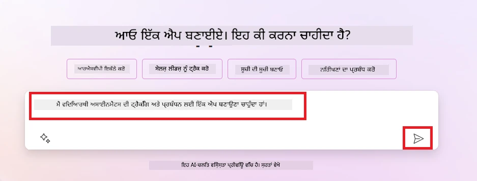

1. AI Copilot ਇੱਕ Dataverse ਟੇਬਲ ਸੁਝਾਅ ਦੇਵੇਗਾ ਜਿਸ ਵਿੱਚ ਉਹ ਫੀਲਡ ਸ਼ਾਮਲ ਹੋਣਗੇ ਜਿੰਨ੍ਹਾਂ ਵਿੱਚ ਤੁਸੀਂ ਟਰੈਕ ਕਰਨਾ ਚਾਹੁੰਦੇ ਹੋ ਅਤੇ ਕੁਝ ਨਮੂਨਾ ਡਾਟਾ ਵੀ। ਤੁਸੀਂ ਗੱਲਬਾਤੀ ਕਦਮਾਂ ਰਾਹੀਂ AI Copilot ਸਹਾਇਕ ਫੀਚਰ ਦੀ ਵਰਤੋਂ ਕਰਕੇ ਆਪਣੀਆਂ ਜ਼ਰੂਰਤਾਂ ਅਨੁਸਾਰ ਟੇਬਲ ਨੂੰ ਕਸਟਮਾਈਜ਼ ਕਰ ਸਕਦੇ ਹੋ।

   > **ਮਹੱਤਵਪੂਰਣ**: Dataverse Power Platform ਦਾ ਅਧਾਰਭੂਤ ਡਾਟਾ ਪਲੇਟਫਾਰਮ ਹੈ। ਇਹ ਐਪ ਦਾ ਡਾਟਾ ਸਟੋਰ ਕਰਨ ਲਈ ਘੱਟ-ਕੋਡ ਡਾਟਾ ਪਲੇਟਫਾਰਮ ਹੈ। ਇਹ ਇੱਕ ਪੂਰੀ ਤਰ੍ਹਾਂ ਪ੍ਰਬੰਧਿਤ ਸੇਵਾ ਹੈ ਜੋ Microsoft Cloud ਵਿੱਚ ਡਾਟਾ ਸੁਰੱਖਿਅਤ ਰੱਖਦੀ ਹੈ ਅਤੇ ਤੁਹਾਡੇ Power Platform ਵਾਤਾਵਰਨ ਵਿੱਚ ਪ੍ਰਦਾਨ ਕੀਤੀ ਜਾਂਦੀ ਹੈ। ਇਹ ਬਿਲਟ-ਇਨ ਡਾਟਾ ਗਵਰਨੈਂਸ ਯੋਗਤਾਵਾਂ ਨਾਲ ਆਉਂਦੀ ਹੈ ਜਿਵੇਂ ਡਾਟਾ ਵਰਗੀਕਰਨ, ਡਾਟਾ ਲੀਨੀਏਜ, ਨਿਯਮਿਤ ਪਹੁੰਚ ਕੰਟਰੋਲ ਆਦਿ। ਤੁਸੀਂ Dataverse ਬਾਰੇ ਹੋਰ ਜਾਣਕਾਰੀ ਇੱਥੇ ਲੈ ਸਕਦੇ ਹੋ [ਇੱਥੇ](https://learn.microsoft.com/power-apps/maker/data-platform/data-platform-intro?WT.mc_id=academic-109639-somelezediko)।

   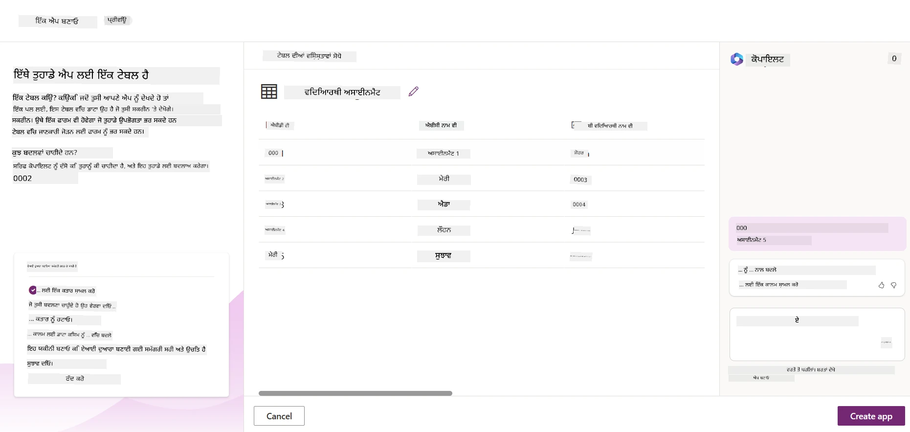

1. ਸਿੱਖਿਆਦਾਤਾ ਉਹ ਵਿਦਿਆਰਥੀਆਂ ਨੂੰ ਈਮੇਲ ਭੇਜਣਾ ਚਾਹੁੰਦੇ ਹਨ ਜਿਨ੍ਹਾਂ ਨੇ ਆਪਣੀ ਅਸਾਈਨਮੈਂਟ ਜਮ੍ਹਾਂ ਕਰਵਾਈ ਹੈ ਤਾਂ ਜੋ ਉਹਨਾਂ ਨੂੰ ਅਸਾਈਨਮੈਂਟ ਦੀ ਪ੍ਰਗਟੀ ਬਾਰੇ ਜਾਣਕਾਰੀ ਮਿਲਦੀ ਰਹੇ। ਤੁਸੀਂ Copilot ਦੀ ਵਰਤੋਂ ਕਰਕੇ ਟੇਬਲ ਵਿੱਚ ਨਵਾਂ ਫੀਲਡ ਜੋੜ ਸਕਦੇ ਹੋ ਜਿਸ ਵਿੱਚ ਵਿਦਿਆਰਥੀ ਦੀ ਈਮੇਲ ਸੁਰੱਖਿਅਤ ਹੋਵੇ। ਉਦਾਹਰਣ ਲਈ, ਤੁਸੀਂ ਹੇਠ ਲਿਖਿਆ ਪ੍ਰੌਮਪਟ ਵਰਤ ਸਕਦੇ ਹੋ: **_ਮੈਂ ਵਿਦਿਆਰਥੀ ਈਮੇਲ ਸਟੋਰ ਕਰਨ ਲਈ ਇੱਕ ਕਾਲਮ ਸ਼ਾਮਲ ਕਰਨਾ ਚਾਹੁੰਦਾ ਹਾਂ_**। AI Copilot ਨੂੰ ਪ੍ਰੌਮਪਟ ਭੇਜਣ ਲਈ **Send** ਬਟਨ 'ਤੇ ਕਲਿੱਕ ਕਰੋ।

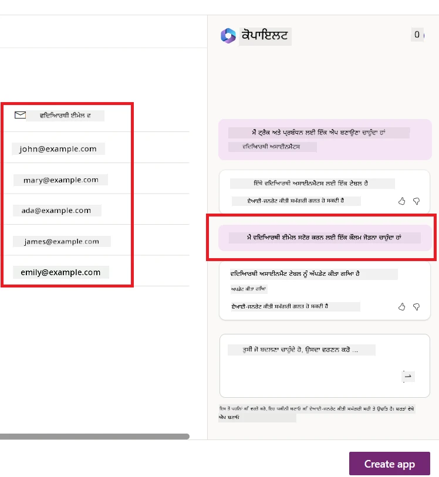

1. AI Copilot ਇੱਕ ਨਵਾਂ ਫੀਲਡ ਤਿਆਰ ਕਰੇਗਾ ਅਤੇ ਤੁਸੀਂ ਉਸ ਫੀਲਡ ਨੂੰ ਆਪਣੀਆਂ ਲੋੜਾਂ ਮੁਤਾਬਕ ਸੋਧ ਸਕਦੇ ਹੋ।

1. ਜਦੋਂ ਤੁਸੀਂ ਟੇਬਲ ਨਾਲ ਕੰਮ ਕਰਨਾ ਮੁਕੰਮਲ ਕਰ ਲਵੋ, ਤਾਂ ਐਪ ਬਣਾਉਣ ਲਈ **Create app** ਬਟਨ ਤੇ ਕਲਿੱਕ ਕਰੋ।

1. AI Copilot ਤੁਹਾਡੇ ਵੇਰਵੇ ਦੇ ਆਧਾਰ 'ਤੇ ਇੱਕ ਜਵਾਬਦੇਹ ਕੈਨਵਾਸ ਐਪ ਤਿਆਰ ਕਰੇਗਾ। ਫਿਰ ਤੁਸੀਂ ਆਪਣੀਆਂ ਜਰੂਰਤਾਂ ਮੁਤਾਬਕ ਐਪ ਨੂੰ ਕਸਟਮਾਈਜ਼ ਕਰ ਸਕਦੇ ਹੋ।

1. ਸਿੱਖਿਆਦਾਤਾ ਵਿਦਿਆਰਥੀਆਂ ਨੂੰ ਈਮੇਲ ਭੇਜਣ ਲਈ, ਤੁਸੀਂ Copilot ਦੀ ਵਰਤੋਂ ਕਰਕੇ ਐਪ ਵਿੱਚ ਨਵਾਂ ਸਕ੍ਰੀਨ ਜੋੜ ਸਕਦੇ ਹੋ। ਉਦਾਹਰਨ ਵਜੋਂ, ਤੁਸੀਂ ਐਪ ਵਿੱਚ ਨਵਾਂ ਸਕ੍ਰੀਨ ਜੋੜਨ ਲਈ ਹੇਠਾਂ ਦਿੱਤੇ ਪ੍ਰੌਂਪਟ ਦੀ ਵਰਤੋਂ ਕਰ ਸਕਦੇ ਹੋ: **_ਮੈਂ ਵਿਦਿਆਰਥੀਆਂ ਨੂੰ ਈਮੇਲ ਭੇਜਣ ਲਈ ਇੱਕ ਸਕ੍ਰੀਨ ਜੋੜਨਾ ਚਾਹੁੰਦਾ ਹਾਂ_**। AI Copilot ਨੂੰ ਪ੍ਰੌਂਪਟ ਭੇਜਣ ਲਈ **Send** ਬਟਨ ਤੇ ਕਲਿੱਕ ਕਰੋ।

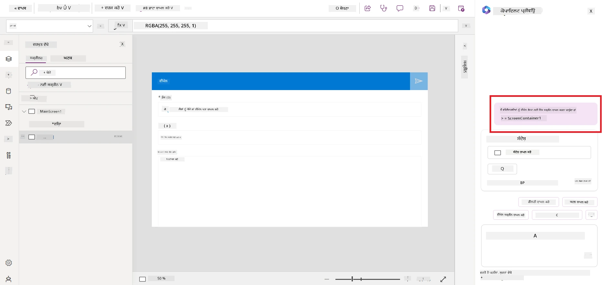

1. AI Copilot ਇੱਕ ਨਵਾਂ ਸਕ੍ਰੀਨ ਬਣਾਏਗਾ ਅਤੇ ਫਿਰ ਤੁਸੀਂ ਆਪਣੀਆਂ ਜਰੂਰਤਾਂ ਮੁਤਾਬਕ ਇਸਨੂੰ ਕਸਟਮਾਈਜ਼ ਕਰ ਸਕਦੇ ਹੋ।

1. ਜਦੋਂ ਤੁਸੀਂ ਐਪ ਨਾਲ ਕੰਮ ਮੁਕੰਮਲ ਕਰ ਲਵੋ, ਤਾਂ ਐਪ ਸੰਭਾਲਣ ਲਈ **Save** ਬਟਨ ਤੇ ਕਲਿੱਕ ਕਰੋ।

1. ਸਿੱਖਿਆਦਾਤਿਆਂ ਨਾਲ ਐਪ ਦਾ ਸਾਂਝਾ ਕਰਨ ਲਈ, **Share** ਬਟਨ ਤੇ ਕਲਿੱਕ ਕਰੋ ਅਤੇ ਫਿਰ ਦੁਬਾਰਾ **Share** ਬਟਨ ਤੇ ਕਲਿੱਕ ਕਰੋ। ਤੁਸੀਂ ਵਿਦਿਆਰਥੀਆਂ ਦੇ ਈਮੇਲ ਪਤੇ ਦਰਜ ਕਰਕੇ ਐਪ ਸਾਂਝਾ ਕਰ ਸਕਦੇ ਹੋ।

> **ਤੁਹਾਡਾ ਘਰ ਦਾ ਕੰਮ**: ਤੁਸੀਂ ਹੁਣੇ ਜੋ ਐਪ ਬਣਾਇਆ ਹੈ ਉਹ ਵਧੀਆ ਸ਼ੁਰੂਆਤ ਹੈ ਪਰ ਇਸਨੂੰ ਸੁਧਾਰਿਆ ਜਾ ਸਕਦਾ ਹੈ। ਈਮੇਲ ਫੀਚਰ ਨਾਲ, ਸਿੱਖਿਆਦਾਤਾ ਵਿਦਿਆਰਥੀਆਂ ਨੂੰ ਹੱਥੋਂ ਈਮੇਲ ਭੇਜ ਸਕਦੇ ਹਨ ਕਿਉਂਕਿ ਉਹਨਾਂ ਨੂੰ ਆਪਣੀਆਂ ਈਮੇਲਾਂ ਟਾਈਪ ਕਰਣੀਆਂ ਪੈਂਦੀਆਂ ਹਨ। ਕੀ ਤੁਸੀਂ Copilot ਦੀ ਵਰਤੋਂ ਕਰਕੇ ਐਕ ਐਸਾ ਆਟੋਮੇਸ਼ਨ ਬਣਾ ਸਕਦੇ ਹੋ ਜੋ ਸਿੱਖਿਆਦਾਤਿਆਂ ਨੂੰ ਵਿਦਿਆਰਥੀਆਂ ਨੂੰ ਆਪਣੇ ਅਸਾਈਨਮੈਂਟ ਜਮ੍ਹਾਂ ਕਰਨ ‘ਤੇ ਆਪਣੇ ਆਪ ਈਮੇਲ ਭੇਜਣ ਦੇ ਯੋਗ ਬਣਾ ਦੇਵੇ? ਤੁਹਾਡਾ ਇਸ਼ਾਰਾ ਹੈ ਕਿ ਠੀਕ ਪ੍ਰੌਂਪਟ ਨਾਲ ਤੁਸੀਂ Copilot ਨੂੰ ਪਾਵਰ ਆਟੋਮੇਟ ਵਿੱਚ ਇਸ ਲਈ ਵਰਤ ਸਕਦੇ ਹੋ।

### ਸਾਡੀ ਸਟਾਰਟਅਪ ਲਈ ਇੱਕ ਇਨਵੌਇਸ ਜਾਣਕਾਰੀ ਵਾਲੀ ਟੇਬਲ ਬਣਾਓ

ਸਾਡੀ ਸਟਾਰਟਅਪ ਦੀ ਫਾਈਨੈਂਸ ਟੀਮ ਇਨਵੌਇਸਜ਼ ਨੂੰ ਟਰੈਕ ਕਰਨ ਵਿੱਚ ਮੁਸ਼ਕਿਲ ਦਾ ਸਾਹਮਣਾ ਕਰ ਰਹੀ ਹੈ। ਉਹ ਇਨਵੌਇਸਜ਼ ਨੂੰ ਟਰੈਕ ਕਰਨ ਲਈ ਇੱਕ ਸਪ੍ਰੈਡਸ਼ੀਟ ਦੀ ਵਰਤੋਂ ਕਰ ਰਹੇ ਸਨ ਪਰ ਇਨਵੌਇਸਜ਼ ਦੀ ਗਿਣਤੀ ਵੱਧਣ ਨਾਲ ਇਹ ਮੁਸ਼ਕਿਲ ਹੋ ਗਿਆ ਹੈ। ਉਹਨਾਂ ਨੇ ਤੁਹਾਨੂੰ ਸਹਾਇਤਾ ਲਈ ਬੇਨਤੀ ਕੀਤੀ ਹੈ ਕਿ ਤੁਸੀਂ ਇੱਕ ਟੇਬਲ ਬਣਾਓ ਜੋ ਉਨ੍ਹਾਂ ਨੂੰ ਪ੍ਰਾਪਤ ਕੀਤੀਆਂ ਇਨਵੌਇਸਾਂ ਦੀ ਜਾਣਕਾਰੀ ਸੰਭਾਲਣ, ਟਰੈਕ ਕਰਨ ਅਤੇ ਪ੍ਰਬੰਧ ਕਰਨ ਵਿੱਚ ਮਦਦ ਕਰੇ। ਇਸ ਟੇਬਲ ਤੋਂ ਇੱਕ ਆਟੋਮੇਸ਼ਨ ਬਣਾਉਣ ਦੀ ਯੋਜਨਾ ਬਣਾਉ ਜਿਸ ਨਾਲ ਸਾਰੀ ਇਨਵੌਇਸ ਜਾਣਕਾਰੀ ਨਿਕਾਲ ਕੇ ਟੇਬਲ ਵਿੱਚ ਸਟੋਰ ਕੀਤੀ ਜਾ ਸਕੇ। ਟੇਬਲ ਫਾਈਨੈਂਸ ਟੀਮ ਨੂੰ ਇਹ ਵੀ ਦੇਖਣ ਦੇ ਯੋਗ ਹੋਣਾ ਚਾਹੀਦਾ ਹੈ ਕਿ ਕਿਹੜੀਆਂ ਇਨਵੌਇਸਾਂ ਦਾ ਭੁਗਤਾਨ ਹੋ ਚੁੱਕਾ ਹੈ ਅਤੇ ਕਿਹੜੀਆਂ ਨਹੀਂ।

ਪਾਵਰ ਪਲੇਟਫਾਰਮ ਦੇ ਨਾਲ ਇੱਕ ਅਧਾਰਭੂਤ ਡੇਟਾ ਪਲੇਟਫਾਰਮ ਹੈ ਜਿਸਦਾ ਨਾਮ ਡੇਟਾਵਰਸ ਹੈ ਜੋ ਤੁਹਾਡੇ ਐਪਸ ਅਤੇ ਹੱਲਾਂ ਲਈ ਡੇਟਾ ਸਟੋਰ ਕਰਨ ਦੇ ਯੋਗ ਬਣਾਉਂਦਾ ਹੈ। ਡੇਟਾਵਰਸ ਲੋ-ਕੋਡ ਡੇਟਾ ਪਲੇਟਫਾਰਮ ਪਰਦਾਨ ਕਰਦਾ ਹੈ ਜੋ ਮਾਈਕਰੋਸਾਫਟ ਕਲਾਉਡ ਵਿੱਚ ਸੁਰੱਖਿਅਤ ਡੇਟਾ ਸਟੋਰ ਕਰਦਾ ਹੈ ਅਤੇ ਤੁਹਾਡੇ ਪਾਵਰ ਪਲੇਟਫਾਰਮ ਵਾਤਾਵਰਣ ਵਿੱਚ ਪ੍ਰੋਵੀਜਨ ਕੀਤਾ ਗਿਆ ਹੁੰਦਾ ਹੈ। ਇਸ ਵਿੱਚ ਡੇਟਾ ਵਰਗੀ ਸੀਕ੍ਯੂਰਿਟੀ, ਡੇਟਾ ਕਲਾਸੀਫਿਕੇਸ਼ਨ, ਡੇਟਾ ਲੀਆਜੇਨ, ਫਾਈਨ-ਗ੍ਰੇਨਡ ਐਕਸੈੱਸ ਕੰਟਰੋਲ ਵਰਗੀਆਂ ਡੇਟਾ ਗਵਰਨੈਂਸ ਖੂਬੀਆਂ ਹੁੰਦੀਆਂ ਹਨ। ਤੁਹਾਨੂੰ ਡੇਟਾਵਰਸ ਬਾਰੇ ਵਧੇਰੇ ਪਤਾ ਕਰਨ ਲਈ [ਇੱਥੇ](https://learn.microsoft.com/power-apps/maker/data-platform/data-platform-intro?WT.mc_id=academic-109639-somelezediko) ਜਾਣਾ ਚਾਹੀਦਾ ਹੈ।

ਸਾਡੀ ਸਟਾਰਟਅਪ ਲਈ ਡੇਟਾਵਰਸ ਕਿਉਂ ਵਰਤਣਾ ਚਾਹੀਦਾ ਹੈ? ਡੇਟਾਵਰਸ ਵਿੱਚ ਮਿਆਰੀ ਅਤੇ ਕਸਟਮ ਟੇਬਲ ਤੁਹਾਡੇ ਡੇਟਾ ਲਈ ਸੁਰੱਖਿਅਤ ਅਤੇ ਕਲਾਉਡ-ਅਧਾਰਿਤ ਸਟੋਰੇਜ ਵਿਕਲਪ ਪ੍ਰਦਾਨ ਕਰਦੀਆਂ ਹਨ। ਟੇਬਲ ਤੁਹਾਨੂੰ ਵੱਖ-ਵੱਖ ਕਿਸਮਾਂ ਦੇ ਡੇਟਾ ਨੂੰ ਸਟੋਰ ਕਰਨ ਦੀ ਆਗਿਆ ਦਿੰਦੀਆਂ ਹਨ, ਜਿਵੇਂ ਕਿ ਤੁਸੀਂ ਇੱਕ ਐਕਸੈਲ ਵਰਕਬੁੱਕ ਵਿੱਚ ਕਈ ਵਰਕਸ਼ੀਟਾਂ ਦੀ ਵਰਤੋਂ ਕਰਦੇ ਹੋ। ਤੁਸੀਂ ਇਹ ਟੇਬਲ ਆਪਣੇ ਸੰਸਥਾ ਜਾਂ ਕਾਰੋਬਾਰ ਦੀਆਂ ਜਰੂਰਤਾਂ ਲਈ ਦੀ ਡੇਟਾ ਸਟੋਰ ਕਰਨ ਲਈ ਵਰਤ ਸਕਦੇ ਹੋ। ਸਾਡੀ ਸਟਾਰਟਅਪ ਨੂੰ ਡੇਟਾਵਰਸ ਤੋਂ ਮਿਲਣ ਵਾਲੇ ਕੁਝ ਫਾਇਦੇ ਹਨ:

- **ਸੰਭਾਲਣ ਵਿੱਚ ਆਸਾਨ**: ਮੈਟਾ ਡੇਟਾ ਅਤੇ ਡੇਟਾ ਦੋਹਾਂ ਕਲਾਉਡ ਵਿੱਚ ਸਟੋਰ ਕੀਤੇ ਜਾਂਦੇ ਹਨ, ਇਸ ਲਈ ਤੁਹਾਨੂੰ ਇਹ ਨਹੀਂ ਚਿੰਤਾ ਕਰਨੀ ਪੈਂਦੀ ਕਿ ਉਹ ਕਿਵੇਂ ਸਟੋਰ ਜਾਂ ਸੰਭਾਲੇ ਜਾਂਦੇ ਹਨ। ਤੁਸੀਂ ਆਪਣੀਆਂ ਐਪਸ ਅਤੇ ਹੱਲਾਂ ਬਣਾਉਣ 'ਤੇ ਧਿਆਨ ਕੇਂਦ੍ਰਿਤ ਕਰ ਸਕਦੇ ਹੋ। 

- **ਸੁਰੱਖਿਅਤ**: ਡੇਟਾਵਰਸ ਤੁਹਾਡੇ ਡੇਟਾ ਲਈ ਇੱਕ ਸੁਰੱਖਿਅਤ ਅਤੇ ਕਲਾਉਡ-ਅਧਾਰਿਤ ਸਟੋਰੇਜ ਵਿਕਲਪ ਦਿੰਦਾ ਹੈ। ਤੁਸੀਂ ਇਹ ਨਿਰਣਯ ਕਰ ਸਕਦੇ ਹੋ ਕਿ ਕੌਣ ਤੁਹਾਡੇ ਟੇਬਲਾਂ ਦੇ ਡੇਟਾ ਤੱਕ ਪਹੁੰਚ ਰੱਖਦਾ ਹੈ ਅਤੇ ਉਹ ਕਿਸ ਤਰ੍ਹਾਂ ਐਕਸੈੱਸ ਕਰ ਸਕਦੇ ਹਨ ਰੋਲ-ਅਧਾਰਿਤ ਸੁਰੱਖਿਆ ਦੀ ਵਰਤੋਂ ਨਾਲ।

- **ਵਿਸਥਾਰਿਕ ਮੈਟਾ ਡੇਟਾ**: ਡੇਟਾ ਦੀਆਂ ਕਿਸਮਾਂ ਅਤੇ ਰਿਸ਼ਤਿਆਂ ਨੂੰ ਸਿੱਧਾ ਪਾਵਰ ਐਪਸ ਵਿੱਚ ਵਰਤਿਆ ਜਾਂਦਾ ਹੈ।

- **ਤਰਕ ਅਤੇ ਪ੍ਰਮਾਣੀਕਰਨ**: ਤੁਸੀਂ ਬਿਜਨੈਸ ਨਿਯਮ, ਕੈਲਕੁਲੇਟ ਕੀਤੇ ਖੇਤਰ ਅਤੇ ਪ੍ਰਮਾਣੀਕਰਨ ਨਿਯਮਾਂ ਦੀ ਵਰਤੋਂ ਕਰਕੇ ਬਿਜਨੈਸ ਤਰਕ ਲਾਗੂ ਕਰ ਸਕਦੇ ਹੋ ਅਤੇ ਡੇਟਾ ਦੀ ਸਹੀਤਾ ਬਣਾਈ ਰੱਖ ਸਕਦੇ ਹੋ।

ਹੁਣ ਜਦ ਤੁਹਾਨੂੰ ਡੇਟਾਵਰਸ ਦੀ ਜਾਣਕਾਰੀ ਮਿਲ ਗਈ ਹੈ ਅਤੇ ਤੁਸੀਂ ਇਸ ਦਿ ਵਰਤੋਂ ਕਰਨੀ ਚਾਹੁੰਦੇ ਹੋ, ਆਓ ਵੇਖੀਏ ਕਿ ਤੁਸੀਂ ਆਪਣੇ ਫਾਈਨੈਂਸ ਟੀਮ ਦੀਆਂ ਜਰੂਰਤਾਂ ਨੂੰ ਪੂਰਾ ਕਰਨ ਲਈ Copilot ਦਾ ਵਰਤੋਂ ਕਰਕੇ ਡੇਟਾਵਰਸ ਵਿੱਚ ਕਿਵੇਂ ਟੇਬਲ ਹੁੰਦੀ ਹੈ।

> **ਨੋਟ**: ਤੁਸੀਂ ਆਗਲੇ ਹਿੱਸੇ ਵਿੱਚ ਇਸ ਟੇਬਲ ਦੀ ਵਰਤੋਂ ਇੱਕ ਆਟੋਮੇਸ਼ਨ ਬਣਾਉਣ ਲਈ ਕਰੋਂਗੇ ਜੋ ਸਾਰੀ ਇਨਵੌਇਸ ਜਾਣਕਾਰੀ ਨਿਕਾਲ ਕੇ ਇਸ ਟੇਬਲ ਵਿੱਚ ਸਟੋਰ ਕਰੇਗਾ।

ਡੇਟਾਵਰਸ ਵਿੱਚ Copilot ਦੀ ਵਰਤੋਂ ਕਰਕੇ ਟੇਬਲ ਬਣਾਉਣ ਲਈ ਹੇਠਾਂ ਦਿੱਤੇ ਕਦਮਾਂ ਦੀ ਪਾਲਣਾ ਕਰੋ:

1. [Power Apps](https://make.powerapps.com?WT.mc_id=academic-105485-koreyst) ਦੇ ਘਰਲੂ ਸਕ੍ਰੀਨ 'ਤੇ ਜਾਓ।

2. ਖੱਬੇ ਨੈਵੀਗੇਸ਼ਨ ਬਾਰ ਵਿੱਚ **Tables** ਚੁਣੋ ਅਤੇ ਫਿਰ **Describe the new Table** ਤੇ ਕਲਿੱਕ ਕਰੋ।

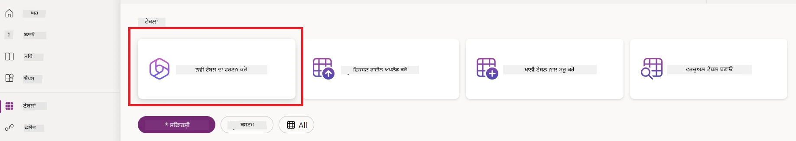

1. **Describe the new Table** ਸکرੀਨ ਤੇ, ਟੇਬਲ ਬਾਰੇ ਵਰਣਨ ਲਈ ਲਿਖੋ ਜੋ ਤੁਸੀਂ ਬਣਾਉਣਾ ਚਾਹੁੰਦੇ ਹੋ। ਉਦਾਹਰਨ ਵਜੋਂ, **_ਮੈਂ ਇਨਵੌਇਸ ਜਾਣਕਾਰੀ ਸਟੋਰ ਕਰਨ ਲਈ ਟੇਬਲ ਬਣਾਉਣਾ ਚਾਹੁੰਦਾ ਹਾਂ_**। ਐਆਈ Copilot ਨੂੰ ਪ੍ਰੌਂਪਟ ਭੇਜਣ ਲਈ **Send** ਬਟਨ ਤੇ ਕਲਿੱਕ ਕਰੋ।

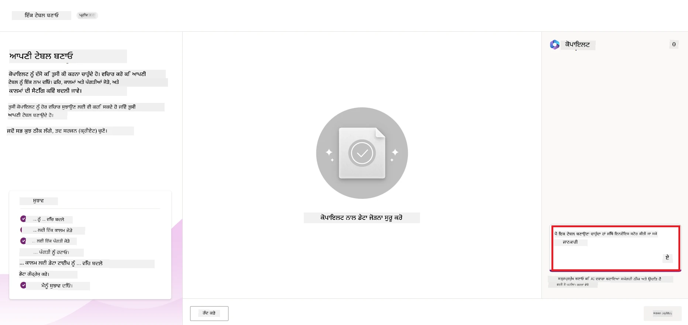

1. AI Copilot ਤੁਹਾਡੇ ਲਈ ਇੱਕ ਡੇਟਾਵਰਸ ਟੇਬਲ ਅਤੇ ਲੋੜੀਂਦੇ ਖੇਤਰਾਂ ਦੇ ਨਾਲ ਕੁਝ ਨਮੂਨਾ ਡੇਟਾ ਸੁਝਾਏਗਾ। ਤੁਸੀਂ ਫਿਰ ਗੱਲਬਾਤੀ ਕਦਮਾਂ ਰਾਹੀਂ AI Copilot ਸਹਾਇਕ ਫੀਚਰ ਦੀ ਵਰਤੋਂ ਕਰਕੇ ਟੇਬਲ ਨੂੰ ਆਪਣੀਆਂ ਜਰੂਰਤਾਂ ਮੁਤਾਬਕ ਬਦਲ ਸਕਦੇ ਹੋ।

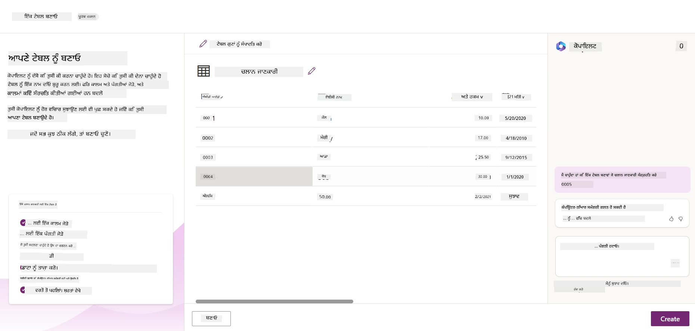

1. ਫਾਈਨੈਂਸ ਟੀਮ ਸਪਲਾਇਰ ਨੂੰ ਈਮੇਲ ਭੇਜ ਕੇ ਆਪਣੇ ਇਨਵੌਇਸ ਦੀ ਮੌਜੂਦਾ ਸਥਿਤੀ ਦੀ ਜਾਣਕਾਰੀ ਦੇਣਾ ਚਾਹੁੰਦੀ ਹੈ। ਤੁਸੀਂ Copilot ਦੀ ਵਰਤੋਂ ਕਰ ਸਕਦੇ ਹੋ ਟੇਬਲ ਵਿੱਚ ਸਪਲਾਇਰ ਈਮੇਲ ਸਟੋਰ ਕਰਨ ਲਈ ਨਵਾਂ ਖੇਤਰ ਜੋੜਨ ਲਈ। ਉਦਾਹਰਨ ਵਜੋਂ, ਹੇਠਾਂ ਦਿੱਤਾ ਪ੍ਰੌਂਪਟ ਵਰਤੋ: **_ਮੈਂ ਸਪਲਾਇਰ ਈਮੇਲ ਸਟੋਰ ਕਰਨ ਲਈ ਕਾਲਮ ਜੋੜਨਾ ਚਾਹੁੰਦਾ ਹਾਂ_**। AI Copilot ਨੂੰ ਪ੍ਰੌਂਪਟ ਭੇਜਣ ਲਈ **Send** ਬਟਨ ਤੇ ਕਲਿੱਕ ਕਰੋ।

1. AI Copilot ਇੱਕ ਨਵਾਂ ਖੇਤਰ ਬਣਾਏਗਾ ਅਤੇ ਤੁਸੀਂ ਫਿਰ ਆਪਣੀਆਂ ਜਰੂਰਤਾਂ ਮੁਤਾਬਕ ਇਸਨੂੰ ਕਸਟਮਾਈਜ਼ ਕਰ ਸਕਦੇ ਹੋ।

1. ਜਦੋਂ ਤੁਸੀਂ ਟੇਬਲ ਨਾਲ ਕੰਮ ਮੁਕੰਮਲ ਕਰ ਲਵੋ, ਤਾਂ ਟੇਬਲ ਬਣਾਉਣ ਲਈ **Create** ਬਟਨ ਤੇ ਕਲਿੱਕ ਕਰੋ।

## Power Platform ਵਿੱਚ AI ਬਿਲਡਰ ਨਾਲ AI ਮਾਡਲ

AI ਬਿਲਡਰ ਪਾਵਰ ਪਲੇਟਫਾਰਮ ਵਿੱਚ ਮੌਜੂਦ ਇੱਕ ਲੋ-ਕੋਡ AI ਸਮਰੱਥਾ ਹੈ ਜੋ ਤੁਹਾਨੂੰ ਪ੍ਰਕਿਰਿਆਵਾਂ ਆਟੋਮੇਟ ਕਰਨ ਅਤੇ ਨਤੀਜੇ ਪੇਸ਼ ਕਰਨ ਲਈ AI ਮਾਡਲ ਦੀ ਵਰਤੋਂ ਕਰਨ ਦੀ ਆਗਿਆ ਦਿੰਦੀ ਹੈ। AI ਬਿਲਡਰ ਦੇ ਨਾਲ ਤੁਸੀਂ Dataverse ਜਾਂ ਕਿਸੇ ਵੱਖਰੇ ਕਲਾਉਡ ਡੇਟਾ ਸਰੋਤਾਂ ਜਿਵੇਂ SharePoint, OneDrive ਜਾਂ Azure ਵਿੱਚ ਡੇਟਾ ਨਾਲ ਜੁੜੇ ਆਪਣੇ ਐਪਸ ਅਤੇ ਫਲੋਜ਼ ਵਿੱਚ AI ਲਿਆ ਸਕਦੇ ਹੋ।

## ਤਿਆਰ ਸ਼ੁਦਾ AI ਮਾਡਲ ਅਤੇ ਕਸਟਮ AI ਮਾਡਲ

AI ਬਿਲਡਰ ਦੋ ਕਿਸਮ ਦੇ AI ਮਾਡਲ ਪ੍ਰਦਾਨ ਕਰਦਾ ਹੈ: ਤਿਆਰ ਸ਼ੁਦਾ AI ਮਾਡਲ ਅਤੇ ਕਸਟਮ AI ਮਾਡਲ। ਤਿਆਰ ਸ਼ੁਦਾ AI ਮਾਡਲ ਮਾਇਕਰੋਸਾਫਟ ਵੱਲੋਂ ਤਿਆਰ ਕੀਤੇ ਗਏ ਰੈਡੀ-ਟੂ-ਯੂਜ਼ ਮਾਡਲ ਹਨ ਜੋ ਪਾਵਰ ਪਲੇਟਫਾਰਮ ਵਿੱਚ ਉਪਲਬਧ ਹਨ। ਇਹ ਤੁਹਾਡੇ ਐਪਸ ਅਤੇ ਫਲੋਜ਼ ਵਿੱਚ ਆਟੋਮੇਸ਼ਨ ਅਤੇ ਨਤੀਜਿਆਂ ਦੀ ਭਵਿੱਖਬਾਣੀ ਕਰਨ ਲਈ ਵਰਤੇ ਜਾਂਦੇ ਹਨ ਬਿਨਾ ਇਹ ਜਾਣਣ ਦੇ ਕਿ ਡੇਟਾ ਇਕੱਠਾ ਕਰਨਾ, ਮਾਡਲ ਬਣਾਉਣਾ, ਤਰਬੀਅਤ ਦੇਣਾ ਅਤੇ ਪ੍ਰਕਾਸ਼ਿਤ ਕਰਨਾ ਪਵੇ। ਤੁਸੀਂ ਇਹ ਮਾਡਲ ਪ੍ਰਭਾਵੀ ਪ੍ਰਕਿਰਿਆਵਾਂ ਆਟੋਮੇਟ ਕਰਨ ਲਈ ਵਰਤ ਸਕਦੇ ਹੋ।

ਪਾਵਰ ਪਲੇਟਫਾਰਮ ਵਿੱਚ ਉਪਲਬਧ ਕੁਝ ਤਿਆਰ ਸ਼ੁਦਾ AI ਮਾਡਲ ਸਨਮਿਲਿਤ ਹਨ:

- **ਮੁੱਖ ਮੁਹਾਵਰੇ ਕੱਢਣਾ**: ਇਹ ਮਾਡਲ ਲਿਖਤ ਵਿੱਚੋਂ ਮੁੱਖ ਮੁਹਾਵਰੇ ਕੱਢਦਾ ਹੈ।
- **ਭਾਸ਼ਾ ਪਛਾਣ**: ਇਹ ਮਾਡਲ ਕਿਸੇ ਲਿਖਤੀ ਭਾਸ਼ਾ ਦੀ ਪਛਾਣ ਕਰਦਾ ਹੈ।
- **ਭਾਵਨਾ ਵਿਸ਼ਲੇਸ਼ਣ**: ਇਹ ਮਾਡਲ ਲਿਖਤ ਵਿੱਚ ਸਕਾਰਾਤਮਕ, ਨਕਾਰਾਤਮਕ, ਤਟਸਥ ਜਾਂ ਮਿਸ਼ਰਤ ਭਾਵਨਾ ਪਛਾਣਦਾ ਹੈ।
- **ਕਾਰੋਬਾਰੀ ਕਾਰਡ ਪੜ੍ਹਨ ਵਾਲਾ**: ਇਹ ਮਾਡਲ ਕਾਰੋਬਾਰੀ ਕਾਰਡਾਂ ਤੋਂ ਜਾਣਕਾਰੀ ਕੱਢਦਾ ਹੈ।
- **ਲਿਖਤ ਪਛਾਣ**: ਇਹ ਮਾਡਲ ਚਿੱਤਰਾਂ ਤੋਂ ਲਿਖਤ ਕੱਢਦਾ ਹੈ।
- **ਵਸਤੂ ਪਛਾਣ**: ਇਹ ਮਾਡਲ ਚਿੱਤਰਾਂ ਵਿੱਚੋਂ ਵਸਤੂਆਂ ਦੀ ਪਛਾਣ ਕਰਦਾ ਅਤੇ ਕੱਢਦਾ ਹੈ।
- **ਦਸਤਾਵੇਜ਼ ਪ੍ਰਕਿਰਿਆਵਾਂ**: ਇਹ ਮਾਡਲ ਫਾਰਮਾਂ ਤੋਂ ਜਾਣਕਾਰੀ ਕੱਢਦਾ ਹੈ।
- **ਇਨਵੌਇਸ ਪ੍ਰਕਿਰਿਆਵਾਂ**: ਇਹ ਮਾਡਲ ਇਨਵੌਇਸਾਂ ਤੋਂ ਜਾਣਕਾਰੀ ਕੱਢਦਾ ਹੈ।

ਕਸਟਮ AI ਮਾਡਲਾਂ ਨਾਲ ਤੁਸੀਂ ਆਪਣਾ ਖੁਦ ਦਾ ਮਾਡਲ AI ਬਿਲਡਰ ਵਿੱਚ ਲਿਆਉਂਦੇ ਹੋ ਤਾਂ ਜੋ ਇਹ AI ਬਿਲਡਰ ਦੇ ਕਿਸੇ ਵੀ ਕਸਟਮ ਮਾਡਲ ਵਾਂਗ ਵਰਤੀ ਜਾ ਸਕੇ। ਤੁਹਾਡਾ ਮਾਡਲ ਆਪਣੇ ਡੇਟਾ ਨਾਲ ਤਰਬੀਅਤ ਮਿਲ ਸਕਦਾ ਹੈ। ਤੁਸੀਂ ਇਹ ਮਾਡਲ ਪਾਵਰ ਐਪਸ ਅਤੇ ਪਾਵਰ ਆਟੋਮੇਟ ਵਿੱਚ ਦੋਹਾਂ ਵਿੱਚ ਉਪਯੋਗ ਕਰਕੇ ਪ੍ਰਕਿਰਿਆਵਾਂ ਆਟੋਮੇਟ ਕਰ ਸਕਦੇ ਹੋ। ਪਰ ਖੁਦ ਦਾ ਮਾਡਲ ਵਰਤਣ ਤੇ ਕੁਝ ਸੀਮਾਵਾਂ ਲਾਗੂ ਹੁੰਦੀਆਂ ਹਨ। ਇਹਨਾਂ [ਸੀਮਾਵਾਂ](https://learn.microsoft.com/ai-builder/byo-model#limitations?WT.mc_id=academic-105485-koreyst) ਬਾਰੇ ਹੋਰ ਪੜ੍ਹੋ।

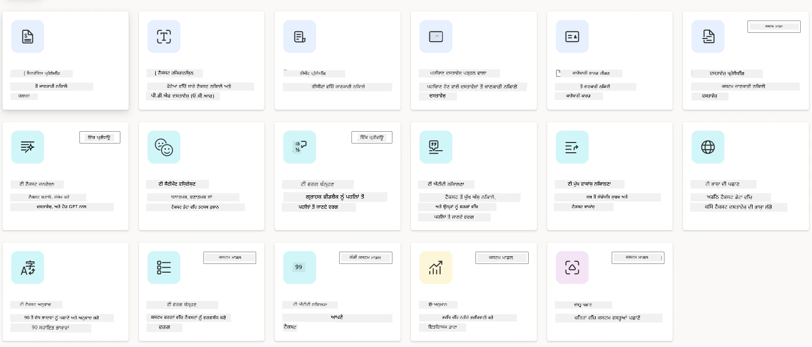

## ਅਸਾਈਨਮੈਂਟ #2 - ਸਾਡੀ ਸਟਾਰਟਅਪ ਲਈ ਇੱਕ ਇਨਵੌਇਸ ਪ੍ਰਕਿਰਿਆਵਾਂ ਵਾਲਾ ਫਲੋ ਬਣਾਓ

ਫਾਈਨੈਂਸ ਟੀਮ ਇਨਵੌਇਸਾਂ ਨੂੰ ਪ੍ਰਕਿਰਿਆਤ ਕਰਨ ਵਿੱਚ ਮੁਸ਼ਕਲਾਂ ਦਾ ਸਾਹਮਣਾ ਕਰ ਰਹੀ ਹੈ। ਉਹ ਇਨਵੌਇਸ ਟਰੈਕ ਕਰਨ ਲਈ ਸਪ੍ਰੈਡਸ਼ੀਟ ਦੀ ਵਰਤੋਂ ਕਰ ਰਹੇ ਹਨ ਪਰ ਇਨਵੌਇਸਾਂ ਦੀ ਗਿਣਤੀ ਵੱਧਣ ਨਾਲ ਇਹ ਖ਼ਤਮ ਕਰਨ ਦੀ ਸਮਰੱਥਾ ਘੱਟ ਹੋ ਗਈ ਹੈ। ਉਹ ਤੁਹਾਨੂੰ ਕਹਿਣਾ ਚਾਹੁੰਦੇ ਹਨ ਕਿ ਇਕ ਵਰਕਫਲੋ ਬਣਾ ਜੋ AI ਦੀ ਵਰਤੋਂ ਕਰਕੇ ਇਨਵੌਇਸ ਪ੍ਰਕਿਰਿਆ ਕਰ ਸਕੇ। ਇਹ ਵਰਕਫਲੋ ਇਨਵੌਇਸਾਂ ਤੋਂ ਜਾਣਕਾਰੀ ਨਿਕਾਲ ਕੇ ਡੇਟਾਵਰਸ ਟੇਬਲ ਵਿੱਚ ਸਟੋਰ ਕਰਨ ਯੋਗ ਹੋਣਾ ਚਾਹੀਦਾ ਹੈ। ਇਹ ਵਰਕਫਲੋ ਫਾਈਨੈਂਸ ਟੀਮ ਨੂੰ ਨਿਕਾਲੀ ਹੋਈ ਜਾਣਕਾਰੀ ਨਾਲ ਈਮੇਲ ਭੇਜਣ ਦਾ ਵੀ ਯੋਗ ਬਣਾਉਣਾ ਚਾਹੀਦਾ ਹੈ।

ਹੁਣ ਜਦ ਤੁਹਾਨੂੰ ਪਤਾ ਲੱਗ ਗਿਆ ਹੈ ਕਿ AI ਬਿਲਡਰ ਕੀ ਹੈ ਅਤੇ ਇਸਦੀ ਵਰਤੋਂ ਕਿਉਂ ਕਰਨੀ ਚਾਹੀਦੀ ਹੈ, ਆਓ ਵੇਖੀਏ ਕਿ ਤੁਸੀਂ ਇਨਵੌਇਸ ਪ੍ਰਕਿਰਿਆ AI ਮਾਡਲ ਦੀ ਵਰਤੋਂ ਕਰਕੇ ਵਰਕਫਲੋ ਕਿਵੇਂ ਤਿਆਰ ਕਰ ਸਕਦੇ ਹੋ, ਜਿਸ ਬਾਰੇ ਅਸੀਂ ਪਹਿਲਾਂ ਹੀ ਗੱਲ ਕੀਤੀ ਸੀ।

ਇਨਵੌਇਸ ਪ੍ਰਕਿਰਿਆ AI ਮਾਡਲ ਦੀ ਵਰਤੋਂ ਕਰਕੇ ਫਾਈਨੈਂਸ ਟੀਮ ਨੂੰ ਮਦਦ ਕਰਨ ਵਾਲਾ ਵਰਕਫਲੋ ਬਣਾਉਣ ਲਈ ਹੇਠਾਂ ਦਿੱਤੇ ਕਦਮਾਂ ਦੀ ਪਾਲਣਾ ਕਰੋ:

1. [Power Automate](https://make.powerautomate.com?WT.mc_id=academic-105485-koreyst) ਦੇ ਘਰਲੂ ਸਕ੍ਰੀਨ ਤੇ ਜਾਓ।

2. ਘਰਲੂ ਸਕ੍ਰੀਨ ਤੇ ਲਿਖਤ ਖੇਤਰ ਦੀ ਵਰਤੋਂ ਕਰਕੇ ਆਪਣੇ ਬਣਾਉਣ ਵਾਲੇ ਵਰਕਫਲੋ ਨੂੰ ਵੇਰਵਾ ਕਰੋ। ਉਦਾਹਰਨ ਵਜੋਂ, **_ਜਦ ਮੇਰੇ ਮੈਲਬਾਕਸ ਵਿੱਚ ਇਨਵੌਇਸ ਆਏ ਤਾਂ ਇਸਦੀ ਪ੍ਰਕਿਰਿਆ ਕਰੇ_**। AI Copilot ਨੂੰ ਪ੍ਰੌਂਪਟ ਭੇਜਣ ਲਈ **Send** ਬਟਨ ਤੇ ਕਲਿੱਕ ਕਰੋ।

   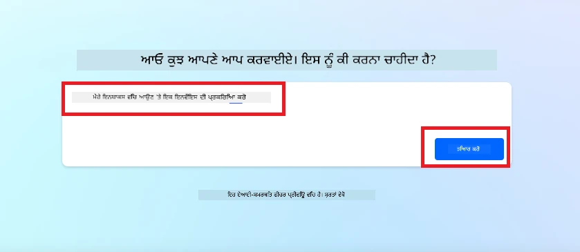

3. AI Copilot ਤੁਹਾਡੇ ਲਈ ਲੋੜੀਂਦੇ ਕਾਰਵਾਈਆਂ ਦੀ ਸਿਫਾਰਸ਼ ਕਰੇਗਾ ਜਿਨ੍ਹਾਂ ਨਾਲ ਤੁਸੀਂ ਆਪਣੇ ਟਾਸਕ ਨੂੰ ਆਟੋਮੇਟ ਕਰ ਸਕਦੇ ਹੋ। ਤੁਸੀਂ ਅੱਗੇ ਦੇ ਕਦਮਾਂ ਨੂੰ ਦੇਖਣ ਲਈ **Next** ਬਟਨ ਤੇ ਕਲਿੱਕ ਕਰੋ।

4. ਅਗਲੇ ਕਦਮ ‘ਤੇ, Power Automate ਤੁਹਾਨੂੰ ਫਲੋ ਲਈ ਜੁੜੇ ਹੋਏ ਕਨੈਕਸ਼ਨਾਂ ਨੂੰ ਸੈੱਟਅੱਪ ਕਰਨ ਲਈ ਕਹੇਗਾ। ਕੰਮ ਮੁਕੰਮਲ ਕਰਨ ਬਾਅਦ, ਫਲੋ ਬਣਾਉਣ ਲਈ **Create flow** ਬਟਨ ਤੇ ਕਲਿੱਕ ਕਰੋ।

5. AI Copilot ਇੱਕ ਫਲੋ ਬਣਾਏਗਾ ਅਤੇ ਤੁਸੀਂ ਫਿਰ ਆਪਣੀਆਂ ਜਰੂਰਤਾਂ ਮੁਤਾਬਕ ਉਸ ਨੂੰ ਕਸਟਮਾਈਜ਼ ਕਰ ਸਕਦੇ ਹੋ।

6. ਫਲੋ ਦਾ ਟ੍ਰਿਗਰ ਅਪਡੇਟ ਕਰੋ ਅਤੇ ਉਨ੍ਹਾਂ ਫੋਲਡਰ ਨੂੰ ਸੈੱਟ ਕਰੋ ਜਿੱਥੇ ਇਨਵੌਇਸ ਸਟੋਰ ਹੋਣਗੇ। ਉਦਾਹਰਨ ਵਜੋਂ, ਤੁਸੀਂ ਫੋਲਡਰ ਨੂੰ **Inbox** ਰੱਖ ਸਕਦੇ ਹੋ। **Show advanced options** ਤੇ ਕਲਿੱਕ ਕਰੋ ਅਤੇ **Only with Attachments** ਨੂੰ **Yes** ਤੇ ਸੈੱਟ ਕਰੋ। ਇਹ ਯਕੀਨੀ ਬਣਾਏਗਾ ਕਿ ਫਲੋ ਸਿਰਫ਼ ਈਮੇਲ ਨਾਲ ਐਟੀਚਮੈਂਟ ਮਿਲਣ ‘ਤੇ ਚੱਲੇਗਾ।

7. ਫਲੋ ਵਿੱਚੋਂ ਹੇਠਾਂ ਦਿੱਤੀਆਂ ਕਾਰਵਾਈਆਂ ਹਟਾ ਦਿਓ: **HTML to text**, **Compose**, **Compose 2**, **Compose 3** ਅਤੇ **Compose 4** ਕਿਉਂਕਿ ਤੁਸੀਂ ਇਹਨਾਂ ਦੀ ਵਰਤੋਂ ਨਹੀਂ ਕਰ ਰਹੇ।

8. ਫਲੋ ਵਿੱਚੋਂ **Condition** ਕਾਰਵਾਈ ਵੀ ਹਟਾ ਦਿਓ ਕਿਉਂਕਿ ਤੁਸੀਂ ਇਸ ਦੀ ਵਰਤੋਂ ਨਹੀਂ ਕਰਨਗੇ। ਇਹ ਕੁਝ ਇਸ ਤਰ੍ਹਾਂ ਲੱਗਣਾ ਚਾਹੀਦਾ ਹੈ:

   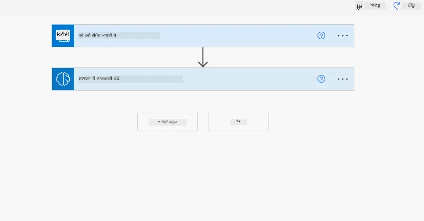

9. **Add an action** ਬਟਨ ਤੇ ਕਲਿੱਕ ਕਰੋ ਅਤੇ **Dataverse** ਲਈ ਖੋਜੋ। ਫਿਰ **Add a new row** ਕਾਰਵਾਈ ਚੁਣੋ।

10. **Extract Information from invoices** ਕਾਰਵਾਈ ਵਿੱਚ, **Invoice File** ਨੂੰ ਈਮੇਲ ਦੇ **Attachment Content** ਨਾਲ ਪੋਇੰਟ ਕਰੋ। ਇਹ ਯਕੀਨੀ ਬਣਾਉਗਾ ਕਿ ਫਲੋ ਇਨਵੌਇਸ ਐਟੀਚਮੈਂਟ ਤੋਂ ਜਾਣਕਾਰੀ ਕੱਢਦਾ ਹੈ।

11. ਉਸ ਟੇਬਲ ਨੂੰ ਚੁਣੋ ਜੋ ਤੁਹਾਡੇ ਨੇ ਪਹਿਲਾਂ ਬਣਾਈ ਸੀ। ਉਦਾਹਰਨ ਵਜੋਂ, ਤੁਸੀਂ **Invoice Information** ਟੇਬਲ ਚੁਣ ਸਕਦੇ ਹੋ। ਏਹ ਖੇਤਰ ਭਰਨ ਲਈ ਪਿਛਲੀ ਕਾਰਵਾਈ ਤੋਂ ਡਾਇਨੈਮਿਕ ਸਮੱਗਰੀ ਦੀ ਵਰਤੋਂ ਕਰੋ:

    - ID
    - Amount
    - Date
    - Name
    - Status - **Status** ਨੂੰ **Pending** ਤੇ ਸੈੱਟ ਕਰੋ।
    - Supplier Email - **When a new email arrives** ਟ੍ਰਿਗਰ ਤੋਂ **From** ਡਾਇਨੈਮਿਕ ਸਮੱਗਰੀ ਦੀ ਵਰਤੋਂ ਕਰੋ।

    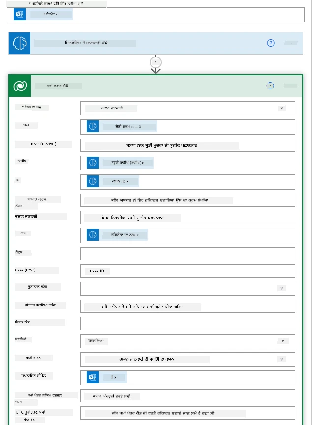

12. ਜਦੋਂ ਤੁਸੀਂ ਫਲੋ ਨਾਲ ਕੰਮ ਮੁਕੰਮਲ ਕਰ ਲਵੋ, ਤਾਂ ਫਲੋ ਸੰਭਾਲਣ ਲਈ **Save** ਬਟਨ ਤੇ ਕਲਿੱਕ ਕਰੋ। ਫਿਰ ਤੁਸੀਂ ਫਲੋ ਨੂੰ ਟੈਸਟ ਕਰਨ ਲਈ ਆਪਣੀ ਟ੍ਰਿਗਰ ਕੀਤੀ ਫੋਲਡਰ ਵਿੱਚ ਇੱਕ ਇਨਵੌਇਸ ਵਾਲੀ ਈਮੇਲ ਭੇਜ ਸਕਦੇ ਹੋ।

> **ਤੁਹਾਡਾ ਘਰ ਦਾ ਕੰਮ**: ਹੁਣੇ ਜੋ ਫਲੋ ਤੁਸੀਂ ਬਣਾਇਆ ਹੈ ਉਹ ਵਧੀਆ ਸ਼ੁਰੂਆਤ ਹੈ, ਹੁਣ ਤੁਹਾਨੂੰ ਸੋਚਣਾ ਹੈ ਕਿ ਤੁਸੀਂ ਕਿਵੇਂ ਇੱਕ ਆਟੋਮੇਸ਼ਨ ਬਣਾ ਸਕਦੇ ਹੋ ਜੋ ਸਾਡੇ ਫਾਈਨੈਂਸ ਟੀਮ ਨੂੰ ਸਪਲਾਇਰ ਨੂੰ ਈਮੇਲ ਭੇਜਣ ਦੇ ਯੋਗ ਕਰੇ, ਉਨ੍ਹਾਂ ਦੇ ਇਨਵੌਇਸ ਦੀ ਮੌਜੂਦਾ ਸਥਿਤੀ ਬਾਰੇ ਜਾਣਕਾਰੀ ਦੇਣ ਲਈ। ਤੁਹਾਡਾ ਇਸ਼ਾਰਾ: ਜਦੋਂ ਇਨਵੌਇਸ ਦੀ ਸਥਿਤੀ ਬਦਲੇ ਤਾਂ ਫਲੋ ਚੱਲਣਾ ਚਾਹੀਦਾ ਹੈ।

## ਪਾਵਰ ਆਟੋਮੇਟ ਵਿੱਚ ਲਿਖਤ ਤਿਆਰ ਕਰਨ ਵਾਲਾ AI ਮਾਡਲ ਵਰਤੋਂ

AI ਬਿਲਡਰ ਵਿੱਚ Create Text with GPT AI ਮਾਡਲ ਤੁਹਾਨੂੰ ਪ੍ਰੌਂਪਟ ਦੇ ਆਧਾਰ 'ਤੇ ਲਿਖਤ ਤਿਆਰ ਕਰਨ ਦੀ ਆਗਿਆ ਦਿੰਦਾ ਹੈ ਅਤੇ ਇਹ ਮਾਈਕਰੋਸਾਫਟ ਐਜ਼ਰ OpenAI ਸੇਵਾ ਇਸਤੇਮਾਲ ਕਰਦਾ ਹੈ। ਇਸ ਸਮਰੱਥਾ ਨਾਲ, ਤੁਸੀਂ GPT (Generative Pre-Trained Transformer) ਤਕਨਾਲੋਜੀ ਨੂੰ ਆਪਣੇ ਐਪਸ ਅਤੇ ਫਲੋਜ਼ ਵਿੱਚ ਸ਼ਾਮਿਲ ਕਰ ਸਕਦੇ ਹੋ, ਜੋ ਵੱਖ-ਵੱਖ ਆਟੋਮੇਟਡ ਫਲੋਜ਼ ਅਤੇ ਬੌਧਿਕ ਐਪਲੀਕੇਸ਼ਨਾਂ ਬਣਾਉਣ ਵਿੱਚ ਸਹਾਇਤਾ ਕਰਦਾ ਹੈ।

GPT ਮਾਡਲ ਵੱਡੀ ਮਾਤਰਾ ਵਿੱਚ ਡੇਟਾ 'ਤੇ ਗਹਿਰੀ ਤਰਬੀਅਤ ਪ੍ਰਾਪਤ ਕਰਦੇ ਹਨ, ਜੋ ਕਿ ਉਹਨਾਂ ਨੂੰ ਮਨੁੱਖੀ ਭਾਸ਼ਾ ਦੀ ਤਰ੍ਹਾਂ ਲਿਖਤ ਤਿਆਰ ਕਰਨ ਦੀ ਯੋਗਤਾ ਦਿੰਦੀ ਹੈ ਜਦੋਂ ਉਹਨਾਂ ਨੂੰ ਪ੍ਰੌਂਪਟ ਦਿੱਤਾ ਜਾਂਦਾ ਹੈ। ਜਦੋਂ ਇਹ ਵਰਕਫਲੋ ਆਟੋਮੇਸ਼ਨ ਨਾਲ ਮਿਲਦੇ ਹਨ, ਤਾਂ GPT ਵਰਗੇ AI ਮਾਡਲ ਵੱਖ-ਵੱਖ ਕਾਰਜਾਂ ਨੂੰ ਸੌਖਾ ਅਤੇ ਆਟੋਮੇਟ ਕਰ ਸਕਦੇ ਹਨ।

ਉਦਾਹਰਨ ਵਜੋਂ, ਤੁਸੀਂ ਫਲੋਜ਼ ਬਣਾਓ ਜੋ ਆਟੋਮੈਟਿਕ ਤੌਰ ਤੇ ਵੱਖ-ਵੱਖ ਹੀਰਿਆਂ ਲਈ ਲਿਖਤ ਤਿਆਰ ਕਰਦੇ ਹਨ, ਜਿਵੇਂ ਈਮੇਲ ਦਾ ਡਰਾਫਟ, ਉਤਪਾਦ ਵੇਰਵਾ ਅਤੇ ਹੋਰ। ਤੁਸੀਂ ਮਾਡਲ ਦੀ ਵਰਤੋਂ ਵੱਖ-ਵੱਖ ਐਪਸ ਲਈ ਵੀ ਕਰ ਸਕਦੇ ਹੋ, ਜਿਵੇਂ ਚੈਟਬੋਟ ਅਤੇ ਗਾਹਕ ਸੇਵਾ ਐਪਲੀਕੇਸ਼ਨ, ਜੋ ਗਾਹਕ ਸੇਵਾ ਏਜੰਟਾਂ ਨੂੰ ਗਾਹਕ ਦੀ ਪੁੱਛ-ਪੜਤਾਲ ਦਾ ਪ੍ਰਭਾਵਸ਼ਾਲੀ ਅਤੇ ਤੇਜ਼ ਜਵਾਬ ਦੇਣ ਦੇ ਯੋਗ ਬਣਾਉਂਦੇ ਹਨ।

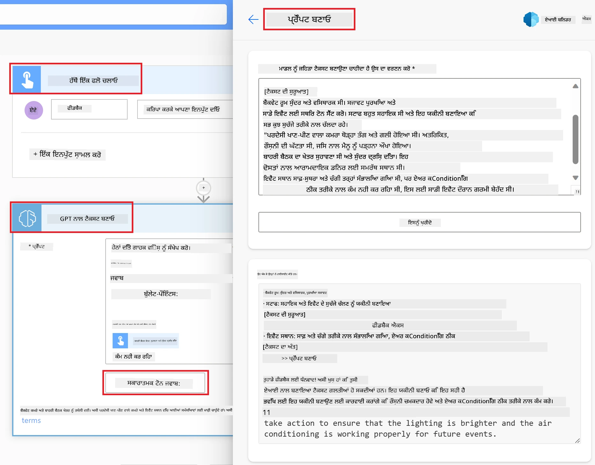

ਇਸ AI ਮਾਡਲ ਨੂੰ Power Automate ਵਿੱਚ ਵਰਤਣ ਦਾ ਤਰੀਕਾ ਸਿੱਖਣ ਲਈ, [Add intelligence with AI Builder and GPT](https://learn.microsoft.com/training/modules/ai-builder-text-generation/?WT.mc_id=academic-109639-somelezediko) ਮੋਡੀਊਲ ਨੂੰ ਵੇਖੋ।

## ਸ਼ਾਨਦਾਰ ਕੰਮ! ਆਪਣੀ ਸਿੱਖਿਆ ਜਾਰੀ ਰੱਖੋ

ਇਸ ਪਾਠ ਨੂੰ ਮੁਕੰਮਲ ਕਰਨ ਤੋਂ ਬਾਦ, ਸਾਡੇ [Generative AI Learning collection](https://aka.ms/genai-collection?WT.mc_id=academic-105485-koreyst) ਨੂੰ ਵੇਖੋ ਤਾਂ ਜੋ ਤੁਸੀਂ ਆਪਣੀ Generative AI ਦੀ ਗਿਆਨ ਨੂੰ ਹੋਰ ਵਧਾ ਸਕੋ!

Copilot ਨੂੰ ਵਧੀਆ ਬਣਾਉਣ ਅਤੇ ਹੋਰ ਕੁਝ ਲੈਣ ਲਈ ਚਾਹੁਂਦੇ ਹੋ? [Awesome Copilot](https://github.com/github/awesome-copilot?WT.mc_id=academic-105485-koreyst) ਦਾ ਪਤਾ ਲਗਾਓ — ਇਹ GitHub Copilot ਤੋਂ ਵੱਧ ਤੋਂ ਵੱਧ ਲਾਭ ਲੈਣ ਵਿੱਚ ਮਦਦ ਕਰਨ ਵਾਲੇ ਹੁਕਮਾਂ, ਏਜੰਟਾਂ, ਹੁਨਰਾਂ ਅਤੇ ਸੰਰਚਨਾਵਾਂ ਦਾ ਇੱਕ ਕਮਿਊਨਿਟੀ-ਯੋਗਦਾਨ ਸੰਗ੍ਰਹਿ ਹੈ।

ਪਾਠ 11 ਵੱਲ ਚੱਲੋ ਜਿੱਥੇ ਅਸੀਂ ਵੇਖਾਂਗੇ ਕਿ ਕਿਵੇਂ [Generative AI ਨੂੰ Function Calling ਦੇ ਨਾਲ ਜੋੜਿਆ ਜਾ ਸਕਦਾ ਹੈ](../11-integrating-with-function-calling/README.md?WT.mc_id=academic-105485-koreyst)!

---

<!-- CO-OP TRANSLATOR DISCLAIMER START -->
**ਅਸਵੀਕਾਰੋਪਣ**:
ਇਸ ਦਸਤਾਵੇਜ਼ ਦਾ ਅਨੁਵਾਦ ਏਆਈ ਅਨੁਵਾਦ ਸੇਵਾ [Co-op Translator](https://github.com/Azure/co-op-translator) ਦੀ ਵਰਤੋਂ ਕਰਕੇ ਕੀਤਾ ਗਿਆ ਹੈ। ਜਦੋਂ ਕਿ ਅਸੀਂ ਸਹੀਤਾਵਾਂ ਲਈ ਯਤਨਸ਼ੀਲ ਹਾਂ, ਕਿਰਪਾ ਕਰਕੇ ਧਿਆਨ ਰੱਖੋ ਕਿ ਸਵੈਚਾਲਿਤ ਅਨੁਵਾਦਾਂ ਵਿੱਚ ਗਲਤੀਆਂ ਜਾਂ ਅਸਮੱਤਿਆਵਾਂ ਹੋ ਸਕਦੀਆਂ ਹਨ। ਮੂਲ ਦਸਤਾਵੇਜ਼ ਆਪਣੀ ਮੂਲ ਭਾਸ਼ਾ ਵਿੱਚ ਅਧਿਕਾਰਕ ਸਰੋਤ ਮੰਨਿਆ ਜਾਣਾ ਚਾਹੀਦਾ ਹੈ। ਜਰੂਰੀ ਜਾਣਕਾਰੀ ਲਈ, ਪੇਸ਼ੇਵਰ ਮਨੁੱਖੀ ਅਨੁਵਾਦ ਦੀ ਸਿਫ਼ਾਰਸ਼ ਕੀਤੀ ਜਾਂਦੀ ਹੈ। ਅਸੀਂ ਇਸ ਅਨੁਵਾਦ ਦੇ ਉਪਯੋਗ ਤੋਂ ਪੈਦਾ ਹੋਣ ਵਾਲੀਆਂ ਕਿਸੇ ਵੀ ਗਲਤਫਹਿਮੀਆਂ ਜਾਂ ਗਲਤ ਵਿਆਖਿਆਵਾਂ ਲਈ ਜਵਾਬਦੇਹ ਨਹੀਂ ਹਾਂ।
<!-- CO-OP TRANSLATOR DISCLAIMER END -->