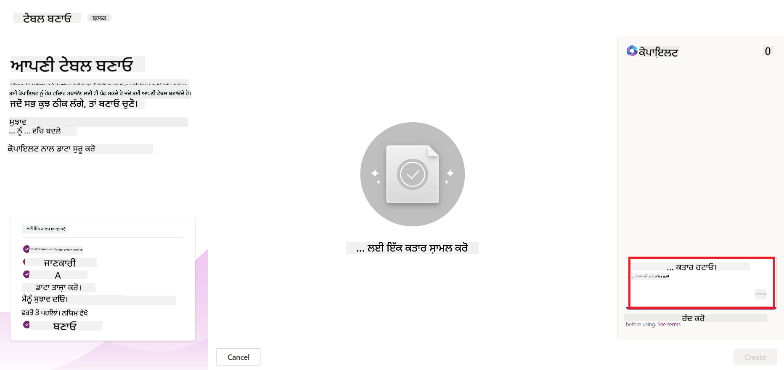
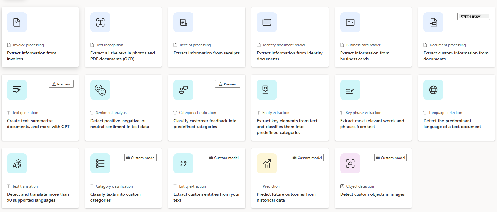
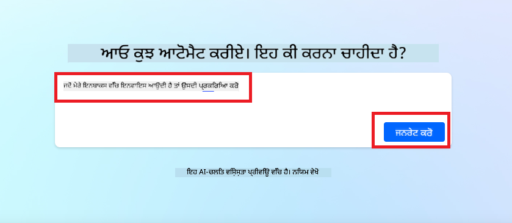
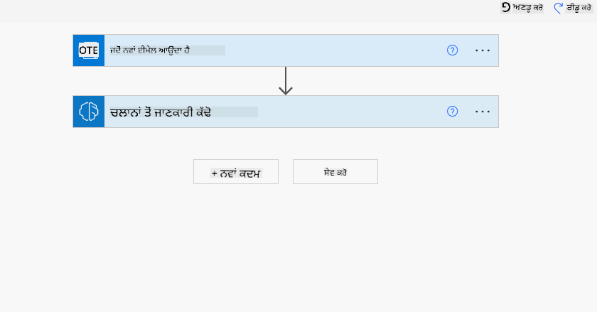
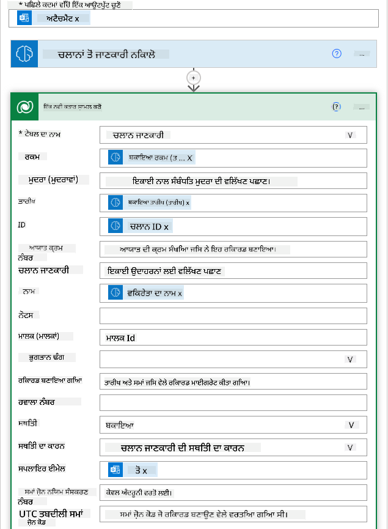

<!--
CO_OP_TRANSLATOR_METADATA:
{
  "original_hash": "846ac8e3b7dcfb697d3309fec05f0fea",
  "translation_date": "2025-10-17T14:11:07+00:00",
  "source_file": "10-building-low-code-ai-applications/README.md",
  "language_code": "pa"
}
-->
# ਲੋ ਕੋਡ AI ਐਪਲੀਕੇਸ਼ਨ ਬਣਾਉਣਾ

> _(ਉਪਰ ਦਿੱਤੀ ਤਸਵੀਰ 'ਤੇ ਕਲਿਕ ਕਰਕੇ ਇਸ ਪਾਠ ਦਾ ਵੀਡੀਓ ਵੇਖੋ)_

## ਜਾਣ ਪਛਾਣ

ਹੁਣ ਜਦੋਂ ਕਿ ਅਸੀਂ ਚਿੱਤਰ ਬਣਾਉਣ ਵਾਲੀਆਂ ਐਪਲੀਕੇਸ਼ਨ ਬਣਾਉਣ ਦਾ ਤਰੀਕਾ ਸਿੱਖ ਲਿਆ ਹੈ, ਆਓ ਲੋ ਕੋਡ ਬਾਰੇ ਗੱਲ ਕਰੀਏ। ਜਨਰੇਟਿਵ AI ਨੂੰ ਕਈ ਵੱਖ-ਵੱਖ ਖੇਤਰਾਂ ਵਿੱਚ ਵਰਤਿਆ ਜਾ ਸਕਦਾ ਹੈ, ਜਿਸ ਵਿੱਚ ਲੋ ਕੋਡ ਵੀ ਸ਼ਾਮਲ ਹੈ, ਪਰ ਲੋ ਕੋਡ ਕੀ ਹੈ ਅਤੇ ਅਸੀਂ ਇਸ ਵਿੱਚ AI ਨੂੰ ਕਿਵੇਂ ਸ਼ਾਮਲ ਕਰ ਸਕਦੇ ਹਾਂ?

ਲੋ ਕੋਡ ਡਿਵੈਲਪਮੈਂਟ ਪਲੇਟਫਾਰਮਾਂ ਦੀ ਵਰਤੋਂ ਕਰਕੇ ਰਵਾਇਤੀ ਡਿਵੈਲਪਰਾਂ ਅਤੇ ਗੈਰ-ਡਿਵੈਲਪਰਾਂ ਲਈ ਐਪਸ ਅਤੇ ਹੱਲ ਬਣਾਉਣਾ ਆਸਾਨ ਹੋ ਗਿਆ ਹੈ। ਇਹ ਪਲੇਟਫਾਰਮ ਤੁਹਾਨੂੰ ਬਹੁਤ ਘੱਟ ਜਾਂ ਬਿਨਾ ਕੋਡ ਦੇ ਐਪਸ ਅਤੇ ਹੱਲ ਬਣਾਉਣ ਦੀ ਸਹੂਲਤ ਦਿੰਦੇ ਹਨ। ਇਹ ਇੱਕ ਵਿਜ਼ੂਅਲ ਡਿਵੈਲਪਮੈਂਟ ਵਾਤਾਵਰਣ ਪ੍ਰਦਾਨ ਕਰਦੇ ਹਨ ਜੋ ਤੁਹਾਨੂੰ ਐਪਸ ਅਤੇ ਹੱਲ ਬਣਾਉਣ ਲਈ ਕੰਪੋਨੈਂਟਸ ਨੂੰ ਡਰੈਗ ਅਤੇ ਡਰੌਪ ਕਰਨ ਦੀ ਸਹੂਲਤ ਦਿੰਦਾ ਹੈ। ਇਸ ਨਾਲ ਐਪਸ ਅਤੇ ਹੱਲ ਤੇਜ਼ੀ ਨਾਲ ਅਤੇ ਘੱਟ ਸਾਧਨਾਂ ਨਾਲ ਬਣਾਏ ਜਾ ਸਕਦੇ ਹਨ। ਇਸ ਪਾਠ ਵਿੱਚ, ਅਸੀਂ ਲੋ ਕੋਡ ਦੀ ਵਰਤੋਂ ਕਰਨ ਅਤੇ Power Platform ਦੀ ਮਦਦ ਨਾਲ AI ਦੇ ਨਾਲ ਲੋ ਕੋਡ ਡਿਵੈਲਪਮੈਂਟ ਨੂੰ ਵਧਾਉਣ ਦੇ ਤਰੀਕੇ ਵਿੱਚ ਡੂੰਘਾਈ ਵਿੱਚ ਜਾਵਾਂਗੇ।

Power Platform ਸੰਗਠਨਾਂ ਨੂੰ ਆਪਣੀਆਂ ਟੀਮਾਂ ਨੂੰ ਇੱਕ ਸਹਜ ਲੋ-ਕੋਡ ਜਾਂ ਨੋ-ਕੋਡ ਵਾਤਾਵਰਣ ਰਾਹੀਂ ਆਪਣੇ ਹੱਲ ਬਣਾਉਣ ਲਈ ਸਸ਼ਕਤ ਕਰਨ ਦਾ ਮੌਕਾ ਦਿੰਦਾ ਹੈ। ਇਹ ਵਾਤਾਵਰਣ ਹੱਲ ਬਣਾਉਣ ਦੀ ਪ੍ਰਕਿਰਿਆ ਨੂੰ ਸਧਾਰਨ ਬਣਾਉਣ ਵਿੱਚ ਮਦਦ ਕਰਦਾ ਹੈ। Power Platform ਨਾਲ, ਹੱਲ ਮਹੀਨਿਆਂ ਜਾਂ ਸਾਲਾਂ ਦੀ ਬਜਾਏ ਦਿਨਾਂ ਜਾਂ ਹਫ਼ਤਿਆਂ ਵਿੱਚ ਬਣਾਏ ਜਾ ਸਕਦੇ ਹਨ। Power Platform ਵਿੱਚ ਪੰਜ ਮੁੱਖ ਉਤਪਾਦ ਸ਼ਾਮਲ ਹਨ: Power Apps, Power Automate, Power BI, Power Pages ਅਤੇ Copilot Studio।

ਇਸ ਪਾਠ ਵਿੱਚ ਇਹ ਸ਼ਾਮਲ ਹੈ:

- Power Platform ਵਿੱਚ ਜਨਰੇਟਿਵ AI ਦਾ ਜਾਣ ਪਛਾਣ
- Copilot ਦਾ ਜਾਣ ਪਛਾਣ ਅਤੇ ਇਸਦੀ ਵਰਤੋਂ ਦਾ ਤਰੀਕਾ
- Power Platform ਵਿੱਚ ਜਨਰੇਟਿਵ AI ਦੀ ਮਦਦ ਨਾਲ ਐਪਸ ਅਤੇ ਫਲੋ ਬਣਾਉਣਾ
- AI Builder ਨਾਲ Power Platform ਵਿੱਚ AI ਮਾਡਲਾਂ ਨੂੰ ਸਮਝਣਾ

## ਸਿੱਖਣ ਦੇ ਲਕਸ਼

ਇਸ ਪਾਠ ਦੇ ਅੰਤ ਤੱਕ, ਤੁਸੀਂ ਇਹ ਕਰਨ ਦੇ ਯੋਗ ਹੋਵੋਗੇ:

- ਸਮਝਣਾ ਕਿ Copilot Power Platform ਵਿੱਚ ਕਿਵੇਂ ਕੰਮ ਕਰਦਾ ਹੈ।

- ਸਾਡੇ ਸਿੱਖਿਆ ਸਟਾਰਟਅਪ ਲਈ ਇੱਕ Student Assignment Tracker ਐਪ ਬਣਾਉਣਾ।

- ਇੱਕ Invoice Processing Flow ਬਣਾਉਣਾ ਜੋ ਚਲਾਨਾਂ ਤੋਂ ਜਾਣਕਾਰੀ ਕੱਢਣ ਲਈ AI ਦੀ ਵਰਤੋਂ ਕਰਦਾ ਹੈ।

- GPT AI ਮਾਡਲ ਨਾਲ ਟੈਕਸਟ ਬਣਾਉਣ ਦੀਆਂ ਵਧੀਆ ਪ੍ਰਥਾਵਾਂ ਲਾਗੂ ਕਰਨਾ।

ਇਸ ਪਾਠ ਵਿੱਚ ਤੁਸੀਂ ਜੋ ਸੰਦ ਅਤੇ ਤਕਨਾਲੋਜੀਆਂ ਦੀ ਵਰਤੋਂ ਕਰੋਗੇ ਉਹ ਹਨ:

- **Power Apps**, Student Assignment Tracker ਐਪ ਲਈ, ਜੋ ਡਾਟਾ ਨੂੰ ਟ੍ਰੈਕ, ਮੈਨੇਜ ਅਤੇ ਇੰਟਰੈਕਟ ਕਰਨ ਲਈ ਐਪਸ ਬਣਾਉਣ ਲਈ ਇੱਕ ਲੋ-ਕੋਡ ਡਿਵੈਲਪਮੈਂਟ ਵਾਤਾਵਰਣ ਪ੍ਰਦਾਨ ਕਰਦਾ ਹੈ।

- **Dataverse**, Student Assignment Tracker ਐਪ ਲਈ ਡਾਟਾ ਸਟੋਰ ਕਰਨ ਲਈ, ਜਿੱਥੇ Dataverse ਐਪ ਦੇ ਡਾਟਾ ਨੂੰ ਸਟੋਰ ਕਰਨ ਲਈ ਇੱਕ ਲੋ-ਕੋਡ ਡਾਟਾ ਪਲੇਟਫਾਰਮ ਪ੍ਰਦਾਨ ਕਰੇਗਾ।

- **Power Automate**, Invoice Processing Flow ਲਈ, ਜਿੱਥੇ ਤੁਸੀਂ ਚਲਾਨ ਪ੍ਰੋਸੈਸਿੰਗ ਪ੍ਰਕਿਰਿਆ ਨੂੰ ਆਟੋਮੇਟ ਕਰਨ ਲਈ ਵਰਕਫਲੋਜ਼ ਬਣਾਉਣ ਲਈ ਲੋ-ਕੋਡ ਡਿਵੈਲਪਮੈਂਟ ਵਾਤਾਵਰਣ ਦੀ ਵਰਤੋਂ ਕਰੋਗੇ।

- **AI Builder**, Invoice Processing AI Model ਲਈ, ਜਿੱਥੇ ਤੁਸੀਂ ਸਾਡੇ ਸਟਾਰਟਅਪ ਲਈ ਚਲਾਨਾਂ ਨੂੰ ਪ੍ਰੋਸੈਸ ਕਰਨ ਲਈ ਪ੍ਰੀਬਿਲਟ AI ਮਾਡਲਾਂ ਦੀ ਵਰਤੋਂ ਕਰੋਗੇ।

## Power Platform ਵਿੱਚ ਜਨਰੇਟਿਵ AI

ਲੋ-ਕੋਡ ਡਿਵੈਲਪਮੈਂਟ ਅਤੇ ਐਪਲੀਕੇਸ਼ਨ ਨੂੰ ਜਨਰੇਟਿਵ AI ਨਾਲ ਵਧਾਉਣਾ Power Platform ਲਈ ਇੱਕ ਮੁੱਖ ਧਿਆਨ ਦਾ ਖੇਤਰ ਹੈ। ਉਦੇਸ਼ ਇਹ ਹੈ ਕਿ ਹਰ ਕੋਈ AI-ਚਾਲਤ ਐਪਸ, ਸਾਈਟਾਂ, ਡੈਸ਼ਬੋਰਡ ਬਣਾਉਣ ਅਤੇ ਪ੍ਰਕਿਰਿਆਵਾਂ ਨੂੰ ਆਟੋਮੇਟ ਕਰਨ ਦੇ ਯੋਗ ਹੋਵੇ, _ਬਿਨਾ ਕਿਸੇ ਡਾਟਾ ਸਾਇੰਸ ਦੀ ਮਾਹਰਤਾ ਦੀ ਲੋੜ_। ਇਹ ਉਦੇਸ਼ Copilot ਅਤੇ AI Builder ਦੇ ਰੂਪ ਵਿੱਚ Power Platform ਵਿੱਚ ਲੋ-ਕੋਡ ਡਿਵੈਲਪਮੈਂਟ ਅਨੁਭਵ ਵਿੱਚ ਜਨਰੇਟਿਵ AI ਨੂੰ ਸ਼ਾਮਲ ਕਰਕੇ ਹਾਸਲ ਕੀਤਾ ਜਾਂਦਾ ਹੈ।

### ਇਹ ਕਿਵੇਂ ਕੰਮ ਕਰਦਾ ਹੈ?

Copilot ਇੱਕ AI ਸਹਾਇਕ ਹੈ ਜੋ ਤੁਹਾਨੂੰ ਕੁਦਰਤੀ ਭਾਸ਼ਾ ਦੀ ਵਰਤੋਂ ਕਰਕੇ ਗੱਲਬਾਤੀ ਕਦਮਾਂ ਦੀ ਇੱਕ ਲੜੀ ਵਿੱਚ ਆਪਣੀਆਂ ਜ਼ਰੂਰਤਾਂ ਦਾ ਵੇਰਵਾ ਦੇ ਕੇ Power Platform ਹੱਲ ਬਣਾਉਣ ਦੀ ਸਹੂਲਤ ਦਿੰਦਾ ਹੈ। ਉਦਾਹਰਨ ਲਈ, ਤੁਸੀਂ ਆਪਣੇ AI ਸਹਾਇਕ ਨੂੰ ਦੱਸ ਸਕਦੇ ਹੋ ਕਿ ਤੁਹਾਡਾ ਐਪ ਕਿਹੜੇ ਫੀਲਡ ਵਰਤੇਗਾ ਅਤੇ ਇਹ ਤੁਹਾਡੇ ਵੇਰਵੇ ਦੇ ਅਧਾਰ 'ਤੇ ਐਪ ਅਤੇ ਅਧਾਰਭੂਤ ਡਾਟਾ ਮਾਡਲ ਦੋਵੇਂ ਬਣਾਏਗਾ ਜਾਂ ਤੁਸੀਂ Power Automate ਵਿੱਚ ਫਲੋ ਸੈਟ ਕਰਨ ਦਾ ਤਰੀਕਾ ਦੱਸ ਸਕਦੇ ਹੋ।

ਤੁਸੀਂ Copilot ਚਾਲਤ ਫੰਕਸ਼ਨਲਿਟੀਜ਼ ਨੂੰ ਆਪਣੇ ਐਪ ਸਕ੍ਰੀਨ ਵਿੱਚ ਇੱਕ ਫੀਚਰ ਵਜੋਂ ਵਰਤ ਸਕਦੇ ਹੋ ਤਾਂ ਕਿ ਯੂਜ਼ਰ ਗੱਲਬਾਤੀ ਇੰਟਰੈਕਸ਼ਨ ਰਾਹੀਂ ਅੰਦਰੂਨੀ ਜਾਣਕਾਰੀ ਪ੍ਰਾਪਤ ਕਰ ਸਕਣ।

AI Builder Power Platform ਵਿੱਚ ਉਪਲਬਧ ਇੱਕ ਲੋ-ਕੋਡ AI ਸਮਰਥਾ ਹੈ ਜੋ ਤੁਹਾਨੂੰ ਪ੍ਰਕਿਰਿਆਵਾਂ ਨੂੰ ਆਟੋਮੇਟ ਕਰਨ ਅਤੇ ਨਤੀਜੇ ਦੀ ਭਵਿੱਖਵਾਣੀ ਕਰਨ ਵਿੱਚ ਮਦਦ ਕਰਨ ਲਈ AI ਮਾਡਲਾਂ ਦੀ ਵਰਤੋਂ ਕਰਨ ਦੀ ਸਹੂਲਤ ਦਿੰਦਾ ਹੈ। AI Builder ਨਾਲ ਤੁਸੀਂ ਆਪਣੇ ਡਾਟਾ ਵਿੱਚ ਜੁੜੇ ਐਪਸ ਅਤੇ ਫਲੋਜ਼ ਵਿੱਚ AI ਲਿਆ ਸਕਦੇ ਹੋ ਜੋ Dataverse ਜਾਂ ਵੱਖ-ਵੱਖ ਕਲਾਉਡ ਡਾਟਾ ਸਰੋਤਾਂ, ਜਿਵੇਂ ਕਿ SharePoint, OneDrive ਜਾਂ Azure ਵਿੱਚ ਹਨ।

Copilot Power Platform ਦੇ ਸਾਰੇ ਉਤਪਾਦਾਂ ਵਿੱਚ ਉਪਲਬਧ ਹੈ: Power Apps, Power Automate, Power BI, Power Pages ਅਤੇ Power Virtual Agents। AI Builder Power Apps ਅਤੇ Power Automate ਵਿੱਚ ਉਪਲਬਧ ਹੈ। ਇਸ ਪਾਠ ਵਿੱਚ, ਅਸੀਂ ਸਾਡੇ ਸਿੱਖਿਆ ਸਟਾਰਟਅਪ ਲਈ ਹੱਲ ਬਣਾਉਣ ਲਈ Power Apps ਅਤੇ Power Automate ਵਿੱਚ Copilot ਅਤੇ AI Builder ਦੀ ਵਰਤੋਂ ਕਰਨ ਦੇ ਤਰੀਕੇ 'ਤੇ ਧਿਆਨ ਦੇਵਾਂਗੇ।

### Power Apps ਵਿੱਚ Copilot

Power Platform ਦੇ ਹਿੱਸੇ ਵਜੋਂ, Power Apps ਡਾਟਾ ਨੂੰ ਟ੍ਰੈਕ, ਮੈਨੇਜ ਅਤੇ ਇੰਟਰੈਕਟ ਕਰਨ ਲਈ ਐਪਸ ਬਣਾਉਣ ਲਈ ਇੱਕ ਲੋ-ਕੋਡ ਡਿਵੈਲਪਮੈਂਟ ਵਾਤਾਵਰਣ ਪ੍ਰਦਾਨ ਕਰਦਾ ਹੈ। ਇਹ ਐਪ ਡਿਵੈਲਪਮੈਂਟ ਸੇਵਾਵਾਂ ਦਾ ਇੱਕ ਸੂਟ ਹੈ ਜਿਸ ਵਿੱਚ ਇੱਕ ਸਕੇਲਬਲ ਡਾਟਾ ਪਲੇਟਫਾਰਮ ਅਤੇ ਕਲਾਉਡ ਸੇਵਾਵਾਂ ਅਤੇ ਓਨ-ਪ੍ਰੈਮਿਸ ਡਾਟਾ ਨਾਲ ਜੁੜਨ ਦੀ ਸਮਰਥਾ ਹੈ। Power Apps ਤੁਹਾਨੂੰ ਐਪਸ ਬਣਾਉਣ ਦੀ ਸਹੂਲਤ ਦਿੰਦਾ ਹੈ ਜੋ ਬ੍ਰਾਊਜ਼ਰ, ਟੈਬਲੇਟ ਅਤੇ ਫੋਨ 'ਤੇ ਚੱਲਦੇ ਹਨ ਅਤੇ ਸਹਿਕਰਮੀਆਂ ਨਾਲ ਸਾਂਝੇ ਕੀਤੇ ਜਾ ਸਕਦੇ ਹਨ। Power Apps ਇੱਕ ਸਧਾਰਨ ਇੰਟਰਫੇਸ ਨਾਲ ਯੂਜ਼ਰਾਂ ਨੂੰ ਐਪ ਡਿਵੈਲਪਮੈਂਟ ਵਿੱਚ ਆਸਾਨੀ ਨਾਲ ਸ਼ੁਰੂ ਕਰਨ ਦੀ ਸਹੂਲਤ ਦਿੰਦਾ ਹੈ, ਤਾਂ ਜੋ ਹਰ ਕਾਰੋਬਾਰੀ ਯੂਜ਼ਰ ਜਾਂ ਪ੍ਰੋ ਡਿਵੈਲਪਰ ਕਸਟਮ ਐਪਸ ਬਣਾਉਣ ਦੇ ਯੋਗ ਹੋ ਸਕੇ। Generative AI ਨਾਲ Copilot ਦੁਆਰਾ ਐਪ ਡਿਵੈਲਪਮੈਂਟ ਅਨੁਭਵ ਨੂੰ ਵੀ ਵਧਾਇਆ ਗਿਆ ਹੈ।

Power Apps ਵਿੱਚ Copilot AI ਸਹਾਇਕ ਫੀਚਰ ਤੁਹਾਨੂੰ ਇਹ ਵੇਰਵਾ ਦੇਣ ਦੀ ਸਹੂਲਤ ਦਿੰਦਾ ਹੈ ਕਿ ਤੁਹਾਨੂੰ ਕਿਸ ਤਰ੍ਹਾਂ ਦਾ ਐਪ ਚਾਹੀਦਾ ਹੈ ਅਤੇ ਤੁਹਾਡਾ ਐਪ ਕਿਹੜੀ ਜਾਣਕਾਰੀ ਟ੍ਰੈਕ, ਇਕੱਠਾ ਜਾਂ ਦਿਖਾਉਣਾ ਚਾਹੁੰਦਾ ਹੈ। Copilot ਫਿਰ ਤੁਹਾਡੇ ਵੇਰਵੇ ਦੇ ਅਧਾਰ 'ਤੇ ਇੱਕ ਸੰਵੇਦਨਸ਼ੀਲ Canvas ਐਪ ਬਣਾਉਂਦਾ ਹੈ। ਤੁਸੀਂ ਫਿਰ ਆਪਣੀਆਂ ਜ਼ਰੂਰਤਾਂ ਨੂੰ ਪੂਰਾ ਕਰਨ ਲਈ ਐਪ ਨੂੰ ਕਸਟਮਾਈਜ਼ ਕਰ ਸਕਦੇ ਹੋ। AI Copilot ਤੁਹਾਡੇ ਡਾਟਾ ਨੂੰ ਟ੍ਰੈਕ ਕਰਨ ਲਈ ਜ਼ਰੂਰੀ ਫੀਲਡਾਂ ਦੇ ਨਾਲ ਇੱਕ Dataverse Table ਅਤੇ ਕੁਝ ਨਮੂਨਾ ਡਾਟਾ ਵੀ ਬਣਾਉਂਦਾ ਹੈ। ਅਸੀਂ ਇਸ ਪਾਠ ਵਿੱਚ ਬਾਅਦ ਵਿੱਚ ਵੇਖਾਂਗੇ ਕਿ Dataverse ਕੀ ਹੈ ਅਤੇ ਤੁਸੀਂ ਇਸਦੀ ਵਰਤੋਂ Power Apps ਵਿੱਚ ਕਿਵੇਂ ਕਰ ਸਕਦੇ ਹੋ। ਤੁਸੀਂ ਫਿਰ ਗੱਲਬਾਤੀ ਕਦਮਾਂ ਰਾਹੀਂ AI Copilot ਸਹਾਇਕ ਫੀਚਰ ਦੀ ਵਰਤੋਂ ਕਰਕੇ ਟੇਬਲ ਨੂੰ ਆਪਣੀਆਂ ਜ਼ਰੂਰਤਾਂ ਅਨੁਸਾਰ ਕਸਟਮਾਈਜ਼ ਕਰ ਸਕਦੇ ਹੋ। ਇਹ ਫੀਚਰ Power Apps ਹੋਮ ਸਕ੍ਰੀਨ ਤੋਂ ਤੁਰੰਤ ਉਪਲਬਧ ਹੈ।

### Power Automate ਵਿੱਚ Copilot

Power Platform ਦੇ ਹਿੱਸੇ ਵਜੋਂ, Power Automate ਯੂਜ਼ਰਾਂ ਨੂੰ ਐਪਲੀਕੇਸ਼ਨ ਅਤੇ ਸੇਵਾਵਾਂ ਦੇ ਵਿਚਕਾਰ ਆਟੋਮੈਟਿਕ ਵਰਕਫਲੋਜ਼ ਬਣਾਉਣ ਦੀ ਸਹੂਲਤ ਦਿੰਦਾ ਹੈ। ਇਹ ਦੁਹਰਾਏ ਜਾਣ ਵਾਲੇ ਕਾਰੋਬਾਰੀ ਪ੍ਰਕਿਰਿਆਵਾਂ ਨੂੰ ਆਟੋਮੇਟ ਕਰਨ ਵਿੱਚ ਮਦਦ ਕਰਦਾ ਹੈ ਜਿਵੇਂ ਕਿ ਸੰਚਾਰ, ਡਾਟਾ ਇਕੱਠਾ ਕਰਨਾ ਅਤੇ ਫੈਸਲੇ ਦੀ ਮਨਜ਼ੂਰੀ। ਇਸਦਾ ਸਧਾਰਨ ਇੰਟਰਫੇਸ ਹਰ ਤਕਨੀਕੀ ਯੋਗਤਾ ਵਾਲੇ ਯੂਜ਼ਰਾਂ (ਸ਼ੁਰੂਆਤੀ ਤੋਂ ਲੈ ਕੇ ਮਾਹਰ ਡਿਵੈਲਪਰਾਂ ਤੱਕ) ਨੂੰ ਕੰਮ ਦੇ ਕੰਮਾਂ ਨੂੰ ਆਟੋਮੇਟ ਕਰਨ ਦੀ ਸਹੂਲਤ ਦਿੰਦਾ ਹੈ। ਵਰਕਫਲੋ ਡਿਵੈਲਪਮੈਂਟ ਅਨੁਭਵ ਨੂੰ ਵੀ Generative AI ਨਾਲ Copilot ਦੁਆਰਾ ਵਧਾਇਆ ਗਿਆ ਹੈ।

Power Automate ਵਿੱਚ Copilot AI ਸਹਾਇਕ ਫੀਚਰ ਤੁਹਾਨੂੰ ਇਹ ਵੇਰਵਾ ਦੇਣ ਦੀ ਸਹੂਲਤ ਦਿੰਦਾ ਹੈ ਕਿ ਤੁਹਾਨੂੰ ਕਿਸ ਤਰ੍ਹਾਂ ਦਾ ਫਲੋ ਚਾਹੀਦਾ ਹੈ ਅਤੇ ਤੁਹਾਡਾ ਫਲੋ ਕਿਹੜੀਆਂ ਕਾਰਵਾਈਆਂ ਕਰੇਗਾ। Copilot ਫਿਰ ਤੁਹਾਡੇ ਵੇਰਵੇ ਦੇ ਅਧਾਰ 'ਤੇ ਇੱਕ ਫਲੋ ਬਣਾਉਂਦਾ ਹੈ। ਤੁਸੀਂ ਫਿਰ ਆਪਣੀਆਂ ਜ਼ਰੂਰਤਾਂ ਨੂੰ ਪੂਰਾ ਕਰਨ ਲਈ ਫਲੋ ਨੂੰ ਕਸਟਮਾਈਜ਼ ਕਰ ਸਕਦੇ ਹੋ। AI Copilot ਤੁਹਾਨੂੰ ਉਹ ਕਾਰਵਾਈਆਂ ਵੀ ਬਣਾਉਂਦਾ ਅਤੇ ਸੁਝਾਏਗਾ ਜੋ ਤੁਸੀਂ ਆਟੋਮੇਟ ਕਰਨ ਲਈ ਚਾਹੁੰਦੇ ਹੋ। ਅਸੀਂ ਇਸ ਪਾਠ ਵਿੱਚ ਬਾਅਦ ਵਿੱਚ ਵੇਖਾਂਗੇ ਕਿ ਫਲੋ ਕੀ ਹਨ ਅਤੇ ਤੁਸੀਂ Power Automate ਵਿੱਚ ਕਿਵੇਂ ਵਰਤ ਸਕਦੇ ਹੋ। ਤੁਸੀਂ ਫਿਰ ਗੱਲਬਾਤੀ ਕਦਮਾਂ ਰਾਹੀਂ AI Copilot ਸਹਾਇਕ ਫੀਚਰ ਦੀ ਵਰਤੋਂ ਕਰਕੇ ਕਾਰਵਾਈਆਂ ਨੂੰ ਆਪਣੀਆਂ ਜ਼ਰੂਰਤਾਂ ਅਨੁਸਾਰ ਕਸਟਮਾਈਜ਼ ਕਰ ਸਕਦੇ ਹੋ। ਇਹ ਫੀਚਰ Power Automate ਹੋਮ ਸਕ੍ਰੀਨ ਤੋਂ ਤੁਰੰਤ ਉਪਲਬਧ ਹੈ।

## ਅਸਾਈਨਮੈਂਟ: ਸਾਡੇ ਸਟਾਰਟਅਪ ਲਈ ਵਿਦਿਆਰਥੀ ਅਸਾਈਨਮੈਂਟ ਅਤੇ ਚਲਾਨਾਂ ਦਾ ਪ੍ਰਬੰਧਨ ਕਰੋ, Copilot ਦੀ ਵਰਤੋਂ ਕਰਕੇ

ਸਾਡਾ ਸਟਾਰਟਅਪ ਵਿਦਿਆਰਥੀਆਂ ਨੂੰ ਆਨਲਾਈਨ ਕੋਰਸ ਪ੍ਰਦਾਨ ਕਰਦਾ ਹੈ। ਸਟਾਰਟਅਪ ਤੇਜ਼ੀ ਨਾਲ ਵਧਿਆ ਹੈ ਅਤੇ ਹੁਣ ਆਪਣੇ ਕੋਰਸਾਂ ਦੀ ਮੰਗ ਨੂੰ ਪੂਰਾ ਕਰਨ ਵਿੱਚ ਸੰਘਰਸ਼ ਕਰ ਰਿਹਾ ਹੈ। ਸਟਾਰਟਅਪ ਨੇ ਤੁਹਾਨੂੰ ਇੱਕ Power Platform ਡਿਵੈਲਪਰ ਵਜੋਂ ਭਰਤੀ ਕੀਤਾ ਹੈ ਤਾਂ ਕਿ ਉਹਨਾਂ ਨੂੰ ਵਿਦਿਆਰਥੀ ਅਸਾਈਨਮੈਂਟ ਅਤੇ ਚਲਾਨਾਂ ਦਾ ਪ੍ਰਬੰਧਨ ਕਰਨ ਵਿੱਚ ਮਦਦ ਕਰਨ ਲਈ ਇੱਕ ਲੋ ਕੋਡ ਹੱਲ ਬਣਾਉਣ ਵਿੱਚ ਮਦਦ ਕੀਤੀ ਜਾ ਸਕੇ। ਉਹਨਾਂ ਦਾ ਹੱਲ ਉਹਨਾਂ ਨੂੰ ਇੱਕ ਐਪ ਰਾਹੀਂ ਵਿਦਿਆਰਥੀ ਅਸਾਈਨਮੈਂਟ ਨੂੰ ਟ੍ਰੈਕ ਅਤੇ ਮੈਨੇਜ ਕਰਨ ਵਿੱਚ ਅਤੇ ਇੱਕ ਵਰਕਫਲੋ ਰਾਹੀਂ ਚਲਾਨ ਪ੍ਰੋਸੈਸਿੰਗ ਪ੍ਰਕਿਰਿਆ ਨੂੰ ਆਟੋਮੇਟ ਕਰਨ ਵਿੱਚ ਮਦਦ ਕਰਨਾ ਚਾਹੀਦਾ ਹੈ। ਤੁਹਾਨੂੰ ਜਨਰੇਟਿਵ AI ਦੀ ਵਰਤੋਂ ਕਰਕੇ ਹੱਲ ਵਿਕਸਿਤ ਕਰਨ ਲਈ ਕਿਹਾ ਗਿਆ ਹੈ।

ਜਦੋਂ ਤੁਸੀਂ Copilot ਦੀ ਵਰਤੋਂ ਕਰਨਾ ਸ਼ੁਰੂ ਕਰਦੇ ਹੋ, ਤੁਸੀਂ [Power Platform Copilot Prompt Library](https://github.com/pnp/powerplatform-prompts?WT.mc_id=academic-109639-somelezediko) ਦੀ ਵਰਤੋਂ ਕਰ ਸਕਦੇ ਹੋ ਤਾਂ ਕਿ ਪ੍ਰੋਮਪਟਸ ਨਾਲ ਸ਼ੁਰੂਆਤ ਕੀਤੀ ਜਾ ਸਕੇ। ਇਸ ਲਾਇਬ੍ਰੇਰੀ ਵਿੱਚ ਪ੍ਰੋਮਪਟਸ ਦੀ ਇੱਕ ਸੂਚੀ ਸ਼ਾਮਲ ਹੈ ਜੋ ਤੁਸੀਂ Copilot ਨਾਲ ਐਪਸ ਅਤੇ ਫਲੋ ਬਣਾਉਣ ਲਈ ਵਰਤ ਸਕਦੇ ਹੋ। ਤੁਸੀਂ ਲਾਇਬ੍ਰੇਰੀ ਵਿੱਚ ਪ੍ਰੋਮਪਟਸ ਦੀ ਵਰਤੋਂ ਕਰਕੇ ਇਹ ਵੀ ਸਮਝ ਸਕਦੇ ਹੋ ਕਿ Copilot ਨੂੰ ਆਪਣੀਆਂ ਜ਼ਰੂਰਤਾਂ ਦਾ ਵੇਰਵਾ ਕਿਵੇਂ ਦੇਣਾ ਹੈ।

### ਸਾਡੇ ਸਟਾਰਟਅਪ ਲਈ ਵਿਦਿਆਰਥੀ ਅਸਾਈਨਮੈਂਟ ਟ੍ਰੈਕਰ ਐਪ ਬਣਾਓ

ਸਾਡੇ ਸਟਾਰਟਅਪ ਦੇ ਸਿੱਖਿਆਕਾਰ ਵਿਦਿਆਰਥੀ ਅਸਾਈਨਮੈਂਟ ਨੂੰ ਟ੍ਰੈਕ ਕਰਨ ਵਿੱਚ ਸੰਘਰਸ਼ ਕਰ ਰਹੇ ਹਨ। ਉਹਨਾਂ ਨੇ ਅਸਾਈਨਮੈਂਟ ਨੂੰ ਟ੍ਰੈਕ ਕਰਨ ਲਈ ਇੱਕ ਸਪ੍ਰੈਡਸ਼ੀਟ ਦੀ ਵਰਤੋਂ ਕੀਤੀ ਹੈ ਪਰ ਜਿਵੇਂ ਕਿ ਵਿਦਿਆਰਥੀਆਂ ਦੀ ਗਿਣਤੀ ਵਧ ਗਈ ਹੈ, ਇਸਨੂੰ ਮੈਨੇਜ ਕਰਨਾ ਮੁਸ਼ਕਲ ਹੋ ਗਿਆ ਹੈ। ਉਹਨਾਂ ਨੇ ਤੁਹਾਨੂੰ ਇੱਕ ਐਪ ਬਣਾਉਣ ਲਈ ਕਿਹਾ ਹੈ ਜੋ ਉਹਨਾਂ ਨੂੰ ਵਿਦਿਆਰਥੀ ਅਸਾਈਨਮੈਂਟ ਨੂੰ ਟ੍ਰੈਕ ਅਤੇ ਮੈਨੇਜ ਕਰਨ ਵਿੱਚ ਮਦਦ ਕਰੇ। ਐਪ ਉਹਨਾਂ ਨੂੰ ਨਵੇਂ ਅਸਾਈਨਮੈਂਟਸ ਸ਼ਾਮਲ ਕਰਨ, ਅਸਾਈਨਮੈਂਟਸ ਦੇਖਣ, ਅਸਾਈਨਮੈਂਟਸ ਅਪਡੇਟ ਕਰਨ ਅਤੇ ਅਸਾਈਨਮੈਂਟਸ ਨੂੰ ਮਿਟਾਉਣ ਦੀ ਸਹੂਲਤ ਦੇਵੇ। ਐਪ ਸਿੱਖਿਆਕਾਰਾਂ ਅਤੇ ਵਿਦਿਆਰਥੀਆਂ ਨੂੰ ਉਹ ਅਸਾਈਨਮੈਂਟਸ ਦੇਖਣ ਦੀ ਸਹੂਲਤ ਵੀ ਦੇਵੇ ਜੋ ਗ੍ਰੇਡ ਕੀਤੇ ਗਏ ਹਨ ਅਤੇ ਜੋ ਗ੍ਰੇਡ ਨਹੀਂ ਕੀਤੇ ਗਏ।

ਤੁਸੀਂ ਹੇਠਾਂ ਦਿੱਤੇ ਕਦਮਾਂ ਦੀ ਪਾਲਣਾ ਕਰਕੇ Power Apps ਵਿੱਚ Copilot ਦੀ ਵਰਤੋਂ ਕਰਕੇ ਐਪ ਬਣਾਉਣ ਜਾ ਰਹੇ ਹੋ:

1. [Power Apps](https://make.powerapps.com?WT.mc_id=academic-105485-koreyst) ਹੋਮ ਸਕ੍ਰੀਨ 'ਤੇ ਜਾਓ।

1. ਹੋਮ ਸਕ੍ਰੀਨ 'ਤੇ ਟੈਕਸਟ ਖੇਤਰ ਦੀ ਵਰਤੋਂ ਕਰਕੇ ਉਸ ਐਪ ਦਾ ਵੇਰਵਾ ਦਿਓ ਜੋ ਤੁਸੀਂ ਬਣਾਉਣਾ ਚਾਹੁੰਦੇ ਹੋ। ਉਦਾਹਰਨ ਲਈ, **_ਮੈਂ ਵਿਦਿਆਰਥੀ ਅਸਾਈਨਮੈਂਟ ਨੂੰ ਟ੍ਰੈਕ ਅਤੇ ਮੈਨੇਜ ਕਰਨ ਲਈ ਇੱਕ ਐਪ ਬਣਾਉਣਾ ਚਾਹੁੰਦਾ ਹਾਂ_**। AI Copilot ਨੂੰ ਪ੍ਰੋਮਪਟ ਭੇਜਣ ਲਈ **Send** ਬਟਨ 'ਤੇ ਕਲਿਕ ਕਰੋ।

![ਤੁਹਾਨੂੰ ਬਣਾਉਣ
ਕਿਉਂ ਸਾਡੀ ਸਟਾਰਟਅਪ ਲਈ Dataverse ਵਰਤਣਾ ਚਾਹੀਦਾ ਹੈ? Dataverse ਵਿੱਚ ਮੌਜੂਦ ਸਟੈਂਡਰਡ ਅਤੇ ਕਸਟਮ ਟੇਬਲ ਤੁਹਾਡੇ ਡਾਟਾ ਲਈ ਸੁਰੱਖਿਅਤ ਅਤੇ ਕਲਾਉਡ-ਅਧਾਰਿਤ ਸਟੋਰੇਜ ਵਿਕਲਪ ਪ੍ਰਦਾਨ ਕਰਦੇ ਹਨ। ਟੇਬਲ ਤੁਹਾਨੂੰ ਵੱਖ-ਵੱਖ ਕਿਸਮ ਦੇ ਡਾਟਾ ਸਟੋਰ ਕਰਨ ਦੀ ਆਗਿਆ ਦਿੰਦੇ ਹਨ, ਜਿਵੇਂ ਕਿ ਤੁਸੀਂ ਇੱਕ Excel ਵਰਕਬੁੱਕ ਵਿੱਚ ਕਈ ਵਰਕਸ਼ੀਟਾਂ ਦੀ ਵਰਤੋਂ ਕਰਦੇ ਹੋ। ਤੁਸੀਂ ਆਪਣੇ ਸੰਗਠਨ ਜਾਂ ਵਪਾਰ ਦੀਆਂ ਜ਼ਰੂਰਤਾਂ ਲਈ ਵਿਸ਼ੇਸ਼ ਡਾਟਾ ਸਟੋਰ ਕਰਨ ਲਈ ਟੇਬਲ ਦੀ ਵਰਤੋਂ ਕਰ ਸਕਦੇ ਹੋ। Dataverse ਵਰਤਣ ਨਾਲ ਸਾਡੀ ਸਟਾਰਟਅਪ ਨੂੰ ਮਿਲਣ ਵਾਲੇ ਕੁਝ ਫਾਇਦੇ ਹੇਠ ਲਿਖੇ ਹਨ:

- **ਸੌਖਾ ਪ੍ਰਬੰਧਨ**: ਮੈਟਾਡੇਟਾ ਅਤੇ ਡਾਟਾ ਦੋਵੇਂ ਕਲਾਉਡ ਵਿੱਚ ਸਟੋਰ ਕੀਤੇ ਜਾਂਦੇ ਹਨ, ਇਸ ਲਈ ਤੁਹਾਨੂੰ ਇਹ ਚਿੰਤਾ ਕਰਨ ਦੀ ਲੋੜ ਨਹੀਂ ਹੈ ਕਿ ਉਹ ਕਿਵੇਂ ਸਟੋਰ ਜਾਂ ਪ੍ਰਬੰਧਿਤ ਕੀਤੇ ਜਾਂਦੇ ਹਨ। ਤੁਸੀਂ ਆਪਣੇ ਐਪਸ ਅਤੇ ਹੱਲ ਬਣਾਉਣ 'ਤੇ ਧਿਆਨ ਦੇ ਸਕਦੇ ਹੋ।

- **ਸੁਰੱਖਿਅਤ**: Dataverse ਤੁਹਾਡੇ ਡਾਟਾ ਲਈ ਸੁਰੱਖਿਅਤ ਅਤੇ ਕਲਾਉਡ-ਅਧਾਰਿਤ ਸਟੋਰੇਜ ਵਿਕਲਪ ਪ੍ਰਦਾਨ ਕਰਦਾ ਹੈ। ਤੁਸੀਂ ਰੋਲ ਅਧਾਰਿਤ ਸੁਰੱਖਿਆ ਦੀ ਵਰਤੋਂ ਕਰਕੇ ਨਿਰਧਾਰਤ ਕਰ ਸਕਦੇ ਹੋ ਕਿ ਕੌਣ ਤੁਹਾਡੇ ਡਾਟਾ ਤੱਕ ਪਹੁੰਚ ਕਰ ਸਕਦਾ ਹੈ ਅਤੇ ਕਿਵੇਂ ਪਹੁੰਚ ਕਰ ਸਕਦਾ ਹੈ।

- **ਧਨਾਢ ਮੈਟਾਡੇਟਾ**: ਡਾਟਾ ਦੀਆਂ ਕਿਸਮਾਂ ਅਤੇ ਸੰਬੰਧਾਂ ਨੂੰ ਸਿੱਧੇ Power Apps ਵਿੱਚ ਵਰਤਿਆ ਜਾਂਦਾ ਹੈ।

- **ਲਾਜਿਕ ਅਤੇ ਵੈਧਤਾ**: ਤੁਸੀਂ ਵਪਾਰ ਦੇ ਨਿਯਮਾਂ, ਗਣਨਾ ਕੀਤੇ ਖੇਤਰਾਂ ਅਤੇ ਵੈਧਤਾ ਨਿਯਮਾਂ ਦੀ ਵਰਤੋਂ ਕਰਕੇ ਵਪਾਰ ਦੀ ਲਾਜਿਕ ਲਾਗੂ ਕਰ ਸਕਦੇ ਹੋ ਅਤੇ ਡਾਟਾ ਦੀ ਸਹੀਤਾ ਨੂੰ ਬਰਕਰਾਰ ਰੱਖ ਸਕਦੇ ਹੋ।

ਹੁਣ ਜਦੋਂ ਤੁਸੀਂ ਜਾਣਦੇ ਹੋ ਕਿ Dataverse ਕੀ ਹੈ ਅਤੇ ਕਿਉਂ ਇਸਦੀ ਵਰਤੋਂ ਕਰਨੀ ਚਾਹੀਦੀ ਹੈ, ਆਓ ਵੇਖੀਏ ਕਿ ਤੁਸੀਂ ਆਪਣੇ ਫਾਇਨੈਂਸ ਟੀਮ ਦੀਆਂ ਜ਼ਰੂਰਤਾਂ ਨੂੰ ਪੂਰਾ ਕਰਨ ਲਈ Dataverse ਵਿੱਚ Copilot ਦੀ ਮਦਦ ਨਾਲ ਟੇਬਲ ਕਿਵੇਂ ਬਣਾਉਣਗੇ।

> **Note** : ਤੁਸੀਂ ਇਸ ਟੇਬਲ ਦੀ ਵਰਤੋਂ ਅਗਲੇ ਭਾਗ ਵਿੱਚ ਇੱਕ ਆਟੋਮੇਸ਼ਨ ਬਣਾਉਣ ਲਈ ਕਰੋਗੇ ਜੋ ਸਾਰੇ ਇਨਵੌਇਸ ਜਾਣਕਾਰੀ ਨੂੰ ਕੱਢੇਗਾ ਅਤੇ ਇਸਨੂੰ ਟੇਬਲ ਵਿੱਚ ਸਟੋਰ ਕਰੇਗਾ।

Dataverse ਵਿੱਚ Copilot ਦੀ ਵਰਤੋਂ ਕਰਕੇ ਟੇਬਲ ਬਣਾਉਣ ਲਈ ਹੇਠ ਲਿਖੇ ਕਦਮਾਂ ਦੀ ਪਾਲਣਾ ਕਰੋ:

1. [Power Apps](https://make.powerapps.com?WT.mc_id=academic-105485-koreyst) ਹੋਮ ਸਕ੍ਰੀਨ 'ਤੇ ਜਾਓ।

2. ਖੱਬੇ ਨੈਵੀਗੇਸ਼ਨ ਬਾਰ 'ਤੇ **Tables** ਚੁਣੋ ਅਤੇ ਫਿਰ **Describe the new Table** 'ਤੇ ਕਲਿਕ ਕਰੋ।

1. **Describe the new Table** ਸਕ੍ਰੀਨ 'ਤੇ, ਟੇਬਲ ਨੂੰ ਵੇਰਵਾ ਕਰਨ ਲਈ ਟੈਕਸਟ ਖੇਤਰ ਦੀ ਵਰਤੋਂ ਕਰੋ ਜੋ ਤੁਸੀਂ ਬਣਾਉਣਾ ਚਾਹੁੰਦੇ ਹੋ। ਉਦਾਹਰਨ ਲਈ, **_ਮੈਂ ਇਨਵੌਇਸ ਜਾਣਕਾਰੀ ਸਟੋਰ ਕਰਨ ਲਈ ਇੱਕ ਟੇਬਲ ਬਣਾਉਣਾ ਚਾਹੁੰਦਾ ਹਾਂ_**। **Send** ਬਟਨ 'ਤੇ ਕਲਿਕ ਕਰੋ ਤਾਂ ਜੋ ਪ੍ਰੋੰਪਟ ਨੂੰ AI Copilot ਨੂੰ ਭੇਜਿਆ ਜਾ ਸਕੇ।

1. AI Copilot ਤੁਹਾਨੂੰ ਉਹ ਖੇਤਰਾਂ ਦੇ ਨਾਲ ਇੱਕ Dataverse ਟੇਬਲ ਦਾ ਸੁਝਾਅ ਦੇਵੇਗਾ ਜੋ ਤੁਹਾਨੂੰ ਆਪਣੇ ਡਾਟਾ ਨੂੰ ਟ੍ਰੈਕ ਕਰਨ ਲਈ ਲੋੜੀਂਦਾ ਹੈ ਅਤੇ ਕੁਝ ਨਮੂਨਾ ਡਾਟਾ। ਤੁਸੀਂ ਫਿਰ conversational steps ਰਾਹੀਂ AI Copilot ਅਸਿਸਟੈਂਟ ਫੀਚਰ ਦੀ ਵਰਤੋਂ ਕਰਕੇ ਟੇਬਲ ਨੂੰ ਆਪਣੀਆਂ ਜ਼ਰੂਰਤਾਂ ਅਨੁਸਾਰ ਕਸਟਮਾਈਜ਼ ਕਰ ਸਕਦੇ ਹੋ।

1. ਫਾਇਨੈਂਸ ਟੀਮ ਸਪਲਾਇਰ ਨੂੰ ਇੱਕ ਈਮੇਲ ਭੇਜਣਾ ਚਾਹੁੰਦੀ ਹੈ ਤਾਂ ਜੋ ਉਹਨਾਂ ਨੂੰ ਉਹਨਾਂ ਦੇ ਇਨਵੌਇਸ ਦੀ ਮੌਜੂਦਾ ਸਥਿਤੀ ਨਾਲ ਅਪਡੇਟ ਕੀਤਾ ਜਾ ਸਕੇ। ਤੁਸੀਂ Copilot ਦੀ ਵਰਤੋਂ ਕਰਕੇ ਟੇਬਲ ਵਿੱਚ ਸਪਲਾਇਰ ਈਮੇਲ ਸਟੋਰ ਕਰਨ ਲਈ ਇੱਕ ਨਵਾਂ ਖੇਤਰ ਸ਼ਾਮਲ ਕਰ ਸਕਦੇ ਹੋ। ਉਦਾਹਰਨ ਲਈ, ਤੁਸੀਂ ਹੇਠਾਂ ਦਿੱਤੇ ਪ੍ਰੋੰਪਟ ਦੀ ਵਰਤੋਂ ਕਰਕੇ ਟੇਬਲ ਵਿੱਚ ਇੱਕ ਨਵਾਂ ਖੇਤਰ ਸ਼ਾਮਲ ਕਰ ਸਕਦੇ ਹੋ: **_ਮੈਂ ਸਪਲਾਇਰ ਈਮੇਲ ਸਟੋਰ ਕਰਨ ਲਈ ਇੱਕ ਕਾਲਮ ਸ਼ਾਮਲ ਕਰਨਾ ਚਾਹੁੰਦਾ ਹਾਂ_**। **Send** ਬਟਨ 'ਤੇ ਕਲਿਕ ਕਰੋ ਤਾਂ ਜੋ ਪ੍ਰੋੰਪਟ ਨੂੰ AI Copilot ਨੂੰ ਭੇਜਿਆ ਜਾ ਸਕੇ।

1. AI Copilot ਇੱਕ ਨਵਾਂ ਖੇਤਰ ਜਨਰੇਟ ਕਰੇਗਾ ਅਤੇ ਤੁਸੀਂ ਫਿਰ ਖੇਤਰ ਨੂੰ ਆਪਣੀਆਂ ਜ਼ਰੂਰਤਾਂ ਅਨੁਸਾਰ ਕਸਟਮਾਈਜ਼ ਕਰ ਸਕਦੇ ਹੋ।

1. ਜਦੋਂ ਤੁਸੀਂ ਟੇਬਲ ਦੇ ਨਾਲ ਕੰਮ ਕਰ ਲੈਂਦੇ ਹੋ, **Create** ਬਟਨ 'ਤੇ ਕਲਿਕ ਕਰੋ ਤਾਂ ਜੋ ਟੇਬਲ ਬਣਾਇਆ ਜਾ ਸਕੇ।

## Power Platform ਵਿੱਚ AI Builder ਨਾਲ AI ਮਾਡਲ

AI Builder Power Platform ਵਿੱਚ ਇੱਕ low-code AI ਸਮਰੱਥਾ ਹੈ ਜੋ ਤੁਹਾਨੂੰ ਪ੍ਰਕਿਰਿਆਵਾਂ ਨੂੰ ਆਟੋਮੇਟ ਕਰਨ ਅਤੇ ਨਤੀਜੇ ਦੀ ਪੇਸ਼ਕਸ਼ ਕਰਨ ਵਿੱਚ ਮਦਦ ਕਰਨ ਲਈ AI ਮਾਡਲ ਦੀ ਵਰਤੋਂ ਕਰਨ ਦੀ ਆਗਿਆ ਦਿੰਦਾ ਹੈ। AI Builder ਨਾਲ ਤੁਸੀਂ ਆਪਣੇ ਐਪਸ ਅਤੇ ਫਲੋਜ਼ ਵਿੱਚ AI ਲਿਆ ਸਕਦੇ ਹੋ ਜੋ Dataverse ਜਾਂ ਵੱਖ-ਵੱਖ ਕਲਾਉਡ ਡਾਟਾ ਸਰੋਤਾਂ, ਜਿਵੇਂ ਕਿ SharePoint, OneDrive ਜਾਂ Azure ਨਾਲ ਜੁੜਦੇ ਹਨ।

## Prebuilt AI ਮਾਡਲ ਵਿਰੁੱਧ Custom AI ਮਾਡਲ

AI Builder ਦੋ ਕਿਸਮ ਦੇ AI ਮਾਡਲ ਪ੍ਰਦਾਨ ਕਰਦਾ ਹੈ: Prebuilt AI ਮਾਡਲ ਅਤੇ Custom AI ਮਾਡਲ। Prebuilt AI ਮਾਡਲ Microsoft ਦੁਆਰਾ ਟ੍ਰੇਨ ਕੀਤੇ ਗਏ ਅਤੇ Power Platform ਵਿੱਚ ਉਪਲਬਧ ਤਿਆਰ-ਵਰਤੋਂ ਲਈ AI ਮਾਡਲ ਹਨ। ਇਹ ਤੁਹਾਨੂੰ ਆਪਣੇ ਐਪਸ ਅਤੇ ਫਲੋਜ਼ ਵਿੱਚ ਬੁੱਧੀਮਾਨਤਾ ਸ਼ਾਮਲ ਕਰਨ ਵਿੱਚ ਮਦਦ ਕਰਦੇ ਹਨ ਬਿਨਾਂ ਡਾਟਾ ਇਕੱਠਾ ਕਰਨ ਅਤੇ ਫਿਰ ਆਪਣੇ ਮਾਡਲ ਬਣਾਉਣ, ਟ੍ਰੇਨ ਕਰਨ ਅਤੇ ਪ੍ਰਕਾਸ਼ਿਤ ਕਰਨ ਦੀ ਲੋੜ।

Power Platform ਵਿੱਚ ਉਪਲਬਧ ਕੁਝ Prebuilt AI ਮਾਡਲ ਵਿੱਚ ਸ਼ਾਮਲ ਹਨ:

- **Key Phrase Extraction**: ਇਹ ਮਾਡਲ ਟੈਕਸਟ ਤੋਂ ਮੁੱਖ ਵਾਕਾਂਸ਼ ਕੱਢਦਾ ਹੈ।
- **Language Detection**: ਇਹ ਮਾਡਲ ਟੈਕਸਟ ਦੀ ਭਾਸ਼ਾ ਦੀ ਪਛਾਣ ਕਰਦਾ ਹੈ।
- **Sentiment Analysis**: ਇਹ ਮਾਡਲ ਟੈਕਸਟ ਵਿੱਚ ਸਕਾਰਾਤਮਕ, ਨਕਾਰਾਤਮਕ, ਤਟਸਥ ਜਾਂ ਮਿਲੀ-ਜੁਲੀ ਭਾਵਨਾ ਦੀ ਪਛਾਣ ਕਰਦਾ ਹੈ।
- **Business Card Reader**: ਇਹ ਮਾਡਲ ਬਿਜ਼ਨਸ ਕਾਰਡਾਂ ਤੋਂ ਜਾਣਕਾਰੀ ਕੱਢਦਾ ਹੈ।
- **Text Recognition**: ਇਹ ਮਾਡਲ ਚਿੱਤਰਾਂ ਤੋਂ ਟੈਕਸਟ ਕੱਢਦਾ ਹੈ।
- **Object Detection**: ਇਹ ਮਾਡਲ ਚਿੱਤਰਾਂ ਤੋਂ ਵਸਤੂਆਂ ਦੀ ਪਛਾਣ ਅਤੇ ਕੱਢਦਾ ਹੈ।
- **Document processing**: ਇਹ ਮਾਡਲ ਫਾਰਮਾਂ ਤੋਂ ਜਾਣਕਾਰੀ ਕੱਢਦਾ ਹੈ।
- **Invoice Processing**: ਇਹ ਮਾਡਲ ਇਨਵੌਇਸਾਂ ਤੋਂ ਜਾਣਕਾਰੀ ਕੱਢਦਾ ਹੈ।

Custom AI ਮਾਡਲਾਂ ਨਾਲ ਤੁਸੀਂ ਆਪਣੇ ਮਾਡਲ ਨੂੰ AI Builder ਵਿੱਚ ਲਿਆ ਸਕਦੇ ਹੋ ਤਾਂ ਜੋ ਇਹ ਕਿਸੇ ਵੀ AI Builder custom ਮਾਡਲ ਵਾਂਗ ਕੰਮ ਕਰ ਸਕੇ, ਤੁਹਾਨੂੰ ਆਪਣੇ ਡਾਟਾ ਦੀ ਵਰਤੋਂ ਕਰਕੇ ਮਾਡਲ ਨੂੰ ਟ੍ਰੇਨ ਕਰਨ ਦੀ ਆਗਿਆ ਦਿੰਦਾ ਹੈ। ਤੁਸੀਂ ਆਪਣੇ ਐਪਸ ਅਤੇ Power Automate ਵਿੱਚ ਪ੍ਰਕਿਰਿਆਵਾਂ ਨੂੰ ਆਟੋਮੇਟ ਕਰਨ ਅਤੇ ਨਤੀਜੇ ਦੀ ਪੇਸ਼ਕਸ਼ ਕਰਨ ਲਈ ਇਹ ਮਾਡਲ ਵਰਤ ਸਕਦੇ ਹੋ। ਆਪਣੇ ਮਾਡਲ ਦੀ ਵਰਤੋਂ ਕਰਦੇ ਸਮੇਂ ਕੁਝ ਪਾਬੰਦੀਆਂ ਲਾਗੂ ਹੁੰਦੀਆਂ ਹਨ। ਇਨ੍ਹਾਂ ਪਾਬੰਦੀਆਂ ਬਾਰੇ ਹੋਰ ਪੜ੍ਹੋ [limitations](https://learn.microsoft.com/ai-builder/byo-model#limitations?WT.mc_id=academic-105485-koreyst)।

## ਅਸਾਈਨਮੈਂਟ #2 - ਸਾਡੀ ਸਟਾਰਟਅਪ ਲਈ ਇੱਕ ਇਨਵੌਇਸ ਪ੍ਰੋਸੈਸਿੰਗ ਫਲੋ ਬਣਾਓ

ਫਾਇਨੈਂਸ ਟੀਮ ਇਨਵੌਇਸਾਂ ਨੂੰ ਪ੍ਰੋਸੈਸ ਕਰਨ ਵਿੱਚ ਸੰਘਰਸ਼ ਕਰ ਰਹੀ ਹੈ। ਉਹਨਾਂ ਨੇ ਇਨਵੌਇਸਾਂ ਨੂੰ ਟ੍ਰੈਕ ਕਰਨ ਲਈ ਇੱਕ ਸਪ੍ਰੈਡਸ਼ੀਟ ਦੀ ਵਰਤੋਂ ਕੀਤੀ ਹੈ ਪਰ ਜਿਵੇਂ ਜਿਵੇਂ ਇਨਵੌਇਸਾਂ ਦੀ ਗਿਣਤੀ ਵਧੀ ਹੈ, ਇਹ ਪ੍ਰਬੰਧਨ ਕਰਨਾ ਮੁਸ਼ਕਲ ਹੋ ਗਿਆ ਹੈ। ਉਹਨਾਂ ਨੇ ਤੁਹਾਨੂੰ AI ਦੀ ਵਰਤੋਂ ਕਰਕੇ ਇਨਵੌਇਸਾਂ ਨੂੰ ਪ੍ਰੋਸੈਸ ਕਰਨ ਵਿੱਚ ਮਦਦ ਕਰਨ ਲਈ ਇੱਕ ਵਰਕਫਲੋ ਬਣਾਉਣ ਲਈ ਕਿਹਾ ਹੈ। ਵਰਕਫਲੋ ਨੂੰ ਉਹਨਾਂ ਨੂੰ ਇਨਵੌਇਸਾਂ ਤੋਂ ਜਾਣਕਾਰੀ ਕੱਢਣ ਅਤੇ ਜਾਣਕਾਰੀ ਨੂੰ Dataverse ਟੇਬਲ ਵਿੱਚ ਸਟੋਰ ਕਰਨ ਯੋਗ ਬਣਾਉਣਾ ਚਾਹੀਦਾ ਹੈ। ਵਰਕਫਲੋ ਨੂੰ ਉਹਨਾਂ ਨੂੰ ਕੱਢੀ ਗਈ ਜਾਣਕਾਰੀ ਦੇ ਨਾਲ ਫਾਇਨੈਂਸ ਟੀਮ ਨੂੰ ਈਮੇਲ ਭੇਜਣ ਯੋਗ ਬਣਾਉਣਾ ਚਾਹੀਦਾ ਹੈ।

ਹੁਣ ਜਦੋਂ ਤੁਸੀਂ ਜਾਣਦੇ ਹੋ ਕਿ AI Builder ਕੀ ਹੈ ਅਤੇ ਕਿਉਂ ਇਸਦੀ ਵਰਤੋਂ ਕਰਨੀ ਚਾਹੀਦੀ ਹੈ, ਆਓ ਵੇਖੀਏ ਕਿ ਤੁਸੀਂ AI Builder ਵਿੱਚ Invoice Processing AI Model ਦੀ ਵਰਤੋਂ ਕਰਕੇ ਵਰਕਫਲੋ ਕਿਵੇਂ ਬਣਾਉਣਗੇ ਜੋ ਫਾਇਨੈਂਸ ਟੀਮ ਨੂੰ ਇਨਵੌਇਸਾਂ ਨੂੰ ਪ੍ਰੋਸੈਸ ਕਰਨ ਵਿੱਚ ਮਦਦ ਕਰੇਗਾ।

AI Builder ਵਿੱਚ Invoice Processing AI Model ਦੀ ਵਰਤੋਂ ਕਰਕੇ ਫਾਇਨੈਂਸ ਟੀਮ ਨੂੰ ਇਨਵੌਇਸਾਂ ਨੂੰ ਪ੍ਰੋਸੈਸ ਕਰਨ ਵਿੱਚ ਮਦਦ ਕਰਨ ਵਾਲਾ ਵਰਕਫਲੋ ਬਣਾਉਣ ਲਈ ਹੇਠ ਲਿਖੇ ਕਦਮਾਂ ਦੀ ਪਾਲਣਾ ਕਰੋ:

1. [Power Automate](https://make.powerautomate.com?WT.mc_id=academic-105485-koreyst) ਹੋਮ ਸਕ੍ਰੀਨ 'ਤੇ ਜਾਓ।

2. ਹੋਮ ਸਕ੍ਰੀਨ 'ਤੇ ਟੈਕਸਟ ਖੇਤਰ ਦੀ ਵਰਤੋਂ ਕਰਕੇ ਵਰਕਫਲੋ ਨੂੰ ਵੇਰਵਾ ਕਰੋ ਜੋ ਤੁਸੀਂ ਬਣਾਉਣਾ ਚਾਹੁੰਦੇ ਹੋ। ਉਦਾਹਰਨ ਲਈ, **_ਜਦੋਂ ਮੇਰੇ ਮੈਲਬਾਕਸ ਵਿੱਚ ਇਨਵੌਇਸ ਆਉਂਦਾ ਹੈ ਤਾਂ ਇਸਨੂੰ ਪ੍ਰੋਸੈਸ ਕਰੋ_**। **Send** ਬਟਨ 'ਤੇ ਕਲਿਕ ਕਰੋ ਤਾਂ ਜੋ ਪ੍ਰੋੰਪਟ ਨੂੰ AI Copilot ਨੂੰ ਭੇਜਿਆ ਜਾ ਸਕੇ।

   

3. AI Copilot ਤੁਹਾਨੂੰ ਉਹ ਕਾਰਵਾਈਆਂ ਸੁਝਾਏਗਾ ਜੋ ਤੁਸੀਂ ਆਟੋਮੇਟ ਕਰਨ ਲਈ ਕਰਨ ਦੀ ਲੋੜ ਹੈ। ਤੁਸੀਂ **Next** ਬਟਨ 'ਤੇ ਕਲਿਕ ਕਰਕੇ ਅਗਲੇ ਕਦਮਾਂ ਵਿੱਚ ਜਾ ਸਕਦੇ ਹੋ।

4. ਅਗਲੇ ਕਦਮ 'ਤੇ, Power Automate ਤੁਹਾਨੂੰ ਫਲੋ ਲਈ ਲੋੜੀਂਦੇ ਕਨੈਕਸ਼ਨ ਸੈਟਅਪ ਕਰਨ ਲਈ ਪ੍ਰੋੰਪਟ ਕਰੇਗਾ। ਜਦੋਂ ਤੁਸੀਂ ਖਤਮ ਕਰ ਲੈਂਦੇ ਹੋ, **Create flow** ਬਟਨ 'ਤੇ ਕਲਿਕ ਕਰੋ ਤਾਂ ਜੋ ਫਲੋ ਬਣਾਇਆ ਜਾ ਸਕੇ।

5. AI Copilot ਇੱਕ ਫਲੋ ਜਨਰੇਟ ਕਰੇਗਾ ਅਤੇ ਤੁਸੀਂ ਫਲੋ ਨੂੰ ਆਪਣੀਆਂ ਜ਼ਰੂਰਤਾਂ ਅਨੁਸਾਰ ਕਸਟਮਾਈਜ਼ ਕਰ ਸਕਦੇ ਹੋ।

6. ਫਲੋ ਦੇ ਟ੍ਰਿਗਰ ਨੂੰ ਅਪਡੇਟ ਕਰੋ ਅਤੇ **Folder** ਨੂੰ ਉਸ ਫੋਲਡਰ 'ਤੇ ਸੈਟ ਕਰੋ ਜਿੱਥੇ ਇਨਵੌਇਸਾਂ ਸਟੋਰ ਕੀਤੀਆਂ ਜਾਣਗੀਆਂ ਹਨ। ਉਦਾਹਰਨ ਲਈ, ਤੁਸੀਂ ਫੋਲਡਰ ਨੂੰ **Inbox** 'ਤੇ ਸੈਟ ਕਰ ਸਕਦੇ ਹੋ। **Show advanced options** 'ਤੇ ਕਲਿਕ ਕਰੋ ਅਤੇ **Only with Attachments** ਨੂੰ **Yes** 'ਤੇ ਸੈਟ ਕਰੋ। ਇਹ ਯਕੀਨੀ ਬਣਾਏਗਾ ਕਿ ਫਲੋ ਸਿਰਫ਼ ਉਸ ਸਮੇਂ ਚੱਲੇਗਾ ਜਦੋਂ ਫੋਲਡਰ ਵਿੱਚ ਇੱਕ ਅਟੈਚਮੈਂਟ ਵਾਲਾ ਈਮੇਲ ਪ੍ਰਾਪਤ ਹੁੰਦਾ ਹੈ।

7. ਫਲੋ ਤੋਂ ਹੇਠ ਲਿਖੀਆਂ ਕਾਰਵਾਈਆਂ ਹਟਾਓ: **HTML to text**, **Compose**, **Compose 2**, **Compose 3** ਅਤੇ **Compose 4** ਕਿਉਂਕਿ ਤੁਸੀਂ ਇਹਨਾਂ ਦੀ ਵਰਤੋਂ ਨਹੀਂ ਕਰ ਰਹੇ ਹੋ।

8. ਫਲੋ ਤੋਂ **Condition** ਕਾਰਵਾਈ ਹਟਾਓ ਕਿਉਂਕਿ ਤੁਸੀਂ ਇਸਦੀ ਵਰਤੋਂ ਨਹੀਂ ਕਰ ਰਹੇ ਹੋ। ਇਹ ਹੇਠਾਂ ਦਿੱਤੇ ਸਕ੍ਰੀਨਸ਼ਾਟ ਵਾਂਗ ਦਿਖਾਈ ਦੇਣਾ ਚਾਹੀਦਾ ਹੈ:

   

9. **Add an action** ਬਟਨ 'ਤੇ ਕਲਿਕ ਕਰੋ ਅਤੇ **Dataverse** ਲਈ ਖੋਜ ਕਰੋ। **Add a new row** ਕਾਰਵਾਈ ਚੁਣੋ।

10. **Extract Information from invoices** ਕਾਰਵਾਈ 'ਤੇ, **Invoice File** ਨੂੰ ਈਮੇਲ ਤੋਂ **Attachment Content** ਵੱਲ ਪੋਇੰਟ ਕਰਨ ਲਈ ਅਪਡੇਟ ਕਰੋ। ਇਹ ਯਕੀਨੀ ਬਣਾਏਗਾ ਕਿ ਫਲੋ ਇਨਵੌਇਸ ਅਟੈਚਮੈਂਟ ਤੋਂ ਜਾਣਕਾਰੀ ਕੱਢਦਾ ਹੈ।

11. ਉਹ **Table** ਚੁਣੋ ਜੋ ਤੁਸੀਂ ਪਹਿਲਾਂ ਬਣਾਇਆ ਸੀ। ਉਦਾਹਰਨ ਲਈ, ਤੁਸੀਂ **Invoice Information** ਟੇਬਲ ਚੁਣ ਸਕਦੇ ਹੋ। ਪਿਛਲੇ ਕਾਰਵਾਈ ਤੋਂ ਡਾਇਨਾਮਿਕ ਸਮੱਗਰੀ ਦੀ ਵਰਤੋਂ ਕਰਕੇ ਹੇਠ ਲਿਖੇ ਖੇਤਰਾਂ ਨੂੰ ਭਰੋ:

    - ID
    - Amount
    - Date
    - Name
    - Status - **Status** ਨੂੰ **Pending** 'ਤੇ ਸੈਟ ਕਰੋ।
    - Supplier Email - **When a new email arrives** ਟ੍ਰਿਗਰ ਤੋਂ **From** ਡਾਇਨਾਮਿਕ ਸਮੱਗਰੀ ਦੀ ਵਰਤੋਂ ਕਰੋ।

    

12. ਜਦੋਂ ਤੁਸੀਂ ਫਲੋ ਦੇ ਨਾਲ ਕੰਮ ਕਰ ਲੈਂਦੇ ਹੋ, **Save** ਬਟਨ 'ਤੇ ਕਲਿਕ ਕਰੋ ਤਾਂ ਜੋ ਫਲੋ ਸੇਵ ਕੀਤਾ ਜਾ ਸਕੇ। ਤੁਸੀਂ ਫਲੋ ਨੂੰ ਟੈਸਟ ਕਰ ਸਕਦੇ ਹੋ ਜਦੋਂ ਤੁਸੀਂ ਉਸ ਫੋਲਡਰ ਵਿੱਚ ਇੱਕ ਇਨਵੌਇਸ ਵਾਲਾ ਈਮੇਲ ਭੇਜਦੇ ਹੋ ਜੋ ਤੁਸੀਂ ਟ੍ਰਿਗਰ ਵਿੱਚ ਨਿਰਧਾਰਤ ਕੀਤਾ ਸੀ।

> **ਤੁਹਾਡਾ ਹੋਮਵਰਕ**: ਫਲੋ ਜੋ ਤੁਸੀਂ ਹੁਣ ਬਣਾਇਆ ਹੈ ਇੱਕ ਚੰਗੀ ਸ਼ੁਰੂਆਤ ਹੈ, ਹੁਣ ਤੁਹਾਨੂੰ ਸੋਚਣਾ ਹੈ ਕਿ ਤੁਸੀਂ ਕਿਵੇਂ ਇੱਕ ਆਟੋਮੇਸ਼ਨ ਬਣਾਉ ਸਕਦੇ ਹੋ ਜੋ ਸਾਡੀ ਫਾਇਨੈਂਸ ਟੀਮ ਨੂੰ ਸਪਲਾਇਰ ਨੂੰ ਈਮੇਲ ਭੇਜਣ ਯੋਗ ਬਣਾਏਗਾ ਤਾਂ ਜੋ ਉਹਨਾਂ ਨੂੰ ਉਹਨਾਂ ਦੇ ਇਨਵੌਇਸ ਦੀ ਮੌਜੂਦਾ ਸਥਿਤੀ ਨਾਲ ਅਪਡੇਟ ਕੀਤਾ ਜਾ ਸਕੇ। ਤੁਹਾਡਾ ਸੰਕੇਤ: ਫਲੋ ਨੂੰ ਉਸ ਸਮੇਂ ਚੱਲਣਾ ਚਾਹੀਦਾ ਹੈ ਜਦੋਂ ਇਨਵੌਇਸ ਦੀ ਸਥਿਤੀ ਬਦਲਦੀ ਹੈ।

## Power Automate ਵਿੱਚ Text Generation AI Model ਦੀ ਵਰਤੋਂ ਕਰੋ

AI Builder ਵਿੱਚ Create Text with GPT AI Model ਤੁਹਾਨੂੰ ਪ੍ਰੋੰਪਟ ਦੇ ਆਧਾਰ 'ਤੇ ਟੈਕਸਟ ਜਨਰੇਟ ਕਰਨ ਯੋਗ ਬਣਾਉਂਦਾ ਹੈ ਅਤੇ ਇਹ Microsoft Azure OpenAI Service ਦੁਆਰਾ ਸੰਚਾਲਿਤ ਹੈ। ਇਸ ਸਮਰੱਥਾ ਨਾਲ, ਤੁਸੀਂ GPT (Generative Pre-Trained Transformer) ਤਕਨ

---

**ਅਸਵੀਕਰਤਾ**:  
ਇਹ ਦਸਤਾਵੇਜ਼ AI ਅਨੁਵਾਦ ਸੇਵਾ [Co-op Translator](https://github.com/Azure/co-op-translator) ਦੀ ਵਰਤੋਂ ਕਰਕੇ ਅਨੁਵਾਦ ਕੀਤਾ ਗਿਆ ਹੈ। ਜਦੋਂ ਕਿ ਅਸੀਂ ਸਹੀ ਹੋਣ ਦੀ ਕੋਸ਼ਿਸ਼ ਕਰਦੇ ਹਾਂ, ਕਿਰਪਾ ਕਰਕੇ ਧਿਆਨ ਦਿਓ ਕਿ ਸਵੈਚਾਲਿਤ ਅਨੁਵਾਦਾਂ ਵਿੱਚ ਗਲਤੀਆਂ ਜਾਂ ਅਸੁੱਤੀਆਂ ਹੋ ਸਕਦੀਆਂ ਹਨ। ਮੂਲ ਦਸਤਾਵੇਜ਼ ਨੂੰ ਇਸਦੀ ਮੂਲ ਭਾਸ਼ਾ ਵਿੱਚ ਅਧਿਕਾਰਤ ਸਰੋਤ ਮੰਨਿਆ ਜਾਣਾ ਚਾਹੀਦਾ ਹੈ। ਮਹੱਤਵਪੂਰਨ ਜਾਣਕਾਰੀ ਲਈ, ਪੇਸ਼ੇਵਰ ਮਨੁੱਖੀ ਅਨੁਵਾਦ ਦੀ ਸਿਫਾਰਸ਼ ਕੀਤੀ ਜਾਂਦੀ ਹੈ। ਇਸ ਅਨੁਵਾਦ ਦੀ ਵਰਤੋਂ ਤੋਂ ਪੈਦਾ ਹੋਣ ਵਾਲੇ ਕਿਸੇ ਵੀ ਗਲਤਫਹਿਮੀ ਜਾਂ ਗਲਤ ਵਿਆਖਿਆ ਲਈ ਅਸੀਂ ਜ਼ਿੰਮੇਵਾਰ ਨਹੀਂ ਹਾਂ।