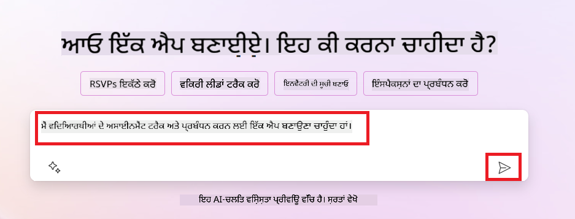

<!--
CO_OP_TRANSLATOR_METADATA:
{
  "original_hash": "f5ff3b6204a695a117d6f452403c95f7",
  "translation_date": "2025-07-09T13:54:07+00:00",
  "source_file": "10-building-low-code-ai-applications/README.md",
  "language_code": "pa"
}
-->
# Building Low Code AI Applications

> _(ਇਸ ਪਾਠ ਦਾ ਵੀਡੀਓ ਦੇਖਣ ਲਈ ਉਪਰ ਦਿੱਤੀ ਤਸਵੀਰ 'ਤੇ ਕਲਿੱਕ ਕਰੋ)_

## ਪਰਿਚਯ

ਹੁਣ ਜਦੋਂ ਅਸੀਂ ਇਮੇਜ ਬਣਾਉਣ ਵਾਲੀਆਂ ਐਪਲੀਕੇਸ਼ਨਾਂ ਬਣਾਉਣਾ ਸਿੱਖ ਲਿਆ ਹੈ, ਆਓ ਗੱਲ ਕਰੀਏ Low Code ਬਾਰੇ। Generative AI ਨੂੰ ਕਈ ਖੇਤਰਾਂ ਵਿੱਚ ਵਰਤਿਆ ਜਾ ਸਕਦਾ ਹੈ, ਜਿਸ ਵਿੱਚ Low Code ਵੀ ਸ਼ਾਮਲ ਹੈ, ਪਰ Low Code ਕੀ ਹੈ ਅਤੇ ਅਸੀਂ ਇਸ ਵਿੱਚ AI ਕਿਵੇਂ ਸ਼ਾਮਲ ਕਰ ਸਕਦੇ ਹਾਂ?

Low Code Development Platforms ਦੀ ਵਰਤੋਂ ਨਾਲ ਪਰੰਪਰਾਗਤ ਡਿਵੈਲਪਰਾਂ ਅਤੇ ਗੈਰ-ਡਿਵੈਲਪਰਾਂ ਲਈ ਐਪਸ ਅਤੇ ਹੱਲ ਬਣਾਉਣਾ ਆਸਾਨ ਹੋ ਗਿਆ ਹੈ। Low Code Development Platforms ਤੁਹਾਨੂੰ ਬਿਨਾਂ ਜ਼ਿਆਦਾ ਕੋਡ ਲਿਖੇ ਐਪਸ ਅਤੇ ਹੱਲ ਬਣਾਉਣ ਦੀ ਸਹੂਲਤ ਦਿੰਦੇ ਹਨ। ਇਹ ਇੱਕ ਵਿਜ਼ੂਅਲ ਡਿਵੈਲਪਮੈਂਟ ਵਾਤਾਵਰਣ ਪ੍ਰਦਾਨ ਕਰਕੇ ਸੰਭਵ ਹੁੰਦਾ ਹੈ, ਜਿਸ ਵਿੱਚ ਤੁਸੀਂ ਕੰਪੋਨੈਂਟਸ ਨੂੰ ਡ੍ਰੈਗ ਅਤੇ ਡ੍ਰੌਪ ਕਰਕੇ ਐਪਸ ਅਤੇ ਹੱਲ ਤਿਆਰ ਕਰ ਸਕਦੇ ਹੋ। ਇਸ ਨਾਲ ਤੁਸੀਂ ਤੇਜ਼ੀ ਨਾਲ ਅਤੇ ਘੱਟ ਸਰੋਤਾਂ ਨਾਲ ਐਪਸ ਅਤੇ ਹੱਲ ਤਿਆਰ ਕਰ ਸਕਦੇ ਹੋ। ਇਸ ਪਾਠ ਵਿੱਚ ਅਸੀਂ Low Code ਦੀ ਵਰਤੋਂ ਅਤੇ Power Platform ਦੀ ਮਦਦ ਨਾਲ AI ਦੇ ਨਾਲ Low Code ਵਿਕਾਸ ਨੂੰ ਕਿਵੇਂ ਬਿਹਤਰ ਬਣਾਇਆ ਜਾ ਸਕਦਾ ਹੈ, ਇਸ ਬਾਰੇ ਗਹਿਰਾਈ ਨਾਲ ਜਾਣਕਾਰੀ ਲਵਾਂਗੇ।

Power Platform ਸੰਗਠਨਾਂ ਨੂੰ ਆਪਣੀਆਂ ਟੀਮਾਂ ਨੂੰ ਇੱਕ ਸੌਖਾ Low Code ਜਾਂ No Code ਵਾਤਾਵਰਣ ਦੇ ਕੇ ਆਪਣੀਆਂ ਹੱਲਾਂ ਬਣਾਉਣ ਦਾ ਮੌਕਾ ਦਿੰਦਾ ਹੈ। ਇਹ ਵਾਤਾਵਰਣ ਹੱਲ ਬਣਾਉਣ ਦੀ ਪ੍ਰਕਿਰਿਆ ਨੂੰ ਸਧਾਰਨ ਬਣਾਉਂਦਾ ਹੈ। Power Platform ਨਾਲ ਹੱਲ ਦਿਨਾਂ ਜਾਂ ਹਫ਼ਤਿਆਂ ਵਿੱਚ ਬਣਾਏ ਜਾ ਸਕਦੇ ਹਨ, ਮਹੀਨਿਆਂ ਜਾਂ ਸਾਲਾਂ ਦੀ ਬਜਾਏ। Power Platform ਵਿੱਚ ਪੰਜ ਮੁੱਖ ਉਤਪਾਦ ਹਨ: Power Apps, Power Automate, Power BI, Power Pages ਅਤੇ Copilot Studio।

ਇਸ ਪਾਠ ਵਿੱਚ ਇਹ ਸਮੱਗਰੀ ਸ਼ਾਮਲ ਹੈ:

- Power Platform ਵਿੱਚ Generative AI ਦਾ ਪਰਿਚਯ  
- Copilot ਦਾ ਪਰਿਚਯ ਅਤੇ ਇਸ ਦੀ ਵਰਤੋਂ  
- Power Platform ਵਿੱਚ Generative AI ਦੀ ਵਰਤੋਂ ਕਰਕੇ ਐਪਸ ਅਤੇ ਫਲੋਜ਼ ਬਣਾਉਣਾ  
- AI Builder ਨਾਲ Power Platform ਵਿੱਚ AI ਮਾਡਲਾਂ ਦੀ ਸਮਝ

## ਸਿੱਖਣ ਦੇ ਲਕੜ

ਇਸ ਪਾਠ ਦੇ ਅੰਤ ਤੱਕ, ਤੁਸੀਂ ਸਮਰੱਥ ਹੋਵੋਗੇ:

- Power Platform ਵਿੱਚ Copilot ਕਿਵੇਂ ਕੰਮ ਕਰਦਾ ਹੈ, ਇਹ ਸਮਝਣਾ।  
- ਸਾਡੇ ਸਿੱਖਿਆ ਸਟਾਰਟਅਪ ਲਈ ਇੱਕ Student Assignment Tracker ਐਪ ਬਣਾਉਣਾ।  
- ਇਨਵੌਇਸ ਪ੍ਰੋਸੈਸਿੰਗ ਫਲੋ ਬਣਾਉਣਾ ਜੋ ਇਨਵੌਇਸਾਂ ਤੋਂ ਜਾਣਕਾਰੀ ਕੱਢਣ ਲਈ AI ਦੀ ਵਰਤੋਂ ਕਰਦਾ ਹੈ।  
- Create Text with GPT AI Model ਦੀ ਵਰਤੋਂ ਕਰਦਿਆਂ ਸਭ ਤੋਂ ਵਧੀਆ ਅਭਿਆਸ ਲਾਗੂ ਕਰਨਾ।

ਇਸ ਪਾਠ ਵਿੱਚ ਤੁਸੀਂ ਜਿਹੜੇ ਟੂਲ ਅਤੇ ਤਕਨਾਲੋਜੀ ਵਰਤੋਂਗੇ, ਉਹ ਹਨ:

- **Power Apps**, Student Assignment Tracker ਐਪ ਲਈ, ਜੋ ਐਪਸ ਬਣਾਉਣ ਲਈ ਇੱਕ Low Code ਵਿਕਾਸ ਵਾਤਾਵਰਣ ਪ੍ਰਦਾਨ ਕਰਦਾ ਹੈ ਜਿਸ ਨਾਲ ਡਾਟਾ ਨੂੰ ਟ੍ਰੈਕ, ਮੈਨੇਜ ਅਤੇ ਇੰਟਰੈਕਟ ਕੀਤਾ ਜਾ ਸਕਦਾ ਹੈ।  
- **Dataverse**, Student Assignment Tracker ਐਪ ਲਈ ਡਾਟਾ ਸਟੋਰ ਕਰਨ ਲਈ, ਜੋ ਐਪ ਦੇ ਡਾਟਾ ਲਈ ਇੱਕ Low Code ਡਾਟਾ ਪਲੇਟਫਾਰਮ ਹੈ।  
- **Power Automate**, ਇਨਵੌਇਸ ਪ੍ਰੋਸੈਸਿੰਗ ਫਲੋ ਲਈ, ਜੋ ਵਰਕਫਲੋਜ਼ ਬਣਾਉਣ ਲਈ Low Code ਵਿਕਾਸ ਵਾਤਾਵਰਣ ਪ੍ਰਦਾਨ ਕਰਦਾ ਹੈ ਤਾਂ ਜੋ ਇਨਵੌਇਸ ਪ੍ਰੋਸੈਸਿੰਗ ਪ੍ਰਕਿਰਿਆ ਨੂੰ ਆਟੋਮੇਟ ਕੀਤਾ ਜਾ ਸਕੇ।  
- **AI Builder**, ਇਨਵੌਇਸ ਪ੍ਰੋਸੈਸਿੰਗ AI ਮਾਡਲ ਲਈ, ਜਿਸ ਨਾਲ ਤੁਸੀਂ ਪਹਿਲਾਂ ਤੋਂ ਬਣਾਏ ਹੋਏ AI ਮਾਡਲਾਂ ਦੀ ਵਰਤੋਂ ਕਰਕੇ ਸਾਡੇ ਸਟਾਰਟਅਪ ਲਈ ਇਨਵੌਇਸਾਂ ਨੂੰ ਪ੍ਰੋਸੈਸ ਕਰ ਸਕਦੇ ਹੋ।

## Power Platform ਵਿੱਚ Generative AI

Low Code ਵਿਕਾਸ ਅਤੇ ਐਪਲੀਕੇਸ਼ਨਾਂ ਨੂੰ Generative AI ਨਾਲ ਬਿਹਤਰ ਬਣਾਉਣਾ Power Platform ਦਾ ਮੁੱਖ ਧਿਆਨ ਹੈ। ਮਕਸਦ ਇਹ ਹੈ ਕਿ ਹਰ ਕੋਈ AI-ਚਲਿਤ ਐਪਸ, ਸਾਈਟਾਂ, ਡੈਸ਼ਬੋਰਡ ਅਤੇ ਪ੍ਰਕਿਰਿਆਵਾਂ ਨੂੰ ਆਟੋਮੇਟ ਕਰ ਸਕੇ, _ਬਿਨਾਂ ਕਿਸੇ ਡਾਟਾ ਸਾਇੰਸ ਦੀ ਮਹਾਰਤ ਦੇ_। ਇਹ ਮਕਸਦ Copilot ਅਤੇ AI Builder ਦੇ ਰੂਪ ਵਿੱਚ Generative AI ਨੂੰ Low Code ਵਿਕਾਸ ਅਨੁਭਵ ਵਿੱਚ ਸ਼ਾਮਲ ਕਰਕੇ ਹਾਸਲ ਕੀਤਾ ਜਾਂਦਾ ਹੈ।

### ਇਹ ਕਿਵੇਂ ਕੰਮ ਕਰਦਾ ਹੈ?

Copilot ਇੱਕ AI ਸਹਾਇਕ ਹੈ ਜੋ ਤੁਹਾਨੂੰ Power Platform ਹੱਲ ਬਣਾਉਣ ਵਿੱਚ ਮਦਦ ਕਰਦਾ ਹੈ, ਜਿੱਥੇ ਤੁਸੀਂ ਆਪਣੀਆਂ ਲੋੜਾਂ ਨੂੰ ਕੁਦਰਤੀ ਭਾਸ਼ਾ ਵਿੱਚ ਗੱਲਬਾਤੀ ਕਦਮਾਂ ਰਾਹੀਂ ਦਰਸਾਉਂਦੇ ਹੋ। ਉਦਾਹਰਨ ਵਜੋਂ, ਤੁਸੀਂ ਆਪਣੇ AI ਸਹਾਇਕ ਨੂੰ ਦੱਸ ਸਕਦੇ ਹੋ ਕਿ ਤੁਹਾਡੀ ਐਪ ਕਿਹੜੇ ਫੀਲਡ ਵਰਤੇਗੀ ਅਤੇ ਇਹ ਐਪ ਅਤੇ ਉਸ ਦਾ ਡਾਟਾ ਮਾਡਲ ਦੋਹਾਂ ਤਿਆਰ ਕਰ ਦੇਵੇਗਾ, ਜਾਂ ਤੁਸੀਂ Power Automate ਵਿੱਚ ਫਲੋ ਕਿਵੇਂ ਸੈੱਟ ਕਰਨਾ ਹੈ, ਇਹ ਵੀ ਦੱਸ ਸਕਦੇ ਹੋ।

ਤੁਸੀਂ Copilot ਚਲਿਤ ਫੀਚਰਾਂ ਨੂੰ ਆਪਣੀ ਐਪ ਸਕ੍ਰੀਨਾਂ ਵਿੱਚ ਵਰਤ ਸਕਦੇ ਹੋ ਤਾਂ ਜੋ ਯੂਜ਼ਰ ਗੱਲਬਾਤੀ ਇੰਟਰੈਕਸ਼ਨਾਂ ਰਾਹੀਂ ਜਾਣਕਾਰੀਆਂ ਪ੍ਰਾਪਤ ਕਰ ਸਕਣ।

AI Builder Power Platform ਵਿੱਚ ਇੱਕ Low Code AI ਸਮਰੱਥਾ ਹੈ ਜੋ ਤੁਹਾਨੂੰ AI ਮਾਡਲਾਂ ਦੀ ਵਰਤੋਂ ਕਰਕੇ ਪ੍ਰਕਿਰਿਆਵਾਂ ਨੂੰ ਆਟੋਮੇਟ ਕਰਨ ਅਤੇ ਨਤੀਜੇ ਅੰਦਾਜ਼ਾ ਲਗਾਉਣ ਵਿੱਚ ਮਦਦ ਕਰਦੀ ਹੈ। AI Builder ਨਾਲ ਤੁਸੀਂ ਆਪਣੀਆਂ ਐਪਸ ਅਤੇ ਫਲੋਜ਼ ਵਿੱਚ AI ਲਿਆ ਸਕਦੇ ਹੋ ਜੋ Dataverse ਜਾਂ ਵੱਖ-ਵੱਖ ਕਲਾਉਡ ਡਾਟਾ ਸਰੋਤਾਂ ਜਿਵੇਂ SharePoint, OneDrive ਜਾਂ Azure ਨਾਲ ਜੁੜੇ ਹੋਏ ਹਨ।

Copilot ਸਾਰੇ Power Platform ਉਤਪਾਦਾਂ ਵਿੱਚ ਉਪਲਬਧ ਹੈ: Power Apps, Power Automate, Power BI, Power Pages ਅਤੇ Power Virtual Agents। AI Builder Power Apps ਅਤੇ Power Automate ਵਿੱਚ ਉਪਲਬਧ ਹੈ। ਇਸ ਪਾਠ ਵਿੱਚ ਅਸੀਂ Power Apps ਅਤੇ Power Automate ਵਿੱਚ Copilot ਅਤੇ AI Builder ਦੀ ਵਰਤੋਂ 'ਤੇ ਧਿਆਨ ਦੇਵਾਂਗੇ ਤਾਂ ਜੋ ਸਾਡੇ ਸਿੱਖਿਆ ਸਟਾਰਟਅਪ ਲਈ ਹੱਲ ਤਿਆਰ ਕੀਤਾ ਜਾ ਸਕੇ।

### Power Apps ਵਿੱਚ Copilot

Power Platform ਦੇ ਹਿੱਸੇ ਵਜੋਂ, Power Apps ਇੱਕ Low Code ਵਿਕਾਸ ਵਾਤਾਵਰਣ ਪ੍ਰਦਾਨ ਕਰਦਾ ਹੈ ਜੋ ਡਾਟਾ ਨੂੰ ਟ੍ਰੈਕ, ਮੈਨੇਜ ਅਤੇ ਇੰਟਰੈਕਟ ਕਰਨ ਵਾਲੀਆਂ ਐਪਸ ਬਣਾਉਣ ਲਈ ਹੈ। ਇਹ ਐਪ ਵਿਕਾਸ ਸੇਵਾਵਾਂ ਦਾ ਇੱਕ ਸੂਟ ਹੈ ਜਿਸ ਵਿੱਚ ਇੱਕ ਸਕੇਲ ਕਰਨ ਯੋਗ ਡਾਟਾ ਪਲੇਟਫਾਰਮ ਅਤੇ ਕਲਾਉਡ ਸੇਵਾਵਾਂ ਅਤੇ ਓਨ-ਪ੍ਰੇਮਿਸ ਡਾਟਾ ਨਾਲ ਜੁੜਨ ਦੀ ਸਮਰੱਥਾ ਹੈ। Power Apps ਤੁਹਾਨੂੰ ਐਪਸ ਬਣਾਉਣ ਦੀ ਆਗਿਆ ਦਿੰਦਾ ਹੈ ਜੋ ਬ੍ਰਾਊਜ਼ਰ, ਟੈਬਲੇਟ ਅਤੇ ਫੋਨ 'ਤੇ ਚੱਲ ਸਕਦੀਆਂ ਹਨ ਅਤੇ ਸਹਿਕਰਮੀਆਂ ਨਾਲ ਸਾਂਝੀਆਂ ਕੀਤੀਆਂ ਜਾ ਸਕਦੀਆਂ ਹਨ। Power Apps ਸਧਾਰਣ ਇੰਟਰਫੇਸ ਨਾਲ ਯੂਜ਼ਰਾਂ ਨੂੰ ਐਪ ਵਿਕਾਸ ਵਿੱਚ ਆਸਾਨੀ ਦਿੰਦਾ ਹੈ, ਤਾਂ ਜੋ ਹਰ ਕਾਰੋਬਾਰੀ ਯੂਜ਼ਰ ਜਾਂ ਪ੍ਰੋ ਡਿਵੈਲਪਰ ਆਪਣੀਆਂ ਕਸਟਮ ਐਪਸ ਬਣਾ ਸਕੇ। Generative AI ਦੇ ਜ਼ਰੀਏ Copilot ਨਾਲ ਇਹ ਅਨੁਭਵ ਹੋਰ ਵੀ ਬਿਹਤਰ ਬਣਾਇਆ ਗਿਆ ਹੈ।

Power Apps ਵਿੱਚ Copilot AI ਸਹਾਇਕ ਫੀਚਰ ਤੁਹਾਨੂੰ ਦੱਸਣ ਦੀ ਆਗਿਆ ਦਿੰਦਾ ਹੈ ਕਿ ਤੁਹਾਨੂੰ ਕਿਸ ਤਰ੍ਹਾਂ ਦੀ ਐਪ ਚਾਹੀਦੀ ਹੈ ਅਤੇ ਤੁਹਾਡੀ ਐਪ ਕਿਹੜੀ ਜਾਣਕਾਰੀ ਟ੍ਰੈਕ, ਇਕੱਠੀ ਜਾਂ ਦਿਖਾਉਣੀ ਚਾਹੁੰਦੀ ਹੈ। Copilot ਤੁਹਾਡੇ ਵਰਣਨ ਦੇ ਆਧਾਰ 'ਤੇ ਇੱਕ ਰਿਸਪਾਂਸਿਵ Canvas ਐਪ ਤਿਆਰ ਕਰਦਾ ਹੈ। ਤੁਸੀਂ ਫਿਰ ਆਪਣੀਆਂ ਲੋੜਾਂ ਮੁਤਾਬਕ ਐਪ ਨੂੰ ਕਸਟਮਾਈਜ਼ ਕਰ ਸਕਦੇ ਹੋ। AI Copilot ਇੱਕ Dataverse ਟੇਬਲ ਵੀ ਤਿਆਰ ਕਰਦਾ ਹੈ ਜਿਸ ਵਿੱਚ ਉਹ ਫੀਲਡ ਸ਼ਾਮਲ ਹੁੰਦੇ ਹਨ ਜਿਹੜੇ ਤੁਹਾਨੂੰ ਡਾਟਾ ਸਟੋਰ ਕਰਨ ਲਈ ਚਾਹੀਦੇ ਹਨ ਅਤੇ ਕੁਝ ਨਮੂਨਾ ਡਾਟਾ ਵੀ। ਅਸੀਂ ਇਸ ਪਾਠ ਵਿੱਚ ਬਾਅਦ ਵਿੱਚ ਵੇਖਾਂਗੇ ਕਿ Dataverse ਕੀ ਹੈ ਅਤੇ ਤੁਸੀਂ ਇਸਨੂੰ Power Apps ਵਿੱਚ ਕਿਵੇਂ ਵਰਤ ਸਕਦੇ ਹੋ। ਤੁਸੀਂ AI Copilot ਸਹਾਇਕ ਫੀਚਰ ਰਾਹੀਂ ਗੱਲਬਾਤੀ ਕਦਮਾਂ ਨਾਲ ਟੇਬਲ ਨੂੰ ਆਪਣੀਆਂ ਲੋੜਾਂ ਅਨੁਸਾਰ ਕਸਟਮਾਈਜ਼ ਕਰ ਸਕਦੇ ਹੋ। ਇਹ ਫੀਚਰ Power Apps ਦੇ ਹੋਮ ਸਕ੍ਰੀਨ ਤੋਂ ਸਿੱਧਾ ਉਪਲਬਧ ਹੈ।

### Power Automate ਵਿੱਚ Copilot

Power Platform ਦੇ ਹਿੱਸੇ ਵਜੋਂ, Power Automate ਯੂਜ਼ਰਾਂ ਨੂੰ ਐਪਲੀਕੇਸ਼ਨਾਂ ਅਤੇ ਸੇਵਾਵਾਂ ਵਿਚਕਾਰ ਆਟੋਮੇਟਿਕ ਵਰਕਫਲੋਜ਼ ਬਣਾਉਣ ਦੀ ਆਗਿਆ ਦਿੰਦਾ ਹੈ। ਇਹ ਦੁਹਰਾਏ ਜਾਣ ਵਾਲੇ ਕਾਰੋਬਾਰੀ ਪ੍ਰਕਿਰਿਆਵਾਂ ਜਿਵੇਂ ਕਿ ਸੰਚਾਰ, ਡਾਟਾ ਇਕੱਠਾ ਕਰਨਾ ਅਤੇ ਫੈਸਲਾ ਮਨਜ਼ੂਰੀਆਂ ਨੂੰ ਆਟੋਮੇਟ ਕਰਨ ਵਿੱਚ ਮਦਦ ਕਰਦਾ ਹੈ। ਇਸਦਾ ਸਧਾਰਣ ਇੰਟਰਫੇਸ ਹਰ ਤਕਨੀਕੀ ਪੱਧਰ ਦੇ ਯੂਜ਼ਰਾਂ (ਨਵੀਂ ਸ਼ੁਰੂਆਤ ਕਰਨ ਵਾਲਿਆਂ ਤੋਂ ਲੈ ਕੇ ਤਜਰਬੇਕਾਰ ਡਿਵੈਲਪਰਾਂ ਤੱਕ) ਨੂੰ ਕੰਮ ਆਟੋਮੇਟ ਕਰਨ ਦੀ ਆਸਾਨੀ ਦਿੰਦਾ ਹੈ। ਵਰਕਫਲੋ ਵਿਕਾਸ ਅਨੁਭਵ ਨੂੰ ਵੀ Generative AI ਦੇ ਜ਼ਰੀਏ Copilot ਨਾਲ ਬਿਹਤਰ ਬਣਾਇਆ ਗਿਆ ਹੈ।

Power Automate ਵਿੱਚ Copilot AI ਸਹਾਇਕ ਫੀਚਰ ਤੁਹਾਨੂੰ ਦੱਸਣ ਦੀ ਆਗਿਆ ਦਿੰਦਾ ਹੈ ਕਿ ਤੁਹਾਨੂੰ ਕਿਸ ਤਰ੍ਹਾਂ ਦਾ ਫਲੋ ਚਾਹੀਦਾ ਹੈ ਅਤੇ ਤੁਹਾਡਾ ਫਲੋ ਕਿਹੜੇ ਕਾਰਜ ਕਰਨਗਾ। Copilot ਤੁਹਾਡੇ ਵਰਣਨ ਦੇ ਆਧਾਰ 'ਤੇ ਇੱਕ ਫਲੋ ਤਿਆਰ ਕਰਦਾ ਹੈ। ਤੁਸੀਂ ਫਿਰ ਆਪਣੀਆਂ ਲੋੜਾਂ ਅਨੁਸਾਰ ਫਲੋ ਨੂੰ ਕਸਟਮਾਈਜ਼ ਕਰ ਸਕਦੇ ਹੋ। AI Copilot ਉਹ ਕਾਰਵਾਈਆਂ ਵੀ ਤਿਆਰ ਅਤੇ ਸੁਝਾਅ ਦਿੰਦਾ ਹੈ ਜੋ ਤੁਹਾਨੂੰ ਆਪਣੇ ਆਟੋਮੇਸ਼ਨ ਲਈ ਕਰਨੀਆਂ ਚਾਹੀਦੀਆਂ ਹਨ। ਅਸੀਂ ਇਸ ਪਾਠ ਵਿੱਚ ਬਾਅਦ ਵਿੱਚ ਵੇਖਾਂਗੇ ਕਿ ਫਲੋਜ਼ ਕੀ ਹਨ ਅਤੇ ਤੁਸੀਂ Power Automate ਵਿੱਚ ਕਿਵੇਂ ਵਰਤ ਸਕਦੇ ਹੋ। ਤੁਸੀਂ AI Copilot ਸਹਾਇਕ ਫੀਚਰ ਰਾਹੀਂ ਗੱਲਬਾਤੀ ਕਦਮਾਂ ਨਾਲ ਕਾਰਵਾਈਆਂ ਨੂੰ ਆਪਣੀਆਂ ਲੋੜਾਂ ਅਨੁਸਾਰ ਕਸਟਮਾਈਜ਼ ਕਰ ਸਕਦੇ ਹੋ। ਇਹ ਫੀਚਰ Power Automate ਦੇ ਹੋਮ ਸਕ੍ਰੀਨ ਤੋਂ ਸਿੱਧਾ ਉਪਲਬਧ ਹੈ।

## ਅਸਾਈਨਮੈਂਟ: ਸਾਡੇ ਸਟਾਰਟਅਪ ਲਈ ਵਿਦਿਆਰਥੀ ਅਸਾਈਨਮੈਂਟ ਅਤੇ ਇਨਵੌਇਸਾਂ ਦਾ ਪ੍ਰਬੰਧਨ, Copilot ਦੀ ਵਰਤੋਂ ਨਾਲ

ਸਾਡਾ ਸਟਾਰਟਅਪ ਵਿਦਿਆਰਥੀਆਂ ਨੂੰ ਆਨਲਾਈਨ ਕੋਰਸ ਪ੍ਰਦਾਨ ਕਰਦਾ ਹੈ। ਸਟਾਰਟਅਪ ਤੇਜ਼ੀ ਨਾਲ ਵਧ ਰਿਹਾ ਹੈ ਅਤੇ ਹੁਣ ਆਪਣੇ ਕੋਰਸਾਂ ਦੀ ਮੰਗ ਨੂੰ ਪੂਰਾ ਕਰਨ ਵਿੱਚ ਮੁਸ਼ਕਲਾਂ ਦਾ ਸਾਹਮਣਾ ਕਰ ਰਿਹਾ ਹੈ। ਸਟਾਰਟਅਪ ਨੇ ਤੁਹਾਨੂੰ Power Platform ਡਿਵੈਲਪਰ ਵਜੋਂ ਨਿਯੁਕਤ ਕੀਤਾ ਹੈ ਤਾਂ ਜੋ ਉਹਨਾਂ ਦੀ ਮਦਦ ਕਰ ਸਕੋ ਇੱਕ Low Code ਹੱਲ ਬਣਾਉਣ ਵਿੱਚ ਜੋ ਵਿਦਿਆਰਥੀ ਅਸਾਈਨਮੈਂਟ ਅਤੇ ਇਨਵੌਇਸਾਂ ਦਾ ਪ੍ਰਬੰਧਨ ਕਰ ਸਕੇ। ਉਹਨਾਂ ਦਾ ਹੱਲ ਇੱਕ ਐਪ ਰਾਹੀਂ ਵਿਦਿਆਰਥੀ ਅਸਾਈਨਮੈਂਟ ਟ੍ਰੈਕ ਅਤੇ ਮੈਨੇਜ ਕਰਨ ਅਤੇ ਇੱਕ ਵਰਕਫਲੋ ਰਾਹੀਂ ਇਨਵੌਇਸ ਪ੍ਰੋਸੈਸਿੰਗ ਪ੍ਰਕਿਰਿਆ ਨੂੰ ਆਟੋਮੇਟ ਕਰਨ ਯੋਗ ਹੋਣਾ ਚਾਹੀਦਾ ਹੈ। ਤੁਹਾਨੂੰ Generative AI ਦੀ ਵਰਤੋਂ ਕਰਕੇ ਇਹ ਹੱਲ ਵਿਕਸਿਤ ਕਰਨ ਲਈ ਕਿਹਾ ਗਿਆ ਹੈ।

ਜਦੋਂ ਤੁਸੀਂ Copilot ਦੀ ਵਰਤੋਂ ਸ਼ੁਰੂ ਕਰ ਰਹੇ ਹੋ, ਤਾਂ ਤੁਸੀਂ [Power Platform Copilot Prompt Library](https://github.com/pnp/powerplatform-prompts?WT.mc_id=academic-109639-somelezediko) ਦੀ ਮਦਦ ਲੈ ਸਕਦੇ ਹੋ। ਇਸ ਲਾਇਬ੍ਰੇਰੀ ਵਿੱਚ ਉਹ ਪ੍ਰਾਂਪਟਸ ਹਨ ਜੋ ਤੁਸੀਂ Copilot ਨਾਲ ਐਪਸ ਅਤੇ ਫਲੋਜ਼ ਬਣਾਉਣ ਲਈ ਵਰਤ ਸਕਦੇ ਹੋ। ਤੁਸੀਂ ਇਸ ਲਾਇਬ੍ਰੇਰੀ ਦੇ ਪ੍ਰਾਂਪਟਸ ਦੀ ਵਰਤੋਂ ਕਰਕੇ ਇਹ ਵੀ ਸਮਝ ਸਕਦੇ ਹੋ ਕਿ Copilot ਨੂੰ ਆਪਣੀਆਂ ਲੋੜਾਂ ਕਿਵੇਂ ਦਰਸਾਉਣੀਆਂ ਹਨ।

### ਸਾਡੇ ਸਟਾਰਟਅਪ ਲਈ Student Assignment Tracker ਐਪ ਬਣਾਉਣਾ

ਸਾਡੇ ਸਟਾਰਟਅਪ ਦੇ ਸਿੱਖਿਆਦਾਤਾ ਵਿਦਿਆਰਥੀ ਅਸਾਈਨਮੈਂਟ ਟ੍ਰੈਕ ਕਰਨ ਵਿੱਚ ਮੁਸ਼ਕਲਾਂ ਦਾ ਸਾਹਮਣਾ ਕਰ ਰਹੇ ਹਨ। ਉਹ ਅਸਾਈਨਮੈਂਟ ਟ੍ਰੈਕ ਕਰਨ ਲਈ ਸਪ੍ਰੈਡਸ਼ੀਟ ਵਰਤ ਰਹੇ ਸਨ ਪਰ ਵਿਦਿਆਰਥੀਆਂ ਦੀ ਗਿਣਤੀ ਵਧਣ ਨਾਲ ਇਹ ਪ੍ਰਬੰਧਨ ਮੁਸ਼ਕਲ ਹੋ ਗਿਆ ਹੈ। ਉਹਨਾਂ ਨੇ ਤੁਹਾਨੂੰ ਇੱਕ ਐਪ ਬਣਾਉਣ ਲਈ ਕਿਹਾ ਹੈ ਜੋ ਉਹਨਾਂ ਨੂੰ ਅਸਾਈਨਮੈਂਟ ਟ੍ਰੈਕ ਅਤੇ ਮੈਨੇਜ ਕਰਨ ਵਿੱਚ ਮਦਦ ਕਰੇ। ਐਪ ਵਿੱਚ ਨਵੇਂ ਅਸਾਈਨਮੈਂਟ ਸ਼ਾਮਲ ਕਰਨ, ਅਸਾਈਨਮੈਂਟ ਵੇਖਣ, ਅਪਡੇਟ ਕਰਨ ਅਤੇ ਮਿਟਾਉਣ ਦੀ ਸਮਰੱਥਾ ਹੋਣੀ ਚਾਹੀਦੀ ਹੈ। ਐਪ ਸਿੱਖਿਆਦਾਤਾ ਅਤੇ ਵਿਦਿਆਰਥੀਆਂ ਨੂੰ ਇਹ ਵੀ ਦਿਖਾ ਸਕੇ ਕਿ ਕਿਹੜੇ ਅਸਾਈਨਮੈਂਟ ਗ੍ਰੇਡ ਕੀਤੇ ਗਏ ਹਨ ਅਤੇ ਕਿਹੜੇ ਨਹੀਂ।

ਤੁਸੀਂ Copilot ਦੀ ਵਰਤੋਂ ਕਰਕੇ Power Apps ਵਿੱਚ ਹੇਠਾਂ ਦਿੱਤੇ ਕਦਮਾਂ ਦੀ ਪਾਲਣਾ ਕਰਦੇ ਹੋਏ ਇਹ ਐਪ ਬਣਾਉਗੇ:

1. [Power Apps](https://make.powerapps.com?WT.mc_id=academic-105485-koreyst) ਦੇ ਹੋਮ ਸਕ੍ਰੀਨ 'ਤੇ ਜਾਓ।

2. ਹੋਮ ਸਕ੍ਰੀਨ ਦੇ ਟੈਕਸਟ ਖੇਤਰ ਵਿੱਚ ਆਪਣੀ ਐਪ ਦਾ ਵਰਣਨ ਕਰੋ। ਉਦਾਹਰਨ ਵਜੋਂ, **_ਮੈਂ ਇੱਕ ਐਪ ਬਣਾਉਣਾ ਚਾਹੁੰਦਾ ਹਾਂ ਜੋ ਵਿਦਿਆਰਥੀ ਅਸਾਈਨਮੈਂਟ ਟ੍ਰੈਕ ਅਤੇ ਮੈਨੇਜ ਕਰੇ_**। AI Copilot ਨੂੰ ਪ੍ਰਾਂਪਟ ਭੇਜਣ ਲਈ **Send** ਬਟਨ 'ਤੇ ਕਲਿੱਕ ਕਰੋ।

3. AI Copilot ਤੁਹਾਡੇ ਲਈ Dataverse ਟੇਬਲ ਸੁਝਾਏਗਾ ਜਿਸ ਵਿੱਚ ਉਹ ਫੀਲਡ ਸ਼ਾਮਲ ਹੋਣਗੇ ਜੋ ਤੁਹਾਨੂੰ ਡਾਟਾ ਸਟੋਰ ਕਰਨ ਲਈ ਚਾਹੀਦੇ ਹਨ ਅਤੇ ਕੁਝ ਨਮੂਨਾ ਡਾਟਾ ਵੀ। ਤੁਸੀਂ AI Copilot ਸਹਾਇਕ ਫੀਚਰ ਰਾਹੀਂ ਗੱਲਬਾਤੀ ਕਦਮਾਂ ਨਾਲ ਟੇਬਲ ਨੂੰ ਆਪਣੀਆਂ ਲੋੜਾਂ ਅਨੁਸਾਰ ਕਸਟਮਾਈਜ਼ ਕਰ ਸਕਦੇ ਹੋ।

   > **Important**: Dataverse Power Platform ਲਈ ਅਧਾਰਭੂਤ ਡਾਟਾ ਪਲੇਟਫਾਰਮ ਹੈ। ਇਹ ਐਪ ਦੇ ਡਾਟਾ ਨੂੰ ਸੁਰੱਖਿਅਤ ਤਰੀਕੇ ਨਾਲ Microsoft Cloud ਵਿੱਚ ਸਟੋਰ ਕਰਨ ਲਈ ਇੱਕ Low Code ਡਾਟਾ ਪਲੇਟਫਾਰਮ ਹੈ ਅਤੇ ਤੁਹਾਡੇ Power Platform ਵਾਤਾਵਰਣ ਵਿੱਚ ਪ੍ਰੋਵਿਜ਼ਨ ਕੀਤਾ ਜਾਂਦਾ ਹੈ। ਇਸ ਵਿੱਚ ਡਾਟਾ ਵਰਗੀਕਰਨ, ਡਾਟਾ ਲੀਨੇਜ, ਬਰੀਕ-ਬਰੀਕ ਪਹੁੰਚ ਨਿਯੰਤਰਣ ਅਤੇ ਹੋਰ ਡਾਟਾ ਗਵਰਨੈਂਸ ਸਮਰੱਥਾਵਾਂ ਸ਼ਾਮਲ ਹਨ। ਤੁਸੀਂ Dataverse ਬਾਰੇ ਹੋਰ ਜਾਣਕਾਰੀ [ਇੱਥੇ](https://docs.microsoft.com
IMPORTANT RULES:  
1. ਅਨੁਵਾਦ ਦੇ ਆਲੇ-ਦੁਆਲੇ '''markdown ਜਾਂ ਹੋਰ ਕਿਸੇ ਟੈਗ ਨੂੰ ਨਾ ਜੋੜੋ  
2. ਯਕੀਨੀ ਬਣਾਓ ਕਿ ਅਨੁਵਾਦ ਬਹੁਤ ਜ਼ਿਆਦਾ ਸ਼ਾਬਦਿਕ ਨਾ ਲੱਗੇ  
3. ਟਿੱਪਣੀਆਂ ਦਾ ਵੀ ਅਨੁਵਾਦ ਕਰੋ  
4. ਇਹ ਫਾਈਲ Markdown ਫਾਰਮੈਟ ਵਿੱਚ ਹੈ - ਇਸਨੂੰ XML ਜਾਂ HTML ਵਾਂਗ ਨਾ ਸਮਝੋ  
5. ਅਨੁਵਾਦ ਨਾ ਕਰੋ:  
   - [!NOTE], [!WARNING], [!TIP], [!IMPORTANT], [!CAUTION]  
   - ਵੈਰੀਏਬਲ ਨਾਮ, ਫੰਕਸ਼ਨ ਨਾਮ, ਕਲਾਸ ਨਾਮ  
   - ਜਗ੍ਹਾ ਰੱਖਣ ਵਾਲੇ ਜਿਵੇਂ @@INLINE_CODE_x@@ ਜਾਂ @@CODE_BLOCK_x@@  
   - URLs ਜਾਂ ਪਾਥ  
6. ਸਾਰੇ ਮੂਲ Markdown ਫਾਰਮੈਟਿੰਗ ਨੂੰ ਬਰਕਰਾਰ ਰੱਖੋ  
7. ਸਿਰਫ ਅਨੁਵਾਦਿਤ ਸਮੱਗਰੀ ਵਾਪਸ ਕਰੋ, ਕੋਈ ਵਾਧੂ ਟੈਗ ਜਾਂ ਮਾਰਕਅੱਪ ਨਾ ਜੋੜੋ  
ਕਿਰਪਾ ਕਰਕੇ ਨਤੀਜਾ ਖੱਬੇ ਤੋਂ ਸੱਜੇ ਲਿਖੋ।  

- **ਸੌਖਾ ਪ੍ਰਬੰਧਨ**: ਮੈਟਾਡੇਟਾ ਅਤੇ ਡੇਟਾ ਦੋਹਾਂ ਨੂੰ ਕਲਾਉਡ ਵਿੱਚ ਸਟੋਰ ਕੀਤਾ ਜਾਂਦਾ ਹੈ, ਇਸ ਲਈ ਤੁਹਾਨੂੰ ਇਹ ਚਿੰਤਾ ਕਰਨ ਦੀ ਲੋੜ ਨਹੀਂ ਕਿ ਇਹ ਕਿਵੇਂ ਸਟੋਰ ਜਾਂ ਪ੍ਰਬੰਧਿਤ ਕੀਤੇ ਜਾਂਦੇ ਹਨ। ਤੁਸੀਂ ਆਪਣੇ ਐਪਸ ਅਤੇ ਹੱਲਾਂ ਬਣਾਉਣ 'ਤੇ ਧਿਆਨ ਕੇਂਦਰਿਤ ਕਰ ਸਕਦੇ ਹੋ।  

- **ਸੁਰੱਖਿਅਤ**: Dataverse ਤੁਹਾਡੇ ਡੇਟਾ ਲਈ ਇੱਕ ਸੁਰੱਖਿਅਤ ਅਤੇ ਕਲਾਉਡ-ਆਧਾਰਿਤ ਸਟੋਰੇਜ ਵਿਕਲਪ ਪ੍ਰਦਾਨ ਕਰਦਾ ਹੈ। ਤੁਸੀਂ ਨਿਯੰਤਰਿਤ ਕਰ ਸਕਦੇ ਹੋ ਕਿ ਕੌਣ ਤੁਹਾਡੇ ਟੇਬਲਾਂ ਦੇ ਡੇਟਾ ਤੱਕ ਪਹੁੰਚ ਰੱਖਦਾ ਹੈ ਅਤੇ ਉਹ ਕਿਵੇਂ ਪਹੁੰਚ ਕਰ ਸਕਦਾ ਹੈ, ਰੋਲ-ਆਧਾਰਿਤ ਸੁਰੱਖਿਆ ਦੀ ਵਰਤੋਂ ਕਰਕੇ।  

- **ਧਨਾਢ ਮੈਟਾਡੇਟਾ**: ਡੇਟਾ ਕਿਸਮਾਂ ਅਤੇ ਸੰਬੰਧ Power Apps ਵਿੱਚ ਸਿੱਧਾ ਵਰਤੇ ਜਾਂਦੇ ਹਨ।  

- **ਲਾਜਿਕ ਅਤੇ ਵੈਰੀਫਿਕੇਸ਼ਨ**: ਤੁਸੀਂ ਬਿਜ਼ਨਸ ਰੂਲ, ਕੈਲਕੁਲੇਟਿਡ ਫੀਲਡ ਅਤੇ ਵੈਰੀਫਿਕੇਸ਼ਨ ਰੂਲ ਦੀ ਵਰਤੋਂ ਕਰਕੇ ਕਾਰੋਬਾਰੀ ਲਾਜਿਕ ਨੂੰ ਲਾਗੂ ਕਰ ਸਕਦੇ ਹੋ ਅਤੇ ਡੇਟਾ ਦੀ ਸਹੀਤਾ ਬਣਾਈ ਰੱਖ ਸਕਦੇ ਹੋ।  

ਹੁਣ ਜਦੋਂ ਤੁਹਾਨੂੰ ਪਤਾ ਹੈ ਕਿ Dataverse ਕੀ ਹੈ ਅਤੇ ਤੁਸੀਂ ਇਸਨੂੰ ਕਿਉਂ ਵਰਤਣਾ ਚਾਹੀਦਾ ਹੈ, ਆਓ ਵੇਖੀਏ ਕਿ ਤੁਸੀਂ Copilot ਦੀ ਵਰਤੋਂ ਕਰਕੇ ਕਿਵੇਂ Dataverse ਵਿੱਚ ਇੱਕ ਟੇਬਲ ਬਣਾ ਸਕਦੇ ਹੋ ਜੋ ਸਾਡੇ ਫਾਇਨੈਂਸ ਟੀਮ ਦੀਆਂ ਜ਼ਰੂਰਤਾਂ ਨੂੰ ਪੂਰਾ ਕਰੇ।  

> **Note** : ਤੁਸੀਂ ਇਸ ਟੇਬਲ ਨੂੰ ਅਗਲੇ ਭਾਗ ਵਿੱਚ ਵਰਤੋਂਗੇ ਤਾਂ ਜੋ ਇੱਕ ਆਟੋਮੇਸ਼ਨ ਬਣਾਈ ਜਾ ਸਕੇ ਜੋ ਸਾਰੇ ਇਨਵੌਇਸ ਜਾਣਕਾਰੀ ਨੂੰ ਕੱਢ ਕੇ ਟੇਬਲ ਵਿੱਚ ਸਟੋਰ ਕਰੇ।  

Copilot ਦੀ ਵਰਤੋਂ ਕਰਕੇ Dataverse ਵਿੱਚ ਟੇਬਲ ਬਣਾਉਣ ਲਈ ਹੇਠਾਂ ਦਿੱਤੇ ਕਦਮਾਂ ਦੀ ਪਾਲਣਾ ਕਰੋ:  

1. [Power Apps](https://make.powerapps.com?WT.mc_id=academic-105485-koreyst) ਦੇ ਹੋਮ ਸਕ੍ਰੀਨ 'ਤੇ ਜਾਓ।  

2. ਖੱਬੇ ਨੈਵੀਗੇਸ਼ਨ ਬਾਰ 'ਤੇ **Tables** ਚੁਣੋ ਅਤੇ ਫਿਰ **Describe the new Table** 'ਤੇ ਕਲਿੱਕ ਕਰੋ।  

  

3. **Describe the new Table** ਸਕ੍ਰੀਨ 'ਤੇ, ਟੈਕਸਟ ਖੇਤਰ ਵਿੱਚ ਉਸ ਟੇਬਲ ਦਾ ਵੇਰਵਾ ਦਿਓ ਜੋ ਤੁਸੀਂ ਬਣਾਉਣਾ ਚਾਹੁੰਦੇ ਹੋ। ਉਦਾਹਰਨ ਵਜੋਂ, **_ਮੈਂ ਇਨਵੌਇਸ ਜਾਣਕਾਰੀ ਸਟੋਰ ਕਰਨ ਲਈ ਇੱਕ ਟੇਬਲ ਬਣਾਉਣਾ ਚਾਹੁੰਦਾ ਹਾਂ_**। AI Copilot ਨੂੰ ਪ੍ਰਾਂਪਟ ਭੇਜਣ ਲਈ **Send** ਬਟਨ 'ਤੇ ਕਲਿੱਕ ਕਰੋ।  

  

4. AI Copilot ਤੁਹਾਡੇ ਲਈ Dataverse ਟੇਬਲ ਦਾ ਸੁਝਾਅ ਦੇਵੇਗਾ ਜਿਸ ਵਿੱਚ ਉਹ ਫੀਲਡ ਸ਼ਾਮਲ ਹੋਣਗੇ ਜੋ ਤੁਹਾਨੂੰ ਡੇਟਾ ਟ੍ਰੈਕ ਕਰਨ ਲਈ ਚਾਹੀਦੇ ਹਨ ਅਤੇ ਕੁਝ ਨਮੂਨਾ ਡੇਟਾ ਵੀ। ਤੁਸੀਂ AI Copilot ਸਹਾਇਕ ਫੀਚਰ ਦੀ ਵਰਤੋਂ ਕਰਕੇ ਗੱਲਬਾਤੀ ਕਦਮਾਂ ਰਾਹੀਂ ਟੇਬਲ ਨੂੰ ਆਪਣੀਆਂ ਜ਼ਰੂਰਤਾਂ ਅਨੁਸਾਰ ਕਸਟਮਾਈਜ਼ ਕਰ ਸਕਦੇ ਹੋ।  

  

5. ਫਾਇਨੈਂਸ ਟੀਮ ਸਪਲਾਇਰ ਨੂੰ ਈਮੇਲ ਭੇਜ ਕੇ ਉਹਨਾਂ ਨੂੰ ਆਪਣੇ ਇਨਵੌਇਸ ਦੀ ਮੌਜੂਦਾ ਸਥਿਤੀ ਬਾਰੇ ਅਪਡੇਟ ਕਰਨਾ ਚਾਹੁੰਦੀ ਹੈ। ਤੁਸੀਂ Copilot ਦੀ ਵਰਤੋਂ ਕਰਕੇ ਟੇਬਲ ਵਿੱਚ ਸਪਲਾਇਰ ਈਮੇਲ ਸਟੋਰ ਕਰਨ ਲਈ ਇੱਕ ਨਵਾਂ ਫੀਲਡ ਜੋੜ ਸਕਦੇ ਹੋ। ਉਦਾਹਰਨ ਵਜੋਂ, ਤੁਸੀਂ ਇਹ ਪ੍ਰਾਂਪਟ ਭੇਜ ਸਕਦੇ ਹੋ: **_ਮੈਂ ਸਪਲਾਇਰ ਈਮੇਲ ਸਟੋਰ ਕਰਨ ਲਈ ਇੱਕ ਕਾਲਮ ਜੋੜਨਾ ਚਾਹੁੰਦਾ ਹਾਂ_**। AI Copilot ਨੂੰ ਭੇਜਣ ਲਈ **Send** 'ਤੇ ਕਲਿੱਕ ਕਰੋ।  

6. AI Copilot ਇੱਕ ਨਵਾਂ ਫੀਲਡ ਬਣਾਏਗਾ ਅਤੇ ਤੁਸੀਂ ਇਸਨੂੰ ਆਪਣੀਆਂ ਜ਼ਰੂਰਤਾਂ ਅਨੁਸਾਰ ਕਸਟਮਾਈਜ਼ ਕਰ ਸਕਦੇ ਹੋ।  

7. ਜਦੋਂ ਤੁਸੀਂ ਟੇਬਲ ਨਾਲ ਕੰਮ ਮੁਕੰਮਲ ਕਰ ਲਵੋ, ਤਾਂ ਟੇਬਲ ਬਣਾਉਣ ਲਈ **Create** ਬਟਨ 'ਤੇ ਕਲਿੱਕ ਕਰੋ।  

## Power Platform ਵਿੱਚ AI ਮਾਡਲ AI Builder ਨਾਲ  

AI Builder Power Platform ਵਿੱਚ ਇੱਕ ਲੋ-ਕੋਡ AI ਸਮਰੱਥਾ ਹੈ ਜੋ ਤੁਹਾਨੂੰ AI ਮਾਡਲ ਦੀ ਵਰਤੋਂ ਕਰਕੇ ਪ੍ਰਕਿਰਿਆਵਾਂ ਨੂੰ ਆਟੋਮੇਟ ਕਰਨ ਅਤੇ ਨਤੀਜੇ ਭਵਿੱਖਬਾਣੀ ਕਰਨ ਵਿੱਚ ਮਦਦ ਕਰਦੀ ਹੈ। AI Builder ਨਾਲ ਤੁਸੀਂ ਆਪਣੇ ਐਪਸ ਅਤੇ ਫਲੋਜ਼ ਵਿੱਚ AI ਲਿਆ ਸਕਦੇ ਹੋ ਜੋ Dataverse ਜਾਂ ਵੱਖ-ਵੱਖ ਕਲਾਉਡ ਡੇਟਾ ਸਰੋਤਾਂ ਜਿਵੇਂ SharePoint, OneDrive ਜਾਂ Azure ਨਾਲ ਜੁੜੇ ਹੋਏ ਹਨ।  

## Prebuilt AI Models ਅਤੇ Custom AI Models  

AI Builder ਦੋ ਕਿਸਮਾਂ ਦੇ AI ਮਾਡਲ ਪ੍ਰਦਾਨ ਕਰਦਾ ਹੈ: Prebuilt AI Models ਅਤੇ Custom AI Models। Prebuilt AI Models Microsoft ਵੱਲੋਂ ਤਿਆਰ ਕੀਤੇ ਗਏ ਅਤੇ Power Platform ਵਿੱਚ ਉਪਲਬਧ ਤਿਆਰ-ਤੋਂ-ਵਰਤੋਂ ਵਾਲੇ ਮਾਡਲ ਹਨ। ਇਹ ਤੁਹਾਡੇ ਐਪਸ ਅਤੇ ਫਲੋਜ਼ ਵਿੱਚ ਬਿਨਾਂ ਡੇਟਾ ਇਕੱਠਾ ਕੀਤੇ ਅਤੇ ਆਪਣੇ ਮਾਡਲ ਬਣਾਉਣ, ਟ੍ਰੇਨ ਕਰਨ ਅਤੇ ਪ੍ਰਕਾਸ਼ਿਤ ਕਰਨ ਦੇ ਬਿਨਾਂ ਬੁੱਧੀਮਾਨੀ ਜੋੜਨ ਵਿੱਚ ਮਦਦ ਕਰਦੇ ਹਨ। ਤੁਸੀਂ ਇਹ ਮਾਡਲ ਪ੍ਰਕਿਰਿਆਵਾਂ ਨੂੰ ਆਟੋਮੇਟ ਕਰਨ ਅਤੇ ਨਤੀਜੇ ਭਵਿੱਖਬਾਣੀ ਕਰਨ ਲਈ ਵਰਤ ਸਕਦੇ ਹੋ।  

Power Platform ਵਿੱਚ ਕੁਝ ਪ੍ਰੀਬਿਲਟ AI ਮਾਡਲ ਹਨ:  

- **Key Phrase Extraction**: ਇਹ ਮਾਡਲ ਟੈਕਸਟ ਵਿੱਚੋਂ ਮੁੱਖ ਵਾਕਾਂਸ਼ ਕੱਢਦਾ ਹੈ।  
- **Language Detection**: ਇਹ ਮਾਡਲ ਟੈਕਸਟ ਦੀ ਭਾਸ਼ਾ ਪਛਾਣਦਾ ਹੈ।  
- **Sentiment Analysis**: ਇਹ ਮਾਡਲ ਟੈਕਸਟ ਵਿੱਚ ਸਕਾਰਾਤਮਕ, ਨਕਾਰਾਤਮਕ, ਤਟਸਥ ਜਾਂ ਮਿਲੀ-ਜੁਲੀ ਭਾਵਨਾ ਪਛਾਣਦਾ ਹੈ।  
- **Business Card Reader**: ਇਹ ਮਾਡਲ ਕਾਰੋਬਾਰੀ ਕਾਰਡਾਂ ਤੋਂ ਜਾਣਕਾਰੀ ਕੱਢਦਾ ਹੈ।  
- **Text Recognition**: ਇਹ ਮਾਡਲ ਤਸਵੀਰਾਂ ਵਿੱਚੋਂ ਟੈਕਸਟ ਕੱਢਦਾ ਹੈ।  
- **Object Detection**: ਇਹ ਮਾਡਲ ਤਸਵੀਰਾਂ ਵਿੱਚੋਂ ਵਸਤੂਆਂ ਦੀ ਪਛਾਣ ਅਤੇ ਕੱਢਾਈ ਕਰਦਾ ਹੈ।  
- **Document processing**: ਇਹ ਮਾਡਲ ਫਾਰਮਾਂ ਤੋਂ ਜਾਣਕਾਰੀ ਕੱਢਦਾ ਹੈ।  
- **Invoice Processing**: ਇਹ ਮਾਡਲ ਇਨਵੌਇਸਾਂ ਤੋਂ ਜਾਣਕਾਰੀ ਕੱਢਦਾ ਹੈ।  

Custom AI Models ਨਾਲ ਤੁਸੀਂ ਆਪਣਾ ਮਾਡਲ AI Builder ਵਿੱਚ ਲਿਆ ਸਕਦੇ ਹੋ ਤਾਂ ਜੋ ਇਹ ਕਿਸੇ ਵੀ AI Builder ਕਸਟਮ ਮਾਡਲ ਵਾਂਗ ਕੰਮ ਕਰੇ, ਜਿਸ ਨਾਲ ਤੁਸੀਂ ਆਪਣੇ ਡੇਟਾ ਦੀ ਵਰਤੋਂ ਕਰਕੇ ਮਾਡਲ ਨੂੰ ਟ੍ਰੇਨ ਕਰ ਸਕਦੇ ਹੋ। ਤੁਸੀਂ ਇਹ ਮਾਡਲ Power Apps ਅਤੇ Power Automate ਦੋਹਾਂ ਵਿੱਚ ਪ੍ਰਕਿਰਿਆਵਾਂ ਨੂੰ ਆਟੋਮੇਟ ਕਰਨ ਅਤੇ ਨਤੀਜੇ ਭਵਿੱਖਬਾਣੀ ਕਰਨ ਲਈ ਵਰਤ ਸਕਦੇ ਹੋ। ਆਪਣੇ ਮਾਡਲ ਦੀ ਵਰਤੋਂ ਕਰਦੇ ਸਮੇਂ ਕੁਝ ਸੀਮਾਵਾਂ ਲਾਗੂ ਹੁੰਦੀਆਂ ਹਨ। ਇਨ੍ਹਾਂ ਸੀਮਾਵਾਂ ਬਾਰੇ ਹੋਰ ਪੜ੍ਹੋ [limitations](https://learn.microsoft.com/ai-builder/byo-model#limitations?WT.mc_id=academic-105485-koreyst)।  

  

## ਅਸਾਈਨਮੈਂਟ #2 - ਸਾਡੇ ਸਟਾਰਟਅਪ ਲਈ ਇਨਵੌਇਸ ਪ੍ਰੋਸੈਸਿੰਗ ਫਲੋ ਬਣਾਓ  

ਫਾਇਨੈਂਸ ਟੀਮ ਇਨਵੌਇਸਾਂ ਨੂੰ ਪ੍ਰੋਸੈਸ ਕਰਨ ਵਿੱਚ ਮੁਸ਼ਕਲਾਂ ਦਾ ਸਾਹਮਣਾ ਕਰ ਰਹੀ ਹੈ। ਉਹ ਇਨਵੌਇਸਾਂ ਨੂੰ ਟ੍ਰੈਕ ਕਰਨ ਲਈ ਇੱਕ ਸਪ੍ਰੈਡਸ਼ੀਟ ਦੀ ਵਰਤੋਂ ਕਰ ਰਹੇ ਸਨ ਪਰ ਇਨਵੌਇਸਾਂ ਦੀ ਗਿਣਤੀ ਵਧਣ ਨਾਲ ਇਹ ਪ੍ਰਬੰਧਨ ਮੁਸ਼ਕਲ ਹੋ ਗਿਆ ਹੈ। ਉਹਨਾਂ ਨੇ ਤੁਹਾਨੂੰ ਇੱਕ ਵਰਕਫਲੋ ਬਣਾਉਣ ਲਈ ਕਿਹਾ ਹੈ ਜੋ AI ਦੀ ਵਰਤੋਂ ਕਰਕੇ ਇਨਵੌਇਸਾਂ ਨੂੰ ਪ੍ਰੋਸੈਸ ਕਰਨ ਵਿੱਚ ਮਦਦ ਕਰੇ। ਵਰਕਫਲੋ ਇਨਵੌਇਸਾਂ ਤੋਂ ਜਾਣਕਾਰੀ ਕੱਢਣ ਅਤੇ ਇਸ ਜਾਣਕਾਰੀ ਨੂੰ Dataverse ਟੇਬਲ ਵਿੱਚ ਸਟੋਰ ਕਰਨ ਯੋਗ ਹੋਣਾ ਚਾਹੀਦਾ ਹੈ। ਵਰਕਫਲੋ ਫਾਇਨੈਂਸ ਟੀਮ ਨੂੰ ਕੱਢੀ ਗਈ ਜਾਣਕਾਰੀ ਨਾਲ ਈਮੇਲ ਭੇਜਣ ਦੀ ਵੀ ਸਹੂਲਤ ਦੇਵੇ।  

ਹੁਣ ਜਦੋਂ ਤੁਹਾਨੂੰ ਪਤਾ ਹੈ ਕਿ AI Builder ਕੀ ਹੈ ਅਤੇ ਤੁਸੀਂ ਇਸਨੂੰ ਕਿਉਂ ਵਰਤਣਾ ਚਾਹੀਦਾ ਹੈ, ਆਓ ਵੇਖੀਏ ਕਿ ਤੁਸੀਂ ਪਹਿਲਾਂ ਕਵਰ ਕੀਤੇ ਗਏ Invoice Processing AI Model ਦੀ ਵਰਤੋਂ ਕਰਕੇ ਕਿਵੇਂ ਵਰਕਫਲੋ ਬਣਾ ਸਕਦੇ ਹੋ ਜੋ ਫਾਇਨੈਂਸ ਟੀਮ ਨੂੰ ਇਨਵੌਇਸ ਪ੍ਰੋਸੈਸ ਕਰਨ ਵਿੱਚ ਮਦਦ ਕਰੇ।  

Invoice Processing AI Model ਦੀ ਵਰਤੋਂ ਕਰਕੇ ਵਰਕਫਲੋ ਬਣਾਉਣ ਲਈ ਹੇਠਾਂ ਦਿੱਤੇ ਕਦਮਾਂ ਦੀ ਪਾਲਣਾ ਕਰੋ:  

1. [Power Automate](https://make.powerautomate.com?WT.mc_id=academic-105485-koreyst) ਦੇ ਹੋਮ ਸਕ੍ਰੀਨ 'ਤੇ ਜਾਓ।  

2. ਹੋਮ ਸਕ੍ਰੀਨ 'ਤੇ ਟੈਕਸਟ ਖੇਤਰ ਦੀ ਵਰਤੋਂ ਕਰਕੇ ਉਸ ਵਰਕਫਲੋ ਦਾ ਵੇਰਵਾ ਦਿਓ ਜੋ ਤੁਸੀਂ ਬਣਾਉਣਾ ਚਾਹੁੰਦੇ ਹੋ। ਉਦਾਹਰਨ ਵਜੋਂ, **_ਜਦੋਂ ਮੇਰੇ ਮੇਲਬਾਕਸ ਵਿੱਚ ਇਨਵੌਇਸ ਆਵੇ ਤਾਂ ਉਸਨੂੰ ਪ੍ਰੋਸੈਸ ਕਰੋ_**। AI Copilot ਨੂੰ ਪ੍ਰਾਂਪਟ ਭੇਜਣ ਲਈ **Send** ਬਟਨ 'ਤੇ ਕਲਿੱਕ ਕਰੋ।  

     

3. AI Copilot ਤੁਹਾਡੇ ਲਈ ਉਹ ਕਾਰਵਾਈਆਂ ਸੁਝਾਏਗਾ ਜੋ ਤੁਸੀਂ ਆਟੋਮੇਟ ਕਰਨ ਲਈ ਕਰਨੀਆਂ ਹਨ। ਅਗਲੇ ਕਦਮਾਂ 'ਤੇ ਜਾਣ ਲਈ **Next** ਬਟਨ 'ਤੇ ਕਲਿੱਕ ਕਰੋ।  

4. ਅਗਲੇ ਕਦਮ 'ਤੇ, Power Automate ਤੁਹਾਨੂੰ ਫਲੋ ਲਈ ਲੋੜੀਂਦੇ ਕਨੈਕਸ਼ਨਾਂ ਸੈੱਟ ਕਰਨ ਲਈ ਕਹੇਗਾ। ਜਦੋਂ ਤੁਸੀਂ ਮੁਕੰਮਲ ਕਰ ਲਵੋ, ਤਾਂ ਫਲੋ ਬਣਾਉਣ ਲਈ **Create flow** ਬਟਨ 'ਤੇ ਕਲਿੱਕ ਕਰੋ।  

5. AI Copilot ਇੱਕ ਫਲੋ ਤਿਆਰ ਕਰੇਗਾ ਅਤੇ ਤੁਸੀਂ ਇਸਨੂੰ ਆਪਣੀਆਂ ਜ਼ਰੂਰਤਾਂ ਅਨੁਸਾਰ ਕਸਟਮਾਈਜ਼ ਕਰ ਸਕਦੇ ਹੋ।  

6. ਫਲੋ ਦੇ ਟ੍ਰਿਗਰ ਨੂੰ ਅਪਡੇਟ ਕਰੋ ਅਤੇ **Folder** ਨੂੰ ਉਸ ਫੋਲਡਰ 'ਤੇ ਸੈੱਟ ਕਰੋ ਜਿੱਥੇ ਇਨਵੌਇਸ ਸਟੋਰ ਕੀਤੇ ਜਾਣਗੇ। ਉਦਾਹਰਨ ਵਜੋਂ, ਤੁਸੀਂ ਫੋਲਡਰ ਨੂੰ **Inbox** ਸੈੱਟ ਕਰ ਸਕਦੇ ਹੋ। **Show advanced options** 'ਤੇ ਕਲਿੱਕ ਕਰੋ ਅਤੇ **Only with Attachments** ਨੂੰ **Yes** 'ਤੇ ਸੈੱਟ ਕਰੋ। ਇਸ ਨਾਲ ਇਹ ਯਕੀਨੀ ਬਣੇਗਾ ਕਿ ਫਲੋ ਸਿਰਫ਼ ਉਸ ਸਮੇਂ ਚੱਲੇ ਜਦੋਂ ਫੋਲਡਰ ਵਿੱਚ ਅਟੈਚਮੈਂਟ ਵਾਲੀ ਈਮੇਲ ਆਵੇ।  

7. ਫਲੋ ਵਿੱਚੋਂ ਹੇਠਾਂ ਦਿੱਤੀਆਂ ਕਾਰਵਾਈਆਂ ਹਟਾਓ: **HTML to text**, **Compose**, **Compose 2**, **Compose 3** ਅਤੇ **Compose 4** ਕਿਉਂਕਿ ਤੁਸੀਂ ਇਹਨਾਂ ਦੀ ਵਰਤੋਂ ਨਹੀਂ ਕਰਨਗੇ।  

8. ਫਲੋ ਵਿੱਚੋਂ **Condition** ਕਾਰਵਾਈ ਨੂੰ ਵੀ ਹਟਾਓ ਕਿਉਂਕਿ ਤੁਸੀਂ ਇਸਦੀ ਵਰਤੋਂ ਨਹੀਂ ਕਰਨਗੇ। ਇਹ ਇਸ ਤਰ੍ਹਾਂ ਦਿਖਾਈ ਦੇਵੇਗਾ:  

     

9. **Add an action** ਬਟਨ 'ਤੇ ਕਲਿੱਕ ਕਰੋ ਅਤੇ **Dataverse** ਲਈ ਖੋਜੋ। **Add a new row** ਕਾਰਵਾਈ ਚੁਣੋ।  

10. **Extract Information from invoices** ਕਾਰਵਾਈ 'ਤੇ, **Invoice File** ਨੂੰ ਈਮੇਲ ਤੋਂ **Attachment Content** ਨਾਲ ਅਪਡੇਟ ਕਰੋ। ਇਸ ਨਾਲ ਇਹ ਯਕੀਨੀ ਬਣੇਗਾ ਕਿ ਫਲੋ ਇਨਵੌਇਸ ਅਟੈਚਮੈਂਟ ਤੋਂ ਜਾਣਕਾਰੀ ਕੱਢਦਾ ਹੈ।  

11. ਪਹਿਲਾਂ ਬਣਾਈ ਗਈ ਟੇਬਲ ਚੁਣੋ। ਉਦਾਹਰਨ ਵਜੋਂ, ਤੁਸੀਂ **Invoice Information** ਟੇਬਲ ਚੁਣ ਸਕਦੇ ਹੋ। ਹੇਠਾਂ ਦਿੱਤੇ ਫੀਲਡਾਂ ਨੂੰ ਪੂਰਾ ਕਰਨ ਲਈ ਪਿਛਲੀ ਕਾਰਵਾਈ ਤੋਂ ਡਾਇਨਾਮਿਕ ਸਮੱਗਰੀ ਚੁਣੋ:  

    - ID  
    - Amount  
    - Date  
    - Name  
    - Status - **Status** ਨੂੰ **Pending** 'ਤੇ ਸੈੱਟ ਕਰੋ।  
    - Supplier Email - **When a new email arrives** ਟ੍ਰਿਗਰ ਤੋਂ **From** ਡਾਇਨਾਮਿਕ ਸਮੱਗਰੀ ਦੀ ਵਰਤੋਂ ਕਰੋ।  

      

12. ਜਦੋਂ ਤੁਸੀਂ ਫਲੋ ਨਾਲ ਕੰਮ ਮੁਕੰਮਲ ਕਰ ਲਵੋ, ਤਾਂ ਫਲੋ ਨੂੰ ਸੇਵ ਕਰਨ ਲਈ **Save** ਬਟਨ 'ਤੇ ਕਲਿੱਕ ਕਰੋ। ਤੁਸੀਂ ਫਲੋ ਦੀ ਜਾਂਚ ਕਰਨ ਲਈ ਉਸ ਫੋਲਡਰ ਵਿੱਚ ਇੱਕ ਇਨਵੌਇਸ ਵਾਲੀ ਈਮੇਲ ਭੇਜ ਸਕਦੇ ਹੋ ਜੋ ਤੁਸੀਂ ਟ੍ਰਿਗਰ ਵਿੱਚ ਦਿੱਤਾ ਸੀ।  

> **ਤੁਹਾਡਾ ਘਰ ਦਾ ਕੰਮ**: ਤੁਸੀਂ ਹੁਣ ਜੋ ਫਲੋ ਬਣਾਇਆ ਹੈ ਉਹ ਇੱਕ ਚੰਗੀ ਸ਼ੁਰੂਆਤ ਹੈ, ਹੁਣ ਤੁਹਾਨੂੰ ਸੋਚਣਾ ਹੈ ਕਿ ਤੁਸੀਂ ਕਿਵੇਂ ਇੱਕ ਆਟੋਮੇਸ਼ਨ ਬਣਾ ਸਕਦੇ ਹੋ ਜੋ ਸਾਡੇ ਫਾਇਨੈਂਸ ਟੀਮ ਨੂੰ ਸਪਲਾਇਰ ਨੂੰ ਈਮੇਲ ਭੇਜਣ ਯੋਗ ਬਣਾਏ ਤਾਂ ਜੋ ਉਹਨਾਂ ਨੂੰ ਆਪਣੇ ਇਨਵੌਇਸ ਦੀ ਮੌਜੂਦਾ ਸਥਿਤੀ ਬਾਰੇ ਅਪਡੇਟ ਕਰ ਸਕਣ। ਤੁਹਾਡਾ ਸੁਝਾਅ: ਫਲੋ ਨੂੰ ਇਨਵੌਇਸ ਦੀ ਸਥਿਤੀ ਬਦਲਣ 'ਤੇ ਚੱਲਣਾ ਚਾਹੀਦਾ ਹੈ।  

## Power Automate ਵਿੱਚ Text Generation AI Model ਦੀ ਵਰਤੋਂ ਕਰੋ  

AI Builder ਵਿੱਚ Create Text with GPT AI Model ਤੁਹਾਨੂੰ ਪ੍ਰਾਂਪਟ ਦੇ ਆਧਾਰ 'ਤੇ ਟੈਕਸਟ ਬਣਾਉਣ ਦੀ ਸਮਰੱਥਾ ਦਿੰਦਾ ਹੈ ਅਤੇ ਇਹ Microsoft Azure OpenAI Service ਨਾਲ ਸੰਚਾਲਿਤ ਹੈ। ਇਸ ਸਮਰੱਥਾ ਨਾਲ, ਤੁਸੀਂ GPT (Generative Pre-Trained Transformer) ਤਕਨਾਲੋਜੀ ਨੂੰ ਆਪਣੇ ਐਪਸ ਅਤੇ ਫਲ

**ਅਸਵੀਕਾਰੋਪੱਤਰ**:  
ਇਹ ਦਸਤਾਵੇਜ਼ AI ਅਨੁਵਾਦ ਸੇਵਾ [Co-op Translator](https://github.com/Azure/co-op-translator) ਦੀ ਵਰਤੋਂ ਕਰਕੇ ਅਨੁਵਾਦਿਤ ਕੀਤਾ ਗਿਆ ਹੈ। ਜਦੋਂ ਕਿ ਅਸੀਂ ਸਹੀਤਾ ਲਈ ਕੋਸ਼ਿਸ਼ ਕਰਦੇ ਹਾਂ, ਕਿਰਪਾ ਕਰਕੇ ਧਿਆਨ ਰੱਖੋ ਕਿ ਸਵੈਚਾਲਿਤ ਅਨੁਵਾਦਾਂ ਵਿੱਚ ਗਲਤੀਆਂ ਜਾਂ ਅਸਮਰਥਤਾਵਾਂ ਹੋ ਸਕਦੀਆਂ ਹਨ। ਮੂਲ ਦਸਤਾਵੇਜ਼ ਆਪਣੀ ਮੂਲ ਭਾਸ਼ਾ ਵਿੱਚ ਪ੍ਰਮਾਣਿਕ ਸਰੋਤ ਮੰਨਿਆ ਜਾਣਾ ਚਾਹੀਦਾ ਹੈ। ਮਹੱਤਵਪੂਰਨ ਜਾਣਕਾਰੀ ਲਈ, ਪੇਸ਼ੇਵਰ ਮਨੁੱਖੀ ਅਨੁਵਾਦ ਦੀ ਸਿਫਾਰਸ਼ ਕੀਤੀ ਜਾਂਦੀ ਹੈ। ਇਸ ਅਨੁਵਾਦ ਦੀ ਵਰਤੋਂ ਤੋਂ ਉਤਪੰਨ ਕਿਸੇ ਵੀ ਗਲਤਫਹਿਮੀ ਜਾਂ ਗਲਤ ਵਿਆਖਿਆ ਲਈ ਅਸੀਂ ਜ਼ਿੰਮੇਵਾਰ ਨਹੀਂ ਹਾਂ।