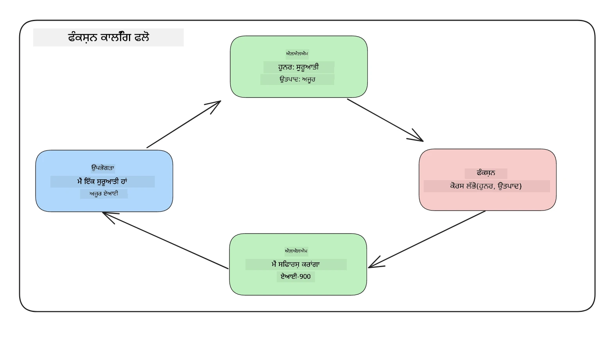
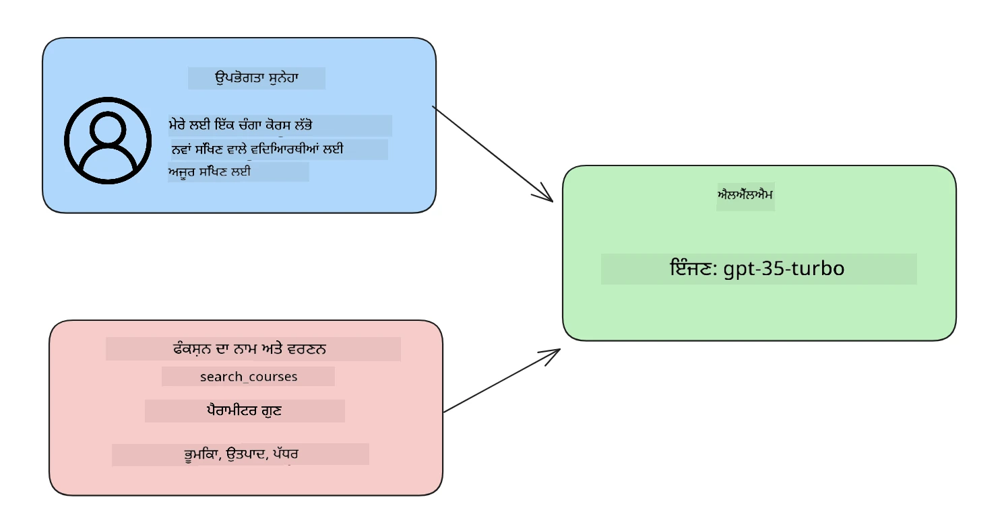

# ਫੰਕਸ਼ਨ ਕਾਲਿੰਗ ਨਾਲ ਇੰਟਿਗਰੇਸ਼ਨ

[](https://youtu.be/DgUdCLX8qYQ?si=f1ouQU5HQx6F8Gl2)

ਤੁਹਾਡੇ ਨੇ ਪਹਿਲਾਂ ਦੇ ਪਾਠਾਂ ਵਿੱਚ ਇਕ ਵਧੀਆ ਸਮਝ ਪ੍ਰਾਪਤ ਕੀਤੀ ਹੈ। ਹਾਲਾਂਕਿ, ਅਸੀਂ ਹੋਰ ਸੁਧਾਰ ਕਰ ਸਕਦੇ ਹਾਂ। ਕੁਝ ਗੱਲਾਂ ਜਿਨ੍ਹਾਂ ਨੂੰ ਅਸੀਂ ਠੀਕ ਕਰ ਸਕਦੇ ਹਾਂ ਉਹ ਹਨ ਕਿ ਅਸੀਂ ਕੁਝ ਹੋਰ ਸਾਮੱਗਰੀ ਨਾਲ ਲਗਾਤਾਰ ਜਵਾਬ ਦੇਣ ਦੇ ਫਾਰਮੈਟ ਨੂੰ ਕਿਵੇਂ ਪ੍ਰਾਪਤ ਕਰ ਸਕਦੇ ਹਾਂ ਤਾਂ ਜੋ ਜਵਾਬ ਨਾਲ ਹੇਠਾਂ ਕੰਮ ਕਰਨਾ ਆਸਾਨ ਹੋਵੇ। ਇਸ ਤੋਂ ਇਲਾਵਾ, ਅਸੀਂ ਆਪਣੀ ਐਪਲੀਕੇਸ਼ਨ ਨੂੰ ਹੋਰ ਸੰਪੰਨ ਕਰਨ ਲਈ ਹੋਰ ਸਰੋਤਾਂ ਤੋਂ ਡਾਟਾ ਸ਼ਾਮਲ ਕਰਨਾ ਚਾਹੁੰਦੇ ਹਾਂ।

ਉਪਰੋਕਤ ਸਮੱਸਿਆਵਾਂ ਇਸ ਅਧਿਆਇ ਦਾ ਮੁੱਦਾ ਹਨ ਜਿਨ੍ਹਾਂ ਨੂੰ ਹੱਲ ਕਰਨ ਦਾ ਇਹ ਅਧਿਆਇ ਉਦੇਸ਼ ਰੱਖਦਾ ਹੈ।

## ਪਰਿਚಯ

ਇਸ ਪਾਠ ਵਿੱਚ ਕਵਰ ਕੀਤਾ ਜਾਵੇਗਾ:

- ਫੰਕਸ਼ਨ ਕਾਲਿੰਗ ਕੀ ਹੈ ਅਤੇ ਇਸਦੇ ਉਪਯੋਗ ਮਾਮਲੇ ਕੀ ਹਨ ਇਸ ਦੀ ਵਿਆਖਿਆ ਕਰੋ।
- Azure OpenAI ਦੀ ਵਰਤੋਂ ਕਰਕੇ ਫੰਕਸ਼ਨ ਕਾਲ ਬਣਾਉਣਾ।
- ਐਪਲੀਕੇਸ਼ਨ ਵਿੱਚ ਫੰਕਸ਼ਨ ਕਾਲ ਨੂੰ ਇੰਟਿਗਰੇਟ ਕਰਨ ਦਾ ਢੰਗ।

## ਸਿੱਖਣ ਦੇ ਟੀਚੇ

ਇਸ ਪਾਠ ਦੇ ਅੰਤ ਤਕ, ਤੁਸੀਂ ਇਸ ਤਰ੍ਹਾਂ ਸਿੱਖ ਸਕੋਗੇ:

- ਫੰਕਸ਼ਨ ਕਾਲਿੰਗ ਦੇ ਉਦੇਸ਼ ਨੂੰ ਸਮਝਾਓ।
- Azure OpenAI ਸੇਵਾ ਦੀ ਵਰਤੋਂ ਕਰਕੇ ਫੰਕਸ਼ਨ ਕਾਲ ਸੈਟਅਪ ਕਰੋ।
- ਆਪਣੀ ਐਪਲੀਕੇਸ਼ਨ ਦੇ ਉਪਯੋਗ ਮਾਮਲੇ ਲਈ ਪ੍ਰਭਾਵੀ ਫੰਕਸ਼ਨ ਕਾਲਾਂ ਡਿਜ਼ਾਇਨ ਕਰੋ।

## ਪਰਿਸ਼ਥਿਤੀ: ਸਾਡੇ ਚੈਟਬੋਟ ਨੂੰ ਫੰਕਸ਼ਨਾਂ ਨਾਲ ਸੁਧਾਰਨਾ

ਇਸ ਪਾਠ ਲਈ, ਅਸੀਂ ਆਪਣੀ ਸਿੱਖਿਆਨੀ ਬਿਜ਼ਨਸ ਲਈ ਇੱਕ ਫੀਚਰ ਬਣਾਉਣਾ ਚਾਹੁੰਦੇ ਹਾਂ ਜੋ ਯੂਜ਼ਰਾਂ ਨੂੰ ਚੈਟਬੋਟ ਦੀ ਵਰਤੋਂ ਕਰਕੇ ਤਕਨੀਕੀ ਕੋਰਸ ਲੱਭਣ ਦੀ ਆਗਿਆ ਦਿੰਦਾ ਹੈ। ਅਸੀਂ ਉਨ੍ਹਾਂ ਦੇ ਕੌਸ਼ਲ ਪੱਧਰ, ਮੌਜੂਦਾ ਭੂਮਿਕਾ ਅਤੇ ਰੁਚੀ ਵਾਲੇ ਤਕਨੀਕੀ ਖੇਤਰ ਦੇ ਅਧਾਰ ‘ਤੇ ਕੋਰਸ ਦੀ ਸਿਫਾਰਿਸ਼ ਕਰਾਂਗੇ।

ਇਸ ਪਰਿਸ਼ਥਿਤੀ ਨੂੰ ਪੂਰਾ ਕਰਨ ਲਈ, ਅਸੀਂ ਹੇਠਾਂ ਦਿੱਤੇ ਸੰਗਮ ਦਾ ਉਪਯੋਗ ਕਰਾਂਗੇ:

- ਯੂਜ਼ਰ ਲਈ ਚੈਟ ਅਨੁਭਵ ਬਣਾਉਣ ਲਈ `Azure OpenAI`।
- ਯੂਜ਼ਰ ਦੀਆਂ ਮੰਗਾਂ ਦੇ ਅਧਾਰ ‘ਤੇ Microsoft Learn Catalog API ਦੀ ਵਰਤੋਂ।
- ਯੂਜ਼ਰ ਦੀ ਪੁੱਛਤਾਛ ਨੂੰ ਫੰਕਸ਼ਨ ਨੂੰ ਭੇਜਣ ਅਤੇ API ਬੇਨਤੀ ਕਰਨ ਲਈ `Function Calling`।

ਸ਼ੁਰੂ ਕਰਨ ਲਈ, ਦੇਖੀਏ ਕਿ ਅਸੀਂ ਪਹਲੇ ਫੰਕਸ਼ਨ ਕਾਲਿੰਗ ਕਿਉਂ ਵਰਤਣਾ ਚਾਹੁੰਦੇ ਹਾਂ:

## ਫੰਕਸ਼ਨ ਕਾਲਿੰਗ ਕਿਉਂ?

ਫੰਕਸ਼ਨ ਕਾਲਿੰਗ ਤੋਂ ਪਹਿਲਾਂ, LLM ਤੋਂ ਜਵਾਬ ਅਸੰਰਚਿਤ ਅਤੇ ਅਸਮਰਥਿਤ ਹੁੰਦੇ ਸਨ। ਡਿਵੈਲਪਰਾਂ ਨੂੰ ਹੇਠਾਂ ਵਰਗੇ ਹਰ ਬਦਲਾਅ ਨੂੰ ਹੱਲ ਕਰਨ ਲਈ ਜਟਿਲ ਵੈਧਤਾ ਕੋਡ ਲਿਖਣਾ ਪੈਂਦਾ ਸੀ। ਯੂਜ਼ਰ "ਸਟੌਕਹੋਮ ਵਿੱਚ ਮੌਜੂਦਾ ਮੌਸਮ ਕੀ ਹੈ?" ਵਰਗੇ ਸਵਾਲਾਂ ਦੇ ਜਵਾਬ ਦਰਕਰਾਰ ਨਹੀਂ ਕਰ ਸਕਦੇ ਸਨ। ਇਹ ਇਸ ਲਈ ਸੀ ਕਿ ਮਾਡਲਾਂ ਸਿਖਲਾਈ ਦੇ ਸਮੇਂ ਤੱਕ ਦੇ ਡਾਟੇ ਤੱਕ ਸੀਮਿਤ ਸਨ।

ਫੰਕਸ਼ਨ ਕਾਲਿੰਗ Azure OpenAI ਸੇਵਾ ਦੀ ਇੱਕ ਵਿਸ਼ੇਸ਼ਤਾ ਹੈ ਜੋ ਹੇਠਾਂ ਦਿੱਤੀਆਂ ਸੀਮਾਵਾਂ ਤੋਂ ਬਚਦੀ ਹੈ:

- **ਲਗਾਤਾਰ ਜਵਾਬ ਫਾਰਮੈਟ**. ਜੇ ਅਸੀਂ ਜਵਾਬ ਦੇ ਫਾਰਮੈਟ 'ਤੇ ਵਧੀਆ ਕੰਟਰੋਲ ਰੱਖੀਏ ਤਾਂ ਅਸੀਂ ਆਸਾਨੀ ਨਾਲ ਜਵਾਬ ਨੂੰ ਹੋਰ ਸਿਸਟਮਾਂ ਵਿੱਚ ਜੋੜ ਸਕਦੇ ਹਾਂ।
- **ਬਾਹਰੀ ਡਾਟਾ**. ਇੱਕ ਚੈਟ ਸੰਦਰਭ ਵਿੱਚ ਐਪਲੀਕੇਸ਼ਨ ਦੇ ਹੋਰ ਸਰੋਤਾਂ ਤੋਂ ਡਾਟਾ ਦੀ ਵਰਤੋਂ ਕਰਨ ਦੀ ਯੋਗਤਾ।

## ਇੱਕ ਪਰਿਸ਼ਥਿਤੀ ਰਾਹੀਂ ਸਮੱਸਿਆ ਨੂੰ ਦਰਸਾਉਂਦੇ ਹੋਏ

> ਅਸੀਂ ਤੁਹਾਨੂੰ ਸਿਫਾਰਸ਼ ਕਰਦੇ ਹਾਂ ਕਿ ਤੁਸੀਂ ਹੇਠਾਂ ਦਿੱਤਾ ਗਇਆ [ਸ਼ਾਮਲ ਨੋਟਬੁੱਕ](./python/aoai-assignment.ipynb?WT.mc_id=academic-105485-koreyst) ਵਰਤੋਂ ਜੇ ਤੁਸੀਂ ਹੇਠਾਂ ਦਿੱਤੀ ਪਰਿਸ਼ਥਿਤੀ ਚਲਾਉਣੀ ਹੈ। ਤੁਸੀਂ ਸਿਰਫ-ਪੜ੍ਹਾਈ ਕਰਕੇ ਵੀ ਇਸ ਸਮੱਸਿਆ ਨੂੰ ਸਮਝ ਸਕਦੇ ਹੋ ਜਿੱਥੇ ਫੰਕਸ਼ਨਾਂ ਦੀ ਸਹਾਇਤਾ ਨਾਲ ਸਮੱਸਿਆ ਦਾ ਹੱਲ ਦਰਸਾਇਆ ਜਾ ਰਿਹਾ ਹੈ।

ਆਓ ਉਦਾਹਰਣ ਵੇਖੀਏ ਜੋ ਜਵਾਬ ਫਾਰਮੈਟ ਦੀ ਸਮੱਸਿਆ ਨੂੰ ਦਰਸਾਉਂਦੀ ਹੈ:

ਮਾਨ ਲਓ ਕਿ ਅਸੀਂ ਵਿਦਿਆਰਥੀ ਡਾਟਾ ਦੀ ਇੱਕ ਡੇਟਾਬੇਸ ਬਣਾਉਣਾ ਚਾਹੁੰਦੇ ਹਾਂ ਤਾਂ ਜੋ ਅਸੀਂ ਠੀਕ ਕੋਰਸ ਸੁਝਾ ਸਕੀਏ। ਹੇਠਾਂ ਸਾਡੇ ਕੋਲ ਦੋ ਵਿਦਿਆਰਥੀਆਂ ਦੀਆਂ ਵਿਰਣਨਾਵਾਂ ਹਨ ਜੋ ਡਾਟਾ ਵਿੱਚ ਕਾਫੀ ਮਿਲਦੀਆਂ ਹਨ।

1. ਸਾਡੀ Azure OpenAI ਸਰੋਤ ਨਾਲ ਕਨੈਕਸ਼ਨ ਬਣਾਓ:

   ```python
   import os
   import json
   from openai import OpenAI
   from dotenv import load_dotenv
   load_dotenv()

   # Responses API Azure OpenAI (Microsoft Foundry) v1 ਤੋਂ ਸੇਵਾ ਪ੍ਰਦਾਨ ਕੀਤੀ ਜਾਂਦੀ ਹੈ
   # ਐਂਡਪੁਆਇੰਟ, ਇਸ ਲਈ ਅਸੀਂ OpenAI ਕਲਾਇੰਟ ਨੂੰ <your-endpoint>/openai/v1/ ’ਤੇ ਨਿਸ਼ਾਨਾ ਬਣਾਉਂਦੇ ਹਾਂ।
   endpoint = os.environ['AZURE_OPENAI_ENDPOINT']
   client = OpenAI(
   api_key=os.environ['AZURE_OPENAI_API_KEY'],
   base_url=f"{endpoint.rstrip('/')}/openai/v1/",
   )

   deployment=os.environ['AZURE_OPENAI_DEPLOYMENT']
   ```

   ਹੇਠਾਂ ਕੁਝ ਪਾਇਥਨ ਕੋਡ ਹੈ ਜੋ ਸਾਡੀ Azure OpenAI ਨਾਲ ਕਨੈਕਸ਼ਨ ਦੇ ਲਈ ਹੈ। ਕਿਉਂਕਿ ਅਸੀਂ v1 ਐਂਡਪੋਇੰਟ ਦੀ ਵਰਤੋਂ ਕਰ ਰਹੇ ਹਾਂ, ਸਾਨੂੰ ਸਿਰਫ਼ `api_key` ਅਤੇ `base_url` ਸੈੱਟ ਕਰਨੇ ਹਨ (ਕੋਈ `api_version` ਜਰੂਰੀ ਨਹੀਂ)।

1. `student_1_description` ਅਤੇ `student_2_description` ਵੇਰੀਏਬਲ ਦੀ ਵਰਤੋਂ ਕਰਕੇ ਦੋ ਵਿਦਿਆਰਥੀ ਵਿਰਣਨ ਬਣਾ ਰਹੇ ਹਾਂ।

   ```python
   student_1_description="Emily Johnson is a sophomore majoring in computer science at Duke University. She has a 3.7 GPA. Emily is an active member of the university's Chess Club and Debate Team. She hopes to pursue a career in software engineering after graduating."

   student_2_description = "Michael Lee is a sophomore majoring in computer science at Stanford University. He has a 3.8 GPA. Michael is known for his programming skills and is an active member of the university's Robotics Club. He hopes to pursue a career in artificial intelligence after finishing his studies."
   ```

   ਅਸੀਂ ਚਾਹੁੰਦੇ ਹਾਂ ਕਿ ਉਪਰੋਕਤ ਵਿਦਿਆਰਥੀ ਦੀਆਂ ਵਿਰਣਨਾਵਾਂ LLM ਨੂੰ ਭੇਜੀਆਂ ਜਾਣ ਤਾਂ ਜੋ ਉਹ ਡਾਟਾ ਨੂੰ ਪਾਰਸ ਕਰ ਸਕੇ। ਇਹ ਡਾਟਾ ਬਾਅਦ ਵਿੱਚ ਸਾਡੀ ਐਪਲੀਕੇਸ਼ਨ ਵਿੱਚ ਬਰਤ ਸਕਦਾ ਹੈ ਜਾਂ API ਨੂੰ ਭੇਜਿਆ ਜਾਂ ਡੇਟਾਬੇਸ ਵਿੱਚ ਸੰਭਾਲਿਆ ਜਾ ਸਕਦਾ ਹੈ।

1. ਆਓ ਦੋ ਇਕੋ ਜਿਹੇ ਪ੍ਰਾਂਪਟ बनाएਂ ਜਿੰਨ੍ਹਾਂ ਵਿੱਚ ਅਸੀਂ LLM ਨੂੰ ਦੱਸਦੇ ਹਾਂ ਕਿ ਅਸੀਂ ਕਿਹੜੀ ਜਾਣਕਾਰੀ ਚਾਹੁੰਦੇ ਹਾਂ:

   ```python
   prompt1 = f'''
   Please extract the following information from the given text and return it as a JSON object:

   name
   major
   school
   grades
   club

   This is the body of text to extract the information from:
   {student_1_description}
   '''

   prompt2 = f'''
   Please extract the following information from the given text and return it as a JSON object:

   name
   major
   school
   grades
   club

   This is the body of text to extract the information from:
   {student_2_description}
   '''
   ```

   ਉਪਰੋਕਤ ਪ੍ਰਾਂਪਟ LLM ਨੂੰ ਦੱਸਦੇ ਹਨ ਕਿ ਜਾਣਕਾਰੀ ਕੱਢੋ ਅਤੇ ਜਵਾਬ JSON ਫਾਰਮੈਟ ਵਿੱਚ ਦੇਵੋ।

1. ਪ੍ਰਾਂਪਟਸ ਅਤੇ Azure OpenAI ਕਨੈਕਸ਼ਨ ਸੈਟਅਪ ਕਰਨ ਤੋਂ ਬਾਅਦ, ਹੁਣ ਅਸੀਂ ਪ੍ਰਾਂਪਟ ਨੂੰ LLM ਨੂੰ ਭੇਜਾਂਗੇ `client.responses.create` ਦੀ ਵਰਤੋਂ ਕਰਕੇ। ਅਸੀਂ ਪ੍ਰਾਂਪਟ ਨੂੰ `input` ਵੇਰੀਏਬਲ ਵਿੱਚ ਸਟੋਰ ਕਰਦੇ ਹਾਂ ਅਤੇ ਰੋਲ `user` ਸੈੱਟ ਕਰਦੇ ਹਾਂ। ਇਹ ਇਸ ਲਈ ਹੈ ਕਿ ਯੂਜ਼ਰ ਦੀ ਮੇਸաժ ਚੈਟਬੋਟ ਨੂੰ ਲਿਖੀ ਜਾ ਰਹੀ ਹੈ।

   ```python
   # ਪਹਿਲੇ ਪ੍ਰਾਂਪਟ ਤੋਂ ਜਵਾਬ
   openai_response1 = client.responses.create(
   model=deployment,
   input = [{'role': 'user', 'content': prompt1}],
   store=False,
   )
   openai_response1.output_text

   # ਦੂਜੇ ਪ੍ਰਾਂਪਟ ਤੋਂ ਜਵਾਬ
   openai_response2 = client.responses.create(
   model=deployment,
   input = [{'role': 'user', 'content': prompt2}],
   store=False,
   )
   openai_response2.output_text
   ```

ਹੁਣ ਅਸੀਂ ਦੋਵੇਂ ਬੇਨਤੀਆਂ LLM ਨੂੰ ਭੇਜ ਸਕਦੇ ਹਾਂ ਅਤੇ ਪ੍ਰਾਪਤ ਜਵਾਬ ਦੀ ਜਾਂਚ ਕਰ ਸਕਦੇ ਹਾਂ ਜਿਵੇਂ ਕਿ `openai_response1.output_text`।

1. ਆਖਿਰਕਾਰ, ਅਸੀਂ ਜਵਾਬ ਨੂੰ JSON ਫਾਰਮੈਟ ਵਿੱਚ ਬਦਲੋਂਗੇ `json.loads` ਕਾਲ ਕਰਕੇ:

   ```python
   # ਜਵਾਬ ਨੂੰ JSON ਵਸਤੂ ਵੱਜੋਂ ਲੋਡ ਕਰਨਾ
   json_response1 = json.loads(openai_response1.output_text)
   json_response1
   ```

   ਜਵਾਬ 1:

   ```json
   {
     "name": "Emily Johnson",
     "major": "computer science",
     "school": "Duke University",
     "grades": "3.7",
     "club": "Chess Club"
   }
   ```

   ਜਵਾਬ 2:

   ```json
   {
     "name": "Michael Lee",
     "major": "computer science",
     "school": "Stanford University",
     "grades": "3.8 GPA",
     "club": "Robotics Club"
   }
   ```

   ਜਦੋਂਕਿ ਪ੍ਰਾਂਪਟਸ ਸਾਰੇ ਇਕੋ ਜਿਹੇ ਹਨ ਅਤੇ ਵਿਰਣਨ ਕਾਫੀ ਸਮਾਨ ਹਨ, ਪਰ ਅਸੀਂ `Grades` ਪ੍ਰਾਪਰਟੀ ਦੀਆਂ ਵੱਖ-ਵੱਖ ਫਾਰਮੈਟਿੰਗ ਦੇਖਦੇ ਹਾਂ, ਉਦਾਹਰਣ ਵਜੋਂ ਕਦੇ `3.7` ਅਤੇ ਕਦੇ `3.7 GPA` ਮਿਲਦਾ ਹੈ।

   ਇਹ ਨਤੀਜਾ ਇਸ ਲਈ ਹੈ ਕਿਉਂਕਿ LLM ਅਸੰਰਚਿਤ ਡਾਟਾ ਲਿਖੇ ਹੋਏ ਪ੍ਰਾਂਪਟ ਦੇ ਰੂਪ ਵਿੱਚ ਲੈਂਦਾ ਹੈ ਅਤੇ ਫਿਰ ਵੀ ਅਸੰਰਚਿਤ ਡਾਟਾ ਵਾਪਸ ਕਰਦਾ ਹੈ। ਸਾਨੂੰ ਇੱਕ ਸੰਰਚਿਤ ਫਾਰਮੈਟ ਚਾਹੀਦਾ ਹੈ ਤਾਂ ਜੋ ਸਾਨੂੰ ਪਤਾ ਚੱਲ ਸਕੇ ਕਿ ਜਦੋਂ ਅਸੀਂ ਇਸ ਡਾਟਾ ਨੂੰ ਸਟੋਰ ਜਾਂ ਵਰਤਣਾ ਹੈ ਤਾਂ ਕੀ ਉਮੀਦ ਕਰਨੀ ਹੈ।

ਤਾਂ ਫਾਰਮੈਟਿੰਗ ਸਮੱਸਿਆ ਦਾ ਹੱਲ ਕਿਵੇਂ ਕਰੀਏ? ਫੰਕਸ਼ਨ ਕਾਲਿੰਗ ਦੀ ਵਰਤੋਂ ਕਰਕੇ, ਅਸੀਂ ਯਕੀਨੀ ਬਣਾ ਸਕਦੇ ਹਾਂ ਕਿ ਸਾਨੂੰ ਸੰਗਠਿਤ ਡਾਟਾ ਵਾਪਸ ਮਿਲੇ। ਫੰਕਸ਼ਨ ਕਾਲਿੰਗ ਕਰਦਿਆਂ, LLM ਵਾਸਤਵ ਵਿੱਚ ਕੋਈ ਫੰਕਸ਼ਨ ਕਾਲ ਜਾਂ ਚੱਲਾਉਂਦਾ ਨਹੀਂ ਹੈ। ਇਸ ਦੀ ਥਾਂ, ਅਸੀਂ LLM ਨੂੰ ਇੱਕ ਸੰਰਚਨਾ ਬਣਾਉਣ ਲਈ ਆਦੇਸ਼ ਦਿੰਦੇ ਹਾਂ ਜੋ ਉਹ ਆਪਣੇ ਜਵਾਬਾਂ ਲਈ ਮੰਨੇ। ਫਿਰ ਅਸੀਂ ਉਹਨਾਂ ਸੰਰਚਿਤ ਜਵਾਬਾਂ ਦੀ ਵਰਤੋਂ ਕਰਦੇ ਹਾਂ ਤਾਂ ਜੋ ਜਾਣ ਸਕੀਏ ਕਿ ਸਾਡੀ ਐਪਲੀਕੇਸ਼ਨ ਵਿੱਚ ਕਿਹੜਾ ਫੰਕਸ਼ਨ ਚਲਾਉਣਾ ਹੈ।



ਫਿਰ ਅਸੀਂ ਫੰਕਸ਼ਨ ਤੋਂ ਵਾਪਸ ਮਿਲੇ ਡਾਟਾ ਨੂੰ ਲੈ ਕੇ LLM ਨੂੰ ਭੇਜ ਸਕਦੇ ਹਾਂ। LLM ਫਿਰ ਪ੍ਰਾਕৃতিক ਭਾਸ਼ਾ ਵਿੱਚ ਜਵਾਬ ਦੇਵੇਗਾ ਤਾਂ ਜੋ ਯੂਜ਼ਰ ਦੀ ਪੁੱਛਤਾਛ ਦਾ ਜਵਾਬ ਦਿੱਤਾ ਜਾਵੇ।

## ਫੰਕਸ਼ਨ ਕਾਲਾਂ ਦੀ ਵਰਤੋਂ ਦੇ ਮਾਮਲੇ

ਕਈ ਹਾਲਾਤ ਹਨ ਜਿੱਥੇ ਫੰਕਸ਼ਨ ਕਾਲਾਂ ਤੁਹਾਡੀ ਐਪ ਨੂੰ ਸੁਧਾਰ ਸਕਦੀਆਂ ਹਨ ਜਿਵੇਂ:

- **ਬਾਹਰੀ ਟੂਲਾਂ ਨੂੰ ਕਾਲ ਕਰਨਾ**. ਚੈਟਬੋਟ ਯੂਜ਼ਰਾਂ ਦੇ ਸਵਾਲਾਂ ਦੇ ਜਵਾਬ ਦੇਣ ਵਿੱਚ ਬੇਹਤਰੀਨ ਹਨ। ਫੰਕਸ਼ਨ ਕਾਲਿੰਗ ਦੀ ਵਰਤੋਂ ਕਰਕੇ, ਚੈਟਬੋਟ ਯੂਜ਼ਰਾਂ ਦੇ ਸੁਨੇਹੇ ਲੈ ਕੇ ਕੁਝ ਕਰਾਮਾਤੀ ਕੰਮ ਪੂਰੇ ਕਰ ਸਕਦਾ ਹੈ। ਉਦਾਹਰਣ ਵਜੋਂ ਇੱਕ ਵਿਦਿਆਰਥੀ ਚੈਟਬੋਟ ਨੂੰ ਕਹਿ ਸਕਦਾ ਹੈ "ਮੇਰੇ ਅਧਿਆਪਕ ਨੂੰ ਇੱਕ ਈਮੇਲ ਭੇਜੋ ਕਿ ਮੈਨੂੰ ਇਸ ਵਿਸ਼ੇ ਵਿੱਚ ਹੋਰ ਸਹਾਇਤਾ ਦੀ ਲੋੜ ਹੈ"। ਇਹ `send_email(to: string, body: string)` ਫੰਕਸ਼ਨ ਕਾਲ ਕਰ ਸਕਦਾ ਹੈ।

- **API ਜਾਂ ਡੇਟਾਬੇਸ ਕਵੇਰੀ ਬਣਾਉਣਾ**. ਯੂਜ਼ਰ ਮੁਲਾਜਮਾਤੀ ਭਾਸ਼ਾ ਦੀ ਵਰਤੋਂ ਕਰਕੇ ਜਾਣਕਾਰੀ ਲੱਭ ਸਕਦੇ ਹਨ ਜੋ ਇੱਕ ਫਾਰਮੈਟ ਕੀਤੀ ਕਵੇਰੀ ਜਾਂ API ਬੇਨਤੀ ਵਿੱਚ ਬਦਲੀ ਜਾਂਦੀ ਹੈ। ਇੱਕ ਉਦਾਹਰਣ ਇਹ ਹੋ ਸਕਦਾ ਹੈ ਕਿ ਇੱਕ ਅਧਿਆਪਕ ਕਹਿੰਦਾ ਹੈ "ਕੌਣ ਸਟੂਡੈਂਟਸ ਨੇ ਆਖ਼ਰੀ ਅਸਾਈਨਮੈਂਟ ਪੂਰਾ ਕੀਤਾ?" ਜੋ ਕਿ `get_completed(student_name: string, assignment: int, current_status: string)` ਨਾਮਕ ਫੰਕਸ਼ਨ ਕਾਲ ਕਰ ਸਕਦਾ ਹੈ।

- **ਸੰਰਚਿਤ ਡਾਟਾ ਬਣਾਉਣਾ**. ਯੂਜ਼ਰ ਟੈਕਸਟ ਜਾਂ CSV ਬਲਾਕ ਲੈ ਕੇ LLM ਦੀ ਵਰਤੋਂ ਕਰ ਸਕਦੇ ਹਨ ਤਾਂ ਜੋ ਮਹੱਤਵਪੂਰਨ ਜਾਣਕਾਰੀ ਕੱਢ ਸਕਣ। ਉਦਾਹਰਣ ਵਜੋਂ, ਵਿਦਿਆਰਥੀ ਜੰਗ ਸਹਿਮਤੀਆਂ ਬਾਰੇ ਵਿਕੀਪੀਡੀਆ ਲੇਖ ਦੀ ਯੂਜ਼ ਕੀਤੀ ਜਾਣ ਵਾਲੀ ਜਾਣਕਾਰੀ ਤੋਂ AI ਫਲੈਸ਼ਕਾਰਡ ਬਣਾਉਣ ਲਈ ਫੰਕਸ਼ਨ `get_important_facts(agreement_name: string, date_signed: string, parties_involved: list)` ਦੀ ਵਰਤੋਂ ਕਰ ਸਕਦਾ ਹੈ।

## ਆਪਣੀ ਪਹਿਲੀ ਫੰਕਸ਼ਨ ਕਾਲ ਬਣਾਉਣਾ

ਫੰਕਸ਼ਨ ਕਾਲ ਬਣਾਉਣ ਦੀ ਪ੍ਰਕਿਰਿਆ ਵਿੱਚ 3 ਮੁੱਖ ਕਦਮ ਹਨ:

1. ਤੁਹਾਡੇ ਫੰਕਸ਼ਨਾਂ (ਟੂਲਾਂ) ਦੀ ਸੂਚੀ ਅਤੇ ਯੂਜ਼ਰ ਸੁਨੇਹਾ ਨਾਲ Responses API ਨੂੰ ਕਾਲ ਕਰਨਾ।
2. ਮਾਡਲ ਦੇ ਜਵਾਬ ਨੂੰ ਪੜ੍ਹ ਕੇ ਕਿਸੇ ਕਾਰਜ ਨੂੰ ਅੰਜਾਮ ਦੇਣਾ - ਜਿਵੇਂ ਫੰਕਸ਼ਨ ਜਾਂ API ਕਾਲ ਚਲਾਉਣਾ।
3. ਮੁੜ Responses API ਨੂੰ ਤੁਹਾਡੇ ਫੰਕਸ਼ਨ ਦੇ ਜਵਾਬ ਨਾਲ ਕਾਲ ਕਰਨਾ ਤਾਂ ਜੋ ਉਸ ਜਾਣਕਾਰੀ ਦੀ ਵਰਤੋਂ ਕਰਕੇ ਯੂਜ਼ਰ ਨੂੰ ਜਵਾਬ ਬਣਾਇਆ ਜਾਵੇ।



### ਕਦਮ 1 - ਸੁਨੇਹੇ ਬਣਾਉਣਾ

ਪਹਿਲਾ ਕਦਮ ਯੂਜ਼ਰ ਦਾ ਸੁਨੇਹਾ ਬਣਾਉਣਾ ਹੈ। ਇਹ ਗਤੀਸ਼ੀਲ ਤੌਰ ‘ਤੇ ਟੈਕਸਟ ਇਨਪੁਟ ਦੀ ਕੀਮਤ ਲੈ ਕੇ ਦਿੱਤਾ ਜਾ ਸਕਦਾ ਹੈ ਜਾਂ ਤੁਸੀਂ ਇੱਥੇ ਇੱਕ ਕੀਮਤ ਦੇ ਸਕਦੇ ਹੋ। ਜੇ ਇਹ ਤੁਹਾਡਾ ਪਹਿਲਾ ਵਾਰ Responses API ਨਾਲ ਕੰਮ ਕਰਨਾ ਹੈ, ਤਾਂ ਸਾਨੂੰ ਸੁਨੇਹੇ ਦੀ `role` ਅਤੇ `content` ਨੂੰ ਪਰਿਭਾਸ਼ਿਤ ਕਰਨਾ ਪਵੇਗਾ।

`role` ਜਾਂ ਤਾਂ `system` (ਨਿਯਮ ਬਣਾਉਣਾ), `assistant` (ਮਾਡਲ) ਜਾਂ `user` (ਅੰਤ-ਯੂਜ਼ਰ) ਹੋ ਸਕਦਾ ਹੈ। ਫੰਕਸ਼ਨ ਕਾਲਿੰਗ ਲਈ, ਅਸੀਂ ਇਸਨੂੰ `user` ਦੇ ਤੌਰ ‘ਤੇ ਨਿਯਤ ਕਰਾਂਗੇ ਅਤੇ ਇੱਕ ਉਦਾਹਰਣ ਸਵਾਲ ਦਿੱਤਾ ਜਾਵੇਗਾ।

```python
messages= [ {"role": "user", "content": "Find me a good course for a beginner student to learn Azure."} ]
```

ਵੱਖ-ਵੱਖ ਰੋਲ ਐਸਾਈਨ ਕਰਨ ਨਾਲ, LLM ਨੂੰ ਸਪਸ਼ਟ ਹੁੰਦਾ ਹੈ ਕਿ ਇਹ ਸਿਸਟਮ ਬਾਰੇ ਕੁਝ ਕਹਿ ਰਿਹਾ ਹੈ ਜਾਂ ਯੂਜ਼ਰ, ਜੋ ਇਕ ਗੱਲਬਾਤ ਦਾ ਇਤਿਹਾਸ ਬਣਾਉਣ ਵਿੱਚ ਸਹਾਇਤਾ ਕਰਦਾ ਹੈ ਜਿਸ ‘ਤੇ LLM ਅੱਗੇ ਕੰਮ ਕਰ ਸਕਦਾ ਹੈ।

### ਕਦਮ 2 - ਫੰਕਸ਼ਨਾਂ ਬਣਾਉਣਾ

ਅਗਲਾ, ਅਸੀਂ ਇੱਕ ਫੰਕਸ਼ਨ ਅਤੇ ਉਸਦੇ ਪੈਰਾਮੀਟਰ ਨਿਰਧਾਰਿਤ ਕਰਾਂਗੇ। ਅਸੀਂ ਇੱਥੇ ਸਿਰਫ ਇੱਕ ਫੰਕਸ਼ਨ `search_courses` ਦੀ ਵਰਤੋਂ ਕਰਾਂਗੇ ਪਰ ਤੁਸੀਂ ਕਈ ਫੰਕਸ਼ਨ ਬਣਾ ਸਕਦੇ ਹੋ।

> **ਮਹੱਤਵਪੂਰਨ** : ਫੰਕਸ਼ਨਾਂ ਨੂੰ ਸਿਸਟਮ ਸੁਨੇਹੇ ਵਿੱਚ LLM ਦੇ ਲਈ ਸ਼ਾਮਲ ਕੀਤਾ ਜਾਂਦਾ ਹੈ ਅਤੇ ਇਹ ਤੁਹਾਡੇ ਉਪਲਬਧ ਟੋਕਨ ਦੀ ਗਿਣਤੀ ਵਿੱਚ ਗਿਣੇ ਜਾਣਗੇ।

ਹੇਠਾਂ, ਅਸੀਂ ਫੰਕਸ਼ਨਾਂ ਨੂੰ ਆਈਟਮਾਂ ਦੀ ਇੱਕ ਸੂਚੀ ਵਜੋਂ ਬਣਾਈ ਹੈ। ਹਰ ਆਈਟਮ Responses API ਦੇ ਫਲੇਟ ਫਾਰਮੈਟ ਵਿੱਚ ਇੱਕ ਟੂਲ ਹੁੰਦਾ ਹੈ, ਜਿਸਦੇ `type`, `name`, `description` ਅਤੇ `parameters` ਪ੍ਰਾਪਰਟੀਆਂ ਹੁੰਦੀਆਂ ਹਨ:

```python
functions = [
   {
      "type":"function",
      "name":"search_courses",
      "description":"Retrieves courses from the search index based on the parameters provided",
      "parameters":{
         "type":"object",
         "properties":{
            "role":{
               "type":"string",
               "description":"The role of the learner (i.e. developer, data scientist, student, etc.)"
            },
            "product":{
               "type":"string",
               "description":"The product that the lesson is covering (i.e. Azure, Power BI, etc.)"
            },
            "level":{
               "type":"string",
               "description":"The level of experience the learner has prior to taking the course (i.e. beginner, intermediate, advanced)"
            }
         },
         "required":[
            "role"
         ]
      }
   }
]
```

ਆਓ ਹਰ ਫੰਕਸ਼ਨ ਇੰਸਟੈਂਸ ਨੂੰ ਹੇਠਾਂ ਵਧੇਰੇ ਵਿਸਥਾਰ ਵਿੱਚ ਵੇਖੀਏ:

- `name` - ਫੰਕਸ਼ਨ ਦਾ ਨਾਮ ਜੋ ਅਸੀਂ ਕਾਲ ਕਰਵਾਉਣਾ ਚਾਹੁੰਦੇ ਹਾਂ।
- `description` - ਇਹ ਫੰਕਸ਼ਨ ਕੰਮ ਕਿਸ ਤਰ੍ਹਾਂ ਕਰਦਾ ਹੈ ਇਸ ਦਾ ਵੇਰਵਾ ਦਿੱਤਾ ਜਾਂਦਾ ਹੈ। ਇੱਥੇ ਇਹ ਜਰੂਰੀ ਹੈ ਕਿ ਵਿਆਖਿਆ ਸਪਸ਼ਟ ਅਤੇ ਵਿਸ਼ੇਸ਼ ਹੋਵੇ।
- `parameters` - ਮੁੱਲਾਂ ਅਤੇ ਫਾਰਮੈਟ ਦੀ ਸੂਚੀ ਜਿਹੜਾ ਤੁਸੀਂ ਮਾਡਲ ਨੂੰ ਆਪਣੇ ਜਵਾਬ ਵਿੱਚ ਉਤਪਾਦਿਤ ਕਰਵਾਉਣਾ ਚਾਹੁੰਦੇ ਹੋ। ਪੈਰਾਮੀਟਰ ਐਰੇ ਆਈਟਮਾਂ ਦਾ ਸਮੂਹ ਹੈ ਜਿਸ ਵਿੱਚ ਆਈਟਮਾਂ ਦੇ ਹੇਠਾਂ ਦਿੱਤੀਆਂ ਪ੍ਰਾਪਰਟੀਆਂ ਹੁੰਦੀਆਂ ਹਨ:
  1.  `type` - ਉਹ ਡਾਟਾ ਕਿਸਮ ਜਿਸ ਵਿੱਚ ਪ੍ਰਾਪਰਟੀਆਂ ਨੂੰ ਸਟੋਰ ਕੀਤਾ ਜਾਵੇਗਾ।
  1.  `properties` - ਖਾਸ ਕੀਮਤਾਂ ਦੀ ਸੂਚੀ ਜੋ ਮਾਡਲ ਆਪਣੇ ਜਵਾਬ ਵਿੱਚ ਵਰਤੂਗਾ
      1. `name` - ਕੁੰਜੀ, ਜੋ ਕਿ ਫਾਰਮੈਟ ਕੀਤੇ ਜਵਾਬ ਵਿੱਚ ਮਾਡਲ ਵਰਤੇਗਾ, ਉਦਾਹਰਣ ਵਜੋਂ `product`।
      1. `type` - ਇਸ ਪ੍ਰਾਪਰਟੀ ਦਾ ਡਾਟਾ ਪ੍ਰਕਾਰ, ਉਦਾਹਰਣ ਵਜੋਂ `string`.
      1. `description` - ਵਿਸ਼ੇਸ਼ ਪ੍ਰਾਪਰਟੀ ਦਾ ਵੇਰਵਾ।

ਇੱਕ ਵਿਕਲਪਿਕ ਪ੍ਰਾਪਰਟੀ `required` ਵੀ ਹੁੰਦੀ ਹੈ – ਜੋ ਫੰਕਸ਼ਨ ਕਾਲ ਪੂਰਾ ਕਰਨ ਲਈ ਲਾਜ਼ਮੀ ਹੈ।

### ਕਦਮ 3 - ਫੰਕਸ਼ਨ ਕਾਲ ਕਰਨਾ

ਇੱਕ ਫੰਕਸ਼ਨ ਨੂੰ ਪਰਿਭਾਸ਼ਿਤ ਕਰਨ ਤੋਂ ਬਾਅਦ, ਅਸੀ ਹੁਣ ਇਸਨੂੰ Responses API ਕਾਲ ਵਿੱਚ ਸ਼ਾਮਲ ਕਰਨਾ ਹੈ। ਅਸੀਂ ਇੱਥੇ `tools` ਨੂੰ `functions` ਸੈੱਟ ਕਰਕੇ ਕਾਲ ਕਰਦੇ ਹਾਂ।

ਇਸਦੇ ਨਾਲ ਨਾਲ ਇੱਕ ਵਿਕਲਪ ਹੈ `tool_choice` ਨੂੰ `auto` ਸੈੱਟ ਕਰਨ ਦਾ। ਇਸਦਾ ਅਰਥ ਹੈ ਕਿ ਅਸੀਂ LLM ਨੂੰ ਛੱਡ ਦਿੰਦੇ ਹਾਂ ਕਿ ਉਹ ਫੈਸਲਾ ਕਰੇ ਕਿ ਯੂਜ਼ਰ ਸੁਨੇਹੇ ਦੇ ਆਧਾਰ ‘ਤੇ ਕਿਹੜਾ ਫੰਕਸ਼ਨ ਕਾਲ ਕਰਨਾ ਹੈ, ਬਜਾਏ ਕਿ ਅਸੀਂ ਖ਼ੂਦ ਨਿਯਤ ਕਰੀਏ।

ਹੇਠਾਂ ਕੁਝ ਕੋਡ ਦਿੱਤਾ ਗਿਆ ਹੈ ਜਿਸ ਵਿੱਚ ਅਸੀਂ `client.responses.create` ਕਾਲ ਕਰਦੇ ਹਾਂ, ਧਿਆਨ ਧਰੋ ਕਿ ਕਿਵੇਂ `tools=functions` ਅਤੇ `tool_choice="auto"` ਸੈੱਟ ਕੀਤਾ ਹੈ ਅਤੇ ਇਸ ਤਰ੍ਹਾਂ LLM ਨੂੰ ਇਹ ਚੋਣ ਦੇ ਰਹੇ ਹਾਂ ਕਿ ਕਦੋਂ ਸਾਡੇ ਦਿੱਤੇ ਫੰਕਸ਼ਨ ਕਾਲ ਕਰਨੇ ਹਨ:

```python
response = client.responses.create(model=deployment,
                                        input=messages,
                                        tools=functions,
                                        tool_choice="auto",
                                        store=False)

print(response.output)
```

ਹੁਣ ਮੁੜ ਮਿਲਦੇ ਜਵਾਬ ਵਿੱਚ `response.output` ਵਿੱਚ ਇੱਕ `function_call` ਆਈਟਮ ਸ਼ਾਮਲ ਹੈ ਜੋ ਇਸ ਤਰ੍ਹਾਂ ਦਾ ਹੈ:

```json
{
  "type": "function_call",
  "name": "search_courses",
  "call_id": "call_abc123",
  "arguments": "{\n  \"role\": \"student\",\n  \"product\": \"Azure\",\n  \"level\": \"beginner\"\n}"
}
```

ਅਸੀਂ ਇੱਥੇ ਵੇਖ ਸਕਦੇ ਹਾਂ ਕਿ ਫੰਕਸ਼ਨ `search_courses` ਕਿਵੇਂ ਕਾਲ ਕੀਤਾ ਗਿਆ ਅਤੇ ਕਿਹੜੇ ਦਲੀਲਾਂ ਦੇ ਨਾਲ, ਜੋ JSON ਜਵਾਬ ਵਿੱਚ `arguments` ਪ੍ਰਾਪਰਟੀ ਵਿੱਚ ਦਿੱਤੇ ਹਨ।

ਨਤੀਜਾ ਇਹ ਹੈ ਕਿ LLM ਨੂੰ ਡਾਟਾ ਲੱਭਣ ਵਿੱਚ ਸਫਲਤਾ ਮਿਲੀ ਜੋ Responses API ਕਾਲ ਵਿੱਚ ਦਿੱਤੇ `input` ਪੈਰਾਮੀਟਰ ਦੀ ਕੀਮਤ ਤੋਂ ਕੱਢਿਆ ਗਿਆ ਸੀ। ਹੇਠਾਂ `messages` ਦੀ ਕੀਮਤ ਦੀ ਇੱਕ ਯਾਦ:

```python
messages= [ {"role": "user", "content": "Find me a good course for a beginner student to learn Azure."} ]
```

ਤੁਸੀਂ ਵੇਖ ਸਕਦੇ ਹੋ ਕਿ `student`, `Azure` ਅਤੇ `beginner` ਨੂੰ `messages` ਤੋਂ ਕੱਢਿਆ ਗਿਆ ਅਤੇ ਫੰਕਸ਼ਨ ਲਈ ਇਨਪੁਟ ਵਜੋਂ ਵਰਤਿਆ ਗਿਆ। ਇਸ ਤਰ੍ਹਾਂ ਫੰਕਸ਼ਨਾਂ ਦੀ ਵਰਤੋਂ ਪ੍ਰੋਮਟ ਵਿੱਚੋਂ ਜਾਣਕਾਰੀ ਕੱਢਣ ਦਾ ਇੱਕ ਵਧੀਆ ਢੰਗ ਹੈ ਪਰ ਇਹ LLM ਨੂੰ ਸੰਰਚਿਤ ਬਣਾਉਣ ਅਤੇ ਮੁੜ ਵਰਤੋਂਯੋਗ ਕਾਰਜਕੁਸ਼ਲਤਾ ਪ੍ਰਦਾਨ ਕਰਨ ਲਈ ਵੀ ਬਹੁਤ ਵਧੀਆ ਹੈ।

ਹੁਣ ਅਸੀਂ ਵੇਖਦੇ ਹਾਂ ਕਿ ਅਸੀਂ ਇਸਨੂੰ ਆਪਣੇ ਐਪ ਵਿੱਚ ਕਿਵੇਂ ਵਰਤ ਸਕਦੇ ਹਾਂ।

## ਐਪਲੀਕੇਸ਼ਨ ਵਿੱਚ ਫੰਕਸ਼ਨ ਕਾਲਾਂ ਦਾ ਇੰਟਿਗਰੇਸ਼ਨ

LLM ਤੋਂ ਪ੍ਰਾਪਤ ਹੋਏ ਸੰਰਚਿਤ ਜਵਾਬ ਦੀ ਜਾਂਚ ਕਰਨ ਤੋਂ ਬਾਅਦ, ਅਸੀਂ ਹੁਣ ਇਸਨੂੰ ਇੱਕ ਐਪਲੀਕੇਸ਼ਨ ਵਿੱਚ ਜੋੜ ਸਕਦੇ ਹਾਂ।

### ਪ੍ਰਵਾਹ ਪ੍ਰਬੰਧਨ

ਇਸਨੂੰ ਐਪ ਵਿੱਚ ਸ਼ਾਮਲ ਕਰਨ ਲਈ, ਆਓ ਹੇਠਾਂ ਦਿੱਤੇ ਕਦਮ ਲਵਾਂ:

1. ਪਹਿਲਾਂ, OpenAI ਸਰਵਿਸ ਨੂੰ ਕਾਲ ਕਰੀਏ ਅਤੇ ਜਵਾਬ `output` ਵਿੱਚੋਂ ਫੰਕਸ਼ਨ ਕਾਲ ਆਈਟਮ ਕੱਢੀਏ।

   ```python
   response_items = response.output
   tool_calls = [item for item in response_items if item.type == "function_call"]
   ```

1. ਹੁਣ ਅਸੀਂ ਉਹ ਫੰਕਸ਼ਨ ਬਣਾਉਂਦੇ ਹਾਂ ਜੋ Microsoft Learn API ਨੂੰ ਕਾਲ ਕਰਕੇ ਕੋਰਸ ਦੀ ਸੂਚੀ ਲੱਭੇਗਾ:

   ```python
   import requests

   def search_courses(role, product, level):
     url = "https://learn.microsoft.com/api/catalog/"
     params = {
        "role": role,
        "product": product,
        "level": level
     }
     response = requests.get(url, params=params)
     modules = response.json()["modules"]
     results = []
     for module in modules[:5]:
        title = module["title"]
        url = module["url"]
        results.append({"title": title, "url": url})
     return str(results)
   ```

   ਧਿਆਨ ਦਿਓ ਕਿ ਅਸੀਂ ਹੁਣ ਇੱਕ ਅਸਲੀ ਪਾਇਥਨ ਫੰਕਸ਼ਨ ਬਣਾਈ ਹੈ ਜੋ `functions` ਵੇਰੀਏਬਲ ਵਿੱਚ ਦਿੱਤੇ ਫੰਕਸ਼ਨਾਂ ਨਾਲ ਮਿਲਦੀ ਹੈ। ਅਸੀਂ ਡਾਟਾ ਪ੍ਰਾਪਤ ਕਰਨ ਲਈ ਅਸਲੀ ਬਾਹਰੀ API ਕਾਲ ਕਰ ਰਹੇ ਹਾਂ। ਇਸ ਮਾਮਲੇ ਵਿੱਚ, ਅਸੀਂ Microsoft Learn API ਨੂੰ ਬਿਲਕੁਲ ਖੋਜ ਰਹੇ ਹਾਂ।

ਓਕੇ, ਅਸੀਂ `functions` ਵੇਰੀਏਬਲ ਬਣਾਈ ਅਤੇ ਇੱਕ ਅਨੁਕੂਲ ਪਾਇਥਨ ਫੰਕਸ਼ਨ ਵੀ ਬਣਾਈ, ਹੁਣ ਕਿਵੇਂ LLM ਨੂੰ ਦੱਸਣਾ ਹੈ ਕਿ ਇਹਨਾਂ ਦੋਹਾਂ ਨੂੰ ਕਿਵੇਂ ਜੋੜਨਾ ਹੈ ਤਾਂ ਜੋ ਆਪਣਾ ਪਾਇਥਨ ਫੰਕਸ਼ਨ ਕਾਲ ਹੋ سکے?

1. ਦੇਖਣ ਲਈ ਕਿ ਸਾਨੂੰ ਪਾਇਥਨ ਫੰਕਸ਼ਨ ਕਾਲ ਕਰਨ ਦੀ ਲੋੜ ਹੈ ਜਾਂ ਨਹੀਂ, ਅਸੀਂ LLM ਦੇ ਜਵਾਬ ਵਿੱਚ ਵੇਖੀਏ ਕਿ ਕੀ `function_call` ਆਈਟਮ ਹੈ ਅਤੇ ਉਸਨੂੰ ਕਾਲ ਕਰੀਏ। ਹੇਠਾਂ ਦਿੱਤੀ ਜਾਂਚ ਇਸ ਤਰ੍ਹਾਂ ਕੀਤੀ ਜਾ ਸਕਦੀ ਹੈ:

   ```python
   # ਜਾਂਚੋ ਕਿ ਮਾਡਲ ਫੰਕਸ਼ਨ ਨੂੰ ਕਾਲ ਕਰਨਾ ਚਾਹੁੰਦਾ ਹੈ ਕਿ ਨਹੀਂ
   if tool_calls:
    for tool_call in tool_calls:
     print("Recommended Function call:")
     print(tool_call.name)
     print()

     # ਫੰਕਸ਼ਨ ਨੂੰ ਕਾਲ ਕਰੋ।
     function_name = tool_call.name

     available_functions = {
             "search_courses": search_courses,
     }
     function_to_call = available_functions[function_name]

     function_args = json.loads(tool_call.arguments)
     function_response = function_to_call(**function_args)

     print("Output of function call:")
     print(function_response)
     print(type(function_response))

     # ਫੰਕਸ਼ਨ ਕਾਲ ਅਤੇ ਇਸ ਦਾ ਨਤੀਜਾ ਮੁੜ ਗੱਲਬਾਤ ਵਿੱਚ ਸ਼ਾਮਲ ਕਰੋ।
     # ਮਾਡਲ ਦਾ function_call ਆਈਟਮ ਆਪਣੀ ਆਉਟਪੁੱਟ ਤੋਂ ਪਹਿਲਾਂ ਜੋੜਿਆ ਜਾਣਾ ਚਾਹੀਦਾ ਹੈ।
     messages.append(tool_call)  # ਸਹਾਇਕ ਦਾ function_call ਆਈਟਮ
     messages.append( # ਫੰਕਸ਼ਨ ਦਾ ਨਤੀਜਾ
         {
             "type": "function_call_output",
             "call_id": tool_call.call_id,
             "output": function_response,
         }
     )
   ```

   ਇਹ ਤਿੰਨ ਲਾਈਨਾਂ ਇਹ ਯਕੀਨੀ ਬਣਾਉਂਦੀਆਂ ਹਨ ਕਿ ਅਸੀਂ ਫੰਕਸ਼ਨ ਦਾ ਨਾਮ, ਦਲੀਲਾਂ ਕੱਢ ਕੇ ਕਾਲ ਕਰਦੇ ਹਾਂ:

   ```python
   function_to_call = available_functions[function_name]

   function_args = json.loads(tool_call.arguments)
   function_response = function_to_call(**function_args)
   ```

   ਹੇਠਾਂ ਸਾਡਾ ਕੋਡ ਚਲਾਉਣ ਤੋਂ ਬਾਅਦ ਆਉਟਪੁੱਟ ਹੈ:

   **ਆਉਟਪੁੱਟ**

   ```Recommended Function call:
   {
     "name": "search_courses",
     "arguments": "{\n  \"role\": \"student\",\n  \"product\": \"Azure\",\n  \"level\": \"beginner\"\n}"
   }

   Output of function call:
   [{'title': 'Describe concepts of cryptography', 'url': 'https://learn.microsoft.com/training/modules/describe-concepts-of-cryptography/?
   WT.mc_id=api_CatalogApi'}, {'title': 'Introduction to audio classification with TensorFlow', 'url': 'https://learn.microsoft.com/en-
   us/training/modules/intro-audio-classification-tensorflow/?WT.mc_id=api_CatalogApi'}, {'title': 'Design a Performant Data Model in Azure SQL
   Database with Azure Data Studio', 'url': 'https://learn.microsoft.com/training/modules/design-a-data-model-with-ads/?
   WT.mc_id=api_CatalogApi'}, {'title': 'Getting started with the Microsoft Cloud Adoption Framework for Azure', 'url':
   'https://learn.microsoft.com/training/modules/cloud-adoption-framework-getting-started/?WT.mc_id=api_CatalogApi'}, {'title': 'Set up the
   Rust development environment', 'url': 'https://learn.microsoft.com/training/modules/rust-set-up-environment/?WT.mc_id=api_CatalogApi'}]
   <class 'str'>
   ```

1. ਹੁਣ ਅਸੀਂ ਤਾਜ਼ਾ ਕੀਤਾ ਮੈਸੇਜ `messages` LLM ਨੂੰ ਭੇਜਾਂਗੇ ਤਾਂ ਜੋ ਅਸੀਂ API JSON ਫਾਰਮੈਟ ਦੀ ਥਾਂ ਪ੍ਰਾਕৃতিক ਭਾਸ਼ਾ ਵਿੱਚ ਜਵਾਬ ਪ੍ਰਾਪਤ ਕਰ ਸਕੀਏ।

   ```python
   print("Messages in next request:")
   print(messages)
   print()

   second_response = client.responses.create(
      input=messages,
      model=deployment,
      tool_choice="auto",
      tools=functions,
      temperature=0,
      store=False,
         )  # ਮਾਡਲ ਤੋਂ ਇੱਕ ਨਵਾਂ ਜਵਾਬ ਪ੍ਰਾਪਤ ਕਰੋ ਜਿੱਥੇ ਇਹ ਫੰਕਸ਼ਨ ਜਵਾਬ ਨੂੰ ਦੇਖ ਸਕੇ


   print(second_response.output_text)
   ```

   **ਆਉਟਪੁੱਟ**

   ```text
   I found some good courses for beginner students to learn Azure:

   1. [Describe concepts of cryptography](https://learn.microsoft.com/training/modules/describe-concepts-of-cryptography/?WT.mc_id=api_CatalogApi)
   2. [Introduction to audio classification with TensorFlow](https://learn.microsoft.com/training/modules/intro-audio-classification-tensorflow/?WT.mc_id=api_CatalogApi)
   3. [Design a Performant Data Model in Azure SQL Database with Azure Data Studio](https://learn.microsoft.com/training/modules/design-a-data-model-with-ads/?WT.mc_id=api_CatalogApi)
   4. [Getting started with the Microsoft Cloud Adoption Framework for Azure](https://learn.microsoft.com/training/modules/cloud-adoption-framework-getting-started/?WT.mc_id=api_CatalogApi)
   5. [Set up the Rust development environment](https://learn.microsoft.com/training/modules/rust-set-up-environment/?WT.mc_id=api_CatalogApi)

   You can click on the links to access the courses.
   ```

## ਅਸਾਈਨਮੈਂਟ

Azure OpenAI Function Calling ਦੀ ਆਪਣੀ ਸਿੱਖਿਆ ਜਾਰੀ ਰੱਖਣ ਲਈ, ਤੁਸੀਂ ਹੇਠਾਂ ਲਿਖੀ ਚੀਜ਼ ਤਿਆਰ ਕਰ ਸਕਦੇ ਹੋ:

- ਫੰਕਸ਼ਨ ਦੇ ਹੋਰ ਪੈਰਾਮੀਟਰ ਜੋ ਸਿੱਖਣ ਵਾਲਿਆਂ ਨੂੰ ਹੋਰ ਕੋਰਸ ਲੱਭਣ ਵਿੱਚ ਮਦਦ ਕਰ ਸਕਦੇ ਹਨ।

- ਸਿੱਖਣ ਵਾਲੇ ਤੋਂ ਹੋਰ ਜਾਣਕਾਰੀ ਲੈਣ ਲਈ ਇੱਕ ਹੋਰ ਫੰਕਸ਼ਨ ਕਾਲ ਬਣਾਓ ਜਿਵੇਂ ਕਿ ਉਨ੍ਹਾਂ ਦੀ ਮੂਲ ਭਾਸ਼ਾ
- ਜਦੋਂ ਫੰਕਸ਼ਨ ਕਾਲ ਅਤੇ/ਜਾਂ API ਕਾਲ ਕੋਈ ਉਚਿਤ ਕੋਰਸ ਵਾਪਸ ਨਹੀਂ ਕਰਦੀ ਤਾਂ ਤਰੁੱਟੀ ਹਲ ਕਰਨ ਵਾਲਾ ਪ੍ਰਬੰਧ ਬਣਾਓ

ਟਿੱਪਣੀ: ਵੇਖਣ ਲਈ [Learn API ਰੈਫਰੈਂਸ ਦਸਤਾਵੇਜ਼](https://learn.microsoft.com/training/support/catalog-api-developer-reference?WT.mc_id=academic-105485-koreyst) ਪੰਨਾ ਦੱਸਦਾ ਹੈ ਕਿ ਇਹ ਡੇਟਾ ਕਿਵੇਂ ਅਤੇ ਕਿੱਥੇ ਉਪਲਬਧ ਹੈ।

## ਵਧੀਆ ਕੰਮ! ਯਾਤਰਾ ਜਾਰੀ ਰੱਖੋ

ਇਸ ਪਾਠ ਨੂੰ ਪੂਰਾ ਕਰਨ ਤੋਂ ਬਾਅਦ, ਸਾਡੇ [Generative AI Learning collection](https://aka.ms/genai-collection?WT.mc_id=academic-105485-koreyst) ਨੂੰ ਦੇਖੋ ਤਾਂ ਜੋ ਤੁਸੀਂ ਆਪਣੀ Generative AI ਜਾਣਕਾਰੀ ਨੂੰ ਅੱਗੇ ਵਧਾ ਸਕੋ!

ਪਾਠ 12 ਵੱਲ ਜਾਓ, ਜਿੱਥੇ ਅਸੀਂ ਵੇਖਾਂਗੇ ਕਿ AI ਐਪਲੀਕੇਸ਼ਨਾਂ ਲਈ ਕਿਵੇਂ [UX ਡਿਜ਼ਾਈਨ ਕਰਨਾ ਹੈ](../12-designing-ux-for-ai-applications/README.md?WT.mc_id=academic-105485-koreyst)!

---

<!-- CO-OP TRANSLATOR DISCLAIMER START -->
**ਅਸਵੀਕਾਰੋਪਣ**:
ਇਸ ਦਸਤਾਵੇਜ਼ ਦਾ ਅਨੁਵਾਦ ਏਆਈ ਅਨੁਵਾਦ ਸੇਵਾ [Co-op Translator](https://github.com/Azure/co-op-translator) ਦੀ ਵਰਤੋਂ ਕਰਕੇ ਕੀਤਾ ਗਿਆ ਹੈ। ਜਦੋਂ ਕਿ ਅਸੀਂ ਸਹੀਤਾਵਾਂ ਲਈ ਯਤਨਸ਼ੀਲ ਹਾਂ, ਕਿਰਪਾ ਕਰਕੇ ਧਿਆਨ ਰੱਖੋ ਕਿ ਸਵੈਚਾਲਿਤ ਅਨੁਵਾਦਾਂ ਵਿੱਚ ਗਲਤੀਆਂ ਜਾਂ ਅਸਮੱਤਿਆਵਾਂ ਹੋ ਸਕਦੀਆਂ ਹਨ। ਮੂਲ ਦਸਤਾਵੇਜ਼ ਆਪਣੀ ਮੂਲ ਭਾਸ਼ਾ ਵਿੱਚ ਅਧਿਕਾਰਕ ਸਰੋਤ ਮੰਨਿਆ ਜਾਣਾ ਚਾਹੀਦਾ ਹੈ। ਜਰੂਰੀ ਜਾਣਕਾਰੀ ਲਈ, ਪੇਸ਼ੇਵਰ ਮਨੁੱਖੀ ਅਨੁਵਾਦ ਦੀ ਸਿਫ਼ਾਰਸ਼ ਕੀਤੀ ਜਾਂਦੀ ਹੈ। ਅਸੀਂ ਇਸ ਅਨੁਵਾਦ ਦੇ ਉਪਯੋਗ ਤੋਂ ਪੈਦਾ ਹੋਣ ਵਾਲੀਆਂ ਕਿਸੇ ਵੀ ਗਲਤਫਹਿਮੀਆਂ ਜਾਂ ਗਲਤ ਵਿਆਖਿਆਵਾਂ ਲਈ ਜਵਾਬਦੇਹ ਨਹੀਂ ਹਾਂ।
<!-- CO-OP TRANSLATOR DISCLAIMER END -->