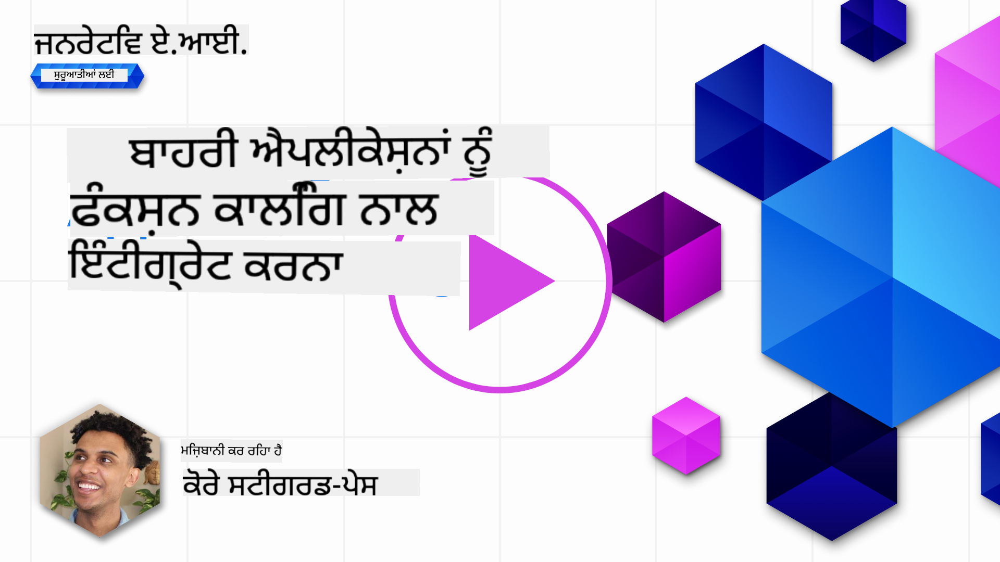

<!--
CO_OP_TRANSLATOR_METADATA:
{
  "original_hash": "77a48a201447be19aa7560706d6f93a0",
  "translation_date": "2025-07-09T14:30:34+00:00",
  "source_file": "11-integrating-with-function-calling/README.md",
  "language_code": "pa"
}
-->
# ਫੰਕਸ਼ਨ ਕਾਲਿੰਗ ਨਾਲ ਇੰਟੀਗ੍ਰੇਸ਼ਨ

[](https://aka.ms/gen-ai-lesson11-gh?WT.mc_id=academic-105485-koreyst)

ਤੁਸੀਂ ਪਹਿਲਾਂ ਦੇ ਪਾਠਾਂ ਵਿੱਚ ਕਾਫੀ ਕੁਝ ਸਿੱਖਿਆ ਹੈ। ਪਰ ਅਸੀਂ ਹੋਰ ਵੀ ਸੁਧਾਰ ਕਰ ਸਕਦੇ ਹਾਂ। ਕੁਝ ਗੱਲਾਂ ਜਿਨ੍ਹਾਂ ਨੂੰ ਅਸੀਂ ਸੁਧਾਰ ਸਕਦੇ ਹਾਂ, ਉਹ ਇਹ ਹਨ ਕਿ ਅਸੀਂ ਜਵਾਬ ਦਾ ਇੱਕ ਜ਼ਿਆਦਾ ਸਥਿਰ ਫਾਰਮੈਟ ਕਿਵੇਂ ਪ੍ਰਾਪਤ ਕਰ ਸਕਦੇ ਹਾਂ ਤਾਂ ਜੋ ਜਵਾਬ ਨਾਲ ਅੱਗੇ ਕੰਮ ਕਰਨਾ ਆਸਾਨ ਹੋ ਜਾਵੇ। ਨਾਲ ਹੀ, ਅਸੀਂ ਹੋਰ ਸਰੋਤਾਂ ਤੋਂ ਡਾਟਾ ਸ਼ਾਮਲ ਕਰਕੇ ਆਪਣੀ ਐਪਲੀਕੇਸ਼ਨ ਨੂੰ ਹੋਰ ਸਮਰੱਥ ਬਣਾ ਸਕਦੇ ਹਾਂ।

ਉਪਰ ਦਿੱਤੀਆਂ ਸਮੱਸਿਆਵਾਂ ਇਸ ਅਧਿਆਇ ਵਿੱਚ ਹੱਲ ਕਰਨ ਦੀ ਕੋਸ਼ਿਸ਼ ਕੀਤੀ ਜਾ ਰਹੀ ਹੈ।

## ਪਰਿਚਯ

ਇਸ ਪਾਠ ਵਿੱਚ ਅਸੀਂ ਕਵਰ ਕਰਾਂਗੇ:

- ਫੰਕਸ਼ਨ ਕਾਲਿੰਗ ਕੀ ਹੈ ਅਤੇ ਇਸਦੇ ਉਪਯੋਗਾਂ ਦੀ ਵਿਆਖਿਆ।
- Azure OpenAI ਦੀ ਵਰਤੋਂ ਕਰਕੇ ਫੰਕਸ਼ਨ ਕਾਲ ਬਣਾਉਣਾ।
- ਕਿਸ ਤਰ੍ਹਾਂ ਫੰਕਸ਼ਨ ਕਾਲ ਨੂੰ ਐਪਲੀਕੇਸ਼ਨ ਵਿੱਚ ਜੋੜਿਆ ਜਾ ਸਕਦਾ ਹੈ।

## ਸਿੱਖਣ ਦੇ ਲਕੜ

ਇਸ ਪਾਠ ਦੇ ਅੰਤ ਤੱਕ, ਤੁਸੀਂ ਸਮਰੱਥ ਹੋਵੋਗੇ:

- ਫੰਕਸ਼ਨ ਕਾਲਿੰਗ ਦੇ ਉਦੇਸ਼ ਨੂੰ ਸਮਝਾਉਣਾ।
- Azure OpenAI ਸੇਵਾ ਦੀ ਵਰਤੋਂ ਕਰਕੇ ਫੰਕਸ਼ਨ ਕਾਲ ਸੈੱਟਅਪ ਕਰਨਾ।
- ਆਪਣੀ ਐਪਲੀਕੇਸ਼ਨ ਦੇ ਉਪਯੋਗ ਮਾਮਲੇ ਲਈ ਪ੍ਰਭਾਵਸ਼ਾਲੀ ਫੰਕਸ਼ਨ ਕਾਲਾਂ ਡਿਜ਼ਾਈਨ ਕਰਨਾ।

## ਸਥਿਤੀ: ਫੰਕਸ਼ਨਾਂ ਨਾਲ ਆਪਣੇ ਚੈਟਬੋਟ ਨੂੰ ਸੁਧਾਰਨਾ

ਇਸ ਪਾਠ ਲਈ, ਅਸੀਂ ਆਪਣੀ ਸਿੱਖਿਆ ਸਟਾਰਟਅਪ ਲਈ ਇੱਕ ਫੀਚਰ ਬਣਾਉਣਾ ਚਾਹੁੰਦੇ ਹਾਂ ਜੋ ਯੂਜ਼ਰਾਂ ਨੂੰ ਚੈਟਬੋਟ ਦੀ ਵਰਤੋਂ ਕਰਕੇ ਤਕਨੀਕੀ ਕੋਰਸ ਲੱਭਣ ਦੀ ਆਗਿਆ ਦੇਵੇ। ਅਸੀਂ ਉਹ ਕੋਰਸ ਸਿਫਾਰਸ਼ ਕਰਾਂਗੇ ਜੋ ਉਨ੍ਹਾਂ ਦੀ ਕੌਸ਼ਲ ਸਤਰ, ਮੌਜੂਦਾ ਭੂਮਿਕਾ ਅਤੇ ਰੁਚੀ ਵਾਲੀ ਤਕਨਾਲੋਜੀ ਨਾਲ ਮੇਲ ਖਾਂਦੇ ਹੋਣ।

ਇਸ ਸਥਿਤੀ ਨੂੰ ਪੂਰਾ ਕਰਨ ਲਈ, ਅਸੀਂ ਹੇਠਾਂ ਦਿੱਤੀਆਂ ਚੀਜ਼ਾਂ ਦੀ ਵਰਤੋਂ ਕਰਾਂਗੇ:

- `Azure OpenAI` ਯੂਜ਼ਰ ਲਈ ਚੈਟ ਅਨੁਭਵ ਬਣਾਉਣ ਲਈ।
- `Microsoft Learn Catalog API` ਯੂਜ਼ਰ ਦੀ ਬੇਨਤੀ ਅਨੁਸਾਰ ਕੋਰਸ ਲੱਭਣ ਵਿੱਚ ਮਦਦ ਲਈ।
- `Function Calling` ਯੂਜ਼ਰ ਦੀ ਪੁੱਛਤਾਛ ਲੈ ਕੇ ਉਸਨੂੰ ਫੰਕਸ਼ਨ ਨੂੰ ਭੇਜਣ ਲਈ ਤਾਂ ਜੋ API ਬੇਨਤੀ ਕੀਤੀ ਜਾ ਸਕੇ।

ਸ਼ੁਰੂ ਕਰਨ ਲਈ, ਆਓ ਵੇਖੀਏ ਕਿ ਅਸੀਂ ਪਹਿਲਾਂ ਕਿਉਂ ਫੰਕਸ਼ਨ ਕਾਲਿੰਗ ਦੀ ਵਰਤੋਂ ਕਰਨਾ ਚਾਹੁੰਦੇ ਹਾਂ:

## ਫੰਕਸ਼ਨ ਕਾਲਿੰਗ ਕਿਉਂ

ਫੰਕਸ਼ਨ ਕਾਲਿੰਗ ਤੋਂ ਪਹਿਲਾਂ, LLM ਤੋਂ ਮਿਲਣ ਵਾਲੇ ਜਵਾਬ ਅਸੰਰਚਿਤ ਅਤੇ ਅਸਥਿਰ ਹੁੰਦੇ ਸਨ। ਡਿਵੈਲਪਰਾਂ ਨੂੰ ਹਰ ਜਵਾਬ ਦੇ ਵੱਖ-ਵੱਖ ਰੂਪਾਂ ਨੂੰ ਸੰਭਾਲਣ ਲਈ ਜਟਿਲ ਵੈਰੀਫਿਕੇਸ਼ਨ ਕੋਡ ਲਿਖਣਾ ਪੈਂਦਾ ਸੀ। ਯੂਜ਼ਰਾਂ ਨੂੰ "ਸਟਾਕਹੋਮ ਵਿੱਚ ਮੌਜੂਦਾ ਮੌਸਮ ਕੀ ਹੈ?" ਵਰਗੇ ਸਵਾਲਾਂ ਦੇ ਜਵਾਬ ਨਹੀਂ ਮਿਲ ਸਕਦੇ ਸਨ। ਇਹ ਇਸ ਲਈ ਕਿ ਮਾਡਲ ਸਿਰਫ ਉਸ ਸਮੇਂ ਤੱਕ ਦੇ ਡਾਟੇ 'ਤੇ ਸੀਮਿਤ ਸਨ ਜਦੋਂ ਉਹਨਾਂ ਨੂੰ ਟ੍ਰੇਨ ਕੀਤਾ ਗਿਆ ਸੀ।

ਫੰਕਸ਼ਨ ਕਾਲਿੰਗ Azure OpenAI ਸੇਵਾ ਦੀ ਇੱਕ ਵਿਸ਼ੇਸ਼ਤਾ ਹੈ ਜੋ ਹੇਠਾਂ ਦਿੱਤੀਆਂ ਸੀਮਾਵਾਂ ਨੂੰ ਦੂਰ ਕਰਦੀ ਹੈ:

- **ਸਥਿਰ ਜਵਾਬ ਫਾਰਮੈਟ**। ਜੇ ਅਸੀਂ ਜਵਾਬ ਦੇ ਫਾਰਮੈਟ 'ਤੇ ਵਧੀਆ ਕਾਬੂ ਪਾ ਸਕੀਏ ਤਾਂ ਅਸੀਂ ਜਵਾਬ ਨੂੰ ਹੋਰ ਸਿਸਟਮਾਂ ਵਿੱਚ ਆਸਾਨੀ ਨਾਲ ਜੋੜ ਸਕਦੇ ਹਾਂ।
- **ਬਾਹਰੀ ਡਾਟਾ**। ਐਪਲੀਕੇਸ਼ਨ ਦੇ ਹੋਰ ਸਰੋਤਾਂ ਤੋਂ ਡਾਟਾ ਚੈਟ ਸੰਦਰਭ ਵਿੱਚ ਵਰਤਣ ਦੀ ਸਮਰੱਥਾ।

## ਇੱਕ ਸਥਿਤੀ ਰਾਹੀਂ ਸਮੱਸਿਆ ਨੂੰ ਦਰਸਾਉਣਾ

> ਅਸੀਂ ਤੁਹਾਨੂੰ ਸਿਫਾਰਸ਼ ਕਰਦੇ ਹਾਂ ਕਿ ਤੁਸੀਂ ਹੇਠਾਂ ਦਿੱਤਾ [ਸ਼ਾਮਿਲ ਨੋਟਬੁੱਕ](python/aoai-assignment.ipynb) ਵਰਤੋਂ ਜੇ ਤੁਸੀਂ ਹੇਠਾਂ ਦਿੱਤੀ ਸਥਿਤੀ ਨੂੰ ਚਲਾਉਣਾ ਚਾਹੁੰਦੇ ਹੋ। ਤੁਸੀਂ ਸਿਰਫ ਪੜ੍ਹ ਕੇ ਵੀ ਸਮਝ ਸਕਦੇ ਹੋ ਕਿਉਂਕਿ ਅਸੀਂ ਇੱਕ ਸਮੱਸਿਆ ਦਰਸਾਉਣ ਦੀ ਕੋਸ਼ਿਸ਼ ਕਰ ਰਹੇ ਹਾਂ ਜਿਸਦਾ ਹੱਲ ਫੰਕਸ਼ਨਾਂ ਨਾਲ ਕੀਤਾ ਜਾ ਸਕਦਾ ਹੈ।

ਆਓ ਇੱਕ ਉਦਾਹਰਨ ਵੇਖੀਏ ਜੋ ਜਵਾਬ ਦੇ ਫਾਰਮੈਟ ਦੀ ਸਮੱਸਿਆ ਨੂੰ ਦਰਸਾਉਂਦੀ ਹੈ:

ਮੰਨ ਲਓ ਅਸੀਂ ਵਿਦਿਆਰਥੀਆਂ ਦਾ ਡਾਟਾਬੇਸ ਬਣਾਉਣਾ ਚਾਹੁੰਦੇ ਹਾਂ ਤਾਂ ਜੋ ਅਸੀਂ ਉਨ੍ਹਾਂ ਨੂੰ ਸਹੀ ਕੋਰਸ ਸੁਝਾ ਸਕੀਏ। ਹੇਠਾਂ ਦੋ ਵਿਦਿਆਰਥੀਆਂ ਦੇ ਵੇਰਵੇ ਦਿੱਤੇ ਗਏ ਹਨ ਜੋ ਡਾਟੇ ਵਿੱਚ ਬਹੁਤ ਮਿਲਦੇ-ਜੁਲਦੇ ਹਨ।

1. ਸਾਡੇ Azure OpenAI ਸਰੋਤ ਨਾਲ ਕਨੈਕਸ਼ਨ ਬਣਾਓ:

   ```python
   import os
   import json
   from openai import AzureOpenAI
   from dotenv import load_dotenv
   load_dotenv()

   client = AzureOpenAI(
   api_key=os.environ['AZURE_OPENAI_API_KEY'],  # this is also the default, it can be omitted
   api_version = "2023-07-01-preview"
   )

   deployment=os.environ['AZURE_OPENAI_DEPLOYMENT']
   ```

   ਹੇਠਾਂ ਕੁਝ Python ਕੋਡ ਹੈ ਜੋ Azure OpenAI ਨਾਲ ਸਾਡਾ ਕਨੈਕਸ਼ਨ ਸੈੱਟ ਕਰਦਾ ਹੈ ਜਿੱਥੇ ਅਸੀਂ `api_type`, `api_base`, `api_version` ਅਤੇ `api_key` ਸੈੱਟ ਕਰਦੇ ਹਾਂ।

1. ਦੋ ਵਿਦਿਆਰਥੀ ਵੇਰਵੇ ਬਣਾਉਣਾ ਜਿਨ੍ਹਾਂ ਨੂੰ ਵੈਰੀਏਬਲ `student_1_description` ਅਤੇ `student_2_description` ਵਿੱਚ ਰੱਖਿਆ ਗਿਆ ਹੈ।

   ```python
   student_1_description="Emily Johnson is a sophomore majoring in computer science at Duke University. She has a 3.7 GPA. Emily is an active member of the university's Chess Club and Debate Team. She hopes to pursue a career in software engineering after graduating."

   student_2_description = "Michael Lee is a sophomore majoring in computer science at Stanford University. He has a 3.8 GPA. Michael is known for his programming skills and is an active member of the university's Robotics Club. He hopes to pursue a career in artificial intelligence after finishing his studies."
   ```

   ਅਸੀਂ ਉਪਰ ਦਿੱਤੇ ਵਿਦਿਆਰਥੀ ਵੇਰਵੇ LLM ਨੂੰ ਭੇਜਣਾ ਚਾਹੁੰਦੇ ਹਾਂ ਤਾਂ ਜੋ ਉਹ ਡਾਟਾ ਪਾਰਸ ਕਰ ਸਕੇ। ਇਹ ਡਾਟਾ ਬਾਅਦ ਵਿੱਚ ਸਾਡੀ ਐਪਲੀਕੇਸ਼ਨ ਵਿੱਚ ਵਰਤਿਆ ਜਾ ਸਕਦਾ ਹੈ ਜਾਂ API ਨੂੰ ਭੇਜਿਆ ਜਾ ਸਕਦਾ ਹੈ ਜਾਂ ਡਾਟਾਬੇਸ ਵਿੱਚ ਸਟੋਰ ਕੀਤਾ ਜਾ ਸਕਦਾ ਹੈ।

1. ਦੋ ਇਕੋ ਜਿਹੇ ਪ੍ਰਾਂਪਟ ਬਣਾਓ ਜਿਨ੍ਹਾਂ ਵਿੱਚ ਅਸੀਂ LLM ਨੂੰ ਦੱਸਦੇ ਹਾਂ ਕਿ ਅਸੀਂ ਕਿਹੜੀ ਜਾਣਕਾਰੀ ਚਾਹੁੰਦੇ ਹਾਂ:

   ```python
   prompt1 = f'''
   Please extract the following information from the given text and return it as a JSON object:

   name
   major
   school
   grades
   club

   This is the body of text to extract the information from:
   {student_1_description}
   '''

   prompt2 = f'''
   Please extract the following information from the given text and return it as a JSON object:

   name
   major
   school
   grades
   club

   This is the body of text to extract the information from:
   {student_2_description}
   '''
   ```

   ਉਪਰ ਦਿੱਤੇ ਪ੍ਰਾਂਪਟ LLM ਨੂੰ ਜਾਣਕਾਰੀ ਕੱਢਣ ਅਤੇ ਜਵਾਬ JSON ਫਾਰਮੈਟ ਵਿੱਚ ਦੇਣ ਲਈ ਦੱਸਦੇ ਹਨ।

1. ਪ੍ਰਾਂਪਟ ਅਤੇ Azure OpenAI ਨਾਲ ਕਨੈਕਸ਼ਨ ਸੈੱਟ ਕਰਨ ਤੋਂ ਬਾਅਦ, ਅਸੀਂ ਹੁਣ `openai.ChatCompletion` ਦੀ ਵਰਤੋਂ ਕਰਕੇ ਪ੍ਰਾਂਪਟ LLM ਨੂੰ ਭੇਜਾਂਗੇ। ਅਸੀਂ ਪ੍ਰਾਂਪਟ ਨੂੰ `messages` ਵੈਰੀਏਬਲ ਵਿੱਚ ਰੱਖਦੇ ਹਾਂ ਅਤੇ ਰੋਲ `user` ਦੇਂਦੇ ਹਾਂ। ਇਹ ਇਸ ਲਈ ਹੈ ਕਿ ਯੂਜ਼ਰ ਵੱਲੋਂ ਚੈਟਬੋਟ ਨੂੰ ਭੇਜੀ ਗਈ ਸੁਨੇਹਾ ਦੀ ਨਕਲ ਬਣਾਈ ਜਾ ਸਕੇ।

   ```python
   # response from prompt one
   openai_response1 = client.chat.completions.create(
   model=deployment,
   messages = [{'role': 'user', 'content': prompt1}]
   )
   openai_response1.choices[0].message.content

   # response from prompt two
   openai_response2 = client.chat.completions.create(
   model=deployment,
   messages = [{'role': 'user', 'content': prompt2}]
   )
   openai_response2.choices[0].message.content
   ```

ਹੁਣ ਅਸੀਂ ਦੋਹਾਂ ਬੇਨਤੀਆਂ ਨੂੰ LLM ਨੂੰ ਭੇਜ ਸਕਦੇ ਹਾਂ ਅਤੇ ਜਵਾਬ ਦੀ ਜਾਂਚ ਕਰ ਸਕਦੇ ਹਾਂ ਜਿਵੇਂ ਕਿ `openai_response1['choices'][0]['message']['content']` ਕਰਕੇ।

1. ਆਖਿਰਕਾਰ, ਅਸੀਂ ਜਵਾਬ ਨੂੰ JSON ਫਾਰਮੈਟ ਵਿੱਚ ਬਦਲ ਸਕਦੇ ਹਾਂ `json.loads` ਕਾਲ ਕਰਕੇ:

   ```python
   # Loading the response as a JSON object
   json_response1 = json.loads(openai_response1.choices[0].message.content)
   json_response1
   ```

   ਜਵਾਬ 1:

   ```json
   {
     "name": "Emily Johnson",
     "major": "computer science",
     "school": "Duke University",
     "grades": "3.7",
     "club": "Chess Club"
   }
   ```

   ਜਵਾਬ 2:

   ```json
   {
     "name": "Michael Lee",
     "major": "computer science",
     "school": "Stanford University",
     "grades": "3.8 GPA",
     "club": "Robotics Club"
   }
   ```

   ਹਾਲਾਂਕਿ ਪ੍ਰਾਂਪਟ ਇੱਕੋ ਜਿਹੇ ਹਨ ਅਤੇ ਵੇਰਵੇ ਮਿਲਦੇ-ਜੁਲਦੇ ਹਨ, ਅਸੀਂ ਵੇਖਦੇ ਹਾਂ ਕਿ `Grades` ਪ੍ਰਾਪਰਟੀ ਦੇ ਮੁੱਲ ਵੱਖ-ਵੱਖ ਫਾਰਮੈਟ ਵਿੱਚ ਹਨ, ਜਿਵੇਂ ਕਿ ਕਈ ਵਾਰੀ `3.7` ਜਾਂ `3.7 GPA` ਆ ਜਾਂਦਾ ਹੈ।

   ਇਹ ਨਤੀਜਾ ਇਸ ਲਈ ਹੈ ਕਿਉਂਕਿ LLM ਲਿਖੇ ਹੋਏ ਪ੍ਰਾਂਪਟ ਦੇ ਅਸੰਰਚਿਤ ਡਾਟੇ ਨੂੰ ਲੈਂਦਾ ਹੈ ਅਤੇ ਅਸੰਰਚਿਤ ਡਾਟਾ ਵਾਪਸ ਕਰਦਾ ਹੈ। ਸਾਨੂੰ ਇੱਕ ਸੰਰਚਿਤ ਫਾਰਮੈਟ ਦੀ ਲੋੜ ਹੈ ਤਾਂ ਜੋ ਅਸੀਂ ਜਾਣ ਸਕੀਏ ਕਿ ਡਾਟਾ ਸਟੋਰ ਜਾਂ ਵਰਤੋਂ ਕਰਦੇ ਸਮੇਂ ਕੀ ਉਮੀਦ ਕਰਨੀ ਹੈ।

ਤਾਂ ਫਿਰ ਅਸੀਂ ਫਾਰਮੈਟਿੰਗ ਦੀ ਸਮੱਸਿਆ ਕਿਵੇਂ ਹੱਲ ਕਰੀਏ? ਫੰਕਸ਼ਨ ਕਾਲਿੰਗ ਦੀ ਵਰਤੋਂ ਕਰਕੇ, ਅਸੀਂ ਇਹ ਯਕੀਨੀ ਬਣਾ ਸਕਦੇ ਹਾਂ ਕਿ ਸਾਨੂੰ ਸੰਰਚਿਤ ਡਾਟਾ ਵਾਪਸ ਮਿਲੇ। ਫੰਕਸ਼ਨ ਕਾਲਿੰਗ ਵਿੱਚ, LLM ਅਸਲ ਵਿੱਚ ਕੋਈ ਫੰਕਸ਼ਨ ਕਾਲ ਜਾਂ ਚਲਾਉਂਦਾ ਨਹੀਂ। ਇਸ ਦੀ ਬਜਾਏ, ਅਸੀਂ LLM ਲਈ ਇੱਕ ਸੰਰਚਨਾ ਬਣਾਉਂਦੇ ਹਾਂ ਜਿਸਨੂੰ ਉਹ ਆਪਣੇ ਜਵਾਬਾਂ ਲਈ ਫਾਲੋ ਕਰੇ। ਫਿਰ ਅਸੀਂ ਉਹ ਸੰਰਚਿਤ ਜਵਾਬ ਵਰਤ ਕੇ ਜਾਣਦੇ ਹਾਂ ਕਿ ਐਪਲੀਕੇਸ਼ਨ ਵਿੱਚ ਕਿਹੜਾ ਫੰਕਸ਼ਨ ਚਲਾਉਣਾ ਹੈ।


ਫਿਰ ਅਸੀਂ ਫੰਕਸ਼ਨ ਤੋਂ ਵਾਪਸ ਆਏ ਡਾਟੇ ਨੂੰ ਲੈ ਕੇ LLM ਨੂੰ ਭੇਜ ਸਕਦੇ ਹਾਂ। LLM ਫਿਰ ਯੂਜ਼ਰ ਦੀ ਪੁੱਛਤਾਛ ਦਾ ਜਵਾਬ ਕੁਦਰਤੀ ਭਾਸ਼ਾ ਵਿੱਚ ਦੇਵੇਗਾ।

## ਫੰਕਸ਼ਨ ਕਾਲਾਂ ਦੀ ਵਰਤੋਂ ਦੇ ਮਾਮਲੇ

ਕਈ ਵੱਖ-ਵੱਖ ਮਾਮਲੇ ਹਨ ਜਿੱਥੇ ਫੰਕਸ਼ਨ ਕਾਲਾਂ ਤੁਹਾਡੇ ਐਪ ਨੂੰ ਬਿਹਤਰ ਬਣਾ ਸਕਦੀਆਂ ਹਨ, ਜਿਵੇਂ:

- **ਬਾਹਰੀ ਟੂਲ ਕਾਲ ਕਰਨਾ**। ਚੈਟਬੋਟ ਯੂਜ਼ਰਾਂ ਦੇ ਸਵਾਲਾਂ ਦੇ ਜਵਾਬ ਦੇਣ ਵਿੱਚ ਮਹਾਨ ਹਨ। ਫੰਕਸ਼ਨ ਕਾਲਿੰਗ ਦੀ ਵਰਤੋਂ ਕਰਕੇ, ਚੈਟਬੋਟ ਯੂਜ਼ਰਾਂ ਦੇ ਸੁਨੇਹਿਆਂ ਨੂੰ ਵਰਤ ਕੇ ਕੁਝ ਕੰਮ ਪੂਰੇ ਕਰ ਸਕਦੇ ਹਨ। ਉਦਾਹਰਨ ਵਜੋਂ, ਇੱਕ ਵਿਦਿਆਰਥੀ ਚੈਟਬੋਟ ਨੂੰ ਕਹਿ ਸਕਦਾ ਹੈ "ਮੇਰੇ ਅਧਿਆਪਕ ਨੂੰ ਈਮੇਲ ਭੇਜੋ ਕਿ ਮੈਨੂੰ ਇਸ ਵਿਸ਼ੇ ਵਿੱਚ ਹੋਰ ਮਦਦ ਦੀ ਲੋੜ ਹੈ"। ਇਹ ਫੰਕਸ਼ਨ ਕਾਲ ਕਰ ਸਕਦਾ ਹੈ `send_email(to: string, body: string)`।

- **API ਜਾਂ ਡਾਟਾਬੇਸ ਕਵੈਰੀ ਬਣਾਉਣਾ**। ਯੂਜ਼ਰ ਕੁਦਰਤੀ ਭਾਸ਼ਾ ਦੀ ਵਰਤੋਂ ਕਰਕੇ ਜਾਣਕਾਰੀ ਲੱਭ ਸਕਦੇ ਹਨ ਜੋ ਫਾਰਮੈਟ ਕੀਤੀ ਕਵੈਰੀ ਜਾਂ API ਬੇਨਤੀ ਵਿੱਚ ਬਦਲ ਜਾਂਦੀ ਹੈ। ਉਦਾਹਰਨ ਵਜੋਂ, ਇੱਕ ਅਧਿਆਪਕ ਪੁੱਛ ਸਕਦਾ ਹੈ "ਕੌਣ-ਕੌਣ ਵਿਦਿਆਰਥੀ ਆਖਰੀ ਅਸਾਈਨਮੈਂਟ ਪੂਰਾ ਕਰ ਚੁੱਕੇ ਹਨ" ਜੋ ਫੰਕਸ਼ਨ ਕਾਲ ਕਰ ਸਕਦਾ ਹੈ `get_completed(student_name: string, assignment: int, current_status: string)`।

- **ਸੰਰਚਿਤ ਡਾਟਾ ਬਣਾਉਣਾ**। ਯੂਜ਼ਰ ਇੱਕ ਲੰਬੇ ਟੈਕਸਟ ਜਾਂ CSV ਤੋਂ ਮਹੱਤਵਪੂਰਨ ਜਾਣਕਾਰੀ ਕੱਢਣ ਲਈ LLM ਦੀ ਵਰਤੋਂ ਕਰ ਸਕਦੇ ਹਨ। ਉਦਾਹਰਨ ਵਜੋਂ, ਇੱਕ ਵਿਦਿਆਰਥੀ Wikipedia ਦੇ ਇੱਕ ਲੇਖ ਨੂੰ AI ਫਲੈਸ਼ਕਾਰਡ ਬਣਾਉਣ ਲਈ ਬਦਲ ਸਕਦਾ ਹੈ। ਇਹ ਫੰਕਸ਼ਨ ਕਾਲ ਕਰਕੇ ਕੀਤਾ ਜਾ ਸਕਦਾ ਹੈ `get_important_facts(agreement_name: string, date_signed: string, parties_involved: list)`।

## ਆਪਣੀ ਪਹਿਲੀ ਫੰਕਸ਼ਨ ਕਾਲ ਬਣਾਉਣਾ

ਫੰਕਸ਼ਨ ਕਾਲ ਬਣਾਉਣ ਦੀ ਪ੍ਰਕਿਰਿਆ ਵਿੱਚ 3 ਮੁੱਖ ਕਦਮ ਸ਼ਾਮਲ ਹਨ:

1. ਆਪਣੀਆਂ ਫੰਕਸ਼ਨਾਂ ਦੀ ਸੂਚੀ ਅਤੇ ਯੂਜ਼ਰ ਸੁਨੇਹਾ ਨਾਲ Chat Completions API ਨੂੰ ਕਾਲ ਕਰਨਾ।
2. ਮਾਡਲ ਦੇ ਜਵਾਬ ਨੂੰ ਪੜ੍ਹ ਕੇ ਕੋਈ ਕਾਰਵਾਈ ਕਰਨੀ, ਜਿਵੇਂ ਕਿ ਫੰਕਸ਼ਨ ਜਾਂ API ਕਾਲ ਚਲਾਉਣਾ।
3. ਆਪਣੇ ਫੰਕਸ਼ਨ ਤੋਂ ਮਿਲੇ ਜਵਾਬ ਨਾਲ Chat Completions API ਨੂੰ ਦੁਬਾਰਾ ਕਾਲ ਕਰਨਾ ਤਾਂ ਜੋ ਯੂਜ਼ਰ ਨੂੰ ਜਵਾਬ ਦਿੱਤਾ ਜਾ ਸਕੇ।


### ਕਦਮ 1 - ਸੁਨੇਹੇ ਬਣਾਉਣਾ

ਪਹਿਲਾ ਕਦਮ ਯੂਜ਼ਰ ਸੁਨੇਹਾ ਬਣਾਉਣਾ ਹੈ। ਇਹ ਡਾਇਨਾਮਿਕ ਤੌਰ 'ਤੇ ਟੈਕਸਟ ਇਨਪੁੱਟ ਦੀ ਕੀਮਤ ਲੈ ਕੇ ਦਿੱਤਾ ਜਾ ਸਕਦਾ ਹੈ ਜਾਂ ਤੁਸੀਂ ਇੱਥੇ ਕੋਈ ਮੁੱਲ ਦੇ ਸਕਦੇ ਹੋ। ਜੇ ਇਹ ਤੁਹਾਡਾ ਪਹਿਲਾ ਵਾਰ ਹੈ Chat Completions API ਨਾਲ ਕੰਮ ਕਰਨਾ, ਤਾਂ ਸਾਨੂੰ ਸੁਨੇਹੇ ਦਾ `role` ਅਤੇ `content` ਪਰਿਭਾਸ਼ਿਤ ਕਰਨਾ ਪਵੇਗਾ।

`role` ਹੋ ਸਕਦਾ ਹੈ `system` (ਨਿਯਮ ਬਣਾਉਣਾ), `assistant` (ਮਾਡਲ) ਜਾਂ `user` (ਅੰਤ-ਯੂਜ਼ਰ)। ਫੰਕਸ਼ਨ ਕਾਲਿੰਗ ਲਈ, ਅਸੀਂ ਇਸਨੂੰ `user` ਦੇ ਤੌਰ 'ਤੇ ਸੈੱਟ ਕਰਾਂਗੇ ਅਤੇ ਇੱਕ ਉਦਾਹਰਨ ਸਵਾਲ ਦੇਵਾਂਗੇ।

```python
messages= [ {"role": "user", "content": "Find me a good course for a beginner student to learn Azure."} ]
```

ਵੱਖ-ਵੱਖ ਰੋਲ ਸੌਂਪ ਕੇ, LLM ਨੂੰ ਇਹ ਸਪਸ਼ਟ ਹੁੰਦਾ ਹੈ ਕਿ ਇਹ ਸਿਸਟਮ ਵੱਲੋਂ ਕਿਹਾ ਗਿਆ ਹੈ ਜਾਂ ਯੂਜ਼ਰ ਵੱਲੋਂ, ਜੋ ਗੱਲਬਾਤ ਦਾ ਇਤਿਹਾਸ ਬਣਾਉਣ ਵਿੱਚ ਮਦਦ ਕਰਦਾ ਹੈ ਜਿਸ 'ਤੇ LLM ਅੱਗੇ ਕੰਮ ਕਰ ਸਕਦਾ ਹੈ।

### ਕਦਮ 2 - ਫੰਕਸ਼ਨ ਬਣਾਉਣਾ

ਅਗਲਾ, ਅਸੀਂ ਇੱਕ ਫੰਕਸ਼ਨ ਅਤੇ ਉਸਦੇ ਪੈਰਾਮੀਟਰ ਪਰਿਭਾਸ਼ਿਤ ਕਰਾਂਗੇ। ਅਸੀਂ ਇੱਥੇ ਸਿਰਫ ਇੱਕ ਫੰਕਸ਼ਨ `search_courses` ਬਣਾਵਾਂਗੇ ਪਰ ਤੁਸੀਂ ਕਈ ਫੰਕਸ਼ਨ ਵੀ ਬਣਾ ਸਕਦੇ ਹੋ।

> **Important** : ਫੰਕਸ਼ਨ LLM ਨੂੰ ਦਿੱਤੇ ਗਏ ਸਿਸਟਮ ਸੁਨੇਹੇ ਵਿੱਚ ਸ਼ਾਮਲ ਹੁੰਦੇ ਹਨ ਅਤੇ ਇਹ ਤੁਹਾਡੇ ਉਪਲਬਧ ਟੋਕਨ ਦੀ ਗਿਣਤੀ ਵਿੱਚ ਸ਼ਾਮਲ ਹੋਣਗੇ।

ਹੇਠਾਂ, ਅਸੀਂ ਫੰਕਸ਼ਨਾਂ ਨੂੰ ਆਈਟਮਾਂ ਦੀ ਇੱਕ ਐਰੇ ਵਜੋਂ ਬਣਾਉਂਦੇ ਹਾਂ। ਹਰ ਆਈਟਮ ਇੱਕ ਫੰਕਸ਼ਨ ਹੈ ਜਿਸਦੇ `name`, `description` ਅਤੇ `parameters` ਗੁਣ ਹਨ:

```python
functions = [
   {
      "name":"search_courses",
      "description":"Retrieves courses from the search index based on the parameters provided",
      "parameters":{
         "type":"object",
         "properties":{
            "role":{
               "type":"string",
               "description":"The role of the learner (i.e. developer, data scientist, student, etc.)"
            },
            "product":{
               "type":"string",
               "description":"The product that the lesson is covering (i.e. Azure, Power BI, etc.)"
            },
            "level":{
               "type":"string",
               "description":"The level of experience the learner has prior to taking the course (i.e. beginner, intermediate, advanced)"
            }
         },
         "required":[
            "role"
         ]
      }
   }
]
```

ਹਰ ਫੰਕਸ਼ਨ ਇੰਸਟੈਂਸ ਨੂੰ ਹੇਠਾਂ ਵਧੇਰੇ ਵਿਸਥਾਰ ਨਾਲ ਵੇਖੀਏ:

- `name` - ਫੰਕਸ਼ਨ ਦਾ ਨਾਮ ਜੋ ਅਸੀਂ ਕਾਲ ਕਰਵਾਉਣਾ ਚਾਹੁੰਦੇ ਹਾਂ।
- `description` - ਇਹ ਫੰਕਸ਼ਨ ਕਿਵੇਂ ਕੰਮ ਕਰਦਾ ਹੈ ਇਸਦਾ ਵੇਰਵਾ। ਇੱਥੇ ਸਪਸ਼ਟ ਅਤੇ ਵਿਸਥਾਰ ਨਾਲ ਹੋਣਾ ਜਰੂਰੀ ਹੈ।
- `parameters` - ਉਹ ਮੁੱਲ ਅਤੇ ਫਾਰਮੈਟ ਦੀ ਸੂਚੀ ਜੋ ਤੁਸੀਂ ਮਾਡਲ ਤੋਂ ਆਪਣੇ ਜਵਾਬ ਵਿੱਚ ਚਾਹੁੰਦੇ ਹੋ। ਪੈਰਾਮੀਟਰ ਐਰੇ ਵਿੱਚ ਆਈਟਮ ਹੁੰਦੇ ਹਨ ਜਿਨ੍ਹਾਂ ਵਿੱਚ ਹੇਠਾਂ ਦਿੱਤੇ ਗੁਣ ਹੁੰਦੇ ਹਨ:
  1. `type` - ਡਾਟਾ ਟਾਈਪ ਜਿਸ ਵਿੱਚ ਗੁਣ ਸਟੋਰ ਹੋਵੇਗਾ।
  2. `properties` - ਉਹ ਖਾਸ ਮੁੱਲਾਂ ਦੀ ਸੂਚੀ ਜੋ ਮਾਡਲ ਆਪਣੇ ਜਵਾਬ ਵਿੱਚ ਵਰਤੇਗਾ
      1. `name` - ਗੁਣ ਦਾ ਨਾਮ ਜੋ ਮਾਡਲ ਆਪਣੇ ਫਾਰਮੈਟ ਕੀਤੇ ਜਵਾਬ ਵਿੱਚ ਵਰਤੇਗਾ, ਉਦਾਹਰਨ ਵਜੋਂ `product`।
      2. `type` - ਇਸ ਗੁਣ ਦਾ ਡਾਟਾ ਟਾਈਪ, ਉਦਾਹਰਨ ਵਜੋਂ `string`।
      3. `description` - ਇਸ ਖਾਸ ਗੁਣ ਦਾ ਵੇਰਵਾ।

ਇੱਕ ਵਿਕਲਪਿਕ ਗੁਣ `required` ਵੀ ਹੁੰਦਾ ਹੈ - ਜੋ ਫੰਕਸ਼ਨ ਕਾਲ ਪੂਰੀ ਕਰਨ ਲਈ
## ਵਧੀਆ ਕੰਮ! ਯਾਤਰਾ ਜਾਰੀ ਰੱਖੋ

ਇਸ ਪਾਠ ਨੂੰ ਪੂਰਾ ਕਰਨ ਤੋਂ ਬਾਅਦ, ਸਾਡੇ [Generative AI Learning collection](https://aka.ms/genai-collection?WT.mc_id=academic-105485-koreyst) ਨੂੰ ਵੇਖੋ ਤਾਂ ਜੋ ਤੁਸੀਂ ਆਪਣੀ Generative AI ਦੀ ਜਾਣਕਾਰੀ ਨੂੰ ਹੋਰ ਉੱਚਾ ਕਰ ਸਕੋ!

ਹੁਣ ਪਾਠ 12 ਵੱਲ ਜਾਓ, ਜਿੱਥੇ ਅਸੀਂ ਵੇਖਾਂਗੇ ਕਿ ਕਿਵੇਂ [AI ਐਪਲੀਕੇਸ਼ਨਾਂ ਲਈ UX ਡਿਜ਼ਾਈਨ ਕਰਨਾ](../12-designing-ux-for-ai-applications/README.md?WT.mc_id=academic-105485-koreyst) ਹੈ!

**ਅਸਵੀਕਾਰੋਪਣ**:  
ਇਹ ਦਸਤਾਵੇਜ਼ AI ਅਨੁਵਾਦ ਸੇਵਾ [Co-op Translator](https://github.com/Azure/co-op-translator) ਦੀ ਵਰਤੋਂ ਕਰਕੇ ਅਨੁਵਾਦਿਤ ਕੀਤਾ ਗਿਆ ਹੈ। ਜਦੋਂ ਕਿ ਅਸੀਂ ਸਹੀਤਾ ਲਈ ਕੋਸ਼ਿਸ਼ ਕਰਦੇ ਹਾਂ, ਕਿਰਪਾ ਕਰਕੇ ਧਿਆਨ ਰੱਖੋ ਕਿ ਸਵੈਚਾਲਿਤ ਅਨੁਵਾਦਾਂ ਵਿੱਚ ਗਲਤੀਆਂ ਜਾਂ ਅਸਮਰਥਤਾਵਾਂ ਹੋ ਸਕਦੀਆਂ ਹਨ। ਮੂਲ ਦਸਤਾਵੇਜ਼ ਆਪਣੀ ਮੂਲ ਭਾਸ਼ਾ ਵਿੱਚ ਪ੍ਰਮਾਣਿਕ ਸਰੋਤ ਮੰਨਿਆ ਜਾਣਾ ਚਾਹੀਦਾ ਹੈ। ਮਹੱਤਵਪੂਰਨ ਜਾਣਕਾਰੀ ਲਈ, ਪੇਸ਼ੇਵਰ ਮਨੁੱਖੀ ਅਨੁਵਾਦ ਦੀ ਸਿਫਾਰਸ਼ ਕੀਤੀ ਜਾਂਦੀ ਹੈ। ਅਸੀਂ ਇਸ ਅਨੁਵਾਦ ਦੀ ਵਰਤੋਂ ਤੋਂ ਉਤਪੰਨ ਕਿਸੇ ਵੀ ਗਲਤਫਹਿਮੀ ਜਾਂ ਗਲਤ ਵਿਆਖਿਆ ਲਈ ਜ਼ਿੰਮੇਵਾਰ ਨਹੀਂ ਹਾਂ।