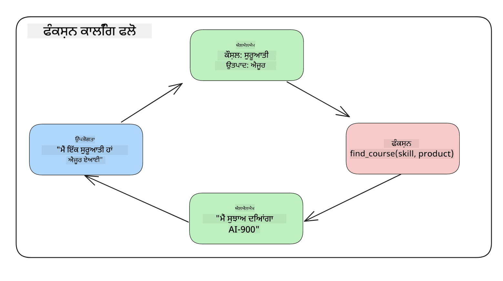
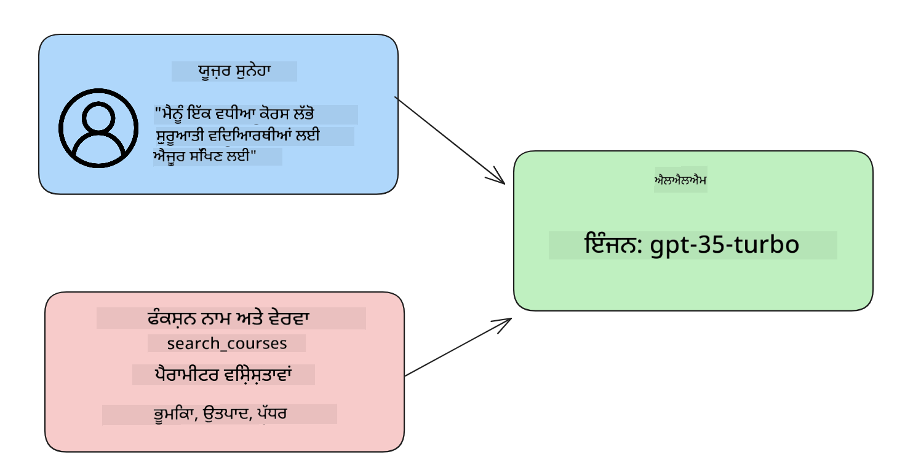

<!--
CO_OP_TRANSLATOR_METADATA:
{
  "original_hash": "f6f84f9ef2d066cd25850cab93580a50",
  "translation_date": "2025-10-17T14:12:46+00:00",
  "source_file": "11-integrating-with-function-calling/README.md",
  "language_code": "pa"
}
-->
# ਫੰਕਸ਼ਨ ਕਾਲਿੰਗ ਨਾਲ ਇੰਟੀਗ੍ਰੇਸ਼ਨ

[](https://youtu.be/DgUdCLX8qYQ?si=f1ouQU5HQx6F8Gl2)

ਤੁਹਾਨੂੰ ਪਿਛਲੇ ਪਾਠਾਂ ਵਿੱਚ ਕਾਫ਼ੀ ਕੁਝ ਸਿੱਖਣ ਨੂੰ ਮਿਲਿਆ ਹੈ। ਹਾਲਾਂਕਿ, ਅਸੀਂ ਹੋਰ ਸੁਧਾਰ ਕਰ ਸਕਦੇ ਹਾਂ। ਕੁਝ ਚੀਜ਼ਾਂ ਜਿਨ੍ਹਾਂ ਨੂੰ ਅਸੀਂ ਠੀਕ ਕਰ ਸਕਦੇ ਹਾਂ, ਉਹ ਹਨ ਜਿਵੇਂ ਕਿ ਅਸੀਂ ਜਵਾਬਾਂ ਨੂੰ ਹੋਰ ਸਹੀ ਫਾਰਮੈਟ ਵਿੱਚ ਕਿਵੇਂ ਪ੍ਰਾਪਤ ਕਰ ਸਕਦੇ ਹਾਂ ਤਾਂ ਜੋ ਅੱਗੇ ਦੇ ਕੰਮ ਲਈ ਜਵਾਬਾਂ ਨਾਲ ਕੰਮ ਕਰਨਾ ਆਸਾਨ ਹੋਵੇ। ਇਸ ਤੋਂ ਇਲਾਵਾ, ਅਸੀਂ ਹੋਰ ਸਰੋਤਾਂ ਤੋਂ ਡਾਟਾ ਸ਼ਾਮਲ ਕਰਕੇ ਆਪਣੀ ਐਪਲੀਕੇਸ਼ਨ ਨੂੰ ਹੋਰ ਵਧੀਆ ਬਣਾਉਣਾ ਚਾਹੁੰਦੇ ਹਾਂ।

ਇਹ ਪਾਠ ਉਪਰੋਕਤ ਸਮੱਸਿਆਵਾਂ ਨੂੰ ਹੱਲ ਕਰਨ ਲਈ ਹੈ।

## ਜਾਣ ਪਛਾਣ

ਇਹ ਪਾਠ ਵਿੱਚ ਕਵਰ ਕੀਤਾ ਜਾਵੇਗਾ:

- ਫੰਕਸ਼ਨ ਕਾਲਿੰਗ ਕੀ ਹੈ ਅਤੇ ਇਸਦੇ ਉਪਯੋਗ ਦੇ ਕੇਸਾਂ ਦੀ ਵਿਆਖਿਆ ਕਰੋ।
- Azure OpenAI ਦੀ ਵਰਤੋਂ ਕਰਕੇ ਫੰਕਸ਼ਨ ਕਾਲ ਬਣਾਉਣਾ।
- ਫੰਕਸ਼ਨ ਕਾਲ ਨੂੰ ਐਪਲੀਕੇਸ਼ਨ ਵਿੱਚ ਕਿਵੇਂ ਸ਼ਾਮਲ ਕਰਨਾ ਹੈ।

## ਸਿੱਖਣ ਦੇ ਲਕਸ਼

ਇਸ ਪਾਠ ਦੇ ਅੰਤ ਤੱਕ, ਤੁਸੀਂ ਇਹ ਕਰਨ ਦੇ ਯੋਗ ਹੋਵੋਗੇ:

- ਫੰਕਸ਼ਨ ਕਾਲਿੰਗ ਦੀ ਵਰਤੋਂ ਕਰਨ ਦੇ ਉਦੇਸ਼ ਦੀ ਵਿਆਖਿਆ ਕਰੋ।
- Azure OpenAI ਸੇਵਾ ਦੀ ਵਰਤੋਂ ਕਰਕੇ ਫੰਕਸ਼ਨ ਕਾਲ ਸੈਟਅੱਪ ਕਰੋ।
- ਆਪਣੀ ਐਪਲੀਕੇਸ਼ਨ ਦੇ ਉਪਯੋਗ ਦੇ ਕੇਸ ਲਈ ਪ੍ਰਭਾਵਸ਼ਾਲੀ ਫੰਕਸ਼ਨ ਕਾਲਾਂ ਡਿਜ਼ਾਈਨ ਕਰੋ।

## ਸਨਸਾਰ: ਸਾਡੇ ਚੈਟਬੋਟ ਨੂੰ ਫੰਕਸ਼ਨ ਨਾਲ ਸੁਧਾਰਨਾ

ਇਸ ਪਾਠ ਲਈ, ਅਸੀਂ ਆਪਣੀ ਸਿੱਖਿਆ ਸਟਾਰਟਅਪ ਲਈ ਇੱਕ ਫੀਚਰ ਬਣਾਉਣਾ ਚਾਹੁੰਦੇ ਹਾਂ ਜੋ ਉਪਭੋਗਤਾਵਾਂ ਨੂੰ ਤਕਨੀਕੀ ਕੋਰਸ ਲੱਭਣ ਲਈ ਚੈਟਬੋਟ ਦੀ ਵਰਤੋਂ ਕਰਨ ਦੀ ਆਗਿਆ ਦਿੰਦਾ ਹੈ। ਅਸੀਂ ਉਨ੍ਹਾਂ ਦੇ ਹੁਨਰ ਦੇ ਪੱਧਰ, ਮੌਜੂਦਾ ਭੂਮਿਕਾ ਅਤੇ ਦਿਲਚਸਪੀ ਵਾਲੀ ਤਕਨਾਲੋਜੀ ਦੇ ਅਧਾਰ 'ਤੇ ਕੋਰਸ ਦੀ ਸਿਫਾਰਸ਼ ਕਰਾਂਗੇ।

ਇਸ ਸਨਸਾਰ ਨੂੰ ਪੂਰਾ ਕਰਨ ਲਈ, ਅਸੀਂ ਹੇਠਾਂ ਦਿੱਤੇ ਕੰਬੀਨੇਸ਼ਨ ਦੀ ਵਰਤੋਂ ਕਰਾਂਗੇ:

- `Azure OpenAI` ਉਪਭੋਗਤਾ ਲਈ ਚੈਟ ਅਨੁਭਵ ਬਣਾਉਣ ਲਈ।
- `Microsoft Learn Catalog API` ਉਪਭੋਗਤਾਵਾਂ ਨੂੰ ਉਨ੍ਹਾਂ ਦੀ ਬੇਨਤੀ ਦੇ ਅਧਾਰ 'ਤੇ ਕੋਰਸ ਲੱਭਣ ਵਿੱਚ ਮਦਦ ਕਰਨ ਲਈ।
- `Function Calling` ਉਪਭੋਗਤਾ ਦੀ ਪੁੱਛਗਿੱਛ ਨੂੰ ਲੈ ਕੇ ਇਸਨੂੰ API ਬੇਨਤੀ ਕਰਨ ਲਈ ਫੰਕਸ਼ਨ ਨੂੰ ਭੇਜਣ ਲਈ।

ਸ਼ੁਰੂ ਕਰਨ ਲਈ, ਆਓ ਵੇਖੀਏ ਕਿ ਅਸੀਂ ਪਹਿਲਾਂ ਫੰਕਸ਼ਨ ਕਾਲਿੰਗ ਦੀ ਵਰਤੋਂ ਕਿਉਂ ਕਰਦੇ ਹਾਂ:

## ਫੰਕਸ਼ਨ ਕਾਲਿੰਗ ਕਿਉਂ

ਫੰਕਸ਼ਨ ਕਾਲਿੰਗ ਤੋਂ ਪਹਿਲਾਂ, LLM ਤੋਂ ਜਵਾਬ ਅਸੰਰਚਿਤ ਅਤੇ ਅਸਥਿਰ ਹੁੰਦੇ ਸਨ। ਡਿਵੈਲਪਰਾਂ ਨੂੰ ਹਰ ਜਵਾਬ ਦੇ ਵੈਰੀਏਸ਼ਨ ਨੂੰ ਸੰਭਾਲਣ ਲਈ ਜਟਿਲ ਵੈਰੀਫਿਕੇਸ਼ਨ ਕੋਡ ਲਿਖਣ ਦੀ ਲੋੜ ਸੀ। ਉਪਭੋਗਤਾ "ਸਟਾਕਹੋਮ ਵਿੱਚ ਮੌਜੂਦਾ ਮੌਸਮ ਕੀ ਹੈ?" ਵਰਗੇ ਸਵਾਲਾਂ ਦੇ ਜਵਾਬ ਨਹੀਂ ਲੈ ਸਕਦੇ ਸਨ। ਇਹ ਇਸ ਲਈ ਹੈ ਕਿਉਂਕਿ ਮਾਡਲ ਸਿਰਫ ਉਸ ਸਮੇਂ ਤੱਕ ਸੀਮਿਤ ਸਨ ਜਦੋਂ ਡਾਟਾ ਨੂੰ ਟ੍ਰੇਨ ਕੀਤਾ ਗਿਆ ਸੀ।

ਫੰਕਸ਼ਨ ਕਾਲਿੰਗ Azure OpenAI ਸੇਵਾ ਦੀ ਇੱਕ ਵਿਸ਼ੇਸ਼ਤਾ ਹੈ ਜੋ ਹੇਠਾਂ ਦਿੱਤੀਆਂ ਪਾਬੰਦੀਆਂ ਨੂੰ ਦੂਰ ਕਰਨ ਲਈ ਹੈ:

- **ਸਥਿਰ ਜਵਾਬ ਫਾਰਮੈਟ**। ਜੇਕਰ ਅਸੀਂ ਜਵਾਬ ਦੇ ਫਾਰਮੈਟ ਨੂੰ ਹੋਰ ਵਧੀਆ ਤਰੀਕੇ ਨਾਲ ਕੰਟਰੋਲ ਕਰ ਸਕਦੇ ਹਾਂ ਤਾਂ ਅਸੀਂ ਜਵਾਬ ਨੂੰ ਹੋਰ ਸਿਸਟਮਾਂ ਵਿੱਚ ਅੱਗੇ ਸ਼ਾਮਲ ਕਰਨਾ ਆਸਾਨੀ ਨਾਲ ਕਰ ਸਕਦੇ ਹਾਂ।
- **ਬਾਹਰੀ ਡਾਟਾ**। ਚੈਟ ਸੰਦਰਭ ਵਿੱਚ ਐਪਲੀਕੇਸ਼ਨ ਦੇ ਹੋਰ ਸਰੋਤਾਂ ਤੋਂ ਡਾਟਾ ਦੀ ਵਰਤੋਂ ਕਰਨ ਦੀ ਸਮਰੱਥਾ।

## ਸਨਸਾਰ ਰਾਹੀਂ ਸਮੱਸਿਆ ਨੂੰ ਦਰਸਾਉਣਾ

> ਅਸੀਂ ਤੁਹਾਨੂੰ ਸਿਫਾਰਸ਼ ਕਰਦੇ ਹਾਂ ਕਿ ਜੇਕਰ ਤੁਸੀਂ ਹੇਠਾਂ ਦਿੱਤੇ ਸਨਸਾਰ ਨੂੰ ਚਲਾਉਣਾ ਚਾਹੁੰਦੇ ਹੋ ਤਾਂ [ਸ਼ਾਮਲ ਨੋਟਬੁੱਕ](./python/aoai-assignment.ipynb?WT.mc_id=academic-105485-koreyst) ਦੀ ਵਰਤੋਂ ਕਰੋ। ਤੁਸੀਂ ਸਿਰਫ ਪੜ੍ਹ ਸਕਦੇ ਹੋ ਜਿਵੇਂ ਅਸੀਂ ਇੱਕ ਸਮੱਸਿਆ ਨੂੰ ਦਰਸਾਉਣ ਦੀ ਕੋਸ਼ਿਸ਼ ਕਰ ਰਹੇ ਹਾਂ ਜਿੱਥੇ ਫੰਕਸ਼ਨ ਇਸ ਸਮੱਸਿਆ ਨੂੰ ਹੱਲ ਕਰਨ ਵਿੱਚ ਮਦਦ ਕਰ ਸਕਦੇ ਹਨ।

ਆਓ ਉਸ ਉਦਾਹਰਨ ਨੂੰ ਵੇਖੀਏ ਜੋ ਜਵਾਬ ਦੇ ਫਾਰਮੈਟ ਦੀ ਸਮੱਸਿਆ ਨੂੰ ਦਰਸਾਉਂਦਾ ਹੈ:

ਆਓ ਕਹੀਏ ਕਿ ਅਸੀਂ ਵਿਦਿਆਰਥੀ ਡਾਟਾ ਦਾ ਡੇਟਾਬੇਸ ਬਣਾਉਣਾ ਚਾਹੁੰਦੇ ਹਾਂ ਤਾਂ ਜੋ ਅਸੀਂ ਉਨ੍ਹਾਂ ਨੂੰ ਸਹੀ ਕੋਰਸ ਦੀ ਸਿਫਾਰਸ਼ ਕਰ ਸਕੀਏ। ਹੇਠਾਂ ਸਾਡੇ ਕੋਲ ਵਿਦਿਆਰਥੀਆਂ ਦੇ ਦੋ ਵਰਣਨ ਹਨ ਜੋ ਉਨ੍ਹਾਂ ਵਿੱਚ ਸ਼ਾਮਲ ਡਾਟਾ ਵਿੱਚ ਬਹੁਤ ਹੀ ਸਮਾਨ ਹਨ।

1. ਸਾਡੇ Azure OpenAI ਸਰੋਤ ਨਾਲ ਕਨੈਕਸ਼ਨ ਬਣਾਓ:

   ```python
   import os
   import json
   from openai import AzureOpenAI
   from dotenv import load_dotenv
   load_dotenv()

   client = AzureOpenAI(
   api_key=os.environ['AZURE_OPENAI_API_KEY'],  # this is also the default, it can be omitted
   api_version = "2023-07-01-preview"
   )

   deployment=os.environ['AZURE_OPENAI_DEPLOYMENT']
   ```

   ਹੇਠਾਂ ਕੁਝ Python ਕੋਡ ਹੈ ਜੋ ਸਾਡੇ Azure OpenAI ਨਾਲ ਕਨਫਿਗਰ ਕਰਨ ਲਈ ਹੈ ਜਿੱਥੇ ਅਸੀਂ `api_type`, `api_base`, `api_version` ਅਤੇ `api_key` ਸੈਟ ਕਰਦੇ ਹਾਂ।

1. ਦੋ ਵਿਦਿਆਰਥੀ ਵਰਣਨ ਬਣਾਉਣਾ ਜਿਨ੍ਹਾਂ ਨੂੰ `student_1_description` ਅਤੇ `student_2_description` ਵੈਰੀਏਬਲਾਂ ਦੀ ਵਰਤੋਂ ਕਰਕੇ ਬਣਾਇਆ ਗਿਆ ਹੈ।

   ```python
   student_1_description="Emily Johnson is a sophomore majoring in computer science at Duke University. She has a 3.7 GPA. Emily is an active member of the university's Chess Club and Debate Team. She hopes to pursue a career in software engineering after graduating."

   student_2_description = "Michael Lee is a sophomore majoring in computer science at Stanford University. He has a 3.8 GPA. Michael is known for his programming skills and is an active member of the university's Robotics Club. He hopes to pursue a career in artificial intelligence after finishing his studies."
   ```

   ਅਸੀਂ ਉਪਰੋਕਤ ਵਿਦਿਆਰਥੀ ਵਰਣਨ ਨੂੰ LLM ਨੂੰ ਭੇਜਣਾ ਚਾਹੁੰਦੇ ਹਾਂ ਤਾਂ ਕਿ ਡਾਟਾ ਨੂੰ ਪਾਰਸ ਕੀਤਾ ਜਾ ਸਕੇ। ਇਹ ਡਾਟਾ ਬਾਅਦ ਵਿੱਚ ਸਾਡੀ ਐਪਲੀਕੇਸ਼ਨ ਵਿੱਚ ਵਰਤਿਆ ਜਾ ਸਕਦਾ ਹੈ ਅਤੇ API ਨੂੰ ਭੇਜਿਆ ਜਾ ਸਕਦਾ ਹੈ ਜਾਂ ਡੇਟਾਬੇਸ ਵਿੱਚ ਸਟੋਰ ਕੀਤਾ ਜਾ ਸਕਦਾ ਹੈ।

1. ਆਓ ਦੋ ਇੱਕੋ ਜਿਹੇ ਪ੍ਰੋੰਪਟ ਬਣਾਈਏ ਜਿਨ੍ਹਾਂ ਵਿੱਚ ਅਸੀਂ LLM ਨੂੰ ਦੱਸਦੇ ਹਾਂ ਕਿ ਅਸੀਂ ਕਿਹੜੀ ਜਾਣਕਾਰੀ ਵਿੱਚ ਦਿਲਚਸਪੀ ਰੱਖਦੇ ਹਾਂ:

   ```python
   prompt1 = f'''
   Please extract the following information from the given text and return it as a JSON object:

   name
   major
   school
   grades
   club

   This is the body of text to extract the information from:
   {student_1_description}
   '''

   prompt2 = f'''
   Please extract the following information from the given text and return it as a JSON object:

   name
   major
   school
   grades
   club

   This is the body of text to extract the information from:
   {student_2_description}
   '''
   ```

   ਉਪਰੋਕਤ ਪ੍ਰੋੰਪਟ LLM ਨੂੰ ਜਾਣਕਾਰੀ ਕੱਢਣ ਲਈ ਦਿਸ਼ਾ-ਨਿਰਦੇਸ਼ ਦਿੰਦੇ ਹਨ ਅਤੇ ਜਵਾਬ JSON ਫਾਰਮੈਟ ਵਿੱਚ ਵਾਪਸ ਕਰਨ ਲਈ ਕਹਿੰਦੇ ਹਨ।

1. ਪ੍ਰੋੰਪਟ ਅਤੇ Azure OpenAI ਨਾਲ ਕਨੈਕਸ਼ਨ ਸੈਟਅੱਪ ਕਰਨ ਤੋਂ ਬਾਅਦ, ਅਸੀਂ ਹੁਣ ਪ੍ਰੋੰਪਟ ਨੂੰ LLM ਨੂੰ ਭੇਜਾਂਗੇ `openai.ChatCompletion` ਦੀ ਵਰਤੋਂ ਕਰਕੇ। ਅਸੀਂ ਪ੍ਰੋੰਪਟ ਨੂੰ `messages` ਵੈਰੀਏਬਲ ਵਿੱਚ ਸਟੋਰ ਕਰਦੇ ਹਾਂ ਅਤੇ ਰੋਲ ਨੂੰ `user` ਵਿੱਚ ਅਸਾਈਨ ਕਰਦੇ ਹਾਂ। ਇਹ ਇੱਕ ਉਪਭੋਗਤਾ ਦੁਆਰਾ ਚੈਟਬੋਟ ਨੂੰ ਲਿਖੇ ਗਏ ਸੁਨੇਹੇ ਨੂੰ ਨਕਲ ਕਰਨ ਲਈ ਹੈ।

   ```python
   # response from prompt one
   openai_response1 = client.chat.completions.create(
   model=deployment,
   messages = [{'role': 'user', 'content': prompt1}]
   )
   openai_response1.choices[0].message.content

   # response from prompt two
   openai_response2 = client.chat.completions.create(
   model=deployment,
   messages = [{'role': 'user', 'content': prompt2}]
   )
   openai_response2.choices[0].message.content
   ```

ਹੁਣ ਅਸੀਂ ਦੋਵੇਂ ਬੇਨਤੀਆਂ ਨੂੰ LLM ਨੂੰ ਭੇਜ ਸਕਦੇ ਹਾਂ ਅਤੇ ਪ੍ਰਾਪਤ ਜਵਾਬ ਦੀ ਜਾਂਚ ਕਰ ਸਕਦੇ ਹਾਂ ਜਿਵੇਂ ਕਿ `openai_response1['choices'][0]['message']['content']`।

1. ਆਖਰ ਵਿੱਚ, ਅਸੀਂ ਜਵਾਬ ਨੂੰ JSON ਫਾਰਮੈਟ ਵਿੱਚ `json.loads` ਕਾਲ ਕਰਕੇ ਕਨਵਰਟ ਕਰ ਸਕਦੇ ਹਾਂ:

   ```python
   # Loading the response as a JSON object
   json_response1 = json.loads(openai_response1.choices[0].message.content)
   json_response1
   ```

   ਜਵਾਬ 1:

   ```json
   {
     "name": "Emily Johnson",
     "major": "computer science",
     "school": "Duke University",
     "grades": "3.7",
     "club": "Chess Club"
   }
   ```

   ਜਵਾਬ 2:

   ```json
   {
     "name": "Michael Lee",
     "major": "computer science",
     "school": "Stanford University",
     "grades": "3.8 GPA",
     "club": "Robotics Club"
   }
   ```

   ਹਾਲਾਂਕਿ ਪ੍ਰੋੰਪਟ ਇੱਕੋ ਜਿਹੇ ਹਨ ਅਤੇ ਵਰਣਨ ਸਮਾਨ ਹਨ, ਅਸੀਂ ਵੇਖਦੇ ਹਾਂ ਕਿ `Grades` ਪ੍ਰਾਪਰਟੀ ਦੇ ਮੁੱਲ ਵੱਖ-ਵੱਖ ਫਾਰਮੈਟ ਵਿੱਚ ਹਨ, ਜਿਵੇਂ ਕਿ ਕਦੇ ਕਦੇ `3.7` ਜਾਂ `3.7 GPA`।

   ਇਹ ਨਤੀਜਾ ਇਸ ਲਈ ਹੈ ਕਿਉਂਕਿ LLM ਅਸੰਰਚਿਤ ਡਾਟਾ ਨੂੰ ਲਿਖੇ ਪ੍ਰੋੰਪਟ ਦੇ ਰੂਪ ਵਿੱਚ ਲੈਂਦਾ ਹੈ ਅਤੇ ਅਸੰਰਚਿਤ ਡਾਟਾ ਵਾਪਸ ਕਰਦਾ ਹੈ। ਸਾਨੂੰ ਇੱਕ ਸੰਰਚਿਤ ਫਾਰਮੈਟ ਦੀ ਲੋੜ ਹੈ ਤਾਂ ਕਿ ਅਸੀਂ ਜਾਣ ਸਕੀਏ ਕਿ ਇਸ ਡਾਟਾ ਨੂੰ ਸਟੋਰ ਜਾਂ ਵਰਤਣ ਸਮੇਂ ਕੀ ਉਮੀਦ ਕਰਨੀ ਹੈ।

ਤਾਂ ਫਾਰਮੈਟਿੰਗ ਦੀ ਸਮੱਸਿਆ ਨੂੰ ਹੱਲ ਕਰਨ ਲਈ ਅਸੀਂ ਕੀ ਕਰਦੇ ਹਾਂ? ਫੰਕਸ਼ਨ ਕਾਲਿੰਗ ਦੀ ਵਰਤੋਂ ਕਰਕੇ, ਅਸੀਂ ਇਹ ਯਕੀਨੀ ਬਣਾ ਸਕਦੇ ਹਾਂ ਕਿ ਸਾਨੂੰ ਵਾਪਸ ਸੰਰਚਿਤ ਡਾਟਾ ਮਿਲਦਾ ਹੈ। ਫੰਕਸ਼ਨ ਕਾਲਿੰਗ ਦੀ ਵਰਤੋਂ ਕਰਦੇ ਸਮੇਂ, LLM ਅਸਲ ਵਿੱਚ ਕੋਈ ਫੰਕਸ਼ਨ ਕਾਲ ਜਾਂ ਚਲਾਉਂਦਾ ਨਹੀਂ ਹੈ। ਇਸਦੀ ਬਜਾਏ, ਅਸੀਂ LLM ਦੇ ਜਵਾਬਾਂ ਲਈ ਇੱਕ ਸੰਰਚਨਾ ਬਣਾਉਂਦੇ ਹਾਂ। ਫਿਰ ਅਸੀਂ ਉਹ ਸੰਰਚਿਤ ਜਵਾਬਾਂ ਵਰਤਦੇ ਹਾਂ ਤਾਂ ਕਿ ਜਾਣ ਸਕੀਏ ਕਿ ਸਾਡੀ ਐਪਲੀਕੇਸ਼ਨ ਵਿੱਚ ਕਿਹੜਾ ਫੰਕਸ਼ਨ ਚਲਾਉਣਾ ਹੈ।



ਫਿਰ ਅਸੀਂ ਫੰਕਸ਼ਨ ਤੋਂ ਵਾਪਸ ਆਉਣ ਵਾਲੇ ਡਾਟਾ ਨੂੰ ਲੈ ਕੇ LLM ਨੂੰ ਭੇਜ ਸਕਦੇ ਹਾਂ। LLM ਫਿਰ ਉਪਭੋਗਤਾ ਦੀ ਪੁੱਛਗਿੱਛ ਦਾ ਜਵਾਬ ਦੇਣ ਲਈ ਕੁਦਰਤੀ ਭਾਸ਼ਾ ਦੀ ਵਰਤੋਂ ਕਰੇਗਾ।

## ਫੰਕਸ਼ਨ ਕਾਲਾਂ ਦੀ ਵਰਤੋਂ ਦੇ ਕੇਸ

ਫੰਕਸ਼ਨ ਕਾਲਾਂ ਤੁਹਾਡੀ ਐਪਲੀਕੇਸ਼ਨ ਨੂੰ ਸੁਧਾਰਨ ਲਈ ਕਈ ਵੱਖ-ਵੱਖ ਉਪਯੋਗ ਦੇ ਕੇਸਾਂ ਵਿੱਚ ਮਦਦ ਕਰ ਸਕਦੇ ਹਨ ਜਿਵੇਂ:

- **ਬਾਹਰੀ ਟੂਲ ਕਾਲ ਕਰਨਾ**। ਚੈਟਬੋਟ ਉਪਭੋਗਤਾਵਾਂ ਦੇ ਸਵਾਲਾਂ ਦੇ ਜਵਾਬ ਦੇਣ ਵਿੱਚ ਸ਼ਾਨਦਾਰ ਹਨ। ਫੰਕਸ਼ਨ ਕਾਲਿੰਗ ਦੀ ਵਰਤੋਂ ਕਰਕੇ, ਚੈਟਬੋਟ ਉਪਭੋਗਤਾਵਾਂ ਦੇ ਸੁਨੇਹਿਆਂ ਦੀ ਵਰਤੋਂ ਕਰਕੇ ਕੁਝ ਕੰਮ ਪੂਰੇ ਕਰ ਸਕਦੇ ਹਨ। ਉਦਾਹਰਣ ਲਈ, ਇੱਕ ਵਿਦਿਆਰਥੀ ਚੈਟਬੋਟ ਨੂੰ ਪੁੱਛ ਸਕਦਾ ਹੈ "ਮੇਰੇ ਅਧਿਆਪਕ ਨੂੰ ਇੱਕ ਈਮੇਲ ਭੇਜੋ ਕਿ ਮੈਂ ਇਸ ਵਿਸ਼ੇ ਵਿੱਚ ਹੋਰ ਮਦਦ ਦੀ ਲੋੜ ਹੈ।" ਇਹ `send_email(to: string, body: string)` ਨੂੰ ਕਾਲ ਕਰ ਸਕਦਾ ਹੈ।

- **API ਜਾਂ ਡੇਟਾਬੇਸ ਪੁੱਛਗਿੱਛ ਬਣਾਉਣਾ**। ਉਪਭੋਗਤਾ ਕੁਦਰਤੀ ਭਾਸ਼ਾ ਦੀ ਵਰਤੋਂ ਕਰਕੇ ਜਾਣਕਾਰੀ ਲੱਭ ਸਕਦੇ ਹਨ ਜੋ ਇੱਕ ਫਾਰਮੈਟ ਕੀਤੇ ਪੁੱਛਗਿੱਛ ਜਾਂ API ਬੇਨਤੀ ਵਿੱਚ ਬਦਲ ਜਾਂਦੀ ਹੈ। ਇਸਦਾ ਇੱਕ ਉਦਾਹਰਣ ਇੱਕ ਅਧਿਆਪਕ ਹੋ ਸਕਦਾ ਹੈ ਜੋ ਪੁੱਛਦਾ ਹੈ "ਕੌਣ ਵਿਦਿਆਰਥੀ ਹਨ ਜਿਨ੍ਹਾਂ ਨੇ ਆਖਰੀ ਅਸਾਈਨਮੈਂਟ ਪੂਰਾ ਕੀਤਾ ਹੈ" ਜੋ `get_completed(student_name: string, assignment: int, current_status: string)` ਨਾਮਕ ਫੰਕਸ਼ਨ ਨੂੰ ਕਾਲ ਕਰ ਸਕਦਾ ਹੈ।

- **ਸੰਰਚਿਤ ਡਾਟਾ ਬਣਾਉਣਾ**। ਉਪਭੋਗਤਾ ਇੱਕ ਟੈਕਸਟ ਬਲਾਕ ਜਾਂ CSV ਲੈ ਸਕਦੇ ਹਨ ਅਤੇ LLM ਦੀ ਵਰਤੋਂ ਕਰਕੇ ਇਸ ਵਿੱਚੋਂ ਮਹੱਤਵਪੂਰਨ ਜਾਣਕਾਰੀ ਕੱਢ ਸਕਦੇ ਹਨ। ਉਦਾਹਰਣ ਲਈ, ਇੱਕ ਵਿਦਿਆਰਥੀ ਸ਼ਾਂਤੀ ਸਮਝੌਤਿਆਂ ਬਾਰੇ ਇੱਕ ਵਿਕੀਪੀਡੀਆ ਲੇਖ ਨੂੰ AI ਫਲੈਸ਼ਕਾਰਡ ਬਣਾਉਣ ਲਈ ਬਦਲ ਸਕਦਾ ਹੈ। ਇਹ `get_important_facts(agreement_name: string, date_signed: string, parties_involved: list)` ਨਾਮਕ ਫੰਕਸ਼ਨ ਦੀ ਵਰਤੋਂ ਕਰਕੇ ਕੀਤਾ ਜਾ ਸਕਦਾ ਹੈ।

## ਆਪਣੀ ਪਹਿਲੀ ਫੰਕਸ਼ਨ ਕਾਲ ਬਣਾਉਣਾ

ਫੰਕਸ਼ਨ ਕਾਲ ਬਣਾਉਣ ਦੀ ਪ੍ਰਕਿਰਿਆ ਵਿੱਚ 3 ਮੁੱਖ ਕਦਮ ਸ਼ਾਮਲ ਹਨ:

1. **ਕਾਲ ਕਰਨਾ** Chat Completions API ਨੂੰ ਤੁਹਾਡੇ ਫੰਕਸ਼ਨਾਂ ਦੀ ਸੂਚੀ ਅਤੇ ਉਪਭੋਗਤਾ ਸੁਨੇਹੇ ਨਾਲ।
2. **ਪੜ੍ਹਨਾ** ਮਾਡਲ ਦੇ ਜਵਾਬ ਨੂੰ ਕਾਰਵਾਈ ਕਰਨ ਲਈ ਜਿਵੇਂ ਕਿ ਫੰਕਸ਼ਨ ਜਾਂ API ਕਾਲ ਚਲਾਉਣਾ।
3. **ਕਰਨਾ** Chat Completions API ਨੂੰ ਫੰਕਸ਼ਨ ਦੇ ਜਵਾਬ ਨਾਲ ਦੁਬਾਰਾ ਕਾਲ ਕਰਨਾ ਤਾਂ ਜੋ ਇਸ ਜਾਣਕਾਰੀ ਦੀ ਵਰਤੋਂ ਕਰਕੇ ਉਪਭੋਗਤਾ ਨੂੰ ਜਵਾਬ ਦਿੱਤਾ ਜਾ ਸਕੇ।



### ਕਦਮ 1 - ਸੁਨੇਹੇ ਬਣਾਉਣਾ

ਪਹਿਲਾ ਕਦਮ ਇੱਕ ਉਪਭੋਗਤਾ ਸੁਨੇਹਾ ਬਣਾਉਣਾ ਹੈ। ਇਹ ਟੈਕਸਟ ਇਨਪੁੱਟ ਦੇ ਮੁੱਲ ਨੂੰ ਲੈ ਕੇ ਗਤੀਸ਼ੀਲ ਤੌਰ 'ਤੇ ਅਸਾਈਨ ਕੀਤਾ ਜਾ ਸਕਦਾ ਹੈ ਜਾਂ ਤੁਸੀਂ ਇੱਥੇ ਇੱਕ ਮੁੱਲ ਅਸਾਈਨ ਕਰ ਸਕਦੇ ਹੋ। ਜੇਕਰ ਇਹ ਤੁਹਾਡਾ ਪਹਿਲਾ ਵਾਰ Chat Completions API ਨਾਲ ਕੰਮ ਕਰਨਾ ਹੈ, ਤਾਂ ਸਾਨੂੰ ਸੁਨੇਹੇ ਦੇ `role` ਅਤੇ `content` ਨੂੰ ਪਰਿਭਾਸ਼ਿਤ ਕਰਨ ਦੀ ਲੋੜ ਹੈ।

`role` `system` (ਨਿਯਮ ਬਣਾਉਣਾ), `assistant` (ਮਾਡਲ) ਜਾਂ `user` (ਅੰਤਮ ਉਪਭੋਗਤਾ) ਹੋ ਸਕਦਾ ਹੈ। ਫੰਕਸ਼ਨ ਕਾਲਿੰਗ ਲਈ, ਅਸੀਂ ਇਸਨੂੰ `user` ਵਜੋਂ ਅਸਾਈਨ ਕਰਾਂਗੇ ਅਤੇ ਇੱਕ ਉਦਾਹਰਣ ਸਵਾਲ।

```python
messages= [ {"role": "user", "content": "Find me a good course for a beginner student to learn Azure."} ]
```

ਵੱਖ-ਵੱਖ ਰੋਲਾਂ ਨੂੰ ਅਸਾਈਨ ਕਰਕੇ, ਇਹ LLM ਲਈ ਸਪਸ਼ਟ ਕੀਤਾ ਜਾਂਦਾ ਹੈ ਕਿ ਕੀ ਇਹ ਸਿਸਟਮ ਕੁਝ ਕਹਿ ਰਿਹਾ ਹੈ ਜਾਂ ਉਪਭੋਗਤਾ, ਜੋ LLM ਨੂੰ ਉਸਦੇ ਅਧਾਰ 'ਤੇ ਗੱਲਬਾਤ ਦਾ ਇਤਿਹਾਸ ਬਣਾਉਣ ਵਿੱਚ ਮਦਦ ਕਰਦਾ ਹੈ।

### ਕਦਮ 2 - ਫੰਕਸ਼ਨ ਬਣਾਉਣਾ

ਅਗਲੇ, ਅਸੀਂ ਇੱਕ ਫੰਕਸ਼ਨ ਅਤੇ ਉਸ ਫੰਕਸ਼ਨ ਦੇ ਪੈਰਾਮੀਟਰਾਂ ਨੂੰ ਪਰਿਭਾਸ਼ਿਤ ਕਰਾਂਗੇ। ਅਸੀਂ ਇੱਥੇ ਸਿਰਫ ਇੱਕ ਫੰਕਸ਼ਨ ਦੀ ਵਰਤੋਂ ਕਰਾਂਗੇ ਜਿਸਨੂੰ `search_courses` ਕਿਹਾ ਜਾਂਦਾ ਹੈ ਪਰ ਤੁਸੀਂ ਕਈ ਫੰਕਸ਼ਨ ਬਣਾਉਣ ਕਰ ਸਕਦੇ ਹੋ।

> **ਮਹੱਤਵਪੂਰਨ** : ਫੰਕਸ਼ਨ LLM ਨੂੰ ਸਿਸਟਮ ਸੁਨੇਹੇ ਵਿੱਚ ਸ਼ਾਮਲ ਕੀਤੇ ਜਾਂਦੇ ਹਨ ਅਤੇ ਤੁਹਾਡੇ ਕੋਲ ਉਪਲਬਧ ਟੋਕਨ ਦੀ ਮਾਤਰਾ ਵਿੱਚ ਸ਼ਾਮਲ ਕੀਤੇ ਜਾਣਗੇ।

ਹੇਠਾਂ, ਅਸੀਂ ਫੰਕਸ਼ਨਾਂ ਨੂੰ ਆਈਟਮਾਂ ਦੀ ਐਰੇ ਵਜੋਂ ਬਣਾਉਂਦੇ ਹਾਂ। ਹਰ ਆਈਟਮ ਇੱਕ ਫੰਕਸ਼ਨ ਹੈ ਅਤੇ ਇਸਦੇ ਗੁਣ `name`, `description` ਅਤੇ `parameters` ਹਨ:

```python
functions = [
   {
      "name":"search_courses",
      "description":"Retrieves courses from the search index based on the parameters provided",
      "parameters":{
         "type":"object",
         "properties":{
            "role":{
               "type":"string",
               "description":"The role of the learner (i.e. developer, data scientist, student, etc.)"
            },
            "product":{
               "type":"string",
               "description":"The product that the lesson is covering (i.e. Azure, Power BI, etc.)"
            },
            "level":{
               "type":"string",
               "description":"The level of experience the learner has prior to taking the course (i.e. beginner, intermediate, advanced)"
            }
         },
         "required":[
            "role"
         ]
      }
   }
]
```

ਆਓ ਹੇਠਾਂ ਹਰ ਫੰਕਸ਼ਨ ਇੰਸਟੈਂਸ ਨੂੰ ਹੋਰ ਵਿਸਥਾਰ ਵਿੱਚ ਵੇਖੀਏ:

- `name` - ਉਸ ਫੰਕਸ਼ਨ ਦਾ ਨਾਮ ਜਿਸਨੂੰ ਅਸੀਂ ਕਾਲ ਕਰਨਾ ਚਾਹੁੰਦੇ ਹਾਂ।
- `description` - ਇਹ ਫੰਕਸ਼ਨ ਕਿਵੇਂ ਕੰਮ ਕਰਦਾ ਹੈ ਇਸਦਾ ਵਰਣਨ। ਇੱਥੇ ਸਪਸ਼ਟ ਅਤੇ ਸਹੀ ਹੋਣਾ ਮਹੱਤਵਪੂਰਨ ਹੈ।
- `parameters` - ਉਹ ਮੁੱਲਾਂ ਅਤੇ ਫਾਰਮੈਟ ਦੀ ਸੂਚੀ ਜੋ ਤੁਸੀਂ ਮਾਡਲ ਨੂੰ ਆਪਣੇ ਜਵਾਬ ਲਈ ਪੈਦਾ ਕਰਨ ਲਈ ਚਾਹੁੰਦੇ ਹੋ। ਪੈਰਾਮੀਟਰ ਐਰੇ ਵਿੱਚ ਆਈਟਮ ਹੁ
- ਫੰਕਸ਼ਨ ਕਾਲ ਅਤੇ/ਜਾਂ API ਕਾਲ ਦੇ ਵਾਪਸ ਕੋਈ ਉਚਿਤ ਕੋਰਸ ਨਾ ਦੇਣ ਦੀ ਸਥਿਤੀ ਵਿੱਚ ਗਲਤੀ ਸੰਭਾਲਣ ਬਣਾਓ

ਸੁਝਾਅ: [Learn API reference documentation](https://learn.microsoft.com/training/support/catalog-api-developer-reference?WT.mc_id=academic-105485-koreyst) ਪੰਨੇ ਨੂੰ ਦੇਖੋ ਕਿ ਇਹ ਡਾਟਾ ਕਿਵੇਂ ਅਤੇ ਕਿੱਥੇ ਉਪਲਬਧ ਹੈ।

## ਸ਼ਾਨਦਾਰ ਕੰਮ! ਯਾਤਰਾ ਜਾਰੀ ਰੱਖੋ

ਇਹ ਪਾਠ ਪੂਰਾ ਕਰਨ ਤੋਂ ਬਾਅਦ, ਸਾਡੇ [Generative AI Learning collection](https://aka.ms/genai-collection?WT.mc_id=academic-105485-koreyst) ਨੂੰ ਦੇਖੋ ਤਾਂ ਜੋ ਆਪਣੀ Generative AI ਜਾਣਕਾਰੀ ਨੂੰ ਹੋਰ ਉੱਚਾ ਕਰ ਸਕੋ!

ਪਾਠ 12 ਵੱਲ ਜਾਓ, ਜਿੱਥੇ ਅਸੀਂ ਦੇਖਾਂਗੇ ਕਿ [AI ਐਪਲੀਕੇਸ਼ਨ ਲਈ UX ਕਿਵੇਂ ਡਿਜ਼ਾਈਨ ਕਰਨਾ ਹੈ](../12-designing-ux-for-ai-applications/README.md?WT.mc_id=academic-105485-koreyst)!

---

**ਅਸਵੀਕਰਤਾ**:  
ਇਹ ਦਸਤਾਵੇਜ਼ AI ਅਨੁਵਾਦ ਸੇਵਾ [Co-op Translator](https://github.com/Azure/co-op-translator) ਦੀ ਵਰਤੋਂ ਕਰਕੇ ਅਨੁਵਾਦ ਕੀਤਾ ਗਿਆ ਹੈ। ਜਦੋਂ ਕਿ ਅਸੀਂ ਸਹੀ ਹੋਣ ਦੀ ਕੋਸ਼ਿਸ਼ ਕਰਦੇ ਹਾਂ, ਕਿਰਪਾ ਕਰਕੇ ਧਿਆਨ ਦਿਓ ਕਿ ਸਵੈਚਾਲਿਤ ਅਨੁਵਾਦਾਂ ਵਿੱਚ ਗਲਤੀਆਂ ਜਾਂ ਅਸੁੱਤੀਆਂ ਹੋ ਸਕਦੀਆਂ ਹਨ। ਇਸ ਦੀ ਮੂਲ ਭਾਸ਼ਾ ਵਿੱਚ ਮੂਲ ਦਸਤਾਵੇਜ਼ ਨੂੰ ਅਧਿਕਾਰਤ ਸਰੋਤ ਮੰਨਿਆ ਜਾਣਾ ਚਾਹੀਦਾ ਹੈ। ਮਹੱਤਵਪੂਰਨ ਜਾਣਕਾਰੀ ਲਈ, ਪੇਸ਼ੇਵਰ ਮਨੁੱਖੀ ਅਨੁਵਾਦ ਦੀ ਸਿਫਾਰਸ਼ ਕੀਤੀ ਜਾਂਦੀ ਹੈ। ਇਸ ਅਨੁਵਾਦ ਦੀ ਵਰਤੋਂ ਤੋਂ ਪੈਦਾ ਹੋਣ ਵਾਲੇ ਕਿਸੇ ਵੀ ਗਲਤਫਹਿਮੀ ਜਾਂ ਗਲਤ ਵਿਆਖਿਆ ਲਈ ਅਸੀਂ ਜ਼ਿੰਮੇਵਾਰ ਨਹੀਂ ਹਾਂ।