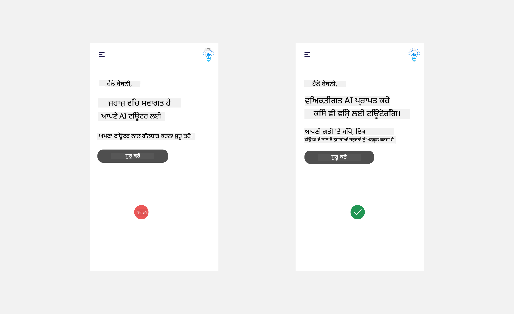
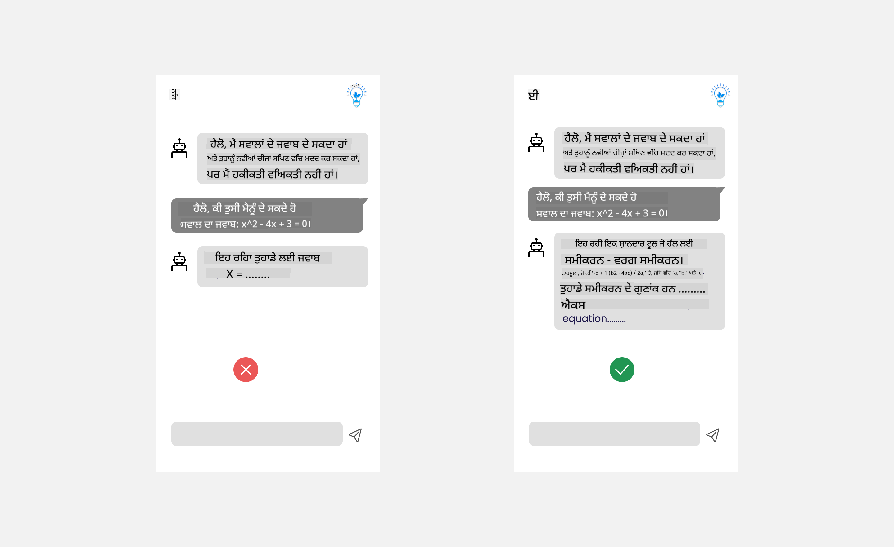
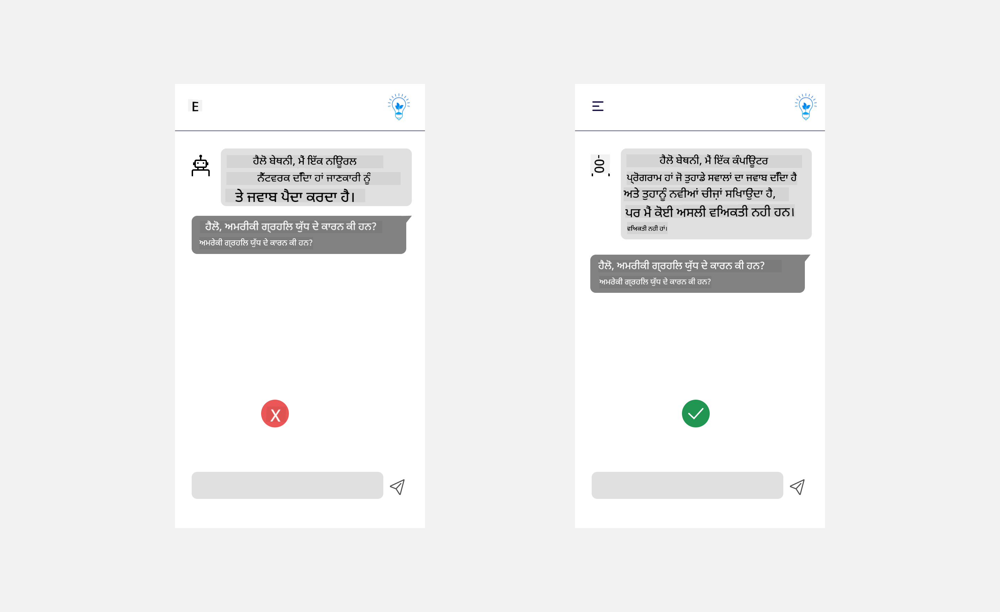
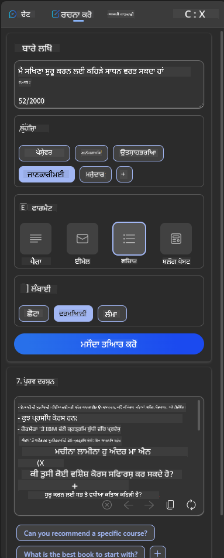
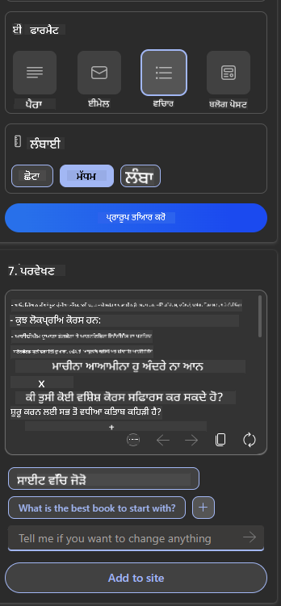

<!--
CO_OP_TRANSLATOR_METADATA:
{
  "original_hash": "ec385b41ee50579025d50cc03bfb3a25",
  "translation_date": "2025-05-19T21:52:06+00:00",
  "source_file": "12-designing-ux-for-ai-applications/README.md",
  "language_code": "pa"
}
-->
# AI ਐਪਲੀਕੇਸ਼ਨ ਲਈ UX ਡਿਜ਼ਾਇਨ ਕਰਨਾ

> _(ਇਸ ਪਾਠ ਦਾ ਵੀਡੀਓ ਦੇਖਣ ਲਈ ਉਪਰੋਕਤ ਚਿੱਤਰ 'ਤੇ ਕਲਿੱਕ ਕਰੋ)_

ਯੂਜ਼ਰ ਅਨੁਭਵ ਐਪਸ ਬਣਾਉਣ ਦਾ ਬਹੁਤ ਮਹੱਤਵਪੂਰਨ ਪਹਲੂ ਹੈ। ਯੂਜ਼ਰਾਂ ਨੂੰ ਤੁਹਾਡੀ ਐਪ ਨੂੰ ਪ੍ਰਭਾਵਸ਼ਾਲੀ ਢੰਗ ਨਾਲ ਵਰਤਣ ਦੇ ਯੋਗ ਹੋਣਾ ਚਾਹੀਦਾ ਹੈ ਤਾਂ ਕਿ ਕੰਮ ਕੀਤੇ ਜਾ ਸਕਣ। ਪ੍ਰਭਾਵਸ਼ਾਲੀ ਹੋਣਾ ਇੱਕ ਗੱਲ ਹੈ ਪਰ ਤੁਹਾਨੂੰ ਐਪਸ ਨੂੰ ਇਸ ਤਰ੍ਹਾਂ ਡਿਜ਼ਾਇਨ ਕਰਨ ਦੀ ਵੀ ਲੋੜ ਹੈ ਕਿ ਉਹ ਹਰ ਕਿਸੇ ਦੁਆਰਾ ਵਰਤੇ ਜਾ ਸਕਣ, ਤਾਂ ਜੋ ਉਹ _ਪਹੁੰਚਯੋਗ_ ਬਣ ਸਕਣ। ਇਹ ਅਧਿਆਇ ਇਸ ਖੇਤਰ 'ਤੇ ਧਿਆਨ ਦੇਵੇਗਾ ਤਾਂ ਕਿ ਤੁਸੀਂ ਇੱਕ ਐਪ ਡਿਜ਼ਾਇਨ ਕਰ ਸਕੋ ਜੋ ਲੋਕ ਵਰਤ ਸਕਣ ਅਤੇ ਵਰਤਣਾ ਚਾਹੁੰਦੇ ਹਨ।

## ਤਾਰੁਫ਼

ਯੂਜ਼ਰ ਅਨੁਭਵ ਇੱਕ ਯੂਜ਼ਰ ਕਿਸੇ ਵਿਸ਼ੇਸ਼ ਉਤਪਾਦ ਜਾਂ ਸੇਵਾ ਨਾਲ ਕਿਵੇਂ ਗੱਲਬਾਤ ਕਰਦਾ ਹੈ ਅਤੇ ਇਸਦਾ ਵਰਤੋਂ ਕਰਦਾ ਹੈ ਚਾਹੇ ਇਹ ਸਿਸਟਮ, ਸਾਧਨ ਜਾਂ ਡਿਜ਼ਾਇਨ ਹੋਵੇ। AI ਐਪਲੀਕੇਸ਼ਨ ਵਿਕਸਿਤ ਕਰਦੇ ਸਮੇਂ, ਡਿਵੈਲਪਰਾਂ ਨੇ ਸਿਰਫ ਯੂਜ਼ਰ ਅਨੁਭਵ ਨੂੰ ਪ੍ਰਭਾਵਸ਼ਾਲੀ ਬਣਾਉਣ 'ਤੇ ਹੀ ਧਿਆਨ ਨਹੀਂ ਦਿੱਤਾ ਬਲਕਿ ਇਹਨੂੰ ਨੈਤਿਕ ਬਣਾਉਣ 'ਤੇ ਵੀ। ਇਸ ਪਾਠ ਵਿੱਚ, ਅਸੀਂ ਯੂਜ਼ਰ ਦੀਆਂ ਲੋੜਾਂ ਦਾ ਹੱਲ ਕਰਨ ਵਾਲੀਆਂ ਕ੍ਰਿਤ੍ਰਿਮ ਬੁੱਧੀ (AI) ਐਪਲੀਕੇਸ਼ਨ ਬਣਾਉਣ ਦੇ ਤਰੀਕੇ ਕਵਰ ਕਰਦੇ ਹਾਂ।

ਇਹ ਪਾਠ ਹੇਠ ਲਿਖੇ ਖੇਤਰਾਂ ਨੂੰ ਕਵਰ ਕਰੇਗਾ:

- ਯੂਜ਼ਰ ਅਨੁਭਵ ਦਾ ਤਾਰੁਫ਼ ਅਤੇ ਯੂਜ਼ਰ ਦੀਆਂ ਲੋੜਾਂ ਨੂੰ ਸਮਝਣਾ
- ਭਰੋਸੇ ਅਤੇ ਪਾਰਦਰਸ਼ਤਾ ਲਈ AI ਐਪਲੀਕੇਸ਼ਨ ਡਿਜ਼ਾਇਨ ਕਰਨਾ
- ਸਹਿਕਾਰਤਾ ਅਤੇ ਫੀਡਬੈਕ ਲਈ AI ਐਪਲੀਕੇਸ਼ਨ ਡਿਜ਼ਾਇਨ ਕਰਨਾ

## ਸਿੱਖਣ ਦੇ ਲਕਸ਼

ਇਹ ਪਾਠ ਕਰਨ ਦੇ ਬਾਅਦ, ਤੁਸੀਂ ਯੋਗ ਹੋਵੋਗੇ:

- ਸਮਝਣਾ ਕਿ AI ਐਪਲੀਕੇਸ਼ਨ ਕਿਵੇਂ ਬਣਾਉਣੇ ਹਨ ਜੋ ਯੂਜ਼ਰ ਦੀਆਂ ਲੋੜਾਂ ਨੂੰ ਪੂਰਾ ਕਰਦੇ ਹਨ।
- ਭਰੋਸੇ ਅਤੇ ਸਹਿਕਾਰਤਾ ਨੂੰ ਵਧਾਉਣ ਵਾਲੇ AI ਐਪਲੀਕੇਸ਼ਨ ਡਿਜ਼ਾਇਨ ਕਰਨਾ।

### ਪੂਰਵ-ਆਵਸ਼ਕਤਾ

ਕੁਝ ਸਮਾਂ ਲਓ ਅਤੇ [ਯੂਜ਼ਰ ਅਨੁਭਵ ਅਤੇ ਡਿਜ਼ਾਇਨ ਸੋਚ](https://learn.microsoft.com/training/modules/ux-design?WT.mc_id=academic-105485-koreyst) ਬਾਰੇ ਹੋਰ ਪੜ੍ਹੋ।

## ਯੂਜ਼ਰ ਅਨੁਭਵ ਦਾ ਤਾਰੁਫ਼ ਅਤੇ ਯੂਜ਼ਰ ਦੀਆਂ ਲੋੜਾਂ ਨੂੰ ਸਮਝਣਾ

ਸਾਡੇ ਕਲਪਨਾਤਮਕ ਸਿੱਖਿਆ ਸਟਾਰਟਅਪ ਵਿੱਚ, ਸਾਡੇ ਕੋਲ ਦੋ ਮੁੱਖ ਯੂਜ਼ਰ ਹਨ, ਅਧਿਆਪਕ ਅਤੇ ਵਿਦਿਆਰਥੀ। ਦੋਵੇਂ ਯੂਜ਼ਰਾਂ ਦੀਆਂ ਵਿਲੱਖਣ ਲੋੜਾਂ ਹਨ। ਯੂਜ਼ਰ-ਕੇਂਦਰਤ ਡਿਜ਼ਾਇਨ ਯੂਜ਼ਰ ਨੂੰ ਪ੍ਰਾਥਮਿਕਤਾ ਦਿੰਦਾ ਹੈ ਜੋ ਇਹ ਯਕੀਨੀ ਬਣਾਉਂਦਾ ਹੈ ਕਿ ਉਤਪਾਦ ਉਨ੍ਹਾਂ ਲਈ ਸਬੰਧਿਤ ਅਤੇ ਲਾਭਕਾਰੀ ਹਨ ਜਿਨ੍ਹਾਂ ਲਈ ਇਹ ਮਨਜ਼ੂਰ ਕੀਤਾ ਗਿਆ ਹੈ।

ਐਪਲੀਕੇਸ਼ਨ **ਲਾਭਕਾਰੀ, ਭਰੋਸੇਯੋਗ, ਪਹੁੰਚਯੋਗ ਅਤੇ ਸੁਖਦਾਈ** ਹੋਣਾ ਚਾਹੀਦਾ ਹੈ ਤਾਂ ਜੋ ਚੰਗਾ ਯੂਜ਼ਰ ਅਨੁਭਵ ਪ੍ਰਦਾਨ ਕੀਤਾ ਜਾ ਸਕੇ।

### ਉਪਯੋਗਤਾ

ਲਾਭਕਾਰੀ ਹੋਣ ਦਾ ਅਰਥ ਹੈ ਕਿ ਐਪਲੀਕੇਸ਼ਨ ਦੀ ਵਰਤੋਂਸ਼ੀਲਤਾ ਇਸਦੇ ਮਨਜ਼ੂਰ ਕੀਤੇ ਗਏ ਉਦੇਸ਼ ਨਾਲ ਮੈਚ ਕਰਦੀ ਹੈ, ਜਿਵੇਂ ਕਿ ਗਰੇਡਿੰਗ ਪ੍ਰਕਿਰਿਆ ਨੂੰ ਆਟੋਮੈਟਿਕ ਬਣਾਉਣਾ ਜਾਂ ਸਿੱਖਿਆ ਲਈ ਫਲੈਸ਼ਕਾਰਡ ਬਣਾਉਣਾ। ਇੱਕ ਐਪਲੀਕੇਸ਼ਨ ਜੋ ਗਰੇਡਿੰਗ ਪ੍ਰਕਿਰਿਆ ਨੂੰ ਆਟੋਮੈਟਿਕ ਬਣਾਉਂਦਾ ਹੈ, ਉਹ ਵਿਦਿਆਰਥੀਆਂ ਦੇ ਕੰਮ ਨੂੰ ਪੂਰਵ-ਨਿਰਧਾਰਿਤ ਮਾਪਦੰਡਾਂ ਦੇ ਅਧਾਰ 'ਤੇ ਸਹੀ ਅਤੇ ਪ੍ਰਭਾਵਸ਼ਾਲੀ ਢੰਗ ਨਾਲ ਅੰਕਾਂ ਦਿੱਤਾ ਜਾਣਾ ਚਾਹੀਦਾ ਹੈ। ਇਸੇ ਤਰ੍ਹਾਂ, ਇੱਕ ਐਪਲੀਕੇਸ਼ਨ ਜੋ ਸਿੱਖਿਆ ਲਈ ਫਲੈਸ਼ਕਾਰਡ ਬਣਾਉਂਦਾ ਹੈ, ਉਹ ਇਸਦੇ ਡਾਟਾ ਦੇ ਅਧਾਰ 'ਤੇ ਸਬੰਧਿਤ ਅਤੇ ਵਿਵਿਧ ਪ੍ਰਸ਼ਨ ਬਣਾਉਣਾ ਚਾਹੀਦਾ ਹੈ।

### ਭਰੋਸੇਯੋਗਤਾ

ਭਰੋਸੇਯੋਗ ਹੋਣ ਦਾ ਅਰਥ ਹੈ ਕਿ ਐਪਲੀਕੇਸ਼ਨ ਆਪਣਾ ਕੰਮ ਸਤਤ ਅਤੇ ਬਿਨਾਂ ਗਲਤੀਆਂ ਦੇ ਕਰ ਸਕਦਾ ਹੈ। ਹਾਲਾਂਕਿ, AI ਮਨੁੱਖਾਂ ਵਾਂਗ ਪੂਰਨ ਨਹੀਂ ਹੈ ਅਤੇ ਗਲਤੀਆਂ ਕਰਨ ਦੇ ਸੰਭਾਵਨਾ ਵਾਲਾ ਹੋ ਸਕਦਾ ਹੈ। ਐਪਲੀਕੇਸ਼ਨ ਗਲਤੀਆਂ ਜਾਂ ਅਣਪਛਾਤੀਆਂ ਸਥਿਤੀਆਂ ਦਾ ਸਾਹਮਣਾ ਕਰ ਸਕਦੇ ਹਨ ਜਿਨ੍ਹਾਂ ਨੂੰ ਮਨੁੱਖੀ ਦਖਲਅੰਦਾਜ਼ੀ ਜਾਂ ਸਧਾਰਨ ਦੀ ਲੋੜ ਹੋ ਸਕਦੀ ਹੈ। ਤੁਸੀਂ ਗਲਤੀਆਂ ਦਾ ਕਿਵੇਂ ਹੱਲ ਕਰਦੇ ਹੋ? ਇਸ ਪਾਠ ਦੇ ਆਖਰੀ ਭਾਗ ਵਿੱਚ, ਅਸੀਂ ਕਵਰ ਕਰਾਂਗੇ ਕਿ ਸਹਿਕਾਰਤਾ ਅਤੇ ਫੀਡਬੈਕ ਲਈ AI ਸਿਸਟਮ ਅਤੇ ਐਪਲੀਕੇਸ਼ਨ ਕਿਵੇਂ ਡਿਜ਼ਾਇਨ ਕੀਤੇ ਜਾਂਦੇ ਹਨ।

### ਪਹੁੰਚਯੋਗਤਾ

ਪਹੁੰਚਯੋਗ ਹੋਣ ਦਾ ਅਰਥ ਹੈ ਕਿ ਯੂਜ਼ਰ ਅਨੁਭਵ ਨੂੰ ਵੱਖ-ਵੱਖ ਯੋਗਤਾਵਾਂ ਵਾਲੇ ਯੂਜ਼ਰਾਂ, ਜਿਨ੍ਹਾਂ ਵਿੱਚ ਅਯੋਗਤਾ ਵਾਲੇ ਲੋਕ ਵੀ ਸ਼ਾਮਲ ਹਨ, ਤੱਕ ਵਧਾਇਆ ਜਾਵੇ, ਇਹ ਯਕੀਨੀ ਬਣਾਉਣਾ ਕਿ ਕੋਈ ਵੀ ਪਿੱਛੇ ਨਹੀਂ ਰਹਿ ਜਾਂਦਾ। ਪਹੁੰਚਯੋਗਤਾ ਦੇ ਨਿਯਮਾਂ ਅਤੇ ਸਿਧਾਂਤਾਂ ਦੀ ਪਾਲਣਾ ਕਰਕੇ, AI ਹੱਲ ਹੋਰ ਸਮਾਵੇਸ਼ੀ, ਵਰਤਣਯੋਗ ਅਤੇ ਸਭ ਯੂਜ਼ਰਾਂ ਲਈ ਲਾਭਕਾਰੀ ਬਣ ਜਾਂਦੇ ਹਨ।

### ਸੁਖਦਾਈ

ਸੁਖਦਾਈ ਹੋਣ ਦਾ ਅਰਥ ਹੈ ਕਿ ਐਪਲੀਕੇਸ਼ਨ ਨੂੰ ਵਰਤਣਾ ਮਜ਼ੇਦਾਰ ਹੈ। ਇੱਕ ਅਪੀਲ ਕਰਨ ਵਾਲਾ ਯੂਜ਼ਰ ਅਨੁਭਵ ਯੂਜ਼ਰ 'ਤੇ ਸਕਾਰਾਤਮਕ ਪ੍ਰਭਾਵ ਪਾ ਸਕਦਾ ਹੈ, ਜੋ ਉਨ੍ਹਾਂ ਨੂੰ ਐਪਲੀਕੇਸ਼ਨ 'ਤੇ ਵਾਪਸ ਜਾਣ ਲਈ ਪ੍ਰੇਰਿਤ ਕਰਦਾ ਹੈ ਅਤੇ ਵਪਾਰਕ ਆਮਦਨ ਵਿੱਚ ਵਾਧਾ ਕਰਦਾ ਹੈ।

ਹਰ ਚੁਣੌਤੀ ਨੂੰ AI ਨਾਲ ਹੱਲ ਨਹੀਂ ਕੀਤਾ ਜਾ ਸਕਦਾ। AI ਤੁਹਾਡੇ ਯੂਜ਼ਰ ਅਨੁਭਵ ਨੂੰ ਵਧਾਉਣ ਲਈ ਆਉਂਦਾ ਹੈ, ਚਾਹੇ ਇਹ ਮੈਨੂਅਲ ਕੰਮਾਂ ਨੂੰ ਆਟੋਮੈਟਿਕ ਬਣਾਉਣਾ ਹੋਵੇ ਜਾਂ ਯੂਜ਼ਰ ਅਨੁਭਵ ਨੂੰ ਨਿੱਜੀ ਬਣਾਉਣਾ ਹੋਵੇ।

## ਭਰੋਸੇ ਅਤੇ ਪਾਰਦਰਸ਼ਤਾ ਲਈ AI ਐਪਲੀਕੇਸ਼ਨ ਡਿਜ਼ਾਇਨ ਕਰਨਾ

AI ਐਪਲੀਕੇਸ਼ਨ ਡਿਜ਼ਾਇਨ ਕਰਦੇ ਸਮੇਂ ਭਰੋਸਾ ਬਣਾਉਣਾ ਮਹੱਤਵਪੂਰਨ ਹੈ। ਭਰੋਸਾ ਇਹ ਯਕੀਨੀ ਬਣਾਉਂਦਾ ਹੈ ਕਿ ਯੂਜ਼ਰ ਇਹਨੂੰ ਭਰੋਸਾ ਕਰਦਾ ਹੈ ਕਿ ਐਪਲੀਕੇਸ਼ਨ ਕੰਮ ਕਰੇਗਾ, ਸਤਤ ਢੰਗ ਨਾਲ ਨਤੀਜੇ ਪ੍ਰਦਾਨ ਕਰੇਗਾ ਅਤੇ ਨਤੀਜੇ ਉਹ ਹਨ ਜੋ ਯੂਜ਼ਰ ਨੂੰ ਚਾਹੀਦੇ ਹਨ। ਇਸ ਖੇਤਰ ਵਿੱਚ ਇੱਕ ਖਤਰਾ ਬੇ-ਭਰੋਸਾ ਅਤੇ ਅਤਿ-ਭਰੋਸਾ ਹੈ। ਬੇ-ਭਰੋਸਾ ਉਸ ਸਮੇਂ ਹੁੰਦਾ ਹੈ ਜਦੋਂ ਇੱਕ ਯੂਜ਼ਰ ਨੂੰ AI ਸਿਸਟਮ 'ਤੇ ਘੱਟ ਜਾਂ ਕੋਈ ਭਰੋਸਾ ਨਹੀਂ ਹੁੰਦਾ, ਇਹ ਤੁਹਾਡੀ ਐਪਲੀਕੇਸ਼ਨ ਨੂੰ ਰੱਦ ਕਰਨ ਲਈ ਯੂਜ਼ਰ ਨੂੰ ਲੈ ਜਾਂਦਾ ਹੈ। ਅਤਿ-ਭਰੋਸਾ ਉਸ ਸਮੇਂ ਹੁੰਦਾ ਹੈ ਜਦੋਂ ਇੱਕ ਯੂਜ਼ਰ AI ਸਿਸਟਮ ਦੀ ਯੋਗਤਾ ਦਾ ਅਤਿ-ਅਨੁਮਾਨ ਲਗਾਉਂਦਾ ਹੈ, ਜਿਸ ਨਾਲ ਯੂਜ਼ਰ AI ਸਿਸਟਮ 'ਤੇ ਬਹੁਤ ਜ਼ਿਆਦਾ ਭਰੋਸਾ ਕਰਦੇ ਹਨ। ਉਦਾਹਰਨ ਲਈ, ਗਰੇਡਿੰਗ ਸਿਸਟਮ ਦੇ ਮਾਮਲੇ ਵਿੱਚ ਅਤਿ-ਭਰੋਸਾ ਅਧਿਆਪਕ ਨੂੰ ਕੁਝ ਪੱਤਰਾਂ ਨੂੰ ਸਹੀ ਨਹੀਂ ਕਰਨ ਦੇ ਲਈ ਲੈ ਜਾ ਸਕਦਾ ਹੈ ਤਾਂ ਜੋ ਗਰੇਡਿੰਗ ਸਿਸਟਮ ਵਧੀਆ ਕੰਮ ਕਰੇ। ਇਹ ਵਿਦਿਆਰਥੀਆਂ ਲਈ ਅਨੁਚਿਤ ਜਾਂ ਗਲਤ ਗਰੇਡਿੰਗ ਦਾ ਕਾਰਨ ਬਣ ਸਕਦਾ ਹੈ, ਜਾਂ ਫੀਡਬੈਕ ਅਤੇ ਸੁਧਾਰ ਦੇ ਮੌਕੇ ਛੱਡੇ ਜਾ ਸਕਦੇ ਹਨ।

ਭਰੋਸੇ ਨੂੰ ਡਿਜ਼ਾਇਨ ਦੇ ਕੇਂਦਰ 'ਤੇ ਰੱਖਣ ਦੇ ਦੋ ਤਰੀਕੇ ਹਨ ਵਿਆਖਿਆਯੋਗਤਾ ਅਤੇ ਕੰਟਰੋਲ।

### ਵਿਆਖਿਆਯੋਗਤਾ

ਜਦੋਂ AI ਫੈਸਲਿਆਂ ਦੀ ਜਾਣਕਾਰੀ ਦੇਣ ਵਿੱਚ ਮਦਦ ਕਰਦਾ ਹੈ ਜਿਵੇਂ ਕਿ ਭਵਿੱਖ ਦੀਆਂ ਪੀੜ੍ਹੀਆਂ ਨੂੰ ਗਿਆਨ ਪ੍ਰਦਾਨ ਕਰਨਾ, ਤਾਂ ਅਧਿਆਪਕਾਂ ਅਤੇ ਮਾਪਿਆਂ ਲਈ ਇਹ ਸਮਝਣਾ ਮਹੱਤਵਪੂਰਨ ਹੈ ਕਿ AI ਫੈਸਲੇ ਕਿਵੇਂ ਕੀਤੇ ਜਾਂਦੇ ਹਨ। ਇਹ ਹੈ ਵਿਆਖਿਆਯੋਗਤਾ - ਸਮਝਣਾ ਕਿ AI ਐਪਲੀਕੇਸ਼ਨ ਫੈਸਲੇ ਕਿਵੇਂ ਕਰਦੇ ਹਨ। ਵਿਆਖਿਆਯੋਗਤਾ ਲਈ ਡਿਜ਼ਾਇਨ ਕਰਨਾ ਸ਼ਾਮਲ ਹੁੰਦਾ ਹੈ AI ਐਪਲੀਕੇਸ਼ਨ ਕੀ ਕਰ ਸਕਦਾ ਹੈ ਦੇ ਉਦਾਹਰਨਾਂ ਦੇ ਵੇਰਵੇ ਸ਼ਾਮਲ ਕਰਨਾ। ਉਦਾਹਰਨ ਲਈ, "AI ਅਧਿਆਪਕ ਨਾਲ ਸ਼ੁਰੂ ਕਰੋ" ਦੀ ਬਜਾਏ, ਸਿਸਟਮ ਇਹ ਵਰਤ ਸਕਦਾ ਹੈ: "AI ਦੀ ਵਰਤੋਂ ਕਰਕੇ ਆਪਣੇ ਨੋਟਸ ਨੂੰ ਸਿੱਖਿਆ ਲਈ ਆਸਾਨ ਬਣਾਉ।"

AI ਯੂਜ਼ਰ ਅਤੇ ਨਿੱਜੀ ਡਾਟਾ ਨੂੰ ਕਿਵੇਂ ਵਰਤਦਾ ਹੈ ਇਸਦਾ ਹੋਰ ਇੱਕ ਉਦਾਹਰਨ ਹੈ। ਉਦਾਹਰਨ ਲਈ, ਇੱਕ ਯੂਜ਼ਰ ਜਿਸਦਾ ਪੁਰਸਨ ਵਿਦਿਆਰਥੀ ਹੈ ਉਸਦੇ ਪੁਰਸਨ ਦੇ ਅਧਾਰ 'ਤੇ ਸੀਮਾਵਾਂ ਹੋ ਸਕਦੀਆਂ ਹਨ। AI ਪ੍ਰਸ਼ਨਾਂ ਦੇ ਜਵਾਬ ਨਹੀਂ ਦੇ ਸਕਦਾ ਪਰ ਯੂਜ਼ਰ ਨੂੰ ਇਹ ਸੋਚਣ ਵਿੱਚ ਮਦਦ ਕਰ ਸਕਦਾ ਹੈ ਕਿ ਉਹ ਕਿਸ ਤਰ੍ਹਾਂ ਸਮੱਸਿਆ ਦਾ ਹੱਲ ਕਰ ਸਕਦੇ ਹਨ।

ਵਿਆਖਿਆਯੋਗਤਾ ਦਾ ਇੱਕ ਆਖਰੀ ਮਹੱਤਵਪੂਰਨ ਭਾਗ ਹੈ ਵਿਆਖਿਆਵਾਂ ਦੀ ਸਰਲਤਾ। ਵਿਦਿਆਰਥੀਆਂ ਅਤੇ ਅਧਿਆਪਕਾਂ ਨੂੰ AI ਵਿਸ਼ੇਸ਼ਗਿਆਤ ਨਹੀਂ ਹੋ ਸਕਦਾ, ਇਸ ਲਈ ਐਪਲੀਕੇਸ਼ਨ ਕੀ ਕਰ ਸਕਦਾ ਹੈ ਜਾਂ ਨਹੀਂ ਕਰ ਸਕਦਾ ਹੈ ਦੀ ਵਿਆਖਿਆ ਸਰਲ ਅਤੇ ਆਸਾਨ ਹੋਣੀ ਚਾਹੀਦੀ ਹੈ।

### ਕੰਟਰੋਲ

ਜਨਰੇਟਿਵ AI ਇੱਕ ਸਹਿਕਾਰਤਾ ਬਣਾਉਂਦਾ ਹੈ AI ਅਤੇ ਯੂਜ਼ਰ ਦੇ ਵਿਚਕਾਰ, ਜਿੱਥੇ ਉਦਾਹਰਨ ਲਈ ਇੱਕ ਯੂਜ਼ਰ ਵੱਖ-ਵੱਖ ਨਤੀਜੇ ਲਈ ਪ੍ਰੋੰਪਟਾਂ ਨੂੰ ਸੋਧ ਸਕਦਾ ਹੈ। ਵਧੇਰੇ, ਇੱਕ ਆਉਟਪੁੱਟ ਜਨਰੇਟ ਹੋਣ ਤੋਂ ਬਾਅਦ, ਯੂਜ਼ਰਾਂ ਨੂੰ ਨਤੀਜਿਆਂ ਨੂੰ ਸੋਧਣ ਦੀ ਯੋਗਤਾ ਹੋਣੀ ਚਾਹੀਦੀ ਹੈ ਜੋ ਉਨ੍ਹਾਂ ਨੂੰ ਕੰਟਰੋਲ ਦਾ ਅਹਿਸਾਸ ਦਿੰਦਾ ਹੈ। ਉਦਾਹਰਨ ਲਈ, Bing ਦੀ ਵਰਤੋਂ ਕਰਦੇ ਸਮੇਂ, ਤੁਸੀਂ ਫਾਰਮੈਟ, ਟੋਨ ਅਤੇ ਲੰਬਾਈ ਦੇ ਅਧਾਰ 'ਤੇ ਆਪਣੇ ਪ੍ਰੋੰਪਟ ਨੂੰ ਅਨੁਕੂਲਿਤ ਕਰ ਸਕਦੇ ਹੋ। ਵਧੇਰੇ, ਤੁਸੀਂ ਆਪਣੇ ਆਉਟਪੁੱਟ ਵਿੱਚ ਬਦਲਾਅ ਸ਼ਾਮਲ ਕਰ ਸਕਦੇ ਹੋ ਅਤੇ ਹੇਠ ਦਿੱਤੇ ਤਰੀਕੇ ਦੇ ਨਾਲ ਆਉਟਪੁੱਟ ਨੂੰ ਸੋਧ ਸਕਦੇ ਹੋ:

Bing ਵਿੱਚ ਹੋਰ ਇੱਕ ਫੀਚਰ ਜੋ ਇੱਕ ਯੂਜ਼ਰ ਨੂੰ ਐਪਲੀਕੇਸ਼ਨ 'ਤੇ ਕੰਟਰੋਲ ਦੇਣ ਦੀ ਯੋਗਤਾ ਦਿੰਦਾ ਹੈ ਉਹ ਹੈ AI ਵਰਤਦਾ ਡਾਟਾ 'ਤੇ ਓਪਟ-ਇਨ ਅਤੇ ਓਪਟ-ਆਉਟ ਕਰਨ ਦੀ ਯੋਗਤਾ। ਸਕੂਲ ਐਪਲੀਕੇਸ਼ਨ ਲਈ, ਇੱਕ ਵਿਦਿਆਰਥੀ ਆਪਣੇ ਨੋਟਸਾਂ ਦੇ ਨਾਲ ਅਧਿਆਪਕਾਂ ਦੇ ਸਰੋਤਾਂ ਨੂੰ ਸਿੱਖਿਆ ਦੇ ਸਮੱਗਰੀ ਵਜੋਂ ਵਰਤਣਾ ਚਾਹ ਸਕਦਾ ਹੈ।

> AI ਐਪਲੀਕੇਸ਼ਨ ਡਿਜ਼ਾਇਨ ਕਰਦੇ ਸਮੇਂ, ਇਰਾਦਾ ਇਹ ਯਕੀਨੀ ਬਣਾਉਣ ਵਿੱਚ ਕੁੰਜੀ ਹੈ ਕਿ ਯੂਜ਼ਰਾਂ ਨੇ ਇਸ ਦੀ ਯੋਗਤਾਵਾਂ ਦੀ ਅਸਲ ਉਮੀਦਾਂ ਸਥਾਪਿਤ ਨਹੀਂ ਕੀਤੀ। ਇਸਨੂੰ ਕਰਨ ਦਾ ਇੱਕ ਤਰੀਕਾ ਹੈ ਪ੍ਰੋੰਪਟਾਂ ਅਤੇ ਨਤੀਜਿਆਂ ਦੇ ਵਿਚਕਾਰ ਘਰਸ਼ਣ ਬਣਾਉਣਾ। ਯੂਜ਼ਰ ਨੂੰ ਯਾਦ ਦਿਵਾਉਣਾ, ਕਿ ਇਹ AI ਹੈ ਅਤੇ ਕੋਈ ਹੋਰ ਮਨੁੱਖ ਨਹੀਂ

## ਸਹਿਕਾਰਤਾ ਅਤੇ ਫੀਡਬੈਕ ਲਈ AI ਐਪਲੀਕੇਸ਼ਨ ਡਿਜ਼ਾਇਨ ਕਰਨਾ

ਜਿਵੇਂ ਕਿ ਪਹਿਲਾਂ ਹੀ ਕਿਹਾ ਗਿਆ ਹੈ, ਜਨਰੇਟਿਵ AI ਯੂਜ਼ਰ ਅਤੇ AI ਦੇ ਵਿਚਕਾਰ ਇੱਕ ਸਹਿਕਾਰਤਾ ਬਣਾਉਂਦਾ ਹੈ। ਜ਼ਿਆਦਾਤਰ ਗੱਲਬਾਤਾਂ ਵਿੱਚ ਇੱਕ ਯੂਜ਼ਰ ਇੱਕ ਪ੍ਰੋੰਪਟ ਦਿੰਦਾ ਹੈ ਅਤੇ AI ਇੱਕ ਆਉਟਪੁੱਟ ਜਨਰੇਟ ਕਰਦਾ ਹੈ। ਕੀ ਹੋਵੇ ਜੇ ਆਉਟਪੁੱਟ ਗਲਤ ਹੈ? ਜੇ ਗਲਤੀਆਂ ਹੋਣ ਤਾਂ ਐਪਲੀਕੇਸ਼ਨ ਇਹਨਾਂ ਦਾ ਕਿਵੇਂ ਹੱਲ ਕਰਦਾ ਹੈ? ਕੀ AI ਯੂਜ਼ਰ ਨੂੰ ਦੋਸ਼ ਦਿੰਦਾ ਹੈ ਜਾਂ ਗਲਤੀ ਨੂੰ ਸਮਝਾਉਣ ਲਈ ਸਮਾਂ ਲੈਂਦਾ ਹੈ?

AI ਐਪਲੀਕੇਸ਼ਨ ਫੀਡਬੈਕ ਪ੍ਰਾਪਤ ਕਰਨ ਅਤੇ ਦੇਣ ਲਈ ਬਣਾਏ ਜਾਣੇ ਚਾਹੀਦੇ ਹਨ। ਇਹ ਸਿਰਫ AI ਸਿਸਟਮ ਨੂੰ ਸੁਧਾਰ ਵਿੱਚ ਮਦਦ ਨਹੀਂ ਕਰਦਾ ਬਲਕਿ ਯੂਜ਼ਰਾਂ ਨਾਲ ਭਰੋਸਾ ਬਣਾਉਣ ਵਿੱਚ ਵੀ। ਡਿਜ਼ਾਇਨ ਵਿੱਚ ਇੱਕ ਫੀਡਬੈਕ ਲੂਪ ਸ਼ਾਮਲ ਕੀਤਾ ਜਾਣਾ ਚਾਹੀਦਾ ਹੈ, ਇੱਕ ਉਦਾਹਰਨ ਹੋ ਸਕਦੀ ਹੈ ਕਿ ਆਉਟਪੁੱਟ 'ਤੇ ਸਧਾਰਨ ਥੰਬਸ ਅੱਪ ਜਾਂ ਡਾਊਨ।

ਇਸਦਾ ਹੱਲ ਕਰਨ ਦਾ ਹੋਰ ਤਰੀਕਾ ਹੈ ਸਿਸਟਮ ਦੀਆਂ ਯੋਗਤਾਵਾਂ ਅਤੇ ਸੀਮਾਵਾਂ ਨੂੰ ਸਪਸ਼ਟ ਤੌਰ 'ਤੇ ਸੰਚਾਰ ਕਰਨਾ। ਜਦੋਂ ਇੱਕ ਯੂਜ਼ਰ AI ਯੋਗਤਾਵਾਂ ਤੋਂ ਬਾਹਰ ਕੁਝ ਮੰਗਦਾ ਹੈ, ਤਾਂ ਇਸਦਾ ਹੱਲ ਕਰਨ ਦਾ ਇੱਕ ਤਰੀਕਾ ਵੀ ਹੋਣਾ ਚਾਹੀਦਾ ਹੈ, ਜਿਵੇਂ ਕਿ ਹੇਠ ਦਿੱਤਾ ਹੈ।

 ਦੀ ਵਰਤੋਂ ਕਰਕੇ ਅਨੁਵਾਦ ਕੀਤਾ ਗਿਆ ਹੈ। ਜਦੋਂ ਕਿ ਅਸੀਂ ਸਹੀ ਹੋਣ ਲਈ ਯਤਨਸ਼ੀਲ ਹਾਂ, ਕਿਰਪਾ ਕਰਕੇ ਸੂਚਿਤ ਰਹੋ ਕਿ ਸਵੈਚਾਲਿਤ ਅਨੁਵਾਦਾਂ ਵਿੱਚ ਗਲਤੀਆਂ ਜਾਂ ਅਸੰਗਤੀਆਂ ਹੋ ਸਕਦੀਆਂ ਹਨ। ਮੂਲ ਦਸਤਾਵੇਜ਼ ਨੂੰ ਇਸ ਦੀ ਮੂਲ ਭਾਸ਼ਾ ਵਿੱਚ ਅਧਿਕਾਰਤ ਸਰੋਤ ਮੰਨਿਆ ਜਾਣਾ ਚਾਹੀਦਾ ਹੈ। ਮਹੱਤਵਪੂਰਨ ਜਾਣਕਾਰੀ ਲਈ, ਪੇਸ਼ੇਵਰ ਮਨੁੱਖੀ ਅਨੁਵਾਦ ਦੀ ਸਿਫਾਰਿਸ਼ ਕੀਤੀ ਜਾਂਦੀ ਹੈ। ਅਸੀਂ ਇਸ ਅਨੁਵਾਦ ਦੇ ਉਪਯੋਗ ਤੋਂ ਪੈਦਾ ਹੋਣ ਵਾਲੀਆਂ ਕਿਸੇ ਵੀ ਗਲਤ ਫਹਿਮੀਆਂ ਜਾਂ ਗਲਤ ਵਿਆਖਿਆਵਾਂ ਲਈ ਜ਼ਿੰਮੇਵਾਰ ਨਹੀਂ ਹਾਂ।