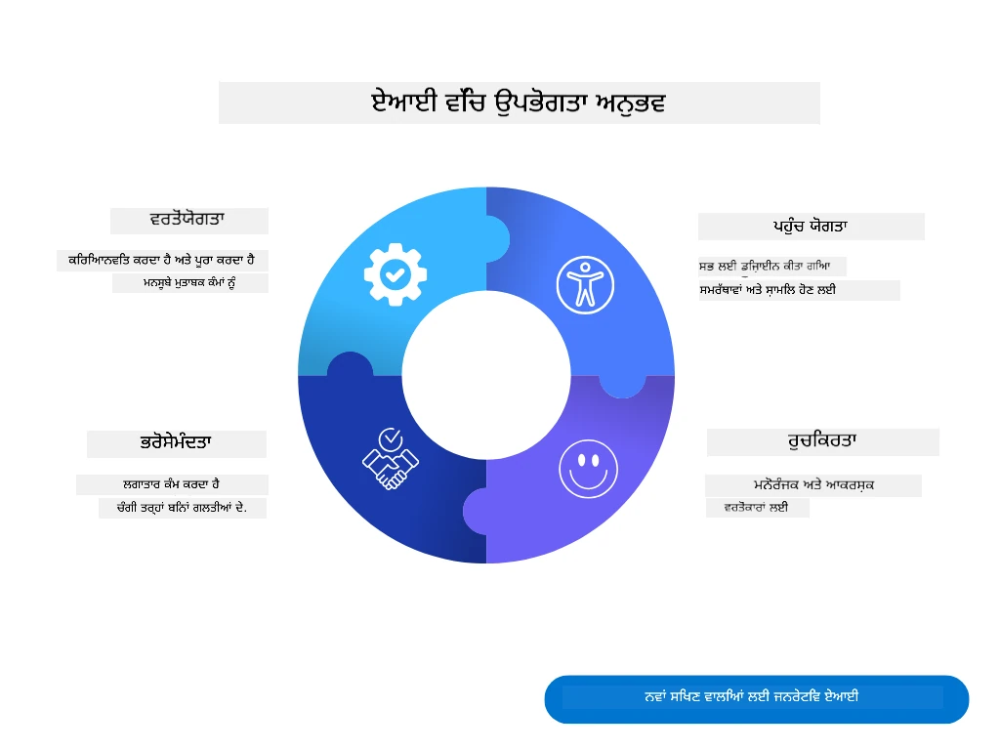
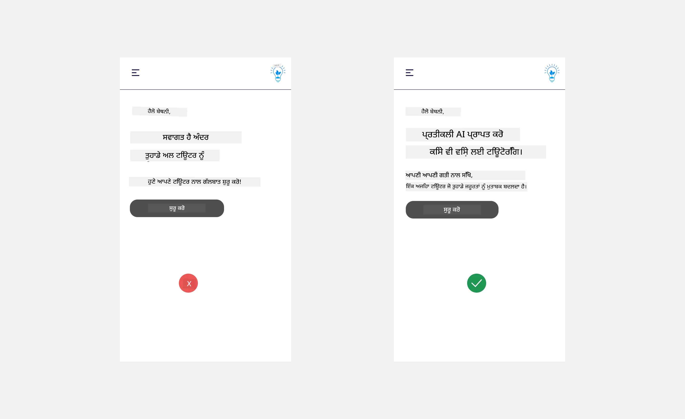
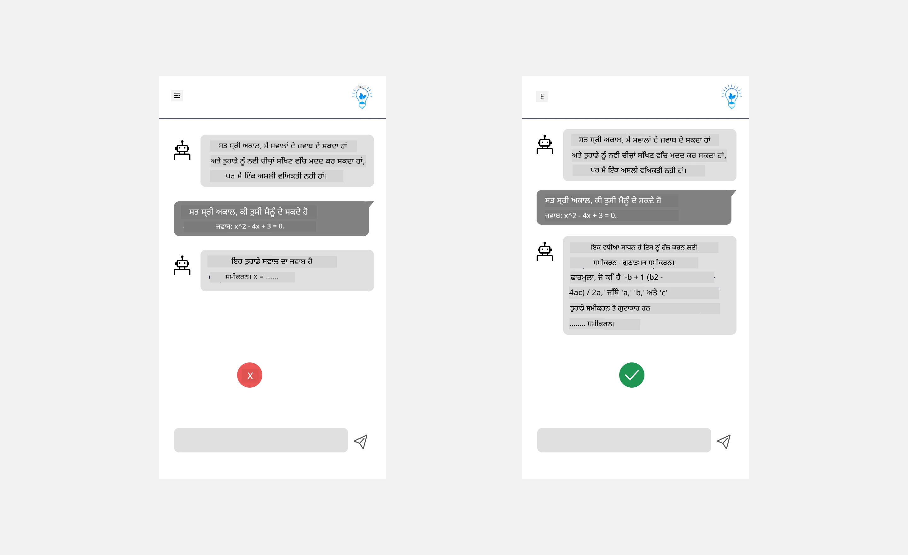
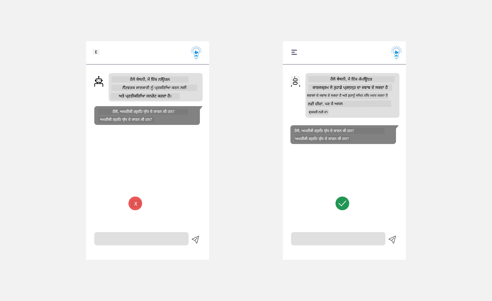
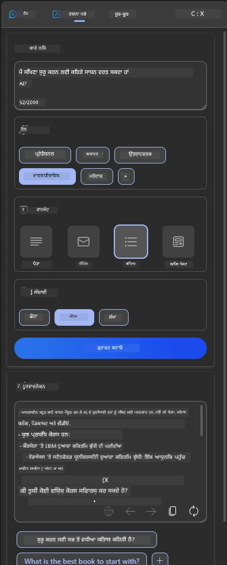
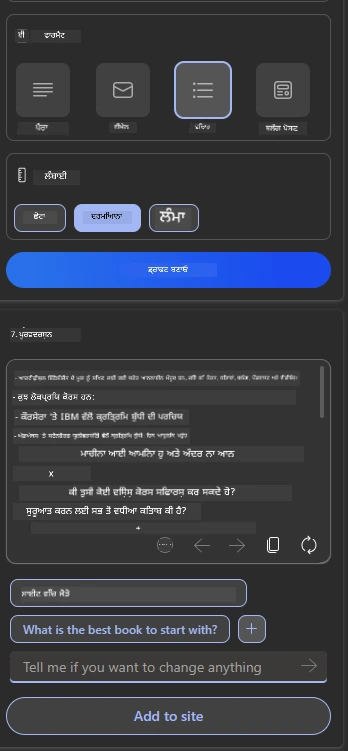
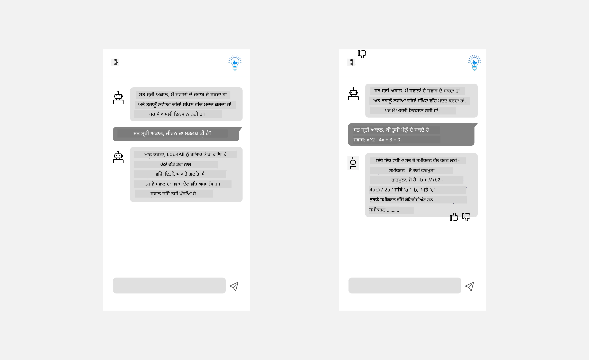

# AI ਐਪਲੀਕੇਸ਼ਨਾਂ ਲਈ UX ਡਿਜ਼ਾਈਨ ਕਰਨਾ

> _(ਇਸ ਪਾਠ ਦਾ ਵੀਡੀਓ ਦੇਖਣ ਲਈ ਉਪਰ ਦਿੱਤੀ ਤਸਵੀਰ ਤੇ ਕਲਿੱਕ ਕਰੋ)_

ਯੂਜ਼ਰ ਅਨੁਭਵ ਏਪਸ ਬਣਾਉਣ ਦਾ ਬਹੁਤ ਹੀ ਜ਼ਰੂਰੀ ਪੱਖ ਹੈ। ਯੂਜ਼ਰਾਂ ਨੂੰ ਤੁਹਾਡੇ ਐਪ ਨੂੰ ਪ੍ਰਭਾਵਸ਼ਾਲੀ ਤਰੀਕੇ ਨਾਲ ਵਰਤਣਾ ਪੈਂਦਾ ਹੈ ਤਾਂ ਜੋ ਉਹ ਕੰਮ ਕਰ ਸਕਣ। ਪ੍ਰਭਾਵਸ਼ਾਲੀ ਹੋਣਾ ਇੱਕ ਗੱਲ ਹੈ ਪਰ ਤੁਹਾਨੂੰ ਐਪ ਨੂੰ ਇਸ ਤਰ੍ਹਾਂ ਡਿਜ਼ਾਈਨ ਕਰਨਾ ਵੀ ਲੋੜੀਂਦਾ ਹੈ ਕਿ ਉਹ ਹਰ ਕਿਸੇ ਵੱਲੋਂ ਵਰਤੇ ਜਾ ਸਕਣ, ਤਾ ਕਿ ਉਹ _ਸੁਗਮ_ ਹੋਣ। ਇਹ ਅਧਿਆਇ ਇਸ ਖੇਤਰ 'ਤੇ ਧਿਆਨ ਦੇਵੇਗਾ ਤਾਂ ਜੋ ਤੁਸੀਂ ਐਸਾ ਐਪ ਡਿਜ਼ਾਈਨ ਕਰ ਸکو ਜੋ ਲੋਕ ਵਰਤ ਸਕਣ ਅਤੇ ਚਾਹੁਣ।

## ਜਾਣ ਪਹਿਚਾਣ

ਯੂਜ਼ਰ ਅਨੁਭਵ ਮਤਲਬ ਹੈ ਕਿ ਯੂਜ਼ਰ ਕਿਸ ਤਰ੍ਹਾਂ ਕਿਸੇ ਖ਼ਾਸ ਉਤਪਾਦ ਜਾਂ ਸੇਵਾ ਜਿਵੇਂ ਕਿ ਸਿਸਟਮ, ਸੰਦ ਜਾਂ ਡਿਜ਼ਾਈਨ ਨਾਲ ਇੰਟਰੈਕਟ ਕਰਦਾ ਹੈ ਅਤੇ ਇਸਦਾ ਉਪਯੋਗ ਕਰਦਾ ਹੈ। AI ਐਪਲੀਕੇਸ਼ਨਾਂ ਨੂੰ ਵਿਕਸਿਤ ਕਰਦੇ ਸਮੇਂ, ਡਿਵੈਲਪਰ ਨਾ ਸਿਰਫ ਯੂਜ਼ਰ ਅਨੁਭਵ ਨੂੰ ਪ੍ਰਭਾਵਸ਼ਾਲੀ ਬਣਾਉਣ ਤੇ ਧਿਆਨ ਦਿੰਦੇ ਹਨ ਬਲਕਿ ਇਸ ਨੂੰ ਨੈਤਿਕ ਬਣਾਉਣ 'ਤੇ ਵੀ ਧਿਆਨ ਦਿੰਦੇ ਹਨ। ਇਸ ਪਾਠ ਵਿੱਚ, ਅਸੀਂ ਕਿਵੇਂ AI ਐਪਲੀਕੇਸ਼ਨਾਂ ਨੂੰ ਬਣਾਇਆ ਜਾਵੇ ਜੋ ਯੂਜ਼ਰਾਂ ਦੀਆਂ ਲੋੜਾਂ ਨੂੰ ਪੂਰਾ ਕਰਦੀਆਂ ਹਨ, ਇਸ ਬਾਰੇ ਜਾਣਕਾਰੀ ਦੇਵਾਂਗੇ।

ਪਾਠ ਵਿੱਚ ਹੇਠ ਲਿਖੇ ਖੇਤਰਾਂ ਨੂੰ ਕਵਰ ਕੀਤਾ ਜਾਵੇਗਾ:

- ਯੂਜ਼ਰ ਅਨੁਭਵ ਦਾ ਪਰਿਚਯ ਅਤੇ ਯੂਜ਼ਰ ਦੀਆਂ ਲੋੜਾਂ ਨੂੰ ਸਮਝਣਾ
- ਭਰੋਸਾ ਅਤੇ ਪਾਰਦਰਸ਼ਤਾ ਲਈ AI ਐਪਲੀਕੇਸ਼ਨਾਂ ਦਾ ਡਿਜ਼ਾਈਨ
- ਸਹਿਯੋਗ ਅਤੇ ਫੀਡਬੈਕ ਲਈ AI ਐਪਲੀਕੇਸ਼ਨਾਂ ਦਾ ਡਿਜ਼ਾਈਨ

## ਸਿੱਖਣ ਦੇ ਲਕੜੇ

ਇਸ ਪਾਠ ਦੇ ਲੈਣ ਤੋਂ ਬਾਅਦ, ਤੁਸੀਂ ਸਮਰੱਥ ਹੋਵੋਗੇ:

- ਐਸੇ AI ਐਪਲੀਕੇਸ਼ਨ ਬਣਾਉਣਾ ਜੋ ਯੂਜ਼ਰ ਦੀਆਂ ਲੋੜਾਂ ਨੂੰ ਪੂਰਾ ਕਰਦੇ ਹੋਣ।
- AI ਐਪਲੀਕੇਸ਼ਨ ਡਿਜ਼ਾਈਨ ਕਰਨਾ ਜੋ ਭਰੋਸਾ ਅਤੇ ਸਹਿਯੋਗ ਨੂੰ ਉਤਸ਼ਾਹਿਤ ਕਰਦੇ ਹੋਣ।

### ਜ਼ਰੂਰੀ ਪੂਰਵ-ਆਵਸ਼ਕਤਾ

ਕੁਝ ਸਮਾਂ ਲਵੋ ਅਤੇ [ਯੂਜ਼ਰ ਅਨੁਭਵ ਅਤੇ ਡਿਜ਼ਾਈਨ ਸੋਚ ਬਾਰੇ](https://learn.microsoft.com/training/modules/ux-design?WT.mc_id=academic-105485-koreyst) ਹੋਰ ਪੜ੍ਹੋ।

## ਯੂਜ਼ਰ ਅਨੁਭਵ ਦਾ ਪਰਿਚਯ ਅਤੇ ਯੂਜ਼ਰ ਦੀਆਂ ਲੋੜਾਂ ਨੂੰ ਸਮਝਣਾ

ਸਾਡੇ ਕਲਪਨਾਤਮਕ ਸਿੱਖਿਆ ਸਟਾਰਟਅਪ ਵਿੱਚ, ਸਾਡੇ ਕੋਲ ਦੋ ਮੁੱਖ ਯੂਜ਼ਰ ਹਨ, ਅਧਿਆਪਕ ਅਤੇ ਵਿਦਿਆਰਥੀ। ਹਰ ਇੱਕ ਯੂਜ਼ਰ ਦੀਆਂ ਵਿਲੱਖਣ ਲੋੜਾਂ ਹੁੰਦੀਆਂ ਹਨ। ਯੂਜ਼ਰ-ਕੇਂਦਰਿਤ ਡਿਜ਼ਾਈਨ ਯੂਜ਼ਰ ਨੂੰ ਤਰਜੀਹ ਦਿੰਦੀ ਹੈ ਇਹ ਸੁਨਿਸ਼ਚਿਤ ਕਰਦਿਆਂ ਕਿ ਉਤਪਾਦ ਉਨ੍ਹਾਂ ਲਈ ਜ਼ਰੂਰੀ ਅਤੇ ਲਾਭਦਾਇਕ ਹਨ ਜਿਨ੍ਹਾਂ ਲਈ ਇਹ ਬਣਾਏ ਗਏ ਹਨ।

ਐਪਲੀਕੇਸ਼ਨ **ਲਾਭਦਾਇਕ, ਭਰੋਸੇਯੋਗ, ਸੁਗਮ ਅਤੇ ਖੁਸ਼ਗਵਾਰ** ਹੋਣਾ ਚਾਹੀਦਾ ਹੈ ਤਾਂ ਜੋ ਵਧੀਆ ਯੂਜ਼ਰ ਅਨੁਭਵ ਪੇਸ਼ ਕੀਤਾ ਜਾ ਸਕੇ।

### ਉਪਯੋਗਤਾ

ਲਾਭਦਾਇਕ ਹੋਣ ਦਾ ਮਤਲਬ ਹੈ ਕਿ ਐਪਲੀਕੇਸ਼ਨ ਵਿੱਚ ਉਹ ਫੰਕਸ਼ਨਾਲਿਟੀ ਹੋਵੇ ਜੋ ਉਸਦੇ ਮਕਸਦ ਨਾਲ ਮਿਲਦੀ ਹੋਵੇ, ਜਿਵੇਂ ਕਿ ਗਰੇਡਿੰਗ ਪ੍ਰਕ੍ਰਿਆ ਨੂੰ ਆਟੋਮੇਟ ਕਰਨਾ ਜਾਂ ਮੁੜ-ਸਮੀਖਿਆ ਲਈ ਫਲੈਸ਼ਕਾਰਡ ਬਣਾਉਣਾ। ਗਰੇਡਿੰਗ ਪ੍ਰਕ੍ਰਿਆ ਆਟੋਮੇਟ ਕਰਨ ਵਾਲੀ ਐਪਲੀਕੇਸ਼ਨ ਨੇ ਸੁਚੱਜੀ ਅਤੇ ਪ੍ਰਭਾਵਸ਼ਾਲੀ ਤਰੀਕੇ ਨਾਲ ਵਿਦਿਆਰਥੀਆਂ ਦੇ ਕੰਮ ਨੂੰ ਅੰਗਰੇਜ਼ੀ ਮਾਪਦੰਡਾਂ ਅਨੁਸਾਰ ਅੰਕ ਦੇਣੇ ਹੋਣ। ਇਸੇ ਤਰ੍ਹਾਂ, ਮੁੜ-ਸਮੀਖਿਆ ਲਈ ਫਲੈਸ਼ਕਾਰਡ ਬਣਾਉਣ ਵਾਲੀ ਐਪਲੀਕੇਸ਼ਨ ਨੂੰ ਆਪਣੀ ਡੇਟਾ ਦੇ ਆਧਾਰ ' ਤੇ ਸਬੰਧਤ ਅਤੇ ਵੱਖ-ਵੱਖ ਪ੍ਰਸ਼ਨਾਂ ਬਣਾ ਸਕਣੇ ਚਾਹੀਦੇ ਹਨ।

### ਭਰੋਸੇਯੋਗਤਾ

ਭਰੋਸੇਯੋਗ ਹੋਣ ਦਾ ਮਤਲਬ ਹੈ ਕਿ ਐਪਲੀਕੇਸ਼ਨ ਆਪਦਾ ਕੰਮ ਲਗਾਤਾਰ ਅਤੇ ਬਿਨਾ ਗਲਤੀਆਂ ਕਰਦਾ ਹੈ। ਹਾਲਾਂਕਿ, AI ਇਨਸਾਨਾਂ ਵਾਂਗ ਪੂਰਾ ਨਹੀ ਹੈ ਅਤੇ ਗਲਤੀਆਂ ਹੋ ਸਕਦੀਆਂ ਹਨ। ਐਪਲੀਕੇਸ਼ਨ ਕਿਸੇ ਵੇਲੇ ਗਲਤੀਆਂ ਜਾਂ ਅਣਉਮੀਦੀਆਂ ਸਥਿਤੀਆਂ ਦਾ ਸਾਹਮਣਾ ਕਰ ਸਕਦੀ ਹੈ ਜਿਹੜੀਆਂ ਮਨੁੱਖੀ ਹਸਤਕਸ਼ੇਪ ਜਾਂ ਸੁਧਾਰ ਮੰਗਦੀਆਂ ਹਨ। ਤੁਸੀਂ ਕਿਵੇਂ ਗਲਤੀਆਂ ਨੂੰ ਸੰਭਾਲਦੇ ਹੋ? ਇਸ ਪਾਠ ਦੇ ਅਖੀਰੀ ਭਾਗ ਵਿੱਚ, ਅਸੀਂ ਕਿਵੇਂ AI ਸਿਸਟਮਾਂ ਅਤੇ ਐਪਲੀਕੇਸ਼ਨਾਂ ਨੂੰ ਸਹਿਯੋਗ ਅਤੇ ਫੀਡਬੈਕ ਲਈ ਡਿਜ਼ਾਈਨ ਕੀਤਾ ਜਾਂਦਾ ਹੈ, ਉਸ ਬਾਰੇ ਜਾਣਕਾਰੀ ਦੇਵਾਂਗੇ।

### ਸੁਗਮਤਾ

ਸੁਗਮ ਹੋਣ ਦਾ ਮਤਲਬ ਹੈ ਕਿ ਯੂਜ਼ਰ ਅਨੁਭਵ ਨੂੰ ਵੱਖ-ਵੱਖ ਸਮਰੱਥਾਵਾਂ ਵਾਲੇ ਯੂਜ਼ਰਾਂ ਤੱਕ ਪਹੁੰਚਾਇਆ ਜਾਵੇ, ਜਿਨ੍ਹਾਂ ਵਿੱਚ ਵਿਸ਼ੇਸ਼ ਤੌਰ 'ਤੇ ਜਾਂ ਪਰਿਬੰਧਿਤ ਲੋਕ ਵੀ ਹਨ, ਅਤੇ ਇਹ ਸਭ ਕਿਸੇ ਨੂੰ ਬਾਹਰ ਨਾ ਛੱਡਦਾ ਹੋਵੇ। ਸੁਗਮਤਾ ਨਿੰਦਾ ਅਤੇ ਮੂਲ ਸਿਧਾਂਤਾਂ ਦੀ ਪਾਲਣਾ ਕਰਕੇ, AI ਹੱਲ ਹੋਰ ਜਿਆਦਾ ਸਮੇਤਸ਼ੀਲ, ਵਰਤਣਯੋਗ ਅਤੇ ਸਾਰੇ ਯੂਜ਼ਰਾਂ ਲਈ ਲਾਭਦਾਇਕ ਬਣ ਜਾਂਦੇ ਹਨ।

### ਖੁਸ਼ਗਵਾਰ

ਖੁਸ਼ਗਵਾਰ ਹੋਣ ਦਾ ਮਤਲਬ ਹੈ ਕਿ ਐਪਲੀਕੇਸ਼ਨ ਨੂੰ ਵਰਤਣਾ ਅਨੰਦਮਈ ਹੋਵੇ। ਇੱਕ ਆਕਰਸ਼ਕ ਯੂਜ਼ਰ ਅਨੁਭਵ ਦਾ ਯੂਜ਼ਰ 'ਤੇ ਸਕਾਰਾਤਮਕ ਪ੍ਰਭਾਵ ਪੈਂਦਾ ਹੈ ਜੋ ਉਨ੍ਹਾਂ ਨੂੰ ਐਪਲੀਕੇਸ਼ਨ 'ਚ ਵਾਪਸ ਆਉਣ ਲਈ ਪ੍ਰੇਰਿਤ ਕਰਦਾ ਹੈ ਅਤੇ ਕਾਰੋਬਾਰੀ ਆਮਦਨ ਨੂੰ ਵਧਾਉਂਦਾ ਹੈ।

ਹਰ ਚੁਣੌਤੀ ਨੂੰ AI ਨਾਲ ਸੁਲਝਾਇਆ ਨਹੀਂ ਜਾ ਸਕਦਾ। AI ਤੁਹਾਡੇ ਯੂਜ਼ਰ ਅਨੁਭਵ ਨੂੰ ਵਧਾਉਣ ਲਈ ਆਉਂਦਾ ਹੈ, ਜਿਵੇਂ ਕਿ ਹੱਥੋਂ ਕਰੇ ਕੰਮਾਂ ਨੂੰ ਆਟੋਮੇਟ ਕਰਨਾ ਜਾਂ ਯੂਜ਼ਰ ਅਨੁਭਵ ਨੂੰ ਵੱਖਰੀਭਾਵ ਨਾਲ ਐਡਜਸਟ ਕਰਨਾ।

## ਭਰੋਸਾ ਅਤੇ ਪਾਰਦਰਸ਼ਤਾ ਲਈ AI ਐਪਲੀਕੇਸ਼ਨਾਂ ਦਾ ਡਿਜ਼ਾਈਨ

AI ਐਪਲੀਕੇਸ਼ਨਾਂ ਨੂੰ ਡਿਜ਼ਾਈਨ ਕਰਦੇ ਸਮੇਂ ਭਰੋਸਾ ਬਣਾਉਣਾ ਬਹੁਤ ਜ਼ਰੂਰੀ ਹੁੰਦਾ ਹੈ। ਭਰੋਸਾ ਯਕੀਨੀ ਬਨਾਉਂਦਾ ਹੈ ਕਿ ਯੂਜ਼ਰ ਨਿਸ਼ਚਿਤ ਹੈ ਕਿ ਐਪਲੀਕੇਸ਼ਨ ਕੰਮ ਪੂਰਾ ਕਰੇਗੀ, ਨਤੀਜੇ ਲਗਾਤਾਰ ਦੇਵੇਗੀ ਅਤੇ ਨਤੀਜੇ ਉਹੀ ਨੇ ਜਿਹੜੇ ਯੂਜ਼ਰ ਨੂੰ ਚਾਹੀਦੇ ਹਨ। ਇਸ ਖੇਤਰ ਵਿੱਚ ਖਤਰਾ ਹੈ ਅਣਭਰੋਸਾ ਅਤੇ ਜ਼ਿਆਦਾ ਭਰੋਸਾ। ਅਣਭਰੋਸਾ ਤਦ ਹੁੰਦਾ ਹੈ ਜਦੋਂ ਯੂਜ਼ਰ AI ਸਿਸਟਮ ਵਿੱਚ ਬਹੁਤ ਘੱਟ ਜਾਂ ਕੋਈ ਭਰੋਸਾ ਨਹੀਂ ਕਰਦਾ, ਜਿਸ ਨਾਲ ਯੂਜ਼ਰ ਤੁਹਾਡੇ ਐਪ ਦਾ ਇਨਕਾਰ ਕਰਦਾ ਹੈ। ਜ਼ਿਆਦਾ ਭਰੋਸਾ ਤਦ ਹੁੰਦਾ ਹੈ ਜਦੋਂ ਯੂਜ਼ਰ AI ਸਿਸਟਮ ਦੀ ਸਮਰੱਥਾ ਨੂੰ ਜ਼ਿਆਦਾ ਅੰਦਾਜ਼ਾ ਲਗਾਉਂਦਾ ਹੈ, ਜਿਸ ਨਾਲ ਯੂਜ਼ਰ AI ਸਿਸਟਮ 'ਤੇ ਬਹੁਤ ਜ਼ਿਆਦਾ ਭਰੋਸਾ ਕਰਦੇ ਹਨ। ਉਦਾਹਰਨ ਵਜੋਂ, ਇੱਕ ਆਟੋਮੇਟਿਕ ਗਰੇਡਿੰਗ ਸਿਸਟਮ ਦੇ ਕੇਸ ਵਿੱਚ ਜ਼ਿਆਦਾ ਭਰੋਸਾ ਨਾਲ ਅਧਿਆਪਕ ਕੁਝ ਕਾਗਜ਼ਾਂ ਦੀ ਸਕੈਨਿੰਗ ਨਾ ਕਰ ਸਕਦਾ ਹੈ ਇਹ ਨਿਸ਼ਚਿਤ ਕਰਨ ਲਈ ਕਿ ਗਰੇਡਿੰਗ ਸਿਸਟਮ ਠੀਕ ਕੰਮ ਕਰ ਰਿਹਾ ਹੈ। ਇਸ ਨਾਲ ਵਿਦਿਆਰਥੀਆਂ ਲਈ ਅਨਿਆਇਕੀ ਜਾਂ ਗਲਤ ਅੰਕ ਮਿਲ ਸਕਦੇ ਹਨ, ਜਾਂ ਫੀਡਬੈਕ ਅਤੇ ਸੁਧਾਰ ਦੇ ਮੌਕੇ ਗੁਆ ਸਕਦੇ ਹਨ।

ਡਿਜ਼ਾਈਨ ਵਿੱਚ ਭਰੋਸਾ ਸਿਰੇ 'ਤੇ ਰੱਖਣ ਦੇ ਦੋ ਤਰੀਕੇ ਹਨ ਸਮਝਾਉਣਯੋਗਤਾ ਅਤੇ ਨਿਯੰਤਰਣ।

### ਸਮਝਾਉਣਯੋਗਤਾ

ਜਦੋਂ AI ਫੈਸਲੇ ਜਾਣਕਾਰੀ ਦੇਣ ਲਈ ਮਦਦ ਕਰਦਾ ਹੈ ਜਿਵੇਂ ਕਿ ਭਵਿੱਖ ਦੀਆਂ ਪੀੜੀਆਂ ਨੂੰ ਗਿਆਨ ਦਿੱਤਾ ਜਾਵੇ, ਤਾਂ ਇਹ ਅਧਿਆਪਕਾਂ ਅਤੇ ਮਾਪਿਆਂ ਲਈ ਬਹੁਤ ਜ਼ਰੂਰੀ ਹੁੰਦਾ ਹੈ ਕਿ ਉਹ ਸਮਝਣ ਕਿ AI ਫੈਸਲੇ ਕਿਵੇਂ ਲੈਂਦਾ ਹੈ। ਇਹ ਸਮਝਾਉਣਯੋਗਤਾ ਹੈ - ਇਹ ਸਮਝਣਾ ਕਿ AI ਐਪਲੀਕੇਸ਼ਨ ਫੈਸਲੇ ਕਿਵੇਂ ਕਰਦੀਆਂ ਹਨ। ਸਮਝਾਉਣਯੋਗਤਾ ਲਈ ਡਿਜ਼ਾਈਨ ਕਰਨ ਦਾ ਮਤਲਬ ਹੈ ਉਹ ਵੇਰਵੇ ਸ਼ਾਮਿਲ ਕਰਨਾ ਜੋ ਦਰਸਾਉਣ ਕਿ AI ਕਿਸ ਤਰ੍ਹਾਂ ਨਤੀਜੇ ਤੱਕ ਪਹੁੰਚਿਆ। ਦਰਸ਼ਕ ਨੂੰ ਜਾਣਕਾਰੀ ਮਿਲਣੀ ਚਾਹੀਦੀ ਹੈ ਕਿ ਨਤੀਜਾ AI ਵੱਲੋਂ ਬਣਾਇਆ ਗਿਆ ਅਤੇ ਮਨੁੱਖ ਵੱਲੋਂ ਨਹੀਂ ਹੈ। ਉਦਾਹਰਨ ਵਜੋਂ, "ਹੁਣੇ ਆਪਣੇ ਟਿਊਟਰ ਨਾਲ ਗੱਲ-ਬਾਤ ਸ਼ੁਰੂ ਕਰੋ" ਕਹਿਣ ਦੇ ਬਜਾਏ "AI ਟਿਊਟਰ ਵਰਤੋ ਜੋ ਤੁਹਾਡੀਆਂ ਲੋੜਾਂ ਅਨੁਸਾਰ ਅਨੁਕੂਲ ਹੁੰਦਾ ਹੈ ਅਤੇ ਤੁਹਾਡੀ ਰਫ਼ਤਾਰ ਅਨੁਸਾਰ ਸਿੱਖਣ 'ਚ ਮਦਦ ਕਰਦਾ ਹੈ" ਕਹੋ।

ਇਕ ਹੋਰ ਉਦਾਹਰਨ ਹੈ ਕਿ AI ਯੂਜ਼ਰ ਅਤੇ ਨਿੱਜੀ ਡੇਟਾ ਨੂੰ ਕਿਵੇਂ ਵਰਤਦਾ ਹੈ। ਉਦਾਹਰਨ ਵਜੋਂ, ਇੱਕ ਵਿਦਿਆਰਥੀ ਪੇਰਸੋਨਾ ਵਾਲਾ ਯੂਜ਼ਰ ਆਪਣੀ ਪੇਰਸੋਨਾ ਦੇ ਆਧਾਰ 'ਤੇ ਸੀਮਾਵਾਂ ਦਰਪੇਸ਼ ਰੱਖ ਸਕਦਾ ਹੈ। AI ਸਵਾਲਾਂ ਦੇ ਉੱਤਰ ਖੁਲਾਸਾ ਨਹੀਂ ਕਰ ਸਕਦਾ ਪਰ ਯੂਜ਼ਰ ਨੂੰ ਸੋਚਣ ਲਈ ਮਦਦ ਕਰ ਸਕਦਾ ਹੈ ਕਿ ਉਹ ਕਿਸ ਤਰ੍ਹਾਂ ਸਮੱਸਿਆ ਦਾ ਹੱਲ ਲੱਭ ਸਕਦਾ ਹੈ।

ਸਮਝਾਉਣਯੋਗਤਾ ਦਾ ਆਖਰੀ ਮੋਹਰਾ ਹੈ ਵਿਆਖਿਆਵਾਂ ਦੀ ਸਧਾਰਤਾ। ਵਿਦਿਆਰਥੀ ਅਤੇ ਅਧਿਆਪਕ AI ਮਾਹਿਰ ਨਹੀਂ ਹੁੰਦੇ, ਇਸ ਲਈ ਉਹ ਵਿਆਖਿਆਵਾਂ ਜੋ ਦੱਸਦੀਆਂ ਹਨ ਕਿ ਐਪਲੀਕੇਸ਼ਨ ਕੀ ਕਰ ਸਕਦੀ ਜਾਂ ਨਹੀਂ ਕਰ ਸਕਦੀ, ਉਹ ਸਧਾਰਨ ਅਤੇ ਸਮਝਣ ਵਿੱਚ ਆਸਾਨ ਹੋਣੀਆਂ ਚਾਹੀਦੀਆਂ ਹਨ।

### ਨਿਯੰਤਰਣ

ਜਨਰੇਟਿਵ AI ਇੱਕ ਸਹਿਯੋਗ ਬਣਾਉਂਦਾ ਹੈ AI ਅਤੇ ਯੂਜ਼ਰ ਦਰਮਿਆਨ, ਜਿੱਥੇ ਉਦਾਹਰਨ ਵਜੋਂ ਯੂਜ਼ਰ ਵੱਖ-ਵੱਖ ਨਤੀਜਿਆਂ ਲਈ ਪ੍ਰਾਂਪਟ ਸੋਧ ਸਕਦੇ ਹਨ। ਇਸਦੇ ਨਾਲ-ਨਾਲ, ਜਦੋਂ ਨਤੀਜਾ ਤਿਆਰ ਹੋ ਜਾਵੇ, ਯੂਜ਼ਰ ਨਤੀਜਿਆਂ ਨੂੰ ਸੋਧ ਸਕਣਾ ਚਾਹੀਦਾ ਹੈ ਤਾਂ ਜੋ ਉਨ੍ਹਾਂ ਨੂੰ ਨਿਯੰਤਰਣ ਦਾ ਅਹਿਸਾਸ ਹੋਵੇ। ਉਦਾਹਰਨ ਲਈ, ਬਿੰਗ ਵਰਤਦਿਆਂ ਤੁਸੀਂ ਆਪਣਾ ਪ੍ਰਾਂਪਟ ਫਾਰਮੈਟ, ਟੋਨ ਅਤੇ ਲੰਬਾਈ ਦੇ ਅਧਾਰ 'ਤੇ ਸੋਧ ਸਕਦੇ ਹੋ। ਇਸਦੇ ਨਾਲ-ਨਾਲ, ਤੁਸੀਂ ਆਪਣੇ ਨਤੀਜੇ ਵਿੱਚ ਤਬਦੀਲੀਆਂ ਕਰ ਸਕਦੇ ਹੋ ਅਤੇ ਉਨ੍ਹਾਂ ਨੂੰ ਸੋਧ ਸਕਦੇ ਹੋ ਜਿਵੇਂ ਕਿ ਹੇਠਾਂ ਵੇਖਾਇਆ ਗਿਆ ਹੈ:

ਬਿੰਗ ਵਿੱਚ ਇੱਕ ਹੋਰ ਖਾਸੀਅਤ ਜੋ ਯੂਜ਼ਰ ਨੂੰ ਐਪਲੀਕੇਸ਼ਨ 'ਤੇ ਨਿਯੰਤਰਣ ਦੇਣਦੀ ਹੈ, ਉਹ ਹੈ ਡੇਟਾ ਦੇ ਅੰਦਰ ਜਾਂ ਬਾਹਰ ਜਾਣ ਦਾ ਵਿਕਲਪ। ਸਕੂਲ ਦੀ ਐਪ ਲਈ, ਵਿਦਿਆਰਥੀ ਆਪਣੀਆਂ ਨੋਟਾਂ ਦੇ ਨਾਲ-ਨਾਲ ਅਧਿਆਪਕਾਂ ਦੇ ਸਰੋਤਾਂ ਨੂੰ ਵੀ ਮੁੜ-ਸਮੀਖਿਆ ਸਮੱਗਰੀ ਵਜੋਂ ਵਰਤਣਾ ਚਾਹੁੰਦਾ ਹੋ ਸਕਦਾ ਹੈ।

> AI ਐਪਲੀਕੇਸ਼ਨਾਂ ਨੂੰ ਡਿਜ਼ਾਈਨ ਕਰਦਿਆਂ, ਨਿਯਤਤਾ (intentionality) ਮੂਲ ਚੀਜ਼ ਹੈ ਇਹ ਯਕੀਨ ਬਣਾਉਣ ਲਈ ਕਿ ਯੂਜ਼ਰ ਐਪ ਦੀ ਸਮਰੱਥਾ ਦੇ ਅਣਵਾਸ਼ਤ ਊਮੀਦਾਂ ਨਾਲ ਜ਼ਿਆਦਾ ਭਰੋਸਾ ਨਾ ਕਰਨ। ਇਸਦਾ ਇੱਕ ਤਰੀਕਾ ਹੈ ਪ੍ਰਾਂਪਟਾਂ ਅਤੇ ਨਤੀਜਿਆਂ ਦਰਮਿਆਨ ਰੋਕਾਵਟ ਬਣਾ ਕੇ ਯੂਜ਼ਰ ਨੂੰ ਯਾਦ ਦਵਾਉਣਾ ਕਿ ਇਹ AI ਹੈ ਨਾ ਕਿ ਕੋਈ ਮਨੁੱਖ।

## ਸਹਿਯੋਗ ਅਤੇ ਫੀਡਬੈਕ ਲਈ AI ਐਪਲੀਕੇਸ਼ਨਾਂ ਦਾ ਡਿਜ਼ਾਈਨ

ਜਿਵੇਂ ਕਿ ਪਹਿਲਾਂ ਦੱਸਿਆ ਗਿਆ, ਜਨਰੇਟਿਵ AI AI ਅਤੇ ਯੂਜ਼ਰ ਦੇ ਵਿਚਕਾਰ ਸਹਿਯੋਗ ਬਣਾਉਂਦਾ ਹੈ। ਜ਼ਿਆਦਾਤਰ ਵਰਤਾਂਦਿਆਂ ਵਿੱਚ ਇੱਕ ਯੂਜ਼ਰ ਪ੍ਰਾਂਪਟ ਦਿੰਦਾ ਹੈ ਅਤੇ AI ਨਤੀਜਾ ਬਣਾਉਂਦਾ ਹੈ। ਜੇ ਨਤੀਜਾ ਗਲਤ ਹੋਵੇ ਤਾਂ? ਐਪਲੀਕੇਸ਼ਨ ਗਲਤੀਆਂ ਨੂੰ ਕਿਵੇਂ ਸੰਭਾਲਦੀ ਹੈ ਜੇ ਕੋਈ ਆਈਆਂ? ਕੀ AI ਯੂਜ਼ਰ ਨੂੰ ਦੋਸ਼ ਦਿੰਦਾ ਹੈ ਜਾਂ ਗਲਤੀ ਦੀ ਵਿਆਖਿਆ ਕਰਨ ਲਈ ਸਮਾਂ ਲੈਂਦਾ ਹੈ?

AI ਐਪਲੀਕੇਸ਼ਨ ਨੂੰ ਫੀਡਬੈਕ ਲੈਣ ਅਤੇ ਦੇਣ ਲਈ ਬਣਾਇਆ ਜਾਣਾ ਚਾਹੀਦਾ ਹੈ। ਇਹ ਨਾ ਸਿਰਫ AI ਸਿਸਟਮ ਨੂੰ ਸੁਧਾਰ ਵਿੱਚ ਮਦਦ ਕਰਦਾ ਹੈ, ਸਗੋਂ ਯੂਜ਼ਰਾਂ ਨਾਲ ਭਰੋਸਾ ਵੀ ਬਣਾਉਂਦਾ ਹੈ। ਡਿਜ਼ਾਈਨ ਵਿੱਚ ਇੱਕ ਫੀਡਬੈਕ ਲੂਪ ਸ਼ਾਮਿਲ ਹੋਣਾ ਚਾਹੀਦਾ ਹੈ, ਜਿਸਦਾ ਉਦਾਹਰਨ ਸਾਦਾ ਥੰਬਸ ਅੱਪ ਜਾਂ ਡਾਊਨ ਹੋ ਸਕਦਾ ਹੈ ਨਤੀਜੇ 'ਤੇ।

ਇਸਦਾ ਹੋਰ ਤਰੀਕਾ ਇਹ ਹੈ ਕਿ ਸਿਸਟਮ ਦੀਆਂ ਸਮਰੱਥਾਵਾਂ ਅਤੇ ਸੀਮਾਵਾਂ ਨੂੰ ਸਪਸ਼ਟ ਤੌਰ 'ਤੇ ਸੰਚਾਰਿਤ ਕੀਤਾ ਜਾਵੇ। ਜਦੋਂ ਯੂਜ਼ਰ AI ਸਮਰੱਥਾ ਤੋਂ ਬਾਹਰ ਕਝ ਮੰਗਦਾ ਹੈ ਅਤੇ ਗਲਤੀ ਕਰਦਾ ਹੈ, ਤਾਂ ਇਸਨੂੰ ਸੰਭਾਲਣ ਲਈ ਵੀ ਕੋਈ ਤਰੀਕਾ ਹੋਣਾ ਚਾਹੀਦਾ ਹੈ, ਜਿਵੇਂ ਕਿ ਹੇਠਾਂ ਦਿਖਾਇਆ ਗਿਆ ਹੈ।

ਸਿਸਟਮ ਗਲਤੀਆਂ ਆਮ ਹਨ ਐਪਲੀਕੇਸ਼ਨਾਂ ਵਿੱਚ ਜਿੱਥੇ ਯੂਜ਼ਰ ਨੂੰ AI ਦੇ ਖੇਤਰ ਤੋਂ ਬਾਹਰ ਦੀ ਸੂਚਨਾ ਵਿੱਚ ਸਹਾਇਤਾ ਦੀ ਲੋੜ ਹੋ ਸਕਦੀ ਹੈ ਜਾਂ ਐਪਲੀਕੇਸ਼ਨ ਉੱਤੇ ਇਹ ਸੀਮਾ ਹੋ ਸਕਦੀ ਹੈ ਕਿ ਯੂਜ਼ਰ ਕੁਝ ਸਵਾਲ/ਵਿਸ਼ਿਆਂ ਲਈ ਹੀ ਸੰਖੇਪ ਦਿਆਸਕਨ। ਉਦਾਹਰਨ ਵਜੋਂ, ਇਤਿਹਾਸ ਅਤੇ ਗਣਿਤ ਵਰਗੇ ਸੀਮਿਤ ਵਿਸ਼ਿਆਂ ਵਿੱਚ ਡੇਟਾ ਨਾਲ ਪ੍ਰਸ਼ਿਕਸ਼ਿਤ AI ਐਪਲੀਕੇਸ਼ਨ ਭੂਗੋਲ ਸੀ ਮਤਲਬ ਸਵਾਲਾਂ ਨੂੰ ਸੰભਾਲ ਨਹੀਂ ਸਕਦਾ। ਇਸਨੂੰ ਘਟਾਉਣ ਲਈ AI ਸਿਸਟਮ ਜਵਾਬ ਦੇ ਸਕਦਾ ਹੈ: "ਮਾਫ਼ ਕਰਨਾ, ਸਾਡਾ ਉਤਪਾਦ ਹੇਠਾਂ ਦਿੱਤੇ ਵਿਸ਼ਿਆਂ ਨਾਲ ਸਿਖਿਆ ਗਿਆ ਹੈ ..... ਮੈਂ ਤੁਹਾਡੇ ਪੂਛੇ ਸਵਾਲ ਦਾ ਜਵਾਬ ਨਹੀਂ ਦੇ ਸਕਦਾ।"

AI ਐਪਲੀਕੇਸ਼ਨ ਪਰਫੈਕਟ ਨਹੀਂ ਹਨ, ਇਸ ਲਈ ਉਹ ਕੁਝ ਗਲਤੀਆਂ ਕਰਨਗੇ। ਆਪਣੀਆਂ ਐਪਲੀਕੇਸ਼ਨਾਂ ਨੂੰ ਡਿਜ਼ਾਈਨ ਕਰਦਿਆਂ, ਤੁਹਾਨੂੰ ਇਹ ਯਕੀਨੀ ਬਣਾਉਣਾ ਚਾਹੀਦਾ ਹੈ ਕਿ ਤੁਸੀਂ ਯੂਜ਼ਰਾਂ ਵੱਲੋਂ ਫੀਡਬੈਕ ਲਈ ਅਤੇ ਗਲਤੀ ਸੰਭਾਲ ਲਈ ਇੱਕ ਜਗ੍ਹਾ ਬਣਾਉਂਦੇ ਹੋ ਜੋ ਸਧਾਰਣ ਅਤੇ ਸਮਝਣ ਵਿੱਚ ਆਸਾਨ ਹੋਵੇ।

## ਅਸਾਈਨਮੈਂਟ

ਹੁਣ ਤਕ ਤੁਸੀਂ ਜਿਹੜੀਆਂ ਵੀ AI ਐਪ ਬਣਾਈਆਂ ਹਨ, ਸੋਚੋ ਅਤੇ ਆਪਣੇ ਐਪ ਵਿੱਚ ਹੇਠਾਂ ਦਿੱਤੇ ਕਦਮ ਲਾਗੂ ਕਰੋ:

- **ਖੁਸ਼ਗਵਾਰ:** ਸੋਚੋ ਕਿ ਤੁਸੀਂ ਆਪਣੇ ਐਪ ਨੂੰ ਹੋਰ ਕਿਵੇਂ ਖੁਸ਼ਗਵਾਰ ਬਣਾ ਸਕਦੇ ਹੋ। ਕੀ ਤੁਸੀਂ ਹਰ ਜਗ੍ਹਾ ਵਿਆਖਿਆਵਾਂ ਸ਼ਾਮਿਲ ਕਰ ਰਹੇ ਹੋ? ਕੀ ਤੁਸੀਂ ਯੂਜ਼ਰ ਨੂੰ ਖੋਜ ਕਰਨ ਲਈ ਪ੍ਰੋਤਸਾਹਿਤ ਕਰ ਰਹੇ ਹੋ? ਤੁਸੀਂ ਆਪਣੀਆਂ ਗਲਤੀ ਸੁਨੇਹਿਆਂ ਨੂੰ ਕਿਵੇਂ ਲਿਖ ਰਹੇ ਹੋ?

- **ਉਪਯੋਗਤਾ:** ਵੈੱਬ ਐਪ ਬਣਾ ਰਹੇ ਹੋ। ਯਕੀਨੀ ਬਣਾਓ ਕਿ ਤੁਹਾਡਾ ਐਪ ਮਾਊਸ ਅਤੇ ਕੀਬੋਰਡ ਦੋਹਾਂ ਨਾਲ ਨੈਵੀਗੇਬਲ ਹੈ।

- **ਭਰੋਸਾ ਅਤੇ ਪਾਰਦਰਸ਼ਤਾ:** AI ਅਤੇ ਇਸਦੇ ਨਤੀਜਿਆਂ 'ਤੇ ਪੂਰਾ ਭਰੋਸਾ ਨਾ ਕਰੋ, ਸੋਚੋ ਕਿ ਤੁਸੀਂ ਨਤੀਜਾ ਦੀ ਪੁਸ਼ਟੀ ਲਈ ਮਨੁੱਖ ਨੂੰ ਕਿਵੇਂ ਸ਼ਾਮਿਲ ਕਰ ਸਕਦੇ ਹੋ। ਨਾਲ ਹੀ, ਭਰੋਸਾ ਅਤੇ ਪਾਰਦਰਸ਼ਤਾ ਹਾਸਲ ਕਰਨ ਲਈ ਹੋਰ ਤਰੀਕਿਆਂ ਨੂੰ ਵੀ ਸੋਚੋ ਅਤੇ ਲਾਗੂ ਕਰੋ।

- **ਨਿਯੰਤਰਣ:** ਯੂਜ਼ਰ ਨੂੰ ਉਹਨਾਂ ਡੇਟਾ ਦਾ ਨਿਯੰਤਰਣ ਦਿਓ ਜੋ ਉਹ ਐਪਲੀਕੇਸ਼ਨ ਨੂੰ ਦਿੰਦੇ ਹਨ। AI ਐਪ ਵਿੱਚ ਡੇਟਾ ਸੰਗ੍ਰਹਿ ਕਰਨ ਲਈ ਇੱਕ ਐਸਾ ਤਰੀਕਾ ਲਾਗੂ ਕਰੋ ਜਿਸ ਵਿੱਚ ਯੂਜ਼ਰ ਚੁਣ ਸਕੇ ਕਿ ਉਹ ਡੇਟਾ ਦੇਣਾ ਚਾਹੁੰਦਾ ਹੈ ਜਾਂ ਨਹੀਂ।

<!-- ## [ਪਾਠ-ਬਾਅਦ ਕੁਇਜ਼](../../../12-designing-ux-for-ai-applications/quiz-url) -->

## ਆਪਣੀ ਸਿੱਖਿਆ ਜਾਰੀ ਰੱਖੋ!

ਇਸ ਪਾਠ ਨੂੰ ਪੂਰਾ ਕਰਨ ਤੋਂ ਬਾਅਦ, ਸਾਡੇ [ਜਨਰੇਟਿਵ AI ਸਿੱਖਣ ਕਲੇਕਸ਼ਨ](https://aka.ms/genai-collection?WT.mc_id=academic-105485-koreyst) ਨੂੰ ਵੇਖੋ ਅਤੇ ਆਪਣੀ ਜਨਰੇਟਿਵ AI ਜਾਣਕਾਰੀ ਨੂੰ ਵਧਾਉ!

ਅਗਲੇ ਪਾਠ 13 'ਤੇ ਜਾਓ ਜਿੱਥੇ ਅਸੀਂ ਦੇਖਾਂਗੇ ਕਿ ਕਿਵੇਂ [AI ਐਪਲੀਕੇਸ਼ਨਾਂ ਨੂੰ ਸੁਰੱਖਿਅਤ ਕਰਨਾ](../13-securing-ai-applications/README.md?WT.mc_id=academic-105485-koreyst) ਹੈ!

---

<!-- CO-OP TRANSLATOR DISCLAIMER START -->
**ਅਸਵੀਕਾਰੋਪਣ**:
ਇਸ ਦਸਤਾਵੇਜ਼ ਦਾ ਅਨੁਵਾਦ ਏਆਈ ਅਨੁਵਾਦ ਸੇਵਾ [Co-op Translator](https://github.com/Azure/co-op-translator) ਦੀ ਵਰਤੋਂ ਕਰਕੇ ਕੀਤਾ ਗਿਆ ਹੈ। ਜਦੋਂ ਕਿ ਅਸੀਂ ਸਹੀਤਾਵਾਂ ਲਈ ਯਤਨਸ਼ੀਲ ਹਾਂ, ਕਿਰਪਾ ਕਰਕੇ ਧਿਆਨ ਰੱਖੋ ਕਿ ਸਵੈਚਾਲਿਤ ਅਨੁਵਾਦਾਂ ਵਿੱਚ ਗਲਤੀਆਂ ਜਾਂ ਅਸਮੱਤਿਆਵਾਂ ਹੋ ਸਕਦੀਆਂ ਹਨ। ਮੂਲ ਦਸਤਾਵੇਜ਼ ਆਪਣੀ ਮੂਲ ਭਾਸ਼ਾ ਵਿੱਚ ਅਧਿਕਾਰਕ ਸਰੋਤ ਮੰਨਿਆ ਜਾਣਾ ਚਾਹੀਦਾ ਹੈ। ਜਰੂਰੀ ਜਾਣਕਾਰੀ ਲਈ, ਪੇਸ਼ੇਵਰ ਮਨੁੱਖੀ ਅਨੁਵਾਦ ਦੀ ਸਿਫ਼ਾਰਸ਼ ਕੀਤੀ ਜਾਂਦੀ ਹੈ। ਅਸੀਂ ਇਸ ਅਨੁਵਾਦ ਦੇ ਉਪਯੋਗ ਤੋਂ ਪੈਦਾ ਹੋਣ ਵਾਲੀਆਂ ਕਿਸੇ ਵੀ ਗਲਤਫਹਿਮੀਆਂ ਜਾਂ ਗਲਤ ਵਿਆਖਿਆਵਾਂ ਲਈ ਜਵਾਬਦੇਹ ਨਹੀਂ ਹਾਂ।
<!-- CO-OP TRANSLATOR DISCLAIMER END -->