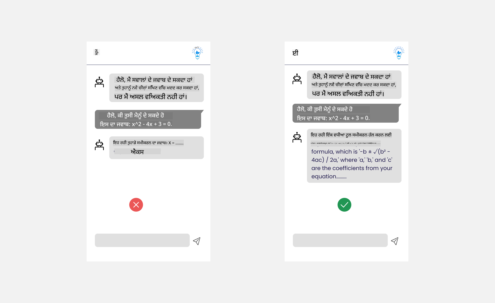
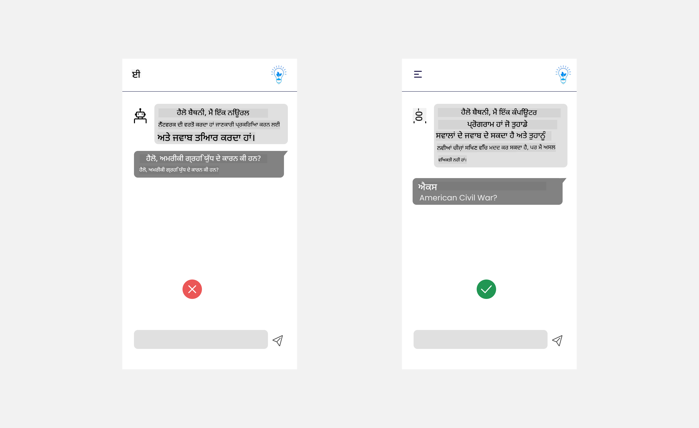

<!--
CO_OP_TRANSLATOR_METADATA:
{
  "original_hash": "747668e4c53d067369f06e9ec2e6313e",
  "translation_date": "2025-08-26T16:12:03+00:00",
  "source_file": "12-designing-ux-for-ai-applications/README.md",
  "language_code": "pa"
}
-->
# ਏਆਈ ਐਪਲੀਕੇਸ਼ਨਾਂ ਲਈ ਯੂਐਕਸ ਡਿਜ਼ਾਈਨ ਕਰਨਾ

> _(ਉਪਰ ਦਿੱਤੀ ਤਸਵੀਰ 'ਤੇ ਕਲਿੱਕ ਕਰਕੇ ਇਸ ਪਾਠ ਦਾ ਵੀਡੀਓ ਵੇਖੋ)_

ਯੂਜ਼ਰ ਅਨੁਭਵ (ਯੂਐਕਸ) ਐਪ ਬਣਾਉਣ ਵਿੱਚ ਬਹੁਤ ਮਹੱਤਵਪੂਰਨ ਹੈ। ਯੂਜ਼ਰ ਤੁਹਾਡੀ ਐਪ ਨੂੰ ਆਸਾਨੀ ਅਤੇ ਪ੍ਰਭਾਵਸ਼ਾਲੀ ਢੰਗ ਨਾਲ ਵਰਤ ਸਕਣ, ਇਹ ਜ਼ਰੂਰੀ ਹੈ। ਸਿਰਫ਼ ਪ੍ਰਭਾਵਸ਼ਾਲੀ ਹੋਣਾ ਹੀ ਨਹੀਂ, ਸਗੋਂ ਤੁਹਾਨੂੰ ਆਪਣੀਆਂ ਐਪਾਂ ਨੂੰ ਐਸਾ ਬਣਾਉਣਾ ਚਾਹੀਦਾ ਹੈ ਕਿ ਹਰ ਕੋਈ ਉਨ੍ਹਾਂ ਨੂੰ ਵਰਤ ਸਕੇ, ਜਿਸ ਨਾਲ ਉਹ _ਸਭ ਲਈ ਉਪਲਬਧ_ ਹੋਣ। ਇਹ ਅਧਿਆਇ ਇਸ ਖੇਤਰ 'ਤੇ ਧਿਆਨ ਦੇਵੇਗਾ ਤਾਂ ਜੋ ਤੁਸੀਂ ਅੰਤ ਵਿੱਚ ਐਸਾ ਐਪ ਬਣਾਉ ਸਕੋ ਜੋ ਲੋਕ ਵਰਤ ਸਕਣ ਅਤੇ ਵਰਤਣਾ ਚਾਹੁਣ।

## ਜਾਣ-ਪਛਾਣ

ਯੂਜ਼ਰ ਅਨੁਭਵ ਇਹ ਹੈ ਕਿ ਇੱਕ ਯੂਜ਼ਰ ਕਿਸ ਤਰੀਕੇ ਨਾਲ ਕਿਸੇ ਉਤਪਾਦ ਜਾਂ ਸੇਵਾ (ਚਾਹੇ ਉਹ ਸਿਸਟਮ, ਟੂਲ ਜਾਂ ਡਿਜ਼ਾਈਨ ਹੋਵੇ) ਨਾਲ ਇੰਟਰੈਕਟ ਕਰਦਾ ਹੈ। ਜਦੋਂ ਅਸੀਂ ਏਆਈ ਐਪਲੀਕੇਸ਼ਨ ਬਣਾਉਂਦੇ ਹਾਂ, ਡਿਵੈਲਪਰ ਸਿਰਫ਼ ਪ੍ਰਭਾਵਸ਼ਾਲੀ ਯੂਜ਼ਰ ਅਨੁਭਵ ਹੀ ਨਹੀਂ, ਸਗੋਂ ਨੈਤਿਕਤਾ 'ਤੇ ਵੀ ਧਿਆਨ ਦਿੰਦੇ ਹਨ। ਇਸ ਪਾਠ ਵਿੱਚ ਅਸੀਂ ਵੇਖਾਂਗੇ ਕਿ ਕਿਵੇਂ ਆਰਟੀਫੀਸ਼ੀਅਲ ਇੰਟੈਲੀਜੈਂਸ (ਏਆਈ) ਐਪਲੀਕੇਸ਼ਨ ਬਣਾਈਆਂ ਜਾਣ ਜੋ ਯੂਜ਼ਰ ਦੀਆਂ ਲੋੜਾਂ ਨੂੰ ਪੂਰਾ ਕਰਦੀਆਂ ਹਨ।

ਇਸ ਪਾਠ ਵਿੱਚ ਇਹ ਖੇਤਰ ਸ਼ਾਮਲ ਹੋਣਗੇ:

- ਯੂਜ਼ਰ ਅਨੁਭਵ ਦੀ ਜਾਣ-ਪਛਾਣ ਅਤੇ ਯੂਜ਼ਰ ਦੀਆਂ ਲੋੜਾਂ ਨੂੰ ਸਮਝਣਾ
- ਭਰੋਸੇ ਅਤੇ ਪਾਰਦਰਸ਼ਤਾ ਲਈ ਏਆਈ ਐਪਲੀਕੇਸ਼ਨ ਡਿਜ਼ਾਈਨ ਕਰਨਾ
- ਸਹਿਯੋਗ ਅਤੇ ਫੀਡਬੈਕ ਲਈ ਏਆਈ ਐਪਲੀਕੇਸ਼ਨ ਡਿਜ਼ਾਈਨ ਕਰਨਾ

## ਸਿੱਖਣ ਦੇ ਲਕੜ

ਇਹ ਪਾਠ ਪੜ੍ਹਨ ਤੋਂ ਬਾਅਦ, ਤੁਸੀਂ ਸਮਝ ਸਕੋਗੇ:

- ਕਿਵੇਂ ਏਆਈ ਐਪਲੀਕੇਸ਼ਨ ਬਣਾਉਣੀਆਂ ਜੋ ਯੂਜ਼ਰ ਦੀਆਂ ਲੋੜਾਂ ਨੂੰ ਪੂਰਾ ਕਰਦੀਆਂ ਹਨ।
- ਐਸੀਆਂ ਏਆਈ ਐਪਲੀਕੇਸ਼ਨ ਡਿਜ਼ਾਈਨ ਕਰਨਾ ਜੋ ਭਰੋਸਾ ਅਤੇ ਸਹਿਯੋਗ ਨੂੰ ਵਧਾਵਣ।

### ਪੂਰਵ-ਸ਼ਰਤ

ਥੋੜਾ ਸਮਾਂ ਕੱਢੋ ਅਤੇ [ਯੂਜ਼ਰ ਅਨੁਭਵ ਅਤੇ ਡਿਜ਼ਾਈਨ ਸੋਚ](https://learn.microsoft.com/training/modules/ux-design?WT.mc_id=academic-105485-koreyst) ਬਾਰੇ ਹੋਰ ਪੜ੍ਹੋ।

## ਯੂਜ਼ਰ ਅਨੁਭਵ ਦੀ ਜਾਣ-ਪਛਾਣ ਅਤੇ ਯੂਜ਼ਰ ਦੀਆਂ ਲੋੜਾਂ ਨੂੰ ਸਮਝਣਾ

ਸਾਡੀ ਕਲਪਨਾਤਮਕ ਸਿੱਖਿਆ ਸਟਾਰਟਅੱਪ ਵਿੱਚ, ਸਾਡੇ ਕੋਲ ਦੋ ਮੁੱਖ ਯੂਜ਼ਰ ਹਨ: ਅਧਿਆਪਕ ਅਤੇ ਵਿਦਿਆਰਥੀ। ਦੋਹਾਂ ਦੀਆਂ ਵੱਖ-ਵੱਖ ਲੋੜਾਂ ਹਨ। ਯੂਜ਼ਰ-ਕੇਂਦਰਤ ਡਿਜ਼ਾਈਨ ਯੂਜ਼ਰ ਨੂੰ ਪਹਿਲ ਦਿੰਦੀ ਹੈ, ਇਹ ਯਕੀਨੀ ਬਣਾਉਂਦੀ ਹੈ ਕਿ ਉਤਪਾਦ ਉਹਨਾਂ ਲਈ ਲਾਭਕਾਰੀ ਅਤੇ ਸਬੰਧਤ ਹਨ ਜਿਨ੍ਹਾਂ ਲਈ ਇਹ ਬਣਾਏ ਗਏ ਹਨ।

ਐਪਲੀਕੇਸ਼ਨ **ਉਪਯੋਗੀ, ਭਰੋਸੇਯੋਗ, ਉਪਲਬਧ ਅਤੇ ਸੁਖਦਾਇਕ** ਹੋਣੀ ਚਾਹੀਦੀ ਹੈ ਤਾਂ ਜੋ ਵਧੀਆ ਯੂਜ਼ਰ ਅਨੁਭਵ ਮਿਲ ਸਕੇ।

### ਉਪਯੋਗਤਾ

ਉਪਯੋਗੀ ਹੋਣ ਦਾ ਮਤਲਬ ਹੈ ਕਿ ਐਪਲੀਕੇਸ਼ਨ ਵਿੱਚ ਉਹ ਫੰਕਸ਼ਨਲਿਟੀ ਹੋਵੇ ਜੋ ਉਸਦੇ ਮਕਸਦ ਨਾਲ ਮੇਲ ਖਾਂਦੀ ਹੋਵੇ, ਜਿਵੇਂ ਕਿ ਅੰਕਣ ਪ੍ਰਕਿਰਿਆ ਨੂੰ ਆਟੋਮੈਟਿਕ ਕਰਨਾ ਜਾਂ ਦੁਹਰਾਈ ਲਈ ਫਲੈਸ਼ਕਾਰਡ ਬਣਾਉਣਾ। ਜੇਕਰ ਐਪਲੀਕੇਸ਼ਨ ਅੰਕਣ ਪ੍ਰਕਿਰਿਆ ਨੂੰ ਆਟੋਮੈਟਿਕ ਕਰਦੀ ਹੈ, ਤਾਂ ਇਹ ਵਿਦਿਆਰਥੀਆਂ ਦੇ ਕੰਮ ਨੂੰ ਪੂਰਵ-ਨਿਰਧਾਰਤ ਮਾਪਦੰਡਾਂ ਅਨੁਸਾਰ ਸਹੀ ਅਤੇ ਤੇਜ਼ੀ ਨਾਲ ਅੰਕ ਦੇ ਸਕੇ। ਇਸੇ ਤਰ੍ਹਾਂ, ਜੇਕਰ ਐਪਲੀਕੇਸ਼ਨ ਦੁਹਰਾਈ ਲਈ ਫਲੈਸ਼ਕਾਰਡ ਬਣਾਉਂਦੀ ਹੈ, ਤਾਂ ਇਹ ਆਪਣੇ ਡਾਟਾ ਅਧਾਰ 'ਤੇ ਸਬੰਧਤ ਅਤੇ ਵੱਖ-ਵੱਖ ਪ੍ਰਸ਼ਨ ਤਿਆਰ ਕਰ ਸਕੇ।

### ਭਰੋਸੇਯੋਗਤਾ

ਭਰੋਸੇਯੋਗ ਹੋਣ ਦਾ ਮਤਲਬ ਹੈ ਕਿ ਐਪਲੀਕੇਸ਼ਨ ਹਰ ਵਾਰੀ ਆਪਣਾ ਕੰਮ ਠੀਕ ਅਤੇ ਬਿਨਾਂ ਗਲਤੀ ਦੇ ਕਰ ਸਕੇ। ਪਰ, ਏਆਈ ਵੀ ਇਨਸਾਨਾਂ ਵਾਂਗ ਪੂਰੀ ਨਹੀਂ ਹੁੰਦੀ ਅਤੇ ਗਲਤੀਆਂ ਹੋ ਸਕਦੀਆਂ ਹਨ। ਐਪਲੀਕੇਸ਼ਨਾਂ ਵਿੱਚ ਗਲਤੀਆਂ ਜਾਂ ਅਣਜਾਣ ਹਾਲਾਤ ਆ ਸਕਦੇ ਹਨ ਜਿਨ੍ਹਾਂ ਲਈ ਇਨਸਾਨੀ ਦਖਲ ਜਾਂ ਸੁਧਾਰ ਦੀ ਲੋੜ ਪੈ ਸਕਦੀ ਹੈ। ਤੁਸੀਂ ਗਲਤੀਆਂ ਨੂੰ ਕਿਵੇਂ ਹੈਂਡਲ ਕਰਦੇ ਹੋ? ਇਸ ਪਾਠ ਦੇ ਆਖਰੀ ਹਿੱਸੇ ਵਿੱਚ ਅਸੀਂ ਵੇਖਾਂਗੇ ਕਿ ਏਆਈ ਸਿਸਟਮ ਅਤੇ ਐਪਲੀਕੇਸ਼ਨ ਸਹਿਯੋਗ ਅਤੇ ਫੀਡਬੈਕ ਲਈ ਕਿਵੇਂ ਡਿਜ਼ਾਈਨ ਕੀਤੀਆਂ ਜਾਂਦੀਆਂ ਹਨ।

### ਉਪਲਬਧਤਾ

ਉਪਲਬਧ ਹੋਣ ਦਾ ਮਤਲਬ ਹੈ ਕਿ ਯੂਜ਼ਰ ਅਨੁਭਵ ਨੂੰ ਵੱਖ-ਵੱਖ ਸਮਰੱਥਾਵਾਂ ਵਾਲੇ ਯੂਜ਼ਰਾਂ ਤੱਕ ਫੈਲਾਇਆ ਜਾਵੇ, ਜਿਸ ਵਿੱਚ ਅਯੋਗਤਾ ਵਾਲੇ ਲੋਕ ਵੀ ਸ਼ਾਮਲ ਹਨ, ਤਾਂ ਜੋ ਕੋਈ ਵੀ ਪਿੱਛੇ ਨਾ ਰਹਿ ਜਾਵੇ। ਉਪਲਬਧਤਾ ਦੇ ਨਿਯਮਾਂ ਅਤੇ ਅਸੂਲਾਂ ਦੀ ਪਾਲਣਾ ਕਰਕੇ, ਏਆਈ ਹੱਲ ਹੋਰ ਵਧੇਰੇ ਸਮੇਟਣਯੋਗ, ਵਰਤਣਯੋਗ ਅਤੇ ਸਾਰੇ ਯੂਜ਼ਰਾਂ ਲਈ ਲਾਭਕਾਰੀ ਬਣ ਜਾਂਦੇ ਹਨ।

### ਸੁਖਦਾਇਕ

ਸੁਖਦਾਇਕ ਹੋਣ ਦਾ ਮਤਲਬ ਹੈ ਕਿ ਐਪਲੀਕੇਸ਼ਨ ਵਰਤਣ ਵਿੱਚ ਮਜ਼ੇਦਾਰ ਹੋਵੇ। ਆਕਰਸ਼ਕ ਯੂਜ਼ਰ ਅਨੁਭਵ ਯੂਜ਼ਰ 'ਤੇ ਚੰਗਾ ਪ੍ਰਭਾਵ ਪਾ ਸਕਦਾ ਹੈ, ਉਹਨੂੰ ਮੁੜ ਐਪ ਵਰਤਣ ਲਈ ਉਤਸ਼ਾਹਿਤ ਕਰ ਸਕਦਾ ਹੈ ਅਤੇ ਕਾਰੋਬਾਰ ਦੀ ਆਮਦਨ ਵਧਾ ਸਕਦਾ ਹੈ।

ਹਰ ਸਮੱਸਿਆ ਦਾ ਹੱਲ ਏਆਈ ਨਾਲ ਨਹੀਂ ਕੀਤਾ ਜਾ ਸਕਦਾ। ਏਆਈ ਤੁਹਾਡੇ ਯੂਜ਼ਰ ਅਨੁਭਵ ਨੂੰ ਹੋਰ ਵਧੀਆ ਬਣਾਉਣ ਲਈ ਆਉਂਦੀ ਹੈ, ਚਾਹੇ ਉਹ ਹੱਥੋਂ ਹੋਣ ਵਾਲੇ ਕੰਮ ਆਟੋਮੈਟਿਕ ਕਰਨਾ ਹੋਵੇ ਜਾਂ ਯੂਜ਼ਰ ਅਨੁਭਵ ਨੂੰ ਨਿੱਜੀ ਬਣਾਉਣਾ ਹੋਵੇ।

## ਭਰੋਸੇ ਅਤੇ ਪਾਰਦਰਸ਼ਤਾ ਲਈ ਏਆਈ ਐਪਲੀਕੇਸ਼ਨ ਡਿਜ਼ਾਈਨ ਕਰਨਾ

ਜਦੋਂ ਤੁਸੀਂ ਏਆਈ ਐਪਲੀਕੇਸ਼ਨ ਡਿਜ਼ਾਈਨ ਕਰਦੇ ਹੋ, ਤਾਂ ਭਰੋਸਾ ਬਣਾਉਣਾ ਬਹੁਤ ਜ਼ਰੂਰੀ ਹੈ। ਭਰੋਸਾ ਇਹ ਯਕੀਨ ਦਿਲਾਉਂਦਾ ਹੈ ਕਿ ਯੂਜ਼ਰ ਨੂੰ ਵਿਸ਼ਵਾਸ ਹੋਵੇ ਕਿ ਐਪਲੀਕੇਸ਼ਨ ਕੰਮ ਕਰੇਗੀ, ਨਤੀਜੇ ਲਗਾਤਾਰ ਦੇਵੇਗੀ ਅਤੇ ਨਤੀਜੇ ਉਹੀ ਹੋਣਗੇ ਜੋ ਯੂਜ਼ਰ ਚਾਹੁੰਦਾ ਹੈ। ਇੱਥੇ ਇੱਕ ਖਤਰਾ ਹੈ: ਅਭਰੋਸਾ ਅਤੇ ਅਤਿ-ਭਰੋਸਾ। ਅਭਰੋਸਾ ਉਦੋਂ ਹੁੰਦਾ ਹੈ ਜਦੋਂ ਯੂਜ਼ਰ ਨੂੰ ਏਆਈ ਸਿਸਟਮ 'ਤੇ ਘੱਟ ਜਾਂ ਕੋਈ ਭਰੋਸਾ ਨਹੀਂ ਹੁੰਦਾ, ਜਿਸ ਨਾਲ ਉਹ ਤੁਹਾਡੀ ਐਪ ਨੂੰ ਰੱਦ ਕਰ ਦਿੰਦਾ ਹੈ। ਅਤਿ-ਭਰੋਸਾ ਉਦੋਂ ਹੁੰਦਾ ਹੈ ਜਦੋਂ ਯੂਜ਼ਰ ਏਆਈ ਸਿਸਟਮ ਦੀ ਸਮਰੱਥਾ ਨੂੰ ਹੱਦ ਤੋਂ ਵੱਧ ਅੰਕ ਲਾਉਂਦਾ ਹੈ, ਜਿਸ ਨਾਲ ਉਹ ਏਆਈ 'ਤੇ ਬਹੁਤ ਜ਼ਿਆਦਾ ਭਰੋਸਾ ਕਰ ਲੈਂਦੇ ਹਨ। ਉਦਾਹਰਨ ਵਜੋਂ, ਜੇਕਰ ਅਧਿਆਪਕ ਅਤਿ-ਭਰੋਸਾ ਕਰ ਲੈਂਦਾ ਹੈ ਤਾਂ ਉਹ ਕੁਝ ਪੇਪਰਾਂ ਨੂੰ ਚੈੱਕ ਨਹੀਂ ਕਰੇਗਾ ਕਿ ਅੰਕਣ ਸਿਸਟਮ ਠੀਕ ਕੰਮ ਕਰ ਰਿਹਾ ਹੈ ਜਾਂ ਨਹੀਂ। ਇਸ ਨਾਲ ਵਿਦਿਆਰਥੀਆਂ ਲਈ ਗਲਤ ਜਾਂ ਅਨਿਆਇਕ ਅੰਕ ਆ ਸਕਦੇ ਹਨ ਜਾਂ ਫੀਡਬੈਕ ਅਤੇ ਸੁਧਾਰ ਦੇ ਮੌਕੇ ਗੁਆਚੇ ਜਾ ਸਕਦੇ ਹਨ।

ਭਰੋਸਾ ਬਣਾਉਣ ਲਈ ਦੋ ਮੁੱਖ ਤਰੀਕੇ ਹਨ: ਵਿਆਖਿਆਯੋਗਤਾ ਅਤੇ ਨਿਯੰਤਰਣ।

### ਵਿਆਖਿਆਯੋਗਤਾ

ਜਦੋਂ ਏਆਈ ਫੈਸਲੇ ਲੈਣ ਵਿੱਚ ਮਦਦ ਕਰਦੀ ਹੈ, ਜਿਵੇਂ ਕਿ ਭਵਿੱਖ ਦੀ ਪੀੜ੍ਹੀ ਨੂੰ ਗਿਆਨ ਦੇਣਾ, ਤਾਂ ਅਧਿਆਪਕਾਂ ਅਤੇ ਮਾਪਿਆਂ ਲਈ ਇਹ ਸਮਝਣਾ ਜ਼ਰੂਰੀ ਹੈ ਕਿ ਏਆਈ ਫੈਸਲੇ ਕਿਵੇਂ ਲੈਂਦੀ ਹੈ। ਇਹ ਹੈ ਵਿਆਖਿਆਯੋਗਤਾ - ਸਮਝਣਾ ਕਿ ਏਆਈ ਐਪਲੀਕੇਸ਼ਨ ਫੈਸਲੇ ਕਿਵੇਂ ਲੈਂਦੀਆਂ ਹਨ। ਵਿਆਖਿਆਯੋਗਤਾ ਲਈ ਡਿਜ਼ਾਈਨ ਕਰਨ ਵਿੱਚ ਉਹ ਵੇਰਵੇ ਸ਼ਾਮਲ ਕਰਨੇ ਚਾਹੀਦੇ ਹਨ ਜੋ ਦੱਸਣ ਕਿ ਏਆਈ ਨੇ ਨਤੀਜੇ ਤੱਕ ਕਿਵੇਂ ਪਹੁੰਚਿਆ। ਦਰਸ਼ਕਾਂ ਨੂੰ ਪਤਾ ਹੋਣਾ ਚਾਹੀਦਾ ਹੈ ਕਿ ਨਤੀਜਾ ਏਆਈ ਨੇ ਬਣਾਇਆ ਹੈ, ਇਨਸਾਨ ਨੇ ਨਹੀਂ। ਉਦਾਹਰਨ ਵਜੋਂ, "ਹੁਣੇ ਆਪਣੇ ਟਿਊਟਰ ਨਾਲ ਗੱਲਬਾਤ ਸ਼ੁਰੂ ਕਰੋ" ਦੀ ਥਾਂ "ਏਆਈ ਟਿਊਟਰ ਵਰਤੋ ਜੋ ਤੁਹਾਡੀਆਂ ਲੋੜਾਂ ਅਨੁਸਾਰ ਢਲਦਾ ਹੈ ਅਤੇ ਤੁਹਾਨੂੰ ਤੁਹਾਡੀ ਰਫਤਾਰ 'ਤੇ ਸਿੱਖਣ ਵਿੱਚ ਮਦਦ ਕਰਦਾ ਹੈ" ਕਹੋ।

ਇੱਕ ਹੋਰ ਉਦਾਹਰਨ ਹੈ ਕਿ ਏਆਈ ਯੂਜ਼ਰ ਅਤੇ ਨਿੱਜੀ ਡਾਟਾ ਕਿਵੇਂ ਵਰਤਦੀ ਹੈ। ਉਦਾਹਰਨ ਵਜੋਂ, ਵਿਦਿਆਰਥੀ ਵਾਲਾ ਯੂਜ਼ਰ ਕੁਝ ਸੀਮਾਵਾਂ ਰੱਖ ਸਕਦਾ ਹੈ। ਏਆਈ ਸਿੱਧਾ ਉੱਤਰ ਨਹੀਂ ਦੇ ਸਕਦੀ, ਪਰ ਯੂਜ਼ਰ ਨੂੰ ਸਮੱਸਿਆ ਦਾ ਹੱਲ ਸੋਚਣ ਲਈ ਮਦਦ ਕਰ ਸਕਦੀ ਹੈ।

ਵਿਆਖਿਆਯੋਗਤਾ ਦਾ ਇੱਕ ਹੋਰ ਅਹੰਕਾਰ ਹੈ ਵਿਆਖਿਆਵਾਂ ਨੂੰ ਆਸਾਨ ਬਣਾਉਣਾ। ਵਿਦਿਆਰਥੀ ਅਤੇ ਅਧਿਆਪਕ ਏਆਈ ਦੇ ਮਾਹਿਰ ਨਹੀਂ ਹੋ ਸਕਦੇ, ਇਸ ਲਈ ਐਪਲੀਕੇਸ਼ਨ ਕੀ ਕਰ ਸਕਦੀ ਹੈ ਜਾਂ ਨਹੀਂ ਕਰ ਸਕਦੀ, ਇਹ ਵਿਆਖਿਆਵਾਂ ਆਸਾਨ ਅਤੇ ਸਮਝਣਯੋਗ ਹੋਣੀਆਂ ਚਾਹੀਦੀਆਂ ਹਨ।

### ਨਿਯੰਤਰਣ

ਜਨਰੇਟਿਵ ਏਆਈ ਯੂਜ਼ਰ ਅਤੇ ਏਆਈ ਵਿਚਕਾਰ ਸਹਿਯੋਗ ਬਣਾਉਂਦੀ ਹੈ, ਜਿੱਥੇ ਯੂਜ਼ਰ ਵੱਖ-ਵੱਖ ਨਤੀਜਿਆਂ ਲਈ ਪ੍ਰਾਂਪਟ ਬਦਲ ਸਕਦੇ ਹਨ। ਇਸ ਤੋਂ ਇਲਾਵਾ, ਜਦੋਂ ਨਤੀਜਾ ਤਿਆਰ ਹੋ ਜਾਂਦਾ ਹੈ, ਯੂਜ਼ਰ ਨਤੀਜਿਆਂ ਨੂੰ ਸੋਧ ਸਕਦੇ ਹਨ, ਜਿਸ ਨਾਲ ਉਹਨਾਂ ਨੂੰ ਨਿਯੰਤਰਣ ਦਾ ਅਹਿਸਾਸ ਹੁੰਦਾ ਹੈ। ਉਦਾਹਰਨ ਵਜੋਂ, ਜਦੋਂ ਤੁਸੀਂ Bing ਵਰਤਦੇ ਹੋ, ਤੁਸੀਂ ਆਪਣੇ ਪ੍ਰਾਂਪਟ ਨੂੰ ਫਾਰਮੈਟ, ਟੋਨ ਅਤੇ ਲੰਬਾਈ ਅਨੁਸਾਰ ਢਾਲ ਸਕਦੇ ਹੋ। ਇਸ ਤੋਂ ਇਲਾਵਾ, ਤੁਸੀਂ ਆਪਣੇ ਨਤੀਜੇ ਵਿੱਚ ਤਬਦੀਲੀਆਂ ਕਰ ਸਕਦੇ ਹੋ ਅਤੇ ਨਤੀਜੇ ਨੂੰ ਸੋਧ ਸਕਦੇ ਹੋ, ਜਿਵੇਂ ਹੇਠਾਂ ਦਿਖਾਇਆ ਗਿਆ ਹੈ:

Bing ਵਿੱਚ ਇੱਕ ਹੋਰ ਵਿਸ਼ੇਸ਼ਤਾ ਹੈ ਜੋ ਯੂਜ਼ਰ ਨੂੰ ਐਪ 'ਤੇ ਨਿਯੰਤਰਣ ਦਿੰਦੀ ਹੈ, ਉਹ ਹੈ ਡਾਟਾ 'ਤੇ ਆਉਣ ਜਾਂ ਨਾ ਆਉਣ ਦੀ ਚੋਣ। ਸਕੂਲ ਐਪ ਲਈ, ਵਿਦਿਆਰਥੀ ਆਪਣੀਆਂ ਨੋਟਾਂ ਅਤੇ ਅਧਿਆਪਕਾਂ ਦੇ ਸਰੋਤਾਂ ਨੂੰ ਦੁਹਰਾਈ ਸਮੱਗਰੀ ਵਜੋਂ ਵਰਤਣਾ ਚਾਹੁੰਦੇ ਹੋ ਸਕਦੇ ਹਨ।

> ਜਦੋਂ ਤੁਸੀਂ ਏਆਈ ਐਪਲੀਕੇਸ਼ਨ ਡਿਜ਼ਾਈਨ ਕਰਦੇ ਹੋ, ਤਾਂ ਇਹ ਯਕੀਨੀ ਬਣਾਉਣਾ ਜ਼ਰੂਰੀ ਹੈ ਕਿ ਯੂਜ਼ਰ ਅਤਿ-ਭਰੋਸਾ ਨਾ ਕਰ ਲੈਣ ਅਤੇ ਸਮਰੱਥਾਵਾਂ ਬਾਰੇ ਗਲਤ ਉਮੀਦਾਂ ਨਾ ਰੱਖਣ। ਇੱਕ ਤਰੀਕਾ ਇਹ ਹੈ ਕਿ ਪ੍ਰਾਂਪਟ ਅਤੇ ਨਤੀਜਿਆਂ ਵਿਚਕਾਰ ਥੋੜ੍ਹਾ friction ਬਣਾਇਆ ਜਾਵੇ। ਯੂਜ਼ਰ ਨੂੰ ਯਾਦ ਦਿਵਾਓ ਕਿ ਇਹ ਏਆਈ ਹੈ, ਇਨਸਾਨ ਨਹੀਂ।

## ਸਹਿਯੋਗ ਅਤੇ ਫੀਡਬੈਕ ਲਈ ਏਆਈ ਐਪਲੀਕੇਸ਼ਨ ਡਿਜ਼ਾਈਨ ਕਰਨਾ

ਜਿਵੇਂ ਪਹਿਲਾਂ ਦੱਸਿਆ ਗਿਆ, ਜਨਰੇਟਿਵ ਏਆਈ ਯੂਜ਼ਰ ਅਤੇ ਏਆਈ ਵਿਚਕਾਰ ਸਹਿਯੋਗ ਬਣਾਉਂਦੀ ਹੈ। ਜ਼ਿਆਦਾਤਰ ਇੰਟਰੈਕਸ਼ਨ ਵਿੱਚ ਯੂਜ਼ਰ ਪ੍ਰਾਂਪਟ ਦਿੰਦਾ ਹੈ ਅਤੇ ਏਆਈ ਨਤੀਜਾ ਤਿਆਰ ਕਰਦੀ ਹੈ। ਪਰ ਜੇਕਰ ਨਤੀਜਾ ਗਲਤ ਆ ਜਾਵੇ? ਜੇਕਰ ਐਪ ਵਿੱਚ ਗਲਤੀ ਆ ਜਾਵੇ ਤਾਂ ਇਹ ਕਿਵੇਂ ਹੈਂਡਲ ਕਰਦੀ ਹੈ? ਕੀ ਏਆਈ ਯੂਜ਼ਰ ਨੂੰ ਦੋਸ਼ ਦਿੰਦੀ ਹੈ ਜਾਂ ਗਲਤੀ ਦੀ ਵਜ੍ਹਾ ਸਮਝਾਉਂਦੀ ਹੈ?

ਏਆਈ ਐਪਲੀਕੇਸ਼ਨਾਂ ਵਿੱਚ ਫੀਡਬੈਕ ਲੈਣ ਅਤੇ ਦੇਣ ਦੀ ਸਮਰੱਥਾ ਹੋਣੀ ਚਾਹੀਦੀ ਹੈ। ਇਹ ਨਾ ਸਿਰਫ਼ ਏਆਈ ਸਿਸਟਮ ਨੂੰ ਸੁਧਾਰਨ ਵਿੱਚ ਮਦਦ ਕਰਦੀ ਹੈ, ਸਗੋਂ ਯੂਜ਼ਰਾਂ ਨਾਲ ਭਰੋਸਾ ਵੀ ਬਣਾਉਂਦੀ ਹੈ। ਡਿਜ਼ਾਈਨ ਵਿੱਚ ਫੀਡਬੈਕ ਲੂਪ ਸ਼ਾਮਲ ਹੋਣਾ ਚਾਹੀਦਾ ਹੈ, ਉਦਾਹਰਨ ਵਜੋਂ ਨਤੀਜੇ 'ਤੇ ਸਧਾਰਨ ਥੰਬਜ਼ ਅੱਪ ਜਾਂ ਥੰਬਜ਼ ਡਾਊਨ।

ਇੱਕ ਹੋਰ ਤਰੀਕਾ ਇਹ ਹੈ ਕਿ ਸਿਸਟਮ ਦੀਆਂ ਸਮਰੱਥਾਵਾਂ ਅਤੇ ਸੀਮਾਵਾਂ ਸਾਫ਼-ਸਾਫ਼ ਦੱਸੀਆਂ ਜਾਣ। ਜਦੋਂ ਯੂਜ਼ਰ ਕੋਈ ਐਸਾ ਕੰਮ ਮੰਗਦਾ ਹੈ ਜੋ ਏਆਈ ਦੀ ਸਮਰੱਥਾ ਤੋਂ ਬਾਹਰ ਹੈ, ਤਾਂ ਇਹ ਹੈਂਡਲ ਕਰਨ ਦਾ ਵੀ ਤਰੀਕਾ ਹੋਣਾ ਚਾਹੀਦਾ ਹੈ, ਜਿਵੇਂ ਹੇਠਾਂ ਦਿਖਾਇਆ ਗਿਆ ਹੈ।

 ਦੀ ਵਰਤੋਂ ਕਰਕੇ ਅਨੁਵਾਦ ਕੀਤਾ ਗਿਆ ਹੈ। ਅਸੀਂ ਯਥਾਸੰਭਵ ਸਹੀ ਅਨੁਵਾਦ ਕਰਨ ਦੀ ਕੋਸ਼ਿਸ਼ ਕਰਦੇ ਹਾਂ, ਪਰ ਕਿਰਪਾ ਕਰਕੇ ਧਿਆਨ ਵਿੱਚ ਰੱਖੋ ਕਿ ਆਟੋਮੈਟਿਕ ਅਨੁਵਾਦ ਵਿੱਚ ਗਲਤੀਆਂ ਜਾਂ ਅਣਪਛਾਤੀਆਂ ਹੋ ਸਕਦੀਆਂ ਹਨ। ਮੂਲ ਦਸਤਾਵੇਜ਼, ਜਿਸ ਭਾਸ਼ਾ ਵਿੱਚ ਉਹ ਲਿਖਿਆ ਗਿਆ ਹੈ, ਨੂੰ ਹੀ ਅਧਿਕਾਰਤ ਸਰੋਤ ਮੰਨਿਆ ਜਾਣਾ ਚਾਹੀਦਾ ਹੈ। ਮਹੱਤਵਪੂਰਨ ਜਾਣਕਾਰੀ ਲਈ, ਪੇਸ਼ੇਵਰ ਮਨੁੱਖੀ ਅਨੁਵਾਦ ਦੀ ਸਿਫਾਰਸ਼ ਕੀਤੀ ਜਾਂਦੀ ਹੈ। ਇਸ ਅਨੁਵਾਦ ਦੀ ਵਰਤੋਂ ਕਰਕੇ ਹੋਣ ਵਾਲੀਆਂ ਕਿਸੇ ਵੀ ਗਲਤਫਹਮੀਆਂ ਜਾਂ ਗਲਤ ਵਿਆਖਿਆਵਾਂ ਲਈ ਅਸੀਂ ਜ਼ਿੰਮੇਵਾਰ ਨਹੀਂ ਹਾਂ।