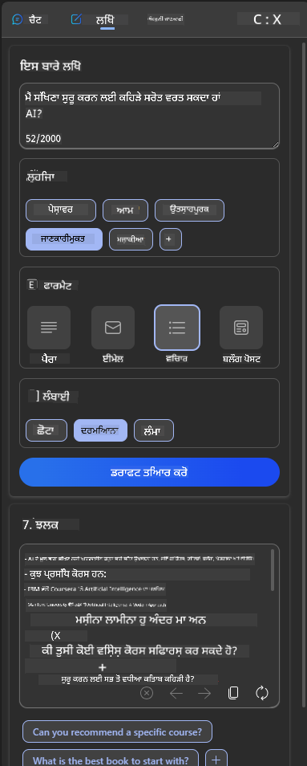
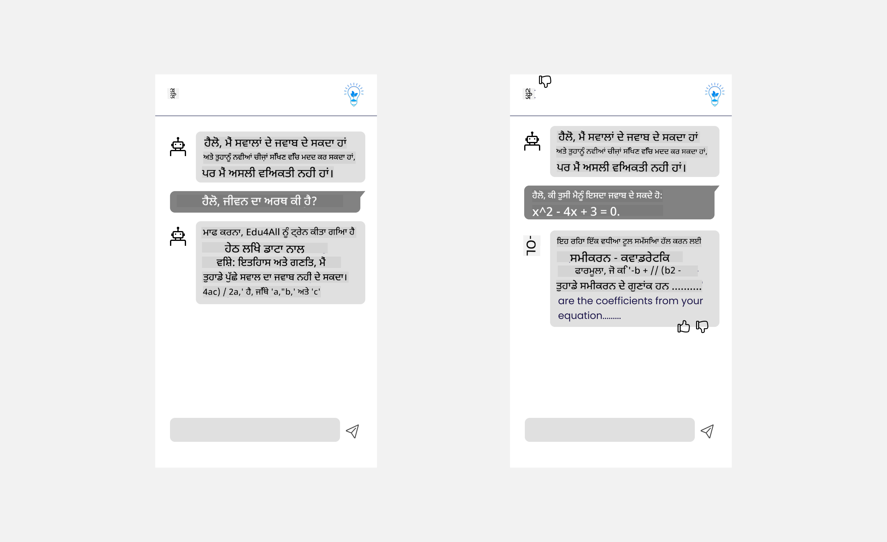

<!--
CO_OP_TRANSLATOR_METADATA:
{
  "original_hash": "ec385b41ee50579025d50cc03bfb3a25",
  "translation_date": "2025-07-09T14:54:59+00:00",
  "source_file": "12-designing-ux-for-ai-applications/README.md",
  "language_code": "pa"
}
-->
# Designing UX for AI Applications

> _(ਇਸ ਪਾਠ ਦਾ ਵੀਡੀਓ ਦੇਖਣ ਲਈ ਉਪਰ ਦਿੱਤੀ ਤਸਵੀਰ 'ਤੇ ਕਲਿੱਕ ਕਰੋ)_

ਯੂਜ਼ਰ ਅਨੁਭਵ ਐਪ ਬਣਾਉਣ ਦਾ ਇੱਕ ਬਹੁਤ ਹੀ ਮਹੱਤਵਪੂਰਨ ਪਹਲੂ ਹੈ। ਯੂਜ਼ਰਾਂ ਨੂੰ ਤੁਹਾਡਾ ਐਪ ਇਸ ਤਰ੍ਹਾਂ ਵਰਤਣਾ ਚਾਹੀਦਾ ਹੈ ਕਿ ਉਹ ਆਪਣੇ ਕੰਮ ਤੇਜ਼ੀ ਨਾਲ ਕਰ ਸਕਣ। ਤੇਜ਼ ਹੋਣਾ ਇੱਕ ਗੱਲ ਹੈ ਪਰ ਤੁਹਾਨੂੰ ਐਪ ਇਸ ਤਰ੍ਹਾਂ ਡਿਜ਼ਾਈਨ ਕਰਨੇ ਚਾਹੀਦੇ ਹਨ ਕਿ ਉਹ ਹਰ ਕਿਸੇ ਲਈ ਵਰਤਣ ਯੋਗ ਹੋਣ, ਤਾਂ ਜੋ ਉਹ _ਸੁਗਮ_ ਬਣ ਸਕਣ। ਇਹ ਅਧਿਆਇ ਇਸ ਖੇਤਰ 'ਤੇ ਧਿਆਨ ਦੇਵੇਗਾ ਤਾਂ ਜੋ ਤੁਸੀਂ ਅਜਿਹਾ ਐਪ ਡਿਜ਼ਾਈਨ ਕਰ ਸਕੋ ਜੋ ਲੋਕ ਵਰਤਣਾ ਚਾਹੁੰਦੇ ਹੋਣ ਅਤੇ ਵਰਤ ਸਕਣ।

## ਪਰਿਚਯ

ਯੂਜ਼ਰ ਅਨੁਭਵ ਦਾ ਮਤਲਬ ਹੈ ਕਿ ਕਿਸੇ ਯੂਜ਼ਰ ਦਾ ਕਿਸੇ ਖਾਸ ਉਤਪਾਦ ਜਾਂ ਸੇਵਾ ਨਾਲ ਕਿਵੇਂ ਇੰਟਰੈਕਟ ਕਰਨਾ ਅਤੇ ਵਰਤਣਾ ਹੈ, ਚਾਹੇ ਉਹ ਕੋਈ ਸਿਸਟਮ, ਟੂਲ ਜਾਂ ਡਿਜ਼ਾਈਨ ਹੋਵੇ। AI ਐਪਲੀਕੇਸ਼ਨਾਂ ਨੂੰ ਵਿਕਸਿਤ ਕਰਦੇ ਸਮੇਂ, ਡਿਵੈਲਪਰ ਸਿਰਫ ਯੂਜ਼ਰ ਅਨੁਭਵ ਨੂੰ ਪ੍ਰਭਾਵਸ਼ਾਲੀ ਬਣਾਉਣ 'ਤੇ ਹੀ ਨਹੀਂ, ਸਗੋਂ ਨੈਤਿਕਤਾ 'ਤੇ ਵੀ ਧਿਆਨ ਦਿੰਦੇ ਹਨ। ਇਸ ਪਾਠ ਵਿੱਚ, ਅਸੀਂ ਕਿਵੇਂ Artificial Intelligence (AI) ਐਪਲੀਕੇਸ਼ਨਾਂ ਨੂੰ ਬਣਾਇਆ ਜਾਵੇ ਜੋ ਯੂਜ਼ਰ ਦੀਆਂ ਜ਼ਰੂਰਤਾਂ ਨੂੰ ਪੂਰਾ ਕਰਦੀਆਂ ਹਨ, ਇਸ ਬਾਰੇ ਗੱਲ ਕਰਾਂਗੇ।

ਇਸ ਪਾਠ ਵਿੱਚ ਹੇਠ ਲਿਖੇ ਖੇਤਰਾਂ ਨੂੰ ਕਵਰ ਕੀਤਾ ਜਾਵੇਗਾ:

- ਯੂਜ਼ਰ ਅਨੁਭਵ ਦਾ ਪਰਿਚਯ ਅਤੇ ਯੂਜ਼ਰ ਦੀਆਂ ਜ਼ਰੂਰਤਾਂ ਨੂੰ ਸਮਝਣਾ  
- ਭਰੋਸਾ ਅਤੇ ਪਾਰਦਰਸ਼ਤਾ ਲਈ AI ਐਪਲੀਕੇਸ਼ਨਾਂ ਦਾ ਡਿਜ਼ਾਈਨ  
- ਸਹਿਯੋਗ ਅਤੇ ਫੀਡਬੈਕ ਲਈ AI ਐਪਲੀਕੇਸ਼ਨਾਂ ਦਾ ਡਿਜ਼ਾਈਨ  

## ਸਿੱਖਣ ਦੇ ਲਕੜ

ਇਸ ਪਾਠ ਨੂੰ ਲੈਣ ਤੋਂ ਬਾਅਦ, ਤੁਸੀਂ ਸਮਰੱਥ ਹੋਵੋਗੇ:

- ਸਮਝਣਾ ਕਿ ਕਿਵੇਂ AI ਐਪਲੀਕੇਸ਼ਨਾਂ ਨੂੰ ਬਣਾਇਆ ਜਾਵੇ ਜੋ ਯੂਜ਼ਰ ਦੀਆਂ ਜ਼ਰੂਰਤਾਂ ਨੂੰ ਪੂਰਾ ਕਰਦੀਆਂ ਹਨ।  
- ਐਸੇ AI ਐਪਲੀਕੇਸ਼ਨਾਂ ਨੂੰ ਡਿਜ਼ਾਈਨ ਕਰਨਾ ਜੋ ਭਰੋਸਾ ਅਤੇ ਸਹਿਯੋਗ ਨੂੰ ਵਧਾਵਣ।  

### ਪਹਿਲਾਂ ਦੀ ਜਾਣਕਾਰੀ

ਕੁਝ ਸਮਾਂ ਲਓ ਅਤੇ [ਯੂਜ਼ਰ ਅਨੁਭਵ ਅਤੇ ਡਿਜ਼ਾਈਨ ਸੋਚ ਬਾਰੇ ਹੋਰ ਪੜ੍ਹੋ।](https://learn.microsoft.com/training/modules/ux-design?WT.mc_id=academic-105485-koreyst)

## ਯੂਜ਼ਰ ਅਨੁਭਵ ਦਾ ਪਰਿਚਯ ਅਤੇ ਯੂਜ਼ਰ ਦੀਆਂ ਜ਼ਰੂਰਤਾਂ ਨੂੰ ਸਮਝਣਾ

ਸਾਡੇ ਕਲਪਨਾਤਮਕ ਸਿੱਖਿਆ ਸਟਾਰਟਅਪ ਵਿੱਚ, ਸਾਡੇ ਕੋਲ ਦੋ ਮੁੱਖ ਯੂਜ਼ਰ ਹਨ, ਅਧਿਆਪਕ ਅਤੇ ਵਿਦਿਆਰਥੀ। ਹਰ ਇੱਕ ਯੂਜ਼ਰ ਦੀਆਂ ਵੱਖ-ਵੱਖ ਜ਼ਰੂਰਤਾਂ ਹੁੰਦੀਆਂ ਹਨ। ਯੂਜ਼ਰ-ਕੇਂਦਰਤ ਡਿਜ਼ਾਈਨ ਯੂਜ਼ਰ ਨੂੰ ਪਹਿਲ ਦਿੰਦਾ ਹੈ ਤਾਂ ਜੋ ਉਤਪਾਦ ਉਹਨਾਂ ਲਈ ਲਾਭਦਾਇਕ ਅਤੇ ਸਬੰਧਤ ਹੋਣ।

ਐਪਲੀਕੇਸ਼ਨ ਨੂੰ **ਲਾਭਦਾਇਕ, ਭਰੋਸੇਯੋਗ, ਸੁਗਮ ਅਤੇ ਮਨਪਸੰਦ** ਹੋਣਾ ਚਾਹੀਦਾ ਹੈ ਤਾਂ ਜੋ ਵਧੀਆ ਯੂਜ਼ਰ ਅਨੁਭਵ ਮਿਲੇ।

### ਵਰਤੋਂਯੋਗਤਾ

ਲਾਭਦਾਇਕ ਹੋਣਾ ਮਤਲਬ ਹੈ ਕਿ ਐਪਲੀਕੇਸ਼ਨ ਵਿੱਚ ਉਹ ਫੰਕਸ਼ਨਲਿਟੀ ਹੋਵੇ ਜੋ ਉਸਦੇ ਮਕਸਦ ਨਾਲ ਮੇਲ ਖਾਂਦੀ ਹੋਵੇ, ਜਿਵੇਂ ਕਿ ਗਰੇਡਿੰਗ ਪ੍ਰਕਿਰਿਆ ਨੂੰ ਆਟੋਮੇਟ ਕਰਨਾ ਜਾਂ ਰਿਵਿਜ਼ਨ ਲਈ ਫਲੈਸ਼ਕਾਰਡ ਬਣਾਉਣਾ। ਗਰੇਡਿੰਗ ਪ੍ਰਕਿਰਿਆ ਨੂੰ ਆਟੋਮੇਟ ਕਰਨ ਵਾਲਾ ਐਪਲੀਕੇਸ਼ਨ ਵਿਦਿਆਰਥੀਆਂ ਦੇ ਕੰਮ ਨੂੰ ਪੂਰਵ ਨਿਰਧਾਰਿਤ ਮਾਪਦੰਡਾਂ ਦੇ ਅਧਾਰ 'ਤੇ ਸਹੀ ਅਤੇ ਤੇਜ਼ੀ ਨਾਲ ਅੰਕ ਦੇ ਸਕਣਾ ਚਾਹੀਦਾ ਹੈ। ਇਸੇ ਤਰ੍ਹਾਂ, ਰਿਵਿਜ਼ਨ ਫਲੈਸ਼ਕਾਰਡ ਬਣਾਉਣ ਵਾਲਾ ਐਪਲੀਕੇਸ਼ਨ ਆਪਣੇ ਡੇਟਾ ਦੇ ਅਧਾਰ 'ਤੇ ਸਬੰਧਤ ਅਤੇ ਵੱਖ-ਵੱਖ ਪ੍ਰਸ਼ਨਾਂ ਨੂੰ ਤਿਆਰ ਕਰ ਸਕਣਾ ਚਾਹੀਦਾ ਹੈ।

### ਭਰੋਸੇਯੋਗਤਾ

ਭਰੋਸੇਯੋਗ ਹੋਣਾ ਮਤਲਬ ਹੈ ਕਿ ਐਪਲੀਕੇਸ਼ਨ ਆਪਣਾ ਕੰਮ ਲਗਾਤਾਰ ਅਤੇ ਬਿਨਾਂ ਗਲਤੀਆਂ ਦੇ ਕਰ ਸਕੇ। ਪਰ AI ਵੀ ਮਨੁੱਖਾਂ ਵਾਂਗ ਪੂਰਨ ਨਹੀਂ ਹੁੰਦਾ ਅਤੇ ਗਲਤੀਆਂ ਹੋ ਸਕਦੀਆਂ ਹਨ। ਐਪਲੀਕੇਸ਼ਨਾਂ ਨੂੰ ਗਲਤੀਆਂ ਜਾਂ ਅਣਉਮੀਦੀਆਂ ਸਥਿਤੀਆਂ ਦਾ ਸਾਹਮਣਾ ਕਰਨਾ ਪੈ ਸਕਦਾ ਹੈ ਜਿੱਥੇ ਮਨੁੱਖੀ ਦਖਲਅੰਦਾਜ਼ੀ ਜਾਂ ਸਹੀ ਕਰਨ ਦੀ ਲੋੜ ਹੋਵੇ। ਤੁਸੀਂ ਗਲਤੀਆਂ ਨੂੰ ਕਿਵੇਂ ਸੰਭਾਲਦੇ ਹੋ? ਇਸ ਪਾਠ ਦੇ ਆਖਰੀ ਹਿੱਸੇ ਵਿੱਚ ਅਸੀਂ ਕਵਰ ਕਰਾਂਗੇ ਕਿ ਕਿਵੇਂ AI ਸਿਸਟਮ ਅਤੇ ਐਪਲੀਕੇਸ਼ਨਾਂ ਨੂੰ ਸਹਿਯੋਗ ਅਤੇ ਫੀਡਬੈਕ ਲਈ ਡਿਜ਼ਾਈਨ ਕੀਤਾ ਜਾਂਦਾ ਹੈ।

### ਸੁਗਮਤਾ

ਸੁਗਮ ਹੋਣਾ ਮਤਲਬ ਹੈ ਕਿ ਯੂਜ਼ਰ ਅਨੁਭਵ ਨੂੰ ਵੱਖ-ਵੱਖ ਸਮਰੱਥਾਵਾਂ ਵਾਲੇ ਯੂਜ਼ਰਾਂ ਤੱਕ ਵਧਾਇਆ ਜਾਵੇ, ਜਿਸ ਵਿੱਚ ਵਿਸ਼ੇਸ਼ ਜ਼ਰੂਰਤਾਂ ਵਾਲੇ ਲੋਕ ਵੀ ਸ਼ਾਮਲ ਹਨ, ਤਾਂ ਜੋ ਕੋਈ ਵੀ ਬਾਹਰ ਨਾ ਰਹਿ ਜਾਵੇ। ਸੁਗਮਤਾ ਦੇ ਨਿਯਮਾਂ ਅਤੇ ਸਿਧਾਂਤਾਂ ਦੀ ਪਾਲਣਾ ਕਰਕੇ, AI ਹੱਲ ਹੋਰ ਸਮਾਵੇਸ਼ੀ, ਵਰਤਣ ਯੋਗ ਅਤੇ ਸਾਰੇ ਯੂਜ਼ਰਾਂ ਲਈ ਲਾਭਦਾਇਕ ਬਣ ਜਾਂਦੇ ਹਨ।

### ਮਨਪਸੰਦ

ਮਨਪਸੰਦ ਹੋਣਾ ਮਤਲਬ ਹੈ ਕਿ ਐਪਲੀਕੇਸ਼ਨ ਵਰਤਣ ਵਿੱਚ ਮਜ਼ੇਦਾਰ ਹੋਵੇ। ਇੱਕ ਆਕਰਸ਼ਕ ਯੂਜ਼ਰ ਅਨੁਭਵ ਯੂਜ਼ਰ 'ਤੇ ਸਕਾਰਾਤਮਕ ਪ੍ਰਭਾਵ ਪਾ ਸਕਦਾ ਹੈ, ਜਿਸ ਨਾਲ ਉਹ ਐਪਲੀਕੇਸ਼ਨ 'ਤੇ ਵਾਪਸ ਆਉਣ ਲਈ ਪ੍ਰੇਰਿਤ ਹੁੰਦਾ ਹੈ ਅਤੇ ਕਾਰੋਬਾਰ ਦੀ ਆਮਦਨ ਵਧਦੀ ਹੈ।

ਹਰ ਸਮੱਸਿਆ ਦਾ ਹੱਲ AI ਨਾਲ ਨਹੀਂ ਕੀਤਾ ਜਾ ਸਕਦਾ। AI ਤੁਹਾਡੇ ਯੂਜ਼ਰ ਅਨੁਭਵ ਨੂੰ ਵਧਾਉਂਦਾ ਹੈ, ਚਾਹੇ ਉਹ ਮੈਨੂਅਲ ਕੰਮਾਂ ਨੂੰ ਆਟੋਮੇਟ ਕਰਨਾ ਹੋਵੇ ਜਾਂ ਯੂਜ਼ਰ ਅਨੁਭਵ ਨੂੰ ਨਿੱਜੀਕਰਨ ਕਰਨਾ ਹੋਵੇ।

## Designing AI Applications for Trust and Transparency

AI ਐਪਲੀਕੇਸ਼ਨਾਂ ਨੂੰ ਡਿਜ਼ਾਈਨ ਕਰਦੇ ਸਮੇਂ ਭਰੋਸਾ ਬਣਾਉਣਾ ਬਹੁਤ ਜ਼ਰੂਰੀ ਹੈ। ਭਰੋਸਾ ਯਕੀਨੀ ਬਣਾਉਂਦਾ ਹੈ ਕਿ ਯੂਜ਼ਰ ਨੂੰ ਪੂਰਾ ਵਿਸ਼ਵਾਸ ਹੈ ਕਿ ਐਪਲੀਕੇਸ਼ਨ ਕੰਮ ਸਹੀ ਤਰੀਕੇ ਨਾਲ ਕਰੇਗਾ, ਨਤੀਜੇ ਲਗਾਤਾਰ ਮਿਲਣਗੇ ਅਤੇ ਨਤੀਜੇ ਉਹੀ ਹੋਣਗੇ ਜੋ ਯੂਜ਼ਰ ਚਾਹੁੰਦਾ ਹੈ। ਇਸ ਖੇਤਰ ਵਿੱਚ ਖਤਰਾ mistrust ਅਤੇ overtrust ਦਾ ਹੈ। Mistrust ਉਸ ਵੇਲੇ ਹੁੰਦਾ ਹੈ ਜਦੋਂ ਯੂਜ਼ਰ ਨੂੰ AI ਸਿਸਟਮ 'ਤੇ ਘੱਟ ਜਾਂ ਕੋਈ ਭਰੋਸਾ ਨਹੀਂ ਹੁੰਦਾ, ਜਿਸ ਨਾਲ ਉਹ ਤੁਹਾਡੇ ਐਪ ਨੂੰ ਰੱਦ ਕਰ ਦਿੰਦਾ ਹੈ। Overtrust ਉਸ ਵੇਲੇ ਹੁੰਦਾ ਹੈ ਜਦੋਂ ਯੂਜ਼ਰ AI ਸਿਸਟਮ ਦੀ ਸਮਰੱਥਾ ਨੂੰ ਜ਼ਿਆਦਾ ਅੰਦਾਜ਼ਾ ਲਗਾਉਂਦਾ ਹੈ, ਜਿਸ ਨਾਲ ਉਹ AI ਸਿਸਟਮ 'ਤੇ ਬਹੁਤ ਜ਼ਿਆਦਾ ਭਰੋਸਾ ਕਰ ਲੈਂਦਾ ਹੈ। ਉਦਾਹਰਨ ਵਜੋਂ, ਇੱਕ ਆਟੋਮੇਟਿਕ ਗਰੇਡਿੰਗ ਸਿਸਟਮ ਵਿੱਚ overtrust ਦੇ ਕਾਰਨ ਅਧਿਆਪਕ ਕੁਝ ਕਾਗਜ਼ਾਂ ਨੂੰ ਪ੍ਰੂਫ਼ ਨਹੀਂ ਕਰਦੇ, ਜਿਸ ਨਾਲ ਵਿਦਿਆਰਥੀਆਂ ਨੂੰ ਅਨਿਆਇਕ ਜਾਂ ਗਲਤ ਗਰੇਡ ਮਿਲ ਸਕਦੇ ਹਨ ਜਾਂ ਫੀਡਬੈਕ ਅਤੇ ਸੁਧਾਰ ਦੇ ਮੌਕੇ ਗੁਆ ਸਕਦੇ ਹਨ।

ਭਰੋਸਾ ਡਿਜ਼ਾਈਨ ਦੇ ਕੇਂਦਰ ਵਿੱਚ ਰੱਖਣ ਦੇ ਦੋ ਤਰੀਕੇ ਹਨ: explainability ਅਤੇ control।

### Explainability

ਜਦੋਂ AI ਫੈਸਲੇ ਕਰਨ ਵਿੱਚ ਮਦਦ ਕਰਦਾ ਹੈ, ਜਿਵੇਂ ਕਿ ਭਵਿੱਖ ਦੀ ਪੀੜ੍ਹੀ ਨੂੰ ਗਿਆਨ ਦੇਣਾ, ਤਾਂ ਅਧਿਆਪਕਾਂ ਅਤੇ ਮਾਪਿਆਂ ਲਈ ਇਹ ਸਮਝਣਾ ਜ਼ਰੂਰੀ ਹੁੰਦਾ ਹੈ ਕਿ AI ਫੈਸਲੇ ਕਿਵੇਂ ਲੈਂਦਾ ਹੈ। ਇਹ explainability ਹੈ - ਇਹ ਸਮਝਣਾ ਕਿ AI ਐਪਲੀਕੇਸ਼ਨ ਕਿਵੇਂ ਫੈਸਲੇ ਕਰਦੇ ਹਨ। explainability ਲਈ ਡਿਜ਼ਾਈਨ ਵਿੱਚ ਇਹ ਸ਼ਾਮਲ ਹੈ ਕਿ AI ਐਪਲੀਕੇਸ਼ਨ ਕੀ ਕਰ ਸਕਦਾ ਹੈ, ਇਸ ਦੇ ਉਦਾਹਰਨ ਦਿੱਤੇ ਜਾਣ। ਉਦਾਹਰਨ ਵਜੋਂ, "Get started with AI teacher" ਦੀ ਥਾਂ ਸਿਸਟਮ ਕਹਿ ਸਕਦਾ ਹੈ: "ਆਪਣੇ ਨੋਟਸ ਨੂੰ ਆਸਾਨ ਰਿਵਿਜ਼ਨ ਲਈ ਸੰਖੇਪ ਕਰੋ AI ਦੀ ਮਦਦ ਨਾਲ।"

ਹੋਰ ਉਦਾਹਰਨ ਹੈ ਕਿ AI ਕਿਵੇਂ ਯੂਜ਼ਰ ਅਤੇ ਨਿੱਜੀ ਡੇਟਾ ਵਰਤਦਾ ਹੈ। ਉਦਾਹਰਨ ਵਜੋਂ, ਇੱਕ ਵਿਦਿਆਰਥੀ ਜੋ ਕਿਸੇ ਵਿਸ਼ੇਸ਼ persona ਨਾਲ ਜੁੜਿਆ ਹੈ, ਉਸਦੇ ਕੁਝ ਸੀਮਿਤੀਆਂ ਹੋ ਸਕਦੀਆਂ ਹਨ। AI ਸਵਾਲਾਂ ਦੇ ਜਵਾਬ ਨਹੀਂ ਦੇ ਸਕਦਾ ਪਰ ਯੂਜ਼ਰ ਨੂੰ ਸੋਚਣ ਲਈ ਮਦਦ ਕਰ ਸਕਦਾ ਹੈ ਕਿ ਉਹ ਸਮੱਸਿਆ ਕਿਵੇਂ ਹੱਲ ਕਰ ਸਕਦਾ ਹੈ।

Explainability ਦਾ ਇੱਕ ਹੋਰ ਮੁੱਖ ਹਿੱਸਾ ਵਿਆਖਿਆਵਾਂ ਨੂੰ ਸਧਾਰਨ ਬਣਾਉਣਾ ਹੈ। ਵਿਦਿਆਰਥੀ ਅਤੇ ਅਧਿਆਪਕ AI ਮਾਹਿਰ ਨਹੀਂ ਹੁੰਦੇ, ਇਸ ਲਈ ਐਪਲੀਕੇਸ਼ਨ ਕੀ ਕਰ ਸਕਦਾ ਹੈ ਜਾਂ ਨਹੀਂ ਕਰ ਸਕਦਾ, ਇਸ ਦੀ ਵਿਆਖਿਆ ਸਧਾਰਨ ਅਤੇ ਆਸਾਨ ਸਮਝਣ ਵਾਲੀ ਹੋਣੀ ਚਾਹੀਦੀ ਹੈ।

### Control

Generative AI ਯੂਜ਼ਰ ਅਤੇ AI ਵਿਚਕਾਰ ਸਹਿਯੋਗ ਬਣਾਉਂਦਾ ਹੈ, ਜਿੱਥੇ ਯੂਜ਼ਰ ਵੱਖ-ਵੱਖ ਨਤੀਜਿਆਂ ਲਈ ਪ੍ਰਾਂਪਟਸ ਨੂੰ ਬਦਲ ਸਕਦਾ ਹੈ। ਇਸਦੇ ਨਾਲ, ਜਦੋਂ ਨਤੀਜਾ ਬਣ ਜਾਂਦਾ ਹੈ, ਯੂਜ਼ਰ ਨੂੰ ਨਤੀਜਿਆਂ ਨੂੰ ਬਦਲਣ ਦੀ ਆਜ਼ਾਦੀ ਮਿਲਣੀ ਚਾਹੀਦੀ ਹੈ, ਜਿਸ ਨਾਲ ਉਹਨਾਂ ਨੂੰ ਕੰਟਰੋਲ ਦਾ ਅਹਿਸਾਸ ਹੁੰਦਾ ਹੈ। ਉਦਾਹਰਨ ਵਜੋਂ, Bing ਵਰਤਦੇ ਸਮੇਂ, ਤੁਸੀਂ ਆਪਣੇ ਪ੍ਰਾਂਪਟ ਨੂੰ ਫਾਰਮੈਟ, ਟੋਨ ਅਤੇ ਲੰਬਾਈ ਦੇ ਅਧਾਰ 'ਤੇ ਅਨੁਕੂਲਿਤ ਕਰ ਸਕਦੇ ਹੋ। ਇਸਦੇ ਨਾਲ, ਤੁਸੀਂ ਆਪਣੇ ਨਤੀਜੇ ਵਿੱਚ ਬਦਲਾਅ ਕਰ ਸਕਦੇ ਹੋ ਅਤੇ ਨਤੀਜੇ ਨੂੰ ਸੋਧ ਸਕਦੇ ਹੋ, ਜਿਵੇਂ ਹੇਠਾਂ ਦਿਖਾਇਆ ਗਿਆ ਹੈ:

Bing ਵਿੱਚ ਇੱਕ ਹੋਰ ਫੀਚਰ ਜੋ ਯੂਜ਼ਰ ਨੂੰ ਐਪਲੀਕੇਸ਼ਨ 'ਤੇ ਕੰਟਰੋਲ ਦਿੰਦਾ ਹੈ, ਉਹ ਹੈ ਡੇਟਾ ਦੀ ਵਰਤੋਂ 'ਤੇ opt-in ਅਤੇ opt-out ਕਰਨ ਦੀ ਸਮਰੱਥਾ। ਸਕੂਲ ਐਪਲੀਕੇਸ਼ਨ ਲਈ, ਵਿਦਿਆਰਥੀ ਆਪਣੀਆਂ ਨੋਟਸ ਅਤੇ ਅਧਿਆਪਕਾਂ ਦੇ ਸਰੋਤਾਂ ਨੂੰ ਰਿਵਿਜ਼ਨ ਸਮੱਗਰੀ ਵਜੋਂ ਵਰਤਣਾ ਚਾਹੁੰਦਾ ਹੋ ਸਕਦਾ ਹੈ।

> AI ਐਪਲੀਕੇਸ਼ਨਾਂ ਨੂੰ ਡਿਜ਼ਾਈਨ ਕਰਦੇ ਸਮੇਂ, ਇਰਾਦਾ ਬਹੁਤ ਜ਼ਰੂਰੀ ਹੈ ਤਾਂ ਜੋ ਯੂਜ਼ਰ AI 'ਤੇ ਜ਼ਿਆਦਾ ਭਰੋਸਾ ਨਾ ਕਰ ਬੈਠਣ ਅਤੇ ਇਸ ਦੀਆਂ ਸਮਰੱਥਾਵਾਂ ਬਾਰੇ ਅਸਲੀਅਤ ਤੋਂ ਵੱਖਰੇ ਉਮੀਦਾਂ ਨਾ ਬਣਾਉਣ। ਇਸਦਾ ਇੱਕ ਤਰੀਕਾ ਹੈ ਪ੍ਰਾਂਪਟਸ ਅਤੇ ਨਤੀਜਿਆਂ ਵਿਚਕਾਰ ਰੁਕਾਵਟ ਪੈਦਾ ਕਰਨਾ, ਯੂਜ਼ਰ ਨੂੰ ਯਾਦ ਦਿਵਾਉਣਾ ਕਿ ਇਹ AI ਹੈ, ਕੋਈ ਮਨੁੱਖ ਨਹੀਂ।

## Designing AI Applications for Collaboration and Feedback

ਜਿਵੇਂ ਪਹਿਲਾਂ ਦੱਸਿਆ ਗਿਆ, generative AI ਯੂਜ਼ਰ ਅਤੇ AI ਵਿਚਕਾਰ ਸਹਿਯੋਗ ਬਣਾਉਂਦਾ ਹੈ। ਜ਼ਿਆਦਾਤਰ ਇੰਟਰੈਕਸ਼ਨ ਵਿੱਚ ਯੂਜ਼ਰ ਪ੍ਰਾਂਪਟ ਦਿੰਦਾ ਹੈ ਅਤੇ AI ਨਤੀਜਾ ਤਿਆਰ ਕਰਦਾ ਹੈ। ਜੇ ਨਤੀਜਾ ਗਲਤ ਹੋਵੇ ਤਾਂ ਕੀ ਹੁੰਦਾ ਹੈ? ਜੇ ਗਲਤੀ ਆਵੇ ਤਾਂ ਐਪਲੀਕੇਸ਼ਨ ਕਿਵੇਂ ਸੰਭਾਲਦਾ ਹੈ? ਕੀ AI ਯੂਜ਼ਰ ਨੂੰ ਦੋਸ਼ ਦਿੰਦਾ ਹੈ ਜਾਂ ਗਲਤੀ ਦੀ ਵਿਆਖਿਆ ਕਰਦਾ ਹੈ?

AI ਐਪਲੀਕੇਸ਼ਨਾਂ ਨੂੰ ਫੀਡਬੈਕ ਲੈਣ ਅਤੇ ਦੇਣ ਲਈ ਬਣਾਇਆ ਜਾਣਾ ਚਾਹੀਦਾ ਹੈ। ਇਹ ਨਾ ਸਿਰਫ AI ਸਿਸਟਮ ਨੂੰ ਸੁਧਾਰਨ ਵਿੱਚ ਮਦਦ ਕਰਦਾ ਹੈ, ਸਗੋਂ ਯੂਜ਼ਰਾਂ ਨਾਲ ਭਰੋਸਾ ਵੀ ਬਣਾਉਂਦਾ ਹੈ। ਡਿਜ਼ਾਈਨ ਵਿੱਚ ਫੀਡਬੈਕ ਲੂਪ ਸ਼ਾਮਲ ਹੋਣਾ ਚਾਹੀਦਾ ਹੈ, ਉਦਾਹਰਨ ਵਜੋਂ ਨਤੀਜੇ 'ਤੇ ਸਧਾਰਨ ਥੰਬਸ ਅੱਪ ਜਾਂ ਥੰਬਸ ਡਾਊਨ।

ਇਸ ਨੂੰ ਸੰਭਾਲਣ ਦਾ ਇੱਕ ਹੋਰ ਤਰੀਕਾ ਹੈ ਸਿਸਟਮ ਦੀਆਂ ਸਮਰੱਥਾਵਾਂ ਅਤੇ ਸੀਮਾਵਾਂ ਨੂੰ ਸਪਸ਼ਟ ਤੌਰ 'ਤੇ ਦੱਸਣਾ। ਜਦੋਂ ਯੂਜ਼ਰ AI ਦੀ ਸਮਰੱਥਾ ਤੋਂ ਬਾਹਰ ਕੁਝ ਮੰਗਦਾ ਹੈ, ਤਾਂ ਇਸ ਨੂੰ ਸੰਭਾਲਣ ਦਾ ਵੀ ਕੋਈ ਤਰੀਕਾ ਹੋਣਾ ਚਾਹੀਦਾ ਹੈ, ਜਿਵੇਂ ਹੇਠਾਂ ਦਿਖਾਇਆ ਗਿਆ ਹੈ।

ਸਿਸਟਮ ਗਲਤੀਆਂ ਆਮ ਹਨ ਜਿੱਥੇ ਯੂਜ਼ਰ ਨੂੰ AI ਦੇ ਖੇਤਰ ਤੋਂ ਬਾਹਰ ਜਾਣਕਾਰੀ ਦੀ ਲੋੜ ਹੋ ਸਕਦੀ ਹੈ ਜਾਂ ਐਪਲੀਕੇਸ਼ਨ ਵਿੱਚ ਇਹ ਸੀਮਾ ਹੋ ਸਕਦੀ ਹੈ ਕਿ ਯੂਜ਼ਰ ਕਿੰਨੇ ਸਵਾਲ/ਵਿਸ਼ਿਆਂ ਲਈ ਸੰਖੇਪ ਤਿਆਰ ਕਰ ਸਕਦਾ ਹੈ। ਉਦਾਹਰਨ ਵਜੋਂ, ਇੱਕ AI ਐਪਲੀਕੇਸ਼ਨ ਜੋ ਸਿਰਫ History ਅਤੇ Math ਦੇ ਡੇਟਾ ਨਾਲ ਟ੍ਰੇਨ ਕੀਤਾ ਗਿਆ ਹੈ, ਉਹ Geography ਦੇ ਸਵਾਲਾਂ ਨੂੰ ਸੰਭਾਲ ਨਹੀਂ ਸਕਦਾ। ਇਸ ਨੂੰ ਘਟਾਉਣ ਲਈ, AI ਸਿਸਟਮ ਇਹ ਜਵਾਬ ਦੇ ਸਕਦਾ ਹੈ: "ਮਾਫ਼ ਕਰਨਾ, ਸਾਡਾ ਉਤਪਾਦ ਹੇਠ ਲਿਖੇ ਵਿਸ਼ਿਆਂ ਵਿੱਚ ਡੇਟਾ ਨਾਲ ਟ੍ਰੇਨ ਕੀਤਾ ਗਿਆ ਹੈ....., ਮੈਂ ਤੁਹਾਡੇ ਸਵਾਲ ਦਾ ਜਵਾਬ ਨਹੀਂ ਦੇ ਸਕਦਾ।"

AI ਐਪਲੀਕੇਸ਼ਨ ਪੂਰਨ ਨਹੀਂ ਹੁੰਦੇ, ਇਸ ਲਈ ਉਹ ਗਲਤੀਆਂ ਕਰਦੇ ਹਨ। ਆਪਣੇ ਐਪਲੀਕੇਸ਼ਨਾਂ ਨੂੰ ਡਿਜ਼ਾਈਨ ਕਰਦੇ ਸਮੇਂ, ਯਕੀਨੀ ਬਣਾਓ ਕਿ ਤੁਸੀਂ ਯੂਜ਼ਰਾਂ ਤੋਂ ਫੀਡਬੈਕ ਲਈ ਜਗ੍ਹਾ ਬਣਾਈ ਹੈ ਅਤੇ ਗਲਤੀ ਸੰਭਾਲਣ ਦਾ ਤਰੀਕਾ ਸਧਾਰਨ ਅਤੇ ਆਸਾਨ ਸਮਝਣ ਵਾਲਾ ਹੈ।

## ਅਸਾਈਨਮੈਂਟ

ਹੁਣ ਤੱਕ ਤੁਸੀਂ ਜੋ ਵੀ AI ਐਪ ਬਣਾਏ ਹਨ, ਉਹਨਾਂ ਵਿੱਚ ਹੇਠ ਲਿਖੇ ਕਦਮ ਲਾਗੂ ਕਰਨ ਬਾਰੇ ਸੋਚੋ:

- **ਮਨਪਸੰਦ:** ਸੋਚੋ ਕਿ ਤੁਸੀਂ ਆਪਣੇ ਐਪ ਨੂੰ ਹੋਰ ਮਨ

**ਅਸਵੀਕਾਰੋਪੱਤਰ**:  
ਇਹ ਦਸਤਾਵੇਜ਼ AI ਅਨੁਵਾਦ ਸੇਵਾ [Co-op Translator](https://github.com/Azure/co-op-translator) ਦੀ ਵਰਤੋਂ ਕਰਕੇ ਅਨੁਵਾਦਿਤ ਕੀਤਾ ਗਿਆ ਹੈ। ਜਦੋਂ ਕਿ ਅਸੀਂ ਸਹੀਤਾ ਲਈ ਕੋਸ਼ਿਸ਼ ਕਰਦੇ ਹਾਂ, ਕਿਰਪਾ ਕਰਕੇ ਧਿਆਨ ਰੱਖੋ ਕਿ ਸਵੈਚਾਲਿਤ ਅਨੁਵਾਦਾਂ ਵਿੱਚ ਗਲਤੀਆਂ ਜਾਂ ਅਸਮਰਥਤਾਵਾਂ ਹੋ ਸਕਦੀਆਂ ਹਨ। ਮੂਲ ਦਸਤਾਵੇਜ਼ ਆਪਣੀ ਮੂਲ ਭਾਸ਼ਾ ਵਿੱਚ ਪ੍ਰਮਾਣਿਕ ਸਰੋਤ ਮੰਨਿਆ ਜਾਣਾ ਚਾਹੀਦਾ ਹੈ। ਮਹੱਤਵਪੂਰਨ ਜਾਣਕਾਰੀ ਲਈ, ਪੇਸ਼ੇਵਰ ਮਨੁੱਖੀ ਅਨੁਵਾਦ ਦੀ ਸਿਫਾਰਸ਼ ਕੀਤੀ ਜਾਂਦੀ ਹੈ। ਇਸ ਅਨੁਵਾਦ ਦੀ ਵਰਤੋਂ ਨਾਲ ਹੋਣ ਵਾਲੀਆਂ ਕਿਸੇ ਵੀ ਗਲਤਫਹਿਮੀਆਂ ਜਾਂ ਗਲਤ ਵਿਆਖਿਆਵਾਂ ਲਈ ਅਸੀਂ ਜ਼ਿੰਮੇਵਾਰ ਨਹੀਂ ਹਾਂ।