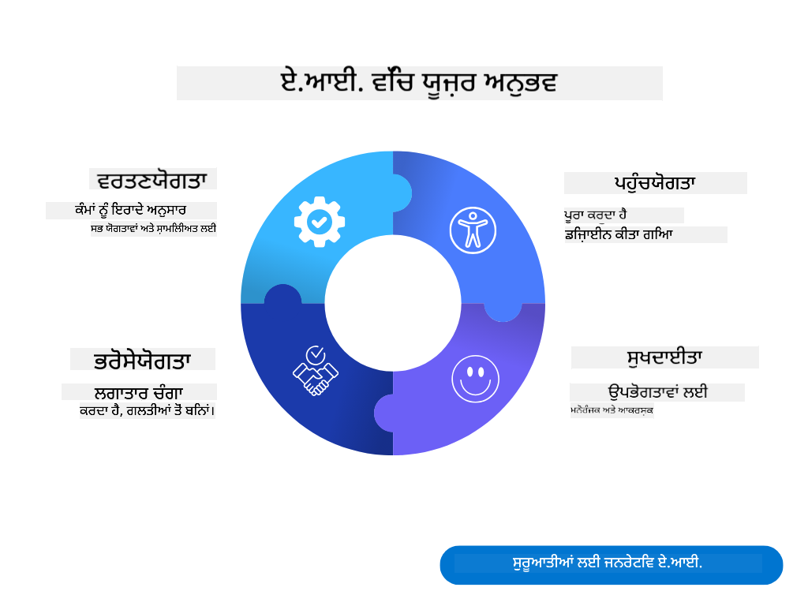
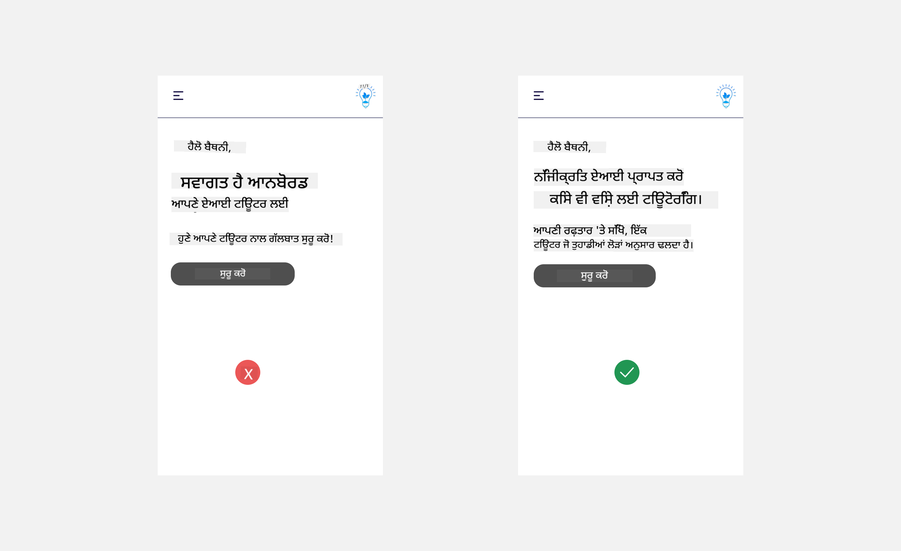

<!--
CO_OP_TRANSLATOR_METADATA:
{
  "original_hash": "78bbeed50fd4dc9fdee931f5daf98cb3",
  "translation_date": "2025-10-17T14:29:19+00:00",
  "source_file": "12-designing-ux-for-ai-applications/README.md",
  "language_code": "pa"
}
-->
# AI ਐਪਲੀਕੇਸ਼ਨ ਲਈ UX ਡਿਜ਼ਾਈਨ ਕਰਨਾ

> _(ਉਪਰ ਦਿੱਤੀ ਤਸਵੀਰ 'ਤੇ ਕਲਿਕ ਕਰਕੇ ਇਸ ਪਾਠ ਦਾ ਵੀਡੀਓ ਵੇਖੋ)_

ਯੂਜ਼ਰ ਅਨੁਭਵ ਐਪ ਬਣਾਉਣ ਦਾ ਇੱਕ ਬਹੁਤ ਮਹੱਤਵਪੂਰਨ ਪੱਖ ਹੈ। ਯੂਜ਼ਰ ਨੂੰ ਤੁਹਾਡੀ ਐਪ ਨੂੰ ਕੁਸ਼ਲਤਾ ਨਾਲ ਵਰਤ ਕੇ ਕੰਮ ਕਰਨ ਦੇ ਯੋਗ ਹੋਣਾ ਚਾਹੀਦਾ ਹੈ। ਕੁਸ਼ਲ ਹੋਣਾ ਇੱਕ ਗੱਲ ਹੈ ਪਰ ਤੁਹਾਨੂੰ ਐਪ ਨੂੰ ਇਸ ਤਰੀਕੇ ਨਾਲ ਡਿਜ਼ਾਈਨ ਕਰਨ ਦੀ ਲੋੜ ਹੈ ਕਿ ਇਹ ਹਰ ਕਿਸੇ ਦੁਆਰਾ ਵਰਤੀ ਜਾ ਸਕੇ, ਇਸਨੂੰ _ਸੁਗਮ_ ਬਣਾਉਣ ਲਈ। ਇਹ ਅਧਿਆਇ ਇਸ ਖੇਤਰ 'ਤੇ ਧਿਆਨ ਦੇਵੇਗਾ ਤਾਂ ਜੋ ਤੁਸੀਂ ਇੱਕ ਐਪ ਡਿਜ਼ਾਈਨ ਕਰ ਸਕੋ ਜੋ ਲੋਕ ਵਰਤਣ ਅਤੇ ਪਸੰਦ ਕਰਨ ਚਾਹੁੰਦੇ ਹਨ।

## ਪਰਿਚਯ

ਯੂਜ਼ਰ ਅਨੁਭਵ ਇਹ ਹੈ ਕਿ ਇੱਕ ਯੂਜ਼ਰ ਕਿਸ ਤਰੀਕੇ ਨਾਲ ਕਿਸੇ ਨਿਰਧਾਰਤ ਉਤਪਾਦ ਜਾਂ ਸੇਵਾ ਨਾਲ ਸੰਚਾਰ ਕਰਦਾ ਹੈ, ਚਾਹੇ ਉਹ ਸਿਸਟਮ, ਟੂਲ ਜਾਂ ਡਿਜ਼ਾਈਨ ਹੋਵੇ। ਜਦੋਂ AI ਐਪਲੀਕੇਸ਼ਨ ਵਿਕਸਿਤ ਕੀਤੀਆਂ ਜਾਂਦੀਆਂ ਹਨ, ਡਿਵੈਲਪਰ ਸਿਰਫ ਯੂਜ਼ਰ ਅਨੁਭਵ ਨੂੰ ਪ੍ਰਭਾਵਸ਼ਾਲੀ ਬਣਾਉਣ 'ਤੇ ਹੀ ਨਹੀਂ ਸਗੋਂ ਨੈਤਿਕ ਬਣਾਉਣ 'ਤੇ ਵੀ ਧਿਆਨ ਦਿੰਦੇ ਹਨ। ਇਸ ਪਾਠ ਵਿੱਚ, ਅਸੀਂ ਇਸ ਗੱਲ 'ਤੇ ਚਰਚਾ ਕਰਾਂਗੇ ਕਿ ਕਿਵੇਂ Artificial Intelligence (AI) ਐਪਲੀਕੇਸ਼ਨ ਬਣਾਈਆਂ ਜਾ ਸਕਦੀਆਂ ਹਨ ਜੋ ਯੂਜ਼ਰ ਦੀਆਂ ਜ਼ਰੂਰਤਾਂ ਨੂੰ ਪੂਰਾ ਕਰਦੀਆਂ ਹਨ।

ਇਸ ਪਾਠ ਵਿੱਚ ਹੇਠਾਂ ਦਿੱਤੇ ਖੇਤਰ ਸ਼ਾਮਲ ਹੋਣਗੇ:

- ਯੂਜ਼ਰ ਅਨੁਭਵ ਦਾ ਪਰਿਚਯ ਅਤੇ ਯੂਜ਼ਰ ਦੀਆਂ ਜ਼ਰੂਰਤਾਂ ਨੂੰ ਸਮਝਣਾ
- ਭਰੋਸੇ ਅਤੇ ਪਾਰਦਰਸ਼ਤਾ ਲਈ AI ਐਪਲੀਕੇਸ਼ਨ ਡਿਜ਼ਾਈਨ ਕਰਨਾ
- ਸਹਿਯੋਗ ਅਤੇ ਫੀਡਬੈਕ ਲਈ AI ਐਪਲੀਕੇਸ਼ਨ ਡਿਜ਼ਾਈਨ ਕਰਨਾ

## ਸਿੱਖਣ ਦੇ ਲਕਸ਼

ਇਹ ਪਾਠ ਪੂਰਾ ਕਰਨ ਤੋਂ ਬਾਅਦ, ਤੁਸੀਂ ਇਹ ਕਰਨ ਦੇ ਯੋਗ ਹੋਵੋਗੇ:

- ਸਮਝਣਾ ਕਿ AI ਐਪਲੀਕੇਸ਼ਨ ਕਿਵੇਂ ਬਣਾਈਆਂ ਜਾ ਸਕਦੀਆਂ ਹਨ ਜੋ ਯੂਜ਼ਰ ਦੀਆਂ ਜ਼ਰੂਰਤਾਂ ਨੂੰ ਪੂਰਾ ਕਰਦੀਆਂ ਹਨ।
- AI ਐਪਲੀਕੇਸ਼ਨ ਡਿਜ਼ਾਈਨ ਕਰਨਾ ਜੋ ਭਰੋਸੇ ਅਤੇ ਸਹਿਯੋਗ ਨੂੰ ਵਧਾਵੇ।

### ਪੂਰਵ ਸ਼ਰਤ

ਕੁਝ ਸਮਾਂ ਲਓ ਅਤੇ [ਯੂਜ਼ਰ ਅਨੁਭਵ ਅਤੇ ਡਿਜ਼ਾਈਨ ਸੋਚ](https://learn.microsoft.com/training/modules/ux-design?WT.mc_id=academic-105485-koreyst) ਬਾਰੇ ਹੋਰ ਪੜ੍ਹੋ।

## ਯੂਜ਼ਰ ਅਨੁਭਵ ਦਾ ਪਰਿਚਯ ਅਤੇ ਯੂਜ਼ਰ ਦੀਆਂ ਜ਼ਰੂਰਤਾਂ ਨੂੰ ਸਮਝਣਾ

ਸਾਡੇ ਕਲਪਨਾਤਮਕ ਸਿੱਖਿਆ ਸਟਾਰਟਅਪ ਵਿੱਚ, ਸਾਡੇ ਕੋਲ ਦੋ ਮੁੱਖ ਯੂਜ਼ਰ ਹਨ, ਅਧਿਆਪਕ ਅਤੇ ਵਿਦਿਆਰਥੀ। ਦੋਵੇਂ ਯੂਜ਼ਰ ਦੀਆਂ ਵਿਲੱਖਣ ਜ਼ਰੂਰਤਾਂ ਹਨ। ਯੂਜ਼ਰ-ਕੇਂਦਰਿਤ ਡਿਜ਼ਾਈਨ ਯੂਜ਼ਰ ਨੂੰ ਤਰਜੀਹ ਦਿੰਦਾ ਹੈ ਇਹ ਯਕੀਨੀ ਬਣਾਉਣ ਲਈ ਕਿ ਉਤਪਾਦ ਉਹਨਾਂ ਲਈ ਸਬੰਧਤ ਅਤੇ ਲਾਭਦਾਇਕ ਹਨ ਜਿਨ੍ਹਾਂ ਲਈ ਇਹ ਬਣਾਇਆ ਗਿਆ ਹੈ।

ਐਪਲੀਕੇਸ਼ਨ **ਲਾਭਦਾਇਕ, ਭਰੋਸੇਯੋਗ, ਸੁਗਮ ਅਤੇ ਸੁਖਦਾਇਕ** ਹੋਣੀ ਚਾਹੀਦੀ ਹੈ ਤਾਂ ਜੋ ਇੱਕ ਚੰਗਾ ਯੂਜ਼ਰ ਅਨੁਭਵ ਪ੍ਰਦਾਨ ਕੀਤਾ ਜਾ ਸਕੇ।

### ਯੂਜ਼ਬਿਲਿਟੀ

ਲਾਭਦਾਇਕ ਹੋਣ ਦਾ ਮਤਲਬ ਹੈ ਕਿ ਐਪਲੀਕੇਸ਼ਨ ਵਿੱਚ ਉਹ ਫੰਕਸ਼ਨਲਿਟੀ ਹੈ ਜੋ ਇਸਦੇ ਨਿਰਧਾਰਤ ਉਦੇਸ਼ ਨਾਲ ਮੇਲ ਖਾਂਦੀ ਹੈ, ਜਿਵੇਂ ਕਿ ਗਰੇਡਿੰਗ ਪ੍ਰਕਿਰਿਆ ਨੂੰ ਆਟੋਮੈਟ ਕਰਨ ਜਾਂ ਰਿਵੀਜ਼ਨ ਲਈ ਫਲੈਸ਼ਕਾਰਡ ਬਣਾਉਣ। ਇੱਕ ਐਪਲੀਕੇਸ਼ਨ ਜੋ ਗਰੇਡਿੰਗ ਪ੍ਰਕਿਰਿਆ ਨੂੰ ਆਟੋਮੈਟ ਕਰਦੀ ਹੈ, ਉਹ ਵਿਦਿਆਰਥੀਆਂ ਦੇ ਕੰਮ ਨੂੰ ਪੂਰਵ-ਨਿਰਧਾਰਿਤ ਮਾਪਦੰਡਾਂ ਦੇ ਅਧਾਰ 'ਤੇ ਸਹੀ ਅਤੇ ਕੁਸ਼ਲਤਾ ਨਾਲ ਅੰਕ ਦੇਣ ਦੇ ਯੋਗ ਹੋਣੀ ਚਾਹੀਦੀ ਹੈ। ਇਸੇ ਤਰ੍ਹਾਂ, ਇੱਕ ਐਪਲੀਕੇਸ਼ਨ ਜੋ ਰਿਵੀਜ਼ਨ ਫਲੈਸ਼ਕਾਰਡ ਬਣਾਉਂਦੀ ਹੈ, ਉਹ ਆਪਣੇ ਡਾਟਾ ਦੇ ਅਧਾਰ 'ਤੇ ਸਬੰਧਤ ਅਤੇ ਵਿਭਿੰਨ ਪ੍ਰਸ਼ਨ ਬਣਾਉਣ ਦੇ ਯੋਗ ਹੋਣੀ ਚਾਹੀਦੀ ਹੈ।

### ਭਰੋਸੇਯੋਗਤਾ

ਭਰੋਸੇਯੋਗ ਹੋਣ ਦਾ ਮਤਲਬ ਹੈ ਕਿ ਐਪਲੀਕੇਸ਼ਨ ਆਪਣਾ ਕੰਮ ਲਗਾਤਾਰ ਅਤੇ ਬਿਨਾਂ ਗਲਤੀਆਂ ਦੇ ਕਰ ਸਕਦੀ ਹੈ। ਹਾਲਾਂਕਿ, AI ਮਨੁੱਖਾਂ ਵਾਂਗ ਪੂਰਨ ਨਹੀਂ ਹੈ ਅਤੇ ਗਲਤੀਆਂ ਕਰਨ ਦੀ ਸੰਭਾਵਨਾ ਹੋ ਸਕਦੀ ਹੈ। ਐਪਲੀਕੇਸ਼ਨ ਗਲਤੀਆਂ ਜਾਂ ਅਣਜਾਣ ਸਥਿਤੀਆਂ ਦਾ ਸਾਹਮਣਾ ਕਰ ਸਕਦੀਆਂ ਹਨ ਜਿਨ੍ਹਾਂ ਨੂੰ ਮਨੁੱਖੀ ਦਖਲ ਜਾਂ ਸੁਧਾਰ ਦੀ ਲੋੜ ਹੋ ਸਕਦੀ ਹੈ। ਤੁਸੀਂ ਗਲਤੀਆਂ ਨੂੰ ਕਿਵੇਂ ਸੰਭਾਲਦੇ ਹੋ? ਇਸ ਪਾਠ ਦੇ ਆਖਰੀ ਭਾਗ ਵਿੱਚ, ਅਸੀਂ ਇਸ ਗੱਲ 'ਤੇ ਚਰਚਾ ਕਰਾਂਗੇ ਕਿ AI ਸਿਸਟਮ ਅਤੇ ਐਪਲੀਕੇਸ਼ਨ ਸਹਿਯੋਗ ਅਤੇ ਫੀਡਬੈਕ ਲਈ ਕਿਵੇਂ ਡਿਜ਼ਾਈਨ ਕੀਤੇ ਜਾਂਦੇ ਹਨ।

### ਸੁਗਮਤਾ

ਸੁਗਮ ਹੋਣ ਦਾ ਮਤਲਬ ਹੈ ਕਿ ਯੂਜ਼ਰ ਅਨੁਭਵ ਨੂੰ ਵੱਖ-ਵੱਖ ਯੋਗਤਾਵਾਂ ਵਾਲੇ ਯੂਜ਼ਰਾਂ, ਜਿਨ੍ਹਾਂ ਵਿੱਚ ਅਪੰਗਤਾ ਵਾਲੇ ਲੋਕ ਵੀ ਸ਼ਾਮਲ ਹਨ, ਤੱਕ ਵਧਾਇਆ ਜਾਵੇ, ਇਹ ਯਕੀਨੀ ਬਣਾਉਣਾ ਕਿ ਕੋਈ ਵੀ ਪਿੱਛੇ ਨਾ ਰਹਿ ਜਾਵੇ। ਸੁਗਮਤਾ ਦੇ ਦਿਸ਼ਾ-ਨਿਰਦੇਸ਼ ਅਤੇ ਸਿਧਾਂਤਾਂ ਦੀ ਪਾਲਣਾ ਕਰਕੇ, AI ਹੱਲ ਹੋਰ ਸਮੇਲਨਯੋਗ, ਵਰਤਣਯੋਗ ਅਤੇ ਸਾਰੇ ਯੂਜ਼ਰਾਂ ਲਈ ਲਾਭਦਾਇਕ ਬਣ ਜਾਂਦੇ ਹਨ।

### ਸੁਖਦਾਇਕ

ਸੁਖਦਾਇਕ ਹੋਣ ਦਾ ਮਤਲਬ ਹੈ ਕਿ ਐਪਲੀਕੇਸ਼ਨ ਵਰਤਣ ਵਿੱਚ ਮਜ਼ੇਦਾਰ ਹੋਵੇ। ਇੱਕ ਆਕਰਸ਼ਕ ਯੂਜ਼ਰ ਅਨੁਭਵ ਯੂਜ਼ਰ 'ਤੇ ਸਕਾਰਾਤਮਕ ਪ੍ਰਭਾਵ ਪਾ ਸਕਦਾ ਹੈ, ਉਹਨਾਂ ਨੂੰ ਐਪਲੀਕੇਸ਼ਨ 'ਤੇ ਵਾਪਸ ਆਉਣ ਲਈ ਪ੍ਰੇਰਿਤ ਕਰਦਾ ਹੈ ਅਤੇ ਕਾਰੋਬਾਰ ਦੀ ਆਮਦਨ ਨੂੰ ਵਧਾਉਂਦਾ ਹੈ।

ਹਰ ਚੁਣੌਤੀ ਨੂੰ AI ਨਾਲ ਹੱਲ ਨਹੀਂ ਕੀਤਾ ਜਾ ਸਕਦਾ। AI ਤੁਹਾਡੇ ਯੂਜ਼ਰ ਅਨੁਭਵ ਨੂੰ ਵਧਾਉਣ ਲਈ ਆਉਂਦਾ ਹੈ, ਚਾਹੇ ਉਹ ਮੈਨੂਅਲ ਕੰਮਾਂ ਨੂੰ ਆਟੋਮੈਟ ਕਰਨਾ ਹੋਵੇ ਜਾਂ ਯੂਜ਼ਰ ਅਨੁਭਵ ਨੂੰ ਨਿੱਜੀ ਬਣਾਉਣਾ ਹੋਵੇ।

## ਭਰੋਸੇ ਅਤੇ ਪਾਰਦਰਸ਼ਤਾ ਲਈ AI ਐਪਲੀਕੇਸ਼ਨ ਡਿਜ਼ਾਈਨ ਕਰਨਾ

ਭਰੋਸਾ ਬਣਾਉਣਾ AI ਐਪਲੀਕੇਸ਼ਨ ਡਿਜ਼ਾਈਨ ਕਰਦੇ ਸਮੇਂ ਬਹੁਤ ਜ਼ਰੂਰੀ ਹੈ। ਭਰੋਸਾ ਇਹ ਯਕੀਨੀ ਬਣਾਉਂਦਾ ਹੈ ਕਿ ਯੂਜ਼ਰ ਨੂੰ ਇਹ ਵਿਸ਼ਵਾਸ ਹੈ ਕਿ ਐਪਲੀਕੇਸ਼ਨ ਕੰਮ ਕਰੇਗੀ, ਲਗਾਤਾਰ ਨਤੀਜੇ ਦੇਵੇਗੀ ਅਤੇ ਨਤੀਜੇ ਉਹ ਹਨ ਜੋ ਯੂਜ਼ਰ ਨੂੰ ਚਾਹੀਦੇ ਹਨ। ਇਸ ਖੇਤਰ ਵਿੱਚ ਇੱਕ ਖਤਰਾ ਹੈ ਅਵਿਸ਼ਵਾਸ ਅਤੇ ਅਤਿ-ਵਿਸ਼ਵਾਸ। ਅਵਿਸ਼ਵਾਸ ਤਦ ਹੁੰਦਾ ਹੈ ਜਦੋਂ ਯੂਜ਼ਰ ਨੂੰ AI ਸਿਸਟਮ 'ਤੇ ਘੱਟ ਜਾਂ ਕੋਈ ਭਰੋਸਾ ਨਹੀਂ ਹੁੰਦਾ, ਇਸ ਨਾਲ ਯੂਜ਼ਰ ਤੁਹਾਡੀ ਐਪਲੀਕੇਸ਼ਨ ਨੂੰ ਰੱਦ ਕਰ ਦਿੰਦਾ ਹੈ। ਅਤਿ-ਵਿਸ਼ਵਾਸ ਤਦ ਹੁੰਦਾ ਹੈ ਜਦੋਂ ਯੂਜ਼ਰ AI ਸਿਸਟਮ ਦੀ ਯੋਗਤਾ ਨੂੰ ਬਹੁਤ ਜ਼ਿਆਦਾ ਅਨੁਮਾਨ ਲਗਾਉਂਦਾ ਹੈ, ਜਿਸ ਨਾਲ ਯੂਜ਼ਰ AI ਸਿਸਟਮ 'ਤੇ ਬਹੁਤ ਜ਼ਿਆਦਾ ਭਰੋਸਾ ਕਰਦੇ ਹਨ। ਉਦਾਹਰਣ ਲਈ, ਗਰੇਡਿੰਗ ਸਿਸਟਮ ਵਿੱਚ ਅਤਿ-ਵਿਸ਼ਵਾਸ ਅਧਿਆਪਕ ਨੂੰ ਕੁਝ ਪੇਪਰਾਂ ਨੂੰ ਸਹੀ ਤਰੀਕੇ ਨਾਲ ਜਾਂਚਣ ਤੋਂ ਰੋਕ ਸਕਦਾ ਹੈ ਤਾਂ ਜੋ ਇਹ ਯਕੀਨੀ ਬਣਾਇਆ ਜਾ ਸਕੇ ਕਿ ਗਰੇਡਿੰਗ ਸਿਸਟਮ ਸਹੀ ਕੰਮ ਕਰ ਰਿਹਾ ਹੈ। ਇਸ ਨਾਲ ਵਿਦਿਆਰਥੀਆਂ ਲਈ ਗਲਤ ਜਾਂ ਅਨੁਚਿਤ ਗਰੇਡ ਹੋ ਸਕਦੇ ਹਨ, ਜਾਂ ਫੀਡਬੈਕ ਅਤੇ ਸੁਧਾਰ ਦੇ ਮੌਕੇ ਗੁਆਚੇ ਜਾ ਸਕਦੇ ਹਨ।

ਭਰੋਸੇ ਨੂੰ ਡਿਜ਼ਾਈਨ ਦੇ ਕੇਂਦਰ ਵਿੱਚ ਰੱਖਣ ਦੇ ਦੋ ਤਰੀਕੇ ਹਨ: ਸਮਝਣਯੋਗਤਾ ਅਤੇ ਨਿਯੰਤਰਣ।

### ਸਮਝਣਯੋਗਤਾ

ਜਦੋਂ AI ਫੈਸਲੇ ਕਰਨ ਵਿੱਚ ਮਦਦ ਕਰਦਾ ਹੈ ਜਿਵੇਂ ਕਿ ਭਵਿੱਖ ਦੀਆਂ ਪੀੜ੍ਹੀਆਂ ਨੂੰ ਗਿਆਨ ਦੇਣਾ, ਇਹ ਬਹੁਤ ਜ਼ਰੂਰੀ ਹੈ ਕਿ ਅਧਿਆਪਕ ਅਤੇ ਮਾਤਾ-ਪਿਤਾ ਸਮਝਣ ਕਿ AI ਫੈਸਲੇ ਕਿਵੇਂ ਕਰਦਾ ਹੈ। ਇਹ ਸਮਝਣਯੋਗਤਾ ਹੈ - ਸਮਝਣਾ ਕਿ AI ਐਪਲੀਕੇਸ਼ਨ ਫੈਸਲੇ ਕਿਵੇਂ ਕਰਦੀਆਂ ਹਨ। ਸਮਝਣਯੋਗਤਾ ਲਈ ਡਿਜ਼ਾਈਨ ਕਰਨ ਵਿੱਚ ਉਹ ਵੇਰਵੇ ਸ਼ਾਮਲ ਹਨ ਜੋ ਦਰਸਾਉਂਦੇ ਹਨ ਕਿ AI ਨੇ ਆਉਟਪੁੱਟ ਤੱਕ ਕਿਵੇਂ ਪਹੁੰਚ ਕੀਤੀ। ਦਰਸ਼ਕ ਨੂੰ ਇਹ ਜਾਣਕਾਰੀ ਹੋਣੀ ਚਾਹੀਦੀ ਹੈ ਕਿ ਆਉਟਪੁੱਟ AI ਦੁਆਰਾ ਜਨਰੇਟ ਕੀਤੀ ਗਈ ਹੈ ਨਾ ਕਿ ਕਿਸੇ ਮਨੁੱਖ ਦੁਆਰਾ। ਉਦਾਹਰਣ ਲਈ, "ਆਪਣੇ ਟਿਊਟਰ ਨਾਲ ਹੁਣ ਗੱਲਬਾਤ ਸ਼ੁਰੂ ਕਰੋ" ਦੇ ਬਦਲੇ "AI ਟਿਊਟਰ ਵਰਤੋ ਜੋ ਤੁਹਾਡੀਆਂ ਜ਼ਰੂਰਤਾਂ ਅਨੁਸਾਰ ਅਨੁਕੂਲ ਹੁੰਦਾ ਹੈ ਅਤੇ ਤੁਹਾਨੂੰ ਤੁਹਾਡੇ ਗਤੀ ਨਾਲ ਸਿੱਖਣ ਵਿੱਚ ਮਦਦ ਕਰਦਾ ਹੈ।"

ਇੱਕ ਹੋਰ ਉਦਾਹਰਣ ਹੈ ਕਿ AI ਯੂਜ਼ਰ ਅਤੇ ਨਿੱਜੀ ਡਾਟਾ ਨੂੰ ਕਿਵੇਂ ਵਰਤਦਾ ਹੈ। ਉਦਾਹਰਣ ਲਈ, ਵਿਦਿਆਰਥੀ ਪਹਿਚਾਣ ਵਾਲੇ ਯੂਜ਼ਰ ਦੇ ਕੁਝ ਸੀਮਾਵਾਂ ਹੋ ਸਕਦੀਆਂ ਹਨ। AI ਸ਼ਾਇਦ ਪ੍ਰਸ਼ਨਾਂ ਦੇ ਜਵਾਬ ਨਹੀਂ ਦੇ ਸਕਦਾ ਪਰ ਯੂਜ਼ਰ ਨੂੰ ਇਹ ਸੋਚਣ ਵਿੱਚ ਮਦਦ ਕਰ ਸਕਦਾ ਹੈ ਕਿ ਉਹ ਕਿਸ ਤਰੀਕੇ ਨਾਲ ਸਮੱਸਿਆ ਦਾ ਹੱਲ ਕਰ ਸਕਦੇ ਹਨ।

ਸਮਝਣਯੋਗਤਾ ਦਾ ਇੱਕ ਆਖਰੀ ਮਹੱਤਵਪੂਰਨ ਹਿੱਸਾ ਹੈ ਵਿਆਖਿਆਵਾਂ ਦੀ ਸਧਾਰਨਤਾ। ਵਿਦਿਆਰਥੀ ਅਤੇ ਅਧਿਆਪਕ ਸ਼ਾਇਦ AI ਵਿਸ਼ੇਸ਼ਗਿਆ ਨਹੀਂ ਹੋ ਸਕਦੇ, ਇਸ ਲਈ ਐਪਲੀਕੇਸ਼ਨ ਕੀ ਕਰ ਸਕਦੀ ਹੈ ਜਾਂ ਨਹੀਂ ਕਰ ਸਕਦੀ, ਇਸ ਦੀ ਵਿਆਖਿਆ ਸਧਾਰਨ ਅਤੇ ਸਮਝਣਯੋਗ ਹੋਣੀ ਚਾਹੀਦੀ ਹੈ।

### ਨਿਯੰਤਰਣ

ਜਨਰੇਟਿਵ AI ਯੂਜ਼ਰ ਅਤੇ AI ਦੇ ਵਿਚਕਾਰ ਸਹਿਯੋਗ ਬਣਾਉਂਦਾ ਹੈ, ਜਿੱਥੇ ਉਦਾਹਰਣ ਲਈ ਇੱਕ ਯੂਜ਼ਰ ਵੱਖ-ਵੱਖ ਨਤੀਜਿਆਂ ਲਈ ਪ੍ਰੋੰਪਟ ਨੂੰ ਸੋਧ ਸਕਦਾ ਹੈ। ਇਸ ਤੋਂ ਇਲਾਵਾ, ਜਦੋਂ ਇੱਕ ਆਉਟਪੁੱਟ ਜਨਰੇਟ ਹੁੰਦੀ ਹੈ, ਯੂਜ਼ਰ ਨੂੰ ਨਤੀਜਿਆਂ ਨੂੰ ਸੋਧਣ ਦੇ ਯੋਗ ਹੋਣਾ ਚਾਹੀਦਾ ਹੈ ਜਿਸ ਨਾਲ ਉਹਨਾਂ ਨੂੰ ਨਿਯੰਤਰਣ ਦਾ ਅਹਿਸਾਸ ਹੁੰਦਾ ਹੈ। ਉਦਾਹਰਣ ਲਈ, Bing ਵਰਤਦੇ ਸਮੇਂ, ਤੁਸੀਂ ਆਪਣੇ ਪ੍ਰੋੰਪਟ ਨੂੰ ਫਾਰਮੈਟ, ਟੋਨ ਅਤੇ ਲੰਬਾਈ ਦੇ ਅਧਾਰ 'ਤੇ ਅਨੁਕੂਲ ਕਰ ਸਕਦੇ ਹੋ। ਇਸ ਤੋਂ ਇਲਾਵਾ, ਤੁਸੀਂ ਆਪਣੇ ਆਉਟਪੁੱਟ ਵਿੱਚ ਬਦਲਾਅ ਕਰ ਸਕਦੇ ਹੋ ਅਤੇ ਨਤੀਜਿਆਂ ਨੂੰ ਸੋਧ ਸਕਦੇ ਹੋ ਜਿਵੇਂ ਹੇਠਾਂ ਦਰਸਾਇਆ ਗਿਆ ਹੈ:

Bing ਵਿੱਚ ਇੱਕ ਹੋਰ ਵਿਸ਼ੇਸ਼ਤਾ ਜੋ ਯੂਜ਼ਰ ਨੂੰ ਐਪਲੀਕੇਸ਼ਨ 'ਤੇ ਨਿਯੰਤਰਣ ਦੇਣ ਦੀ ਆਗਿਆ ਦਿੰਦੀ ਹੈ, ਉਹ ਹੈ ਡਾਟਾ AI ਵਰਤਦਾ ਹੈ ਵਿੱਚ ਸ਼ਾਮਲ ਹੋਣ ਅਤੇ ਬਾਹਰ ਹੋਣ ਦੀ ਯੋਗਤਾ। ਇੱਕ ਸਕੂਲ ਐਪਲੀਕੇਸ਼ਨ ਲਈ, ਇੱਕ ਵਿਦਿਆਰਥੀ ਸ਼ਾਇਦ ਆਪਣੇ ਨੋਟਸ ਅਤੇ ਅਧਿਆਪਕ ਦੇ ਸਰੋਤਾਂ ਨੂੰ ਰਿਵੀਜ਼ਨ ਸਮੱਗਰੀ ਵਜੋਂ ਵਰਤਣਾ ਚਾਹੇਗਾ।

> ਜਦੋਂ AI ਐਪਲੀਕੇਸ਼ਨ ਡਿਜ਼ਾਈਨ ਕੀਤੀਆਂ ਜਾਂਦੀਆਂ ਹਨ, ਯੂਜ਼ਰਾਂ ਨੂੰ ਅਤਿ-ਵਿਸ਼ਵਾਸ ਕਰਨ ਤੋਂ ਰੋਕਣ ਲਈ ਇਰਾਦਾ ਜ਼ਰੂਰੀ ਹੈ। ਇਸ ਦੀ ਇੱਕ ਤਰੀਕਾ ਇਹ ਹੈ ਕਿ ਪ੍ਰੋੰਪਟ ਅਤੇ ਨਤੀਜਿਆਂ ਦੇ ਵਿਚਕਾਰ friction ਬਣਾਉਣਾ। ਯੂਜ਼ਰ ਨੂੰ ਯਾਦ ਦਵਾਉਣਾ ਕਿ ਇਹ AI ਹੈ ਅਤੇ ਕੋਈ ਮਨੁੱਖ ਨਹੀਂ।

## ਸਹਿਯੋਗ ਅਤੇ ਫੀਡਬੈਕ ਲਈ AI ਐਪਲੀਕੇਸ਼ਨ ਡਿਜ਼ਾਈਨ ਕਰਨਾ

ਜਿਵੇਂ ਪਹਿਲਾਂ ਦੱਸਿਆ ਗਿਆ ਹੈ, ਜਨਰੇਟਿਵ AI ਯੂਜ਼ਰ ਅਤੇ AI ਦੇ ਵਿਚਕਾਰ ਸਹਿਯੋਗ ਬਣਾਉਂਦਾ ਹੈ। ਜ਼ਿਆਦਾਤਰ ਸੰਚਾਰ ਇੱਕ ਯੂਜ਼ਰ ਦੇ ਪ੍ਰੋੰਪਟ ਦਾਖਲ ਕਰਨ ਅਤੇ AI ਦੁਆਰਾ ਆਉਟਪੁੱਟ ਜਨਰੇਟ ਕਰਨ ਨਾਲ ਹੁੰਦਾ ਹੈ। ਜੇਕਰ ਆਉਟਪੁੱਟ ਗਲਤ ਹੈ ਤਾਂ ਕੀ ਹੋਵੇਗਾ? ਜੇ ਗਲਤੀਆਂ ਹੁੰਦੀਆਂ ਹਨ ਤਾਂ ਐਪਲੀਕੇਸ਼ਨ ਉਹਨਾਂ ਨੂੰ ਕਿਵੇਂ ਸੰਭਾਲਦੀ ਹੈ? ਕੀ AI ਯੂਜ਼ਰ ਨੂੰ ਦੋਸ਼ ਦਿੰਦਾ ਹੈ ਜਾਂ ਗਲਤੀ ਨੂੰ ਸਮਝਾਉਣ ਲਈ ਸਮਾਂ ਲੈਂਦਾ ਹੈ?

AI ਐਪਲੀਕੇਸ਼ਨ ਨੂੰ ਫੀਡਬੈਕ ਪ੍ਰਾਪਤ ਕਰਨ ਅਤੇ ਦੇਣ ਲਈ ਬਣਾਇਆ ਜਾਣਾ ਚਾਹੀਦਾ ਹੈ। ਇਹ ਸਿਰਫ AI ਸਿਸਟਮ ਨੂੰ ਸੁਧਾਰਨ ਵਿੱਚ ਮਦਦ ਨਹੀਂ ਕਰਦਾ ਸਗੋਂ ਯੂਜ਼ਰਾਂ ਨਾਲ ਭਰੋਸਾ ਵੀ ਬਣਾਉਂਦਾ ਹੈ। ਡਿਜ਼ਾਈਨ ਵਿੱਚ ਇੱਕ ਫੀਡਬੈਕ ਲੂਪ ਸ਼ਾਮਲ ਹੋਣਾ ਚਾਹੀਦਾ ਹੈ, ਇੱਕ ਉਦਾਹਰਣ ਇੱਕ ਸਧਾਰਨ thumbs up ਜਾਂ down ਆਉਟਪੁੱਟ 'ਤੇ ਹੋ ਸਕਦੀ ਹੈ।

ਇਸ ਨੂੰ ਸੰਭਾਲਣ ਦਾ ਇੱਕ ਹੋਰ ਤਰੀਕਾ ਇਹ ਹੈ ਕਿ ਸਿਸਟਮ ਦੀਆਂ ਯੋਗਤਾਵਾਂ ਅਤੇ ਸੀਮਾਵਾਂ ਨੂੰ ਸਪਸ਼ਟ ਤਰੀਕੇ ਨਾਲ ਸੰਚਾਰਿਤ ਕੀਤਾ ਜਾਵੇ। ਜਦੋਂ ਇੱਕ ਯੂਜ਼

---

**ਅਸਵੀਕਰਤੀ**:  
ਇਹ ਦਸਤਾਵੇਜ਼ AI ਅਨੁਵਾਦ ਸੇਵਾ [Co-op Translator](https://github.com/Azure/co-op-translator) ਦੀ ਵਰਤੋਂ ਕਰਕੇ ਅਨੁਵਾਦ ਕੀਤਾ ਗਿਆ ਹੈ। ਜਦੋਂ ਕਿ ਅਸੀਂ ਸਹੀ ਹੋਣ ਦੀ ਕੋਸ਼ਿਸ਼ ਕਰਦੇ ਹਾਂ, ਕਿਰਪਾ ਕਰਕੇ ਧਿਆਨ ਦਿਓ ਕਿ ਸਵੈਚਾਲਿਤ ਅਨੁਵਾਦਾਂ ਵਿੱਚ ਗਲਤੀਆਂ ਜਾਂ ਅਸੁਚੀਤਤਾਵਾਂ ਹੋ ਸਕਦੀਆਂ ਹਨ। ਇਸ ਦੀ ਮੂਲ ਭਾਸ਼ਾ ਵਿੱਚ ਮੂਲ ਦਸਤਾਵੇਜ਼ ਨੂੰ ਅਧਿਕਾਰਤ ਸਰੋਤ ਮੰਨਿਆ ਜਾਣਾ ਚਾਹੀਦਾ ਹੈ। ਮਹੱਤਵਪੂਰਨ ਜਾਣਕਾਰੀ ਲਈ, ਪੇਸ਼ੇਵਰ ਮਨੁੱਖੀ ਅਨੁਵਾਦ ਦੀ ਸਿਫਾਰਸ਼ ਕੀਤੀ ਜਾਂਦੀ ਹੈ। ਅਸੀਂ ਇਸ ਅਨੁਵਾਦ ਦੀ ਵਰਤੋਂ ਤੋਂ ਪੈਦਾ ਹੋਣ ਵਾਲੇ ਕਿਸੇ ਵੀ ਗਲਤ ਫਹਿਮੀ ਜਾਂ ਗਲਤ ਵਿਆਖਿਆ ਲਈ ਜ਼ਿੰਮੇਵਾਰ ਨਹੀਂ ਹਾਂ।