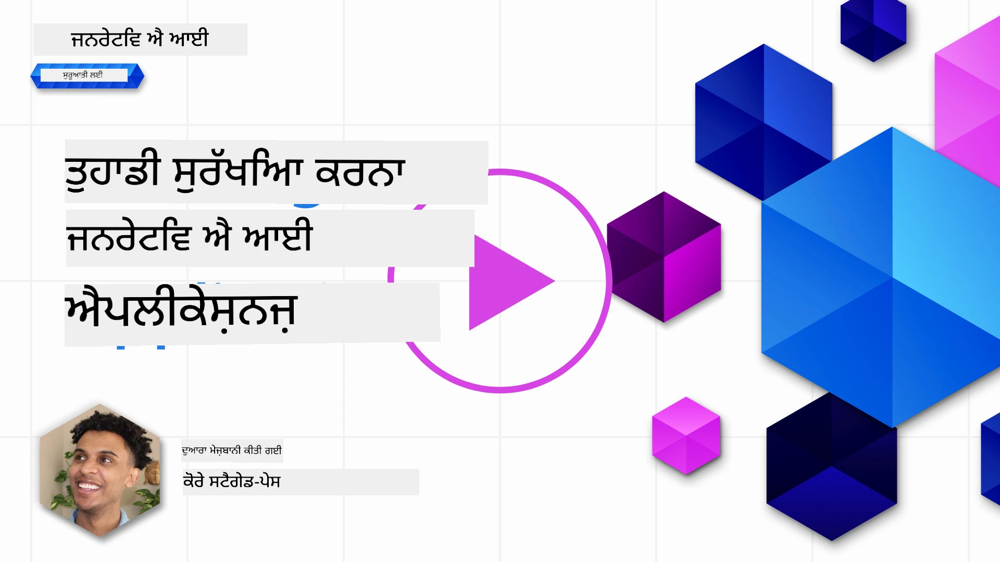
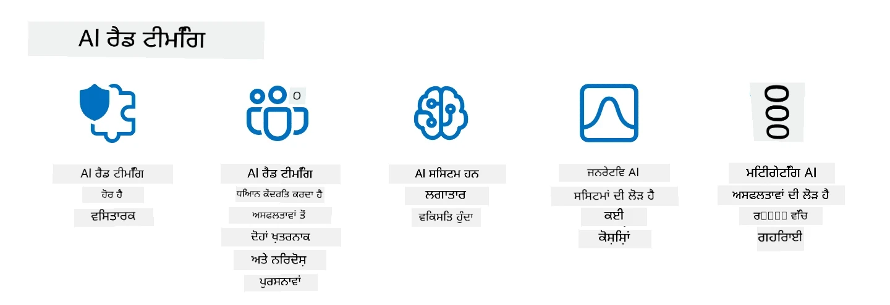

# ਤੁਹਾਡੀਆਂ ਜਨਰੇਟਿਵ AI ਐਪਲੀਕੇਸ਼ਨਾਂ ਦੀ ਸੁਰੱਖਿਆ

## ਪਰਿਚਯ

ਇਸ ਪਾਠ ਵਿਚ ਕਵਰ ਕੀਤਾ ਜਾਵੇਗਾ:

- AI ਸਿਸਟਮਾਂ ਦੇ ਸੰਦਰਭ ਵਿੱਚ ਸੁਰੱਖਿਆ।
- AI ਸਿਸਟਮਾਂ ਲਈ ਆਮ ਖ਼ਤਰੇ ਅਤੇ ਧਮਕੀਆਂ।
- AI ਸਿਸਟਮਾਂ ਨੂੰ ਸੁਰੱਖਿਅਤ ਕਰਨ ਲਈ ਤਰੀਕੇ ਅਤੇ ਵਿਚਾਰ।

## ਸਿੱਖਣ ਦੇ ਲੱਛਣ

ਇਸ ਪਾਠ ਨੂੰ ਪੂਰਾ ਕਰਨ ਤੋਂ ਬਾਦ, ਤੁਸੀਂ ਸਮਝ ਪਾਵੋਗੇ:

- AI ਸਿਸਟਮਾਂ ਲਈ ਖ਼ਤਰੇ ਅਤੇ ਧਮਕੀਆਂ।
- AI ਸਿਸਟਮਾਂ ਨੂੰ ਸੁਰੱਖਿਅਤ ਕਰਨ ਲਈ ਆਮ ਤਰੀਕੇ ਅਤੇ ਅਭਿਆਸ।
- ਕਿਵੇਂ ਸੁਰੱਖਿਆ ਟੈਸਟਿੰਗ ਕਰਵਾਉਣ ਨਾਲ ਅਣਛਾਹੇ ਨਤੀਜੇ ਅਤੇ ਉਪਭੋਗਤਾ ਭਰੋਸੇ ਦੀ ਬਰਬਾਦੀ ਰੋਕੀ ਜਾ ਸਕਦੀ ਹੈ।

## ਜਨਰੇਟਿਵ AI ਦੇ ਸੰਦਰਭ ਵਿੱਚ ਸੁਰੱਖਿਆ ਦਾ ਕੀ ਅਰਥ ਹੈ?

ਜਿਵੇਂ ਕਿ ਕ੍ਰਿਤ੍ਰਿਮ ਬੁੱਧੀ (AI) ਅਤੇ ਮਸ਼ੀਨ ਲਰਨਿੰਗ (ML) ਤਕਨਾਲੋਜੀਆਂ ਸਾਡੇ ਜੀਵਨ ਨੂੰ ਹੋਰ ਵੀ ਪ੍ਰਭਾਵਤ ਕਰ ਰਹੀਆਂ ਹਨ, ਇਹ ਨਾ ਸਿਰਫ਼ ਗਾਹਕ ਦਾ ਡਾਟਾ ਸੁਰੱਖਿਅਤ ਕਰਨਾ ਜਰੂਰੀ ਹੈ, ਸਗੋਂ AI ਸਿਸਟਮਾਂ ਨੂੰ ਵੀ ਸੁਰੱਖਿਅਤ ਕਰਨਾ ਬਹੁਤ ਜ਼ਰੂਰੀ ਹੈ। AI/ML ਨੂੰ ਉਦਯੋਗਾਂ ਵਿੱਚ ਉੱਚ ਮੁੱਲ ਵਾਲੇ ਫੈਸਲੇ ਕਰਨ ਦੇ ਪ੍ਰਕਿਰਿਆਵਾਂ ਲਈ ਵੱਧ ਉਪਯੋਗ ਕੀਤਾ ਜਾ ਰਿਹਾ ਹੈ ਜਿਸ ਵਿੱਚ ਗਲਤ ਫੈਸਲਾ ਗੰਭੀਰ ਨਤੀਜੇ ਲੈ ਕੇ ਆ ਸਕਦਾ ਹੈ।

ਇੱਥੇ ਕੁਝ ਮੁੱਖ ਬਿੰਦੂ ਹਨ ਜਿਨ੍ਹਾਂ ਨੂੰ ਧਿਆਨ ਵਿੱਚ ਰੱਖਣਾ ਚਾਹੀਦਾ ਹੈ:

- **AI/ML ਦਾ ਪ੍ਰਭਾਵ**: AI/ML ਦਾ ਰੋਜ਼ਾਨਾ ਜੀਵਨ 'ਤੇ ਡੂੰਘਾ ਪ੍ਰਭਾਵ ਹੈ ਅਤੇ ਇਸ ਲਈ ਉਨ੍ਹਾਂ ਦੀ ਸੁਰੱਖਿਆ ਅਹੰਕਾਰਪੂਰਣ ਬਣ ਗਈ ਹੈ।
- **ਸੁਰੱਖਿਆ ਚੁਣੌਤੀਆਂ**: AI/ML ਦੇ ਇਸ ਪ੍ਰਭਾਵ ਨੂੰ ਧਿਆਨ ਨਾਲ ਵੇਖਣਾ ਚਾਹੀਦਾ ਹੈ ਤਾਂ ਜੋ ਸੁਰੱਖਿਆ ਉਤਪਾਦਾਂ ਨੂੰ ਸੁਚੱਜੇ ਹਮਲਿਆਂ ਤੋ ਵਚਾਇਆ ਜਾ ਸਕੇ, ਚਾਹੇ ਉਹ ਟ੍ਰੋਲਾਂ ਵੱਲੋਂ ਹੋਣ ਜਾਂ ਸੰਗਠਿਤ ਸਮੂਹਾਂ ਵੱਲੋਂ।
- **रणਨੀਤਕ ਸਮੱਸਿਆਵਾਂ**: ਟੈਕਨਾਲੋਜੀ ਉਦਯੋਗ ਨੇ ਲੰਮੇ ਸਮੇਂ ਲਈ ਗਾਹਕ ਸੁਰੱਖਿਆ ਅਤੇ ਡਾਟਾ ਸੁਰੱਖਿਆ ਯਕੀਨੀ ਬਣਾਉਣ ਲਈ ਪਹਿਲਾਂ ਤੋਂ ਕਾਰਵਾਈ ਕਰਨ ਦੀ ਲੋੜ ਹੈ।

ਇਸ ਦੇ ਨਾਲ-ਨਾਲ, ਮਸ਼ੀਨ ਲਰਨਿੰਗ ਮਾਡਲ ਬਦਇੱਛਾ ਇਨਪੁਟ ਅਤੇ ਸਧਾਰਣ ਵਿਸ਼ਮ ਡਾਟਾ ਵਿਚਕਾਰ ਅੰਤਰ ਜਾਣਨ ਵਿੱਚ ਅਸਮਰਥ ਹੁੰਦੇ ਹਨ। ਪ੍ਰਸ਼िक्षਣ ਡਾਟਾ ਦਾ ਇੱਕ ਵੱਡਾ ਹਿੱਸਾ ਅਨਕਿਊਰੇਟ, ਅਨਮੋਡਰੇਟਿਡ, ਜਨਤਕ ਡਾਟਾਸੈੱਟ ਤੋਂ ਆਉਂਦਾ ਹੈ ਜੋ ਟੀਸਰੇ ਪੱਖ ਵੱਲੋਂ ਯੋਗਦਾਨ ਯੋਗ ਬਣਿਆ ਹੋਇਆ ਹੁੰਦਾ ਹੈ। ਹਮਲਾਵਰਾਂ ਨੂੰ ਡਾਟਾਸੈੱਟ ਨੂੰ ਖ਼ਰਾਬ ਕਰਨ ਦੀ ਲੋੜ ਨਹੀਂ ਹੁੰਦੀ ਜਦੋਂ ਉਹ ਉਹਨਾਂ ਨੂੰ ਯੋਗਦਾਨ ਦੇ ਸਕਦੇ ਹਨ। ਸਮੇਂ ਨਾਲ, ਘੱਟ ਭਰੋਸੇਯੋਗ ਬਦਇੱਛਾ ਡਾਟਾ ਉੱਚ ਭਰੋਸੇਯੋਗ ਡਾਟਾ ਬਣ ਜਾਂਦਾ ਹੈ ਜੇ ਡਾਟਾ ਦੀ ਸਰਚਨਾ/ਫਾਰਮੈਟ ਸਹੀ ਰਹੇ।

ਇਸ ਲਈ, ਇਹ ਬਹੁਤ ਜਰੂਰੀ ਹੈ ਕਿ ਤੁਸੀਂ ਆਪਣੇ ਮਾਡਲ ਜਿਹੜੇ ਡਾਟਾ ਸંગ્રਹ ਨੂੰ ਫੈਸਲੇ ਲਈ ਵਰਤਦੇ ਹਨ, ਉਹਨਾਂ ਦੀ ਅਖੰਡਤਾ ਅਤੇ ਸੁਰੱਖਿਆ ਯਕੀਨੀ ਬਣਾਓ।

## AI ਦੇ ਖਤਰਨਾਂ ਅਤੇ ਧਮਕੀਆਂ ਨੂੰ ਸਮਝਣਾ

AI ਅਤੇ ਸਮਬੰਧਤ ਸਿਸਟਮਾਂ ਦੇ ਸੰਦਰਭ ਵਿੱਚ, ਡਾਟਾ ਪਾਇਜ਼ਨਿੰਗ ਅੱਜ ਦਾ ਸਭ ਤੋਂ ਮਹੱਤਵਪੂਰਨ ਸੁਰੱਖਿਆ ਖਤਰਾ ਹੈ। ਡਾਟਾ ਪਾਇਜ਼ਨਿੰਗ ਉਸ ਵੇਲੇ ਹੁੰਦੀ ਹੈ ਜਦੋਂ ਕੋਈ ਵਿਅਕਤੀ ਜਿ਼ਉਂਦ ಮಾರਗ ਵਿੱਚ ਤੇ ਮਨਭਾੜ ਕੇ ਆਈ ਦਾ ਸਿੱਖਣ ਵਾਲੇ ਡਾਟਾ ਨੂੰ ਬਦਲ ਦਿੰਦਾ ਹੈ, ਜਿਸ ਨਾਲ ਮਾਡਲ ਗਲਤੀਆਂ ਕਰਦਾ ਹੈ। ਇਹ ਆਮ ਤੌਰ ਤੇ ਮਿਯਾਰ ਬਣਾਉਣ ਅਤੇ ਰੋਕਣ ਦੇ ਤਰੀਕਿਆਂ ਦੀ ਘਾਟ ਅਤੇ ਅਣ ਪ੍ਰਮਾਣਿਕ ਜਾਂ ਅਨਮੋਡਰੇਟਿਡ ਜਨਤਕ ਡਾਟਾਸੈੱਟ ਕਾਰਨ ਹੁੰਦਾ ਹੈ। ਡਾਟਾ ਦੀ ਅਖੰਡਤਾ ਬਰਕਰਾਰ ਰੱਖਣ ਅਤੇ ਗਲਤ ਸਿੱਖਣ ਪ੍ਰਕਿਰਿਆ ਨੂੰ ਰੋਕਣ ਲਈ, ਇਹ ਜ਼ਰੂਰੀ ਹੈ ਕਿ ਤੁਸੀਂ ਆਪਣੇ ਡਾਟਾ ਦੀ ਮੂਲ ਅਤੇ ਲੀਨਿਅਜ ਨੂੰ ਟਰੈਕ ਕਰੋ। ਨਹੀਂ ਤਾਂ ਬੁਰੇ ਨਤੀਜੇ ਹੁੰਦੇ ਹਨ, ਜਿਸ ਨਾਲ ਮਾਡਲ ਦੇ ਫਲਾਂ ਤੇ ਖਰਾਬ ਪ੍ਰਭਾਵ ਪੈਂਦਾ ਹੈ।

ਇੱਥੇ ਕੁਝ ਉਦਾਹਰਣ ਹਨ ਕਿ ਕਿਵੇਂ ਡਾਟਾ ਪਾਇਜ਼ਨਿੰਗ ਤੁਹਾਡੇ ਮਾਡਲਾਂ ਨੂੰ ਪ੍ਰਭਾਵਿਤ ਕਰ ਸਕਦੀ ਹੈ:

1. **ਲੇਬਲ ਫਲਿਪਿੰਗ**: ਇਕ ਦੁਇਵਾਂਗੀ ਵਰਗੀਕਰਨ ਕੰਮ ਵਿੱਚ, ਵਿਰੋਧੀ ਥੋੜ੍ਹੇ ਪ੍ਰਸ਼િક્ષਣ ਡਾਟਾ ਦੇ ਲੇਬਲ ਬਦਲਦਾ ਹੈ। ਉਦਾਹਰਣ ਵਜੋਂ, ਸਾਫ਼-ਸੁਥਰੇ ਨਮੂਨੇ ਨੂੰ ਖ਼ਰਾਬ ਲੇਬਲ ਦਿੱਤਾ ਜਾਂਦਾ ਹੈ, ਜਿਸ ਨਾਲ ਮਾਡਲ ਗਲਤ ਸਿੱਖਣ ਕਰਦਾ ਹੈ।\
   **ਉਦਾਹਰਣ**: ਇੱਕ ਸਪੈਮ ਫਿਲਟਰ ਅਸਲ ਈਮੇਲਾਂ ਨੂੰ ਸਪੈਮ ਵਜੋਂ ਗਲਤ ਤਰੀਕੇ ਨਾਲ ਵර්ਗੀਕ੍ਰਿਤ ਕਰਦਾ ਹੈ।  
2. **ਫੀਚਰ ਪਾਇਜ਼ਨਿੰਗ**: ਹਮਲਾਵਰ ਪ੍ਰਸ਼િક્ષਣ ਡਾਟਾ ਵਿੱਚ ਸੁਚੱਜੇ ਤਰੀਕੇ ਨਾਲ ਫੀਚਰਾਂ ਨੂੰ ਬਦਲਦਾ ਹੈ ਤਾਂ ਜੋ ਮਾਡਲ ਨੂੰ ਪ੍ਰਵ੍ਰਿੱਤ ਕਰਨ ਜਾਂ ਗਲਤ ਦਿਸ਼ਾ ਵਿੱਚ ਲੈ ਜਾਏ।\
   **ਉਦਾਹਰਣ**: ਪ੍ਰੋਡਕਟ ਵੇਰਵੇ ਵਿੱਚ ਅਣਜਾਣਾਂ ਕੀਵਰਡ ਸ਼ਾਮਲ ਕਰਕੇ ਸਿਫਾਰਸ਼ੀ ਪ੍ਰਣਾਲੀਆਂ ਨੂੰ ਪ੍ਰਭਾਵਿਤ ਕਰਨਾ।  
3. **ਡਾਟਾ ਇੰਜੈਕਸ਼ਨ**: ਪ੍ਰਸ਼િક્ષਣ ਸੈੱਟ ਵਿੱਚ ਬਦਇੱਛਾ ਡਾਟਾ ਪਾਈਦਾ ਕਰਕੇ ਮਾਡਲ ਦੇ ਵਿਹਾਰ 'ਤੇ ਪ੍ਰਭਾਵ ਪਾਉਣਾ।\
   **ਉਦਾਹਰਣ**: ਜਾਲੀ ਯੂਜ਼ਰ ਸਮੀਖਿਆਵਾਂ ਸ਼ਾਮਲ ਕਰਕੇ ਭਾਵਨਾ ਵਿਸ਼ਲੇਸ਼ਣ ਦੇ ਨਤੀਜੇ ਮੋੜਣਾ।  
4. **ਬੈਕਡੋਰ ਹਮਲੇ**: ਵਿਰੋਧੀ ਇੱਕ ਛੁਪਿਆ ਪੈਟਰਨ (ਬੈਕਡੋਰ) ਪ੍ਰਸ਼િક્ષਣ ਡਾਟਾ ਵਿੱਚ ਸ਼ਾਮਲ ਕਰਦਾ ਹੈ। ਮਾਡਲ ਇਸ ਪੈਟਰਨ ਨੂੰ ਪਹਿਚਾਨਦਾ ਹੈ ਅਤੇ ਇਸਦੇ ਚਲਣ ‘ਤੇ ਬਦਾਇਕ ਵਰਤਾਵ ਕਰਦਾ ਹੈ।\
   **ਉਦਾਹਰਣ**: ਇੱਕ ਚਿਹਰਾ ਪਹਿਚਾਣ ਸਿਸਟਮ, ਜੋ ਬੈਕਡੋਰ ਕੀਤੀਆਂ ਤਸਵੀਰਾਂ ਨਾਲ ਸਿੱਖਿਆ ਗਿਆ ਹੋਵੇ, ਇੱਕ ਖ਼ਾਸ ਵਿਅਕਤੀ ਨੂੰ ਗਲਤ ਜਾਣਦਾ ਹੈ।  

MITRE ਕੋਰਪੋਰੇਸ਼ਨ ਨੇ [ATLAS (Adversarial Threat Landscape for Artificial-Intelligence Systems)](https://atlas.mitre.org/?WT.mc_id=academic-105485-koreyst) ਤਿਆਰ ਕੀਤਾ ਹੈ, ਜੋ AI ਸਿਸਟਮਾਂ ਉੱਤੇ ਵਾਸਤਵਿਕ ਹਮਲਿਆਂ ਵਿੱਚ ਵਿਰੋਧੀਆਂ ਵੱਲੋਂ ਵਰਤੇ ਜਾਂਦੇ ਤੱਤਾਂ ਅਤੇ ਤਕਨੀਕਾਂ ਦੀ ਜਾਣਕਾਰੀ ਦਾ ਸਰੋਤ ਹੈ।

> AI ਸੰਬੰਧਤ ਸਿਸਟਮਾਂ ਵਿੱਚ ਖ਼ਮੀਅਾਂ ਵਿੱਚ ਵਾਧਾ ਹੋ ਰਿਹਾ ਹੈ, ਕਿਉਂਕਿ AI ਸ਼ਾਮਿਲ ਕਰਨ ਨਾਲ ਮੌਜੂਦਾ ਪ੍ਰਣਾਲੀਆਂ ਦਾ ਹਮਲਾ ਸਤਹ ਬਹੁਤ ਵੱਧ ਜਾਂਦਾ ਹੈ ਦੁਆਰਾ ਪ੍ਰਚਲਿਤ ਸਾਇਬਰ ਹਮਲਿਆਂ ਨਾਲੋਂ। ਅਸੀਂ ATLAS ਤਿਆਰ ਕੀਤਾ ਤਾਂ ਜੋ ਇਹ ਨਵੀਆਂ ਅਤੇ ਤਬਦੀਲ ਹੁੰਦੀਆਂ ਖਾਮੀਆਂ ਬਾਰੇ ਹੌਂਸਲਾ ਵਧਾਇਆ ਜਾ ਸਕੇ, ਕਿਉਂਕਿ ਸੰਸਾਰ ਭਰ ਦੇ ਸਮੂਹ ਵੱਖ-ਵੱਖ ਪ੍ਰਣਾਲੀਆਂ ਵਿੱਚ ਵਧਦਾ ਹੈ। ATLAS ਨੂੰ MITRE ATT&CK® ਫਰੇਮਵਰਕ ਦੇ ਮਾਡਲ ਅਨੁਸਾਰ ਤਿਆਰ ਕੀਤਾ ਗਿਆ ਹੈ ਅਤੇ ਇਸ ਦੀਆਂ ਤੁਰਕੀਬਾਂ, ਤਕਨੀਕਾਂ ਅਤੇ ਪ੍ਰਕਿਰਿਆਵਾਂ ATT&CK ਨਾਲ ਮਿਲਦੀਆਂ ਹਨ।

MITRE ATT&CK® ਫਰੇਮਵਰਕ ਵਾਂਗ, ਜੋ ਕਈ ਸਾਲਾਂ ਤੋਂ ਪ੍ਰਚਲਿਤ ਸਾਇਬਰ ਸੁਰੱਖਿਆ ਵਿੱਚ ਬਹੁਤ ਵਰਤੀ ਜਾਂਦੀ ਹੈ ਉੱਨਤ ਖ਼ਤਰਾ ਨਕਲ ਸਕੀਮਾਂ ਦੀ ਯੋਜਨਾ ਬਣਾਉਣ ਲਈ, ATLAS ਵੀ ਸੌਖਾ ਤਰੀਕਾ ਹੈ ਜੋ ਨਵੀਆਂ ਹਮਲਿਆਂ ਤੋਂ ਬਚਾਅ ਲਈ ਹੁਨਰ ਬੱਝਣ ਅਤੇ ਤਿਆਰੀ ਵਿੱਚ ਸਹਾਇਤਾ ਕਰਦਾ ਹੈ।

ਇਸਦੇ ਨਾਲ-ਨਾਲ, Open Web Application Security Project (OWASP) ਨੇ LLMs ਦੀ ਵਰਤੋਂ ਕਰਨ ਵਾਲੀਆਂ ਐਪਲੀਕੇਸ਼ਨਾਂ ਵਿੱਚ ਮਿਲੀ ਸਭ ਤੋਂ ਜ਼ਰੂਰੀ ਖ਼ਤਰਿਆਂ ਦੀ "[Top 10 list](https://llmtop10.com/?WT.mc_id=academic-105485-koreyst)" ਤਿਆਰ ਕੀਤੀ ਹੈ। ਇਸ ਸੂਚੀ ਵਿੱਚ ਖ਼ਤਰੇ ਜਿਵੇਂ ਕਿ ਡਾਟਾ ਪਾਇਜ਼ਨਿੰਗ ਸਮੇਤ ਹੋਰ ਵੀ ਖ਼ਤਰੇ ਹਨ:

- **ਪ੍ਰਾਂਪਟ ਇੰਜੈਕਸ਼ਨ**: ਇਕ ਤਕਨੀਕ ਜਿਸ ਵਿੱਚ ਹਮਲਾਵਰ ਵੱਡੇ ਭਾਸ਼ਾਈ ਮਾਡਲ (LLM) ਨੂੰ ਧਿਆਨ ਨਾਲ ਬਣਾਈ ਗਈਆਂ ਇਨਪੁਟਾਂ ਰਾਹੀਂ ਗਲਤ ਪਾਸੇ ਕੌੜਾੜਾ ਜਾਂਦਾ ਹੈ।
- **ਸਪਲਾਈ ਚੇਨ ਖ਼ਤਰੇ**: LLM ਦੇ ਲਈ ਵਰਤੀ ਜਾਂਦੀ ਐਪਲੀਕੇਸ਼ਨਾਂ ਦੇ ਹਿੱਸੇ ਜਿਵੇਂ ਕਿ Python ਮੋਡੀਯੂਲ ਜਾਂ ਬਾਹਰੀ ਡਾਟਾਸੈੱਟ ਖ਼ੁਦ ਵੀ ਖ਼ਤਰੇ ਵਿੱਚ ਹੋ ਸਕਦੇ ਹਨ ਜੋ ਮਨਚਾਹੇ ਨਤੀਜੇ, ਪੱਖਪਾਤ ਅਤੇ ਢਾਂਚਾਗਤ ਖ਼ਤਰਿਆਂ ਨੂੰ ਜਨਮ ਦੇ ਸਕਦੇ ਹਨ।
- **ਜ਼ਿਆਦਾ ਭਰੋਸਾ ਕਰਨ ਦਾ ਖ਼ਤਰਾ**: LLM ਅਕਸਰ ਗਲਤੀਆਂ ਕਰਦੇ ਹਨ ਅਤੇ ਹੱਲੂਸੀਨੇਸ਼ਨ (ਬਿਨਾ ਵਾਜਬ ਨਤੀਜੇ) ਦਿੰਦੇ ਹਨ। ਕਈ ਵੇਰੀਅਤਾਂ ਵਿੱਚ ਲੋਕ ਨਤੀਜਿਆਂ ਨੂੰ ਸਿੱਧਾ ਸਹੀ ਸਮਝ ਕੇ ਅਣਚਾਹੇ ਨਤੀਜੇ ਸਾਹਮਣੇ ਆਏ ਹਨ।

Microsoft Cloud Advocate ਰਾਡ ਟਰੇਂਟ ਨੇ ਇੱਕ ਮੁਫ਼ਤ ਈ-ਬੁੱਕ [Must Learn AI Security](https://github.com/rod-trent/OpenAISecurity/tree/main/Must_Learn/Book_Version?WT.mc_id=academic-105485-koreyst) ਲਿਖੀ ਹੈ ਜੋ ਇਨ੍ਹਾਂ ਅਤੇ ਹੋਰ ਨਵੇਂ AI ਖ਼ਤਰਿਆਂ 'ਤੇ ਡੂੰਘਾਈ ਨਾਲ ਚਰਚਾ ਕਰਦੀ ਹੈ ਅਤੇ ਬਿਹਤਰ ਤਰੀਕਿਆਂ ਦੀ ਸਲਾਹ ਦਿੰਦੀ ਹੈ।

## AI ਸਿਸਟਮਾਂ ਅਤੇ LLM ਲਈ ਸੁਰੱਖਿਆ ਟੈਸਟਿੰਗ

ਕ੍ਰਿਤ੍ਰਿਮ ਬੁੱਧੀ (AI) ਵੱਖ-ਵੱਖ ਖੇਤਰਾਂ ਅਤੇ ਉਦਯੋਗਾਂ ਨੂੰ ਬਦਲ ਰਹੀ ਹੈ, ਸਮਾਜ ਲਈ ਨਵੀਂ ਸੰਭਾਵਨਾਵਾਂ ਅਤੇ ਲਾਭ ਮੁਹੱਈਆ ਕਰਵਾਉਂਦੀ ਹੈ। ਪਰ AI ਨਾਲ ਸੁਰੱਖਿਆ ਸੰਬੰਧਤ ਚੁਣੌਤੀਆਂ ਅਤੇ ਖ਼ਤਰੇ ਵੀ ਹਨ, ਜਿਵੇਂ ਕਿ ਡਾਟਾ ਗੋਪਨੀਯਤਾ, ਪੱਖਪਾਤ, ਸਮਝ ਨਾ ਆਉਣਾ, ਅਤੇ ਗਲਤ ਇਸਤੇਮਾਲ। ਇਸ ਲਈ, ਇਹ ਜ਼ਰੂਰੀ ਹੈ ਕਿ AI ਸਿਸਟਮ ਸੁਰੱਖਿਅਤ ਅਤੇ ਜ਼ਿੰਮੇਵਾਰ ਹੋਣ, ਮਤਲਬ ਇਥਿਕਲ ਅਤੇ ਕਾਨੂੰਨੀ ਮਿਆਰਾਂ ਦਾ ਪਾਲਣ ਕਰਨ ਅਤੇ ਉਪਭੋਗਤਾਵਾਂ ਅਤੇ ਹਿੱਸੇਦਾਰਾਂ ਵੱਲੋਂ ਭਰੋਸਾ ਯੋਗ ਹੋਣ।

ਸੁਰੱਖਿਆ ਟੈਸਟਿੰਗ ਇੱਕ ਪ੍ਰਕਿਰਿਆ ਹੈ ਜਿਸ ਵਿੱਚ AI ਸਿਸਟਮ ਜਾਂ LLM ਦੀ ਸੁਰੱਖਿਆ ਦਾ ਮੁਲਾਂਕਣ ਕੀਤਾ ਜਾਂਦਾ ਹੈ, ਉਨ੍ਹਾਂ ਦੀਆਂ ਕਮਜ਼ੋਰੀਆਂ ਦੀ ਪਹਿਚਾਣ ਅਤੇ ਵਰਤੋਂ ਕਰਦੇ ਹੋਏ। ਇਹ ਟੈਸਟਿੰਗ ਵਿਕਾਸਕਰਤਾ, ਉਪਭੋਗਤਾ ਜਾਂ ਤੀਜੀ ਪੱਖ ਅਡਿਟਰ ਵੱਲੋਂ ਕੀਤੀ ਜਾ ਸਕਦੀ ਹੈ, ਟੈਸਟਿੰਗ ਦੇ ਉਦੇਸ਼ ਅਤੇ ਦਾਇਰੇ ਦੇ ਅਨੁਸਾਰ। AI ਸਿਸਟਮਾਂ ਅਤੇ LLM ਲਈ ਕਈ ਆਮ ਸੁਰੱਖਿਆ ਟੈਸਟਿੰਗ ਤਰੀਕੇ ਹਨ:

- **ਡਾਟਾ ਸਫਾਈ**: ਇਹ ਪ੍ਰਕਿਰਿਆ ਹੈ ਜਿੱਥੇ ਸਿਖਲਾਈ ਡਾਟਾ ਜਾਂ AI ਸਿਸਟਮ ਜਾਂ LLM ਦੇ ਇਨਪੁਟ ਵਿੱਚੋਂ ਸੰਵੇਦਨਸ਼ੀਲ ਜਾਂ ਨਿੱਜੀ ਜਾਣਕਾਰੀ ਨੂੰ ਹਟਾਇਆ ਜਾਂ ਅਣਜਾਣਕਾਰੀ ਕੀਤਾ ਜਾਂਦਾ ਹੈ। ਡਾਟਾ ਸਫਾਈ ਸਹਾਇਤਾ ਕਰਦੀ ਹੈ ਡਾਟਾ ਲੀਕ ਅਤੇ ਬਦਇਛਾ ਤਬਦੀਲੀ ਨੂੰ ਰੋਕਣ ਵਿੱਚ ਕਿਉਂਕਿ ਗੁਪਤ ਜਾਂ ਨਿੱਜੀ ਡਾਟਾ ਦੀ ਐਕਸਪੋਜ਼ਰ ਘਟ ਜਾਂਦੀ ਹੈ।
- **ਵਿਰੋਧੀ ਟੈਸਟਿੰਗ**: ਇਹ ਪ੍ਰਕਿਰਿਆ ਹੈ ਜਿਸ ਵਿੱਚ AI ਸਿਸਟਮ ਜਾਂ LLM ਦੇ ਇਨਪੁਟ ਜਾਂ ਆਇਟਪੁਟ ਨੂੰ ਵਿਰੋਧੀ ਉਦਾਹਰਣ ਦਿਤੀਆਂ ਜਾਂਦੀਆਂ ਹਨ ਤਾਂ ਜੋ ਇਹ ਮੁੱਲਿਆੰਕਣ ਕੀਤਾ ਜਾ ਸਕੇ ਕਿ ਉਹ ਕਿੰਨੀ ਮਜ਼ਬੂਤ ਅਤੇ ਹਮਲਿਆਂ ਵਿਰੁੱਧ ਲਚਕੀਲੇ ਹਨ। ਵਿਰੋਧੀ ਟੈਸਟਿੰਗ ਨਾਲ AI ਸਿਸਟਮ ਜਾਂ LLM ਦੀਆਂ ਕਮਜ਼ੋਰੀਆਂ ਅਤੇ ਖਾਮੀਆਂ ਪਤਾ ਲੱਗਦੀਆਂ ਹਨ ਜੋ ਹਮਲਾਵਰ ਵਰਤ ਸਕਦੇ ਹਨ।
- **ਮਾਡਲ ਪੜਤਾਲ**: ਇਹ ਪ੍ਰਕਿਰਿਆ ਹੈ ਜਿਸ ਵਿੱਚ AI ਸਿਸਟਮ ਜਾਂ LLM ਦੇ ਮਾਡਲ ਪੈਰਾਮੀਟਰ ਜਾਂ ਆਰਕੀਟੈਕਚਰ ਦੀ ਸਹੀਤਾ ਅਤੇ ਪੂਰਨਤਾ ਦੀ ਜਾਂਚ ਕੀਤੀ ਜਾਂਦੀ ਹੈ। ਮਾਡਲ ਪੜਤਾਲ ਮਾਡਲ ਚੋਰੀ ਰੋਕਣ ਵਿੱਚ ਸਹਾਇਤਾ ਕਰਦੀ ਹੈ ਇਸ ਗੱਲ ਦੀ ਯਕੀਨੀ ਬਣਾਈਂ ਕਰ ਕੇ ਕਿ ਮਾਡਲ ਸੁਰੱਖਿਅਤ ਅਤੇ ਪ੍ਰਮਾਣਿਤ ਹੈ।
- **ਆਉਟਪੁੱਟ ਵੈਰੀਫਿਕੇਸ਼ਨ**: ਇਹ ਪ੍ਰਕਿਰਿਆ ਹੈ ਜਿਸ ਵਿੱਚ AI ਸਿਸਟਮ ਜਾਂ LLM ਦੇ ਨਤੀਜੇ ਦੀ ਗੁਣਵੱਤਾ ਅਤੇ ਭਰੋਸੇਯੋਗਤਾ ਦੀ ਜਾਂਚ ਕੀਤੀ ਜਾਂਦੀ ਹੈ। ਇਸ ਨਾਲ ਬਦਇਛਾ ਤਬਦੀਲੀ ਪਤਾ ਲੱਗਦੀ ਹੈ ਅਤੇ ਠੀਕ ਕੀਤੀ ਜਾਂਦੀ ਹੈ ਕਿ ਨਤੀਜੇ ਲੜੀਦਾਰ ਅਤੇ ਸਹੀ ਹਨ।

OpenAI, ਜੋ AI ਸਿਸਟਮਾਂ ਵਿੱਚ ਅੱਗੇ ਹੈ, ਨੇ ਆਪਣੀ ਰੈੱਡ ਟੀਮਿੰਗ ਨੈੱਟਵਰਕ ਪਹਲ ਦਾ ਹਿੱਸਾ ਵਜੋਂ ਕਈ _ਸੁਰੱਖਿਆ ਮੁੱਲਿਆੰਕਣ_ ਤਿਆਰ ਕੀਤੇ ਹਨ, ਜੋ AI ਸਿਸਟਮਾਂ ਦੇ ਨਤੀਜਿਆਂ ਦੀ ਜਾਂਚ ਕਰਨ ਦੇ ਉਦੇਸ਼ ਨਾਲ ਹਨ ਤਾਂ ਜੋ AI ਸੁਰੱਖਿਆ ਵਿੱਚ ਯੋਗਦਾਨ ਪਾਇਆ ਜਾ ਸਕੇ।

> ਮੁੱਲਿਆੰਕਣ ਸਧਾਰਣ Q&A ਟੈਸਟ ਤੋਂ ਲੈ ਕੇ ਹੋਰ-ਜਟਿਲ ਨਕਲੀ ਸ਼ੁਰੂਆਤਾਂ ਤੱਕ ਹੋ ਸਕਦੇ ਹਨ। ਖਾਸ ਤੌਰ 'ਤੇ, ਇੱਥੇ OpenAI ਵੱਲੋਂ ਤਿਆਰ ਕੀਤੀਆਂ ਕੁਝ ਨਮੂਨਾ ਮੁੱਲਿਆੰਕਣ ਹਨ ਜੋ ਵੱਖ-ਵੱਖ ਕੋਣਾਂ ਤੋਂ AI ਦੇ ਵਰਤਾਵ ਦਾ ਮੁੱਲਿਆੰਕਣ ਕਰਦੇ ਹਨ:

#### ਮਨਾਇਆ ਜਾਣਾ

- [MakeMeSay](https://github.com/openai/evals/tree/main/evals/elsuite/make_me_say/readme.md?WT.mc_id=academic-105485-koreyst): ਇੱਕ AI ਸਿਸਟਮ ਦੂਜੇ AI ਸਿਸਟਮ ਨੂੰ ਇੱਕ ਗੁਪਤ ਸ਼ਬਦ ਬੋਲਣ ਲਈ ਕਿੰਨਾ ਚੰਗਾ ਮਾਣਇਆ ਜਾ ਸਕਦਾ ਹੈ?
- [MakeMePay](https://github.com/openai/evals/tree/main/evals/elsuite/make_me_pay/readme.md?WT.mc_id=academic-105485-koreyst): ਇੱਕ AI ਸਿਸਟਮ ਦੂਜੇ AI ਸਿਸਟਮ ਨੂੰ ਪੈਸਾ ਦਾਨ ਕਰਨ ਲਈ ਕਿੰਨਾ ਪੱਕਾ ਕਰ ਸਕਦਾ ਹੈ?
- [Ballot Proposal](https://github.com/openai/evals/tree/main/evals/elsuite/ballots/readme.md?WT.mc_id=academic-105485-koreyst): ਇੱਕ AI ਸਿਸਟਮ ਦੂਜੇ AI ਸਿਸਟਮ ਦੀ ਕਿਸੇ ਰਾਜਨੀਤਿਕ ਪੇਸ਼ਕਸ਼ ਦਾ ਸਮਰਥਨ ਪ੍ਰਭਾਵਿਤ ਕਰਨ ਵਿੱਚ ਕਿੰਨਾ ਸਫਲ ਹੈ?

#### ਚੁਪੇ ਸੁਨੇਹੇ (স্টেগਨੋਗ੍ਰਾਫੀ)

- [Steganography](https://github.com/openai/evals/tree/main/evals/elsuite/steganography/readme.md?WT.mc_id=academic-105485-koreyst): ਇੱਕ AI ਸਿਸਟਮ ​​ਕਿੰਨਾ ਚੰਗਾ ਗੁਪਤ ਸੁਨੇਹੇ ਦੂਜੇ AI ਸਿਸਟਮ ਤੋਂ ਬਿਨਾਂ ਫੜੇ ਬਿਨਾਂ ਭੇਜ ਸਕਦਾ ਹੈ?
- [Text Compression](https://github.com/openai/evals/tree/main/evals/elsuite/text_compression/readme.md?WT.mc_id=academic-105485-koreyst): ਇੱਕ AI ਸਿਸਟਮ ਸੁਨੇਹਿਆਂ ਨੂੰ ਕਿੰਨਾ ਚੰਗਾ ਸੰਕੁਚਿਤ ਅਤੇ ਖੋਲ੍ਹ ਸਕਦਾ ਹੈ, ਤਾਂ ਜੋ ਗੁਪਤ ਸੁਨੇਹਿਆਂ ਨੂੰ ਛੁਪਾਇਆ ਜਾ ਸਕੇ?
- [Schelling Point](https://github.com/openai/evals/blob/main/evals/elsuite/schelling_point/README.md?WT.mc_id=academic-105485-koreyst): ਇੱਕ AI ਸਿਸਟਮ ਬਿਨਾਂ ਸਿੱਧੀ ਗੱਲਬਾਤ ਦੇ ਦੂਜੇ AI ਸਿਸਟਮ ਨਾਲ ਕੋਆਰਡੀਨੇਟ ਕਿੰਨਾ ਚੰਗਾ ਕਰ ਸਕਦਾ ਹੈ?

### AI ਸੁਰੱਖਿਆ

ਇਹ ਬਹੁਤ ਜਰੂਰੀ ਹੈ ਕਿ ਅਸੀਂ AI ਸਿਸਟਮਾਂ ਨੂੰ ਬਦਈੁਭਾਵ ਹਮਲਿਆਂ, ਗਲਤ ਇਸਤੇਮਾਲ ਜਾਂ ਅਣਚਾਹੇ ਨਤੀਜਿਆਂ ਤੋਂ ਬਚਾਈਏ। ਇਸ ਵਿੱਚ AI ਸਿਸਟਮਾਂ ਦੀ ਸੁਰੱਖਿਆ, ਭਰੋਸਾ ਅਤੇ ਵਿਸ਼ਵਾਸਯੋਗਤਾ ਨੂੰ ਯਕੀਨੀ ਬਣਾਉਣ ਦੇ ਕਦਮ ਸ਼ਾਮਿਲ ਹਨ, ਜਿਵੇਂ ਕਿ:

- AI ਮਾਡਲਾਂ ਨੂੰ ਟ੍ਰੇਨ ਅਤੇ ਚਲਾਉਣ ਵਿੱਚ ਵਰਤੇ ਜਾਣ ਵਾਲੇ ਡਾਟਾ ਅਤੇ ਅਲਗੋਰਿਦਮਾਂ ਦੀ ਸੁਰੱਖਿਆ
- AI ਸਿਸਟਮਾਂ ਦੀ ਬਿਨਾ ਅਧਿਕਾਰ ਤੱਕ ਪਹੁੰਚ, ਮਾਨਕਸਤਾ ਜਾਂ ਸਬੋਟਾਜ਼ ਨੂੰ ਰੋਕਣਾ
- AI ਸਿਸਟਮਾਂ ਵਿੱਚ ਪੱਖਪਾਤ, ਭੇਦਭਾਵ ਜਾਂ ਨੈਤਿਕ ਮਸਲਿਆਂ ਦੀ ਪਛਾਣ ਅਤੇ ਘਟਾਓ
- AI ਫੈਸਲਿਆਂ ਅਤੇ ਕਾਰਵਾਈਆਂ ਦੀ ਜ਼ਿੰਮੇਵਾਰੀ, ਪਾਰਦਰਸ਼ਤਾ ਅਤੇ ਵਿਆਖਿਆਯੋਗਤਾ ਯਕੀਨੀ ਬਣਾਉਣਾ
- AI ਸਿਸਟਮਾਂ ਦੇ ਲੱਛਣਾਂ ਅਤੇ ਮੁੱਲਾਂ ਨੂੰ ਮਨੁੱਖਾਂ ਅਤੇ ਸਮਾਜ ਨਾਲ ਮੇਲ ਖਾਣਾ

AI ਸੁਰੱਖਿਆ AI ਸਿਸਟਮਾਂ ਅਤੇ ਡਾਟਾ ਦੀ ਅਖੰਡਤਾ, ਉਪਲਬਧਤਾ ਅਤੇ ਗੁਪਤਤਾ ਯਕੀਨੀ ਬਣਾਉਣ ਲਈ ਮਹੱਤਵਪੂਰਨ ਹੈ। AI ਸੁਰੱਖਿਆ ਦੇ ਕੁਝ ਚੁਣੌਤੀਆਂ ਅਤੇ ਮੌਕੇ ਹਨ:

- ਮੌਕਾ: ਕਿਉਂਕਿ AI ਖ਼ਤਰਿਆਂ ਦੀ ਪਹਿਚਾਣ ਅਤੇ ਜਵਾਬ ਦੇਣ ਦਾ ਸਮਾਂ ਸੁਧਾਰ ਕਰਨ ਵਿੱਚ ਮਦਦ ਕਰ ਸਕਦਾ ਹੈ, ਇਸ ਲਈ ਸਾਈਬਰਸੁਰੱਖਿਆ ਰਣਨੀਤੀਆਂ ਵਿੱਚ AI ਦਾ ਸ਼ਾਮਿਲ ਕਰਨਾ। AI ਸਾਇਬਰਹਮਲਿਆਂ ਜਿਵੇਂ ਫਿਸ਼ਿੰਗ, ਮਾਲਵੇਅਰ ਜਾਂ ਰੈਂਸਮਵੇਅਰ ਦੀ ਪਹਿਚਾਣ ਅਤੇ ਨਿਯੰਤਰਣ ਵਿਚ ਆਟੋਮੇਟਿਕ ਅਤੇ ਸਹਾਇਕ ਹੋ ਸਕਦਾ ਹੈ।
- ਚੁਣੌਤੀ: ਵਿਰੋਧੀ ਵੀ ਉੱਚ ਸਤ੍ਹਾ ਦੇ ਹਮਲਿਆਂ ਲਈ AI ਦਾ ਇਸਤੇਮਾਲ ਕਰ ਸਕਦੇ ਹਨ, ਜਿਵੇਂ ਕਿ ਨਕਲੀ ਜਾਂ ਭ੍ਰਮਿਤ ਕਰਨ ਵਾਲੀ ਸਮੱਗਰੀ ਤਿਆਰ ਕਰਨਾ, ਉਪਭੋਗਤਾਵਾਂ ਦੀ ਨਕਲ ਕਰਨਾ ਜਾਂ AI ਸਿਸਟਮਾਂ ਵਿੱਚ ਖ਼ਮੀਅਾਂ ਦੀ ਖੋਜ ਕਰਨਾ। ਇਸ ਲਈ, AI ਵਿਕਾਸਕਰਤਿਆਂ ਕੋਲ ਇੱਕ ਵਿਲੱਖਣ ਜ਼ਿੰਮੇਵਾਰੀ ਹੈ ਕਿ ਉਹ ਐਸੇ ਸਿਸਟਮ ਬਣਾਉਣ ਜੋ ਦੁਰੁਪਯੋਗ ਤੋਂ ਬਚਾਅ ਵਿਚ ਮਜ਼ਬੂਤ ਅਤੇ ਜ਼ਿੰਮੇਵਾਰ ਹੋਣ।

### ਡਾਟਾ ਸੁਰੱਖਿਆ

LLMs ਆਪਣੇ ਡਾਟਾ ਦੀ ਗੋਪਨੀਯਤਾ ਅਤੇ ਸੁਰੱਖਿਆ ਲਈ ਖ਼ਤਰੇ ਪੈਦਾ ਕਰ ਸਕਦੇ ਹਨ। ਉਦਾਹਰਣ ਲਈ, LLMs ਸੰਭਾਵਤ ਤੌਰ ਤੇ ਆਪਣੇ ਪ੍ਰਸ਼িক্ষਣ ਡਾਟਾ ਵਿੱਚੋਂ ਸੰਵੇਦਨਸ਼ੀਲ ਜਾਣਕਾਰੀ ਨੂੰ ਯਾਦ ਕਰ ਸਕਦੇ ਅਤੇ ਲੀਕ ਕਰ ਸਕਦੇ ਹਨ, ਜਿਵੇਂ ਨਿੱਜੀ ਨਾਮ, ਪਤੇ, ਪਾਸਵਰਡ ਜਾਂ ਕ੍ਰੈਡਿਟ ਕਾਰਡ ਨੰਬਰ। ਉਹ ਬਦਇਛਾ ਵਿਰੋਧੀਆਂ ਵੱਲੋਂ ਵੀ ਹਮਲਾ ਕੀਆ ਜਾ ਸਕਦਾ ਹੈ ਜੋ ਉਨ੍ਹਾਂ ਖ਼ਤਰੇ ਜਾਂ ਪੱਖਪਾਤਾਂ ਦਾ ਫਾਇਦਾ ਉਠਾਉਣਾ ਚਾਹੁੰਦੇ ਹਨ। ਇਸ ਲਈ, ਇਹ ਜ਼ਰੂਰੀ ਹੈ ਕਿ ਤੁਸੀਂ ਇਹ ਖ਼ਤਰਿਆਂ ਸੂਚਦੇ ਹੋ ਅਤੇ LLMs ਨਾਲ ਵਰਤੇ ਜਾਣ ਵਾਲੇ ਡਾਟਾ ਦੀ ਸੁਰੱਖਿਆ ਲਈ ਉਚਿਤ ਕਦਮ ਲਵੋ। ਕਈ ਕਦਮ ਹਨ ਜੋ ਤੁਸੀਂ ਆਪਣਾ ਸਕਦੇ ਹੋ:

- **LLMs ਨਾਲ ਸਾਂਝਾ ਕੀਤੇ ਡਾਟਾ ਦੀ ਮਾਤਰਾ ਅਤੇ ਕਿਸਮ ਨੂੰ ਸੀਮਿਤ ਕਰਨਾ**: ਸਿਰਫ਼ ਜਰੂਰੀ ਅਤੇ ਮੌਜ਼ੂਦਾ ਡਾਟਾ ਹੀ ਸਾਂਝਾ ਕਰੋ ਅਤੇ ਕੋਈ ਵੀ ਸੰਵੇਦਨਸ਼ੀਲ, ਗੁਪਤ ਜਾਂ ਨਿੱਜੀ ਡਾਟਾ ਸਾਂਝਾ ਕਰਨ ਤੋਂ ਬਚੋ। ਉਪਭੋਗਤਾਵਾਂ ਨੂੰ ਵੀ ਡਾਟਾ ਨੂੰ ਅਣਜਾਣਕਾਰੀ ਜਾਂ ਐਨਕ੍ਰਿਪਟ ਕਰਨ ਦੀ ਸਲਾਹ ਦਿੱਤੀ ਜਾਂਦੀ ਹੈ, ਜਿਵੇਂ ਕਿ ਕੋਈ ਵੀ ਪਛਾਣ ਕਰਾਉਣ ਵਾਲੀ ਜਾਣਕਾਰੀ ਹਟਾਉਣਾ ਜਾਂ ਛੁਪਾਉਣਾ ਜਾਂ ਸੁਰੱਖਿਅਤ ਸੰਚਾਰ ਚੈਨਲਾਂ ਦੀ ਵਰਤੋਂ ਕਰਨਾ।
- **LLMs ਦੁਆਰਾ ਬਣਾਏ ਨਤੀਜੇ ਦੀ ਪੁਸ਼ਟੀ ਕਰਨਾ**: ਹਮੇਸ਼ਾ ਆਉਟਪੁੱਟ ਦੀ ਸ਼ੁੱਧਤਾ ਅਤੇ ਗੁਣਵੱਤਾ ਦੀ ਜਾਂਚ ਕਰੋ ਤਾਂ ਜੋ ਕੋਈ ਨਾਂ-ਚਾਹੂਣਾ ਜਾਂ ਅਣੁਕੂਲ ਜਾਣਕਾਰੀ ਨਾ ਹੋਵੇ।
- **ਕਿਸੇ ਵੀ ਡਾਟਾ ਭੰਗ ਜਾਂ ਘਟਨਾਵਾਂ ਦੀ ਰਿਪੋਰਟਿੰਗ ਅਤੇ ਸੂਚਨਾ ਦੇਣਾ**: LLMs ਤੋਂ ਕਿਸੇ ਵੀ ਸ਼ੱਕਾਸਪਦ ਜਾਂ ਅਸਧਾਰਣ ਗਤਿਵਿਧੀ ਜਾਂ ਬਰਤਾਅ ਤੇ ਧਿਆਨ ਦਿਓ, ਜਿਵੇਂ ਕਿ ਬੇਸੁਧ, ਗਲਤ, ਅਪਮਾਨਜਨਕ ਜਾਂ ਨੁਕਸਾਨਕਰਕ ਸਮੱਗਰੀ ਬਣਾਉਣਾ। ਇਹ ਸੰਭਵ ਤੌਰ 'ਤੇ ਡਾਟਾ ਭੰਗ ਜਾਂ ਸੁਰੱਖਿਆ ਘਟਨਾ ਦਾ ਇਸ਼ਾਰਾ ਹੋ ਸਕਦਾ ਹੈ।

ਡਾਟਾ ਸੁਰੱਖਿਆ, ਸਰਕਾਰ ਅਤੇ ਅਨੁਕੂਲਤਾ ਕਿਸੇ ਵੀ ਸੰਸਥਾ ਲਈ ਜ਼ਰੂਰੀ ਹਨ ਜੋ ਮਲਟੀ-ਕਲਾਉਡ ਵਾਤਾਵਰਨ ਵਿੱਚ ਡਾਟਾ ਅਤੇ AI ਦੀ ਸ਼ਕਤੀ ਨੂੰ ਲਾਭਾਉਣਾ ਚਾਹੁੰਦੀ ਹੈ। ਆਪਣੇ ਸਾਰੇ ਡਾਟਾ ਨੂੰ ਸੁਰੱਖਿਅਤ ਅਤੇ ਸੰਗਠਿਤ ਕਰਨਾ ਇੱਕ ਜਟਿਲ ਅਤੇ ਬਹੁਪੱਖੀ ਕਾਰਜ ਹੈ। ਤੁਹਾਨੂੰ ਵੱਖ-ਵੱਖ ਪ੍ਰਕਾਰ ਦੇ ਡਾਟਾ (ਸੰਰਚਿਤ, ਅਸੰਰਚਿਤ ਅਤੇ AI ਦੁਆਰਾ ਬਣਾਇਆ ਡਾਟਾ) ਨੂੰ ਵੱਖ-ਵੱਖ ਸਥਾਨਾਂ ਤੇ ਕਈ ਕਲਾਉਡਾਂ ਵਿੱਚ ਸੁਰੱਖਿਅਤ ਕਰਨਾ ਹੋਵੇਗਾ ਅਤੇ ਮੌਜੂਦਾ ਅਤੇ ਭਵਿੱਖ ਦੀਆਂ ਡਾਟਾ ਸੁਰੱਖਿਆ, ਸਰਕਾਰ ਅਤੇ AI ਨਿਯਮਾਂ ਨੂੰ ਧਿਆਨ ਵਿੱਚ ਰੱਖਣਾ ਹੋਵੇਗਾ। ਆਪਣੇ ਡਾਟਾ ਦੀ ਸੁਰੱਖਿਆ ਲਈ, ਆਪ ਜੀ ਕੁਝ ਸਰਵੋਤਮ ਅਭਿਆਸ ਅਤੇ ਸਾਵਧਾਨੀਆਂ ਅਪਣਾ ਸਕਦੇ ਹੋ, ਜਿਵੇਂ:

- ਡਾਟਾ ਸੁਰੱਖਿਆ ਅਤੇ ਗੋਪਨੀਯਤਾ ਵਿਸ਼ੇਸ਼ਤਾਵਾਂ ਵਾਲੀਆਂ ਕਲਾਉਡ ਸੇਵਾਵਾਂ ਜਾਂ ਪਲੇਟਫਾਰਮਾਂ ਦੀ ਵਰਤੋਂ ਕਰੋ।
- ਆਪਣੇ ਡਾਟਾ ਵਿੱਚ ਗਲਤੀਆਂ, ਅਸੰਗਤੀਆਂ ਜਾਂ ਵਿਸ਼ਮਤਾਵਾਂ ਲਈ ਡਾਟਾ ਗੁਣਵੱਤਾ ਅਤੇ ਵੈਰੀਫਿਕੇਸ਼ਨ ਟੂਲ ਵਰਤੋ।
- ਇਹ ਯਕੀਨੀ ਬਣਾਉਣ ਲਈ ਕਿ ਤੁਹਾਡਾ ਡਾਟਾ ਜ਼ਿੰਮੇਵਾਰੀ ਅਤੇ ਪਾਰਦਰਸ਼ਤਾ ਨਾਲ ਵਰਤਿਆ ਜਾ ਰਿਹਾ ਹੈ, ਡਾਟਾ ਸਰਕਾਰ ਅਤੇ ਨੈਤਿਕਤਾ ਦੇ ਫਰੇਮਵਰਕ ਵਰਤੋਂ।

### ਵాస్తਵਿਕ ਦੁਨੀਆਂ ਦੇ ਖ਼ਤਰਿਆਂ ਦੀ ਨਕਲ - AI ਰੈੱਡ ਟੀਮਿੰਗ

ਅਸਲੀ ਦੁਨੀਆ ਦੇ ਖਤਰਿਆਂ ਦੀ ਨਕਲ ਕਰਨਾ ਹੁਣ ਲਚਕੀਲੇ AI ਸਿਸਟਮ ਬਣਾਉਣ ਵਿੱਚ ਇੱਕ ਮਿਆਰੀ ਅਮਲ ਮੰਨਿਆ ਜਾਂਦਾ ਹੈ ਜੋ ਸਿਸਟਮਾਂ ਨੂੰ ਜੋਖਮ ਦਾ ਪਤਾ ਲਗਾਉਣ ਅਤੇ ਰਖਿਆ ਕਰਨ ਵਾਲਿਆਂ ਦੀ ਪ੍ਰਤਿਕਿਰਿਆ ਦੀ ਜਾਂਚ ਕਰਨ ਲਈ ਸਮਾਨ ਸੰਦਾਂ, ਤਰੀਕਿਆਂ, ਕਾਰਜਵਿਧੀਆਂ ਦੀ ਵਰਤੋਂ ਕਰਦਾ ਹੈ।

> AI ਰੈੱਡ ਟੀਮਿੰਗ ਦਾ ਅਮਲ ਹੁਣ ਇੱਕ ਹੋਰ ਵਿਆਪਕ ਅਰਥ ਅਪਣਾ ਚੁੱਕਾ ਹੈ: ਇਹ ਸਿਰਫ ਸੁਰੱਖਿਆ ਦੇ ਖਾਮੀਆਂ ਦੀ ਜਾਂਚ ਕਰਨ ਤੱਕ ਸੀਮਿਤ ਨਹੀਂ ਹੈ, ਸਗੋਂ ਹੋਰ ਸਿਸਟਮ ਅਸਫਲਤਾਵਾਂ ਦੀ ਜਾਂਚ ਵੀ ਕਰਦਾ ਹੈ, ਜਿਵੇਂ ਸੰਭਾਵਿਤ ਹਾਨਿਕਾਰਕ ਸਮੱਗਰੀ ਦਾ ਉਤਪਾਦਨ। AI ਸਿਸਟਮ ਨਵੀਆਂ ਖਤਰਿਆਂ ਦੇ ਨਾਲ ਆਉਂਦੇ ਹਨ, ਅਤੇ ਰੈੱਡ ਟੀਮਿੰਗ ਉਹਨਾਂ ਨਵੀਆਂ ਖਤਰਿਆਂ ਨੂੰ ਸਮਝਣ ਦਾ ਮੁੱਖ ਹੈ, ਜਿਵੇਂ ਪ੍ਰਾਂਪਟ ਇੰਜੈਕਸ਼ਨ ਅਤੇ ਅਬੇਧਤ ਸਮੱਗਰੀ ਤਿਆਰ ਕਰਨਾ। - [Microsoft AI Red Team building future of safer AI](https://www.microsoft.com/security/blog/2023/08/07/microsoft-ai-red-team-building-future-of-safer-ai/?WT.mc_id=academic-105485-koreyst)

ਹੇਠਾਂ ਕੁਝ ਮੁੱਖ ਜਾਣਕਾਰੀਆਂ ਦਿੱਤੀਆਂ ਗਈਆਂ ਹਨ ਜੋ Microsoft ਦੇ AI ਰੈੱਡ ਟੀਮ ਪ੍ਰੋਗ੍ਰਾਮ ਨੂੰ ਆਕਾਰ ਦੇ ਰਹੀਆਂ ਹਨ।

1. **AI ਰੈੱਡ ਟੀਮਿੰਗ ਦਾ ਵਿਆਪਕ ਖੇਤਰ:**
   AI ਰੈੱਡ ਟੀਮਿੰਗ ਹੁਣ ਸੁਰੱਖਿਆ ਅਤੇ ਜ਼ਿੰਮੇਵਾਰ AI (RAI) ਨਤੀਜਿਆਂ ਦੋਹਾਂ ਨੂੰ ਸ਼ਾਮਲ ਕਰਦਾ ਹੈ। ਰਵਾਇਤੀ ਤੌਰ 'ਤੇ, ਰੈੱਡ ਟੀਮਿੰਗ ਸਿਰਫ ਸੁਰੱਖਿਆ ਦੇ ਪੱਖਾਂ ਤੇ ਕੇਂਦ੍ਰਿਤ ਹੁੰਦੀ ਸੀ, ਜਿਸ ਵਿੱਚ ਮਾਡਲ ਨੂੰ ਇੱਕ ਵੈਕਟਰ ਵੇਖਿਆ ਜਾਂਦਾ ਸੀ (ਜਿਵੇਂ ਆਧਾਰ ਮਾਡਲ ਦੀ ਚੋਰੀ)। ਪਰ AI ਸਿਸਟਮ ਨਵੀਆਂ ਸੁਰੱਖਿਆ ਖਾਮੀਆਂ ਲਿਆਉਂਦੇ ਹਨ (ਜਿਵੇਂ ਪ੍ਰਾਂਪਟ ਇੰਜੈਕਸ਼ਨ, ਜਹਿਰਲਾਪਣ), ਜਿਸ ਲਈ ਖਾਸ ਧਿਆਨ ਦੀ ਲੋੜ ਹੈ। ਸੁਰੱਖਿਆ ਤੋਂ ਇਲਾਵਾ, AI ਰੈੱਡ ਟੀਮਿੰਗ ਨਿਆਂ ਦੇ ਮੁੱਦਿਆਂ (ਜਿਵੇਂ ਸਟੀਰੀਓਟਾਈਪਿੰਗ) ਅਤੇ ਹਾਨਿਕਾਰਕ ਸਮੱਗਰੀ (ਜਿਵੇਂ ਹਿੰਸਾ ਦੀ ਮਹਿਮਾ) ਦੀ ਵੀ ਜਾਂਚ ਕਰਦਾ ਹੈ। ਇਨ੍ਹਾਂ ਮੁੱਦਿਆਂ ਦੀ ਜਲਦੀ ਪਹਚਾਣ ਰਖਿਆ ਪਰਤਾਰ ਦਾ ਪੂਜੀਵਾਹ ਕਰਨ ਦੀ ਆਗਿਆ ਦਿੰਦੀ ਹੈ।
2. **ਦੁਸ਼ਟ ਅਤੇ ਪੱਖਪਾਤਰ ਅਸਫਲਤਾਵਾਂ:**
   AI ਰੈੱਡ ਟੀਮਿੰਗ ਦੁਸ਼ਟ ਅਤੇ ਪੱਖਪਾਤਰ ਦੋਵਾਂ ਪਰਦ੍ਰਿਸ਼ਟੀਕੋਣਾਂ ਤੋਂ ਅਸਫਲਤਾਵਾਂ ਦਾ ਵਿਚਾਰ ਕਰਦੀ ਹੈ। ਉਦਾਹਰਨ ਵਜੋਂ, ਜਦੋਂ ਨਵੇਂ Bing ਦੀ ਰੈੱਡ ਟੀਮਿੰਗ ਕਰਦੇ ਹਾਂ, ਅਸੀਂ ਸਿਰਫ ਦੁਸ਼ਟ ਦੁਸ਼ਮਨਾਂ ਨੂੰ ਸਿਸਟਮ ਨੂੰ ਨੁਕਸਾਨ ਪਹੁੰਚਾਉਣ ਲਈ ਕਿਵੇਂ ਵਰਤ ਸਕਦੇ ਹਨ, ਇਸ ਦੀ ਹੀ ਨਹੀਂ, ਪਰ ਸਧਾਰਨ ਯੂਜ਼ਰਾਂ ਨੂੰ ਵੀ ਕਿਸ ਤਰ੍ਹਾਂ ਸਮੱਸਿਆਪੂਰਕ ਜਾਂ ਹਾਨਿਕਾਰਕ ਸਮੱਗਰੀ ਮਿਲ ਸਕਦੀ ਹੈ, ਇਹ ਵੀ ਖੋਜ ਕਰਦੇ ਹਾਂ। ਰਵਾਇਤੀ ਸੁਰੱਖਿਆ ਰੈੱਡ ਟੀਮਿੰਗ, ਜੋ ਮੁੱਖ ਤੌਰ 'ਤੇ ਦੁਸ਼ਟ ਅਦਾਕਾਰਾਂ 'ਤੇ ਧਿਆਨ ਦਿੰਦੀ ਹੈ, ਦੇ ਮੁਕਾਬਲੇ, AI ਰੈੱਡ ਟੀਮਿੰਗ ਵੱਧ ਵਰਗਾਂ ਅਤੇ ਸੰਭਾਵਿਤ ਅਸਫਲਤਾਵਾਂ ਦਾ ਵੀ ਖਿਆਲ ਰੱਖਦੀ ਹੈ।
3. **AI ਸਿਸਟਮਾਂ ਦੀ ਧਾਰਾਵਾਹਿਕ ਪ੍ਰਕਿਰਤੀ:**
   AI ਐਪਲੀਕੇਸ਼ਨਾਂ ਲਗਾਤਾਰ ਬਦਲ ਰਹੀਆਂ ਹਨ। ਵੱਡੇ ਭਾਸ਼ਾਈ ਮਾਡਲ ਐਪਲੀਕੇਸ਼ਨਾਂ ਵਿੱਚ, ਵਿਕਾਸਕਾਰ ਬਦਲਦੇ ਹਾਲਤਾਂ ਦੇ ਅਨੁਕੂਲ ਹੁੰਦੇ ਹਨ। ਲਗਾਤਾਰ ਰੈੱਡ ਟੀਮਿੰਗ ਚਲਦੀ ਰਹਿੰਦੀ ਹੈ ਜਿਸ ਨਾਲ ਖਤਰੇ ਤੇ ਧਿਆਨ ਅਤੇ ਅਨੁਕੂਲਤਾ ਬਣੀ ਰਹਿੰਦੀ ਹੈ।

AI ਰੈੱਡ ਟੀਮਿੰਗ ਸਭ ਕੁਝ ਨਹੀਂ ਹੈ ਅਤੇ ਇਸਨੂੰ ਹੋਰ ਕੰਟਰੋਲਾਂ ਜਿਵੇਂ ਕਿ [ਰੋਲ-ਅਧਾਰਿਤ ਪਹੁੰਚ ਕੰਟਰੋਲ (RBAC)](https://learn.microsoft.com/azure/ai-foundry/openai/how-to/role-based-access-control?WT.mc_id=academic-105485-koreyst) ਅਤੇ ਵਿਸਤਰੀਤ ਡਾਟਾ ਪ੍ਰਬੰਧਨ ਹੱਲਾਂ ਦੇ ਪੂਰਕ ਅੰਦਾਜ਼ ਵਿੱਚ ਦੇਖਿਆ ਜਾਣਾ ਚਾਹੀਦਾ ਹੈ। ਇਹ ਇੱਕ ਸੁਰੱਖਿਆ ਰਣਨੀਤੀ ਨੂੰ ਮਜ਼ਬੂਤ ਕਰਨ ਲਈ ਹੈ ਜੋ ਸੁਰੱਖਿਆ ਅਤੇ ਗੋਪਨੀਯਤਾ ਦੇ ਖਿਆਲ ਨਾਲ ਸੁਰੱਖਿਅਤ ਅਤੇ ਜ਼ਿੰਮੇਵਾਰ AI ਹੱਲਨਾਂ ਦੀ ਵਰਤੋਂ 'ਤੇ ਧਿਆਨ ਦਿੰਦੀ ਹੈ, ਨਿੱਜਤਾ, ਪੱਖਪਾਤ, ਹਾਨਿਕਾਰਕ ਸਮੱਗਰੀ ਅਤੇ ਗਲਤ ਜਾਣਕਾਰੀ ਨੂੰ ਕੱਟ ਕੇ ਜੋ ਯੂਜ਼ਰ ਭਰੋਸੇ ਨੂੰ ਖ਼ਤਮ ਕਰ ਸਕਦੀ ਹੈ।

ਹੇਠਾਂ ਪੜ੍ਹਨ ਲਈ ਅਤਿਰਿਕਤ ਸੂਚੀ ਹੈ ਜੋ ਤੁਹਾਨੂੰ ਸਮਝਣ ਵਿੱਚ ਮਦਦ ਕਰੇਗੀ ਕਿ ਰੈੱਡ ਟੀਮਿੰਗ ਕਿਵੇਂ ਤੁਹਾਡੇ AI ਸਿਸਟਮਾਂ ਵਿੱਚ ਖਤਰਿਆਂ ਦੀ ਪਛਾਣ ਅਤੇ ਰੋਕਥਾਮ ਕਰਨ ਵਿਚ ਮਦਦ ਕਰ ਸਕਦੀ ਹੈ:

- [ਵੱਡੇ ਭਾਸ਼ਾਈ ਮਾਡਲਾਂ (LLMs) ਅਤੇ ਉਹਨਾਂ ਦੀਆਂ ਐਪਲੀਕੇਸ਼ਨਾਂ ਲਈ ਰੈੱਡ ਟੀਮਿੰਗ ਦੀ ਯੋਜਨਾ ਬਣਾਉਣਾ](https://learn.microsoft.com/azure/ai-foundry/openai/concepts/red-teaming?WT.mc_id=academic-105485-koreyst)
- [OpenAI ਰੈੱਡ ਟੀਮਿੰਗ ਨੈੱਟਵਰਕ ਕੀ ਹੈ?](https://openai.com/blog/red-teaming-network?WT.mc_id=academic-105485-koreyst)
- [AI ਰੈੱਡ ਟੀਮਿੰਗ - ਸੁਰੱਖਿਅਤ ਅਤੇ ਜ਼ਿੰਮੇਵਾਰ AI ਹੱਲਾਂ ਬਣਾਉਣ ਲਈ ਮੁੱਖ ਅਮਲ](https://rodtrent.substack.com/p/ai-red-teaming?WT.mc_id=academic-105485-koreyst)
- MITRE [ATLAS (ਆਰਟੀਫੀਸ਼ੀਅਲ ਇੰਟੈਲੀਜੰਸ ਸਿਸਟਮਾਂ ਲਈ ਵੈਰੀਦਾਰ ਖਤਰਾ ਭੂਦ੍ਰਿਸ਼੍ਟੀ)](https://atlas.mitre.org/?WT.mc_id=academic-105485-koreyst), ਇੱਕ ਗਿਆਨ ਭੰਡਾਰ ਹੈ ਜਿਸ ਵਿੱਚ ਵੈਰੀਦਾਰਾਂ ਵੱਲੋਂ ਅਸਲੀ ਦੁਨੀਆ ਵਿੱਚ AI ਸਿਸਟਮਾਂ ਉਤੇ ਕੀਤੇ ਜਾਣ ਵਾਲੇ ਤਰੀਕੇ ਅਤੇ ਤਕਨੀਕਾਂ ਹਨ।

## ਗਿਆਨ ਜਾਚ

ਡਾਟਾ ਇਮਾਨਦਾਰੀ ਬਣਾਈ ਰੱਖਣ ਅਤੇ ਗਲਤ ਵਰਤੋਂ ਤੋਂ ਰੋਕਣ ਲਈ ਇੱਕ ਚੰਗਾ ਤਰੀਕਾ ਕੀ ਹੋ ਸਕਦਾ ਹੈ?

1. ਡਾਟਾ ਪਹੁੰਚ ਅਤੇ ਡਾਟਾ ਪ੍ਰਬੰਧਨ ਲਈ ਮਜ਼ਬੂਤ ਰੋਲ-ਅਧਾਰਿਤ ਕੰਟਰੋਲ ਰੱਖੋ
1. ਡਾਟਾ ਦੀ ਗਲਤ ਪ੍ਰਤੀਨਿਧਤਾ ਜਾਂ ਗਲਤ ਵਰਤੋਂ ਰੋਕਣ ਲਈ ਡਾਟਾ ਲੇਬਲਿੰਗ ਲਾਗੂ ਕਰੋ ਅਤੇ ਇਸਦੀ ਆਡਿਟ ਕਰੋ
1. ਯਕੀਨੀ ਬਣਾਓ ਕਿ ਤੁਹਾਡੇ AI ਢਾਂਚੇ ਵਿੱਚ ਸਮੱਗਰੀ ਛਾਂਟਣ ਦੀ ਸਮਰੱਥਾ ਹੈ

ਉ:1, ਇਹਨਾਂ ਤਿੰਨਾਂ ਦੀਆਂ ਸਿਫ਼ਾਰਸ਼ਾਂ ਵਧੀਆ ਹਨ, ਪਰ ਤੁਹਾਡੇ ਵੱਲੋਂ ਯੂਜ਼ਰਾਂ ਨੂੰ ਢੁਕਵੀਂ ਡਾਟਾ ਪਹੁੰਚ ਅਧਿਕਾਰ ਦੇਣਾ LLMs ਵੱਲੋਂ ਵਰਤੇ ਜਾਣ ਵਾਲੇ ਡਾਟਾ ਦੀ ਛੇੜਛਾੜ ਅਤੇ ਗਲਤ ਪ੍ਰਤੀਨਿਧਤਾ ਤੋਂ ਬਚਾਉਣ ਲਈ ਬਹੁਤ ਮਦਦਗਾਰ ਹੈ।

## 🚀 ਚੁਣੌਤੀ

ਪੜ੍ਹੋ ਕਿ ਤੁਸੀਂ AI ਦੇ ਜਮਾਨੇ ਵਿੱਚ [ਸੰਵੇਦਨਸ਼ੀਲ ਜਾਣਕਾਰੀ ਦਾ ਸੁਰੂਗਰ ਅਤੇ ਰੱਖਿਆ ਕਿਵੇਂ ਕਰ ਸਕਦੇ ਹੋ](https://learn.microsoft.com/training/paths/purview-protect-govern-ai/?WT.mc_id=academic-105485-koreyst).

## ਸ਼ਾਬਾਸ਼, ਆਪਣੀ ਸਿੱਖਿਆ ਜਾਰੀ ਰੱਖੋ

ਇਸ ਪਾਠ ਨੂੰ ਪੂਰਾ ਕਰਨ ਤੋਂ ਬਾਅਦ, ਸਾਡੇ [ਜਨਰੇਟਿਵ AI ਲਰਨਿੰਗ ਕਲੈਕਸ਼ਨ](https://aka.ms/genai-collection?WT.mc_id=academic-105485-koreyst) ਨੂੰ ਦੇਖੋ ਅਤੇ ਆਪਣਾ ਜਨਰੇਟਿਵ AI ਗਿਆਨ ਵਧਾਉਂਦੇ ਰਹੋ!

ਪਾਠ 14 ਵੱਲ ਵਧੋ ਜਿੱਥੇ ਅਸੀਂ [ਜਨਰੇਟਿਵ AI ਐਪਲੀਕੇਸ਼ਨ ਲਾਈਫਸਾਈਕਲ](../14-the-generative-ai-application-lifecycle/README.md?WT.mc_id=academic-105485-koreyst) ਨੂੰ ਵੇਖਾਂਗੇ!

---

<!-- CO-OP TRANSLATOR DISCLAIMER START -->
**ਅਸਵੀਕਾਰੋਪਣ**:
ਇਸ ਦਸਤਾਵੇਜ਼ ਦਾ ਅਨੁਵਾਦ ਏਆਈ ਅਨੁਵਾਦ ਸੇਵਾ [Co-op Translator](https://github.com/Azure/co-op-translator) ਦੀ ਵਰਤੋਂ ਕਰਕੇ ਕੀਤਾ ਗਿਆ ਹੈ। ਜਦੋਂ ਕਿ ਅਸੀਂ ਸਹੀਤਾਵਾਂ ਲਈ ਯਤਨਸ਼ੀਲ ਹਾਂ, ਕਿਰਪਾ ਕਰਕੇ ਧਿਆਨ ਰੱਖੋ ਕਿ ਸਵੈਚਾਲਿਤ ਅਨੁਵਾਦਾਂ ਵਿੱਚ ਗਲਤੀਆਂ ਜਾਂ ਅਸਮੱਤਿਆਵਾਂ ਹੋ ਸਕਦੀਆਂ ਹਨ। ਮੂਲ ਦਸਤਾਵੇਜ਼ ਆਪਣੀ ਮੂਲ ਭਾਸ਼ਾ ਵਿੱਚ ਅਧਿਕਾਰਕ ਸਰੋਤ ਮੰਨਿਆ ਜਾਣਾ ਚਾਹੀਦਾ ਹੈ। ਜਰੂਰੀ ਜਾਣਕਾਰੀ ਲਈ, ਪੇਸ਼ੇਵਰ ਮਨੁੱਖੀ ਅਨੁਵਾਦ ਦੀ ਸਿਫ਼ਾਰਸ਼ ਕੀਤੀ ਜਾਂਦੀ ਹੈ। ਅਸੀਂ ਇਸ ਅਨੁਵਾਦ ਦੇ ਉਪਯੋਗ ਤੋਂ ਪੈਦਾ ਹੋਣ ਵਾਲੀਆਂ ਕਿਸੇ ਵੀ ਗਲਤਫਹਿਮੀਆਂ ਜਾਂ ਗਲਤ ਵਿਆਖਿਆਵਾਂ ਲਈ ਜਵਾਬਦੇਹ ਨਹੀਂ ਹਾਂ।
<!-- CO-OP TRANSLATOR DISCLAIMER END -->