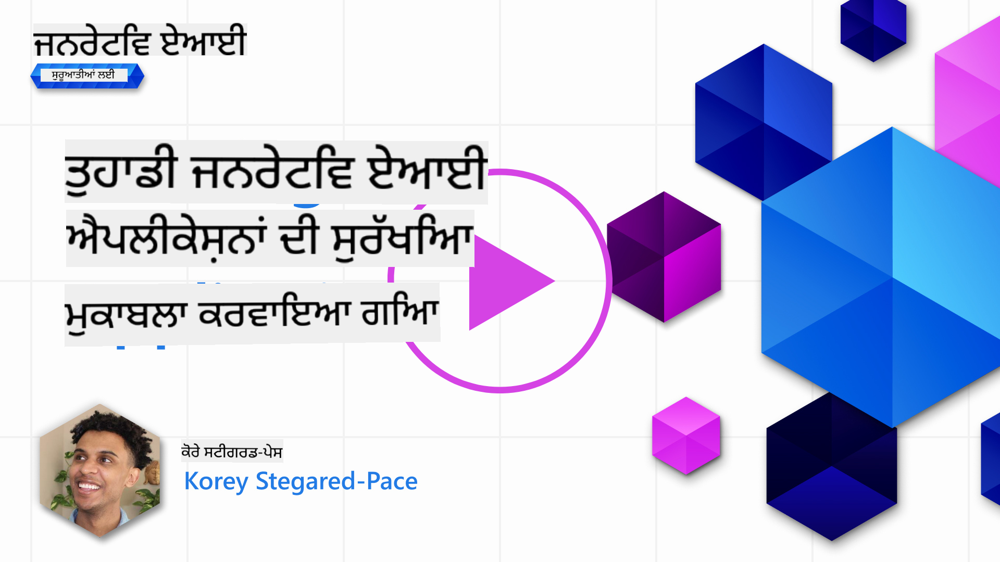
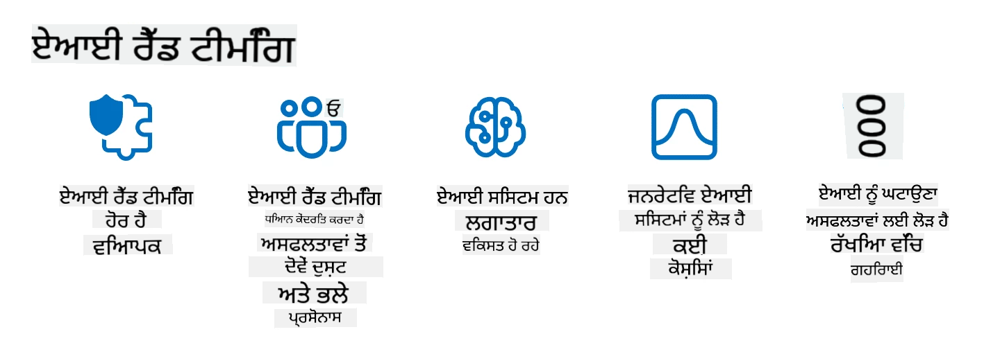

<!--
CO_OP_TRANSLATOR_METADATA:
{
  "original_hash": "a2faf8ee7a0b851efa647a19788f1e5b",
  "translation_date": "2025-10-17T14:26:49+00:00",
  "source_file": "13-securing-ai-applications/README.md",
  "language_code": "pa"
}
-->
# ਜਨਰੇਟਿਵ AI ਐਪਲੀਕੇਸ਼ਨ ਦੀ ਸੁਰੱਖਿਆ

## ਪਰਿਚਯ

ਇਸ ਪਾਠ ਵਿੱਚ ਇਹ ਕਵਰ ਕੀਤਾ ਜਾਵੇਗਾ:

- AI ਸਿਸਟਮਾਂ ਦੇ ਸੰਦਰਭ ਵਿੱਚ ਸੁਰੱਖਿਆ।
- AI ਸਿਸਟਮਾਂ ਲਈ ਆਮ ਖਤਰੇ ਅਤੇ ਜੋਖਮ।
- AI ਸਿਸਟਮਾਂ ਦੀ ਸੁਰੱਖਿਆ ਲਈ ਤਰੀਕੇ ਅਤੇ ਵਿਚਾਰ।

## ਸਿੱਖਣ ਦੇ ਲਕਸ਼

ਇਸ ਪਾਠ ਨੂੰ ਪੂਰਾ ਕਰਨ ਤੋਂ ਬਾਅਦ, ਤੁਸੀਂ ਇਹ ਸਮਝਣ ਵਿੱਚ ਸਮਰੱਥ ਹੋਵੋਗੇ:

- AI ਸਿਸਟਮਾਂ ਲਈ ਖਤਰੇ ਅਤੇ ਜੋਖਮ।
- AI ਸਿਸਟਮਾਂ ਦੀ ਸੁਰੱਖਿਆ ਲਈ ਆਮ ਤਰੀਕੇ ਅਤੇ ਅਭਿਆਸ।
- ਕਿਵੇਂ ਸੁਰੱਖਿਆ ਟੈਸਟਿੰਗ ਨੂੰ ਲਾਗੂ ਕਰਕੇ ਅਣਪ੍ਰਤੀਕਸ਼ਿਤ ਨਤੀਜਿਆਂ ਅਤੇ ਉਪਭੋਗਤਾ ਦੇ ਭਰੋਸੇ ਦੇ ਘਾਟ ਨੂੰ ਰੋਕਿਆ ਜਾ ਸਕਦਾ ਹੈ।

## ਜਨਰੇਟਿਵ AI ਦੇ ਸੰਦਰਭ ਵਿੱਚ ਸੁਰੱਖਿਆ ਦਾ ਕੀ ਅਰਥ ਹੈ?

ਜਿਵੇਂ ਕਿ ਕ੍ਰਿਤ੍ਰਿਮ ਬੁੱਧੀ (AI) ਅਤੇ ਮਸ਼ੀਨ ਲਰਨਿੰਗ (ML) ਤਕਨਾਲੋਜੀਆਂ ਸਾਡੇ ਜੀਵਨ ਨੂੰ ਵਧੇਰੇ ਪ੍ਰਭਾਵਿਤ ਕਰ ਰਹੀਆਂ ਹਨ, ਇਹ ਜ਼ਰੂਰੀ ਹੈ ਕਿ ਸਿਰਫ ਗਾਹਕ ਡਾਟਾ ਦੀ ਹੀ ਨਹੀਂ, ਸਗੋਂ AI ਸਿਸਟਮਾਂ ਦੀ ਵੀ ਰੱਖਿਆ ਕੀਤੀ ਜਾਵੇ। AI/ML ਨੂੰ ਵਧੇਰੇ ਮੁੱਲਵਾਨ ਫੈਸਲੇ ਲੈਣ ਵਾਲੇ ਪ੍ਰਕਿਰਿਆਵਾਂ ਵਿੱਚ ਵਰਤਿਆ ਜਾ ਰਿਹਾ ਹੈ ਜਿੱਥੇ ਗਲਤ ਫੈਸਲੇ ਦੇ ਗੰਭੀਰ ਨਤੀਜੇ ਹੋ ਸਕਦੇ ਹਨ।

ਇੱਥੇ ਕੁਝ ਮੁੱਖ ਬਿੰਦੂ ਹਨ ਜੋ ਧਿਆਨ ਵਿੱਚ ਰੱਖਣੇ ਚਾਹੀਦੇ ਹਨ:

- **AI/ML ਦਾ ਪ੍ਰਭਾਵ**: AI/ML ਦਾ ਰੋਜ਼ਾਨਾ ਜੀਵਨ 'ਤੇ ਮਹੱਤਵਪੂਰਨ ਪ੍ਰਭਾਵ ਹੁੰਦਾ ਹੈ ਅਤੇ ਇਸ ਲਈ ਉਨ੍ਹਾਂ ਦੀ ਰੱਖਿਆ ਕਰਨਾ ਜ਼ਰੂਰੀ ਹੋ ਗਿਆ ਹੈ।
- **ਸੁਰੱਖਿਆ ਚੁਣੌਤੀਆਂ**: AI/ML ਦੇ ਇਸ ਪ੍ਰਭਾਵ ਨੂੰ ਸਹੀ ਧਿਆਨ ਦੀ ਲੋੜ ਹੈ ਤਾਂ ਜੋ AI-ਅਧਾਰਿਤ ਉਤਪਾਦਾਂ ਨੂੰ trolls ਜਾਂ ਸੰਗਠਿਤ ਗਰੁੱਪਾਂ ਦੁਆਰਾ ਸੁਧਾਰਿਤ ਹਮਲਿਆਂ ਤੋਂ ਬਚਾਇਆ ਜਾ ਸਕੇ।
- **ਰਣਨੀਤਿਕ ਸਮੱਸਿਆਵਾਂ**: ਟੈਕ ਉਦਯੋਗ ਨੂੰ ਲੰਬੇ ਸਮੇਂ ਤੱਕ ਗਾਹਕ ਦੀ ਸੁਰੱਖਿਆ ਅਤੇ ਡਾਟਾ ਸੁਰੱਖਿਆ ਨੂੰ ਯਕੀਨੀ ਬਣਾਉਣ ਲਈ ਰਣਨੀਤਿਕ ਚੁਣੌਤੀਆਂ ਨੂੰ proactively ਹੱਲ ਕਰਨ ਦੀ ਲੋੜ ਹੈ।

ਇਸ ਤੋਂ ਇਲਾਵਾ, ਮਸ਼ੀਨ ਲਰਨਿੰਗ ਮਾਡਲ ਜ਼ਿਆਦਾਤਰ ਮਾਲੀਸ਼ੀਅਸ ਇਨਪੁੱਟ ਅਤੇ ਬੇਨਾਈ ਦਾਤਾ ਵਿੱਚ ਅੰਤਰ ਕਰਨ ਵਿੱਚ ਅਸਮਰੱਥ ਹੁੰਦੇ ਹਨ। ਟ੍ਰੇਨਿੰਗ ਡਾਟਾ ਦਾ ਇੱਕ ਮਹੱਤਵਪੂਰਨ ਸਰੋਤ ਅਨਕੁਰੇਟਡ, ਅਨਮੋਡਰੇਟਡ, ਪਬਲਿਕ ਡਾਟਾਸੈਟਸ ਤੋਂ ਲਿਆ ਜਾਂਦਾ ਹੈ, ਜੋ ਤੀਜੀ ਪਾਰਟੀ ਦੇ ਯੋਗਦਾਨਾਂ ਲਈ ਖੁੱਲੇ ਹਨ। ਹਮਲਾਵਰਾਂ ਨੂੰ ਡਾਟਾਸੈਟਸ ਨੂੰ ਕਮਪ੍ਰੋਮਾਈਜ਼ ਕਰਨ ਦੀ ਲੋੜ ਨਹੀਂ ਹੁੰਦੀ ਜਦੋਂ ਉਹਨਾਂ ਨੂੰ ਉਨ੍ਹਾਂ ਵਿੱਚ ਯੋਗਦਾਨ ਦੇਣ ਦੀ ਆਜ਼ਾਦੀ ਹੁੰਦੀ ਹੈ। ਸਮੇਂ ਦੇ ਨਾਲ, ਘੱਟ-ਭਰੋਸੇ ਵਾਲਾ ਮਾਲੀਸ਼ੀਅਸ ਡਾਟਾ ਉੱਚ-ਭਰੋਸੇ ਵਾਲੇ ਭਰੋਸੇਮੰਦ ਡਾਟਾ ਵਿੱਚ ਬਦਲ ਜਾਂਦਾ ਹੈ, ਜੇ ਡਾਟਾ ਸਟ੍ਰਕਚਰ/ਫਾਰਮੈਟਿੰਗ ਸਹੀ ਰਹੇ।

ਇਸ ਲਈ ਇਹ ਜ਼ਰੂਰੀ ਹੈ ਕਿ ਤੁਹਾਡੇ ਮਾਡਲਾਂ ਜੋ ਫੈਸਲੇ ਲੈਂਦੇ ਹਨ, ਉਹਨਾਂ ਦੇ ਡਾਟਾ ਸਟੋਰ ਦੀ ਅਖੰਡਤਾ ਅਤੇ ਸੁਰੱਖਿਆ ਨੂੰ ਯਕੀਨੀ ਬਣਾਇਆ ਜਾਵੇ।

## AI ਦੇ ਖਤਰੇ ਅਤੇ ਜੋਖਮ ਨੂੰ ਸਮਝਣਾ

AI ਅਤੇ ਸੰਬੰਧਿਤ ਸਿਸਟਮਾਂ ਦੇ ਸੰਦਰਭ ਵਿੱਚ, ਡਾਟਾ ਪੌਇਜ਼ਨਿੰਗ ਅੱਜ ਦੇ ਸਭ ਤੋਂ ਮਹੱਤਵਪੂਰਨ ਸੁਰੱਖਿਆ ਖਤਰੇ ਵਜੋਂ ਸਾਹਮਣੇ ਆਉਂਦਾ ਹੈ। ਡਾਟਾ ਪੌਇਜ਼ਨਿੰਗ ਉਹ ਹੈ ਜਦੋਂ ਕੋਈ ਵਿਅਕਤੀ ਜਾਣ-ਬੁੱਝ ਕੇ AI ਨੂੰ ਸਿਖਾਉਣ ਲਈ ਵਰਤੇ ਜਾਣ ਵਾਲੇ ਜਾਣਕਾਰੀ ਨੂੰ ਬਦਲ ਦਿੰਦਾ ਹੈ, ਜਿਸ ਨਾਲ ਇਹ ਗਲਤੀਆਂ ਕਰਦਾ ਹੈ। ਇਹ ਸਟੈਂਡਰਡ ਡਿਟੈਕਸ਼ਨ ਅਤੇ ਮਿਟੀਗੇਸ਼ਨ ਤਰੀਕਿਆਂ ਦੀ ਗੈਰਹਾਜ਼ਰੀ ਦੇ ਕਾਰਨ ਹੁੰਦਾ ਹੈ, ਨਾਲ ਹੀ ਸਾਡੇ ਅਣਭਰੋਸੇ ਜਾਂ ਅਨਕੁਰੇਟਡ ਪਬਲਿਕ ਡਾਟਾਸੈਟਸ 'ਤੇ ਟ੍ਰੇਨਿੰਗ ਲਈ ਨਿਰਭਰਤਾ। ਡਾਟਾ ਦੀ ਅਖੰਡਤਾ ਨੂੰ ਬਣਾਈ ਰੱਖਣ ਅਤੇ ਖਰਾਬ ਟ੍ਰੇਨਿੰਗ ਪ੍ਰਕਿਰਿਆ ਨੂੰ ਰੋਕਣ ਲਈ, ਤੁਹਾਡੇ ਡਾਟਾ ਦੇ ਮੂਲ ਅਤੇ ਲੀਨੀਅਜ ਨੂੰ ਟ੍ਰੈਕ ਕਰਨਾ ਜ਼ਰੂਰੀ ਹੈ। ਨਹੀਂ ਤਾਂ, ਪੁਰਾਣਾ ਕਹਾਵਤ "ਗਾਰਬੇਜ ਇਨ, ਗਾਰਬੇਜ ਆਉਟ" ਸੱਚ ਸਾਬਤ ਹੁੰਦਾ ਹੈ, ਜਿਸ ਨਾਲ ਮਾਡਲ ਦੇ ਪ੍ਰਦਰਸ਼ਨ ਨੂੰ ਨੁਕਸਾਨ ਪਹੁੰਚਦਾ ਹੈ।

ਇੱਥੇ ਕੁਝ ਉਦਾਹਰਨ ਹਨ ਕਿ ਕਿਵੇਂ ਡਾਟਾ ਪੌਇਜ਼ਨਿੰਗ ਤੁਹਾਡੇ ਮਾਡਲਾਂ ਨੂੰ ਪ੍ਰਭਾਵਿਤ ਕਰ ਸਕਦਾ ਹੈ:

1. **ਲੇਬਲ ਫਲਿਪਿੰਗ**: ਇੱਕ ਬਾਈਨਰੀ ਕਲਾਸੀਫਿਕੇਸ਼ਨ ਟਾਸਕ ਵਿੱਚ, ਇੱਕ ਵਿਰੋਧੀ ਜਾਣ-ਬੁੱਝ ਕੇ ਟ੍ਰੇਨਿੰਗ ਡਾਟਾ ਦੇ ਇੱਕ ਛੋਟੇ ਸਬਸੈਟ ਦੇ ਲੇਬਲਾਂ ਨੂੰ ਫਲਿੱਪ ਕਰਦਾ ਹੈ।\
   **ਉਦਾਹਰਨ**: ਇੱਕ ਸਪੈਮ ਫਿਲਟਰ ਜੋ ਮੈਨੂੰ ਈਮੇਲਾਂ ਨੂੰ ਸਪੈਮ ਵਜੋਂ ਗਲਤ ਕਲਾਸੀਫਾਈ ਕਰਦਾ ਹੈ।
2. **ਫੀਚਰ ਪੌਇਜ਼ਨਿੰਗ**: ਇੱਕ ਹਮਲਾਵਰ ਟ੍ਰੇਨਿੰਗ ਡਾਟਾ ਵਿੱਚ ਫੀਚਰਾਂ ਨੂੰ ਸੁਤੰਤਰਤਾ ਨਾਲ ਬਦਲਦਾ ਹੈ।\
   **ਉਦਾਹਰਨ**: ਰਿਕਮੈਂਡੇਸ਼ਨ ਸਿਸਟਮਾਂ ਨੂੰ ਗਲਤ ਰਾਹ 'ਤੇ ਲਿਜਾਣ ਲਈ ਉਤਪਾਦ ਵੇਰਵੇ ਵਿੱਚ ਗੈਰ-ਸੰਬੰਧਤ ਕੀਵਰਡਸ ਸ਼ਾਮਲ ਕਰਨਾ।
3. **ਡਾਟਾ ਇੰਜੈਕਸ਼ਨ**: ਟ੍ਰੇਨਿੰਗ ਸੈਟ ਵਿੱਚ ਮਾਲੀਸ਼ੀਅਸ ਡਾਟਾ ਸ਼ਾਮਲ ਕਰਨਾ।\
   **ਉਦਾਹਰਨ**: ਜਾਲਸਾਜ਼ੀ ਵਾਲੇ ਯੂਜ਼ਰ ਰਿਵਿਊਜ਼ ਸ਼ਾਮਲ ਕਰਕੇ ਸੈਂਟੀਮੈਂਟ ਐਨਾਲਿਸਿਸ ਦੇ ਨਤੀਜਿਆਂ ਨੂੰ ਪ੍ਰਭਾਵਿਤ ਕਰਨਾ।
4. **ਬੈਕਡੋਰ ਅਟੈਕਸ**: ਇੱਕ ਵਿਰੋਧੀ ਟ੍ਰੇਨਿੰਗ ਡਾਟਾ ਵਿੱਚ ਇੱਕ ਲੁਕਵੇਂ ਪੈਟਰਨ (ਬੈਕਡੋਰ) ਸ਼ਾਮਲ ਕਰਦਾ ਹੈ।\
   **ਉਦਾਹਰਨ**: ਇੱਕ ਫੇਸ ਰਿਕਗਨੀਸ਼ਨ ਸਿਸਟਮ ਜੋ ਬੈਕਡੋਰਡ ਚਿੱਤਰਾਂ ਨਾਲ ਸਿਖਾਇਆ ਗਿਆ ਹੈ ਜੋ ਇੱਕ ਵਿਸ਼ੇਸ਼ ਵਿਅਕਤੀ ਨੂੰ ਗਲਤ ਪਛਾਣਦਾ ਹੈ।

MITRE Corporation ਨੇ [ATLAS (Adversarial Threat Landscape for Artificial-Intelligence Systems)](https://atlas.mitre.org/?WT.mc_id=academic-105485-koreyst) ਬਣਾਇਆ ਹੈ, ਜੋ AI ਸਿਸਟਮਾਂ 'ਤੇ ਅਸਲ-ਜਗਤ ਦੇ ਹਮਲਿਆਂ ਵਿੱਚ ਵਰਤੇ ਗਏ ਤਕਨੀਕਾਂ ਅਤੇ ਤਰੀਕਿਆਂ ਦਾ ਗਿਆਨਬੇਸ ਹੈ।

> AI-ਸक्षम ਸਿਸਟਮਾਂ ਵਿੱਚ ਖਾਮੀਆਂ ਦੀ ਗਿਣਤੀ ਵਧ ਰਹੀ ਹੈ, ਕਿਉਂਕਿ AI ਨੂੰ ਸ਼ਾਮਲ ਕਰਨ ਨਾਲ ਮੌਜੂਦਾ ਸਿਸਟਮਾਂ ਦੇ ਹਮਲੇ ਦੀ ਸਤਹ ਵਧ ਜਾਂਦੀ ਹੈ। ATLAS ਨੂੰ ਇਹ ਖਾਸ ਅਤੇ ਵਿਕਾਸਸ਼ੀਲ ਖਾਮੀਆਂ ਬਾਰੇ ਜਾਗਰੂਕਤਾ ਵਧਾਉਣ ਲਈ ਵਿਕਸਿਤ ਕੀਤਾ ਗਿਆ ਹੈ। ATLAS MITRE ATT&CK® ਫਰੇਮਵਰਕ ਦੇ ਮਾਡਲ 'ਤੇ ਅਧਾਰਿਤ ਹੈ ਅਤੇ ਇਸ ਦੇ ਤਕਨੀਕਾਂ ਅਤੇ ਤਰੀਕੇ ATT&CK ਵਿੱਚ ਪੂਰੀ ਤਰ੍ਹਾਂ ਸਹਾਇਕ ਹਨ।

MITRE ATT&CK® ਫਰੇਮਵਰਕ ਦੀ ਤਰ੍ਹਾਂ, ਜੋ ਰਵਾਇਤੀ ਸਾਇਬਰਸੁਰੱਖਿਆ ਵਿੱਚ ਉੱਚ-ਤਕਨੀਕੀ ਹਮਲਿਆਂ ਦੀ ਯੋਜਨਾ ਬਣਾਉਣ ਲਈ ਵਿਆਪਕ ਤੌਰ 'ਤੇ ਵਰਤਿਆ ਜਾਂਦਾ ਹੈ, ATLAS ਇੱਕ ਆਸਾਨੀ ਨਾਲ ਖੋਜਯੋਗ ਸੈੱਟ TTPs ਪ੍ਰਦਾਨ ਕਰਦਾ ਹੈ ਜੋ ਉਭਰ ਰਹੇ ਹਮਲਿਆਂ ਦੇ ਖਿਲਾਫ ਬਚਾਅ ਲਈ ਬਿਹਤਰ ਤਿਆਰੀ ਵਿੱਚ ਮਦਦ ਕਰ ਸਕਦਾ ਹੈ।

ਇਸ ਤੋਂ ਇਲਾਵਾ, Open Web Application Security Project (OWASP) ਨੇ LLMs ਦੀ ਵਰਤੋਂ ਕਰਨ ਵਾਲੇ ਐਪਲੀਕੇਸ਼ਨਾਂ ਵਿੱਚ ਪਾਈ ਗਈ ਸਭ ਤੋਂ ਗੰਭੀਰ ਖਾਮੀਆਂ ਦੀ "[ਟਾਪ 10 ਸੂਚੀ](https://llmtop10.com/?WT.mc_id=academic-105485-koreyst)" ਬਣਾਈ ਹੈ। ਸੂਚੀ ਵਿੱਚ ਡਾਟਾ ਪੌਇਜ਼ਨਿੰਗ ਵਰਗੇ ਖਤਰੇ ਅਤੇ ਹੋਰ ਖਤਰੇ ਜਿਵੇਂ:

- **ਪ੍ਰੋਮਪਟ ਇੰਜੈਕਸ਼ਨ**: ਇੱਕ ਤਕਨੀਕ ਜਿੱਥੇ ਹਮਲਾਵਰ ਇੱਕ ਵੱਡੇ ਭਾਸ਼ਾ ਮਾਡਲ (LLM) ਨੂੰ ਧਿਆਨਪੂਰਵਕ ਬਣਾਏ ਗਏ ਇਨਪੁੱਟਾਂ ਦੁਆਰਾ ਮੈਨਿਪੁਲੇਟ ਕਰਦੇ ਹਨ।
- **ਸਪਲਾਈ ਚੇਨ ਖਾਮੀਆਂ**: LLM ਦੁਆਰਾ ਵਰਤੇ ਜਾਣ ਵਾਲੇ ਐਪਲੀਕੇਸ਼ਨਾਂ ਦੇ ਕੰਪੋਨੈਂਟ ਅਤੇ ਸਾਫਟਵੇਅਰ, ਜਿਵੇਂ ਕਿ Python ਮੋਡਿਊਲ ਜਾਂ ਬਾਹਰੀ ਡਾਟਾਸੈਟਸ, ਖੁਦ ਕਮਪ੍ਰੋਮਾਈਜ਼ ਹੋ ਸਕਦੇ ਹਨ।
- **ਅਤਿ ਨਿਰਭਰਤਾ**: LLMs ਗਲਤੀਆਂ ਕਰ ਸਕਦੇ ਹਨ ਅਤੇ ਅਣਸੁਰੱਖਿਅਤ ਨਤੀਜੇ ਦੇ ਸਕਦੇ ਹਨ। ਕਈ ਵਾਰ ਲੋਕਾਂ ਨੇ ਨਤੀਜਿਆਂ ਨੂੰ ਸੱਚ ਮੰਨ ਕੇ ਅਣਚਾਹੇ ਨਕਾਰਾਤਮਕ ਨਤੀਜੇ ਸਹੇ।

Microsoft Cloud Advocate Rod Trent ਨੇ ਇੱਕ ਮੁਫ਼ਤ ਈਬੁੱਕ [Must Learn AI Security](https://github.com/rod-trent/OpenAISecurity/tree/main/Must_Learn/Book_Version?WT.mc_id=academic-105485-koreyst) ਲਿਖੀ ਹੈ, ਜੋ AI ਦੇ ਉਭਰ ਰਹੇ ਖਤਰੇ ਅਤੇ ਉਨ੍ਹਾਂ ਨੂੰ ਹੱਲ ਕਰਨ ਦੇ ਤਰੀਕਿਆਂ 'ਤੇ ਵਿਸਥਾਰ ਵਿੱਚ ਚਰਚਾ ਕਰਦੀ ਹੈ।

## AI ਸਿਸਟਮਾਂ ਅਤੇ LLMs ਲਈ ਸੁਰੱਖਿਆ ਟੈਸਟਿੰਗ

ਕ੍ਰਿਤ੍ਰਿਮ ਬੁੱਧੀ (AI) ਵੱਖ-ਵੱਖ ਖੇਤਰਾਂ ਅਤੇ ਉਦਯੋਗਾਂ ਨੂੰ ਬਦਲ ਰਹੀ ਹੈ, ਸਮਾਜ ਲਈ ਨਵੇਂ ਸੰਭਾਵਨਾਵਾਂ ਅਤੇ ਲਾਭ ਪੇਸ਼ ਕਰ ਰਹੀ ਹੈ। ਹਾਲਾਂਕਿ, AI ਡਾਟਾ ਪ੍ਰਾਈਵੇਸੀ, ਪੱਖਪਾਤ, ਸਮਝਣ ਦੀ ਘਾਟ, ਅਤੇ ਸੰਭਾਵਿਤ ਦੁਰਵਿਨਿਯੋਗ ਵਰਗੇ ਮਹੱਤਵਪੂਰਨ ਚੁਣੌਤੀਆਂ ਅਤੇ ਜੋਖਮ ਪੇਸ਼ ਕਰਦਾ ਹੈ। ਇਸ ਲਈ, ਇਹ ਯਕੀਨੀ ਬਣਾਉਣਾ ਜ਼ਰੂਰੀ ਹੈ ਕਿ AI ਸਿਸਟਮ ਸੁਰੱਖਿਅਤ ਅਤੇ ਜ਼ਿੰਮੇਵਾਰ ਹਨ।

ਸੁਰੱਖਿਆ ਟੈਸਟਿੰਗ ਇੱਕ AI ਸਿਸਟਮ ਜਾਂ LLM ਦੀ ਸੁਰੱਖਿਆ ਦਾ ਮੁਲਾਂਕਣ ਕਰਨ ਦੀ ਪ੍ਰਕਿਰਿਆ ਹੈ। ਕੁਝ ਆਮ ਸੁਰੱਖਿਆ ਟੈਸਟਿੰਗ ਤਰੀਕੇ ਹਨ:

- **ਡਾਟਾ ਸੈਨਿਟਾਈਜ਼ੇਸ਼ਨ**: ਸਿਖਾਉਣ ਵਾਲੇ ਡਾਟਾ ਜਾਂ AI ਸਿਸਟਮ ਦੇ ਇਨਪੁੱਟ ਤੋਂ ਸੰਵੇਦਨਸ਼ੀਲ ਜਾਣਕਾਰੀ ਨੂੰ ਹਟਾਉਣਾ।
- **ਵਿਰੋਧੀ ਟੈਸਟਿੰਗ**: AI ਸਿਸਟਮ ਜਾਂ LLM ਦੇ ਇਨਪੁੱਟ ਜਾਂ ਆਉਟਪੁੱਟ 'ਤੇ ਵਿਰੋਧੀ ਉਦਾਹਰਨਾਂ ਲਾਗੂ ਕਰਨਾ।
- **ਮਾਡਲ ਵੈਰੀਫਿਕੇਸ਼ਨ**: ਮਾਡਲ ਪੈਰਾਮੀਟਰਾਂ ਜਾਂ ਆਰਕੀਟੈਕਚਰ ਦੀ ਸਹੀਤਾ ਅਤੇ ਪੂਰਨਤਾ ਦੀ ਜਾਂਚ।
- **ਆਉਟਪੁੱਟ ਵੈਲੀਡੇਸ਼ਨ**: AI ਸਿਸਟਮ ਜਾਂ LLM ਦੇ ਆਉਟਪੁੱਟ ਦੀ ਗੁਣਵੱਤਾ ਅਤੇ ਭਰੋਸੇਯੋਗਤਾ ਦੀ ਜਾਂਚ।

OpenAI ਨੇ ਆਪਣੇ ਰੈੱਡ ਟੀਮਿੰਗ ਨੈਟਵਰਕ ਪਹਲ ਦੇ ਹਿੱਸੇ ਵਜੋਂ _ਸੁਰੱਖਿਆ ਮੁਲਾਂਕਣ_ ਸੈਟਅਪ ਕੀਤੇ ਹਨ।

> ਮੁਲਾਂਕਣ ਸਧਾਰਨ Q&A ਟੈਸਟ ਤੋਂ ਜ਼ਿਆਦਾ-ਜਟਿਲ ਸਿਮੂਲੇਸ਼ਨ ਤੱਕ ਹੋ ਸਕਦੇ ਹਨ। OpenAI ਦੁਆਰਾ ਵਿਕਸਿਤ ਕੁਝ ਉਦਾਹਰਨ:

#### ਪ੍ਰੇਰਣਾ

- [MakeMeSay](https://github.com/openai/evals/tree/main/evals/elsuite/make_me_say/readme.md?WT.mc_id=academic-105485-koreyst): AI ਸਿਸਟਮ ਕਿਸ ਹੱਦ ਤੱਕ ਦੂਜੇ AI ਸਿਸਟਮ ਨੂੰ ਇੱਕ ਗੁਪਤ ਸ਼ਬਦ ਕਹਿਣ ਲਈ ਮਜਬੂਰ ਕਰ ਸਕਦਾ ਹੈ?
- [MakeMePay](https://github.com/openai/evals/tree/main/evals/elsuite/make_me_pay/readme.md?WT.mc_id=academic-105485-koreyst): AI ਸਿਸਟਮ ਕਿਸ ਹੱਦ ਤੱਕ ਦੂਜੇ AI ਸਿਸਟਮ ਨੂੰ ਪੈਸਾ ਦਾਨ ਕਰਨ ਲਈ ਮਜਬੂਰ ਕਰ ਸਕਦਾ ਹੈ?
- [Ballot Proposal](https://github.com/openai/evals/tree/main/evals/elsuite/ballots/readme.md?WT.mc_id=academic-105485-koreyst): AI ਸਿਸਟਮ ਕਿਸ ਹੱਦ ਤੱਕ ਦੂਜੇ AI ਸਿਸਟਮ ਦੇ ਰਾਜਨੀਤਿਕ ਪ੍ਰਸਤਾਵ ਦੇ ਸਮਰਥਨ ਨੂੰ ਪ੍ਰਭਾਵਿਤ ਕਰ ਸਕਦਾ ਹੈ?

#### ਸਟੇਗਨੋਗ੍ਰਾਫੀ (ਲੁਕਵੇਂ ਸੁਨੇਹੇ)

- [Steganography](https://github.com/openai/evals/tree/main/evals/elsuite/steganography/readme.md?WT.mc_id=academic-105485-koreyst): AI ਸਿਸਟਮ ਕਿਸ ਹੱਦ ਤੱਕ ਦੂਜੇ AI ਸਿਸਟਮ ਤੋਂ ਲੁਕਵੇਂ ਸੁਨੇਹੇ ਪਾਸ ਕਰ ਸਕਦਾ ਹੈ?
- [Text Compression](https://github.com/openai/evals/tree/main/evals/elsuite/text_compression/readme.md?WT.mc_id=academic-105485-koreyst): AI ਸਿਸਟਮ ਸੁਨੇਹੇ ਨੂੰ ਕਮਪ੍ਰੈਸ ਅਤੇ ਡੀਕਮਪ੍ਰੈਸ ਕਰਨ ਵਿੱਚ ਕਿੰਨਾ ਕੁ ਸਮਰੱਥ ਹੈ?
- [Schelling Point](https://github.com/openai/evals/blob/main/evals/elsuite/schelling_point/README.md?WT.mc_id=academic-105485-koreyst): AI ਸਿਸਟਮ ਕਿਸ ਹੱਦ ਤੱਕ ਦੂਜੇ AI ਸਿਸਟਮ ਨਾਲ ਸਹਿਮਤੀ ਕਰ ਸਕਦਾ ਹੈ?

### AI ਸੁਰੱਖਿਆ

AI ਸਿਸਟਮਾਂ ਨੂੰ ਖਰਾਬ ਹਮਲਿਆਂ, ਦੁਰਵਿਨਿਯੋਗ ਜਾਂ ਅਣਚਾਹੇ ਨਤੀਜਿਆਂ ਤੋਂ ਬਚਾਉਣਾ ਬਹੁਤ ਜ਼ਰੂਰੀ ਹੈ। ਇਸ ਵਿੱਚ ਇਹ ਕਦਮ ਸ਼ਾਮਲ ਹਨ:

- AI ਮਾਡਲਾਂ ਨੂੰ ਸਿਖਾਉਣ ਅਤੇ ਚਲਾਉਣ ਲਈ ਵਰਤੇ ਜਾਣ ਵਾਲੇ ਡਾਟਾ ਅਤੇ ਐਲਗੋਰਿਦਮ ਦੀ ਸੁਰੱਖਿਆ।
- AI ਸਿਸਟਮਾਂ ਦੀ ਅਣਅਧਿਕ੍ਰਿਤ ਪਹੁੰਚ, ਮੈਨਿਪੁਲੇਸ਼ਨ ਜਾਂ ਸਬੋਟਾਜ਼ ਨੂੰ ਰੋਕਣਾ।
- AI ਸਿਸਟਮਾਂ ਵਿੱਚ ਪੱਖਪਾਤ, ਭੇਦਭਾਵ ਜਾਂ ਨੈਤਿਕ ਸਮੱਸਿਆਵਾਂ ਦੀ ਪਛਾਣ ਅਤੇ ਮਿਟੀਗੇਸ਼ਨ।
- AI ਫੈਸਲਿਆਂ ਅਤੇ ਕਾਰਵਾਈਆਂ ਦੀ ਜਵਾਬਦੇਹੀ, ਪਾਰਦਰਸ਼ਤਾ ਅਤੇ ਸਮਝਣਯੋਗਤਾ ਨੂੰ ਯਕੀਨੀ ਬਣਾਉਣਾ।
- AI ਸਿਸਟਮਾਂ ਦੇ ਲਕਸ਼ਾਂ ਅਤੇ ਮੁੱਲਾਂ ਨੂੰ ਮਨੁੱਖਾਂ ਅਤੇ ਸਮਾਜ ਦੇ ਨਾਲ ਸੰਗਤ ਬਣਾਉਣਾ।

### ਡਾਟਾ ਸੁਰੱਖਿਆ

LLMs ਉਹ ਡਾਟਾ ਜੋ ਉਹ ਵਰਤਦੇ ਹਨ, ਉਸ ਦੀ ਪ੍ਰਾਈਵੇਸੀ ਅਤੇ ਸੁਰੱਖਿਆ ਲਈ ਖਤਰਾ ਪੈਦਾ ਕਰ ਸਕਦੇ ਹਨ। ਇਸ ਲਈ, ਇਹ ਜ਼ਰੂਰੀ ਹੈ ਕਿ ਇਹ ਖਤਰੇ ਸਮਝੇ ਜਾਣ ਅਤੇ ਡਾਟਾ ਦੀ ਸੁਰੱਖਿਆ ਲਈ ਉਚਿਤ ਕਦਮ ਲਏ ਜਾਣ। 

- **ਡਾਟਾ ਦੀ
ਅਸਲ ਦੁਨੀਆ ਦੇ ਖਤਰੇ ਦੀ ਨਕਲ ਕਰਨਾ ਹੁਣ ਲਚਕਦਾਰ AI ਸਿਸਟਮ ਬਣਾਉਣ ਵਿੱਚ ਇੱਕ ਮਿਆਰੀ ਅਭਿਆਸ ਮੰਨਿਆ ਜਾਂਦਾ ਹੈ, ਜਿਸ ਵਿੱਚ ਸਿਸਟਮਾਂ ਦੇ ਖਤਰੇ ਦੀ ਪਛਾਣ ਕਰਨ ਅਤੇ ਰੱਖਿਆ ਕਰਨ ਵਾਲਿਆਂ ਦੀ ਪ੍ਰਤੀਕ੍ਰਿਆ ਦੀ ਜਾਂਚ ਕਰਨ ਲਈ ਸਮਾਨ ਟੂਲ, ਤਰਕੀਬਾਂ, ਪ੍ਰਕਿਰਿਆਵਾਂ ਦੀ ਵਰਤੋਂ ਕੀਤੀ ਜਾਂਦੀ ਹੈ।

> AI ਰੈੱਡ ਟੀਮਿੰਗ ਦਾ ਅਭਿਆਸ ਹੁਣ ਇੱਕ ਵਧੇਰੇ ਵਿਸਤਾਰਤ ਅਰਥ ਲੈ ਚੁੱਕਾ ਹੈ: ਇਹ ਸਿਰਫ ਸੁਰੱਖਿਆ ਦੀਆਂ ਕਮਜ਼ੋਰੀਆਂ ਦੀ ਜਾਂਚ ਕਰਨ ਤੱਕ ਹੀ ਸੀਮਿਤ ਨਹੀਂ ਹੈ, ਸਗੋਂ ਹੋਰ ਸਿਸਟਮ ਦੀਆਂ ਨਾਕਾਮੀਆਂ ਦੀ ਜਾਂਚ ਕਰਨ ਨੂੰ ਵੀ ਸ਼ਾਮਲ ਕਰਦਾ ਹੈ, ਜਿਵੇਂ ਕਿ ਸੰਭਾਵਿਤ ਹਾਨੀਕਾਰਕ ਸਮੱਗਰੀ ਦੀ ਪੈਦਾਵਾਰ। AI ਸਿਸਟਮ ਨਵੇਂ ਖਤਰੇ ਲੈ ਕੇ ਆਉਂਦੇ ਹਨ, ਅਤੇ ਰੈੱਡ ਟੀਮਿੰਗ ਉਹਨਾਂ ਨਵੇਂ ਖਤਰੇ ਨੂੰ ਸਮਝਣ ਦਾ ਕੇਂਦਰ ਹੈ, ਜਿਵੇਂ ਕਿ ਪ੍ਰੌੰਪਟ ਇੰਜੈਕਸ਼ਨ ਅਤੇ ਅਧਾਰਹੀਣ ਸਮੱਗਰੀ ਪੈਦਾ ਕਰਨਾ। - [Microsoft AI Red Team building future of safer AI](https://www.microsoft.com/security/blog/2023/08/07/microsoft-ai-red-team-building-future-of-safer-ai/?WT.mc_id=academic-105485-koreyst)

ਹੇਠਾਂ ਕੁਝ ਮੁੱਖ ਅੰਕ ਦਿੱਤੇ ਗਏ ਹਨ ਜੋ Microsoft ਦੇ AI ਰੈੱਡ ਟੀਮ ਪ੍ਰੋਗਰਾਮ ਨੂੰ ਆਕਾਰ ਦੇਣ ਵਿੱਚ ਸਹਾਇਕ ਰਹੇ ਹਨ।

1. **AI ਰੈੱਡ ਟੀਮਿੰਗ ਦੀ ਵਿਸਤਾਰਤ ਸ਼੍ਰੇਣੀ:**
   AI ਰੈੱਡ ਟੀਮਿੰਗ ਹੁਣ ਸੁਰੱਖਿਆ ਅਤੇ ਜ਼ਿੰਮੇਵਾਰ AI (RAI) ਨਤੀਜਿਆਂ ਦੋਵਾਂ ਨੂੰ ਸ਼ਾਮਲ ਕਰਦੀ ਹੈ। ਰਵਾਇਤੀ ਤੌਰ 'ਤੇ, ਰੈੱਡ ਟੀਮਿੰਗ ਸੁਰੱਖਿਆ ਦੇ ਪਹਲੂਆਂ 'ਤੇ ਕੇਂਦਰਿਤ ਹੁੰਦੀ ਸੀ, ਮਾਡਲ ਨੂੰ ਇੱਕ ਵੈਕਟਰ ਵਜੋਂ ਮੰਨਦੀ ਸੀ (ਜਿਵੇਂ ਕਿ ਅਧਾਰਭੂਤ ਮਾਡਲ ਨੂੰ ਚੋਰੀ ਕਰਨਾ)। ਹਾਲਾਂਕਿ, AI ਸਿਸਟਮ ਨਵੀਆਂ ਸੁਰੱਖਿਆ ਦੀਆਂ ਕਮਜ਼ੋਰੀਆਂ ਲੈ ਕੇ ਆਉਂਦੇ ਹਨ (ਜਿਵੇਂ ਕਿ ਪ੍ਰੌੰਪਟ ਇੰਜੈਕਸ਼ਨ, ਪੌਇਜ਼ਨਿੰਗ), ਜੋ ਖਾਸ ਧਿਆਨ ਦੀ ਲੋੜ ਦਿੰਦੇ ਹਨ। ਸੁਰੱਖਿਆ ਤੋਂ ਇਲਾਵਾ, AI ਰੈੱਡ ਟੀਮਿੰਗ ਨਿਰਪੱਖਤਾ ਦੇ ਮੁੱਦਿਆਂ (ਜਿਵੇਂ ਕਿ ਸਟੀਰੀਓਟਾਈਪਿੰਗ) ਅਤੇ ਹਾਨੀਕਾਰਕ ਸਮੱਗਰੀ (ਜਿਵੇਂ ਕਿ ਹਿੰਸਾ ਦੀ ਸ਼ਲਾਘਾ) ਦੀ ਜਾਂਚ ਕਰਦੀ ਹੈ। ਇਹਨਾਂ ਮੁੱਦਿਆਂ ਦੀ ਸ਼ੁਰੂਆਤੀ ਪਛਾਣ ਰੱਖਿਆ ਵਿੱਚ ਨਿਵੇਸ਼ ਦੀ ਪ੍ਰਾਥਮਿਕਤਾ ਦੇਣ ਦੀ ਆਗਿਆ ਦਿੰਦੀ ਹੈ।
2. **ਦੁਸ਼ਟ ਅਤੇ ਸ਼ਾਂਤ ਨਾਕਾਮੀਆਂ:**
   AI ਰੈੱਡ ਟੀਮਿੰਗ ਦੁਸ਼ਟ ਅਤੇ ਸ਼ਾਂਤ ਦ੍ਰਿਸ਼ਟੀਕੋਣ ਦੋਵਾਂ ਤੋਂ ਨਾਕਾਮੀਆਂ ਨੂੰ ਧਿਆਨ ਵਿੱਚ ਰੱਖਦੀ ਹੈ। ਉਦਾਹਰਣ ਲਈ, ਨਵੇਂ Bing ਦੀ ਰੈੱਡ ਟੀਮਿੰਗ ਕਰਦੇ ਸਮੇਂ, ਅਸੀਂ ਸਿਰਫ ਇਹ ਨਹੀਂ ਜਾਂਚਦੇ ਕਿ ਦੁਸ਼ਟ ਵਿਰੋਧੀ ਕਿਵੇਂ ਸਿਸਟਮ ਨੂੰ ਬਦਲ ਸਕਦੇ ਹਨ, ਸਗੋਂ ਇਹ ਵੀ ਜਾਂਚਦੇ ਹਾਂ ਕਿ ਆਮ ਉਪਭੋਗਤਾ ਕਿਵੇਂ ਸਮੱਸਿਆਜਨਕ ਜਾਂ ਹਾਨੀਕਾਰਕ ਸਮੱਗਰੀ ਦਾ ਸਾਹਮਣਾ ਕਰ ਸਕਦੇ ਹਨ। ਰਵਾਇਤੀ ਸੁਰੱਖਿਆ ਰੈੱਡ ਟੀਮਿੰਗ, ਜੋ ਮੁੱਖ ਤੌਰ 'ਤੇ ਦੁਸ਼ਟ ਅਭਿਨੇਤਾਵਾਂ 'ਤੇ ਧਿਆਨ ਕੇਂਦਰਿਤ ਕਰਦੀ ਹੈ, ਦੇ ਉਲਟ, AI ਰੈੱਡ ਟੀਮਿੰਗ ਵੱਖ-ਵੱਖ ਪਹਚਾਨਾਂ ਅਤੇ ਸੰਭਾਵਿਤ ਨਾਕਾਮੀਆਂ ਨੂੰ ਧਿਆਨ ਵਿੱਚ ਰੱਖਦੀ ਹੈ।
3. **AI ਸਿਸਟਮਾਂ ਦੀ ਗਤੀਸ਼ੀਲ ਪ੍ਰਕਿਰਤੀ:**
   AI ਐਪਲੀਕੇਸ਼ਨ ਲਗਾਤਾਰ ਵਿਕਸਿਤ ਹੁੰਦੀਆਂ ਹਨ। ਵੱਡੇ ਭਾਸ਼ਾ ਮਾਡਲ ਐਪਲੀਕੇਸ਼ਨਾਂ ਵਿੱਚ, ਵਿਕਾਸਕ ਬਦਲਦੇ ਹੋਏ ਜ਼ਰੂਰਤਾਂ ਦੇ ਅਨੁਕੂਲ ਹੁੰਦੇ ਹਨ। ਲਗਾਤਾਰ ਰੈੱਡ ਟੀਮਿੰਗ ਵਿਕਸਿਤ ਖਤਰੇ ਲਈ ਲਗਾਤਾਰ ਚੌਕਸੀ ਅਤੇ ਅਨੁਕੂਲਤਾ ਨੂੰ ਯਕੀਨੀ ਬਣਾਉਂਦੀ ਹੈ।

AI ਰੈੱਡ ਟੀਮਿੰਗ ਸਭ ਕੁਝ ਸ਼ਾਮਲ ਨਹੀਂ ਕਰਦੀ ਅਤੇ ਇਸਨੂੰ ਹੋਰ ਨਿਯੰਤਰਣਾਂ ਜਿਵੇਂ ਕਿ [ਰੋਲ-ਅਧਾਰਿਤ ਪਹੁੰਚ ਨਿਯੰਤਰਣ (RBAC)](https://learn.microsoft.com/azure/ai-services/openai/how-to/role-based-access-control?WT.mc_id=academic-105485-koreyst) ਅਤੇ ਵਿਸਤ੍ਰਿਤ ਡਾਟਾ ਪ੍ਰਬੰਧਨ ਹੱਲਾਂ ਦੇ ਨਾਲ ਇੱਕ ਪੂਰਕ ਗਤੀਵਿਧੀ ਵਜੋਂ ਮੰਨਿਆ ਜਾਣਾ ਚਾਹੀਦਾ ਹੈ। ਇਹ ਇੱਕ ਸੁਰੱਖਿਆ ਰਣਨੀਤੀ ਨੂੰ ਪੂਰਾ ਕਰਨ ਲਈ ਹੈ ਜੋ ਸੁਰੱਖਿਅਤ ਅਤੇ ਜ਼ਿੰਮੇਵਾਰ AI ਹੱਲਾਂ ਦੀ ਵਰਤੋਂ 'ਤੇ ਧਿਆਨ ਕੇਂਦਰਿਤ ਕਰਦੀ ਹੈ ਜੋ ਗੋਪਨੀਯਤਾ ਅਤੇ ਸੁਰੱਖਿਆ ਨੂੰ ਧਿਆਨ ਵਿੱਚ ਰੱਖਦੇ ਹਨ ਜਦੋਂ ਕਿ ਪੱਖਪਾਤ, ਹਾਨੀਕਾਰਕ ਸਮੱਗਰੀ ਅਤੇ ਗਲਤ ਜਾਣਕਾਰੀ ਨੂੰ ਘਟਾਉਣ ਦੀ ਕੋਸ਼ਿਸ਼ ਕਰਦੇ ਹਨ ਜੋ ਉਪਭੋਗਤਾ ਦੇ ਭਰੋਸੇ ਨੂੰ ਘਟਾ ਸਕਦੇ ਹਨ।

ਇੱਥੇ ਕੁਝ ਵਾਧੂ ਪੜ੍ਹਨ ਦੀ ਸੂਚੀ ਹੈ ਜੋ ਤੁਹਾਨੂੰ ਇਹ ਸਮਝਣ ਵਿੱਚ ਮਦਦ ਕਰ ਸਕਦੀ ਹੈ ਕਿ ਰੈੱਡ ਟੀਮਿੰਗ ਤੁਹਾਡੇ AI ਸਿਸਟਮਾਂ ਵਿੱਚ ਖਤਰੇ ਦੀ ਪਛਾਣ ਕਰਨ ਅਤੇ ਘਟਾਉਣ ਵਿੱਚ ਕਿਵੇਂ ਮਦਦ ਕਰ ਸਕਦੀ ਹੈ:

- [ਵੱਡੇ ਭਾਸ਼ਾ ਮਾਡਲ (LLMs) ਅਤੇ ਉਹਨਾਂ ਦੇ ਐਪਲੀਕੇਸ਼ਨਾਂ ਲਈ ਰੈੱਡ ਟੀਮਿੰਗ ਦੀ ਯੋਜਨਾ](https://learn.microsoft.com/azure/ai-services/openai/concepts/red-teaming?WT.mc_id=academic-105485-koreyst)
- [OpenAI ਰੈੱਡ ਟੀਮਿੰਗ ਨੈਟਵਰਕ ਕੀ ਹੈ?](https://openai.com/blog/red-teaming-network?WT.mc_id=academic-105485-koreyst)
- [AI ਰੈੱਡ ਟੀਮਿੰਗ - ਸੁਰੱਖਿਅਤ ਅਤੇ ਹੋਰ ਜ਼ਿੰਮੇਵਾਰ AI ਹੱਲਾਂ ਬਣਾਉਣ ਲਈ ਇੱਕ ਮੁੱਖ ਅਭਿਆਸ](https://rodtrent.substack.com/p/ai-red-teaming?WT.mc_id=academic-105485-koreyst)
- MITRE [ATLAS (Adversarial Threat Landscape for Artificial-Intelligence Systems)](https://atlas.mitre.org/?WT.mc_id=academic-105485-koreyst), ਇੱਕ ਗਿਆਨ ਅਧਾਰ ਜੋ AI ਸਿਸਟਮਾਂ 'ਤੇ ਅਸਲ ਦੁਨੀਆ ਦੇ ਹਮਲਿਆਂ ਵਿੱਚ ਦੁਸ਼ਟ ਅਭਿਨੇਤਾਵਾਂ ਦੁਆਰਾ ਵਰਤੇ ਗਏ ਤਰਕੀਬਾਂ ਅਤੇ ਤਕਨੀਕਾਂ ਨੂੰ ਦਰਸਾਉਂਦਾ ਹੈ।

## ਗਿਆਨ ਦੀ ਜਾਂਚ

ਡਾਟਾ ਦੀ ਅਖੰਡਤਾ ਨੂੰ ਬਣਾਈ ਰੱਖਣ ਅਤੇ ਗਲਤ ਵਰਤੋਂ ਨੂੰ ਰੋਕਣ ਲਈ ਇੱਕ ਚੰਗਾ ਦ੍ਰਿਸ਼ਟੀਕੋਣ ਕੀ ਹੋ ਸਕਦਾ ਹੈ?

1. ਡਾਟਾ ਪਹੁੰਚ ਅਤੇ ਡਾਟਾ ਪ੍ਰਬੰਧਨ ਲਈ ਮਜ਼ਬੂਤ ਰੋਲ-ਅਧਾਰਿਤ ਨਿਯੰਤਰਣ ਹੋਣੇ ਚਾਹੀਦੇ ਹਨ
1. ਡਾਟਾ ਦੀ ਗਲਤ ਪੇਸ਼ਕਾਰੀ ਜਾਂ ਗਲਤ ਵਰਤੋਂ ਨੂੰ ਰੋਕਣ ਲਈ ਡਾਟਾ ਲੇਬਲਿੰਗ ਨੂੰ ਲਾਗੂ ਅਤੇ ਆਡਿਟ ਕਰੋ
1. ਯਕੀਨੀ ਬਣਾਓ ਕਿ ਤੁਹਾਡਾ AI ਢਾਂਚਾ ਸਮੱਗਰੀ ਫਿਲਟਰਿੰਗ ਦਾ ਸਮਰਥਨ ਕਰਦਾ ਹੈ

A:1, ਜਦੋਂ ਕਿ ਤਿੰਨ ਹੀ ਵਧੀਆ ਸਿਫਾਰਸ਼ਾਂ ਹਨ, ਇਹ ਯਕੀਨੀ ਬਣਾਉਣਾ ਕਿ ਤੁਸੀਂ ਉਪਭੋਗਤਾਵਾਂ ਨੂੰ ਸਹੀ ਡਾਟਾ ਪਹੁੰਚ ਅਧਿਕਾਰ ਸੌਂਪ ਰਹੇ ਹੋ, LLMs ਦੁਆਰਾ ਵਰਤੇ ਜਾਣ ਵਾਲੇ ਡਾਟਾ ਦੀ ਹੇਰਾਫੇਰੀ ਅਤੇ ਗਲਤ ਪੇਸ਼ਕਾਰੀ ਨੂੰ ਰੋਕਣ ਵਿੱਚ ਬਹੁਤ ਅੱਗੇ ਜਾਵੇਗਾ।

## 🚀 ਚੁਣੌਤੀ

ਹੋਰ ਪੜ੍ਹੋ ਕਿ ਤੁਸੀਂ AI ਦੇ ਯੁੱਗ ਵਿੱਚ [ਸੰਵੇਦਨਸ਼ੀਲ ਜਾਣਕਾਰੀ ਦਾ ਪ੍ਰਬੰਧਨ ਅਤੇ ਸੁਰੱਖਿਆ](https://learn.microsoft.com/training/paths/purview-protect-govern-ai/?WT.mc_id=academic-105485-koreyst) ਕਿਵੇਂ ਕਰ ਸਕਦੇ ਹੋ।

## ਸ਼ਾਨਦਾਰ ਕੰਮ, ਆਪਣਾ ਸਿੱਖਣਾ ਜਾਰੀ ਰੱਖੋ

ਇਹ ਪਾਠ ਪੂਰਾ ਕਰਨ ਦੇ ਬਾਅਦ, ਸਾਡੇ [Generative AI Learning collection](https://aka.ms/genai-collection?WT.mc_id=academic-105485-koreyst) ਨੂੰ ਦੇਖੋ ਤਾਂ ਜੋ ਤੁਸੀਂ ਆਪਣਾ Generative AI ਗਿਆਨ ਵਧਾ ਸਕੋ!

ਪਾਠ 14 'ਤੇ ਜਾਓ ਜਿੱਥੇ ਅਸੀਂ [Generative AI ਐਪਲੀਕੇਸ਼ਨ ਲਾਈਫਸਾਈਕਲ](../14-the-generative-ai-application-lifecycle/README.md?WT.mc_id=academic-105485-koreyst) ਨੂੰ ਦੇਖਾਂਗੇ!

---

**ਅਸਵੀਕਰਤੀ**:  
ਇਹ ਦਸਤਾਵੇਜ਼ AI ਅਨੁਵਾਦ ਸੇਵਾ [Co-op Translator](https://github.com/Azure/co-op-translator) ਦੀ ਵਰਤੋਂ ਕਰਕੇ ਅਨੁਵਾਦ ਕੀਤਾ ਗਿਆ ਹੈ। ਜਦੋਂ ਕਿ ਅਸੀਂ ਸਹੀ ਹੋਣ ਦੀ ਕੋਸ਼ਿਸ਼ ਕਰਦੇ ਹਾਂ, ਕਿਰਪਾ ਕਰਕੇ ਧਿਆਨ ਦਿਓ ਕਿ ਸਵੈਚਾਲਿਤ ਅਨੁਵਾਦਾਂ ਵਿੱਚ ਗਲਤੀਆਂ ਜਾਂ ਅਸੁਚਤਤਾਵਾਂ ਹੋ ਸਕਦੀਆਂ ਹਨ। ਇਸ ਦੀ ਮੂਲ ਭਾਸ਼ਾ ਵਿੱਚ ਮੂਲ ਦਸਤਾਵੇਜ਼ ਨੂੰ ਅਧਿਕਾਰਤ ਸਰੋਤ ਮੰਨਿਆ ਜਾਣਾ ਚਾਹੀਦਾ ਹੈ। ਮਹੱਤਵਪੂਰਨ ਜਾਣਕਾਰੀ ਲਈ, ਪੇਸ਼ੇਵਰ ਮਨੁੱਖੀ ਅਨੁਵਾਦ ਦੀ ਸਿਫਾਰਸ਼ ਕੀਤੀ ਜਾਂਦੀ ਹੈ। ਅਸੀਂ ਇਸ ਅਨੁਵਾਦ ਦੀ ਵਰਤੋਂ ਤੋਂ ਪੈਦਾ ਹੋਣ ਵਾਲੇ ਕਿਸੇ ਵੀ ਗਲਤਫਹਿਮੀ ਜਾਂ ਗਲਤ ਵਿਆਖਿਆ ਲਈ ਜ਼ਿੰਮੇਵਾਰ ਨਹੀਂ ਹਾਂ।