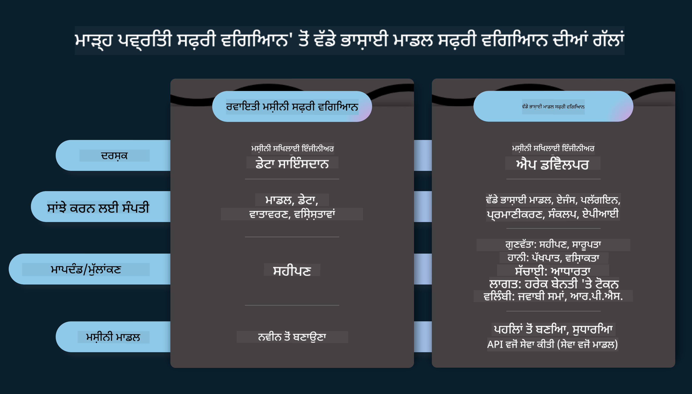
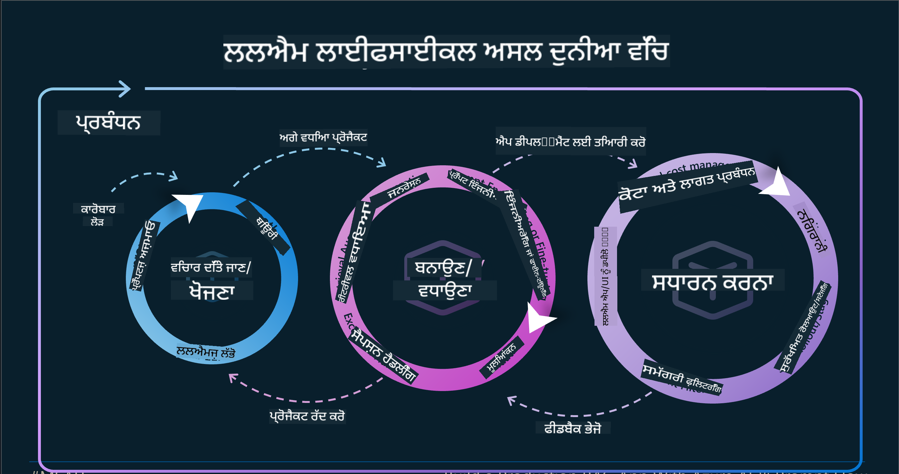
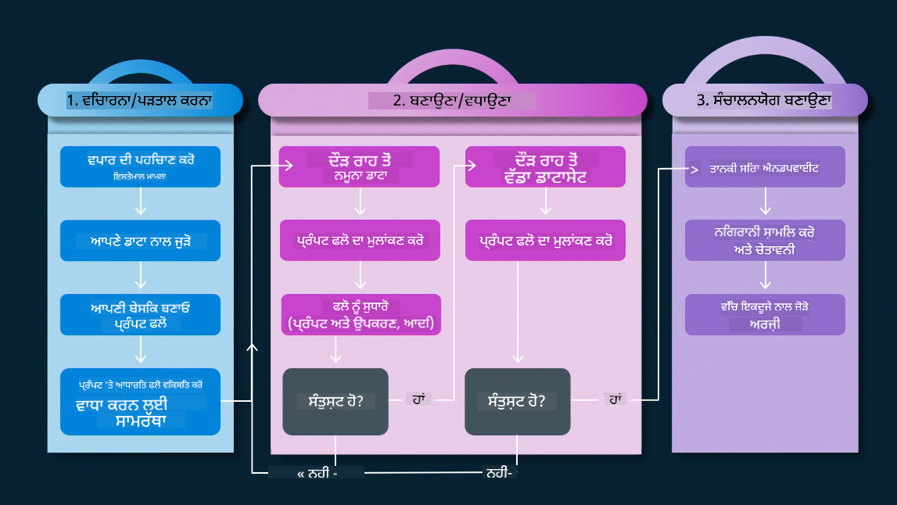
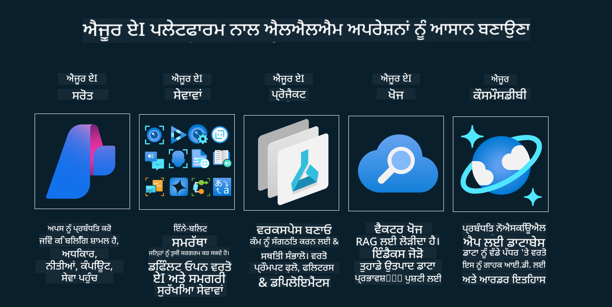
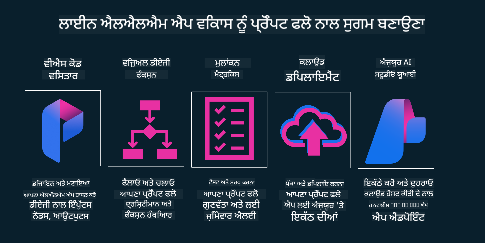

<!--
CO_OP_TRANSLATOR_METADATA:
{
  "original_hash": "27a5347a5022d5ef0a72ab029b03526a",
  "translation_date": "2025-05-19T23:25:05+00:00",
  "source_file": "14-the-generative-ai-application-lifecycle/README.md",
  "language_code": "pa"
}
-->

# ਜਨਰੇਟਿਵ AI ਐਪਲੀਕੇਸ਼ਨ ਲਾਈਫਸਾਈਕਲ

ਸਾਰੇ AI ਐਪਲੀਕੇਸ਼ਨਾਂ ਲਈ ਇੱਕ ਮਹੱਤਵਪੂਰਨ ਸਵਾਲ AI ਵਿਸ਼ੇਸ਼ਤਾਵਾਂ ਦੀ ਅਹਿਮੀਅਤ ਹੈ, ਕਿਉਂਕਿ AI ਇੱਕ ਤੇਜ਼ੀ ਨਾਲ ਵਿਕਾਸਸ਼ੀਲ ਖੇਤਰ ਹੈ। ਇਹ ਯਕੀਨੀ ਬਣਾਉਣ ਲਈ ਕਿ ਤੁਹਾਡੀ ਐਪਲੀਕੇਸ਼ਨ ਸਬੰਧਿਤ, ਭਰੋਸੇਯੋਗ ਅਤੇ ਮਜ਼ਬੂਤ ਰਹਿੰਦੀ ਹੈ, ਤੁਹਾਨੂੰ ਇਸਦੀ ਨਿਰੰਤਰ ਨਿਗਰਾਨੀ, ਮੁਲਾਂਕਣ ਅਤੇ ਸੁਧਾਰ ਕਰਨ ਦੀ ਜ਼ਰੂਰਤ ਹੈ। ਇੱਥੇ ਜਨਰੇਟਿਵ AI ਲਾਈਫਸਾਈਕਲ ਮਦਦ ਕਰਦਾ ਹੈ।

ਜਨਰੇਟਿਵ AI ਲਾਈਫਸਾਈਕਲ ਇੱਕ ਫਰੇਮਵਰਕ ਹੈ ਜੋ ਤੁਹਾਨੂੰ ਜਨਰੇਟਿਵ AI ਐਪਲੀਕੇਸ਼ਨ ਨੂੰ ਵਿਕਸਿਤ, ਤੈਨਾਤ ਅਤੇ ਰੱਖਣ ਦੇ ਮੰਨਿਆਂ ਵਿੱਚ ਲੰਘਣ ਲਈ ਮਦਦ ਕਰਦਾ ਹੈ। ਇਹ ਤੁਹਾਨੂੰ ਆਪਣੇ ਲਕਸ਼ਾਂ ਨੂੰ ਪਰਿਭਾਸ਼ਿਤ ਕਰਨ, ਆਪਣੇ ਪ੍ਰਦਰਸ਼ਨ ਨੂੰ ਮਾਪਣ, ਆਪਣੇ ਚੁਣੌਤੀਆਂ ਦੀ ਪਛਾਣ ਕਰਨ, ਅਤੇ ਆਪਣੇ ਹੱਲਾਂ ਨੂੰ ਲਾਗੂ ਕਰਨ ਵਿੱਚ ਮਦਦ ਕਰਦਾ ਹੈ। ਇਹ ਤੁਹਾਨੂੰ ਆਪਣੇ ਡੋਮੇਨ ਅਤੇ ਆਪਣੇ ਸਟੇਕਹੋਲਡਰਾਂ ਦੇ ਨੈਤਿਕ ਅਤੇ ਕਾਨੂੰਨੀ ਮਿਆਰਾਂ ਨਾਲ ਤੁਹਾਡੀ ਐਪਲੀਕੇਸ਼ਨ ਨੂੰ ਸਮਰਪਿਤ ਕਰਨ ਵਿੱਚ ਵੀ ਮਦਦ ਕਰਦਾ ਹੈ। ਜਨਰੇਟਿਵ AI ਲਾਈਫਸਾਈਕਲ ਦੀ ਪਾਲਣਾ ਕਰਕੇ, ਤੁਸੀਂ ਇਹ ਯਕੀਨੀ ਬਣਾ ਸਕਦੇ ਹੋ ਕਿ ਤੁਹਾਡੀ ਐਪਲੀਕੇਸ਼ਨ ਹਮੇਸ਼ਾਂ ਮੁੱਲ ਪ੍ਰਦਾਨ ਕਰ ਰਹੀ ਹੈ ਅਤੇ ਆਪਣੇ ਉਪਭੋਗਤਾਵਾਂ ਨੂੰ ਸੰਤੁਸ਼ਟ ਕਰ ਰਹੀ ਹੈ।

## ਪਰਿਚਯ

ਇਸ ਅਧਿਆਇ ਵਿੱਚ, ਤੁਸੀਂ:

- MLOps ਤੋਂ LLMOps ਤੱਕ ਪੈਰਾਡਾਇਮ ਸ਼ਿਫਟ ਨੂੰ ਸਮਝੋ
- LLM ਲਾਈਫਸਾਈਕਲ
- ਲਾਈਫਸਾਈਕਲ ਟੂਲਿੰਗ
- ਲਾਈਫਸਾਈਕਲ ਮੈਟ੍ਰਿਕਸ ਅਤੇ ਮੁਲਾਂਕਣ

## MLOps ਤੋਂ LLMOps ਤੱਕ ਪੈਰਾਡਾਇਮ ਸ਼ਿਫਟ ਨੂੰ ਸਮਝੋ

LLMs ਕਲਪਨਾਤਮਕ ਇੰਟੈਲੀਜੈਂਸ ਦੇ ਹਥਿਆਰ ਵਿੱਚ ਇੱਕ ਨਵਾਂ ਟੂਲ ਹਨ, ਇਹ ਐਪਲੀਕੇਸ਼ਨਾਂ ਲਈ ਵਿਸ਼ਲੇਸ਼ਣ ਅਤੇ ਸਿਰਜਣ ਕਾਰਜਾਂ ਵਿੱਚ ਬਹੁਤ ਸ਼ਕਤੀਸ਼ਾਲੀ ਹਨ, ਹਾਲਾਂਕਿ ਇਸ ਸ਼ਕਤੀ ਦਾ ਕੁਝ ਪ੍ਰਭਾਵ ਹੈ ਕਿ ਅਸੀਂ AI ਅਤੇ ਕਲਾਸਿਕ ਮਸ਼ੀਨ ਲਰਨਿੰਗ ਕਾਰਜਾਂ ਨੂੰ ਕਿਵੇਂ ਸਵਰੂਪਬੱਧ ਕਰਦੇ ਹਾਂ।

ਇਸ ਨਾਲ, ਸਾਨੂੰ ਇਸ ਟੂਲ ਨੂੰ ਗਤੀਸ਼ੀਲਤਾ ਵਿੱਚ, ਸਹੀ ਪ੍ਰੇਰਣਾਵਾਂ ਨਾਲ ਅਨੁਕੂਲ ਕਰਨ ਲਈ ਇੱਕ ਨਵਾਂ ਪੈਰਾਡਾਇਮ ਦੀ ਲੋੜ ਹੈ। ਅਸੀਂ ਪੁਰਾਣੇ AI ਐਪਸ ਨੂੰ "ML ਐਪਸ" ਅਤੇ ਨਵੇਂ AI ਐਪਸ ਨੂੰ "GenAI ਐਪਸ" ਜਾਂ ਸਿਰਫ "AI ਐਪਸ" ਵਜੋਂ ਵਰਗਬੱਧ ਕਰ ਸਕਦੇ ਹਾਂ, ਜੋ ਕਿ ਉਸ ਸਮੇਂ ਵਰਤੇ ਜਾਣ ਵਾਲੇ ਮੁੱਖ ਧਾਰਾ ਤਕਨਾਲੋਜੀ ਅਤੇ ਤਕਨੀਕਾਂ ਨੂੰ ਦਰਸਾਉਂਦੇ ਹਨ। ਇਹ ਕਈ ਤਰੀਕਿਆਂ ਵਿੱਚ ਸਾਡੀ ਕਹਾਣੀ ਵਿੱਚ ਬਦਲਾਅ ਲਿਆਉਂਦਾ ਹੈ, ਹੇਠਾਂ ਦਿੱਤੇ ਤੁਲਨਾ ਨੂੰ ਦੇਖੋ।

ਨੋਟ ਕਰੋ ਕਿ LLMOps ਵਿੱਚ, ਅਸੀਂ ਐਪ ਡਿਵੈਲਪਰਾਂ 'ਤੇ ਜ਼ਿਆਦਾ ਧਿਆਨ ਦੇ ਰਹੇ ਹਾਂ, ਇੰਟੀਗ੍ਰੇਸ਼ਨਾਂ ਨੂੰ ਇੱਕ ਮਹੱਤਵਪੂਰਨ ਬਿੰਦੂ ਵਜੋਂ ਵਰਤਦੇ ਹੋਏ, "ਮਾਡਲ-ਇੱਕ-ਸੇਵਾ ਵਜੋਂ" ਵਰਤਦੇ ਹੋਏ ਅਤੇ ਮੈਟ੍ਰਿਕਸ ਲਈ ਹੇਠਾਂ ਦਿੱਤੇ ਬਿੰਦੂਆਂ ਵਿੱਚ ਸੋਚਦੇ ਹੋਏ।

- ਗੁਣਵੱਤਾ: ਜਵਾਬ ਦੀ ਗੁਣਵੱਤਾ
- ਹਾਨੀ: ਜ਼ਿੰਮੇਵਾਰ AI
- ਸੱਚਾਈ: ਜਵਾਬ ਦੀ ਪੁਸ਼ਟੀ (ਕੀ ਇਹ ਸਮਝ ਆਉਂਦਾ ਹੈ? ਕੀ ਇਹ ਸਹੀ ਹੈ?)
- ਲਾਗਤ: ਹੱਲ ਬਜਟ
- ਦੇਰੀ: ਟੋਕਨ ਜਵਾਬ ਲਈ ਔਸਤ ਸਮਾਂ

## LLM ਲਾਈਫਸਾਈਕਲ

ਪਹਿਲਾਂ, ਲਾਈਫਸਾਈਕਲ ਅਤੇ ਸੁਧਾਰਾਂ ਨੂੰ ਸਮਝਣ ਲਈ, ਅਗਲੇ ਇੰਫੋਗ੍ਰਾਫਿਕ ਨੂੰ ਨੋਟ ਕਰੋ।

ਜਿਵੇਂ ਕਿ ਤੁਸੀਂ ਨੋਟ ਕਰ ਸਕਦੇ ਹੋ, ਇਹ MLOps ਤੋਂ ਆਮ ਲਾਈਫਸਾਈਕਲ ਤੋਂ ਵੱਖਰਾ ਹੈ। LLMs ਦੇ ਬਹੁਤ ਸਾਰੇ ਨਵੇਂ ਜ਼ਰੂਰਤਾਂ ਹਨ, ਜਿਵੇਂ ਕਿ ਪ੍ਰੌਮਪਟਿੰਗ, ਗੁਣਵੱਤਾ ਵਿੱਚ ਸੁਧਾਰ ਕਰਨ ਲਈ ਵੱਖ ਵੱਖ ਤਕਨੀਕਾਂ (ਫਾਈਨ-ਟਿਊਨਿੰਗ, RAG, ਮੈਟਾ-ਪ੍ਰੌਮਪਟਸ), ਜ਼ਿੰਮੇਵਾਰ AI ਨਾਲ ਵੱਖਰੇ ਮੁਲਾਂਕਣ ਅਤੇ ਜ਼ਿੰਮੇਵਾਰੀ, ਆਖਿਰਕਾਰ, ਨਵੇਂ ਮੁਲਾਂਕਣ ਮੈਟ੍ਰਿਕਸ (ਗੁਣਵੱਤਾ, ਹਾਨੀ, ਸੱਚਾਈ, ਲਾਗਤ ਅਤੇ ਦੇਰੀ)।

ਉਦਾਹਰਣ ਲਈ, ਇਹ ਦੇਖੋ ਕਿ ਅਸੀਂ ਕਿਵੇਂ ਵਿਚਾਰ ਕਰਦੇ ਹਾਂ। ਵੱਖ-ਵੱਖ LLMs ਨਾਲ ਪ੍ਰਯੋਗ ਕਰਨ ਲਈ ਪ੍ਰੌਮਪਟ ਇੰਜੀਨੀਅਰਿੰਗ ਦੀ ਵਰਤੋਂ ਕਰਦੇ ਹੋਏ ਸੰਭਾਵਨਾਵਾਂ ਦੀ ਪੜਚੋਲ ਕਰਨ ਲਈ ਜਾਂਚ ਕਰਦੇ ਹੋਏ ਕਿ ਕੀ ਉਹਨਾਂ ਦਾ ਪਰਿਕਲਪਨਾ ਸਹੀ ਹੋ ਸਕਦੀ ਹੈ।

ਨੋਟ ਕਰੋ ਕਿ ਇਹ ਰੇਖਿਕ ਨਹੀਂ ਹੈ, ਪਰ ਸਮੁਚਿਤ ਲੂਪਸ, ਦੁਹਰਾਉਣਯੋਗ ਅਤੇ ਇੱਕ ਸਮੁੱਚੀ ਚੱਕਰ ਦੇ ਨਾਲ ਹੈ।

ਅਸੀਂ ਉਹਨਾਂ ਕਦਮਾਂ ਦੀ ਪੜਚੋਲ ਕਿਵੇਂ ਕਰ ਸਕਦੇ ਹਾਂ? ਆਓ ਵਿਸਥਾਰ ਵਿੱਚ ਜਾਵਾਂ ਕਿ ਅਸੀਂ ਇੱਕ ਲਾਈਫਸਾਈਕਲ ਕਿਵੇਂ ਬਣਾਉਂਦੇ ਹਾਂ।

ਇਹ ਕੁਝ ਥੋੜਾ ਜਟਿਲ ਦਿਖਾਈ ਦੇ ਸਕਦਾ ਹੈ, ਆਓ ਪਹਿਲਾਂ ਤਿੰਨ ਵੱਡੇ ਕਦਮਾਂ 'ਤੇ ਧਿਆਨ ਦਿਅਤੇ ਕਰੀਏ।

1. ਵਿਚਾਰਣਾ/ਖੋਜ ਕਰਨਾ: ਖੋਜ, ਇੱਥੇ ਅਸੀਂ ਆਪਣੇ ਕਾਰੋਬਾਰੀ ਜ਼ਰੂਰਤਾਂ ਦੇ ਅਨੁਸਾਰ ਖੋਜ ਕਰ ਸਕਦੇ ਹਾਂ। ਪ੍ਰੋਟੋਟਾਈਪਿੰਗ, ਇੱਕ [ਪ੍ਰੌਮਪਟਫਲੋ](https://microsoft.github.io/promptflow/index.html?WT.mc_id=academic-105485-koreyst) ਬਣਾਉਣਾ ਅਤੇ ਜਾਂਚ ਕਰਨਾ ਕਿ ਕੀ ਇਹ ਸਾਡੇ ਪਰਿਕਲਪਨਾ ਲਈ ਕਾਫੀ ਕੁਸ਼ਲ ਹੈ।
2. ਬਣਾਉਣਾ/ਵਧਾਉਣਾ: ਨਿਵੇਸ਼, ਹੁਣ, ਅਸੀਂ ਵੱਡੇ ਡਾਟਾਸੈਟਾਂ ਲਈ ਮੁਲਾਂਕਣ ਕਰਨਾ ਸ਼ੁਰੂ ਕਰਦੇ ਹਾਂ ਤਕਨੀਕਾਂ ਨੂੰ ਲਾਗੂ ਕਰਨਾ, ਜਿਵੇਂ ਕਿ ਫਾਈਨ-ਟਿਊਨਿੰਗ ਅਤੇ RAG, ਸਾਡੇ ਹੱਲ ਦੀ ਮਜ਼ਬੂਤੀ ਦੀ ਜਾਂਚ ਕਰਨ ਲਈ। ਜੇ ਇਹ ਨਹੀਂ ਹੁੰਦਾ, ਇਸ ਨੂੰ ਮੁੜ-ਲਾਗੂ ਕਰਨਾ, ਸਾਡੇ ਫਲੋ ਵਿੱਚ ਨਵੇਂ ਕਦਮ ਜੋੜਨਾ ਜਾਂ ਡਾਟਾ ਨੂੰ ਮੁੜ-ਸੰਰਚਿਤ ਕਰਨਾ, ਮਦਦ ਕਰ ਸਕਦਾ ਹੈ। ਸਾਡੇ ਫਲੋ ਅਤੇ ਸਾਡੇ ਪੈਮਾਨੇ ਦੀ ਜਾਂਚ ਕਰਨ ਤੋਂ ਬਾਅਦ, ਜੇ ਇਹ ਕੰਮ ਕਰਦਾ ਹੈ ਅਤੇ ਸਾਡੇ ਮੈਟ੍ਰਿਕਸ ਦੀ ਜਾਂਚ ਕਰਦਾ ਹੈ, ਇਹ ਅਗਲੇ ਕਦਮ ਲਈ ਤਿਆਰ ਹੈ।
3. ਕਾਰਗਰੀਕਰਨ: ਇੰਟੀਗ੍ਰੇਸ਼ਨ, ਹੁਣ ਸਾਡੇ ਸਿਸਟਮ ਵਿੱਚ ਨਿਗਰਾਨੀ ਅਤੇ ਚੇਤਾਵਨੀ ਸਿਸਟਮ ਜੋੜਨਾ, ਡਿਪਲੋਯਮੈਂਟ ਅਤੇ ਐਪਲੀਕੇਸ਼ਨ ਇੰਟੀਗ੍ਰੇਸ਼ਨ ਸਾਡੇ ਐਪਲੀਕੇਸ਼ਨ ਵਿੱਚ।

ਫਿਰ, ਸੁਰੱਖਿਆ, ਅਨੁਕੂਲਤਾ ਅਤੇ ਸ਼ਾਸਨ 'ਤੇ ਧਿਆਨ ਕੇਂਦਰਤ ਕਰਦੇ ਹੋਏ ਪ੍ਰਬੰਧਨ ਦਾ ਸਮੁੱਚੀ ਚੱਕਰ ਹੈ।

ਵਧਾਈਆਂ, ਹੁਣ ਤੁਹਾਡਾ AI ਐਪ ਤਿਆਰ ਹੈ ਅਤੇ ਕਾਰਗਰੀ ਹੈ। ਹੱਥ-ਉੱਤੇ ਅਨੁਭਵ ਲਈ, [ਕੋਂਟੋਸੋ ਚੈਟ ਡੈਮੋ](https://nitya.github.io/contoso-chat/?WT.mc_id=academic-105485-koreys) 'ਤੇ ਨਜ਼ਰ ਮਾਰੋ।

ਹੁਣ, ਅਸੀਂ ਕਿਹੜੇ ਟੂਲਾਂ ਦੀ ਵਰਤੋਂ ਕਰ ਸਕਦੇ ਹਾਂ?

## ਲਾਈਫਸਾਈਕਲ ਟੂਲਿੰਗ

ਟੂਲਿੰਗ ਲਈ, ਮਾਇਕਰੋਸਾਫਟ [Azure AI ਪਲੇਟਫਾਰਮ](https://azure.microsoft.com/solutions/ai/?WT.mc_id=academic-105485-koreys) ਅਤੇ [ਪ੍ਰੌਮਪਟਫਲੋ](https://microsoft.github.io/promptflow/index.html?WT.mc_id=academic-105485-koreyst) ਪ੍ਰਦਾਨ ਕਰਦਾ ਹੈ, ਜੋ ਤੁਹਾਡੇ ਚੱਕਰ ਨੂੰ ਲਾਗੂ ਕਰਨ ਲਈ ਆਸਾਨ ਅਤੇ ਤਿਆਰ ਬਣਾਉਂਦਾ ਹੈ।

[Azure AI ਪਲੇਟਫਾਰਮ](https://azure.microsoft.com/solutions/ai/?WT.mc_id=academic-105485-koreys), ਤੁਹਾਨੂੰ [AI ਸਟੂਡੀਓ](https://ai.azure.com/?WT.mc_id=academic-105485-koreys) ਵਰਤਣ ਦੀ ਆਗਿਆ ਦਿੰਦਾ ਹੈ। AI ਸਟੂਡੀਓ ਇੱਕ ਵੈਬ ਪੋਰਟਲ ਹੈ ਜੋ ਤੁਹਾਨੂੰ ਮਾਡਲਾਂ, ਨਮੂਨੇ ਅਤੇ ਟੂਲਾਂ ਦੀ ਪੜਚੋਲ ਕਰਨ ਦੀ ਆਗਿਆ ਦਿੰਦਾ ਹੈ। ਤੁਹਾਡੇ ਸਰੋਤਾਂ, UI ਵਿਕਾਸ ਫਲੋ ਅਤੇ SDK/CLI ਵਿਕਲਪਾਂ ਨੂੰ ਕੋਡ-ਪਹਿਲਾਂ ਵਿਕਾਸ ਲਈ ਪ੍ਰਬੰਧਿਤ ਕਰਨਾ।

Azure AI, ਤੁਹਾਨੂੰ ਕਈ ਸਰੋਤਾਂ ਦੀ ਵਰਤੋਂ ਕਰਨ ਦੀ ਆਗਿਆ ਦਿੰਦਾ ਹੈ, ਆਪਣੇ ਕਾਰਗਰੀ, ਸੇਵਾਵਾਂ, ਪ੍ਰੋਜੈਕਟਾਂ, ਵੇਕਟਰ ਖੋਜ ਅਤੇ ਡੇਟਾਬੇਸ ਦੀਆਂ ਜ਼ਰੂਰਤਾਂ ਨੂੰ ਪ੍ਰਬੰਧਿਤ ਕਰਨ ਲਈ।

ਪ੍ਰੌਮਪਟਫਲੋ ਨਾਲ ਸਬੂਤ-ਅਵਧਾਰਨਾ (POC) ਤੋਂ ਵੱਡੇ ਪੈਮਾਨੇ ਦੀਆਂ ਐਪਲੀਕੇਸ਼ਨਾਂ ਤੱਕ ਬਣਾਉ:

- ਵਿਜੁਅਲ ਅਤੇ ਫੰਕਸ਼ਨਲ ਟੂਲਾਂ ਨਾਲ VS ਕੋਡ ਤੋਂ ਐਪਸ ਡਿਜ਼ਾਈਨ ਅਤੇ ਬਣਾਉ
- ਸੌਖਾ ਨਾਲ, ਗੁਣਵੱਤਾ AI ਲਈ ਆਪਣੇ ਐਪਸ ਦੀ ਜਾਂਚ ਅਤੇ ਸੁਧਾਰ ਕਰੋ।
- ਕਲਾਉਡ ਨਾਲ ਇੰਟੀਗ੍ਰੇਟ ਅਤੇ ਦੁਹਰਾਉਣ ਲਈ Azure AI ਸਟੂਡੀਓ ਦੀ ਵਰਤੋਂ ਕਰੋ, ਤੇਜ਼ ਇੰਟੀਗ੍ਰੇਸ਼ਨ ਲਈ ਪੁਸ਼ ਅਤੇ ਡਿਪਲੋਯ ਕਰੋ।

## ਵਧੀਆ! ਆਪਣਾ ਸਿਖਿਆਰਥੀ ਜਾਰੀ ਰੱਖੋ!

ਸ਼ਾਨਦਾਰ, ਹੁਣ ਇਹ ਸਿੱਖੋ ਕਿ ਅਸੀਂ ਕਿਸ ਤਰੀਕੇ ਨਾਲ ਇੱਕ ਐਪਲੀਕੇਸ਼ਨ ਬਣਾਉਂਦੇ ਹਾਂ ਜੋ [ਕੋਂਟੋਸੋ ਚੈਟ ਐਪ](https://nitya.github.io/contoso-chat/?WT.mc_id=academic-105485-koreyst) ਦੇ ਨਾਲ ਸੰਕਲਪਾਂ ਦੀ ਵਰਤੋਂ ਕਰਦਾ ਹੈ, ਜਾਂਚ ਕਰਨ ਲਈ ਕਿ ਕਲਾਉਡ ਐਡਵੋਕੇਸੀ ਉਹ ਸੰਕਲਪ ਡੈਮੋ ਵਿੱਚ ਕਿਵੇਂ ਜੋੜਦਾ ਹੈ। ਹੋਰ ਸਮਗਰੀ ਲਈ, ਸਾਡਾ [ਇਗਨਾਈਟ ਬ੍ਰੇਕਆਊਟ ਸੈਸ਼ਨ](https://www.youtube.com/watch?v=DdOylyrTOWg) ਦੇਖੋ!

ਹੁਣ, ਪਾਠ 15 ਦੀ ਜਾਂਚ ਕਰੋ, ਸਮਝਣ ਲਈ ਕਿ [ਪ੍ਰਾਪਤੀ ਵਧਾਉਣ ਵਾਲੀ ਸਿਰਜਣ ਅਤੇ ਵੇਕਟਰ ਡੇਟਾਬੇਸ](../15-rag-and-vector-databases/README.md?WT.mc_id=academic-105485-koreyst) ਜਨਰੇਟਿਵ AI 'ਤੇ ਕਿਵੇਂ ਪ੍ਰਭਾਵਿਤ ਕਰਦੇ ਹਨ ਅਤੇ ਹੋਰ ਦਿਲਚਸਪ ਐਪਲੀਕੇਸ਼ਨ ਬਣਾਉਣ ਲਈ!

**ਅਸਵੀਕਾਰਯੋਗ**:  
ਇਹ ਦਸਤਾਵੇਜ਼ AI ਅਨੁਵਾਦ ਸੇਵਾ [Co-op Translator](https://github.com/Azure/co-op-translator) ਦੀ ਵਰਤੋਂ ਕਰਕੇ ਅਨੁਵਾਦ ਕੀਤਾ ਗਿਆ ਹੈ। ਜਦੋਂ ਕਿ ਅਸੀਂ ਸਹੀ ਹੋਣ ਦੀ ਕੋਸ਼ਿਸ਼ ਕਰਦੇ ਹਾਂ, ਕਿਰਪਾ ਕਰਕੇ ਸਾਵਧਾਨ ਰਹੋ ਕਿ ਸਵੈਚਾਲਿਤ ਅਨੁਵਾਦਾਂ ਵਿੱਚ ਗਲਤੀਆਂ ਜਾਂ ਅਸੰਗਤੀਆਂ ਹੋ ਸਕਦੀਆਂ ਹਨ। ਇਸਦੀ ਮੂਲ ਭਾਸ਼ਾ ਵਿੱਚ ਮੌਜੂਦ ਮੂਲ ਦਸਤਾਵੇਜ਼ ਨੂੰ ਅਧਿਕਾਰਕ ਸਰੋਤ ਮੰਨਿਆ ਜਾਣਾ ਚਾਹੀਦਾ ਹੈ। ਮਹੱਤਵਪੂਰਨ ਜਾਣਕਾਰੀ ਲਈ, ਪੇਸ਼ੇਵਰ ਮਨੁੱਖੀ ਅਨੁਵਾਦ ਦੀ ਸਿਫਾਰਸ਼ ਕੀਤੀ ਜਾਂਦੀ ਹੈ। ਅਸੀਂ ਇਸ ਅਨੁਵਾਦ ਦੀ ਵਰਤੋਂ ਤੋਂ ਪੈਦਾ ਹੋਣ ਵਾਲੇ ਕਿਸੇ ਵੀ ਗਲਤਫਹਿਮੀ ਜਾਂ ਗਲਤ ਵਿਆਖਿਆ ਲਈ ਜ਼ਿੰਮੇਵਾਰ ਨਹੀਂ ਹਾਂ।