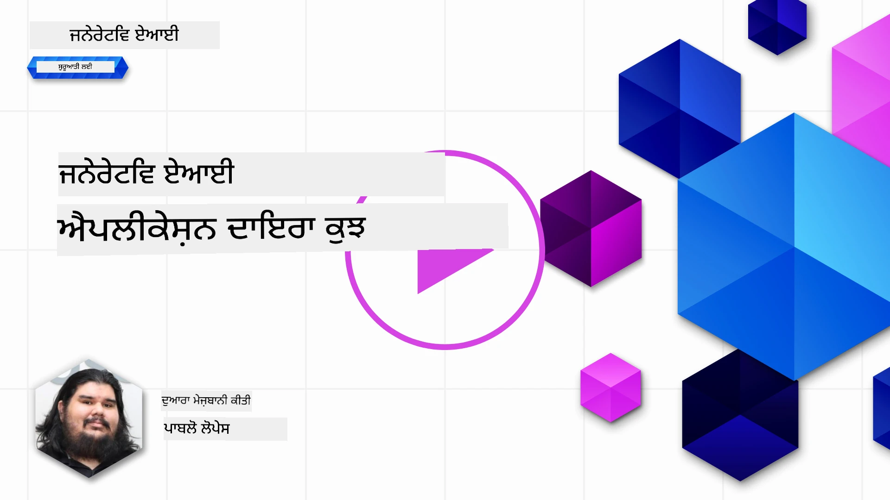
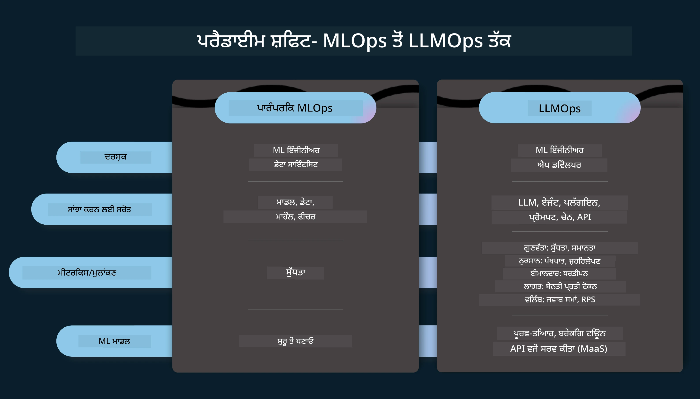
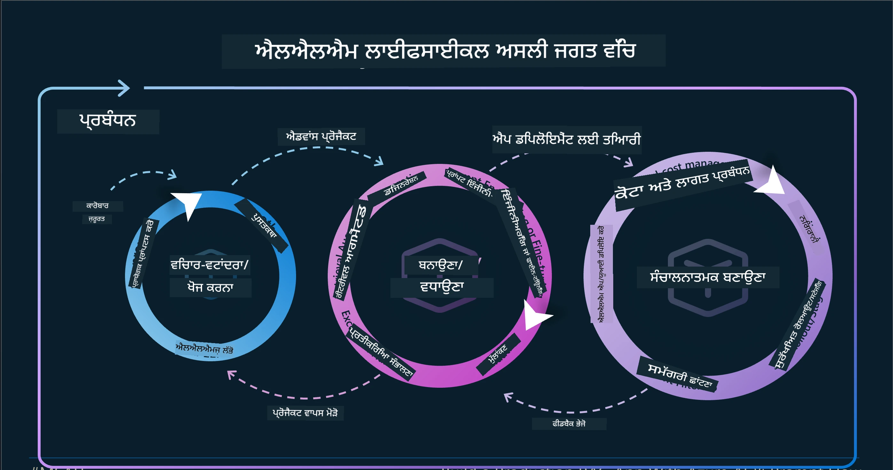
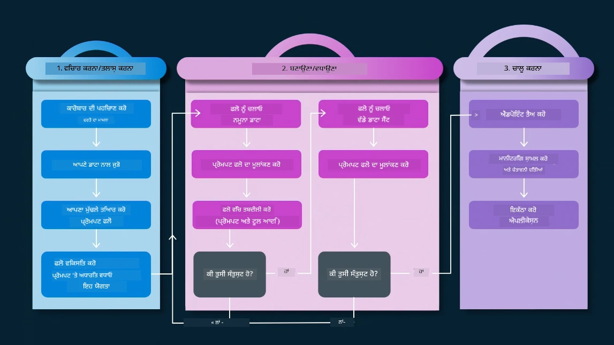
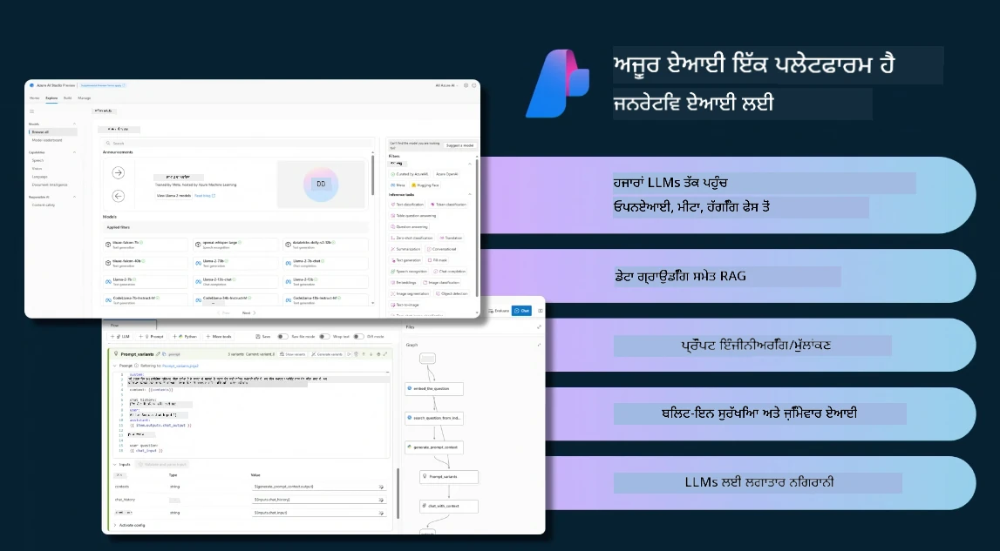
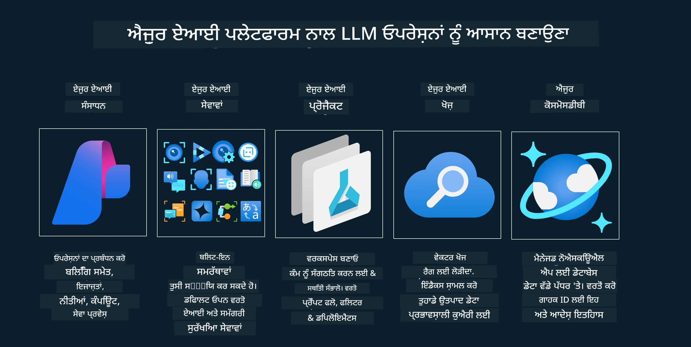
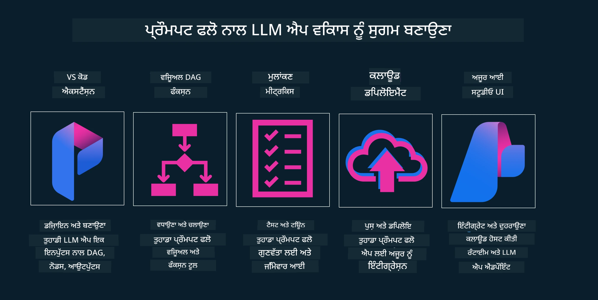

# ਜਨਰੇਟਿਵ ਏਆਈ ਐਪਲੀਕੇਸ਼ਨ ਲਾਈਫਸਾਈਕਲ

ਸਾਰੇ ਏਆਈ ਐਪਲੀਕੇਸ਼ਨਾਂ ਲਈ ਇੱਕ ਮਹੱਤਵਪੂਰਨ ਸਵਾਲ ਹੈ ਏਆਈ ਵਿਸ਼ੇਸ਼ਤਾਵਾਂ ਦੀ ਪ੍ਰਸੰਗਿਕਤਾ, ਕਿਉਂਕਿ ਏਆਈ ਇੱਕ ਤੇਜ਼ੀ ਨਾਲ ਵਿਕਸਿਤ ਹੋਣ ਵਾਸਤਾ ਖੇਤਰ ਹੈ, ਇਹ ਯਕੀਨੀ ਬਣਾਉਣ ਲਈ ਕਿ ਤੁਹਾਡੀ ਐਪਲੀਕੇਸ਼ਨ ਪ੍ਰਸੰਗਿਕ, ਭਰੋਸੇਮੰਦ ਅਤੇ ਮਜ਼ਬੂਤ ਰਹੇ, ਤੁਹਾਨੂੰ ਇਸ ਦੀ ਲਗਾਤਾਰ ਨਿਗਰਾਨੀ, ਮੂਲਾਂਕਣ ਅਤੇ ਸੁਧਾਰ ਕਰਨਾ ਜ਼ਰੂਰੀ ਹੈ। ਇੱਥੇ ਜਨਰੇਟਿਵ ਏਆਈ ਲਾਈਫਸਾਈਕਲ ਦਾ ਕਿਰਦਾਰ ਆਉਂਦਾ ਹੈ।

ਜਨਰੇਟਿਵ ਏਆਈ ਲਾਈਫਸਾਈਕਲ ਇੱਕ ਫਰੇਮਵਰਕ ਹੈ ਜੋ ਤੁਹਾਨੂੰ ਇੱਕ ਜਨਰੇਟਿਵ ਏਆਈ ਐਪਲੀਕੇਸ਼ਨ ਬਣਾਉਣ, ਤੈਨਾਤ ਕਰਨ ਅਤੇ ਸੰਭਾਲਣ ਦੇ ਚਰਣਾਂ ਰਾਹੀਂ ਗਾਈਡ ਕਰਦਾ ਹੈ। ਇਹ ਤੁਹਾਨੂੰ ਆਪਣੇ ਲਕੜਾਂ ਨੂੰ ਪਰਿਭਾਸ਼ਿਤ ਕਰਨ, ਆਪਣੇ ਪ੍ਰਦਰਸ਼ਨ ਨੂੰ ਮਾਪਣ, ਆਪਣੀਆਂ ਚੁਣੌਤੀਆਂ ਦੀ ਪਛਾਣ ਕਰਨ ਅਤੇ ਆਪਣੇ ਹੱਲ ਲਾਗੂ ਕਰਨ ਵਿੱਚ ਸਹਾਇਤਾ ਕਰਦਾ ਹੈ। ਇਹ ਤੁਹਾਨੂੰ ਆਪਣੇ ਐਪਲੀਕੇਸ਼ਨ ਨੂੰ ਆਪਣੇ ਖੇਤਰ ਅਤੇ ਆਪਣੇ ਹਿੱਸੇਦਾਰਾਂ ਦੀ ਨੈਤਿਕ ਅਤੇ ਕਾਨੂੰਨੀ ਮਿਆਰਾਂ ਨਾਲ ਮਿਲਾਉਣ ਵਿੱਚ ਵੀ ਸਹਾਇਤਾ ਕਰਦਾ ਹੈ। ਜਨਰੇਟਿਵ ਏਆਈ ਲਾਈਫਸਾਈਕਲ ਦੀ ਪਾਲਣਾ ਕਰਕੇ, ਤੁਸੀਂ ਇਹ ਯਕੀਨੀ ਬਣਾ ਸਕਦੇ ਹੋ ਕਿ ਤੁਹਾਡੀ ਐਪਲੀਕੇਸ਼ਨ ਸਦਾ ਮੁੱਲ ਦੇ ਰਹੀ ਹੈ ਅਤੇ ਆਪਣੇ ਉਪਭੋਗਤਾਵਾਂ ਨੂੰ ਸੰਤੁਸ਼ਟ ਕਰ ਰਹੀ ਹੈ।

## ਜਾਣੂ

ਇਸ ਅਧਿਆਇ ਵਿੱਚ, ਤੁਸੀਂ:

- MLOps ਤੋਂ LLMOps ਵੱਲ ਪੈਰਾਡਾਈਮ ਵਿੱਚ ਤਬਦੀਲੀ ਨੂੰ ਸਮਝੋਗੇ
- LLM ਲਾਈਫਸਾਈਕਲ
- ਲਾਈਫਸਾਈਕਲ ਟੂਲਿੰਗ
- ਲਾਈਫਸਾਈਕਲ ਮੈਟਰਿਫਿਕੇਸ਼ਨ ਅਤੇ ਮੁਲਾਂਕਣ

## MLOps ਤੋਂ LLMOps ਵੱਲ ਪੈਰਾਡਾਈਮ ਤਬਦੀਲੀ ਨੂੰ ਸਮਝੋ

LLM ਕ੍ਰਿਤੀਮ ਬੁੱਧੀ ਦੇ ਹਥਿਆਰ ਵਿੱਚ ਇਕ ਨਵਾਂ ਸੰਦ ਹਨ, ਇਹ ਐਪਲੀਕੇਸ਼ਨਾਂ ਲਈ ਵਿਸ਼ਲੇਸ਼ਣ ਅਤੇ ਉਤਪਾਦਨ ਕਾਰਜਾਂ ਵਿੱਚ ਬੇਹੱਦ ਸ਼ਕਤੀਸ਼ਾਲੀ ਹਨ, ਹਾਲਾਂਕਿ ਇਸ ਸ਼ਕਤੀ ਦੇ ਕੁਝ ਨਤੀਜੇ ਹਨ ਜਿਵੇਂ ਕਿ ਅਸੀਂ ਏਆਈ ਅਤੇ ਕਲਾਸਿਕ ਮਸ਼ੀਨ ਲਰਨਿੰਗ ਕਾਰਜਾਂ ਨੂੰ ਸੰਗਠਿਤ ਕਰਦੇ ਹਾਂ।

ਇਸ ਲਈ, ਸਾਨੂੰ ਇਸ ਸੰਦ ਨੂੰ ਗਤੀਸ਼ੀਲ ਢੰਗ ਨਾਲ ਅਨੁਕੂਲਿਤ ਕਰਨ ਲਈ ਇਕ ਨਵਾਂ ਪੈਰਾਡਾਈਮ ਲੋੜੀਂਦਾ ਹੈ, ਜਿੱਥੇ ਸਹੀ ਪ੍ਰੋਤਸਾਹਨ ਹੋਵੇ। ਅਸੀਂ ਪੁਰਾਣੀਆਂ ਏਆਈ ਐਪਸ ਨੂੰ "ਐਮਐਲ ਐਪਸ" ਅਤੇ ਨਵੀਆਂ ਏਆਈ ਐਪਸ ਨੂੰ "ਜੈਨਏਆਈ ਐਪਸ" ਜਾਂ ਸਿਰਫ "ਏਆਈ ਐਪਸ" ਵਜੋਂ ਵਰਗੀਕ੍ਰਿਤ ਕਰ ਸਕਦੇ ਹਾਂ, ਜੋ ਮੈਨਸਟਰੀਮ ਤਕਨੀਕਾਂ ਅਤੇ ਤਕਨੀਕੀ ਤਰੀਕਿਆਂ ਨੂੰ ਦਰਸਾਉਂਦੇ ਹਨ। ਇਸ ਨਾਲ ਸਾਡੀ ਕਹਾਣੀ ਕਈ ਤਰੀਕਿਆਂ ਵਿੱਚ ਤਬਦੀਲ ਹੁੰਦੀ ਹੈ, ਹੇਠਾਂ ਦਿੱਤੇ ਮੁਕਾਬਲੇ 'ਤੇ ਧਿਆਨ ਦਿਓ।

ਧਿਆਨ ਦਿਓ ਕਿ LLMOps ਵਿੱਚ ਅਸੀਂ ਐਪ ਡਿਵੈਲਪਰਾਂ 'ਤੇ ਵੱਧ ਧਿਆਨ ਕੇਂਦਰਿਤ ਕਰਦੇ ਹਾਂ, ਇੰਟੀਗ੍ਰੇਸ਼ਨਾਂ ਨੂੰ ਮੁੱਖ ਬਿੰਦੂ ਵਜੋਂ ਵਰਤਦੇ ਹਾਂ, "ਮੌਡਲਜ਼-ਐਜ਼-ਏ-ਸਰਵਿਸ" ਅਤੇ ਮੈਟਰਿਕਸ ਲਈ ਹੇਠਾਂ ਦਿੱਤੇ ਬਿੰਦੂਆਂ 'ਤੇ ਸੋਚਦੇ ਹਾਂ।

- ਗੁਣਵੱਤਾ: ਪ੍ਰਤਿਕਿਰਿਆ ਦੀ ਗੁਣਵੱਤਾ
- ਨੁਕਸਾਨ: ਜ਼ਿੰਮੇਵਾਰ ਏਆਈ
- ਸੱਚਾਈ: ਪ੍ਰਤਿਕਿਰਿਆ ਦਾ ਅਧਾਰ (ਮੰਨਦਾ ਹੈ? ਕੀ ਇਹ ਸਹੀ ਹੈ?)
- ਲਾਗਤ: ਹੱਲ ਦਾ ਬਜਟ
- ਦੇਰੀ: ਟੋਕਨ ਪ੍ਰਤਿਕਿਰਿਆ ਦਾ ਔਸਤ ਸਮਾਂ

## LLM ਲਾਈਫਸਾਈਕਲ

ਸਭ ਤੋਂ ਪਹਿਲਾਂ, ਲਾਈਫਸਾਈਕਲ ਅਤੇ ਸੋਧਨ ਸਮਝਣ ਲਈ, ਅਗਲੇ ਇਨਫੋਗ੍ਰਾਫਿਕ 'ਤੇ ਨਜ਼ਰ ਮਾਰੋ।

ਜਿਵੇਂ ਤੁਹਾਨੂੰ ਨਜ਼ਰ ਆ ਸਕਦਾ ਹੈ, ਇਹ ਆਮ MLOps ਲਾਈਫਸਾਈਕਲ ਤੋਂ ਵੱਖਰਾ ਹੈ। LLM ਵਿੱਚ ਕਈ ਨਵੇਂ ਲੋੜਾਂ ਹਨ, ਜਿਵੇਂ ਕਿ ਪ੍ਰਾਂਪਟਿੰਗ, ਗੁਣਵੱਤਾ ਸੁਧਾਰ ਲਈ ਵੱਖ-ਵੱਖ ਤਕਨੀਕਾਂ (ਫਾਈਨ-ਟਿਊਨਿੰਗ, RAG, ਮੈਟਾ-ਪ੍ਰਾਂਪਟਸ), ਜ਼ਿੰਮੇਵਾਰ ਏਆਈ ਨਾਲ ਵੱਖਰਾ ਮੁਲਾਂਕਣ ਅਤੇ ਜ਼ਿੰਮੇਵਾਰੀ, ਆਖਰੀ ਵਿੱਚ ਨਵੇਂ ਮੁਲਾਂਕਣ ਮੈਟਰਿਕਸ (ਗੁਣਵੱਤਾ, ਨੁਕਸਾਨ, ਸੱਚਾਈ, ਲਾਗਤ ਅਤੇ ਦੇਰੀ)।

ਉਦਾਹਰਨ ਵਜੋਂ, ਵੇਖੋ ਕਿ ਅਸੀਂ ਕਿਵੇਂ ਵਿਚਾਰ ਕਰਦੇ ਹਾਂ। ਵੱਖ-ਵੱਖ LLMs ਨਾਲ ਪ੍ਰਾਂਪਟ ਇੰਜੀਨੀਅਰਿੰਗ ਦੀ ਵਰਤੋਂ ਕਰਕੇ ਸੰਭਾਵਨਾਵਾਂ ਦੀ ਖੋਜ ਕਰਦੇ ਹਾਂ ਕਿ ਉਹਨਾਂ ਦਾ ਹਿਪੋਥੇਸਿਸ ਸਹੀ ਹੋ ਸਕਦਾ ਹੈ ਜਾਂ ਨਹੀਂ।

ਧਿਆਨ ਦਿਓ ਕਿ ਇਹ ਰੇਖੀ ਨਹੀਂ ਹੈ, ਸਗੋਂ ਇਕੱਠੇ ਲੂਪ, ਦੁਹਰਾਵਾਂ ਅਤੇ ਇੱਕ ਪ੍ਰਭਾਵਸ਼ਾਲੀ ਸਾਈਕਲ ਹਨ।

ਅਸੀਂ ਇਨ੍ਹਾਂ ਕਦਮਾਂ ਦੀ ਖੋਜ ਕਿਵੇਂ ਕਰ ਸਕਦੇ ਹਾਂ? ਚਲੋ ਵੇਖੀਏ ਕਿ ਅਸੀਂ ਲਾਈਫਸਾਈਕਲ ਕਿਵੇਂ ਬਣਾਉਂਦੇ ਹਾਂ।

ਇਹ ਥੋੜ੍ਹਾ ਜਟਿਲ ਲੱਗ ਸਕਦਾ ਹੈ, ਚਲੋ ਸਭ ਤੋਂ ਪਹਿਲਾਂ ਤਿੰਨ ਵੱਡੇ ਕਦਮਾਂ ਉੱਤੇ ਧਿਆਨ ਦੇਈਏ।

1. ਵਿਚਾਰਧਾਰਾ/ਖੋਜ: ਖੋਜ, ਇੱਥੇ ਅਸੀਂ ਆਪਣੇ ਵਪਾਰਕ ਜ਼ਰੂਰਤਾਂ ਦੇ ਅਨੁਸਾਰ ਖੋਜ ਕਰ ਸਕਦੇ ਹਾਂ। ਪ੍ਰੋਟੋਟਾਇਪਿੰਗ, ਇੱਕ [PromptFlow](https://microsoft.github.io/promptflow/index.html?WT.mc_id=academic-105485-koreyst) ਬਣਾਉਣਾ ਅਤੇ ਜਾਚਣਾ ਕਿ ਕੀ ਇਹ ਸਾਡੇ ਹਿਪੋਥੇਸਿਸ ਲਈ ਕਾਫ਼ੀ ਪ੍ਰਭਾਵਸ਼ালী ਹੈ।
1. ਬਣਾਉਣਾ/ਵਧਾਉਣਾ: ਲਾਗੂ ਕਰਨਾ, ਹੁਣ ਅਸੀਂ ਵੱਡੇ ਡੇਟਾਸੈੱਟ ਲਈ ਮੁਲਾਂਕਣ ਸ਼ੁਰੂ ਕਰਦੇ ਹਾਂ, ਫਾਈਨ-ਟਿਊਨਿੰਗ ਅਤੇ RAG ਵਰਗੀਆਂ ਤਕਨੀਕਾਂ ਲਾਗੂ ਕਰਦੇ ਹਾਂ ਤਾਂ ਜੋ ਸਾਡੇ ਹੱਲ ਦੀ ਮਜ਼ਬੂਤੀ ਦੀ ਜਾਂਚ ਕਰ ਸਕੀਏ। ਜੇ ਇਹ ਕੰਮ ਨਹੀਂ ਕਰਦਾ, ਤਾਂ ਦੁਬਾਰਾ ਲਾਗੂ ਕਰਨਾ, ਆਪਣੇ ਪ੍ਰਵਾਹ ਵਿੱਚ ਨਵੇਂ ਕਦਮ ਸ਼ਾਮਲ ਕਰਨਾ ਜਾਂ ਡੇਟਾ ਨੂੰ ਦੁਬਾਰਾ ਸੰਰਚਿਤ ਕਰਨਾ ਮਦਦਗਾਰ ਹੋ ਸਕਦਾ ਹੈ। ਸਾਡੇ ਪ੍ਰਵਾਹ ਅਤੇ ਪੈਮਾਨੇ ਦੀ ਜਾਂਚ ਕਰਨ ਤੋਂ ਬਾਅਦ, ਜੇ ਇਹ ਕਾਰਗਰ ਹੈ ਅਤੇ ਸਾਡੇ ਮੈਟਰਿਕਸ ਨੂੰ ਪੂਰਾ ਕਰਦਾ ਹੈ, ਤਾਂ ਇਹ ਅਗਲੇ ਕਦਮ ਲਈ ਤਿਆਰ ਹੈ।
1. ਚਾਲੂ ਕਰਨਾ: ਇੰਟੀਗ੍ਰੇਸ਼ਨ, ਹੁਣ ਮਾਨੀਟਰਿੰਗ ਅਤੇ ਅਲਰਟ ਸਿਸਟਮ ਜੋੜ ਕੇ ਸਾਡੇ ਸਿਸਟਮ ਨੂੰ ਤੈਨਾਤ ਅਤੇ ਐਪਲੀਕੇਸ਼ਨ ਨਾਲ ਜੋੜਨਾ।

ਫਿਰ, ਸੁਰੱਖਿਆ, ਅਨੁਕੂਲਤਾ ਅਤੇ ਸ਼ਾਸਨ 'ਤੇ ਧਿਆਨ ਕੇਂਦਰਿਤ ਕਰਦੇ ਹੋਏ ਪ੍ਰਭਾਵਸ਼ਾਲੀ ਪ੍ਰਬੰਧਨ ਦਾ ਸਾਈਕਲ ਹੈ।

ਵਧਾਈਆਂ, ਹੁਣ ਤੁਹਾਡੀ ਏਆਈ ਐਪ ਤਿਆਰ ਹੈ ਅਤੇ ਚਾਲੂ ਕਰਨ ਲਈ ਕਾਇਮ ਹੈ। ਇੱਕ ਹੱਥ-ਅਨੁਭਵ ਲਈ, [Contoso ਚੈਟ ਡੈਮੋ](https://nitya.github.io/contoso-chat/?WT.mc_id=academic-105485-koreyst) 'ਤੇ ਨਜ਼ਰ ਮਾਰੋ।

ਹੁਣ, ਅਸੀਂ ਕਿਹੜੇ ਟੂਲ ਵਰਤ ਸਕਦੇ ਹਾਂ?

## ਲਾਈਫਸਾਈਕਲ ਟੂਲਿੰਗ

ਟੂਲਿੰਗ ਲਈ, ਮਾਇਕ੍ਰੋਸੌਫਟ [Azure AI Platform](https://azure.microsoft.com/solutions/ai/?WT.mc_id=academic-105485-koreyst) ਅਤੇ [PromptFlow](https://microsoft.github.io/promptflow/index.html?WT.mc_id=academic-105485-koreyst) ਤੁਹਾਡੇ ਸਾਈਕਲ ਨੂੰ ਲਾਗੂ ਕਰਨਾ ਆਸਾਨ ਅਤੇ ਤਿਆਰ ਕਰਨ ਵਿੱਚ ਮਦਦ ਕਰਦੇ ਹਨ।

[Azure AI Platform](https://azure.microsoft.com/solutions/ai/?WT.mc_id=academic-105485-koreyst) ਤੁਹਾਨੂੰ [AI Studio](https://ai.azure.com/?WT.mc_id=academic-105485-koreyst) ਦੀ ਵਰਤੋਂ ਕਰਨ ਦੀ ਆਗਿਆ ਦਿੰਦਾ ਹੈ। ਏਆਈ ਸਟੂਡੀਓ ਇੱਕ ਵੈੱਬ ਪੋਰਟਲ ਹੈ ਜੋ ਤੁਹਾਨੂੰ ਮੌਡਲ, ਨਮੂਨੇ ਅਤੇ ਟੂਲ ਵੇਖਣ ਦਾ ਮੌਕਾ ਦਿੰਦਾ ਹੈ। ਆਪਣੇ ਸਰੋਤਾਂ ਦਾ ਪ੍ਰਬੰਧਨ, UI ਵਿਕਾਸ ਪ੍ਰਵਾਹਾਂ, ਅਤੇ ਕੋਡ-ਫਰਸਟ ਵਿਕਾਸ ਲਈ SDK/CLI ਵਿਕਲਪ।

Azure AI ਤੁਹਾਨੂੰ ਕਈ ਸਰੋਤਾਂ ਦੀ ਵਰਤੋਂ ਕਰਨ ਦੀ ਆਗਿਆ ਦਿੰਦਾ ਹੈ, ਤਾਂ ਜੋ ਤੁਹਾਡੇ ਓਪਰੇਸ਼ਨ, ਸਰਵਿਸਾਂ, ਪ੍ਰੋਜੈਕਟ, ਵੇਕਟਰ ਖੋਜ ਅਤੇ ਡੇਟਾਬੇਸ ਦੀਆਂ ਜ਼ਰੂਰਤਾਂ ਦਾ ਪ੍ਰਬੰਧਨ ਕਰ ਸਕੋ।

ਪ੍ਰੂਫ-ਆਫ-ਕਾਂਸਪਟ (POC) ਤੋਂ ਸ਼ੁਰੂ ਕਰਕੇ ਵੱਡੇ ਪੈਮਾਨੇ ਦੀਆਂ ਐਪਲੀਕੇਸ਼ਨਾਂ ਤੱਕ PromptFlow ਨਾਲ ਬਣਾਓ:

- VS ਕੋਡ ਤੋਂ ਐਪਸ ਡਿਜ਼ਾਇਨ ਅਤੇ ਬਣਾਓ, ਵਿਜ਼ੂਅਲ ਅਤੇ ਕਾਰਜਕਾਰੀ ਟੂਲਾਂ ਨਾਲ
- ਆਪਣੀਆਂ ਐਪਾਂ ਨੂੰ ਗੁਣਵੱਤਾ ਵਾਲੀ ਏਆਈ ਲਈ ਟੈਸਟ ਅਤੇ ਫਾਈਨ-ਟਿਊਨ ਕਰੋ, ਆਸਾਨੀ ਨਾਲ।
- ਤੇਜ਼ ਇੰਟੀਗ੍ਰੇਸ਼ਨ ਲਈ ਕਲਾਊਡ ਨਾਲ ਏਜ਼ਯੂਰ ਏਆਈ ਸਟੂਡੀਓ ਦਵਾਰਾ ਇੰਟੀਗ੍ਰੇਟ ਅਤੇ ਦੁਹਰਾਓ।

## ਵਧੀਆ! ਆਪਣੀ ਸਿੱਖਿਆ ਜਾਰੀ ਰੱਖੋ!

ਸ਼ਾਨਦਾਰ, ਹੁਣ ਜਰੂਰੀ ਹੈ ਕਿ ਤੁਸੀਂ ਸਮਝੋ ਕਿ ਅਸੀਂ ਇੱਕ ਐਪਲੀਕੇਸ਼ਨ ਨੂੰ ਕਿਵੇਂ ਸੰਰਚਿਤ ਕਰਦੇ ਹਾਂ ਤਾਂ ਜੋ [Contoso Chat App](https://nitya.github.io/contoso-chat/?WT.mc_id=academic-105485-koreyst) ਨਾਲ ਸੰਕਲਪਾਂ ਨੂੰ ਵਰਤਿਆ ਜਾ ਸਕੇ, ਇਹ ਜਾਣਨ ਲਈ ਕਿ ਕਿਵੇਂ ਕ੍ਲਾਊਡ ਅਡਵੋਕੇਸੀ ਉਹਨਾਂ ਸੰਕਲਪਾਂ ਨੂੰ ਡੈਮੋਜ਼ 'ਚ ਸ਼ਾਮਲ ਕਰਦੀ ਹੈ। ਵਧੇਰੇ ਸਮੱਗਰੀ ਲਈ, ਸਾਡਾ [Ignite ਬ੍ਰੇਕਆਊਟ ਸੈਸ਼ਨ!](https://www.youtube.com/watch?v=DdOylyrTOWg) ਵਿਖੋ।

ਹੁਣ, ਪਾਠ 15 ਵੇਖੋ, ਸਮਝਣ ਲਈ ਕਿ [Retrieval Augmented Generation ਅਤੇ Vector Databases](../15-rag-and-vector-databases/README.md?WT.mc_id=academic-105485-koreyst) ਜਨਰੇਟਿਵ ਏਆਈ ਨੂੰ ਕਿਵੇਂ ਪ੍ਰਭਾਵਿਤ ਕਰਦੇ ਹਨ ਅਤੇ ਹੋਰ ਮਨੋਰੰਜਕ ਐਪਲੀਕੇਸ਼ਨ ਬਣਾਉਣ ਲਈ!

---

<!-- CO-OP TRANSLATOR DISCLAIMER START -->
**ਡੀਸਕਲੇਮਰ**:  
ਇਹ ਦਸਤਾਵੇਜ਼ ਏਆਈ ਅਨੁਵਾਦ ਸੇਵਾ [Co-op Translator](https://github.com/Azure/co-op-translator) ਦੀ ਵਰਤੋਂ ਕਰਕੇ ਅਨੁਵਾਦਿਤ ਕੀਤਾ ਗਿਆ ਹੈ। ਜੇਕਰچہ ਅਸੀਂ ਸਹੀਤਾ ਲਈ ਕੋਸ਼ਿਸ਼ ਕਰਦੇ ਹਾਂ, ਕਿਰਪਾ ਕਰਕੇ ਧਿਆਨ ਦਿਓ ਕਿ ਸੁਚਾਲਿਤ ਅਨੁਵਾਦਾਂ ਵਿੱਚ ਗਲਤੀਆਂ ਜਾਂ ਅਣਸਹੀਤੀਆਂ ਹੋ ਸਕਦੀਆਂ ਹਨ। ਮੂਲ ਦਸਤਾਵੇਜ਼ ਆਪਣੇ ਮੂਲ ਭਾਸ਼ਾ ਵਿੱਚ ਹੀ ਪ੍ਰਮਾਣਿਕ ਸਰੋਤ ਮੰਨਿਆ ਜਾਣਾ ਚਾਹੀਦਾ ਹੈ। ਮਹੱਤਵਪੂਰਣ ਜਾਣਕਾਰੀ ਲਈ, ਪੇਸ਼ੇਵਰ ਮਨੁੱਖੀ ਅਨੁਵਾਦ ਦੀ ਸਿਫਾਰਸ਼ ਕੀਤੀ ਜਾਂਦੀ ਹੈ। ਇਸ ਅਨੁਵਾਦ ਦੀ ਵਰਤੋਂ ਨਾਲ ਹੋਣ ਵਾਲੀਆਂ ਕਿਸੇ ਵੀ ਗਲਤਫਹਮੀ ਜਾਂ ਗਲਤਵਿਆਖਿਆ ਲਈ ਅਸੀਂ ਜ਼ਿੰਮੇਵਾਰ ਨਹੀਂ ਹਾਂ।
<!-- CO-OP TRANSLATOR DISCLAIMER END -->