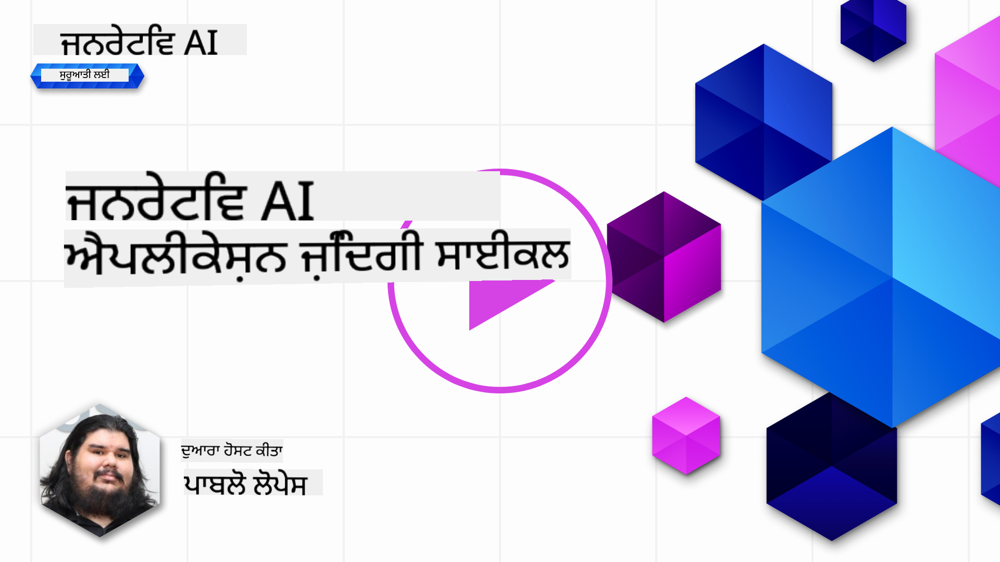
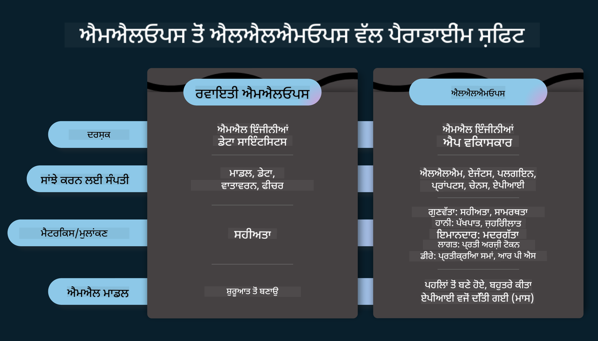
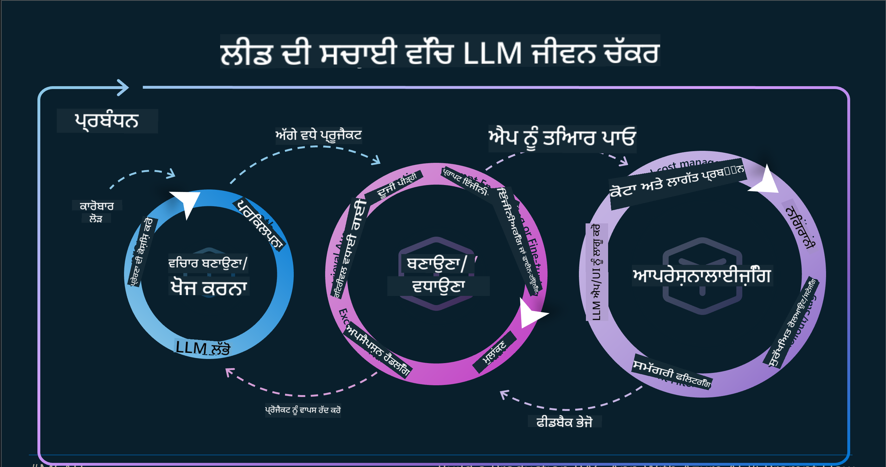
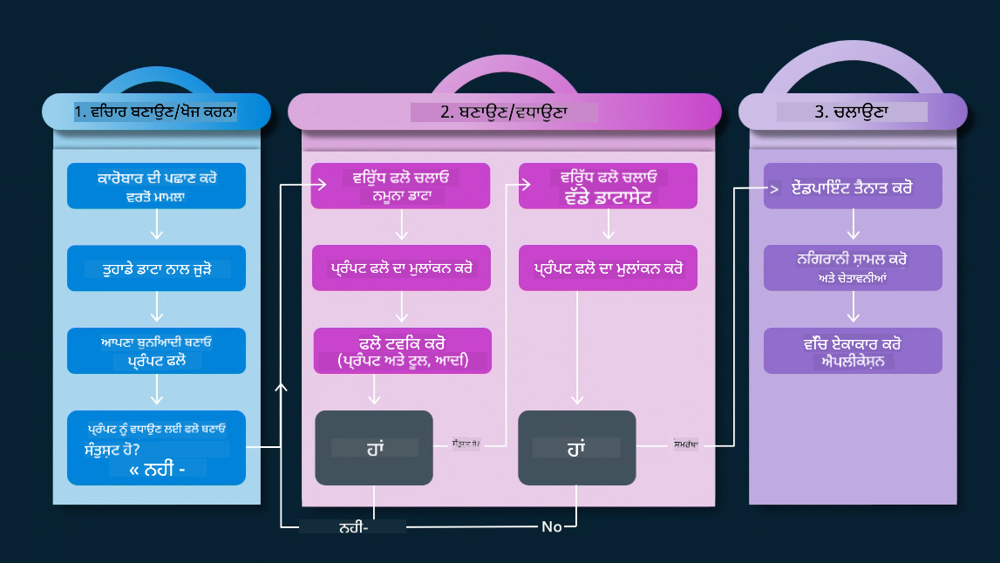
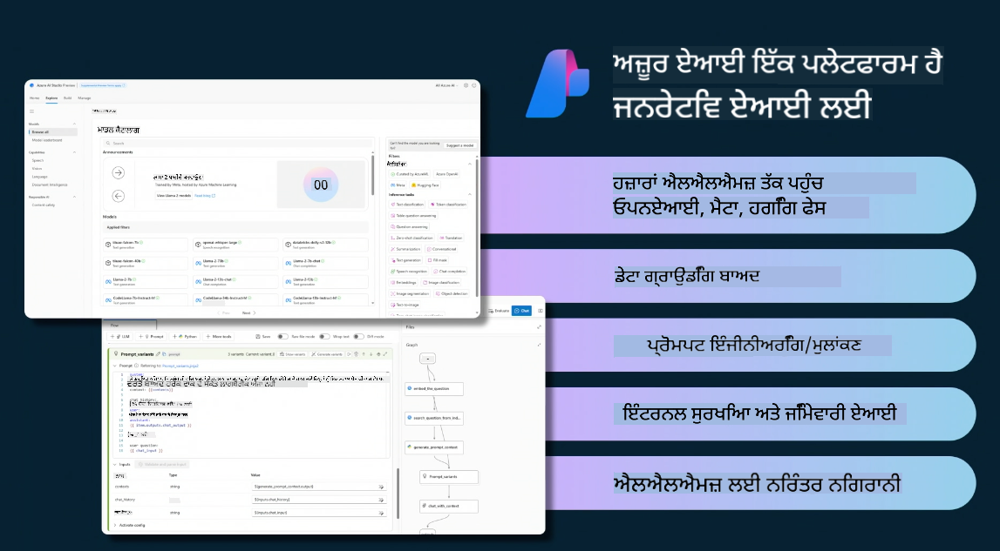
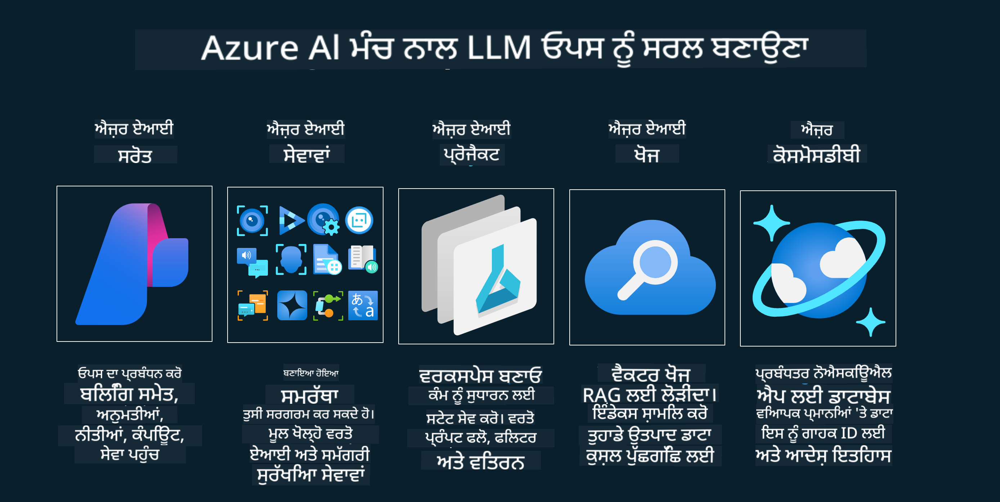
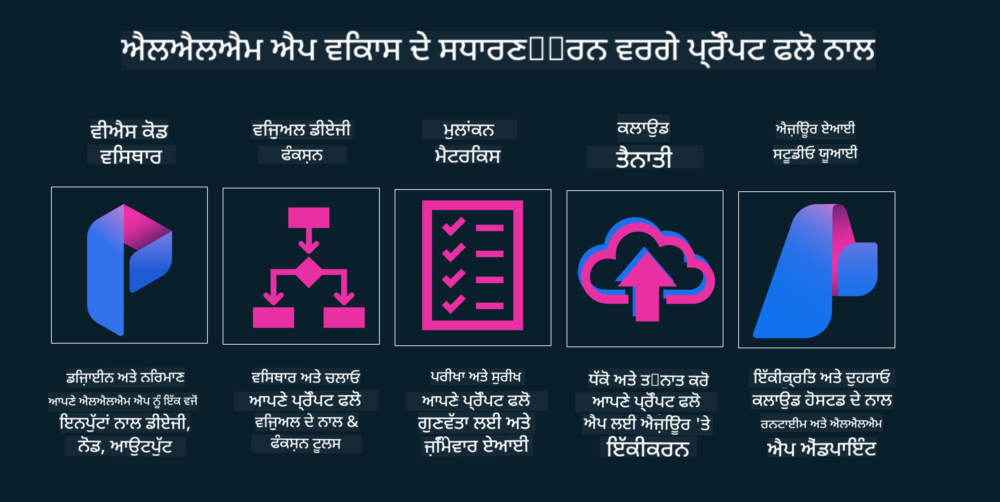

<!--
CO_OP_TRANSLATOR_METADATA:
{
  "original_hash": "27a5347a5022d5ef0a72ab029b03526a",
  "translation_date": "2025-06-25T22:00:47+00:00",
  "source_file": "14-the-generative-ai-application-lifecycle/README.md",
  "language_code": "pa"
}
-->

# ਜਨਰੇਟਿਵ AI ਐਪਲੀਕੇਸ਼ਨ ਲਾਈਫਸਾਈਕਲ

ਸਭ AI ਐਪਲੀਕੇਸ਼ਨਾਂ ਲਈ ਇੱਕ ਮਹੱਤਵਪੂਰਨ ਪ੍ਰਸ਼ਨ AI ਵਿਸ਼ੇਸ਼ਤਾਵਾਂ ਦੀ ਸਬੰਧਿਤਤਾ ਹੈ, ਕਿਉਂਕਿ AI ਇੱਕ ਤੇਜ਼ੀ ਨਾਲ ਵਿਕਸਤ ਹੋ ਰਹੇ ਖੇਤਰ ਵਿੱਚ ਹੈ, ਇਹ ਯਕੀਨੀ ਬਣਾਉਣ ਲਈ ਕਿ ਤੁਹਾਡੀ ਐਪਲੀਕੇਸ਼ਨ ਸਬੰਧਿਤ, ਭਰੋਸੇਯੋਗ ਅਤੇ ਮਜ਼ਬੂਤ ਰਹਿੰਦੀ ਹੈ, ਤੁਹਾਨੂੰ ਇਸਦੀ ਨਿਗਰਾਨੀ, ਮੁਲਾਂਕਣ ਅਤੇ ਇਸਨੂੰ ਲਗਾਤਾਰ ਸੁਧਾਰਨਾ ਚਾਹੀਦਾ ਹੈ। ਇੱਥੇ ਹੀ ਜਨਰੇਟਿਵ AI ਲਾਈਫਸਾਈਕਲ ਦੀ ਲੋੜ ਪੈਂਦੀ ਹੈ।

ਜਨਰੇਟਿਵ AI ਲਾਈਫਸਾਈਕਲ ਇੱਕ ਢਾਂਚਾ ਹੈ ਜੋ ਤੁਹਾਨੂੰ ਜਨਰੇਟਿਵ AI ਐਪਲੀਕੇਸ਼ਨ ਨੂੰ ਵਿਕਸਿਤ, ਤੈਨਾਤ ਅਤੇ ਰੱਖ-ਰਖਾਅ ਕਰਨ ਦੇ ਪੜਾਅਵਾਂ ਤੋਂ ਲੰਘਣ ਲਈ ਮਦਦ ਕਰਦਾ ਹੈ। ਇਹ ਤੁਹਾਨੂੰ ਆਪਣੇ ਲਕਸ਼ਾਂ ਦੀ ਪਰਿਭਾਸ਼ਾ ਕਰਨ, ਆਪਣੇ ਪ੍ਰਦਰਸ਼ਨ ਨੂੰ ਮਾਪਣ, ਆਪਣੇ ਚੁਣੌਤੀਆਂ ਦੀ ਪਛਾਣ ਕਰਨ, ਅਤੇ ਆਪਣੇ ਹੱਲਾਂ ਨੂੰ ਲਾਗੂ ਕਰਨ ਵਿੱਚ ਮਦਦ ਕਰਦਾ ਹੈ। ਇਹ ਤੁਹਾਨੂੰ ਆਪਣੇ ਖੇਤਰ ਅਤੇ ਆਪਣੇ ਹਿੱਸੇਦਾਰਾਂ ਦੇ ਨੈਤਿਕ ਅਤੇ ਕਾਨੂੰਨੀ ਮਾਪਦੰਡਾਂ ਨਾਲ ਆਪਣੀ ਐਪਲੀਕੇਸ਼ਨ ਨੂੰ ਸਧਾਰਨ ਕਰਨ ਵਿੱਚ ਵੀ ਮਦਦ ਕਰਦਾ ਹੈ। ਜਨਰੇਟਿਵ AI ਲਾਈਫਸਾਈਕਲ ਦੀ ਪਾਲਣਾ ਕਰਕੇ, ਤੁਸੀਂ ਯਕੀਨੀ ਬਣਾ ਸਕਦੇ ਹੋ ਕਿ ਤੁਹਾਡੀ ਐਪਲੀਕੇਸ਼ਨ ਹਮੇਸ਼ਾਂ ਮੁੱਲ ਪ੍ਰਦਾਨ ਕਰ ਰਹੀ ਹੈ ਅਤੇ ਆਪਣੇ ਉਪਭੋਗਤਾਵਾਂ ਨੂੰ ਸੰਤੁਸ਼ਟ ਕਰ ਰਹੀ ਹੈ।

## ਪੜਾਅਵਾਂ

ਇਸ ਅਧਿਆਇ ਵਿੱਚ, ਤੁਸੀਂ:

- MLOps ਤੋਂ LLMOps ਤੱਕ ਪੈਰਾਡਾਇਮ ਸ਼ਿਫਟ ਨੂੰ ਸਮਝੋ
- LLM ਲਾਈਫਸਾਈਕਲ
- ਲਾਈਫਸਾਈਕਲ ਟੂਲਿੰਗ
- ਲਾਈਫਸਾਈਕਲ ਮੈਟ੍ਰਿਕਸ ਅਤੇ ਮੁਲਾਂਕਣ

## MLOps ਤੋਂ LLMOps ਤੱਕ ਪੈਰਾਡਾਇਮ ਸ਼ਿਫਟ ਨੂੰ ਸਮਝੋ

LLMs ਕ੍ਰਿਤ੍ਰਿਮ ਬੁੱਧੀ ਦੇ ਹਥਿਆਰ ਵਿੱਚ ਇੱਕ ਨਵਾਂ ਸੰਦ ਹਨ, ਇਹ ਐਪਲੀਕੇਸ਼ਨਾਂ ਲਈ ਵਿਸ਼ਲੇਸ਼ਣ ਅਤੇ ਉਤਪਾਦਨ ਕਾਰਜਾਂ ਵਿੱਚ ਬੇਹੱਦ ਸ਼ਕਤੀਸ਼ਾਲੀ ਹਨ, ਹਾਲਾਂਕਿ ਇਸ ਸ਼ਕਤੀ ਦਾ ਕੁਝ ਨਤੀਜੇ ਹਨ ਕਿ ਅਸੀਂ AI ਅਤੇ ਕਲਾਸਿਕ ਮਸ਼ੀਨ ਲਰਨਿੰਗ ਕਾਰਜਾਂ ਨੂੰ ਕਿਵੇਂ ਸਧਾਰਨ ਕਰਦੇ ਹਾਂ।

ਇਸ ਨਾਲ, ਸਾਨੂੰ ਇਸ ਸੰਦ ਨੂੰ ਇੱਕ ਗਤੀਸ਼ੀਲ, ਸਹੀ ਪ੍ਰੇਰਣਾਵਾਂ ਦੇ ਨਾਲ ਅਨੁਕੂਲਿਤ ਕਰਨ ਲਈ ਇੱਕ ਨਵੀਂ ਪੈਰਾਡਾਇਮ ਦੀ ਲੋੜ ਹੈ। ਅਸੀਂ ਪੁਰਾਣੀਆਂ AI ਐਪਸ ਨੂੰ "ML ਐਪਸ" ਅਤੇ ਨਵੀਆਂ AI ਐਪਸ ਨੂੰ "GenAI ਐਪਸ" ਜਾਂ ਸਿਰਫ "AI ਐਪਸ" ਵਜੋਂ ਵਰਗੀਕ੍ਰਿਤ ਕਰ ਸਕਦੇ ਹਾਂ, ਜੋ ਸਮੇਂ 'ਤੇ ਵਰਤੇ ਗਏ ਮੁੱਖ ਧਾਰਾ ਤਕਨਾਲੋਜੀ ਅਤੇ ਤਕਨੀਕਾਂ ਨੂੰ ਦਰਸਾਉਂਦੇ ਹਨ। ਇਹ ਕਈ ਤਰੀਕਿਆਂ ਵਿੱਚ ਸਾਡੇ ਕਹਾਣੀ ਨੂੰ ਬਦਲਦਾ ਹੈ, ਹੇਠਾਂ ਦਿੱਤੇ ਤੁਲਨਾ ਨੂੰ ਦੇਖੋ।

ਨੋਟ ਕਰੋ ਕਿ LLMOps ਵਿੱਚ, ਅਸੀਂ ਐਪ ਡਿਵੈਲਪਰਾਂ 'ਤੇ ਜ਼ਿਆਦਾ ਧਿਆਨ ਦੇ ਰਹੇ ਹਾਂ, ਇੰਟੀਗ੍ਰੇਸ਼ਨ ਨੂੰ ਇੱਕ ਮੁੱਖ ਬਿੰਦੂ ਵਜੋਂ ਵਰਤਦੇ ਹੋਏ, "ਮਾਡਲਸ-ਐਜ਼-ਏ-ਸਰਵਿਸ" ਦੀ ਵਰਤੋਂ ਕਰਦੇ ਹੋਏ ਅਤੇ ਮੈਟ੍ਰਿਕਸ ਲਈ ਹੇਠਾਂ ਦਿੱਤੇ ਬਿੰਦੂਆਂ ਵਿੱਚ ਸੋਚਦੇ ਹੋਏ।

- ਗੁਣਵੱਤਾ: ਪ੍ਰਤੀਕ੍ਰਿਆ ਦੀ ਗੁਣਵੱਤਾ
- ਨੁਕਸਾਨ: ਜ਼ਿੰਮੇਵਾਰ AI
- ਇਮਾਨਦਾਰੀ: ਪ੍ਰਤੀਕ੍ਰਿਆ ਦਾ ਮੂਲ (ਕੀ ਇਹ ਸਮਝਦਾਰ ਹੈ? ਕੀ ਇਹ ਸਹੀ ਹੈ?)
- ਲਾਗਤ: ਹੱਲ ਦਾ ਬਜਟ
- ਲੈਟੈਂਸੀ: ਟੋਕਨ ਪ੍ਰਤੀਕ੍ਰਿਆ ਲਈ ਔਸਤ ਸਮਾਂ

## LLM ਲਾਈਫਸਾਈਕਲ

ਪਹਿਲਾਂ, ਲਾਈਫਸਾਈਕਲ ਅਤੇ ਸੰਸ਼ੋਧਨਾਂ ਨੂੰ ਸਮਝਣ ਲਈ, ਅੱਗੇ ਦਿੱਤੇ ਇਨਫੋਗ੍ਰਾਫਿਕ ਨੂੰ ਨੋਟ ਕਰੋ।

ਜਿਵੇਂ ਤੁਸੀਂ ਨੋਟ ਕਰ ਸਕਦੇ ਹੋ, ਇਹ MLOps ਦੇ ਆਮ ਲਾਈਫਸਾਈਕਲ ਤੋਂ ਵੱਖਰਾ ਹੈ। LLMs ਦੇ ਬਹੁਤ ਸਾਰੇ ਨਵੇਂ ਲੋੜ ਹਨ, ਜਿਵੇਂ ਕਿ ਪ੍ਰੋਮਪਟਿੰਗ, ਗੁਣਵੱਤਾ ਨੂੰ ਸੁਧਾਰਨ ਲਈ ਵੱਖ-ਵੱਖ ਤਕਨੀਕਾਂ (ਫਾਈਨ-ਟਿਊਨਿੰਗ, RAG, ਮੈਟਾ-ਪ੍ਰੋਮਪਟਸ), ਜ਼ਿੰਮੇਵਾਰ AI ਦੇ ਨਾਲ ਵੱਖਰੀ ਮੁਲਾਂਕਣ ਅਤੇ ਜ਼ਿੰਮੇਵਾਰੀ, ਆਖਿਰਕਾਰ, ਨਵੇਂ ਮੁਲਾਂਕਣ ਮੈਟ੍ਰਿਕਸ (ਗੁਣਵੱਤਾ, ਨੁਕਸਾਨ, ਇਮਾਨਦਾਰੀ, ਲਾਗਤ ਅਤੇ ਲੈਟੈਂਸੀ)।

ਉਦਾਹਰਣ ਲਈ, ਦੇਖੋ ਕਿ ਅਸੀਂ ਕਿਵੇਂ ਵਿਚਾਰ ਕਰਦੇ ਹਾਂ। ਵੱਖ-ਵੱਖ LLMs ਨਾਲ ਤਜਰਬਾ ਕਰਨ ਲਈ ਪ੍ਰੋਮਪਟ ਇੰਜੀਨੀਅਰਿੰਗ ਦੀ ਵਰਤੋਂ ਕਰਦੇ ਹੋਏ ਸੰਭਾਵਨਾਵਾਂ ਨੂੰ ਖੋਜਣ ਲਈ ਜਾਂਚ ਕਰਦੇ ਹੋਏ ਕਿ ਕੀ ਉਨ੍ਹਾਂ ਦਾ ਹਿਪੋਥੈਸਿਸ ਸਹੀ ਹੋ ਸਕਦਾ ਹੈ।

ਨੋਟ ਕਰੋ ਕਿ ਇਹ ਰੇਖਿਕ ਨਹੀਂ ਹੈ, ਪਰ ਇਕਠੇ ਲੂਪ, ਦੁਹਰਾਉਣ ਵਾਲੇ ਅਤੇ ਇੱਕ ਸਾਰੇ ਚੱਕਰ ਦੇ ਨਾਲ।

ਅਸੀਂ ਉਹਨਾਂ ਕਦਮਾਂ ਨੂੰ ਕਿਵੇਂ ਖੋਜ ਸਕਦੇ ਹਾਂ? ਆਓ ਇਸ ਵਿੱਚ ਵਿਸਥਾਰ ਵਿੱਚ ਕਦਮ ਰੱਖੀਏ ਕਿ ਅਸੀਂ ਕਿਵੇਂ ਇੱਕ ਲਾਈਫਸਾਈਕਲ ਬਣਾ ਸਕਦੇ ਹਾਂ।

ਇਹ ਕੁਝ ਜਟਿਲ ਲੱਗ ਸਕਦਾ ਹੈ, ਪਹਿਲਾਂ ਤਿੰਨ ਵੱਡੇ ਕਦਮਾਂ 'ਤੇ ਧਿਆਨ ਦੇਵੋ।

1. ਵਿਚਾਰਨਾ/ਖੋਜਣਾ: ਖੋਜ, ਇੱਥੇ ਅਸੀਂ ਆਪਣੇ ਵਪਾਰ ਦੀਆਂ ਲੋੜਾਂ ਦੇ ਅਨੁਸਾਰ ਖੋਜ ਕਰ ਸਕਦੇ ਹਾਂ। ਪ੍ਰੋਟੋਟਾਈਪਿੰਗ, ਇੱਕ [PromptFlow](https://microsoft.github.io/promptflow/index.html?WT.mc_id=academic-105485-koreyst) ਬਣਾਉਣਾ ਅਤੇ ਜਾਂਚ ਕਰਨਾ ਕਿ ਕੀ ਇਹ ਸਾਡੇ ਹਿਪੋਥੈਸਿਸ ਲਈ ਕਾਫ਼ੀ ਕੁਸ਼ਲ ਹੈ।
2. ਬਿਲਡਿੰਗ/ਆਗਮੈਂਟਿੰਗ: ਲਾਗੂ ਕਰਨਾ, ਹੁਣ, ਅਸੀਂ ਵੱਡੇ ਡਾਟਾਸੈਟਾਂ ਲਈ ਤਕਨੀਕਾਂ ਨੂੰ ਲਾਗੂ ਕਰਨ ਲਈ ਮੁਲਾਂਕਣ ਕਰਨਾ ਸ਼ੁਰੂ ਕਰਦੇ ਹਾਂ, ਜਿਵੇਂ ਕਿ ਫਾਈਨ-ਟਿਊਨਿੰਗ ਅਤੇ RAG, ਸਾਡੇ ਹੱਲ ਦੀ ਮਜ਼ਬੂਤੀ ਦੀ ਜਾਂਚ ਕਰਨ ਲਈ। ਜੇ ਇਹ ਨਹੀਂ ਕਰਦਾ, ਤਾਂ ਇਸਨੂੰ ਦੁਬਾਰਾ ਲਾਗੂ ਕਰਨਾ, ਸਾਡੇ ਫਲੋ ਵਿੱਚ ਨਵੇਂ ਕਦਮ ਸ਼ਾਮਲ ਕਰਨਾ ਜਾਂ ਡਾਟਾ ਨੂੰ ਮੁੜ ਢਾਂਚਾ ਬਣਾਉਣਾ ਮਦਦਗਾਰ ਹੋ ਸਕਦਾ ਹੈ। ਸਾਡੇ ਫਲੋ ਅਤੇ ਸਾਡੇ ਪੈਮਾਨੇ ਦੀ ਜਾਂਚ ਕਰਨ ਤੋਂ ਬਾਅਦ, ਜੇ ਇਹ ਕੰਮ ਕਰਦਾ ਹੈ ਅਤੇ ਸਾਡੇ ਮੈਟ੍ਰਿਕਸ ਦੀ ਜਾਂਚ ਕਰਦਾ ਹੈ, ਤਾਂ ਇਹ ਅਗਲੇ ਕਦਮ ਲਈ ਤਿਆਰ ਹੈ।
3. ਓਪਰੇਸ਼ਨਲਾਈਜ਼ਿੰਗ: ਇੰਟੀਗ੍ਰੇਸ਼ਨ, ਹੁਣ ਸਾਡੇ ਸਿਸਟਮ ਵਿੱਚ ਮਾਨੀਟਰਿੰਗ ਅਤੇ ਅਲਰਟ ਸਿਸਟਮ ਸ਼ਾਮਲ ਕਰਨਾ, ਤੈਨਾਤੀ ਅਤੇ ਐਪਲੀਕੇਸ਼ਨ ਇੰਟੀਗ੍ਰੇਸ਼ਨ ਸਾਡੇ ਐਪਲੀਕੇਸ਼ਨ ਵਿੱਚ।

ਫਿਰ, ਸੁਰੱਖਿਆ, ਅਨੁਕੂਲਤਾ ਅਤੇ ਸ਼ਾਸਨ 'ਤੇ ਧਿਆਨ ਕੇਂਦਰਿਤ ਕਰਨ ਵਾਲੇ ਪ੍ਰਬੰਧਨ ਦੇ ਸਾਰੇ ਚੱਕਰ ਨੂੰ ਸਾਡੇ ਕੋਲ ਹੈ।

ਵਧਾਈਆਂ, ਹੁਣ ਤੁਹਾਡੀ AI ਐਪ ਤਿਆਰ ਹੈ ਅਤੇ ਚੱਲ ਰਹੀ ਹੈ। ਇੱਕ ਹੱਥ ਦੇ ਤਜਰਬੇ ਲਈ, [Contoso Chat Demo](https://nitya.github.io/contoso-chat/?WT.mc_id=academic-105485-koreyst) 'ਤੇ ਨਜ਼ਰ ਮਾਰੋ।

ਹੁਣ, ਅਸੀਂ ਕਿਹੜੇ ਸੰਦ ਵਰਤ ਸਕਦੇ ਹਾਂ?

## ਲਾਈਫਸਾਈਕਲ ਟੂਲਿੰਗ

ਟੂਲਿੰਗ ਲਈ, ਮਾਇਕਰੋਸਾਫਟ [Azure AI ਪਲੇਟਫਾਰਮ](https://azure.microsoft.com/solutions/ai/?WT.mc_id=academic-105485-koreys) ਅਤੇ [PromptFlow](https://microsoft.github.io/promptflow/index.html?WT.mc_id=academic-105485-koreyst) ਪ੍ਰਦਾਨ ਕਰਦਾ ਹੈ ਜੋ ਤੁਹਾਡੇ ਚੱਕਰ ਨੂੰ ਲਾਗੂ ਕਰਨਾ ਅਤੇ ਤਿਆਰ ਕਰਨਾ ਆਸਾਨ ਬਣਾਉਂਦਾ ਹੈ।

[Azure AI ਪਲੇਟਫਾਰਮ](https://azure.microsoft.com/solutions/ai/?WT.mc_id=academic-105485-koreys), ਤੁਹਾਨੂੰ [AI Studio](https://ai.azure.com/?WT.mc_id=academic-105485-koreys) ਵਰਤਣ ਦੀ ਆਗਿਆ ਦਿੰਦਾ ਹੈ। AI Studio ਇੱਕ ਵੈੱਬ ਪੋਰਟਲ ਹੈ ਜੋ ਤੁਹਾਨੂੰ ਮਾਡਲਾਂ, ਨਮੂਨਿਆਂ ਅਤੇ ਸੰਦਾਂ ਦੀ ਖੋਜ ਕਰਨ ਦੀ ਆਗਿਆ ਦਿੰਦਾ ਹੈ। ਆਪਣੇ ਸਰੋਤਾਂ ਦਾ ਪ੍ਰਬੰਧਨ, UI ਵਿਕਾਸ ਫਲੋਜ਼ ਅਤੇ ਕੋਡ-ਪਹਿਲਾਂ ਵਿਕਾਸ ਲਈ SDK/CLI ਵਿਕਲਪ।

Azure AI, ਤੁਹਾਨੂੰ ਆਪਣੀਆਂ ਕਾਰਵਾਈਆਂ, ਸੇਵਾਵਾਂ, ਪ੍ਰਾਜੈਕਟਾਂ, ਵੈਕਟਰ ਖੋਜ ਅਤੇ ਡਾਟਾਬੇਸ ਦੀਆਂ ਲੋੜਾਂ ਦਾ ਪ੍ਰਬੰਧਨ ਕਰਨ ਲਈ ਕਈ ਸਰੋਤਾਂ ਦੀ ਵਰਤੋਂ ਕਰਨ ਦੀ ਆਗਿਆ ਦਿੰਦਾ ਹੈ।

ਪ੍ਰੂਫ-ਆਫ-ਕੰਸੈਪਟ(POC) ਤੋਂ ਲੈ ਕੇ ਵੱਡੇ ਪੈਮਾਨੇ ਦੀਆਂ ਐਪਲੀਕੇਸ਼ਨਾਂ ਤੱਕ PromptFlow ਨਾਲ ਨਿਰਮਾਣ ਕਰੋ:

- ਵਿਜ਼ੁਅਲ ਅਤੇ ਫੰਕਸ਼ਨਲ ਟੂਲਾਂ ਨਾਲ VS ਕੋਡ ਤੋਂ ਐਪਸ ਡਿਜ਼ਾਈਨ ਅਤੇ ਬਣਾਓ
- ਆਸਾਨੀ ਨਾਲ, ਗੁਣਵੱਤਾ AI ਲਈ ਆਪਣੇ ਐਪਸ ਦੀ ਜਾਂਚ ਕਰੋ ਅਤੇ ਫਾਈਨ-ਟਿਊਨ ਕਰੋ।
- ਕਲਾਉਡ ਦੇ ਨਾਲ ਇੰਟੀਗ੍ਰੇਟ ਅਤੇ ਇਟਰੇਟ ਕਰਨ ਲਈ Azure AI Studio ਦੀ ਵਰਤੋਂ ਕਰੋ, ਤੇਜ਼ ਇੰਟੀਗ੍ਰੇਸ਼ਨ ਲਈ ਪੁਸ਼ ਅਤੇ ਤੈਨਾਤ ਕਰੋ।

## ਸ਼ਾਨਦਾਰ! ਆਪਣੀ ਸਿੱਖਿਆ ਜਾਰੀ ਰੱਖੋ!

ਸ਼ਾਨਦਾਰ, ਹੁਣ ਸਿੱਖੋ ਕਿ ਅਸੀਂ [Contoso Chat App](https://nitya.github.io/contoso-chat/?WT.mc_id=academic-105485-koreyst) ਨਾਲ ਸੰਕਲਪਾਂ ਨੂੰ ਵਰਤਣ ਲਈ ਇੱਕ ਐਪਲੀਕੇਸ਼ਨ ਨੂੰ ਕਿਵੇਂ ਢਾਂਚਾ ਬਣਾਉਂਦੇ ਹਾਂ, ਜਾਚ ਕਰਨ ਲਈ ਕਿ ਕਲਾਉਡ ਐਡਵੋਕੇਸੀ ਕਿਵੇਂ ਪ੍ਰਦਰਸ਼ਨਾਂ ਵਿੱਚ ਉਹ ਸੰਕਲਪ ਜੋੜਦਾ ਹੈ। ਹੋਰ ਸਮੱਗਰੀ ਲਈ, ਸਾਡੇ [Ignite breakout session](https://www.youtube.com/watch?v=DdOylyrTOWg) ਨੂੰ ਵੇਖੋ!

ਹੁਣ, ਪਾਠ 15 ਦੀ ਜਾਂਚ ਕਰੋ, ਇਹ ਸਮਝਣ ਲਈ ਕਿ ਕਿਵੇਂ [Retrieval Augmented Generation and Vector Databases](../15-rag-and-vector-databases/README.md?WT.mc_id=academic-105485-koreyst) ਜਨਰੇਟਿਵ AI 'ਤੇ ਪ੍ਰਭਾਵ ਪਾਉਂਦੇ ਹਨ ਅਤੇ ਹੋਰ ਆਕਰਸ਼ਕ ਐਪਲੀਕੇਸ਼ਨਾਂ ਨੂੰ ਬਣਾਉਣ ਲਈ!

**ਅਸਵੀਕਰਤਾ**:  
ਇਹ ਦਸਤਾਵੇਜ਼ AI ਅਨੁਵਾਦ ਸੇਵਾ [Co-op Translator](https://github.com/Azure/co-op-translator) ਦੀ ਵਰਤੋਂ ਕਰਕੇ ਅਨੁਵਾਦ ਕੀਤਾ ਗਿਆ ਹੈ। ਅਸੀਂ ਸਹੀ ਹੋਣ ਦਾ ਯਤਨ ਕਰਦੇ ਹਾਂ, ਪਰ ਕਿਰਪਾ ਕਰਕੇ ਧਿਆਨ ਰੱਖੋ ਕਿ ਸਵੈਚਾਲਿਤ ਅਨੁਵਾਦਾਂ ਵਿੱਚ ਗਲਤੀਆਂ ਜਾਂ ਅਸੁੱਤਰ ਹੋ ਸਕਦੇ ਹਨ। ਇਸਦੀ ਮੂਲ ਭਾਸ਼ਾ ਵਿੱਚ ਮੂਲ ਦਸਤਾਵੇਜ਼ ਨੂੰ ਅਧਿਕਾਰਕ ਸਰੋਤ ਮੰਨਿਆ ਜਾਣਾ ਚਾਹੀਦਾ ਹੈ। ਜ਼ਰੂਰੀ ਜਾਣਕਾਰੀ ਲਈ, ਪੇਸ਼ੇਵਰ ਮਨੁੱਖੀ ਅਨੁਵਾਦ ਦੀ ਸਿਫਾਰਸ਼ ਕੀਤੀ ਜਾਂਦੀ ਹੈ। ਇਸ ਅਨੁਵਾਦ ਦੇ ਉਪਯੋਗ ਤੋਂ ਉਤਪੰਨ ਹੋਈ ਕਿਸੇ ਵੀ ਗਲਤ ਫਹਿਮੀ ਜਾਂ ਗਲਤ ਵਿਆਖਿਆ ਲਈ ਅਸੀਂ ਜ਼ਿੰਮੇਵਾਰ ਨਹੀਂ ਹਾਂ।