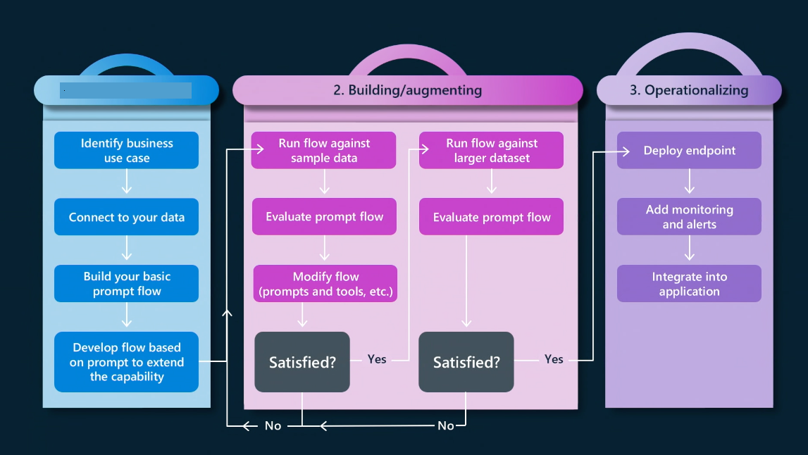
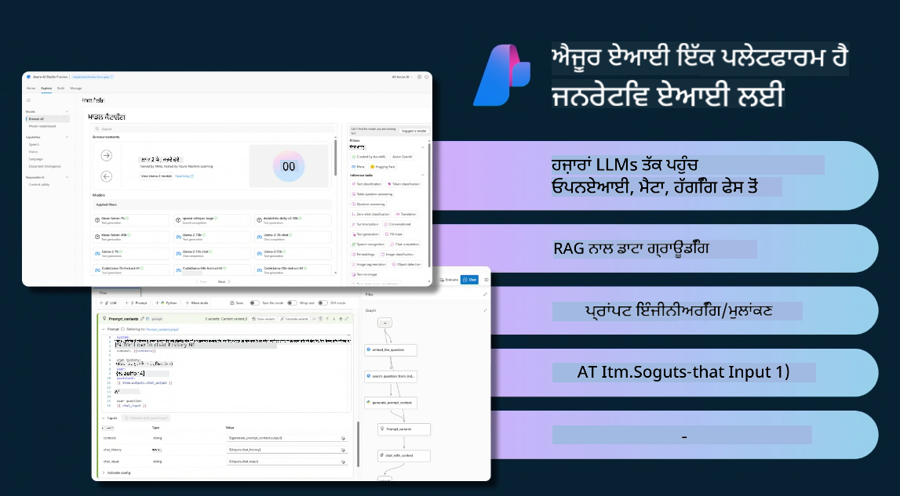

<!--
CO_OP_TRANSLATOR_METADATA:
{
  "original_hash": "df44972d5575ea8cef3c52ee31696d04",
  "translation_date": "2025-12-19T14:22:32+00:00",
  "source_file": "14-the-generative-ai-application-lifecycle/README.md",
  "language_code": "pa"
}
-->

# ਜਨਰੇਟਿਵ ਏਆਈ ਐਪਲੀਕੇਸ਼ਨ ਲਾਈਫਸਾਈਕਲ

ਸਾਰੇ ਏਆਈ ਐਪਲੀਕੇਸ਼ਨਾਂ ਲਈ ਇੱਕ ਮਹੱਤਵਪੂਰਨ ਸਵਾਲ ਏਆਈ ਫੀਚਰਾਂ ਦੀ ਪ੍ਰਸੰਗਿਕਤਾ ਹੈ, ਕਿਉਂਕਿ ਏਆਈ ਇੱਕ ਤੇਜ਼ੀ ਨਾਲ ਵਿਕਸਤ ਹੋਣ ਵਾਲਾ ਖੇਤਰ ਹੈ, ਇਹ ਯਕੀਨੀ ਬਣਾਉਣ ਲਈ ਕਿ ਤੁਹਾਡੀ ਐਪਲੀਕੇਸ਼ਨ ਪ੍ਰਸੰਗਿਕ, ਭਰੋਸੇਯੋਗ ਅਤੇ ਮਜ਼ਬੂਤ ਰਹੇ, ਤੁਹਾਨੂੰ ਇਸ ਦੀ ਲਗਾਤਾਰ ਨਿਗਰਾਨੀ, ਮੁਲਾਂਕਣ ਅਤੇ ਸੁਧਾਰ ਕਰਨਾ ਚਾਹੀਦਾ ਹੈ। ਇੱਥੇ ਜਨਰੇਟਿਵ ਏਆਈ ਲਾਈਫਸਾਈਕਲ ਕੰਮ ਵਿੱਚ ਆਉਂਦਾ ਹੈ।

ਜਨਰੇਟਿਵ ਏਆਈ ਲਾਈਫਸਾਈਕਲ ਇੱਕ ਫਰੇਮਵਰਕ ਹੈ ਜੋ ਤੁਹਾਨੂੰ ਜਨਰੇਟਿਵ ਏਆਈ ਐਪਲੀਕੇਸ਼ਨ ਨੂੰ ਵਿਕਸਿਤ ਕਰਨ, ਤਾਇਨਾਤ ਕਰਨ ਅਤੇ ਸੰਭਾਲਣ ਦੇ ਚਰਣਾਂ ਵਿੱਚ ਮਦਦ ਕਰਦਾ ਹੈ। ਇਹ ਤੁਹਾਨੂੰ ਆਪਣੇ ਲਕੜਾਂ ਨੂੰ ਪਰਿਭਾਸ਼ਿਤ ਕਰਨ, ਆਪਣੇ ਪ੍ਰਦਰਸ਼ਨ ਨੂੰ ਮਾਪਣ, ਆਪਣੀਆਂ ਚੁਣੌਤੀਆਂ ਦੀ ਪਛਾਣ ਕਰਨ ਅਤੇ ਆਪਣੇ ਹੱਲਾਂ ਨੂੰ ਲਾਗੂ ਕਰਨ ਵਿੱਚ ਮਦਦ ਕਰਦਾ ਹੈ। ਇਹ ਤੁਹਾਡੇ ਐਪਲੀਕੇਸ਼ਨ ਨੂੰ ਤੁਹਾਡੇ ਖੇਤਰ ਅਤੇ ਤੁਹਾਡੇ ਹਿੱਸੇਦਾਰਾਂ ਦੇ ਨੈਤਿਕ ਅਤੇ ਕਾਨੂੰਨੀ ਮਿਆਰਾਂ ਨਾਲ ਸੰਗਤ ਕਰਨ ਵਿੱਚ ਵੀ ਮਦਦ ਕਰਦਾ ਹੈ। ਜਨਰੇਟਿਵ ਏਆਈ ਲਾਈਫਸਾਈਕਲ ਦੀ ਪਾਲਣਾ ਕਰਕੇ, ਤੁਸੀਂ ਯਕੀਨੀ ਬਣਾ ਸਕਦੇ ਹੋ ਕਿ ਤੁਹਾਡੀ ਐਪਲੀਕੇਸ਼ਨ ਹਮੇਸ਼ਾ ਮੁੱਲ ਪ੍ਰਦਾਨ ਕਰ ਰਹੀ ਹੈ ਅਤੇ ਤੁਹਾਡੇ ਉਪਭੋਗਤਾਵਾਂ ਨੂੰ ਸੰਤੁਸ਼ਟ ਕਰ ਰਹੀ ਹੈ।

## ਪਰਿਚਯ

ਇਸ ਅਧਿਆਇ ਵਿੱਚ, ਤੁਸੀਂ:

- MLOps ਤੋਂ LLMOps ਵੱਲ ਪੈਰਾਡਾਈਮ ਸ਼ਿਫਟ ਨੂੰ ਸਮਝੋਗੇ
- LLM ਲਾਈਫਸਾਈਕਲ
- ਲਾਈਫਸਾਈਕਲ ਟੂਲਿੰਗ
- ਲਾਈਫਸਾਈਕਲ ਮੈਟ੍ਰੀਫਿਕੇਸ਼ਨ ਅਤੇ ਮੁਲਾਂਕਣ

## MLOps ਤੋਂ LLMOps ਵੱਲ ਪੈਰਾਡਾਈਮ ਸ਼ਿਫਟ ਨੂੰ ਸਮਝੋ

LLM ਨਵਾਂ ਸੰਦ ਹੈ ਕ੍ਰਿਤ੍ਰਿਮ ਬੁੱਧੀ ਦੇ ਹਥਿਆਰ ਵਿੱਚ, ਇਹ ਐਪਲੀਕੇਸ਼ਨਾਂ ਲਈ ਵਿਸ਼ਲੇਸ਼ਣ ਅਤੇ ਜਨਰੇਸ਼ਨ ਕਾਰਜਾਂ ਵਿੱਚ ਬਹੁਤ ਸ਼ਕਤੀਸ਼ਾਲੀ ਹਨ, ਹਾਲਾਂਕਿ ਇਸ ਸ਼ਕਤੀ ਦੇ ਕੁਝ ਨਤੀਜੇ ਹਨ ਕਿ ਅਸੀਂ ਕਿਵੇਂ ਏਆਈ ਅਤੇ ਕਲਾਸਿਕ ਮਸ਼ੀਨ ਲਰਨਿੰਗ ਕਾਰਜਾਂ ਨੂੰ ਸਧਾਰਨ ਕਰਦੇ ਹਾਂ।

ਇਸ ਨਾਲ, ਸਾਨੂੰ ਇਸ ਸੰਦ ਨੂੰ ਗਤੀਸ਼ੀਲ ਤਰੀਕੇ ਨਾਲ, ਸਹੀ ਪ੍ਰੇਰਣਾਵਾਂ ਨਾਲ ਅਨੁਕੂਲਿਤ ਕਰਨ ਲਈ ਇੱਕ ਨਵਾਂ ਪੈਰਾਡਾਈਮ ਚਾਹੀਦਾ ਹੈ। ਅਸੀਂ ਪੁਰਾਣੀਆਂ ਏਆਈ ਐਪਸ ਨੂੰ "ML ਐਪਸ" ਅਤੇ ਨਵੀਆਂ ਏਆਈ ਐਪਸ ਨੂੰ "GenAI ਐਪਸ" ਜਾਂ ਸਿਰਫ "AI ਐਪਸ" ਵਜੋਂ ਵਰਗੀਕ੍ਰਿਤ ਕਰ ਸਕਦੇ ਹਾਂ, ਜੋ ਉਸ ਸਮੇਂ ਦੀ ਪ੍ਰਮੁੱਖ ਤਕਨਾਲੋਜੀ ਅਤੇ ਤਕਨੀਕਾਂ ਨੂੰ ਦਰਸਾਉਂਦਾ ਹੈ। ਇਹ ਸਾਡੇ ਕਥਾ ਨੂੰ ਕਈ ਤਰੀਕਿਆਂ ਨਾਲ ਬਦਲਦਾ ਹੈ, ਹੇਠਾਂ ਦਿੱਤੇ ਤੁਲਨਾਤਮਕ ਵੇਖੋ।

ਧਿਆਨ ਦਿਓ ਕਿ LLMOps ਵਿੱਚ, ਅਸੀਂ ਐਪ ਡਿਵੈਲਪਰਾਂ 'ਤੇ ਜ਼ਿਆਦਾ ਧਿਆਨ ਕੇਂਦਰਿਤ ਕਰਦੇ ਹਾਂ, ਇੰਟੀਗ੍ਰੇਸ਼ਨਾਂ ਨੂੰ ਇੱਕ ਮੁੱਖ ਬਿੰਦੂ ਵਜੋਂ ਵਰਤਦੇ ਹਾਂ, "ਮਾਡਲ-ਐਜ਼-ਏ-ਸਰਵਿਸ" ਦੀ ਵਰਤੋਂ ਕਰਦੇ ਹਾਂ ਅਤੇ ਮੈਟ੍ਰਿਕਸ ਲਈ ਹੇਠਾਂ ਦਿੱਤੇ ਬਿੰਦੂਆਂ 'ਤੇ ਸੋਚਦੇ ਹਾਂ।

- ਗੁਣਵੱਤਾ: ਜਵਾਬ ਦੀ ਗੁਣਵੱਤਾ
- ਨੁਕਸਾਨ: ਜ਼ਿੰਮੇਵਾਰ ਏਆਈ
- ਇਮਾਨਦਾਰੀ: ਜਵਾਬ ਦੀ ਅਧਾਰਿਤਤਾ (ਸਮਝ ਆਉਂਦੀ ਹੈ? ਕੀ ਇਹ ਸਹੀ ਹੈ?)
- ਲਾਗਤ: ਹੱਲ ਦਾ ਬਜਟ
- ਲੇਟੈਂਸੀ: ਟੋਕਨ ਜਵਾਬ ਲਈ ਔਸਤ ਸਮਾਂ

## LLM ਲਾਈਫਸਾਈਕਲ

ਸਭ ਤੋਂ ਪਹਿਲਾਂ, ਲਾਈਫਸਾਈਕਲ ਅਤੇ ਤਬਦੀਲੀਆਂ ਨੂੰ ਸਮਝਣ ਲਈ, ਅਗਲੇ ਇਨਫੋਗ੍ਰਾਫਿਕ ਨੂੰ ਨੋਟ ਕਰੋ।

ਜਿਵੇਂ ਤੁਸੀਂ ਨੋਟ ਕਰ ਸਕਦੇ ਹੋ, ਇਹ MLOps ਦੇ ਆਮ ਲਾਈਫਸਾਈਕਲ ਤੋਂ ਵੱਖਰਾ ਹੈ। LLMs ਦੇ ਬਹੁਤ ਸਾਰੇ ਨਵੇਂ ਲੋੜਾਂ ਹਨ, ਜਿਵੇਂ ਕਿ ਪ੍ਰਾਂਪਟਿੰਗ, ਗੁਣਵੱਤਾ ਸੁਧਾਰਨ ਲਈ ਵੱਖ-ਵੱਖ ਤਕਨੀਕਾਂ (ਫਾਈਨ-ਟਿਊਨਿੰਗ, RAG, ਮੈਟਾ-ਪ੍ਰਾਂਪਟਸ), ਜ਼ਿੰਮੇਵਾਰ ਏਆਈ ਨਾਲ ਵੱਖ-ਵੱਖ ਮੁਲਾਂਕਣ ਅਤੇ ਜ਼ਿੰਮੇਵਾਰੀ, ਆਖ਼ਿਰਕਾਰ ਨਵੇਂ ਮੁਲਾਂਕਣ ਮੈਟ੍ਰਿਕਸ (ਗੁਣਵੱਤਾ, ਨੁਕਸਾਨ, ਇਮਾਨਦਾਰੀ, ਲਾਗਤ ਅਤੇ ਲੇਟੈਂਸੀ)।

ਉਦਾਹਰਨ ਵਜੋਂ, ਦੇਖੋ ਕਿ ਅਸੀਂ ਕਿਵੇਂ ਵਿਚਾਰ ਕਰਦੇ ਹਾਂ। ਵੱਖ-ਵੱਖ LLMs ਨਾਲ ਪ੍ਰਾਂਪਟ ਇੰਜੀਨੀਅਰਿੰਗ ਦੀ ਵਰਤੋਂ ਕਰਕੇ ਸੰਭਾਵਨਾਵਾਂ ਦੀ ਜਾਂਚ ਕਰਨ ਲਈ ਪ੍ਰਯੋਗ ਕਰਦੇ ਹਾਂ ਕਿ ਕੀ ਉਹਨਾਂ ਦਾ ਹਿਪੋਥੇਸਿਸ ਸਹੀ ਹੋ ਸਕਦਾ ਹੈ।

ਧਿਆਨ ਦਿਓ ਕਿ ਇਹ ਲੀਨੀਅਰ ਨਹੀਂ ਹੈ, ਪਰ ਇੰਟੀਗ੍ਰੇਟਿਡ ਲੂਪ, ਦੁਹਰਾਈ ਅਤੇ ਇੱਕ ਵਿਆਪਕ ਚੱਕਰ ਨਾਲ ਹੈ।

ਅਸੀਂ ਉਹਨਾਂ ਕਦਮਾਂ ਨੂੰ ਕਿਵੇਂ ਖੋਜ ਸਕਦੇ ਹਾਂ? ਆਓ ਵੇਰਵੇ ਵਿੱਚ ਜਾਈਏ ਕਿ ਅਸੀਂ ਲਾਈਫਸਾਈਕਲ ਕਿਵੇਂ ਬਣਾ ਸਕਦੇ ਹਾਂ।

ਇਹ ਕੁਝ ਜਟਿਲ ਲੱਗ ਸਕਦਾ ਹੈ, ਆਓ ਪਹਿਲਾਂ ਤਿੰਨ ਵੱਡੇ ਕਦਮਾਂ 'ਤੇ ਧਿਆਨ ਦਈਏ।

1. ਵਿਚਾਰ/ਖੋਜ: ਖੋਜ, ਇੱਥੇ ਅਸੀਂ ਆਪਣੇ ਵਪਾਰਕ ਜ਼ਰੂਰਤਾਂ ਅਨੁਸਾਰ ਖੋਜ ਕਰ ਸਕਦੇ ਹਾਂ। ਪ੍ਰੋਟੋਟਾਈਪਿੰਗ, ਇੱਕ [PromptFlow](https://microsoft.github.io/promptflow/index.html?WT.mc_id=academic-105485-koreyst) ਬਣਾਉਣਾ ਅਤੇ ਜਾਂਚਣਾ ਕਿ ਕੀ ਇਹ ਸਾਡੇ ਹਿਪੋਥੇਸਿਸ ਲਈ ਕਾਫ਼ੀ ਪ੍ਰਭਾਵਸ਼ਾਲੀ ਹੈ।
1. ਬਣਾਉਣਾ/ਵਧਾਉਣਾ: ਲਾਗੂ ਕਰਨਾ, ਹੁਣ ਅਸੀਂ ਵੱਡੇ ਡੇਟਾਸੈੱਟਾਂ ਲਈ ਮੁਲਾਂਕਣ ਕਰਨਾ ਸ਼ੁਰੂ ਕਰਦੇ ਹਾਂ, ਤਕਨੀਕਾਂ ਜਿਵੇਂ ਕਿ ਫਾਈਨ-ਟਿਊਨਿੰਗ ਅਤੇ RAG ਲਾਗੂ ਕਰਦੇ ਹਾਂ, ਤਾਂ ਜੋ ਸਾਡੇ ਹੱਲ ਦੀ ਮਜ਼ਬੂਤੀ ਦੀ ਜਾਂਚ ਕਰੀਏ। ਜੇ ਇਹ ਨਹੀਂ ਕਰਦਾ, ਤਾਂ ਇਸ ਨੂੰ ਦੁਬਾਰਾ ਲਾਗੂ ਕਰਨਾ, ਸਾਡੇ ਫਲੋ ਵਿੱਚ ਨਵੇਂ ਕਦਮ ਸ਼ਾਮਲ ਕਰਨਾ ਜਾਂ ਡੇਟਾ ਨੂੰ ਦੁਬਾਰਾ ਸੰਰਚਿਤ ਕਰਨਾ ਮਦਦਗਾਰ ਹੋ ਸਕਦਾ ਹੈ। ਸਾਡੇ ਫਲੋ ਅਤੇ ਸਕੇਲ ਦੀ ਜਾਂਚ ਕਰਨ ਤੋਂ ਬਾਅਦ, ਜੇ ਇਹ ਕੰਮ ਕਰਦਾ ਹੈ ਅਤੇ ਸਾਡੇ ਮੈਟ੍ਰਿਕਸ ਨੂੰ ਪੂਰਾ ਕਰਦਾ ਹੈ, ਤਾਂ ਇਹ ਅਗਲੇ ਕਦਮ ਲਈ ਤਿਆਰ ਹੈ।
1. ਓਪਰੇਸ਼ਨਲਾਈਜ਼ਿੰਗ: ਇੰਟੀਗ੍ਰੇਸ਼ਨ, ਹੁਣ ਸਾਡੇ ਸਿਸਟਮ ਵਿੱਚ ਮਾਨੀਟਰਿੰਗ ਅਤੇ ਅਲਰਟ ਸਿਸਟਮ ਸ਼ਾਮਲ ਕਰਨਾ, ਤਾਇਨਾਤੀ ਅਤੇ ਐਪਲੀਕੇਸ਼ਨ ਇੰਟੀਗ੍ਰੇਸ਼ਨ।

ਫਿਰ, ਸਾਡੇ ਕੋਲ ਪ੍ਰਬੰਧਨ ਦਾ ਵਿਆਪਕ ਚੱਕਰ ਹੈ, ਜੋ ਸੁਰੱਖਿਆ, ਅਨੁਕੂਲਤਾ ਅਤੇ ਸ਼ਾਸਨ 'ਤੇ ਧਿਆਨ ਕੇਂਦਰਿਤ ਕਰਦਾ ਹੈ।

ਵਧਾਈਆਂ, ਹੁਣ ਤੁਹਾਡੀ ਏਆਈ ਐਪ ਤਿਆਰ ਹੈ ਅਤੇ ਓਪਰੇਸ਼ਨਲ ਹੈ। ਇੱਕ ਹੱਥ-ਅਨੁਭਵ ਲਈ, [Contoso Chat ਡੈਮੋ](https://nitya.github.io/contoso-chat/?WT.mc_id=academic-105485-koreys) ਨੂੰ ਵੇਖੋ।

ਹੁਣ, ਅਸੀਂ ਕਿਹੜੇ ਟੂਲ ਵਰਤ ਸਕਦੇ ਹਾਂ?

## ਲਾਈਫਸਾਈਕਲ ਟੂਲਿੰਗ

ਟੂਲਿੰਗ ਲਈ, ਮਾਈਕ੍ਰੋਸਾਫਟ [Azure AI ਪਲੇਟਫਾਰਮ](https://azure.microsoft.com/solutions/ai/?WT.mc_id=academic-105485-koreys) ਅਤੇ [PromptFlow](https://microsoft.github.io/promptflow/index.html?WT.mc_id=academic-105485-koreyst) ਤੁਹਾਡੇ ਚੱਕਰ ਨੂੰ ਲਾਗੂ ਕਰਨ ਅਤੇ ਤਿਆਰ ਕਰਨ ਵਿੱਚ ਸਹੂਲਤ ਅਤੇ ਆਸਾਨੀ ਪ੍ਰਦਾਨ ਕਰਦੇ ਹਨ।

[Azure AI ਪਲੇਟਫਾਰਮ](https://azure.microsoft.com/solutions/ai/?WT.mc_id=academic-105485-koreys), ਤੁਹਾਨੂੰ [AI Studio](https://ai.azure.com/?WT.mc_id=academic-105485-koreys) ਦੀ ਵਰਤੋਂ ਕਰਨ ਦੀ ਆਗਿਆ ਦਿੰਦਾ ਹੈ। AI Studio ਇੱਕ ਵੈੱਬ ਪੋਰਟਲ ਹੈ ਜੋ ਤੁਹਾਨੂੰ ਮਾਡਲ, ਨਮੂਨੇ ਅਤੇ ਟੂਲ ਖੋਜਣ ਦੀ ਆਗਿਆ ਦਿੰਦਾ ਹੈ। ਆਪਣੇ ਸਰੋਤਾਂ, UI ਵਿਕਾਸ ਫਲੋਜ਼ ਅਤੇ ਕੋਡ-ਪਹਿਲਾ ਵਿਕਾਸ ਲਈ SDK/CLI ਵਿਕਲਪਾਂ ਦਾ ਪ੍ਰਬੰਧਨ ਕਰਦਾ ਹੈ।

Azure AI, ਤੁਹਾਨੂੰ ਕਈ ਸਰੋਤਾਂ ਦੀ ਵਰਤੋਂ ਕਰਨ ਦੀ ਆਗਿਆ ਦਿੰਦਾ ਹੈ, ਆਪਣੇ ਓਪਰੇਸ਼ਨਾਂ, ਸੇਵਾਵਾਂ, ਪ੍ਰੋਜੈਕਟਾਂ, ਵੈਕਟਰ ਖੋਜ ਅਤੇ ਡੇਟਾਬੇਸ ਦੀਆਂ ਜ਼ਰੂਰਤਾਂ ਦਾ ਪ੍ਰਬੰਧਨ ਕਰਨ ਲਈ।

ਪ੍ਰੂਫ-ਆਫ-ਕਾਂਸੈਪਟ(POC) ਤੋਂ ਵੱਡੇ ਪੱਧਰ ਦੀਆਂ ਐਪਲੀਕੇਸ਼ਨਾਂ ਤੱਕ PromptFlow ਨਾਲ ਬਣਾਓ:

- VS ਕੋਡ ਤੋਂ ਐਪਸ ਡਿਜ਼ਾਈਨ ਅਤੇ ਬਣਾਓ, ਵਿਜ਼ੂਅਲ ਅਤੇ ਕਾਰਗੁਜ਼ਾਰੀ ਟੂਲਾਂ ਨਾਲ
- ਆਪਣੀਆਂ ਐਪਸ ਦੀ ਗੁਣਵੱਤਾ ਵਾਲੀ ਏਆਈ ਲਈ ਆਸਾਨੀ ਨਾਲ ਟੈਸਟ ਅਤੇ ਫਾਈਨ-ਟਿਊਨ ਕਰੋ।
- ਤੇਜ਼ ਇੰਟੀਗ੍ਰੇਸ਼ਨ ਲਈ ਕਲਾਉਡ ਨਾਲ ਇੰਟੀਗ੍ਰੇਟ ਅਤੇ ਦੁਹਰਾਓ, ਪੁਸ਼ ਅਤੇ ਤਾਇਨਾਤ ਕਰਨ ਲਈ Azure AI Studio ਦੀ ਵਰਤੋਂ ਕਰੋ।

## ਵਧੀਆ! ਆਪਣੀ ਸਿੱਖਿਆ ਜਾਰੀ ਰੱਖੋ!

ਸ਼ਾਨਦਾਰ, ਹੁਣ ਸਿੱਖੋ ਕਿ ਅਸੀਂ ਕਿਵੇਂ ਇੱਕ ਐਪਲੀਕੇਸ਼ਨ ਨੂੰ ਸੰਰਚਿਤ ਕਰਦੇ ਹਾਂ ਤਾਂ ਜੋ [Contoso Chat ਐਪ](https://nitya.github.io/contoso-chat/?WT.mc_id=academic-105485-koreyst) ਨਾਲ ਸੰਕਲਪਾਂ ਦੀ ਵਰਤੋਂ ਕਰ ਸਕੀਏ, ਦੇਖੋ ਕਿ ਕਲਾਉਡ ਐਡਵੋਕੇਸੀ ਕਿਵੇਂ ਉਹ ਸੰਕਲਪ ਪ੍ਰਦਰਸ਼ਨਾਂ ਵਿੱਚ ਸ਼ਾਮਲ ਕਰਦੀ ਹੈ। ਹੋਰ ਸਮੱਗਰੀ ਲਈ, ਸਾਡਾ [Ignite ਬ੍ਰੇਕਆਉਟ ਸੈਸ਼ਨ!](https://www.youtube.com/watch?v=DdOylyrTOWg) ਵੇਖੋ।

ਹੁਣ, ਪਾਠ 15 ਵੇਖੋ, ਸਮਝਣ ਲਈ ਕਿ [Retrieval Augmented Generation ਅਤੇ Vector Databases](../15-rag-and-vector-databases/README.md?WT.mc_id=academic-105485-koreyst) ਜਨਰੇਟਿਵ ਏਆਈ 'ਤੇ ਕਿਵੇਂ ਪ੍ਰਭਾਵ ਪਾਉਂਦੇ ਹਨ ਅਤੇ ਹੋਰ ਮਨੋਰੰਜਕ ਐਪਲੀਕੇਸ਼ਨਾਂ ਬਣਾਉਣ ਲਈ!

---

<!-- CO-OP TRANSLATOR DISCLAIMER START -->
**ਅਸਵੀਕਾਰੋਪੱਤਰ**:  
ਇਹ ਦਸਤਾਵੇਜ਼ AI ਅਨੁਵਾਦ ਸੇਵਾ [Co-op Translator](https://github.com/Azure/co-op-translator) ਦੀ ਵਰਤੋਂ ਕਰਕੇ ਅਨੁਵਾਦ ਕੀਤਾ ਗਿਆ ਹੈ। ਜਦੋਂ ਕਿ ਅਸੀਂ ਸਹੀਤਾ ਲਈ ਕੋਸ਼ਿਸ਼ ਕਰਦੇ ਹਾਂ, ਕਿਰਪਾ ਕਰਕੇ ਧਿਆਨ ਵਿੱਚ ਰੱਖੋ ਕਿ ਸਵੈਚਾਲਿਤ ਅਨੁਵਾਦਾਂ ਵਿੱਚ ਗਲਤੀਆਂ ਜਾਂ ਅਸਮਰਥਤਾਵਾਂ ਹੋ ਸਕਦੀਆਂ ਹਨ। ਮੂਲ ਦਸਤਾਵੇਜ਼ ਆਪਣੀ ਮੂਲ ਭਾਸ਼ਾ ਵਿੱਚ ਪ੍ਰਮਾਣਿਕ ਸਰੋਤ ਮੰਨਿਆ ਜਾਣਾ ਚਾਹੀਦਾ ਹੈ। ਮਹੱਤਵਪੂਰਨ ਜਾਣਕਾਰੀ ਲਈ, ਪੇਸ਼ੇਵਰ ਮਨੁੱਖੀ ਅਨੁਵਾਦ ਦੀ ਸਿਫਾਰਸ਼ ਕੀਤੀ ਜਾਂਦੀ ਹੈ। ਅਸੀਂ ਇਸ ਅਨੁਵਾਦ ਦੀ ਵਰਤੋਂ ਤੋਂ ਉਤਪੰਨ ਕਿਸੇ ਵੀ ਗਲਤਫਹਿਮੀ ਜਾਂ ਗਲਤ ਵਿਆਖਿਆ ਲਈ ਜ਼ਿੰਮੇਵਾਰ ਨਹੀਂ ਹਾਂ।
<!-- CO-OP TRANSLATOR DISCLAIMER END -->