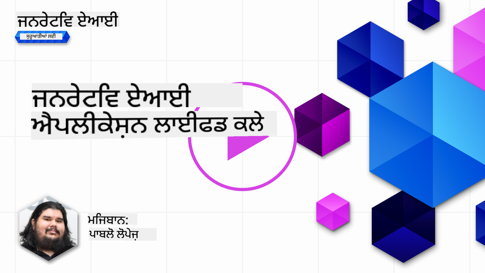
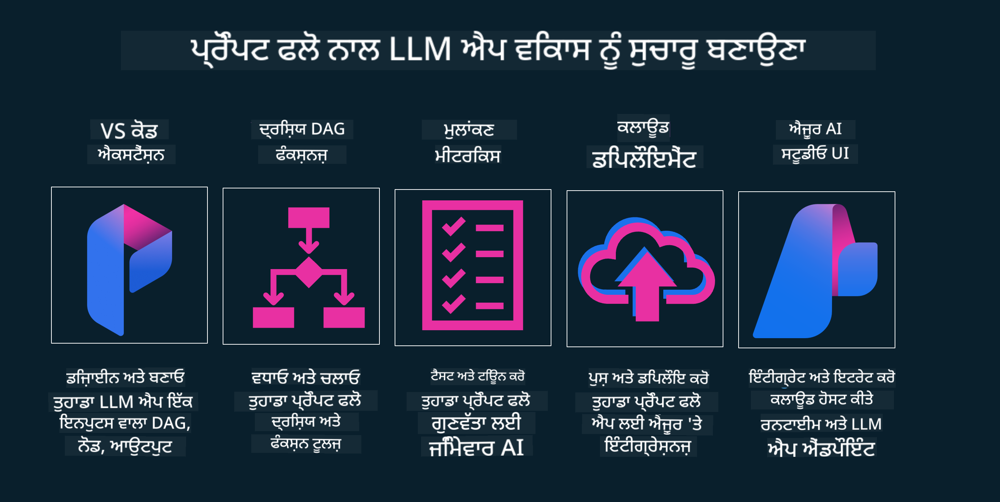

<!--
CO_OP_TRANSLATOR_METADATA:
{
  "original_hash": "b9d32511b27373a1b21b5789d4fda057",
  "translation_date": "2025-10-17T14:13:23+00:00",
  "source_file": "14-the-generative-ai-application-lifecycle/README.md",
  "language_code": "pa"
}
-->

# ਜਨਰੇਟਿਵ AI ਐਪਲੀਕੇਸ਼ਨ ਲਾਈਫਸਾਈਕਲ

ਸਭ AI ਐਪਲੀਕੇਸ਼ਨਾਂ ਲਈ ਇੱਕ ਮਹੱਤਵਪੂਰਨ ਸਵਾਲ ਹੈ AI ਫੀਚਰਾਂ ਦੀ ਪ੍ਰਸੰਗਿਕਤਾ। ਕਿਉਂਕਿ AI ਇੱਕ ਤੇਜ਼ੀ ਨਾਲ ਵਿਕਸਿਤ ਹੋਣ ਵਾਲਾ ਖੇਤਰ ਹੈ, ਇਹ ਯਕੀਨੀ ਬਣਾਉਣ ਲਈ ਕਿ ਤੁਹਾਡੀ ਐਪਲੀਕੇਸ਼ਨ ਪ੍ਰਸੰਗਿਕ, ਭਰੋਸੇਯੋਗ ਅਤੇ ਮਜ਼ਬੂਤ ਰਹੇ, ਤੁਹਾਨੂੰ ਇਸਨੂੰ ਲਗਾਤਾਰ ਮਾਨਟਰ, ਮੁਲਾਂਕਣ ਅਤੇ ਸੁਧਾਰਨਾ ਪਵੇਗਾ। ਇਹੀ ਜਨਰੇਟਿਵ AI ਲਾਈਫਸਾਈਕਲ ਦੀ ਜਰੂਰਤ ਹੈ।

ਜਨਰੇਟਿਵ AI ਲਾਈਫਸਾਈਕਲ ਇੱਕ ਫਰੇਮਵਰਕ ਹੈ ਜੋ ਤੁਹਾਨੂੰ ਜਨਰੇਟਿਵ AI ਐਪਲੀਕੇਸ਼ਨ ਨੂੰ ਵਿਕਸਿਤ, ਤੈਨਾਤ ਅਤੇ ਰੱਖ-ਰਖਾਅ ਕਰਨ ਦੇ ਚਰਣਾਂ ਵਿੱਚ ਮਦਦ ਕਰਦਾ ਹੈ। ਇਹ ਤੁਹਾਨੂੰ ਆਪਣੇ ਲਕਸ਼ਾਂ ਨੂੰ ਪਰਿਭਾਸ਼ਿਤ ਕਰਨ, ਆਪਣੇ ਪ੍ਰਦਰਸ਼ਨ ਨੂੰ ਮਾਪਣ, ਆਪਣੇ ਚੁਣੌਤੀਆਂ ਦੀ ਪਛਾਣ ਕਰਨ ਅਤੇ ਆਪਣੇ ਹੱਲਾਂ ਨੂੰ ਲਾਗੂ ਕਰਨ ਵਿੱਚ ਮਦਦ ਕਰਦਾ ਹੈ। ਇਹ ਤੁਹਾਨੂੰ ਆਪਣੇ ਡੋਮੇਨ ਅਤੇ ਆਪਣੇ ਸਟੇਕਹੋਲਡਰਾਂ ਦੇ ਨੈਤਿਕ ਅਤੇ ਕਾਨੂੰਨੀ ਮਿਆਰਾਂ ਨਾਲ ਆਪਣੀ ਐਪਲੀਕੇਸ਼ਨ ਨੂੰ ਸਥਿਤ ਕਰਨ ਵਿੱਚ ਵੀ ਮਦਦ ਕਰਦਾ ਹੈ। ਜਨਰੇਟਿਵ AI ਲਾਈਫਸਾਈਕਲ ਦੀ ਪਾਲਣਾ ਕਰਕੇ, ਤੁਸੀਂ ਯਕੀਨੀ ਬਣਾਉਂਦੇ ਹੋ ਕਿ ਤੁਹਾਡੀ ਐਪਲੀਕੇਸ਼ਨ ਹਮੇਸ਼ਾ ਮੁੱਲ ਪ੍ਰਦਾਨ ਕਰ ਰਹੀ ਹੈ ਅਤੇ ਤੁਹਾਡੇ ਉਪਭੋਗਤਾਵਾਂ ਨੂੰ ਸੰਤੁਸ਼ਟ ਕਰ ਰਹੀ ਹੈ।

## ਪਰਿਚਯ

ਇਸ ਅਧਿਆਇ ਵਿੱਚ, ਤੁਸੀਂ:

- MLOps ਤੋਂ LLMOps ਤੱਕ ਪੈਰਾਡਾਇਮ ਸ਼ਿਫਟ ਨੂੰ ਸਮਝੋ
- LLM ਲਾਈਫਸਾਈਕਲ
- ਲਾਈਫਸਾਈਕਲ ਟੂਲਿੰਗ
- ਲਾਈਫਸਾਈਕਲ ਮੈਟ੍ਰਿਕੇਸ਼ਨ ਅਤੇ ਮੁਲਾਂਕਣ

## MLOps ਤੋਂ LLMOps ਤੱਕ ਪੈਰਾਡਾਇਮ ਸ਼ਿਫਟ ਨੂੰ ਸਮਝੋ

LLMs ਕਲਾਕਾਰੀ ਇੰਟੈਲੀਜੈਂਸ ਦੇ ਹਥਿਆਰਾਂ ਵਿੱਚ ਇੱਕ ਨਵਾਂ ਸਾਧਨ ਹਨ। ਇਹ ਐਪਲੀਕੇਸ਼ਨਾਂ ਲਈ ਵਿਸ਼ਲੇਸ਼ਣ ਅਤੇ ਜਨਰੇਸ਼ਨ ਕਾਰਜਾਂ ਵਿੱਚ ਬੇਹੱਦ ਸ਼ਕਤੀਸ਼ਾਲੀ ਹਨ। ਹਾਲਾਂਕਿ, ਇਸ ਸ਼ਕਤੀ ਦਾ ਕੁਝ ਪ੍ਰਭਾਵ ਹੁੰਦਾ ਹੈ ਕਿ ਅਸੀਂ AI ਅਤੇ ਕਲਾਸਿਕ ਮਸ਼ੀਨ ਲਰਨਿੰਗ ਕਾਰਜਾਂ ਨੂੰ ਕਿਵੇਂ ਸਧਾਰਨ ਬਣਾਉਂਦੇ ਹਾਂ।

ਇਸ ਨਾਲ, ਸਾਨੂੰ ਇਸ ਸਾਧਨ ਨੂੰ ਗਤੀਸ਼ੀਲ ਵਿੱਚ ਅਨੁਕੂਲ ਕਰਨ ਲਈ ਇੱਕ ਨਵਾਂ ਪੈਰਾਡਾਇਮ ਦੀ ਲੋੜ ਹੈ, ਸਹੀ ਪ੍ਰੇਰਣਾਂ ਦੇ ਨਾਲ। ਅਸੀਂ ਪੁਰਾਣੀਆਂ AI ਐਪਸ ਨੂੰ "ML Apps" ਅਤੇ ਨਵੀਆਂ AI ਐਪਸ ਨੂੰ "GenAI Apps" ਜਾਂ ਸਿਰਫ "AI Apps" ਵਜੋਂ ਸ਼੍ਰੇਣੀਬੱਧ ਕਰ ਸਕਦੇ ਹਾਂ, ਜੋ ਉਸ ਸਮੇਂ ਵਰਤੇ ਗਏ ਮੁੱਖ ਧਾਰਾ ਤਕਨਾਲੋਜੀ ਅਤੇ ਤਕਨੀਕਾਂ ਨੂੰ ਦਰਸਾਉਂਦੇ ਹਨ। ਇਹ ਕਈ ਤਰੀਕਿਆਂ ਵਿੱਚ ਸਾਡੀ ਕਹਾਣੀ ਨੂੰ ਬਦਲਦਾ ਹੈ। ਹੇਠਾਂ ਦਿੱਤੇ ਤੁਲਨਾ ਨੂੰ ਦੇਖੋ।

ਨੋਟ ਕਰੋ ਕਿ LLMOps ਵਿੱਚ, ਅਸੀਂ ਐਪ ਡਿਵੈਲਪਰਾਂ 'ਤੇ ਜ਼ਿਆਦਾ ਧਿਆਨ ਦੇ ਰਹੇ ਹਾਂ, ਇੰਟੀਗ੍ਰੇਸ਼ਨ ਨੂੰ ਇੱਕ ਮੁੱਖ ਬਿੰਦੂ ਵਜੋਂ ਵਰਤਦੇ ਹੋਏ, "Models-as-a-Service" ਵਰਤਦੇ ਹੋਏ ਅਤੇ ਮੈਟ੍ਰਿਕਸ ਲਈ ਹੇਠਾਂ ਦਿੱਤੇ ਬਿੰਦੂਆਂ 'ਤੇ ਸੋਚਦੇ ਹੋਏ:

- ਗੁਣਵੱਤਾ: ਜਵਾਬ ਦੀ ਗੁਣਵੱਤਾ
- ਹਾਨੀ: ਜ਼ਿੰਮੇਵਾਰ AI
- ਸੱਚਾਈ: ਜਵਾਬ ਦੀ ਮਜ਼ਬੂਤੀ (ਕੀ ਇਹ ਸਮਝਦਾਰ ਹੈ? ਕੀ ਇਹ ਸਹੀ ਹੈ?)
- ਲਾਗਤ: ਹੱਲ ਦਾ ਬਜਟ
- ਲੈਟੈਂਸੀ: ਟੋਕਨ ਜਵਾਬ ਲਈ ਔਸਤ ਸਮਾਂ

## LLM ਲਾਈਫਸਾਈਕਲ

ਸਭ ਤੋਂ ਪਹਿਲਾਂ, ਲਾਈਫਸਾਈਕਲ ਅਤੇ ਇਸਦੇ ਸੋਧਾਂ ਨੂੰ ਸਮਝਣ ਲਈ, ਹੇਠਾਂ ਦਿੱਤੇ ਇਨਫੋਗ੍ਰਾਫਿਕ ਨੂੰ ਨੋਟ ਕਰੋ।

ਜਿਵੇਂ ਤੁਸੀਂ ਨੋਟ ਕਰ ਸਕਦੇ ਹੋ, ਇਹ MLOps ਦੇ ਆਮ ਲਾਈਫਸਾਈਕਲ ਤੋਂ ਵੱਖਰਾ ਹੈ। LLMs ਵਿੱਚ ਕਈ ਨਵੇਂ ਜ਼ਰੂਰਤਾਂ ਹਨ, ਜਿਵੇਂ ਕਿ ਪ੍ਰੌਮਪਟਿੰਗ, ਗੁਣਵੱਤਾ ਨੂੰ ਸੁਧਾਰਨ ਲਈ ਵੱਖ-ਵੱਖ ਤਕਨੀਕਾਂ (Fine-Tuning, RAG, Meta-Prompts), ਜ਼ਿੰਮੇਵਾਰ AI ਨਾਲ ਵੱਖਰੀ ਮੁਲਾਂਕਣ ਅਤੇ ਜ਼ਿੰਮੇਵਾਰੀ, ਅਤੇ ਆਖਿਰਕਾਰ, ਨਵੇਂ ਮੁਲਾਂਕਣ ਮੈਟ੍ਰਿਕਸ (ਗੁਣਵੱਤਾ, ਹਾਨੀ, ਸੱਚਾਈ, ਲਾਗਤ ਅਤੇ ਲੈਟੈਂਸੀ)।

ਉਦਾਹਰਣ ਲਈ, ਦੇਖੋ ਕਿ ਅਸੀਂ ਕਿਵੇਂ ਵਿਚਾਰ ਕਰਦੇ ਹਾਂ। ਵੱਖ-ਵੱਖ LLMs ਨਾਲ ਪ੍ਰੌਮਪਟ ਇੰਜੀਨੀਅਰਿੰਗ ਦੀ ਵਰਤੋਂ ਕਰਕੇ ਸੰਭਾਵਨਾਵਾਂ ਦੀ ਪੜਤਾਲ ਕਰਨ ਲਈ ਪ੍ਰਯੋਗ ਕਰਦੇ ਹੋਏ ਜਾਂਚ ਕਰਦੇ ਹਾਂ ਕਿ ਕੀ ਉਨ੍ਹਾਂ ਦਾ ਹਿਪੋਥੈਸਿਸ ਸਹੀ ਹੋ ਸਕਦਾ ਹੈ।

ਨੋਟ ਕਰੋ ਕਿ ਇਹ ਰੇਖੀ ਨਹੀਂ ਹੈ, ਪਰ ਇੰਟੀਗ੍ਰੇਟਿਡ ਲੂਪ, ਦੁਹਰਾਉਣਯੋਗ ਅਤੇ ਇੱਕ ਵਿਆਪਕ ਚੱਕਰ ਦੇ ਨਾਲ ਹੈ।

ਅਸੀਂ ਉਹ ਕਦਮ ਕਿਵੇਂ ਪੜਤਾਲ ਕਰ ਸਕਦੇ ਹਾਂ? ਆਓ ਵੇਖੀਏ ਕਿ ਅਸੀਂ ਇੱਕ ਲਾਈਫਸਾਈਕਲ ਕਿਵੇਂ ਬਣਾਉਂਦੇ ਹਾਂ।

ਇਹ ਕੁਝ ਜਟਿਲ ਲੱਗ ਸਕਦਾ ਹੈ, ਪਹਿਲਾਂ ਤਿੰਨ ਵੱਡੇ ਕਦਮਾਂ 'ਤੇ ਧਿਆਨ ਦਿਓ।

1. ਵਿਚਾਰ ਕਰਨਾ/ਪੜਤਾਲ ਕਰਨਾ: ਪੜਤਾਲ, ਇੱਥੇ ਅਸੀਂ ਆਪਣੇ ਕਾਰੋਬਾਰੀ ਜ਼ਰੂਰਤਾਂ ਦੇ ਅਨੁਸਾਰ ਪੜਤਾਲ ਕਰ ਸਕਦੇ ਹਾਂ। ਪ੍ਰੋਟੋਟਾਈਪਿੰਗ, ਇੱਕ [PromptFlow](https://microsoft.github.io/promptflow/index.html?WT.mc_id=academic-105485-koreyst) ਬਣਾਉਣਾ ਅਤੇ ਜਾਂਚ ਕਰਨਾ ਕਿ ਕੀ ਇਹ ਸਾਡੇ ਹਿਪੋਥੈਸਿਸ ਲਈ ਕਾਫ਼ੀ ਕੁਸ਼ਲ ਹੈ।
1. ਬਣਾਉਣਾ/ਵਧਾਉਣਾ: ਲਾਗੂ ਕਰਨਾ, ਹੁਣ, ਅਸੀਂ ਵੱਡੇ ਡੇਟਾਸੈਟ ਲਈ ਮੁਲਾਂਕਣ ਕਰਨਾ ਸ਼ੁਰੂ ਕਰਦੇ ਹਾਂ, ਤਕਨੀਕਾਂ ਨੂੰ ਲਾਗੂ ਕਰਦੇ ਹਾਂ, ਜਿਵੇਂ ਕਿ Fine-tuning ਅਤੇ RAG, ਇਹ ਜਾਂਚਣ ਲਈ ਕਿ ਸਾਡਾ ਹੱਲ ਕਿੰਨਾ ਮਜ਼ਬੂਤ ਹੈ। ਜੇ ਇਹ ਨਹੀਂ ਹੈ, ਤਾਂ ਇਸਨੂੰ ਮੁੜ ਲਾਗੂ ਕਰਨਾ, ਸਾਡੇ ਫਲੋ ਵਿੱਚ ਨਵੇਂ ਕਦਮ ਸ਼ਾਮਲ ਕਰਨਾ ਜਾਂ ਡੇਟਾ ਨੂੰ ਮੁੜ ਸੰਰਚਿਤ ਕਰਨਾ ਮਦਦਗਾਰ ਹੋ ਸਕਦਾ ਹੈ। ਸਾਡੇ ਫਲੋ ਅਤੇ ਸਾਡੇ ਪੈਮਾਨੇ ਦੀ ਜਾਂਚ ਕਰਨ ਤੋਂ ਬਾਅਦ, ਜੇ ਇਹ ਕੰਮ ਕਰਦਾ ਹੈ ਅਤੇ ਸਾਡੇ ਮੈਟ੍ਰਿਕਸ ਦੀ ਜਾਂਚ ਕਰਦਾ ਹੈ, ਤਾਂ ਇਹ ਅਗਲੇ ਕਦਮ ਲਈ ਤਿਆਰ ਹੈ।
1. ਓਪਰੇਸ਼ਨਲਾਈਜ਼ ਕਰਨਾ: ਇੰਟੀਗ੍ਰੇਸ਼ਨ, ਹੁਣ ਸਾਡੇ ਸਿਸਟਮ ਵਿੱਚ ਮਾਨਟਰਿੰਗ ਅਤੇ ਅਲਰਟ ਸਿਸਟਮ ਸ਼ਾਮਲ ਕਰਨਾ, ਤੈਨਾਤੀ ਅਤੇ ਸਾਡੇ ਐਪਲੀਕੇਸ਼ਨ ਵਿੱਚ ਐਪਲੀਕੇਸ਼ਨ ਇੰਟੀਗ੍ਰੇਸ਼ਨ।

ਫਿਰ, ਸੁਰੱਖਿਆ, ਅਨੁਕੂਲਤਾ ਅਤੇ ਸ਼ਾਸਨ 'ਤੇ ਧਿਆਨ ਦੇਣ ਵਾਲੇ ਪ੍ਰਬੰਧਨ ਦੇ ਵਿਆਪਕ ਚੱਕਰ ਹੁੰਦੇ ਹਨ।

ਵਧਾਈਆਂ, ਹੁਣ ਤੁਹਾਡੀ AI ਐਪ ਤਿਆਰ ਹੈ ਅਤੇ ਚਾਲੂ ਹੈ। ਹੱਥ-ਅਨੁਭਵ ਲਈ, [Contoso Chat Demo](https://nitya.github.io/contoso-chat/?WT.mc_id=academic-105485-koreys) 'ਤੇ ਨਜ਼ਰ ਮਾਰੋ।

ਹੁਣ, ਅਸੀਂ ਕਿਹੜੇ ਸਾਧਨ ਵਰਤ ਸਕਦੇ ਹਾਂ?

## ਲਾਈਫਸਾਈਕਲ ਟੂਲਿੰਗ

ਟੂਲਿੰਗ ਲਈ, ਮਾਈਕਰੋਸਾਫਟ [Azure AI Platform](https://azure.microsoft.com/solutions/ai/?WT.mc_id=academic-105485-koreys) ਅਤੇ [PromptFlow](https://microsoft.github.io/promptflow/index.html?WT.mc_id=academic-105485-koreyst) ਪ੍ਰਦਾਨ ਕਰਦਾ ਹੈ ਜੋ ਤੁਹਾਡਾ ਚੱਕਰ ਲਾਗੂ ਕਰਨ ਅਤੇ ਤਿਆਰ ਕਰਨ ਲਈ ਆਸਾਨ ਬਣਾਉਂਦਾ ਹੈ।

[Azure AI Platform](https://azure.microsoft.com/solutions/ai/?WT.mc_id=academic-105485-koreys), ਤੁਹਾਨੂੰ [AI Studio](https://ai.azure.com/?WT.mc_id=academic-105485-koreys) ਵਰਤਣ ਦੀ ਆਗਿਆ ਦਿੰਦਾ ਹੈ। AI Studio ਇੱਕ ਵੈੱਬ ਪੋਰਟਲ ਹੈ ਜੋ ਤੁਹਾਨੂੰ ਮਾਡਲ, ਨਮੂਨੇ ਅਤੇ ਸਾਧਨ ਪੜਤਾਲ ਕਰਨ ਦੀ ਆਗਿਆ ਦਿੰਦਾ ਹੈ। ਤੁਹਾਡੇ ਸਰੋਤਾਂ ਦਾ ਪ੍ਰਬੰਧਨ ਕਰਨਾ, UI ਵਿਕਾਸ ਫਲੋ ਅਤੇ SDK/CLI ਵਿਕਲਪਾਂ ਲਈ ਕੋਡ-ਪਹਿਲਾਂ ਵਿਕਾਸ।

Azure AI, ਤੁਹਾਨੂੰ ਕਈ ਸਰੋਤਾਂ ਵਰਤਣ ਦੀ ਆਗਿਆ ਦਿੰਦਾ ਹੈ, ਤੁਹਾਡੇ ਓਪਰੇਸ਼ਨ, ਸੇਵਾਵਾਂ, ਪ੍ਰੋਜੈਕਟਾਂ, ਵੈਕਟਰ ਖੋਜ ਅਤੇ ਡੇਟਾਬੇਸ ਦੀਆਂ ਜ਼ਰੂਰਤਾਂ ਦਾ ਪ੍ਰਬੰਧਨ ਕਰਨ ਲਈ।

Proof-of-Concept(POC) ਤੋਂ ਵੱਡੇ ਪੈਮਾਨੇ ਦੀਆਂ ਐਪਲੀਕੇਸ਼ਨਾਂ ਤੱਕ PromptFlow ਨਾਲ ਬਣਾਓ:

- VS Code ਤੋਂ ਐਪਸ ਡਿਜ਼ਾਈਨ ਅਤੇ ਬਣਾਓ, ਵਿਜ਼ੁਅਲ ਅਤੇ ਫੰਕਸ਼ਨਲ ਸਾਧਨਾਂ ਨਾਲ
- ਆਪਣੇ ਐਪਸ ਨੂੰ ਆਸਾਨੀ ਨਾਲ ਗੁਣਵੱਤਾ AI ਲਈ ਜਾਂਚੋ ਅਤੇ ਸੁਧਾਰੋ।
- Azure AI Studio ਦੀ ਵਰਤੋਂ ਕਰੋ ਕਲਾਉਡ ਨਾਲ ਇੰਟੀਗ੍ਰੇਟ ਅਤੇ ਇਟਰੇਟ ਕਰਨ ਲਈ, ਤੇਜ਼ ਇੰਟੀਗ੍ਰੇਸ਼ਨ ਲਈ ਪੁਸ਼ ਅਤੇ ਤੈਨਾਤ ਕਰੋ।

## ਸ਼ਾਨਦਾਰ! ਆਪਣਾ ਸਿੱਖਣਾ ਜਾਰੀ ਰੱਖੋ!

ਸ਼ਾਨਦਾਰ, ਹੁਣ ਸਿੱਖੋ ਕਿ ਅਸੀਂ ਇੱਕ ਐਪਲੀਕੇਸ਼ਨ ਨੂੰ ਕਿਵੇਂ ਬਣਾਉਂਦੇ ਹਾਂ ਜੋ [Contoso Chat App](https://nitya.github.io/contoso-chat/?WT.mc_id=academic-105485-koreyst) ਦੇ ਨਾਲ ਸੰਕਲਪਾਂ ਦੀ ਵਰਤੋਂ ਕਰਦਾ ਹੈ, ਇਹ ਜਾਂਚਣ ਲਈ ਕਿ ਕਿਵੇਂ ਕਲਾਉਡ ਐਡਵੋਕੇਸੀ ਡੈਮੋਨਸਟਰੇਸ਼ਨ ਵਿੱਚ ਉਹ ਸੰਕਲਪ ਸ਼ਾਮਲ ਕਰਦਾ ਹੈ। ਹੋਰ ਸਮੱਗਰੀ ਲਈ, ਸਾਡਾ [Ignite breakout session](https://www.youtube.com/watch?v=DdOylyrTOWg) ਦੇਖੋ!

ਹੁਣ, ਪਾਠ 15 ਦੀ ਜਾਂਚ ਕਰੋ, ਇਹ ਸਮਝਣ ਲਈ ਕਿ [Retrieval Augmented Generation and Vector Databases](../15-rag-and-vector-databases/README.md?WT.mc_id=academic-105485-koreyst) ਜਨਰੇਟਿਵ AI 'ਤੇ ਕਿਵੇਂ ਪ੍ਰਭਾਵ ਪਾਉਂਦੇ ਹਨ ਅਤੇ ਹੋਰ ਆਕਰਸ਼ਕ ਐਪਲੀਕੇਸ਼ਨ ਬਣਾਉਣ ਲਈ!

---

**ਅਸਵੀਕਰਤੀ**:  
ਇਹ ਦਸਤਾਵੇਜ਼ AI ਅਨੁਵਾਦ ਸੇਵਾ [Co-op Translator](https://github.com/Azure/co-op-translator) ਦੀ ਵਰਤੋਂ ਕਰਕੇ ਅਨੁਵਾਦ ਕੀਤਾ ਗਿਆ ਹੈ। ਜਦੋਂ ਕਿ ਅਸੀਂ ਸਹੀ ਹੋਣ ਦੀ ਕੋਸ਼ਿਸ਼ ਕਰਦੇ ਹਾਂ, ਕਿਰਪਾ ਕਰਕੇ ਧਿਆਨ ਦਿਓ ਕਿ ਸਵੈਚਾਲਿਤ ਅਨੁਵਾਦਾਂ ਵਿੱਚ ਗਲਤੀਆਂ ਜਾਂ ਅਸੁਚੀਤਤਾਵਾਂ ਹੋ ਸਕਦੀਆਂ ਹਨ। ਇਸਦੀ ਮੂਲ ਭਾਸ਼ਾ ਵਿੱਚ ਮੂਲ ਦਸਤਾਵੇਜ਼ ਨੂੰ ਅਧਿਕਾਰਤ ਸਰੋਤ ਮੰਨਿਆ ਜਾਣਾ ਚਾਹੀਦਾ ਹੈ। ਮਹੱਤਵਪੂਰਨ ਜਾਣਕਾਰੀ ਲਈ, ਪੇਸ਼ੇਵਰ ਮਨੁੱਖੀ ਅਨੁਵਾਦ ਦੀ ਸਿਫਾਰਸ਼ ਕੀਤੀ ਜਾਂਦੀ ਹੈ। ਇਸ ਅਨੁਵਾਦ ਦੀ ਵਰਤੋਂ ਤੋਂ ਪੈਦਾ ਹੋਣ ਵਾਲੇ ਕਿਸੇ ਵੀ ਗਲਤਫਹਿਮੀ ਜਾਂ ਗਲਤ ਵਿਆਖਿਆ ਲਈ ਅਸੀਂ ਜ਼ਿੰਮੇਵਾਰ ਨਹੀਂ ਹਾਂ।