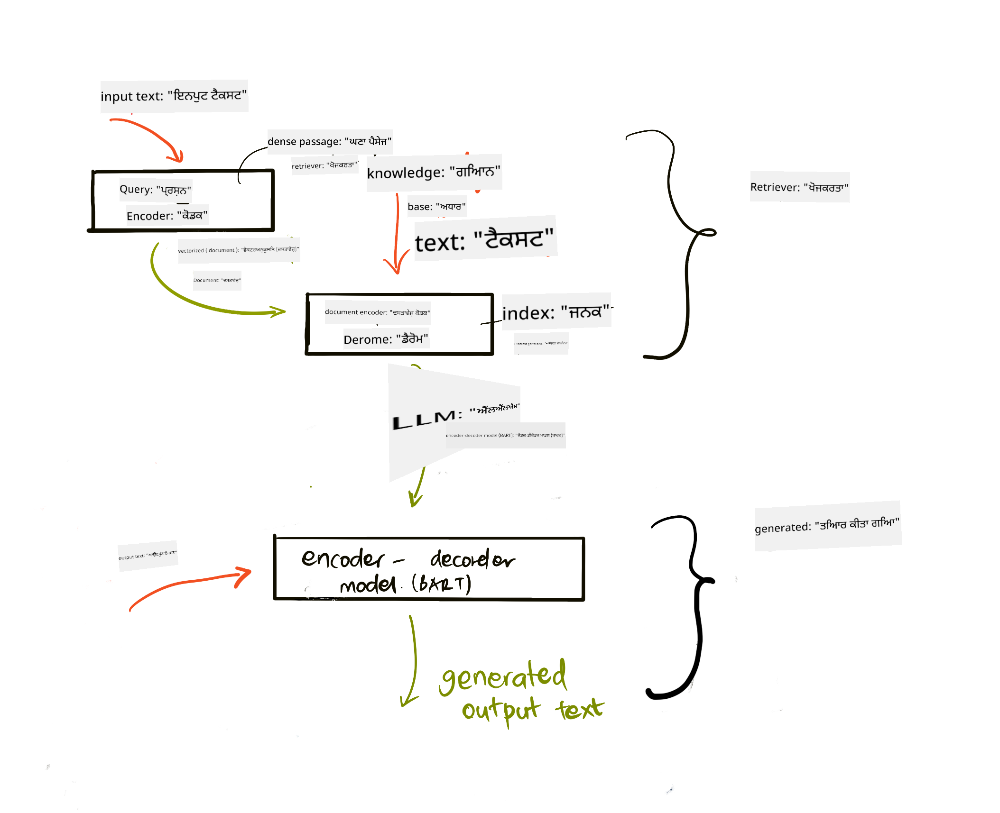
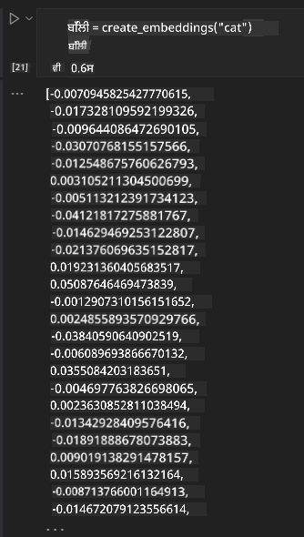

<!--
CO_OP_TRANSLATOR_METADATA:
{
  "original_hash": "e2861bbca91c0567ef32bc77fe054f9e",
  "translation_date": "2025-05-20T01:13:08+00:00",
  "source_file": "15-rag-and-vector-databases/README.md",
  "language_code": "pa"
}
-->
# ਰੀਟ੍ਰੀਵਲ ਅਗਮੈਂਟਡ ਜਨਰੇਸ਼ਨ (RAG) ਅਤੇ ਵੈਕਟਰ ਡਾਟਾਬੇਸ

ਸਰਚ ਐਪਲੀਕੇਸ਼ਨਜ਼ ਪਾਠ ਵਿੱਚ, ਅਸੀਂ ਸੰਖੇਪ ਵਿੱਚ ਸਿੱਖਿਆ ਕਿ ਤੁਹਾਡੇ ਆਪਣੇ ਡਾਟਾ ਨੂੰ ਵੱਡੇ ਭਾਸ਼ਾ ਮਾਡਲਾਂ (LLMs) ਵਿੱਚ ਕਿਵੇਂ ਜੋੜਨਾ ਹੈ। ਇਸ ਪਾਠ ਵਿੱਚ, ਅਸੀਂ ਤੁਹਾਡੇ ਡਾਟਾ ਨੂੰ ਤੁਹਾਡੇ LLM ਐਪਲੀਕੇਸ਼ਨ ਵਿੱਚ ਜ਼ਮੀਨਦਾਰ ਕਰਨ ਦੇ ਸੰਕਲਪਾਂ, ਪ੍ਰਕਿਰਿਆ ਦੀ ਮਕੈਨਿਕਸ ਅਤੇ ਡਾਟਾ ਸਟੋਰ ਕਰਨ ਦੇ ਤਰੀਕਿਆਂ, ਦੋਵੇਂ ਐਮਬੈਡਿੰਗ ਅਤੇ ਟੈਕਸਟ ਸਮੇਤ ਹੋਰ ਗਹਿਰਾਈ ਨਾਲ ਜਾਣਕਾਰੀ ਪ੍ਰਾਪਤ ਕਰਾਂਗੇ।

> **ਵੀਡੀਓ ਜਲਦੀ ਆ ਰਹੀ ਹੈ**

## ਪਰਿਚਯ

ਇਸ ਪਾਠ ਵਿੱਚ ਅਸੀਂ ਹੇਠ ਲਿਖੇ ਵਿਸ਼ਿਆਂ ਨੂੰ ਕਵਰ ਕਰਾਂਗੇ:

- RAG ਦਾ ਪਰਿਚਯ, ਇਹ ਕੀ ਹੈ ਅਤੇ ਕਿਉਂ AI (ਕ੍ਰਿਤਰਿਮ ਬੁੱਧੀ) ਵਿੱਚ ਇਸਦਾ ਇਸਤੇਮਾਲ ਕੀਤਾ ਜਾਂਦਾ ਹੈ।

- ਵੈਕਟਰ ਡਾਟਾਬੇਸ ਕੀ ਹਨ ਅਤੇ ਸਾਡੇ ਐਪਲੀਕੇਸ਼ਨ ਲਈ ਇੱਕ ਬਣਾਉਣਾ ਸਮਝਣਾ।

- ਇੱਕ ਵਿਹਾਰਕ ਉਦਾਹਰਣ ਕਿ RAG ਨੂੰ ਐਪਲੀਕੇਸ਼ਨ ਵਿੱਚ ਕਿਵੇਂ ਜੋੜਿਆ ਜਾਵੇ।

## ਸਿੱਖਣ ਦੇ ਲਕਸ਼

ਇਹ ਪਾਠ ਪੂਰਾ ਕਰਨ ਦੇ ਬਾਅਦ, ਤੁਸੀਂ ਕਰ ਸਕੋਗੇ:

- ਡਾਟਾ ਰੀਟ੍ਰੀਵਲ ਅਤੇ ਪ੍ਰਕਿਰਿਆ ਵਿੱਚ RAG ਦੇ ਮਹੱਤਵ ਦੀ ਵਿਆਖਿਆ ਕਰੋ।

- RAG ਐਪਲੀਕੇਸ਼ਨ ਸੈਟਅਪ ਕਰੋ ਅਤੇ ਆਪਣੇ ਡਾਟਾ ਨੂੰ LLM ਵਿੱਚ ਜ਼ਮੀਨਦਾਰ ਕਰੋ

- LLM ਐਪਲੀਕੇਸ਼ਨਜ਼ ਵਿੱਚ RAG ਅਤੇ ਵੈਕਟਰ ਡਾਟਾਬੇਸ ਦੀ ਪ੍ਰਭਾਵਸ਼ਾਲੀ ਇੰਟੀਗ੍ਰੇਸ਼ਨ।

## ਸਾਡਾ ਸਿਨਾਰੀਓ: ਆਪਣੇ LLMs ਨੂੰ ਆਪਣੇ ਡਾਟਾ ਨਾਲ ਸੁਧਾਰਨਾ

ਇਸ ਪਾਠ ਲਈ, ਅਸੀਂ ਚਾਹੁੰਦੇ ਹਾਂ ਕਿ ਸਾਡੇ ਆਪਣੇ ਨੋਟਸ ਨੂੰ ਸਿੱਖਿਆ ਸਟਾਰਟਅਪ ਵਿੱਚ ਸ਼ਾਮਲ ਕੀਤਾ ਜਾਵੇ, ਜੋ ਚੈਟਬੋਟ ਨੂੰ ਵੱਖ-ਵੱਖ ਵਿਸ਼ਿਆਂ ਬਾਰੇ ਹੋਰ ਜਾਣਕਾਰੀ ਪ੍ਰਾਪਤ ਕਰਨ ਦੀ ਆਗਿਆ ਦਿੰਦਾ ਹੈ। ਸਾਡੇ ਕੋਲ ਮੌਜੂਦ ਨੋਟਸ ਦੀ ਵਰਤੋਂ ਕਰਕੇ, ਵਿਦਿਆਰਥੀ ਵੱਖ-ਵੱਖ ਵਿਸ਼ਿਆਂ ਨੂੰ ਬਿਹਤਰ ਢੰਗ ਨਾਲ ਅਧਿਐਨ ਕਰਨ ਅਤੇ ਸਮਝਣ ਦੇ ਯੋਗ ਹੋਣਗੇ, ਜਿਸ ਨਾਲ ਉਹਨਾਂ ਦੇ ਇਮਤਿਹਾਨਾਂ ਦੀ ਦੁਹਰਾਈ ਕਰਨਾ ਆਸਾਨ ਹੋ ਜਾਵੇਗਾ। ਸਾਡਾ ਸਿਨਾਰੀਓ ਬਣਾਉਣ ਲਈ, ਅਸੀਂ ਵਰਤਾਂਗੇ:

- `Azure OpenAI:` LLM ਜੋ ਅਸੀਂ ਆਪਣੇ ਚੈਟਬੋਟ ਨੂੰ ਬਣਾਉਣ ਲਈ ਵਰਤਾਂਗੇ

- `AI for beginners' lesson on Neural Networks`: ਇਹ ਉਹ ਡਾਟਾ ਹੋਵੇਗਾ ਜਿਸ 'ਤੇ ਅਸੀਂ ਆਪਣਾ LLM ਅਧਾਰਿਤ ਕਰਾਂਗੇ

- `Azure AI Search` ਅਤੇ `Azure Cosmos DB:` ਵੈਕਟਰ ਡਾਟਾਬੇਸ ਸਾਡੇ ਡਾਟਾ ਨੂੰ ਸਟੋਰ ਕਰਨ ਅਤੇ ਇੱਕ ਖੋਜ ਸੂਚਕਾਂਕ ਬਣਾਉਣ ਲਈ

ਵਰਤੋਂਕਾਰ ਆਪਣੇ ਨੋਟਸ ਤੋਂ ਪ੍ਰੈਕਟਿਸ ਕਵਿਜ਼, ਰਿਵੀਜ਼ਨ ਫਲੈਸ਼ ਕਾਰਡ ਅਤੇ ਸੰਖੇਪ ਝਲਕੀਆਂ ਬਣਾਉਣ ਦੇ ਯੋਗ ਹੋਣਗੇ। ਸ਼ੁਰੂ ਕਰਨ ਲਈ, ਆਓ ਵੇਖੀਏ ਕਿ RAG ਕੀ ਹੈ ਅਤੇ ਕਿਵੇਂ ਕੰਮ ਕਰਦਾ ਹੈ:

## ਰੀਟ੍ਰੀਵਲ ਅਗਮੈਂਟਡ ਜਨਰੇਸ਼ਨ (RAG)

ਇੱਕ LLM ਸੰਚਾਲਿਤ ਚੈਟਬੋਟ ਵਰਤੋਂਕਾਰ ਦੇ ਪ੍ਰੋੰਪਟਸ ਨੂੰ ਪ੍ਰਕਿਰਿਆ ਕਰਕੇ ਜਵਾਬ ਪੈਦਾ ਕਰਦਾ ਹੈ। ਇਹ ਇੰਟਰੈਕਟਿਵ ਹੋਣ ਲਈ ਡਿਜ਼ਾਈਨ ਕੀਤਾ ਗਿਆ ਹੈ ਅਤੇ ਵੱਖ-ਵੱਖ ਵਿਸ਼ਿਆਂ 'ਤੇ ਵਰਤੋਂਕਾਰਾਂ ਨਾਲ ਸੰਲਗਨ ਹੁੰਦਾ ਹੈ। ਹਾਲਾਂਕਿ, ਇਸਦੇ ਜਵਾਬ ਪ੍ਰਦਾਨ ਕੀਤੇ ਗਏ ਸੰਦਰਭ ਅਤੇ ਇਸਦੇ ਬੁਨਿਆਦੀ ਪ੍ਰਸ਼ਿਕਸ਼ਣ ਡਾਟਾ ਤੱਕ ਸੀਮਿਤ ਹਨ। ਉਦਾਹਰਨ ਲਈ, GPT-4 ਦਾ ਗਿਆਨ ਕਟਾਫ ਸਤੰਬਰ 2021 ਹੈ, ਜਿਸਦਾ ਮਤਲਬ ਹੈ ਕਿ ਇਸ ਨੂੰ ਇਸ ਪੀਰੀਅਡ ਤੋਂ ਬਾਅਦ ਹੋਈਆਂ ਘਟਨਾਵਾਂ ਦੀ ਜਾਣਕਾਰੀ ਨਹੀਂ ਹੈ। ਇਸਦੇ ਇਲਾਵਾ, LLMs ਨੂੰ ਪ੍ਰਸ਼ਿਕਸ਼ਿਤ ਕਰਨ ਲਈ ਵਰਤੇ ਜਾਣ ਵਾਲੇ ਡਾਟਾ ਵਿੱਚ ਨਿੱਜੀ ਨੋਟਸ ਜਾਂ ਕਿਸੇ ਕੰਪਨੀ ਦੇ ਉਤਪਾਦ ਮੈਨੂਅਲ ਵਰਗਾ ਗੁਪਤ ਜਾਣਕਾਰੀ ਸ਼ਾਮਲ ਨਹੀਂ ਹੁੰਦੀ।

### RAGs (ਰੀਟ੍ਰੀਵਲ ਅਗਮੈਂਟਡ ਜਨਰੇਸ਼ਨ) ਕਿਵੇਂ ਕੰਮ ਕਰਦੇ ਹਨ


ਮੰਨ ਲਓ ਕਿ ਤੁਸੀਂ ਇੱਕ ਚੈਟਬੋਟ ਤੈਨਾਤ ਕਰਨਾ ਚਾਹੁੰਦੇ ਹੋ ਜੋ ਤੁਹਾਡੇ ਨੋਟਸ ਤੋਂ ਕਵਿਜ਼ ਬਣਾਉਂਦਾ ਹੈ, ਤੁਹਾਨੂੰ ਗਿਆਨ ਦੇ ਅਧਾਰ ਨਾਲ ਕਨੈਕਸ਼ਨ ਦੀ ਲੋੜ ਹੋਵੇਗੀ। ਇਹ ਉਹ ਜਗ੍ਹਾ ਹੈ ਜਿੱਥੇ RAG ਬਚਾਉਂਦਾ ਹੈ। RAGs ਹੇਠ ਲਿਖੇ ਤਰੀਕੇ ਨਾਲ ਕੰਮ ਕਰਦੇ ਹਨ:

- **ਗਿਆਨ ਦੇ ਅਧਾਰ:** ਰੀਟ੍ਰੀਵਲ ਤੋਂ ਪਹਿਲਾਂ, ਇਹ ਦਸਤਾਵੇਜ਼ ਹਜ਼ਮ ਅਤੇ ਪ੍ਰੀ-ਪ੍ਰੋਸੈਸ ਕੀਤੇ ਜਾਣ ਦੀ ਲੋੜ ਹੈ, ਆਮ ਤੌਰ 'ਤੇ ਵੱਡੇ ਦਸਤਾਵੇਜ਼ਾਂ ਨੂੰ ਛੋਟੇ ਹਿੱਸਿਆਂ ਵਿੱਚ ਤੋੜਨਾ, ਉਹਨਾਂ ਨੂੰ ਟੈਕਸਟ ਐਮਬੈਡਿੰਗ ਵਿੱਚ ਬਦਲਣਾ ਅਤੇ ਉਹਨਾਂ ਨੂੰ ਡਾਟਾਬੇਸ ਵਿੱਚ ਸਟੋਰ ਕਰਨਾ।

- **ਵਰਤੋਂਕਾਰ ਪੁੱਛਗਿੱਛ:** ਵਰਤੋਂਕਾਰ ਇੱਕ ਸਵਾਲ ਪੁੱਛਦਾ ਹੈ

- **ਰੀਟ੍ਰੀਵਲ:** ਜਦੋਂ ਇੱਕ ਵਰਤੋਂਕਾਰ ਇੱਕ ਸਵਾਲ ਪੁੱਛਦਾ ਹੈ, ਐਮਬੈਡਿੰਗ ਮਾਡਲ ਸਾਡੇ ਗਿਆਨ ਦੇ ਅਧਾਰ ਤੋਂ ਸੰਦਰਭ ਪ੍ਰਦਾਨ ਕਰਨ ਲਈ ਸਬੰਧਤ ਜਾਣਕਾਰੀ ਨੂੰ ਰੀਟ੍ਰੀਵ ਕਰਦਾ ਹੈ ਜੋ ਪ੍ਰੋੰਪਟ ਵਿੱਚ ਸ਼ਾਮਲ ਕੀਤੀ ਜਾਵੇਗੀ।

- **ਅਗਮੈਂਟਡ ਜਨਰੇਸ਼ਨ:** LLM ਪ੍ਰਾਪਤ ਡਾਟਾ ਦੇ ਆਧਾਰ 'ਤੇ ਆਪਣੇ ਜਵਾਬ ਨੂੰ ਸੁਧਾਰਦਾ ਹੈ। ਇਹ ਪ੍ਰਦਾਨ ਕਰਦਾ ਹੈ ਕਿ ਜਵਾਬ ਸਿਰਫ ਪ੍ਰੀ-ਟ੍ਰੇਨਡ ਡਾਟਾ ਦੇ ਆਧਾਰ 'ਤੇ ਨਹੀਂ ਹੈ, ਸਗੋਂ ਸ਼ਾਮਲ ਸੰਦਰਭ ਤੋਂ ਸਬੰਧਤ ਜਾਣਕਾਰੀ ਵੀ ਹੈ। ਪ੍ਰਾਪਤ ਡਾਟਾ LLM ਦੇ ਜਵਾਬਾਂ ਨੂੰ ਵਧਾਉਣ ਲਈ ਵਰਤਿਆ ਜਾਂਦਾ ਹੈ। ਫਿਰ LLM ਵਰਤੋਂਕਾਰ ਦੇ ਸਵਾਲ ਦਾ ਜਵਾਬ ਦਿੰਦਾ ਹੈ।



RAGs ਲਈ ਆਰਕੀਟੈਕਚਰ ਨੂੰ ਦੋ ਹਿੱਸਿਆਂ ਵਿੱਚ ਸ਼ਾਮਲ ਟ੍ਰਾਂਸਫਾਰਮਰਜ਼ ਦੀ ਵਰਤੋਂ ਕਰਕੇ ਲਾਗੂ ਕੀਤਾ ਗਿਆ ਹੈ: ਇੱਕ ਐਨਕੋਡਰ ਅਤੇ ਇੱਕ ਡੀਕੋਡਰ। ਉਦਾਹਰਣ ਲਈ, ਜਦੋਂ ਇੱਕ ਵਰਤੋਂਕਾਰ ਇੱਕ ਸਵਾਲ ਪੁੱਛਦਾ ਹੈ, ਇਨਪੁਟ ਟੈਕਸਟ ਨੂੰ 'ਐਨਕੋਡ' ਕੀਤਾ ਜਾਂਦਾ ਹੈ ਜੋ ਸ਼ਬਦਾਂ ਦੇ ਅਰਥ ਨੂੰ ਕੈਪਚਰ ਕਰਨ ਵਾਲੇ ਵੈਕਟਰਾਂ ਵਿੱਚ ਬਦਲਦਾ ਹੈ ਅਤੇ ਵੈਕਟਰਾਂ ਨੂੰ ਸਾਡੇ ਦਸਤਾਵੇਜ਼ ਸੂਚਕਾਂਕ ਵਿੱਚ 'ਡੀਕੋਡ' ਕੀਤਾ ਜਾਂਦਾ ਹੈ ਅਤੇ ਵਰਤੋਂਕਾਰ ਦੀ ਪੁੱਛਗਿੱਛ ਦੇ ਆਧਾਰ 'ਤੇ ਨਵਾਂ ਟੈਕਸਟ ਪੈਦਾ ਕਰਦਾ ਹੈ। LLM ਆਉਟਪੁੱਟ ਪੈਦਾ ਕਰਨ ਲਈ ਦੋਵੇਂ ਐਨਕੋਡਰ-ਡੀਕੋਡਰ ਮਾਡਲ ਦੀ ਵਰਤੋਂ ਕਰਦਾ ਹੈ।

ਪੇਸ਼ ਕੀਤੇ ਪੇਪਰ ਅਨੁਸਾਰ RAG ਨੂੰ ਲਾਗੂ ਕਰਦੇ ਸਮੇਂ ਦੋ ਦ੍ਰਿਸ਼ਟੀਕੋਣ ਹਨ: [ਜਾਣਕਾਰੀ-ਗਹਿਰੇ NLP (ਕੁਦਰਤੀ ਭਾਸ਼ਾ ਪ੍ਰਕਿਰਿਆ ਸਾਫਟਵੇਅਰ) ਕਾਰਜਾਂ ਲਈ ਰੀਟ੍ਰੀਵਲ-ਅਗਮੈਂਟਡ ਜਨਰੇਸ਼ਨ](https://arxiv.org/pdf/2005.11401.pdf?WT.mc_id=academic-105485-koreyst):

- **_RAG-ਸੀਕਵੈਂਸ_** ਵਰਤੋਂਕਾਰ ਦੀ ਪੁੱਛਗਿੱਛ ਦਾ ਸਭ ਤੋਂ ਵਧੀਆ ਸੰਭਾਵੀ ਜਵਾਬ ਭਵਿੱਖਬਾਣੀ ਕਰਨ ਲਈ ਰੀਟ੍ਰੀਵ ਕੀਤੇ ਦਸਤਾਵੇਜ਼ਾਂ ਦੀ ਵਰਤੋਂ ਕਰਨਾ

- **RAG-ਟੋਕਨ** ਦਸਤਾਵੇਜ਼ਾਂ ਦੀ ਵਰਤੋਂ ਕਰਕੇ ਅਗਲਾ ਟੋਕਨ ਪੈਦਾ ਕਰਨਾ, ਫਿਰ ਉਹਨਾਂ ਨੂੰ ਵਰਤੋਂਕਾਰ ਦੀ ਪੁੱਛਗਿੱਛ ਦਾ ਜਵਾਬ ਦੇਣ ਲਈ ਰੀਟ੍ਰੀਵ ਕਰਨਾ

### ਤੁਸੀਂ RAGs ਦਾ ਇਸਤੇਮਾਲ ਕਿਉਂ ਕਰੋਗੇ?

- **ਜਾਣਕਾਰੀ ਦੀ ਭਰਪੂਰਤਾ:** ਇਹ ਯਕੀਨੀ ਬਣਾਉਂਦਾ ਹੈ ਕਿ ਟੈਕਸਟ ਜਵਾਬ ਅਪ-ਟੂ-ਡੇਟ ਅਤੇ ਮੌਜੂਦਾ ਹਨ। ਇਸ ਲਈ, ਇਹ ਡੋਮੇਨ ਵਿਸ਼ੇਸ਼ ਕਾਰਜਾਂ 'ਤੇ ਪ੍ਰਦਰਸ਼ਨ ਨੂੰ ਵਧਾਉਂਦਾ ਹੈ ਦੁਆਰਾ ਅੰਦਰੂਨੀ ਗਿਆਨ ਦੇ ਅਧਾਰ ਤੱਕ ਪਹੁੰਚ ਪ੍ਰਾਪਤ ਕਰਨਾ।

- **ਪ੍ਰਮਾਣਿਤ ਡਾਟਾ** ਨੂੰ ਵਰਤ ਕੇ ਵਰਤੋਂਕਾਰ ਦੀ ਪੁੱਛਗਿੱਛਾਂ ਨੂੰ ਸੰਦਰਭ ਪ੍ਰਦਾਨ ਕਰਨ ਲਈ ਗਿਆਨ ਦੇ ਅਧਾਰ ਵਿੱਚ ਕਥਨ ਨੂੰ ਘਟਾਉਂਦਾ ਹੈ।

- ਇਹ **ਲਾਗਤ ਪ੍ਰਭਾਵਸ਼ਾਲੀ** ਹੈ ਕਿਉਂਕਿ ਉਹ ਇੱਕ LLM ਨੂੰ ਸੁਧਾਰਨ ਦੇ ਮੁਕਾਬਲੇ ਵੱਧ ਆਰਥਿਕ ਹਨ

## ਗਿਆਨ ਦੇ ਅਧਾਰ ਬਣਾਉਣਾ

ਸਾਡਾ ਐਪਲੀਕੇਸ਼ਨ ਸਾਡੇ ਨਿੱਜੀ ਡਾਟਾ ਉੱਤੇ ਅਧਾਰਿਤ ਹੈ ਜਿਵੇਂ ਕਿ ਨਿਊਰਲ ਨੈਟਵਰਕ ਪਾਠ AI ਫਾਰ ਬਿਗਨਰਜ਼ ਪਾਠਕ੍ਰਮ 'ਤੇ।

### ਵੈਕਟਰ ਡਾਟਾਬੇਸ

ਇੱਕ ਵੈਕਟਰ ਡਾਟਾਬੇਸ, ਪਰੰਪਰਾਗਤ ਡਾਟਾਬੇਸਾਂ ਦੇ ਵਿਰੁੱਧ, ਇੱਕ ਵਿਸ਼ੇਸ਼ ਡਾਟਾਬੇਸ ਹੈ ਜੋ ਐਮਬੈਡਡ ਵੈਕਟਰਾਂ ਨੂੰ ਸਟੋਰ ਕਰਨ, ਪ੍ਰਬੰਧਿਤ ਕਰਨ ਅਤੇ ਖੋਜ ਕਰਨ ਲਈ ਡਿਜ਼ਾਈਨ ਕੀਤਾ ਗਿਆ ਹੈ। ਇਹ ਦਸਤਾਵੇਜ਼ਾਂ ਦੇ ਅੰਕ ਗਣਿਤ ਪ੍ਰਤੀਨਿਧੀਆਂ ਨੂੰ ਸਟੋਰ ਕਰਦਾ ਹੈ। ਡਾਟਾ ਨੂੰ ਅੰਕ ਗਣਿਤ ਐਮਬੈਡਿੰਗ ਵਿੱਚ ਤੋੜਨਾ ਸਾਡੇ AI ਸਿਸਟਮ ਲਈ ਡਾਟਾ ਨੂੰ ਸਮਝਣਾ ਅਤੇ ਪ੍ਰਕਿਰਿਆ ਕਰਨਾ ਆਸਾਨ ਬਣਾਉਂਦਾ ਹੈ।

ਅਸੀਂ ਆਪਣੇ ਐਮਬੈਡਿੰਗ ਨੂੰ ਵੈਕਟਰ ਡਾਟਾਬੇਸਾਂ ਵਿੱਚ ਸਟੋਰ ਕਰਦੇ ਹਾਂ ਕਿਉਂਕਿ LLMs ਦੇ ਕੋਲ ਟੋਕਨਾਂ ਦੀ ਸੰਖਿਆ ਦੀ ਸੀਮਾ ਹੁੰਦੀ ਹੈ ਜੋ ਉਹ ਇਨਪੁਟ ਵਜੋਂ ਸਵੀਕਾਰ ਕਰਦੇ ਹਨ। ਜਿਵੇਂ ਕਿ ਤੁਸੀਂ ਪੂਰੇ ਐਮਬੈਡਿੰਗ ਨੂੰ LLM ਵਿੱਚ ਪਾਸ ਨਹੀਂ ਕਰ ਸਕਦੇ, ਅਸੀਂ ਉਹਨਾਂ ਨੂੰ ਹਿੱਸਿਆਂ ਵਿੱਚ ਤੋੜਨ ਦੀ ਲੋੜ ਹੋਵੇਗੀ ਅਤੇ ਜਦੋਂ ਇੱਕ ਵਰਤੋਂਕਾਰ ਇੱਕ ਸਵਾਲ ਪੁੱਛਦਾ ਹੈ, ਤਾਂ ਸਵਾਲ ਨਾਲ ਸਭ ਤੋਂ ਵੱਧ ਸਬੰਧਤ ਐਮਬੈਡਿੰਗ ਪ੍ਰੋੰਪਟ ਦੇ ਨਾਲ ਵਾਪਸ ਕੀਤੇ ਜਾਣਗੇ। ਚੰਕਿੰਗ ਟੋਕਨਾਂ ਦੀ ਸੰਖਿਆ 'ਤੇ ਖਰਚੇ ਨੂੰ ਵੀ ਘਟਾਉਂਦਾ ਹੈ ਜੋ ਇੱਕ LLM ਦੇ ਮਾਧਿਅਮ ਨਾਲ ਪਾਸ ਹੁੰਦੇ ਹਨ।

ਕੁਝ ਪ੍ਰਸਿੱਧ ਵੈਕਟਰ ਡਾਟਾਬੇਸਾਂ ਵਿੱਚ ਅਜ਼ੂਰ ਕਾਸਮੋਸ ਡੀਬੀ, ਕਲੈਰੀਫਾਈਐ, ਪਾਈਨਕੋਨ, ਕ੍ਰੋਮਾਡੀਬੀ, ਸਕੈਨਨ, ਕਿਊਡ੍ਰੈਂਟ ਅਤੇ ਡੀਪਲੇਕ ਸ਼ਾਮਲ ਹਨ। ਤੁਸੀਂ ਹੇਠ ਲਿਖੇ ਕਮਾਂਡ ਨਾਲ ਅਜ਼ੂਰ CLI ਦੀ ਵਰਤੋਂ ਕਰਕੇ ਅਜ਼ੂਰ ਕਾਸਮੋਸ ਡੀਬੀ ਮਾਡਲ ਬਣਾ ਸਕਦੇ ਹੋ:

```bash
az login
az group create -n <resource-group-name> -l <location>
az cosmosdb create -n <cosmos-db-name> -r <resource-group-name>
az cosmosdb list-keys -n <cosmos-db-name> -g <resource-group-name>
```

### ਟੈਕਸਟ ਤੋਂ ਐਮਬੈਡਿੰਗ ਤੱਕ

ਪਹਿਲਾਂ ਅਸੀਂ ਆਪਣਾ ਡਾਟਾ ਸਟੋਰ ਕਰੀਏ, ਅਸੀਂ ਇਸ ਨੂੰ ਡਾਟਾਬੇਸ ਵਿੱਚ ਸਟੋਰ ਕਰਨ ਤੋਂ ਪਹਿਲਾਂ ਇਸ ਨੂੰ ਵੈਕਟਰ ਐਮਬੈਡਿੰਗ ਵਿੱਚ ਬਦਲਣ ਦੀ ਲੋੜ ਹੋਵੇਗੀ। ਜੇ ਤੁਸੀਂ ਵੱਡੇ ਦਸਤਾਵੇਜ਼ਾਂ ਜਾਂ ਲੰਮੇ ਟੈਕਸਟਾਂ ਨਾਲ ਕੰਮ ਕਰ ਰਹੇ ਹੋ, ਤਾਂ ਤੁਸੀਂ ਉਮੀਦ ਕੀਤੇ ਪੁੱਛਗਿੱਛਾਂ ਦੇ ਆਧਾਰ 'ਤੇ ਉਹਨਾਂ ਨੂੰ ਚੰਕ ਕਰ ਸਕਦੇ ਹੋ। ਚੰਕਿੰਗ ਵਾਕ ਪੱਧਰ 'ਤੇ ਕੀਤੀ ਜਾ ਸਕਦੀ ਹੈ, ਜਾਂ ਪੈਰਾਗ੍ਰਾਫ ਪੱਧਰ 'ਤੇ ਕੀਤੀ ਜਾ ਸਕਦੀ ਹੈ। ਜਿਵੇਂ ਕਿ ਚੰਕਿੰਗ ਆਪਣੇ ਆਲੇ ਦੁਆਲੇ ਦੇ ਸ਼ਬਦਾਂ ਤੋਂ ਅਰਥ ਪ੍ਰਾਪਤ ਕਰਦਾ ਹੈ, ਤੁਸੀਂ ਚੰਕ ਵਿੱਚ ਕੁਝ ਹੋਰ ਸੰਦਰਭ ਸ਼ਾਮਲ ਕਰ ਸਕਦੇ ਹੋ, ਉਦਾਹਰਨ ਲਈ, ਦਸਤਾਵੇਜ਼ ਦਾ ਸਿਰਲੇਖ ਸ਼ਾਮਲ ਕਰਕੇ ਜਾਂ ਚੰਕ ਤੋਂ ਪਹਿਲਾਂ ਜਾਂ ਬਾਅਦ ਕੁਝ ਟੈਕਸਟ ਸ਼ਾਮਲ ਕਰਕੇ। ਤੁਸੀਂ ਡਾਟਾ ਨੂੰ ਹੇਠ ਲਿਖੇ ਤਰੀਕੇ ਨਾਲ ਚੰਕ ਕਰ ਸਕਦੇ ਹੋ:

```python
def split_text(text, max_length, min_length):
    words = text.split()
    chunks = []
    current_chunk = []

    for word in words:
        current_chunk.append(word)
        if len(' '.join(current_chunk)) < max_length and len(' '.join(current_chunk)) > min_length:
            chunks.append(' '.join(current_chunk))
            current_chunk = []

    # If the last chunk didn't reach the minimum length, add it anyway
    if current_chunk:
        chunks.append(' '.join(current_chunk))

    return chunks
```

ਇੱਕ ਵਾਰ ਚੰਕ ਹੋਣ ਦੇ ਬਾਅਦ, ਅਸੀਂ ਫਿਰ ਵੱਖ-ਵੱਖ ਐਮਬੈਡਿੰਗ ਮਾਡਲਾਂ ਦੀ ਵਰਤੋਂ ਕਰਕੇ ਆਪਣੇ ਟੈਕਸਟ ਨੂੰ ਐਮਬੈਡ ਕਰ ਸਕਦੇ ਹਾਂ। ਕੁਝ ਮਾਡਲ ਜਿਨ੍ਹਾਂ ਦੀ ਤੁਸੀਂ ਵਰਤੋਂ ਕਰ ਸਕਦੇ ਹੋ ਉਹ ਹਨ: ਵਰਡ2ਵੈਕ, ਓਪਨਏਆਈ ਦੁਆਰਾ ਆਦਾ-002, ਅਜ਼ੂਰ ਕੰਪਿਊਟਰ ਵਿਜ਼ਨ ਅਤੇ ਹੋਰ ਬਹੁਤ ਕੁਝ। ਵਰਤੋਂ ਲਈ ਮਾਡਲ ਦੀ ਚੋਣ ਕਰਨ ਦਾ ਨਿਰਭਰ ਇਸ ਗੱਲ 'ਤੇ ਹੋਵੇਗਾ ਕਿ ਤੁਸੀਂ ਕਿਹੜੀਆਂ ਭਾਸ਼ਾਵਾਂ ਦੀ ਵਰਤੋਂ ਕਰ ਰਹੇ ਹੋ, ਐਨਕੋਡ ਕੀਤਾ ਸਮੱਗਰੀ ਦਾ ਕਿਸਮ (ਟੈਕਸਟ/ਚਿੱਤਰ/ਆਡੀਓ), ਇਨਪੁਟ ਦਾ ਆਕਾਰ ਜੋ ਇਹ ਐਨਕੋਡ ਕਰ ਸਕਦਾ ਹੈ ਅਤੇ ਐਮਬੈਡਿੰਗ ਆਉਟਪੁੱਟ ਦੀ ਲੰਬਾਈ।

ਓਪਨਏਆਈ ਦੇ `ਟੈਕਸਟ-ਐਮਬੈਡਿੰਗ-ਆਦਾ-002` ਮਾਡਲ ਦੀ ਵਰਤੋਂ ਕਰਦੇ ਹੋਏ ਐਮਬੈਡ ਕੀਤੇ ਟੈਕਸਟ ਦਾ ਉਦਾਹਰਣ ਹੈ:


## ਰੀਟ੍ਰੀਵਲ ਅਤੇ ਵੈਕਟਰ ਖੋਜ

ਜਦੋਂ ਇੱਕ ਵਰਤੋਂਕਾਰ ਇੱਕ ਸਵਾਲ ਪੁੱਛਦਾ ਹੈ, ਤਦ ਰੀਟ੍ਰੀਵਰ ਇਸ ਨੂੰ ਪੁੱਛਗਿੱਛ ਐਨਕੋਡਰ ਦੀ ਵਰਤੋਂ ਕਰਕੇ ਇੱਕ ਵੈਕਟਰ ਵਿੱਚ ਬਦਲਦਾ ਹੈ, ਫਿਰ ਇਹ ਦਸਤਾਵੇਜ਼ ਖੋਜ ਸੂਚਕਾਂਕ ਦੇ ਮਾਧਿਅਮ ਨਾਲ ਸਬੰਧਤ ਵੈਕਟਰਾਂ ਦੀ ਖੋਜ ਕਰਦਾ ਹੈ ਜੋ ਇਨਪੁਟ ਨਾਲ ਸਬੰਧਤ ਹਨ। ਇੱਕ ਵਾਰ ਹੋ ਜਾਣ ਦੇ ਬਾਅਦ, ਇਹ ਦੋਵੇਂ ਇਨਪੁਟ ਵੈਕਟਰ ਅਤੇ ਦਸਤਾਵੇਜ਼ ਵੈਕਟਰਾਂ ਨੂੰ ਟੈਕਸਟ ਵਿੱਚ ਬਦਲਦਾ ਹੈ ਅਤੇ ਇਸਨੂੰ LLM ਦੇ ਮਾਧਿਅਮ ਨਾਲ ਪਾਸ ਕਰਦਾ ਹੈ।

### ਰੀਟ੍ਰੀਵਲ

ਰੀਟ੍ਰੀਵਲ ਉਸ ਸਮੇਂ ਹੁੰਦੀ ਹੈ ਜਦੋਂ ਸਿਸਟਮ ਸੂਚਕਾਂਕ ਤੋਂ ਤੇਜ਼ੀ ਨਾਲ ਉਹ ਦਸਤਾਵੇਜ਼ ਲੱਭਣ ਦੀ ਕੋਸ਼ਿਸ਼ ਕਰਦਾ ਹੈ ਜੋ ਖੋਜ ਮਾਪਦੰਡਾਂ ਨੂੰ ਪੂਰਾ ਕਰਦੇ ਹਨ। ਰੀਟ੍ਰੀਵਰ ਦਾ ਉਦੇਸ਼ ਉਹ ਦਸਤਾਵੇਜ਼ ਪ੍ਰਾਪਤ ਕਰਨਾ ਹੈ ਜੋ ਸੰਦਰਭ ਪ੍ਰਦਾਨ ਕਰਨ ਲਈ ਵਰਤੇ ਜਾਣਗੇ ਅਤੇ LLM ਨੂੰ ਤੁਹਾਡੇ ਡਾਟਾ 'ਤੇ ਜ਼ਮੀਨਦਾਰ ਕਰਨ ਲਈ।

ਸਾਡੇ ਡਾਟਾਬੇਸ ਦੇ ਅੰਦਰ ਖੋਜ ਕਰਨ ਦੇ ਕਈ ਤਰੀਕੇ ਹਨ ਜਿਵੇਂ ਕਿ:

- **ਕੀਵਰਡ ਖੋਜ** - ਟੈਕਸਟ ਖੋਜਾਂ ਲਈ ਵਰਤਿਆ ਜਾਂਦਾ ਹੈ

- **ਸੈਮੈਂਟਿਕ ਖੋਜ** - ਸ਼ਬਦਾਂ ਦੇ ਸੈਮੈਂਟਿਕ ਅਰਥ ਦੀ ਵਰਤੋਂ ਕਰਦਾ ਹੈ

- **ਵੈਕ

**ਖੁਲਾਸਾ**:  
ਇਹ ਦਸਤਾਵੇਜ਼ ਨੂੰ AI ਅਨੁਵਾਦ ਸੇਵਾ [Co-op Translator](https://github.com/Azure/co-op-translator) ਦੀ ਵਰਤੋਂ ਕਰਕੇ ਅਨੁਵਾਦ ਕੀਤਾ ਗਿਆ ਹੈ। ਜਦੋਂ ਕਿ ਅਸੀਂ ਸ਼ੁੱਧਤਾ ਲਈ ਯਤਨਸ਼ੀਲ ਹਾਂ, ਕਿਰਪਾ ਕਰਕੇ ਜਾਣੋ ਕਿ ਸਵੈਚਾਲਿਤ ਅਨੁਵਾਦਾਂ ਵਿੱਚ ਗਲਤੀਆਂ ਜਾਂ ਅਸੁਧੀਆਂ ਹੋ ਸਕਦੀਆਂ ਹਨ। ਇਸਦੇ ਮੂਲ ਭਾਸ਼ਾ ਵਿੱਚ ਮੂਲ ਦਸਤਾਵੇਜ਼ ਨੂੰ ਅਧਿਕਾਰਤ ਸਰੋਤ ਮੰਨਿਆ ਜਾਣਾ ਚਾਹੀਦਾ ਹੈ। ਸੰਵੇਦਨਸ਼ੀਲ ਜਾਣਕਾਰੀ ਲਈ, ਵਿਦਵਾਨ ਮਨੁੱਖੀ ਅਨੁਵਾਦ ਦੀ ਸਿਫਾਰਸ਼ ਕੀਤੀ ਜਾਂਦੀ ਹੈ। ਇਸ ਅਨੁਵਾਦ ਦੀ ਵਰਤੋਂ ਤੋਂ ਪੈਦਾ ਹੋਣ ਵਾਲੇ ਕਿਸੇ ਵੀ ਗਲਤ ਫਹਿਮੀ ਜਾਂ ਗਲਤ ਵਿਆਖਿਆ ਲਈ ਅਸੀਂ ਜ਼ਿੰਮੇਵਾਰ ਨਹੀਂ ਹਾਂ।